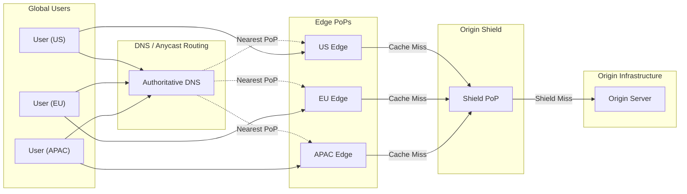

# CDN Architecture and Edge Caching

How Content Delivery Networks reduce latency, protect origins, and scale global traffic distribution. This article covers request routing mechanisms, cache key design, invalidation strategies, tiered caching architectures, and edge compute—with explicit trade-offs for each design choice.

<figure>



<figcaption>CDN request flow: DNS routes users to nearest edge PoP. Cache misses aggregate through origin shield before reaching origin.</figcaption>
</figure>

## Abstract

A CDN (Content Delivery Network) is a geographically distributed cache layer that intercepts requests before they reach the origin. The core trade-off space:

- **Freshness vs. latency**: Longer TTLs improve cache hit ratio but risk serving stale content
- **Cache granularity vs. efficiency**: More cache key variations enable personalization but reduce hit rates
- **Origin protection vs. complexity**: Tiered caching and request collapsing protect origin but add failure modes

The mental model: every CDN decision balances these three tensions. Cache key design determines what gets deduplicated. TTL and invalidation strategy determine how long cached content remains valid. Tiered architecture determines how many requests actually reach origin.

## Request Routing Mechanisms

CDNs route users to the nearest edge Point of Presence (PoP) through one of three mechanisms, each with distinct trade-offs.

### DNS-Based Routing

The authoritative DNS server returns different IP addresses based on the resolver's location. When a user in Tokyo queries `cdn.example.com`, the DNS server returns the IP of the Tokyo PoP.

**How it works:**

1. User's recursive resolver queries authoritative DNS
2. DNS server determines resolver location (via IP geolocation)
3. Returns IP of nearest PoP with shortest TTL (30-60 seconds typical)

**Trade-offs:**

- ✅ Simple to implement, works with any HTTP client
- ✅ Granular control over routing decisions
- ❌ Resolver location ≠ user location (corporate networks, public DNS)
- ❌ DNS TTL limits failover speed (30-60 second propagation)

**Real-world:** AWS CloudFront uses DNS-based routing with 400+ edge locations. Route 53 latency-based routing returns the endpoint with lowest measured latency to the resolver's network.

### Anycast Routing

A single IP address is announced from multiple PoPs via Border Gateway Protocol (BGP). Network routers automatically forward packets to the topologically nearest PoP.

**How it works:**

1. All edge PoPs announce the same IP prefix
2. BGP routing tables propagate across the internet
3. Each router forwards to the "nearest" AS (Autonomous System)

**Trade-offs:**

- ✅ Sub-second failover (BGP convergence, not DNS TTL)
- ✅ DDoS traffic absorbed by nearest PoP, never reaches origin
- ✅ No resolver-location mismatch
- ❌ "Nearest" is network hops, not geographic distance
- ❌ BGP route flapping can cause connection resets

**Real-world:** Cloudflare's entire network (200+ cities, 388+ Tbps capacity) uses Anycast. DNS responses are 2.5× faster than origin servers because queries hit the nearest PoP rather than a centralized resolver.

### HTTP Redirect Routing

Initial request goes to a central router that returns a 302 redirect to the optimal PoP. Rarely used for CDN edge routing but common for internal tier selection.

**Trade-offs:**

- ✅ Application-layer routing decisions (user agent, cookies, etc.)
- ❌ Additional round-trip (redirect latency)
- ❌ Requires client to follow redirects

### Decision Matrix: Routing Mechanisms

| Factor                 | DNS-Based        | Anycast                | HTTP Redirect |
| ---------------------- | ---------------- | ---------------------- | ------------- |
| Failover speed         | 30-60s (DNS TTL) | < 1s (BGP)             | < 1s          |
| DDoS absorption        | Per-PoP          | Automatic distribution | N/A           |
| Implementation         | Simple           | Requires BGP/ASN       | Simple        |
| User location accuracy | Moderate         | High                   | High          |
| Connection persistence | Good             | BGP flaps can reset    | Good          |

## Cache Key Design

The cache key determines which requests share the same cached response. Every request generates a cache key; identical keys serve the same cached content.

### Default Cache Key Components

Most CDNs construct the default cache key from:

```
{protocol}://{host}{path}?{query_string}
```

Two requests to `https://example.com/logo.png` and `https://cdn.example.com/logo.png` create **separate cache entries** despite serving identical content. Host normalization eliminates this duplication.

### Cache Key Customization Options

| Component    | Include                              | Exclude                             | Use Case                           |
| ------------ | ------------------------------------ | ----------------------------------- | ---------------------------------- |
| Host         | Multiple domains, different content  | Multiple domains, same content      | Multi-tenant vs. mirror domains    |
| Protocol     | HTTP/HTTPS serve different content   | Protocol-agnostic content           | Legacy HTTP support vs. HTTPS-only |
| Query string | Pagination, filters                  | Tracking params (`utm_*`, `fbclid`) | Dynamic vs. marketing URLs         |
| Headers      | `Accept-Encoding`, `Accept-Language` | Non-varying headers                 | Content negotiation vs. hit ratio  |
| Cookies      | Session-based content                | Non-personalized content            | Auth state vs. public content      |

### Query String Strategies

**Include all (default):**
`/products?id=123&utm_source=twitter` and `/products?id=123&utm_source=email` are cached separately.

**Allowlist approach:**
Include only `id`, `page`, `sort`. Marketing parameters excluded.

**Denylist approach:**
Exclude `utm_*`, `fbclid`, `gclid`. Everything else included.

**Warning:** Changing cache key configuration can cause 50%+ cache hit ratio drop. New requests use different keys than existing cache entries. Plan migrations during low-traffic windows.

### Header-Based Variation (Vary)

The `Vary` header instructs caches to store separate versions based on request header values.

```http
Vary: Accept-Encoding
```

This creates separate cache entries for:

- `Accept-Encoding: gzip`
- `Accept-Encoding: br`
- `Accept-Encoding: identity`

**Trade-offs:**

- ✅ Serves optimal content per client capability
- ❌ Cache fragmentation reduces hit ratio
- ❌ `Vary: *` effectively disables caching

**Real-world gotcha:** `Vary: User-Agent` creates thousands of cache variants (every browser version = separate entry). Use `Vary: Accept-Encoding` instead, or normalize User-Agent to categories (mobile/desktop) in edge logic.

## TTL Strategies and Trade-offs

Time-to-Live (TTL) determines how long cached content remains fresh. The fundamental tension: longer TTLs improve hit ratio but increase staleness risk.

### TTL Directive Hierarchy

CDNs evaluate freshness in this order (highest priority first):

1. `s-maxage` — shared cache TTL (CDN-specific)
2. `max-age` — general cache TTL
3. `Expires` header — absolute expiration time
4. Heuristic (typically 10% of `Last-Modified` age)

```http
Cache-Control: max-age=300, s-maxage=3600
```

Browser caches for 5 minutes. CDN caches for 1 hour. CDN serves stale-to-browser content while maintaining higher hit ratio at edge.

### TTL Selection by Content Type

| Content Type            | Recommended TTL | Invalidation Strategy           |
| ----------------------- | --------------- | ------------------------------- |
| Static assets (JS, CSS) | 1 year          | Versioned URLs (fingerprinting) |
| Images                  | 1-7 days        | Versioned URLs or soft purge    |
| HTML pages              | 5 min - 1 hour  | Stale-while-revalidate          |
| API responses           | 0-60 seconds    | Short TTL + cache tags          |
| User-specific content   | 0 (private)     | No CDN caching                  |

### Layered TTL Strategy

Different TTLs per cache layer optimize for different concerns:

```http
Cache-Control: max-age=60, s-maxage=3600, stale-while-revalidate=86400
```

- **Browser (max-age=60):** Revalidates every minute, sees fresh content
- **CDN (s-maxage=3600):** Caches for 1 hour, fewer origin requests
- **Stale grace (86400):** Serves stale up to 1 day during revalidation

**Design rationale:** Browsers are single-user caches—frequent revalidation is cheap. CDN serves millions of users—longer TTL dramatically reduces origin load.

### Real-World TTL Example: Netflix

Netflix encodes content to multiple bitrates and stores each as separate files with content-addressable names. TTL is effectively infinite (1 year) because the filename changes when content changes. No invalidation needed—new content = new URL.

## Cache Invalidation Strategies

Invalidation removes or marks cached content as stale. The classic aphorism: "There are only two hard things in computer science: cache invalidation and naming things."

### Hard Purge

Immediately removes content from cache. Next request fetches from origin.

**Mechanism:**

```bash
curl -X PURGE https://cdn.example.com/product/123
```

**Trade-offs:**

- ✅ Immediate freshness guarantee
- ❌ Thundering herd: if cache hit ratio was 98%, purge causes 50× origin load spike
- ❌ Propagation delay across global PoPs (seconds to minutes)

**When to use:** Security incidents (leaked content), legal takedowns, critical errors.

### Soft Purge

Marks content as stale but continues serving while fetching fresh copy.

**Mechanism:**

1. Soft purge marks object stale
2. First request after purge receives stale response
3. CDN asynchronously fetches fresh copy from origin
4. Subsequent requests get fresh content

**Trade-offs:**

- ✅ No origin spike (single revalidation request)
- ✅ Users never see cache miss latency
- ❌ First user after purge sees stale content
- ❌ 30-second to 5-minute staleness window

**When to use:** Routine content updates, non-critical freshness requirements.

**Real-world:** Fastly's soft purge is the default recommendation. Hard purge reserved for emergencies.

### Versioned URLs (Cache Busting)

Include version identifier in URL. Content changes = new URL = new cache entry.

```
/assets/main.a1b2c3d4.js   # Hash of file contents
/assets/main.v2.js         # Manual version number
```

**Trade-offs:**

- ✅ No invalidation needed—old and new versions coexist
- ✅ Atomic deploys: all assets update simultaneously
- ✅ Infinite TTL possible (content never changes at same URL)
- ❌ Requires build pipeline integration
- ❌ HTML must update to reference new URLs

**When to use:** Static assets (JS, CSS, images). Industry standard for production deployments.

### Stale-While-Revalidate (RFC 5861)

Serve stale content while asynchronously revalidating in background.

```http
Cache-Control: max-age=60, stale-while-revalidate=86400
```

**Behavior:**

- 0-60 seconds: Fresh content served, no revalidation
- 60-86460 seconds: Stale content served, background revalidation triggered
- > 86460 seconds: Cache miss, synchronous fetch from origin

**Trade-offs:**

- ✅ Users always see fast response (cached content)
- ✅ Content eventually consistent with origin
- ❌ Not all CDNs support true async revalidation
- ❌ First request after max-age still pays latency cost on some implementations

**CDN support:** CloudFront, Cloudflare, Fastly, Azure CDN. Implementation varies—test actual behavior.

### Stale-If-Error

Serve stale content when origin returns error.

```http
Cache-Control: max-age=60, stale-if-error=86400
```

**Behavior:** If origin returns 5xx or is unreachable, serve stale content up to 86400 seconds old.

**Critical for:** Origin protection during outages. Users see stale content instead of errors.

### Cache Tags (Surrogate Keys)

Tag cached objects with logical identifiers for group invalidation.

```http
Surrogate-Key: product-123 category-electronics featured
```

Purge all objects tagged `category-electronics` with single API call:

```bash
curl -X PURGE -H "Surrogate-Key: category-electronics" https://cdn.example.com/
```

**Trade-offs:**

- ✅ Invalidate logical groups without knowing URLs
- ✅ Single product update invalidates all related pages
- ❌ Tag management complexity
- ❌ Over-tagging leads to cascading purges

**Real-world:** E-commerce sites tag product pages with product ID, category IDs, brand ID. Product price change purges all pages showing that product.

### Decision Matrix: Invalidation Strategies

| Strategy               | Freshness | Origin Protection | Complexity | Use Case                      |
| ---------------------- | --------- | ----------------- | ---------- | ----------------------------- |
| Hard purge             | Immediate | Poor              | Low        | Security incidents            |
| Soft purge             | 30s-5min  | Excellent         | Low        | Routine updates               |
| Versioned URLs         | Instant   | Excellent         | Medium     | Static assets                 |
| Stale-while-revalidate | Eventual  | Good              | Low        | HTML, API responses           |
| Cache tags             | Variable  | Variable          | High       | Complex content relationships |

## Origin Shielding and Tiered Caching

Origin shielding adds an intermediate cache layer between edge PoPs and origin. The goal: reduce origin load by consolidating cache misses.

### How Tiered Caching Works

Without shielding (2-tier):

```
User → Edge PoP → Origin
```

100 PoPs × 100 misses = 10,000 origin requests

With shielding (3-tier):

```
User → Edge PoP → Origin Shield → Origin
```

100 PoPs × 100 misses → 1 shield request → 1 origin request

**Design rationale:** Cache misses from multiple edge PoPs converge at a single shield PoP. The shield absorbs duplicate requests before they reach origin.

### Request Collapsing

Multiple simultaneous requests for the same uncached object are collapsed into a single origin request.

**Without collapsing:**
20 users request `/video/intro.mp4` simultaneously → 20 origin requests

**With collapsing:**
20 users request `/video/intro.mp4` simultaneously → 1 origin request, 19 users wait

**Interaction with shielding:** Up to 4 levels of request consolidation:

1. Browser cache (single user)
2. Edge PoP collapsing (per-PoP)
3. Shield collapsing (across PoPs)
4. Origin-level caching

### Real-World Tiered Architecture: Cloudflare

**Regional Tiered Cache:**

- Lower tier: User-facing edge PoPs (200+ cities)
- Upper tier: Regional shield PoPs (fewer locations, higher cache capacity)
- Origin: Customer infrastructure

**Cache Reserve:** Persistent disk storage at upper tier for long-tail content. RAM cache eviction doesn't mean origin fetch—disk provides second chance.

### Google Media CDN Three-Layer Model

| Layer           | Location            | Purpose                                   |
| --------------- | ------------------- | ----------------------------------------- |
| Deep edge       | ISP networks        | Majority of traffic (popular content)     |
| Peering edge    | Google network edge | Mid-tier, connected to thousands of ISPs  |
| Long-tail cache | Google data centers | Origin shield for rarely-accessed content |

### Shield Location Selection

**Geographic proximity to origin:**

- Lower shield-to-origin latency
- Faster cache fills

**Network topology:**

- Shield in same region as majority of users
- Reduces inter-region traffic costs

**Trade-offs:**

- ✅ Shield in origin region: faster fills, simpler networking
- ✅ Shield in user region: better hit ratio for regional traffic patterns
- ❌ Single shield: single point of failure, capacity bottleneck

**Common pattern:** Multiple shields in different regions, edge PoPs route to nearest shield.

## Edge Compute

Edge compute executes custom logic at CDN PoPs, enabling personalization and security enforcement without origin round-trips.

### Platform Comparison

| Characteristic | Cloudflare Workers    | Lambda@Edge                   | Fastly Compute               |
| -------------- | --------------------- | ----------------------------- | ---------------------------- |
| Runtime        | V8 isolates           | Node.js/Python                | WebAssembly                  |
| Cold start     | 0ms                   | ~50ms                         | Microseconds                 |
| Global PoPs    | 200+ cities           | 400+ locations                | 60+ PoPs                     |
| Memory limit   | 128MB                 | 128MB (viewer), 10GB (origin) | 150MB                        |
| Execution time | 30s (paid)            | 5s (viewer), 30s (origin)     | 120s                         |
| Languages      | JavaScript/TypeScript | JS, Python, Java, Go, C#      | Rust, Go, JS, AssemblyScript |

### Cold Start Implications

**Cloudflare Workers:** V8 isolates share process across requests. No cold start—isolate spins up in <5ms. Memory overhead is 1/10 of full Node.js process.

**Lambda@Edge:** Functions pre-warmed at edge locations. No traditional cold start, but provisioned concurrency has limits. Origin-facing functions have larger memory/time limits.

**Fastly Compute:** WebAssembly instantiation in microseconds via Wasmtime. Every request is isolated for security—no shared state between requests.

### Edge Compute Use Cases

**A/B testing at edge:**

```javascript
// Cloudflare Worker
addEventListener("fetch", (event) => {
  const bucket = Math.random() < 0.5 ? "A" : "B"
  const url = new URL(event.request.url)
  url.pathname = `/${bucket}${url.pathname}`
  event.respondWith(fetch(url))
})
```

No origin involvement—experiment assignment happens at edge.

**Personalization:**

- Geo-based content (currency, language)
- Device-based optimization (image sizing)
- User segment targeting (from cookie/header)

**Security:**

- Bot detection before origin
- Request validation/sanitization
- Rate limiting per client

### Trade-offs: Edge Compute vs. Origin Logic

| Factor       | Edge Compute                  | Origin Logic            |
| ------------ | ----------------------------- | ----------------------- |
| Latency      | 10-30ms                       | 100-400ms               |
| State access | Limited (KV, Durable Objects) | Full database access    |
| Debugging    | More complex (distributed)    | Standard tooling        |
| Cost         | Per-request pricing           | Per-compute pricing     |
| Capabilities | Constrained runtime           | Full language/framework |

**Decision guidance:**

- Edge: Request routing, simple transformations, caching decisions
- Origin: Business logic, database transactions, complex computations

## Multi-CDN Strategies

Multi-CDN distributes traffic across multiple CDN providers for availability, performance, and vendor diversification.

### Architecture Patterns

**Primary/Backup:**

```
Traffic → Primary CDN (100%) → Origin
                ↓ (on failure)
         Backup CDN (failover)
```

**Active-Active:**

```
Traffic → Load Balancer → CDN A (50%)  → Origin
                       → CDN B (50%)
```

**Performance-Based:**

```
Traffic → DNS/Traffic Manager → Fastest CDN for user region → Origin
```

### Health Checking Strategy

Multi-level health checks required:

1. **DNS resolution:** Can we resolve the CDN endpoint?
2. **Network connectivity:** Can we reach the PoP?
3. **HTTP response:** Is the CDN returning expected status codes?
4. **Content integrity:** Is the response content correct (hash check)?
5. **Performance:** Is latency within acceptable bounds?

**Check frequency:** Every 10-30 seconds from multiple geographic locations.

### Failover Timing

| Check Type        | Failure Detection       | Full Failover |
| ----------------- | ----------------------- | ------------- |
| DNS-based         | 30-60s (DNS TTL)        | 1-5 minutes   |
| Anycast           | <1s (BGP)               | 10-30 seconds |
| Active monitoring | 10-30s (check interval) | 30-60 seconds |

### Trade-offs

- ✅ 99.999% availability (single CDN: 99.9% typical)
- ✅ Performance optimization per region
- ✅ Vendor negotiation leverage
- ❌ Cache fragmentation (content split across CDNs)
- ❌ Operational complexity (multiple dashboards, APIs, configs)
- ❌ Cost overhead (management layer + multiple CDN contracts)

**Real-world:** Major streaming platforms (Disney+, HBO Max) use multi-CDN with intelligent traffic steering. Fallback happens within seconds of degradation detection.

## Failure Modes and Edge Cases

### Cache Stampede (Thundering Herd)

**Scenario:** Cache entry expires. Thousands of simultaneous requests all experience cache miss. All hit origin simultaneously.

**Real example (Shopify Black Friday 2019):**

- Product recommendation cache expired at 2:47 AM
- 47,000 concurrent requests hit primary database in 3 seconds
- Database CPU spiked to 98%, response time: 20ms → 4,500ms
- Checkout pages timed out for 8 minutes
- Estimated revenue impact: $10M

**Mitigations:**

1. **Request collapsing:** Only one request goes to origin; others wait
2. **Probabilistic early expiration:** Randomly refresh before TTL (jitter)
3. **Stale-while-revalidate:** Serve stale during refresh
4. **Origin capacity:** Provision for cache-miss scenarios (2-3× baseline)

### Cache Poisoning

**Attack vector:**

1. Attacker sends request with malicious headers/parameters
2. Origin returns error or malformed response based on input
3. CDN caches the poisoned response
4. All subsequent users receive poisoned content

**Cache-Poisoned Denial of Service (CPDoS):**

- Attacker triggers 400/500 error with specific request
- Error page cached (some CDNs cache error responses)
- All users see error page until TTL expires or purge

**Prevention:**

1. **Normalize cache keys:** Strip unexpected headers/params before caching
2. **Don't cache errors:** `Cache-Control: no-store` on error responses
3. **Validate Vary headers:** Don't vary on attacker-controllable inputs
4. **Web Application Firewall:** Block malformed requests at edge

### Origin Overload During Purge

**Scenario:** Global purge of popular content. All PoPs simultaneously request fresh content.

**If normal cache hit ratio is 98%:**

- 1,000,000 requests/minute normally
- 20,000 reach origin (2% miss rate)
- After purge: 1,000,000 requests hit origin
- 50× load spike

**Mitigations:**

1. **Soft purge:** Serve stale while one request refreshes
2. **Regional rollout:** Purge one region at a time
3. **Warm cache first:** Pre-populate cache before purge propagates
4. **Origin autoscaling:** Prepare for post-purge spike

### BGP Route Flapping (Anycast)

**Scenario:** BGP route oscillates between PoPs. User connections reset on each flip.

**Impact:**

- TCP connections interrupted
- TLS sessions terminated
- Long-lived connections (WebSocket, streaming) fail

**Mitigations:**

1. **BGP dampening:** Suppress unstable routes
2. **Session persistence:** Use DNS-based routing for stateful connections
3. **Anycast for UDP:** DNS, some video streaming
4. **Unicast for TCP:** Long-lived connections

## Real-World CDN Implementations

### Netflix Open Connect

**Scale:** 8,000+ custom appliances (OCAs) across 1,000+ ISPs globally.

**Architecture:**

- **Control plane:** Runs in AWS (metadata, routing decisions)
- **Data plane:** OCAs in ISP networks (content delivery)

**Key design decisions:**

1. **Push model with predictive fill:** ML analyzes traffic patterns. If "Stranger Things" is popular in Brazil Friday evenings, content pre-positioned Thursday night during off-peak "fill windows."

2. **ISP embedding:** OCAs deployed inside ISP networks, not at internet exchange points. Traffic never traverses peering links—lowest possible latency.

3. **Content-addressable storage:** Files named by content hash. Infinite TTL, no invalidation needed. New encode = new filename.

**Outcome:** Saved $1.25B in bandwidth costs by 2021.

### Cloudflare

**Scale:** 200+ cities, 95% of internet population within 50ms, 388+ Tbps capacity.

**Architecture:**

1. **Full anycast:** Every PoP announces same IP ranges. No single point of failure.

2. **Tiered cache with Cache Reserve:**
   - L1: Edge PoP RAM cache (hot content)
   - L2: Regional shield RAM cache
   - L3: Cache Reserve persistent storage (long-tail)

3. **Workers at every PoP:** Edge compute runs on same servers as caching. Zero network hop between compute and cache.

**Design rationale:** Cloudflare optimizes for developer experience (Workers) and security (DDoS absorbed by anycast). Caching is foundational but not the only value prop.

### Akamai

**Scale:** 4,100+ edge nodes across 130+ countries.

**Architecture:**

1. **Deep ISP embedding:** Servers deployed inside ISP networks, not just at peering points. 1-2 network hops from end users.

2. **Dynamic Site Acceleration:** Not just static caching—TCP optimization, route optimization, prefetching for dynamic content.

3. **EdgeWorkers:** JavaScript at edge for personalization without origin round-trips.

**Design rationale:** Akamai prioritizes latency above all. Deep ISP deployment means lower hop counts than competitors, critical for real-time applications (gaming, financial services).

### Comparison Summary

| Aspect               | Netflix Open Connect    | Cloudflare              | Akamai              |
| -------------------- | ----------------------- | ----------------------- | ------------------- |
| Deployment model     | ISP-embedded appliances | Anycast PoPs            | ISP-embedded + PoPs |
| Primary optimization | Bandwidth cost          | Security + developer UX | Latency             |
| Caching model        | Push (predictive)       | Pull + tiered           | Pull + DSA          |
| Edge compute         | N/A                     | Workers (V8)            | EdgeWorkers (JS)    |
| Content type         | Video (single tenant)   | General purpose         | General purpose     |

## Monitoring and Observability

### Key Metrics

**Cache Hit Ratio (CHR):**

```
CHR = (Cache Hits) / (Cache Hits + Cache Misses) × 100
```

**Target ranges:**

- Static-heavy sites: 85-95%
- Dynamic sites: 50-70%
- API endpoints: 30-60% (if cacheable at all)

**Warning:** "CHR" can be misleading. Clarify:

- Edge hit ratio vs. shield hit ratio vs. origin hit ratio
- Bytes vs. requests
- Cacheable vs. all traffic

**Time to First Byte (TTFB):**

| Source           | Typical Range | Target |
| ---------------- | ------------- | ------ |
| Edge cache hit   | 10-50ms       | <50ms  |
| Shield cache hit | 50-150ms      | <100ms |
| Origin fetch     | 200-500ms     | <300ms |

**Bandwidth Offload:**

```
Offload = (Bytes served from cache) / (Total bytes served) × 100
```

Different from CHR—a single large video hit offloads more bandwidth than thousands of small image hits.

### Alerting Thresholds

| Metric             | Warning      | Critical      |
| ------------------ | ------------ | ------------- |
| CHR drop           | >5% decrease | >15% decrease |
| Origin 5xx rate    | >0.1%        | >1%           |
| Edge latency p95   | >100ms       | >500ms        |
| Origin latency p95 | >500ms       | >2s           |

### Cache Key Debugging

When hit ratio drops unexpectedly:

1. **Check Vary headers:** New `Vary` header = cache fragmentation
2. **Query string changes:** New tracking params in URLs?
3. **Cache key config changes:** Host normalization removed?
4. **Content changes:** More dynamic content being served?
5. **Traffic pattern shift:** New geography, different popular content?

## Conclusion

CDN architecture centers on three fundamental trade-offs: freshness vs. latency (TTL selection), granularity vs. efficiency (cache key design), and origin protection vs. complexity (tiered caching). Every design decision involves balancing these tensions against your specific requirements.

For static assets, use versioned URLs with long TTLs—invalidation becomes a non-problem. For dynamic content, layer `stale-while-revalidate` with short `s-maxage` to balance freshness with origin protection. Always enable request collapsing and consider origin shielding when operating at scale.

The real-world implementations from Netflix, Cloudflare, and Akamai demonstrate that architectural choices depend heavily on what you're optimizing for: bandwidth cost (Netflix's push model), security and developer experience (Cloudflare's anycast + Workers), or raw latency (Akamai's deep ISP embedding).

## Appendix

### Prerequisites

- HTTP caching fundamentals (Cache-Control headers, ETags)
- DNS resolution basics
- TCP/IP networking concepts
- Basic understanding of distributed systems

### Summary

- **Request routing:** Anycast provides fastest failover; DNS-based offers more control
- **Cache keys:** Normalize aggressively, vary minimally—every variation fragments cache
- **TTL strategy:** Layer browser and CDN TTLs; use `stale-while-revalidate` for HTML
- **Invalidation:** Versioned URLs for assets, soft purge for content, cache tags for relationships
- **Origin protection:** Tiered caching + request collapsing can reduce origin load 10-100×
- **Edge compute:** Use for routing, personalization, security—not business logic

### References

- [RFC 9111: HTTP Caching](https://www.rfc-editor.org/rfc/rfc9111) — Authoritative HTTP caching specification
- [RFC 5861: HTTP Cache-Control Extensions for Stale Content](https://www.rfc-editor.org/rfc/rfc5861) — stale-while-revalidate, stale-if-error
- [Cloudflare CDN Reference Architecture](https://developers.cloudflare.com/reference-architecture/architectures/cdn/) — Tiered caching, Cache Reserve design
- [Fastly Caching Documentation](https://www.fastly.com/documentation/guides/concepts/edge-state/cache/) — Request collapsing, surrogate keys
- [Netflix Open Connect Overview](https://openconnect.netflix.com/Open-Connect-Overview.pdf) — ISP embedding, predictive fill
- [Cloudflare Workers vs Lambda Performance](https://blog.cloudflare.com/serverless-performance-comparison-workers-lambda/) — Edge compute benchmarks
- [Web Caching Explained (web.dev)](https://web.dev/articles/http-cache) — Browser caching interaction with CDN

### Terminology

- **PoP (Point of Presence):** Physical location with CDN servers
- **CHR (Cache Hit Ratio):** Percentage of requests served from cache
- **TTL (Time to Live):** Duration content remains fresh in cache
- **Origin Shield:** Intermediate cache layer protecting origin from edge misses
- **Anycast:** Routing technique where single IP is announced from multiple locations
- **BGP (Border Gateway Protocol):** Protocol for routing between autonomous systems
- **Surrogate Key:** Logical tag for group cache invalidation
