# Circuit Breaker Patterns for Resilient Systems

Circuit breakers prevent cascading failures by failing fast when downstream dependencies are unhealthy. This article examines design choices—threshold-based vs time-window detection, thread pool vs semaphore isolation, per-host vs per-service scoping—along with production configurations from Netflix, Shopify, and modern implementations in Resilience4j.

```mermaid
flowchart LR
    subgraph States["Circuit Breaker States"]
        direction TB
        Closed["🟢 Closed<br/><small>Normal operation</small>"]
        Open["🔴 Open<br/><small>Fast-fail mode</small>"]
        HalfOpen["🟡 Half-Open<br/><small>Testing recovery</small>"]
    end

    Closed -->|"Failure threshold<br/>exceeded"| Open
    Open -->|"Reset timeout<br/>expires"| HalfOpen
    HalfOpen -->|"Probe succeeds"| Closed
    HalfOpen -->|"Probe fails"| Open
```

<figure>



<figcaption>The circuit breaker state machine. Closed allows requests and counts failures. Open rejects immediately. Half-Open tests if recovery is complete.</figcaption>
</figure>

## Abstract

A circuit breaker wraps dependency calls and tracks failure rates. When failures exceed a threshold, the breaker "opens"—subsequent calls fail immediately without attempting the dependency. After a timeout, it enters "half-open" state, allowing probe requests to test recovery. Success closes the circuit; failure reopens it.

The pattern solves a specific problem: **slow failures are worse than fast failures**. A hanging dependency ties up caller threads, exhausts connection pools, and cascades failure upstream. Circuit breakers convert slow failures (timeouts) into fast failures (immediate rejection), preserving caller resources.

**Key design choices:**

- **Detection strategy:** Count-based (last N calls) vs time-based (last N seconds). Count-based is simpler; time-based adapts to traffic variability.
- **Isolation model:** Thread pool (separate threads per dependency, timeout enforced) vs semaphore (shared threads, no timeout). Thread pool adds ~3-9ms latency but enables timeouts.
- **Scope:** Per-service (single breaker for all hosts) vs per-host (separate breakers per instance). Per-host prevents one bad host from blocking all traffic.
- **Half-open behavior:** Single probe vs multiple probes. Single is fragile; multiple adds controlled load during recovery.

The pattern was introduced by Michael Nygard in "Release It!" (2007) and popularized by Netflix's Hystrix. Hystrix is now deprecated in favor of adaptive approaches (Resilience4j, concurrency limits) that don't require manual threshold tuning.

## The Problem: Cascading Failures from Slow Dependencies

Without circuit breakers, a slow or failing dependency can cascade failure to its callers.

### Resource Exhaustion Chain

```
Scenario: Database becomes slow (10s response time)

Service A (caller):
├─ Thread pool: 100 threads
├─ Timeout: 30s (misconfigured)
├─ Normal throughput: 1000 req/s

After database slowdown:
├─ Each request holds a thread for 10s
├─ 100 threads / 10s = 10 req/s capacity
├─ 99% of requests queue or fail
├─ Service A becomes slow → cascades to its callers
```

The problem compounds: Service A's callers wait for A, exhausting their thread pools, cascading further. A single slow database can take down an entire service mesh.

### Why Retries Make It Worse

Callers often retry failed requests. Without backoff or budgets, retries amplify load on an already struggling dependency:

```
Normal: 100 req/s to dependency
Dependency fails: 100 req/s × 3 retries = 300 req/s
Dependency under more load → more failures → more retries
```

Circuit breakers break this feedback loop by stopping calls entirely when failure is likely.

## State Machine Mechanics

### Closed State

Normal operation. Requests pass through to the dependency. The breaker tracks failures using a sliding window (by count or time).

```ts title="closed-state.ts" collapse={1-3, 20-25}
// Simplified closed state logic
type CircuitBreakerState = {
  failures: number
  successes: number
  lastFailureTime: number
}

function onRequestComplete(
  state: CircuitBreakerState,
  success: boolean,
  threshold: number
): 'CLOSED' | 'OPEN' {
  if (success) {
    state.successes++
    return 'CLOSED'
  }

  state.failures++
  state.lastFailureTime = Date.now()

  const total = state.failures + state.successes
  const failureRate = state.failures / total

  if (total >= 10 && failureRate >= threshold) {
    return 'OPEN' // Trip the circuit
  }
  return 'CLOSED'
}
```

**Volume threshold matters:** A circuit that opens after 2 failures in 2 requests would flap constantly. Production implementations require a minimum request volume (e.g., 10-20 requests) before evaluating the threshold.

### Open State

Fast-fail mode. Requests are rejected immediately without calling the dependency. This:
- Preserves caller resources (no threads blocked waiting)
- Gives the dependency time to recover
- Provides fast feedback to upstream callers

The breaker stays open for a configured duration (reset timeout), typically 5-60 seconds.

### Half-Open State

After the reset timeout, the breaker allows limited probe requests to test if the dependency has recovered.

**Single probe (Hystrix default):**
- One request passes through
- Success → Close circuit
- Failure → Reopen circuit

**Multiple probes (Resilience4j):**
- Configurable number of requests allowed (e.g., 10)
- Evaluate success rate of probes
- Close only if success rate exceeds threshold

**Design rationale for multiple probes:** A single request is a noisy signal. Network hiccups, cold starts, or unlucky routing can cause one request to fail even if the service is healthy. Multiple probes provide statistical confidence.

## Detection Strategies

### Count-Based Sliding Window

Track the outcome of the last N requests regardless of time.

```
Window size: 10 requests
Failure threshold: 50%

Request history: [✓, ✗, ✓, ✗, ✗, ✗, ✓, ✗, ✗, ✓]
Failures: 6/10 = 60% → Trip circuit
```

**Implementation:** Circular buffer of size N. O(1) time per request, O(N) memory per dependency.

**Best when:**
- Traffic is consistent and predictable
- You want behavior that's independent of request rate
- Simpler reasoning about when circuit trips

**Trade-off:** During low traffic, the window may span hours. Old failures influence current decisions even if the dependency recovered.

### Time-Based Sliding Window

Track outcomes within the last N seconds.

```
Window: 10 seconds
Failure threshold: 50%

Requests in last 10s: 100
Failures in last 10s: 60
Failure rate: 60% → Trip circuit
```

**Implementation:** Aggregate statistics per bucket (e.g., 1-second buckets). Total window = sum of buckets. O(1) time per request, O(window_size / bucket_size) memory.

**Best when:**
- Traffic varies significantly (bursty, daily patterns)
- You want the circuit to adapt to recent conditions
- High-traffic services where count-based window refreshes too quickly

**Trade-off:** During traffic lulls, few requests may trip the circuit on small samples. Minimum throughput threshold mitigates this.

### Resilience4j's Sliding Window

Resilience4j (the modern JVM standard) supports both strategies:

```java
CircuitBreakerConfig config = CircuitBreakerConfig.custom()
    // Count-based: trip after 5 failures in last 10 calls
    .slidingWindowType(SlidingWindowType.COUNT_BASED)
    .slidingWindowSize(10)
    .failureRateThreshold(50)

    // OR time-based: trip after 50% failures in last 10 seconds
    .slidingWindowType(SlidingWindowType.TIME_BASED)
    .slidingWindowSize(10) // seconds
    .failureRateThreshold(50)

    // Minimum requests before evaluating
    .minimumNumberOfCalls(5)
    .build();
```

**Performance characteristics:**
- Snapshot retrieval: O(1) time (pre-aggregated, not computed on access)
- Memory: O(window_size) for count-based, O(buckets) for time-based
- Thread safety: Atomic operations with synchronized sliding window access

### Slow Call Detection

Resilience4j can open the circuit proactively when calls are slow, even before they fail:

```java
CircuitBreakerConfig.custom()
    .slowCallRateThreshold(50) // 50% of calls are slow
    .slowCallDurationThreshold(Duration.ofSeconds(2))
    .build();
```

**Design rationale:** Slow calls often precede failures. A database under load responds slowly before timing out. Opening the circuit on slowness preserves caller resources before the situation worsens.

## Isolation Models

Isolation determines how the circuit breaker protects caller resources from slow dependencies.

### Thread Pool Isolation

Each dependency gets its own thread pool. Requests execute on dedicated threads, not the caller's thread.

```
Caller thread → Submit to pool → Dependency thread handles request
                                         ↓
                    Timeout enforced ← Future.get(timeout)
```

**Netflix Hystrix's approach:**
- Separate thread pool per `HystrixCommand`
- Default pool size: 10 threads per dependency
- Timeout enforced via `Future.get(timeout)`

**Performance cost (Netflix production data):**
- 90th percentile latency addition: ~3ms
- 99th percentile latency addition: ~9ms

Netflix deemed this acceptable:

> "The cost is minor enough to not have major cost or performance impact."
> — Netflix Hystrix Wiki

**Benefits:**
- ✅ Timeout enforcement: Can interrupt stuck calls
- ✅ Strong isolation: Slow dependency A can't consume threads needed for B
- ✅ Concurrent limits: Pool size caps concurrent calls per dependency

**Trade-offs:**
- ❌ Thread handoff overhead (~3-9ms)
- ❌ Context switching cost
- ❌ Queue management complexity
- ❌ Memory footprint (threads per pool × pools)

### Semaphore Isolation

Limit concurrent calls via semaphore; requests execute on caller's thread.

```
Caller thread → Acquire semaphore → Call dependency on same thread
                     ↓
              If unavailable → Reject immediately
```

**Implementation:**

```ts title="semaphore-isolation.ts" collapse={1-2, 20-25}
// Semaphore isolation pattern
class SemaphoreIsolation {
  private permits: number
  private maxPermits: number

  constructor(maxConcurrent: number) {
    this.permits = maxConcurrent
    this.maxPermits = maxConcurrent
  }

  async execute<T>(fn: () => Promise<T>): Promise<T> {
    if (this.permits <= 0) {
      throw new Error('Semaphore exhausted')
    }

    this.permits--
    try {
      return await fn() // Runs on caller's thread
    } finally {
      this.permits++
    }
  }
}
```

**Benefits:**
- ✅ No thread overhead
- ✅ Lower latency (no queue/handoff)
- ✅ Simpler implementation

**Trade-offs:**
- ❌ No timeout enforcement (can't interrupt blocked thread)
- ❌ Slow calls block caller threads
- ❌ Less isolation than thread pool

### When to Use Each

| Factor | Thread Pool | Semaphore |
|--------|-------------|-----------|
| **Dependency reliability** | Unreliable, may hang | Reliable, predictable latency |
| **Timeout requirement** | Must enforce timeouts | Timeouts at network layer sufficient |
| **Latency sensitivity** | Can tolerate 3-9ms overhead | Sub-millisecond required |
| **Call volume** | < 1000/s per dependency | > 1000/s, high-throughput |
| **Call type** | Network I/O, remote services | In-memory, local computation |

**Netflix's recommendation:**
- Default: Thread pool isolation for `HystrixCommand`
- Semaphore: Only for "extremely high-volume calls" (hundreds per second per instance) where overhead matters

### Bulkhead vs Circuit Breaker

Circuit breakers and bulkheads are complementary:

- **Bulkhead:** Isolates resources (thread pools, connections) to prevent one dependency from exhausting shared capacity
- **Circuit breaker:** Detects dependency health and stops calling unhealthy dependencies

**Together:** Bulkhead (thread pool) limits concurrent calls to 20. Circuit breaker (failure detection) opens when 50% of those calls fail. The bulkhead prevents resource exhaustion while the circuit breaker provides fast-fail.

## Scoping Strategies

### Per-Service Circuit Breaker

One breaker for all calls to a logical service, regardless of which host handles the request.

```
Service A → Circuit Breaker → Load Balancer → [Host 1, Host 2, Host 3]
                                                    ↑
                                            One bad host affects
                                            circuit for all hosts
```

**When appropriate:**
- Infrastructure failures affect all hosts equally (network partition, DNS failure)
- Hosts are homogeneous and share fate
- Simpler configuration and debugging

**The problem:** With client-side load balancing, one bad host may not trip the circuit:

```
3 hosts, 1 failing
Requests distributed: 33% fail (1 host), 67% succeed (2 hosts)
Failure threshold: 50%
Result: Circuit stays closed, 33% of requests fail continuously
```

### Per-Host Circuit Breaker

Separate breaker for each host/instance of a service.

```
Service A → [CB for Host 1] → Host 1
          → [CB for Host 2] → Host 2
          → [CB for Host 3] → Host 3
```

**Benefits:**
- ✅ Single bad host doesn't poison the entire service
- ✅ Fine-grained control and visibility
- ✅ Works with client-side load balancing

**Trade-offs:**
- ❌ More circuit breaker instances to manage
- ❌ Requires service discovery integration
- ❌ Health state per instance adds memory

### Hybrid Approach

For sophisticated systems, chain multiple breakers:

```
Service A → Per-Service CB → Retry → Per-Host CB → Host
            (catastrophic)             (host-level)
```

- **Per-host:** Opens when a specific host fails. Traffic routes to other hosts.
- **Per-service:** Opens only when most/all hosts are unhealthy. Protects against service-wide failures.

**Design guidance:**

> "Consider how and why your upstream service could fail and then use the simplest possible configuration for your situation."
> — Azure Architecture Patterns

## Real-World Implementations

### Netflix Hystrix (Deprecated but Influential)

Hystrix established patterns that persist across modern implementations.

**Core design:**
- Command pattern: Each dependency call wrapped in `HystrixCommand`
- Thread pool isolation by default
- Request collapsing: Batch simultaneous requests
- Request caching: Deduplicate within request context

**Default configuration:**

```java
// Hystrix defaults (for reference)
circuitBreaker.requestVolumeThreshold = 20    // Min requests before evaluation
circuitBreaker.errorThresholdPercentage = 50  // Error rate to trip
circuitBreaker.sleepWindowInMilliseconds = 5000  // Time in Open
metrics.rollingStats.timeInMilliseconds = 10000  // Metrics window
```

**Why deprecated:** Netflix shifted toward adaptive approaches:

> "Netflix will no longer actively review issues, merge pull-requests, and release new versions of Hystrix... We recommend resilience4j for new projects."
> — Hystrix README

The shift reflects a broader industry move from static thresholds to adaptive systems that respond to real-time conditions.

### Resilience4j (Current JVM Standard)

Lightweight, decorator-based alternative to Hystrix.

**Architecture:**
- Functional composition: Decorate any function with resilience behaviors
- Modular: Pick only what you need (CircuitBreaker, Retry, RateLimiter, Bulkhead)
- Reactive support: Native Reactor and RxJava operators

**Six states:**
- `CLOSED`: Normal operation
- `OPEN`: Rejecting requests
- `HALF_OPEN`: Testing recovery
- `DISABLED`: Always allow, no metrics
- `METRICS_ONLY`: Always allow, track metrics
- `FORCED_OPEN`: Force rejection (for testing/maintenance)

**Configuration example:**

```java
CircuitBreakerConfig config = CircuitBreakerConfig.custom()
    .slidingWindowType(SlidingWindowType.COUNT_BASED)
    .slidingWindowSize(100)
    .minimumNumberOfCalls(10)
    .failureRateThreshold(50)
    .slowCallRateThreshold(50)
    .slowCallDurationThreshold(Duration.ofSeconds(2))
    .waitDurationInOpenState(Duration.ofSeconds(30))
    .permittedNumberOfCallsInHalfOpenState(10)
    .automaticTransitionFromOpenToHalfOpenEnabled(true)
    .build();
```

**Key improvements over Hystrix:**
- Configurable half-open probes (not just one)
- Slow call detection (proactive tripping)
- Lower overhead (no thread pools required)
- Better integration with reactive streams

### Shopify Semian (Ruby)

Shopify's open-source circuit breaker with bulkhead isolation.

**Critical discovery (2014):** Shopify found that naive circuit breaker configuration can *worsen* availability:

> "When Shopify started introducing circuit breakers and bulkheads to production in 2014 they severely underestimated how difficult they are to configure."
> — Shopify Engineering

**The problem:** During half-open testing, requests used the standard timeout (250ms). With 42 Rails workers, testing recovery required:

```
42 workers × 250ms timeout = 10.5 seconds of worker time per probe cycle
Required utilization: 263% (impossible → constant oscillation)
```

**The fix:** Separate timeout for half-open probes:

```ruby
Semian.register(
  :external_service,
  circuit_breaker: true,
  bulkhead: true,
  success_threshold: 2,      # Consecutive successes to close
  error_threshold: 3,        # Consecutive failures to open
  error_timeout: 30,         # Seconds before half-open
  half_open_resource_timeout: 0.050  # 50ms timeout for probes (not 250ms!)
)
```

**Result:** Required utilization dropped from 263% to 4%.

**Key insights:**
- Half-open timeout should be much shorter than normal timeout
- Success threshold prevents flip-flopping (require consecutive successes)
- Monitor circuit breaker state transitions, not just metrics

### Sony gobreaker (Go)

Simple, stateful circuit breaker for Go applications.

```go
settings := gobreaker.Settings{
    Name:        "external-service",
    MaxRequests: 3,           // Max requests when half-open
    Interval:    10 * time.Second,  // Cyclic period for clearing counts
    Timeout:     30 * time.Second,  // Duration of open state
    ReadyToTrip: func(counts gobreaker.Counts) bool {
        failureRatio := float64(counts.TotalFailures) / float64(counts.Requests)
        return counts.Requests >= 3 && failureRatio >= 0.6
    },
    OnStateChange: func(name string, from, to gobreaker.State) {
        log.Printf("Circuit %s: %s -> %s", name, from, to)
    },
}

cb := gobreaker.NewCircuitBreaker(settings)

result, err := cb.Execute(func() (interface{}, error) {
    return callExternalService()
})
```

**Design notes:**
- `ReadyToTrip` callback allows custom tripping logic
- `Interval` for rolling window (counts cleared periodically)
- `OnStateChange` hook for monitoring and alerting

## Configuration Guidelines

### Tuning Parameters

| Parameter | Too Low | Too High | Guidance |
|-----------|---------|----------|----------|
| **Failure threshold** | Flapping on transient errors | Slow detection of real failures | 40-60% typical; lower for critical paths |
| **Volume threshold** | Trips on small samples | Delayed detection | 10-20 requests minimum |
| **Reset timeout** | Probes during ongoing failure | Delayed recovery detection | 5-60 seconds; consider dependency recovery time |
| **Half-open probes** | False negatives from noise | Load during recovery | 3-10 probes; enough for confidence |

### Error Classification

Not all errors should count toward the failure threshold:

| Error Type | Count as Failure? | Rationale |
|------------|-------------------|-----------|
| **5xx Server Error** | Yes | Dependency has a problem |
| **Timeout** | Yes | Dependency is slow or unresponsive |
| **Connection refused** | Yes | Dependency is down |
| **4xx Client Error** | No | Request was invalid, not dependency fault |
| **Circuit breaker rejection** | No | Would create feedback loop |

Configure which exceptions count:

```java
// Resilience4j error classification
CircuitBreakerConfig.custom()
    .recordExceptions(IOException.class, TimeoutException.class)
    .ignoreExceptions(BusinessException.class)
    .build();
```

### Fallback Strategies

When the circuit is open, what should the caller do?

| Strategy | Description | Best For |
|----------|-------------|----------|
| **Cached data** | Return stale cached response | Read paths, non-critical data |
| **Default value** | Return static default | Feature toggles, configuration |
| **Degraded mode** | Partial functionality | Non-essential features |
| **Fail fast** | Return error immediately | Critical operations where stale data is dangerous |
| **Alternative service** | Route to backup dependency | High-availability requirements |

**Critical design rule:** Fallback must not depend on the same failure. If the primary database is down, falling back to a read replica on the same cluster may fail identically.

## Integration Patterns

### With Retries

Circuit breakers and retries are complementary but ordering matters:

```
Option 1: Retry outside circuit breaker
[Retry] → [Circuit Breaker] → Dependency

- Retry sees circuit breaker rejection as failure
- Circuit stays closed longer (retry exhausts before giving up)
- Risk: Retries keep hammering a failing dependency

Option 2: Circuit breaker outside retry (recommended)
[Circuit Breaker] → [Retry] → Dependency

- Circuit breaker counts retry outcomes
- Multiple retries that all fail = one circuit breaker failure
- Circuit opens faster when retries can't recover
```

**Best practice:** Place circuit breaker at the outermost layer:

```ts title="integration.ts" collapse={1-5, 25-35}
// Recommended order: Circuit Breaker → Retry → Timeout → Call
import { circuitBreaker, retry, timeout } from 'resilience-lib'

async function callWithResilience<T>(
  fn: () => Promise<T>
): Promise<T> {
  return circuitBreaker.execute(async () => {
    return retry.execute(async () => {
      return timeout.execute(fn, 5000)
    }, { maxRetries: 3, backoff: 'exponential' })
  })
}

// The circuit breaker sees the final outcome after retries exhausted
// If retries consistently fail → circuit opens
// If retries succeed → circuit stays closed
```

### With Bulkheads

Thread pool bulkheads provide isolation; circuit breakers provide fast-fail:

```
[Bulkhead (thread pool)] → [Circuit Breaker] → Dependency
         ↓                          ↓
   Limits concurrent         Stops calling when
   calls to 20               failure rate high
```

Without both:
- Bulkhead alone: 20 threads blocked indefinitely on slow dependency
- Circuit breaker alone: All caller threads can be consumed before circuit opens

Together: Bulkhead limits blast radius; circuit breaker detects failure and stops attempting.

### With Load Shedding

During overload, combine circuit breakers with admission control:

```
[Rate Limiter] → [Circuit Breaker] → [Load Shedding] → Dependency
      ↓                  ↓                   ↓
 Cap request rate   Fast-fail on         Reject excess
                    dependency failure   at dependency
```

Circuit breakers protect against dependency failure. Rate limiters protect against caller abuse. Load shedding protects against overload. Each has a distinct role.

## Observability

### Metrics to Track

| Metric | Description | Alert Threshold |
|--------|-------------|-----------------|
| `circuit_state` | Current state (closed/open/half-open) | Alert on open > N minutes |
| `circuit_failure_rate` | Rolling failure rate | Warn at 30%, critical at 50% |
| `circuit_slow_call_rate` | Rolling slow call rate | Depends on SLA |
| `circuit_state_transitions` | State change count | Alert on high flip-flop rate |
| `circuit_calls_in_half_open` | Probe requests attempted | Monitor recovery testing |
| `circuit_buffered_calls` | Calls waiting in queue | Alert on queue growth |

### State Transition Alerts

```
Alert: Circuit Breaker Opened
Dependency: payment-service
Reason: Failure rate 62% (threshold 50%)
Window: 100 calls in last 60 seconds
Previous state: CLOSED for 4h32m

Action: Check payment-service health
Dashboard: https://grafana/payment-service
Runbook: https://wiki/circuit-breaker-runbook
```

**Alert on flip-flopping:** Multiple open→close transitions in short periods indicate:
- Marginal failure rate (oscillating around threshold)
- Misconfigured thresholds
- Underlying intermittent issue

### Dashboard Components

Production circuit breaker dashboards should include:

1. **State timeline:** Visual representation of state over time
2. **Failure rate graph:** Rolling failure rate vs threshold
3. **Request volume:** Calls per second through the breaker
4. **Latency percentiles:** p50, p95, p99 of successful calls
5. **Rejection rate:** Percentage of calls rejected by open circuit

## Common Pitfalls

### 1. Circuit Breaker That Never Opens

**The mistake:** Volume threshold too high or traffic too low to trigger.

**Why it happens:** Default thresholds (e.g., 20 requests) may never be reached on low-traffic paths.

**The consequence:** Circuit breaker provides no protection; might as well not exist.

**The fix:** Set volume threshold based on actual traffic. For low-traffic endpoints, use lower thresholds or time-based windows.

### 2. Half-Open Thundering Herd

**The mistake:** Many instances probe simultaneously when reset timeout expires.

**Why it happens:** All instances opened their circuits at approximately the same time.

**The consequence:** Recovering dependency hit with burst of probe requests, potentially failing again.

**The fix:** Add jitter to reset timeout. Stagger when instances enter half-open state.

```java
// Add jitter to reset timeout
Duration baseTimeout = Duration.ofSeconds(30);
Duration jitter = Duration.ofMillis(random.nextInt(5000)); // 0-5 seconds
Duration actualTimeout = baseTimeout.plus(jitter);
```

### 3. Cascading Circuit Breaker Failures

**The mistake:** Circuit breaker A protects service that depends on service B. A's circuit opens because B is slow. A returns fast failures. A's callers see "success" (fast response) and don't open their circuits.

**Why it happens:** Fast failure from an open circuit may be interpreted as "working" by callers.

**The consequence:** Upstream circuits don't open, continuing to send traffic that will fail.

**The fix:** Propagate circuit breaker state or error codes. Callers should recognize "circuit open" as a failure type that may warrant their own circuit opening.

### 4. Testing Only Sunny-Day Scenarios

**The mistake:** Circuit breaker logic untested under failure conditions.

**Why it happens:** Difficult to simulate dependency failures in integration tests.

**The consequence:** First real failure exposes misconfigurations—wrong thresholds, broken fallbacks, missing metrics.

**The fix:** Chaos testing. Inject failures in staging/production to verify circuit breakers behave as expected:

```java
// Force circuit open for testing
circuitBreaker.transitionToForcedOpenState();

// Verify fallback executes
Result result = callWithFallback();
assert result.isFromFallback();

// Verify metrics emitted
assert metrics.getCircuitOpenCount() > 0;
```

### 5. Ignoring Cold Start

**The mistake:** No special handling for application startup when circuit breaker has no history.

**Why it happens:** Cold circuit breaker may trip on first few failures before building a baseline.

**The consequence:** Transient startup failures (dependency warming up) open circuits unnecessarily.

**The fix:** Minimum call threshold before evaluating failure rate:

```java
// Require 10 calls before circuit can trip
CircuitBreakerConfig.custom()
    .minimumNumberOfCalls(10)
    .build();
```

## Conclusion

Circuit breakers convert slow failures into fast failures, preserving resources and enabling graceful degradation. The key decisions are:

1. **Detection:** Choose count-based for consistent traffic, time-based for variable loads
2. **Isolation:** Thread pool for unreliable dependencies needing timeouts, semaphore for low-latency paths
3. **Scope:** Per-host for fine-grained isolation, per-service for simplicity
4. **Half-open:** Multiple probes for statistical confidence, with shorter timeouts than normal calls

Modern implementations (Resilience4j) favor adaptive approaches over static thresholds—measuring actual latency and adjusting behavior dynamically. Regardless of implementation, the principle remains: detect failure fast, fail fast, and give dependencies time to recover.

## Appendix

### Prerequisites

- Distributed systems fundamentals (failure modes, cascading failures)
- Thread pool and concurrency concepts
- Familiarity with retry patterns and backoff strategies

### Terminology

- **CB (Circuit Breaker):** The pattern itself, or a library implementing it
- **Trip:** Transition from closed to open state
- **Reset timeout:** Duration the circuit stays open before half-open
- **Probe:** Request allowed through during half-open state to test recovery
- **Sliding window:** Rolling view of recent requests for failure rate calculation

### Summary

- Circuit breakers prevent cascading failures by failing fast when dependencies are unhealthy
- Three states: Closed (normal), Open (fast-fail), Half-Open (testing recovery)
- Count-based windows track last N calls; time-based windows track last N seconds
- Thread pool isolation enables timeouts but adds 3-9ms overhead; semaphore is faster but can't interrupt
- Per-host circuit breakers prevent one bad instance from poisoning all traffic
- Shopify's key insight: half-open probes need much shorter timeouts than normal calls
- Monitor state transitions, not just metrics—flip-flopping indicates misconfiguration
- Test circuit breakers under failure conditions; sunny-day tests don't validate resilience

### References

- Nygard, Michael. "Release It! Design and Deploy Production-Ready Software" (2007) - Original circuit breaker pattern definition
- Fowler, Martin. [Circuit Breaker](https://martinfowler.com/bliki/CircuitBreaker.html) - Pattern explanation and implementation guidance
- Netflix. [Hystrix Wiki: How It Works](https://github.com/Netflix/Hystrix/wiki/How-it-Works) - Thread pool isolation, metrics, original implementation
- Resilience4j. [CircuitBreaker Documentation](https://resilience4j.readme.io/docs/circuitbreaker) - Modern sliding window implementation
- Shopify Engineering. [Circuit Breaker Misconfigured](https://shopify.engineering/circuit-breaker-misconfigured) - Production configuration lessons
- Azure Architecture. [Circuit Breaker Pattern](https://learn.microsoft.com/en-us/azure/architecture/patterns/circuit-breaker) - Per-host vs per-service guidance
- Sony. [gobreaker](https://github.com/sony/gobreaker) - Go circuit breaker implementation
- AWS Builders' Library. [Timeouts, Retries, and Backoff with Jitter](https://aws.amazon.com/builders-library/timeouts-retries-and-backoff-with-jitter/) - Integration with retry patterns
