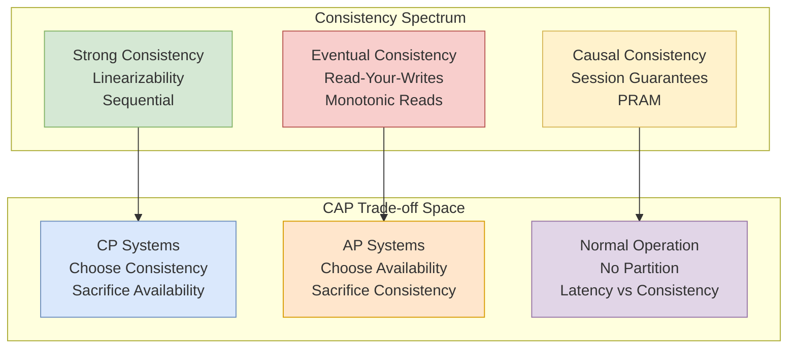

# Consistency Models and the CAP Theorem

Understanding consistency guarantees in distributed systems: from the theoretical foundations of CAP to practical consistency models, their trade-offs, and when to choose each for production systems.

<figure>



<figcaption>The consistency spectrum mapped to CAP trade-offs: stronger consistency typically requires partition intolerance or reduced availability</figcaption>

</figure>

## Abstract

The CAP theorem establishes that during a network partition, a distributed system must choose between consistency (C) and availability (A)—it cannot provide both. However, CAP is often misunderstood: partitions are rare, and the more practical trade-off during normal operation is between **consistency and latency** (PACELC theorem).

**The mental model:**

- **Consistency** isn't binary—it's a spectrum from linearizability (strongest) to eventual consistency (weakest)
- **CAP applies only during partitions**—most systems spend >99.9% of time partition-free
- **PACELC captures the real trade-off**—when no partition (E), choose between latency (L) and consistency (C)
- **Tunable consistency** lets you choose per-operation, not per-system
- **Session guarantees** (read-your-writes, monotonic reads) often provide sufficient consistency for applications without the cost of strong consistency

**Key insight:** The choice isn't "CP or AP"—it's understanding which consistency guarantees your application actually needs and at what cost.

## The CAP Theorem

### Brewer's Conjecture to Formal Theorem

Eric Brewer presented the CAP principle at PODC 2000, conjecturing that a distributed system cannot simultaneously provide Consistency, Availability, and Partition Tolerance. In 2002, Seth Gilbert and Nancy Lynch [formally proved this conjecture](https://groups.csail.mit.edu/tds/papers/Gilbert/Brewer2.pdf), establishing it as a theorem.

The proof uses a simple construction: consider two nodes that cannot communicate (partitioned). If a client writes to one node and reads from the other, the system must either:

1. Return potentially stale data (sacrifice consistency for availability)
2. Block the read until partition heals (sacrifice availability for consistency)

### Precise Definitions

The formal definitions from Gilbert and Lynch are more restrictive than commonly understood:

**Consistency (Linearizability):** "Any read operation that begins after a write operation completes must return that value, or the result of a later write operation." This is specifically linearizability—the strongest consistency model—not weaker models like eventual consistency.

**Availability:** "Every request received by a non-failing node in the system must result in a response." This means every non-failing node must respond, not just "most requests succeed."

**Partition Tolerance:** "The network will be allowed to lose arbitrarily many messages sent from one node to another." Any realistic distributed system must tolerate partitions—networks fail.

### What CAP Actually Says

CAP doesn't mean "pick two of three." Since partitions are unavoidable in distributed systems, the real choice is:

- **During a partition:** Choose CP (consistency, reject requests) or AP (availability, allow stale reads)
- **When no partition:** Both C and A are achievable

As Brewer clarified in his [2012 retrospective](https://www.infoq.com/articles/cap-twelve-years-later-how-the-rules-have-changed/): "The '2 of 3' formulation was always misleading because it tended to oversimplify the tensions."

### Common Misconceptions

**Misconception 1: CAP applies all the time.**
Reality: CAP only constrains behavior during partitions. Most systems experience partitions infrequently—Google reports partition events lasting seconds to minutes occurring a few times per year in well-engineered systems.

**Misconception 2: You must choose CP or AP globally.**
Reality: Different operations can make different trade-offs. A banking system might be CP for balance updates but AP for viewing transaction history.

**Misconception 3: Eventual consistency means "no consistency."**
Reality: Eventual consistency is a specific guarantee—given no new updates, all replicas eventually converge. It's not "anything goes."

## PACELC: Beyond CAP

### The Consistency-Latency Trade-off

[Daniel Abadi proposed PACELC](https://www.cs.umd.edu/~abadi/papers/abadi-pacelc.pdf) in 2010 to capture a trade-off CAP ignores: during normal operation (no partition), systems must still choose between **latency** and **consistency**.

**PACELC states:** If there is a Partition (P), choose between Availability (A) and Consistency (C); Else (E), even when operating normally, choose between Latency (L) and Consistency (C).

This explains why systems sacrifice consistency even when partitions aren't occurring—coordination takes time.

### The Four PACELC Configurations

| Configuration | During Partition | Normal Operation | Example Systems |
|---------------|------------------|------------------|-----------------|
| **PA/EL** | Availability | Latency | Cassandra (default), DynamoDB (eventual reads) |
| **PA/EC** | Availability | Consistency | MongoDB (default) |
| **PC/EL** | Consistency | Latency | PNUTS, Cosmos DB (bounded staleness) |
| **PC/EC** | Consistency | Consistency | Spanner, CockroachDB, traditional RDBMS |

**PA/EL** systems optimize for performance in both scenarios, accepting weaker consistency. These dominate high-throughput, latency-sensitive workloads.

**PC/EC** systems never compromise consistency, accepting higher latency and reduced availability. Financial systems and coordination services typically require this.

### Why PACELC Matters More in Practice

Partitions are rare. Network redundancy, careful datacenter design, and robust networking mean most production systems experience partitions for minutes per year. The latency-consistency trade-off affects every single request.

Consider replication: synchronous replication (wait for replicas) provides strong consistency but adds latency equal to the slowest replica's response time. Asynchronous replication returns immediately but allows stale reads.

## The Consistency Spectrum

Consistency isn't binary—it's a hierarchy of models with different guarantees and costs.

### Strong Consistency Models

#### Linearizability

**Definition:** Operations appear to execute atomically at some point between their invocation and completion. All clients see the same ordering of operations.

**Mechanism:** Typically requires single-leader architecture or consensus protocols (Paxos, Raft) for coordination.

**Trade-offs:**

- ✅ Simplest to reason about—behaves like a single-threaded system
- ✅ Required for distributed locks, leader election, unique constraints
- ❌ Highest latency—requires cross-replica coordination
- ❌ Reduced availability during partitions—must sacrifice A to maintain C

**Real-world:** Google Spanner achieves linearizability across global datacenters using TrueTime. The [2012 Spanner paper](https://research.google.com/archive/spanner-osdi2012.pdf) describes how GPS and atomic clocks provide bounded clock uncertainty (typically <7ms), enabling a "commit wait" mechanism that ensures linearizable transactions without always requiring synchronous coordination.

#### Sequential Consistency

**Definition:** Operations from each process appear in program order, but there's no real-time constraint on the global ordering across processes. Defined by [Lamport in 1979](https://lamport.azurewebsites.net/pubs/multi.pdf).

**Mechanism:** Maintains per-client ordering without requiring global synchronization.

**Trade-offs:**

- ✅ Lower latency than linearizability
- ✅ Preserves intuitive per-client ordering
- ❌ Different clients may observe operations in different orders
- ❌ Can't implement distributed locks correctly

**When to use:** Systems where clients care about their own operation ordering but don't need real-time guarantees about other clients' operations.

### Causal Consistency

**Definition:** Operations that are causally related must be seen by all processes in the same order. Concurrent (non-causally-related) operations may be seen in different orders. [Defined by Hutto and Ahamad in 1990](https://en.wikipedia.org/wiki/Causal_consistency).

**Mechanism:** Tracks causal dependencies (often via vector clocks or hybrid logical clocks) and ensures dependent operations are ordered.

**Trade-offs:**

- ✅ Available under partition (unlike linearizability)
- ✅ Matches programmer intuition about causality
- ✅ Lower coordination overhead than strong consistency
- ❌ Concurrent operations may diverge across replicas
- ❌ Requires dependency tracking overhead

**Real-world:** Slack uses [hybrid logical clocks](https://www.cockroachlabs.com/blog/living-without-atomic-clocks/) for message ordering. Physical timestamps alone caused message reordering with 50ms+ clock skew; HLCs preserve causal ordering while tolerating clock drift.

### Session Guarantees

These are practical guarantees that provide useful consistency within a client session without requiring system-wide coordination. [Defined by Terry et al.](https://www.cs.cornell.edu/courses/cs734/2000FA/cached%20papers/SessionGuaranteesPDIS_1.html)

#### Read-Your-Writes

**Guarantee:** A read always reflects all prior writes from the same session.

**Use case:** User updates their profile and immediately views it—they should see their changes, not stale data.

**Implementation:** Route session to same replica, or track session's write position and ensure reads see at least that position.

#### Monotonic Reads

**Guarantee:** If a process reads value V, subsequent reads cannot return values older than V.

**Use case:** Scrolling through a feed shouldn't show older posts appearing after newer ones were already displayed.

**Implementation:** Track the latest observed timestamp/version per session; reject reads from replicas behind that point.

#### Monotonic Writes

**Guarantee:** Writes from a session are applied in order at all replicas.

**Use case:** Append-only logs, version increments, any operation where order matters.

#### Writes-Follow-Reads

**Guarantee:** A write is ordered after any reads that causally precede it in the session.

**Use case:** Reply to an email—the reply should be ordered after the message being replied to.

### Eventual Consistency

**Definition:** If no new updates occur, all replicas eventually converge to the same value. No guarantee about how long "eventually" takes or what happens during convergence.

**Mechanism:** Asynchronous replication with background anti-entropy (Merkle trees, read repair, hinted handoff).

**Trade-offs:**

- ✅ Lowest latency—return immediately after local write
- ✅ Highest availability—any replica can serve reads/writes
- ✅ Scales horizontally with minimal coordination
- ❌ Stale reads are expected and unquantified
- ❌ Concurrent writes require conflict resolution
- ❌ Application must handle inconsistency

**Real-world:** DNS is eventually consistent—TTLs control staleness bounds. [Amazon's Dynamo paper](https://www.allthingsdistributed.com/files/amazon-dynamo-sosp2007.pdf) popularized eventual consistency for shopping carts, accepting that occasional lost items were preferable to unavailability.

## Design Choices: Implementing Consistency

### Choice 1: Replication Strategy

#### Single-Leader Replication

**Mechanism:** One node accepts writes; followers replicate asynchronously or synchronously.

**When to use:**

- Need linearizable reads (if read from leader)
- Can tolerate leader failover window
- Write throughput fits on single node

**Trade-offs:**

- ✅ Simple consistency model
- ✅ Linearizable reads from leader
- ❌ Leader is write bottleneck
- ❌ Failover causes brief unavailability or potential data loss

**Real-world:** PostgreSQL streaming replication, MySQL with semi-sync replication. [DynamoDB uses single-leader per partition](https://docs.aws.amazon.com/amazondynamodb/latest/developerguide/HowItWorks.ReadConsistency.html)—"Only the leader replica can serve write and strongly consistent read requests."

#### Multi-Leader Replication

**Mechanism:** Multiple nodes accept writes; changes replicate between leaders.

**When to use:**

- Multi-datacenter deployments requiring local write latency
- Offline-capable applications
- Can handle conflict resolution

**Trade-offs:**

- ✅ Lower write latency (write to local leader)
- ✅ Better availability (each datacenter independent)
- ❌ Conflicts require resolution strategy
- ❌ No linearizability across leaders

**Conflict resolution strategies:**

- **Last-write-wins (LWW):** Simple but loses data
- **Merge:** Application-specific logic combines concurrent updates
- **CRDTs:** Mathematically guaranteed convergence without coordination

#### Leaderless Replication

**Mechanism:** Any node accepts reads/writes; quorums determine success.

**When to use:**

- High availability is paramount
- Eventual consistency is acceptable
- Want to avoid single points of failure

**Trade-offs:**

- ✅ No leader election, no failover
- ✅ Tunable consistency via quorum sizes
- ❌ Requires quorum math understanding
- ❌ Read repair and anti-entropy complexity

### Choice 2: Quorum Configuration

For a system with N replicas, writes require W acknowledgments and reads require R replicas.

**Strong consistency:** W + R > N ensures reads see the latest write.

**Typical configurations:**

| W | R | N | Guarantee | Use Case |
|---|---|---|-----------|----------|
| N | 1 | N | Write to all, read from any | Rare writes, many reads |
| (N+1)/2 | (N+1)/2 | N | Majority quorum | Balanced workload |
| 1 | N | N | Write to any, read from all | Many writes, rare reads |

**Real-world:** [Cassandra's LOCAL_QUORUM](https://docs.datastax.com/en/cassandra-oss/3.0/cassandra/dml/dmlConfigConsistency.html) uses W=R=(RF/2)+1 within a datacenter. With RF=3, writing to 2 and reading from 2 guarantees strong consistency locally while avoiding cross-datacenter latency.

### Choice 3: Consistency Level Selection

Modern databases offer per-operation consistency tuning:

#### DynamoDB Example

```
// Eventually consistent read (default, half the cost)
const item = await dynamodb.getItem({
    TableName: 'users',
    Key: { userId: '123' }
});

// Strongly consistent read (2x cost, may fail during partition)
const item = await dynamodb.getItem({
    TableName: 'users',
    Key: { userId: '123' },
    ConsistentRead: true
});
```

**Design decision:** DynamoDB defaults to eventual consistency because most reads tolerate staleness, and strong reads cost 2x as many read capacity units.

#### Cassandra Example

```cql
-- Eventual consistency (fastest)
SELECT * FROM users WHERE user_id = '123' USING CONSISTENCY ONE;

-- Strong consistency (requires quorum)
SELECT * FROM users WHERE user_id = '123' USING CONSISTENCY LOCAL_QUORUM;

-- Cross-datacenter strong consistency (highest latency)
SELECT * FROM users WHERE user_id = '123' USING CONSISTENCY QUORUM;
```

### Decision Matrix: Choosing Consistency Level

| Requirement | Consistency Level | Rationale |
|-------------|-------------------|-----------|
| Financial transactions | Linearizable | Can't lose or double-count money |
| User sees their own writes | Session/Read-your-writes | Minimal consistency that works |
| Analytics dashboards | Eventual | Staleness measured in seconds is fine |
| Distributed locks | Linearizable | Incorrect behavior breaks coordination |
| Social media feeds | Causal or eventual | Missing a post briefly is acceptable |
| Inventory counts | Tunable—strong for decrements | Overselling is worse than showing stale count |
| Configuration distribution | Eventual with bounded staleness | Propagation delay acceptable |

## Real-World Implementations

### Google Spanner: PC/EC with TrueTime

**Problem:** Global transactions with external consistency across continents.

**Approach:** TrueTime provides bounded clock uncertainty using GPS and atomic clocks. Spanner's commit wait ensures transaction T2 starting after T1 commits has a later timestamp than T1.

**Implementation details:**

- Clock uncertainty typically 1-7ms
- Commit wait = 2 × uncertainty (worst case)
- External consistency: stronger than linearizability for transactions
- Read-only transactions can read from any replica at a chosen timestamp

**Trade-off accepted:** Higher write latency (commit wait) in exchange for global consistency without coordination overhead.

**When to use:** Global financial systems, systems requiring distributed transactions with foreign key constraints, anywhere ACID across regions is required.

### DynamoDB: PA/EL with Tunable Reads

**Problem:** Shopping cart scale (millions of writes/second) with single-digit millisecond latency.

**Approach:** Eventually consistent by default; strongly consistent reads available per-operation.

**Implementation details ([2022 paper](https://assets.amazon.science/33/9d/b77f13e5448cb7ff5f4f1efd1376/amazon-dynamodb-a-scalable-predictably-performant-and-fully-managed-nosql-database-service.pdf)):**

- Each partition has one leader and multiple followers
- Writes go to leader, replicate asynchronously
- Eventually consistent reads: any replica
- Strongly consistent reads: leader only

**Trade-off accepted:** Stale reads in exchange for lower latency and cost. Strong reads cost 2x and may fail during partitions.

**When to use:** High-throughput applications where most reads tolerate bounded staleness.

### CockroachDB: PC/EC without Atomic Clocks

**Problem:** Spanner-like consistency without Google's hardware.

**Approach:** [Serializable Snapshot Isolation](https://www.cockroachlabs.com/blog/serializable-lockless-distributed-isolation-cockroachdb/) with hybrid logical clocks.

**Implementation details:**

- Uses NTP for clock sync (100-250ms uncertainty vs. Spanner's 7ms)
- Hybrid Logical Clocks (HLC) track causality
- Read refresh mechanism handles clock skew: if a transaction reads stale data due to clock skew, it's automatically refreshed
- Default SERIALIZABLE isolation (strongest SQL standard level)

**Trade-off accepted:** Occasional transaction restarts due to clock skew, in exchange for strong consistency without specialized hardware.

**When to use:** Teams wanting Spanner-like guarantees on commodity hardware or across clouds.

### Cassandra: PA/EL with Tunable Consistency

**Problem:** Multi-datacenter writes with sub-10ms latency.

**Approach:** Leaderless replication with per-query consistency levels.

**Implementation details:**

- Replication factor (RF) per keyspace
- Consistency level per query
- LOCAL_QUORUM for strong consistency within datacenter
- QUORUM for strong consistency across datacenters (higher latency)

**Strong consistency formula:** R + W > RF

**Real-world configuration:** RF=3 with LOCAL_QUORUM reads/writes provides strong consistency within each datacenter while allowing async cross-datacenter replication.

**Trade-off accepted:** Complexity of consistency level selection in exchange for flexibility to optimize per-operation.

## Common Pitfalls

### Pitfall 1: Assuming Eventual = Fast

**The mistake:** Choosing eventual consistency purely for performance without measuring.

**Why it happens:** "Eventual consistency is faster" is repeated without nuance.

**The consequence:** The actual bottleneck might be compute or network, not consistency. Synchronous replication to local replicas often adds <1ms latency.

**The fix:** Measure. Often the latency difference between eventual and strong consistency within a datacenter is negligible compared to other overheads.

### Pitfall 2: Ignoring the Consistency-Availability Trade-off in Clients

**The mistake:** Using retries with exponential backoff on a CP system during partitions.

**Why it happens:** Standard reliability patterns applied without considering CAP implications.

**The consequence:** Clients hang indefinitely during partitions waiting for a system designed to reject requests.

**The fix:** For CP systems, implement timeouts and fallback behavior. For AP systems, handle stale data gracefully.

### Pitfall 3: Read-Your-Writes Violations

**The mistake:** Writing to a leader, then reading from a follower.

**Why it happens:** Load balancer routes read to different replica than write went to.

**The consequence:** User updates their profile, refreshes, sees old data. Creates support tickets and trust issues.

**The fix:**

- Sticky sessions (route user to same replica)
- Read from leader for N seconds after write
- Include write timestamp, reject reads behind that point

### Pitfall 4: Quorum Misconfiguration

**The mistake:** Using W=1, R=1 with RF=3 expecting consistency.

**Why it happens:** Misunderstanding the W + R > RF rule.

**The consequence:** Stale reads, lost updates, split-brain scenarios.

**The fix:** Understand quorum math. For strong consistency: W + R > RF. Common pattern: W = R = (RF/2) + 1.

### Pitfall 5: Clock-Based Ordering Without Bounds

**The mistake:** Using timestamps for ordering without accounting for clock skew.

**Why it happens:** Assuming clocks are synchronized.

**The consequence:** Messages appear out of order, last-write-wins loses the actual last write.

**The fix:** Use Hybrid Logical Clocks (HLCs), or accept bounded reordering within clock skew bounds.

## How to Choose

### Step 1: Identify Consistency Requirements

**Questions to ask:**

1. What's the cost of a stale read? (User confusion? Lost money? Data corruption?)
2. What's the cost of unavailability? (Lost revenue? User frustration? Regulatory violation?)
3. What latency budget exists? (Sub-10ms? Under 100ms? Seconds acceptable?)

### Step 2: Map Requirements to Models

| If you need... | Consider... |
|----------------|-------------|
| Distributed locks, leader election | Linearizability (Spanner, etcd, ZooKeeper) |
| User sees their own changes | Session consistency / Read-your-writes |
| Causal message ordering | Causal consistency (HLCs) |
| Maximum availability | Eventual consistency with CRDTs |
| Per-operation flexibility | Tunable consistency (Cassandra, DynamoDB) |

### Step 3: Design for Failure

**For CP systems:**

- Plan what happens when system rejects requests
- Implement graceful degradation
- Consider hybrid approaches (CP for critical path, AP for others)

**For AP systems:**

- Plan conflict resolution strategy
- Design for eventual convergence
- Test with network partitions injected

### Step 4: Test Consistency Behavior

Use tools like [Jepsen](https://jepsen.io/) to verify your system actually provides claimed guarantees. Many "strongly consistent" systems have been found to violate consistency under specific failure scenarios.

## Conclusion

The CAP theorem establishes a fundamental constraint—during network partitions, distributed systems cannot provide both strong consistency and availability. However, CAP is the beginning of the discussion, not the end.

Practical systems navigate a spectrum of consistency models, each with different guarantees and costs. The PACELC extension captures the more common trade-off: even without partitions, stronger consistency requires coordination that adds latency.

The key insight is that consistency requirements vary by operation. A single system might use linearizable transactions for financial operations, causal consistency for messaging, and eventual consistency for analytics—all tuned to the actual requirements rather than a one-size-fits-all approach.

Understanding this spectrum—from the theoretical foundations of CAP through the practical considerations of PACELC to the implementation details of specific consistency models—enables informed decisions about where your system should sit on the consistency-availability-latency trade-off surface.

## Appendix

### Prerequisites

- Basic understanding of distributed systems concepts
- Familiarity with database replication terminology
- Understanding of network partitions and failure modes

### Terminology

- **Linearizability:** Operations appear to execute atomically at a single point in time, visible to all clients
- **Sequential Consistency:** Operations appear in program order per process, but no real-time guarantees
- **Causal Consistency:** Causally related operations appear in same order to all processes
- **Eventual Consistency:** All replicas converge given no new updates
- **Quorum:** Minimum number of nodes that must agree for an operation to succeed
- **Partition:** Network failure preventing communication between nodes
- **HLC:** Hybrid Logical Clock—combines physical timestamps with logical counters

### Summary

- CAP theorem constrains behavior during partitions: choose consistency or availability
- PACELC extends CAP: during normal operation, choose latency or consistency
- Consistency is a spectrum: linearizability → sequential → causal → eventual
- Session guarantees (read-your-writes, monotonic reads) often suffice for applications
- Tunable consistency (per-operation) is more useful than per-system choices
- Real systems combine multiple consistency levels for different operations

### References

#### Foundational Papers

- [Brewer's Conjecture and the Feasibility of Consistent, Available, Partition-Tolerant Web Services](https://groups.csail.mit.edu/tds/papers/Gilbert/Brewer2.pdf) - Gilbert and Lynch, 2002. The formal proof of the CAP theorem.
- [CAP Twelve Years Later: How the "Rules" Have Changed](https://www.infoq.com/articles/cap-twelve-years-later-how-the-rules-have-changed/) - Brewer, 2012. Brewer's retrospective on CAP.
- [Consistency Tradeoffs in Modern Distributed Database System Design](https://www.cs.umd.edu/~abadi/papers/abadi-pacelc.pdf) - Abadi, 2012. The PACELC theorem.
- [How to Make a Multiprocessor Computer That Correctly Executes Multiprocess Programs](https://lamport.azurewebsites.net/pubs/multi.pdf) - Lamport, 1979. Defines sequential consistency.
- [Session Guarantees for Weakly Consistent Replicated Data](https://www.cs.cornell.edu/courses/cs734/2000FA/cached%20papers/SessionGuaranteesPDIS_1.html) - Terry et al., 1994. Defines session consistency guarantees.

#### System Papers

- [Spanner: Google's Globally-Distributed Database](https://research.google.com/archive/spanner-osdi2012.pdf) - Corbett et al., 2012. TrueTime and external consistency.
- [Spanner, TrueTime & The CAP Theorem](https://research.google.com/pubs/archive/45855.pdf) - Google's clarification on how Spanner relates to CAP.
- [Amazon DynamoDB: A Scalable, Predictably Performant, and Fully Managed NoSQL Database Service](https://assets.amazon.science/33/9d/b77f13e5448cb7ff5f4f1efd1376/amazon-dynamodb-a-scalable-predictably-performant-and-fully-managed-nosql-database-service.pdf) - 2022. DynamoDB internals.

#### Documentation

- [DynamoDB Read Consistency](https://docs.aws.amazon.com/amazondynamodb/latest/developerguide/HowItWorks.ReadConsistency.html) - AWS documentation on consistency options
- [Cassandra Consistency Levels](https://docs.datastax.com/en/cassandra-oss/3.0/cassandra/dml/dmlConfigConsistency.html) - DataStax documentation
- [CockroachDB Consistency Model](https://www.cockroachlabs.com/blog/consistency-model/) - CockroachDB's approach explained
- [Jepsen Consistency Models](https://jepsen.io/consistency) - Visual hierarchy of consistency models

#### Books

- [Designing Data-Intensive Applications](https://dataintensive.net/) - Kleppmann, 2017. Comprehensive coverage of distributed systems concepts including consistency models.
