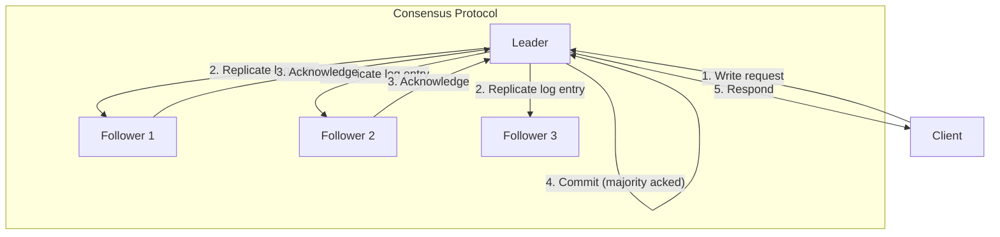

# Distributed Consensus

Understanding how distributed systems reach agreement despite failures—the fundamental algorithms, their design trade-offs, and practical implementations that power modern infrastructure.

Consensus is deceptively simple: get N nodes to agree on a value. The challenge is doing so when nodes can fail, messages can be lost, and clocks can drift. This article explores why consensus is provably hard, the algorithms that solve it in practice, and how systems like etcd, ZooKeeper, and CockroachDB implement these ideas at scale.

<figure>



<figcaption>Leader-based consensus: client writes go through the leader, which replicates to followers and commits once a majority acknowledges.</figcaption>
</figure>

## Abstract

Distributed consensus solves a coordination problem: ensuring multiple nodes agree on a sequence of values despite arbitrary message delays and node failures. The core mental model:

- **FLP Impossibility**: No deterministic algorithm guarantees consensus in a fully asynchronous system with even one crash failure. Practical systems escape via partial synchrony assumptions (timeouts) and randomization.

- **Safety vs. Liveness**: Consensus protocols guarantee safety (never disagree on committed values) always, but can only guarantee liveness (eventually make progress) when the network behaves well enough.

- **Quorum Overlap**: The key insight enabling consensus—any two majorities must share at least one node, ensuring information about committed values propagates.

- **Leader-Based vs. Leaderless**: Paxos can be leaderless (any node proposes), Raft requires a leader. Leaders simplify reasoning but create a single point of failure that requires election.

| Algorithm | Model | Fault Tolerance | Message Complexity | Primary Use |
|-----------|-------|-----------------|-------------------|-------------|
| Paxos | Leaderless/Multi-leader | f crashes (2f+1 nodes) | O(n) per value | Theoretical foundation |
| Raft | Leader-based | f crashes (2f+1 nodes) | O(n) per value | Production systems |
| PBFT | Leader-based BFT | f Byzantine (3f+1 nodes) | O(n²) per value | Untrusted environments |

## Why Consensus Is Hard: FLP Impossibility

The Fischer-Lynch-Paterson theorem (1985) proves that in an asynchronous system where even one node may crash, no deterministic algorithm can guarantee consensus.

### What FLP Actually Proves

FLP shows that any consensus protocol has some execution where it never terminates. The proof constructs an adversarial message scheduler that keeps the system perpetually "on the fence" between deciding 0 and 1.

**Key assumptions:**
- Fully asynchronous network (messages can be delayed arbitrarily)
- Deterministic algorithms only
- At least one node may crash

> "Every partially correct protocol for the consensus problem has some admissible run that is not a deciding run." — FLP Paper, 1985

### Practical Escape Hatches

Real systems circumvent FLP through:

**Partial Synchrony**: Assume the network is asynchronous *most of the time* but eventually becomes synchronous long enough to make progress. This is the DLS (Dwork-Lynch-Stockmeyer) model—safety holds always, liveness holds eventually.

**Randomization**: Use coin flips to break symmetry. Ben-Or's algorithm achieves consensus with probability 1, even if individual rounds may fail.

**Failure Detectors**: Oracle abstraction that tells nodes which other nodes have failed. Even an unreliable failure detector (◇W class) suffices for consensus.

**Design Rationale**: FLP doesn't mean consensus is impossible—it means no algorithm can guarantee bounded-time consensus under worst-case asynchrony. Real networks aren't adversarially scheduled, so timeouts work.

## Paxos: The Foundation

Paxos, described by Lamport in 1989 (published 1998), is the first consensus algorithm proven correct. Its influence is foundational—understanding Paxos explains why other algorithms make their choices.

### Protocol Mechanics

Paxos separates three roles (often colocated on same nodes):
- **Proposers**: Initiate proposals
- **Acceptors**: Vote on proposals
- **Learners**: Learn decided values

**Phase 1: Prepare**

```
Proposer                              Acceptor
    |                                     |
    |-- PREPARE(n) ---------------------->|
    |                                     |
    |<-------- PROMISE(n, accepted?) -----|
```

1. Proposer selects unique proposal number `n` (must be monotonically increasing)
2. Sends PREPARE(n) to majority of acceptors
3. Acceptor responds with:
   - Promise not to accept proposals with number < n
   - Any value it has already accepted (if any)

**Phase 2: Accept**

```
Proposer                              Acceptor
    |                                     |
    |-- ACCEPT(n, v) -------------------->|
    |                                     |
    |<-------- ACCEPTED(n, v) ------------|
```

1. If proposer receives promises from majority:
   - If any promise included an accepted value, use the highest-numbered one
   - Otherwise, use proposer's own value
2. Send ACCEPT(n, v) to acceptors
3. Acceptor accepts if it hasn't promised to a higher-numbered proposal
4. Value is **chosen** when majority accepts

### Why Paxos Is Hard to Implement

Lamport's "Paxos Made Simple" is 14 pages. Google's "Paxos Made Live" describes implementing it in Chubby:

> "There are significant gaps between the description of the Paxos algorithm and the needs of a real-world system... the final system will be based on an unproven protocol."

**Practical challenges:**
- Liveness: Competing proposers can livelock (each invalidating the other's prepare)
- Multi-Paxos: Extending single-value to log replication requires careful handling of leader stability
- Disk durability: Every promise/accept must be durable before responding
- Catch-up: Fallen-behind nodes need gap-filling mechanism
- Configuration changes: Original Paxos doesn't address cluster membership

### Multi-Paxos Optimization

Basic Paxos requires two round-trips per value. Multi-Paxos elects a stable leader:

1. Leader runs Phase 1 once for an entire range of sequence numbers
2. For each new value, leader only runs Phase 2 (single round-trip)
3. If leader fails, new leader must re-run Phase 1

**Trade-off**: Simpler steady-state but complex failure recovery. Leader must distinguish between "I am no longer leader" and "my proposal is just slow."

### ZooKeeper's ZAB Protocol

ZooKeeper uses Zab (Zookeeper Atomic Broadcast), a Paxos variant optimized for its use case:

**Key differences from canonical Paxos:**
- Explicit leader (not symmetric)
- Primary-order: all writes go through leader in sequence
- Prefix property: if message m is delivered, all messages before m are delivered

**Why the design**: ZooKeeper needs ordered atomic broadcast for its coordination primitives (locks, barriers, queues). Zab guarantees that leader-initiated transactions commit in leader order—stronger than multi-decree Paxos where different leaders might interleave.

**Real-world use**: Kafka uses ZooKeeper for metadata management—topic configuration, partition leaders, consumer offsets. The hierarchical namespace (znode tree) maps naturally to coordination patterns.

## Raft: Designed for Understandability

Raft (2014) was explicitly designed to be easier to understand than Paxos while providing equivalent guarantees.

> "We set out to design a consensus algorithm that was easy to understand... we succeeded by addressing two problems: (1) decomposing the problem, and (2) reducing the number of states to consider." — Ongaro & Ousterhout

### Design Philosophy

Raft makes several choices that sacrifice generality for clarity:

| Paxos | Raft | Rationale |
|-------|------|-----------|
| Any node can propose | Only leader proposes | Simpler reasoning about conflicts |
| Symmetric roles | Explicit leader/follower | Clearer responsibility |
| Complex leader election | Randomized timeout + voting | Statistically avoids split vote |
| Logs can have gaps | Logs are sequential | Simplifies recovery |

### Leader Election

Raft nodes exist in three states: Follower, Candidate, Leader.

**Election trigger**: Follower times out waiting for leader heartbeat.

**Election process:**
1. Follower becomes Candidate, increments term number
2. Votes for itself, sends RequestVote to all peers
3. Wins if receives majority votes
4. Becomes Leader, sends heartbeats to assert leadership

**Vote restriction**: Node only votes for candidate if candidate's log is at least as up-to-date (higher term, or same term with longer log).

**Randomized timeout**: Each node chooses election timeout randomly from range (e.g., 150-300ms). This statistically prevents split votes where multiple candidates tie.

**Configuration guidance:**
- Local datacenter: Election timeout 1000ms, heartbeat 100-200ms
- Cross-datacenter: Election timeout = 5× heartbeat, heartbeat ≈ RTT

### Log Replication

```
Leader Log: [1:X] [2:Y] [3:Z] [4:W]
                              ^-- committed (majority replicated)

Follower 1: [1:X] [2:Y] [3:Z] [4:W]  ✓ up-to-date
Follower 2: [1:X] [2:Y] [3:Z]        ✓ can catch up
Follower 3: [1:X] [2:Y]              ✓ can catch up
```

**Replication steps:**
1. Leader receives client write, appends to log
2. Leader sends AppendEntries RPC with new entries
3. Followers append entries, respond with success
4. When majority acknowledges, leader commits
5. Leader notifies followers of new commit index
6. All nodes apply committed entries to state machine

**Key invariant**: If two logs contain an entry with the same index and term, they are identical in all preceding entries. This allows followers to detect gaps and divergences.

### Membership Changes

Adding or removing nodes risks split-brain if done naively (old majority and new majority could exist simultaneously). Raft uses **joint consensus**:

1. Leader creates configuration log entry: Cold,new
2. Decisions require majority of BOTH Cold AND Cnew
3. Once committed, leader creates Cnew-only configuration
4. Old servers not in Cnew can be safely removed

**Trade-off**: More complex than stopping the cluster, but allows online reconfiguration without downtime.

### Raft in Production: etcd

etcd (CoreOS, now CNCF) is the most widely deployed Raft implementation, powering Kubernetes cluster state.

**Performance characteristics:**
- Throughput bound by disk fsync latency—99th percentile fsync should be <20ms
- Slow disks cause leader to miss heartbeats, triggering false elections
- `MaxInflightBytes` controls pipelining: 100ms RTT + 1MB limit = 10 MB/s throughput

**Real incident pattern**: etcd cluster instability despite healthy network—root cause is disk latency from noisy neighbors or slow storage. Monitor `wal_fsync_duration_seconds` and `backend_commit_duration_seconds`.

**Production guidance:**
- Use SSDs with predictable latency
- Isolate etcd nodes from other workloads
- Monitor disk latency histograms, not just averages
- Cross-DC: increase election timeout to 5-10× heartbeat

## Quorum Systems

Quorums are the mathematical foundation of fault-tolerant consensus.

### Basic Quorum Arithmetic

For a system of N nodes tolerating f failures:
- Need N ≥ 2f + 1 (majority remains after f failures)
- Read quorum Qr and write quorum Qw must overlap: Qr + Qw > N

**Example (5 nodes, f=2):**
- Write quorum = 3 (majority)
- Read quorum = 3 (majority)
- Any read intersects any write—ensures seeing latest value

### Read/Write Trade-offs

| Configuration | Read Quorum | Write Quorum | Trade-off |
|--------------|-------------|--------------|-----------|
| Read-heavy | 1 | N | Fast reads, slow writes |
| Write-heavy | N | 1 | Fast writes, slow reads |
| Balanced | (N+1)/2 | (N+1)/2 | Equal latency |

**Design choice**: Dynamo-style systems (Cassandra, Riak) expose quorum configuration (R, W, N). Consensus systems like Raft/Paxos fix Qr = Qw = majority.

### Flexible Quorums

Standard quorums treat all replicas equally. Flexible quorums assign weights:

**Weighted voting**: Replicas have different vote weights. Quorum satisfied when total weight exceeds threshold.

**Use case**: Replicas in local datacenter get weight 3, remote replicas get weight 1. Reads can be satisfied locally but writes require some remote acks for durability.

**Witness nodes**: Non-voting nodes that store data but don't participate in elections. Useful for scaling reads without affecting consensus latency.

## Byzantine Fault Tolerance

Crash fault tolerance assumes failed nodes stop responding. Byzantine Fault Tolerance (BFT) handles nodes that behave arbitrarily—send wrong messages, coordinate with other bad actors, or selectively respond.

### When BFT Is Needed

| Scenario | Fault Model | Why |
|----------|-------------|-----|
| Private datacenter | Crash | Nodes controlled by same operator, no incentive to lie |
| Multi-tenant cloud | Crash | Provider controls hypervisor, tenants isolated |
| Public blockchain | Byzantine | Untrusted participants, economic incentives to cheat |
| Military/critical | Byzantine | Adversary may compromise nodes |

### BFT Cost

To tolerate f Byzantine nodes: N ≥ 3f + 1 (vs. 2f + 1 for crash faults)

**Why 3f+1**: With f Byzantine nodes potentially lying, need 2f+1 honest nodes to reach majority. Total = f bad + 2f+1 good = 3f + 1.

### PBFT (Practical Byzantine Fault Tolerance)

Castro and Liskov (1999) made BFT practical for small clusters:

**Three-phase protocol:**
1. **Pre-prepare**: Leader assigns sequence number to request
2. **Prepare**: Replicas broadcast prepare message if they accept leader's proposal
3. **Commit**: Once 2f+1 prepares received, replicas broadcast commit
4. Finalized when 2f+1 commits received

**Message complexity**: O(n²) per consensus round—each node broadcasts to all others twice. Limits practical cluster size to ~20-30 nodes.

### Modern BFT: HotStuff

HotStuff (2018) reduces complexity through pipelining:

- Linear message complexity in common case
- Three-phase commit with quorum certificates
- Efficient view (leader) changes
- Used in Libra/Diem blockchain

**Key insight**: Chain quorum certificates—each phase's certificate serves as the pre-prepare for the next. Amortizes communication cost.

## Consensus in Practice

### System Comparison

| System | Protocol | Data Model | Consistency | Best For |
|--------|----------|------------|-------------|----------|
| ZooKeeper | Zab | Hierarchical (znodes) | Linearizable | Coordination primitives |
| etcd | Raft | Flat key-value | Linearizable | Kubernetes, config |
| Consul | Raft + Gossip | Flat key-value | Strong (Raft) | Service discovery |
| CockroachDB | MultiRaft | SQL | Serializable | Distributed ACID |

### etcd: Configuration and Kubernetes

**Use case**: Kubernetes stores all cluster state—pods, services, secrets, configmaps—in etcd.

**Why etcd over ZooKeeper**:
- Raft simpler to reason about than Zab
- gRPC API more modern than ZooKeeper's Java-centric model
- Watch API efficient for Kubernetes controller pattern

**Operational reality**: etcd is often the most operationally challenging component in Kubernetes. Typical issues:
- Disk latency causing leader election storms
- Large values (secrets) causing slow snapshots
- Watch storms from misbehaving controllers

**Sizing guidance**: 3 nodes for most production deployments. 5 nodes only if you need to survive two simultaneous failures. More nodes = higher write latency (more acks needed).

### Consul: Hybrid Consensus + Gossip

Consul uses two protocols:

**Raft**: Strong consistency for KV store and service catalog. Leader-based, synchronous replication.

**Serf (Gossip)**: Membership and failure detection. Nodes periodically exchange state with random peers. Converges in O(log N) rounds.

**Why hybrid**: Different consistency needs for different data:
- Service registration: needs strong consistency (Raft)
- Node health: eventual consistency acceptable, but needs fast propagation (Gossip)

**Multi-datacenter**: Each datacenter has independent Raft cluster. WAN gossip connects datacenters for service discovery federation.

### CockroachDB: MultiRaft for Distributed SQL

CockroachDB needs per-range consensus (each range is a Raft group) plus distributed transactions across ranges.

**MultiRaft**: Instead of one Raft group for entire cluster, each range (64MB by default) has its own Raft group. Different ranges can have leaders on different nodes—distributes load.

**Leaseholder optimization**: Raft leader isn't always the node serving reads. Leaseholder (may differ from Raft leader) handles reads without consensus round:

> "Leader valid while it receives majority heartbeat responses until `start + election_timeout / clock_drift_bound`"

This enables linearizable reads from a single node—critical for performance.

**Parallel Commits**: CockroachDB's transaction protocol uses Raft for durability but adds a parallel commit phase to reduce latency:
1. Write intents (uncommitted values) via Raft to each range
2. Transaction record committed via Raft
3. Intents asynchronously resolved

## Common Pitfalls

### 1. Disk Latency Causing Consensus Failures

**The mistake**: Running consensus nodes on shared or slow storage.

**Why it happens**: Developers test on fast local SSDs, deploy to cloud instances with variable I/O.

**The consequence**: Raft leader misses heartbeat window, triggers unnecessary election. In severe cases, cascading elections prevent progress.

**The fix**: Monitor fsync latency histograms. Use dedicated NVMe. Alert on 99th percentile >20ms.

**Example**: Kubernetes cluster instability traced to etcd on network-attached storage. P99 fsync was 150ms during I/O bursts.

### 2. Incorrect Quorum Sizing

**The mistake**: Running 2-node consensus clusters or even-numbered clusters.

**Why it happens**: Trying to save resources, misunderstanding fault tolerance.

**The consequence**: 2-node cluster can't survive any failure. 4-node cluster tolerates same failures as 3-node (1 failure) but has higher write latency.

**The fix**: Always run 3, 5, or 7 nodes. More nodes = more fault tolerance but higher latency.

### 3. Split-Brain from Network Partitions

**The mistake**: Consensus nodes spanning unreliable network links without proper timeout tuning.

**Why it happens**: Cross-region deployments with variable latency.

**The consequence**: Partition isolates minority. Minority can't achieve quorum. If timeouts too aggressive, minority keeps trying elections, wasting resources.

**The fix**: Tune election timeout for worst-case RTT. Minority should recognize quorum loss and stop accepting writes.

### 4. Reading Stale Data from Followers

**The mistake**: Load-balancing reads across followers without lease or quorum reads.

**Why it happens**: Performance optimization without understanding consistency implications.

**The consequence**: Followers may be behind leader. Read-your-writes violated.

**The fix**: For linearizable reads, either read from leader, use quorum reads, or implement lease-based reads with bounded clock skew.

## Conclusion

Distributed consensus enables building reliable systems from unreliable components. The algorithms are mathematically elegant, but production reality demands attention to failure modes, performance tuning, and operational simplicity.

Key insights for practitioners:
- FLP means consensus needs timing assumptions to make progress
- Leader-based protocols (Raft) trade generality for understandability
- Quorum math is fundamental—wrong sizing breaks fault tolerance guarantees
- Production consensus is dominated by disk latency and network partitions
- BFT is expensive—use only when truly untrusted participants exist

The choice between ZooKeeper, etcd, and Consul depends on your ecosystem (Hadoop vs. Kubernetes vs. HashiCorp) more than protocol differences—all provide correct consensus with comparable performance.

## Appendix

### Prerequisites

- **Distributed systems basics**: CAP theorem, network partitions, replication
- **Consistency models**: Linearizability, serializability, eventual consistency
- **Basic networking**: RTT, TCP, message ordering

### Terminology

- **Term**: Raft's logical clock—monotonically increasing number that identifies a leadership epoch
- **Proposal number**: Paxos equivalent of term—unique identifier for a consensus round
- **Quorum**: Minimum number of nodes that must participate in a decision
- **Linearizable**: Strongest consistency model—operations appear to execute instantaneously at some point between invocation and response
- **Liveness**: System eventually makes progress (decides a value)
- **Safety**: System never makes incorrect decisions (never disagrees on committed values)

### Summary

- **FLP** proves deterministic consensus impossible in fully async systems—practical systems use timeouts and randomization
- **Paxos** is theoretically foundational but complex to implement; Multi-Paxos adds stable leader optimization
- **Raft** explicitly trades generality for understandability—leader-based, sequential logs, randomized election
- **Quorum overlap** (Qr + Qw > N) is the mathematical basis for consensus correctness
- **BFT** requires 3f+1 nodes vs. 2f+1 for crash faults—only needed in untrusted environments
- **Production** consensus is dominated by disk latency issues, not network failures

### References

- [Impossibility of Distributed Consensus with One Faulty Process](https://groups.csail.mit.edu/tds/papers/Lynch/jacm85.pdf) - Fischer, Lynch, Paterson (1985)
- [Paxos Made Simple](https://lamport.azurewebsites.net/pubs/paxos-simple.pdf) - Lamport (2001)
- [Paxos Made Live](https://www.cs.utexas.edu/users/lorenzo/corsi/cs380d/papers/paper2-1.pdf) - Chandra, Griesemer, Redstone (2007)
- [In Search of an Understandable Consensus Algorithm (Raft)](https://raft.github.io/raft.pdf) - Ongaro, Ousterhout (2014)
- [Practical Byzantine Fault Tolerance](https://pmg.csail.mit.edu/papers/osdi99.pdf) - Castro, Liskov (1999)
- [HotStuff: BFT Consensus with Linearity and Responsiveness](https://arxiv.org/abs/1803.05069) - Yin et al. (2019)
- [ZooKeeper: Wait-free coordination for Internet-scale systems](https://www.usenix.org/legacy/event/atc10/tech/full_papers/Hunt.pdf) - Hunt et al. (2010)
- [etcd: A Distributed Reliable Key-Value Store](https://etcd.io/docs/)
- [Distributed Consensus Reloaded: Apache ZooKeeper and Replication in Kafka](https://www.confluent.io/blog/distributed-consensus-reloaded-apache-zookeeper-and-replication-in-kafka/)
