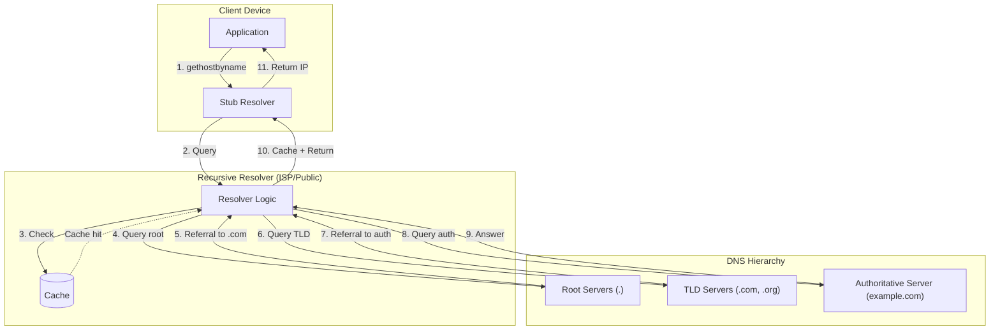

# DNS Deep Dive

The Domain Name System (DNS) is the distributed hierarchical database that maps human-readable domain names to IP addresses. Designed in 1983 by Paul Mockapetris (RFC 1034/1035), DNS handles **billions of queries per day** with sub-100ms latency globally—yet its design choices (UDP transport, caching semantics, hierarchical delegation) create operational nuances that affect failover speed, security posture, and load distribution. This article covers DNS internals, resolution mechanics, record types with design rationale, TTL strategies, load balancing approaches, security mechanisms (DNSSEC, DoH/DoT), and production patterns from major providers.

<figure>



<figcaption>DNS resolution flow: stub resolver queries recursive resolver, which walks the hierarchy (root → TLD → authoritative) or returns cached answers.</figcaption>
</figure>

## Abstract

DNS is a **hierarchical, eventually consistent, globally distributed key-value store** optimized for read-heavy workloads. The mental model:

| Layer | Role | Caching Behavior |
|-------|------|------------------|
| **Stub resolver** | OS-level client | Browser: 1min, OS: varies |
| **Recursive resolver** | Walks hierarchy, caches | TTL-based, negative caching |
| **Authoritative server** | Source of truth for zone | No caching (serves from zone file) |

**Core design trade-offs:**

- **UDP over TCP**: Faster (no handshake), but limited to 512 bytes without EDNS—TCP fallback for large responses
- **TTL-based caching**: Reduces load on authoritative servers, but delays propagation of changes
- **Hierarchical delegation**: Scalable (no single point of failure), but adds latency for uncached queries (4+ round trips)
- **No authentication in original design**: Enables cache poisoning—DNSSEC adds signatures, DoH/DoT add encryption

**Operational implications:**

- Failover speed is bounded by TTL (60-300s for fast failover, 3600-86400s for stable records)
- Negative responses (NXDOMAIN) are cached—typosquatting and phishing leverage this
- EDNS Client Subnet (RFC 7871) enables GeoDNS accuracy but leaks client location to authoritative servers

## DNS Resolution Process

### Query Types: Recursive vs. Iterative

DNS supports two query modes that serve different purposes:

**Recursive queries** (client → recursive resolver): The client asks for a complete answer. The resolver takes full responsibility for walking the hierarchy. Most client queries are recursive—the `RD` (Recursion Desired) flag is set to 1.

**Iterative queries** (recursive resolver → authoritative servers): The resolver asks each server in turn; each returns a referral to the next server. The resolver follows the chain: root → TLD → authoritative.

**Design rationale**: This separation allows caching at the recursive resolver layer. Clients don't need to understand DNS hierarchy—they just ask their configured resolver. Recursive resolvers amortize the cost of hierarchy traversal across many clients.

### Resolution Chain in Detail

For `www.example.com` from a cold cache:

1. **Root query**: Resolver queries a root server (e.g., `a.root-servers.net`). Root returns referral to `.com` TLD servers with their IP addresses (glue records).

2. **TLD query**: Resolver queries `.com` TLD server. TLD returns referral to `example.com` authoritative servers.

3. **Authoritative query**: Resolver queries `example.com` nameserver. Authoritative returns the A record with IP address.

4. **Caching**: Resolver caches all responses per their TTLs—root referrals (48 hours typical), TLD referrals (24-48 hours), final answer (varies by record).

**Latency breakdown** (typical uncached):
- Root query: 5-20ms (anycast)
- TLD query: 10-30ms
- Authoritative query: 10-100ms+ (depends on server location)
- Total: 25-150ms uncached vs. <1ms cached

### Negative Caching (RFC 2308)

When a domain doesn't exist (NXDOMAIN) or has no records of the requested type (NODATA), the response is cached to prevent repeated queries.

**Mechanism**: The authoritative server includes its SOA record in the response. The negative cache TTL is the **minimum of**:
- SOA record's TTL
- SOA MINIMUM field value

**Design rationale**: Without negative caching, attackers could flood resolvers with queries for non-existent domains, causing repeated hierarchy traversals. RFC 2308 mandates negative caching when SOA is present.

**Production impact**:
- Setting SOA MINIMUM too high (e.g., 86400s) means a typo in DNS configuration takes a day to "undo" in caches
- Setting it too low increases authoritative server load
- Typical recommendation: 300-3600 seconds

```
example.com.  IN SOA ns1.example.com. admin.example.com. (
    2024010101  ; serial
    7200        ; refresh (2 hours)
    900         ; retry (15 minutes)
    1209600     ; expire (2 weeks)
    3600        ; minimum TTL for negative caching
)
```

## Record Types and Design Rationale

DNS record types evolved to support different use cases. Understanding their design helps avoid common misconfigurations.

### Address Records: A and AAAA

**A record**: Maps hostname to IPv4 address (32-bit). Defined in RFC 1035 (1987).

**AAAA record** (quad-A): Maps hostname to IPv6 address (128-bit). Defined in RFC 3596 (2003). The name "AAAA" reflects that IPv6 addresses are 4× the size of IPv4.

**Dual-stack behavior**: Modern resolvers query both A and AAAA in parallel. Clients prefer IPv6 if available (RFC 6724 address selection). If only A exists, no AAAA NODATA response is cached.

**Design consideration**: Multiple A/AAAA records for the same name enable round-robin load distribution—the resolver returns all records, but their order may be rotated. Client behavior varies: some use first, some randomize.

### CNAME: Canonical Name

CNAME creates an alias from one domain to another. When a resolver queries a CNAME, it must follow the chain to the canonical name and query that.

**RFC 1034 constraint**: CNAME cannot coexist with other records at the same name. This is because CNAME effectively says "this name is really that name"—having both `A` and `CNAME` creates ambiguity.

**Zone apex problem**: The apex (`example.com` without subdomain) requires NS and SOA records. Since CNAME cannot coexist with these, **you cannot use CNAME at the zone apex**.

**Workarounds**:
- **CNAME flattening** (Cloudflare): DNS provider resolves CNAME at query time, returns A record to client
- **ALIAS/ANAME records** (Route53, others): Proprietary record types that behave like CNAME but resolve to A at the authoritative level
- Route53 ALIAS works only for AWS resources; Cloudflare CNAME flattening is automatic at apex

**CNAME chains**: Multiple CNAMEs in sequence (A → B → C → IP) are valid but add latency. RFC 1034 recommends avoiding chains longer than necessary.

### MX: Mail Exchange

MX records direct email traffic to mail servers. Each MX has a **priority** (lower = preferred) and a **target hostname**.

```
example.com.  IN MX  10 mail1.example.com.
example.com.  IN MX  20 mail2.example.com.
```

**Design rationale**: Priority enables failover—if priority 10 server is unreachable, senders try priority 20. Equal priorities mean load distribution.

**Common mistake**: MX target must be a hostname, not an IP address, and cannot be a CNAME (RFC 2181). This ensures mail servers can be updated by changing only the A record of the target.

### TXT: Text Records

TXT records store arbitrary text, limited to 255 characters per string but multiple strings concatenate.

**Primary uses**:
- **SPF** (Sender Policy Framework): Lists authorized mail servers. RFC 7208 deprecated dedicated SPF record type—use TXT.
- **DKIM** (DomainKeys Identified Mail): Public key for email signature verification.
- **DMARC**: Policy for handling SPF/DKIM failures.
- **Domain verification**: Google, AWS, others use TXT records to prove domain ownership.

```
example.com.       IN TXT "v=spf1 include:_spf.google.com -all"
selector._domainkey.example.com. IN TXT "v=DKIM1; k=rsa; p=MIGf..."
_dmarc.example.com. IN TXT "v=DMARC1; p=reject; rua=mailto:dmarc@example.com"
```

### SRV: Service Records

SRV records (RFC 2782) specify host and port for services. Format: `_service._proto.name TTL IN SRV priority weight port target`.

```
_sip._tcp.example.com. IN SRV 10 60 5060 sipserver.example.com.
_sip._tcp.example.com. IN SRV 10 40 5060 sipbackup.example.com.
```

**Fields**:
- **Priority**: Lower is preferred (like MX)
- **Weight**: For load distribution among same-priority records (60/40 split above)
- **Port**: Service port (allows port flexibility without hardcoding)
- **Target**: Hostname (not IP)

**Use cases**: SIP, XMPP, LDAP, Minecraft servers. Kubernetes uses SRV for service discovery.

### NS: Nameserver Records

NS records delegate a zone to authoritative nameservers. They appear at the zone apex and at delegation points (subdomains delegated to different servers).

**Glue records**: When NS target is within the zone being delegated, the parent zone must include A records (glue) to avoid circular dependency.

```
; In .com zone:
example.com.    IN NS  ns1.example.com.
example.com.    IN NS  ns2.example.com.
ns1.example.com. IN A   192.0.2.1    ; glue record
ns2.example.com. IN A   192.0.2.2    ; glue record
```

### Record Type Decision Matrix

| Use Case | Record Type | Notes |
|----------|-------------|-------|
| Website IP (IPv4) | A | Multiple for round-robin |
| Website IP (IPv6) | AAAA | Prefer dual-stack |
| Alias to another domain | CNAME | Not at apex; consider ALIAS |
| Email routing | MX | Must point to hostname, not IP |
| Email authentication | TXT | SPF, DKIM, DMARC |
| Service with port | SRV | Weight for load distribution |
| Zone delegation | NS | Include glue if needed |
| Subdomain delegation | NS | At delegation point |

## TTL Strategies and Trade-offs

TTL (Time To Live) controls how long resolvers cache a record. This single value balances conflicting goals: fast failover vs. reduced query load vs. change propagation speed.

### Design Choices

#### Low TTL (60-300 seconds)

**When to use**:
- Health-checked failover records
- Blue-green deployments
- Active/passive disaster recovery
- Frequently changing infrastructure

**Trade-offs**:
- ✅ Fast failover (changes propagate in minutes)
- ✅ Flexibility for infrastructure changes
- ❌ Higher query volume to authoritative servers
- ❌ Higher latency (more cache misses)
- ❌ Some resolvers ignore TTLs below 300s (ISP resolvers may floor to 5 minutes)

**Real-world**: AWS Route53 health-checked records commonly use 60s TTL. Cloudflare's default for proxied records is 300s.

#### High TTL (3600-86400 seconds)

**When to use**:
- Stable records (NS, MX for established domains)
- Root/TLD referrals (48 hours typical)
- CDN endpoints that don't change

**Trade-offs**:
- ✅ Reduced authoritative server load
- ✅ Lower latency (higher cache hit rate)
- ✅ Resilient to authoritative server outages (cached answers continue working)
- ❌ Slow change propagation (up to TTL duration)
- ❌ Mistakes persist longer

**Real-world**: Root server NS records have 518400s TTL (6 days). Google's `google.com` A records use 300s.

#### TTL Migration Strategy

Before DNS changes, temporarily lower TTL to minimize propagation delay:

1. **T-48h**: Lower TTL from 86400s to 3600s
2. **T-24h**: Lower TTL from 3600s to 300s
3. **T-0**: Make the change
4. **T+1h**: Verify change propagated
5. **T+24h**: Raise TTL back to desired value

**Limitation**: This only works if you can wait for the original high TTL to expire before step 3. If your TTL is 86400s, you need to lower it and wait 24 hours before the change window.

### Browser and OS Caching

Beyond DNS resolver caching, browsers and operating systems have their own caches:

| Layer | Default TTL | Notes |
|-------|-------------|-------|
| Chrome | 60 seconds | Ignores TTL; fixed duration |
| Firefox | 60 seconds | Respects TTL with 60s minimum |
| Windows DNS Client | Honors TTL | Can be configured via registry |
| macOS | Honors TTL | `dscacheutil -flushcache` to clear |

**Implication**: Even with 30s DNS TTL, browser-level caching means users may see stale IPs for 1-2 minutes. For truly instant failover, use application-level health checks or service mesh.

## DNS-Based Load Balancing

DNS can distribute traffic across servers, but it's a coarse-grained mechanism with specific trade-offs.

### Round-Robin DNS

Return multiple A/AAAA records; resolvers/clients rotate through them.

**Mechanism**: Authoritative server returns all records. Resolvers may shuffle order. Clients typically use first record.

**Limitations**:
- No health checking (returns dead servers)
- No session affinity (different IPs per query)
- No load awareness (even distribution, not load-based)
- Client caching defeats rotation

**Real-world**: GitHub uses round-robin for `github.com` with 4 IPs. Combined with BGP anycast, each IP routes to nearest datacenter.

### Weighted Routing

Route53, Cloudflare, and others support weighted DNS where records have relative weights.

```
; 70% to primary, 30% to secondary
www  300  IN A  192.0.2.1  ; weight 70
www  300  IN A  192.0.2.2  ; weight 30
```

**Use cases**:
- Canary deployments (1% to new version)
- Gradual migration (shift traffic over time)
- A/B testing (split by DNS)

**Caveat**: Weights apply to DNS responses, not actual traffic. A single resolver cache hit serves all its clients the same answer—weight distribution is approximate at scale.

### Latency-Based Routing

Route53 measures latency from resolver locations to AWS regions and returns the lowest-latency endpoint.

**How it works**: Route53 maintains latency measurements from hundreds of global locations to each AWS region. When a query arrives, Route53 uses the resolver's IP (or EDNS Client Subnet if available) to estimate client location and return the lowest-latency endpoint.

**Limitation**: Latency is measured to AWS regions, not to your specific endpoints. If your server in `us-east-1` is overloaded, latency-based routing doesn't know.

### GeoDNS

Return different records based on client geographic location.

**Location determination**:
1. **Resolver IP**: GeoIP database lookup. Inaccurate when users use public resolvers (8.8.8.8, 1.1.1.1)
2. **EDNS Client Subnet (ECS)** (RFC 7871): Resolver sends truncated client IP to authoritative. More accurate but leaks client location.

**Privacy trade-off**: ECS improves GeoDNS accuracy but reveals client subnet to authoritative server and all intermediate resolvers. Privacy-focused resolvers (1.1.1.1, some 8.8.8.8 configurations) minimize or disable ECS.

**Real-world**: Netflix uses GeoDNS to route users to regional Open Connect caches. Content not available in a region? DNS returns different IPs that serve a "not available" page.

### Anycast DNS

Instead of GeoDNS (different IPs per region), use the same IP announced via BGP from multiple locations.

**Mechanism**: Multiple servers advertise the same IP prefix. BGP routing delivers packets to the "closest" (by AS path) server.

**Advantages**:
- No DNS-level complexity
- Works with any resolver (no ECS needed)
- Instant failover (BGP withdrawal)
- DDoS resilience (attack traffic distributed)

**Disadvantages**:
- Requires BGP/AS number (not for small deployments)
- TCP affinity issues (route changes mid-connection)
- Debugging harder (which server answered?)

**Real-world**: Cloudflare's 1.1.1.1, Google's 8.8.8.8, and all root DNS servers use anycast. Cloudflare operates from 330+ cities with the same IP addresses.

### Load Balancing Decision Matrix

| Approach | Health Checks | Granularity | Operational Complexity |
|----------|---------------|-------------|------------------------|
| Round-robin | No | Per-record | Low |
| Weighted (Route53/CF) | Optional | Per-record | Low |
| Latency-based | No | Per-region | Medium |
| GeoDNS | Optional | Per-country/region | Medium |
| Anycast + BGP | Via BGP withdrawal | Per-datacenter | High |

**Recommendation**: For most applications, use a load balancer (ALB, NLB, HAProxy) with DNS pointing to the load balancer. DNS-based load balancing is best for global distribution to load balancers, not to individual servers.

## DNS Security

### The Original Problem: No Authentication

RFC 1034/1035 designed DNS without authentication. Resolvers trust responses that match query parameters (QNAME, QTYPE, transaction ID, source port). This enables:

- **Cache poisoning**: Attacker races to inject forged response before legitimate answer arrives
- **Man-in-the-middle**: Attacker on network path modifies responses
- **DNS hijacking**: ISP or government redirects queries

### The Kaminsky Attack (2008)

Dan Kaminsky demonstrated that the 16-bit transaction ID (65,536 possibilities) could be guessed by flooding responses.

**Attack vector**: Query `random123.example.com` (no cache entry). Flood resolver with forged responses for all possible transaction IDs, including malicious NS records for `example.com`. If any forged response arrives before legitimate, the entire zone is poisoned.

**Mitigation**: Source port randomization adds ~16 bits of entropy (32 bits total). Now standard in all major resolver implementations.

**Modern variant—SAD DNS (2020)**: Side-channel attack infers source port via ICMP rate limiting behavior, partially defeating randomization. Mitigations: DNS cookies (RFC 7873), DNSSEC.

### DNSSEC: Cryptographic Authentication

DNSSEC (RFC 4033-4035, 2005) adds digital signatures to DNS responses, enabling validation of authenticity and integrity.

**Key record types**:
- **DNSKEY**: Public key for the zone
- **RRSIG**: Signature over a record set
- **DS (Delegation Signer)**: Hash of child zone's DNSKEY, stored in parent zone—creates chain of trust
- **NSEC/NSEC3**: Proves non-existence of a name (prevents forged NXDOMAIN)

**Chain of trust**:
```
Root (.) → DS for .com → .com DNSKEY validates →
.com → DS for example.com → example.com DNSKEY validates →
example.com → RRSIG validates A record
```

**Trust anchor**: Resolvers have the root zone's public key (KSK) preconfigured. All validation chains back to this anchor.

**Key rollover complexity**: Changing keys requires coordinating with parent zone (updating DS record) and waiting for TTLs. The root zone's first KSK rollover (2018) took years of planning.

**Operational challenges**:
- Signature expiration: Signatures have validity periods. Failure to re-sign causes validation failures.
- Clock skew: Validators check signature timestamps. Clock drift causes spurious failures.
- Deployment: As of 2024, ~30% of domains are signed, but only ~25% of resolvers validate.

**Validation failure debugging**:
```bash
# Check DNSSEC chain
dig +dnssec +multi example.com
delv example.com

# Bypass validation (for debugging)
dig +cd example.com  # "checking disabled"
```

### DNS over HTTPS (DoH) and DNS over TLS (DoT)

DNSSEC authenticates responses but doesn't encrypt queries. Anyone on the network path can see what domains you query.

**DNS over TLS (DoT)** (RFC 7858, 2016):
- Wraps DNS in TLS on port 853
- Easy to identify and block (dedicated port)
- Supported by Android 9+, iOS 14+

**DNS over HTTPS (DoH)** (RFC 8484, 2018):
- Sends DNS queries as HTTPS requests on port 443
- Indistinguishable from regular HTTPS traffic
- Supported by Chrome, Firefox, Windows 11

**Trade-offs**:

| Aspect | DoT | DoH |
|--------|-----|-----|
| Port | 853 (dedicated) | 443 (shared with HTTPS) |
| Blocking | Easy (port-based) | Hard (looks like web traffic) |
| Firewall inspection | Visible as DNS | Hidden in HTTPS |
| Performance | Lower overhead | HTTP/2 overhead |
| Enterprise control | Easier to manage | Harder to enforce policies |

**Privacy considerations**:
- Encrypts resolver ↔ client. Resolver ↔ authoritative remains unencrypted (unless authoritative supports DoH).
- Resolver still sees all your queries. 1.1.1.1 and 8.8.8.8 have privacy policies; ISP resolvers may not.
- **Oblivious DoH (ODoH)** (RFC 9230, 2022): Adds proxy layer so no single party sees both client IP and query content.

### DNS Amplification Attacks

Open resolvers answer queries from any source. Attackers exploit this for DDoS:

1. Spoof victim's IP as source address
2. Send small queries (60 bytes) requesting large responses (3000+ bytes)
3. Resolver sends large response to victim
4. Amplification factor: 50-70×

**Mitigations**:
- **Response Rate Limiting (RRL)**: Limit responses per source IP per second
- **BCP38/BCP84**: ISPs should filter spoofed source addresses
- **Disable open recursion**: Only serve configured clients

### DNS Security Checklist

| Threat | Mitigation | Status |
|--------|------------|--------|
| Cache poisoning | Source port randomization | Standard since 2008 |
| Cache poisoning | DNSSEC validation | ~25% of resolvers |
| Eavesdropping | DoH/DoT | Growing adoption |
| Amplification DDoS | RRL + BCP38 | Partial deployment |
| Zone hijacking | Registrar locks + MFA | Recommended |

## DNS Failover and Health Checks

DNS-based failover removes unhealthy endpoints from responses. It's slower than load balancer health checks but works across regions.

### How DNS Health Checks Work (Route53 Example)

1. **Health checker endpoints** in multiple AWS regions ping your endpoint
2. If endpoint fails checks from majority of regions, it's marked unhealthy
3. Route53 stops returning that record in DNS responses
4. **Propagation delay**: Existing cached responses continue until TTL expires

**Health check options**:
- HTTP/HTTPS: Check specific path, status code, response body
- TCP: Port connectivity only
- Calculated: Combine multiple checks with AND/OR logic
- CloudWatch alarm: Based on custom metrics

### Failover Latency Analysis

```
Time 0:00 - Primary fails
Time 0:30 - Health check fails (30s check interval)
Time 1:00 - Majority of checkers confirm failure
Time 1:30 - Route53 marks record unhealthy, stops returning it
Time 1:30 to 3:00 - Cached responses continue (60s TTL example)
Time 3:00 - All caches expired, traffic flows to secondary
```

**Best case with 60s TTL**: ~3 minutes to full failover
**With browser caching**: Add 1-2 minutes

**Comparison**: Load balancer health checks detect failure in 10-30 seconds with instant traffic shift.

### Active-Active vs. Active-Passive

**Active-Active**: Multiple endpoints in rotation; unhealthy ones removed.
```
www.example.com.  60  IN  A  192.0.2.1  ; health checked
www.example.com.  60  IN  A  192.0.2.2  ; health checked
```

**Active-Passive**: Secondary only used when primary fails.
```
; Route53 failover routing policy
www.example.com.  60  IN  A  192.0.2.1  ; primary, health checked
www.example.com.  60  IN  A  192.0.2.2  ; secondary, returned if primary fails
```

**Gotcha**: With active-passive, if you don't health-check the secondary, failover might route traffic to a dead endpoint.

## Real-World Examples

### Cloudflare 1.1.1.1: Building a Fast Resolver

**Problem**: Provide the fastest, most private public DNS resolver.

**Design choices**:
- **Anycast from 330+ cities**: Same IP (1.1.1.1) announced everywhere. BGP routes queries to nearest PoP.
- **Aggressive caching**: Cache responses at edge; pre-populate popular domains.
- **Minimal logging**: Purge query logs within 24 hours. No selling of data.
- **DNSSEC validation**: Enabled by default.
- **DoH/DoT support**: Privacy from network observers.

**Performance result**: DNSPerf ranks 1.1.1.1 at ~14ms average globally, compared to ~20-30ms for competitors.

**Incident (October 2023)**: Internal software error caused SERVFAIL responses for valid queries. 3-hour impact. Root cause: bug in internal data structure synchronization. Mitigation: additional validation layers, improved monitoring.

### Route53: DNS at AWS Scale

**Scale**: Handles 100+ billion queries/day across millions of hosted zones.

**Design choices**:
- **Four anycast networks**: Geographically distributed. Health-checked routing to nearest healthy PoP.
- **EDNS Client Subnet support**: More accurate latency-based and geo routing.
- **Alias records**: Proprietary record type that resolves AWS resources at the authoritative level (no CNAME chain).
- **100% SLA**: Backed by service credit (though historical uptime is >99.99%).

**Integration**: Tight coupling with AWS services—ELB, CloudFront, S3 static hosting all work via Alias records.

### GitHub: DNS and DDoS

**Challenge**: High-value target for DDoS attacks while serving millions of developers.

**Approach**:
- **Multiple DNS providers**: Redundancy against provider outages.
- **Anycast for github.com**: Multiple IPs, each anycast to multiple datacenters.
- **DDoS mitigation partners**: Traffic scrubbing before reaching origin.

**2018 DDoS attack**: 1.35 Tbps attack using memcached amplification (not DNS, but illustrates scale). Mitigated in 10 minutes via Akamai.

### Root DNS: The Foundation

**Architecture**: 13 root server identities (A through M), operated by 12 organizations. Actually 1,700+ instances globally via anycast.

**Why 13?** Original UDP packet limit (512 bytes) constrained response size. 13 NS records with glue fit within this limit. Modern DNS uses EDNS for larger responses, but 13 remains for compatibility.

**Resilience**: Each root server identity runs hundreds of anycast instances. An attack on "A root" hits different physical servers depending on attacker location. No single instance failure affects global resolution.

**Update mechanism**: Root zone signed with DNSSEC. Updates propagate via zone transfers. KSK rollover (2018) required coordinated trust anchor updates across all validating resolvers globally.

## Common Pitfalls

### 1. CNAME at Zone Apex

**The mistake**: Setting `example.com` as CNAME to `loadbalancer.example.net`.

**Why it fails**: RFC 1034 prohibits CNAME at apex because it conflicts with required NS and SOA records.

**The fix**: Use provider-specific solutions (Cloudflare CNAME flattening, Route53 ALIAS) or configure A records pointing to load balancer IPs.

### 2. Ignoring Negative TTL

**The mistake**: Setting SOA MINIMUM to 86400s (1 day) for "stability."

**Why it's problematic**: Typo in DNS configuration (NXDOMAIN for real subdomain) persists in caches for a full day.

**The fix**: Use 300-3600s for SOA MINIMUM. Balance between reducing load and enabling recovery from mistakes.

### 3. Over-relying on DNS Failover

**The mistake**: Using DNS health checks for sub-minute failover.

**Why it fails**: DNS TTL + browser caching + resolver caching = minutes of stale responses.

**The fix**: DNS failover for regional/datacenter failures (minutes acceptable). Load balancers for server failures (seconds matter).

### 4. Forgetting Glue Records

**The mistake**: Delegating `example.com` to `ns1.example.com` without glue records in parent zone.

**Why it fails**: Resolver needs to query `ns1.example.com` to find `example.com` records, but can't resolve `ns1.example.com` without first resolving `example.com`. Circular dependency.

**The fix**: Ensure registrar includes glue A records for nameservers within the delegated zone.

### 5. DNSSEC Signature Expiration

**The mistake**: Setting up DNSSEC, then forgetting to re-sign zone before signatures expire.

**Why it fails**: Validating resolvers reject responses with expired signatures. Domain becomes unreachable for DNSSEC-validating users (~25% of internet).

**The fix**: Automate zone signing with DNSSEC-aware DNS providers (Route53, Cloudflare) or tools like OpenDNSSEC with automated key management.

## Conclusion

DNS is deceptively simple—a hierarchical lookup system—but its design choices have profound operational implications:

**Resolution mechanics**: Recursive resolvers walk the hierarchy and cache aggressively. Caching enables DNS to scale globally but introduces propagation delays for changes.

**TTL trade-offs**: Low TTLs (60-300s) enable fast failover at the cost of increased authoritative load. High TTLs (3600-86400s) reduce load but slow change propagation. Plan TTL changes 24-48 hours before infrastructure changes.

**Load balancing via DNS**: Useful for global distribution to regional load balancers. Not suitable for server-level health checking or sub-minute failover. Combine with anycast for DDoS resilience.

**Security layers**:
- DNSSEC authenticates responses but doesn't encrypt
- DoH/DoT encrypt the client-resolver path
- Neither fully solves DNS security—defense in depth required

**Production patterns**:
- Use managed DNS (Route53, Cloudflare) for reliability and features
- Enable DNSSEC if your registrar and provider support it
- Monitor resolution from multiple global locations
- Test failover regularly—don't wait for a real outage

DNS will outlive most of the systems it serves. Understanding its constraints—rather than fighting them—leads to more resilient architectures.

## Appendix

### Prerequisites

- Basic networking concepts (IP addresses, TCP/UDP, ports)
- Understanding of client-server architecture
- Familiarity with hierarchical data structures

### Terminology

- **Authoritative server**: DNS server that holds the source-of-truth records for a zone
- **Recursive resolver**: DNS server that queries other servers on behalf of clients and caches results
- **Stub resolver**: Minimal resolver in OS/application that sends queries to recursive resolver
- **Zone**: Administrative boundary in DNS namespace (e.g., `example.com` and all its subdomains)
- **TTL (Time To Live)**: Duration a record can be cached before requiring re-query
- **Glue record**: A record in parent zone providing IP for nameserver within delegated zone
- **EDNS (Extension Mechanisms for DNS)**: Allows larger UDP responses and additional features
- **ECS (EDNS Client Subnet)**: Extension that passes client subnet to authoritative server for better GeoDNS
- **Anycast**: Routing technique where same IP is announced from multiple locations

### Summary

- **DNS is a hierarchical, eventually consistent, globally distributed key-value store** optimized for reads
- **Resolution chain**: Root → TLD → Authoritative, with aggressive caching at recursive resolvers
- **TTL controls propagation speed**: 60s for failover records, 3600s+ for stable records
- **Negative caching**: NXDOMAIN responses cached per SOA MINIMUM—mistakes persist
- **CNAME cannot exist at zone apex**: Use ALIAS/CNAME flattening for apex pointing to hostnames
- **DNS load balancing is coarse**: Use for global distribution; load balancers for server-level health
- **DNSSEC adds authentication**: Chain of trust from root; ~25% of resolvers validate
- **DoH/DoT add encryption**: Client ↔ resolver path; resolver ↔ authoritative still unencrypted
- **Failover speed bounded by TTL**: Best case ~3 minutes with 60s TTL + browser caching

### References

**Specifications (Primary Sources)**

- [RFC 1034: Domain Names - Concepts and Facilities](https://datatracker.ietf.org/doc/html/rfc1034) - Core DNS architecture
- [RFC 1035: Domain Names - Implementation and Specification](https://datatracker.ietf.org/doc/html/rfc1035) - DNS protocol and record formats
- [RFC 2308: Negative Caching of DNS Queries](https://datatracker.ietf.org/doc/html/rfc2308) - NXDOMAIN caching requirements
- [RFC 4033/4034/4035: DNSSEC](https://datatracker.ietf.org/doc/html/rfc4033) - DNS Security Extensions
- [RFC 7858: DNS over TLS](https://datatracker.ietf.org/doc/html/rfc7858) - Specification for DoT
- [RFC 8484: DNS over HTTPS](https://datatracker.ietf.org/doc/html/rfc8484) - Specification for DoH
- [RFC 7871: EDNS Client Subnet](https://datatracker.ietf.org/doc/html/rfc7871) - Client subnet for GeoDNS
- [RFC 9230: Oblivious DoH](https://datatracker.ietf.org/doc/html/rfc9230) - Privacy-preserving DNS

**Official Documentation**

- [Cloudflare DNS Documentation](https://developers.cloudflare.com/dns/) - CNAME flattening, DNSSEC troubleshooting
- [AWS Route53 Developer Guide](https://docs.aws.amazon.com/Route53/latest/DeveloperGuide/) - Routing policies, health checks
- [Google Public DNS Documentation](https://developers.google.com/speed/public-dns/) - DoH implementation

**Engineering Blog Posts**

- [Cloudflare: Introducing CNAME Flattening](https://blog.cloudflare.com/introducing-cname-flattening-rfc-compliant-cnames-at-a-domains-root/) - Zone apex CNAME solution
- [Cloudflare: Announcing 1.1.1.1](https://blog.cloudflare.com/announcing-1111/) - Public resolver architecture
- [Cloudflare: A Brief Primer on Anycast](https://blog.cloudflare.com/a-brief-anycast-primer/) - Anycast implementation
- [Cloudflare: SAD DNS Explained](https://blog.cloudflare.com/sad-dns-explained/) - Modern cache poisoning attack

**Security Research**

- [Dan Kaminsky's DNS Vulnerability (2008)](https://en.wikipedia.org/wiki/Dan_Kaminsky) - Original cache poisoning disclosure
- [CISA: DNS Amplification Attacks](https://us-cert.cisa.gov/ncas/alerts/TA13-088A) - Mitigation guidance
- [DNSSEC Outages List](https://ianix.com/pub/dnssec-outages.html) - Historical validation failures

**Books**

- [Cricket Liu, Paul Albitz: DNS and BIND, 5th Edition](https://www.oreilly.com/library/view/dns-and-bind/0596100574/) - Comprehensive DNS reference
