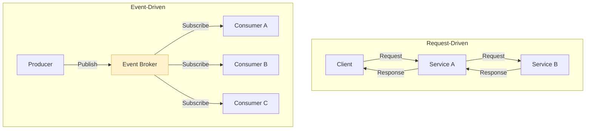
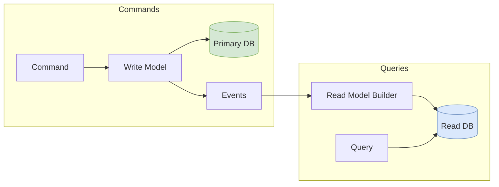
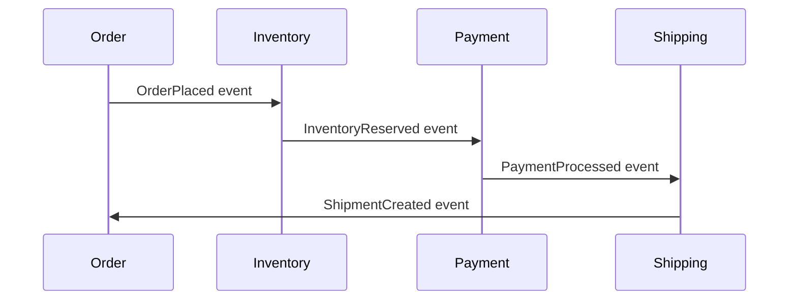
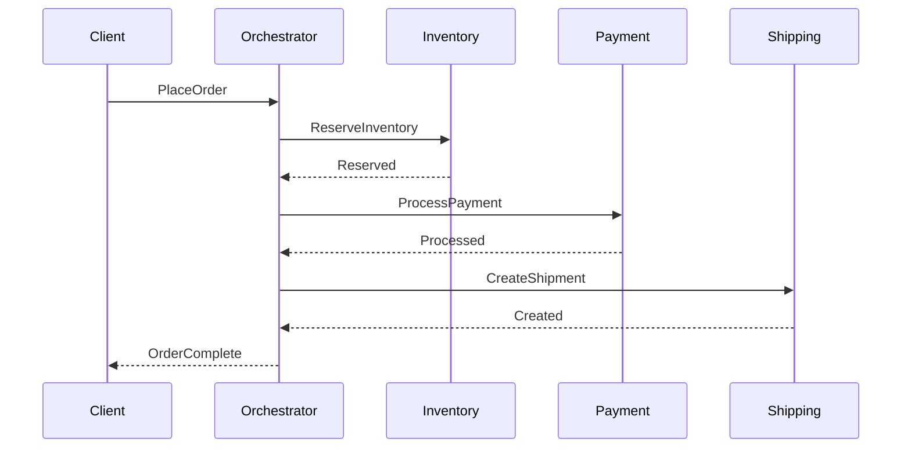
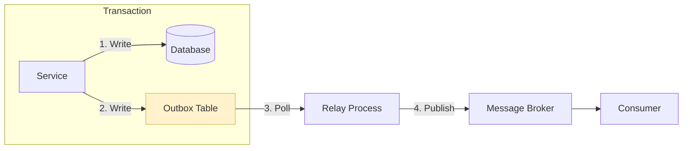

# Event-Driven Architecture

Designing systems around events rather than synchronous requests: when events beat API calls, event sourcing vs. state storage, CQRS trade-offs, saga patterns for distributed transactions, and production patterns from systems processing trillions of events daily.

<figure>



<figcaption>Request-driven: synchronous call chains with tight coupling. Event-driven: asynchronous fan-out with loose coupling—producers don't know (or care) about consumers.</figcaption>
</figure>

## Abstract

Event-driven architecture (EDA) replaces synchronous request-response chains with asynchronous event publishing and subscription. The producer emits facts about what happened; consumers independently decide how to react.

**The mental model:**

| Pattern | Communication | Coupling | Consistency | Best For |
|---------|--------------|----------|-------------|----------|
| **Request-driven** | Synchronous | Tight | Strong | User-facing operations, transactions |
| **Event-driven** | Asynchronous | Loose | Eventual | Scalability, decoupling, complex workflows |

**Key patterns covered:**

- **Event sourcing**: Store events as the source of truth, derive state by replay
- **CQRS**: Separate read and write models for independent optimization
- **Sagas**: Choreography vs. orchestration for distributed transactions
- **Idempotency**: At-least-once delivery requires idempotent consumers
- **Schema evolution**: Events are immutable—evolve schemas without breaking consumers

**Production context:**

- LinkedIn: 800B events/day, 13M/sec peak across 1,100+ Kafka brokers
- Uber: 300+ microservices, petabytes daily via Kafka + Flink
- Netflix: Event sourcing for downloads, billions of events through Kafka/Flink/CockroachDB

The choice isn't binary—most production systems combine request-driven for user-facing operations and event-driven for background processing, analytics, and integration.

## Event-Driven vs. Request-Driven

### Request-Driven Architecture

**Mechanism**: Client sends request, waits for response. Service A calls Service B synchronously, which calls Service C. Each call blocks until the downstream service responds.

**Why it exists**: Immediate feedback loop. User clicks "Submit Order," expects to know if it succeeded. Strong consistency—the response reflects the current state.

**Trade-offs**:
- ✅ Immediate consistency—response reflects committed state
- ✅ Simple error handling—caller knows if operation failed
- ✅ Clear request/response semantics
- ✅ Easier debugging—synchronous call stacks
- ❌ Cascading failures—one slow service blocks the entire chain
- ❌ Tight coupling—caller must know about downstream services
- ❌ Limited scalability—throughput bounded by slowest service
- ❌ Difficult to add consumers—each new consumer requires producer changes

**When to use**:
- User-facing operations requiring immediate feedback (payments, authentication)
- Operations requiring strong consistency (financial transactions, inventory decrements)
- Simple systems with clear request/response boundaries
- MVP development where speed-to-market matters more than scale

### Event-Driven Architecture

**Mechanism**: Producer publishes events to a broker. Consumers subscribe independently and process asynchronously. Producer doesn't wait for (or know about) consumers.

**Why it exists**: Decoupling at scale. Adding a new consumer (analytics, audit log, notifications) doesn't require changing the producer. Each service scales independently.

**Trade-offs**:
- ✅ Loose coupling—producer and consumers evolve independently
- ✅ Horizontal scaling—each service scales based on its own load
- ✅ Resilience—consumer failure doesn't affect producer or other consumers
- ✅ Flexibility—add new consumers without modifying producers
- ❌ Eventual consistency—consumers may see stale data
- ❌ Complex debugging—events flow across multiple services
- ❌ No immediate feedback—producer doesn't know if processing succeeded
- ❌ Harder rollback—compensation logic required for failures

**When to use**:
- Systems requiring massive scalability and variable loads
- Complex business workflows (order fulfillment, content publishing)
- Asynchronous operations (notifications, analytics, background processing)
- Multi-service coordination without tight coupling
- Systems where eventual consistency is acceptable

### Design Decision: Choosing Your Pattern

| Factor | Request-Driven | Event-Driven |
|--------|---------------|--------------|
| **Consistency requirement** | Strong (ACID) | Eventual acceptable |
| **User feedback** | Immediate required | Delayed acceptable |
| **Scale** | Moderate (<10K RPS) | High (>100K events/sec) |
| **Consumer count** | Fixed, known | Variable, growing |
| **Failure isolation** | Cascading OK | Must isolate |
| **Team structure** | Single team | Multiple independent teams |

**Hybrid approach (most production systems)**: Request-driven for synchronous user interactions (checkout flow), event-driven for downstream processing (inventory update, shipping notification, analytics).

**Real-world: Uber's approach**: User-facing APIs are request-driven for immediate feedback. After the ride completes, an event triggers asynchronous processing: payment, receipt generation, driver rating prompt, fraud detection, analytics—all independent consumers of the "RideCompleted" event.

## Event Sourcing

### The Pattern

Event sourcing stores the complete history of state changes as a sequence of immutable events, rather than storing only the current state. Current state is derived by replaying events in order.

**Traditional state storage**:
```
User Table
| user_id | email           | name    | updated_at |
|---------|-----------------|---------|------------|
| 123     | new@example.com | Alice B | 2024-01-15 |
```
You see the current state but not how it got there.

**Event sourcing**:
```
Event Stream: user-123
| seq | event_type      | data                              | timestamp  |
|-----|-----------------|-----------------------------------|------------|
| 1   | UserCreated     | {email: "old@example.com", ...}   | 2023-06-01 |
| 2   | EmailChanged    | {old: "old@...", new: "new@..."}  | 2023-09-15 |
| 3   | NameUpdated     | {old: "Alice", new: "Alice B"}    | 2024-01-15 |
```
Current state = replay all events. Full audit trail preserved.

### Why Event Sourcing Exists

**Design reasoning**:

1. **Complete audit trail**: Every change is recorded. Critical for financial systems, healthcare, compliance-heavy domains.

2. **Temporal queries**: "What was the account balance on December 31?" Replay events up to that point.

3. **Debug production issues**: Replay events locally to reproduce exact production state.

4. **Reprocess with new logic**: Business rules changed? Replay events through updated projections.

5. **Event-driven integration**: Events are the natural integration point—other services subscribe to the same event stream.

### Projections: Building Read Models

Events are optimized for writing (append-only). Reading requires projections—denormalized views built by processing events.

**Projection types**:

| Type | Update Timing | Consistency | Use Case |
|------|---------------|-------------|----------|
| **Synchronous** | Same transaction as event | Strong | Critical reads that must reflect writes |
| **Asynchronous** | Background processing | Eventual | High-throughput reads, analytics |
| **On-demand** | At query time | Strong | Rarely-accessed historical views |

**Example**: An e-commerce order stream produces events: `OrderPlaced`, `PaymentReceived`, `ItemShipped`. Projections might include:
- **Order status view**: For customer-facing "track my order"
- **Fulfillment queue**: For warehouse workers
- **Revenue dashboard**: For finance team
- **Fraud detection input**: For security team

Each projection optimizes for its consumer's access patterns.

### Snapshots: Optimization for Long Streams

Problem: Replaying 10 million events to reconstruct state is slow.

**Solution**: Periodically store a snapshot of current state. Replay only events after the snapshot.

**Snapshot strategies**:

| Strategy | Implementation | Trade-off |
|----------|---------------|-----------|
| **Periodic** | Every N events or T time | Simple, predictable storage |
| **Threshold-based** | When event count exceeds limit | Bounds worst-case replay |
| **Eager** | After every write | Zero replay time, higher write cost |
| **Lazy** | On first read after threshold | Amortizes cost, variable read latency |

**Implementation pattern**:
```
1. Load latest snapshot (if exists): state = snapshot.state, start_seq = snapshot.seq
2. Query events after snapshot: events = store.getEvents(stream_id, after: start_seq)
3. Apply events: for event in events: state = apply(state, event)
4. Optionally create new snapshot if event count exceeds threshold
```

**Storage considerations**: Snapshots can live in the same store as events or in separate storage (Redis, dedicated snapshot table). Separate storage enables different retention policies.

### Log Compaction

Kafka's log compaction offers an alternative to snapshots for key-based streams.

**Mechanism**: Periodically removes older events with the same key, keeping only the latest event per key.

**When to use**: Entity state streams where only current value matters (user preferences, configuration). Not suitable when full history is required.

**Trade-off**: Loses history for storage efficiency. Use for derived data, not source-of-truth event streams.

### Event Sourcing Trade-offs

**Benefits**:
- ✅ Complete audit trail
- ✅ Temporal queries ("state at time T")
- ✅ Debugging via event replay
- ✅ Reprocessing for new business logic
- ✅ Natural fit for event-driven integration

**Costs**:
- ❌ Schema evolution complexity (events are immutable)
- ❌ Storage growth (mitigation: snapshots, archival)
- ❌ Query complexity (must build projections)
- ❌ Eventual consistency between events and projections
- ❌ Learning curve for teams

**When NOT to use**:
- Simple CRUD with no audit requirements
- Domains without temporal query needs
- Teams without event-driven experience
- Systems requiring immediate strong consistency on reads

### Real-World: Netflix Downloads

**Problem**: Track license accounting for downloaded content—which users have which content on which devices, license expiration, and transaction history.

**Approach**: Cassandra-backed event sourcing.

**Key technique—delayed materialization**: Events contain only entity IDs, not full payloads. When building projections, the enrichment layer queries source services for current entity state. This avoids stale data from out-of-order events and guarantees projections reflect current reality.

**Trade-off accepted**: Added query latency during projection building in exchange for guaranteed consistency and smaller event payloads.

## CQRS: Command Query Responsibility Segregation

### The Pattern

CQRS separates the write model (commands) from the read model (queries). Commands modify state through domain logic; queries retrieve optimized read views.

<figure>



<figcaption>CQRS separates write (command) and read (query) paths. Events synchronize them asynchronously.</figcaption>
</figure>

### Why CQRS Exists

**The problem it solves**: Read and write patterns often have conflicting optimization needs.

| Concern | Writes | Reads |
|---------|--------|-------|
| **Optimization** | Transactional integrity | Query performance |
| **Scaling** | Single leader | Many replicas |
| **Schema** | Normalized (avoid anomalies) | Denormalized (avoid joins) |
| **Throughput** | Lower (complex validation) | Higher (simple lookups) |

**Traditional approach**: Single model serves both. Compromise on both.

**CQRS approach**: Optimize each independently. Accept eventual consistency between them.

### Design Choices

#### Option A: Simple CQRS (No Event Sourcing)

**Mechanism**: Single database with read replicas. Writes go to primary; reads go to replicas.

**When to use**:
- Read/write ratio is highly asymmetric (100:1 reads to writes)
- Eventual consistency (replica lag) is acceptable
- No need for event history

**Trade-offs**:
- ✅ Simple—standard database replication
- ✅ Minimal infrastructure change
- ❌ Limited read optimization (same schema as writes)
- ❌ No event history

#### Option B: CQRS with Separate Read Store

**Mechanism**: Commands update primary store; events synchronize to purpose-built read store (Elasticsearch, Redis, read-optimized tables).

**When to use**:
- Different query patterns need different storage (full-text search, graph queries, aggregations)
- Read performance requirements exceed what primary schema supports
- Can tolerate synchronization lag

**Trade-offs**:
- ✅ Each read model optimized for its access pattern
- ✅ Read scaling independent of write scaling
- ❌ Synchronization logic required
- ❌ Eventual consistency between stores
- ❌ Operational complexity (multiple stores)

#### Option C: CQRS with Event Sourcing

**Mechanism**: Commands produce events (event sourcing). Read models built as projections from event stream.

**When to use**:
- Need both CQRS benefits and event sourcing benefits
- Complex domain with multiple read patterns
- Audit trail and temporal queries required

**Trade-offs**:
- ✅ Full audit trail
- ✅ Projections can be rebuilt from events
- ✅ New read models added without touching write side
- ❌ Highest complexity
- ❌ Event schema evolution challenges
- ❌ Eventual consistency

### When CQRS Hurts

Martin Fowler cautions: "For most systems CQRS adds risky complexity."

**Avoid CQRS when**:
- Simple CRUD with no complex queries
- Read and write models are nearly identical
- Team lacks distributed systems experience
- Immediate consistency is required (or the lag tolerance window is very small)
- System doesn't justify the operational overhead

**Warning signs you don't need it**:
- Single read pattern (simple lookups by ID)
- Low traffic (< 1K RPS)
- Small team maintaining everything
- No distinct optimization needs for reads vs. writes

### Real-World: Why CQRS Makes Sense

**Scenario**: E-commerce product catalog.

**Writes**: Admin updates product details, inventory, pricing. Complex validation, business rules, audit requirements. Low frequency (hundreds/day).

**Reads**: Customer browses products. Needs denormalized view (product + reviews + inventory + pricing), full-text search, faceted filtering. High frequency (millions/day).

**CQRS solution**: Write model in PostgreSQL with normalized schema and business logic. Read model in Elasticsearch with denormalized documents. Events synchronize them.

**Outcome**: Writes maintain integrity; reads serve millions of queries with sub-100ms latency. Independent scaling.

## Saga Patterns: Distributed Transactions

### The Problem

Distributed systems can't use traditional ACID transactions across services. Each service has its own database; there's no distributed transaction coordinator.

**Example**: Place order requires:
1. Reserve inventory (Inventory Service)
2. Charge payment (Payment Service)
3. Create shipment (Shipping Service)

If payment fails after inventory is reserved, how do you rollback?

### Choreography: Decentralized Coordination

**Mechanism**: Each service reacts to events and publishes its own events. No central coordinator.

<figure>



<figcaption>Choreography: services react to events, each triggering the next step without central coordination.</figcaption>
</figure>

**Trade-offs**:
- ✅ No single point of failure
- ✅ Services loosely coupled
- ✅ Easy to add new services (subscribe to events)
- ✅ Each service owns its logic
- ❌ Hard to understand full flow (spread across services)
- ❌ Difficult to debug failures
- ❌ Risk of cyclic event loops
- ❌ Testing requires full system

**Compensation in choreography**: Each service listens for failure events and compensates.

```
PaymentFailed event → Inventory listens → releases reservation
```

**Challenge**: Determining the right compensation when multiple services are involved. What if shipment already started when payment fails?

### Orchestration: Centralized Coordination

**Mechanism**: A saga orchestrator knows the workflow and commands each service in sequence.

<figure>



<figcaption>Orchestration: central orchestrator commands services and handles the workflow.</figcaption>
</figure>

**Trade-offs**:
- ✅ Clear workflow—visible in one place
- ✅ Easier to understand and debug
- ✅ Explicit compensation paths
- ✅ Easier testing (test orchestrator logic)
- ❌ Orchestrator is single point of failure
- ❌ Orchestrator can become bottleneck
- ❌ More coupling (orchestrator knows all services)
- ❌ Orchestrator logic can become complex

**Compensation in orchestration**: Orchestrator explicitly calls compensating actions.

```
PaymentFailed → Orchestrator calls Inventory.ReleaseReservation()
```

### Decision: Choreography vs. Orchestration

| Factor | Choreography | Orchestration |
|--------|--------------|---------------|
| **Workflow complexity** | Simple (2-3 steps) | Complex (5+ steps) |
| **Visibility need** | Low | High (audit, debugging) |
| **Team structure** | Independent teams | Centralized platform team |
| **Failure handling** | Implicit (reactive) | Explicit (programmed) |
| **Scaling** | Each service independent | Orchestrator may bottleneck |
| **Change frequency** | Workflow rarely changes | Workflow evolves often |

**Common pattern**: Choreography for simple flows, orchestration for complex multi-step business processes.

### The Transactional Outbox Pattern

**Problem**: Dual-write consistency. Service must update its database AND publish an event. If it crashes between them:
- DB updated but event not published → downstream services miss the change
- Event published but DB not updated → downstream services see change that didn't persist

**Solution**: Write both to the database in a single transaction.

<figure>



<figcaption>Transactional outbox: events written to outbox table in same transaction as state, then reliably published by separate process.</figcaption>
</figure>

**Implementation**:
1. Service writes business state and event to outbox table in single transaction
2. Separate process (relay/publisher) polls outbox table
3. Relay publishes event to message broker
4. After successful publish, relay marks event as published (or deletes it)

**Why it works**: Database transaction guarantees atomicity. If transaction commits, event will eventually be published. If transaction fails, neither state nor event persists.

**Consideration**: Relay must handle duplicates (publish succeeded but marking as published failed). Consumers must be idempotent.

### Compensation and Failure Handling

**Compensation transaction**: Reverses the effect of a previously completed step.

| Action | Compensation |
|--------|--------------|
| Reserve inventory | Release reservation |
| Charge payment | Refund payment |
| Create shipment | Cancel shipment |

**Critical design requirements**:
1. **Idempotent**: Safe to call multiple times (saga may retry)
2. **Order-independent**: When possible, compensations shouldn't depend on specific order
3. **Eventual**: May take time to complete (e.g., refund takes days)
4. **Business-aware**: Some things can't be undone (email sent, item shipped)

**Failure handling patterns**:

| Failure Type | Strategy |
|--------------|----------|
| Transient (timeout, network) | Retry with exponential backoff |
| Business (insufficient funds) | Compensate and notify user |
| System (service down) | Circuit breaker, retry later |
| Unrecoverable (data corruption) | Manual intervention, alert |

## Idempotency: Designing Safe Consumers

### Why Idempotency is Non-Negotiable

Message brokers provide at-least-once delivery. Duplicates happen:
- Producer retry (acknowledgment lost)
- Consumer crash before offset commit (redelivery)
- Broker failover (may redeliver)
- Network issues causing retry

**Without idempotency**: Duplicate charge, double inventory deduction, multiple notifications.

**With idempotency**: Same result regardless of how many times message is processed.

### Idempotency Strategies

#### Strategy 1: Message ID Tracking

**Mechanism**: Track processed message IDs; skip if already seen.

```
receive(message):
  if message.id in processed_ids:
    return  // Already processed

  process(message)
  processed_ids.add(message.id)
```

**Challenge**: Must store all processed IDs forever, or risk accepting old duplicates after purge.

**Mitigation**: Time-windowed deduplication. Assume duplicates only arrive within N minutes; purge older IDs.

**Real-world**: AWS SQS FIFO uses 5-minute deduplication window. Kafka's idempotent producer uses effectively infinite window via producer epoch.

#### Strategy 2: Sequence Numbers per Entity

**Mechanism**: Producer assigns monotonic sequence per entity. Consumer tracks highest processed sequence per entity.

```
User 123: events with seq 1, 2, 3, 4...
Consumer stores: user_123_seq = 5

On receiving event with seq=3 for user 123: reject (already processed)
On receiving event with seq=6 for user 123: process, update to 6
```

**Advantage**: Store one number per entity, not all message IDs.

**Use case**: Event sourcing where events for an aggregate must be applied in order.

#### Strategy 3: Natural Idempotency

**Mechanism**: Some operations are idempotent by design.

```
// Idempotent: setting value
user.email = "new@example.com"  // Same result if done twice

// NOT idempotent: incrementing value
user.balance += 100  // Different result if done twice
```

**Design for idempotency**: Use "set" semantics instead of "increment" where possible.

**Example**: Instead of "add $100 to balance," store "set balance to $500 for transaction X." Replaying produces same result.

### Consumer Implementation Pattern

**Atomic check-and-process**:

```sql
BEGIN TRANSACTION
  -- Check for duplicate
  SELECT 1 FROM processed_events WHERE event_id = :event_id
  IF EXISTS THEN
    ROLLBACK
    RETURN  -- Already processed

  -- Process (business logic)
  UPDATE accounts SET balance = balance - :amount WHERE id = :account_id

  -- Record processed
  INSERT INTO processed_events (event_id, processed_at) VALUES (:event_id, NOW())
COMMIT
```

**Key**: Duplicate check and business logic must be in same transaction. Otherwise, crash between processing and recording creates inconsistency.

### Broker-Level Idempotency

**Kafka idempotent producer** (since v0.11):
- Producer assigned unique PID (producer ID)
- Each message has sequence number per partition
- Broker rejects duplicates from same producer session

**Limitation**: Only prevents duplicates from producer retries within a session. New producer instance gets new PID—application still needs end-to-end idempotency.

**Kafka transactions**:
- Atomic writes to multiple partitions
- `read_committed` isolation for consumers
- Enables exactly-once stream processing (Kafka Streams, Flink)

**Important distinction**: Kafka's exactly-once is about message delivery to consumers, NOT about application processing. External side effects (API calls, non-Kafka databases) still require application-level idempotency.

## Event Schema Evolution

### The Challenge

Events are immutable facts about the past. You can't "fix" old events—they represent what happened. But producers and consumers evolve. New fields needed. Old fields deprecated.

### Compatibility Types

| Type | Definition | Producer/Consumer | Safe Changes |
|------|------------|-------------------|--------------|
| **Backward** | New consumers read old events | Add optional fields, add defaults | Consumer upgrades first |
| **Forward** | Old consumers read new events | Add optional fields, ignore unknown | Producer upgrades first |
| **Full** | Both directions | Add optional fields only | Any order |

**Backward compatibility**: Deploy new consumer, then new producer. New consumer handles both old and new events.

**Forward compatibility**: Deploy new producer, then new consumer. Old consumer ignores unknown fields.

**Full compatibility**: Deploy in any order. Most restrictive but most flexible operationally.

### Schema Registry Pattern

Central registry (e.g., Confluent Schema Registry) manages schema versions.

**How it works**:
1. Producer registers schema before publishing
2. Registry assigns schema ID and version
3. Registry validates new schema against compatibility rules
4. Messages include schema ID
5. Consumer fetches schema by ID for deserialization

**Benefits**:
- Schema validation before publish (fail fast)
- Compatibility enforcement (reject incompatible changes)
- Schema discovery (consumers know available schemas)
- Version tracking (audit trail of changes)

### Evolution Strategies

#### Strategy 1: Optional Fields Only

**Rule**: Never add required fields. Always provide defaults.

```json
// v1
{ "user_id": "123", "email": "a@b.com" }

// v2 - added optional field with default
{ "user_id": "123", "email": "a@b.com", "phone": null }
```

Old consumers ignore `phone`. New consumers use default if absent.

#### Strategy 2: Upcasting

**Mechanism**: Transform old event format to new format during read.

```python
def upcast(event):
    if event.version == 1:
        # Transform v1 to v2 format
        event.phone = None
        event.version = 2
    return event
```

**Benefit**: Event store unchanged. Transformation at consumer.

**Trade-off**: Adds processing overhead. Complex upcasting logic can become maintenance burden.

#### Strategy 3: New Event Types

**Mechanism**: Create new event type for breaking changes. Support both during transition.

```
// Old event type (deprecated, still consumed)
UserCreatedV1 { user_id, email }

// New event type
UserCreatedV2 { user_id, email, phone, created_at }
```

**Benefit**: Clean separation. No compatibility hacks.

**Trade-off**: Consumers must handle both types during transition period.

#### Strategy 4: Compensating Events

**Mechanism**: Don't modify past events. Append correcting events.

```
Event 1: UserCreated { user_id: 123, email: "wrong@email.com" }
Event 2: EmailCorrected { user_id: 123, old: "wrong@email.com", new: "correct@email.com" }
```

**Benefit**: Complete audit trail. History preserved.

**Trade-off**: Projection logic must handle corrections. Event stream grows.

### Schema Design Principles

1. **Keep events focused**: Include what's necessary, not entire entity state
2. **Use domain-specific names**: `CustomerRegistered` not `RecordCreated`
3. **Include metadata**: Event ID, timestamp, correlation ID, schema version
4. **Plan for evolution**: Design knowing schemas will change
5. **Document intent**: What does this event mean? When is it published?

## Eventual Consistency Patterns

### The Reality of Event-Driven Systems

Event-driven systems are eventually consistent by design. Producer publishes event; consumers process asynchronously. There's always a lag.

**Consistency windows**:

| System | Typical Lag | Acceptable For |
|--------|-------------|----------------|
| Same process | ~0ms | Internal state |
| Same datacenter | 10-100ms | Most applications |
| Cross-region | 100ms-1s+ | Global replication |
| Human processes | Minutes-hours | Workflows, approvals |

### Read-Your-Writes Guarantee

**Problem**: User updates profile, immediately views it, sees old data. Frustration.

**Solution**: Ensure reads reflect the user's own writes.

**Implementation patterns**:

| Pattern | Mechanism | Trade-off |
|---------|-----------|-----------|
| **Session affinity** | Route user to same replica | Limited load balancing |
| **Read from leader** | After write, read from leader for N seconds | Leader load increases |
| **Version tracking** | Include write version, reject stale reads | Client complexity |
| **Synchronous projection** | Update read model in same transaction | Higher write latency |

**Practical approach**: Track user's last write timestamp. For reads within N seconds of write, query the write model or wait for projection to catch up.

### Causal Consistency

**Guarantee**: Causally related events appear in same order to all consumers.

**Example**: User posts message A, then replies with message B. All consumers must see A before B. Messages from different users may interleave.

**Implementation**: Hybrid Logical Clocks (HLCs) or vector clocks track causal dependencies.

**Real-world: Slack**: Used HLCs for message ordering. Physical timestamps alone caused reordering with 50ms+ clock skew. HLCs preserve causal ordering while tolerating clock drift.

### Conflict Resolution

When concurrent updates occur across replicas, conflicts must be resolved.

#### Last-Write-Wins (LWW)

**Mechanism**: Retain update with latest timestamp.

**Trade-off**: Simple but loses data. The "last" write may not be the "correct" one.

**Use case**: Preferences, settings where last value is what matters.

#### Conflict-Free Replicated Data Types (CRDTs)

**Mechanism**: Data structures mathematically guaranteed to converge without coordination.

**Examples**:
- **G-Counter**: Grow-only counter. Each replica increments locally. Merge = sum of all.
- **PN-Counter**: Positive-negative counter. Two G-Counters (increments and decrements).
- **G-Set**: Grow-only set. Add elements, never remove.
- **OR-Set**: Observed-Remove set. Add and remove with unique tags.

**Trade-off**: Limited data types. Can't express arbitrary business logic.

**Use case**: Counters, sets, registers where automatic convergence is acceptable.

#### Custom Merge Logic

**Mechanism**: Domain-specific logic determines winner or merges values.

**Example**: Shopping cart conflict. User adds item on phone, different item on laptop. Merge = union of both carts.

**Trade-off**: Requires domain expertise. Complex to implement correctly.

## Common Pitfalls

### 1. Treating Events as Commands

**The mistake**: Events like `SendEmail` or `UpdateInventory` that tell consumers what to do.

**Why it happens**: Thinking request-response in an event-driven system.

**The consequence**: Tight coupling. Producer knows about consumer's implementation.

**The fix**: Events describe what happened (`EmailAddressChanged`), not what to do. Consumers decide their reaction.

### 2. Unbounded Event Streams Without Snapshots

**The mistake**: Replaying millions of events to reconstruct state.

**Why it happens**: "We'll add snapshots later."

**The consequence**: System startup takes minutes. Recovery from failures is slow.

**The fix**: Implement snapshots from the start. Set threshold (e.g., every 1,000 events).

### 3. No Schema Evolution Strategy

**The mistake**: Breaking changes to event schemas without compatibility.

**Why it happens**: "We control all consumers."

**The consequence**: Deployment requires coordinated big-bang update. Or consumers crash on unknown fields.

**The fix**: Schema registry with compatibility enforcement. Backward compatibility for consumer-first deployment.

### 4. Ignoring Idempotency

**The mistake**: Assuming exactly-once delivery.

**Why it happens**: "Kafka supports exactly-once."

**The consequence**: Duplicate charges, incorrect inventory, multiple notifications.

**The fix**: Always implement application-level idempotency. Broker guarantees are limited.

### 5. Hidden Temporal Coupling

**The mistake**: Events processed in wrong order cause failures.

**Why it happens**: Assuming events arrive in production order.

**The consequence**: `OrderShipped` processed before `OrderPlaced`. System in invalid state.

**The fix**: Design consumers to handle out-of-order events. Buffer and reorder, or use sagas with explicit ordering.

### 6. No Dead Letter Queue Strategy

**The mistake**: Poison messages block the queue forever.

**Why it happens**: "All messages should be processable."

**The consequence**: One malformed event stops all processing. Backlog grows.

**The fix**: DLQ for messages failing after N retries. Monitor DLQ size. Alert on growth.

## How to Choose

### Decision Framework

#### Step 1: Do You Need Event-Driven?

**Start with request-driven unless**:
- You need to add consumers without changing producers
- Throughput exceeds what synchronous calls support
- Services must scale independently
- Eventual consistency is acceptable
- You have multiple teams working on different services

#### Step 2: Event Sourcing?

**Add event sourcing if**:
- Audit trail is required (compliance, debugging)
- Temporal queries are needed ("state at time T")
- Reprocessing with new logic is valuable
- Domain is naturally event-based (financial transactions, IoT)

**Skip event sourcing if**:
- Simple CRUD without audit needs
- Team lacks event sourcing experience
- Immediate consistency required on reads

#### Step 3: CQRS?

**Add CQRS if**:
- Read and write patterns have different optimization needs
- Read traffic vastly exceeds writes (100:1+)
- Multiple query patterns need different storage
- Can tolerate eventual consistency on reads

**Skip CQRS if**:
- Read and write models are similar
- Traffic doesn't justify the complexity
- Immediate read consistency required

#### Step 4: Choreography vs. Orchestration?

| Factor | Choose Choreography | Choose Orchestration |
|--------|--------------------|-----------------------|
| Workflow steps | 2-3 | 5+ |
| Team structure | Independent | Central platform |
| Debugging need | Low | High |
| Change frequency | Stable | Evolving |

### Summary Decision Tree

```
Start: Do you need loose coupling and independent scaling?
│
├── No → Request-driven architecture
│
└── Yes → Event-driven
    │
    ├── Need audit trail or temporal queries?
    │   ├── No → Events as integration only
    │   └── Yes → Event sourcing
    │
    ├── Read/write patterns differ significantly?
    │   ├── No → Single model
    │   └── Yes → CQRS
    │
    └── Distributed transactions?
        ├── Simple (2-3 steps) → Choreography
        └── Complex (5+ steps) → Orchestration
```

## Conclusion

Event-driven architecture enables loose coupling, independent scaling, and complex workflow orchestration—at the cost of eventual consistency and operational complexity.

**Key patterns summarized**:

| Pattern | Core Idea | Use When |
|---------|-----------|----------|
| **Event-driven** | Async events instead of sync calls | Decoupling, scale, flexibility |
| **Event sourcing** | Events as source of truth | Audit, temporal queries, replay |
| **CQRS** | Separate read/write models | Asymmetric read/write patterns |
| **Choreography** | Decentralized event reactions | Simple flows, independent teams |
| **Orchestration** | Centralized workflow control | Complex flows, visibility needed |
| **Transactional outbox** | Events in same transaction as state | Reliable event publishing |
| **Idempotent consumers** | Same result on retry | Any at-least-once system |

**Production reality**: Most systems combine patterns. Uber, Netflix, and LinkedIn use request-driven for user-facing operations and event-driven for everything behind the immediate response. Event sourcing where audit trails matter. CQRS where read optimization justifies complexity.

The goal isn't architectural purity—it's matching patterns to actual requirements.

## Appendix

### Prerequisites

- Distributed systems fundamentals (consistency, availability, partition tolerance)
- Message queues and pub/sub concepts (covered in Queues and Pub/Sub article)
- Basic understanding of database transactions (ACID properties)
- Familiarity with microservices architecture

### Terminology

- **Event**: An immutable fact about something that happened in the past
- **Event sourcing**: Storing state as a sequence of events rather than current values
- **Projection**: A read model built by processing events
- **Snapshot**: A point-in-time capture of state to avoid replaying all events
- **CQRS**: Command Query Responsibility Segregation—separate read and write models
- **Saga**: A sequence of local transactions coordinated by events (choreography) or orchestrator
- **Choreography**: Decentralized coordination through event reactions
- **Orchestration**: Centralized coordination through explicit commands
- **Transactional outbox**: Writing events to database with state for reliable publishing
- **Idempotency**: Property where operation has same effect regardless of execution count
- **Schema evolution**: Changing event structure while maintaining compatibility
- **Eventual consistency**: System converges to consistent state over time
- **HLC**: Hybrid Logical Clock—combines physical and logical timestamps for causal ordering

### Summary

- Event-driven architecture decouples producers from consumers through asynchronous events
- Event sourcing stores events as source of truth—enables audit trails, temporal queries, and reprocessing
- CQRS separates read and write models—optimize each independently at cost of eventual consistency
- Sagas coordinate distributed transactions: choreography (decentralized) vs. orchestration (centralized)
- Transactional outbox ensures atomicity between state changes and event publishing
- Idempotent consumers are non-negotiable—at-least-once delivery means duplicates happen
- Schema evolution requires forward or backward compatibility; breaking changes need migration strategy
- Eventual consistency is the default—read-your-writes and causal consistency patterns help applications cope

### References

**Foundational Content**

- [Martin Fowler - Event Sourcing](https://martinfowler.com/eaaDev/EventSourcing.html) - Pattern definition and rationale
- [Martin Fowler - CQRS](https://martinfowler.com/bliki/CQRS.html) - Pattern definition with caution about complexity
- [Martin Fowler - What do you mean by "Event-Driven"?](https://martinfowler.com/articles/201701-event-driven.html) - Clarifying event-driven terminology
- [Lamport - Time, Clocks, and the Ordering of Events in a Distributed System](https://lamport.azurewebsites.net/pubs/time-clocks.pdf) - Foundational paper on logical clocks

**Platform Documentation**

- [Confluent - Designing Event-Driven Systems](https://www.confluent.io/resources/ebook/designing-event-driven-systems/) - Comprehensive ebook on event-driven patterns with Kafka
- [Confluent - Exactly-Once Semantics](https://www.confluent.io/blog/exactly-once-semantics-are-possible-heres-how-apache-kafka-does-it/) - How Kafka achieves exactly-once
- [AWS - Event-Driven Architecture](https://aws.amazon.com/event-driven-architecture/) - AWS patterns and services
- [AWS - Saga Pattern](https://docs.aws.amazon.com/prescriptive-guidance/latest/cloud-design-patterns/saga-choreography.html) - Choreography and orchestration patterns
- [AWS - Transactional Outbox Pattern](https://docs.aws.amazon.com/prescriptive-guidance/latest/cloud-design-patterns/transactional-outbox.html) - Implementation guidance

**Implementation Guides**

- [Axon Framework Documentation](https://docs.axoniq.io/) - CQRS and Event Sourcing framework for Java
- [Microservices.io - Event-Driven Architecture](https://microservices.io/patterns/data/event-driven-architecture.html) - Pattern catalog
- [Microservices.io - CQRS](https://microservices.io/patterns/data/cqrs.html) - Pattern definition
- [Microservices.io - Saga](https://microservices.io/patterns/data/saga.html) - Distributed transaction pattern
- [Microservices.io - Idempotent Consumer](https://microservices.io/patterns/communication-style/idempotent-consumer.html) - Idempotency implementation

**Engineering Blogs**

- [Netflix - Scaling Event Sourcing for Downloads](https://netflixtechblog.com/scaling-event-sourcing-for-netflix-downloads-episode-2-ce1b54d46eec) - Event sourcing at Netflix scale
- [LinkedIn - Running Kafka at Scale](https://engineering.linkedin.com/kafka/running-kafka-scale) - 800B events/day architecture
- [Uber - Scalable Real-Time Complex Event Processing](https://www.uber.com/blog/real-time-exactly-once-ad-event-processing/) - Kafka + Flink at Uber
- [Slack - Real-Time Messaging](https://slack.engineering/real-time-messaging/) - Event-driven architecture at Slack

**Books**

- [Martin Kleppmann - Designing Data-Intensive Applications](https://dataintensive.net/) - Chapter 11: Stream Processing, Chapter 12: Future of Data Systems
- [Gregor Hohpe - Enterprise Integration Patterns](https://www.enterpriseintegrationpatterns.com/) - Messaging patterns foundation
- [Vaughn Vernon - Implementing Domain-Driven Design](https://www.informit.com/store/implementing-domain-driven-design-9780321834577) - Event sourcing with DDD
