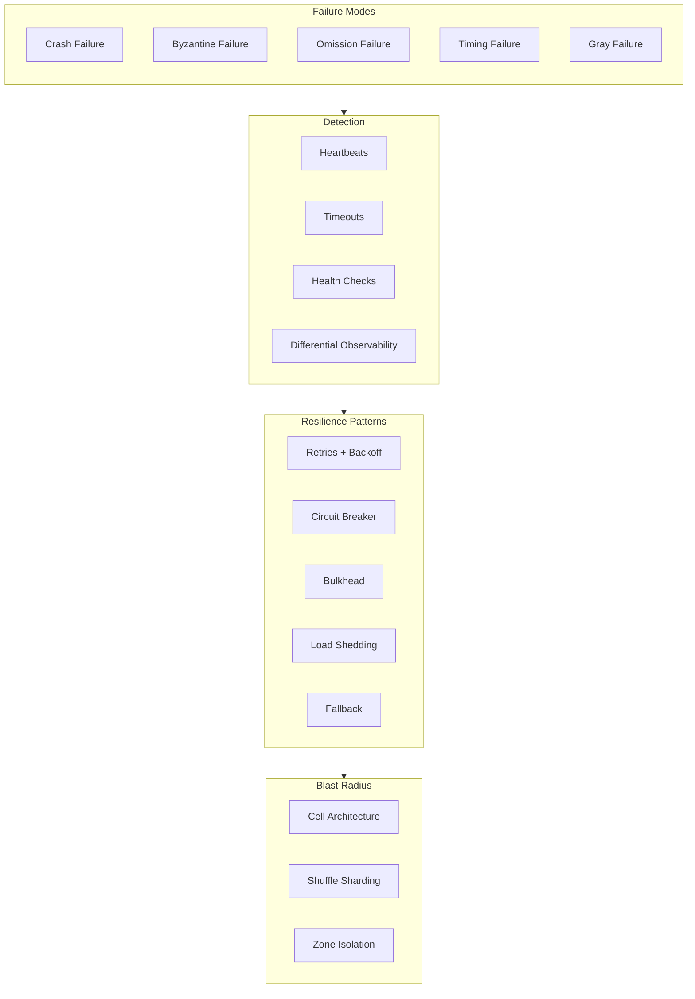
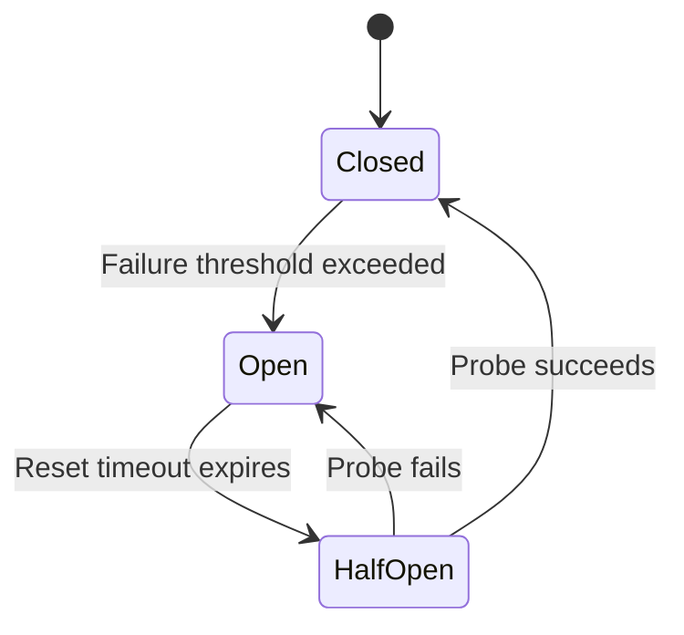

# Failure Modes and Resilience Patterns

Distributed systems fail in complex, often surprising ways. This article covers the taxonomy of failures—from clean crashes to insidious gray failures—and the resilience patterns that mitigate them. The focus is on design decisions: when to use each pattern, how to tune parameters, and what trade-offs you're accepting.

<figure>



<figcaption>Failure modes flow through detection mechanisms to mitigation patterns, with blast radius isolation as the outer defense layer.</figcaption>
</figure>

## Abstract

Failures in distributed systems form a spectrum from fail-stop (clean crash, easy to detect) to Byzantine (arbitrary behavior, hard to detect). The most dangerous are **gray failures**: partial degradation that passes health checks but causes cascading impact. Detection requires differential observability—comparing perspectives across system components.

Resilience patterns form a layered defense:

1. **Timeouts** bound waiting time but require careful tuning (too short = false positives, too long = resource exhaustion)
2. **Retries** recover from transient failures but can cause retry storms that amplify outages
3. **Circuit breakers** stop calling failing dependencies but need threshold tuning per dependency
4. **Bulkheads** isolate failures to prevent cascade but reduce resource efficiency
5. **Load shedding** protects capacity but requires priority decisions

The key insight: every resilience pattern has failure modes of its own. Circuit breakers can flap. Retry budgets can be exhausted by one bad actor. Bulkheads can be sized wrong. Resilience engineering is about layering imperfect defenses, not finding perfect solutions.

## Failure Mode Taxonomy

Understanding failure modes is prerequisite to designing resilience. The classic taxonomy from distributed systems literature:

### Fail-Stop Failures

The process crashes and stays crashed. Other processes can detect the failure (eventually) through timeout.

**Characteristics:**

- Clean, detectable, recoverable
- Process halts and performs no further actions
- Detected via heartbeat timeout

**Real-world example:** An OOM-killed container. Kubernetes detects the failure through liveness probe timeout, restarts the pod. Recovery is straightforward.

**Design implication:** If you can guarantee fail-stop semantics (crash rather than corrupt), recovery is simpler. This is why many systems prefer crashing on inconsistency detection over attempting recovery.

### Crash-Recovery Failures

The process crashes but may restart with partial state. More realistic than fail-stop for real systems.

**Characteristics:**

- Process may restart with stale or partial state
- Need to distinguish "slow" from "dead"
- Requires stable storage for state recovery

**Real-world example:** A database replica crashes mid-replication, restarts, and must replay the Write-Ahead Log (WAL) to reach a consistent state. During replay, it may reject reads or serve stale data depending on configuration.

**Design implication:** Recovery procedures must be idempotent. Operations that were in-flight at crash time may re-execute.

### Omission Failures

The process fails to send or receive messages but otherwise operates correctly.

**Characteristics:**

- **Send omission:** Process fails to send a message it should send
- **Receive omission:** Process fails to receive a message sent to it
- Often caused by full queues, network issues, or resource exhaustion

**Real-world example:** A message queue producer drops messages when the broker is slow (send omission). The producer continues operating, health checks pass, but data is being lost silently.

**Design implication:** Critical paths need acknowledgment and retry. Fire-and-forget is only acceptable for best-effort telemetry.

### Timing Failures

The process responds, but not within the expected time bound.

**Characteristics:**

- Response is correct but late
- Violates performance SLAs
- May be indistinguishable from omission if timeout fires first

**Real-world example:** A database query that normally takes 10ms takes 5 seconds due to lock contention. The caller times out at 1 second, assumes failure, retries—potentially worsening the contention.

**Design implication:** Timeouts must account for the difference between "failed" and "slow." Speculative execution (hedged requests) can help for idempotent operations.

### Byzantine Failures

The process exhibits arbitrary behavior—including malicious or irrational responses.

**Characteristics:**

- Can send conflicting information to different parties
- Can lie about its state
- Requires BFT (Byzantine Fault Tolerant) protocols to handle

**Real-world example:** A corrupted replica returns incorrect data that passes format validation but has wrong values. Or a compromised node in a blockchain network attempts double-spending.

**Design implication:** Byzantine tolerance requires 3f+1 replicas to tolerate f failures and is expensive. Most internal systems assume non-Byzantine failures (crash-only model) and rely on other controls (authentication, checksums) for integrity.

### Gray Failures

**The most dangerous failure mode in production systems.** Introduced by Microsoft Research in their 2017 paper "Gray Failure: The Achilles' Heel of Cloud-Scale Systems."

**Characteristics:**

- Partial degradation that evades health checks
- Different observers see different health states
- Often manifests as elevated latency, increased error rate on specific paths, or degraded throughput

**Why gray failures are dangerous:**

1. **Health checks pass:** The failing component responds to synthetic probes
2. **Partial impact:** Only certain request types or users affected
3. **Cascading potential:** Slow responses tie up caller resources
4. **Detection delay:** May take minutes to hours to confirm

**Real-world examples:**

- **AWS S3 outage (2017):** An operator command removed more capacity than intended. S3 continued responding but with elevated latency. Health checks passed. Cascading failures affected services depending on S3.
- **Cloudflare outage (2019):** A WAF rule caused CPU exhaustion. Health checks using simple endpoints passed while actual traffic was failing.
- **Meta/Facebook outage (2021):** BGP withdrawal caused DNS servers to become unreachable. Internal tools for recovery also depended on DNS.

**Detection requires differential observability:**

```
Observer A (health check): "Component is healthy"
Observer B (real traffic): "Requests are timing out"
Observer C (metrics): "P99 latency 10x normal"

Gray failure = divergence between observer perspectives
```

### Cascading Failures

One component's failure triggers failures in dependent components, amplifying the initial impact.

**Cascade mechanisms:**

| Mechanism               | Description                                  | Example                                                   |
| ----------------------- | -------------------------------------------- | --------------------------------------------------------- |
| **Resource exhaustion** | Failing component ties up caller resources   | Slow DB → thread pool exhaustion → upstream timeout       |
| **Retry storms**        | Failed requests trigger coordinated retries  | Service restart → all clients retry simultaneously        |
| **Load redistribution** | Remaining capacity receives diverted traffic | Node failure → remaining nodes overloaded → more failures |
| **Dependency chain**    | Failure propagates through call graph        | Auth service down → all authenticated endpoints fail      |

**Real-world example:** Amazon's 2004 "retry storm" incident. A service experienced increased latency. Callers retried. The retries increased load, worsening latency. More retries. The positive feedback loop took down multiple services.

## Detection Mechanisms

### Heartbeat and Liveness

**Mechanism:** Periodic messages prove the sender is alive.

**Design choices:**

| Parameter    | Consideration                                      |
| ------------ | -------------------------------------------------- |
| **Interval** | Shorter = faster detection, more overhead          |
| **Timeout**  | timeout = interval × missed_count + network_jitter |
| **Payload**  | Include load metrics for proactive detection       |

**Common mistake:** Using heartbeat interval = timeout. A single delayed heartbeat triggers false positive. Use at least 2-3 missed heartbeats before declaring failure.

**Real-world tuning (Cassandra):** Default `phi_convict_threshold` of 8 corresponds to ~10-12 seconds detection with default 1-second gossip interval. Tuned lower (6) for faster detection in low-latency networks.

### Health Checks

**Shallow vs. deep health checks:**

| Type                   | What It Tests                  | Failure Modes                                     |
| ---------------------- | ------------------------------ | ------------------------------------------------- |
| **Shallow** (TCP/HTTP) | Process is running, port open  | Misses gray failures, resource exhaustion         |
| **Deep** (functional)  | Critical path works end-to-end | Expensive, may timeout, can mask partial failures |
| **Dependency**         | Checks downstream connectivity | Can cause cascade if dependency is slow           |

**Design decision:** Separate liveness from readiness.

- **Liveness:** "Should this process be restarted?" Only fail if the process is fundamentally broken.
- **Readiness:** "Should traffic be routed here?" Fail if dependencies are unavailable or load is too high.

**Anti-pattern:** Health check that calls the database. If the DB is slow, health checks timeout, load balancer removes instance, traffic moves to other instances, they also become slow from increased load → cascade.

### Differential Observability

**Detecting gray failures requires multiple perspectives:**

1. **Active probing:** Synthetic requests from multiple vantage points
2. **Passive observation:** Real traffic metrics (latency, error rate)
3. **Internal instrumentation:** Queue depths, thread pool utilization
4. **External correlation:** Compare metrics across components

**Implementation pattern:**

```
// Simplified gray failure detection
grayFailureScore =
  healthCheckSuccess × 0.2 +     // Low weight: often passes during gray failure
  errorRateBelowThreshold × 0.3 +
  p99LatencyNormal × 0.3 +
  throughputNormal × 0.2

// Flag gray failure when:
// - Health checks pass
// - But other signals are degraded
if (healthCheckSuccess && grayFailureScore < 0.7) {
  alertGrayFailure()
}
```

## Resilience Patterns

### Timeouts

Every network call needs a timeout. Without one, a hung dependency can exhaust caller resources indefinitely.

**Design choices:**

#### Static Timeouts

**Mechanism:** Fixed timeout value, configured per operation.

**Best when:**

- Latency distribution is well-understood and stable
- Operation has clear SLA requirements
- Simple is preferred over optimal

**Setting static timeouts:**

```
timeout = p99_latency × safety_factor + network_jitter

Example:
- p99 latency: 100ms
- Safety factor: 2-3x
- Network jitter: 10ms
- Timeout: 100ms × 2.5 + 10ms = 260ms (round to 300ms)
```

**Trade-offs:**

- ✅ Simple to understand and debug
- ✅ Predictable behavior
- ❌ Doesn't adapt to changing conditions
- ❌ May be too aggressive during GC pauses or too lenient during failures

#### Adaptive Timeouts

**Mechanism:** Timeout adjusts based on observed latency.

**Best when:**

- Latency varies significantly (e.g., batch processing, variable workloads)
- Operations can tolerate variability
- Team can operate more complex logic

**Implementation approaches:**

| Approach             | Mechanism                                     | Example                       |
| -------------------- | --------------------------------------------- | ----------------------------- |
| **Percentile-based** | Timeout = p99 + buffer                        | Netflix's approach: p99 × 1.5 |
| **Moving average**   | Exponentially weighted MA of recent latencies | gRPC's adaptive approach      |
| **Hedging**          | Start second request after p50 latency        | Google's "The Tail at Scale"  |

**Trade-offs:**

- ✅ Adapts to changing conditions
- ✅ Can be more aggressive when service is healthy
- ❌ More complex to debug
- ❌ Can oscillate under certain conditions
- ❌ Cold start problem: no historical data

**Real-world example (gRPC):** gRPC's wait-for-ready semantics include exponential backoff with jitter. Initial timeout is configurable; subsequent attempts use adaptive backoff capped at a maximum.

### Retries

Retries recover from transient failures but can amplify problems when failures are persistent.

**Design choices:**

#### Retry with Exponential Backoff

**Mechanism:** Each retry waits longer than the previous.

```
wait_time = min(base_delay × 2^attempt, max_delay)

Example (AWS SDK defaults):
- Base delay: 100ms
- Max delay: 20 seconds
- Attempt 1: 100ms
- Attempt 2: 200ms
- Attempt 3: 400ms
- Attempt 4: 800ms
```

**Why exponential:** Linear backoff can still cause coordinated load. Exponential spreads retries over time, reducing coincident retry probability.

#### Jitter

**Critical addition to backoff:** Without jitter, clients that fail together retry together.

**Jitter strategies:**

| Strategy                | Formula                                            | Use Case                               |
| ----------------------- | -------------------------------------------------- | -------------------------------------- |
| **Full jitter**         | random(0, calculated_delay)                        | Default choice, maximum spread         |
| **Equal jitter**        | calculated_delay/2 + random(0, calculated_delay/2) | When you need some minimum wait        |
| **Decorrelated jitter** | random(base, previous_delay × 3)                   | AWS recommendation, even better spread |

**AWS's analysis (Marc Brooker's blog):** Decorrelated jitter showed best results in their simulations, completing work 40% faster than exponential backoff without jitter during contention.

#### Retry Budgets

**Problem:** Per-request retries can multiply load by the retry factor.

```
Normal: 100 requests/sec
With 3 retries: Up to 400 requests/sec during failure
```

**Solution:** Retry budgets limit total retry rate system-wide.

```
retry_budget = (total_requests × budget_ratio) - current_retries

Example (Envoy default):
- Budget ratio: 20%
- If baseline is 100 req/s, allow max 20 retries/s
- Once budget exhausted, no more retries until it refills
```

**Real-world implementation (Envoy):** Envoy implements retry budgets at the cluster level. Default is 20% of active requests can be retries. Prevents any single misbehaving upstream from consuming all retry capacity.

#### Retry Classification

Not all errors should be retried:

| Response                  | Retry?                   | Rationale                              |
| ------------------------- | ------------------------ | -------------------------------------- |
| **5xx Server Error**      | Yes, with backoff        | Transient; server may recover          |
| **429 Too Many Requests** | Yes, with longer backoff | Honor Retry-After header if present    |
| **408 Request Timeout**   | Yes, with backoff        | May be transient                       |
| **4xx Client Error**      | No                       | Request is malformed; retry won't help |
| **Connection refused**    | Yes, limited             | Server may be restarting               |
| **Connection reset**      | Yes                      | Network blip                           |
| **SSL handshake failure** | No                       | Certificate/config issue               |

**Idempotency requirement:** Only retry operations that are safe to repeat. POST requests that create resources need idempotency keys.

### Circuit Breaker

**Mechanism:** Stop calling a failing dependency, give it time to recover.



**States:**

| State         | Behavior                                                  |
| ------------- | --------------------------------------------------------- |
| **Closed**    | Normal operation; requests pass through; failures counted |
| **Open**      | Requests fail immediately; no calls to dependency         |
| **Half-Open** | Limited probe requests allowed; success resets to Closed  |

**Design decisions:**

#### Failure Counting Strategy

| Strategy        | Mechanism                         | Best For                               |
| --------------- | --------------------------------- | -------------------------------------- |
| **Count-based** | Open after N failures             | Simple, predictable                    |
| **Rate-based**  | Open when error rate > X%         | Handles varying traffic                |
| **Consecutive** | Open after N consecutive failures | Avoids flapping on intermittent errors |

**Real-world example (Hystrix, now deprecated but patterns live on):**

```
// Hystrix default configuration
circuitBreaker.requestVolumeThreshold = 20  // Min requests before evaluation
circuitBreaker.errorThresholdPercentage = 50  // Error rate to trip
circuitBreaker.sleepWindowInMilliseconds = 5000  // Time in Open before probe
```

#### Tuning Parameters

| Parameter            | Consideration                                                         |
| -------------------- | --------------------------------------------------------------------- |
| **Error threshold**  | Too low = flapping; too high = slow detection                         |
| **Volume threshold** | Prevents opening on low-traffic services                              |
| **Reset timeout**    | Too short = probe during ongoing failure; too long = delayed recovery |
| **Half-open probes** | Single probe is fragile; multiple probes add load                     |

**Anti-pattern:** Circuit breaker per request type on same dependency. If the dependency is down, it's down for all request types. Use per-dependency circuit breakers.

**Netflix's evolution:** Hystrix was deprecated in 2018. Netflix moved to adaptive systems (Concurrency Limits) that don't require manual threshold tuning. The adaptive approach measures actual latency and adjusts concurrency limits using TCP-like AIMD (Additive Increase, Multiplicative Decrease).

### Bulkhead

**Mechanism:** Isolate components so failure in one doesn't exhaust shared resources.

**Analogy:** Ship bulkheads prevent flooding in one compartment from sinking the entire ship.

**Design choices:**

#### Thread Pool Isolation

**Mechanism:** Separate thread pool per dependency.

```
Service A thread pool: 20 threads
Service B thread pool: 20 threads
Service C thread pool: 10 threads

If Service B hangs, only its 20 threads are blocked.
Service A and C continue operating.
```

**Trade-offs:**

- ✅ Strong isolation
- ✅ Failure is contained
- ❌ Thread overhead (each pool has threads)
- ❌ Under-utilization when traffic is uneven
- ❌ Context switching cost

#### Semaphore Isolation

**Mechanism:** Limit concurrent requests via semaphore; requests run on caller's thread.

**Trade-offs:**

- ✅ No thread overhead
- ✅ Lower latency (no queue/handoff)
- ❌ If dependency is slow, caller thread is blocked
- ❌ Timeout can't interrupt blocked thread

**When to use which:**

| Isolation Type  | Use When                                           |
| --------------- | -------------------------------------------------- |
| **Thread pool** | Dependency is unreliable; need timeout enforcement |
| **Semaphore**   | Dependency is reliable; latency is critical        |

#### Connection Pool Limits

**Mechanism:** Limit connections per downstream service.

```
Database connection pool: max 50
Cache connection pool: max 100
External API: max 20
```

**Sizing consideration:** Total connections across all instances shouldn't exceed dependency's capacity.

```
Instance count: 10
Per-instance connections: 50
Total: 500 connections

Database max_connections: 500 → OK
Database max_connections: 200 → Risk of connection exhaustion
```

### Load Shedding

**Mechanism:** Reject excess load to protect capacity for requests that can be served.

**Design choices:**

#### LIFO Queue Dropping

**Mechanism:** When queue is full, drop oldest requests (they've likely already timed out at caller).

**Real-world example (Amazon):** Amazon uses LIFO processing for some services. Requests that have been waiting longest are most likely to have callers that have already timed out—processing them wastes capacity.

#### Priority-Based Shedding

**Mechanism:** Classify requests by importance; shed lower priority first.

| Priority     | Examples                           | Shed First?     |
| ------------ | ---------------------------------- | --------------- |
| **Critical** | Health checks, auth tokens         | Never (or last) |
| **High**     | Paid user requests, real-time APIs | Last resort     |
| **Normal**   | Standard requests                  | When overloaded |
| **Low**      | Analytics, batch jobs              | First           |

**Implementation:** Priority typically in request header or derived from path/user.

#### Admission Control

**Mechanism:** Reject requests at the edge before they consume resources.

**Approaches:**

| Approach         | Mechanism                             |
| ---------------- | ------------------------------------- |
| **Token bucket** | Allow N requests per time window      |
| **Leaky bucket** | Smooth bursty traffic                 |
| **Adaptive**     | Adjust limit based on current latency |
| **Client-based** | Per-client quotas                     |

**Google's CoDel (Controlled Delay):** Admission control based on queue latency rather than queue length. If requests are sitting in queue too long (target: 5ms), start dropping. This adapts automatically to varying service capacity.

### Fallback Strategies

When the primary path fails, what's the backup?

| Strategy           | Description               | Trade-off                       |
| ------------------ | ------------------------- | ------------------------------- |
| **Cache fallback** | Return stale cached data  | Data may be outdated            |
| **Degraded mode**  | Return partial result     | Feature may be incomplete       |
| **Static default** | Return hardcoded response | May not be appropriate for user |
| **Fail silent**    | Return empty, continue    | Data loss may go unnoticed      |
| **Fail fast**      | Return error immediately  | Bad UX but honest               |

**Design decision:** Fallback appropriateness depends on the use case:

- **Product catalog:** Cache fallback is fine; products don't change every second
- **Account balance:** Fail fast; showing stale data causes real harm
- **Recommendations:** Degraded mode (show popular items) is reasonable
- **Authentication:** No fallback; either authorized or not

**Real-world example (Netflix):** Netflix's fallback hierarchy for recommendations:

1. Personalized recommendations (primary)
2. Genre-based recommendations (degraded)
3. Top 10 in region (more degraded)
4. Static curated list (last resort)

Each level provides worse UX but maintains core functionality.

## Blast Radius Isolation

Beyond individual resilience patterns, architectural decisions determine how far failures spread.

### Cell-Based Architecture

**Mechanism:** Divide the system into independent cells, each serving a subset of users.

**AWS's approach:** Many AWS services use cell-based architecture. Each cell:

- Has independent capacity and resources
- Serves a subset of customers (by account ID hash)
- Can fail without affecting other cells

**Characteristics:**

| Aspect           | Cell Architecture                   |
| ---------------- | ----------------------------------- |
| **Blast radius** | Limited to single cell (% of users) |
| **Scaling**      | Add more cells                      |
| **Complexity**   | Cell-aware routing required         |
| **Efficiency**   | Some redundancy across cells        |

**Real-world example (AWS DynamoDB):** DynamoDB uses partition-based isolation. Each partition is a cell. A hot partition affects only data in that partition; other partitions continue normally.

### Shuffle Sharding

**Mechanism:** Assign each customer to a random subset of resources.

**Why it works:** With pure sharding, a bad actor on shard 3 affects all customers on shard 3. With shuffle sharding, the probability that two customers share all resources is exponentially small.

**Math:**

```
Workers: 8
Workers per customer: 2
Combinations: C(8,2) = 28

Probability two random customers share both workers: 1/28 ≈ 3.6%
```

**Scaling benefit:** Adding more workers exponentially reduces collision probability.

**Real-world example (AWS Route 53):** Route 53 uses shuffle sharding for DNS nameservers. Each customer gets 4 nameservers from a pool of hundreds. A DDoS on one customer's nameservers has minimal probability of affecting another customer's full set.

### Zone and Region Isolation

**Design choices:**

| Scope            | Use Case               | Trade-off                                   |
| ---------------- | ---------------------- | ------------------------------------------- |
| **Single zone**  | Minimize latency       | No zone failure tolerance                   |
| **Multi-zone**   | Survive zone failure   | Cross-zone data transfer cost               |
| **Multi-region** | Survive region failure | Complexity, latency, consistency challenges |

**Capacity planning for zone failure:**

```
Required capacity: 1000 req/s
Zones: 3
Per-zone capacity if any zone must handle full load: 1000 req/s each
Total provisioned: 3000 req/s (3x over-provisioned)

Alternative: Accept degradation during zone failure
Per-zone capacity: 500 req/s
Normal operation: 1500 req/s capacity, 67% headroom
During zone failure: 1000 req/s capacity, 0% headroom
```

## Chaos Engineering

### Principles

Chaos engineering is **empirical validation of system resilience**. The goal is to discover weaknesses before they manifest in production incidents.

**Core process:**

1. Define steady state (what "normal" looks like)
2. Hypothesize that steady state continues during failure
3. Inject failure
4. Observe if hypothesis holds
5. Fix discovered weaknesses

**Chaos is not:** Random destruction in production. It's controlled experimentation with blast radius limits.

### Failure Injection Types

| Category           | Examples                                                |
| ------------------ | ------------------------------------------------------- |
| **Infrastructure** | VM termination, disk failure, network partition         |
| **Application**    | Process crash, memory exhaustion, CPU contention        |
| **Network**        | Latency injection, packet loss, DNS failure             |
| **Dependency**     | Database slowdown, cache failure, third-party API error |

### Tools and Approaches

| Tool               | Scope          | Approach                        |
| ------------------ | -------------- | ------------------------------- |
| **Chaos Monkey**   | Instance       | Randomly terminates instances   |
| **Chaos Kong**     | Region         | Simulates entire region failure |
| **Latency Monkey** | Network        | Injects artificial latency      |
| **AWS FIS**        | AWS resources  | Managed fault injection         |
| **Gremlin**        | Multi-platform | Commercial chaos platform       |
| **LitmusChaos**    | Kubernetes     | CNCF chaos project              |

### Game Days

Scheduled chaos exercises with teams prepared to observe and respond.

**Netflix's approach:**

1. **Announce:** Teams know chaos is happening (builds confidence)
2. **Define scope:** Which services, what failures
3. **Establish abort criteria:** When to stop the experiment
4. **Execute:** Run chaos scenario
5. **Observe:** Monitor dashboards, alerts, user impact
6. **Debrief:** Document findings, prioritize fixes

**Progression:**

1. Start in non-production (staging/dev)
2. Graduate to production during low-traffic periods
3. Eventually run during peak (Netflix runs Chaos Monkey continuously)

**Real-world example (AWS):** AWS runs "Game Days" internally where teams deliberately break dependencies to validate runbooks and recovery procedures. Findings feed back into service design.

## Common Pitfalls

### 1. Retry Without Backoff

**The mistake:** Immediate retry on failure.

**Why it happens:** Developer thinks "if it failed, try again immediately."

**The consequence:** Retry storm. A service that failed under load receives 3x the load from retries, guaranteeing it stays down.

**The fix:** Always use exponential backoff with jitter. Consider retry budgets.

### 2. Timeout Longer Than Caller's Timeout

**The mistake:** Service A calls Service B with 5s timeout. Service B calls Service C with 10s timeout.

**Why it happens:** Each team sets timeouts independently.

**The consequence:** Service B may wait 10s for C, but A has already timed out at 5s. B's work is wasted.

**The fix:** Propagate deadline through the call chain. Each service's timeout = min(remaining_deadline, own_timeout).

### 3. Health Check That Masks Gray Failure

**The mistake:** Health check is a simple "ping" endpoint that always returns 200.

**Why it happens:** Simplest health check to implement.

**The consequence:** Gray failures go undetected. Service continues receiving traffic despite being degraded.

**The fix:** Health checks should test critical path. But be careful: deep health checks can cause cascading failures. Use readiness probes that check dependencies, liveness probes that don't.

### 4. Circuit Breaker That Never Opens

**The mistake:** Error threshold too high or volume threshold never reached.

**Why it happens:** Defaults may not match your traffic patterns.

**The consequence:** Circuit breaker provides no protection; might as well not exist.

**The fix:** Tune based on actual traffic. Log circuit breaker state transitions. Alert on unexpected closed→open transitions.

### 5. Bulkhead Sized Wrong

**The mistake:** Thread pool of 100 for a dependency that can handle 10 concurrent requests.

**Why it happens:** Bulkhead sized for expected traffic, not dependency capacity.

**The consequence:** Bulkhead allows 100 requests through; dependency overwhelmed.

**The fix:** Size bulkheads to dependency capacity, not caller expectations.

### 6. Fallback That Depends on the Same Failure

**The mistake:** Primary path calls Service A. Fallback also calls Service A (different endpoint).

**Why it happens:** Fallback reuses same client/connection.

**The consequence:** If Service A is down, both primary and fallback fail.

**The fix:** Fallback must be independent of primary failure. Use cache, static data, or different service.

**Real-world example (Meta outage, 2021):** Engineers couldn't access internal tools to fix the BGP issue because internal tools depended on the same DNS/network that was down. Recovery required physical access to data centers.

## Conclusion

Failure handling is not a feature to add later—it's a fundamental design concern. Key principles:

1. **Assume failure:** Every dependency will fail. Design for it.
2. **Detect quickly:** Gray failures are the hardest; use differential observability.
3. **Contain blast radius:** Bulkheads, cells, and shuffle sharding limit impact.
4. **Degrade gracefully:** Fallbacks should provide value even when degraded.
5. **Recover automatically:** Self-healing > operator intervention.
6. **Validate continuously:** Chaos engineering proves resilience; don't just hope.

The goal isn't to prevent all failures—it's to ensure that when failures occur (and they will), the system degrades gracefully and recovers quickly.

## Appendix

### Prerequisites

- Basic distributed systems concepts (network partitions, replication)
- Familiarity with microservice architecture
- Understanding of latency percentiles (p50, p99)

### Summary

- **Failure taxonomy:** Fail-stop < crash-recovery < omission < timing < Byzantine. Gray failures are the most dangerous—partial degradation that evades health checks.
- **Detection:** Differential observability (multiple perspectives) catches gray failures that single health checks miss.
- **Resilience patterns:** Timeouts → retries (with backoff + jitter + budgets) → circuit breakers → bulkheads → load shedding → fallbacks. Layer them.
- **Blast radius:** Cell architecture and shuffle sharding limit how many users are affected.
- **Chaos engineering:** Empirically validate resilience. Start small, graduate to production.
- **Key insight:** Every resilience pattern has its own failure modes. Defense in depth, not silver bullets.

### References

- Huang, P., et al. "Gray Failure: The Achilles' Heel of Cloud-Scale Systems" (HotOS 2017) - Microsoft Research paper defining gray failures
- Nygard, M. "Release It!" - Foundational book on stability patterns (circuit breaker, bulkhead originated here)
- Brooker, M. "Exponential Backoff and Jitter" - AWS Architecture Blog analysis of jitter strategies
- Dean, J. and Barroso, L. "The Tail at Scale" - Google paper on hedged requests and latency percentiles
- Netflix Tech Blog - Hystrix, resilience patterns, and chaos engineering
- Amazon Builders' Library - Timeouts, retries, and backoff; cell-based architecture
- Google SRE Book - Chapter on handling overload
- Kubernetes Documentation - Liveness and readiness probes design patterns
