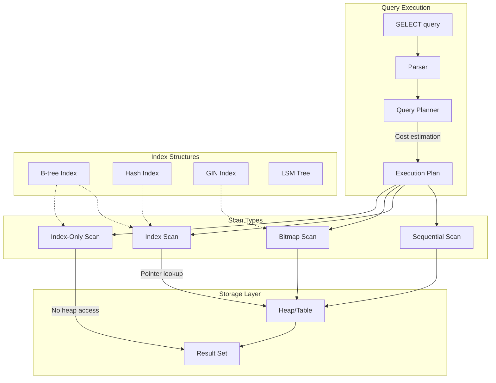

# Indexing and Query Optimization

Database indexes accelerate reads by trading write overhead and storage for faster lookups. This article covers index data structures, composite index design, query planner behavior, and maintenance strategies for production systems.

<figure>



<figcaption>Query execution flow: planner estimates costs, selects scan type based on selectivity, and accesses data through indexes or heap.</figcaption>
</figure>

## Abstract

Indexing is fundamentally a space-time trade-off: you pay storage and write overhead to reduce read latency. The key mental model:

- **B-tree** indexes maintain sorted order, enabling range queries and equality lookups with $O(\log n)$ complexity
- **Hash** indexes provide $O(1)$ equality lookups but cannot support range queries or ordering
- **LSM trees** optimize for write-heavy workloads by batching writes in memory before flushing to disk
- **Composite indexes** follow the **leftmost prefix rule**—queries must filter on leading columns to use the index efficiently
- **Covering indexes** include all columns needed by a query, enabling index-only scans that skip heap access entirely
- **Selectivity** determines whether an index helps: high-selectivity queries (few rows) benefit from indexes; low-selectivity queries (many rows) often prefer sequential scans
- **Write amplification** scales linearly with index count—each INSERT/UPDATE/DELETE modifies every relevant index

The query planner makes cost-based decisions using statistics about data distribution. Understanding these costs—`seq_page_cost`, `random_page_cost`, and row estimates—explains why the planner sometimes ignores your carefully crafted indexes.

## Index Data Structures

### B-tree: The Default Choice

B-tree (technically B+ tree in most implementations) is the default index type in PostgreSQL, MySQL, and most relational databases. It maintains sorted key-value pairs with $O(\log n)$ lookup, insertion, and deletion.

**How it works:** Internal nodes contain keys and pointers to child nodes. Leaf nodes contain the actual key-value pairs (or pointers to heap tuples). All leaves are at the same depth, ensuring consistent access time regardless of key value.

**Supported operations:**

- Equality: `WHERE col = value`
- Range: `WHERE col > value`, `BETWEEN`, `IN`
- Prefix matching: `WHERE col LIKE 'prefix%'`
- Sorting: `ORDER BY col` without additional sort step

**Best when:**

- Mixed read/write workloads
- Need range queries or ordering
- General-purpose indexing needs

**Trade-offs:**

- ✅ Supports both equality and range queries
- ✅ Natural ordering enables efficient `ORDER BY`
- ✅ Mature, well-understood, stable
- ❌ Write amplification on updates (all indexes must be updated)
- ❌ Random I/O for non-sequential access patterns
- ❌ Page splits can fragment index over time

**Real-world example:** MySQL InnoDB uses B+ trees for both primary (clustered) and secondary indexes. The primary index stores the actual row data in leaf nodes, while secondary indexes store primary key values as pointers—requiring a second lookup to fetch the row.

### Hash Index: O(1) Equality Lookups

Hash indexes compute a hash of the indexed value and store it in a hash table. This provides constant-time lookups for exact matches.

**Supported operations:**

- Equality only: `WHERE col = value`

**Limitations:**

- No range queries (`<`, `>`, `BETWEEN`)
- No ordering (`ORDER BY`)
- No prefix matching (`LIKE 'prefix%'`)

**When to use:**

- Point lookups on high-cardinality columns
- Equality-only access patterns
- When B-tree overhead is measurable

> **PostgreSQL note:** Hash indexes were not crash-safe until PostgreSQL 10 and not logged to WAL until then. They're now fully supported but still rarely outperform B-trees in practice due to PostgreSQL's efficient B-tree implementation.

**Trade-offs:**

- ✅ O(1) lookup for equality
- ✅ Smaller index size for certain data types
- ❌ No range queries or ordering
- ❌ Hash collisions degrade performance
- ❌ Cannot be used for `ORDER BY`

### LSM Trees: Write-Optimized Storage

Log-Structured Merge (LSM) trees optimize for write-heavy workloads by buffering writes in memory before flushing to disk in sorted runs.

**How it works:**

1. Writes go to an in-memory buffer (memtable)
2. When memtable fills, it's flushed to disk as an immutable sorted file (SSTable)
3. Background compaction merges SSTables to maintain read performance

**Read path:** Check memtable → check each SSTable level → use Bloom filters to skip SSTables that definitely don't contain the key.

**Databases using LSM trees:**

- Cassandra, ScyllaDB
- RocksDB (used by CockroachDB, TiKV)
- LevelDB
- HBase

**Trade-offs:**

- ✅ High write throughput (sequential I/O)
- ✅ Better space efficiency with compaction
- ✅ Write amplification amortized across batches
- ❌ Read amplification (may check multiple SSTables)
- ❌ Range queries slower than B-tree
- ❌ Compaction causes I/O spikes
- ❌ Bloom filter overhead for non-existent keys

**Real-world example:** CockroachDB uses RocksDB (LSM-based) as its storage engine while providing SQL semantics. They accept the read amplification trade-off because their workload prioritizes write scalability across distributed nodes.

### Decision Matrix: Index Data Structures

| Factor                 | B-tree    | Hash                 | LSM Tree                   |
| ---------------------- | --------- | -------------------- | -------------------------- |
| Equality queries       | O(log n)  | O(1)                 | O(log n) + levels          |
| Range queries          | Excellent | Not supported        | Slower than B-tree         |
| Write throughput       | Moderate  | Moderate             | Excellent                  |
| Read throughput        | Excellent | Excellent (equality) | Good with Bloom filters    |
| Space efficiency       | Moderate  | Good                 | Better (compaction)        |
| Operational complexity | Low       | Low                  | Higher (compaction tuning) |

## Specialized Index Types

### GIN: Generalized Inverted Index

GIN indexes map element values to the rows containing them—essentially an inverted index. Designed for composite values like arrays, JSONB, and full-text search.

**Use cases:**

- Full-text search: `WHERE document @@ to_tsquery('search terms')`
- JSONB containment: `WHERE data @> '{"key": "value"}'`
- Array membership: `WHERE tags @> ARRAY['tag1', 'tag2']`

**How it works:** GIN breaks composite values into elements and creates an entry for each element pointing to all rows containing it. For JSONB, this means indexing each key-value pair separately.

**Trade-offs:**

- ✅ Fast containment queries on composite types
- ✅ Supports complex operators (`@>`, `?`, `?|`, `?&`)
- ❌ Higher write overhead (multiple index entries per row)
- ❌ Only supports Bitmap Index Scans (not Index-Only Scans)
- ❌ Slower to build than B-tree

**JSONB operator classes:**

- `jsonb_ops` (default): Supports all JSONB operators, larger index
- `jsonb_path_ops`: Only supports `@>`, smaller and faster for containment

```sql title="GIN index for JSONB" collapse={1-2}
-- Create GIN index on JSONB column
CREATE INDEX idx_data_gin ON events USING GIN (data);

-- This query uses the index
SELECT * FROM events WHERE data @> '{"type": "purchase"}';

-- This does NOT use the index (equality, not containment)
SELECT * FROM events WHERE data->>'type' = 'purchase';
```

### GiST: Generalized Search Tree

GiST provides a framework for building custom index types. PostgreSQL uses it for geometric types, range types, and full-text search.

**Built-in GiST use cases:**

- Geometric queries: `WHERE point <@ polygon`
- Range overlaps: `WHERE daterange && '[2024-01-01, 2024-12-31]'`
- Nearest-neighbor: `ORDER BY location <-> point '(x,y)' LIMIT 10`

**GIN vs GiST for full-text search:**

| Factor          | GIN        | GiST    |
| --------------- | ---------- | ------- |
| Lookup speed    | ~3x faster | Slower  |
| Build time      | ~3x longer | Faster  |
| Update overhead | Higher     | Lower   |
| Index size      | Larger     | Smaller |

**Recommendation:** GIN for read-heavy, GiST for write-heavy full-text search workloads.

### BRIN: Block Range Index

BRIN (Block Range INdex) stores summary information about ranges of physical table blocks. Extremely small but only effective when data is physically sorted.

**How it works:** Divides table into block ranges and stores min/max values for each range. Query planner skips ranges that cannot contain matching rows.

**Ideal for:**

- Time-series data with append-only writes
- Naturally ordered data (timestamps, sequential IDs)
- Very large tables where B-tree overhead is prohibitive

**Trade-offs:**

- ✅ Tiny index size (orders of magnitude smaller than B-tree)
- ✅ Minimal write overhead
- ❌ Only effective when data is physically clustered
- ❌ Coarse-grained filtering (may scan many false-positive blocks)
- ❌ Updates that break clustering destroy effectiveness

```sql title="BRIN for time-series data" collapse={1-2}
-- BRIN index on timestamp column for append-only time-series
CREATE INDEX idx_events_created_brin ON events USING BRIN (created_at);

-- Effective query (scans only relevant block ranges)
SELECT * FROM events
WHERE created_at BETWEEN '2024-01-01' AND '2024-01-02';
```

### Partial Indexes: Index a Subset of Rows

Partial indexes include only rows matching a predicate. They reduce index size and maintenance overhead when queries consistently filter on specific conditions.

**Use cases:**

- Active records: `WHERE status = 'active'`
- Unprocessed items: `WHERE processed = false`
- Soft-deleted exclusion: `WHERE deleted_at IS NULL`

```sql title="Partial index for active orders" collapse={1-2}
-- Full index: indexes all 10M rows
CREATE INDEX idx_orders_customer ON orders (customer_id);

-- Partial index: only indexes ~100K active orders
CREATE INDEX idx_orders_customer_active ON orders (customer_id)
WHERE status = 'pending';

-- This query uses the partial index
SELECT * FROM orders WHERE customer_id = 123 AND status = 'pending';

-- This query CANNOT use the partial index (different predicate)
SELECT * FROM orders WHERE customer_id = 123 AND status = 'shipped';
```

**Critical limitation:** The query's `WHERE` clause must logically imply the index predicate. If the planner cannot prove the implication, it won't use the partial index.

**Trade-offs:**

- ✅ Smaller index size (only indexed rows)
- ✅ Lower write overhead (only maintains index for matching rows)
- ✅ Better selectivity on indexed subset
- ❌ Only usable when query implies index predicate
- ❌ Query changes may invalidate index usage

**Real-world example:** Queue tables often have millions of historical rows but only thousands of pending items. A partial index on `WHERE status = 'pending'` keeps the index small regardless of table growth.

## Composite Index Design

### The Leftmost Prefix Rule

Composite indexes are B-trees on multiple columns. The index sorts by the first column, then by the second within each first-column value, and so on.

**Critical rule:** Queries can only use a composite index if they filter on a leftmost prefix of the index columns.

For index `(a, b, c)`:

- ✅ `WHERE a = 1` — uses index
- ✅ `WHERE a = 1 AND b = 2` — uses index
- ✅ `WHERE a = 1 AND b = 2 AND c = 3` — uses index (full)
- ❌ `WHERE b = 2` — cannot use index
- ❌ `WHERE b = 2 AND c = 3` — cannot use index
- ⚠️ `WHERE a = 1 AND c = 3` — uses index only for `a`, then filters

**Range predicates stop index usage for subsequent columns:**

```sql title="Range predicates in composite indexes"
-- Index: (a, b, c)

-- Full index usage: equality on all columns
WHERE a = 1 AND b = 2 AND c = 3

-- Partial usage: range on 'b' stops index at 'b'
WHERE a = 1 AND b > 2 AND c = 3  -- only (a, b) used, c filtered later

-- Optimal reordering: equality columns first, range last
WHERE a = 1 AND c = 3 AND b > 2  -- if index is (a, c, b), full usage
```

### Column Ordering Strategy

**General principle:** Order columns by query patterns and selectivity.

1. **Equality columns first:** Columns used with `=` should precede range columns
2. **High selectivity for leading columns:** More selective columns narrow the search faster
3. **Range/ORDER BY columns last:** Range predicates terminate index traversal for subsequent columns

**Example: E-commerce order queries**

```sql title="Composite index design for orders" collapse={1-4}
-- Common queries:
-- 1. SELECT * FROM orders WHERE customer_id = ? AND status = ? ORDER BY created_at DESC
-- 2. SELECT * FROM orders WHERE customer_id = ? AND created_at > ?
-- 3. SELECT * FROM orders WHERE status = ? ORDER BY created_at DESC

-- Optimal index for query 1:
CREATE INDEX idx_orders_cust_status_created
ON orders (customer_id, status, created_at DESC);

-- For query 2, same index works (uses customer_id, skips status, filters created_at)
-- For query 3, need separate index:
CREATE INDEX idx_orders_status_created
ON orders (status, created_at DESC);
```

### Selectivity and Cardinality

**Cardinality:** Number of distinct values in a column.
**Selectivity:** Fraction of rows returned by a predicate. Higher selectivity = fewer rows = better index candidate.

```
Selectivity = 1 / Cardinality
```

**High-cardinality examples:** User IDs, order numbers, timestamps
**Low-cardinality examples:** Status codes, boolean flags, country codes

**Composite index selectivity:** The combined selectivity of multiple columns can make even low-cardinality columns index-worthy.

| Column                | Cardinality | Selectivity |
| --------------------- | ----------- | ----------- |
| status                | 5           | 20%         |
| customer_id           | 100,000     | 0.001%      |
| (status, customer_id) | ~500,000    | 0.0002%     |

**Pitfall:** Don't index low-cardinality columns alone. A boolean flag with 50/50 distribution has 50% selectivity—the planner will likely prefer a sequential scan.

### Covering Indexes and Index-Only Scans

A covering index includes all columns needed by a query, eliminating heap access entirely.

**PostgreSQL syntax (INCLUDE clause):**

```sql title="Covering index with INCLUDE" collapse={1-2}
-- Index columns used for filtering/ordering
-- INCLUDE columns used only for retrieval
CREATE INDEX idx_orders_covering ON orders (customer_id, status)
INCLUDE (total_amount, created_at);

-- This query can be satisfied entirely from the index
SELECT customer_id, status, total_amount, created_at
FROM orders
WHERE customer_id = 123 AND status = 'completed';

-- EXPLAIN shows: Index Only Scan
```

**MySQL approach:** InnoDB secondary indexes automatically include primary key columns. For true covering indexes, include needed columns in the index definition.

**Trade-offs:**

- ✅ Eliminates heap access (major I/O savings)
- ✅ Significant speedup for read-heavy queries
- ❌ Larger index size (included columns stored in every leaf)
- ❌ No B-tree deduplication in PostgreSQL for covering indexes
- ❌ Increased write overhead

**When to use:**

- Frequently executed queries returning few columns
- Read-heavy workloads with stable query patterns
- Hot queries identified via `pg_stat_statements` or slow query log

**When to avoid:**

- Write-heavy tables with frequent updates
- Large included columns (text, JSON)
- Volatile query patterns

**Real-world example:** pganalyze benchmarked a covering index on 10M rows: query time dropped from 0.6ms to 0.06ms (10x improvement) by avoiding heap fetches.

## Query Planner Behavior

### Cost-Based Optimization

PostgreSQL's query planner estimates execution cost for each possible plan and chooses the lowest-cost option. Understanding cost estimation explains seemingly irrational index choices.

**Key cost parameters:**

| Parameter              | Default | Meaning                            |
| ---------------------- | ------- | ---------------------------------- |
| `seq_page_cost`        | 1.0     | Cost of sequential disk page read  |
| `random_page_cost`     | 4.0     | Cost of random disk page read      |
| `cpu_tuple_cost`       | 0.01    | Cost of processing one row         |
| `cpu_index_tuple_cost` | 0.005   | Cost of processing one index entry |
| `cpu_operator_cost`    | 0.0025  | Cost of executing one operator     |

**Why indexes get ignored:**

1. **Low selectivity:** If the query returns >5-15% of rows, sequential scan is often cheaper (sequential I/O beats random I/O)

2. **Small tables:** Tables fitting in one disk page always get sequential scans—index overhead exceeds benefit

3. **Stale statistics:** `ANALYZE` hasn't run; planner has wrong cardinality estimates

4. **Correlation:** If physical row order matches index order, sequential scan with filter is efficient

### Reading EXPLAIN Output

```sql title="EXPLAIN ANALYZE example" collapse={1-3}
EXPLAIN (ANALYZE, BUFFERS, FORMAT TEXT)
SELECT * FROM orders WHERE customer_id = 12345 AND status = 'pending';

-- Output:
Index Scan using idx_orders_cust_status on orders
    (cost=0.43..8.45 rows=1 width=120)
    (actual time=0.025..0.027 rows=3 loops=1)
  Index Cond: ((customer_id = 12345) AND (status = 'pending'))
  Buffers: shared hit=4
Planning Time: 0.152 ms
Execution Time: 0.045 ms
```

**Key metrics:**

- **cost:** Estimated startup cost..total cost (in arbitrary units)
- **rows:** Estimated rows returned
- **actual time:** Real execution time in milliseconds
- **Buffers: shared hit:** Pages found in buffer cache
- **Buffers: shared read:** Pages read from disk

**Scan types:**

| Scan Type         | Description                     | When Used                                 |
| ----------------- | ------------------------------- | ----------------------------------------- |
| Seq Scan          | Full table scan                 | Low selectivity, small tables             |
| Index Scan        | Traverse index, fetch from heap | High selectivity, single rows             |
| Index Only Scan   | Index satisfies query entirely  | Covering index, clean visibility map      |
| Bitmap Index Scan | Build bitmap of matching pages  | Multiple conditions, moderate selectivity |
| Bitmap Heap Scan  | Fetch pages from bitmap         | Follows Bitmap Index Scan                 |

### When Planner Chooses Sequential Scan

**Threshold behavior:** As selectivity decreases, index scan cost rises while sequential scan cost stays constant. At some crossover point, sequential scan wins.

```
Index Scan Cost ∝ (matching_rows × random_page_cost) + (matching_rows × cpu_tuple_cost)
Sequential Scan Cost ∝ (total_pages × seq_page_cost) + (total_rows × cpu_tuple_cost)
```

**Practical heuristics:**

- <5% of rows: Index scan usually wins
- 5-15% of rows: Depends on data distribution, correlation
- > 15% of rows: Sequential scan often wins

**Forcing index usage (for testing only):**

```sql title="Temporarily disable sequential scans"
SET enable_seqscan = off;  -- Forces index usage for testing
EXPLAIN ANALYZE SELECT ...;
SET enable_seqscan = on;   -- Re-enable for production
```

> **Warning:** Never disable `seqscan` in production. If the planner prefers sequential scan, it's usually correct. Fix the root cause (statistics, index design) instead.

### Statistics and ANALYZE

The planner relies on statistics in `pg_statistic` (PostgreSQL) or `information_schema.STATISTICS` (MySQL). Stale statistics cause poor plans.

**PostgreSQL statistics collection:**

- `autovacuum` runs `ANALYZE` automatically based on row changes
- Manual: `ANALYZE table_name;` or `ANALYZE table_name(column);`
- Statistics are sampled, not exact (default: 100 sample pages)

**Key statistics:**

- **n_distinct:** Estimated number of distinct values
- **most_common_vals:** Most frequent values and their frequencies
- **histogram_bounds:** Distribution of non-common values

**MySQL statistics:**

- InnoDB samples 20 random pages by default
- `ANALYZE TABLE` updates statistics
- `innodb_stats_persistent` controls persistence across restarts

**Symptoms of stale statistics:**

- Planner estimates differ wildly from actual rows
- Unexpected sequential scans on indexed columns
- Nested loop joins on large tables

## Write Amplification and Index Overhead

### The Cost of Indexes

Every index adds overhead to write operations. With $n$ indexes on a table, each `INSERT` performs $n + 1$ writes (table + each index). Updates are worse: each modified indexed column triggers index updates.

**PostgreSQL's MVCC complication:** When any column changes, PostgreSQL creates a new tuple version. All indexes pointing to the old tuple must be updated to point to the new one—even if the indexed columns didn't change.

**MySQL InnoDB difference:** Secondary indexes store primary key values, not physical pointers. Row updates that don't change indexed columns or primary key require no secondary index updates.

**Real-world impact:** Uber's PostgreSQL deployment had tables with 50+ indexes. A single row update triggered 50+ index modifications, causing:

- 10x write amplification
- Massive WAL (Write-Ahead Log) volume
- Replication lag during peak traffic

This architectural difference contributed to Uber's migration from PostgreSQL to MySQL for their trip data.

### Measuring Index Overhead

**PostgreSQL: `pg_stat_user_indexes`**

```sql title="Find unused indexes" collapse={1-3}
SELECT schemaname, relname, indexrelname,
       idx_scan, idx_tup_read, idx_tup_fetch,
       pg_size_pretty(pg_relation_size(indexrelid)) AS size
FROM pg_stat_user_indexes
WHERE idx_scan = 0  -- Never used
ORDER BY pg_relation_size(indexrelid) DESC;
```

**MySQL: Performance Schema**

```sql title="Find unused indexes in MySQL" collapse={1-3}
SELECT object_schema, object_name, index_name
FROM performance_schema.table_io_waits_summary_by_index_usage
WHERE index_name IS NOT NULL
  AND count_star = 0
ORDER BY object_schema, object_name;
```

### Index Maintenance Strategies

**1. Identify and remove unused indexes**

Unused indexes waste storage and slow writes with zero benefit. Query `pg_stat_user_indexes` (PostgreSQL) or Performance Schema (MySQL) for indexes with zero scans over a representative time period.

**2. Identify redundant indexes**

Index `(a, b)` makes index `(a)` redundant for most queries. Tools like `pg_idx_advisor` can detect redundancies.

**3. Consolidate overlapping indexes**

Multiple indexes with similar column prefixes can often be merged:

- `(a)`, `(a, b)`, `(a, b, c)` → Keep only `(a, b, c)` if all queries use leftmost prefix

**4. Consider partial indexes for skewed data**

If 95% of queries filter on `status = 'active'` and only 5% of rows are active, a partial index `WHERE status = 'active'` is dramatically smaller and faster.

## Index Bloat and Maintenance

### Understanding Bloat

Index bloat occurs when deleted or updated rows leave dead space in index pages. PostgreSQL's MVCC creates dead tuples that remain until `VACUUM` cleans them.

**Causes:**

- High update/delete rates
- Long-running transactions holding old snapshots
- Aggressive `autovacuum` settings not keeping pace

**Symptoms:**

- Index size grows despite stable row count
- Query performance degrades over time
- Higher-than-expected I/O for index operations

### Measuring Bloat

**PostgreSQL: `pgstattuple` extension**

```sql title="Check index bloat" collapse={1-3}
CREATE EXTENSION IF NOT EXISTS pgstattuple;

SELECT * FROM pgstattuple('idx_orders_customer');
-- avg_leaf_density < 70% indicates significant bloat

-- For indexes specifically:
SELECT * FROM pgstatindex('idx_orders_customer');
-- leaf_fragmentation > 30% suggests rebuild needed
```

**Heuristic:** Index size significantly larger than `(rows × avg_row_size × 1.2)` suggests bloat.

### VACUUM vs REINDEX

**VACUUM:** Marks dead tuples as reusable but doesn't reclaim space. Index pages with dead entries remain allocated.

**REINDEX:** Rebuilds the index from scratch, reclaiming all bloat.

```sql title="Concurrent reindex" collapse={1-2}
-- Non-blocking rebuild (PostgreSQL 12+)
REINDEX INDEX CONCURRENTLY idx_orders_customer;

-- Table-level (all indexes)
REINDEX TABLE CONCURRENTLY orders;
```

**REINDEX CONCURRENTLY:**

- Builds new index alongside old
- Multiple passes to capture concurrent changes
- Swaps pointers atomically
- Takes longer but allows reads/writes throughout

**When to REINDEX:**

- Bloat exceeds 20-30%
- Query performance has degraded
- After bulk deletes or large schema changes

**Scheduling:** Run `REINDEX CONCURRENTLY` during low-traffic periods. Even concurrent rebuilds consume I/O and CPU.

### Autovacuum Tuning

**Key parameters:**

| Parameter                        | Default | Recommendation                     |
| -------------------------------- | ------- | ---------------------------------- |
| `autovacuum_vacuum_scale_factor` | 0.2     | Lower for large tables (0.01-0.05) |
| `autovacuum_vacuum_threshold`    | 50      | Keep default                       |
| `autovacuum_naptime`             | 1min    | Keep default or lower              |
| `maintenance_work_mem`           | 64MB    | Increase for faster vacuum         |

**Per-table settings for hot tables:**

```sql title="Aggressive autovacuum for hot table"
ALTER TABLE hot_events SET (
    autovacuum_vacuum_scale_factor = 0.01,
    autovacuum_vacuum_threshold = 1000,
    autovacuum_analyze_scale_factor = 0.005
);
```

## Monitoring and Diagnostics

### PostgreSQL: pg_stat_statements

`pg_stat_statements` tracks execution statistics for all queries, normalized by parameter values.

```sql title="Find slow queries" collapse={1-3}
-- Enable extension
CREATE EXTENSION IF NOT EXISTS pg_stat_statements;

-- Top queries by total time
SELECT query,
       calls,
       mean_exec_time::numeric(10,2) AS avg_ms,
       total_exec_time::numeric(10,2) AS total_ms,
       rows
FROM pg_stat_statements
ORDER BY total_exec_time DESC
LIMIT 20;

-- Reset statistics
SELECT pg_stat_statements_reset();
```

**Key metrics:**

- `total_exec_time`: Cumulative execution time
- `calls`: Number of executions
- `mean_exec_time`: Average execution time
- `rows`: Total rows returned
- `shared_blks_hit/read`: Buffer cache efficiency

### MySQL: Slow Query Log and Performance Schema

**Slow query log:**

```sql title="Enable slow query log"
SET GLOBAL slow_query_log = 'ON';
SET GLOBAL long_query_time = 1;  -- Log queries > 1 second
SET GLOBAL slow_query_log_file = '/var/log/mysql/slow.log';
```

**Performance Schema:**

```sql title="Top queries by execution time" collapse={1-2}
SELECT DIGEST_TEXT,
       COUNT_STAR AS calls,
       AVG_TIMER_WAIT/1000000000 AS avg_ms,
       SUM_TIMER_WAIT/1000000000 AS total_ms
FROM performance_schema.events_statements_summary_by_digest
ORDER BY SUM_TIMER_WAIT DESC
LIMIT 20;
```

### Index Usage Monitoring

**Track which indexes are actually used:**

```sql title="Index usage statistics (PostgreSQL)" collapse={1-2}
SELECT schemaname, relname AS table_name,
       indexrelname AS index_name,
       idx_scan AS scans,
       idx_tup_read AS tuples_read,
       idx_tup_fetch AS tuples_fetched
FROM pg_stat_user_indexes
ORDER BY idx_scan DESC;
```

**Alert thresholds:**

- Index with 0 scans over 30 days → candidate for removal
- Index scan count dropping → query pattern changed, investigate

## Common Pitfalls

### 1. Over-Indexing

**The mistake:** Creating indexes for every query pattern without measuring impact.

**Why it happens:** "More indexes = faster reads" intuition ignores write overhead.

**The consequence:** Write latency increases linearly with index count. At scale, this causes replication lag, transaction timeouts, and storage bloat.

**The fix:** Measure before adding indexes. Use `pg_stat_statements` or slow query log to identify actual slow queries. Add indexes incrementally, measuring write impact.

### 2. Wrong Column Order in Composite Indexes

**The mistake:** Ordering columns by table schema rather than query patterns.

**Example:** Index `(status, customer_id)` when most queries filter on `customer_id` alone.

**The consequence:** Index is useless for common queries (violates leftmost prefix rule).

**The fix:** Analyze actual query patterns. Order columns by: equality predicates first, then range predicates, then ORDER BY columns.

### 3. Indexing Low-Cardinality Columns Alone

**The mistake:** Creating an index on a boolean flag or status column with few distinct values.

**Example:** `CREATE INDEX idx_active ON users (is_active);` when 80% of users are active.

**The consequence:** Planner ignores the index (prefers sequential scan for 80% selectivity).

**The fix:** Use composite indexes that combine low-cardinality with high-cardinality columns. Or use partial indexes if one value dominates queries: `WHERE is_active = true`.

### 4. Ignoring Index Bloat

**The mistake:** Never monitoring or maintaining indexes after initial creation.

**Why it happens:** Autovacuum handles tables but doesn't reclaim index space effectively.

**The consequence:** Indexes grow 2-5x actual data size, causing I/O amplification and cache pressure.

**The fix:** Monitor bloat with `pgstattuple`. Schedule periodic `REINDEX CONCURRENTLY` for high-churn tables.

### 5. Function Calls Preventing Index Usage

**The mistake:** Applying functions to indexed columns in WHERE clauses.

```sql
-- Index on created_at is NOT used
WHERE DATE(created_at) = '2024-01-15'

-- Index IS used
WHERE created_at >= '2024-01-15' AND created_at < '2024-01-16'
```

**The consequence:** Full table scan instead of index lookup.

**The fix:** Rewrite queries to apply functions to constants, not columns. Or create expression indexes: `CREATE INDEX idx_date ON orders (DATE(created_at));`

## Conclusion

Index design is about understanding trade-offs, not memorizing rules. The key principles:

1. **Measure first:** Use `pg_stat_statements`, EXPLAIN ANALYZE, and slow query logs to identify actual bottlenecks before adding indexes.

2. **Understand the planner:** Cost-based optimization means the "best" index depends on data distribution, selectivity, and correlation. Sometimes sequential scan is correct.

3. **Design for queries:** Column order, covering columns, and partial predicates should match your actual query patterns, not theoretical ideals.

4. **Pay attention to writes:** Every index taxes every write. At scale, over-indexing causes more problems than missing indexes.

5. **Maintain continuously:** Index bloat, stale statistics, and unused indexes accumulate silently. Monitor and maintain proactively.

The best index strategy emerges from understanding your workload, measuring actual performance, and iterating based on production data—not from following prescriptive rules.

## Appendix

### Prerequisites

- SQL fundamentals (SELECT, WHERE, JOIN, ORDER BY)
- Basic understanding of relational database storage (tables, rows, pages)
- Familiarity with at least one RDBMS (PostgreSQL or MySQL)

### Summary

- **B-tree** indexes support equality and range queries with O(log n) complexity; default choice for most workloads
- **Composite indexes** require queries to filter on leftmost prefix columns; order columns by equality → range → ORDER BY
- **Covering indexes** (INCLUDE clause) enable index-only scans by including all needed columns
- **Partial indexes** reduce size and overhead by indexing only rows matching a predicate
- **Query planner** makes cost-based decisions; low selectivity queries prefer sequential scans
- **Write amplification** scales linearly with index count; PostgreSQL updates all indexes on any row change
- **Index bloat** requires periodic REINDEX CONCURRENTLY; autovacuum doesn't reclaim index space effectively

### References

- [PostgreSQL Documentation: Indexes](https://www.postgresql.org/docs/current/indexes.html) - Official PostgreSQL index documentation
- [MySQL 8.0 Reference Manual: Optimization and Indexes](https://dev.mysql.com/doc/refman/8.0/en/optimization-indexes.html) - MySQL index optimization guide
- [PostgreSQL Documentation: Using EXPLAIN](https://www.postgresql.org/docs/current/using-explain.html) - Query plan analysis
- [PostgreSQL Documentation: Planner/Optimizer](https://www.postgresql.org/docs/current/planner-optimizer.html) - Cost-based optimization internals
- [Why Uber Engineering Switched from Postgres to MySQL](https://www.uber.com/blog/postgres-to-mysql-migration/) - Uber Engineering, 2016 - Write amplification case study
- [Use The Index, Luke](https://use-the-index-luke.com/) - Markus Winand - Comprehensive SQL indexing guide
- [pganalyze: Benchmarking Indexes](https://pganalyze.com/blog/5mins-postgres-benchmarking-indexes) - Covering index benchmarks
- [PostgreSQL GIN Indexes](https://pganalyze.com/blog/gin-index) - pganalyze - GIN index deep dive
- [Crunchy Data: Why Covering Indexes Are Helpful](https://www.crunchydata.com/blog/why-covering-indexes-are-incredibly-helpful) - Covering index analysis
- [Index Bloat in Postgres](https://kendralittle.com/2025/12/01/index-bloat-postgres-why-it-matters-how-to-identify-and-resolve/) - Kendra Little - Bloat management guide
