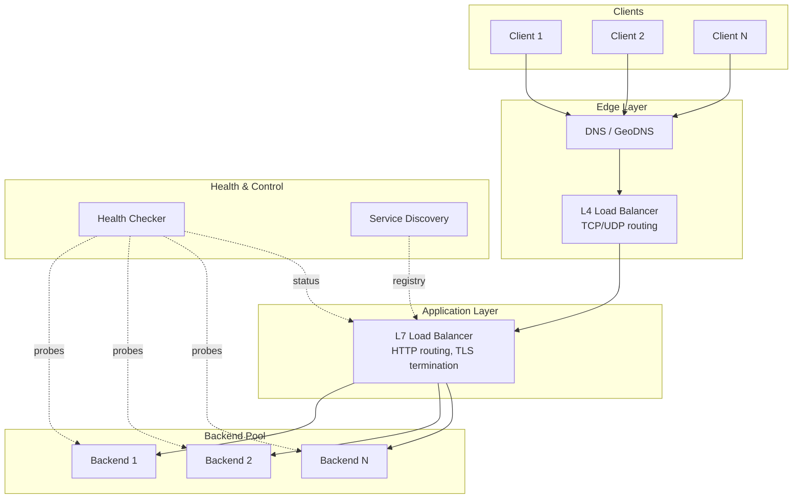

# Load Balancer Architecture: L4 vs L7 and Routing

How load balancers distribute traffic, terminate TLS, and maintain availability at scale. This article covers the design choices behind L4/L7 balancing, algorithm selection, health checking, and session management—with real-world examples from Netflix, Google, and Cloudflare.

<figure>



<figcaption>Two-tier load balancing: L4 for connection distribution, L7 for intelligent request routing. Health checkers continuously verify backend availability.</figcaption>
</figure>

## Abstract

Load balancing operates at two fundamentally different layers:

- **L4 (Transport)**: Routes TCP/UDP connections by 5-tuple (protocol, IPs, ports). Latency: 50-100 μs. Throughput: 10-40 Gbps per node. No payload inspection—just packet forwarding.
- **L7 (Application)**: Parses HTTP/gRPC, routes by URL/header/cookie. Latency: 0.5-3 ms. Throughput: 1-5 Gbps. Enables content-aware routing but requires full request parsing.

Most production systems use both: L4 at the edge for raw throughput, L7 behind it for intelligent routing.

The key design decisions:

| Decision  | Options                                       | Primary Factor                       |
| --------- | --------------------------------------------- | ------------------------------------ |
| L4 vs L7  | TCP routing vs HTTP routing                   | Need for content inspection          |
| Algorithm | Round robin, least conn, consistent hash, P2C | Access pattern + statefulness        |
| TLS       | Terminate, passthrough, re-encrypt            | Security requirements vs performance |
| Session   | Sticky, shared store, stateless               | Horizontal scaling needs             |

## L4 vs L7 Load Balancing

### Layer 4: Transport-Level Routing

L4 load balancers operate on TCP/UDP connection metadata without inspecting payloads. The routing decision uses the 5-tuple: protocol, source IP, source port, destination IP, destination port.

**How it works:**

1. Client initiates TCP handshake to load balancer VIP (Virtual IP)
2. LB selects backend using configured algorithm
3. LB either NATs the connection (changes dest IP) or uses Direct Server Return (DSR)
4. All packets for that connection flow to the same backend

**Performance characteristics:**

- Latency overhead: 50-100 microseconds
- Throughput: 10-40 Gbps per commodity server
- Connection table size: Millions of concurrent connections
- CPU usage: Minimal—no payload parsing

**Direct Server Return (DSR):**

In DSR mode, the load balancer only handles inbound traffic. Responses go directly from backend to client, bypassing the LB entirely. This eliminates the return-path bottleneck but requires:

- L4 only (no application-layer features)
- Kernel configuration on backends (disable ARP on loopback)
- Loss of TLS termination capability

**Best for:** High-volume TCP services (databases, message queues), UDP workloads (DNS, gaming, video streaming), and TLS passthrough where backend decryption is required.

### Layer 7: Application-Level Routing

L7 load balancers terminate the TCP connection and parse the application protocol (HTTP, gRPC, WebSocket). Routing decisions use request content: URL path, headers, cookies, method.

**How it works:**

1. Client completes TCP + TLS handshake with LB
2. LB receives full HTTP request
3. LB inspects headers/path and selects backend
4. LB opens new connection to backend (connection pooling)
5. LB forwards request, possibly modifying headers

**Performance characteristics:**

- Latency overhead: 0.5-3 milliseconds (TLS + HTTP parsing)
- Throughput: 1-5 Gbps per server
- Memory: Higher—must buffer requests
- CPU: Significant—TLS termination, header parsing

**Capabilities enabled by L7:**

| Feature                | How It Works                                      |
| ---------------------- | ------------------------------------------------- |
| Path-based routing     | Route `/api/*` to API servers, `/static/*` to CDN |
| Header-based routing   | Route by `Host`, `Authorization`, custom headers  |
| Request transformation | Add/remove headers, rewrite URLs                  |
| Rate limiting          | Limit by client ID, API key, IP                   |
| A/B testing            | Route percentage of traffic by cookie             |
| Circuit breaking       | Stop routing to failing backends                  |

**Best for:** HTTP APIs, microservices, WebSocket applications, anything requiring content-aware routing or TLS termination.

### Choosing Between L4 and L7

| Factor              | Choose L4                | Choose L7                       |
| ------------------- | ------------------------ | ------------------------------- |
| Protocol            | Non-HTTP (TCP/UDP raw)   | HTTP/HTTPS/gRPC                 |
| Throughput need     | > 10 Gbps                | < 5 Gbps acceptable             |
| Latency sensitivity | Sub-millisecond required | Milliseconds acceptable         |
| Routing complexity  | Simple round robin       | Content-based routing           |
| TLS handling        | Passthrough to backend   | Terminate at LB                 |
| Connection reuse    | Not needed               | Beneficial (connection pooling) |

**Production pattern:** Most architectures use both. L4 at the edge distributes across L7 pools. L7 handles application routing. Example: AWS NLB (L4) fronting ALB (L7), or Google's Maglev (L4) fronting Envoy (L7).

## Load Balancing Algorithms

### Design Choices

#### Round Robin

**Mechanism:** Distribute requests to backends in sequence. Backend 1, then 2, then 3, then back to 1.

**When to use:**

- Homogeneous backend capacity
- Request durations are similar
- No state requirements

**Trade-offs:**

- ✅ Simple, deterministic, minimal overhead
- ✅ Even distribution over time
- ❌ Ignores backend load—slow backends get same traffic
- ❌ Long requests can pile up on one server

**Weighted variant:** Assign weights proportional to capacity. A server with weight 3 gets 3x the requests of weight 1.

#### Least Connections

**Mechanism:** Route to the backend with fewest active connections.

**When to use:**

- Variable request durations
- Database connections (long-lived)
- Backends with different capacities (weighted)

**Trade-offs:**

- ✅ Adapts to current load dynamically
- ✅ Handles slow requests gracefully
- ❌ Requires connection tracking state
- ❌ Doesn't account for connection "weight" (one heavy query vs many light ones)

**Weighted formula:**

```
score = active_connections / weight
```

Route to server with lowest score.

**Real-world:** HAProxy's `leastconn` is standard for database connection pools where query times vary from 1ms to 10s.

#### Consistent Hashing

**Mechanism:** Hash the request key (client IP, user ID, session ID) to a position on a ring. Route to the next server clockwise on the ring.

**When to use:**

- Session affinity without cookies
- Cache locality (same client hits same cache)
- Distributed systems with topology changes

**Trade-offs:**

- ✅ Minimal remapping when servers join/leave (only K/N keys move)
- ✅ Deterministic—same key always hits same server
- ❌ Uneven distribution without virtual nodes
- ❌ Hot keys create hot servers

**Virtual nodes:** Each physical server maps to 100-1000 positions on the ring. Discord uses 1000 virtual nodes per physical node, achieving <5% load variance after node failures.

**Real-world example—DynamoDB:** Uses consistent hashing for partition distribution. Hot partition keys remain a top operational issue—the algorithm can't fix uneven key access patterns.

#### Power of Two Choices (P2C)

**Mechanism:** Select 2 random healthy backends, route to the one with fewer active requests.

**When to use:**

- Large backend pools (50+ servers)
- Need simplicity with good load distribution
- High request rates where O(N) scans are expensive

**Trade-offs:**

- ✅ O(1) algorithm—constant time regardless of pool size
- ✅ Avoids herding (multiple LBs won't pick same "best" server)
- ✅ Nearly as effective as full least-connections scan
- ❌ Slightly less optimal than true least-connections

**Why it works:** The "power of two choices" is a fundamental result in randomized algorithms. Choosing from 2 random options exponentially reduces maximum load compared to choosing 1 random option.

**Real-world:** Envoy Proxy uses P2C as its default algorithm. Netflix's Zuul uses a P2C variant with probation for overload mitigation.

#### Maglev (Google's Algorithm)

**Mechanism:** Consistent hashing with a lookup table optimized for speed. Maps 5-tuple to backend via a permutation table.

**When to use:**

- Software load balancers at massive scale
- Need consistent hashing with faster lookup than ring hash
- Connection-oriented protocols (connection must stay on same backend)

**Trade-offs:**

- ✅ Sub-millisecond lookup times
- ✅ Minimal disruption on backend changes
- ✅ Even distribution across backends
- ❌ Slightly less stable than ring hash on churn
- ❌ Complex to implement correctly

**Real-world:** Google's Maglev handles millions of connections per second across 100+ backend clusters. The lookup table provides O(1) access while maintaining consistent hashing properties.

### Algorithm Decision Matrix

| Factor                       | Round Robin | Least Conn          | Consistent Hash | P2C                 |
| ---------------------------- | ----------- | ------------------- | --------------- | ------------------- |
| Request duration variability | Low         | High                | Any             | High                |
| Backend count                | Any         | Any                 | Any             | 50+                 |
| State requirement            | None        | Connection tracking | None            | Connection tracking |
| Session affinity             | No          | No                  | Yes (by key)    | No                  |
| Computational cost           | O(1)        | O(N) or O(log N)    | O(1)            | O(1)                |
| Handles hot spots            | No          | Partially           | No              | Partially           |

## Health Checks and Failover

### Health Check Mechanisms

#### TCP Health Checks

**How it works:** LB opens TCP connection to backend port. If SYN-ACK received within timeout, backend is healthy.

**Parameters:**

- Interval: 5-30 seconds typical
- Timeout: 2-10 seconds
- Unhealthy threshold: 2-5 consecutive failures

**Limitations:** Only verifies network connectivity. Backend may accept TCP but fail HTTP requests (app crashed but socket still bound).

#### HTTP Health Checks

**How it works:** LB sends HTTP request (typically GET or OPTIONS) to health endpoint. Expects 2xx/3xx response.

**Parameters:**

- Path: `/health`, `/healthz`, `/ready`
- Expected status: 200-399
- Response body validation (optional)

**Best practice:** Health endpoint should verify critical dependencies:

```
GET /health
{
  "status": "healthy",
  "database": "connected",
  "cache": "connected",
  "uptime_seconds": 3600
}
```

But keep checks fast—health endpoints shouldn't query databases on every call.

#### Active vs Passive Health Checking

**Active:** LB probes each backend at intervals regardless of traffic.

- More responsive to failures
- Adds load to backends (N probes × M backends)
- Can detect failures before user traffic hits them

**Passive:** LB monitors real traffic responses.

- Zero additional load
- Only detects failures when traffic flows
- Can track gradual degradation (rising error rates)

**Production pattern:** Use both. Active checks for fast failure detection. Passive checks for anomaly detection (backend returning 500s but responding to health checks).

### Failure Detection Timing

The total time to detect and react to a failure:

```
Detection time = (interval × unhealthy_threshold) + timeout
```

With interval=5s, threshold=3, timeout=2s: **17 seconds** worst case.

For faster detection:

| Setting             | Aggressive | Balanced | Conservative |
| ------------------- | ---------- | -------- | ------------ |
| Interval            | 2s         | 5s       | 30s          |
| Timeout             | 1s         | 2s       | 5s           |
| Unhealthy threshold | 2          | 3        | 5            |
| Detection time      | 5s         | 17s      | 155s         |

**Trade-off:** Aggressive settings increase false positives (transient network blips mark healthy servers as down) and health check load.

### Connection Draining

When removing a backend (deployment, scaling down), abrupt removal causes in-flight requests to fail.

**Connection draining process:**

1. LB stops sending NEW requests to backend
2. Existing connections continue until complete or timeout
3. After drain timeout, LB forcibly closes remaining connections
4. Backend removed from pool

**Parameters:**

- Drain timeout: 30-300 seconds typical (AWS default: 300s)
- In-flight request grace period

**Real-world:** Zero-downtime deployments require drain timeouts longer than your longest request. If you have 60-second report generation requests, drain timeout must be > 60s.

### Thundering Herd on Failover

When a backend recovers or new capacity is added, all LBs may route traffic to it simultaneously, causing immediate overload.

**Mitigation strategies:**

1. **Slow start:** Gradually increase traffic to recovered backends over 30-60 seconds
2. **Connection limits:** Cap connections per backend during ramp-up
3. **Health check jitter:** Randomize health check timing across LBs

**DNS-level thundering herd:** When DNS TTL expires after a failover, all clients resolve simultaneously and hit the same (recovered) endpoint. Mitigation: Use 30-60 second TTLs for failover scenarios, implement staggered TTLs.

## TLS Termination Strategies

### TLS Termination at Load Balancer

**How it works:** LB decrypts TLS, inspects HTTP, forwards plaintext to backends.

**Advantages:**

- Enables L7 features (routing, transformation, logging)
- Centralizes certificate management
- Offloads CPU from backends (TLS is expensive)
- Enables connection pooling to backends

**Disadvantages:**

- LB has access to plaintext traffic
- LB becomes a performance bottleneck for TLS
- Certificates must be stored on LB (security surface)

**Performance:** Modern LBs use hardware acceleration (AES-NI, dedicated TLS ASICs). AWS NLB handles 2.5M TLS handshakes/second per node.

### TLS Passthrough

**How it works:** LB forwards encrypted traffic unchanged. Backend terminates TLS.

**Advantages:**

- End-to-end encryption (LB never sees plaintext)
- Backends control cipher suites, certificates
- Simpler LB (L4 only)

**Disadvantages:**

- No L7 features (routing must be by IP/port)
- Each backend manages certificates
- No connection pooling

**Use case:** Compliance requirements where LB cannot access plaintext (PCI DSS, healthcare).

### Re-encryption (TLS Bridging)

**How it works:** LB terminates client TLS, inspects content, establishes new TLS connection to backend.

**Advantages:**

- Full L7 features
- Backend-to-LB traffic encrypted
- Can use different certificates (internal PKI)

**Disadvantages:**

- Double TLS overhead (decrypt + re-encrypt)
- ~20-30% more CPU than termination-only
- Key management complexity

**Use case:** Zero-trust networks, sensitive data requiring encryption in transit everywhere.

### Decision Guide

| Requirement                   | Recommendation               |
| ----------------------------- | ---------------------------- |
| Need L7 routing               | Terminate or re-encrypt      |
| Compliance: LB can't see data | Passthrough                  |
| Internal network untrusted    | Re-encrypt                   |
| Maximum performance           | Terminate only               |
| Backend certificate rotation  | Terminate (centralize certs) |

**Production pattern:** 68% of enterprise deployments use termination at LB with plaintext to backends in trusted networks. Re-encryption is growing with zero-trust adoption.

## Session Affinity and Sticky Routing

### Mechanisms

#### Cookie-Based Affinity

**How it works:** LB injects cookie identifying backend server. Subsequent requests with that cookie route to same backend.

**Types:**

- **Duration-based:** LB-generated cookie with TTL
- **Application-controlled:** App sets cookie, LB reads it

**Example (HAProxy):**

```
backend servers
    cookie SERVERID insert indirect nocache
    server s1 10.0.0.1:8080 cookie s1
    server s2 10.0.0.2:8080 cookie s2
```

#### IP-Based Affinity

**How it works:** Hash client IP to backend. Same IP always hits same backend.

**Problems:**

- NAT: Thousands of users behind same IP
- Mobile: IP changes as users move
- IPv6: Clients may have multiple addresses

#### Header-Based Affinity

**How it works:** Route based on custom header (user ID, session ID, tenant ID).

**Use case:** Multi-tenant systems where tenant data is sharded.

### Trade-offs of Sticky Sessions

**Benefits:**

- Session data stays local (no replication needed)
- Better cache hit rates
- Simpler for stateful protocols (WebSocket, gRPC streaming)

**Problems:**

- **Uneven load:** Server with long sessions gets overloaded
- **Failure impact:** Sticky server dies = all its sessions lost
- **Scaling difficulty:** Can't easily move sessions during scale-out
- **DDoS vulnerability:** Attackers can concentrate load

### Alternatives to Sticky Sessions

| Approach               | How It Works                       | Trade-off                             |
| ---------------------- | ---------------------------------- | ------------------------------------- |
| Shared session store   | Redis/Memcached stores sessions    | Network latency per request           |
| Stateless tokens       | JWT or encrypted session in cookie | Token size, can't revoke easily       |
| Client-side storage    | LocalStorage/SessionStorage        | Limited size, security considerations |
| Database session table | Session in PostgreSQL/MySQL        | Higher latency, DB load               |

**Modern recommendation:** Avoid sticky sessions for horizontally-scaled services. Use stateless design or shared session stores. Reserve stickiness for truly stateful protocols (WebSocket where server holds connection state).

## Real-World Implementations

### Netflix: Edge Load Balancing

**Scale:** 80+ Zuul clusters, 100+ backend clusters, 1M+ requests/second.

**Architecture:**

1. AWS ELB (L4) distributes to Zuul instances
2. Zuul (L7) handles routing, auth, rate limiting
3. Ribbon (client-side) balances to backend services

**Algorithm choice:** P2C with probation. Servers returning errors enter probation—they receive reduced traffic until recovery.

**Zone-aware routing:** Zuul tracks success rate per availability zone. If zone-A has 90% success and zone-B has 70%, traffic shifts to zone-A.

**Why this design:** Netflix needs to handle correlated failures (entire AZ goes down). Zone-aware routing provides automatic failover without DNS changes.

### Google: Maglev

**Scale:** Millions of connections/second, hundreds of backends per service.

**Design decisions:**

- **L4 only:** Maglev doesn't parse HTTP. Speed is paramount.
- **Consistent hashing:** 5-tuple hash ensures connection stability
- **No state replication:** Each Maglev instance is stateless. ECMP distributes across Maglevs.
- **Lookup table:** 65,537-entry permutation table for O(1) backend selection

**Why consistent hashing:** Connection-oriented protocols (HTTP/2, gRPC) multiplex requests over long-lived connections. Breaking connections means re-establishing TLS, losing request context.

**Trade-off accepted:** Maglev doesn't provide L7 features. Those are handled by Envoy proxies behind Maglev.

### Cloudflare: Anycast + No Traditional LBs

**Approach:** Announce same IP addresses from all 300+ data centers via BGP. Internet routing delivers users to nearest DC.

**Why no traditional LBs:**

- BGP handles geographic distribution for free
- Each DC runs identical stack
- No single point of failure

**Challenge:** TCP over anycast is tricky—route changes mid-connection break sessions. Cloudflare engineered TCP to handle route flaps.

**Trade-off:** Requires massive PoP presence. Works for Cloudflare's edge network, not for typical enterprise deployments.

### AWS: NLB vs ALB Design Differences

**Network Load Balancer (NLB):**

- L4 only, handles 1M+ connections/second
- Preserves source IP (no NAT in passthrough mode)
- Static IPs (important for firewall rules)
- 100ms latency percentile targets

**Application Load Balancer (ALB):**

- L7, HTTP/HTTPS parsing
- Content-based routing, path/header matching
- WebSocket and HTTP/2 support
- Connection pooling to backends

**When AWS recommends NLB:** Non-HTTP protocols, extreme scale, need for static IPs, latency-sensitive workloads.

**When AWS recommends ALB:** HTTP APIs, microservices, need for content routing, WebSocket support.

## Common Pitfalls

### 1. Health Check Endpoint That Lies

**The mistake:** Health endpoint returns 200 but service can't handle real traffic (database disconnected, cache full, dependencies down).

**Why it happens:** Health check only verifies process is running, not that it can serve requests.

**The consequence:** LB routes traffic to "healthy" server that fails every request.

**The fix:** Health endpoint should verify critical path. At minimum, check database connectivity and essential dependencies. But keep it fast—don't run full queries.

### 2. Ignoring Connection Draining

**The mistake:** Terminate backends immediately during deployments.

**Why it happens:** Drain timeout slows deployments. Developers disable it for faster iteration.

**The consequence:** In-flight requests get 502/503 errors. Users see failures during every deploy.

**The fix:** Set drain timeout >= your longest expected request. For long-running requests, implement graceful shutdown in the application.

### 3. Sticky Sessions Without Fallback

**The mistake:** Session affinity with no handling for backend failure.

**Why it happens:** Session stored only on sticky backend, no replication.

**The consequence:** When sticky backend fails, user loses session (logged out, cart emptied).

**The fix:** Either replicate sessions to shared store, or accept session loss and ensure graceful re-authentication.

### 4. DNS TTL Too High for Failover

**The mistake:** DNS TTL of 3600s (1 hour) for load-balanced services.

**Why it happens:** Default TTL values, reduces DNS query load.

**The consequence:** After failover, clients continue hitting dead endpoint for up to 1 hour.

**The fix:** Use 30-60 second TTLs for services requiring fast failover. Accept increased DNS query volume as the trade-off.

### 5. No Overload Protection

**The mistake:** Load balancer keeps routing to overloaded backends.

**Why it happens:** Health checks pass (backend responds) but backend is saturated.

**The consequence:** Cascade failure—one slow backend makes all requests slow via head-of-line blocking.

**The fix:** Implement connection limits per backend. Use circuit breakers. Monitor latency percentiles, not just health status.

## Conclusion

Load balancer architecture requires matching the technology to your constraints:

- **L4 vs L7:** Choose based on throughput needs vs routing intelligence. Use both for large systems—L4 at edge, L7 behind.
- **Algorithm:** Round robin for homogeneous workloads, least connections for variable request durations, consistent hashing for stateful routing, P2C for large pools.
- **TLS:** Terminate at LB unless compliance requires passthrough. Re-encrypt only when internal network is untrusted.
- **Session affinity:** Avoid unless truly necessary. Use shared session stores for horizontal scaling.
- **Health checks:** Active for fast failure detection, passive for anomaly tracking. Tune aggressiveness to your availability requirements.

The recurring theme: there's no universally correct answer. Netflix needs zone-aware routing for regional failures. Google needs sub-millisecond consistent hashing at massive scale. Cloudflare eliminated traditional LBs entirely. Your architecture depends on your specific scale, latency requirements, and operational capabilities.

## Appendix

### Prerequisites

- TCP/IP networking fundamentals (three-way handshake, connection states)
- TLS handshake process
- HTTP/1.1 and HTTP/2 basics
- DNS resolution

### Summary

- L4 load balancers route by connection (50-100μs overhead, 10-40 Gbps throughput)
- L7 load balancers route by request content (0.5-3ms overhead, enables content-aware routing)
- Algorithm choice depends on request patterns: round robin for uniform, least-conn for variable, consistent hash for stateful
- Health checks should verify service capability, not just process liveness
- Connection draining is required for zero-downtime deployments
- Sticky sessions impede horizontal scaling; prefer shared session stores

### References

- [Maglev: A Fast and Reliable Software Network Load Balancer](https://research.google/pubs/maglev-a-fast-and-reliable-software-network-load-balancer/) - Google Research paper on their production load balancer
- [Netflix: Rethinking Edge Load Balancing](https://netflixtechblog.com/netflix-edge-load-balancing-695c35a15f59) - Netflix engineering blog on Zuul and zone-aware routing
- [Envoy Load Balancing Documentation](https://www.envoyproxy.io/docs/envoy/latest/intro/arch_overview/upstream/load_balancing/load_balancers) - P2C algorithm and load balancing internals
- [HAProxy Configuration Manual](https://www.haproxy.com/documentation/haproxy-configuration-manual/latest/) - Health checks, algorithms, connection draining
- [AWS Elastic Load Balancing Documentation](https://docs.aws.amazon.com/elasticloadbalancing/) - NLB, ALB, and GLB design and configuration
- [Cloudflare: Load Balancing without Load Balancers](https://blog.cloudflare.com/cloudflares-architecture-eliminating-single-p/) - Anycast-based architecture
- [How Discord Stores Billions of Messages](https://discord.com/blog/how-discord-stores-billions-of-messages) - Consistent hashing in practice
- [The Power of Two Random Choices](https://www.eecs.harvard.edu/~michaelm/postscripts/mythesis.pdf) - Academic foundation for P2C algorithm
