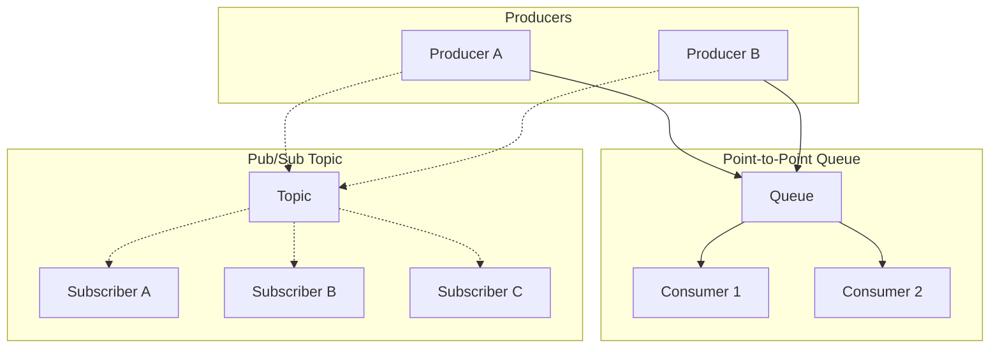

# Queues and Pub/Sub: Decoupling and Backpressure

Message queues and publish-subscribe systems decouple producers from consumers, enabling asynchronous communication, elastic scaling, and fault isolation. The choice between queue-based and pub/sub patterns—and the specific broker implementation—determines delivery guarantees, ordering semantics, and operational complexity. This article covers design choices, trade-offs, and production patterns from systems handling trillions of messages daily.

<figure>



<figcaption>Queues deliver each message to one consumer (competing consumers); topics deliver each message to all subscribers (fan-out).</figcaption>
</figure>

## Abstract

The mental model: **queues distribute work, topics broadcast events**.

A queue is a buffer between producers and consumers where each message is processed by exactly one consumer—work distribution. Multiple consumers compete for messages, enabling horizontal scaling of processing capacity. If a consumer fails, another picks up the message.

A topic (pub/sub) delivers each message to all subscribers—event broadcasting. Multiple independent consumers each receive their own copy. Subscribers are decoupled from each other and from the producer.

**The key design axes:**

| Axis | Options | Determines |
|------|---------|------------|
| **Pattern** | Queue (point-to-point), Topic (pub/sub), Hybrid | Work distribution vs. fan-out |
| **Delivery semantics** | At-most-once, at-least-once, exactly-once | Reliability vs. complexity |
| **Ordering** | None, partition-ordered (key), FIFO, total | Consistency vs. throughput |
| **Consumption model** | Pull, push | Backpressure handling |

**Production examples:**

- **LinkedIn** (7 trillion msg/day): Kafka as company-wide event backbone—100+ clusters, 4,000+ brokers
- **Slack** (1.4B jobs/day): Dual-queue architecture—Redis for speed, Kafka for durability
- **Netflix** (500B events/day, 8M/sec peak): Kafka + Flink for real-time stream processing
- **Uber** (250K msg/sec push): Custom push platform with Kafka backbone

The choice depends on whether you need work distribution or event broadcasting, your consistency requirements, and operational capacity.

## Messaging Patterns

### Point-to-Point Queues

Each message is delivered to exactly one consumer. Multiple consumers compete for messages from the same queue.

**Mechanism**: Producer enqueues messages; broker holds them until a consumer dequeues. Once delivered and acknowledged, the message is removed. If the consumer fails before acknowledging, the message becomes visible again for redelivery.

**Why it exists**: Distributes work across a pool of workers. The queue acts as a buffer—producers and consumers operate at different rates without blocking each other.

**When to use**:
- Task/job processing (email sending, image processing, report generation)
- Load leveling between services with different throughput capacities
- Work distribution across worker pools

**Trade-offs**:
- ✅ Natural load balancing across consumers
- ✅ Built-in retry semantics (message redelivered on failure)
- ✅ Simple mental model—one message, one processor
- ❌ No fan-out—if multiple services need the same event, you need multiple queues
- ❌ Message ordering may be lost with competing consumers

**Real-world**: Slack's job queue processes 1.4 billion jobs daily at 33K/sec peak. Every message post, push notification, URL unfurl, and billing calculation flows through their queue. They use a dual-queue architecture: Redis for in-flight messages (fast) and Kafka for durable storage (ledger). This gives them both performance and durability—Redis handles the hot path while Kafka ensures nothing is lost.

### Publish-Subscribe (Topics)

Each message is delivered to all subscribers. Subscribers receive independent copies.

**Mechanism**: Producer publishes to a topic; broker delivers copies to all active subscriptions. Each subscription maintains its own cursor/offset—subscribers process at their own pace.

**Why it exists**: Decouples producers from consumers completely. The producer doesn't know (or care) how many subscribers exist. New subscribers can be added without modifying the producer.

**When to use**:
- Event broadcasting (user signed up, order placed, price changed)
- Multiple independent consumers need the same events
- Event sourcing and audit logs
- Real-time analytics pipelines

**Trade-offs**:
- ✅ True decoupling—add subscribers without changing producers
- ✅ Each subscriber processes independently (different speeds, different transformations)
- ✅ Natural fit for event-driven architectures
- ❌ Storage scales with subscribers × messages (each subscription tracks position)
- ❌ Ordering guarantees harder across multiple subscribers

**Real-world**: Netflix processes 500 billion events daily through their Kafka-based event pipeline. Member actions flow from API Gateway → Kafka topics → Flink processing → multiple downstream consumers (recommendations, analytics, A/B testing). Multiple consumer groups independently subscribe to the same topics, each processing events for their specific use case.

### Hybrid: Consumer Groups

Kafka's model combines pub/sub with competing consumers through consumer groups.

**Mechanism**: A topic is divided into partitions. Within a consumer group, each partition is assigned to exactly one consumer—competing consumers pattern. Multiple consumer groups can subscribe to the same topic independently—pub/sub pattern.

**Why it exists**: Provides both work distribution (within a group) and event broadcasting (across groups). A single topic can serve as both a work queue and an event stream.

**Example**: Order events published to `orders` topic:
- Consumer group `fulfillment` processes each order once (work distribution)
- Consumer group `analytics` also processes each order once (independent work distribution)
- Consumer group `fraud-detection` also processes each order once (another independent consumer)

Each group sees every message; within each group, messages are distributed across consumers.

**Real-world**: LinkedIn runs 100+ Kafka clusters with 100,000+ topics. The consumer group model allows multiple teams to independently consume the same event streams without coordination. Their activity tracking pipeline has dozens of consumer groups processing the same user activity events for different purposes.

## Delivery Semantics

Delivery semantics define the guarantees about how many times a message is delivered and processed.

### At-Most-Once

Messages may be lost but are never duplicated.

**Mechanism**: Producer sends message without waiting for acknowledgment (fire-and-forget). Or: consumer commits offset before processing—if processing fails, the message is skipped.

**Why it exists**: Maximum throughput and minimum latency. Suitable when occasional message loss is acceptable.

**When to use**:
- Metrics and telemetry (missing one data point is acceptable)
- Heartbeats and health checks
- Non-critical notifications

**Trade-offs**:
- ✅ Highest throughput—no acknowledgment overhead
- ✅ Lowest latency—no round-trip for confirmation
- ❌ Data loss on failures—producer crash, network issues, consumer crash

**Implementation**: Kafka with `acks=0` (producer doesn't wait for broker acknowledgment). Consumer with auto-commit enabled and commit-before-process pattern.

### At-Least-Once

Messages are never lost but may be duplicated.

**Mechanism**: Producer retries until acknowledged. Consumer processes then commits—if consumer crashes after processing but before committing, the message is redelivered.

**Why it exists**: The default for most systems because message loss is usually worse than duplication. Duplicates can be handled with idempotent processing.

**When to use**:
- Most production workloads
- Any case where data loss is unacceptable
- Systems with idempotent consumers

**Trade-offs**:
- ✅ No message loss—retries ensure delivery
- ✅ Simpler than exactly-once
- ❌ Duplicates require downstream handling
- ❌ Higher latency than at-most-once (acknowledgment round-trip)

**Implementation**: Kafka with `acks=all` + `retries` enabled. Consumer with manual offset commit after successful processing.

### Exactly-Once

Messages are delivered and processed exactly once.

**Why it's hard**: The fundamental challenge is distinguishing between three scenarios:
1. Message written, acknowledgment delivered → success
2. Message written, acknowledgment lost → producer retries, creates duplicate
3. Message lost → producer retries correctly

In asynchronous distributed systems, these scenarios are indistinguishable from the producer's perspective. The Two Generals Problem proves this fundamental limitation.

**How systems approach it**:

**Kafka transactions (v0.11+)**: Atomic writes across multiple partitions. Producer uses transactional API; consumers read with `isolation.level=read_committed`. This achieves exactly-once within Kafka's boundaries—but the consumer's processing of the message and any external side effects still require idempotency.

**AWS SQS FIFO**: MessageDeduplicationId with 5-minute deduplication window. Broker deduplicates retries within the window. Still requires idempotent processing for side effects.

**The reality**: Infrastructure provides at-most-once or at-least-once; exactly-once semantics require **application-level idempotency**. The broker can deduplicate message storage; only the application can deduplicate processing effects.

**Trade-offs**:
- ✅ Simplifies application logic (in theory)
- ❌ High complexity and performance overhead
- ❌ Still requires application idempotency for external side effects
- ❌ Increases latency (coordination overhead)

**Real-world**: Uber's Flink pipelines achieve exactly-once through Kafka transactions + Flink checkpointing. But their downstream systems (databases, external APIs) still implement idempotency—the exactly-once guarantee applies only to the stream processing boundary.

## Message Ordering

Ordering guarantees determine whether consumers see messages in the same order they were produced.

### No Ordering (Unordered)

Messages may arrive in any order.

**Mechanism**: Broker delivers messages as quickly as possible without ordering constraints. Parallel delivery maximizes throughput.

**When to use**:
- Independent events with no causal relationship
- Idempotent operations where order doesn't matter
- High-throughput scenarios where ordering would bottleneck

**Trade-offs**:
- ✅ Maximum throughput—parallel delivery
- ✅ Maximum availability—no coordination required
- ❌ Cannot rely on temporal relationships between messages

**Real-world**: Google Cloud Pub/Sub is unordered by design. This enables their dynamic scaling and low-latency delivery. Applications that need ordering must implement it at the application level.

### Partition-Ordered (Key-Based)

Messages with the same key are ordered; messages with different keys may interleave.

**Mechanism**: Hash the message key to determine partition. All messages with the same key go to the same partition. Each partition maintains FIFO order. Different partitions process in parallel.

**Why it exists**: Provides ordering where it matters (same entity) while allowing parallelism where it's safe (different entities).

**Example**: Order events keyed by `order_id`. All events for order #123 arrive in order (created → paid → shipped). Events for different orders may interleave.

**When to use**:
- Entity-scoped operations (all events for one user, one order, one device)
- Event sourcing where events must be applied in sequence per aggregate
- Most production use cases—80% of ordering benefit at 20% of the cost

**Trade-offs**:
- ✅ Ordering where needed (per key)
- ✅ Parallelism where safe (across keys)
- ✅ Scales linearly with partition count
- ❌ Hot keys create hot partitions (ordering constraint prevents load balancing)
- ❌ Reordering possible if key assignment changes

**Implementation**: Kafka's default model. Producer specifies key; `partitioner` hashes key to partition. Consumer processes one partition single-threaded to maintain order.

**Real-world**: Discord keys messages by channel ID. All messages within a channel arrive in order (critical for chat UX). Different channels process in parallel across partitions. With millions of channels, this provides massive parallelism while maintaining per-channel ordering.

### FIFO (Total Ordering per Queue)

All messages in a queue/partition arrive in exactly the order they were sent.

**Mechanism**: Single writer or sequence numbers ensure ordering. Single consumer per queue/partition ensures processing order.

**When to use**:
- Financial transactions (deposit before withdrawal)
- Strict event sequencing requirements
- State machine transitions

**Trade-offs**:
- ✅ Strict ordering guarantees
- ❌ Throughput limited by single consumer
- ❌ Typically 5-10K msg/s (vs. 100K+ for parallel)

**Implementation**: AWS SQS FIFO queues guarantee ordering within a message group. Throughput: 300 msg/s per message group (3,000 with batching), 70,000 msg/s per queue with high throughput mode.

### Total Ordering (Global)

All consumers see all messages in identical order.

**Mechanism**: Requires consensus protocol (Raft, Paxos) or single sequencer. Every message goes through a coordination point.

**Why it exists**: Required for distributed consensus, leader election, and strong consistency across replicas.

**When to use**:
- Distributed coordination (ZooKeeper, etcd)
- Database replication (same transaction order on all replicas)
- Rare in messaging—usually overkill

**Trade-offs**:
- ✅ Global consistency—all nodes see same order
- ❌ High latency—consensus overhead on every message
- ❌ Scalability bottleneck—single coordination point

**Real-world**: Apache ZooKeeper provides total ordering for coordination events. Not used for high-throughput messaging—reserved for low-volume, high-importance events like leader election and configuration changes.

## Backpressure and Flow Control

Backpressure handles the situation where producers outpace consumers.

### Pull Model (Consumer-Controlled)

Consumer requests messages when ready to process.

**Mechanism**: Consumer polls broker for messages. Consumer controls batch size and poll frequency. Broker buffers messages until requested.

**Why it exists**: True backpressure—consumers never receive more than they can handle. Consumer naturally throttles intake based on processing capacity.

**Trade-offs**:
- ✅ Natural backpressure—consumer controls intake
- ✅ Consumer can batch for efficiency
- ✅ Broker simpler—no per-consumer delivery state
- ❌ Polling overhead (empty polls waste resources)
- ❌ Higher latency for individual messages (batch + poll interval)

**Implementation**: Kafka's `poll()` API. Consumer requests up to `max.poll.records` messages. Long polling (`fetch.max.wait.ms`) reduces empty polls.

**Real-world**: AWS SQS uses long polling (up to 20 seconds). Consumer waits for messages or timeout—eliminates empty poll overhead while maintaining pull semantics. This is why SQS scales to massive throughput without per-consumer coordination.

### Push Model (Broker-Controlled)

Broker sends messages to consumers as they arrive.

**Mechanism**: Broker maintains consumer connections. Messages pushed immediately on arrival. Prefetch/buffer limits control flow.

**Why it exists**: Lowest latency for individual messages—no poll interval. Better for real-time use cases.

**Trade-offs**:
- ✅ Lower latency—immediate delivery
- ✅ No polling overhead
- ❌ Backpressure harder—broker must track consumer capacity
- ❌ Slow consumer can overflow and lose messages
- ❌ Broker complexity—per-consumer delivery state

**Implementation**: RabbitMQ's default mode. `prefetch_count` limits unacknowledged messages per consumer. When consumer is slow, prefetch fills up, and broker stops sending.

**Real-world**: Google Cloud Pub/Sub supports push delivery to HTTP endpoints. Includes automatic retry with exponential backoff. Useful for serverless functions (Cloud Functions, Cloud Run) where the consumer is an HTTP endpoint.

### Handling Overload

When consumers can't keep up:

**Buffering**: Broker stores messages in memory/disk. Limited by available storage. Eventually, oldest messages dropped or producers blocked.

**Producer blocking**: When buffers full, producer's send blocks. Propagates backpressure upstream. Can cause cascading failures if producer has its own timeouts.

**Message dropping**: Shed load by dropping messages (usually oldest). Use for non-critical data (metrics, telemetry).

**Rate limiting**: Limit producer throughput at ingestion. Rejects excess rather than buffering.

**Consumer scaling**: Add more consumers (within partition limits). Only works with parallelizable workloads.

**Real-world**: Slack's job queue uses Redis as a "shock absorber"—fast in-memory buffer for traffic spikes. When Redis fills up, they rely on Kafka's disk-based storage as overflow. This two-tier approach handles burst traffic without dropping messages or blocking producers.

## Retry and Dead Letter Queues

### Retry Strategies

**Immediate retry**: Retry on first failure. Catches transient network issues. Risk: hammering a failing service.

**Exponential backoff**: Increase delay between retries. Formula: `delay = min(base × 2^attempt, max_delay)`. Allows failing services to recover.

**Exponential backoff with jitter**: Add randomness to delay. Prevents thundering herd when many consumers retry simultaneously. Formula: `delay = random(0, min(base × 2^attempt, max_delay))`.

**Example configuration**:
```
initial_delay: 100ms
backoff_multiplier: 2
max_delay: 30s
max_attempts: 10
jitter: full (random between 0 and calculated delay)
```

This gives delays: ~50ms, ~100ms, ~200ms, ~400ms... up to ~15s average, max 10 attempts over ~1-2 minutes.

### Dead Letter Queues (DLQ)

A secondary queue for messages that fail processing after maximum retries.

**Mechanism**: After N failures, message moves to DLQ instead of returning to main queue. DLQ holds failed messages for inspection, manual intervention, or automated reprocessing.

**Why it exists**: Prevents "poison pill" messages from blocking the queue forever. Isolates problematic messages without losing them.

**Design considerations**:

**When to DLQ**:
- Deserialization failures (malformed message)
- Validation errors (missing required fields)
- Business logic failures (invalid state transition)
- Exceeded retry limit

**When NOT to DLQ**:
- Transient failures (network timeout, service unavailable)—retry instead
- Temporary state issues (eventual consistency lag)—retry with delay

**DLQ processing patterns**:
- Manual inspection and replay after fixing consumer bug
- Automated reprocessing after dependent service recovers
- Alert on DLQ growth—indicates systematic problem
- Periodic purge of old messages (with audit log)

**Real-world**: AWS SQS integrates DLQ at the queue level. Configure `maxReceiveCount` on the source queue; messages exceeding this automatically route to the specified DLQ. CloudWatch alarms on `ApproximateNumberOfMessagesVisible` for the DLQ alert on failures.

### Poison Pill Handling

A poison pill is a message that can never be processed successfully—causes consumer crash, infinite loop, or persistent error.

**Detection**:
- Same message appearing repeatedly (delivery count)
- Consumer crashes correlate with specific message
- Processing time exceeds timeout repeatedly

**Handling**:
- Track delivery attempts per message (message metadata or external store)
- After N attempts, route to DLQ without further processing
- Log full message content and error for debugging
- Alert on poison pill rate

**Differentiation**:
| Error Type | Symptom | Action |
|------------|---------|--------|
| Transient | Network timeout, 503 | Retry with backoff |
| Poison pill | Same error every attempt, deserialization failure | DLQ immediately |
| Bug | All messages of a type fail | Stop consumer, fix bug, replay |

## Idempotency Patterns

Idempotency ensures processing a message multiple times has the same effect as processing it once. Required for at-least-once delivery to achieve exactly-once semantics.

### Why Idempotency Matters

At-least-once delivery means duplicates are possible:
- Producer retry (acknowledgment lost)
- Consumer failure before commit (redelivery)
- Broker failover (may redeliver)

Without idempotency, duplicates cause:
- Duplicate charges to customers
- Double inventory deductions
- Incorrect aggregate counts
- Duplicate notifications

### Idempotency Key Strategies

**Message ID (UUID)**:
- Each message has unique ID
- Consumer stores processed IDs
- Skip if ID already seen

**Challenge**: Must store all processed IDs forever, or risk accepting old duplicates after purge.

**Monotonic sequence numbers**:
- Producer assigns incrementing sequence per entity
- Consumer stores highest processed sequence per entity
- Reject any sequence ≤ stored value

**Advantage**: Store only one number per entity, not all message IDs.

**Example**: User #123's events have sequences 1, 2, 3... Consumer stores `user_123_seq = 5`. Message with seq=3 rejected as duplicate. Message with seq=6 processed and seq updated to 6.

**Time-windowed deduplication**:
- Store message IDs for limited window (e.g., 5 minutes)
- Assume duplicates only arrive within window
- Purge old IDs automatically

**Trade-off**: Risk of accepting duplicates outside window. SQS FIFO uses 5-minute window; Kafka's idempotent producer has effectively infinite window via producer epoch.

### Consumer Implementation

**Pattern**: Atomic check-and-process

```
BEGIN TRANSACTION
  -- Check for duplicate
  IF EXISTS (SELECT 1 FROM processed_messages WHERE id = message_id)
    ROLLBACK
    RETURN -- Already processed

  -- Process message
  ... business logic ...

  -- Record processed
  INSERT INTO processed_messages (id, processed_at) VALUES (message_id, NOW())
COMMIT
```

**Key**: The duplicate check and business logic must be in the same transaction. Otherwise, a crash between processing and recording creates inconsistency.

### Broker-Level Idempotency

**Kafka idempotent producer** (v0.11+):
- Producer assigned unique PID (producer ID)
- Each message has sequence number per partition
- Broker rejects duplicates within same producer session

**Limitation**: Only prevents duplicates from producer retries within a session. New producer instance gets new PID—application still needs idempotency for end-to-end guarantees.

**Kafka transactions**:
- Atomic writes to multiple partitions
- `read_committed` isolation for consumers
- Enables exactly-once stream processing (Kafka Streams, Flink)

**SQS FIFO deduplication**:
- `MessageDeduplicationId` per message
- Broker deduplicates within 5-minute window
- Can be explicit (producer sets ID) or content-based (hash of message body)

## Scaling Consumers

### Partitions and Parallelism

**Kafka model**: Maximum parallelism = number of partitions.

Within a consumer group:
- Each partition assigned to exactly one consumer
- More consumers than partitions → some consumers idle
- Fewer consumers than partitions → some consumers handle multiple partitions

**Choosing partition count**:
- Target throughput / per-consumer throughput = minimum partitions
- Round up for headroom and future growth
- Consider: partitions are hard to reduce, easy to add

**Example**: Need 100K msg/s. Each consumer handles 10K msg/s. Minimum partitions = 10. Add headroom → 20 partitions. Allows scaling to 20 consumers.

### Rebalancing

**Trigger**: Consumer joins, leaves, or crashes. Partition assignment changes.

**Impact**:
- Brief pause in processing (seconds to minutes)
- In-flight messages may be reprocessed (at-least-once)
- State (if any) must be rebuilt or migrated

**Strategies**:
- **Eager rebalancing**: Stop all consumers, reassign, restart. Simple but higher impact.
- **Cooperative rebalancing** (Kafka 2.4+): Only affected partitions pause. Lower impact, more complex.

**Real-world**: LinkedIn optimized rebalancing for their 4,000+ broker clusters. They use sticky assignor (minimize partition movement) and incremental cooperative rebalancing. Still, they design applications to handle rebalancing gracefully—checkpoint state, handle duplicates from reprocessing.

### Consumer Lag

Lag = how far behind the consumer is from the latest produced message.

**Metrics**:
- **Offset lag**: Latest offset − committed offset (message count)
- **Time lag**: Time since the oldest unconsumed message was produced (seconds)

Time lag is more useful for alerting—a lag of 10,000 messages means different things for different topics (high-throughput vs. low-throughput).

**Monitoring**:
```
Alert: consumer_lag_seconds > 60 for 5 minutes
Action: Investigate consumer health, consider scaling
```

**Causes of lag**:
- Consumer too slow (processing bottleneck)
- Too few consumers (under-provisioned)
- Partition imbalance (some partitions hot)
- Consumer bugs (stuck processing, memory leak)
- Rebalancing (temporary lag during reassignment)

**Real-world**: Discord monitors consumer lag as a primary health metric for their message delivery pipeline. Lag spikes correlate with delivery delays visible to users. They set aggressive alerting thresholds and have runbooks for rapid scale-up.

## Message Broker Comparison

### Design Choices

| Factor | Kafka | RabbitMQ | SQS/SNS | Pub/Sub | Pulsar |
|--------|-------|----------|---------|---------|--------|
| **Primary model** | Log-based pub/sub | Queue + exchange routing | Queue + topic | Topic | Log-based pub/sub |
| **Throughput** | 2M+ msg/s per cluster | 20-50K msg/s per node | 100K+ msg/s | 1M+ msg/s | 1M+ msg/s |
| **Latency p99** | ~5ms | <1ms | 100-200ms | 10-100ms | <10ms |
| **Ordering** | Partition-ordered | Queue FIFO | FIFO (queues only) | Unordered | Partition-ordered |
| **Retention** | Days to forever | Until consumed | 14 days max | 7 days default | Days to forever + tiered |
| **Multi-tenancy** | Manual | Manual | Native | Native | Native |
| **Operational complexity** | High | Medium | Zero (managed) | Zero (managed) | High |

### Kafka

**Architecture**: Distributed commit log. Partitioned topics stored on disk. Consumers track offset (position in log).

**Strengths**:
- Extreme throughput (LinkedIn: 7 trillion msg/day)
- Long retention (replay historical events)
- Exactly-once within Kafka boundary (transactions)
- Strong ecosystem (Kafka Streams, Connect, Schema Registry)

**Weaknesses**:
- Operational complexity (ZooKeeper/KRaft, partition management)
- Partition count limits scalability of individual topics
- No built-in delayed messages
- Cold start latency (consumer must catch up from offset)

**Best for**: Event streaming, event sourcing, high-throughput pipelines, data integration.

**Real-world**: Netflix scaled from 1 trillion events/day (2017) to 20+ trillion events/day using Kafka. They run weekly Kafka cluster failover drills to ensure operational readiness.

### RabbitMQ

**Architecture**: AMQP broker with exchanges and queues. Exchanges route messages to queues based on bindings and routing keys.

**Strengths**:
- Flexible routing (direct, fanout, topic, headers exchanges)
- Low latency (<1ms p99)
- Built-in delayed messages via plugin
- Dead letter exchanges
- Mature, well-understood

**Weaknesses**:
- Lower throughput than Kafka
- Limited replay (messages consumed once)
- Clustering adds complexity
- Memory-bound (large queues require disk overflow)

**Best for**: Task queues, complex routing rules, RPC patterns, lower-scale messaging.

### AWS SQS/SNS

**SQS (Simple Queue Service)**: Fully managed message queue.

- **Standard queues**: At-least-once, best-effort ordering, unlimited throughput
- **FIFO queues**: Exactly-once processing, strict ordering, 70K msg/s with high throughput mode

**SNS (Simple Notification Service)**: Fully managed pub/sub.

- Fan-out to SQS queues, Lambda, HTTP endpoints, email, SMS
- Message filtering on subscription

**SNS + SQS pattern**: SNS topic fans out to multiple SQS queues. Each queue has independent consumers. Common for event broadcasting with reliable queue-based consumption.

**Strengths**:
- Zero operational overhead
- Scales automatically
- Integrated with AWS services
- Pay-per-message pricing

**Weaknesses**:
- Higher latency (100-200ms typical)
- Limited retention (14 days max for SQS)
- No replay (once delivered, gone)
- Vendor lock-in

**Best for**: AWS-native applications, serverless architectures, teams without messaging operations expertise.

### Apache Pulsar

**Architecture**: Separated compute (brokers) and storage (BookKeeper). Topics have segments stored across bookies.

**Strengths**:
- Multi-tenancy built-in (namespaces, isolation)
- Geo-replication native
- Tiered storage (hot → cold automatically)
- Millions of topics per cluster
- Both queuing and streaming in one system

**Weaknesses**:
- Newer, smaller ecosystem
- Operational complexity (BookKeeper cluster)
- Less mature tooling than Kafka

**Best for**: Multi-tenant platforms, multi-region deployments, very high topic counts.

### NATS

**Architecture**: Lightweight pub/sub with optional persistence (JetStream).

**Core NATS**: At-most-once, in-memory, fire-and-forget. Ultra-low latency.

**JetStream**: Persistence, at-least-once, replay, consumer groups.

**Strengths**:
- Extremely lightweight (~10MB binary)
- Sub-millisecond latency
- Simple protocol (text-based)
- Good for edge/IoT

**Weaknesses**:
- JetStream less mature than Kafka
- Smaller ecosystem
- Limited exactly-once support

**Best for**: Real-time communication, IoT, microservices internal messaging, edge computing.

## How to Choose

### Factors to Consider

#### 1. Messaging Pattern

| Need | Recommended Approach |
|------|---------------------|
| Work distribution to worker pool | Queue (SQS, RabbitMQ) or Kafka consumer groups |
| Event broadcasting to multiple consumers | Pub/sub (SNS, Kafka topics, Pub/Sub) |
| Complex routing rules | RabbitMQ exchanges |
| Event replay and sourcing | Kafka, Pulsar (log-based) |
| Multi-region fan-out | SNS, Pub/Sub, Pulsar |

#### 2. Throughput and Latency

| Requirement | Recommended Approach |
|-------------|---------------------|
| < 10K msg/s | Any—choose based on other factors |
| 10K-100K msg/s | RabbitMQ, SQS, or Kafka |
| > 100K msg/s | Kafka, Pulsar |
| Sub-millisecond latency | NATS, RabbitMQ |
| Latency tolerance (100ms+) | SQS, Cloud Pub/Sub |

#### 3. Ordering Requirements

| Requirement | Recommended Approach |
|-------------|---------------------|
| No ordering needed | Any (maximize throughput) |
| Per-entity ordering | Kafka (partition by key), SQS FIFO (message group) |
| Strict FIFO (low throughput) | SQS FIFO, RabbitMQ single queue |
| Global ordering | Single partition or consensus-based system |

#### 4. Operational Capacity

| Team Capability | Recommended Approach |
|-----------------|---------------------|
| No messaging operations team | SQS/SNS, Cloud Pub/Sub, Confluent Cloud |
| Some operations capacity | RabbitMQ, managed Kafka |
| Dedicated platform team | Self-managed Kafka, Pulsar |

### Decision Tree

```
Start: What's your primary use case?

├── Work distribution (task queue)
│   └── Do you need complex routing?
│       ├── Yes → RabbitMQ
│       └── No → SQS or Kafka consumer groups
│
├── Event broadcasting
│   └── Do you need event replay?
│       ├── Yes → Kafka or Pulsar
│       └── No → SNS, Cloud Pub/Sub
│
├── Event sourcing / audit log
│   └── Kafka (log-based, long retention)
│
├── Real-time (sub-ms latency)
│   └── NATS or RabbitMQ
│
└── Multi-tenant platform
    └── Pulsar (native multi-tenancy)
```

## Real-World Examples

### LinkedIn: Kafka at Extreme Scale

**Scale**: 7 trillion messages/day, 100+ Kafka clusters, 4,000+ brokers, 100,000+ topics, 7 million partitions.

**Use cases**: Activity tracking (profile views, searches, connections), metrics collection, change data capture, inter-service communication.

**Architecture decisions**:
- Kafka as the central nervous system—all events flow through Kafka
- Custom Kafka version with upstream contributions
- Separate clusters by use case (real-time vs. batch, critical vs. non-critical)
- Extensive monitoring and automation for cluster operations

**Key insight**: Kafka's log-based model enables multiple independent consumers. The same activity events feed recommendations, analytics, security monitoring, and data warehouse—each consuming independently.

### Slack: Dual-Queue Architecture

**Scale**: 1.4 billion jobs/day, 33K jobs/sec peak.

**Use cases**: Every message post, push notification, URL unfurl, billing event, search indexing.

**Architecture decisions**:
- Dual-queue: Redis (in-memory, fast) + Kafka (durable, ledger)
- Redis handles hot path—low latency for job dispatch
- Kafka provides durability—no job lost even if Redis fails
- Strong ordering guarantees per channel
- Exactly-once semantics critical for message delivery

**Key insight**: Combining Redis speed with Kafka durability gives both performance and reliability. Redis absorbs bursts; Kafka ensures nothing is lost.

### Uber: Real-Time Push Platform

**Scale**: 250K+ messages/second, 1.5M concurrent connections.

**Use cases**: Driver dispatch, rider updates, ETA notifications, surge pricing alerts.

**Architecture decisions**:
- Custom push platform (Streamgate) for WebSocket/gRPC connections
- Kafka backbone for durable message storage and replay
- Apache Flink for exactly-once stream processing
- Evolution from SSE to gRPC for bidirectional streaming

**Key insight**: Real-time push requires both low latency (direct connections) and durability (Kafka). The hybrid approach delivers both.

### Netflix: Event-Driven Analytics

**Scale**: 500 billion events/day, 8 million events/second peak, 1.3 PB/day consumed.

**Use cases**: A/B testing, recommendations, personalization, real-time analytics.

**Architecture decisions**:
- Kafka as the event backbone
- Flink for stream processing with exactly-once
- Real-time graph ingestion for recommendations
- Weekly failover drills for Kafka clusters

**Key insight**: Event-driven architecture with Kafka enables real-time ML pipelines. The same events feed both batch (data warehouse) and real-time (streaming) processing.

## Common Pitfalls

### 1. Assuming Exactly-Once is Free

**The mistake**: Relying on broker's "exactly-once" guarantee without implementing application idempotency.

**Why it happens**: Marketing materials promise exactly-once. The fine print explains it's only within the broker boundary.

**The consequence**: Duplicate processing of side effects—double charges, duplicate notifications, inconsistent state.

**The fix**: Always implement application-level idempotency. Treat exactly-once as a broker optimization, not a guarantee you can rely on.

**Example**: A payment service consumed events with Kafka transactions (exactly-once processing). But the downstream payment API was called without idempotency keys. When consumer crashed and replayed, customers were charged twice.

### 2. Wrong Partition Count

**The mistake**: Starting with too few partitions (can't scale consumers) or too many (overhead, rebalancing pain).

**Why it happens**: Partition count is set at topic creation. Hard to change later.

**The consequence**: Too few → throughput ceiling, can't add consumers. Too many → slow rebalancing, high metadata overhead, reduced batching efficiency.

**The fix**: Calculate based on target throughput. Start with headroom for growth. Monitor and adjust before hitting limits.

**Formula**: `partitions = max(target_throughput / per_consumer_throughput, expected_consumer_count * 1.5)`

### 3. Not Handling Rebalancing

**The mistake**: Assuming partition assignments are stable. Not handling reassignment gracefully.

**Why it happens**: Rebalancing seems like an edge case. Works fine in testing with stable consumers.

**The consequence**: During rebalancing: duplicate processing (at-least-once), lost in-memory state, processing stalls.

**The fix**:
- Commit offsets before rebalancing (ConsumerRebalanceListener)
- Design for message reprocessing (idempotency)
- Store state externally or rebuild on assignment
- Use cooperative rebalancing for lower impact

### 4. Ignoring Consumer Lag

**The mistake**: Not monitoring how far behind consumers are.

**Why it happens**: System works fine initially. Lag builds gradually until visible problems.

**The consequence**: Processing delays compound. Old messages become stale. Eventually, messages expire before processing.

**The fix**: Monitor lag in seconds (not just offsets). Alert on sustained lag. Auto-scale consumers. Have runbooks for lag spikes.

**Example**: A notification service had 2-hour lag during peak traffic. By the time messages processed, the notifications were irrelevant ("Your ride is arriving" sent 2 hours late).

### 5. DLQ Without Monitoring

**The mistake**: Setting up DLQ but not monitoring it.

**Why it happens**: DLQ is set-and-forget. Out of sight, out of mind.

**The consequence**: Systematic failures accumulate silently. By the time noticed, thousands of messages are stuck.

**The fix**: Alert on DLQ size growth. Regularly review DLQ contents. Automate reprocessing after fixes. Track DLQ rate as a system health metric.

## Conclusion

Queues and pub/sub are complementary patterns for asynchronous communication:

**Queues (point-to-point)** distribute work across consumers:
- Each message processed by one consumer
- Natural load balancing and retry semantics
- Best for: task processing, job queues, work distribution

**Topics (pub/sub)** broadcast events to all subscribers:
- Each subscriber receives every message
- Subscribers independent and decoupled
- Best for: event broadcasting, event sourcing, analytics pipelines

**Delivery semantics** determine reliability:
- At-most-once: fast, may lose messages
- At-least-once: reliable, may duplicate (most common)
- Exactly-once: requires application idempotency (broker guarantees are limited)

**Ordering** trades off throughput:
- Partition-ordered (per-key): best balance of ordering and parallelism
- FIFO: strict but limited throughput
- Unordered: maximum throughput

**Production patterns (2024)**:
- **LinkedIn** (Kafka, 7T msg/day): Event backbone for 100K+ topics
- **Slack** (Redis + Kafka): Dual-queue for speed and durability
- **Netflix** (Kafka + Flink, 500B events/day): Real-time event-driven analytics
- **Uber** (Kafka + custom push): Real-time messaging at 250K msg/sec

The choice depends on your messaging pattern (work distribution vs. fan-out), throughput requirements, ordering needs, and operational capacity.

## Appendix

### Prerequisites

- Distributed systems fundamentals (network failures, eventual consistency)
- Basic understanding of asynchronous programming
- Familiarity with at least one message broker (conceptual)

### Terminology

- **Queue**: A buffer that delivers each message to one consumer (point-to-point)
- **Topic**: A channel that delivers each message to all subscribers (pub/sub)
- **Partition**: A subdivision of a topic for parallelism; each partition is ordered
- **Consumer group**: A set of consumers that share message processing; each partition goes to one consumer in the group
- **Offset**: A consumer's position in a partition (how many messages read)
- **Consumer lag**: The difference between latest produced offset and consumer's committed offset
- **DLQ (Dead Letter Queue)**: A queue for messages that failed processing after max retries
- **Idempotency**: Property where processing a message multiple times has the same effect as processing once
- **Backpressure**: Mechanism for consumers to signal producers to slow down
- **Acknowledgment (ack)**: Consumer's confirmation that a message was successfully processed
- **At-least-once**: Delivery guarantee where messages may duplicate but never lose
- **Exactly-once**: Delivery guarantee where messages are processed exactly once (requires idempotency)

### Summary

- **Queues distribute work**; topics broadcast events—choose based on consumption pattern
- **At-least-once + idempotency** = exactly-once semantics (the only reliable approach)
- **Partition-ordered** gives 80% of ordering benefit at 20% of cost—use key-based partitioning
- **Consumer group parallelism** limited by partition count—plan ahead
- **Pull model** (Kafka, SQS) handles backpressure naturally; push model needs explicit flow control
- **Monitor consumer lag in time** (not offsets) for consistent alerting across workloads
- **DLQ monitoring** is critical—growing DLQ indicates systematic failures
- **Kafka** dominates high-throughput event streaming (LinkedIn 7T/day, Netflix 500B/day)
- **Managed services** (SQS/SNS, Cloud Pub/Sub) eliminate operations overhead for smaller scale

### References

**Official Documentation**

- [Apache Kafka Documentation](https://kafka.apache.org/documentation/) - Core concepts, producer/consumer APIs, exactly-once semantics
- [Confluent - Message Delivery Semantics](https://docs.confluent.io/kafka/design/delivery-semantics.html) - Detailed delivery guarantees explanation
- [AWS SQS Developer Guide](https://docs.aws.amazon.com/AWSSimpleQueueService/latest/SQSDeveloperGuide/) - Standard and FIFO queue semantics
- [AWS SQS FIFO Exactly-Once Processing](https://docs.aws.amazon.com/AWSSimpleQueueService/latest/SQSDeveloperGuide/FIFO-queues-exactly-once-processing.html) - Deduplication and ordering
- [RabbitMQ AMQP Concepts](https://www.rabbitmq.com/tutorials/amqp-concepts) - Exchanges, bindings, routing
- [Google Cloud Pub/Sub Documentation](https://cloud.google.com/pubsub/docs) - Push/pull delivery, ordering, exactly-once
- [Apache Pulsar Documentation](https://pulsar.apache.org/docs/) - Multi-tenancy, geo-replication, tiered storage
- [NATS Documentation](https://docs.nats.io/) - Core NATS and JetStream

**Engineering Blog Posts**

- [LinkedIn - Running Kafka at Scale](https://engineering.linkedin.com/kafka/running-kafka-scale) - 7 trillion messages/day architecture
- [LinkedIn - Apache Kafka Trillion Messages](https://engineering.linkedin.com/blog/2019/apache-kafka-trillion-messages) - Scaling journey
- [Slack - Scaling Slack's Job Queue](https://slack.engineering/scaling-slacks-job-queue/) - 1.4B jobs/day, dual-queue architecture
- [Uber - Real-Time Push Platform](https://www.uber.com/blog/real-time-push-platform/) - 250K msg/sec push messaging
- [Netflix - Real-Time Graph Ingestion](https://netflixtechblog.com/how-and-why-netflix-built-a-real-time-distributed-graph-part-1-ingesting-and-processing-data-80113e124acc) - Kafka + Flink at scale
- [Discord - How Discord Stores Trillions of Messages](https://discord.com/blog/how-discord-stores-trillions-of-messages) - Message storage evolution

**Patterns and Best Practices**

- [Microservices.io - Idempotent Consumer Pattern](https://microservices.io/patterns/communication-style/idempotent-consumer.html) - Idempotency implementation
- [Gunnar Morling - On Idempotency Keys](https://www.morling.dev/blog/on-idempotency-keys/) - Idempotency key design strategies
- [Confluent - Monitor Consumer Lag](https://docs.confluent.io/platform/current/monitor/monitor-consumer-lag.html) - Lag monitoring best practices
- [Confluent - How to Survive a Kafka Outage](https://www.confluent.io/blog/how-to-survive-a-kafka-outage/) - Failure handling and recovery

**Books**

- [Martin Kleppmann - Designing Data-Intensive Applications](https://dataintensive.net/) - Chapter 11: Stream Processing
- [Gregor Hohpe - Enterprise Integration Patterns](https://www.enterpriseintegrationpatterns.com/) - Messaging patterns (Message Channel, Dead Letter Channel)
