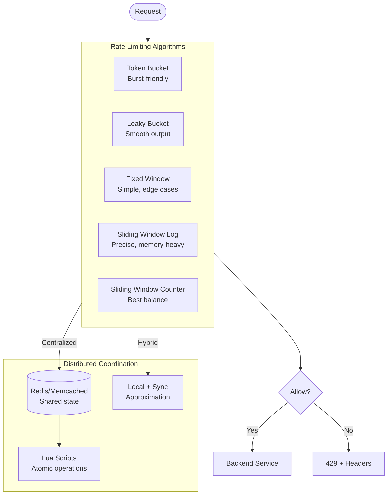

# Rate Limiting Strategies: Token Bucket, Leaky Bucket, and Sliding Window

Rate limiting protects distributed systems from abuse, prevents resource exhaustion, and ensures fair access. This article examines five core algorithms—their internal mechanics, trade-offs, and production implementations—plus distributed coordination patterns that make rate limiting work at scale.

<figure>



<figcaption>Rate limiting involves algorithm selection and distributed coordination. Most production systems use sliding window counter with Redis for the best accuracy-to-memory trade-off.</figcaption>
</figure>

## Abstract

Rate limiting answers one question: should this request proceed? The answer depends on counting requests within a time window—but how you count determines everything.

**The core trade-off:** Precision costs memory. Storing every request timestamp (sliding window log) gives exact counts but O(n) memory. Storing only counters (fixed window) uses O(1) memory but allows boundary exploits where clients get 2× their limit. The sliding window counter approximates the log with O(1) memory—Cloudflare measured 0.003% error rate at 400M requests.

**Why token bucket dominates:** It's the only algorithm that explicitly models burst capacity separately from sustained rate. AWS API Gateway, Stripe, and Envoy all use token bucket because real traffic is bursty—users click, pause, click again. Token bucket lets you say "100 requests/second average, but allow 500 in a burst" with a single data structure.

**The distributed problem:** Rate limiting only works if all instances agree on the count. Two approaches: shared state (Redis) with atomic operations, or local counting with periodic synchronization. Stripe started with single Redis, hit single-core saturation at 100K ops/sec, and migrated to Redis Cluster with 10 nodes. The key insight: use Lua scripts for atomic read-compute-write cycles to eliminate race conditions.

## Token Bucket

Token bucket is the most widely deployed algorithm because it explicitly separates two concerns: sustained rate and burst capacity.

### How It Works

A bucket holds tokens up to a maximum capacity. Tokens are added at a constant refill rate. Each request consumes tokens—if available, the request proceeds; if not, it's rejected.

```
tokens_available = min(capacity, tokens + elapsed_time × refill_rate)
```

The dual-parameter design (capacity + rate) is intentional. Capacity controls burst size—how many requests can arrive simultaneously. Rate controls sustained throughput—the long-term average. A bucket with capacity 100 and rate 10/sec allows 100 requests instantly, then 10/sec thereafter until the bucket refills.

### Implementation

```ts title="token-bucket.ts" collapse={1-2, 25-30}
// Token bucket implementation with lazy refill
type TokenBucket = { tokens: number; lastRefill: number }

function tryConsume(
  bucket: TokenBucket,
  capacity: number,
  refillRate: number, // tokens per second
  tokensRequested: number = 1,
): boolean {
  const now = Date.now()
  const elapsed = (now - bucket.lastRefill) / 1000

  // Lazy refill: calculate tokens that would have been added
  bucket.tokens = Math.min(capacity, bucket.tokens + elapsed * refillRate)
  bucket.lastRefill = now

  if (bucket.tokens >= tokensRequested) {
    bucket.tokens -= tokensRequested
    return true // Request allowed
  }
  return false // Request rejected
}

// Usage
const bucket: TokenBucket = { tokens: 100, lastRefill: Date.now() }
const allowed = tryConsume(bucket, 100, 10, 1) // capacity=100, rate=10/s
```

The lazy refill pattern avoids background timers. Instead of continuously adding tokens, calculate how many _would have been_ added since the last request. This makes token bucket O(1) time and O(1) space per client.

### Production Configurations

**AWS API Gateway** uses hierarchical token buckets:

- Regional: 10,000 req/s baseline (AWS-managed)
- Account: 10,000 req/s steady, 5,000 burst (configurable)
- Stage/Method: Per-API limits
- Client: Usage plan limits via API keys

The narrowest limit applies. A stage-level limit of 100 req/s overrides the account-level 10,000 req/s.

**Stripe** runs four distinct rate limiters, all token bucket:

1. **Request rate:** Maximum requests per second
2. **Concurrent requests:** Maximum in-flight (e.g., 20 concurrent)
3. **Fleet load shedder:** Reserves capacity for critical operations
4. **Worker utilization:** Sheds traffic by priority tier when workers saturate

**NGINX** implements token bucket with the `burst` parameter:

```nginx title="nginx.conf"
limit_req_zone $binary_remote_addr zone=api:10m rate=10r/s;

server {
    location /api/ {
        limit_req zone=api burst=20 nodelay;
        # 10 req/s sustained, 20 burst, no queueing delay
    }
}
```

The `nodelay` directive processes burst requests immediately rather than spacing them. Without it, NGINX queues burst requests and releases them at the sustained rate.

### Design Rationale

Token bucket exists because real traffic is bursty. Users don't send requests at uniform intervals—they click, read, click again. A strict rate limit (like leaky bucket) would reject legitimate bursts that don't threaten the backend.

The trade-off: token bucket allows temporary overload. A backend that can handle 100 req/s on average might struggle with 500 simultaneous requests. Capacity tuning requires understanding your backend's burst tolerance, not just its sustained capacity.

## Leaky Bucket

Leaky bucket enforces smooth, constant-rate output regardless of input burstiness.

### Mechanism

Requests enter a queue (the "bucket"). The queue drains at a fixed rate. If the queue is full, new requests are rejected.

Unlike token bucket, leaky bucket doesn't store burst capacity—it stores _pending requests_. A full bucket means requests are waiting, not that capacity is available.

### Two Variants

**Queue-based (original):** Maintains a FIFO queue with fixed capacity. Requests dequeue at a constant rate. This variant physically queues requests, adding latency.

**Counter-based:** Tracks request count with timestamps. On each request, decrement the counter based on elapsed time, then check if incrementing would exceed capacity. This variant rejects excess requests immediately without queueing.

```ts title="leaky-bucket-counter.ts" collapse={1-2}
// Counter-based leaky bucket (no actual queue)
type LeakyBucket = { count: number; lastLeak: number }

function tryConsume(
  bucket: LeakyBucket,
  capacity: number,
  leakRate: number, // requests per second
): boolean {
  const now = Date.now()
  const elapsed = (now - bucket.lastLeak) / 1000

  // "Leak" requests based on elapsed time
  bucket.count = Math.max(0, bucket.count - elapsed * leakRate)
  bucket.lastLeak = now

  if (bucket.count < capacity) {
    bucket.count += 1
    return true
  }
  return false
}
```

### When to Use

Leaky bucket suits scenarios requiring predictable, smooth throughput:

- **Network traffic shaping:** Original use case in telecommunications
- **Database write batching:** Prevent write spikes from overwhelming storage
- **Third-party API calls:** Stay within strict rate limits that don't allow bursts

NGINX's `limit_req` module without `burst` parameter implements leaky bucket semantics—excess requests are rejected immediately, producing smooth output.

### Trade-offs

- ✅ Smooth, predictable output rate
- ✅ Protects backends from any burst
- ✅ O(1) time and space
- ❌ Rejects legitimate bursts
- ❌ Queue-based variant adds latency
- ❌ Old requests can starve recent ones in queue variant

## Fixed Window Counter

Fixed window divides time into discrete intervals (e.g., each minute) and counts requests per interval.

### Mechanism

```
window_id = floor(current_time / window_duration)
count[window_id] += 1
if count[window_id] > limit: reject
```

When the window changes, the counter resets. This is the simplest rate limiting algorithm—just increment and compare.

### The Boundary Problem

Fixed window's critical flaw: clients can achieve 2× the intended rate by timing requests at window boundaries.

```
Limit: 100 requests per minute

Timeline:
  Minute 1                    Minute 2
  |-------------------------|--------------------------|
                       ↑    ↑
                  99 requests (end of minute 1)
                       +
                   100 requests (start of minute 2)

Result: 199 requests in ~2 seconds, despite 100/minute limit
```

This isn't theoretical—attackers actively exploit window boundaries. A 2020 analysis of GitHub's API found automated tools timing requests to maximize throughput at minute boundaries.

### When Acceptable

Fixed window works when:

- Precision isn't critical (internal services, development)
- Combined with finer-grained limits (2 req/s + 100 req/min)
- Traffic is naturally distributed (no coordinated clients)

**Complexity:** O(1) time, O(1) space per window. The simplest to implement and debug.

## Sliding Window Log

Sliding window log stores the timestamp of every request, providing exact rate limiting with no boundary exploits.

### Mechanism

```ts title="sliding-window-log.ts" collapse={1-2, 20-25}
// Sliding window log - exact counting
type SlidingWindowLog = { timestamps: number[] }

function tryConsume(log: SlidingWindowLog, windowMs: number, limit: number): boolean {
  const now = Date.now()
  const windowStart = now - windowMs

  // Remove timestamps outside window
  log.timestamps = log.timestamps.filter((t) => t > windowStart)

  if (log.timestamps.length < limit) {
    log.timestamps.push(now)
    return true
  }
  return false
}

// Usage: 100 requests per 60 seconds
const log: SlidingWindowLog = { timestamps: [] }
const allowed = tryConsume(log, 60_000, 100)
```

### Memory Cost

The fatal flaw: O(n) memory where n is requests per window.

At 10,000 requests/second with a 60-second window:

- 600,000 timestamps per client
- 8 bytes per timestamp = 4.8 MB per client
- 1 million clients = 4.8 TB

This is why sliding window log is rarely used in production. Even Redis Sorted Sets (efficient for this pattern) struggle at scale.

### When to Use

- Low-volume, high-precision requirements
- Audit logging where you need exact request history
- Testing and verification of other algorithms

## Sliding Window Counter

Sliding window counter approximates the sliding window log using O(1) memory. This is the production standard at Cloudflare, GitHub, and most large-scale APIs.

### Mechanism

Maintain counters for the current and previous windows. Weight the previous window's count by how much of it overlaps with the sliding window.

```
current_weight = elapsed_time_in_current_window / window_duration
previous_weight = 1 - current_weight

estimated_count = (previous_count × previous_weight) + current_count

if estimated_count > limit: reject
```

Visually:

```
Window N-1          Window N (current)
|---------|---------|
     ↑         ↑
  30% overlap  70% into current window

Estimate = 0.3 × count(N-1) + count(N)
```

### Implementation

```ts title="sliding-window-counter.ts" collapse={1-3, 30-35}
// Sliding window counter - O(1) memory approximation
type SlidingWindowCounter = {
  currentWindow: number
  currentCount: number
  previousCount: number
}

function tryConsume(counter: SlidingWindowCounter, windowMs: number, limit: number): boolean {
  const now = Date.now()
  const currentWindow = Math.floor(now / windowMs)

  // Check if we've moved to a new window
  if (currentWindow !== counter.currentWindow) {
    counter.previousCount = counter.currentCount
    counter.currentCount = 0
    counter.currentWindow = currentWindow
  }

  // Calculate weighted estimate
  const elapsedInWindow = now % windowMs
  const previousWeight = (windowMs - elapsedInWindow) / windowMs
  const estimate = counter.previousCount * previousWeight + counter.currentCount

  if (estimate < limit) {
    counter.currentCount += 1
    return true
  }
  return false
}
```

### Accuracy

Cloudflare tested sliding window counter against sliding window log on 400 million requests:

- **Error rate:** 0.003% of requests miscategorized
- **Average difference:** 6% from true rate

The approximation works because most requests don't arrive exactly at window boundaries. The weighted average smooths out boundary effects that plague fixed windows.

### Trade-offs

- ✅ O(1) memory (just two counters)
- ✅ O(1) time
- ✅ High accuracy (0.003% error)
- ✅ No boundary exploits
- ❌ Slight undercount at window start (previous window count decays)
- ❌ More complex than fixed window

## Design Choices

### Algorithm Selection Matrix

| Factor                     | Token Bucket | Leaky Bucket    | Fixed Window     | Sliding Window Counter |
| -------------------------- | ------------ | --------------- | ---------------- | ---------------------- |
| **Burst tolerance**        | Excellent    | None            | Boundary exploit | Good                   |
| **Memory per client**      | O(1)         | O(1)            | O(1)             | O(1)                   |
| **Accuracy**               | Burst-aware  | Strict          | Low              | High                   |
| **Distributed complexity** | Medium       | Hard            | Easy             | Medium                 |
| **Best for**               | APIs, CDNs   | Traffic shaping | Simple cases     | General purpose        |

### How to Choose

**Start with token bucket if:**

- Traffic is naturally bursty (user-facing APIs)
- You need separate burst and sustained limits
- Backend can handle temporary overload

**Use sliding window counter if:**

- Precision matters more than burst handling
- You're migrating from fixed window and hitting boundary exploits
- Memory constraints prevent sliding window log

**Use leaky bucket if:**

- Output must be perfectly smooth (downstream rate limits)
- Bursts would overwhelm the next system in the chain
- You're shaping network traffic

**Fixed window only if:**

- Simplicity trumps precision
- Combined with other limits (per-second + per-minute)
- Internal/trusted clients only

### Keying Strategies

Rate limit keys determine what gets limited:

| Strategy       | Pros                                      | Cons                                      | Use Case                         |
| -------------- | ----------------------------------------- | ----------------------------------------- | -------------------------------- |
| **IP address** | No auth required, stops bots              | Shared IPs (NAT, proxies), easy to rotate | DDoS protection, anonymous abuse |
| **API key**    | Fine-grained control, billing integration | Requires key infrastructure               | SaaS APIs, metered services      |
| **User ID**    | Fair per-user limits                      | Requires authentication                   | Authenticated APIs               |
| **Composite**  | Defense in depth                          | Complex configuration                     | High-security APIs               |

**Composite example:** Limit by `(user_id, endpoint)` to prevent one user from monopolizing expensive endpoints while allowing high volume on cheap ones.

**Multi-layer pattern:** Apply limits at multiple levels:

1. Global: 10,000 req/s across all clients (infrastructure protection)
2. Per-IP: 100 req/s (anonymous abuse prevention)
3. Per-user: 1,000 req/s (fair usage)
4. Per-endpoint: varies (resource protection)

The narrowest applicable limit wins.

## Distributed Rate Limiting

Single-instance rate limiting is straightforward. Distributed rate limiting—where multiple application instances must agree on counts—is where complexity lives.

### The Coordination Problem

Without coordination, N instances each allowing L requests per second collectively allow N×L requests:

```
Instance A: "User has made 50 of 100 requests" → Allow
Instance B: "User has made 50 of 100 requests" → Allow
Instance C: "User has made 50 of 100 requests" → Allow

Reality: User made 150 requests, all allowed
```

Three approaches exist: shared state, local approximation, and hybrid.

### Shared State with Redis

The standard pattern: centralize rate limit state in Redis. All application instances read and write the same counters.

**Redis Sorted Sets (Stripe pattern):**

Sorted sets naturally implement sliding window log with efficient operations:

```lua title="rate-limit.lua"
-- Sliding window log in Redis Sorted Set
-- Score = timestamp, Member = unique request ID
local key = KEYS[1]
local window_ms = tonumber(ARGV[1])
local limit = tonumber(ARGV[2])
local now = tonumber(ARGV[3])
local request_id = ARGV[4]

-- Remove expired entries
redis.call('ZREMRANGEBYSCORE', key, 0, now - window_ms)

-- Count current window
local count = redis.call('ZCARD', key)

if count < limit then
  redis.call('ZADD', key, now, request_id)
  redis.call('EXPIRE', key, math.ceil(window_ms / 1000))
  return 1  -- Allowed
end
return 0  -- Rejected
```

The Lua script executes atomically—no race conditions between read and write.

**Redis atomic counters:**

For fixed or sliding window counters, simpler operations suffice:

```ts title="redis-counter.ts" collapse={1-4, 25-30}
// Sliding window counter in Redis
// Requires two keys: current window and previous window
import Redis from "ioredis"

async function tryConsume(redis: Redis, key: string, windowSec: number, limit: number): Promise<boolean> {
  const now = Date.now()
  const currentWindow = Math.floor(now / 1000 / windowSec)
  const elapsedInWindow = (now / 1000) % windowSec
  const previousWeight = (windowSec - elapsedInWindow) / windowSec

  const [current, previous] = await redis.mget(`${key}:${currentWindow}`, `${key}:${currentWindow - 1}`)

  const estimate = parseInt(previous || "0") * previousWeight + parseInt(current || "0")

  if (estimate < limit) {
    await redis
      .multi()
      .incr(`${key}:${currentWindow}`)
      .expire(`${key}:${currentWindow}`, windowSec * 2)
      .exec()
    return true
  }
  return false
}
```

### Race Condition: Get-Then-Set

The naive approach has a critical race:

```
Time    Client A                    Client B
────────────────────────────────────────────────────
T1      GET counter → 99
T2                                  GET counter → 99
T3      Check: 99 < 100 → Allow
T4      SET counter = 100
T5                                  Check: 99 < 100 → Allow
T6                                  SET counter = 100  ← Wrong!
```

Both clients see 99, both increment to 100. Actual count should be 101.

**Solution: Lua scripts**

Move the entire read-check-write sequence into an atomic Lua script:

```lua title="atomic-increment.lua"
local key = KEYS[1]
local limit = tonumber(ARGV[1])
local window = tonumber(ARGV[2])

local current = tonumber(redis.call('GET', key) or 0)
if current < limit then
  redis.call('INCR', key)
  redis.call('EXPIRE', key, window)
  return 1
end
return 0
```

Redis executes Lua scripts atomically—no other commands interleave.

### Stripe's Redis Cluster Migration

Stripe initially ran rate limiting on a single Redis instance. The problem:

> "We found ourselves in a situation where our rate limiters were saturating a single core and network bandwidth of one Redis instance. We were seeing ambient failures and high latencies."
> — Brandur Leach, Stripe

The solution: migrate to Redis Cluster with 10 nodes.

**Key decisions:**

- Use Redis Cluster's 16,384 hash slots distributed across nodes
- Client calculates `CRC16(key) mod 16384` to route requests
- Keys for the same user land on the same node (use `{user_id}:*` to force slot)
- Result: horizontal scaling with negligible latency impact

**Critical insight:** Rate limit keys must include a hash tag to keep related keys on the same node:

```
{user_123}:requests      → Same slot
{user_123}:concurrent    → Same slot
{user_456}:requests      → Different slot (different user)
```

### GitHub's Implementation

GitHub runs sharded Redis with primary-replica topology:

- **Writes:** Always to primary
- **Reads:** Distributed across replicas
- **Atomicity:** Lua scripts for all rate limit operations
- **TTL management:** Explicit TTL setting in code, not relying on Redis key expiration

**Timestamp stability fix:** GitHub discovered that recalculating reset times caused "wobbling"—clients saw different reset times on consecutive requests. The fix: persist reset timestamps in the database rather than recalculating from current time.

### Local Approximation

For latency-sensitive paths, hitting Redis on every request may be unacceptable. Local approximation maintains per-instance counters and periodically syncs.

```ts title="local-approximation.ts" collapse={1-5, 35-50}
// Local rate limiter with periodic sync
// Trade-off: brief inconsistency for reduced latency
type LocalLimiter = {
  count: number
  limit: number
  syncedAt: number
}

class HybridRateLimiter {
  private local: LocalLimiter
  private syncIntervalMs: number
  private globalLimit: number

  constructor(globalLimit: number, syncIntervalMs: number = 1000) {
    this.globalLimit = globalLimit
    this.syncIntervalMs = syncIntervalMs
    this.local = { count: 0, limit: globalLimit, syncedAt: Date.now() }
  }

  async tryConsume(): Promise<boolean> {
    const now = Date.now()

    // Sync with Redis periodically
    if (now - this.local.syncedAt > this.syncIntervalMs) {
      await this.sync()
    }

    // Local check (fast path)
    if (this.local.count < this.local.limit) {
      this.local.count++
      return true
    }
    return false
  }

  private async sync(): Promise<void> {
    // Push local count to Redis, get global state
    // Adjust local limit based on global usage
  }
}
```

**Trade-off:** During sync intervals, the cluster may collectively exceed the limit by `instances × local_limit`. Tune sync frequency based on acceptable overage.

**Envoy's hybrid model:** Local token bucket absorbs bursts immediately, global rate limit service (gRPC to Redis-backed service) enforces mesh-wide limits. Local limits are more permissive than global.

### Cloudflare's Architecture

Cloudflare operates rate limiting at 200+ Points of Presence (PoPs) globally. Their approach:

- **No global state:** Each PoP runs isolated rate limiting
- **Leverage anycast:** Same client IP typically routes to same PoP
- **Twemproxy + Memcached:** Per-PoP caching cluster
- **Asynchronous increments:** Fire-and-forget counter updates
- **Mitigation flag caching:** Once a client exceeds threshold, cache the "blocked" state in memory to avoid Memcached queries

This works because anycast routing provides natural affinity—a client in Paris consistently hits the Paris PoP. Cross-PoP coordination would add latency without proportional benefit.

## Real-World Examples

### Discord: Per-Bucket Rate Limits

Discord uses a bucket-based system where related endpoints share a rate limit:

```
X-RateLimit-Bucket: abc123def456
X-RateLimit-Limit: 5
X-RateLimit-Remaining: 4
X-RateLimit-Reset: 1640995200.000
X-RateLimit-Reset-After: 1.234
```

**Key design decision:** The `X-RateLimit-Bucket` header lets clients identify shared limits across endpoints. `POST /channels/123/messages` and `POST /channels/456/messages` might share a bucket—clients must respect the bucket, not the endpoint.

**Global limit:** 50 requests/second across all endpoints, enforced separately from per-route limits.

### GitHub: Tiered Limits

GitHub's API has explicit tiers:

| Tier                    | Limit       | Use Case             |
| ----------------------- | ----------- | -------------------- |
| Unauthenticated         | 60/hour     | Public data scraping |
| Authenticated           | 5,000/hour  | Normal API usage     |
| GitHub App (Enterprise) | 15,000/hour | Heavy automation     |

**Secondary limits:** Beyond request count, GitHub limits:

- Concurrent requests (per user)
- CPU time consumption (expensive queries)
- Per-endpoint rates (abuse prevention)

**Implementation detail:** GitHub stores reset timestamps in their database, not derived from current time, to prevent timestamp wobble across distributed instances.

### Stripe: Load Shedding Hierarchy

Stripe's four-tier rate limiting shows sophisticated prioritization:

1. **Request rate limiter:** Hard limit on requests/second
2. **Concurrent request limiter:** Cap in-flight requests to prevent resource exhaustion
3. **Fleet load shedder:** When overall fleet utilization is high, reject low-priority traffic first (webhooks before charges)
4. **Worker utilization shedder:** Per-worker protection against thread pool exhaustion

**Kill switch pattern:** Each rate limiter can be disabled via feature flag for incident response. Dark launch testing validates new limits in production without enforcement.

## Error Responses and Client Guidance

### HTTP 429 and Headers

Rate-limited responses must include actionable information:

```http
HTTP/1.1 429 Too Many Requests
Retry-After: 30
RateLimit-Limit: 100
RateLimit-Remaining: 0
RateLimit-Reset: 1640995230

{
  "error": "rate_limit_exceeded",
  "message": "Rate limit exceeded. Retry after 30 seconds.",
  "retry_after": 30
}
```

**Retry-After:** The minimum header for 429 responses. Use delta-seconds (not timestamps) to avoid clock sync issues:

```
Retry-After: 30        ← Good: "wait 30 seconds"
Retry-After: Wed, 01 Jan 2025 00:00:30 GMT  ← Risky: requires clock sync
```

### IETF RateLimit Headers (draft-ietf-httpapi-ratelimit-headers)

The emerging standard (draft-10, as of 2025) defines:

**RateLimit-Policy:** Server's quota policy

```
RateLimit-Policy: 100;w=60;burst=20
```

- `100`: quota units
- `w=60`: window in seconds
- `burst=20`: burst allowance

**RateLimit:** Current state

```
RateLimit: limit=100, remaining=45, reset=30
```

**Design rationale:** Separating policy (what the server allows) from state (current usage) lets clients self-throttle proactively. A client seeing `remaining=5` can slow down before hitting `remaining=0`.

### Client-Side Best Practices

Well-behaved clients implement:

1. **Exponential backoff:** On 429, wait `min(2^attempt × base_delay, max_delay)` with jitter
2. **Proactive throttling:** Track `RateLimit-Remaining` and slow down before exhaustion
3. **Bucket awareness:** Respect `X-RateLimit-Bucket` to identify shared limits
4. **Retry-After compliance:** Never retry before `Retry-After` expires

```ts title="client-rate-limiting.ts" collapse={1-3, 25-30}
// Client-side rate limit handling
// Respects Retry-After and implements exponential backoff
async function fetchWithRateLimit(url: string, maxRetries: number = 5): Promise<Response> {
  for (let attempt = 0; attempt < maxRetries; attempt++) {
    const response = await fetch(url)

    if (response.status !== 429) {
      return response
    }

    const retryAfter = response.headers.get("Retry-After")
    const waitMs = retryAfter ? parseInt(retryAfter) * 1000 : Math.min(1000 * Math.pow(2, attempt), 60000)

    // Add jitter: ±10% of wait time
    const jitter = waitMs * 0.1 * (Math.random() * 2 - 1)
    await sleep(waitMs + jitter)
  }
  throw new Error("Rate limit exceeded after max retries")
}
```

## Common Pitfalls

### 1. Using Client-Provided Timestamps

**The mistake:** Trusting `X-Forwarded-For` or client timestamps for rate limiting.

**Why it happens:** Developers assume clients are honest.

**The consequence:** Attackers spoof headers to bypass limits or manipulate time windows.

**The fix:** Use server-side timestamps. For IP-based limiting, get client IP from your load balancer's trusted header after terminating at your edge.

### 2. Per-Instance Instead of Distributed Limits

**The mistake:** Each instance maintains its own rate limit state.

**Why it happens:** Shared state seems complex; local state "works in development."

**The consequence:** With N instances, clients get N× the intended limit.

**The fix:** Use Redis or another shared store. If latency is critical, use local approximation with periodic sync.

### 3. Fixed Window Without Secondary Limits

**The mistake:** Relying solely on fixed window counters.

**Why it happens:** Simple to implement; boundary problems aren't obvious in testing.

**The consequence:** Attackers time requests at window boundaries to achieve 2× limits.

**The fix:** Either migrate to sliding window counter, or layer limits (per-second + per-minute + per-hour).

### 4. Blocking Instead of Queueing for Bursts

**The mistake:** Immediately rejecting all requests that exceed the limit.

**Why it happens:** Rejection is simpler than queue management.

**The consequence:** Legitimate traffic spikes get rejected even when backend capacity exists.

**The fix:** Token bucket with appropriate burst capacity, or NGINX-style `burst` queue. Size the burst queue based on expected spike duration × processing rate.

### 5. Ignoring Cardinality Explosion

**The mistake:** Rate limiting by high-cardinality keys (e.g., per-request-ID, per-session-ID).

**Why it happens:** Over-specific limiting to "be fair."

**The consequence:** Memory exhaustion. If each of 1 million sessions gets a rate limit entry, you need 1 million entries.

**The fix:** Limit by lower-cardinality keys (user, IP, API key). Use TTLs aggressively to evict stale entries.

## Conclusion

Rate limiting protects systems through controlled rejection. The algorithm choice depends on your tolerance for bursts (token bucket allows them, leaky bucket doesn't), precision requirements (sliding window counter beats fixed window), and memory constraints (sliding window log is precise but expensive).

For most production systems: use **sliding window counter** for accuracy with O(1) memory, backed by **Redis with Lua scripts** for atomic distributed operations. Add **token bucket** semantics when you need explicit burst control separate from sustained rate.

The hardest part isn't the algorithm—it's the keying strategy. Rate limit by the right identity (user > API key > IP), at the right granularity (per-endpoint for resource protection, global for infrastructure protection), with useful error responses (429 + Retry-After + remaining counts).

## Appendix

### Prerequisites

- Understanding of distributed systems coordination patterns
- Familiarity with Redis data structures and atomic operations
- Basic knowledge of HTTP response codes and headers

### Terminology

- **Bucket capacity:** Maximum tokens a token bucket can hold; determines burst size
- **Refill rate:** Tokens added per time unit; determines sustained throughput
- **Window:** Time period over which requests are counted
- **Keying:** The identity used to group requests for rate limiting
- **Jitter:** Random variation added to retry delays to prevent thundering herd

### Summary

- Token bucket separates burst capacity from sustained rate—use for bursty traffic
- Sliding window counter provides high accuracy (0.003% error) with O(1) memory
- Fixed window has boundary exploits allowing 2× intended rate
- Distributed rate limiting requires shared state (Redis) or local approximation with sync
- Use Lua scripts in Redis to eliminate race conditions in read-check-write cycles
- Always return 429 with Retry-After header; consider IETF RateLimit headers for proactive client throttling

### References

- [IETF draft-ietf-httpapi-ratelimit-headers](https://datatracker.ietf.org/doc/draft-ietf-httpapi-ratelimit-headers/) - Standard rate limit headers
- [Stripe: Scaling Rate Limiters with Redis Cluster](https://stripe.com/blog/rate-limiters) - Production architecture
- [Cloudflare: Counting Things at Scale](https://blog.cloudflare.com/counting-things-a-lot-of-different-things/) - Sliding window counter accuracy data
- [GitHub: Sharded Rate Limiter in Redis](https://github.blog/engineering/infrastructure/how-we-scaled-github-api-sharded-replicated-rate-limiter-redis/) - Timestamp stability fix
- [NGINX: Rate Limiting](https://nginx.org/en/docs/http/ngx_http_limit_req_module.html) - Leaky bucket implementation
- [Envoy: Global Rate Limiting](https://www.envoyproxy.io/docs/envoy/latest/intro/arch_overview/other_features/global_rate_limiting) - Hybrid local/global pattern
- [AWS API Gateway Throttling](https://docs.aws.amazon.com/apigateway/latest/developerguide/api-gateway-request-throttling.html) - Hierarchical token bucket
- [Discord: Rate Limits](https://discord.com/developers/docs/topics/rate-limits) - Bucket-based rate limiting
