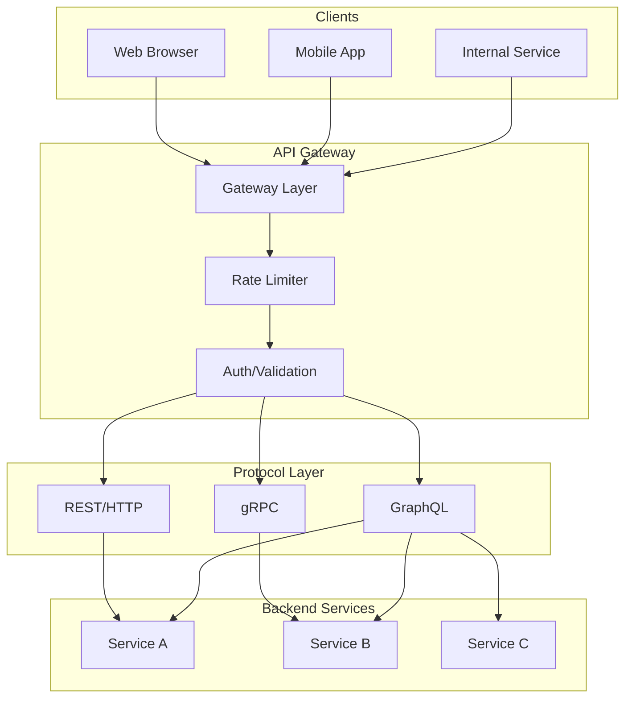

# RPC and API Design

Choosing communication protocols and patterns for distributed systems. This article covers REST, gRPC, and GraphQL—their design trade-offs, when each excels, and real-world implementations. Also covers API versioning, pagination, rate limiting, and documentation strategies that scale.

<figure>



<figcaption>API architecture: clients connect through a gateway that handles rate limiting and auth, then routes to appropriate protocol handlers. REST for public APIs, gRPC for internal service-to-service, GraphQL for flexible client queries.</figcaption>
</figure>

## Abstract

API design is about matching communication patterns to constraints:

| Protocol    | Optimizes For                            | Sacrifices                         |
| ----------- | ---------------------------------------- | ---------------------------------- |
| **REST**    | Cacheability, uniform interface, tooling | Flexibility, efficiency            |
| **gRPC**    | Performance, type safety, streaming      | Browser support, human readability |
| **GraphQL** | Query flexibility, reducing round trips  | Caching, complexity                |

The core trade-off: **coupling vs efficiency**. REST's uniform interface decouples clients from servers but requires multiple round trips. gRPC's contract-first approach enables optimizations but couples clients to schema. GraphQL shifts query logic to clients but complicates server-side caching.

**Decision heuristic:**

- Public APIs: REST (tooling, cacheability, developer familiarity)
- Internal microservices: gRPC (performance, type safety)
- Mobile/frontend with varying data needs: GraphQL (reduce round trips)
- Real-time bidirectional: gRPC streaming or WebSockets

## REST: Constraints and Trade-offs

### Fielding's Architectural Constraints

REST (Representational State Transfer) is an architectural style defined by Roy Fielding in his 2000 dissertation while co-authoring HTTP/1.1. It's not a protocol—it's a set of constraints that, when followed, yield specific architectural properties.

**The six constraints:**

| Constraint        | What It Means                             | Architectural Property    |
| ----------------- | ----------------------------------------- | ------------------------- |
| Client-Server     | Separation of concerns                    | Independent evolution     |
| Stateless         | No session state on server                | Scalability, reliability  |
| Cacheable         | Responses labeled cacheable/non-cacheable | Performance, reduced load |
| Uniform Interface | Standardized resource interactions        | Simplicity, visibility    |
| Layered System    | Client unaware of intermediaries          | Encapsulation, proxies    |
| Code-on-Demand    | Optional executable code transfer         | Extensibility             |

**Why statelessness matters:** Each request contains all information needed to process it. Servers don't store session state between requests. This enables:

- Horizontal scaling (any server can handle any request)
- Simpler failure recovery (no session loss)
- Better cacheability

**Trade-off:** Clients must send authentication/context with every request, increasing payload size.

### HATEOAS: The Forgotten Constraint

HATEOAS (Hypermedia As The Engine Of Application State) is REST's most ignored constraint. It requires servers to provide navigation options in responses:

```json collapse={1-4, 20-25}
// Example: Order resource with hypermedia links
{
  "orderId": "12345",
  "status": "pending",
  "total": 99.99,
  "_links": {
    "self": { "href": "/orders/12345" },
    "cancel": { "href": "/orders/12345/cancel", "method": "POST" },
    "pay": { "href": "/orders/12345/payment", "method": "POST" },
    "items": { "href": "/orders/12345/items" }
  }
}
// After payment, "pay" link disappears, "refund" appears
```

**Fielding's 2008 clarification:** "A REST API should be entered with no prior knowledge beyond the initial URI and set of standardized media types."

**Why most APIs ignore it:** HATEOAS requires clients to be generic hypermedia browsers rather than knowing the API structure upfront. In practice, client developers prefer explicit API documentation over runtime discovery. The overhead of parsing links adds latency without practical benefit for known API contracts.

### Richardson Maturity Model

Leonard Richardson's maturity model (popularized by Martin Fowler) categorizes APIs by REST adherence:

| Level | Name         | Description                            | Example                         |
| ----- | ------------ | -------------------------------------- | ------------------------------- |
| 0     | Swamp of POX | Single URI, single verb (usually POST) | SOAP over HTTP                  |
| 1     | Resources    | Multiple URIs, but verbs ignored       | `/getUser`, `/createUser`       |
| 2     | HTTP Verbs   | Resources + proper verb semantics      | GET `/users/123`, POST `/users` |
| 3     | Hypermedia   | Full HATEOAS with link navigation      | GitHub API, PayPal              |

**Production reality:** Most "REST" APIs are Level 2. Level 3 adds complexity without proportional benefit for APIs with stable contracts and good documentation.

### When REST Excels

**Best for:**

- Public APIs (universal tooling, curl-debuggable)
- Cacheable resources (CDN integration, HTTP cache headers)
- CRUD-dominant operations
- Browser clients without build tooling

**Real-world:** Stripe, Twilio, and GitHub use REST for public APIs. Stripe's API has maintained backward compatibility since 2011 using REST's uniform interface combined with careful versioning.

**Limitations:**

- Over-fetching: Fixed response shapes waste bandwidth
- Under-fetching: Multiple round trips for related data
- No streaming: HTTP/1.1 request-response only
- Chatty for mobile: Each resource requires separate request

## gRPC: Performance and Type Safety

### Protocol Buffers and Wire Efficiency

gRPC uses Protocol Buffers (protobuf) for serialization—a binary format that's 3-10x smaller than JSON and 20-100x faster to parse.

**Wire format efficiency:**

```protobuf collapse={1-2}
// user.proto
syntax = "proto3";

message User {
  int64 id = 1;        // Field number 1 (1 byte tag)
  string name = 2;     // Field number 2
  repeated string tags = 3;
}
```

**Encoding details:**

- Field tags use varint encoding: numbers 1-15 take 1 byte, 16-2047 take 2 bytes
- Strings are length-prefixed (no delimiters)
- Default values (0, "", false) aren't transmitted
- Unknown fields are preserved (forward compatibility)

**Size comparison (same user object):**

| Format   | Size     | Parse Time |
| -------- | -------- | ---------- |
| JSON     | 95 bytes | 2.1 ms     |
| Protobuf | 28 bytes | 0.08 ms    |

### HTTP/2 and Streaming Modes

gRPC mandates HTTP/2, enabling features impossible with HTTP/1.1:

**Multiplexing:** Multiple requests share one TCP connection. No head-of-line blocking at HTTP level (though TCP still has it).

**Four communication patterns:**

| Pattern          | Use Case                             | Example                         |
| ---------------- | ------------------------------------ | ------------------------------- |
| Unary            | Request-response                     | GetUser(id) → User              |
| Server streaming | Large result sets, real-time updates | ListOrders() → stream Order     |
| Client streaming | File upload, batched writes          | stream Chunk → UploadResult     |
| Bidirectional    | Chat, real-time sync                 | stream Message ↔ stream Message |

**Server streaming example:**

```protobuf
service OrderService {
  rpc ListOrders(ListRequest) returns (stream Order);
}
```

Client receives orders as they're fetched from database—no need to buffer entire response.

### gRPC Performance in Production

**Netflix:** Migrated recommendation serving to gRPC. Results:

- 90% latency reduction for live predictions
- 30,000 concurrent prediction requests per node
- Recommendations delivered in <25ms

**Why the improvement:** Binary serialization eliminates JSON parsing overhead. HTTP/2 multiplexing reduces connection setup. Streaming enables incremental responses.

**Uber:** Uses gRPC for real-time location tracking. Key benefit: low battery impact on mobile from efficient encoding and persistent connections.

### gRPC Limitations

**Browser support:** gRPC-Web requires a proxy (Envoy) to translate between gRPC and browser-compatible format. Native browser gRPC isn't possible due to lack of HTTP/2 trailer support in browser APIs.

**Debugging:** Binary format isn't human-readable. Requires tooling (grpcurl, Postman) instead of curl.

**Load balancer compatibility:** L7 load balancers need gRPC-aware configuration. Connection-level balancing (L4) doesn't distribute requests evenly because gRPC multiplexes requests over persistent connections.

**Recommendation:** Use gRPC between services you control. Keep REST for public APIs and browser clients.

## GraphQL: Query Flexibility

### Solving Over-fetching and Under-fetching

GraphQL lets clients specify exactly what data they need:

```graphql
query {
  user(id: "123") {
    name
    email
    orders(first: 5) {
      id
      total
      items {
        productName
      }
    }
  }
}
```

**REST equivalent:** 3 requests minimum (`/users/123`, `/users/123/orders`, `/orders/{id}/items` for each order).

**Trade-off:** Server complexity increases. Each field is a potential code path. Authorization becomes per-field instead of per-endpoint.

### The N+1 Problem and DataLoader

GraphQL's per-field resolvers create the N+1 query problem:

```
Query: users(first: 100) { orders { ... } }

Naive execution:
1. SELECT * FROM users LIMIT 100           -- 1 query
2. SELECT * FROM orders WHERE user_id = 1  -- 100 queries
3. SELECT * FROM orders WHERE user_id = 2
... (N+1 total)
```

**DataLoader solution (Facebook):** Batch and deduplicate requests within a single tick of the event loop:

```javascript collapse={1-3, 15-20}
// DataLoader batches loads within same execution frame
const userLoader = new DataLoader(async (userIds) => {
  // Single query: SELECT * FROM users WHERE id IN (1, 2, 3, ...)
  const users = await db.users.findByIds(userIds)
  // Return in same order as input keys (DataLoader contract)
  return userIds.map((id) => users.find((u) => u.id === id))
})

// In resolver
const resolvers = {
  Order: {
    user: (order) => userLoader.load(order.userId),
  },
}
```

**Critical rule:** Create new DataLoader instance per request. Sharing loaders leaks data between users.

**Shopify's approach:** Built GraphQL Batch Ruby library inspired by DataLoader. Reduced database queries by 10-100x for complex queries.

### GraphQL Caching Challenges

**HTTP caching doesn't work:** GraphQL uses POST for all queries (to send query body). POST responses aren't cached by CDNs or browsers.

**Solutions:**

1. **Persisted queries:** Hash queries server-side, clients send hash instead of full query. Enables GET requests and CDN caching.
2. **Response caching:** Cache at resolver level (per-field), not HTTP level.
3. **Client-side:** Apollo Client normalizes responses into entity cache.

**Real-world:** GitHub's GraphQL API uses persisted queries for their mobile apps. Reduces payload size and enables caching.

### When GraphQL Fits

**Best for:**

- Mobile apps with varying data requirements (reduce round trips)
- Aggregating multiple backend services (BFF pattern)
- Rapidly evolving frontends (no backend changes for new field combinations)

**Not suitable for:**

- Simple CRUD APIs (overhead not justified)
- File uploads (requires multipart extensions)
- Public APIs (attack surface for malicious queries)

**Query complexity protection:** Production GraphQL servers must limit:

- Query depth (prevent deeply nested queries)
- Query complexity (weighted field costs)
- Rate limiting per query cost, not just requests

## API Versioning Strategies

### Design Choices

#### URL Path Versioning

**Mechanism:** Version in URL path: `/v1/users`, `/v2/users`

**When to use:**

- Public APIs with long-lived versions
- Need to run multiple versions simultaneously
- Clear separation between versions

**Trade-offs:**

- ✅ Explicit, impossible to miss
- ✅ Easy routing at load balancer/gateway
- ✅ Different versions can be separate deployments
- ❌ URL pollution (not a resource attribute)
- ❌ Clients must update all URLs for new version

**Real-world:** Twitter, Facebook, and Google Maps use URL versioning. Google runs v1 and v2 simultaneously for years during migrations.

#### Header-Based Versioning

**Mechanism:** Version in custom header or Accept header

```http
GET /users HTTP/1.1
Accept: application/vnd.myapi.v2+json
```

**When to use:**

- Clean URLs are priority
- Gradual migration between versions
- Same resource, different representations

**Trade-offs:**

- ✅ URLs remain stable
- ✅ Easier version negotiation
- ❌ Hidden—easy to forget
- ❌ Harder to test (can't just change URL)
- ❌ Some tools don't support custom headers easily

#### Date-Based Versioning (Stripe's Approach)

**Mechanism:** Version by release date: `Stripe-Version: 2024-01-28`

**How Stripe implements it:**

1. **Account pinning:** First API call pins account to current version
2. **Header override:** `Stripe-Version` header overrides for testing
3. **Version change modules:** Internal code transforms responses between versions

```http
GET /v1/customers HTTP/1.1
Stripe-Version: 2024-01-28
```

**Why it works for Stripe:**

- Breaking changes are rare (biannual)
- Version modules handle transformation at edges
- Core code stays clean—versions are an adapter layer
- 72-hour rollback window after upgrade

**Trade-off accepted:** Complex internal architecture. Version transformation code accumulates over time.

**Result:** Code from 2011 still works. Stripe prioritizes API stability as infrastructure.

### Breaking Change Management

**What constitutes a breaking change:**

- Removing fields
- Changing field types
- Changing field semantics
- Removing endpoints
- Changing error codes

**Safe changes (additive):**

- Adding new fields
- Adding new endpoints
- Adding new optional parameters
- Adding new enum values (if clients handle unknown values)

**Deprecation pattern:**

```json collapse={1-2, 10-15}
// Response includes deprecation warning
{
  "data": { ... },
  "_warnings": [
    {
      "code": "deprecated_field",
      "message": "Field 'legacy_id' deprecated. Use 'id' instead.",
      "deprecated_at": "2024-01-01",
      "sunset_at": "2025-01-01"
    }
  ]
}
```

## API Pagination Strategies

### Offset Pagination

**Mechanism:** `LIMIT x OFFSET y`

```http
GET /orders?limit=20&offset=40
```

**When to use:**

- Small datasets (<10K records)
- Need "jump to page X" functionality
- Data changes infrequently

**Trade-offs:**

- ✅ Simple to implement
- ✅ Supports arbitrary page access
- ✅ Easy to calculate total pages
- ❌ Performance degrades with offset (database scans and discards rows)
- ❌ Inconsistent results if data changes between pages

**Performance cliff:** At offset 10,000, Postgres scans and discards 10,000 rows. Page 1: 10ms. Page 1000: several seconds.

### Cursor Pagination

**Mechanism:** Opaque cursor points to position in result set

```http
GET /orders?limit=20&after=eyJpZCI6MTIzNH0=
```

**How it works:**

1. Encode last item's sort key as cursor (often base64 JSON)
2. Query: `WHERE id > cursor_id ORDER BY id LIMIT 20`
3. Return `next_cursor` with response

**When to use:**

- Large datasets
- Infinite scroll / real-time feeds
- Data changes frequently

**Trade-offs:**

- ✅ Consistent performance regardless of page depth
- ✅ Stable results despite concurrent inserts
- ✅ 17x faster than offset for deep pagination (measured on 1M rows)
- ❌ No "jump to page" capability
- ❌ Can't easily show "page 5 of 100"

**Real-world:** Twitter, Facebook, and Slack use cursor pagination for feeds. Twitter's cursor encodes timestamp + tweet ID for deterministic ordering.

### Keyset Pagination

**Mechanism:** Use actual column values instead of opaque cursor

```http
GET /orders?limit=20&created_after=2024-01-15T10:30:00Z&id_after=12345
```

**Why two columns:** Timestamps alone aren't unique. Tie-breaker (usually ID) ensures deterministic ordering.

**Query:**

```sql
SELECT * FROM orders
WHERE (created_at, id) > ('2024-01-15T10:30:00Z', 12345)
ORDER BY created_at, id
LIMIT 20
```

**Requires:** Composite index on `(created_at, id)`

**Trade-offs:**

- ✅ Same performance benefits as cursor
- ✅ Debuggable (values visible, not encoded)
- ❌ Exposes internal schema
- ❌ Harder if sort order changes dynamically

### Decision Matrix

| Factor             | Offset       | Cursor | Keyset |
| ------------------ | ------------ | ------ | ------ |
| Dataset size       | <10K         | Any    | Any    |
| Page depth         | Shallow only | Any    | Any    |
| Jump to page       | ✅           | ❌     | ❌     |
| Real-time data     | ❌           | ✅     | ✅     |
| Implementation     | Simple       | Medium | Medium |
| Performance (deep) | O(offset)    | O(1)   | O(1)   |

## Rate Limiting Algorithms

### Token Bucket

**Mechanism:** Bucket holds tokens. Each request consumes a token. Tokens refill at fixed rate up to bucket capacity.

**Parameters:**

- Bucket capacity: Maximum burst size
- Refill rate: Sustained request rate

**Behavior:**

- Allows bursts up to capacity
- After burst, rate limited to refill rate
- Unused capacity accumulates (up to max)

```
Capacity: 10, Refill: 1/second

t=0: 10 tokens, 10 requests → 0 tokens
t=5: 5 tokens (refilled), 3 requests → 2 tokens
t=10: 7 tokens (2 + 5 refilled)
```

**Trade-offs:**

- ✅ Allows legitimate bursts
- ✅ Simple state (count + timestamp)
- ✅ Memory efficient
- ❌ Burst can overwhelm downstream
- ❌ Requires tuning capacity vs refill rate

**Real-world:** AWS API Gateway, Nginx use token bucket. AWS allows bursts of 5000 requests, then 10,000/second sustained.

### Leaky Bucket

**Mechanism:** Requests enter bucket, leak out at constant rate. Overflow rejected.

**Key difference from token bucket:** Output rate is constant, not bursty.

**Trade-offs:**

- ✅ Smooth, predictable output rate
- ✅ Protects downstream from bursts
- ❌ No burst allowance—legitimate spikes rejected
- ❌ Can reject requests even under limit if they arrive in bursts

**Use case:** Traffic shaping where downstream can't handle bursts (legacy systems, rate-limited third-party APIs).

### Sliding Window

**Sliding Window Log:** Store timestamp of each request. Count requests in last N seconds.

**Sliding Window Counter:** Combine current window count with weighted previous window.

```
Window: 60 seconds
Previous window: 50 requests
Current window: 30 requests (25 seconds in)
Effective count: 30 + (50 × 35/60) = 59.2 requests
```

**Trade-offs:**

| Variant | Memory      | Accuracy    | Burst Handling |
| ------- | ----------- | ----------- | -------------- |
| Log     | O(requests) | Exact       | Smooth         |
| Counter | O(1)        | Approximate | Smooth         |

**Real-world:** Redis-based rate limiters often use sliding window counter for balance of accuracy and memory efficiency.

### Rate Limit Headers

Standard headers (RFC 6585 + draft-ietf-httpapi-ratelimit-headers):

```http
HTTP/1.1 429 Too Many Requests
RateLimit-Limit: 100
RateLimit-Remaining: 0
RateLimit-Reset: 1640995200
Retry-After: 30
```

**Best practice:** Always include headers so clients can back off gracefully. Include `Retry-After` on 429 responses.

## API Documentation

### OpenAPI (Swagger)

**Current version:** OpenAPI 3.1 (2021) achieved full JSON Schema compatibility.

**What it defines:**

- Endpoints, methods, parameters
- Request/response schemas
- Authentication methods
- Server URLs

**Tooling ecosystem:**

- Code generation (client SDKs, server stubs)
- Documentation (Swagger UI, Redoc)
- Testing (Postman, Insomnia import)
- Validation (request/response checking)

**Best practice:** Generate OpenAPI from code annotations (not manual YAML). Keeps spec synchronized with implementation.

### AsyncAPI for Event-Driven APIs

**Purpose:** OpenAPI equivalent for message-based APIs (Kafka, RabbitMQ, WebSockets).

**Key differences from OpenAPI:**

- Channels instead of paths
- Messages instead of request/response
- Bindings for protocol-specific config

```yaml collapse={1-5}
asyncapi: 3.0.0
info:
  title: Order Events
  version: 1.0.0

channels:
  orderCreated:
    address: orders/created
    messages:
      orderCreated:
        payload:
          type: object
          properties:
            orderId: { type: string }
            total: { type: number }
```

**Tooling:** Springwolf generates AsyncAPI from Spring Kafka/RabbitMQ annotations.

## Real-World Protocol Decisions

### Slack: Hybrid Approach

**Problem:** Needed real-time messaging, REST-like simplicity for integrations, efficient mobile sync.

**Solution:**

- **Web API:** REST for third-party integrations (familiar, cacheable)
- **RTM API:** WebSocket for real-time events
- **Events API:** Webhooks for server-to-server

**Why not just gRPC:** Slack prioritized developer experience. REST + WebSocket was more accessible than requiring protobuf tooling from integration developers.

### Netflix: All-In on gRPC

**Scale:** 100% internal traffic uses gRPC.

**Why:**

- Multilingual services (Java, Node, Python) need shared contract
- Built-in load balancing and health checking
- Streaming for large recommendation payloads
- Protocol buffers reduce bandwidth (significant at Netflix scale)

**Trade-off accepted:** Built custom tooling for debugging. Invested in gRPC-Web proxy for admin UIs.

### GitHub: GraphQL for Public API

**Problem:** Mobile app needed flexible queries. REST API required many round trips.

**Solution:** GraphQL API alongside REST.

**Implementation details:**

- Persisted queries for mobile (reduced payload, enabled caching)
- Query complexity limits (prevent abuse)
- REST API maintained for backward compatibility

**Outcome:** Mobile app performance improved. Developer adoption slower than expected—GraphQL learning curve higher than REST.

## Common Pitfalls

### 1. Treating gRPC as HTTP/JSON Replacement

**The mistake:** Using gRPC for browser-facing APIs expecting same ease as REST.

**Why it happens:** Performance benchmarks show gRPC faster. Teams assume faster = better everywhere.

**The consequence:** Need gRPC-Web proxy, lose browser DevTools debugging, complicate frontend build.

**The fix:** Use gRPC for service-to-service. Keep REST/GraphQL for browser clients.

### 2. GraphQL Without Complexity Limits

**The mistake:** Exposing GraphQL without query depth/cost limits.

**Why it happens:** Focus on functionality, security as afterthought.

**The consequence:** Malicious queries exhaust server resources:

```graphql
query {
  users { friends { friends { friends { friends { ... } } } } }
}
```

**The fix:** Implement query complexity analysis. Limit depth (typically 10-15). Assign costs to fields. Reject queries exceeding budget.

### 3. Offset Pagination on Large Tables

**The mistake:** Using `LIMIT 20 OFFSET 100000` for API pagination.

**Why it happens:** Offset pagination is intuitive and works fine in development.

**The consequence:** Production queries take 10+ seconds. Database CPU spikes. Users report "infinite loading" on deep pages.

**The fix:** Switch to cursor pagination. If "jump to page" needed, limit maximum offset (e.g., 10,000).

### 4. Breaking API Changes Without Versioning

**The mistake:** Changing field types or removing fields in production API.

**Why it happens:** "It's just a small change" or "no one uses that field."

**The consequence:** Client applications break. Mobile apps (can't force update) fail for weeks.

**The fix:** Treat API as infrastructure. Additive changes only. Version for breaking changes. Deprecate before removing.

## Conclusion

Protocol selection requires matching characteristics to constraints:

| Constraint        | REST                | gRPC            | GraphQL                  |
| ----------------- | ------------------- | --------------- | ------------------------ |
| Public API        | ✅ Best             | ❌ Proxy needed | ⚠️ Query limits required |
| Internal services | ⚠️ Verbose          | ✅ Best         | ⚠️ Overkill              |
| Mobile apps       | ⚠️ Many round trips | ✅ Efficient    | ✅ Flexible              |
| Browser direct    | ✅ Native           | ❌ gRPC-Web     | ✅ Works                 |
| Streaming         | ❌ Workarounds      | ✅ Native       | ⚠️ Subscriptions         |
| Caching           | ✅ HTTP native      | ❌ Custom       | ⚠️ Complex               |

**The pragmatic approach:**

- REST for public APIs and browser-direct calls
- gRPC for internal service mesh
- GraphQL when client flexibility outweighs server complexity
- Often: multiple protocols in the same system

Versioning, pagination, and rate limiting aren't optional add-ons—they're fundamental to operating APIs at scale. Stripe's decade of API stability demonstrates that treating APIs as infrastructure pays long-term dividends.

## Appendix

### Prerequisites

- HTTP/1.1 and HTTP/2 fundamentals
- Basic understanding of serialization formats (JSON, binary)
- Database query basics (for pagination section)

### Summary

- REST optimizes for cacheability and uniform interface; most "REST" APIs are Level 2 Richardson Maturity
- gRPC provides 3-10x efficiency over JSON with binary serialization and HTTP/2 streaming; use for internal services
- GraphQL shifts query complexity to clients; requires N+1 mitigation (DataLoader) and query complexity limits
- Cursor pagination outperforms offset by 17x on large datasets; use offset only for small, static data
- Token bucket allows bursts, leaky bucket enforces constant rate—choose based on downstream tolerance
- Version APIs from day one; Stripe's date-based versioning maintains 13+ years of backward compatibility

### References

- [Martin Fowler: Richardson Maturity Model](https://martinfowler.com/articles/richardsonMaturityModel.html) - REST maturity levels explained
- [gRPC Core Concepts](https://grpc.io/docs/what-is-grpc/core-concepts/) - Official gRPC documentation
- [Protocol Buffers Encoding](https://protobuf.dev/programming-guides/encoding/) - Wire format specification
- [GraphQL Specification](https://spec.graphql.org/) - Official GraphQL spec
- [Solving N+1 with DataLoader](https://www.graphql-js.org/docs/n1-dataloader/) - GraphQL.js DataLoader documentation
- [Shopify: Solving N+1 through Batching](https://shopify.engineering/solving-the-n-1-problem-for-graphql-through-batching) - Production GraphQL optimization
- [Stripe: API Versioning](https://stripe.com/blog/api-versioning) - Date-based versioning strategy
- [Understanding Cursor Pagination](https://www.milanjovanovic.tech/blog/understanding-cursor-pagination-and-why-its-so-fast-deep-dive) - Performance deep dive
- [Rate Limiting Algorithms](https://blog.algomaster.io/p/rate-limiting-algorithms-explained-with-code) - Algorithm comparison with implementations
- [AsyncAPI Specification](https://www.asyncapi.com/docs/reference/specification/v3.0.0) - Event-driven API documentation standard
