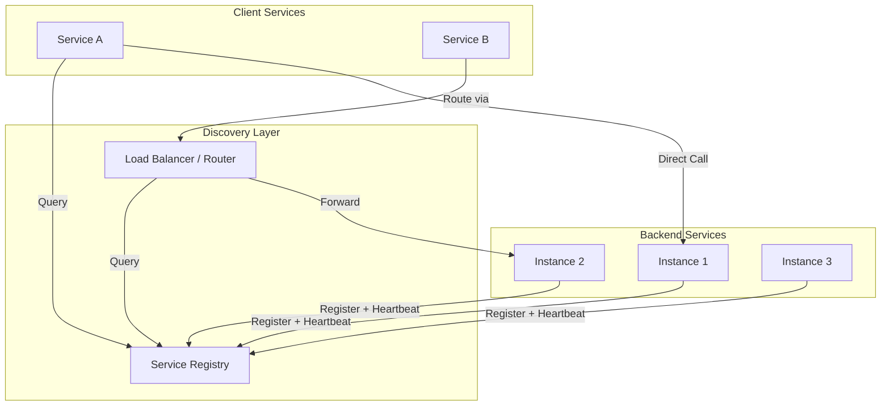

# Service Discovery and Registry Patterns

How services find each other in dynamic distributed environments where instance locations change continuously. This article covers discovery models, registry design, health checking mechanisms, and production trade-offs across client-side, server-side, and service mesh approaches.

<figure>



<figcaption>Service discovery connects clients to healthy backend instances through a registry. Client-side discovery queries the registry directly; server-side discovery routes through an intermediary.</figcaption>
</figure>

## Abstract

Service discovery solves the fundamental problem of dynamic addressing in distributed systems: how does Service A find Service B when B's instances scale, fail, and migrate continuously?

The core trade-off is **freshness vs. stability**:

- **Aggressive discovery** (low TTLs, frequent health checks) detects failures fast but amplifies load and risks flapping
- **Conservative discovery** (high TTLs, tolerant health checks) is stable but routes to stale endpoints

Three patterns dominate:

| Pattern      | Discovery Logic | Network Hops    | Coupling              |
| ------------ | --------------- | --------------- | --------------------- |
| Client-side  | In the client   | 1 (direct)      | High (registry-aware) |
| Server-side  | In a proxy/LB   | 2 (via proxy)   | Low (proxy handles)   |
| Service mesh | In sidecar      | 2 (via sidecar) | Zero (transparent)    |

Registries differ by consistency model: **CP systems** (ZooKeeper, etcd) guarantee you never route to a deregistered instance but may reject registrations during partitions. **AP systems** (Eureka) stay available but may temporarily route to stale endpoints.

## Discovery Models

### Client-Side Discovery

The client queries the registry directly, receives a list of healthy instances, and selects one using a local load-balancing algorithm.

**Mechanism:**

1. Service instances register with the registry on startup
2. Client queries registry for available instances of target service
3. Client applies load-balancing logic (round-robin, least connections, weighted)
4. Client calls the selected instance directly

**Best when:**

- Homogeneous client stack (all services use the same framework)
- Latency-critical paths where an extra hop matters
- Need sophisticated client-side load balancing (request hedging, adaptive routing)

**Trade-offs:**

- ✅ One fewer network hop than server-side
- ✅ Client controls load-balancing algorithm
- ✅ No central bottleneck in the data path
- ❌ Discovery logic must be implemented per language/framework
- ❌ Registry changes require client library updates across all services
- ❌ Clients become coupled to registry protocol

**Real-world example:** Netflix's OSS stack uses Eureka as the registry and Ribbon for client-side load balancing. Each service embeds Ribbon, which polls Eureka every 30 seconds for instance lists. This design eliminated the load balancer as a bottleneck—critical at Netflix's scale where a central LB would process billions of requests daily. The trade-off: every Netflix service must use the JVM and integrate with Ribbon.

### Server-Side Discovery

Clients call a well-known proxy or load balancer address. The proxy queries the registry and forwards requests to healthy instances.

**Mechanism:**

1. Service instances register with the registry
2. Proxy/LB subscribes to registry changes
3. Client calls the proxy using a stable DNS name or VIP
4. Proxy selects an instance and forwards the request

**Best when:**

- Polyglot environment with many languages/frameworks
- External clients (mobile apps, third-party integrations)
- Centralized policy enforcement (rate limiting, auth)

**Trade-offs:**

- ✅ Clients remain simple—no discovery logic
- ✅ Single point to update discovery behavior
- ✅ Language-agnostic
- ❌ Additional network hop adds latency
- ❌ Proxy can become a throughput bottleneck
- ❌ Proxy is a single point of failure (must be HA)

**Real-world example:** AWS Application Load Balancer (ALB) integrates with ECS/EKS for server-side discovery. Services register automatically via target group health checks. Clients hit the ALB's DNS name. AWS manages ALB availability across AZs, but customers pay for the extra hop (~1-2ms) and ALB's throughput limits (which can be raised but require planning for flash crowds).

### Service Mesh (Sidecar Pattern)

A proxy sidecar runs alongside each service instance, handling all inbound and outbound traffic transparently. The control plane configures sidecars with routing rules and service locations.

**Mechanism:**

1. Sidecar proxy (e.g., Envoy) is injected into each pod
2. Control plane (e.g., Istiod) watches the service registry and pushes configs to sidecars
3. Application calls `localhost` or a virtual address
4. Sidecar intercepts, resolves destination, and forwards

**Best when:**

- Zero-trust networking requirements (mTLS everywhere)
- Complex traffic management (canary deployments, traffic mirroring)
- Observability requirements (distributed tracing without code changes)
- Large organizations where mandating client library changes is impractical

**Trade-offs:**

- ✅ Completely transparent to applications
- ✅ Consistent behavior across all languages
- ✅ Rich traffic management capabilities built-in
- ❌ Significant resource overhead (~0.5 CPU, 50MB RAM per sidecar)
- ❌ Operational complexity of the mesh control plane
- ❌ Debugging becomes harder (problems could be app, sidecar, or control plane)

**Real-world example:** Lyft built Envoy specifically to migrate from a monolith to microservices without modifying existing services. The sidecar pattern let them add mTLS, rate limiting, and observability uniformly. Resource overhead is ~5% of cluster capacity at Lyft's scale. The trade-off they accepted: a distributed systems problem (network call) now has three components that could fail (app, local sidecar, remote sidecar).

### Decision Matrix

| Factor               | Client-Side   | Server-Side       | Service Mesh  |
| -------------------- | ------------- | ----------------- | ------------- |
| Latency overhead     | None          | +1-5ms            | +0.5-1ms      |
| Client complexity    | High          | Low               | None          |
| Language support     | Per-language  | Any               | Any           |
| Operational overhead | Low           | Medium            | High          |
| mTLS/security        | DIY           | DIY or LB feature | Built-in      |
| Traffic management   | Limited       | LB-dependent      | Comprehensive |
| Best scale           | < 50 services | Any               | > 20 services |

## Registry Design and Technologies

### ZooKeeper

**Architecture:** Hierarchical namespace (like a filesystem) with znodes. Consensus via ZAB protocol (Paxos variant). Strongly consistent (CP).

**Service discovery pattern:** Services create ephemeral znodes under `/services/{service-name}/`. Ephemeral nodes auto-delete when the session (TCP connection) terminates. Clients watch the parent node for child changes.

```
/services
  /user-service
    /instance-001  -> {"host": "10.0.1.5", "port": 8080}
    /instance-002  -> {"host": "10.0.1.6", "port": 8080}
```

**Session timeout behavior:** The client sends heartbeats every `sessionTimeout/3`. If the server receives no heartbeat within `sessionTimeout`, it expires the session and deletes all ephemeral nodes. Default minimum timeout is 2× tick time (typically 4 seconds minimum).

**Failure mode:** If a service process hangs (not crashed), its TCP connection may stay alive while it can't serve requests. The ephemeral node remains, routing traffic to a zombie instance. **Mitigation:** Implement application-level health endpoints; don't rely solely on session liveness.

**Best when:**

- Already using ZooKeeper for coordination (leader election, distributed locks)
- Need strong consistency guarantees
- Java-heavy environment (native client is Java)

**Real-world example:** Apache Kafka uses ZooKeeper for broker registration and topic metadata. Each broker creates `/brokers/ids/{broker-id}` as an ephemeral node. When a broker crashes, ZooKeeper detects session loss within ~6 seconds (default session timeout), and controllers rebalance partitions.

### etcd

**Architecture:** Flat key-value store with directory-like prefixes. Consensus via Raft. Strongly consistent (CP). gRPC API with watches.

**Service discovery pattern:** Services create keys with leases. Leases expire after TTL unless refreshed via `LeaseKeepAlive` stream.

```
/services/user-service/instance-001 -> {"host": "10.0.1.5", "port": 8080}
/services/user-service/instance-002 -> {"host": "10.0.1.6", "port": 8080}
```

**Lease mechanism:** A lease is created with a TTL (e.g., 10 seconds). Keys are attached to leases. The client must send keep-alive requests before TTL expires. If the client dies, the lease expires and all attached keys are deleted atomically.

**Watch guarantees:** Events are ordered by revision, never duplicated, and atomic (multi-key updates arrive together). Watches can resume from a revision if reconnecting after disconnect.

**API guarantees:** Strict serializability for KV operations—every completed operation is durable and linearizable.

**Best when:**

- Running Kubernetes (etcd is the backing store)
- Need strong consistency with better performance than ZooKeeper
- Polyglot environment (gRPC clients for many languages)

**Benchmark context:** etcd v3.3 achieved ~35,000 writes/sec with 28ms average latency in etcd-io/dbtester benchmarks—roughly 2× ZooKeeper's throughput and 6× Consul's for pure KV workloads.

### Consul

**Architecture:** Gossip-based membership (Serf/SWIM protocol) + Raft for state machine. Provides service discovery, health checking, and KV store in one package.

**Service discovery pattern:** Services register via agent API or config files. Consul agents run on every node and participate in gossip. Discovery via DNS (`user-service.service.consul`) or HTTP API.

**Health checking:** Multi-layer health model:

1. **Agent gossip:** SWIM protocol detects node failures (UDP-based, ~1 second detection)
2. **Service checks:** HTTP, TCP, script, or gRPC checks configured per service
3. **TTL checks:** Service must actively report healthy within TTL

**Gossip protocol details:** Consul uses SWIM with Lifeguard enhancements. LAN gossip (port 8301) handles intra-datacenter communication; WAN gossip (port 8302) handles cross-datacenter. Nodes marked "suspicious" get a grace period to prove liveness before being declared dead.

**DNS interface:** Query `user-service.service.consul` to get healthy instances. Supports SRV records for port discovery. Negative caching TTL is configurable via `soa.min_ttl`.

**Best when:**

- Need DNS-based discovery (legacy systems, databases)
- Multi-datacenter deployments (WAN gossip built-in)
- Want integrated health checking without external tools

**Real-world example:** HashiCorp's own platform uses Consul for discovery across multiple clouds. Their WAN gossip federation allows services in AWS to discover services in GCP without central coordination. Trade-off: Consul's KV performance lags etcd/ZooKeeper—they use it for discovery, not high-throughput configuration storage.

### Eureka

**Architecture:** AP system designed for AWS. Peer-to-peer replication between servers. Eventually consistent.

**Service discovery pattern:** Services register via REST API, then send heartbeats every 30 seconds. Clients cache the registry locally and refresh every 30 seconds.

**Self-preservation mode:** If heartbeat renewals drop below 85% of expected (indicating network partition rather than mass failures), Eureka stops evicting instances. This prevents cascading failures where a network blip causes mass deregistration.

The calculation: If 2 instances are registered, Eureka expects `(2 instances × 2 heartbeats/min + 1) × 0.85 = 5` heartbeats per minute. Below this threshold, self-preservation activates.

**Trade-off:** Self-preservation can delay detection of actual failures. A service that crashes during self-preservation mode stays in the registry until the mode exits or the service gracefully deregisters.

**Best when:**

- Running on AWS with fluctuating network conditions
- Prefer availability over consistency for discovery
- Already using Spring Cloud ecosystem

**Netflix's rationale:** Netflix chose AP semantics because routing to a potentially-stale instance is better than returning "no instances available" during a network partition. Their services are designed to handle transient failures gracefully (circuit breakers, retries, fallbacks).

### Kubernetes DNS (CoreDNS)

**Architecture:** CoreDNS pods watch the Kubernetes API for Service and EndpointSlice resources, generating DNS records on-the-fly.

**Service discovery pattern:** Services get DNS names automatically:

- ClusterIP: `my-service.namespace.svc.cluster.local` → ClusterIP VIP
- Headless: `my-service.namespace.svc.cluster.local` → Pod IPs directly

**Record types:**

- A record: Service name → IP(s)
- SRV record: `_port-name._protocol.service.namespace.svc.cluster.local` → port + target

**Caching behavior:** CoreDNS caches responses based on configured TTL (default 30 seconds). Negative caching (NXDOMAIN) uses SOA minimum TTL. Low TTLs improve freshness but increase API server load.

**Startup behavior:** CoreDNS delays serving for up to 5 seconds on startup while synchronizing with the Kubernetes API. If sync fails, it returns SERVFAIL for Kubernetes records until sync completes.

**Best when:**

- Already on Kubernetes
- Services only need to discover other in-cluster services
- Simple discovery needs (no weighted routing, canaries via DNS)

## Health Checking Patterns

### Health Check Types

| Type   | Mechanism                    | Detects                           | Doesn't Detect                        |
| ------ | ---------------------------- | --------------------------------- | ------------------------------------- |
| TCP    | Connect to port              | Process crash, port not listening | Application deadlock, OOM, logic bugs |
| HTTP   | GET /health returns 2xx      | Above + app can handle requests   | Dependency failures, partial failures |
| gRPC   | grpc.health.v1.Health        | Same as HTTP for gRPC services    | Same limitations                      |
| Script | Run arbitrary command        | Custom conditions                 | Slow if script is expensive           |
| TTL    | Service must actively report | Service-reported health           | Service hangs but doesn't report      |

### Designing Health Endpoints

**Shallow vs. deep checks:**

- **Shallow** (`/health`): Returns 200 if the process is running. Fast, stable, but misses dependency issues.
- **Deep** (`/health/ready`): Checks database connections, downstream services, cache. Comprehensive but can cause cascading failures if a shared dependency is slow.

**Recommendation:** Use shallow checks for load balancer health (keep traffic flowing). Use deep checks for orchestrator readiness (don't route until fully initialized).

**Example health endpoint logic:**

```go collapse={1-8, 22-30}
package main

import (
    "net/http"
    "time"
    "database/sql"
)

func healthHandler(db *sql.DB) http.HandlerFunc {
    return func(w http.ResponseWriter, r *http.Request) {
        // Shallow check - process is alive
        if r.URL.Query().Get("deep") != "true" {
            w.WriteHeader(http.StatusOK)
            return
        }
        // Deep check - verify critical dependencies
        ctx, cancel := context.WithTimeout(r.Context(), 2*time.Second)
        defer cancel()
        if err := db.PingContext(ctx); err != nil {
            w.WriteHeader(http.StatusServiceUnavailable)
            return
        }
        w.WriteHeader(http.StatusOK)
    }
}
```

### Health Check Timing

**Interval and timeout configuration:**

| Parameter           | Too Low                                   | Too High                           | Typical Range             |
| ------------------- | ----------------------------------------- | ---------------------------------- | ------------------------- |
| Interval            | High load on registry/services            | Slow failure detection             | 5-30 seconds              |
| Timeout             | False positives from slow networks        | Delayed detection of hung services | 2-10 seconds              |
| Unhealthy threshold | Flapping                                  | Traffic to dead instances          | 2-3 consecutive failures  |
| Healthy threshold   | Premature traffic to recovering instances | Slow recovery                      | 2-3 consecutive successes |

**Failure detection time:** `interval × unhealthy_threshold + timeout`

Example: 10s interval, 3 failures required, 5s timeout = 35 seconds worst-case detection time.

### Anti-Patterns

**Checking dependencies in liveness probes:** If your liveness probe calls the database and the database is slow, Kubernetes kills your pod. Now you have fewer pods to handle load, making the database slower, causing more pods to be killed—cascading failure.

**Health checks that do work:** A health endpoint that performs a database write "to verify it works" adds load proportional to the number of health checkers. With 3 replicas checking every 5 seconds, that's 36 writes/minute just for health checking.

**Single health endpoint for all purposes:** Load balancers, orchestrators, and monitoring have different needs. A single `/health` that checks everything will be either too aggressive (causes unnecessary restarts) or too lenient (routes to broken instances).

## DNS-Based Discovery Trade-offs

### Why DNS Is Attractive

- Universal support—every language, framework, and tool understands DNS
- No client libraries required
- Works with legacy applications that can't be modified
- Familiar operational model

### Why DNS Is Limited

**TTL and caching:**

DNS responses are cached at multiple layers: resolver, OS, application runtime. Even with a 30-second TTL:

1. Client makes DNS query at T=0, gets instance A
2. Instance A crashes at T=5
3. Client's DNS cache is valid until T=30
4. Client routes to dead instance for 25 seconds

**Negative caching:** If you query for a service before any instances register, the NXDOMAIN response is cached. Default negative TTL can be 5 minutes (Windows) to 15 minutes. New instances registering won't help until negative cache expires.

**JVM DNS caching:** The JVM caches DNS indefinitely by default for security reasons (`networkaddress.cache.ttl`). Override with `-Dsun.net.inetaddr.ttl=30` or configure via security properties.

**Load balancing limitations:**

- DNS round-robin gives equal weight to all instances—no least-connections or latency-based routing
- No health awareness—DNS returns all registered instances, healthy or not (unless registry integration removes unhealthy records)
- Connection reuse defeats DNS load balancing—long-lived HTTP/2 or gRPC connections stick to one backend

### Hybrid Patterns

**Consul DNS + HTTP API:** Use DNS for simple lookups from legacy apps; use HTTP API for sophisticated clients that need health status, tags, and metadata.

**External DNS + Service Discovery:** Tools like external-dns sync Kubernetes Service records to Route53/Cloud DNS, enabling discovery from outside the cluster.

## Security Considerations

### Authentication and Authorization

**mTLS (Mutual TLS):**

Service mesh deployments typically enforce mTLS between all services:

1. Control plane (e.g., Istiod, SPIRE) acts as CA
2. Each service gets a certificate with identity (SPIFFE ID, service account)
3. Sidecars terminate TLS, verify peer certificates
4. Authorization policies reference identities, not IPs

**Registry access control:**

- **Consul:** ACL tokens with per-service read/write permissions
- **etcd:** Role-based access control (RBAC) with per-key permissions
- **ZooKeeper:** ACLs per znode with digest, IP, or SASL authentication

**Service-to-service authorization patterns:**

| Pattern              | How It Works                            | Complexity | Flexibility          |
| -------------------- | --------------------------------------- | ---------- | -------------------- |
| mTLS identity        | Certificate SAN/CN checked by sidecar   | Medium     | Service-level        |
| JWT validation       | Bearer token verified by app or sidecar | Medium     | Request-level claims |
| External authz (OPA) | Sidecar calls policy engine             | High       | Arbitrary policies   |

### Threat Model

**Registry compromise:** An attacker who can write to the registry can redirect traffic to malicious instances. **Mitigation:** ACLs, audit logging, separate registry access from application credentials.

**Service impersonation:** Without mTLS, any pod on the network can claim to be any service. **Mitigation:** mTLS with identity verification, network policies.

**Health check bypass:** Malicious instance returns healthy but serves malformed responses. **Mitigation:** Deep health checks, anomaly detection in service mesh.

## Failure Modes and Split-Brain

### Network Partitions

**CP registry (ZooKeeper, etcd) behavior:**

During a partition, the minority partition loses quorum and stops accepting writes. Services in the minority can't register or update health status. Existing registrations remain until session/lease timeout.

**AP registry (Eureka) behavior:**

Both partitions continue operating independently. Each partition's registry diverges. After partition heals, registries must reconcile—Eureka uses timestamps to prefer newer registrations.

### Split-Brain Scenarios

**Scenario:** Network partition separates 2 of 5 etcd nodes.

- 3-node partition has quorum (3/5 > 50%), continues normal operation
- 2-node partition can't achieve quorum, becomes read-only
- Services in the 2-node partition can query cached data but can't register/deregister

**Mitigation strategies:**

1. **Odd number of registry nodes** (3, 5, 7)—ensures one partition always has majority
2. **Spread across failure domains**—if registry nodes are in different AZs, a single AZ failure doesn't lose quorum
3. **Client-side caching**—clients cache last-known-good instance list for graceful degradation

### Cascading Failures

**Registry overload pattern:**

1. Registry becomes slow under load
2. Health check timeouts increase
3. Instances marked unhealthy
4. Traffic redistributes to remaining instances
5. Remaining instances overload
6. More instances marked unhealthy
7. System collapse

**Mitigation:**

- Rate limit registration/deregistration operations
- Use exponential backoff with jitter for retries
- Implement circuit breakers between services and registry
- Self-preservation mode (Eureka's approach)

## Operational Considerations

### Capacity Planning

**Registry sizing:**

| Metric           | ZooKeeper    | etcd      | Consul          |
| ---------------- | ------------ | --------- | --------------- |
| Max services     | ~100K znodes | ~1M keys  | ~10K services   |
| Memory per entry | ~1KB         | ~256B     | ~1KB            |
| Write throughput | ~10K/sec     | ~35K/sec  | ~5K/sec         |
| Read throughput  | ~100K/sec    | ~100K/sec | Limited by Raft |

**Health check load:** `number_of_instances × check_frequency × checkers_per_instance`

Example: 1,000 instances, 5-second checks, 3 registry nodes = 600 checks/second cluster-wide.

### Monitoring

**Key metrics to track:**

- **Registration rate:** Spikes indicate deployment or scaling events; sustained high rates may indicate flapping
- **Deregistration rate:** High rates during non-deployment periods indicate failures
- **Health check latency:** p99 approaching timeout indicates infrastructure stress
- **Watch/subscription lag:** Time between state change and client notification
- **Registry leader elections:** Frequent elections indicate network instability or resource constraints

### Migration Strategies

**From static configuration to service discovery:**

1. Deploy registry alongside existing static configuration
2. Register services in both places
3. Migrate clients one at a time to use discovery
4. Verify with traffic shadowing
5. Remove static configuration

**Between discovery systems (e.g., Eureka to Consul):**

1. Run both registries in parallel
2. Services register with both
3. Migrate clients incrementally
4. Monitor error rates during transition
5. Decommission old registry

## Common Pitfalls

### 1. Trusting DNS TTLs

**The mistake:** Setting a 30-second TTL and assuming clients will re-resolve every 30 seconds.

**Why it happens:** DNS caching occurs at multiple layers (resolver, OS, language runtime) with different TTL handling.

**The consequence:** Traffic routes to stale instances for minutes after deregistration.

**The fix:** Understand your client's DNS behavior. For JVM, set `sun.net.inetaddr.ttl`. For long-lived connections, implement connection draining and client-side reconnection logic.

### 2. Health Checks as Liveness Probes

**The mistake:** Using deep health checks (that verify dependencies) for Kubernetes liveness probes.

**Why it happens:** "Comprehensive health checking" sounds like best practice.

**The consequence:** Database slowdown kills all pods via failed liveness probes, causing complete outage.

**The fix:** Shallow checks for liveness (is the process alive?), deep checks for readiness (can it serve traffic?).

### 3. Synchronous Registry Lookups in Hot Paths

**The mistake:** Calling the registry on every request to get the latest instance list.

**Why it happens:** Desire for freshest possible data.

**The consequence:** Registry becomes bottleneck; registry latency adds to every request latency.

**The fix:** Cache instance lists locally, refresh asynchronously (every 30 seconds), subscribe to change notifications where available.

### 4. Single Registry Cluster for All Environments

**The mistake:** Using one registry cluster for dev, staging, and production.

**Why it happens:** Operational simplicity, cost savings.

**The consequence:** A misconfigured dev service registers in production; a developer's load test overwhelms the shared registry.

**The fix:** Separate registry clusters per environment with network isolation.

## Conclusion

Service discovery is infrastructure—invisible when working, catastrophic when failing. The choice between client-side, server-side, and service mesh patterns depends on your constraints:

- **Client-side** when you control the client stack and need minimal latency
- **Server-side** when clients are heterogeneous or external
- **Service mesh** when you need uniform security and observability without code changes

Registry technology matters less than operational maturity. A well-operated Consul cluster beats a neglected etcd cluster. Focus on: monitoring registration/deregistration rates, testing partition scenarios, and understanding your clients' caching behavior.

The safest assumption: your service will be called with stale discovery data. Design for it—use timeouts, retries with backoff, and circuit breakers. Discovery tells you where services might be; your application must handle when they're not.

## Appendix

### Prerequisites

- Understanding of distributed systems fundamentals (CAP theorem, consensus)
- Familiarity with load balancing concepts
- Basic knowledge of DNS resolution

### Summary

- **Three discovery patterns:** Client-side (low latency, high coupling), server-side (simple clients, extra hop), service mesh (transparent, high overhead)
- **CP vs AP registries:** CP (ZooKeeper, etcd) sacrifices availability during partitions; AP (Eureka) may route to stale instances
- **Health checking:** Shallow for liveness, deep for readiness; never check dependencies in liveness probes
- **DNS limitations:** Caching at multiple layers, negative caching, no health-aware load balancing
- **Security:** mTLS for service identity, ACLs for registry access, audit logging
- **Failure handling:** Design for stale data, implement circuit breakers, test partition scenarios

### References

- [Microservices.io - Client-side discovery pattern](https://microservices.io/patterns/client-side-discovery.html)
- [Microservices.io - Server-side discovery pattern](https://microservices.io/patterns/server-side-discovery.html)
- [etcd API guarantees](https://etcd.io/docs/v3.5/learning/api_guarantees/)
- [Consul Gossip Protocol](https://developer.hashicorp.com/consul/docs/concept/gossip)
- [Netflix Eureka - Self Preservation Mode](https://github.com/netflix/eureka/wiki/server-self-preservation-mode)
- [Kubernetes DNS for Services and Pods](https://kubernetes.io/docs/concepts/services-networking/dns-pod-service/)
- [Istio Architecture](https://istio.io/latest/docs/ops/deployment/architecture/)
- [Airbnb SmartStack](https://medium.com/airbnb-engineering/smartstack-service-discovery-in-the-cloud-4b8a080de619)
- [ZooKeeper Programmer's Guide](https://zookeeper.apache.org/doc/current/zookeeperProgrammers.html)
- [RFC 2308 - Negative Caching of DNS Queries](https://datatracker.ietf.org/doc/html/rfc2308)
- [etcd-io/dbtester benchmarks](https://github.com/etcd-io/dbtester)
