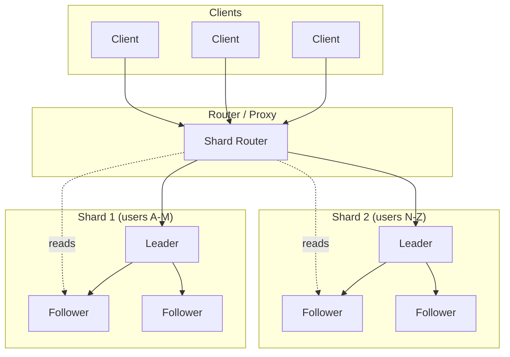

# Sharding and Replication

Scaling data stores beyond a single machine requires two complementary strategies: **sharding** (horizontal partitioning) distributes data across nodes to scale writes and storage capacity; **replication** copies data across nodes to improve read throughput and availability. These mechanisms are orthogonal—you choose a sharding strategy independently from a replication model—but their interaction determines your system's consistency, availability, and operational complexity. This article covers design choices, trade-offs, and production patterns from systems handling millions of queries per second.

<figure>



<figcaption>Sharding partitions data horizontally; replication copies each shard for fault tolerance. Router directs traffic based on shard key.</figcaption>
</figure>

## Abstract

The mental model: **sharding solves capacity, replication solves availability**. A single machine has finite write throughput, storage, and memory—sharding breaks the data into partitions that can live on different machines, scaling these resources linearly. But each shard is now a single point of failure—replication creates copies so the system survives node failures.

**These are independent design axes:**

| Axis                   | Options                                 | Determines                                 |
| ---------------------- | --------------------------------------- | ------------------------------------------ |
| **Sharding strategy**  | Hash, range, consistent hash, directory | Data distribution, query efficiency        |
| **Replication model**  | Single-leader, multi-leader, leaderless | Consistency guarantees, write availability |
| **Replication timing** | Sync, async, semi-sync                  | Durability vs. latency                     |

Every combination is valid:

- **CockroachDB** (v24.x): Range partitioning + Multi-Raft consensus—each 64MB range is an independent Raft group
- **Cassandra/ScyllaDB**: Consistent hashing + leaderless replication—vnodes or tablets for load distribution
- **DynamoDB**: Hash partitioning + quorum-based replication—partition key determines data placement
- **Vitess** (powers Slack at 2.3M QPS): Directory-based sharding + MySQL single-leader replication

The choice depends on access patterns, consistency requirements, and operational capacity.

## Sharding Strategies

Sharding (also called horizontal partitioning) splits data across multiple nodes. The shard key determines which node owns each record. The strategy choice affects query efficiency, load distribution, and operational complexity.

### Hash Partitioning

Apply a hash function to the shard key; the hash value determines the target shard.

**Mechanism**: `shard_id = hash(key) % num_shards`. Uniform hash functions distribute keys evenly regardless of key distribution.

**When to use**:

- Random point reads/writes (e.g., user profiles by user ID)
- Write-heavy workloads needing even distribution
- No range query requirements

**Trade-offs**:

- ✅ Even distribution with good hash function—prevents hot shards from skewed key distribution
- ✅ Simple routing logic
- ❌ Range queries require scatter-gather across all shards
- ❌ Adding/removing shards requires rehashing all keys (mitigated by consistent hashing)

**Real-world**: DynamoDB uses hash partitioning for item distribution. Partition key choice is critical—a hot partition (celebrity user, viral post) can throttle the entire table even when other partitions are idle. AWS recommends write sharding for high-throughput tables: append a random suffix to partition keys (e.g., `user_id#0` through `user_id#9`), then aggregate reads across all suffixes. This trades read complexity for write distribution.

### Range Partitioning

Assign contiguous key ranges to each shard. Adjacent keys live on the same shard.

**Mechanism**: Define split points (e.g., `[A-M] → Shard 1, [N-Z] → Shard 2`). Keys within a range route to the same shard.

**When to use**:

- Time-series data (partition by time bucket)
- Range scan requirements (e.g., "all orders from last week")
- Data archival (drop old partitions)

**Trade-offs**:

- ✅ Efficient range queries—single shard scan instead of scatter-gather
- ✅ Natural data locality for sequential access patterns
- ✅ Easy archival—drop partitions for old time ranges
- ❌ Hot spots on recent data (time-series) or popular key ranges
- ❌ Split point management adds operational complexity

**Real-world**: CockroachDB (v24.x) defaults to range partitioning with automatic splitting at 64MB. Each range forms an independent Raft consensus group—a cluster can have hundreds of thousands of ranges. Google Spanner uses range-based directory partitioning with TrueTime for global consistency. HBase uses range partitioning by row key—Yahoo found hot regions caused 80% of their operational issues. Their solution: salted row keys (prefix with hash) for write-heavy tables, trading range scan efficiency for write distribution.

**TiDB** (v8.x) uses a similar approach: data divides into Regions (96MB limit) where each Region is a Raft group. Auto-split/merge happens transparently—applications see a single logical table.

### Consistent Hashing

Hash both keys and nodes onto a virtual ring. Keys route to the next node clockwise on the ring.

**Mechanism**: Each node owns a portion of the hash ring. Adding a node only remaps keys between the new node and its clockwise neighbor—approximately `1/N` of all keys when scaling from `N` to `N+1` nodes.

**Why it exists**: Standard hash partitioning (`hash % N`) remaps nearly all keys when N changes. Consistent hashing minimizes disruption during scaling.

**Virtual nodes (vnodes)**: Each physical node claims multiple positions on the ring. Benefits:

- Smoother load distribution (more tokens = finer granularity)
- Faster rebalancing when nodes join/leave
- Better utilization of heterogeneous hardware (more vnodes for beefier machines)

Cassandra historically recommended 256 vnodes per node, later reduced to 16-32 for better performance. More vnodes reduce variance but increase metadata overhead and repair complexity.

> **Note**: Martin Kleppmann observes that consistent hashing "doesn't work very well for databases" because resharding costs remain high even with minimal key movement—the data still needs to physically move. For availability, replication beats resharding.

**ScyllaDB Tablets (2024)**: ScyllaDB's new replication architecture replaces legacy vnodes with "tablets"—dynamically redistributed data units. This achieves **30x faster** scaling operations and **50% reduction** in network costs compared to traditional vnode-based consistent hashing.

**Trade-offs**:

- ✅ Minimal key remapping during scaling (only ~1/N keys move)
- ✅ Natural load balancing with vnodes
- ❌ Ring management adds operational complexity
- ❌ Still scatter-gather for range queries
- ❌ Vnodes increase metadata and routing table size

**Real-world**: Amazon DynamoDB, Apache Cassandra, and Discord all use consistent hashing. Discord's Cassandra cluster scaled from 12 to 177 nodes over 5 years—consistent hashing kept migration overhead manageable. However, Discord ultimately migrated to ScyllaDB in 2023, citing Cassandra's GC pauses and hot partition issues. The migration moved **trillions of messages** in 9 days using a Rust-based migrator achieving **3.2 million records/second**.

### Directory-Based Sharding

A lookup service maps keys to shard locations. Maximum flexibility at the cost of an additional network hop and single point of failure.

**Mechanism**: Every read/write first queries the directory service to find the target shard. The directory can implement any mapping logic—hash, range, or custom rules.

**When to use**:

- Custom shard placement rules (e.g., isolate high-traffic tenants)
- Gradual migration between sharding schemes
- Regulatory requirements (data residency)

**Trade-offs**:

- ✅ Maximum flexibility—any mapping logic, any rebalancing strategy
- ✅ Can move individual keys without full resharding
- ❌ Directory becomes SPOF and latency bottleneck
- ❌ Additional network hop for every operation
- ❌ Directory state must be highly available and consistent

**Real-world**: MongoDB's (v8.0) config servers act as a sharding directory. MongoDB 8.0 introduced embedded config servers—no separate deployment needed—and **50x faster** data distribution across shards.

Vitess (used by YouTube since 2011, Slack, Pinterest, Square) maintains a topology service that maps keyspace ranges to shards. Slack runs Vitess at **2.3 million QPS** (2M reads, 300K writes) with median latency of **2ms** and p99 of **11ms**. The directory is typically replicated (via etcd or ZooKeeper) and cached aggressively to mitigate the SPOF concern.

**Pinterest's MySQL Sharding** uses a directory-based approach with IDs encoding shard location: 16-bit shard ID + 10-bit type ID + 36-bit local ID. Key principle: data never moves between shards once placed. This eliminates resharding complexity at the cost of inflexible data placement.

### Sharding Strategy Decision Matrix

| Factor                 | Hash              | Range               | Consistent Hash      | Directory          |
| ---------------------- | ----------------- | ------------------- | -------------------- | ------------------ |
| Point queries          | ✅ Single shard   | ✅ Single shard     | ✅ Single shard      | ✅ Single shard    |
| Range queries          | ❌ Scatter-gather | ✅ Single shard     | ❌ Scatter-gather    | Depends on mapping |
| Write distribution     | ✅ Even           | ❌ Hot spots likely | ✅ Even with vnodes  | Configurable       |
| Adding nodes           | ❌ Full rehash    | Manual split        | ✅ Minimal remapping | Manual             |
| Operational complexity | Low               | Medium              | Medium               | High               |
| Flexibility            | Low               | Medium              | Low                  | High               |

## Replication Models

Replication copies data across nodes for fault tolerance and read scaling. The replication model determines who accepts writes, how changes propagate, and what consistency guarantees exist.

### Single-Leader Replication

One node (leader) accepts all writes; followers replicate from the leader and serve reads.

**Mechanism**: Writes go to the leader, which logs them to a Write-Ahead Log (WAL). Followers pull or receive the WAL and apply changes. Reads can go to the leader (strong consistency) or followers (eventual consistency).

**Why it exists**: Simplest model to reason about. No conflict resolution needed—all writes serialize through one node.

**When to use**:

- Strong consistency requirements
- Moderate write throughput (single leader is bottleneck)
- Simpler operational model preferred

**Trade-offs**:

- ✅ No write conflicts—single serialization point
- ✅ Simpler to reason about and debug
- ✅ Strong consistency achievable (read from leader)
- ❌ Leader is write throughput bottleneck
- ❌ Leader failure requires failover (brief unavailability)
- ❌ Cross-region writes have high latency (must reach leader)

**Real-world**: PostgreSQL (v17+) streaming replication, MySQL replication, MongoDB replica sets. PostgreSQL 17 (September 2024) added logical replication failover—automatic slot sync to standbys via `sync_replication_slots` and the new `failover` parameter. Previously, logical replication couldn't survive primary failure without manual intervention.

Slack's original architecture used single-leader MySQL with asynchronous replication—writes in one datacenter, read replicas everywhere. This worked until COVID-19 traffic spikes exposed the write bottleneck, prompting their Vitess migration.

### Multi-Leader Replication

Multiple nodes accept writes independently, then replicate to each other.

**Mechanism**: Each leader handles writes for its region/partition. Leaders exchange changes asynchronously. Conflicts (concurrent writes to same key) require resolution.

**Why it exists**: Single-leader can't scale writes or survive leader datacenter failure. Multi-leader allows writes in every region with local latency.

**Conflict resolution strategies**:

- **Last-write-wins (LWW)**: Timestamp determines winner. Simple but loses data.
- **Merge**: Application-specific logic combines conflicting values (e.g., union of sets).
- **Custom resolution**: Application callback decides winner.

**When to use**:

- Multi-region deployments needing local write latency
- Offline-capable clients (each client is a "leader")
- High write availability requirements

**Trade-offs**:

- ✅ Local write latency in each region
- ✅ Survives datacenter failures without failover
- ✅ Higher write throughput (multiple leaders)
- ❌ Conflict resolution complexity
- ❌ Harder to reason about consistency
- ❌ Potential data loss with LWW

**Real-world**: CouchDB's multi-master replication for offline-first apps. Cassandra with `NetworkTopologyStrategy` for multi-datacenter deployments. Google Docs uses Operational Transformation (a form of conflict resolution) for real-time collaboration.

### Leaderless Replication

Any node accepts reads and writes. Clients contact multiple nodes; quorum determines success.

**Mechanism**: Client sends writes to W replicas and reads from R replicas. If `W + R > N` (total replicas), at least one node has the latest value. Quorum ensures overlap.

**Why it exists**: No leader means no single point of failure and no failover. Any node can serve any request.

**Quorum configurations**:

- `N=3, W=2, R=2`: Balanced reads/writes, tolerates 1 failure
- `N=3, W=3, R=1`: Fast reads, slow writes, no write tolerance
- `N=3, W=1, R=3`: Fast writes, slow reads, no read tolerance

**Read repair and anti-entropy**: Stale replicas are updated during reads (read repair) or background synchronization (anti-entropy/Merkle trees).

**When to use**:

- High availability requirements
- Can tolerate eventual consistency
- No single point of failure acceptable

**Trade-offs**:

- ✅ No leader = no failover needed
- ✅ High availability (any quorum serves requests)
- ✅ Tunable consistency via quorum settings
- ❌ Eventual consistency only (unless W=N and R=N)
- ❌ Conflict resolution needed for concurrent writes
- ❌ Higher network traffic (multiple replicas per request)

**Real-world**: Amazon DynamoDB, Apache Cassandra, Riak. DynamoDB's original paper (2007) introduced the quorum model that influenced a generation of databases.

**Discord's ScyllaDB migration (2023)** results:

- p99 read latency: **15ms** (vs. 40-125ms on Cassandra)
- p99 write latency: **5ms** (vs. 5-70ms on Cassandra)
- **50% fewer nodes** due to higher storage density
- Uses `LOCAL_QUORUM` for both reads and writes

### Replication Model Decision Matrix

| Factor                 | Single-Leader          | Multi-Leader           | Leaderless         |
| ---------------------- | ---------------------- | ---------------------- | ------------------ |
| Write consistency      | ✅ Strong (via leader) | ❌ Conflicts possible  | ❌ Eventual        |
| Write availability     | ❌ Leader SPOF         | ✅ Any leader          | ✅ Any quorum      |
| Write throughput       | ❌ Single bottleneck   | ✅ Scales with leaders | ✅ Scales with W   |
| Read consistency       | Configurable           | ❌ Eventual            | Configurable via R |
| Operational complexity | Low                    | High (conflicts)       | Medium             |
| Failover needed        | Yes                    | No                     | No                 |

## Synchronous vs. Asynchronous Replication

The replication timing determines durability and latency trade-offs.

### Synchronous Replication

Leader waits for follower acknowledgment before confirming write to client.

**Guarantee**: Write is durable on multiple nodes before confirmation. No data loss if leader fails.

**Cost**: Latency = leader write time + slowest follower replication time. Throughput limited by follower speed.

**When to use**: Financial transactions, audit logs, any data where loss is unacceptable.

**Real-world**: Google Spanner uses synchronous Paxos replication—writes commit only after majority acknowledgment. The TrueTime API (atomic clocks + GPS) provides **<1ms clock uncertainty at p99**, enabling external consistency. Spanner's "commit wait" ensures transaction visibility only after the commit timestamp passes—but with tight TrueTime bounds, this typically requires no actual waiting.

### Asynchronous Replication

Leader confirms write immediately; followers replicate in background.

**Guarantee**: Eventual consistency. Leader failure before replication = data loss.

**Benefit**: Minimum latency. Throughput unaffected by follower speed.

**When to use**: High throughput requirements, acceptable eventual consistency, acceptable rare data loss.

**Real-world**: Most single-leader systems default to async. Slack's MySQL used asynchronous replication with subsecond lag under normal conditions—but lag could spike to minutes during traffic bursts, causing stale reads.

### Semi-Synchronous Replication

Leader waits for at least one follower before confirming, but not all.

**Guarantee**: Write survives leader failure if the confirmed follower survives.

**Balance**: Better durability than async, better latency than full sync.

**When to use**: Most production single-leader deployments.

**Real-world**: MySQL semi-synchronous replication (`rpl_semi_sync_master_wait_for_slave_count=1`). PostgreSQL synchronous replication with `synchronous_commit = on` and named synchronous standbys.

## Read/Write Routing

How clients find the right node for their request.

### Write Routing

Writes must reach nodes that accept writes:

- **Single-leader**: Route to leader (failover-aware routing)
- **Multi-leader**: Route to local leader (region-aware routing)
- **Leaderless**: Route to W replicas (any W of N)

### Read Routing Strategies

**Read-your-writes consistency**: After a write, subsequent reads see that write.

Implementation options:

1. **Read from leader**: Guarantees consistency but doesn't scale
2. **Sticky sessions**: Client always reads from same replica
3. **Version tracking**: Client tracks last write version; read waits for replica to catch up

**Monotonic reads**: Once you see a value, you never see an older value.

Implementation: Sticky sessions (same replica per client) or version vectors.

**Bounded staleness**: Reads are at most T seconds behind writes.

Implementation: Track replication lag; route reads to replicas within bound.

**Real-world**: Stripe uses read-your-writes for payment confirmations (critical) but eventual consistency for analytics (acceptable lag). CockroachDB's follower reads allow stale reads with bounded staleness for latency-sensitive queries.

## Consistency and Replication Lag

Replication lag is the delay between a write on the leader and its visibility on followers.

### Sources of Lag

1. **Network latency**: Time for WAL to reach follower
2. **Apply time**: Time for follower to apply changes (especially with heavy indexes)
3. **Load**: High write throughput or follower CPU saturation
4. **Cross-region**: WAN latency (50-300ms typical)

### Lag Implications

**Single-leader with async replication**: Read from follower may miss recent writes. Read from leader always consistent but doesn't scale.

**Quorum systems**: `W + R > N` ensures overlap, but the overlapping node might have an older version during the quorum window.

**Real-world**: Discord observed P99 read latencies jump from 40ms to 125ms during Cassandra compaction storms—lag spikes caused by follower CPU saturation applying SSTable merges.

### Monitoring Lag

Essential metrics:

- **Replication lag (seconds)**: Primary indicator of follower freshness
- **Lag percentiles (P50, P99)**: Average lag hides spikes
- **Lag by replica**: Identifies problematic followers
- **Lag during writes**: Correlate with write throughput

PostgreSQL: `pg_stat_replication.replay_lag`
MySQL: `Seconds_Behind_Master` (misleading—measures relay log position, not actual staleness)
Cassandra: `org.apache.cassandra.metrics:type=Table,name=CoordinatorReadLatency`

## How to Choose

Choosing sharding and replication strategies requires analyzing your specific requirements across multiple dimensions.

### Factors to Consider

#### 1. Access Patterns

| Pattern                                 | Recommended Sharding                          | Rationale                                          |
| --------------------------------------- | --------------------------------------------- | -------------------------------------------------- |
| Random point reads/writes               | Hash partitioning                             | Even distribution regardless of key patterns       |
| Range scans (time-series, logs)         | Range partitioning                            | Sequential data on same shard                      |
| Mixed point + range queries             | Range with secondary hash indexes             | Trade-off: range efficiency with some distribution |
| Hot keys (celebrity users, viral posts) | Hash + write sharding or dedicated partitions | Spread load across multiple partitions             |
| Multi-tenant with isolation             | Directory-based                               | Per-tenant shard placement control                 |

#### 2. Consistency Requirements

| Requirement                      | Replication Model          | Replication Timing          | Example Use Case                        |
| -------------------------------- | -------------------------- | --------------------------- | --------------------------------------- |
| Strong consistency, serializable | Single-leader              | Synchronous                 | Financial transactions, inventory       |
| Strong consistency, linearizable | Raft/Paxos consensus       | Synchronous                 | Coordination services (etcd, ZooKeeper) |
| Read-your-writes                 | Single-leader              | Any (with version tracking) | User-facing CRUD operations             |
| Eventual (seconds OK)            | Multi-leader or leaderless | Asynchronous                | Social feeds, analytics                 |
| Eventual (minutes OK)            | Leaderless                 | Asynchronous                | DNS, config distribution, logging       |

#### 3. Scale Thresholds

| Scale Factor     | Threshold | Recommended Approach                       |
| ---------------- | --------- | ------------------------------------------ |
| Operations/sec   | < 10K     | Single node with read replicas may suffice |
| Operations/sec   | 10K-100K  | Replication + connection pooling + caching |
| Operations/sec   | > 100K    | Sharding required                          |
| Data size        | < 100GB   | Single node (with backups)                 |
| Data size        | 100GB-1TB | Replication for availability               |
| Data size        | > 1TB     | Sharding required                          |
| Write:read ratio | > 1:10    | Single-leader often sufficient             |
| Write:read ratio | > 1:1     | Consider multi-leader or leaderless        |

#### 4. Operational Capacity

| Team Capability            | Recommended Approach                                  |
| -------------------------- | ----------------------------------------------------- |
| No dedicated database team | Managed services (RDS, DynamoDB, Cloud Spanner)       |
| Small SRE team             | Simpler replication (single-leader), managed sharding |
| Large platform team        | Self-hosted with custom tooling (Vitess, CockroachDB) |
| Global operations          | Multi-region with automated failover                  |

### Decision Tree

```
Start: What's your primary bottleneck?

├── Write throughput / data volume
│   └── Do you need strong consistency?
│       ├── Yes → Range sharding + Raft consensus (CockroachDB, TiDB)
│       └── No → Hash/consistent hash + leaderless (Cassandra, DynamoDB)
│
├── Read throughput
│   └── Do you need strong consistency?
│       ├── Yes → Single-leader + read replicas (read from leader)
│       └── No → Leaderless with tunable quorum
│
├── Geographic distribution
│   └── Can you accept eventual consistency?
│       ├── Yes → Multi-leader with conflict resolution
│       └── No → Single-leader per region + cross-region Paxos (Spanner)
│
└── High availability (no SPOF)
    └── Leaderless replication (any quorum serves requests)
```

### Production Benchmarks

Reference points from production systems (as of 2024):

| System              | QPS            | Latency           | Scale                  | Architecture                   |
| ------------------- | -------------- | ----------------- | ---------------------- | ------------------------------ |
| Slack (Vitess)      | 2.3M peak      | 2ms p50, 11ms p99 | -                      | Directory + single-leader      |
| Stripe DocDB        | 5M             | -                 | 2,000+ shards, PB data | Directory + custom replication |
| Uber Docstore       | 40M+ reads/sec | -                 | Tens of PB             | Partitioned + Raft             |
| Discord (ScyllaDB)  | -              | 15ms p99 read     | Trillions of messages  | Consistent hash + leaderless   |
| Netflix (Cassandra) | Millions/sec   | -                 | PB data, 10K+ nodes    | Consistent hash + leaderless   |

## Resharding and Data Migration

As data grows, shards need to split. As traffic patterns change, shards need to rebalance.

### Online Resharding Challenges

1. **Consistency**: Reads and writes continue during migration
2. **Completeness**: No data lost or duplicated
3. **Performance**: Migration doesn't degrade production traffic
4. **Rollback**: Ability to abort if issues arise

### Stripe's Zero-Downtime Migration (DocDB)

Stripe's DocDB (custom MongoDB-based system) serves **5 million QPS** across **2,000+ shards** and petabytes of data. Their Data Movement Platform enables zero-downtime migrations:

**Phase 1 - Setup**:

- Register migration intent in coordination service
- Build indexes on destination shard
- Set up Change Data Capture (CDC) from source

**Phase 2 - Bulk Copy**:

- Snapshot source shard at point-in-time
- Bulk load to destination in sort order (B-tree friendly insertion)
- CDC captures writes during bulk copy

**Phase 3 - Catch-up**:

- Apply CDC changes to destination
- Repeat until lag is minimal (seconds)

**Phase 4 - Cutover**:

- Brief write pause (<2 seconds)
- Apply final CDC batch
- Update routing to point to destination
- Resume writes

**Phase 5 - Verification**:

- Point-in-time comparison between source and destination
- Reconcile any discrepancies (automatic rollback if issues detected)

**Phase 6 - Cleanup**:

- Mark migration complete
- Tombstone source data
- Remove CDC pipeline

**Evolution**: Stripe evolved from few large shards (tens of TB each) to thousands of smaller shards. Future work includes heat management for proactive balancing and shard autoscaling based on load patterns.

### Automatic Split/Merge

Some systems handle resharding automatically:

**CockroachDB**: Ranges split when they exceed size threshold (default 512MB) or experience high traffic. Raft-based replication handles the split coordination.

**Google Spanner**: Tablets split automatically. The split is transparent to applications—Paxos groups coordinate the redistribution.

**Trade-off**: Automation reduces operational burden but can cause unexpected load (splits during peak traffic). Most systems allow disabling auto-split for critical periods.

## Consensus Protocols in Practice

Modern distributed databases use consensus protocols (Raft, Paxos) to coordinate replicas. Understanding their implementation details matters for operational decisions.

### Raft

Raft powers etcd, CockroachDB, TiDB, and is the most widely-deployed consensus implementation.

**Core mechanism**: Leader election + log replication. One node is elected leader; all writes go through the leader; the leader replicates log entries to followers and commits when a majority acknowledges.

**Key extensions in production:**

- **PreVote**: Prevents disruptive elections when a rejoining node (with outdated log) tries to start an election. The node first checks if it _could_ win before incrementing its term.
- **Leadership transfer**: Orderly handoff during planned maintenance or when a better leader candidate exists.
- **Membership changes**: One node at a time, taking effect when the configuration entry is _applied_ (not just added to log).

**Why odd node counts**: 3 nodes tolerate 1 failure; 4 nodes also tolerate only 1 failure (need majority). Adding nodes doesn't always improve fault tolerance.

### Multi-Raft

When a database has thousands of shards, each shard being an independent Raft group creates overhead (goroutines, heartbeats, memory).

**CockroachDB's solution**: Coalesce heartbeats across all Raft groups between two nodes into a single request/response. Result: **3 goroutines per node** regardless of range count, instead of 1 goroutine per range.

**TiDB/TiKV**: One of few open-source implementations of Multi-Raft. Regions split automatically at 96MB threshold; each Region maintains its own Raft state machine.

### Paxos (Google Spanner)

Spanner uses leader-based Paxos with leases. Each tablet has its own Paxos state machine.

**TrueTime integration**: GPS receivers + atomic clocks in each datacenter provide **<1ms clock uncertainty at p99**. This enables external consistency without excessive coordination latency.

**Commit wait**: After committing, Spanner waits until the commit timestamp has passed before making the transaction visible. With tight TrueTime bounds, this wait is typically negligible.

## Failure Handling

Node failures, network partitions, and split-brain scenarios require careful handling.

### Failure Detection

**Heartbeats**: Nodes periodically ping each other. Missing heartbeats trigger failure suspicion.

**Timeouts**: How long to wait before declaring failure? Too short = false positives (network hiccup). Too long = slow failover.

**Phi Accrual Failure Detector**: Used by Cassandra. Calculates probability of failure based on heartbeat arrival times. Adapts to network conditions.

### Leader Failover (Single-Leader Systems)

**Detection**: Followers notice missing heartbeats from leader.

**Election**: Followers propose themselves; voting determines new leader. Raft uses randomized timeouts to avoid split votes.

**Promotion**: New leader starts accepting writes. Old leader (if still alive) must step down.

**Risks**:

- **Split-brain**: Old leader doesn't know it's been replaced, accepts writes → data divergence
- **Data loss**: Async replication means new leader may miss recent writes
- **Cascading failures**: Failover load causes new leader to fail

**Fencing**: Prevent split-brain by ensuring old leader can't accept writes:

- **STONITH (Shoot The Other Node In The Head)**: Power off the old leader
- **Fencing tokens**: Monotonically increasing tokens; storage rejects old tokens
- **Lease expiration**: Leader's write permission expires; must reacquire

### Quorum and Split-Brain Prevention

**Majority quorum**: Decisions require >50% of nodes. In a network partition, at most one partition has majority.

**Example**: 5-node cluster. Partition splits into 3 and 2 nodes. Only the 3-node partition can form quorums; 2-node partition stops accepting writes (preserves consistency, sacrifices availability).

**Why odd numbers**: Even splits (2-2 in 4-node cluster) means no partition has majority. Odd numbers guarantee one partition can progress.

**Quorum reads**: Reading from majority ensures at least one node has the latest value (if `W > N/2`).

### Real-World Failure Scenarios

**Discord's Cassandra hot partition incident (pre-2023)**: A viral server caused one partition to receive 1000x normal traffic. The partition's replicas couldn't keep up; read latencies spiked from 15ms to 125ms. Cassandra's JVM GC pauses exacerbated the problem. Short-term fix: caching for hot data. Long-term fix: **migration to ScyllaDB** (2023)—written in C++, no GC pauses, and new tablet architecture handles hot partitions better.

**Slack's MySQL failover during COVID-19**: Traffic jumped 50% in one week. Replication lag spiked, triggering alerts. The system handled it without failover because they had headroom, but it exposed that their lag monitoring thresholds were too conservative. They adjusted thresholds and added capacity—and accelerated their **Vitess migration** to decouple sharding from application logic.

**Stripe's DocDB migration**: Moving data across their 2,000+ shard fleet while maintaining 99.999% uptime. Their Data Movement Platform handles zero-downtime migrations with consistency verification. During one shard consolidation, they detected data discrepancy in the verification phase. The system automatically rolled back, triggered alerts, and paused migration. Root cause: CDC (Change Data Capture) missed a rare edge case with concurrent deletes. Fix deployed, migration resumed successfully.

**Uber Docstore's Raft split-brain recovery**: Each partition runs a 3-5 node Raft group with NVMe SSD storage. When network partitions isolate the leader, the Raft protocol ensures the minority partition cannot accept writes (no quorum). Upon partition heal, the isolated leader steps down gracefully via lease expiration. Key learning: Raft's leader lease (2 seconds in their configuration) must be shorter than client timeouts to prevent stale reads.

## Observability and Operational Tooling

Operating sharded, replicated systems requires comprehensive observability.

### Essential Metrics

**Per-shard metrics**:

- Query throughput (reads/writes per second)
- Query latency (P50, P95, P99)
- Data size and growth rate
- Connection count

**Replication metrics**:

- Replication lag (seconds behind leader)
- Replication throughput (bytes/second)
- Follower health status

**Cluster-wide metrics**:

- Shard balance (data distribution skew)
- Hot shard detection (throughput imbalance)
- Cross-shard query rate (indicator of shard key problems)

### Alerting Thresholds

| Metric                 | Warning       | Critical      | Action                                       |
| ---------------------- | ------------- | ------------- | -------------------------------------------- |
| Replication lag        | > 10s         | > 60s         | Investigate follower load; consider failover |
| Shard size imbalance   | > 20%         | > 50%         | Rebalance or reshard                         |
| Query latency P99      | > 2x baseline | > 5x baseline | Check for hot partitions, compaction         |
| Cross-shard query rate | > 10%         | > 25%         | Review shard key design                      |

### Operational Runbooks

**Replication lag spike**:

1. Check follower CPU/IO—is it keeping up with apply?
2. Check network between leader and follower
3. Check for long-running transactions blocking replication
4. Consider promoting a less-lagged replica if lag is critical

**Hot shard detected**:

1. Identify hot keys (query logs, slow query analysis)
2. Short-term: Add caching layer for hot data
3. Medium-term: Add read replicas for hot shard
4. Long-term: Reshard to split hot partition

**Split-brain suspected**:

1. Check network connectivity between nodes
2. Verify quorum state on each partition
3. If confirmed split-brain: isolate the minority partition (network block)
4. Reconcile any diverged writes manually

## Common Pitfalls

### 1. Choosing Shard Key Without Analyzing Access Patterns

**The mistake**: Picking shard key based on data model (primary key) rather than query patterns.

**Why it happens**: Database primary key seems like the obvious choice.

**The consequence**: Cross-shard queries for common operations. A user dashboard querying all their orders across time-sharded data requires scatter-gather.

**The fix**: Analyze top queries before choosing shard key. The key should partition data along your most common access pattern.

**Example**: An e-commerce site sharded orders by `order_id`. Every "show my orders" query became a scatter-gather across all shards. Resharding by `user_id` made the common query single-shard.

### 2. Underestimating Replication Lag Impact

**The mistake**: Assuming replication is "fast enough" without measuring.

**Why it happens**: Lag is often subsecond in development; production load is different.

**The consequence**: Users see stale data. Worse: read-after-write inconsistency causes user-visible bugs ("I just updated my profile but it shows old data").

**The fix**: Measure lag percentiles in production. Implement read-your-writes consistency for user-facing flows. Alert on lag spikes.

**Example**: Slack found replication lag spiked to minutes during traffic bursts, causing support tickets about "missing messages." They added version tracking for read-your-writes consistency on critical paths.

### 3. Ignoring Hot Partition Problem

**The mistake**: Assuming hash sharding eliminates hot spots.

**Why it happens**: Hash sharding distributes keys evenly, but access patterns aren't uniform.

**The consequence**: One partition (celebrity user, viral content) receives 1000x traffic, overwhelming its replicas.

**The fix**: Monitor per-partition throughput. Design for hot key mitigation: caching, request coalescing, or dedicated partitions for known hot keys.

**Example**: Discord's "celebrity server" problem—servers with 100K+ members had orders of magnitude more traffic than small friend groups. Solution: channel-level sharding (not server-level) to distribute load within popular servers.

### 4. Treating Failover as Instantaneous

**The mistake**: Assuming failover is seamless and instant.

**Why it happens**: Marketing materials say "automatic failover."

**The consequence**: Failover takes 10-30 seconds. During failover: connection errors, potential data loss (async replication), application retry storms.

**The fix**: Design applications to handle brief unavailability. Implement circuit breakers. Test failover regularly. Consider synchronous replication for zero data loss.

**Example**: A team assumed their managed database "had failover." In production, failover took 25 seconds—their 30-second HTTP timeout caused cascading failures. Fix: shorter timeouts (5-10 seconds), circuit breakers, and regular failover testing in staging. AWS RDS Multi-AZ failover typically takes 60-120 seconds; plan for this.

## Conclusion

Sharding and replication are independent design axes with distinct trade-offs:

**Sharding strategy** determines data distribution and query efficiency:

- **Hash partitioning**: Even distribution, but range queries require scatter-gather
- **Range partitioning**: Efficient scans, but hot spots on recent/popular data
- **Consistent hashing**: Minimal disruption during scaling, but resharding costs remain high
- **Directory-based**: Maximum flexibility, but adds operational complexity and SPOF risk

**Replication model** determines consistency and availability:

- **Single-leader**: Simplest to reason about, but leader is SPOF and write bottleneck
- **Multi-leader**: Multi-region writes with local latency, but requires conflict resolution
- **Leaderless**: No SPOF, highly available, but eventual consistency only

**Consensus protocols** (Raft, Paxos) enable strong consistency with replication. Multi-Raft scales to hundreds of thousands of consensus groups per cluster.

**Production patterns (2024)**:

- **Slack** (Vitess, 2.3M QPS): Directory-based sharding + single-leader MySQL
- **Discord** (ScyllaDB): Consistent hashing with tablets + leaderless replication
- **Stripe** (DocDB, 5M QPS): Directory-based sharding + custom replication
- **Uber** (Docstore, 40M+ reads/sec): Partitioned + Raft consensus

There's no universal answer—only trade-offs that match your access patterns, consistency requirements, and operational capacity.

## Appendix

### Prerequisites

- Basic database concepts (ACID, indexes, transactions)
- Distributed systems fundamentals (network partitions, CAP theorem)
- Understanding of consistency models (strong vs. eventual)

### Terminology

- **Shard/Partition**: A horizontal partition of data; one piece of a partitioned dataset
- **Replica**: A copy of data on another node for fault tolerance
- **Leader/Primary**: The node that accepts writes in single-leader replication
- **Follower/Secondary**: A node that replicates from a leader
- **Quorum**: The minimum number of nodes that must agree for an operation to succeed
- **WAL (Write-Ahead Log)**: Append-only log of changes used for durability and replication
- **Vnode**: Virtual node; a token position on a consistent hashing ring
- **Tablet/Region**: A data partition in systems using Raft/Paxos (Spanner, CockroachDB, TiDB)
- **CDC (Change Data Capture)**: Technology for capturing row-level changes for replication or migration
- **Raft**: Consensus protocol for leader election and log replication; simpler alternative to Paxos
- **Multi-Raft**: Running multiple independent Raft consensus groups per cluster (one per shard/region)

### Summary

- **Sharding scales capacity**: Distribute data across nodes to scale writes, storage, and memory
- **Replication scales availability**: Copy data across nodes to survive failures and scale reads
- **Orthogonal axes**: Choose sharding strategy and replication model independently based on access patterns
- **Hash partitioning**: Even distribution, scatter-gather for range queries
- **Range partitioning**: Efficient scans, hot spots on recent data
- **Single-leader**: Simplest, strong consistency, but leader is SPOF and write bottleneck
- **Leaderless**: No SPOF, high availability, eventual consistency, conflict resolution needed
- **Raft/Paxos consensus**: Enables strong consistency with replication; Multi-Raft scales to thousands of groups
- **Zero-downtime resharding**: CDC, bulk copy, catch-up, brief cutover, verification, rollback capability
- **Monitor lag, hot partitions, and cross-shard queries** to detect problems before they impact users

### References

**Foundational Papers & Specifications**

- [Amazon DynamoDB Paper (2007)](https://www.allthingsdistributed.com/files/amazon-dynamo-sosp2007.pdf) - Foundational paper on consistent hashing and quorum-based replication
- [Google Spanner Paper (2012)](https://research.google/pubs/pub39966/) - Globally distributed database with synchronous replication and TrueTime
- [Raft Consensus Algorithm](https://raft.github.io/) - Understandable consensus for leader election and log replication
- [etcd Raft Library](https://github.com/etcd-io/raft) - Production Raft implementation used by Kubernetes, CockroachDB, TiDB

**Official Documentation**

- [CockroachDB Architecture](https://www.cockroachlabs.com/docs/stable/architecture/overview.html) - Range partitioning with Multi-Raft replication
- [CockroachDB: Scaling Raft](https://www.cockroachlabs.com/blog/scaling-raft/) - Multi-Raft implementation details
- [PostgreSQL 17 Release Notes](https://www.postgresql.org/about/news/postgresql-17-released-2936/) - Logical replication failover features
- [MongoDB 8.0 Announcement](https://www.mongodb.com/company/blog/mongodb-8-0-raising-the-bar) - Embedded config servers, 50x faster sharding
- [ScyllaDB Tablets (2024)](https://www.scylladb.com/2024/12/03/enterprise-tablets/) - New replication architecture replacing vnodes

**Engineering Blog Posts**

- [Discord: How Discord Stores Trillions of Messages](https://discord.com/blog/how-discord-stores-trillions-of-messages) - Cassandra to ScyllaDB migration (2023)
- [Slack: Scaling Datastores with Vitess](https://slack.engineering/scaling-datastores-at-slack-with-vitess/) - MySQL sharding at 2.3M QPS
- [Stripe: Zero-Downtime Data Migrations](https://stripe.com/blog/how-stripes-document-databases-supported-99.999-uptime-with-zero-downtime-data-migrations) - DocDB migration methodology
- [Pinterest: Sharding MySQL](https://medium.com/pinterest-engineering/sharding-pinterest-how-we-scaled-our-mysql-fleet-3f341e96ca6f) - ID-encoded shard placement
- [Uber Docstore](https://www.uber.com/blog/how-uber-serves-over-40-million-reads-per-second-using-an-integrated-cache/) - 40M+ reads/sec with Raft
- [LinkedIn Espresso](https://engineering.linkedin.com/espresso/introducing-espresso-linkedins-hot-new-distributed-document-store) - Hash-based partitioning at scale
- [Netflix Key-Value Data Abstraction](https://netflixtechblog.com/introducing-netflixs-key-value-data-abstraction-layer-1ea8a0a11b30) - Cassandra-based data layer
- [TiDB Architecture](https://www.pingcap.com/blog/building-a-large-scale-distributed-storage-system-based-on-raft/) - Multi-Raft implementation

**Books**

- [Martin Kleppmann: Designing Data-Intensive Applications](https://dataintensive.net/) - Chapters 5-6 on replication and partitioning
