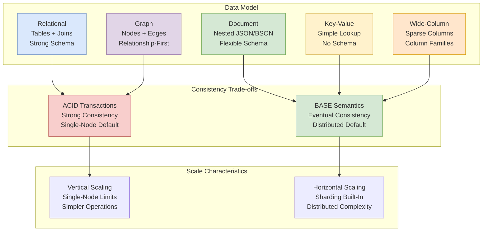

# Storage Choices: SQL vs NoSQL

Choosing between SQL and NoSQL databases based on data model requirements, access patterns, consistency needs, and operational constraints. This guide presents the design choices, trade-offs, and decision factors that drive storage architecture decisions in production systems.

<figure>



<figcaption>Storage paradigms map to different consistency and scaling defaults—but these are defaults, not absolutes. Modern systems blur these boundaries.</figcaption>

</figure>

## Abstract

The SQL vs NoSQL distinction has become less meaningful as databases converge: PostgreSQL handles JSON natively with GIN indexes, MongoDB supports ACID transactions across sharded clusters, and NewSQL databases (Spanner, CockroachDB) provide SQL semantics with horizontal scaling. The choice is no longer "relational vs not"—it's about matching **data model**, **access patterns**, and **consistency requirements** to specific database capabilities.

**The mental model:**

- **Data model drives choice**: Highly relational data with complex joins → SQL. Document aggregates accessed as units → document stores. Simple key-based lookups at massive scale → key-value stores.
- **Access patterns matter more than data size**: A 10TB dataset with simple key lookups is easier to scale than a 100GB dataset requiring complex ad-hoc joins.
- **Consistency is tunable, not binary**: Most databases offer per-operation consistency levels. DynamoDB, Cassandra, and even PostgreSQL replicas support both strong and eventual reads.
- **Operational capability constrains choices**: A database is only as good as your team's ability to operate it. Cassandra's flexibility comes with operational complexity that many teams underestimate.

**Key insight:** Start with your access patterns and consistency requirements, not with "SQL or NoSQL." The question is: "What queries must be fast, what consistency do they need, and how will this scale?"

## The Database Landscape

### SQL (Relational) Databases

Relational Database Management Systems (RDBMS) store data in tables with rows and columns, enforce schema via DDL, and use SQL for queries. The relational model, defined by Codd in 1970, emphasizes data normalization and referential integrity.

**Core characteristics:**

- **Strong schema enforcement**: Structure defined upfront, changes require migrations
- **ACID transactions by default**: Atomicity, Consistency, Isolation, Durability
- **Rich query language**: JOINs, aggregations, subqueries, window functions
- **Mature optimization**: Query planners with decades of refinement

**Major implementations:**

| Database   | Distinctive Feature                     | Scale Ceiling                      | Best For                         |
| ---------- | --------------------------------------- | ---------------------------------- | -------------------------------- |
| PostgreSQL | Extensibility (JSON, PostGIS, pgvector) | Single-node, read replicas         | General purpose, complex queries |
| MySQL      | Simplicity, replication maturity        | Read replicas, Vitess for sharding | Web applications, read-heavy     |
| Oracle     | Enterprise features, RAC clustering     | Very high (with cost)              | Enterprise, regulated industries |
| SQL Server | Windows integration, BI tools           | High                               | Microsoft ecosystems             |

### NoSQL Database Categories

NoSQL ("Not Only SQL") emerged in the late 2000s to address limitations of relational databases for specific workloads. The term encompasses fundamentally different data models.

#### Document Stores

Store data as JSON/BSON documents with nested structures. Schema-flexible: each document can have different fields.

**Core characteristics:**

- **Document as aggregate**: Related data co-located, reducing joins
- **Schema flexibility**: Add fields without migrations
- **Rich queries on nested data**: Query by any field path

**Major implementations:**

| Database          | Distinctive Feature                | Consistency                   | Best For                   |
| ----------------- | ---------------------------------- | ----------------------------- | -------------------------- |
| MongoDB           | Full-featured, multi-document ACID | Tunable (eventually → strong) | General document workloads |
| Couchbase         | N1QL (SQL-like), memory-first      | Tunable                       | Caching + persistence      |
| Amazon DocumentDB | MongoDB-compatible, managed        | Strong within region          | AWS-native document apps   |

#### Key-Value Stores

Simplest model: store and retrieve values by key. No query capability beyond key lookup.

**Core characteristics:**

- **O(1) lookups**: Hash-based access, predictable latency
- **No schema**: Value is opaque blob
- **Extreme throughput**: Minimal parsing overhead

**Major implementations:**

| Database        | Distinctive Feature                             | Persistence        | Best For                               |
| --------------- | ----------------------------------------------- | ------------------ | -------------------------------------- |
| Redis           | Rich data structures (lists, sets, sorted sets) | Optional (RDB/AOF) | Caching, session storage, leaderboards |
| Memcached       | Multi-threaded, simple                          | None               | Pure caching                           |
| Amazon DynamoDB | Managed, auto-scaling                           | Durable            | Serverless, variable-load apps         |
| etcd            | Raft consensus, watch API                       | Durable            | Configuration, service discovery       |

#### Wide-Column Stores

Column families with sparse columns per row. Optimized for writes and scans over large datasets.

**Core characteristics:**

- **Column families**: Group related columns, access efficiently
- **Sparse storage**: Rows can have different columns
- **Write-optimized**: LSM trees, append-only writes

**Major implementations:**

| Database         | Distinctive Feature                         | Consistency                   | Best For                                 |
| ---------------- | ------------------------------------------- | ----------------------------- | ---------------------------------------- |
| Apache Cassandra | Multi-datacenter, tunable consistency       | Tunable (ONE → ALL)           | Time-series, IoT, global apps            |
| Apache HBase     | Hadoop integration, strong consistency      | Strong (single region server) | Analytics on HDFS data                   |
| ScyllaDB         | C++ Cassandra-compatible, higher throughput | Tunable                       | Performance-critical Cassandra workloads |

#### Graph Databases

Nodes and edges as first-class entities. Optimized for traversing relationships.

**Core characteristics:**

- **Index-free adjacency**: Traverse relationships without joins
- **Pattern matching queries**: Find paths, subgraphs efficiently
- **Schema optional**: Flexible relationship types

**Major implementations:**

| Database       | Distinctive Feature                        | Query Language  | Best For                       |
| -------------- | ------------------------------------------ | --------------- | ------------------------------ |
| Neo4j          | Mature, Cypher query language              | Cypher          | Social graphs, recommendations |
| Amazon Neptune | Managed, dual model (property graph + RDF) | Gremlin, SPARQL | AWS-native graph apps          |
| TigerGraph     | Distributed, native parallel processing    | GSQL            | Large-scale analytics          |

### NewSQL: The Convergence

NewSQL databases provide SQL semantics with horizontal scalability—challenging the assumption that you must choose between SQL features and NoSQL scale.

**Core innovation:** Distributed consensus (Paxos/Raft) + MVCC enables serializable transactions across shards.

| Database       | Inspiration   | Distinctive Feature                    | Latency Profile          |
| -------------- | ------------- | -------------------------------------- | ------------------------ |
| Google Spanner | Internal need | TrueTime (atomic clocks + GPS)         | ~14ms commit (global)    |
| CockroachDB    | Spanner       | No specialized hardware, commodity NTP | ~50-100ms (cross-region) |
| TiDB           | MySQL         | MySQL wire protocol compatible         | Similar to MySQL         |
| YugabyteDB     | PostgreSQL    | PostgreSQL wire protocol compatible    | Similar to PostgreSQL    |

**Design trade-off:** These databases accept higher write latency in exchange for strong consistency across regions. Spanner's TrueTime provides ~7ms clock uncertainty; CockroachDB on NTP sees ~100-250ms uncertainty, requiring more conservative commit waits or read refreshes.

## Design Choices

### Choice 1: Data Model

The fundamental choice is how you model your data—this drives which database categories are viable.

#### Relational Model

**Mechanism:** Normalize data into tables, define relationships via foreign keys, use JOINs to reconstruct aggregates.

**When to use:**

- Data has complex many-to-many relationships
- Same data accessed through multiple query patterns
- Referential integrity is critical
- Ad-hoc queries and reporting required

**Trade-offs:**

- ✅ Flexibility: any query pattern supported
- ✅ Data integrity via constraints and transactions
- ✅ Mature tooling, SQL standardization
- ❌ JOINs become expensive at scale
- ❌ Schema changes require migrations
- ❌ Horizontal scaling requires application-level sharding or NewSQL

**Real-world:** GitHub runs on MySQL with 1,200+ tables. Their [2021 migration](https://github.blog/engineering/infrastructure/mysql-high-availability-at-github/) moved from a single primary to Vitess for horizontal scaling, but they retained the relational model because their data is deeply interconnected (repositories, users, issues, pull requests with complex relationships).

#### Document Model

**Mechanism:** Store related data together as nested documents. Access patterns drive document structure—embed data you read together.

**When to use:**

- Data accessed as aggregates (user profile with preferences, addresses, orders)
- Schema evolves frequently
- Limited cross-document relationships
- Document fits in single read (typically <16MB in MongoDB)

**Trade-offs:**

- ✅ Read performance: single document fetch vs. multiple JOINs
- ✅ Schema flexibility: add fields without coordination
- ✅ Natural mapping to application objects
- ❌ Data duplication when same data appears in multiple documents
- ❌ Cross-document queries require careful design
- ❌ Large documents create read/write amplification

**Real-world:** eBay uses MongoDB for their catalog—[product listings](https://www.mongodb.com/customers/ebay) naturally map to documents with varying attributes per category. A "laptop" listing has different fields than "antique furniture." Relational modeling would require either sparse columns (wasted space) or entity-attribute-value (query nightmare).

#### Key-Value Model

**Mechanism:** Store opaque values indexed by keys. The database knows nothing about value structure—just stores and retrieves bytes.

**When to use:**

- Access patterns are pure key lookups
- No need to query by value contents
- Extreme throughput requirements (millions of ops/sec)
- Caching layer in front of other databases

**Trade-offs:**

- ✅ Predictable latency: O(1) lookups
- ✅ Extreme throughput: minimal overhead
- ✅ Simple to reason about and scale
- ❌ No queries beyond key lookup
- ❌ Application responsible for serialization
- ❌ No indexing on value contents

**Real-world:** Discord uses Redis for [presence data](https://discord.com/blog/how-discord-stores-billions-of-messages)—tracking which users are online. The access pattern is simple: get/set by user ID. They handle 40M+ concurrent users with Redis clusters. The data is ephemeral (reconnecting users re-announce presence), so Redis's optional persistence is acceptable.

#### Wide-Column Model

**Mechanism:** Rows identified by key, columns organized into families. Columns can vary per row (sparse). Optimized for sequential scans within partitions.

**When to use:**

- Time-series data with natural time-based partitioning
- Write-heavy workloads (sensor data, event logs)
- Data naturally partitions by one key (user_id, device_id)
- Queries scan ranges within partitions

**Trade-offs:**

- ✅ Write throughput: LSM trees optimize for sequential writes
- ✅ Efficient range scans within partition
- ✅ Multi-datacenter replication built-in
- ❌ No cross-partition joins
- ❌ Requires careful partition key design
- ❌ Read-modify-write requires read before write

**Real-world:** Netflix uses Cassandra for [viewing history](https://netflixtechblog.com/tagged/cassandra)—each user's history is a single partition, with columns for each watched item. Query pattern is always "get viewing history for user X"—perfect for wide-column. They handle 1M+ writes/sec with eventual consistency acceptable for this use case.

#### Graph Model

**Mechanism:** Store entities as nodes, relationships as edges. Queries traverse edges without explicit joins.

**When to use:**

- Queries involve relationship traversal (friends-of-friends, shortest path)
- Relationships are first-class entities with properties
- Schema highly connected (social networks, knowledge graphs)
- Query depth varies (1-hop vs. 6-hop traversals)

**Trade-offs:**

- ✅ Efficient traversals: index-free adjacency
- ✅ Expressive pattern matching queries
- ✅ Natural model for connected data
- ❌ Less efficient for non-graph queries
- ❌ Scaling distributed graphs is complex
- ❌ Smaller ecosystem than relational

**Real-world:** LinkedIn uses graph databases for their [professional graph](https://engineering.linkedin.com/blog/topic/data-infrastructure)—650M+ members with billions of connections. Queries like "show me my 2nd-degree connections who work at Company X" are natural graph traversals. Doing this with SQL JOINs would be prohibitively expensive.

### Decision Matrix: Data Model

| Factor                 | Relational            | Document                  | Key-Value  | Wide-Column           | Graph               |
| ---------------------- | --------------------- | ------------------------- | ---------- | --------------------- | ------------------- |
| **Query flexibility**  | High (SQL)            | Medium (document queries) | None       | Low (partition scans) | High (traversals)   |
| **Schema evolution**   | Migrations required   | Flexible                  | N/A        | Semi-flexible         | Flexible            |
| **Transaction scope**  | Multi-table           | Single/multi-document     | Single key | Single partition      | Multi-node          |
| **JOIN performance**   | Good (indexed)        | Poor (application-side)   | N/A        | Very poor             | Native (traversals) |
| **Write throughput**   | Medium                | Medium                    | Very high  | Very high             | Medium              |
| **Horizontal scaling** | Hard (without NewSQL) | Native                    | Native     | Native                | Medium              |

### Choice 2: Consistency Requirements

Databases offer different consistency guarantees—and often let you choose per-operation. See [Consistency Models and the CAP Theorem](../consistency-and-cap-theorem/README.md) for the theoretical foundation.

#### ACID Transactions

**Mechanism:** Atomicity (all-or-nothing), Consistency (invariants preserved), Isolation (concurrent transactions don't interfere), Durability (committed = permanent).

**When to use:**

- Financial operations (can't double-spend, can't lose money)
- Inventory management (can't oversell)
- Any operation where partial failure is worse than total failure
- Complex business logic spanning multiple records

**Trade-offs:**

- ✅ Strong guarantees simplify application logic
- ✅ Rollback on failure
- ✅ Isolation levels provide flexibility (read committed → serializable)
- ❌ Coordination overhead reduces throughput
- ❌ Distributed transactions add latency
- ❌ Lock contention under high concurrency

**Real-world:** Stripe uses PostgreSQL for their [payment ledger](https://stripe.com/blog/online-migrations)—every money movement must be atomic. A payment that debits but fails to credit would be catastrophic. They've built sophisticated infrastructure to migrate this data without compromising ACID guarantees.

#### BASE Semantics

**Mechanism:** Basically Available (system remains operational), Soft state (data may change without input due to propagation), Eventually consistent (will converge given time).

**When to use:**

- High availability is more important than consistency
- Stale reads are acceptable (user feeds, analytics)
- Partition tolerance required (multi-datacenter)
- Write throughput prioritized over read consistency

**Trade-offs:**

- ✅ Higher availability during network partitions
- ✅ Lower latency (no coordination wait)
- ✅ Better horizontal scalability
- ❌ Application must handle stale reads
- ❌ Conflict resolution complexity
- ❌ Harder to reason about correctness

**Real-world:** Amazon's shopping cart uses DynamoDB with eventual consistency—the [original Dynamo paper](https://www.allthingsdistributed.com/files/amazon-dynamo-sosp2007.pdf) accepted that occasionally losing a cart item was better than showing "service unavailable." The trade-off: 99.999% availability vs. occasional stale cart data.

#### Tunable Consistency

**Mechanism:** Choose consistency level per operation—strong for critical reads, eventual for others.

**DynamoDB example:**

```ts collapse={1-4}
// Setup
import { DynamoDBClient, GetItemCommand } from "@aws-sdk/client-dynamodb"
const client = new DynamoDBClient({})

// Eventually consistent read (default, half the cost, ~1ms)
const eventualRead = await client.send(
  new GetItemCommand({
    TableName: "orders",
    Key: { orderId: { S: "ORD-123" } },
    // ConsistentRead defaults to false
  }),
)

// Strongly consistent read (2x cost, may fail during partition)
const strongRead = await client.send(
  new GetItemCommand({
    TableName: "orders",
    Key: { orderId: { S: "ORD-123" } },
    ConsistentRead: true, // Must read from leader
  }),
)
```

**Cassandra example:**

```sql
-- Eventual: fastest, reads from any replica
SELECT * FROM orders WHERE order_id = 'ORD-123'
USING CONSISTENCY ONE;

-- Local quorum: strong within datacenter
SELECT * FROM orders WHERE order_id = 'ORD-123'
USING CONSISTENCY LOCAL_QUORUM;

-- Global quorum: strong across datacenters (highest latency)
SELECT * FROM orders WHERE order_id = 'ORD-123'
USING CONSISTENCY QUORUM;
```

**When to use:**

- Different operations have different consistency needs
- Want to optimize cost/latency for non-critical reads
- Multi-region deployment with local and global queries

### Decision Matrix: Consistency

| Requirement            | Database Category | Consistency Level           | Example                         |
| ---------------------- | ----------------- | --------------------------- | ------------------------------- |
| Financial transactions | SQL/NewSQL        | Serializable                | Transfer money between accounts |
| Inventory decrement    | SQL/NewSQL        | Read committed + locking    | Reserve last item in stock      |
| User profile read      | Any               | Eventual OK                 | Display user's bio              |
| User sees own write    | Any               | Read-your-writes / Strong   | User saves settings, reloads    |
| Shopping cart          | Document/KV       | Eventual OK, idempotent ops | Add item to cart                |
| Analytics aggregation  | Any               | Eventual OK                 | Dashboard counts                |
| Leader election        | KV with consensus | Linearizable                | etcd, ZooKeeper                 |

### Choice 3: Scaling Strategy

How the database grows with your data and traffic determines long-term viability.

#### Vertical Scaling (Scale Up)

**Mechanism:** Add more CPU, RAM, storage to a single node. Works until you hit hardware limits.

**When to use:**

- Data fits comfortably on one node (< 1TB active dataset)
- Query patterns require JOINs across entire dataset
- Operational simplicity valued over max scale
- Read replicas sufficient for read scaling

**Limits:**

- Largest cloud instances: ~400 vCPU, ~24TB RAM
- I/O bandwidth caps around 100 Gbps
- Single point of failure (even with replicas, writes go to primary)

**Real-world ceiling:** Stack Overflow runs on 2 SQL Server instances (~2TB RAM, ~1.5TB SSD) serving 1.3B page views/month. They [explicitly chose](https://nickcraver.com/blog/2016/02/17/stack-overflow-the-architecture-2016-edition/) vertical scaling over distributed complexity—their data model and query patterns make JOINs essential.

#### Horizontal Scaling (Scale Out)

**Mechanism:** Distribute data across multiple nodes via sharding/partitioning. Each node handles a subset of data.

**When to use:**

- Data exceeds single-node capacity
- Write throughput exceeds single-node capability
- Multi-region deployment required
- Availability requirements demand no single points of failure

**Challenges:**

- **Shard key selection**: Bad keys create hot spots
- **Cross-shard operations**: JOINs become expensive or impossible
- **Rebalancing**: Adding nodes requires data movement
- **Operational complexity**: More nodes = more failure modes

**Sharding strategies:**

| Strategy               | Mechanism                        | Pros                            | Cons                                      |
| ---------------------- | -------------------------------- | ------------------------------- | ----------------------------------------- |
| **Hash-based**         | hash(key) % N shards             | Even distribution               | Range queries scatter                     |
| **Range-based**        | Key ranges per shard             | Efficient range queries         | Hot spots on popular ranges               |
| **Directory-based**    | Lookup table maps keys to shards | Flexible                        | Lookup becomes bottleneck                 |
| **Consistent hashing** | Keys map to ring positions       | Minimal redistribution on scale | Uneven distribution without virtual nodes |

**Real-world:** DynamoDB uses consistent hashing with partition keys. Their [best practices guide](https://docs.aws.amazon.com/amazondynamodb/latest/developerguide/bp-partition-key-design.html) emphasizes: "Design partition keys to distribute traffic evenly." A common anti-pattern is using date as partition key for time-series data—all writes hit today's partition.

### Choice 4: Operational Requirements

The best database for your requirements is useless if you can't operate it reliably.

#### Managed vs Self-Hosted

| Factor                | Managed (RDS, Atlas, DynamoDB) | Self-Hosted                   |
| --------------------- | ------------------------------ | ----------------------------- |
| **Setup time**        | Minutes                        | Hours to days                 |
| **Patching**          | Automatic                      | Manual                        |
| **Backups**           | Configured, automatic          | Must implement                |
| **High availability** | Click to enable                | Must architect                |
| **Cost at scale**     | Higher $/GB                    | Lower $/GB, higher $/engineer |
| **Customization**     | Limited                        | Full control                  |
| **Debugging**         | Limited visibility             | Full access                   |

**Real-world consideration:** Cassandra is powerful but operationally complex. DataStax reports that [80% of Cassandra operational issues](https://www.datastax.com/blog/cassandra-anti-patterns) stem from misconfiguration. Teams without distributed systems expertise often underestimate the operational burden.

#### Team Expertise

Choose databases your team can:

1. **Design schemas for**: Document stores require different thinking than relational
2. **Debug in production**: Can you read query plans? Understand compaction storms?
3. **Operate during incidents**: Failover procedures, data recovery
4. **Optimize over time**: Query tuning, index management, capacity planning

## Factors Influencing Design Choices

### Factor 1: Access Patterns

| Pattern                       | Recommended Approach                      | Rationale                               |
| ----------------------------- | ----------------------------------------- | --------------------------------------- |
| Complex ad-hoc queries        | SQL (PostgreSQL, MySQL)                   | Query planner handles arbitrary JOINs   |
| Single-entity lookups by ID   | Key-value (Redis, DynamoDB)               | O(1) access, minimal overhead           |
| Document reads by primary key | Document (MongoDB)                        | Single fetch, nested data co-located    |
| Time-series range scans       | Wide-column (Cassandra, TimescaleDB)      | Partition by time, scan efficiently     |
| Relationship traversals       | Graph (Neo4j)                             | Index-free adjacency, no JOIN explosion |
| Full-text search              | Search engine (Elasticsearch, OpenSearch) | Inverted indexes, relevance scoring     |

### Factor 2: Data Characteristics

| Characteristic                                 | Implications                   | Recommended Approach        |
| ---------------------------------------------- | ------------------------------ | --------------------------- |
| **Highly relational** (many foreign keys)      | JOINs unavoidable              | SQL, accept vertical limits |
| **Hierarchical** (nested structures)           | JOINs for flattening expensive | Document store              |
| **High cardinality keys** (user_id, device_id) | Good for partitioning          | Any distributed DB          |
| **Low cardinality keys** (country, status)     | Hot partitions                 | Composite keys or SQL       |
| **Time-series** (append-mostly)                | Partition by time              | Wide-column, time-series DB |
| **Graph-like** (social network)                | JOINs explosive                | Graph DB                    |

### Factor 3: Scale Requirements

| Scale Factor         | Threshold    | Recommendation                                  |
| -------------------- | ------------ | ----------------------------------------------- |
| **Requests/second**  | < 10K        | Single node, most DBs work                      |
| **Requests/second**  | 10K - 100K   | Read replicas, caching layer                    |
| **Requests/second**  | > 100K       | Sharding or purpose-built (DynamoDB, Cassandra) |
| **Data size**        | < 100GB      | Single node comfortable                         |
| **Data size**        | 100GB - 10TB | Depends on query patterns                       |
| **Data size**        | > 10TB       | Sharding likely required                        |
| **Write throughput** | < 10K/sec    | Single primary                                  |
| **Write throughput** | > 10K/sec    | Multi-leader or sharded                         |

### Factor 4: Consistency Requirements

| Requirement               | Trade-off Accepted               | Database Choice                  |
| ------------------------- | -------------------------------- | -------------------------------- |
| Linearizable transactions | Higher latency, lower throughput | SQL, Spanner, CockroachDB        |
| Read-your-writes          | Sticky sessions or strong reads  | Any with session support         |
| Eventual OK               | May see stale data               | DynamoDB eventual, Cassandra ONE |
| Causal ordering           | Complexity of tracking causality | MongoDB causal sessions          |

## Real-World Case Studies

### Discord: From MongoDB to Cassandra

**Problem:** Discord stores trillions of messages. Their initial MongoDB setup couldn't handle the write throughput as they scaled.

**Why MongoDB failed for this use case:**

- Single-primary write bottleneck
- Data too large to fit in RAM, causing disk thrashing
- Sharding required careful planning they didn't initially have

**Why Cassandra worked:**

- Write throughput: LSM trees optimize for their append-heavy workload
- Partition design: `channel_id` as partition key, `message_id` (Snowflake) as clustering key
- Reads: Messages always accessed by channel, sorted by time

**Implementation details from their [engineering blog](https://discord.com/blog/how-discord-stores-trillions-of-messages):**

- 177 nodes handling 12 billion messages per day
- Hot partition problem: large channels (10M+ messages) caused Cassandra compaction issues
- Solution: migrated to ScyllaDB (C++ Cassandra-compatible) + a data service layer to handle the hot partition problem

**Trade-off accepted:** No cross-channel queries, eventual consistency (acceptable for chat—seeing a message 100ms late is fine).

**Key insight:** The failure wasn't MongoDB's fault—it was a mismatch between workload and database strengths. MongoDB excels at document aggregates; Discord's workload is time-series append with high write throughput.

### Uber: Schemaless (Custom MySQL Layer)

**Problem:** Uber needed to store diverse data types (trips, users, payments) with variable schemas, high write throughput, and multi-datacenter replication.

**Why not off-the-shelf NoSQL:**

- Cassandra: No notification mechanism for downstream consumers
- MongoDB: Single-primary bottleneck
- DynamoDB: AWS-specific, they wanted portability

**Why MySQL underneath:**

- Battle-tested replication
- Well-understood failure modes
- Team expertise

**Their [Schemaless design](https://www.uber.com/blog/schemaless-part-one-mysql-datastore/):**

- MySQL as storage layer (sharded by entity UUID)
- Append-only writes (versioned cells, never update in place)
- Schema stored in application, not DB
- Change notification via trigger + queue

**Trade-off accepted:** Built and operate custom middleware, but got exactly the semantics they needed with known technology.

**Key insight:** Sometimes the right choice is building a specialized layer on proven infrastructure rather than adopting a new database.

### Netflix: Cassandra for Everything?

**Problem:** Netflix needed multiple database capabilities—viewing history, user preferences, real-time analytics, metadata.

**What they learned ([engineering blog](https://netflixtechblog.com/tagged/cassandra)):**

Not everything belongs in Cassandra. Their data platform includes:

- **Cassandra**: Viewing history, real-time data (eventual consistency OK)
- **EVCache (Memcached)**: Session data, frequently accessed metadata
- **MySQL**: Billing, transactions requiring ACID
- **Elasticsearch**: Search and discovery
- **Apache Druid**: Real-time analytics dashboards

**Trade-off accepted:** Operational complexity of multiple databases in exchange for right tool for each job.

**Key insight:** "Polyglot persistence"—use multiple databases, each for its strength—is often the pragmatic choice at scale. The challenge is operational: each database requires expertise.

### Slack: PostgreSQL at Scale

**Problem:** Real-time messaging with complex workspace permissions, search, and integrations.

**Why PostgreSQL survived:**

- Complex permission model (workspace → channel → message) maps naturally to relational
- Full-text search with GIN indexes
- JSONB for flexible message metadata
- Read replicas handle read scaling

**How they scale PostgreSQL ([Strange Loop talk](https://www.youtube.com/watch?v=1m3Wx1XBL3I)):**

- Sharding by workspace (largest customer isolation)
- Vitess-like routing layer
- Heavy use of read replicas
- Redis for presence and real-time features

**Trade-off accepted:** Operational complexity of sharded PostgreSQL, but maintained SQL's query flexibility for complex permission checks.

**Key insight:** SQL can scale further than commonly believed when you invest in sharding infrastructure. The choice to stay relational was driven by query complexity requirements.

## Common Pitfalls

### Pitfall 1: Choosing NoSQL for "Scale" Prematurely

**The mistake:** Starting with Cassandra or MongoDB because "SQL doesn't scale" when data is < 100GB.

**Why it happens:** NoSQL hype, fear of future scaling pain, cargo culting FAANG choices.

**The consequence:** Lost productivity from fighting NoSQL constraints (no JOINs, eventual consistency bugs) when a single PostgreSQL node would suffice.

**The fix:** Start with PostgreSQL. Add read replicas when needed. Shard when you actually hit single-node limits. Stack Overflow serves 1.3B monthly page views on vertical SQL—most apps never reach this scale.

### Pitfall 2: Ignoring Partition Key Design

**The mistake:** Choosing partition keys without analyzing access patterns, then discovering hot partitions in production.

**Why it happens:** Partition key design is often an afterthought. Natural keys (timestamp, status) seem convenient.

**The consequence:** 90% of traffic hits 10% of partitions. Auto-scaling can't help—you need more partitions.

**Real example:** DynamoDB table with `date` as partition key for IoT events. All writes hit today's partition. Throughput capped regardless of provisioned capacity.

**The fix:**

- Analyze access patterns before choosing partition key
- Use composite keys to spread hot keys: `user_id` + `date` instead of just `date`
- Add synthetic prefixes ("salting") for extremely hot keys
- Test with realistic traffic patterns before production

### Pitfall 3: Document Store as Relational

**The mistake:** Using MongoDB like SQL—normalizing data, doing application-side JOINs, expecting referential integrity.

**Why it happens:** Developers think in relational terms, don't redesign for document model.

**The consequence:** N+1 query problems, no transactional integrity across documents, worst of both worlds.

**The fix:** If you need relational semantics, use a relational database. If using documents, embrace denormalization: embed data you read together, accept eventual consistency on references.

### Pitfall 4: Underestimating Operational Complexity

**The mistake:** Choosing Cassandra because it "scales automatically" without distributed systems expertise.

**Why it happens:** Database marketing emphasizes features, not operational requirements.

**The consequence:** Compaction storms, tombstone buildup, hinted handoff failures. Team spends more time firefighting than building features.

**Real example:** [Discord's hot partition crisis](https://discord.com/blog/how-discord-stores-trillions-of-messages) required deep Cassandra expertise to diagnose and fix. Their solution (migrate to ScyllaDB + custom data service) wasn't in any playbook.

**The fix:**

- Staff with expertise or budget for training
- Use managed services (DataStax Astra, Amazon Keyspaces) if lacking expertise
- Consider simpler alternatives (DynamoDB) that trade flexibility for operability

### Pitfall 5: Single Database for All Workloads

**The mistake:** Forcing all data into one database type—either "we're a PostgreSQL shop" or "we're all-in on MongoDB."

**Why it happens:** Desire for simplicity, infrastructure standardization, vendor relationships.

**The consequence:** Square peg, round hole. Using PostgreSQL for cache (slow). Using MongoDB for financial ledger (dangerous). Using Cassandra for complex queries (impossible).

**The fix:** Accept polyglot persistence. Different workloads have different requirements. The operational cost of multiple databases is often lower than the development cost of fighting the wrong database.

## How to Choose

### Step 1: Characterize Your Workload

**Questions to answer:**

1. **Access patterns**: How will data be queried? Point lookups? Range scans? Complex JOINs? Full-text search?
2. **Read/write ratio**: Read-heavy? Write-heavy? Balanced?
3. **Consistency requirements**: What happens if a user reads stale data? What happens if a transaction partially fails?
4. **Scale projections**: How much data in 1 year? 3 years? What's the request rate?

### Step 2: Narrow Database Categories

| If your workload is...                       | Consider...                      |
| -------------------------------------------- | -------------------------------- |
| Complex relational with JOINs                | PostgreSQL, MySQL, NewSQL        |
| Document aggregates, flexible schema         | MongoDB, Couchbase               |
| Simple key-value lookups, extreme throughput | Redis, DynamoDB                  |
| Time-series, append-heavy, range scans       | Cassandra, TimescaleDB, InfluxDB |
| Graph traversals, relationship queries       | Neo4j, Neptune                   |
| Full-text search, analytics                  | Elasticsearch, OpenSearch        |

### Step 3: Evaluate Specific Databases

For each candidate:

1. **Benchmark with realistic workload**: Synthetic benchmarks lie. Test your actual queries.
2. **Evaluate managed vs self-hosted**: Factor in operational cost, not just licensing.
3. **Check ecosystem**: Client libraries, monitoring, tooling for your stack.
4. **Assess team expertise**: The best database is one your team can operate.

### Step 4: Plan for Evolution

**Questions for the future:**

1. Can this database scale to 10x current projections?
2. What's the migration path if requirements change?
3. How do we handle schema evolution?
4. What's the backup/recovery story?

### Decision Framework Summary

```
Start here: What are your access patterns?

├── Complex JOINs across entities
│   └── PostgreSQL/MySQL (vertical first)
│       └── Scale: read replicas → sharding → NewSQL
│
├── Document aggregates (user profile + settings + history)
│   └── MongoDB (with proper indexing)
│       └── Scale: sharding by document ID
│
├── Simple key lookups (session, cache)
│   └── Redis (if data fits in RAM) or DynamoDB (if not)
│
├── Time-series / event streams
│   └── Cassandra (if multi-DC) or TimescaleDB (if SQL needed)
│
├── Relationship-heavy (social graph, recommendations)
│   └── Neo4j (moderate scale) or custom (massive scale)
│
└── Search / text analytics
    └── Elasticsearch/OpenSearch (often alongside primary DB)
```

## Conclusion

The SQL vs NoSQL framing obscures the real decision: matching your data model, access patterns, consistency requirements, and operational capabilities to specific database strengths. Modern databases blur historical categories—PostgreSQL handles JSON elegantly, MongoDB supports ACID transactions, and NewSQL provides SQL at scale.

The key insights:

1. **Access patterns drive choice more than data size.** A 10TB dataset with simple key lookups is easier to scale than 100GB with complex ad-hoc queries.

2. **Consistency is tunable, not binary.** Most production systems use different consistency levels for different operations—strong for financial, eventual for feeds.

3. **Operational capability is a real constraint.** The theoretically optimal database is useless if your team can't operate it. Managed services shift the trade-off toward features at the cost of control.

4. **Polyglot persistence is pragmatic.** Large systems typically use multiple databases, each optimized for specific workloads. The complexity cost is often lower than forcing everything into one paradigm.

5. **Start simple, scale intentionally.** PostgreSQL on a single node handles more than most applications need. Add complexity when you hit actual limits, not anticipated ones.

The best database choice is the one that solves today's problems while preserving optionality for tomorrow's. That usually means choosing well-understood technology with clear scaling paths, not the most powerful system you might someday need.

## Appendix

### Prerequisites

- [Consistency Models and the CAP Theorem](../consistency-and-cap-theorem/README.md) - Understanding consistency guarantees
- Basic understanding of distributed systems concepts
- Familiarity with database fundamentals (indexes, transactions, replication)

### Terminology

- **ACID**: Atomicity, Consistency, Isolation, Durability—transaction guarantees
- **BASE**: Basically Available, Soft state, Eventually consistent—NoSQL trade-off
- **LSM Tree**: Log-Structured Merge Tree—write-optimized storage structure
- **Partition Key**: Key determining which shard/partition stores a record
- **Sharding**: Horizontal partitioning of data across multiple nodes
- **Replication Factor**: Number of copies of data maintained
- **Quorum**: Minimum nodes that must agree for an operation to succeed
- **NewSQL**: Databases combining SQL semantics with horizontal scalability

### Summary

- **Data model is primary**: Relational for complex relationships, document for aggregates, key-value for simple lookups, wide-column for time-series, graph for relationship traversals
- **Access patterns determine viability**: Complex JOINs limit horizontal scaling; simple key lookups scale infinitely
- **Consistency is per-operation**: Choose strong for critical paths, eventual for performance-sensitive reads
- **Operational capability constrains choices**: The best database is one your team can operate reliably
- **Start simple**: PostgreSQL handles more scale than most apps need; add complexity when hitting actual limits
- **Polyglot is pragmatic**: Multiple databases for multiple workloads often beats forcing one paradigm

### References

#### Foundational Papers

- [A Relational Model of Data for Large Shared Data Banks](https://www.seas.upenn.edu/~zives/03f/cis550/codd.pdf) - Codd, 1970. The relational model foundation.
- [Dynamo: Amazon's Highly Available Key-value Store](https://www.allthingsdistributed.com/files/amazon-dynamo-sosp2007.pdf) - DeCandia et al., 2007. Foundation for DynamoDB, Cassandra, Riak.
- [Bigtable: A Distributed Storage System for Structured Data](https://research.google.com/archive/bigtable-osdi06.pdf) - Chang et al., 2006. Foundation for HBase, Cassandra.
- [Spanner: Google's Globally-Distributed Database](https://research.google.com/archive/spanner-osdi2012.pdf) - Corbett et al., 2012. NewSQL foundations.

#### Official Documentation

- [Amazon DynamoDB Best Practices](https://docs.aws.amazon.com/amazondynamodb/latest/developerguide/best-practices.html) - Partition key design, single-table patterns
- [MongoDB Data Modeling](https://www.mongodb.com/docs/manual/data-modeling/) - Document model best practices
- [Apache Cassandra Documentation](https://cassandra.apache.org/doc/latest/) - Data modeling, consistency tuning
- [PostgreSQL Documentation](https://www.postgresql.org/docs/current/) - SQL features, performance tuning

#### Engineering Blogs

- [How Discord Stores Trillions of Messages](https://discord.com/blog/how-discord-stores-trillions-of-messages) - MongoDB to Cassandra to ScyllaDB
- [Designing Schemaless, Uber's Scalable Datastore Using MySQL](https://www.uber.com/blog/schemaless-part-one-mysql-datastore/) - Custom layer on proven technology
- [How GitHub Moves Millions of SQL Records](https://github.blog/engineering/infrastructure/mysql-high-availability-at-github/) - MySQL at scale
- [Netflix Tech Blog: Cassandra](https://netflixtechblog.com/tagged/cassandra) - Cassandra at massive scale

#### Books

- [Designing Data-Intensive Applications](https://dataintensive.net/) - Kleppmann, 2017. Comprehensive coverage of storage systems.
- [Database Internals](https://www.databass.dev/) - Petrov, 2019. Deep dive into storage engines.
