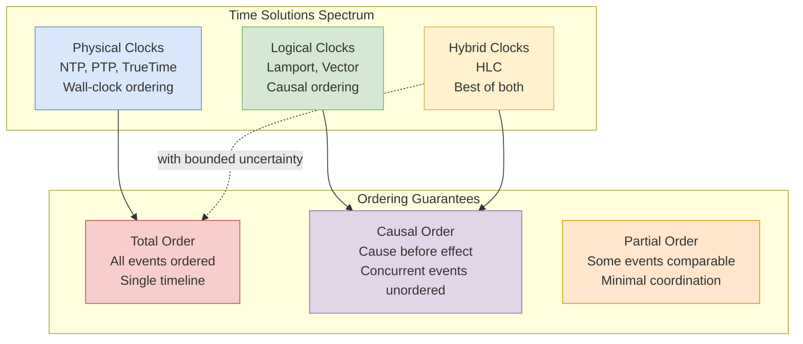

# Time and Ordering in Distributed Systems

Understanding how distributed systems establish event ordering without a global clock—from the fundamental problem of clock synchronization to the practical algorithms that enable causal consistency, conflict resolution, and globally unique identifiers.

Time in distributed systems is not what it seems. Physical clocks drift, networks delay messages unpredictably, and there's no omniscient observer to stamp events with "true" time. Yet ordering events correctly is essential for everything from database transactions to chat message display. This article explores the design choices for establishing order in distributed systems, when each approach makes sense, and how production systems like Spanner, CockroachDB, and Discord have solved these challenges.

<figure>



<figcaption>The spectrum of time solutions mapped to ordering guarantees they can provide</figcaption>

</figure>

## Abstract

The fundamental challenge: there is no global clock in a distributed system. Messages take time to travel, physical clocks drift at different rates, and relativity ensures no two observers can agree on simultaneity for spacelike-separated events.

**The mental model:**

- **Physical clocks** provide wall-clock time but drift and skew mean they can't reliably order events across nodes. NTP (Network Time Protocol) keeps clocks within ~1-100ms; GPS/atomic clocks can achieve microsecond accuracy.

- **Lamport clocks** provide a logical timestamp that respects causality: if event A caused B, then `L(A) < L(B)`. However, `L(A) < L(B)` doesn't imply A caused B—concurrent events are indistinguishable.

- **Vector clocks** capture full causal history, enabling detection of concurrent events. Cost: O(n) space per event where n = number of nodes.

- **Hybrid Logical Clocks (HLC)** combine physical time with logical counters—monotonic, bounded drift from wall-clock, and constant space. The dominant choice for modern distributed databases.

| Approach      | Space per Event | Detects Concurrency | Wall-Clock Bound | Use Case                      |
| ------------- | --------------- | ------------------- | ---------------- | ----------------------------- |
| Physical only | O(1)            | No                  | Yes              | Single datacenter, GPS clocks |
| Lamport       | O(1)            | No                  | No               | Causally ordered logs         |
| Vector        | O(n)            | Yes                 | No               | Conflict detection, CRDTs     |
| HLC           | O(1)            | Partial             | Yes              | Distributed databases         |

**Key insight:** The choice depends on what you need to detect. Lamport is sufficient for causal ordering. Vector clocks when you need to detect and resolve conflicts. HLC when you need wall-clock approximation with causal guarantees.

## The Problem: Why Distributed Time Is Hard

### Physical Clocks Drift

Every clock drifts from true time due to temperature, manufacturing variance, and crystal oscillator imperfections. [RFC 5905 (NTP)](https://datatracker.ietf.org/doc/html/rfc5905) defines drift rate tolerance as 100 ppm (parts per million), meaning a clock can gain or lose up to 8.64 seconds per day.

**Quartz oscillators**: Typical drift of 10-100 ppm. A 50 ppm drift means 4.3 seconds/day divergence.

**Temperature effects**: Quartz frequency changes ~0.035 ppm/°C². A 10°C temperature swing can cause 3.5 ppm additional drift.

**Cumulative effect**: Two unsynchronized clocks drifting at 50 ppm in opposite directions diverge by ~8.6 seconds/day.

### Network Delays Are Unbounded

Even if clocks were perfect, comparing timestamps requires exchanging messages. Network delays vary unpredictably:

- Same rack: 0.5ms round-trip
- Same datacenter: 0.5-1ms
- Cross-region: 50-150ms
- Cross-continent: 100-300ms

Worse, delays are asymmetric—the path from A to B may be faster than B to A.

### The Happens-Before Relation

[Lamport (1978)](https://lamport.azurewebsites.net/pubs/time-clocks.pdf) formalized the fundamental ordering relation. Event A **happens-before** event B (written A → B) if:

1. A and B are on the same process, and A occurs before B in program order
2. A is a message send and B is the corresponding receive
3. There exists C such that A → C and C → B (transitivity)

If neither A → B nor B → A, the events are **concurrent** (A ‖ B).

**Key insight**: Concurrency here means "causally unrelated"—not necessarily simultaneous. Events in different processes that don't communicate are concurrent regardless of physical time.

### Why Wall-Clock Ordering Fails

Consider three nodes with clock skew:

```
Node A (clock fast by 50ms):     write(x=1) at T=1050
Node B (clock accurate):         write(x=2) at T=1000
Node C (clock slow by 30ms):     read(x) at T=970
```

Physical timestamps suggest: C's read → B's write → A's write

But causally, if B's write happened first and A read B's value before writing, we need: B → A, not A → B.

**Real-world failure**: Amazon's shopping cart (pre-Dynamo) used last-write-wins with physical timestamps. Clock skew between servers caused customer items to disappear—earlier writes with later timestamps overwrote later writes.

## Physical Clock Synchronization

### NTP (Network Time Protocol)

NTP, defined in [RFC 5905](https://datatracker.ietf.org/doc/html/rfc5905), synchronizes clocks over variable-latency networks.

**Protocol mechanism:**

1. Client sends request at time T1 (client clock)
2. Server receives at T2, responds at T3 (server clock)
3. Client receives at T4 (client clock)
4. Round-trip delay: `δ = (T4 - T1) - (T3 - T2)`
5. Clock offset: `θ = ((T2 - T1) + (T3 - T4)) / 2`

**Assumption**: Network delay is symmetric. This assumption fails under asymmetric routing, causing systematic offset errors.

**Accuracy achievable:**

| Scenario                  | Typical Accuracy | Limiting Factor      |
| ------------------------- | ---------------- | -------------------- |
| LAN, dedicated NTP server | 0.1-1ms          | Network jitter       |
| Internet, stratum 2       | 10-50ms          | Asymmetric routing   |
| Internet, public pool     | 50-100ms         | Server load variance |

**Stratum hierarchy**: Stratum 0 = atomic clocks/GPS. Stratum 1 = directly connected to stratum 0. Each hop adds uncertainty.

### PTP (Precision Time Protocol)

IEEE 1588 PTP achieves sub-microsecond accuracy by using hardware timestamping:

**Key differences from NTP:**

- Timestamps at the NIC, not in software
- Eliminates OS scheduling jitter
- Requires PTP-capable hardware
- Uses multicast for efficiency

**Accuracy**: 10ns-1μs on dedicated networks, microseconds over switched networks.

**When to use**: Financial trading (MiFID II requires microsecond timestamps), telecommunications, industrial control.

### Google TrueTime

TrueTime, used by Spanner, provides an interval rather than a point: `TT.now()` returns `[earliest, latest]` where true time is guaranteed within the interval.

**Implementation:**

- GPS receivers in each datacenter
- Atomic clocks (rubidium, later cesium) as backup
- Multiple time masters per datacenter for redundancy
- Daemon on each machine polls time masters

**Uncertainty bounds:**

- Typical ε (epsilon, half-interval width): 1-7ms
- After GPS outage: ε grows at clock drift rate (~200μs/s)
- Worst case before resync: ~10ms

**Design rationale**: Instead of pretending clocks are synchronized, TrueTime exposes uncertainty explicitly. Spanner's commit-wait ensures that if transaction T1 commits before T2 starts, T1's timestamp < T2's timestamp—even without communication.

**The commit-wait trade-off**: After committing a transaction, Spanner waits `2ε` before reporting success. This ensures no other transaction can have a timestamp in the interval. Average wait: 7-14ms. This is the latency cost of external consistency without coordination.

### Amazon Time Sync Service

AWS provides a time sync service at 169.254.169.123 for EC2 instances:

**Accuracy**: Sub-millisecond for most regions.

**Mechanism**: NTP servers with direct GPS/atomic clock feeds in each availability zone.

**Limitation**: No TrueTime-style uncertainty bounds exposed. Applications must assume bounded but unknown skew.

### Design Choice: Physical Time Strategy

| Strategy                       | Accuracy         | Cost      | Best For                 |
| ------------------------------ | ---------------- | --------- | ------------------------ |
| Public NTP pools               | 50-100ms         | Free      | Non-critical timing      |
| Dedicated NTP infrastructure   | 1-10ms           | Medium    | Most distributed systems |
| PTP with hardware timestamping | <1μs             | High      | Financial, telecom       |
| TrueTime-style (GPS + atomic)  | ~7ms with bounds | Very high | Global databases         |

## Logical Clocks

### Lamport Timestamps

Lamport's logical clock (1978) captures the happens-before relation without physical time.

**Algorithm:**

1. Each process maintains a counter `C`
2. Before any event (internal, send, or receive): `C = C + 1`
3. When sending message m: attach timestamp `C` to m
4. When receiving message m with timestamp `T`: `C = max(C, T) + 1`

**Properties:**

- If A → B, then L(A) < L(B) (soundness)
- Converse is NOT true: L(A) < L(B) does NOT imply A → B

**Why the converse fails**: Concurrent events get arbitrary ordering. If A and B are concurrent, one will have a higher timestamp than the other, but this doesn't indicate causality.

```
Process P1:  [1] ----send(m)----> [2]
                      |
Process P2:  [1] <----receive---- [3]  [4]
                                   |
Process P3:  [1]      [2]  <------send---- [3]
```

P2's event at logical time [4] appears "after" P3's event at [2], but they're concurrent—no causal relationship.

**Use case**: Total ordering of events where causal ordering is needed but concurrency detection is not. Distributed logging, totally ordered broadcast.

**Limitation**: Can't detect concurrent events. If you need to know whether two events might conflict, Lamport timestamps are insufficient.

### Vector Clocks

Vector clocks, independently developed by Fidge (1988) and Mattern (1989), capture complete causal history.

**Algorithm:**

1. Each process i maintains vector V[1..n] initialized to zeros
2. Before any event: `V[i] = V[i] + 1`
3. When sending: attach V to message
4. When receiving message with vector U: `V[j] = max(V[j], U[j])` for all j, then `V[i] = V[i] + 1`

**Comparison:**

- V(A) < V(B) (A causally precedes B) iff: V(A)[i] ≤ V(B)[i] for all i, and V(A) ≠ V(B)
- A ‖ B (concurrent) iff: neither V(A) < V(B) nor V(B) < V(A)

**Example:**

```
Process P1: [1,0,0] → [2,0,0] ----send---→ [3,0,0]
                                   ↓
Process P2: [0,1,0] ←--receive--- [2,2,0] → [2,3,0]
                                            |
Process P3: [0,0,1] ----send---→ [0,0,2] ←--receive--- [2,3,3]
```

P1's [3,0,0] and P2's [2,3,0] are concurrent: 3 > 2 but 0 < 3.

**Space complexity**: O(n) per event, where n = number of processes. This becomes problematic with thousands of nodes.

**Use case**: Conflict detection in replicated systems. Dynamo, Riak, and early distributed databases used vector clocks to detect when concurrent writes need reconciliation.

### Vector Clock Pruning and Optimizations

Pure vector clocks don't scale. Production systems use variations:

**Version vectors**: Track only write events, not all events. Reduces churn.

**Dotted version vectors**: Add a "dot" (node, counter) pair to handle sibling values correctly. Used by Riak.

**Interval tree clocks**: Dynamically sized—nodes can fork and join. Space grows with actual concurrency, not total nodes.

**Bounded vector clocks**: Prune entries for nodes not seen recently. Trade-off: can incorrectly mark events as concurrent.

### When Vector Clocks Are Worth the Cost

| Scenario                  | Use Vector Clocks? | Rationale                         |
| ------------------------- | ------------------ | --------------------------------- |
| Multi-master replication  | Yes                | Need to detect write conflicts    |
| CRDT-based storage        | Yes                | Merge semantics require causality |
| Single-leader replication | No                 | Leader serializes all writes      |
| Event sourcing            | No                 | Global sequence number suffices   |
| Distributed cache         | No                 | Last-write-wins acceptable        |

## Hybrid Logical Clocks

### The HLC Design

Hybrid Logical Clocks, proposed by [Kulkarni et al. (2014)](https://cse.buffalo.edu/tech-reports/2014-04.pdf), combine physical and logical time:

**Structure**: Each timestamp is a pair `(l, c)` where:

- `l` = physical time component (wall-clock bound)
- `c` = logical counter

**Algorithm:**

```
send/local event:
  l' = max(l, pt.now())
  if l' == l:
    c = c + 1
  else:
    l = l'
    c = 0
  return (l, c)

receive event with timestamp (l_m, c_m):
  l' = max(l, l_m, pt.now())
  if l' == l == l_m:
    c = max(c, c_m) + 1
  elif l' == l:
    c = c + 1
  elif l' == l_m:
    c = c_m + 1
  else:
    c = 0
  l = l'
  return (l, c)
```

**Properties:**

1. **Monotonic**: HLC timestamps only increase
2. **Bounded drift**: `l - pt.now() ≤ ε` where ε is maximum clock skew
3. **Causality**: If A → B, then HLC(A) < HLC(B)
4. **Constant space**: Just two integers per timestamp

**Why HLC works**: The physical component keeps timestamps close to wall-clock time. The logical component handles the case when multiple events have the same physical time or when a received message has a future timestamp.

### HLC vs. Alternatives

| Property                 | Lamport | Vector | HLC       |
| ------------------------ | ------- | ------ | --------- |
| Detects concurrency      | No      | Yes    | Partial\* |
| Wall-clock approximation | No      | No     | Yes       |
| Space per timestamp      | O(1)    | O(n)   | O(1)      |
| Comparison complexity    | O(1)    | O(n)   | O(1)      |

\*HLC can detect some concurrent events when physical times differ significantly, but not all.

**Design rationale**: HLC trades perfect concurrency detection for practical benefits:

1. Timestamps are meaningful to humans (close to wall time)
2. Constant space regardless of cluster size
3. Efficient lexicographic comparison
4. Can be used as database primary keys

### HLC in Production: CockroachDB

CockroachDB uses HLC for transaction timestamps and MVCC (Multi-Version Concurrency Control):

**Timestamp assignment:**

- Transactions get HLC timestamp at start
- Reads see data as of transaction's timestamp
- Writes are tagged with transaction's timestamp

**Clock skew handling:**

- Maximum allowed skew configurable (default 500ms)
- If received timestamp > local clock + max_offset, reject the message
- Read refresh: if transaction reads stale data due to clock skew, retry with updated timestamp

**The read uncertainty interval**: When a transaction reads a key, it must consider writes in the interval `[read_timestamp, read_timestamp + max_offset]` as potentially in the past. This is the cost of not having TrueTime's bounded uncertainty.

### HLC Implementation Details

**Timestamp encoding**: CockroachDB encodes HLC as a single 96-bit value:

- 64 bits: wall time (nanoseconds since Unix epoch)
- 32 bits: logical counter

**Comparison**: Lexicographic—compare wall time first, then logical counter.

**Persistence**: HLC must be persisted before acknowledging to ensure monotonicity across restarts.

**Drift detection**: Monitor `|hlc.now() - system_clock.now()|`. Alert if drift exceeds threshold.

## Ordering Guarantees and Protocols

### Total Order Broadcast

Total order broadcast ensures all nodes deliver messages in the same order.

**Specification:**

- **Validity**: If a correct process broadcasts m, all correct processes eventually deliver m
- **Agreement**: If a correct process delivers m, all correct processes eventually deliver m
- **Total Order**: If processes p and q both deliver m1 and m2, they deliver them in the same order

**Implementation approaches:**

**1. Sequencer-based**: Single node assigns sequence numbers

- Pro: Simple, fast in happy path
- Con: Single point of failure, bottleneck

**2. Lamport timestamps + conflict resolution**: Use Lamport clock, break ties with node ID

- Pro: No single point of failure
- Con: Requires all-to-all communication

**3. Consensus-based**: Use Paxos/Raft for each message ordering decision

- Pro: Fault-tolerant, well-understood
- Con: Higher latency (consensus rounds)

### Causal Broadcast

Causal broadcast provides weaker guarantees—only causally related messages need ordering.

**Specification:**

- If send(m1) → send(m2), then deliver(m1) → deliver(m2) at all nodes

**Implementation**: Attach vector clock to messages. Hold delivery until all causally preceding messages are delivered.

**When sufficient**: Social media feeds, collaborative editing, chat applications where global ordering isn't needed but causal ordering is.

### FIFO Broadcast

FIFO (First-In-First-Out) broadcast orders messages from the same sender:

**Specification:**

- If process p sends m1 then m2, all processes deliver m1 before m2

**Implementation**: Sequence number per sender. Simple but doesn't order across senders.

### Ordering Guarantees Hierarchy

```
Total Order ⊃ Causal Order ⊃ FIFO Order ⊃ Reliable Broadcast
   ↓              ↓             ↓              ↓
More coordination                     Less coordination
Higher latency                        Lower latency
```

## Design Choices: ID Generation

Ordered events often need globally unique identifiers. The choice of ID scheme affects ordering guarantees.

### UUID v1 (Time-based)

**Structure**: 60-bit timestamp + 14-bit clock sequence + 48-bit node ID

**Ordering**: Partially time-ordered but timestamp bits aren't in MSB position, breaking lexicographic sorting.

**Trade-offs:**

- ✅ Globally unique without coordination
- ✅ Embeds creation time
- ❌ Not lexicographically sortable
- ❌ Exposes MAC address (privacy concern)

### UUID v4 (Random)

**Structure**: 122 random bits + 6 version/variant bits

**Ordering**: None—completely random.

**Trade-offs:**

- ✅ Simple, no coordination
- ✅ No information leakage
- ❌ Poor index locality (scattered inserts)
- ❌ No temporal information

### UUID v7 (Time-ordered)

[RFC 9562](https://datatracker.ietf.org/doc/html/rfc9562) (2024) defines UUIDv7 as time-ordered with millisecond precision:

**Structure**: 48-bit Unix timestamp (ms) + 4-bit version + 12-bit random + 2-bit variant + 62-bit random

**Ordering**: Lexicographically sortable by creation time.

**Trade-offs:**

- ✅ Time-ordered for index locality
- ✅ Standard format
- ✅ No coordination needed
- ❌ Millisecond precision only
- ❌ Concurrent events from same node may not be strictly ordered

### Snowflake IDs

Twitter's Snowflake (2010) was designed for high-throughput, sortable IDs:

**Structure** (64 bits total):

- 1 bit: unused (sign bit)
- 41 bits: timestamp (ms since custom epoch, ~69 years)
- 10 bits: machine ID
- 12 bits: sequence number (4096 IDs/ms/machine)

**Throughput**: 4,096,000 IDs/second per machine.

**Trade-offs:**

- ✅ Compact (64-bit fits in long)
- ✅ K-sortable (mostly time-ordered)
- ✅ High throughput
- ❌ Requires machine ID coordination
- ❌ Clock rollback can cause collisions

### Snowflake Variants

**Discord**: Modified Snowflake with 5-bit datacenter + 5-bit worker (vs. 10-bit machine). Added clock skew detection.

**Instagram**: 41-bit timestamp + 13-bit shard ID + 10-bit sequence. Generates IDs in PostgreSQL stored procedures.

**ULID**: 48-bit timestamp + 80-bit random. Lexicographically sortable string representation.

### ID Generation Decision Matrix

| Requirement                      | Recommended         | Rationale                        |
| -------------------------------- | ------------------- | -------------------------------- |
| Globally unique, no coordination | UUIDv4 or ULID      | Random bits ensure uniqueness    |
| Time-sortable, standard format   | UUIDv7              | RFC standard, lexicographic sort |
| Compact, high throughput         | Snowflake           | 64-bit, 4M IDs/s/machine         |
| Database primary key             | UUIDv7 or Snowflake | Good index locality              |
| Cryptographic randomness needed  | UUIDv4              | Maximum entropy                  |

## Real-World Implementations

### Google Spanner: TrueTime for External Consistency

**Problem**: Global transactions that appear to execute in commit order.

**Approach**: TrueTime provides bounded clock uncertainty. Commit-wait ensures transaction T2 that starts after T1 commits has timestamp > T1's timestamp.

**Implementation details:**

- TrueTime servers with GPS and atomic clocks
- Client libraries expose uncertainty interval
- Commit-wait duration = 2 × uncertainty
- Read-only transactions can read at any past timestamp from any replica

**Key insight**: Spanner doesn't eliminate clock skew—it bounds it and works within those bounds. The cost is commit-wait latency (typically 7-14ms).

**When to use**: Global databases requiring external consistency—ACID transactions across continents where "if T1 commits before T2 starts, T1's effects are visible to T2" must hold.

### CockroachDB: HLC without Specialized Hardware

**Problem**: Spanner-like consistency without Google's clock infrastructure.

**Approach**: Hybrid Logical Clocks + read refresh + clock skew limits.

**Implementation:**

- Default max clock offset: 500ms
- Transactions read at HLC timestamp
- If read encounters write in uncertainty interval, transaction restarts
- Serializable isolation by default

**The uncertainty window trade-off**: Without TrueTime's bounds, CockroachDB must assume wider uncertainty. More restarts than Spanner, but no specialized hardware.

**Clock skew handling**:

```
Transaction T reads key K at timestamp ts
If K has version v where ts < v.timestamp < ts + max_offset:
  - This write might have happened "before" T started
  - Refresh T's timestamp to v.timestamp + 1
  - Retry the read
If too many refreshes, abort and retry transaction
```

**Monitoring**: `clock_offset_meannanos` metric tracks observed clock offsets. Alert if approaching `max_offset`.

### Slack: Hybrid Clocks for Message Ordering

**Problem**: Chat messages must appear in causal order despite clock skew.

**Failed approach**: Physical timestamps. With 50ms+ clock skew between servers, messages appeared out of order—replies before questions.

**Chosen approach**: Hybrid Logical Clocks for message timestamps.

**Implementation:**

- Each message gets HLC timestamp from sending server
- Messages displayed in HLC order within channel
- HLC's physical component provides rough wall-clock time for UI
- Logical component ensures causal ordering

**Key insight**: Chat doesn't need strict wall-clock ordering. Users care that replies appear after the messages they reply to (causal), not precise global time.

### Discord: Snowflake IDs for Message IDs

**Problem**: Need unique, sortable message IDs at 100K+ messages/second.

**Approach**: Modified Snowflake IDs.

**Structure:**

- 41 bits: timestamp (ms since Discord epoch)
- 5 bits: datacenter ID
- 5 bits: worker ID
- 12 bits: sequence

**Why not UUID**: UUIDs are 128 bits (twice the storage), not sortable (UUIDv7 didn't exist), and have poor index locality.

**Clock rollback handling**: If system clock goes backward:

1. Detect via comparing new time to last generated timestamp
2. If small rollback (<5s), spin-wait
3. If large rollback, log error and generate based on last timestamp + sequence

**Sorting optimization**: Since IDs are time-sortable, Discord can use message ID for pagination: "get messages before/after ID X" is a simple range query.

### Amazon DynamoDB: Vector Clocks (Deprecated)

**Original design (2007 Dynamo paper)**: Vector clocks for conflict detection in multi-master replication.

**Problem encountered**: Vector clocks grew unboundedly with many writers. Truncating clocks caused false conflicts.

**Current design**: DynamoDB now uses single-leader-per-partition with conditional writes. Conflict resolution moved to application layer via conditional expressions.

**Lesson**: Vector clocks' O(n) space is manageable when n is small (few replicas). With many clients writing directly, n becomes impractical.

## Common Pitfalls

### 1. Trusting Physical Timestamps for Ordering

**The mistake**: Using `System.currentTimeMillis()` or equivalent for event ordering across nodes.

**Why it happens**: Works perfectly in development (same machine). Appears to work in test (low skew).

**The consequence**: Production has variable clock skew. Events ordered incorrectly. Last-write-wins loses the actual last write.

**Example**: E-commerce inventory system using timestamps. Clock skew caused two concurrent purchases to both succeed, overselling inventory.

**The fix**: Use logical or hybrid clocks for ordering. Physical time only for display purposes.

### 2. Assuming NTP Is Sufficient

**The mistake**: Relying on NTP for sub-millisecond ordering decisions.

**Why it happens**: NTP works well for human-scale time. Documentation says "millisecond accuracy."

**The consequence**: NTP accuracy varies: 1ms on LAN, 10-100ms over internet. Asymmetric paths cause systematic offset.

**The fix**: For ordering, use logical clocks. For bounded physical time, use PTP or cloud time services (AWS Time Sync, Google TrueTime).

### 3. Ignoring Clock Rollback

**The mistake**: Assuming system clock is monotonic.

**Why it happens**: Usually true. NTP adjusts gradually. Rare events are easy to ignore.

**The consequence**: VM migration, NTP step adjustment, or leap second handling can roll clock back. Snowflake-style IDs collide. Timestamps go backward.

**The fix**:

- Use monotonic clock source for durations
- Detect rollback and handle (wait, use sequence, abort)
- Monitor for clock anomalies

### 4. Vector Clock Space Explosion

**The mistake**: Using vector clocks with thousands of nodes or clients.

**Why it happens**: Vector clocks elegantly solve causality. Easy to implement.

**The consequence**: Each timestamp is O(n). With 10,000 clients, each timestamp is 40KB. Storage and bandwidth explode.

**The fix**:

- Limit vector clock participants (replicas, not clients)
- Use HLC if full causality detection isn't needed
- Consider interval tree clocks for dynamic node sets

### 5. Conflating Causality with Ordering

**The mistake**: Assuming "A happened before B" in Lamport timestamps means A caused B.

**Why it happens**: The name "happens-before" is misleading. Lamport timestamps do capture causality.

**The consequence**: Treating concurrent events as ordered leads to incorrect conflict resolution.

**The fix**: Understand the implication direction. L(A) < L(B) is necessary but not sufficient for A → B. Use vector clocks if you need to detect concurrency.

## How to Choose

### Step 1: Identify Ordering Requirements

**Questions to ask:**

1. Do you need global total order or just causal order?
2. What's the cost of incorrect ordering? (Data loss? User confusion? Audit failure?)
3. Do you need to detect concurrent events for conflict resolution?
4. Is wall-clock approximation needed for display or TTL?

### Step 2: Map Requirements to Approach

| If you need...                       | Consider...                             |
| ------------------------------------ | --------------------------------------- |
| Causal ordering only                 | Lamport timestamps                      |
| Conflict detection (multi-master)    | Vector clocks or CRDT-friendly approach |
| Sortable IDs with time approximation | Snowflake / UUIDv7                      |
| Database transaction timestamps      | HLC                                     |
| True global ordering                 | Consensus (Raft/Paxos) or TrueTime      |

### Step 3: Consider Scale and Constraints

| Scale Factor                 | Recommendation                        |
| ---------------------------- | ------------------------------------- |
| <10 nodes in consensus group | Vector clocks manageable              |
| 10-1000 nodes                | HLC, avoid per-node vectors           |
| >1000 nodes                  | HLC with bounded clock skew           |
| Single leader                | Sequence numbers sufficient           |
| Multi-region                 | Account for 100ms+ RTT in skew bounds |

### Step 4: Choose ID Generation Strategy

| Primary need          | Recommendation              |
| --------------------- | --------------------------- |
| Database primary keys | UUIDv7 or Snowflake         |
| Distributed tracing   | UUIDv4 (randomness needed)  |
| User-visible IDs      | Snowflake variant (compact) |
| No ID coordination    | UUIDv7                      |
| Maximum throughput    | Snowflake                   |

## Conclusion

Time and ordering in distributed systems is fundamentally limited by physics—there is no global clock, and message delays are unpredictable. The algorithms we've explored provide different trade-offs:

Physical clocks provide wall-clock time but can't reliably order events without bounds on uncertainty. Google's TrueTime shows that with GPS and atomic clocks, you can bound uncertainty and work within those bounds.

Lamport timestamps provide causal ordering with minimal overhead but can't detect concurrent events. Vector clocks provide full causal information but scale poorly.

Hybrid Logical Clocks represent the current best practice for distributed databases—they combine physical time's interpretability with logical clocks' causal guarantees, all in constant space.

The key insight is that you rarely need perfect global ordering. Understanding what ordering guarantees your application actually requires—and paying only for those guarantees—enables building systems that are both correct and performant.

## Appendix

### Prerequisites

- Basic distributed systems concepts (nodes, messages, network partitions)
- Understanding of causality and concurrent events
- Familiarity with database consistency models

### Terminology

- **Clock drift**: Rate at which a clock gains or loses time relative to reference time
- **Clock skew**: Difference between two clocks at a given instant
- **Happens-before (→)**: Causal ordering relation defined by Lamport
- **Concurrent events (‖)**: Events with no causal relationship
- **Linearizability**: Operations appear atomic and ordered consistently with real-time
- **External consistency**: If T1 commits before T2 starts, T1's timestamp < T2's timestamp
- **Monotonic**: Only increasing, never decreasing
- **Idempotent**: Same result regardless of how many times applied

### Summary

- Physical clocks drift; NTP provides ~1-100ms accuracy, TrueTime provides bounded ~7ms uncertainty
- Lamport timestamps: O(1) space, causal ordering, can't detect concurrency
- Vector clocks: O(n) space, full causality, detects concurrent events
- HLC: O(1) space, causal ordering, bounded drift from wall-clock—best default for databases
- ID generation: UUIDv7 or Snowflake for time-sortable, compact identifiers
- Choose based on requirements: total order → consensus, causal order → Lamport/HLC, conflict detection → vector clocks

### References

#### Foundational Papers

- [Time, Clocks, and the Ordering of Events in a Distributed System](https://lamport.azurewebsites.net/pubs/time-clocks.pdf) - Lamport (1978). Defines happens-before, introduces logical clocks.
- [Logical Physical Clocks and Consistent Snapshots in Globally Distributed Databases](https://cse.buffalo.edu/tech-reports/2014-04.pdf) - Kulkarni et al. (2014). Defines Hybrid Logical Clocks.

#### System Papers

- [Spanner: Google's Globally-Distributed Database](https://research.google.com/archive/spanner-osdi2012.pdf) - Corbett et al. (2012). TrueTime and external consistency.
- [Spanner, TrueTime & The CAP Theorem](https://research.google.com/pubs/archive/45855.pdf) - Google (2017). Clarifies Spanner's consistency guarantees.
- [Dynamo: Amazon's Highly Available Key-value Store](https://www.allthingsdistributed.com/files/amazon-dynamo-sosp2007.pdf) - DeCandia et al. (2007). Vector clocks in production.
- [CockroachDB: The Resilient Geo-Distributed SQL Database](https://dl.acm.org/doi/pdf/10.1145/3318464.3386134) - Taft et al. (2020). HLC in distributed SQL.

#### Specifications

- [RFC 5905 - Network Time Protocol Version 4](https://datatracker.ietf.org/doc/html/rfc5905) - NTP specification.
- [RFC 9562 - Universally Unique IDentifiers (UUIDs)](https://datatracker.ietf.org/doc/html/rfc9562) - UUID specification including v7.
- [IEEE 1588 - Precision Time Protocol](https://standards.ieee.org/ieee/1588/6825/) - PTP specification.

#### Engineering Blog Posts

- [Announcing Snowflake](https://blog.twitter.com/engineering/en_us/a/2010/announcing-snowflake) - Twitter Engineering (2010). Original Snowflake ID design.
- [How Discord Stores Billions of Messages](https://discord.com/blog/how-discord-stores-billions-of-messages) - Discord Engineering (2017). Snowflake IDs in production.
- [Living Without Atomic Clocks](https://www.cockroachlabs.com/blog/living-without-atomic-clocks/) - CockroachDB (2016). HLC implementation details.

#### Books

- [Designing Data-Intensive Applications](https://dataintensive.net/) - Kleppmann (2017). Chapter 8 covers distributed time extensively.
