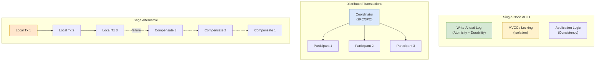

# Transactions and ACID Properties

Database transactions provide the foundation for reliable data operations: atomicity ensures all-or-nothing execution, consistency maintains invariants, isolation controls concurrent access, and durability guarantees persistence. This article explores implementation mechanisms (WAL, MVCC, locking), isolation level semantics across major databases, distributed transaction protocols (2PC, 3PC, Spanner's TrueTime), and practical alternatives (sagas, outbox pattern) for systems where traditional transactions don't scale.

<figure>



<figcaption>Transaction implementations: single-node ACID via WAL and MVCC; distributed 2PC coordination; saga pattern for microservices with compensating transactions on failure</figcaption>
</figure>

## Abstract

Transactions wrap multiple operations into a logical unit with specific guarantees. The mental model:

**ACID is not monolithic**—each property addresses a distinct failure mode:

| Property        | Failure Addressed                      | Implementation Mechanism           |
| --------------- | -------------------------------------- | ---------------------------------- |
| **Atomicity**   | Partial failures (crash mid-operation) | Write-Ahead Logging, shadow paging |
| **Consistency** | Invariant violations                   | Application logic + constraints    |
| **Isolation**   | Concurrent access anomalies            | MVCC, locking, SSI                 |
| **Durability**  | Data loss after commit                 | fsync, replication                 |

**Isolation is the complex one**—it's a spectrum, not binary:

- **Read Uncommitted** → sees uncommitted changes (dirty reads)
- **Read Committed** → sees only committed data (most databases' default)
- **Repeatable Read** → same query returns same results (but phantoms possible in SQL standard)
- **Serializable** → equivalent to serial execution (no anomalies)

**Distributed transactions are expensive**—2PC blocks on failures, 3PC doesn't solve network partitions, and both add latency. Modern systems often avoid them:

- **Google Spanner**: Uses TrueTime to achieve external consistency without classic 2PC blocking
- **Microservices**: Sagas with compensating transactions provide eventual atomicity
- **Event-driven systems**: Outbox pattern guarantees local consistency + eventual delivery

**Key insight**: The right transaction strategy depends on your consistency requirements, latency budget, and failure tolerance—not all data needs the same guarantees.

## ACID Properties Deep Dive

### Atomicity: All or Nothing

Atomicity guarantees that a transaction either completes entirely or has no effect. If a system crashes mid-transaction, partial changes are rolled back.

#### Write-Ahead Logging (WAL)

WAL is the dominant atomicity mechanism in modern databases. The principle: log changes before applying them to data files.

**Core rule**: "Log first, apply later." A write is durable when its log record reaches disk, not when the data page is updated.

**Implementation**:

```ts title="wal-concept.ts" collapse={1-4, 18-25}
// Conceptual WAL implementation
interface LogRecord {
  lsn: number // Log Sequence Number
  transactionId: string
  operation: "INSERT" | "UPDATE" | "DELETE"
  table: string
  beforeImage: any // For undo (rollback)
  afterImage: any // For redo (recovery)
  prevLsn: number // Previous record in same transaction
}

// WAL guarantees:
// 1. Log record written before data page modification
// 2. All log records for a transaction written before COMMIT
// 3. COMMIT record written before acknowledging client
// Recovery uses log to redo committed, undo uncommitted
```

**PostgreSQL's WAL** (as of v17):

- WAL segments are 16MB by default
- `wal_level` controls what's logged: `minimal`, `replica`, or `logical`
- `fsync = on` (default) ensures WAL durability
- `synchronous_commit` controls when client sees commit acknowledgment

**Why WAL beats direct writes**:

1. **Sequential I/O**: Log writes are sequential (fast); data page writes are random (slow)
2. **Group commit**: Multiple transactions' commits batched into single fsync
3. **Reduced writes**: Data pages updated in memory, flushed lazily via checkpoints

#### ARIES Recovery Algorithm

ARIES (Algorithms for Recovery and Isolation Exploiting Semantics), developed at IBM Research in 1992, remains the foundation of modern database recovery. It popularized the "repeating history" paradigm.

**Three recovery phases**:

1. **Analysis**: Scan log from last checkpoint, determine which transactions were active and which pages were dirty
2. **Redo**: Replay all logged operations (including uncommitted) to restore database to crash state
3. **Undo**: Roll back uncommitted transactions by applying undo records in reverse order

**Key insight**: ARIES redoes everything first, then undoes selectively. This "repeat history" approach simplifies recovery logic—the database reaches exactly the crash-time state before selective rollback.

**Compensation Log Records (CLRs)**: During undo, ARIES logs the undo operations themselves. If crash occurs during recovery, these CLRs prevent re-undoing already-undone work.

#### Shadow Paging: The Alternative

Shadow paging maintains two copies of database pages: current (being modified) and shadow (stable reference).

**Mechanism**:

1. Transaction starts: shadow page table points to committed pages
2. Modifications create new page copies; current page table updated
3. Commit: atomically swap current page table to become the new shadow
4. Abort: discard current page table, shadow remains unchanged

**Trade-offs vs WAL**:

- ✅ Simpler recovery (just use shadow pages)
- ✅ No undo phase needed
- ❌ Data fragmentation (pages scattered on disk)
- ❌ Requires copying pages, not just logging changes
- ❌ Garbage collection overhead

**Real-world usage**: SQLite uses a variant (rollback journal), LMDB uses copy-on-write B-trees. Most production OLTP databases use WAL because of better write performance.

### Consistency: Application Responsibility

Consistency in ACID means the database moves from one valid state to another. This is primarily the **application's responsibility**, not the database's.

**What databases guarantee**:

- **Constraint enforcement**: Primary keys, foreign keys, unique constraints, CHECK constraints
- **Trigger execution**: Automatic actions on data changes
- **Cascade operations**: Referential integrity maintenance

**What applications must ensure**:

- Business rules (account balance >= 0)
- Cross-table invariants (order total = sum of line items)
- Domain logic (valid state transitions)

**The distinction matters**: A database can enforce "balance is a number" but not "balance reflects all valid transactions." The latter requires correct application logic.

**Example inconsistency**:

```sql
-- Database constraints satisfied, business rule violated
-- Application bug: double-credited an account
UPDATE accounts SET balance = balance + 100 WHERE id = 'A';
UPDATE accounts SET balance = balance + 100 WHERE id = 'A';  -- Duplicate!
-- No constraint violation, but data is inconsistent with business intent
```

### Isolation: The Complex Property

Isolation determines what concurrent transactions see of each other's changes. It's a spectrum of guarantees with different performance costs.

#### Isolation Anomalies

Understanding anomalies is key to choosing isolation levels:

| Anomaly                 | Description                                              | Example                                                                             |
| ----------------------- | -------------------------------------------------------- | ----------------------------------------------------------------------------------- |
| **Dirty Read**          | Reading uncommitted data                                 | T1 writes, T2 reads, T1 aborts → T2 saw data that never existed                     |
| **Non-Repeatable Read** | Same query, different results                            | T1 reads row, T2 updates and commits, T1 re-reads → different value                 |
| **Phantom Read**        | New rows appear in range query                           | T1 queries range, T2 inserts row in range, T1 re-queries → extra row                |
| **Lost Update**         | Concurrent updates overwrite each other                  | T1 and T2 read balance=100, both update to balance+10 → balance=110 (should be 120) |
| **Write Skew**          | Constraint violated by concurrent non-overlapping writes | Two doctors both check "≥1 on call", both remove themselves → zero on call          |

**Write skew** is particularly insidious because each transaction individually maintains the invariant, but together they violate it. Martin Kleppmann's "Designing Data-Intensive Applications" popularized the doctors on-call example:

```sql
-- T1: Doctor Alice checks if she can leave
SELECT COUNT(*) FROM on_call WHERE shift = 'tonight';  -- Returns 2 (Alice, Bob)
-- Alice decides it's safe to leave (at least 1 will remain)
DELETE FROM on_call WHERE doctor = 'Alice' AND shift = 'tonight';
COMMIT;

-- T2: Simultaneously, Doctor Bob runs the same logic
SELECT COUNT(*) FROM on_call WHERE shift = 'tonight';  -- Also returns 2 (snapshot)
DELETE FROM on_call WHERE doctor = 'Bob' AND shift = 'tonight';
COMMIT;

-- Result: No doctor on call! Both saw 2, both removed themselves.
```

#### SQL Standard Isolation Levels

The SQL-92 standard defines four isolation levels by which anomalies they permit:

| Level            | Dirty Read   | Non-Repeatable Read | Phantom Read |
| ---------------- | ------------ | ------------------- | ------------ |
| Read Uncommitted | Possible     | Possible            | Possible     |
| Read Committed   | Not possible | Possible            | Possible     |
| Repeatable Read  | Not possible | Not possible        | Possible     |
| Serializable     | Not possible | Not possible        | Not possible |

**Critical caveat**: The SQL standard defines these levels only by which anomalies are _permitted_, not by which must _occur_. Databases can (and do) provide stronger guarantees than required.

### Durability: Surviving Crashes

Durability guarantees that committed transactions survive system failures. Implementation involves:

#### fsync and Write Barriers

**The problem**: Operating systems buffer writes. A "successful" write may sit in OS cache when power fails.

**fsync()** forces buffered data to persistent storage. But it's expensive—SSDs can fsync at ~10K-100K ops/sec; HDDs at ~100-200 ops/sec.

**PostgreSQL durability settings**:

```sql
-- Full durability (default)
SET fsync = on;
SET synchronous_commit = on;

-- Relaxed: don't wait for WAL to reach disk
SET synchronous_commit = off;
-- Risk: lose recent commits on crash (up to ~3x wal_writer_delay)
-- No corruption risk—just uncommitted data loss
```

**PostgreSQL's fsync surprise (2018)**: Craig Ringer discovered that PostgreSQL assumed failed fsync calls could be retried. But Linux doesn't guarantee this—a failed fsync may have discarded the dirty page. PostgreSQL now treats fsync failures as fatal, requiring restart. This applies to all databases relying on fsync semantics.

#### Group Commit Optimization

Individual fsync per transaction is too slow. Group commit batches multiple commits into one fsync:

```
T1: BEGIN → ... → COMMIT (waiting)
T2: BEGIN → ... → COMMIT (waiting)
T3: BEGIN → ... → COMMIT (waiting)
--- fsync once for all three ---
T1, T2, T3: acknowledged
```

PostgreSQL's `commit_delay` and `commit_siblings` control grouping. Under high concurrency, group commit dramatically reduces fsync overhead.

#### Durability vs. Performance

| Setting                   | Durability             | Performance        | Use Case         |
| ------------------------- | ---------------------- | ------------------ | ---------------- |
| fsync=on, sync_commit=on  | Full                   | Baseline           | Financial, audit |
| fsync=on, sync_commit=off | WAL sync delay         | ~3x faster commits | Most OLTP        |
| fsync=off                 | None (corruption risk) | Maximum            | Development only |

**Real-world benchmark**: Disabling fsync shows ~58% TPS improvement in PostgreSQL benchmarks, but risks unrecoverable corruption. Disabling synchronous_commit shows ~3.5% improvement with only bounded data loss risk (no corruption).

## Isolation Level Implementations

### MVCC vs. Locking

Two fundamental approaches to isolation:

**Pessimistic Locking (2PL - Two-Phase Locking)**:

- Acquire locks before accessing data
- Hold locks until transaction ends
- Readers block writers, writers block readers (with shared/exclusive locks)
- Guarantees serializability but limits concurrency

**MVCC (Multi-Version Concurrency Control)**:

- Maintain multiple versions of each row
- Readers see a consistent snapshot; never block writers
- Writers create new versions; never block readers
- Higher concurrency but more complex conflict detection

**The hybrid reality**: Most modern databases combine both. MVCC for read/write concurrency, locking for write/write conflicts.

### PostgreSQL Implementation (v17)

PostgreSQL uses MVCC with full tuple versioning:

**System columns on every row**:

- `xmin`: Transaction ID that created this version
- `xmax`: Transaction ID that deleted/updated this version (0 if live)
- `cmin/cmax`: Command IDs within transaction

**Visibility rules**: A row version is visible to transaction T if:

1. `xmin` is committed and less than T's snapshot
2. `xmax` is either 0, aborted, or greater than T's snapshot

**Snapshot timing by isolation level**:

| Level           | Snapshot Taken    | Effect                            |
| --------------- | ----------------- | --------------------------------- |
| Read Committed  | Each statement    | Sees all commits before statement |
| Repeatable Read | Transaction start | Sees all commits before BEGIN     |
| Serializable    | Transaction start | Plus SSI conflict detection       |

**PostgreSQL exceeds SQL standard**: Repeatable Read in PostgreSQL prevents phantom reads (standard only requires this at Serializable). PostgreSQL's Read Uncommitted behaves like Read Committed—it never allows dirty reads.

**Serializable Snapshot Isolation (SSI)**: PostgreSQL's Serializable level uses SSI, which tracks read/write dependencies to detect serialization anomalies. When a cycle is detected, one transaction is aborted:

```
ERROR: could not serialize access due to read/write dependencies among transactions
```

SSI has lower overhead than strict 2PL because it doesn't acquire locks; it only tracks potential conflicts and aborts when necessary.

**VACUUM**: Dead tuples (old versions) accumulate in tables. VACUUM reclaims space. Without it, tables bloat indefinitely. Autovacuum runs automatically but may lag under heavy write load.

### MySQL/InnoDB Implementation (v8.x)

InnoDB uses MVCC with undo logs:

**Hidden columns per row**:

- `DB_TRX_ID`: Transaction ID of last modification
- `DB_ROLL_PTR`: Pointer to undo log record

**Key difference from PostgreSQL**: Old row versions live in separate undo logs, not in the table. Reading old versions requires traversing undo chain—more overhead for long-running transactions.

**Isolation level behavior**:

| Level                     | Read Behavior                | Write Behavior                 |
| ------------------------- | ---------------------------- | ------------------------------ |
| Read Uncommitted          | Current data (no MVCC)       | Standard locks                 |
| Read Committed            | Fresh snapshot per statement | Record locks                   |
| Repeatable Read (default) | Transaction-start snapshot   | Gap locks + record locks       |
| Serializable              | Same as RR                   | All reads acquire shared locks |

**Gap locking and next-key locking**: InnoDB prevents phantoms at Repeatable Read using gap locks:

```sql
-- T1 at Repeatable Read
SELECT * FROM orders WHERE amount > 100 FOR UPDATE;
-- Locks not just matching rows, but gaps between them
-- Prevents T2 from inserting amount=150

-- This is why MySQL RR prevents phantoms (stronger than SQL standard)
```

**Trade-off**: Gap locks can cause deadlocks and reduced concurrency. PostgreSQL's SSI approach detects conflicts after the fact rather than preventing them with locks.

### SQL Server Implementation

SQL Server offers both locking-based and MVCC-based isolation:

**Pessimistic (locking) levels**: Read Uncommitted, Read Committed, Repeatable Read, Serializable—traditional lock-based isolation with blocking.

**Optimistic (MVCC) levels**:

- **Read Committed Snapshot Isolation (RCSI)**: MVCC version of Read Committed
- **Snapshot Isolation**: Full transaction-level snapshot

RCSI and Snapshot store row versions in tempdb, not the main tables. This avoids table bloat but adds tempdb I/O.

**Enabling MVCC**:

```sql
-- Enable snapshot isolation
ALTER DATABASE MyDB SET ALLOW_SNAPSHOT_ISOLATION ON;

-- Make Read Committed use snapshots by default
ALTER DATABASE MyDB SET READ_COMMITTED_SNAPSHOT ON;
```

### Isolation Level Comparison Matrix

| Aspect                | PostgreSQL          | MySQL/InnoDB      | SQL Server            |
| --------------------- | ------------------- | ----------------- | --------------------- |
| Default level         | Read Committed      | Repeatable Read   | Read Committed        |
| MVCC storage          | Heap (in-table)     | Undo logs         | tempdb                |
| Cleanup               | VACUUM              | Purge threads     | Version store cleanup |
| Phantom prevention    | SSI at Serializable | Gap locks at RR   | Locks or MVCC         |
| Read Uncommitted      | = Read Committed    | True dirty reads  | True dirty reads      |
| Serializable approach | SSI (optimistic)    | 2PL (pessimistic) | 2PL (pessimistic)     |

## Distributed Transactions

When a transaction spans multiple databases or services, local ACID is insufficient. Distributed commit protocols coordinate global atomicity.

### Two-Phase Commit (2PC)

2PC ensures all participants either commit or abort together.

**Protocol**:

```
Phase 1 - Prepare (Voting):
1. Coordinator sends PREPARE to all participants
2. Each participant:
   - Writes redo/undo logs
   - Acquires locks
   - Responds VOTE-YES (can commit) or VOTE-NO (must abort)

Phase 2 - Commit (Decision):
3. If all voted YES:
   - Coordinator writes COMMIT to its log
   - Sends COMMIT to all participants
   - Participants commit and release locks
4. If any voted NO:
   - Coordinator writes ABORT
   - Sends ROLLBACK to all participants
```

**The blocking problem**: If the coordinator crashes after sending PREPARE but before sending COMMIT/ABORT, participants that voted YES are stuck. They hold locks, can't commit (no decision received), can't abort (might have been committed). They must wait for coordinator recovery.

**Real-world impact**: 2PC is used in Java EE (JTA/XA), database-to-message-broker transactions, and cross-database joins. The blocking risk means participants can hold locks for minutes during coordinator failures.

**Timeout behavior**: Participants typically abort if no decision arrives within timeout. But this can cause inconsistency if the coordinator did decide to commit and later delivers the COMMIT to other participants.

### Three-Phase Commit (3PC)

3PC attempts to solve 2PC's blocking by adding a pre-commit phase:

**Protocol**:

```
Phase 1 - CanCommit:
1. Coordinator asks "Can you commit?"
2. Participants respond YES/NO

Phase 2 - PreCommit:
3. If all YES: Coordinator sends PRECOMMIT
4. Participants acknowledge and prepare to commit

Phase 3 - DoCommit:
5. Coordinator sends COMMIT
6. Participants commit
```

**Why 3PC doesn't solve the fundamental problem**: 3PC assumes fail-stop (nodes crash, don't return wrong answers) and reliable failure detection. In real networks:

- Network partitions can make a live coordinator appear dead
- Two partitions might elect different coordinators
- Messages can be delayed beyond timeout, then arrive

The original 3PC paper acknowledges: "The protocol is more complex than 2PC, and does not work with network partitions or asynchronous communication."

**Practical result**: 3PC is rarely used in production. The added complexity doesn't eliminate blocking in realistic failure scenarios.

### Google Spanner: TrueTime and External Consistency

Spanner achieves something remarkable: globally distributed, externally consistent transactions without the blocking problems of 2PC.

**The insight**: If you can bound clock uncertainty, you can assign globally meaningful timestamps without coordination.

**TrueTime API**:

- `TT.now()` returns an interval `[earliest, latest]` guaranteed to contain the true time
- Clock uncertainty is typically < 7ms at p99 (using GPS + atomic clocks)
- If two intervals don't overlap, the calls were definitely ordered in real time

**Spanner's commit protocol**:

1. **Prepare phase**: Participants prepare and report their prepare timestamps
2. **Timestamp assignment**: Coordinator chooses commit timestamp > all prepare timestamps
3. **Commit wait**: Coordinator waits until `TT.now().earliest > commit_timestamp`
4. **Commit**: Transaction becomes visible

**Why commit wait matters**: The wait ensures that any transaction starting "after" this one (in wall-clock time) will see this transaction's effects. Without commit wait, a transaction could commit at timestamp T, but a later transaction might get timestamp T-1 due to clock skew.

**External consistency guarantee**: For any two transactions T1 and T2, if T1 commits before T2 starts, T2's timestamp > T1's timestamp. This is stronger than serializability—it respects real-time ordering.

**Trade-off accepted**: Commit latency includes commit wait (worst case 2× clock uncertainty ≈ 14ms). For most workloads with tight TrueTime bounds, this is negligible.

### Calvin: Deterministic Transaction Protocol

Calvin takes a radically different approach: avoid 2PC by making execution deterministic.

**Key insight**: If all replicas execute the same transactions in the same order, they'll reach the same state without coordination.

**Protocol**:

1. **Sequencer**: Batches transactions into a global order, replicates log via Paxos
2. **Scheduler**: Each replica reads the log and executes in order
3. **Execution**: Deterministic—same inputs = same outputs

**Why it avoids 2PC**: In 2PC, coordinator failure is problematic because participants don't know the decision. In Calvin, if a node fails, it recovers by replaying the deterministic log from checkpoint. No commit protocol needed—execution is deterministic.

**Limitations**:

- Transactions must be submitted as complete units (no interactive transactions)
- Read set and write set must be known before execution
- Not suitable for transactions that depend on external input mid-execution

**Real-world**: FaunaDB (now discontinued as of 2025) was the only commercial database using Calvin. The protocol suits specific workloads but the interactive transaction limitation restricts general applicability.

## Alternatives to Distributed Transactions

When distributed transactions are too expensive or don't fit the architecture, alternatives provide eventual atomicity.

### Saga Pattern

A saga is a sequence of local transactions with compensating transactions for rollback.

**Example: E-commerce order saga**:

```
1. Order Service: Create order (PENDING)
   Compensation: Cancel order

2. Payment Service: Reserve payment
   Compensation: Release payment hold

3. Inventory Service: Reserve items
   Compensation: Release reservation

4. Shipping Service: Schedule shipment
   Compensation: Cancel shipment

5. Order Service: Mark COMPLETED
```

If step 3 fails (items out of stock), execute compensations in reverse: release payment hold, cancel order.

**Two coordination approaches**:

**Choreography** (event-driven):

- Services publish events; others react
- No central coordinator
- ✅ Loosely coupled, simpler for small sagas
- ❌ Hard to track global state, complex with many steps

**Orchestration** (centralized):

- Central orchestrator invokes services in sequence
- Handles compensation logic centrally
- ✅ Easier to understand flow, centralized monitoring
- ❌ Orchestrator is SPOF, coupling to orchestrator

**Compensation design challenges**:

1. **Idempotency**: Compensations may be retried; must be idempotent
2. **Commutative operations**: Can't always "undo" (sent email, charged card)
3. **Isolation**: No isolation between saga steps—concurrent sagas may interleave

**Real-world**: Uber, Netflix, Airbnb use saga patterns for cross-service transactions. Frameworks like Temporal, Axon, and Camunda provide saga orchestration.

### Transactional Outbox Pattern

Solves the dual-write problem: updating a database AND publishing an event must be atomic.

**The problem**:

```
1. Write to database  ✓
2. Publish to Kafka   ✗ (crash here)
// Event lost, subscribers never notified
```

**The solution**:

```
1. In single transaction:
   - Write to business table
   - Write event to OUTBOX table
2. Separate process (or CDC) reads OUTBOX, publishes to Kafka
3. After successful publish, delete/mark processed in OUTBOX
```

**Implementation options**:

- **Polling**: Background job queries outbox, publishes, marks complete
- **Change Data Capture (CDC)**: Debezium captures outbox inserts, streams to Kafka

**Guarantees**:

- **At-least-once delivery**: If publishing succeeds, event is delivered (possibly multiple times)
- **Eventual consistency**: Downstream sees changes after publish delay
- **No 2PC required**: Single database transaction + async delivery

**Consumer idempotency**: Since events may be delivered multiple times, consumers must be idempotent. Include event ID; track processed IDs.

### Event Sourcing Approach

Event sourcing stores state as a sequence of events rather than current state. This naturally integrates with the outbox pattern.

**Mechanism**:

```
Traditional: UPDATE accounts SET balance = 150 WHERE id = 'A'

Event Sourced:
Event Store: [
  { type: 'AccountCreated', accountId: 'A', initialBalance: 100 },
  { type: 'MoneyDeposited', accountId: 'A', amount: 50 }
]
Current State: Computed by replaying events (balance = 150)
```

**Benefits for transactions**:

- Events are immutable—no update anomalies
- Event log IS the outbox—no dual write
- Point-in-time recovery by replaying to any timestamp
- Audit trail built-in

**Trade-offs**:

- ✅ Natural event publishing, audit trail, temporal queries
- ❌ Complex querying (must replay or maintain projections)
- ❌ Schema evolution of events is challenging
- ❌ Eventual consistency for read models

**Real-world**: Banking systems (immutable transactions fit naturally), CQRS architectures, audit-heavy domains.

## Real-World Examples and Trade-offs

### When Companies Choose Distributed Transactions

**Google Spanner**: Global financial systems, multi-region consistency requirements. Spanner's TrueTime investment (GPS, atomic clocks in every datacenter) is justified by the need for external consistency across continents.

**CockroachDB**: Teams wanting Spanner-like guarantees without Google's hardware. Uses Hybrid Logical Clocks with NTP (100-250ms uncertainty vs. Spanner's 7ms), accepting occasional transaction restarts due to clock skew.

### When Companies Avoid Transactions

**Netflix**: Uses Cassandra (eventually consistent) for viewing history. Reasoning: "Since we are dealing with movie data and not financial data, the world won't end if there are temporary inconsistencies." They run continuous consistency checkers to detect and fix divergence.

**Amazon**: Strong consistency for cart/checkout, eventual consistency for product catalog. The shopping cart uses Dynamo's quorum reads for checkout but tolerates stale inventory counts on product pages.

### Stripe: Idempotency Keys for Payment Reliability

Stripe's approach to transaction reliability uses idempotency keys rather than distributed transactions:

**Mechanism**:

```
POST /v1/charges
Idempotency-Key: "order-123-attempt-1"

// First request: processes charge, stores result with key
// Retry (same key): returns stored result, no double-charge
```

**Implementation**:

1. Client generates unique idempotency key
2. Server checks if key exists in Redis
3. If exists: return cached result
4. If new: process request, store result with key
5. Keys expire after 24 hours

**Why this works for payments**:

- Retries are safe (network failures don't cause double charges)
- No distributed transaction with Stripe's banking partners
- Local ACID + idempotency achieves practical atomicity

**Trade-off**: Requires client-side key management. The 24-hour expiry means very old retries might process twice.

### Famous Transaction-Related Incidents

**Write skew in the wild**: While specific public incidents are rare, write skew bugs are common in booking systems. A classic pattern: two users simultaneously booking the last seat, both checking availability before either writes. Without serializable isolation, both succeed.

**The fsync saga (2018)**: PostgreSQL's assumption that failed fsync could be retried was wrong on Linux. After a storage error, retrying fsync might return success while data was actually lost. Discovery led to PostgreSQL treating fsync failures as fatal—a database restart is required.

## How to Choose

### Decision Framework

| Requirement                                             | Solution                                                              |
| ------------------------------------------------------- | --------------------------------------------------------------------- |
| Single database, strong consistency                     | Use highest isolation level needed (often Serializable for financial) |
| Single database, high throughput                        | Read Committed + application-level conflict handling                  |
| Cross-service atomicity, low latency tolerance          | Saga pattern with idempotent compensations                            |
| Database + message broker atomicity                     | Transactional outbox + CDC                                            |
| Global strong consistency, can invest in infrastructure | Spanner or CockroachDB                                                |
| Eventual consistency acceptable                         | Leaderless replication (Cassandra, DynamoDB)                          |

### Isolation Level Selection Guide

| Anomaly Risk                     | Minimum Level                                  | Notes                                            |
| -------------------------------- | ---------------------------------------------- | ------------------------------------------------ |
| Dirty reads unacceptable         | Read Committed                                 | Almost always—dirty reads cause application bugs |
| Non-repeatable reads problematic | Repeatable Read                                | Analytics, reports, multi-step reads             |
| Phantoms problematic             | Serializable (PostgreSQL RR prevents phantoms) | Aggregations, existence checks                   |
| Write skew possible              | Serializable                                   | Any read-then-write pattern with constraints     |

### Performance Considerations

**Serializable isn't always slow**: SSI (PostgreSQL) has lower overhead than pessimistic 2PL. Benchmark your workload—the difference may be smaller than expected.

**fsync tuning**: `synchronous_commit = off` provides most of fsync performance benefit with bounded data loss risk (no corruption). Acceptable for many OLTP workloads.

**Hot path optimization**: Use strong consistency for critical paths (payment, inventory decrement); relax for read-heavy paths (product display, recommendations).

## Common Pitfalls

### 1. Assuming Default Isolation Is Sufficient

**The mistake**: Using database default (often Read Committed) without analyzing anomaly risk.

**Why it happens**: "It's the default, must be safe."

**The consequence**: Lost updates, write skew, inconsistent reads in reports.

**The fix**: Analyze each transaction's read/write patterns. Identify where anomalies cause business impact. Explicitly choose isolation level.

### 2. Distributed Transactions in Microservices

**The mistake**: Using 2PC across microservices for "consistency."

**Why it happens**: Attempting to preserve monolith transaction guarantees after decomposition.

**The consequence**: Tight coupling, availability degradation, coordinator bottleneck.

**The fix**: Accept eventual consistency with sagas. Design compensating transactions. Embrace idempotency.

### 3. Ignoring Compensation Complexity in Sagas

**The mistake**: Assuming any operation can be "undone."

**Why it happens**: Treating compensation as simple reversal.

**The consequence**: Sent emails can't be un-sent. Charged cards require refunds (not reversal). Published events can't be un-published.

**The fix**: Design for semantic reversal, not mechanical undo. "Cancel order" is not "DELETE FROM orders."

### 4. Missing Idempotency in Distributed Systems

**The mistake**: Retrying failed operations without idempotency protection.

**Why it happens**: "Retries make it reliable."

**The consequence**: Double charges, duplicate orders, overcounted metrics.

**The fix**: Every retry-able operation needs an idempotency key. Track processed keys. Design operations to be safe for re-execution.

### 5. fsync Disabled in Production

**The mistake**: Disabling fsync for performance without understanding risk.

**Why it happens**: "10x faster writes!"

**The consequence**: Unrecoverable data corruption after power failure. Not just data loss—the entire database may become unusable.

**The fix**: Never disable fsync in production. Use `synchronous_commit = off` for performance with acceptable bounded data loss.

## Conclusion

Transactions provide essential guarantees for reliable data operations, but those guarantees come with trade-offs:

**Single-node ACID** is well-understood:

- WAL provides atomicity and durability with excellent performance
- MVCC enables high concurrency without read/write blocking
- Isolation levels trade consistency for throughput—choose based on anomaly risk

**Distributed transactions** are expensive:

- 2PC adds latency and blocks on coordinator failure
- 3PC doesn't solve network partition problems
- Spanner's TrueTime achieves external consistency but requires specialized infrastructure

**Practical alternatives** often suffice:

- Sagas provide eventual atomicity for microservices
- Outbox pattern solves dual-write reliably
- Idempotency keys enable safe retries without distributed coordination

The right choice depends on:

1. **Consistency requirements**: What's the cost of anomalies?
2. **Latency budget**: How much coordination overhead is acceptable?
3. **Failure tolerance**: Can the system block waiting for recovery?

Most systems need different transaction strategies for different data—strong consistency for critical paths, eventual consistency for others.

## Appendix

### Prerequisites

- Basic understanding of database operations (SQL, transactions)
- Familiarity with distributed systems concepts (replication, partitioning)
- Understanding of failure modes (crashes, network partitions)

### Terminology

- **WAL (Write-Ahead Log)**: Append-only log of changes for atomicity and recovery
- **MVCC (Multi-Version Concurrency Control)**: Maintaining multiple row versions for concurrent access
- **SSI (Serializable Snapshot Isolation)**: Optimistic serializable isolation via conflict detection
- **2PC (Two-Phase Commit)**: Distributed commit protocol with prepare and commit phases
- **Saga**: Sequence of local transactions with compensating actions for rollback
- **Outbox Pattern**: Storing events in database table for reliable async publishing
- **Idempotency**: Property where repeated execution has same effect as single execution
- **External Consistency**: Transactions ordered by real-time (stronger than serializability)
- **TrueTime**: Google's API providing bounded clock uncertainty via GPS/atomic clocks
- **Compensation**: Operation that semantically reverses an earlier operation

### Summary

- **ACID properties address distinct failure modes**: atomicity (partial failures), consistency (invariant violations), isolation (concurrency anomalies), durability (data loss)
- **WAL is the dominant atomicity mechanism**: log first, apply later; ARIES recovery repeats history then undoes selectively
- **Isolation is a spectrum**: Read Committed for most OLTP; Serializable for financial/constraint-heavy workloads
- **PostgreSQL/MySQL exceed SQL standard**: Both prevent phantoms at Repeatable Read; PostgreSQL never allows dirty reads
- **2PC blocks on coordinator failure**: Acceptable for batch operations; problematic for real-time systems
- **Sagas trade isolation for availability**: No distributed locking, but requires idempotent compensations
- **Outbox pattern solves dual-write**: Single database transaction + async delivery = reliable event publishing
- **Idempotency is essential**: Any retry-able operation needs duplicate protection

### References

#### Foundational Papers and Specifications

- [ARIES: A Transaction Recovery Method](https://web.stanford.edu/class/cs345d-01/rl/aries.pdf) - Mohan et al., IBM Research, 1992. The definitive WAL recovery algorithm.
- [A Critique of ANSI SQL Isolation Levels](https://www.microsoft.com/en-us/research/wp-content/uploads/2016/02/tr-95-51.pdf) - Berenson et al., 1995. Expanded anomaly definitions beyond SQL-92.
- [Serializable Isolation for Snapshot Databases](https://courses.cs.washington.edu/courses/cse444/08au/544M/READINGS/fekete-sigmod2008.pdf) - Cahill et al., 2008. SSI algorithm used by PostgreSQL.

#### Database Documentation

- [PostgreSQL Transaction Isolation](https://www.postgresql.org/docs/current/transaction-iso.html) - Official PostgreSQL 17 documentation on isolation levels
- [MySQL InnoDB Transaction Model](https://dev.mysql.com/doc/refman/8.0/en/innodb-transaction-model.html) - Official MySQL 8.0 documentation
- [SQL Server Isolation Levels](https://learn.microsoft.com/en-us/sql/t-sql/statements/set-transaction-isolation-level-transact-sql) - Microsoft documentation

#### Distributed Transaction Systems

- [Spanner: Google's Globally-Distributed Database](https://research.google.com/archive/spanner-osdi2012.pdf) - Corbett et al., 2012. TrueTime and external consistency.
- [Spanner, TrueTime & The CAP Theorem](https://research.google.com/pubs/archive/45855.pdf) - Brewer's clarification on Spanner and CAP.
- [Calvin: Fast Distributed Transactions for Partitioned Database Systems](http://cs.yale.edu/homes/thomson/publications/calvin-sigmod12.pdf) - Thomson et al., 2012. Deterministic transaction protocol.
- [CockroachDB: Living Without Atomic Clocks](https://www.cockroachlabs.com/blog/living-without-atomic-clocks/) - How CockroachDB achieves consistency without TrueTime.

#### Patterns and Alternatives

- [Sagas](https://microservices.io/patterns/data/saga.html) - Microservices.io pattern documentation
- [Transactional Outbox Pattern](https://microservices.io/patterns/data/transactional-outbox.html) - Microservices.io pattern documentation
- [Designing Robust and Predictable APIs with Idempotency](https://stripe.com/blog/idempotency) - Stripe's approach to payment reliability
- [Implementing Stripe-like Idempotency Keys in Postgres](https://brandur.org/idempotency-keys) - Detailed implementation guide

#### Engineering Blog Posts

- [Netflix: Consistency Checkers](http://highscalability.com/blog/2011/4/6/netflix-run-consistency-checkers-all-the-time-to-fixup-trans.html) - How Netflix handles eventual consistency
- [PostgreSQL's fsync() Surprise](https://lwn.net/Articles/752063/) - LWN coverage of the 2018 fsync issue
- [What Write Skew Looks Like](https://www.cockroachlabs.com/blog/what-write-skew-looks-like/) - CockroachDB's explanation with examples

#### Books

- [Designing Data-Intensive Applications](https://dataintensive.net/) - Kleppmann, 2017. Chapters 7 (Transactions) and 9 (Consistency and Consensus).
- [Database Internals](https://www.databass.dev/) - Petrov, 2019. Deep coverage of storage engines and distributed systems.
