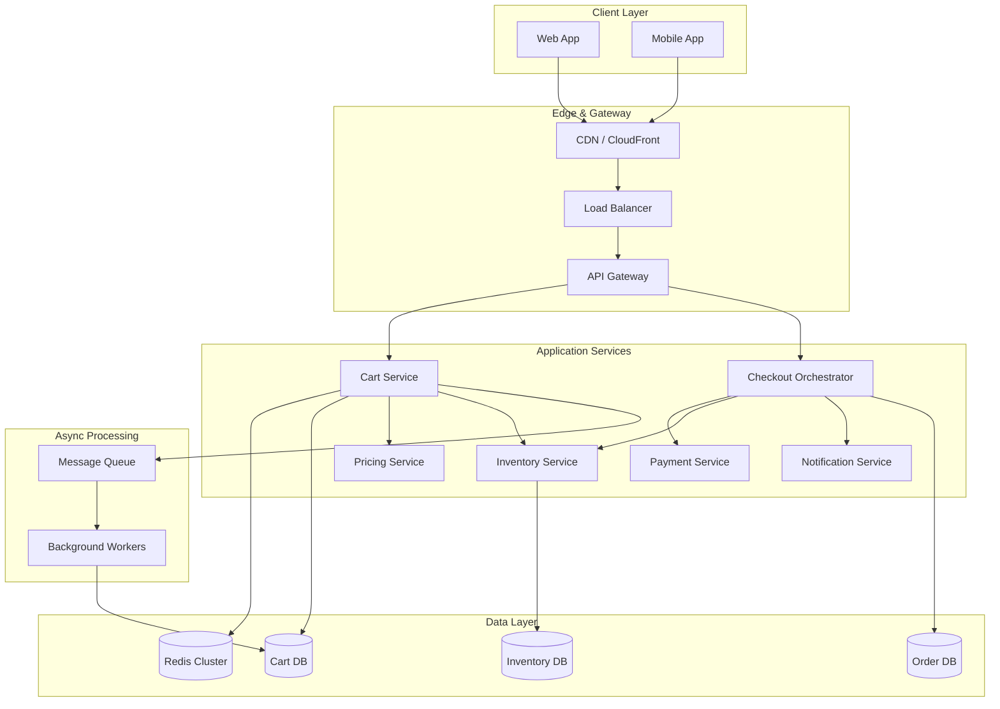
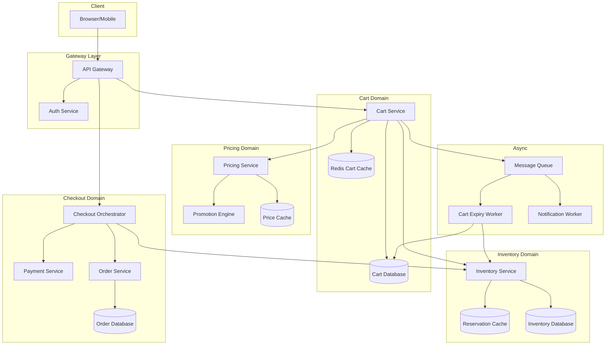
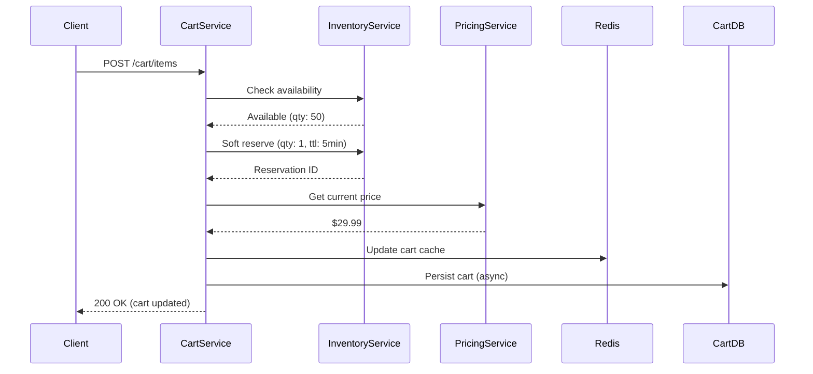
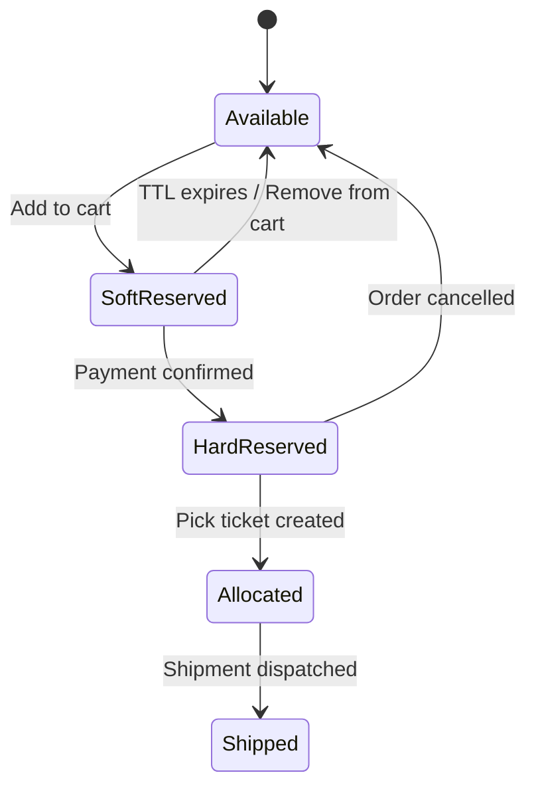
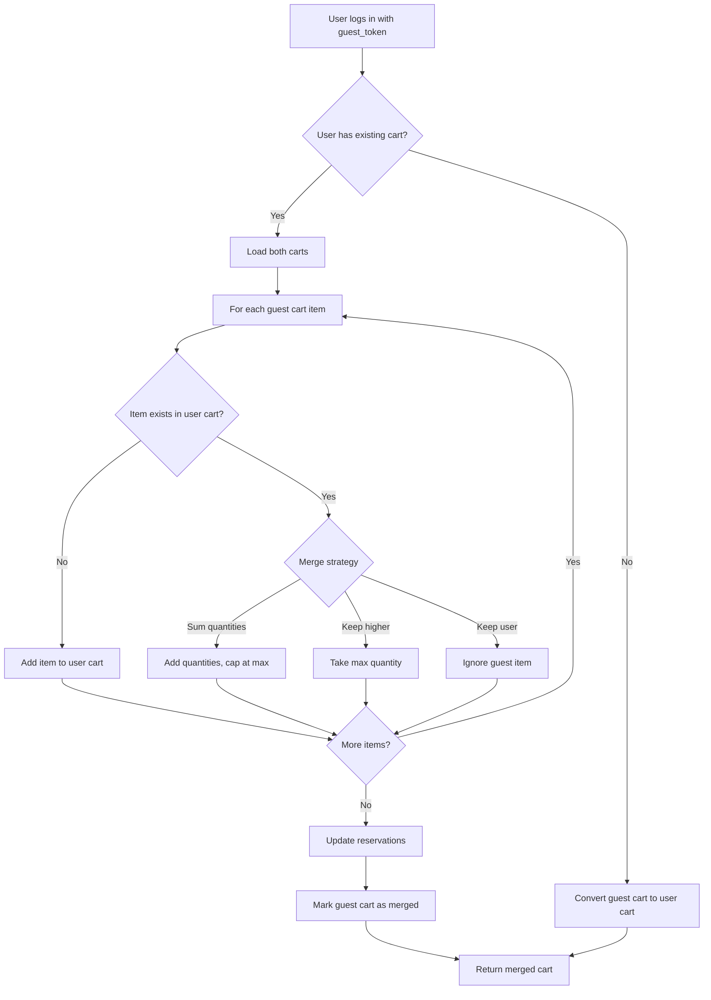
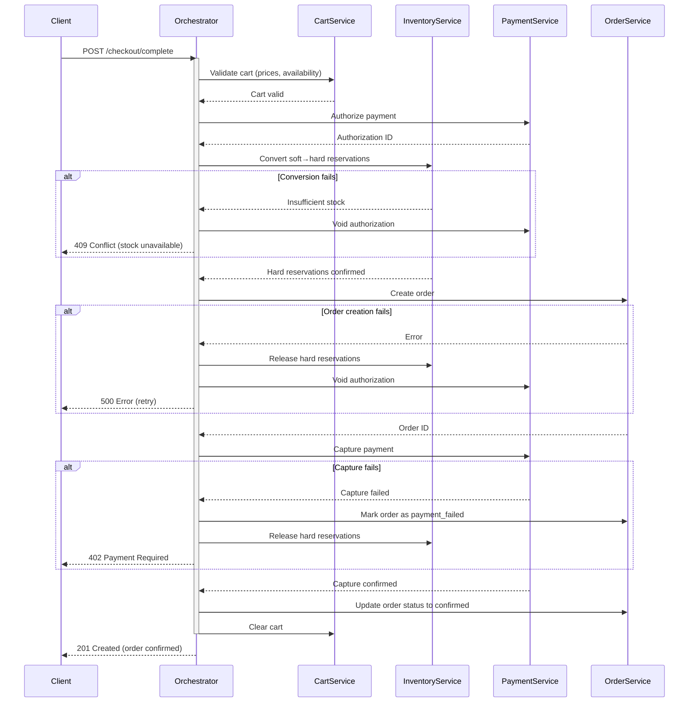
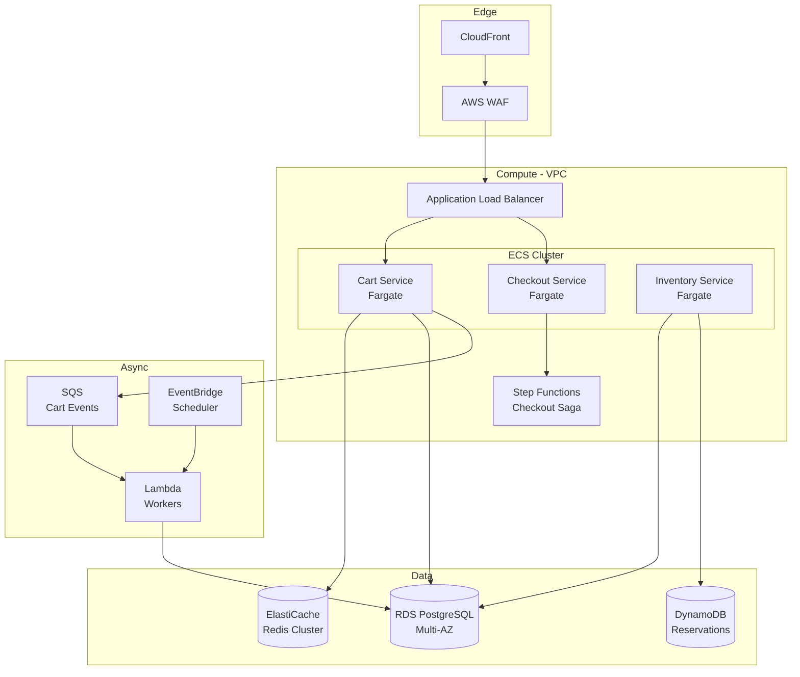
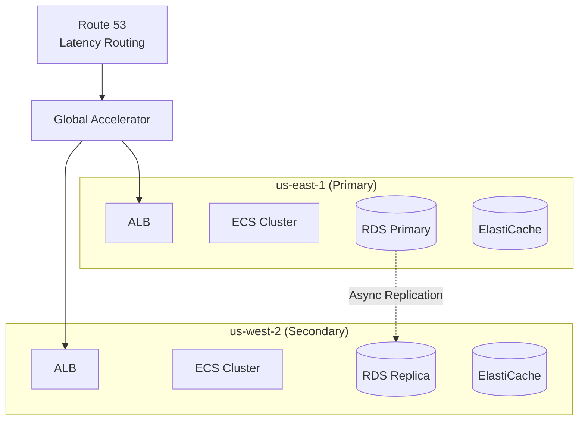

# Design Amazon Shopping Cart

A system design for an e-commerce shopping cart handling millions of concurrent users, real-time inventory, dynamic pricing, and distributed checkout. This design focuses on high availability during flash sales, consistent inventory management, and seamless guest-to-user cart transitions.

<figure>



<figcaption>High-level shopping cart architecture showing client apps, gateway layer, application services, and data stores with async processing for cart expiration and abandoned cart recovery.</figcaption>
</figure>

## Abstract

Shopping cart systems must solve three interconnected problems: **cart state persistence** (guest vs authenticated users, cross-device sync, cart merge on login), **inventory accuracy** (preventing overselling during concurrent access while maintaining availability), and **checkout atomicity** (coordinating payment, inventory deduction, and order creation across distributed services).

The core architectural decisions:

1. **Two-tier cart storage**: Redis for sub-millisecond reads during browsing; persistent database for durability and cross-device sync
2. **Soft reservations with expiry**: Reserve inventory on add-to-cart (5-minute TTL), convert to hard reservation only after payment confirmation—prevents inventory lock-up from abandoned carts
3. **Saga pattern for checkout**: Orchestrated sequence of payment authorization → inventory hard reservation → order creation, with compensating transactions on failure
4. **Eventually consistent inventory display, strongly consistent checkout**: Accept stale counts on product pages for availability; enforce consistency only during checkout

| Dimension           | Optimizes For              | Sacrifices                               |
| ------------------- | -------------------------- | ---------------------------------------- |
| Redis cart cache    | Read latency (<1ms)        | Durability (requires DB backup)          |
| Soft reservations   | Inventory turnover         | Checkout may fail if reservation expires |
| Saga orchestration  | Reliability, debuggability | Latency (sequential steps)               |
| Hash-based sharding | Even distribution          | Cross-user queries                       |

## Requirements

### Functional Requirements

| Feature                      | Scope    | Notes                                                  |
| ---------------------------- | -------- | ------------------------------------------------------ |
| Add/remove/update cart items | Core     | Real-time quantity validation against inventory        |
| Guest cart with persistence  | Core     | Survives browser close, 30-day expiry                  |
| Cart merge on login          | Core     | Combine guest + user cart, resolve quantity conflicts  |
| Real-time price updates      | Core     | Price at checkout reflects current price, not add-time |
| Inventory soft reservation   | Core     | Prevent checkout failures from out-of-stock            |
| Coupon/promotion application | Core     | Stackable rules, exclusivity handling                  |
| Multi-step checkout          | Core     | Address → Payment → Review → Confirm                   |
| Abandoned cart recovery      | Extended | Email/push notifications with cart link                |
| Wishlist/Save for Later      | Extended | Move items between cart and wishlist                   |

### Non-Functional Requirements

| Requirement        | Target                                | Rationale                                                  |
| ------------------ | ------------------------------------- | ---------------------------------------------------------- |
| Availability       | 99.99% (4 nines)                      | Revenue-critical; 1 hour downtime = millions in lost sales |
| Cart read latency  | p99 < 50ms                            | Instant feedback on cart interactions                      |
| Cart write latency | p99 < 200ms                           | Acceptable for add/remove operations                       |
| Checkout latency   | p99 < 3s                              | End-to-end including payment processing                    |
| Peak throughput    | 100K cart ops/sec                     | Flash sale scenarios                                       |
| Data durability    | 99.999999999%                         | Cart data must not be lost                                 |
| Consistency        | Eventual (display), Strong (checkout) | Hybrid model per operation type                            |

### Scale Estimation

**Users:**

- DAU: 50M
- Peak concurrent users: 5M (10% of DAU during flash sales)
- Carts per user: 1 active

**Traffic:**

- Cart views: 50M DAU × 10 views/day = 500M/day = ~6K RPS average
- Cart modifications: 50M DAU × 3 ops/day = 150M/day = ~1.7K RPS average
- Peak multiplier (flash sale): 50x → 300K cart views/sec, 85K modifications/sec
- Checkouts: 5M/day = ~60 checkouts/sec average, 3K/sec peak

**Storage:**

- Cart record: ~2KB (metadata + 10 items average)
- Active carts: 50M × 2KB = 100GB
- Historical carts (90-day retention): 100GB × 3 = 300GB
- With replication (3x): ~1TB total

**Inventory:**

- SKUs: 100M products
- Inventory checks: 500M/day (1 per cart view)
- Reservation writes: 150M/day

## Design Paths

### Path A: Consistency-First (Financial/Limited-Inventory)

**Best when:**

- High-value items where overselling has significant cost (electronics, luxury goods)
- Limited inventory flash sales (concert tickets, limited editions)
- Regulatory requirements for inventory accuracy

**Architecture:**

- Strong consistency for all inventory operations
- Synchronous inventory checks before cart add
- Pessimistic locking during checkout

**Trade-offs:**

- ✅ Zero overselling
- ✅ Accurate inventory counts everywhere
- ❌ Higher latency (lock contention)
- ❌ Lower throughput under load
- ❌ Checkout failures increase during traffic spikes

**Real-world example:** Ticketmaster uses strong consistency for seat inventory. During high-demand events, this leads to "waiting room" queuing to serialize access and prevent overselling reserved seating.

### Path B: Availability-First (High-Volume Retail)

**Best when:**

- Large inventory buffers make overselling rare
- Customer experience (speed) more important than perfect accuracy
- Compensation for overselling is acceptable (refund + coupon)

**Architecture:**

- Eventually consistent inventory reads
- Optimistic updates with conflict resolution at checkout
- Accept occasional overselling, handle via backorder/compensation

**Trade-offs:**

- ✅ Sub-millisecond cart operations
- ✅ Handles extreme traffic spikes gracefully
- ✅ Better user experience (no waiting)
- ❌ Occasional overselling (typically <0.1%)
- ❌ Requires robust compensation workflow

**Real-world example:** Amazon accepts minor overselling on most products. When it occurs, customers receive an apology email with a discount code and the option to wait for restock or cancel. The revenue from faster checkout far exceeds compensation costs.

### Path Comparison

| Factor                 | Path A: Consistency-First | Path B: Availability-First  |
| ---------------------- | ------------------------- | --------------------------- |
| Inventory accuracy     | 100%                      | 99.9%+                      |
| Cart add latency       | 50-200ms                  | <10ms                       |
| Peak throughput        | 10K ops/sec               | 100K+ ops/sec               |
| Checkout failure rate  | Higher (locks timeout)    | Lower (optimistic)          |
| Operational complexity | Lower                     | Higher (compensation flows) |
| Best for               | Tickets, luxury, limited  | General retail, commodities |

### This Article's Focus

This article focuses on **Path B (Availability-First)** because it represents the architecture of most large-scale e-commerce systems (Amazon, Shopify, Walmart). Path A patterns are noted where inventory criticality requires them.

## High-Level Design

### Service Architecture



### Cart Service

Manages cart lifecycle: creation, item management, persistence, and merge operations.

**Responsibilities:**

- CRUD operations on cart items
- Guest cart token generation and management
- Cart merge on user authentication
- Price/availability validation coordination
- Cart expiration scheduling

**Data Flow - Add to Cart:**



### Inventory Service

Manages stock levels, reservations, and availability across warehouses.

**Key Concepts:**

- **Available For Sale (AFS):** Physical stock minus hard reservations
- **Available For Reservation (AFR):** AFS minus soft reservations
- **Soft Reservation:** Temporary hold with TTL, automatically releases
- **Hard Reservation:** Committed hold after payment, triggers fulfillment

**Reservation State Machine:**



### Checkout Orchestrator

Coordinates the multi-step checkout process using the Saga pattern.

**Saga Steps:**

1. **Validate Cart:** Confirm items still in stock at current prices
2. **Authorize Payment:** Place hold on payment method
3. **Convert Reservations:** Soft → Hard for all cart items
4. **Create Order:** Generate order record
5. **Confirm Payment:** Capture authorized amount
6. **Trigger Fulfillment:** Send to warehouse

**Compensation Actions (on failure):**

- Payment capture failed → Release hard reservations, void authorization
- Reservation conversion failed → Void payment authorization
- Order creation failed → Release reservations, void authorization

### Pricing Service

Evaluates pricing rules, promotions, and coupons in real-time.

**Rule Evaluation Order:**

1. Base price (from catalog)
2. Sale price (time-based overrides)
3. Quantity discounts (buy 3, get 10% off)
4. Coupon codes (user-applied)
5. Cart-level promotions (free shipping over $50)
6. Loyalty discounts (member pricing)

**Conflict Resolution:**

- Exclusive promotions marked in rule metadata
- Priority field determines evaluation order
- "Best for customer" mode: apply combination yielding maximum discount

## API Design

### Cart Endpoints

#### Get Cart

```http
GET /api/v1/cart
Authorization: Bearer {token} | X-Guest-Token: {guest_token}
```

**Response (200 OK):**

```json collapse={16-45}
{
  "cart_id": "cart_abc123",
  "user_id": "user_xyz789",
  "items": [
    {
      "item_id": "item_001",
      "product_id": "prod_12345",
      "product_name": "Wireless Headphones",
      "variant_id": "var_black_medium",
      "quantity": 2,
      "unit_price": 79.99,
      "line_total": 159.98,
      "image_url": "https://cdn.example.com/headphones.jpg",
      "availability": {
        "status": "in_stock",
        "quantity_available": 45,
        "reservation_expires_at": "2024-01-15T10:35:00Z"
      },
      "applied_promotions": [
        {
          "promotion_id": "promo_winter_sale",
          "name": "Winter Sale 20% Off",
          "discount_amount": 31.99
        }
      ]
    }
  ],
  "summary": {
    "subtotal": 159.98,
    "discount_total": 31.99,
    "shipping_estimate": 0.0,
    "tax_estimate": 10.24,
    "total": 138.23
  },
  "applied_coupons": [],
  "created_at": "2024-01-15T09:00:00Z",
  "updated_at": "2024-01-15T10:30:00Z",
  "expires_at": "2024-02-14T09:00:00Z"
}
```

**Design Decisions:**

- `availability` embedded per item: Frontend can show stock warnings without additional calls
- `reservation_expires_at` exposed: Client can show countdown timer encouraging checkout
- `summary` pre-calculated: Avoids client-side price calculation errors
- Pagination not needed: Carts rarely exceed 50 items; full payload < 10KB

#### Add Item to Cart

```http
POST /api/v1/cart/items
Authorization: Bearer {token} | X-Guest-Token: {guest_token}
Content-Type: application/json
Idempotency-Key: {uuid}
```

**Request:**

```json
{
  "product_id": "prod_12345",
  "variant_id": "var_black_medium",
  "quantity": 2
}
```

**Response (201 Created):**

```json collapse={5-30}
{
  "item_id": "item_001",
  "product_id": "prod_12345",
  "quantity": 2,
  "unit_price": 79.99,
  "line_total": 159.98,
  "reservation": {
    "reservation_id": "res_abc123",
    "expires_at": "2024-01-15T10:35:00Z"
  },
  "cart_summary": {
    "item_count": 2,
    "subtotal": 159.98,
    "total": 138.23
  }
}
```

**Error Responses:**

| Status | Condition                   | Body                                                              |
| ------ | --------------------------- | ----------------------------------------------------------------- |
| 400    | Invalid product/variant ID  | `{"error": "INVALID_PRODUCT", "message": "Product not found"}`    |
| 409    | Insufficient inventory      | `{"error": "INSUFFICIENT_STOCK", "available": 1, "requested": 2}` |
| 409    | Duplicate add (idempotency) | Returns original response                                         |
| 429    | Rate limit exceeded         | `{"error": "RATE_LIMITED", "retry_after": 60}`                    |

**Rate Limits:** 60 requests/minute per user (prevents cart bombing attacks)

#### Update Item Quantity

```http
PATCH /api/v1/cart/items/{item_id}
```

**Request:**

```json
{
  "quantity": 3
}
```

Behavior:

- `quantity: 0` removes the item
- Validates against available inventory
- Updates soft reservation (extends TTL if increasing, releases delta if decreasing)

#### Apply Coupon

```http
POST /api/v1/cart/coupons
```

**Request:**

```json
{
  "code": "SAVE20"
}
```

**Response (200 OK):**

```json
{
  "coupon": {
    "code": "SAVE20",
    "description": "20% off your order",
    "discount_type": "percentage",
    "discount_value": 20,
    "applied_discount": 27.99
  },
  "cart_summary": {
    "subtotal": 159.98,
    "discount_total": 59.98,
    "total": 110.24
  }
}
```

**Error Responses:**

| Status | Condition                                      |
| ------ | ---------------------------------------------- |
| 400    | Invalid/expired coupon                         |
| 409    | Coupon not combinable with existing promotions |
| 409    | Minimum order value not met                    |

### Checkout Endpoints

#### Initialize Checkout

```http
POST /api/v1/checkout
Authorization: Bearer {token}
```

**Request:**

```json
{
  "cart_id": "cart_abc123"
}
```

**Response (201 Created):**

```json collapse={7-35}
{
  "checkout_id": "checkout_xyz789",
  "status": "pending",
  "cart_snapshot": {
    "items": [...],
    "summary": {...}
  },
  "required_steps": ["address", "payment", "review"],
  "completed_steps": [],
  "expires_at": "2024-01-15T11:00:00Z"
}
```

**Design Decisions:**

- `cart_snapshot` captured at checkout init: Prices locked for checkout duration
- `expires_at` enforced: 30-minute checkout session prevents indefinite reservation holds
- Steps returned by server: Enables A/B testing checkout flows without client changes

#### Submit Shipping Address

```http
PUT /api/v1/checkout/{checkout_id}/address
```

**Request:**

```json
{
  "shipping_address": {
    "name": "John Doe",
    "line1": "123 Main St",
    "line2": "Apt 4B",
    "city": "Seattle",
    "state": "WA",
    "postal_code": "98101",
    "country": "US",
    "phone": "+1-206-555-0123"
  },
  "billing_same_as_shipping": true
}
```

**Response includes:**

- Validated/normalized address
- Updated shipping options with real costs
- Tax calculation based on destination

#### Submit Payment and Complete

```http
POST /api/v1/checkout/{checkout_id}/complete
Idempotency-Key: {uuid}
```

**Request:**

```json
{
  "payment_method_id": "pm_card_visa_4242",
  "accept_terms": true
}
```

**Response (201 Created):**

```json collapse={8-25}
{
  "order_id": "order_abc123",
  "status": "confirmed",
  "confirmation_number": "AMZ-2024-ABC123",
  "estimated_delivery": "2024-01-18",
  "total_charged": 138.23,
  "payment": {
    "method": "Visa ending in 4242",
    "transaction_id": "txn_xyz789"
  }
}
```

**Idempotency Behavior:**

- Same `Idempotency-Key` within 24 hours returns cached response
- Prevents duplicate charges on network retries or user double-clicks

## Data Modeling

### Cart Schema

**Primary Store:** PostgreSQL (ACID guarantees, complex merge queries)

```sql collapse={1-5, 25-40}
-- Cart table
CREATE TABLE carts (
    id UUID PRIMARY KEY DEFAULT gen_random_uuid(),
    user_id UUID REFERENCES users(id),
    guest_token VARCHAR(64) UNIQUE,
    status VARCHAR(20) DEFAULT 'active',
    created_at TIMESTAMPTZ DEFAULT NOW(),
    updated_at TIMESTAMPTZ DEFAULT NOW(),
    expires_at TIMESTAMPTZ,
    merged_into_cart_id UUID REFERENCES carts(id),

    CONSTRAINT user_or_guest CHECK (
        (user_id IS NOT NULL AND guest_token IS NULL) OR
        (user_id IS NULL AND guest_token IS NOT NULL)
    )
);

-- Cart items table
CREATE TABLE cart_items (
    id UUID PRIMARY KEY DEFAULT gen_random_uuid(),
    cart_id UUID NOT NULL REFERENCES carts(id) ON DELETE CASCADE,
    product_id UUID NOT NULL,
    variant_id UUID NOT NULL,
    quantity INT NOT NULL CHECK (quantity > 0),
    unit_price_at_add DECIMAL(10,2) NOT NULL,
    reservation_id UUID,
    added_at TIMESTAMPTZ DEFAULT NOW(),
    updated_at TIMESTAMPTZ DEFAULT NOW(),

    UNIQUE (cart_id, product_id, variant_id)
);

-- Indexes for common access patterns
CREATE INDEX idx_carts_user ON carts(user_id) WHERE user_id IS NOT NULL;
CREATE INDEX idx_carts_guest ON carts(guest_token) WHERE guest_token IS NOT NULL;
CREATE INDEX idx_carts_expires ON carts(expires_at) WHERE status = 'active';
CREATE INDEX idx_cart_items_cart ON cart_items(cart_id);
CREATE INDEX idx_cart_items_reservation ON cart_items(reservation_id)
    WHERE reservation_id IS NOT NULL;
```

**Design Decisions:**

- `user_id` vs `guest_token` mutual exclusion: Clean separation of authenticated vs guest carts
- `unit_price_at_add`: Audit trail for price changes between add and checkout
- `reservation_id` nullable: Not all cart items require reservation (digital goods)
- Soft delete via `merged_into_cart_id`: Preserves guest cart history for analytics

### Cart Cache Structure (Redis)

```redis
# Cart metadata (Hash)
HSET cart:{cart_id}
    user_id "user_xyz789"
    item_count 3
    subtotal 259.97
    updated_at 1705312200

# Cart items (Hash - one per item)
HSET cart:{cart_id}:item:{item_id}
    product_id "prod_12345"
    variant_id "var_black_medium"
    quantity 2
    unit_price 79.99
    reservation_id "res_abc123"
    reservation_expires 1705312500

# Guest token to cart mapping
SET guest:{guest_token} cart_abc123 EX 2592000  # 30 days

# Cart expiration sorted set (for cleanup workers)
ZADD cart_expirations 1705312500 cart_abc123
```

**TTL Strategy:**

- Cart metadata: 30 days (matches business retention policy)
- Reservation entries: 5 minutes (align with soft reservation TTL)
- Guest token mapping: 30 days

### Inventory Schema

**Primary Store:** PostgreSQL with read replicas

```sql collapse={1-3, 20-35}
-- Inventory by location
CREATE TABLE inventory_entries (
    id UUID PRIMARY KEY DEFAULT gen_random_uuid(),
    product_id UUID NOT NULL,
    variant_id UUID NOT NULL,
    location_id UUID NOT NULL,
    quantity_on_hand INT NOT NULL DEFAULT 0,
    quantity_reserved INT NOT NULL DEFAULT 0,
    quantity_available INT GENERATED ALWAYS AS
        (quantity_on_hand - quantity_reserved) STORED,
    updated_at TIMESTAMPTZ DEFAULT NOW(),

    UNIQUE (product_id, variant_id, location_id),
    CHECK (quantity_reserved <= quantity_on_hand)
);

-- Reservations table
CREATE TABLE inventory_reservations (
    id UUID PRIMARY KEY DEFAULT gen_random_uuid(),
    inventory_entry_id UUID NOT NULL REFERENCES inventory_entries(id),
    cart_id UUID NOT NULL,
    quantity INT NOT NULL,
    type VARCHAR(10) NOT NULL CHECK (type IN ('soft', 'hard')),
    created_at TIMESTAMPTZ DEFAULT NOW(),
    expires_at TIMESTAMPTZ,  -- NULL for hard reservations
    order_id UUID,  -- Set when converted to hard reservation

    INDEX idx_reservations_entry (inventory_entry_id),
    INDEX idx_reservations_cart (cart_id),
    INDEX idx_reservations_expires (expires_at) WHERE type = 'soft'
);
```

**Consistency Approach:**

- `quantity_available` as generated column: Always consistent with underlying values
- Reservation updates use `SELECT FOR UPDATE`: Prevents race conditions
- Read replicas used for availability display (eventual consistency acceptable)

### Reservation Cache (Redis)

```redis
# Soft reservation with automatic expiry
SET reservation:{res_id}
    '{"inventory_entry_id":"inv_123","cart_id":"cart_abc","quantity":2}'
    EX 300  # 5 minutes

# Fast lookup: cart → reservations
SADD cart_reservations:{cart_id} res_001 res_002
EXPIRE cart_reservations:{cart_id} 300

# Fast lookup: inventory → reservations (for availability calculation)
SADD inventory_reservations:{inventory_entry_id} res_001 res_002
EXPIRE inventory_reservations:{inventory_entry_id} 300
```

**Why Redis for reservations:**

- Automatic TTL expiration handles cleanup without background jobs
- Sub-millisecond lookups for availability checks
- SADD operations for atomic reservation tracking

### Database Selection Summary

| Data Type         | Store                 | Rationale                                  |
| ----------------- | --------------------- | ------------------------------------------ |
| Cart (persistent) | PostgreSQL            | ACID for merge operations, complex queries |
| Cart (cache)      | Redis Cluster         | Sub-ms reads, automatic expiration         |
| Inventory         | PostgreSQL + replicas | Strong consistency writes, scaled reads    |
| Reservations      | Redis + PostgreSQL    | Redis for speed, PG for durability         |
| Orders            | PostgreSQL            | ACID required for financial records        |
| Price rules       | PostgreSQL + cache    | Complex queries, Redis for hot paths       |

## Low-Level Design: Cart Merge

Cart merge occurs when a guest user authenticates. The system must combine items from both carts while handling conflicts.

### Merge Algorithm



### Merge Implementation

```typescript collapse={1-15, 45-65}
interface CartItem {
  productId: string
  variantId: string
  quantity: number
  reservationId?: string
}

interface MergeResult {
  mergedCart: Cart
  addedItems: CartItem[]
  updatedItems: Array<{ item: CartItem; previousQty: number }>
  conflicts: Array<{ guestItem: CartItem; reason: string }>
}

async function mergeGuestCart(
  userId: string,
  guestToken: string,
  strategy: "sum" | "max" | "keep_user" = "sum",
): Promise<MergeResult> {
  return await db.transaction(async (tx) => {
    // Load both carts with row-level locks
    const [userCart, guestCart] = await Promise.all([
      tx.query("SELECT * FROM carts WHERE user_id = $1 FOR UPDATE", [userId]),
      tx.query("SELECT * FROM carts WHERE guest_token = $1 FOR UPDATE", [guestToken]),
    ])

    if (!guestCart) {
      return { mergedCart: userCart, addedItems: [], updatedItems: [], conflicts: [] }
    }

    const result: MergeResult = {
      mergedCart: userCart || (await createUserCart(tx, userId)),
      addedItems: [],
      updatedItems: [],
      conflicts: [],
    }

    for (const guestItem of guestCart.items) {
      const existingItem = result.mergedCart.items.find(
        (i) => i.productId === guestItem.productId && i.variantId === guestItem.variantId,
      )

      if (!existingItem) {
        // Transfer item to user cart
        await transferItem(tx, guestItem, result.mergedCart.id)
        result.addedItems.push(guestItem)
      } else {
        // Handle conflict based on strategy
        const newQty = resolveQuantity(existingItem.quantity, guestItem.quantity, strategy)
        const maxAllowed = await getMaxQuantity(guestItem.productId, guestItem.variantId)

        if (newQty > maxAllowed) {
          result.conflicts.push({
            guestItem,
            reason: `Quantity capped at ${maxAllowed} (max per order)`,
          })
        }

        if (newQty !== existingItem.quantity) {
          await updateItemQuantity(tx, existingItem.id, Math.min(newQty, maxAllowed))
          result.updatedItems.push({ item: existingItem, previousQty: existingItem.quantity })
        }

        // Release guest item's reservation (will be replaced by user cart's)
        if (guestItem.reservationId) {
          await releaseReservation(guestItem.reservationId)
        }
      }
    }

    // Mark guest cart as merged
    await tx.query("UPDATE carts SET status = $1, merged_into_cart_id = $2 WHERE id = $3", [
      "merged",
      result.mergedCart.id,
      guestCart.id,
    ])

    return result
  })
}

function resolveQuantity(userQty: number, guestQty: number, strategy: string): number {
  switch (strategy) {
    case "sum":
      return userQty + guestQty
    case "max":
      return Math.max(userQty, guestQty)
    case "keep_user":
      return userQty
  }
}
```

### Merge Edge Cases

| Scenario                        | Handling                                                           |
| ------------------------------- | ------------------------------------------------------------------ |
| Guest item now out of stock     | Add to cart with `unavailable` flag; notify user                   |
| Price changed since guest add   | Use current price; show price change notice                        |
| Guest item discontinued         | Add to "saved items" instead; notify user                          |
| Combined quantity exceeds limit | Cap at limit; show conflict message                                |
| Guest cart has applied coupon   | Validate coupon for user; may not transfer (user-specific coupons) |

## Low-Level Design: Checkout Saga

The checkout process spans multiple services that must coordinate atomically despite having independent databases.

### Saga Orchestration



### Saga State Machine

```typescript collapse={1-10, 40-60}
enum CheckoutState {
  INITIATED = "initiated",
  CART_VALIDATED = "cart_validated",
  PAYMENT_AUTHORIZED = "payment_authorized",
  INVENTORY_RESERVED = "inventory_reserved",
  ORDER_CREATED = "order_created",
  PAYMENT_CAPTURED = "payment_captured",
  COMPLETED = "completed",
  COMPENSATION_REQUIRED = "compensation_required",
  FAILED = "failed",
}

interface CheckoutSaga {
  id: string
  cartId: string
  state: CheckoutState
  authorizationId?: string
  orderId?: string
  failedStep?: string
  compensationSteps: string[]
  createdAt: Date
  updatedAt: Date
}

async function executeCheckoutSaga(checkoutId: string): Promise<Order> {
  const saga = await loadSaga(checkoutId)

  try {
    // Each step is idempotent and checks current state before executing
    if (saga.state === CheckoutState.INITIATED) {
      await validateCart(saga)
      await transitionState(saga, CheckoutState.CART_VALIDATED)
    }

    if (saga.state === CheckoutState.CART_VALIDATED) {
      saga.authorizationId = await authorizePayment(saga)
      await transitionState(saga, CheckoutState.PAYMENT_AUTHORIZED)
    }

    if (saga.state === CheckoutState.PAYMENT_AUTHORIZED) {
      await convertReservations(saga)
      await transitionState(saga, CheckoutState.INVENTORY_RESERVED)
    }

    if (saga.state === CheckoutState.INVENTORY_RESERVED) {
      saga.orderId = await createOrder(saga)
      await transitionState(saga, CheckoutState.ORDER_CREATED)
    }

    if (saga.state === CheckoutState.ORDER_CREATED) {
      await capturePayment(saga)
      await transitionState(saga, CheckoutState.PAYMENT_CAPTURED)
    }

    if (saga.state === CheckoutState.PAYMENT_CAPTURED) {
      await clearCart(saga)
      await transitionState(saga, CheckoutState.COMPLETED)
    }

    return await loadOrder(saga.orderId)
  } catch (error) {
    saga.failedStep = saga.state
    await transitionState(saga, CheckoutState.COMPENSATION_REQUIRED)
    await executeCompensation(saga)
    throw error
  }
}

async function executeCompensation(saga: CheckoutSaga): Promise<void> {
  // Compensate in reverse order of completed steps
  if (saga.orderId && saga.state !== CheckoutState.PAYMENT_CAPTURED) {
    await markOrderFailed(saga.orderId)
  }

  if (saga.state >= CheckoutState.INVENTORY_RESERVED) {
    await releaseHardReservations(saga.cartId)
  }

  if (saga.authorizationId) {
    await voidAuthorization(saga.authorizationId)
  }

  await transitionState(saga, CheckoutState.FAILED)
}
```

### Idempotency Implementation

```typescript collapse={1-8, 30-45}
interface IdempotencyRecord {
  key: string
  requestHash: string
  response: any
  statusCode: number
  createdAt: Date
  expiresAt: Date
}

async function withIdempotency<T>(
  key: string,
  request: any,
  handler: () => Promise<T>,
): Promise<{ result: T; statusCode: number; cached: boolean }> {
  const requestHash = hashRequest(request)

  // Check for existing response
  const existing = await redis.get(`idempotency:${key}`)
  if (existing) {
    const record: IdempotencyRecord = JSON.parse(existing)
    if (record.requestHash === requestHash) {
      return { result: record.response, statusCode: record.statusCode, cached: true }
    }
    // Same key, different request = error
    throw new ConflictError("Idempotency key reused with different request")
  }

  // Lock the key during processing
  const lockAcquired = await redis.set(
    `idempotency:${key}`,
    JSON.stringify({ requestHash, status: "processing" }),
    "NX",
    "EX",
    300, // 5 minute lock
  )

  if (!lockAcquired) {
    // Another request is processing with same key
    throw new ConflictError("Request already in progress")
  }

  try {
    const result = await handler()
    const record: IdempotencyRecord = {
      key,
      requestHash,
      response: result,
      statusCode: 201,
      createdAt: new Date(),
      expiresAt: new Date(Date.now() + 24 * 60 * 60 * 1000), // 24 hours
    }

    await redis.set(`idempotency:${key}`, JSON.stringify(record), "EX", 86400)
    return { result, statusCode: 201, cached: false }
  } catch (error) {
    await redis.del(`idempotency:${key}`)
    throw error
  }
}
```

## Frontend Considerations

### Cart Data Structure

**Naive approach:**

```typescript
// ❌ Array-based: O(n) lookups for quantity updates
interface Cart {
  items: CartItem[]
}
```

**Optimized approach:**

```typescript
// ✅ Normalized: O(1) lookups, efficient updates
interface CartState {
  items: Record<string, CartItem> // itemId → CartItem
  itemOrder: string[] // Maintains display order
  summary: CartSummary
  appliedCoupons: Coupon[]
  reservationTimers: Record<string, number> // itemId → expiresAt
}
```

**Why normalized:**

- Quantity update: Update single object, no array scan
- Remove item: Delete from `items`, filter `itemOrder`
- Reorder: Modify `itemOrder` only
- React renders: Reference equality checks work correctly

### Optimistic Updates with Rollback

```typescript collapse={1-10, 40-60}
import { useMutation, useQueryClient } from "@tanstack/react-query"

function useAddToCart() {
  const queryClient = useQueryClient()

  return useMutation({
    mutationFn: addItemToCart,

    onMutate: async (newItem) => {
      // Cancel outgoing refetches
      await queryClient.cancelQueries({ queryKey: ["cart"] })

      // Snapshot previous state
      const previousCart = queryClient.getQueryData(["cart"])

      // Optimistically update
      queryClient.setQueryData(["cart"], (old: CartState) => ({
        ...old,
        items: {
          ...old.items,
          [newItem.itemId]: {
            ...newItem,
            status: "pending", // Visual indicator
          },
        },
        itemOrder: [...old.itemOrder, newItem.itemId],
        summary: recalculateSummary(old, newItem),
      }))

      return { previousCart }
    },

    onError: (err, newItem, context) => {
      // Rollback on error
      queryClient.setQueryData(["cart"], context.previousCart)
      showToast({
        type: "error",
        message: err.code === "INSUFFICIENT_STOCK" ? `Only ${err.available} available` : "Failed to add item",
      })
    },

    onSuccess: (data, newItem) => {
      // Update with server response (includes reservation info)
      queryClient.setQueryData(["cart"], (old: CartState) => ({
        ...old,
        items: {
          ...old.items,
          [newItem.itemId]: {
            ...data.item,
            status: "confirmed",
          },
        },
        summary: data.cartSummary,
      }))
    },

    onSettled: () => {
      // Refetch to ensure consistency
      queryClient.invalidateQueries({ queryKey: ["cart"] })
    },
  })
}
```

### Reservation Countdown Timer

```typescript collapse={1-5, 25-35}
function useReservationTimer(expiresAt: string | null) {
  const [timeLeft, setTimeLeft] = useState<number | null>(null);
  const [isExpired, setIsExpired] = useState(false);

  useEffect(() => {
    if (!expiresAt) return;

    const updateTimer = () => {
      const remaining = new Date(expiresAt).getTime() - Date.now();
      if (remaining <= 0) {
        setIsExpired(true);
        setTimeLeft(0);
      } else {
        setTimeLeft(Math.ceil(remaining / 1000));
      }
    };

    updateTimer();
    const interval = setInterval(updateTimer, 1000);
    return () => clearInterval(interval);
  }, [expiresAt]);

  return { timeLeft, isExpired };
}

// Usage in component
function CartItem({ item }: { item: CartItemData }) {
  const { timeLeft, isExpired } = useReservationTimer(item.reservationExpiresAt);

  return (
    <div className={isExpired ? 'item-expired' : ''}>
      {/* ... item display ... */}
      {timeLeft !== null && timeLeft < 300 && (
        <div className="reservation-warning">
          Reserved for {formatTime(timeLeft)} - complete checkout soon
        </div>
      )}
      {isExpired && (
        <div className="reservation-expired">
          Reservation expired - item may become unavailable
        </div>
      )}
    </div>
  );
}
```

### Real-Time Price Updates

```typescript collapse={1-10, 30-45}
function useCartPriceSync(cartId: string) {
  const queryClient = useQueryClient()

  useEffect(() => {
    const ws = new WebSocket(`wss://api.example.com/cart/${cartId}/updates`)

    ws.onmessage = (event) => {
      const update = JSON.parse(event.data)

      switch (update.type) {
        case "price_change":
          queryClient.setQueryData(["cart"], (old: CartState) => {
            const item = old.items[update.itemId]
            if (!item) return old

            const priceDiff = update.newPrice - item.unitPrice
            return {
              ...old,
              items: {
                ...old.items,
                [update.itemId]: {
                  ...item,
                  unitPrice: update.newPrice,
                  lineTotal: update.newPrice * item.quantity,
                  priceChanged: priceDiff !== 0,
                  priceDiff,
                },
              },
              summary: recalculateSummary(old, update),
            }
          })
          break

        case "item_unavailable":
          queryClient.setQueryData(["cart"], (old: CartState) => ({
            ...old,
            items: {
              ...old.items,
              [update.itemId]: {
                ...old.items[update.itemId],
                available: false,
                availableQuantity: update.availableQuantity,
              },
            },
          }))
          showToast({
            type: "warning",
            message: `${old.items[update.itemId].name} is now out of stock`,
          })
          break

        case "reservation_expired":
          queryClient.invalidateQueries({ queryKey: ["cart"] })
          break
      }
    }

    return () => ws.close()
  }, [cartId, queryClient])
}
```

## Infrastructure Design

### Cloud-Agnostic Architecture

#### Compute

| Component             | Concept                  | Requirements                        |
| --------------------- | ------------------------ | ----------------------------------- |
| Cart Service          | Stateless API servers    | Auto-scaling, health checks         |
| Checkout Orchestrator | Stateful workflow engine | Durable execution, retry support    |
| Background Workers    | Job processors           | At-least-once delivery, idempotency |

#### Data Stores

| Data              | Concept           | Requirements                          |
| ----------------- | ----------------- | ------------------------------------- |
| Cart (hot)        | In-memory cache   | Sub-ms reads, TTL support, clustering |
| Cart (persistent) | Relational DB     | ACID, complex queries, replication    |
| Inventory         | Relational DB     | Strong consistency, row-level locking |
| Reservations      | KV store with TTL | Automatic expiration, high throughput |
| Orders            | Relational DB     | ACID, audit trail                     |

#### Messaging

| Use Case          | Concept       | Requirements                     |
| ----------------- | ------------- | -------------------------------- |
| Cart events       | Message queue | At-least-once, ordering per cart |
| Inventory updates | Event stream  | Fan-out to multiple consumers    |
| Abandoned cart    | Delayed queue | Scheduled delivery               |

### AWS Reference Architecture



### AWS Service Mapping

| Component          | AWS Service       | Configuration                            |
| ------------------ | ----------------- | ---------------------------------------- |
| Cart API           | ECS Fargate       | 2-50 tasks, auto-scaling on CPU          |
| Cart cache         | ElastiCache Redis | r6g.large, cluster mode, 3 shards        |
| Cart DB            | RDS PostgreSQL    | db.r6g.xlarge, Multi-AZ, 2 read replicas |
| Reservations       | DynamoDB          | On-demand, TTL enabled                   |
| Checkout saga      | Step Functions    | Express workflow (30 min max)            |
| Event bus          | SQS + EventBridge | Standard queue, 14-day retention         |
| Background workers | Lambda            | 1024MB, 15-min timeout                   |
| CDN                | CloudFront        | Price class 100 (US/EU)                  |
| WAF                | AWS WAF           | Rate limiting, SQL injection protection  |

### Multi-Region Deployment

For high availability during peak events:



**Failover Strategy:**

- Route 53 health checks detect primary failure
- Global Accelerator reroutes traffic to secondary
- RDS replica promoted to primary (RPO: ~1 minute)
- Redis cache rebuilt from database (acceptable for carts)

### Self-Hosted Alternatives

| Managed Service | Self-Hosted Option       | When to Self-Host                        |
| --------------- | ------------------------ | ---------------------------------------- |
| ElastiCache     | Redis Cluster on EC2     | Specific modules (RedisGraph, RedisJSON) |
| RDS PostgreSQL  | PostgreSQL on EC2        | Cost at scale, specific extensions       |
| DynamoDB        | ScyllaDB / Cassandra     | Multi-cloud, cost optimization           |
| Step Functions  | Temporal.io              | Complex workflows, long-running sagas    |
| SQS             | RabbitMQ / Redis Streams | Specific routing needs                   |

## Conclusion

This shopping cart design prioritizes **availability and user experience** over perfect consistency, accepting that:

1. **Eventual consistency for display** is acceptable when strong consistency is enforced at checkout
2. **Soft reservations with expiry** prevent inventory lock-up while providing reasonable purchase assurance
3. **Saga orchestration** provides reliable distributed transactions with clear compensation paths
4. **Multi-tier caching** delivers sub-millisecond cart reads while maintaining durability

**Key tradeoffs accepted:**

- Occasional checkout failures when reservations expire (mitigated by clear countdown UX)
- Rare overselling on flash sales (handled via backorder/compensation)
- Higher operational complexity from distributed architecture (justified by scale requirements)

**What this design does NOT address:**

- Multi-currency pricing (requires additional currency service)
- Subscription/recurring purchases (different cart model)
- B2B bulk ordering (different quantity/pricing rules)
- Marketplace multi-seller carts (complex checkout splitting)

## Appendix

### Prerequisites

- Distributed systems fundamentals (CAP theorem, eventual consistency)
- Database concepts (ACID, sharding, replication)
- API design principles (REST, idempotency)
- Basic understanding of payment processing flows

### Terminology

| Term                                | Definition                                                             |
| ----------------------------------- | ---------------------------------------------------------------------- |
| **AFS (Available For Sale)**        | Physical inventory minus hard reservations                             |
| **AFR (Available For Reservation)** | AFS minus soft reservations                                            |
| **Soft Reservation**                | Temporary inventory hold with automatic expiry (typically 5 minutes)   |
| **Hard Reservation**                | Committed inventory allocation after payment confirmation              |
| **Saga**                            | Pattern for distributed transactions using compensating actions        |
| **Idempotency Key**                 | Client-generated UUID ensuring duplicate requests return same response |
| **Cart Merge**                      | Process of combining guest cart with authenticated user's cart         |

### Summary

- **Two-tier storage** (Redis + PostgreSQL) balances latency and durability for cart operations
- **Soft/hard reservation model** prevents inventory lock-up while providing checkout assurance
- **Saga orchestration** with compensation ensures reliable multi-service checkout
- **Eventually consistent inventory reads** with strongly consistent checkout enables scale
- **Normalized frontend state** with optimistic updates delivers responsive UX
- **Multi-region deployment** with failover provides 99.99% availability target

### References

- [Shopify Engineering: BFCM Readiness](https://shopify.engineering/bfcm-readiness-2025) - How Shopify handles 80K+ checkouts/minute
- [Microservices.io: Saga Pattern](https://microservices.io/patterns/data/saga.html) - Distributed transaction patterns
- [AWS: Serverless E-commerce Architecture](https://aws.amazon.com/blogs/architecture/architecting-a-highly-available-serverless-microservices-based-ecommerce-site/) - Reference implementation
- [InfoQ: Shopify Flash Sale Architecture](https://www.infoq.com/presentations/shopify-architecture-flash-sale/) - Pod-based scaling
- [Modern Treasury: Idempotency in Payments](https://www.moderntreasury.com/journal/why-idempotency-matters-in-payments) - Payment idempotency patterns
- [Baymard Institute: Checkout Usability](https://baymard.com/research/checkout-usability) - UX research with 70% abandonment baseline
- [Microsoft: Soft Reservation Capabilities](https://learn.microsoft.com/en-us/dynamics365/supply-chain/inventory/inventory-visibility-reservations) - Inventory reservation patterns
- [Queue-it: Overselling Prevention](https://queue-it.com/blog/overselling/) - Flash sale inventory challenges
