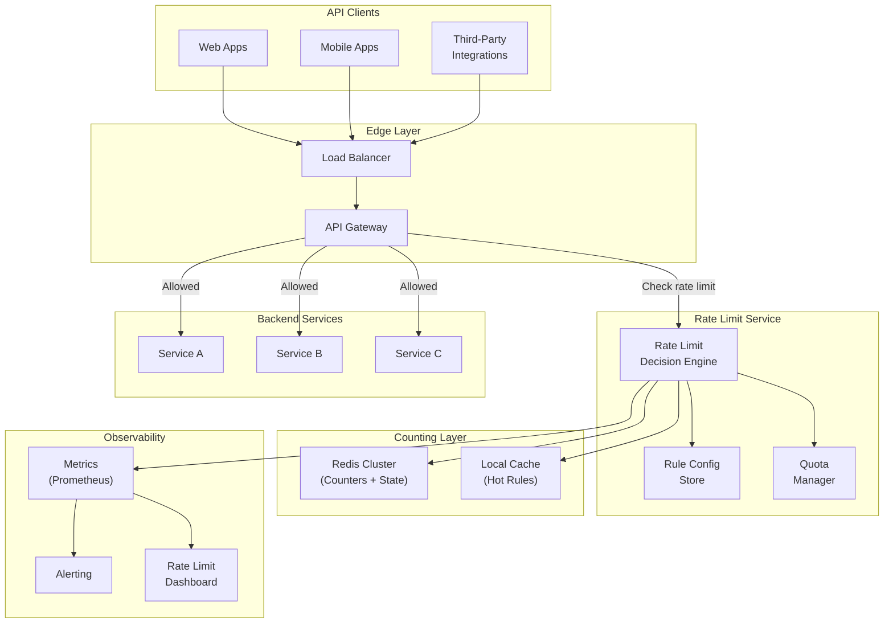
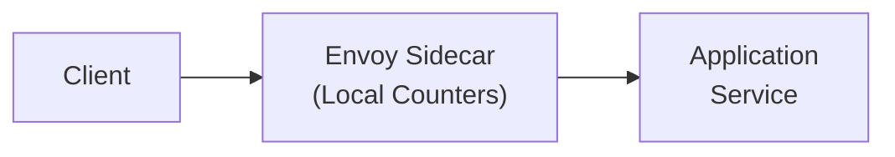
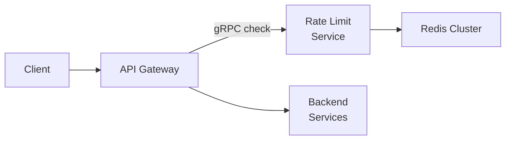
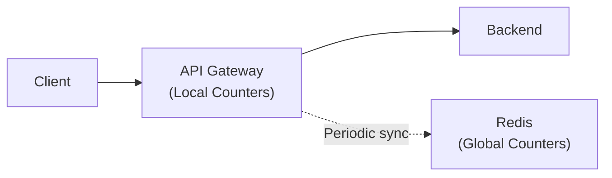
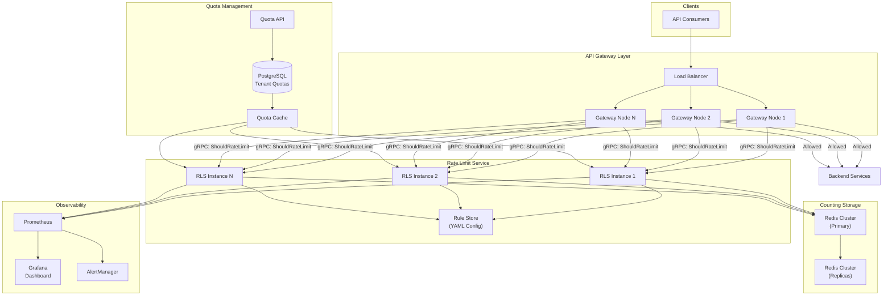
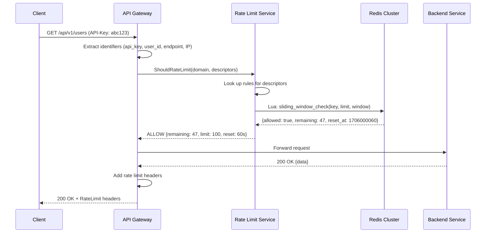
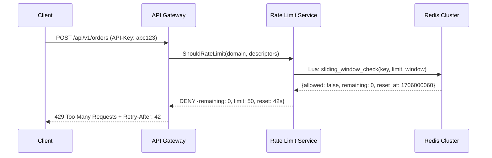
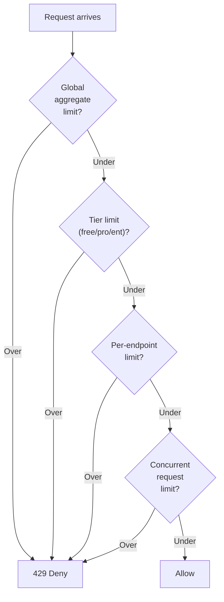
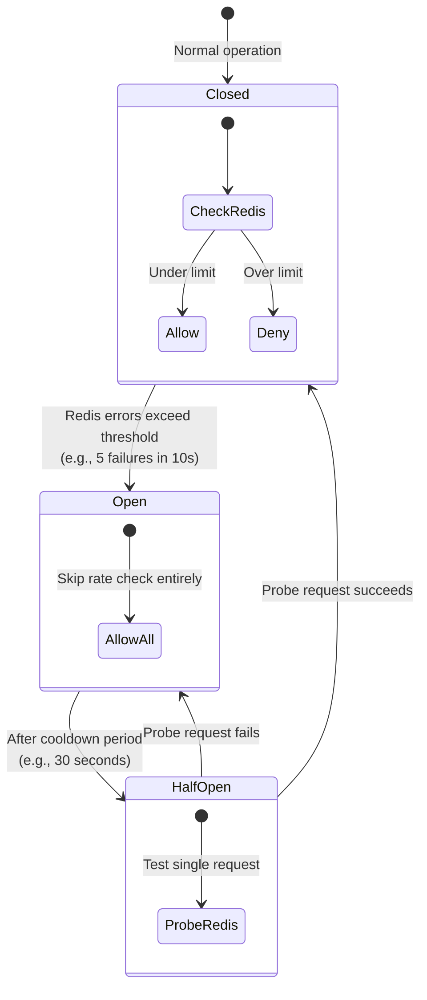
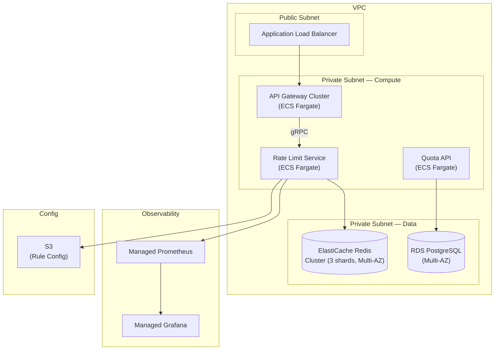

# Design an API Rate Limiter: Distributed Throttling, Multi-Tenant Quotas, and Graceful Degradation

A comprehensive system design for a distributed API rate limiting service covering algorithm selection, Redis-backed counting, multi-tenant quota management, rate limit header communication, and graceful degradation under failure. This design addresses sub-millisecond rate check latency at 500K+ decisions per second with configurable per-tenant policies and fail-open resilience.

<figure>



<figcaption>High-level architecture: API Gateway consults the Rate Limit Service before forwarding requests. The decision engine checks counters in Redis, applies rules from configuration, and returns allow/deny with remaining quota. Backend services are shielded from overload.</figcaption>
</figure>

## Abstract

A rate limiter maps request identifiers (user ID, API key, IP) to counters and enforces thresholds—conceptually trivial, but the design space branches around three axes: which counting algorithm balances accuracy against memory, how to maintain consistent counts across distributed nodes, and how the limiter itself degrades when its backing store fails.

**Core architectural decisions:**

| Decision | Choice | Rationale |
| --- | --- | --- |
| Algorithm | Sliding window counter | Best accuracy-to-memory ratio; Cloudflare measured 0.003% error across 400M requests |
| Counting store | Redis Cluster with Lua scripts | Atomic operations, sub-ms latency, horizontal scaling via hash slots |
| Rule storage | YAML config with hot reload | Declarative, version-controlled, no database dependency for rule evaluation |
| Multi-tenancy | Hierarchical quotas (global → tenant → endpoint) | Prevents noisy neighbors while allowing per-tier customization |
| Failure mode | Fail-open with circuit breaker | Availability over strictness—a rate limiter outage must not become an API outage |
| Client communication | RFC 9110 `Retry-After` + IETF `RateLimit`/`RateLimit-Policy` headers | Standards-based; clients can implement backoff without guessing |

**Key trade-offs accepted:**

- Sliding window counter is an approximation (not exact like sliding window log), but uses O(1) memory per key vs. O(n) for the log approach
- Centralized Redis adds a network hop per request, but guarantees globally consistent counts across all API gateway nodes
- Fail-open means a Redis outage temporarily disables rate limiting, but the alternative (fail-closed = reject all traffic) is worse for availability
- Lua scripts add operational complexity (debugging, versioning) but are necessary for atomic check-and-increment

**What this design optimizes:**

- Sub-millisecond rate check latency via Redis pipelining and local rule caching
- Zero-coordination counting across API gateway nodes (Redis is the single source of truth)
- Operational safety through fail-open, shadow mode, and gradual rollout
- Multi-tenant fairness without per-tenant infrastructure

## Requirements

### Functional Requirements

| Requirement | Priority | Notes |
| --- | --- | --- |
| Per-user rate limiting | Core | Enforce request quotas per authenticated user or API key |
| Per-IP rate limiting | Core | Protect against unauthenticated abuse |
| Per-endpoint rate limiting | Core | Different limits for different API operations (e.g., writes vs. reads) |
| Multi-tier quotas | Core | Free, Pro, Enterprise tiers with different limits |
| Rate limit headers | Core | Communicate remaining quota and reset time to clients |
| Burst allowance | Core | Allow short bursts above steady-state rate |
| Global rate limiting | Extended | Protect backend services from total aggregate overload |
| Concurrent request limiting | Extended | Cap in-flight requests (Stripe-style) |
| Quota management API | Extended | CRUD operations for tenant quotas |
| Rate limit dashboard | Extended | Real-time visibility into rate limit decisions |

### Non-Functional Requirements

| Requirement | Target | Rationale |
| --- | --- | --- |
| Decision latency | p99 < 1ms (local cache hit), p99 < 5ms (Redis) | Rate check is on the critical path of every API request |
| Availability | 99.99% (4 nines) | Rate limiter failure should not cause API failure (fail-open) |
| Throughput | 500K decisions/second per cluster | Based on scale estimation below |
| Accuracy | < 1% false positive rate | Wrongly blocking legitimate users is worse than letting some excess through |
| Consistency | Approximate (eventual) | Exact global consistency is too expensive; small overcounting is acceptable |
| Rule propagation | < 10 seconds | New or updated rules take effect within seconds |

### Scale Estimation

**API platform scale (mid-size SaaS reference):**

- Registered API consumers: 100K
- Daily Active API keys: 10K
- Average requests per active key: 5K/day

**Traffic:**

- Daily requests: 10K keys x 5K requests = 50M requests/day
- Average RPS: 50M / 86,400 ≈ 580 RPS
- Peak multiplier (5x): ~2,900 RPS
- Spike (viral event, 20x): ~11,600 RPS
- Rate limit checks per request: 2-3 (user + endpoint + global) = ~35K decisions/s peak

**For large-scale platform (GitHub/Stripe-class):**

- 10M+ API consumers, 100K+ concurrent
- 500K+ rate limit decisions per second
- 10M+ active rate limit keys in Redis

**Storage (Redis):**

- Per rate limit key: ~100 bytes (key + counter + TTL metadata)
- Active keys: 10M x 100B = 1 GB
- With sliding window (2 counters per key): ~2 GB
- Redis cluster with 3 replicas: ~6 GB total

**Key insight:** The rate limiter itself is a high-throughput, low-latency service that processes more requests than the APIs it protects. The dominant challenge is keeping decision latency under 1ms while maintaining globally consistent counts.

## Design Paths

### Path A: Sidecar / Local Rate Limiting

**Best when:**

- Services are deployed in a service mesh (Istio, Linkerd)
- Approximate limits are acceptable
- Latency budget is extremely tight (< 100μs)

**Architecture:**



**Key characteristics:**

- Each sidecar maintains local token buckets in memory
- No network hop for rate decisions
- Limits are per-node, not global (a 1000 RPS limit across 10 nodes allows up to 10,000 RPS total)

**Trade-offs:**

- ✅ Lowest possible latency (in-process)
- ✅ No external dependency—immune to Redis failures
- ✅ Simple operations (no separate service to maintain)
- ❌ Limits are per-node: actual global rate = limit x node_count
- ❌ Cannot enforce accurate per-user quotas across nodes
- ❌ Auto-scaling changes effective limits (more nodes = higher actual rate)

**Real-world example:** Envoy's local rate limiting filter maintains per-connection and per-route token buckets with no external coordination.

### Path B: Centralized Rate Limit Service

**Best when:**

- Accurate per-user quotas required (billing, SLA enforcement)
- Multi-tenant API platform with tiered pricing
- Globally consistent rate limits across all nodes

**Architecture:**



**Key characteristics:**

- Dedicated rate limit service accessed via gRPC (Envoy's `rls.proto` pattern)
- Redis stores all counters—single source of truth
- Rules loaded from configuration, hot-reloadable

**Trade-offs:**

- ✅ Globally accurate counts (all nodes check same Redis)
- ✅ Per-user quotas enforced correctly regardless of which node handles the request
- ✅ Centralized rule management and observability
- ❌ Network hop per request (1-5ms latency added)
- ❌ Redis is a single point of failure (mitigated by fail-open)
- ❌ Additional infrastructure to operate

**Real-world example:** Envoy's global rate limiting uses a separate Go/gRPC service (`envoyproxy/ratelimit`) backed by Redis, accessed via the `ShouldRateLimit` RPC.

### Path C: Hybrid (Local + Global Synchronization)

**Best when:**

- Need both low latency and reasonable global accuracy
- Willing to accept slightly higher implementation complexity
- Scale is large enough that Redis round-trips are measurable

**Architecture:**



**Key characteristics:**

- Local counters handle rate decisions in-process (token bucket per key)
- Periodically sync local counts to Redis and pull global totals
- Sync interval trades accuracy for latency (e.g., every 1-5 seconds)

**Trade-offs:**

- ✅ Near-zero latency for rate decisions (local memory)
- ✅ Reasonably accurate global counts (within sync interval)
- ✅ Resilient to Redis failures (local counters keep working)
- ❌ Accuracy gap during sync intervals (can overshoot by sync_interval x node_count x rate)
- ❌ Complex state management (merge conflicts, counter drift)
- ❌ Two code paths to maintain and debug

**Real-world example:** Cloudflare's rate limiting uses per-PoP (Point of Presence) memcache counters with a sliding window algorithm. Anycast routing ensures a single IP's requests reach the same PoP, avoiding cross-PoP synchronization.

### Path Comparison

| Factor | Local (A) | Centralized (B) | Hybrid (C) |
| --- | --- | --- | --- |
| Decision latency | < 100μs | 1-5ms | < 100μs |
| Global accuracy | Poor (per-node) | Exact | Approximate |
| Redis dependency | None | Hard dependency | Soft dependency |
| Operational complexity | Low | Medium | High |
| Multi-tenant quotas | No | Yes | Partial |
| Failure mode | Always works | Fail-open needed | Degrades gracefully |
| Best for | Internal services | Public API platforms | High-scale edge |

### This Article's Focus

This article focuses on **Path B (Centralized Rate Limit Service)** because:

1. Public API platforms require accurate per-user quotas for billing and SLA enforcement
2. Multi-tenant fairness demands globally consistent counts
3. The 1-5ms latency overhead is acceptable for most API gateways
4. Fail-open with circuit breaker adequately mitigates the Redis dependency risk

## Rate Limiting Algorithms

Before diving into the system design, a deep understanding of the available algorithms is essential—the algorithm choice cascades through data modeling, Redis memory usage, and accuracy guarantees.

### Token Bucket

**How it works:** Each rate limit key (user, API key) gets a bucket with capacity _b_ (burst size) and refill rate _r_ (tokens per second). Each request consumes one token. If the bucket is empty, the request is rejected. Tokens are refilled at rate _r_ up to maximum _b_.

**Implementation trick:** No background refill process needed. On each request, compute elapsed time since last check and add `elapsed × r` tokens (capped at _b_). This is called a "lazy refill"—O(1) time, O(1) space per key.

**Parameters:**

- `bucket_size` (b): Maximum burst size. A bucket of 100 allows 100 requests in a burst.
- `refill_rate` (r): Steady-state rate. A rate of 10/s means 10 tokens added per second.

| Aspect | Value |
| --- | --- |
| Time complexity | O(1) per request |
| Space complexity | O(1) per key (token count + last_refill_timestamp) |
| Accuracy | Exact for single-key decisions |
| Burst behavior | Allows bursts up to bucket size |

**Who uses it:** AWS API Gateway (token bucket for throttling), Stripe (token bucket via Redis for request rate limiting), Amazon (internally for many services).

### Leaky Bucket

**How it works:** Conceptually a FIFO queue that processes requests at a fixed output rate. Incoming requests enter the queue; if full, they are rejected. Requests "leak" out at a constant rate. First proposed by Jonathan S. Turner in 1986, standardized in ITU-T Recommendation I.371 (1993) for ATM networks as the Generic Cell Rate Algorithm (GCRA).

**Key distinction from token bucket:** The leaky bucket smooths output to a constant rate—it shapes traffic. The token bucket permits bursts up to bucket capacity—it polices traffic. In practice, many implementations conflate the two; the GCRA variant is mathematically equivalent to an inverted token bucket.

| Aspect | Value |
| --- | --- |
| Time complexity | O(1) per request |
| Space complexity | O(1) per key (queue depth + last_leak_timestamp) |
| Accuracy | Exact |
| Burst behavior | No bursts—output is constant rate |

**Who uses it:** NGINX (`limit_req` module uses leaky bucket), HAProxy.

### Fixed Window Counter

**How it works:** Divide time into fixed windows (e.g., 1-minute intervals). Maintain a counter per key per window. Increment on each request. Reject when counter exceeds limit.

**The boundary burst problem:** A user can send the full limit at the end of window N and again at the start of window N+1, effectively doubling their rate in a short period. For a 100 req/min limit, a user could send 200 requests in a 2-second span straddling the window boundary.

| Aspect | Value |
| --- | --- |
| Time complexity | O(1) per request |
| Space complexity | O(1) per key (single counter) |
| Accuracy | Inexact at window boundaries |
| Burst behavior | Up to 2x limit at boundary |

**Implementation advantage:** Trivially implemented with Redis `INCR` + `EXPIRE`—both operations are atomic, no Lua scripting needed.

### Sliding Window Log

**How it works:** Store the timestamp of every request in a sorted set. On each new request, remove entries older than the window, count remaining entries. If count exceeds limit, reject.

**The memory problem:** At 500 requests/day per user across 10K users, this stores 5M timestamps in Redis. Figma estimated ~20 MB for this scenario alone, making it impractical at scale.

| Aspect | Value |
| --- | --- |
| Time complexity | O(n) worst case (removing expired entries), amortized O(log n) |
| Space complexity | O(n) per key (one entry per request within window) |
| Accuracy | Exact—no boundary artifacts |
| Burst behavior | Exact enforcement, no boundary issues |

### Sliding Window Counter (Chosen)

**How it works:** Combines fixed window counters with weighted interpolation. Maintain counters for the current window and the previous window. The effective count is:

$$
\text{rate} = \text{prev\_count} \times \frac{\text{window\_size} - \text{elapsed}}{\text{window\_size}} + \text{current\_count}
$$

This approximation smooths the boundary burst problem while maintaining O(1) memory.

**Figma's variant (2017):** Instead of two large windows, use many small sub-windows (1/60th of the rate limit window). For an hourly limit, increment per-minute counters and sum the last 60. This reduces approximation error further.

| Aspect | Value |
| --- | --- |
| Time complexity | O(1) per request |
| Space complexity | O(1) per key (two counters) or O(k) for k sub-windows |
| Accuracy | ~0.003% error (Cloudflare measurement across 400M requests) |
| Burst behavior | Smoothed—no boundary doubling |

**Why this algorithm:** The sliding window counter is the best trade-off for a distributed rate limiter. It eliminates the boundary burst problem of fixed windows, uses constant memory (unlike sliding window log), and Cloudflare's production measurement of 0.003% error across 400M requests validates its accuracy at scale.

### Algorithm Comparison

| Algorithm | Memory per key | Accuracy | Burst handling | Distributed complexity | Best for |
| --- | --- | --- | --- | --- | --- |
| Token bucket | O(1) — 2 values | Exact (single node) | Configurable burst | Lua script needed | Burst-tolerant APIs |
| Leaky bucket | O(1) — 2 values | Exact | No bursts (smooth) | Lua script needed | Traffic shaping |
| Fixed window | O(1) — 1 counter | Boundary artifacts | 2x at boundary | Atomic INCR | Simple, high-scale |
| Sliding window log | O(n) — all timestamps | Exact | Exact | Sorted set ops | Low-volume, exact billing |
| **Sliding window counter** | **O(1) — 2 counters** | **~99.997%** | **Smoothed** | **Atomic INCR** | **General-purpose** |

## High-Level Design

### Component Overview



### Request Flow



**When rate limited:**



### Rate Limit Service (Decision Engine)

The core component. Stateless—all state lives in Redis and configuration.

**Decision flow per request:**

1. Receive descriptors from gateway (domain, API key, endpoint, IP)
2. Match descriptors against rule configuration
3. For each matching rule, execute sliding window counter check in Redis
4. Return the most restrictive result (if any rule says deny, deny)
5. Emit metrics (allowed/denied, remaining quota, latency)

**Design decisions:**

| Decision | Choice | Rationale |
| --- | --- | --- |
| Protocol | gRPC (Envoy `rls.proto`) | Low overhead, schema-enforced, streaming support, ecosystem compatibility |
| Statefulness | Stateless (counters in Redis, rules in config) | Horizontal scaling without coordination between instances |
| Rule evaluation | All matching rules evaluated, most restrictive wins | Prevents circumventing a per-endpoint limit via a generous per-user limit |
| Failure mode | Fail-open (return ALLOW on any error) | Stripe's approach: catch exceptions at all levels so errors fail open |

### Rule Configuration

Rules are defined in YAML, loaded at startup, and hot-reloaded on change. This follows Envoy's `ratelimit` service pattern.

```yaml title="rate-limit-rules.yaml" collapse={1-2}
# Rate limit configuration
# Domain groups related rules; descriptors match request attributes

domain: api_platform
descriptors:
  # Per-API-key rate limit (tiered)
  - key: api_key
    rate_limit:
      unit: minute
      requests_per_unit: 100  # Default (free tier)
    descriptors:
      # Per-endpoint within API key
      - key: endpoint
        value: "POST /api/v1/orders"
        rate_limit:
          unit: minute
          requests_per_unit: 20  # Write-heavy endpoint, lower limit

  # Per-IP rate limit (unauthenticated)
  - key: remote_address
    rate_limit:
      unit: minute
      requests_per_unit: 30

  # Global aggregate limit (protect backend)
  - key: global
    value: "aggregate"
    rate_limit:
      unit: second
      requests_per_unit: 10000
```

**Shadow mode:** Rules can be deployed in shadow mode where the check executes (updating counters, emitting metrics) but always returns ALLOW. This enables safe rollout—observe the impact of new rules before enforcement.

## API Design

### Rate Limit Check (Internal gRPC)

**Service:** `envoy.service.ratelimit.v3.RateLimitService`

**RPC:** `ShouldRateLimit`

**Request:**

```json
{
  "domain": "api_platform",
  "descriptors": [
    {
      "entries": [
        {"key": "api_key", "value": "abc123"},
        {"key": "endpoint", "value": "POST /api/v1/orders"}
      ]
    },
    {
      "entries": [
        {"key": "remote_address", "value": "192.168.1.100"}
      ]
    }
  ],
  "hits_addend": 1
}
```

**Response:**

```json
{
  "overall_code": "OVER_LIMIT",
  "statuses": [
    {
      "code": "OK",
      "current_limit": {
        "requests_per_unit": 100,
        "unit": "MINUTE"
      },
      "limit_remaining": 47,
      "duration_until_reset": "42s"
    },
    {
      "code": "OVER_LIMIT",
      "current_limit": {
        "requests_per_unit": 20,
        "unit": "MINUTE"
      },
      "limit_remaining": 0,
      "duration_until_reset": "42s"
    }
  ]
}
```

### Rate Limit Response Headers

The gateway translates the rate limit decision into HTTP headers. Two standards coexist:

**Legacy (widely adopted):**

```http
X-RateLimit-Limit: 100
X-RateLimit-Remaining: 47
X-RateLimit-Reset: 1706000060
```

**IETF Standard (draft-ietf-httpapi-ratelimit-headers):**

```http
RateLimit-Policy: "default";q=100;w=60, "writes";q=20;w=60
RateLimit: "writes";r=0;t=42
Retry-After: 42
```

The IETF `RateLimit` header uses Structured Fields (RFC 8941) with parameters:
- `q`: quota allocated (requests per window)
- `w`: window size in seconds
- `r`: remaining requests
- `t`: seconds until reset

**429 response (RFC 6585):**

```http
HTTP/1.1 429 Too Many Requests
Content-Type: application/json
Retry-After: 42
RateLimit-Policy: "writes";q=20;w=60
RateLimit: "writes";r=0;t=42

{
  "error": {
    "code": "RATE_LIMITED",
    "message": "Rate limit exceeded for POST /api/v1/orders. Retry after 42 seconds.",
    "retry_after": 42,
    "limit": 20,
    "window": "1m",
    "scope": "api_key:abc123:endpoint:POST /api/v1/orders"
  }
}
```

### Quota Management API (Admin)

**Create/Update Quota Override:**

**Endpoint:** `PUT /admin/v1/quotas/{api_key}`

```json
{
  "tier": "enterprise",
  "overrides": [
    {
      "descriptor": "endpoint:POST /api/v1/orders",
      "requests_per_unit": 500,
      "unit": "minute"
    }
  ],
  "effective_at": "2025-02-01T00:00:00Z",
  "expires_at": null
}
```

**Response (200 OK):**

```json
{
  "api_key": "abc123",
  "tier": "enterprise",
  "quotas": {
    "default": {"requests_per_unit": 5000, "unit": "minute"},
    "overrides": [
      {
        "descriptor": "endpoint:POST /api/v1/orders",
        "requests_per_unit": 500,
        "unit": "minute"
      }
    ]
  },
  "updated_at": "2025-01-15T10:30:00Z"
}
```

**Get Current Usage:**

**Endpoint:** `GET /admin/v1/usage/{api_key}`

```json
{
  "api_key": "abc123",
  "current_window": {
    "start": "2025-01-15T10:30:00Z",
    "end": "2025-01-15T10:31:00Z"
  },
  "usage": {
    "default": {"used": 53, "limit": 5000, "remaining": 4947},
    "endpoint:POST /api/v1/orders": {"used": 18, "limit": 500, "remaining": 482}
  }
}
```

## Data Modeling

### Redis Key Structure

**Sliding window counter keys:**

```
ratelimit:{domain}:{descriptor_hash}:{window_id}
```

**Example:**

```
ratelimit:api_platform:api_key=abc123:endpoint=POST_orders:1706000040
ratelimit:api_platform:api_key=abc123:endpoint=POST_orders:1706000000
```

- `1706000040` = Unix timestamp truncated to current window start
- `1706000000` = previous window start
- Key TTL = 2 × window_size (auto-cleanup of expired windows)

**Sliding window counter with sub-windows (Figma variant):**

```
ratelimit:api_platform:api_key=abc123:min:28433334
ratelimit:api_platform:api_key=abc123:min:28433335
```

Where `28433334` = Unix minutes (`timestamp / 60`). For a 1-hour limit, sum the last 60 minute-buckets.

### Quota Overrides Schema

**Primary store:** PostgreSQL (ACID for quota management, admin queries)

```sql title="schema.sql" collapse={1-2}
-- Tenant quota overrides
-- Base tier limits are in YAML config; overrides are per-tenant exceptions

CREATE TABLE quota_overrides (
    id              UUID PRIMARY KEY DEFAULT gen_random_uuid(),
    api_key         VARCHAR(64) NOT NULL,
    tier            VARCHAR(20) NOT NULL DEFAULT 'free'
                    CHECK (tier IN ('free', 'pro', 'enterprise', 'custom')),
    descriptor      VARCHAR(256) NOT NULL,        -- e.g., "endpoint:POST /api/v1/orders"
    requests_per_unit INT NOT NULL,
    unit            VARCHAR(10) NOT NULL
                    CHECK (unit IN ('second', 'minute', 'hour', 'day')),
    effective_at    TIMESTAMPTZ DEFAULT NOW(),
    expires_at      TIMESTAMPTZ,                  -- NULL = no expiration
    created_at      TIMESTAMPTZ DEFAULT NOW(),
    updated_at      TIMESTAMPTZ DEFAULT NOW(),

    UNIQUE(api_key, descriptor)
);

-- Fast lookup by API key
CREATE INDEX idx_quota_api_key ON quota_overrides(api_key)
    WHERE expires_at IS NULL OR expires_at > NOW();

-- Tier-level queries (admin dashboard)
CREATE INDEX idx_quota_tier ON quota_overrides(tier);
```

### Data Store Selection

| Data Type | Store | Rationale |
| --- | --- | --- |
| Rate limit counters | Redis Cluster | Atomic increments, sub-ms latency, TTL-based expiration |
| Rule configuration | YAML files (mounted volume) | Version-controlled, no DB dependency, hot-reloadable |
| Quota overrides | PostgreSQL | ACID for billing-critical quota changes, admin queries |
| Quota cache | In-memory (rate limit service) | Avoids DB lookup per request; refresh every 30s |
| Metrics | Prometheus TSDB | Time-series optimized, Grafana integration |
| Audit log | Append-only log (Kafka → S3) | Compliance, debugging quota disputes |

## Low-Level Design

### Sliding Window Counter in Redis (Lua Script)

The core algorithm, implemented as a Lua script for atomicity. Redis executes Lua scripts in a single-threaded context—no other commands interleave during execution.

```lua title="sliding_window.lua" collapse={1-3, 28-30}
-- Sliding window counter rate limiter
-- Atomic: no race conditions between check and increment
-- Returns: {allowed (0/1), remaining, reset_at_unix}

local key_prefix = KEYS[1]           -- e.g., "ratelimit:api_platform:api_key=abc123"
local limit = tonumber(ARGV[1])      -- e.g., 100
local window = tonumber(ARGV[2])     -- e.g., 60 (seconds)
local now = tonumber(ARGV[3])        -- Current Unix timestamp

-- Compute window boundaries
local current_window = math.floor(now / window) * window
local previous_window = current_window - window
local elapsed = now - current_window

-- Keys for current and previous windows
local current_key = key_prefix .. ":" .. current_window
local previous_key = key_prefix .. ":" .. previous_window

-- Get counts (returns 0 if key doesn't exist)
local previous_count = tonumber(redis.call("GET", previous_key) or 0)
local current_count = tonumber(redis.call("GET", current_key) or 0)

-- Weighted count: previous window's contribution decreases linearly
local weight = (window - elapsed) / window
local estimated_count = previous_count * weight + current_count

if estimated_count >= limit then
    -- Over limit: return deny with remaining=0
    local reset_at = current_window + window
    return {0, 0, reset_at}
end

-- Under limit: increment current window and allow
redis.call("INCR", current_key)
redis.call("EXPIRE", current_key, window * 2)  -- TTL = 2x window for overlap

local remaining = math.max(0, math.floor(limit - estimated_count - 1))
local reset_at = current_window + window

return {1, remaining, reset_at}
```

**Why Lua over Redis transactions (MULTI/EXEC):** The sliding window check requires reading the previous window's count to compute the weighted estimate, then conditionally incrementing the current window. Redis transactions cannot use a read result to make a conditional write—they batch commands blindly. Lua scripts can read, compute, and write in a single atomic operation.

**Redis Cluster consideration:** Both `current_key` and `previous_key` must hash to the same slot. Use Redis hash tags: `{api_key=abc123}:1706000040` and `{api_key=abc123}:1706000000`. The `{...}` portion determines the hash slot, ensuring both keys land on the same shard.

### Token Bucket in Redis (Lua Script)

For APIs requiring configurable burst allowance, a token bucket variant:

```lua title="token_bucket.lua" collapse={1-3, 25-27}
-- Token bucket rate limiter with lazy refill
-- Parameters: bucket_size (burst), refill_rate (tokens/sec)
-- Returns: {allowed (0/1), remaining_tokens, retry_after_ms}

local key = KEYS[1]
local bucket_size = tonumber(ARGV[1])    -- Max burst
local refill_rate = tonumber(ARGV[2])    -- Tokens per second
local now = tonumber(ARGV[3])            -- Current time in milliseconds

-- Get current state
local state = redis.call("HMGET", key, "tokens", "last_refill")
local tokens = tonumber(state[1])
local last_refill = tonumber(state[2])

if tokens == nil then
    -- First request: initialize full bucket
    tokens = bucket_size
    last_refill = now
end

-- Lazy refill: compute tokens earned since last check
local elapsed_ms = now - last_refill
local new_tokens = elapsed_ms * refill_rate / 1000
tokens = math.min(bucket_size, tokens + new_tokens)

if tokens < 1 then
    -- Empty bucket: compute retry delay
    local deficit = 1 - tokens
    local retry_after_ms = math.ceil(deficit / refill_rate * 1000)
    return {0, 0, retry_after_ms}
end

-- Consume one token
tokens = tokens - 1
redis.call("HMSET", key, "tokens", tokens, "last_refill", now)
redis.call("PEXPIRE", key, math.ceil(bucket_size / refill_rate * 1000) + 1000)

return {1, math.floor(tokens), 0}
```

### Multi-Tier Quota Resolution

When a request arrives, multiple rules may match. Resolution follows a hierarchical evaluation:



**Rule precedence:** All matching rules are evaluated. The most restrictive (lowest remaining quota) determines the response. This prevents a user from bypassing a 20 req/min write limit by pointing to their 5000 req/min general limit.

**Tier resolution order:**

1. Check for per-key quota override in cache (PostgreSQL-backed)
2. Fall back to tier-level defaults from YAML config
3. Apply per-endpoint overrides if they exist

### Concurrent Request Limiting

Stripe's approach: in addition to rate-based limits, cap the number of simultaneously in-flight requests per API key. This catches pathological patterns (slow endpoints consuming all connection pool slots) that rate limiting alone misses.

**Implementation:** Use a Redis sorted set where the score is the request start timestamp and the member is a unique request ID. On request start, `ZADD`. On request completion (or timeout), `ZREM`. Check the set cardinality against the concurrent limit.

```lua title="concurrent_limiter.lua"
local key = KEYS[1]
local limit = tonumber(ARGV[1])
local request_id = ARGV[2]
local now = tonumber(ARGV[3])
local timeout = tonumber(ARGV[4])  -- e.g., 60 seconds

-- Remove stale entries (requests that didn't clean up)
redis.call("ZREMRANGEBYSCORE", key, 0, now - timeout)

-- Check current in-flight count
local current = redis.call("ZCARD", key)
if current >= limit then
    return {0, 0}
end

-- Register this request
redis.call("ZADD", key, now, request_id)
redis.call("EXPIRE", key, timeout)

return {1, limit - current - 1}
```

### Failure Handling and Graceful Degradation

**What happens when Redis is down?**

The rate limiter is on the critical path of every API request. A Redis failure must not become an API outage.

**Strategy: Fail-open with circuit breaker**



**Stripe's fail-open principle:** Catch exceptions at all levels so that any coding or operational errors fail open. Feature flags enable rapid disabling of individual limiters. Clear HTTP status codes distinguish rate limiting (429) from load shedding (503).

**Degradation hierarchy:**

1. **Redis cluster partial failure** (1 shard down): Rate limiting continues on other shards. Keys hashed to the down shard fail open.
2. **Redis cluster full failure:** Circuit breaker opens. All requests are allowed. Alert fires.
3. **Rate limit service crash:** API gateway skips rate check (configurable behavior). Alert fires.
4. **Configuration load failure:** Service continues with last-known-good config. Alert fires.

**Monitoring during degradation:**

- `ratelimit_redis_errors_total` — triggers circuit breaker
- `ratelimit_failopen_total` — tracks how many requests bypassed rate limiting
- `ratelimit_circuit_state` — current circuit breaker state per shard

## Frontend Considerations

### Rate Limit Dashboard

**Problem:** Operations teams need real-time visibility into rate limit decisions, top offenders, and quota utilization across tenants.

**Architecture:**

- Prometheus scrapes metrics from all rate limit service instances
- Grafana dashboards show aggregate decisions/sec, top-10 rate-limited keys, quota utilization by tier
- AlertManager fires on anomalies (sudden spike in 429s, circuit breaker open)

**Key dashboard panels:**

| Panel | Data Source | Purpose |
| --- | --- | --- |
| Decisions/sec (allow vs deny) | `ratelimit_decisions_total` | Traffic health |
| Top 10 rate-limited keys | `ratelimit_denied_total` by key | Identify abusers |
| Quota utilization by tier | `ratelimit_remaining` | Capacity planning |
| p99 decision latency | `ratelimit_check_duration_seconds` | SLA monitoring |
| Circuit breaker state | `ratelimit_circuit_state` | Failure detection |

### Client-Side Rate Limit Handling

For API consumers building integrations, the rate limit headers enable client-side backoff:

**Recommended client pattern:**

```typescript title="rate-limit-client.ts" collapse={1-3, 25-35}
// Client-side rate limit handler
// Reads standard headers and implements exponential backoff

interface RateLimitInfo {
  limit: number
  remaining: number
  resetAt: Date
  retryAfter: number | null
}

function parseRateLimitHeaders(headers: Headers): RateLimitInfo {
  return {
    limit: parseInt(headers.get("X-RateLimit-Limit") ?? "0"),
    remaining: parseInt(headers.get("X-RateLimit-Remaining") ?? "0"),
    resetAt: new Date(parseInt(headers.get("X-RateLimit-Reset") ?? "0") * 1000),
    retryAfter: headers.has("Retry-After")
      ? parseInt(headers.get("Retry-After")!)
      : null,
  }
}

async function fetchWithRateLimit(url: string, options?: RequestInit): Promise<Response> {
  const response = await fetch(url, options)

  if (response.status === 429) {
    const info = parseRateLimitHeaders(response.headers)
    const delay = info.retryAfter
      ? info.retryAfter * 1000
      : Math.min(60000, 1000 * Math.pow(2, retryCount))

    await sleep(delay)
    return fetchWithRateLimit(url, options)  // Retry
  }

  return response
}
```

**Pre-emptive throttling:** Clients can read `X-RateLimit-Remaining` and proactively slow down before hitting the limit, avoiding 429s entirely. This is particularly valuable for batch operations.

## Infrastructure Design

### Cloud-Agnostic Architecture

#### Counting Store

**Concept:** Low-latency key-value store for atomic counter operations

**Requirements:**

- Sub-millisecond reads and writes
- Atomic increment operations
- TTL-based key expiration
- Lua/scripting support for complex atomic operations
- Cluster mode for horizontal scaling

**Options:**

- Redis Cluster — Rich scripting, sorted sets, hash types. Industry standard for rate limiting.
- KeyDB — Redis-compatible, multi-threaded. Drop-in replacement with better multi-core utilization.
- DragonflyDB — Redis-compatible, vertically scaled. Higher single-node throughput than Redis.
- Memcached — Simpler, atomic increment, but no scripting or sorted sets.

#### Service Framework

**Concept:** Stateless gRPC service for rate limit decisions

**Options:**

- Go (Envoy's reference implementation) — Low latency, efficient concurrency, gRPC-native
- Rust — Lowest latency, highest throughput, steeper learning curve
- Java/Kotlin — Familiar ecosystem, slightly higher latency from GC

#### Configuration Management

**Concept:** Declarative rule storage with hot reload

**Options:**

- Filesystem (YAML/JSON) + file watcher — Simplest, version-controlled via Git
- etcd / Consul — Distributed consensus, immediate propagation
- PostgreSQL — Relational queries for complex rule management

### AWS Reference Architecture

#### Compute

| Component | Service | Configuration |
| --- | --- | --- |
| Rate limit service | ECS Fargate | Auto-scaling 3-20 tasks, 1 vCPU / 2 GB each |
| API Gateway nodes | ECS Fargate / EKS | Co-located with application services |
| Quota management API | ECS Fargate | 2-4 tasks (low traffic admin API) |
| Config sync | Lambda (scheduled) | Pull config from S3, validate, deploy |

#### Data Stores

| Data | Service | Rationale |
| --- | --- | --- |
| Rate limit counters | ElastiCache Redis Cluster | Sub-ms latency, cluster mode, Multi-AZ |
| Quota overrides | RDS PostgreSQL (Multi-AZ) | ACID, managed backups, admin queries |
| Rule configuration | S3 + EFS mount | Version-controlled, mounted into service containers |
| Metrics | Amazon Managed Prometheus | Managed TSDB, Grafana integration |
| Audit logs | Kinesis → S3 | Streaming ingest, long-term archival |

#### Self-Hosted Alternatives

| Managed Service | Self-Hosted Option | When to self-host |
| --- | --- | --- |
| ElastiCache Redis | Redis Cluster on EC2 | Cost at scale, specific modules (redis-cell) |
| RDS PostgreSQL | PostgreSQL on EC2 | Specific extensions, cost optimization |
| ECS Fargate | Kubernetes (EKS/k3s) | Existing K8s infrastructure, multi-cloud |
| Managed Prometheus | Victoria Metrics | Cost at high cardinality, long retention |

### Production Deployment



## Variations

### Load Shedding (Beyond Rate Limiting)

Stripe operates four layers of traffic management, each progressively more aggressive:

1. **Request rate limiter** — Standard per-user rate limiting (token bucket). Handles millions of rejections monthly.
2. **Concurrent request limiter** — Caps in-flight requests to 20 per user. Catches retry storms from slow endpoints.
3. **Fleet usage load shedder** — Reserves capacity for critical operations (e.g., charge creation) by shedding non-critical traffic (e.g., listing charges) during system strain. Returns 503, not 429.
4. **Worker utilization load shedder** — Last resort. When individual workers are overloaded, shed traffic by priority: test mode first, then GETs, then POSTs, then critical methods. Rarely triggered (~100 rejections/month).

The distinction matters: rate limiting (429) protects per-user fairness. Load shedding (503) protects system survival.

### Edge Rate Limiting (Cloudflare Model)

Cloudflare's architecture avoids centralized coordination entirely:

- **Anycast routing** ensures a single IP's traffic reaches the same PoP consistently
- **Per-PoP counters** using Twemproxy + memcache clusters within each PoP
- **Sliding window counter** with asynchronous increments (counting doesn't block the request)
- **Mitigation bit propagation:** Once a source exceeds the threshold, a flag is set. All servers in the PoP check this flag—no further counter queries needed during active mitigation.

**Result:** 0.003% error rate across 400M requests, handling attacks up to 400K RPS per domain.

### GCRA (Generic Cell Rate Algorithm)

A mathematically elegant alternative used by the `redis-cell` Redis module. Instead of tracking counters, GCRA tracks a single value: the TAT (Theoretical Arrival Time)—the earliest time the next request should arrive.

**How it differs from token bucket:** Functionally equivalent, but stores only one value per key (TAT) instead of two (tokens + last_refill). The `redis-cell` module implements GCRA as a native Redis command (`CL.THROTTLE`) with atomic semantics, eliminating the need for Lua scripts.

**Trade-off:** Requires installing a Redis module, which may not be available in managed Redis services (ElastiCache supports limited module sets).

## Conclusion

The rate limiter design centers on three decisions that cascade through the architecture:

1. **Sliding window counter algorithm** provides the best accuracy-to-memory trade-off for distributed rate limiting. Cloudflare's production measurement (0.003% error across 400M requests) validates that the approximation is accurate enough for real-world enforcement, while using O(1) memory per key eliminates the scaling problem of exact approaches like sliding window log.

2. **Centralized Redis with Lua scripts** ensures globally consistent counts across all API gateway nodes without per-node coordination. The Lua script atomically reads the previous window's count, computes the weighted estimate, and conditionally increments—a sequence that cannot be expressed with Redis transactions alone. Hash tags ensure multi-key operations land on the same shard.

3. **Fail-open with circuit breaker** makes the rate limiter self-healing. A Redis outage opens the circuit (allowing all traffic), and probe requests automatically close it when Redis recovers. This follows Stripe's principle: a rate limiter failure must never become an API outage.

**What this design sacrifices:**

- Sliding window counter is an approximation—for exact billing-grade counting, sliding window log is more precise (at O(n) memory cost)
- Centralized Redis adds 1-5ms per request vs. in-process local rate limiting
- Fail-open means short periods of unenforced rate limits during Redis failures

**Future improvements worth considering:**

- Hybrid local + global counting for latency-sensitive paths (Path C)
- Machine learning-based anomaly detection for adaptive rate limits
- Per-tenant Redis clusters for isolation at extreme scale (noisy neighbor elimination)
- Integration with billing systems for real-time quota adjustment based on usage patterns

## Appendix

### Prerequisites

- Distributed systems concepts (consistency models, CAP trade-offs)
- Redis data structures (strings, sorted sets, hashes) and Lua scripting
- HTTP semantics (status codes, headers, caching)
- API gateway patterns (reverse proxy, middleware chains)

### Terminology

| Term | Definition |
| --- | --- |
| Token bucket | Rate limiting algorithm where tokens are added at a fixed rate and consumed per request; allows bursts up to bucket capacity |
| Leaky bucket | Traffic shaping algorithm that processes requests at a constant output rate, smoothing bursts |
| GCRA | Generic Cell Rate Algorithm—mathematically equivalent to token bucket, tracks a single Theoretical Arrival Time (TAT) value |
| Sliding window counter | Approximation algorithm using weighted interpolation between two fixed window counters to eliminate boundary burst artifacts |
| Fail-open | Failure mode where the rate limiter allows all traffic when its backing store is unavailable |
| Circuit breaker | Pattern that detects failures and temporarily bypasses a failing dependency, with automatic recovery probes |
| Descriptor | Key-value pair identifying a rate limit dimension (e.g., `api_key=abc123`, `endpoint=POST /orders`) |
| Shadow mode | Deployment mode where rate limit rules execute (update counters, emit metrics) but always return ALLOW |
| PoP | Point of Presence—a geographic location where edge servers process traffic |
| TAT | Theoretical Arrival Time—the core tracking value in GCRA; represents the earliest acceptable time for the next request |

### Summary

- **Sliding window counter** is the optimal algorithm for distributed rate limiting: O(1) memory, ~99.997% accuracy (Cloudflare-validated), no boundary burst artifacts.
- **Redis Cluster with Lua scripts** provides atomic check-and-increment without race conditions. Hash tags ensure multi-key operations are shard-local.
- **Fail-open with circuit breaker** prevents rate limiter failures from cascading into API outages. Shadow mode enables safe rollout of new rules.
- **Hierarchical rule evaluation** (global → tier → endpoint → concurrent) prevents circumventing narrow limits via broader ones.
- **IETF `RateLimit`/`RateLimit-Policy` headers** (structured fields) are replacing legacy `X-RateLimit-*` headers for standards-based client communication.
- **Stripe's four-layer model** (rate limit → concurrent limit → fleet load shed → worker load shed) distinguishes per-user fairness (429) from system survival (503).

### References

- [RFC 6585 — Additional HTTP Status Codes](https://datatracker.ietf.org/doc/html/rfc6585) — Defines 429 Too Many Requests; Section 4
- [IETF draft-ietf-httpapi-ratelimit-headers](https://ietf-wg-httpapi.github.io/ratelimit-headers/draft-ietf-httpapi-ratelimit-headers.html) — Standardized `RateLimit` and `RateLimit-Policy` header fields
- [ITU-T Recommendation I.371](https://www.itu.int/rec/T-REC-I.371) — GCRA specification for ATM traffic management (1993)
- [Stripe — Scaling your API with rate limiters](https://stripe.com/blog/rate-limiters) — Four-layer approach: request rate, concurrent, fleet load shed, worker load shed
- [Cloudflare — How we built rate limiting capable of scaling to millions of domains](https://blog.cloudflare.com/counting-things-a-lot-of-different-things/) — Sliding window counter at edge, 0.003% error rate
- [Figma — An alternative approach to rate limiting](https://www.figma.com/blog/an-alternative-approach-to-rate-limiting/) — Sliding window counter variant with sub-window buckets (2017)
- [Envoy Proxy — Global rate limiting](https://www.envoyproxy.io/docs/envoy/latest/intro/arch_overview/other_features/global_rate_limiting) — Architecture overview for centralized rate limiting
- [envoyproxy/ratelimit](https://github.com/envoyproxy/ratelimit) — Go/gRPC reference implementation with Redis backend
- [Brandur — Rate limiting](https://brandur.org/rate-limiting) — GCRA explanation and comparison with token bucket
- [AWS Builders' Library — Fairness in multi-tenant systems](https://aws.amazon.com/builders-library/fairness-in-multi-tenant-systems/) — Quota-based admission control and noisy neighbor prevention
- [GitHub REST API — Rate limits](https://docs.github.com/en/rest/using-the-rest-api/rate-limits-for-the-rest-api) — Tiered rate limiting: 60/hr unauthenticated, 5000/hr authenticated, secondary limits
- [Token Bucket — Wikipedia](https://en.wikipedia.org/wiki/Token_bucket) — Algorithm overview and formal properties
