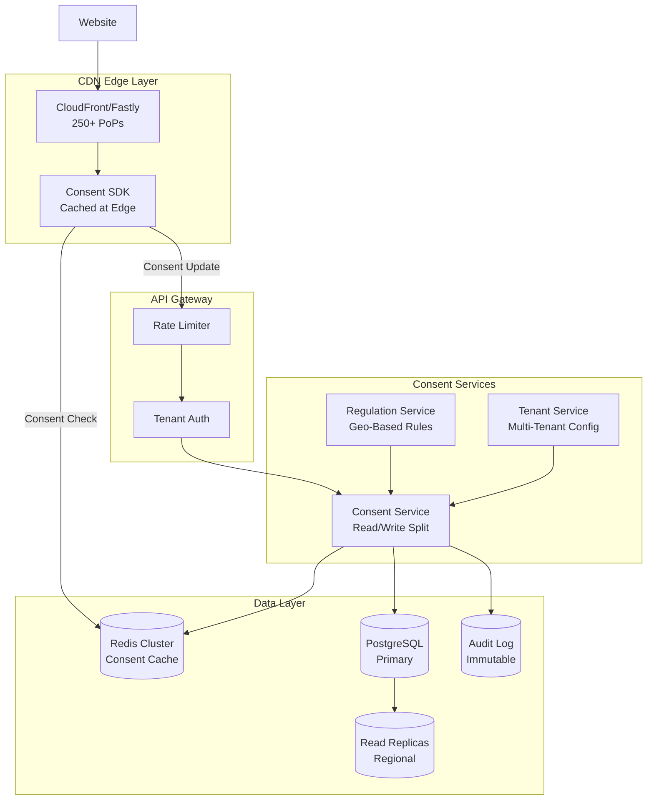
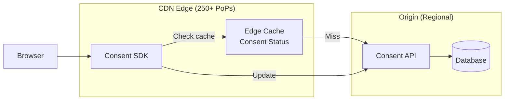
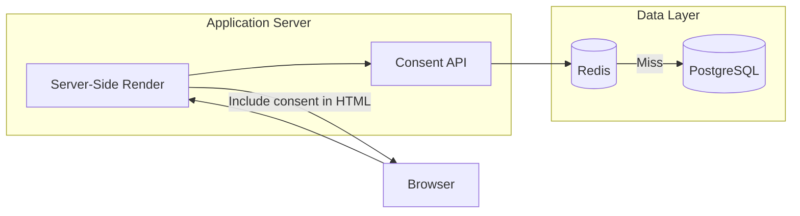
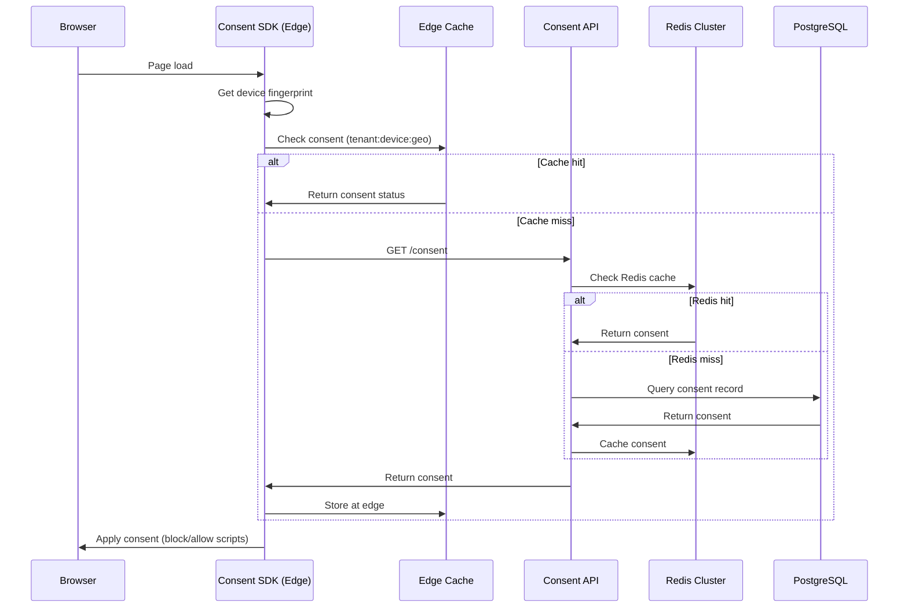
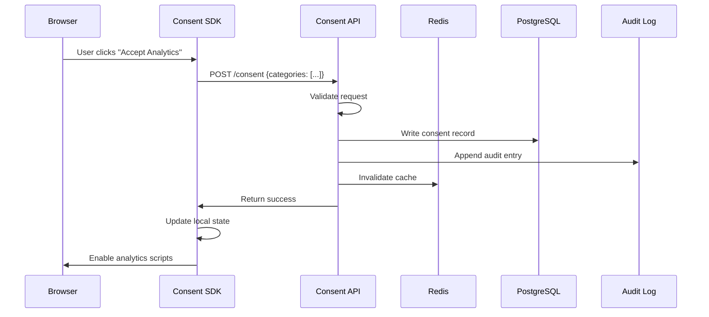
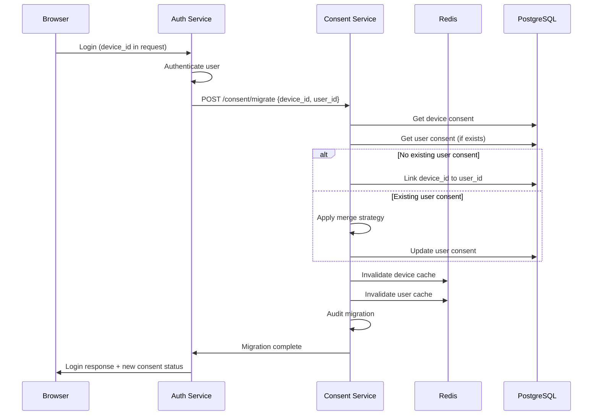
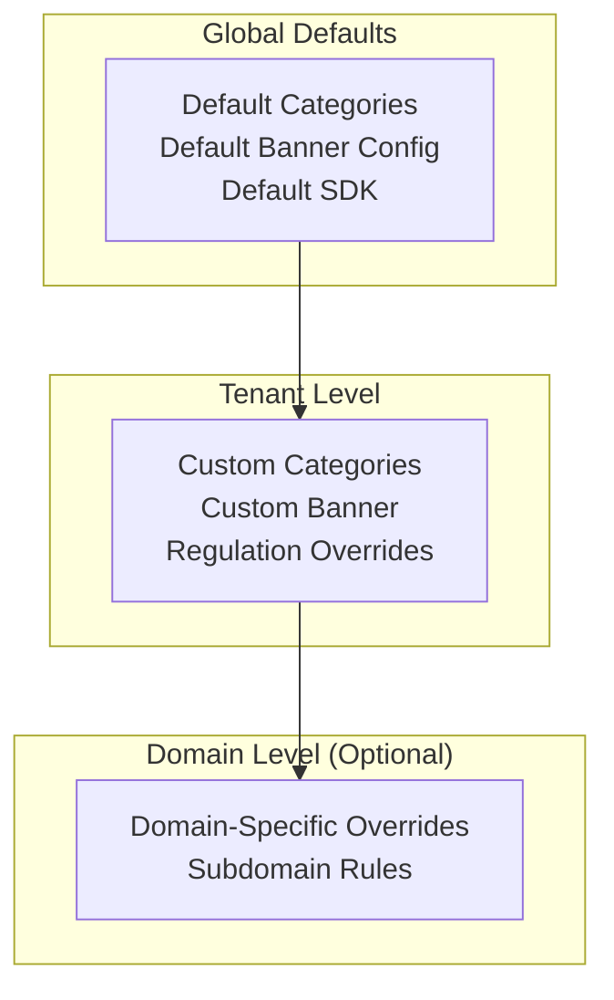
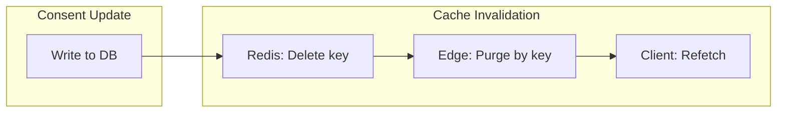
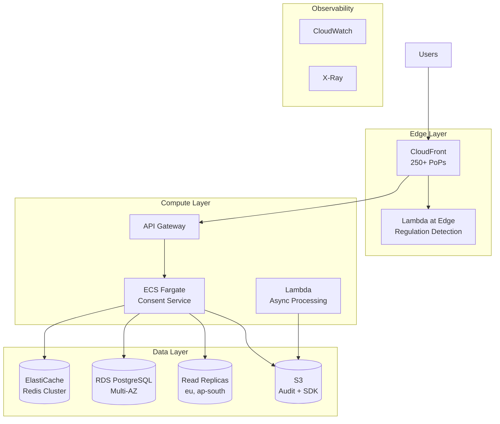
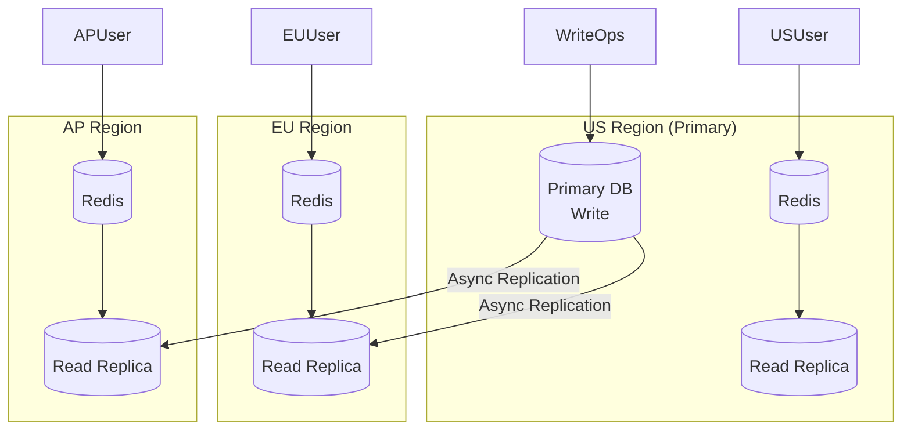

# Design a Cookie Consent Service

Building a multi-tenant consent management platform that handles regulatory compliance (GDPR, CCPA, LGPD) at scale. Cookie consent services face unique challenges: read-heavy traffic patterns (every page load queries consent status), strict latency requirements (consent checks block page rendering), regulatory complexity across jurisdictions, and the need to merge anonymous visitor consent with authenticated user profiles. This design covers edge-cached consent delivery, anonymous-to-authenticated identity migration, and a multi-tenant architecture serving thousands of websites.

<figure>



<figcaption>Cookie consent service architecture: Edge-cached SDK for sub-50ms consent checks, read replicas for global distribution, immutable audit log for regulatory compliance, multi-tenant configuration per website.</figcaption>
</figure>

## Abstract

Cookie consent design balances three competing forces:

1. **Latency vs. compliance** — Consent checks happen on every page load and block tracking scripts. Sub-50ms response times require edge caching, but regulations demand audit trails and user-specific consent records.

2. **Multi-tenancy vs. isolation** — Thousands of websites share infrastructure, but each has unique privacy policies, cookie categories, and regulatory requirements. Tenant configuration must be cacheable yet instantly updatable.

3. **Anonymous vs. authenticated** — Users browse anonymously before logging in, accumulating consent choices tied to device fingerprints. On authentication, these choices must merge with any existing profile consent without data loss or conflicting states.

The mental model: **edge-cached SDK → regional read replica → primary write path → immutable audit log**. Consent reads never touch the primary database; writes go through a single path with guaranteed auditability.

| Design Decision                   | Tradeoff                                                            |
| --------------------------------- | ------------------------------------------------------------------- |
| Edge-cached consent SDK           | Sub-50ms reads; stale consent possible for up to 60s                |
| Device fingerprint for anonymous  | Tracks consent pre-login; privacy concerns, regulatory gray area    |
| Read replicas per region          | Low latency globally; eventual consistency (acceptable for consent) |
| Immutable audit log               | Regulatory proof; storage costs, query complexity                   |
| Tenant-specific cookie categories | Flexible compliance; configuration explosion                        |

## Requirements

### Functional Requirements

| Feature                              | Scope    | Notes                                                               |
| ------------------------------------ | -------- | ------------------------------------------------------------------- |
| Consent banner rendering             | Core     | Customizable per tenant, geo-aware                                  |
| Consent collection                   | Core     | Granular per category (essential, functional, analytics, marketing) |
| Consent storage                      | Core     | Persisted with audit trail                                          |
| Consent check API                    | Core     | Called on every page load, must be fast                             |
| Regulation detection                 | Core     | Auto-detect GDPR, CCPA, LGPD based on user location                 |
| Multi-tenant configuration           | Core     | Each website has unique settings                                    |
| Anonymous consent tracking           | Core     | Device-based consent before login                                   |
| Anonymous-to-authenticated migration | Core     | Merge consent on user login                                         |
| Consent withdrawal                   | Core     | As easy as giving consent (GDPR requirement)                        |
| Consent proof/audit                  | Core     | Immutable record for regulatory audits                              |
| A/B testing for banners              | Extended | Test banner designs, measure consent rates                          |
| TCF 2.2 support                      | Extended | IAB Transparency & Consent Framework                                |
| Google Consent Mode                  | Extended | Integration with Google services                                    |

### Non-Functional Requirements

| Requirement            | Target         | Rationale                                                  |
| ---------------------- | -------------- | ---------------------------------------------------------- |
| Availability           | 99.99%         | Consent blocks page functionality; downtime = broken sites |
| Consent check latency  | p99 < 50ms     | Consent check is render-blocking                           |
| Consent update latency | p99 < 200ms    | User-triggered, less time-sensitive                        |
| Read/write ratio       | 100:1          | Every page load reads; only banner interactions write      |
| Tenant count           | 100K+ websites | Multi-tenant SaaS model                                    |
| Daily transactions     | 500M+          | Based on OneTrust scale (450M+/day)                        |
| Data retention         | 7 years        | GDPR audit requirements                                    |
| Consent accuracy       | 100%           | Must never serve wrong consent status                      |

### Scale Estimation

**Traffic Profile:**

| Metric                            | Value   | Calculation                         |
| --------------------------------- | ------- | ----------------------------------- |
| Websites served                   | 100,000 | Multi-tenant SaaS                   |
| Average daily page views per site | 10,000  | Mix of small and large sites        |
| Total daily page views            | 1B      | 100K × 10K                          |
| Consent checks/day                | 1B      | 1:1 with page views                 |
| Consent updates/day               | 10M     | 1% of visitors interact with banner |
| Peak RPS (reads)                  | 50K     | 1B / 86,400 × 4 (peak multiplier)   |
| Peak RPS (writes)                 | 500     | 10M / 86,400 × 4                    |

**Storage:**

```
Consent records: 1B unique visitors × 500 bytes = 500GB
Audit logs: 10M updates/day × 1KB × 365 days × 7 years = 25TB
Tenant configurations: 100K × 50KB = 5GB
SDK assets: 100K variants × 100KB = 10GB CDN
```

**Bandwidth:**

```
Consent checks: 50K RPS × 200 bytes = 10MB/s
SDK delivery: 10K RPS × 50KB = 500MB/s (CDN handles most)
```

## Design Paths

### Path A: Edge-First Architecture (Latency-Optimized)

**Best when:**

- Consent check latency is critical (advertising, analytics-heavy sites)
- Global audience with low tolerance for slow consent
- High page view volume per user session

**Architecture:**



**Key characteristics:**

- Consent SDK served from CDN edge
- Consent status cached at edge with short TTL (60s)
- Cache key: `{tenant_id}:{device_fingerprint}:{regulation}`
- Edge computes regulation based on request geo

**Trade-offs:**

- :white_check_mark: Sub-20ms consent checks from edge cache
- :white_check_mark: Scales infinitely at edge
- :white_check_mark: Origin protected from read traffic
- :x: Stale consent for up to 60 seconds after update
- :x: Cache invalidation complexity on consent change
- :x: Edge compute costs for SDK execution

**Real-world example:** OneTrust serves 450M+ consent transactions daily across 250+ CDN locations. Edge caching enables sub-50ms response times globally.

### Path B: Server-Side Rendering (Compliance-First)

**Best when:**

- Regulatory compliance is paramount (financial services, healthcare)
- Real-time consent accuracy required
- Lower traffic volume, higher value per interaction

**Architecture:**



**Key characteristics:**

- Consent fetched server-side before page render
- Consent status embedded in initial HTML
- No client-side consent check needed
- Server has full control over what scripts load

**Trade-offs:**

- :white_check_mark: Always accurate consent (no stale cache)
- :white_check_mark: Full control over script loading
- :white_check_mark: Simpler client-side implementation
- :x: Higher latency (adds to server response time)
- :x: Server must handle all consent checks
- :x: Caching more complex (varies by user)

**Real-world example:** Banking applications requiring strict PCI-DSS compliance use server-side consent to ensure no unauthorized tracking scripts ever load.

### Path Comparison

| Factor                | Path A (Edge-First)           | Path B (Server-Side) |
| --------------------- | ----------------------------- | -------------------- |
| Consent check latency | 10-50ms                       | 50-200ms             |
| Consent accuracy      | Eventual (60s stale)          | Real-time            |
| Infrastructure cost   | Higher (edge compute)         | Lower (centralized)  |
| Client complexity     | Higher (SDK logic)            | Lower                |
| Server load           | Lower                         | Higher               |
| Best for              | High-traffic media/e-commerce | Regulated industries |

### This Article's Focus

This article implements **Path A (Edge-First)** because:

1. Most websites prioritize user experience (fast consent checks)
2. 60-second staleness is acceptable for most consent use cases
3. Read-heavy traffic pattern (100:1) demands edge caching
4. Multi-tenant SaaS requires infrastructure efficiency

Path B details are covered in the [Variations](#variations) section.

## High-Level Design

### Component Overview

| Component          | Responsibility                       | Technology                   |
| ------------------ | ------------------------------------ | ---------------------------- |
| Consent SDK        | Client-side consent management       | JavaScript, edge-cached      |
| Consent Service    | Read/write consent operations        | Node.js/Go + Redis           |
| Regulation Service | Geo-based regulation detection       | MaxMind GeoIP + rules engine |
| Tenant Service     | Multi-tenant configuration           | PostgreSQL + Redis cache     |
| Audit Service      | Immutable consent logging            | Append-only log + S3         |
| Identity Service   | Anonymous-to-authenticated migration | Redis + PostgreSQL           |
| Banner Service     | A/B testing and rendering            | Static CDN + configuration   |

### Request Flow: Consent Check



### Request Flow: Consent Update



## API Design

### Consent Check API

```http
GET /api/v1/consent
X-Tenant-ID: tenant_abc123
X-Device-ID: fp_xyz789
X-Geo-Country: DE
```

**Response (200 OK):**

```json
{
  "consent_id": "con_abc123xyz",
  "device_id": "fp_xyz789",
  "user_id": null,
  "regulation": "gdpr",
  "status": "partial",
  "categories": {
    "essential": { "consented": true, "required": true },
    "functional": { "consented": true, "required": false },
    "analytics": { "consented": false, "required": false },
    "marketing": { "consented": false, "required": false }
  },
  "consent_timestamp": "2024-03-15T10:30:00Z",
  "policy_version": "v2.3",
  "expires_at": "2025-03-15T10:30:00Z",
  "banner_config": {
    "show_banner": false,
    "banner_version": "v1.2"
  }
}
```

**Cache headers:**

```http
Cache-Control: private, max-age=60
ETag: "abc123"
Vary: X-Device-ID, X-Geo-Country
```

**Error responses:**

- `400 Bad Request`: Missing tenant ID or device ID
- `404 Not Found`: Tenant not configured
- `429 Too Many Requests`: Rate limit exceeded

### Consent Update API

```http
POST /api/v1/consent
X-Tenant-ID: tenant_abc123
X-Device-ID: fp_xyz789
X-Idempotency-Key: idem_123456

{
  "categories": {
    "functional": true,
    "analytics": true,
    "marketing": false
  },
  "policy_version": "v2.3",
  "user_agent": "Mozilla/5.0...",
  "consent_method": "banner_button",
  "banner_version": "v1.2"
}
```

**Response (201 Created):**

```json
{
  "consent_id": "con_abc123xyz",
  "status": "updated",
  "categories": {
    "essential": { "consented": true },
    "functional": { "consented": true },
    "analytics": { "consented": true },
    "marketing": { "consented": false }
  },
  "audit_id": "aud_789xyz",
  "next_renewal": "2025-03-15T10:30:00Z"
}
```

**Idempotency:** Duplicate requests with same idempotency key return cached response.

### Consent Withdrawal API

```http
DELETE /api/v1/consent/categories/marketing
X-Tenant-ID: tenant_abc123
X-Device-ID: fp_xyz789
```

**Response (200 OK):**

```json
{
  "consent_id": "con_abc123xyz",
  "withdrawn_category": "marketing",
  "withdrawn_at": "2024-03-15T11:00:00Z",
  "audit_id": "aud_790xyz"
}
```

**GDPR requirement:** Withdrawal must be as easy as giving consent. Single API call to withdraw specific category.

### Identity Migration API

```http
POST /api/v1/consent/migrate
X-Tenant-ID: tenant_abc123

{
  "device_id": "fp_xyz789",
  "user_id": "user_456",
  "migration_strategy": "device_wins_recent"
}
```

**Response (200 OK):**

```json
{
  "migration_id": "mig_123abc",
  "source": {
    "device_id": "fp_xyz789",
    "consent_timestamp": "2024-03-15T10:30:00Z"
  },
  "target": {
    "user_id": "user_456",
    "consent_timestamp": "2024-03-10T08:00:00Z"
  },
  "result": {
    "strategy_applied": "device_wins_recent",
    "merged_categories": {
      "functional": true,
      "analytics": true,
      "marketing": false
    },
    "conflicts_resolved": [
      {
        "category": "analytics",
        "device_value": true,
        "user_value": false,
        "resolved_value": true,
        "reason": "device consent more recent"
      }
    ]
  },
  "audit_id": "aud_791xyz"
}
```

**Migration strategies:**

- `device_wins_recent`: More recent consent wins (default)
- `user_wins`: Authenticated user consent always wins
- `most_restrictive`: Use most privacy-preserving choice
- `prompt_user`: Flag conflicts for user resolution

### Tenant Configuration API

```http
GET /api/v1/tenants/{tenant_id}/config
```

**Response (200 OK):**

```json
{
  "tenant_id": "tenant_abc123",
  "domain": "example.com",
  "subdomains": ["shop.example.com", "blog.example.com"],
  "categories": [
    {
      "id": "essential",
      "name": "Essential Cookies",
      "description": "Required for basic website functionality",
      "required": true,
      "cookies": ["session_id", "csrf_token"]
    },
    {
      "id": "analytics",
      "name": "Analytics Cookies",
      "description": "Help us understand how visitors use our site",
      "required": false,
      "cookies": ["_ga", "_gid", "_gat"],
      "vendors": ["Google Analytics"]
    }
  ],
  "regulations": {
    "default": "gdpr",
    "overrides": {
      "US-CA": "ccpa",
      "BR": "lgpd"
    }
  },
  "banner": {
    "position": "bottom",
    "theme": "light",
    "show_reject_all": true,
    "consent_renewal_days": 365
  },
  "tcf_enabled": true,
  "google_consent_mode": true
}
```

## Data Modeling

### Consent Record (PostgreSQL)

```sql
CREATE TABLE consent_records (
    id UUID PRIMARY KEY DEFAULT gen_random_uuid(),
    tenant_id VARCHAR(50) NOT NULL,
    device_id VARCHAR(100) NOT NULL,
    user_id VARCHAR(100),  -- NULL for anonymous

    -- Consent state
    regulation VARCHAR(20) NOT NULL,  -- gdpr, ccpa, lgpd
    policy_version VARCHAR(20) NOT NULL,
    categories JSONB NOT NULL,
    status VARCHAR(20) DEFAULT 'partial',  -- none, partial, full

    -- Metadata
    ip_country VARCHAR(2),
    user_agent TEXT,
    consent_method VARCHAR(50),  -- banner_accept, banner_reject, api

    -- Timestamps
    created_at TIMESTAMPTZ DEFAULT NOW(),
    updated_at TIMESTAMPTZ DEFAULT NOW(),
    expires_at TIMESTAMPTZ,

    -- Constraints
    UNIQUE (tenant_id, device_id),
    UNIQUE (tenant_id, user_id) WHERE user_id IS NOT NULL
);

-- Indexes for common queries
CREATE INDEX idx_consent_tenant_device ON consent_records(tenant_id, device_id);
CREATE INDEX idx_consent_tenant_user ON consent_records(tenant_id, user_id)
    WHERE user_id IS NOT NULL;
CREATE INDEX idx_consent_expires ON consent_records(expires_at)
    WHERE expires_at IS NOT NULL;
```

**Sharding strategy:** Shard by `tenant_id` to co-locate all consent for a website. High-volume tenants may need dedicated shards.

### Audit Log (Append-Only)

```sql
CREATE TABLE consent_audit (
    id BIGSERIAL PRIMARY KEY,
    consent_id UUID NOT NULL REFERENCES consent_records(id),
    tenant_id VARCHAR(50) NOT NULL,

    -- What changed
    action VARCHAR(20) NOT NULL,  -- create, update, withdraw, migrate
    old_categories JSONB,
    new_categories JSONB,

    -- Context
    policy_version VARCHAR(20),
    ip_address INET,
    user_agent TEXT,
    consent_method VARCHAR(50),
    idempotency_key VARCHAR(100),

    -- Immutable timestamp
    created_at TIMESTAMPTZ DEFAULT NOW(),

    -- No updates allowed
    CONSTRAINT no_updates CHECK (true)
);

-- Partition by month for efficient archival
CREATE TABLE consent_audit_2024_03 PARTITION OF consent_audit
    FOR VALUES FROM ('2024-03-01') TO ('2024-04-01');

-- Index for regulatory queries
CREATE INDEX idx_audit_consent ON consent_audit(consent_id, created_at DESC);
CREATE INDEX idx_audit_tenant_time ON consent_audit(tenant_id, created_at DESC);
```

**Retention policy:** Archive to S3 Glacier after 1 year, retain for 7 years total per GDPR requirements.

### Tenant Configuration (PostgreSQL + Redis)

```sql
CREATE TABLE tenants (
    id VARCHAR(50) PRIMARY KEY,
    domain VARCHAR(255) NOT NULL UNIQUE,
    subdomains TEXT[],

    -- Configuration
    config JSONB NOT NULL,
    banner_config JSONB,

    -- SDK versioning
    sdk_version VARCHAR(20) DEFAULT 'latest',
    custom_sdk_url TEXT,

    -- Status
    status VARCHAR(20) DEFAULT 'active',
    created_at TIMESTAMPTZ DEFAULT NOW(),
    updated_at TIMESTAMPTZ DEFAULT NOW()
);

CREATE INDEX idx_tenants_domain ON tenants(domain);
CREATE INDEX idx_tenants_subdomains ON tenants USING GIN(subdomains);
```

**Redis cache structure:**

```redis
# Tenant config (cached for 5 minutes)
SETEX tenant:config:tenant_abc123 300 "{...json config...}"

# Consent record (cached for 60 seconds)
SETEX consent:tenant_abc123:fp_xyz789 60 "{...consent...}"

# Invalidation on update
DEL consent:tenant_abc123:fp_xyz789
```

### Database Selection Matrix

| Data                | Store                      | Rationale                                    |
| ------------------- | -------------------------- | -------------------------------------------- |
| Consent records     | PostgreSQL + Read replicas | ACID, complex queries, regional distribution |
| Consent cache       | Redis Cluster              | Sub-ms reads, TTL support                    |
| Audit log           | PostgreSQL (partitioned)   | Immutable, time-series queries               |
| Audit archive       | S3 Glacier                 | Cost-effective long-term storage             |
| Tenant config       | PostgreSQL + Redis         | Infrequent updates, high read frequency      |
| SDK assets          | S3 + CloudFront            | Global distribution, versioning              |
| Device fingerprints | Redis                      | Ephemeral, fast lookup                       |

## Low-Level Design

### Consent SDK (Client-Side)

The SDK is the first point of contact for consent management. It must:

1. Generate and persist device fingerprints
2. Fetch and apply consent status
3. Block non-consented scripts
4. Handle consent updates

**SDK initialization:**

```typescript collapse={1-15, 55-70}
// consent-sdk.ts
interface ConsentConfig {
  tenantId: string
  apiEndpoint: string
  categories: CategoryConfig[]
  regulation?: "auto" | "gdpr" | "ccpa" | "lgpd"
  onConsentChange?: (consent: ConsentStatus) => void
}

interface ConsentStatus {
  categories: Record<string, boolean>
  regulation: string
  timestamp: string
  showBanner: boolean
}

class ConsentSDK {
  private config: ConsentConfig
  private deviceId: string
  private consent: ConsentStatus | null = null

  async init(config: ConsentConfig): Promise<void> {
    this.config = config
    this.deviceId = await this.getOrCreateDeviceId()

    // Fetch consent status
    this.consent = await this.fetchConsent()

    // Apply consent immediately
    this.applyConsent(this.consent)

    // Show banner if needed
    if (this.consent.showBanner) {
      this.renderBanner()
    }
  }

  private async getOrCreateDeviceId(): Promise<string> {
    // Check localStorage first
    let deviceId = localStorage.getItem("_consent_device_id")
    if (deviceId) return deviceId

    // Generate fingerprint
    deviceId = await this.generateFingerprint()
    localStorage.setItem("_consent_device_id", deviceId)
    return deviceId
  }

  private async generateFingerprint(): Promise<string> {
    // Collect browser signals (privacy-preserving subset)
    const signals = {
      userAgent: navigator.userAgent,
      language: navigator.language,
      timezone: Intl.DateTimeFormat().resolvedOptions().timeZone,
      screenResolution: `${screen.width}x${screen.height}`,
      colorDepth: screen.colorDepth,
      // Avoid canvas fingerprinting (privacy concern)
    }

    // Hash to create stable identifier
    const data = JSON.stringify(signals)
    const hashBuffer = await crypto.subtle.digest("SHA-256", new TextEncoder().encode(data))
    const hashArray = Array.from(new Uint8Array(hashBuffer))
    return (
      "fp_" +
      hashArray
        .map((b) => b.toString(16).padStart(2, "0"))
        .join("")
        .slice(0, 32)
    )
  }
}
```

**Script blocking implementation:**

```typescript collapse={1-10, 45-60}
// script-blocker.ts
interface BlockedScript {
  src: string
  category: string
  type: "script" | "iframe" | "img"
}

const blockedScripts: BlockedScript[] = []

function applyConsent(consent: ConsentStatus): void {
  // Find all scripts with consent requirements
  const scripts = document.querySelectorAll("script[data-consent-category]")

  scripts.forEach((script) => {
    const category = script.getAttribute("data-consent-category")
    const consented = consent.categories[category]

    if (consented) {
      // Enable script
      if (script.getAttribute("data-src")) {
        script.setAttribute("src", script.getAttribute("data-src")!)
        script.removeAttribute("data-src")
      }
      script.removeAttribute("type") // Remove text/plain blocker
    } else {
      // Keep blocked (or block if not already)
      if (script.getAttribute("src")) {
        script.setAttribute("data-src", script.getAttribute("src")!)
        script.removeAttribute("src")
        script.setAttribute("type", "text/plain")
      }
    }
  })

  // Handle dynamically added scripts
  observeNewScripts(consent)
}

function observeNewScripts(consent: ConsentStatus): void {
  const observer = new MutationObserver((mutations) => {
    mutations.forEach((mutation) => {
      mutation.addedNodes.forEach((node) => {
        if (node.nodeName === "SCRIPT") {
          const script = node as HTMLScriptElement
          const category = script.getAttribute("data-consent-category")
          if (category && !consent.categories[category]) {
            // Block dynamically added non-consented script
            script.setAttribute("data-src", script.src)
            script.removeAttribute("src")
            script.type = "text/plain"
          }
        }
      })
    })
  })

  observer.observe(document.documentElement, {
    childList: true,
    subtree: true,
  })
}
```

**Design decisions:**

| Decision                     | Rationale                                          |
| ---------------------------- | -------------------------------------------------- |
| LocalStorage for device ID   | Persists across sessions, faster than cookie       |
| SHA-256 fingerprint          | Stable identifier without invasive fingerprinting  |
| MutationObserver for scripts | Catches dynamically injected tracking scripts      |
| `type="text/plain"` blocking | Browser ignores script content without removing it |

### Anonymous-to-Authenticated Migration

When a user logs in, their anonymous device consent must merge with any existing authenticated consent.

**Migration logic:**

```typescript collapse={1-15, 70-85}
// identity-migration.ts
interface MigrationRequest {
  tenantId: string
  deviceId: string
  userId: string
  strategy: "device_wins_recent" | "user_wins" | "most_restrictive" | "prompt_user"
}

interface ConsentRecord {
  categories: Record<string, boolean>
  timestamp: Date
  source: "device" | "user"
}

async function migrateConsent(request: MigrationRequest): Promise<MigrationResult> {
  const { tenantId, deviceId, userId, strategy } = request

  // Fetch both consent records
  const [deviceConsent, userConsent] = await Promise.all([
    getConsentByDevice(tenantId, deviceId),
    getConsentByUser(tenantId, userId),
  ])

  // If no existing user consent, simply link device consent to user
  if (!userConsent) {
    await linkDeviceToUser(tenantId, deviceId, userId)
    return { migrated: true, conflicts: [] }
  }

  // If no device consent, keep user consent as-is
  if (!deviceConsent) {
    return { migrated: false, reason: "no_device_consent" }
  }

  // Merge based on strategy
  const merged = mergeConsent(deviceConsent, userConsent, strategy)

  // Write merged consent
  await updateUserConsent(tenantId, userId, merged.categories)

  // Audit the migration
  await auditMigration(tenantId, deviceId, userId, deviceConsent, userConsent, merged)

  // Invalidate caches
  await invalidateConsentCache(tenantId, deviceId)
  await invalidateConsentCache(tenantId, userId)

  return merged
}

function mergeConsent(device: ConsentRecord, user: ConsentRecord, strategy: string): MergeResult {
  const categories = new Set([...Object.keys(device.categories), ...Object.keys(user.categories)])

  const merged: Record<string, boolean> = {}
  const conflicts: Conflict[] = []

  for (const category of categories) {
    const deviceValue = device.categories[category]
    const userValue = user.categories[category]

    if (deviceValue === userValue) {
      merged[category] = deviceValue
      continue
    }

    // Conflict resolution based on strategy
    switch (strategy) {
      case "device_wins_recent":
        merged[category] = device.timestamp > user.timestamp ? deviceValue : userValue
        break
      case "user_wins":
        merged[category] = userValue ?? deviceValue
        break
      case "most_restrictive":
        merged[category] = deviceValue === false || userValue === false ? false : true
        break
      case "prompt_user":
        conflicts.push({ category, deviceValue, userValue })
        break
    }
  }

  return { categories: merged, conflicts }
}
```

**Migration flow:**



**Edge cases:**

| Scenario                    | Handling                                        |
| --------------------------- | ----------------------------------------------- |
| User has multiple devices   | Each device's consent migrates independently    |
| User logs out and back in   | Device consent may have changed; re-migrate     |
| User clears localStorage    | New device ID generated; fresh consent flow     |
| Conflict with `prompt_user` | Return conflicts to client; user resolves in UI |

### Regulation Detection Service

Automatically detect applicable privacy regulation based on user location.

**Detection logic:**

```typescript collapse={1-12, 50-65}
// regulation-service.ts
import maxmind from "maxmind"

interface RegulationResult {
  regulation: "gdpr" | "ccpa" | "lgpd" | "none"
  country: string
  region?: string
  confidence: "high" | "medium" | "low"
}

const geoDb = await maxmind.open("/data/GeoLite2-City.mmdb")

function detectRegulation(ipAddress: string): RegulationResult {
  const geo = geoDb.get(ipAddress)

  if (!geo || !geo.country) {
    return { regulation: "gdpr", country: "unknown", confidence: "low" }
    // Default to strictest regulation when unknown
  }

  const country = geo.country.iso_code
  const region = geo.subdivisions?.[0]?.iso_code

  // GDPR: EU/EEA countries
  const gdprCountries = [
    "AT",
    "BE",
    "BG",
    "HR",
    "CY",
    "CZ",
    "DK",
    "EE",
    "FI",
    "FR",
    "DE",
    "GR",
    "HU",
    "IE",
    "IT",
    "LV",
    "LT",
    "LU",
    "MT",
    "NL",
    "PL",
    "PT",
    "RO",
    "SK",
    "SI",
    "ES",
    "SE",
    // EEA
    "IS",
    "LI",
    "NO",
    // UK (still applies GDPR-equivalent)
    "GB",
  ]

  if (gdprCountries.includes(country)) {
    return { regulation: "gdpr", country, confidence: "high" }
  }

  // CCPA: California residents
  if (country === "US" && region === "CA") {
    return { regulation: "ccpa", country, region, confidence: "high" }
  }

  // LGPD: Brazil
  if (country === "BR") {
    return { regulation: "lgpd", country, confidence: "high" }
  }

  // Default: no specific regulation (still show banner for best practice)
  return { regulation: "none", country, confidence: "high" }
}

// Tenant-specific overrides
function applyTenantOverrides(detected: RegulationResult, tenantConfig: TenantConfig): RegulationResult {
  const override =
    tenantConfig.regulations.overrides?.[`${detected.country}-${detected.region}`] ||
    tenantConfig.regulations.overrides?.[detected.country]

  if (override) {
    return { ...detected, regulation: override }
  }

  return detected
}
```

**Regulation behavior matrix:**

| Regulation | Consent Model | Default Blocked     | Withdrawal    |
| ---------- | ------------- | ------------------- | ------------- |
| GDPR       | Opt-in        | All non-essential   | Required      |
| CCPA       | Opt-out       | Marketing (if sold) | Required      |
| LGPD       | Opt-in        | All non-essential   | Required      |
| None       | Opt-out       | None                | Best practice |

### Multi-Tenant Configuration Engine

**Configuration hierarchy:**



**Configuration resolution:**

```typescript collapse={1-10, 45-60}
// tenant-config.ts
interface ResolvedConfig {
  tenantId: string
  domain: string
  categories: CategoryConfig[]
  banner: BannerConfig
  regulations: RegulationConfig
  sdk: SDKConfig
}

async function resolveConfig(tenantId: string, domain: string): Promise<ResolvedConfig> {
  // Check cache first
  const cacheKey = `tenant:config:${tenantId}:${domain}`
  const cached = await redis.get(cacheKey)
  if (cached) return JSON.parse(cached)

  // Load tenant base config
  const tenant = await db.tenants.findById(tenantId)
  if (!tenant) throw new Error("Tenant not found")

  // Apply domain-specific overrides
  let config = tenant.config
  if (tenant.domainOverrides?.[domain]) {
    config = deepMerge(config, tenant.domainOverrides[domain])
  }

  // Merge with global defaults
  const resolved = deepMerge(GLOBAL_DEFAULTS, config)

  // Cache for 5 minutes
  await redis.setex(cacheKey, 300, JSON.stringify(resolved))

  return resolved
}

// Configuration update propagation
async function updateTenantConfig(tenantId: string, updates: Partial<TenantConfig>): Promise<void> {
  // Update database
  await db.tenants.update(tenantId, updates)

  // Invalidate all cached configs for this tenant
  const keys = await redis.keys(`tenant:config:${tenantId}:*`)
  if (keys.length > 0) {
    await redis.del(...keys)
  }

  // Trigger SDK regeneration if categories changed
  if (updates.categories) {
    await sdkBuildQueue.add({ tenantId, reason: "category_update" })
  }
}
```

### Cache Invalidation Strategy

**Layered cache invalidation:**



**Implementation:**

```typescript collapse={1-8, 35-50}
// cache-invalidation.ts
interface InvalidationTarget {
  tenantId: string
  identifier: string // device_id or user_id
  type: "device" | "user"
}

async function invalidateConsentCache(target: InvalidationTarget): Promise<void> {
  const { tenantId, identifier, type } = target

  // 1. Invalidate Redis cache
  const redisKey = `consent:${tenantId}:${identifier}`
  await redis.del(redisKey)

  // 2. Invalidate CDN edge cache
  const edgeKey = `consent/${tenantId}/${identifier}`
  await cdnPurge(edgeKey)

  // 3. Publish invalidation event for any connected clients
  await pubsub.publish(`consent:invalidate:${tenantId}`, {
    identifier,
    type,
    timestamp: Date.now(),
  })
}

// SDK listens for invalidation events
function setupInvalidationListener(tenantId: string): void {
  const eventSource = new EventSource(`/api/v1/consent/events?tenant=${tenantId}`)

  eventSource.onmessage = (event) => {
    const data = JSON.parse(event.data)
    if (data.identifier === currentDeviceId) {
      // Refetch consent immediately
      refreshConsent()
    }
  }
}
```

**Cache TTLs:**

| Cache Layer         | TTL     | Rationale                         |
| ------------------- | ------- | --------------------------------- |
| Edge CDN            | 60s     | Balance freshness vs. origin load |
| Redis (consent)     | 60s     | Match edge TTL                    |
| Redis (config)      | 300s    | Config changes less frequent      |
| Client localStorage | Session | Refresh on page load              |

## Frontend Considerations

### Banner Performance

**Render-blocking mitigation:**

```html collapse={1-5, 20-30}
<!DOCTYPE html>
<html>
  <head>
    <!-- Preconnect to consent API -->
    <link rel="preconnect" href="https://consent.example.com" />

    <!-- Inline critical consent check -->
    <script>
      // Minimal inline script to check localStorage
      ;(function () {
        const consent = localStorage.getItem("_consent_status")
        if (consent) {
          window.__CONSENT_STATUS = JSON.parse(consent)
        }
      })()
    </script>

    <!-- Async load full SDK -->
    <script async src="https://cdn.consent.example.com/sdk/v1/consent.js"></script>
  </head>
  <body>
    <!-- Banner placeholder to prevent CLS -->
    <div id="consent-banner-placeholder" style="height: 0; transition: height 0.3s;"></div>

    <!-- Rest of page content -->
  </body>
</html>
```

**Layout shift prevention:**

```css
/* Reserve space for banner to prevent CLS */
#consent-banner-placeholder {
  position: fixed;
  bottom: 0;
  left: 0;
  right: 0;
  height: 0;
  transition: height 0.3s ease-out;
}

#consent-banner-placeholder.visible {
  height: 200px; /* Match actual banner height */
}

/* Alternative: overlay banner (no layout shift) */
.consent-banner-overlay {
  position: fixed;
  bottom: 0;
  left: 0;
  right: 0;
  z-index: 9999;
  /* Doesn't affect layout */
}
```

### State Management

```typescript collapse={1-10, 45-60}
// consent-state.ts
interface ConsentState {
  // Consent data
  status: ConsentStatus | null
  loading: boolean
  error: Error | null

  // UI state
  bannerVisible: boolean
  preferencesOpen: boolean

  // Pending changes
  pendingCategories: Record<string, boolean>
}

const consentStore = createStore<ConsentState>({
  status: null,
  loading: true,
  error: null,
  bannerVisible: false,
  preferencesOpen: false,
  pendingCategories: {},
})

// Actions
function updateCategory(category: string, value: boolean): void {
  consentStore.update((state) => ({
    ...state,
    pendingCategories: {
      ...state.pendingCategories,
      [category]: value,
    },
  }))
}

async function saveConsent(): Promise<void> {
  const { pendingCategories } = consentStore.get()

  consentStore.update((state) => ({ ...state, loading: true }))

  try {
    const result = await api.updateConsent(pendingCategories)
    consentStore.update((state) => ({
      ...state,
      status: result,
      pendingCategories: {},
      bannerVisible: false,
      loading: false,
    }))

    // Persist to localStorage
    localStorage.setItem("_consent_status", JSON.stringify(result))

    // Apply to scripts
    applyConsent(result)
  } catch (error) {
    consentStore.update((state) => ({
      ...state,
      error,
      loading: false,
    }))
  }
}
```

### Google Consent Mode Integration

```typescript collapse={1-15, 50-65}
// google-consent-mode.ts
interface GoogleConsentState {
  ad_storage: "granted" | "denied"
  ad_user_data: "granted" | "denied"
  ad_personalization: "granted" | "denied"
  analytics_storage: "granted" | "denied"
}

function mapConsentToGoogle(consent: ConsentStatus): GoogleConsentState {
  return {
    ad_storage: consent.categories.marketing ? "granted" : "denied",
    ad_user_data: consent.categories.marketing ? "granted" : "denied",
    ad_personalization: consent.categories.marketing ? "granted" : "denied",
    analytics_storage: consent.categories.analytics ? "granted" : "denied",
  }
}

function initGoogleConsentMode(consent: ConsentStatus): void {
  // Initialize with default (denied) before consent known
  window.dataLayer = window.dataLayer || []
  function gtag(...args: any[]) {
    dataLayer.push(args)
  }

  gtag("consent", "default", {
    ad_storage: "denied",
    ad_user_data: "denied",
    ad_personalization: "denied",
    analytics_storage: "denied",
    wait_for_update: 500, // Wait for consent check
  })

  // Update once consent is known
  const googleConsent = mapConsentToGoogle(consent)
  gtag("consent", "update", googleConsent)
}

// On consent change
function updateGoogleConsent(consent: ConsentStatus): void {
  const googleConsent = mapConsentToGoogle(consent)
  gtag("consent", "update", googleConsent)
}
```

**Google Consent Mode parameters:**

| Parameter          | Maps to           | Description               |
| ------------------ | ----------------- | ------------------------- |
| ad_storage         | Marketing cookies | Storage for advertising   |
| ad_user_data       | Marketing cookies | Sending user data for ads |
| ad_personalization | Marketing cookies | Personalized advertising  |
| analytics_storage  | Analytics cookies | Storage for analytics     |

## Infrastructure Design

### Cloud-Agnostic Components

| Component       | Purpose                        | Requirements                   |
| --------------- | ------------------------------ | ------------------------------ |
| CDN             | SDK delivery, edge caching     | Global PoPs, cache purge API   |
| Key-value store | Consent cache                  | Sub-ms reads, TTL support      |
| Relational DB   | Consent records, tenant config | ACID, read replicas            |
| Object storage  | Audit archives, SDK assets     | Versioning, lifecycle policies |
| Message queue   | Async processing               | Durability, dead letter queue  |
| Geo database    | IP to location                 | Low latency, regular updates   |

### AWS Reference Architecture



**Service configuration:**

| Service        | Configuration                     | Rationale                       |
| -------------- | --------------------------------- | ------------------------------- |
| CloudFront     | 250+ PoPs, Lambda@Edge            | Global low-latency SDK delivery |
| Lambda@Edge    | 128MB, 5s timeout                 | Regulation detection at edge    |
| API Gateway    | 10K RPS, WAF                      | Rate limiting, DDoS protection  |
| ECS Fargate    | 2 vCPU, 4GB, Auto-scale 2-50      | Consent API servers             |
| ElastiCache    | Redis Cluster, 3 nodes, r6g.large | Sub-ms consent cache            |
| RDS PostgreSQL | Multi-AZ, db.r6g.xlarge           | Primary consent store           |
| Read Replicas  | eu-west-1, ap-south-1             | Regional read latency           |
| S3             | Intelligent Tiering               | Audit logs with lifecycle       |

### Multi-Region Deployment



**Design decisions:**

| Decision               | Rationale                                         |
| ---------------------- | ------------------------------------------------- |
| Single write region    | Simplifies consistency, GDPR compliance (EU data) |
| Regional read replicas | <50ms read latency globally                       |
| Local Redis per region | Sub-ms cache hits, no cross-region calls          |
| Async replication      | Acceptable for consent (eventual consistency)     |

### Self-Hosted Alternatives

| Managed Service | Self-Hosted Option   | Trade-off                            |
| --------------- | -------------------- | ------------------------------------ |
| CloudFront      | Fastly/Cloudflare    | More edge compute options            |
| ElastiCache     | Redis Cluster on EC2 | More control, operational burden     |
| RDS PostgreSQL  | PostgreSQL on EC2    | Custom extensions, cost at scale     |
| Lambda@Edge     | Cloudflare Workers   | Better cold start, different pricing |

## Variations

### Server-Side Consent (Path B)

For regulated industries requiring real-time consent accuracy:

```typescript collapse={1-12, 45-60}
// server-side-consent.ts
import { ConsentService } from './consent-service';

interface ServerRenderContext {
  request: Request;
  consent: ConsentStatus;
  allowedScripts: string[];
}

async function renderPageWithConsent(
  request: Request,
  pageComponent: Component
): Promise<Response> {
  // Extract device ID from cookie
  const deviceId = request.cookies.get('_consent_device_id');

  // Fetch consent server-side
  const consent = await consentService.getConsent(
    TENANT_ID,
    deviceId,
    request.headers.get('cf-ipcountry')
  );

  // Determine which scripts to include
  const allowedScripts = getScriptsForConsent(consent);

  // Render page with consent context
  const html = renderToString(
    <ConsentContext.Provider value={consent}>
      <Page
        component={pageComponent}
        scripts={allowedScripts}
      />
    </ConsentContext.Provider>
  );

  // Set consent cookie for client-side access
  const response = new Response(html);
  response.headers.set(
    'Set-Cookie',
    `_consent_status=${JSON.stringify(consent)}; Path=/; SameSite=Lax`
  );

  return response;
}

function getScriptsForConsent(consent: ConsentStatus): string[] {
  const scripts: string[] = ['essential.js'];

  if (consent.categories.analytics) {
    scripts.push('analytics.js');
  }
  if (consent.categories.marketing) {
    scripts.push('marketing.js');
  }

  return scripts;
}
```

### IAB TCF 2.2 Support

For publishers requiring TCF compliance:

```typescript collapse={1-15, 55-70}
// tcf-support.ts
interface TCFConsent {
  tcString: string // Base64-encoded TC string
  gdprApplies: boolean
  purposeConsents: Record<number, boolean>
  vendorConsents: Record<number, boolean>
  specialFeatureOptins: Record<number, boolean>
}

function generateTCString(consent: ConsentStatus): string {
  // TCF 2.2 requires specific format
  const tcData = {
    version: 2,
    created: consent.timestamp,
    lastUpdated: consent.timestamp,
    cmpId: 123, // Registered CMP ID
    cmpVersion: 1,
    consentScreen: 1,
    consentLanguage: "EN",
    vendorListVersion: 123,
    tcfPolicyVersion: 4,
    isServiceSpecific: false,
    useNonStandardStacks: false,
    purposeConsents: mapCategoryToTCFPurpose(consent.categories),
    vendorConsents: {}, // Populated from GVL
  }

  return encodeTCString(tcData)
}

function mapCategoryToTCFPurpose(categories: Record<string, boolean>): Record<number, boolean> {
  // TCF Purpose mapping
  return {
    1: categories.essential, // Store/access information
    2: categories.functional, // Select basic ads
    3: categories.marketing, // Create personalized ads profile
    4: categories.marketing, // Select personalized ads
    5: categories.marketing, // Create personalized content profile
    6: categories.functional, // Select personalized content
    7: categories.analytics, // Measure ad performance
    8: categories.analytics, // Measure content performance
    9: categories.analytics, // Apply market research
    10: categories.functional, // Develop and improve products
    11: categories.essential, // Use limited data to select content
  }
}

// Expose TC string via __tcfapi
function setupTCFAPI(tcfConsent: TCFConsent): void {
  window.__tcfapi = (command, version, callback, parameter) => {
    switch (command) {
      case "getTCData":
        callback({ tcData: tcfConsent, success: true })
        break
      case "addEventListener":
        // Register listener for consent changes
        consentListeners.push(callback)
        break
      case "removeEventListener":
        // Remove listener
        break
    }
  }
}
```

### Consent Rate A/B Testing

```typescript collapse={1-10, 40-55}
// ab-testing.ts
interface BannerVariant {
  id: string
  position: "top" | "bottom" | "center"
  layout: "minimal" | "detailed"
  showRejectAll: boolean
  primaryColor: string
}

async function getBannerVariant(tenantId: string, deviceId: string): Promise<BannerVariant> {
  // Check if device already assigned to variant
  const existingVariant = await redis.get(`ab:${tenantId}:${deviceId}`)
  if (existingVariant) return JSON.parse(existingVariant)

  // Get active experiment
  const experiment = await db.experiments.findActive(tenantId)
  if (!experiment) return DEFAULT_BANNER

  // Deterministic assignment based on device ID
  const hash = hashDeviceId(deviceId)
  const bucket = hash % 100

  const variant = experiment.variants.find((v) => bucket >= v.startBucket && bucket < v.endBucket)

  // Store assignment
  await redis.setex(`ab:${tenantId}:${deviceId}`, 86400 * 30, JSON.stringify(variant))

  return variant
}

// Track consent events for A/B analysis
async function trackConsentEvent(
  tenantId: string,
  deviceId: string,
  variantId: string,
  action: "accept_all" | "reject_all" | "customize" | "close",
): Promise<void> {
  await analytics.track({
    event: "consent_action",
    properties: {
      tenantId,
      variantId,
      action,
      timestamp: Date.now(),
    },
  })
}
```

**A/B test metrics:**

| Metric            | Description                        | Target |
| ----------------- | ---------------------------------- | ------ |
| Consent rate      | Users accepting any non-essential  | 60-80% |
| Full consent rate | Users accepting all categories     | 30-50% |
| Interaction rate  | Users engaging with banner         | 70-90% |
| Time to decision  | Seconds from banner show to action | <10s   |

## Conclusion

Cookie consent services must balance regulatory compliance, user experience, and technical performance:

1. **Edge-first architecture**: CDN-cached SDK and consent status enable sub-50ms consent checks. Origin servers handle only writes and cache misses.

2. **Multi-tenant isolation**: Tenant configuration cached at multiple layers. Each website has independent categories, regulations, and banner designs without infrastructure overhead.

3. **Anonymous-to-authenticated migration**: Device fingerprints track consent before login. On authentication, consent merges based on configurable strategies (most recent, most restrictive, or user choice).

4. **Regulatory flexibility**: Geo-detection applies GDPR, CCPA, or LGPD rules automatically. Tenant overrides handle edge cases and business requirements.

5. **Immutable audit trail**: Every consent change logged with full context. Partitioned tables and S3 archival support 7-year retention for regulatory audits.

**What this design optimizes for:**

- Read latency (sub-50ms consent checks)
- Regulatory compliance (audit trail, withdrawal support)
- Multi-tenant efficiency (shared infrastructure, isolated configuration)
- Anonymous user tracking (device fingerprint based)

**What it sacrifices:**

- Real-time consent accuracy (60s stale window acceptable)
- Write complexity (single primary region)
- Device fingerprint privacy (regulatory gray area)

**Known limitations:**

- Device fingerprint changes on browser update/reinstall
- Cross-device consent requires user authentication
- TCF 2.2 vendor list management adds operational complexity
- A/B testing may conflict with regulatory "don't manipulate consent" guidance

## Appendix

### Prerequisites

- Distributed systems fundamentals (caching, replication)
- Privacy regulations basics (GDPR, CCPA concepts)
- CDN and edge computing patterns
- Database sharding and read replicas

### Terminology

| Term               | Definition                                                                    |
| ------------------ | ----------------------------------------------------------------------------- |
| CMP                | Consent Management Platform - system for collecting and managing user consent |
| TCF                | Transparency & Consent Framework - IAB standard for consent communication     |
| TC String          | Transparency and Consent String - encoded consent record per TCF spec         |
| Device Fingerprint | Browser/device characteristics hashed to create persistent identifier         |
| GVL                | Global Vendor List - IAB-maintained list of advertising vendors               |
| DPO                | Data Protection Officer - organization's privacy compliance lead              |

### Summary

- **Edge-cached SDK** delivers consent checks in sub-50ms globally; writes route to single primary region
- **Multi-tenant architecture** isolates configuration per website while sharing infrastructure; tenant config cached at edge and Redis layers
- **Anonymous consent** tracked via device fingerprint before login; migrates to authenticated profile with configurable merge strategies
- **Regulation detection** uses MaxMind GeoIP to auto-apply GDPR, CCPA, or LGPD rules; tenant overrides support edge cases
- **Immutable audit log** records every consent change with full context; partitioned by month, archived to S3 after 1 year, retained 7 years
- **Read replicas per region** reduce global latency; eventual consistency (sub-60s) acceptable for consent use cases

### References

- [GDPR Article 6 - Lawfulness of Processing](https://gdpr.eu/article-6-how-to-process-personal-data-legally/) - Legal basis for consent
- [GDPR Article 7 - Conditions for Consent](https://gdpr.eu/article-7-how-to-get-consent-to-collect-personal-data/) - Consent requirements
- [IAB TCF 2.2 Specification](https://github.com/InteractiveAdvertisingBureau/GDPR-Transparency-and-Consent-Framework) - Technical specification
- [Google Consent Mode Documentation](https://developers.google.com/tag-platform/security/guides/consent) - Integration guide
- [CNIL Cookie Guidelines](https://www.cnil.fr/en/cookies-and-other-tracking-devices-cnil-publishes-new-guidelines) - French DPA recommendations
- [OneTrust Performance Architecture](https://www.onetrust.com/blog/global-cdn-asynchronous-loading/) - Industry reference
- [Cloudflare OneTrust Case Study](https://www.cloudflare.com/case-studies/onetrust/) - Scale benchmarks
- [ePrivacy Directive](https://eur-lex.europa.eu/legal-content/EN/ALL/?uri=CELEX%3A32002L0058) - EU cookie law
- [CCPA Text](https://oag.ca.gov/privacy/ccpa) - California privacy law
