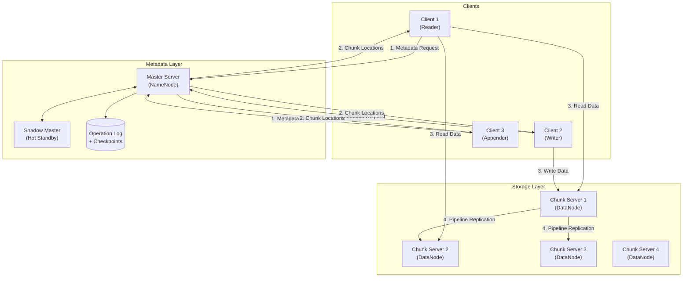
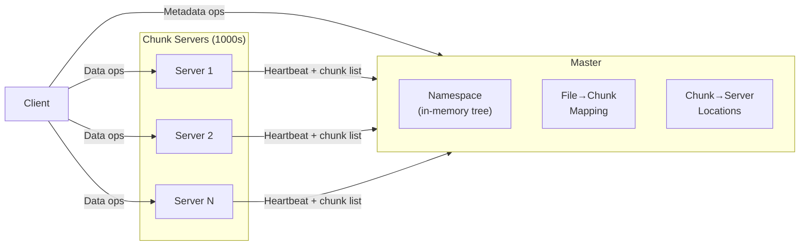
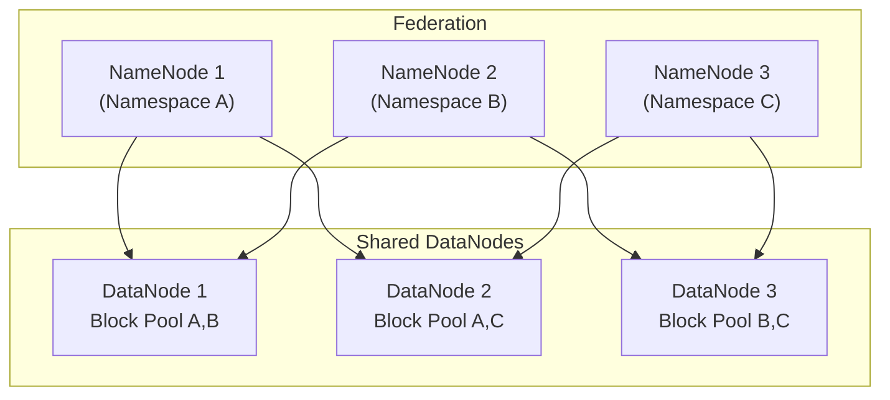
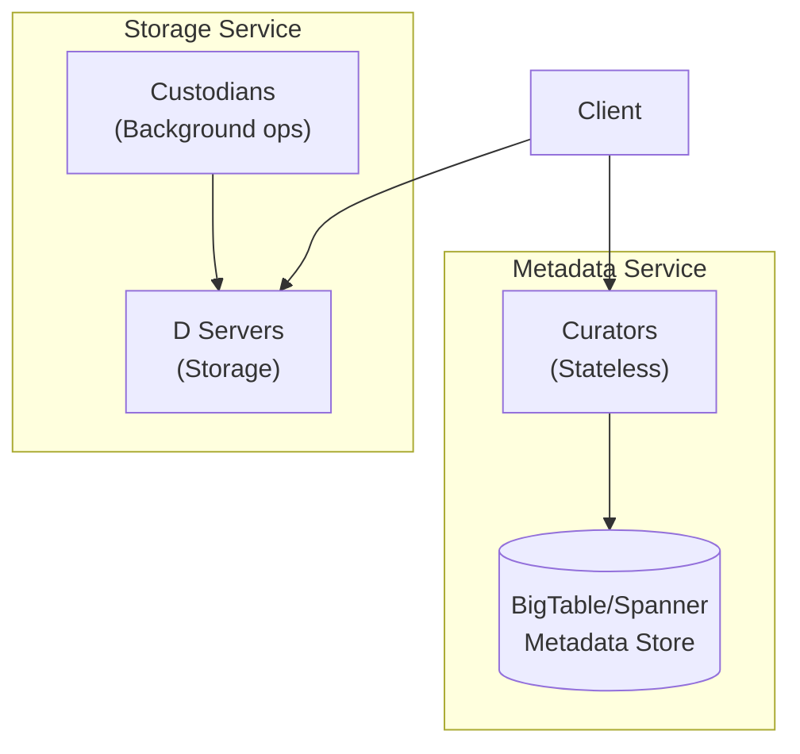
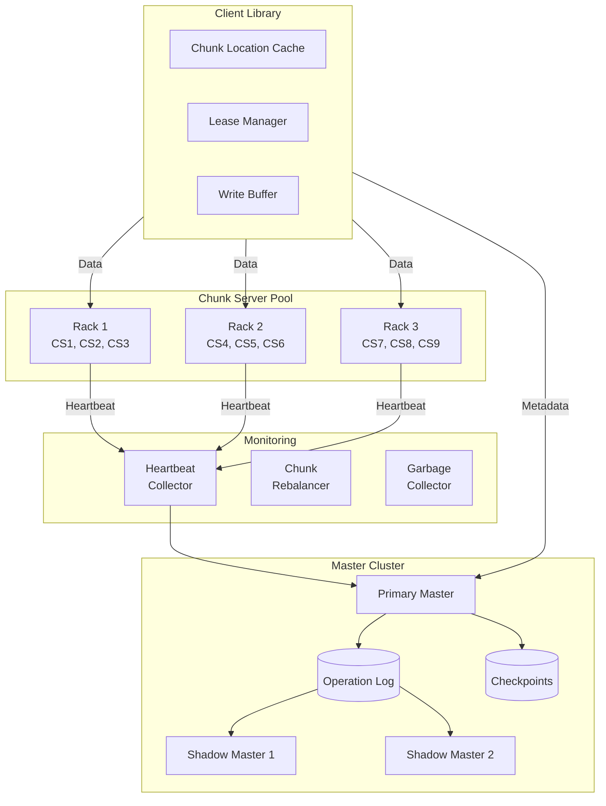
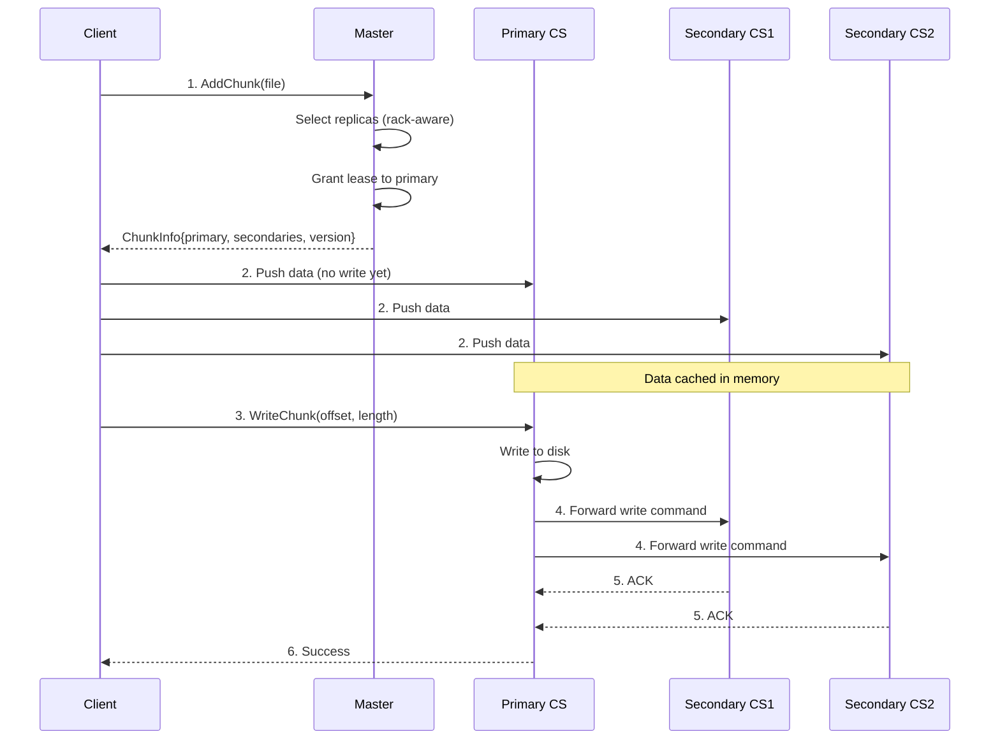
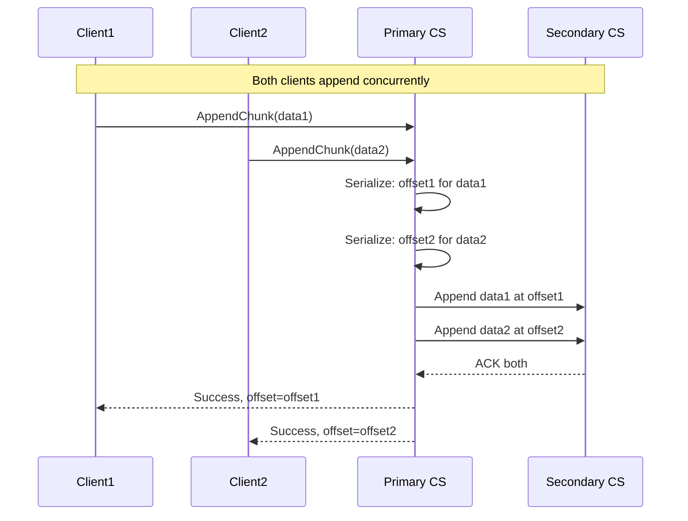
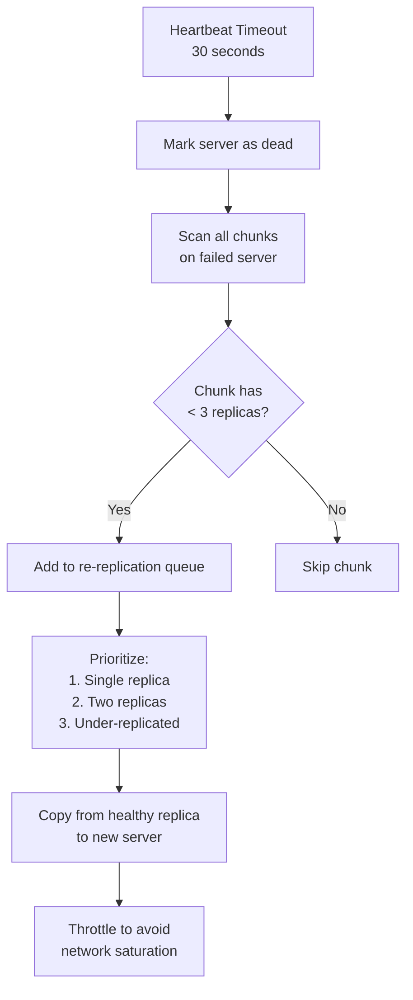
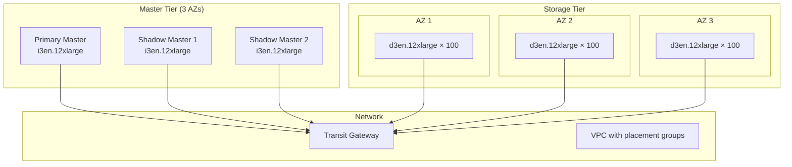

# Design a Distributed File System

A comprehensive system design for a distributed file system like GFS or HDFS covering metadata management, chunk storage, replication strategies, consistency models, and failure handling. This design addresses petabyte-scale storage with high throughput for batch processing workloads while maintaining fault tolerance across commodity hardware.

<figure>



<figcaption>High-level architecture: Clients query the master for chunk locations, then read/write directly to chunk servers. Writes pipeline through replicas.</figcaption>
</figure>

## Abstract

Distributed file systems solve the problem of storing and accessing files that exceed single-machine capacity while providing fault tolerance and high throughput. The core architectural tension is between **metadata scalability** (how many files can the system track) and **data throughput** (how fast can clients read/write).

**Core architectural decisions:**

| Decision | Choice | Rationale |
|----------|--------|-----------|
| Metadata management | Single master | Simplifies placement, enables global optimization |
| Chunk size | 64-128 MB | Amortizes metadata overhead, optimizes for large files |
| Replication | 3 replicas, rack-aware | Survives rack failure, balances write bandwidth |
| Consistency | Relaxed (defined regions) | Enables concurrent appends, simplifies implementation |
| Write model | Append-only preferred | Eliminates random write complexity, enables atomic appends |

**Key trade-offs accepted:**

- Single master limits metadata operations to ~10K ops/sec (sufficient for batch workloads)
- Large chunks waste space for small files and create hotspots
- Relaxed consistency requires application-level handling of duplicates

**What this design optimizes:**

- High throughput for large sequential reads/writes (100s MB/s per client)
- Automatic failure recovery with minimal data loss
- Linear storage scaling to petabytes

## Requirements

### Functional Requirements

| Requirement | Priority | Notes |
|-------------|----------|-------|
| File creation/deletion | Core | Hierarchical namespace |
| Large file read | Core | Multi-GB to TB files, sequential access |
| Large file write | Core | Streaming writes, immutable after close |
| Record append | Core | Multiple clients appending concurrently |
| Snapshot | Extended | Point-in-time copy for backups |
| Namespace operations | Extended | Rename, move, permissions |
| Small file support | Extended | Not optimized, but functional |

### Non-Functional Requirements

| Requirement | Target | Rationale |
|-------------|--------|-----------|
| Availability | 99.9% (3 nines) | Batch processing tolerates brief outages |
| Read throughput | 100+ MB/s per client | Saturate network, not disk |
| Write throughput | 50+ MB/s per client | Pipeline limits write speed |
| Append latency | p99 < 100ms | Real-time log ingestion |
| Durability | 99.9999% | Data survives multiple simultaneous failures |
| Recovery time | < 10 min for node failure | Re-replication must not overwhelm cluster |

### Scale Estimation

**Cluster size (large deployment):**

- Nodes: 1,000-5,000 chunk servers
- Storage per node: 12 × 4TB disks = 48TB raw
- Total raw capacity: 50,000 × 48TB = 2.4 PB per 50 nodes, scaling to 240 PB at 5,000 nodes
- Usable capacity (3x replication): ~80 PB at 5,000 nodes

**Files and chunks:**

- Files: 10 million (typical large deployment)
- Average file size: 1 GB
- Chunks per file: 1 GB / 64 MB = 16 chunks
- Total chunks: 160 million
- Metadata per chunk: ~150 bytes (GFS design)
- Total metadata: 160M × 150B = 24 GB (fits in master memory)

**Traffic:**

- Concurrent clients: 10,000
- Read-heavy workload: 90% reads, 10% writes
- Aggregate read throughput: 10,000 × 100 MB/s = 1 TB/s cluster-wide
- Aggregate write throughput: 1,000 × 50 MB/s = 50 GB/s cluster-wide

**Metadata operations:**

- File opens per second: 5,000-10,000
- Chunk location lookups: 50,000-100,000 per second (batch prefetch)

## Design Paths

### Path A: Single Master (GFS Model)

**Best when:**

- Metadata operations are not the bottleneck (batch processing)
- Simplicity and operational ease are priorities
- Global optimization of chunk placement is valuable
- File count is under 100 million

**Architecture:**



**Key characteristics:**

- All metadata in single master's memory
- Chunk locations not persisted—rebuilt from heartbeats on startup
- Operation log replicated to shadow masters
- Clients cache chunk locations, reducing master load

**Trade-offs:**

- ✅ Simple design, easy to reason about
- ✅ Global knowledge enables optimal placement
- ✅ Single point for consistency
- ❌ Memory limits file count (~100M files with 64GB RAM)
- ❌ Master CPU limits metadata ops (~10K ops/sec)
- ❌ Single point of failure (mitigated by shadows)

**Real-world example:** Google File System (2003-2010) used this model. Clusters grew to several thousand chunk servers and hundreds of terabytes before metadata limits became problematic. Google eventually replaced GFS with Colossus for exabyte-scale needs.

### Path B: Federated Masters (HDFS Federation)

**Best when:**

- Multiple independent workloads share infrastructure
- File count exceeds single-master memory limits
- Namespace isolation is desirable
- Gradual scaling without re-architecture is needed

**Architecture:**



**Key characteristics:**

- Each NameNode manages independent namespace
- Block pools are isolated per NameNode
- DataNodes serve all NameNodes
- No coordination between NameNodes

**Trade-offs:**

- ✅ Scales metadata horizontally
- ✅ Namespace isolation for multi-tenancy
- ✅ Incremental scaling
- ❌ No cross-namespace operations (hardlinks, moves)
- ❌ Uneven namespace utilization requires manual balancing
- ❌ Client must know which NameNode to contact

**Real-world example:** HDFS Federation was introduced in Hadoop 2.0 (2012). Yahoo deployed clusters with multiple NameNodes managing separate namespaces for different teams.

### Path C: Distributed Metadata (Colossus/Tectonic Model)

**Best when:**

- Exabyte-scale storage is required
- Billions of files are expected
- Multi-tenancy with strong isolation is critical
- Team has expertise in distributed databases

**Architecture:**



**Key characteristics:**

- Metadata in distributed database (BigTable, Spanner)
- Curators are stateless, scale horizontally
- Custodians handle background operations
- D servers are simple storage targets

**Trade-offs:**

- ✅ Exabyte scale, billions of files
- ✅ No single point of failure
- ✅ True horizontal scaling
- ❌ Complex multi-layer architecture
- ❌ Higher latency for metadata operations
- ❌ Requires distributed database expertise

**Real-world example:** Google Colossus (2010+) stores exabytes of data across Google's infrastructure. Facebook Tectonic (2021) consolidated multiple storage systems into one, reducing data warehouse clusters by 10x.

### Path Comparison

| Factor | Single Master | Federation | Distributed |
|--------|---------------|------------|-------------|
| Files | ~100M | ~1B (sum of namespaces) | Unlimited |
| Metadata ops/sec | 10K | 10K × N namespaces | 100K+ |
| Complexity | Low | Medium | High |
| Cross-namespace ops | N/A | No | Yes |
| Operational burden | Low | Medium | High |
| Best for | Most deployments | Large enterprises | Hyperscalers |

### This Article's Focus

This article focuses on **Path A (Single Master)** because:

1. It's the foundational model (GFS, early HDFS)
2. Sufficient for 95% of deployments (up to 100M files)
3. Simpler to understand and operate
4. Concepts transfer to federated/distributed models

Path B (Federation) is covered briefly in the scaling section. Path C (Distributed) requires a separate article on metadata-at-scale architectures.

## High-Level Design

### Component Overview



### Master Server

Manages all filesystem metadata and coordinates cluster operations.

**Responsibilities:**

- Namespace management (directory tree, file metadata)
- File-to-chunk mapping
- Chunk replica placement decisions
- Lease management for write coordination
- Garbage collection of orphaned chunks
- Re-replication of under-replicated chunks

**Design decisions:**

| Decision | Choice | Rationale |
|----------|--------|-----------|
| Metadata storage | In-memory | Sub-millisecond lookups, 64GB supports 100M files |
| Persistence | Operation log + checkpoints | Fast recovery, crash consistency |
| Chunk locations | Not persisted | Rebuilt from heartbeats in 30-60 seconds |
| Failover | Manual + shadow masters | Simplicity; automatic adds complexity |

**Memory layout (per 64GB master):**

| Data | Size | Count Supported |
|------|------|-----------------|
| Namespace tree | ~200 bytes/file | 100M files = 20GB |
| File→chunk mapping | ~100 bytes/file | 100M files = 10GB |
| Chunk metadata | ~64 bytes/chunk | 500M chunks = 32GB |
| **Total** | ~62GB | **100M files, 500M chunks** |

### Chunk Server

Stores chunks as local files and serves read/write requests.

**Responsibilities:**

- Store chunks as Linux files on local disks
- Serve read requests directly to clients
- Accept writes and forward in pipeline
- Report chunk inventory via heartbeat
- Compute and verify checksums
- Participate in re-replication

**Design decisions:**

| Decision | Choice | Rationale |
|----------|--------|-----------|
| Chunk storage | Local filesystem (ext4/xfs) | Leverage OS buffer cache, simple |
| Checksumming | 32KB blocks, CRC32C | Detect corruption before serving |
| Heartbeat interval | 3 seconds | Balance failure detection vs overhead |
| Chunk report | Piggyback on heartbeat | Reduce message count |

**Disk layout:**

```
/data/
├── disk1/
│   ├── chunks/
│   │   ├── chunk_abc123.dat    # 64MB chunk data
│   │   ├── chunk_abc123.crc    # Checksums (2KB for 64MB)
│   │   └── chunk_def456.dat
│   └── meta/
│       └── chunk_inventory.db   # Local SQLite for chunk metadata
├── disk2/
│   └── chunks/
└── disk12/
    └── chunks/
```

### Client Library

Provides file system interface and handles complexity of distributed operations.

**Responsibilities:**

- Translate file operations to master/chunk server RPCs
- Cache chunk locations (reduces master load 100x)
- Buffer writes for efficiency
- Handle retries and failover
- Implement record append semantics

**Design decisions:**

| Decision | Choice | Rationale |
|----------|--------|-----------|
| Location cache | LRU, 10K entries, 10min TTL | Reduces master load by 100x |
| Write buffer | 64MB (one chunk) | Batch small writes |
| Retry policy | Exponential backoff, 3 retries | Handle transient failures |
| Checksum verification | On read | Catch corruption early |

## API Design

### Master Server API

#### File Operations

**Create File:**

```
CreateFile(path: string, replication: int) → FileHandle
```

- Validates path, creates namespace entry
- Does not allocate chunks (lazy allocation)
- Returns handle with initial chunk locations

**Open File:**

```
OpenFile(path: string, mode: READ|WRITE|APPEND) → FileHandle
```

- For writes: grants lease to client
- Returns current chunk locations

**Delete File:**

```
DeleteFile(path: string) → void
```

- Marks file as deleted in namespace
- Actual chunk deletion via garbage collection (72-hour delay)

#### Chunk Operations

**Get Chunk Locations:**

```
GetChunkLocations(file: FileHandle, chunkIndex: int) → ChunkInfo
```

Response:

```json
{
  "chunkId": "chunk_abc123",
  "version": 42,
  "replicas": [
    {"server": "cs1.example.com:9000", "rack": "rack1"},
    {"server": "cs4.example.com:9000", "rack": "rack2"},
    {"server": "cs7.example.com:9000", "rack": "rack3"}
  ],
  "primary": "cs1.example.com:9000",
  "leaseExpiry": "2024-02-03T10:05:00Z"
}
```

**Add Chunk:**

```
AddChunk(file: FileHandle) → ChunkInfo
```

- Allocates new chunk ID
- Selects replica locations (rack-aware)
- Grants lease to one replica as primary

### Chunk Server API

**Read Chunk:**

```
ReadChunk(chunkId: string, offset: int, length: int) → bytes
```

- Verifies checksum before returning data
- Returns error if checksum fails (client retries other replica)

**Write Chunk:**

```
WriteChunk(chunkId: string, offset: int, data: bytes, replicas: []Server) → void
```

- Accepts data, writes to disk
- Forwards to next replica in pipeline
- Returns success only when all replicas confirm

**Append Chunk:**

```
AppendChunk(chunkId: string, data: bytes) → (offset: int, error)
```

- Primary determines offset
- Broadcasts to replicas
- Returns offset where data was appended
- If chunk doesn't have space, returns `ChunkFull` error

### Client API (User-Facing)

```python
class DistributedFileSystem:
    def create(path: str, replication: int = 3) -> File
    def open(path: str, mode: str = "r") -> File
    def delete(path: str) -> None
    def rename(src: str, dst: str) -> None
    def list(path: str) -> List[FileInfo]
    def mkdir(path: str) -> None
    def exists(path: str) -> bool

class File:
    def read(size: int = -1) -> bytes
    def write(data: bytes) -> int
    def append(data: bytes) -> int  # Returns offset
    def seek(offset: int) -> None
    def close() -> None
```

## Data Modeling

### Master Metadata Structures

**Namespace (in-memory tree):**

```go
type NamespaceNode struct {
    Name        string
    IsDirectory bool
    Children    map[string]*NamespaceNode  // For directories
    FileInfo    *FileMetadata               // For files
    Parent      *NamespaceNode

    // Access control
    Owner       string
    Group       string
    Permissions uint16
}

type FileMetadata struct {
    FileID      uint64
    Size        int64
    Replication int
    ChunkSize   int64  // Usually 64MB
    Chunks      []ChunkHandle
    CreatedAt   time.Time
    ModifiedAt  time.Time
}
```

**Chunk mapping (in-memory hash table):**

```go
type ChunkHandle uint64

type ChunkMetadata struct {
    Handle     ChunkHandle
    Version    uint64           // Incremented on each mutation
    Replicas   []ChunkServerID  // Current replica locations
    Primary    ChunkServerID    // Current lease holder
    LeaseExpiry time.Time
}

// Global map: O(1) lookup
var chunkTable map[ChunkHandle]*ChunkMetadata
```

### Operation Log Format

Persistent, append-only log for crash recovery:

```
[Timestamp][OpType][OpData]

Example entries:
[1706900000][CREATE_FILE]["/logs/2024/app.log", replication=3]
[1706900001][ADD_CHUNK][fileId=12345, chunkHandle=67890, version=1]
[1706900002][UPDATE_REPLICAS][chunkHandle=67890, replicas=[cs1,cs4,cs7]]
[1706900003][DELETE_FILE]["/tmp/old_file.dat"]
```

**Compaction:**

- Checkpoint: Serialize full in-memory state to disk
- Truncate log entries before checkpoint
- Frequency: Every 1M operations or 1 hour

### Chunk Server Local Storage

**Chunk file format:**

```
chunk_<handle>.dat:
[Data: 64MB or less]

chunk_<handle>.meta:
{
  "handle": 67890,
  "version": 42,
  "size": 67108864,
  "checksums": [
    {"offset": 0, "crc32c": "a1b2c3d4"},
    {"offset": 32768, "crc32c": "e5f6g7h8"},
    ...  // One per 32KB block
  ],
  "createdAt": "2024-02-03T10:00:00Z"
}
```

### Heartbeat Protocol

**Chunk server → Master (every 3 seconds):**

```json
{
  "serverId": "cs1.example.com:9000",
  "timestamp": 1706900000,
  "diskUsage": {
    "total": 48000000000000,
    "used": 32000000000000,
    "available": 16000000000000
  },
  "chunkReports": [
    {"handle": 67890, "version": 42, "size": 67108864},
    {"handle": 67891, "version": 15, "size": 33554432}
  ],
  "corruptChunks": [67892],
  "load": {
    "readOps": 150,
    "writeOps": 20,
    "networkBytesIn": 1073741824,
    "networkBytesOut": 5368709120
  }
}
```

**Master → Chunk server (response):**

```json
{
  "commands": [
    {"type": "DELETE", "chunks": [67893, 67894]},
    {"type": "REPLICATE", "chunk": 67895, "target": "cs5.example.com:9000"},
    {"type": "REPORT_FULL", "reason": "version_mismatch"}
  ]
}
```

## Low-Level Design

### Write Operation Flow

#### Standard Write



**Why separate data push from write command:**

1. Data flows directly to all replicas (parallel, saturates network)
2. Write command is small, serializes at primary
3. Primary controls ordering for concurrent writes
4. If replica fails, retry is cheap (data already pushed)

#### Record Append

Atomic append is the key differentiator from traditional file systems:



**Append semantics:**

- **At-least-once guarantee**: If append returns success, data is durably stored
- **Atomicity**: Each append is all-or-nothing (no partial appends)
- **Ordering**: Primary determines global order
- **Duplicates possible**: If primary fails after writing but before ACK, client retries → duplicate record

**Handling append failures:**

```
If replica fails during append:
1. Primary returns failure to client
2. Client retries (may retry different chunk if padding needed)
3. Some replicas may have the data, some may not
4. Result: "defined" region followed by "inconsistent" padding
```

### Consistency Model

GFS-style distributed file systems use a **relaxed consistency model**:

| After Operation | Consistent | Defined |
|-----------------|------------|---------|
| Write (single client) | Yes | Yes |
| Write (concurrent clients) | Yes | No (interleaved) |
| Record Append (success) | Yes | Yes (at some offset) |
| Record Append (failure) | No | No |

**Definitions:**

- **Consistent**: All replicas have identical data
- **Defined**: Data reflects exactly one client's write

**Application implications:**

1. Writers should use record append, not random writes
2. Readers must handle:
   - Duplicate records (use unique IDs + deduplication)
   - Partial records (use checksums in records)
   - Inconsistent regions (validate before processing)

**Example: Log file with concurrent appenders:**

```
[Record 1: app_id=A, seq=1, checksum=valid] ← Defined
[Record 2: app_id=B, seq=1, checksum=valid] ← Defined
[Padding: zeros or garbage]                  ← Inconsistent (skip)
[Record 3: app_id=A, seq=2, checksum=valid] ← Defined
[Record 1: app_id=A, seq=1, checksum=valid] ← Duplicate (skip)
```

### Replica Placement Algorithm

**Goals:**

1. Survive rack failure
2. Distribute load
3. Minimize cross-rack traffic for writes

**Algorithm (for 3 replicas):**

```python
def select_replicas(num_replicas: int, client_rack: str) -> List[Server]:
    replicas = []

    # First replica: prefer client's rack (if client is a chunk server)
    # or select least-loaded server
    if client_is_chunk_server and has_capacity(client_rack):
        replicas.append(select_server(client_rack))
    else:
        replicas.append(select_least_loaded_server())

    # Second replica: different rack
    rack2 = select_different_rack(replicas[0].rack)
    replicas.append(select_server(rack2))

    # Third replica: same rack as second (minimize cross-rack writes)
    replicas.append(select_server(rack2, exclude=replicas[1]))

    return replicas

def select_server(rack: str, exclude: Server = None) -> Server:
    candidates = [s for s in rack.servers
                  if s != exclude
                  and s.available_space > THRESHOLD
                  and s.recent_creates < RATE_LIMIT]

    # Balance by available space and recent activity
    return weighted_random(candidates, weight=available_space)
```

**Write bandwidth analysis:**

| Replica Placement | Cross-Rack Transfers |
|-------------------|---------------------|
| All same rack | 0 |
| Spread across 3 racks | 2 |
| 1 rack + 2 another rack | 1 |

The third approach (1 + 2) balances reliability and bandwidth.

### Failure Handling

#### Chunk Server Failure



**Re-replication throttling:**

- Limit: 10 MB/s per source server
- Reason: Prevent recovery traffic from impacting production reads
- Trade-off: Slower recovery vs. sustained availability

#### Master Failure

**Recovery process:**

1. **Shadow master detection**: Monitoring detects primary failure
2. **Promotion**: Operator (or automated system) promotes shadow
3. **Log replay**: Shadow applies any uncommitted log entries
4. **Chunk reports**: Wait for chunk servers to report (30-60 seconds)
5. **Resume operations**: Master accepts client requests

**Recovery time breakdown:**

| Phase | Duration |
|-------|----------|
| Detection | 10-30 seconds |
| Promotion decision | Manual: minutes, Auto: seconds |
| Log replay | Seconds (incremental) |
| Chunk reports | 30-60 seconds |
| **Total** | 1-5 minutes |

#### Data Corruption Detection

**Checksum verification:**

```python
BLOCK_SIZE = 32 * 1024  # 32KB

def write_chunk(chunk_id: str, data: bytes):
    # Compute checksums for each 32KB block
    checksums = []
    for i in range(0, len(data), BLOCK_SIZE):
        block = data[i:i+BLOCK_SIZE]
        checksums.append(crc32c(block))

    # Write data and checksums atomically
    write_file(f"{chunk_id}.dat", data)
    write_file(f"{chunk_id}.crc", checksums)

def read_chunk(chunk_id: str, offset: int, length: int) -> bytes:
    data = read_file(f"{chunk_id}.dat", offset, length)
    checksums = read_file(f"{chunk_id}.crc")

    # Verify each block
    for i in range(offset // BLOCK_SIZE, (offset + length) // BLOCK_SIZE + 1):
        block = data[i*BLOCK_SIZE:(i+1)*BLOCK_SIZE]
        if crc32c(block) != checksums[i]:
            raise CorruptionError(chunk_id, i)

    return data
```

**Corruption handling:**

1. Chunk server reports corruption to master
2. Master marks chunk as corrupt
3. Master initiates re-replication from healthy replica
4. Chunk server deletes corrupt chunk

### Garbage Collection

**Lazy deletion design:**

1. `DELETE /path/file` → File renamed to hidden name (`.deleted_<timestamp>_<filename>`)
2. After 72 hours: Master removes file metadata
3. During heartbeat: Master tells chunk servers to delete orphaned chunks

**Why 72-hour delay:**

- Allows recovery from accidental deletion
- Batches deletion operations
- Reduces master load

**Orphan detection:**

```python
def garbage_collect():
    # Collect all chunks referenced by files
    referenced_chunks = set()
    for file in all_files():
        referenced_chunks.update(file.chunks)

    # On each heartbeat, check chunk server's inventory
    for chunk_id in chunk_server.reported_chunks:
        if chunk_id not in referenced_chunks:
            # Tell chunk server to delete
            commands.append(DeleteChunk(chunk_id))
```

## Frontend Considerations

While distributed file systems are primarily backend infrastructure, client-facing considerations exist:

### Batch Processing Integration

**MapReduce/Spark data locality:**

```python
def get_input_splits(file_path: str) -> List[InputSplit]:
    """Return splits with location hints for scheduler."""
    splits = []
    for chunk in file.chunks:
        locations = master.get_chunk_locations(chunk)
        splits.append(InputSplit(
            chunk_id=chunk.id,
            offset=0,
            length=chunk.size,
            # Scheduler prefers these hosts
            preferred_locations=[loc.host for loc in locations]
        ))
    return splits
```

**Data locality statistics:**

| Locality Level | Typical Rate | Impact |
|----------------|--------------|--------|
| Node-local | 70-90% | Zero network for read |
| Rack-local | 95-99% | Low network overhead |
| Off-rack | 1-5% | Full network cost |

### CLI and Admin Tools

**Essential operations:**

```bash
# File operations
dfs put local_file.txt /hdfs/path/file.txt
dfs get /hdfs/path/file.txt local_file.txt
dfs ls /hdfs/path/
dfs rm /hdfs/path/file.txt

# Admin operations
dfs fsck /path              # Check file system health
dfs balancer                # Rebalance data across servers
dfs report                  # Cluster utilization report
dfs safemode enter|leave    # Maintenance mode
```

### Monitoring Dashboard Metrics

**Key metrics for operators:**

| Metric | Warning Threshold | Critical Threshold |
|--------|-------------------|-------------------|
| Under-replicated blocks | > 100 | > 1000 |
| Corrupt blocks | > 0 | > 10 |
| Dead nodes | > 0 | > N × 0.05 |
| Capacity used | > 70% | > 85% |
| Pending replications | > 10000 | > 100000 |
| Master heap usage | > 70% | > 85% |

## Infrastructure

### Cloud-Agnostic Components

| Component | Purpose | Options |
|-----------|---------|---------|
| Master storage | Operation log, checkpoints | Local SSD, NFS, cloud block storage |
| Chunk storage | Data storage | Local HDD/SSD arrays |
| Network | Data transfer | 10-100 Gbps, leaf-spine topology |
| Monitoring | Health, metrics | Prometheus, Grafana, Datadog |
| Configuration | Cluster config | ZooKeeper, etcd, Consul |

### Hardware Recommendations

**Master server (per server):**

| Component | Specification | Rationale |
|-----------|---------------|-----------|
| CPU | 32+ cores | Metadata operations are CPU-bound |
| Memory | 128-256 GB | All metadata in RAM |
| Storage | 2× NVMe SSD (RAID 1) | Operation log durability |
| Network | 25 Gbps | Heartbeat + client traffic |

**Chunk server (per server):**

| Component | Specification | Rationale |
|-----------|---------------|-----------|
| CPU | 8-16 cores | I/O bound, not CPU bound |
| Memory | 64-128 GB | OS buffer cache |
| Storage | 12-24× 4-16 TB HDD | Cost-effective bulk storage |
| Network | 25-100 Gbps | Saturate disk throughput |

### Capacity Planning

**Cluster sizing formula:**

```
Raw capacity needed = Data size × Replication factor
                    = 100 PB × 3 = 300 PB

Servers needed = Raw capacity / Capacity per server
               = 300 PB / 48 TB = 6,250 servers

Network capacity = Expected throughput × Headroom
                 = 1 TB/s × 2 = 2 TB/s aggregate
                 = ~200 servers at 10 Gbps each (network limited)
```

### AWS Reference Architecture



**Instance selection:**

| Role | Instance | vCPUs | Memory | Storage | Network |
|------|----------|-------|--------|---------|---------|
| Master | i3en.12xlarge | 48 | 384 GB | 4× 7.5TB NVMe | 50 Gbps |
| Chunk Server | d3en.12xlarge | 48 | 192 GB | 12× 14TB HDD | 50 Gbps |

**Cost comparison (300 servers, 3-year reserved):**

| Component | Monthly Cost |
|-----------|--------------|
| d3en.12xlarge × 297 | ~$400K |
| i3en.12xlarge × 3 | ~$8K |
| Network (inter-AZ) | ~$50K |
| **Total** | ~$460K/month |

**Alternative: Self-hosted on-prem often 60-70% cheaper for sustained workloads.**

## Conclusion

This design provides a distributed file system capable of:

1. **Petabyte-scale storage** across thousands of commodity servers
2. **100+ MB/s throughput** per client for large sequential operations
3. **Fault tolerance** surviving simultaneous disk, server, and rack failures
4. **Atomic record append** enabling concurrent producers without coordination

**Key architectural decisions:**

- Single master with in-memory metadata enables global optimization but limits scale to ~100M files
- Large chunks (64-128 MB) optimize for batch processing but penalize small files
- Relaxed consistency trades simplicity for application-level complexity (deduplication, checksums)
- Append-only design eliminates random write complexity

**Known limitations:**

- Single master is metadata bottleneck (addressed by federation or distributed metadata)
- Large chunks waste space for small files (addressed by tiered storage)
- No strong consistency for concurrent writes (acceptable for batch workloads)

**When to use alternatives:**

| Requirement | Better Choice |
|-------------|---------------|
| Many small files (millions of < 1MB) | Object storage (S3, MinIO) |
| POSIX semantics required | CephFS, Lustre |
| Real-time random reads | Key-value stores (Cassandra, DynamoDB) |
| Exabyte scale | Colossus-style distributed metadata |

## Appendix

### Prerequisites

- Storage fundamentals (RAID, replication, erasure coding)
- Distributed systems basics (consensus, failure detection)
- Networking (TCP, datacenter topology)

### Terminology

| Term | Definition |
|------|------------|
| **Chunk** | Fixed-size unit of file data (64-128 MB), called "block" in HDFS |
| **Master** | Server managing metadata, called "NameNode" in HDFS |
| **Chunk Server** | Server storing chunk data, called "DataNode" in HDFS |
| **Lease** | Time-limited grant to a client for write operations |
| **Operation Log** | Append-only journal of metadata changes for recovery |
| **Checkpoint** | Snapshot of in-memory metadata state |
| **Rack-aware** | Placement strategy considering physical rack topology |
| **Re-replication** | Process of copying chunks to restore replication factor |

### Summary

- **Architecture**: Single master manages metadata in-memory; chunk servers store data as local files
- **Chunk size**: 64-128 MB balances metadata overhead against small file efficiency
- **Replication**: 3 replicas across 2 racks survives rack failure with one cross-rack write
- **Consistency**: Relaxed model with atomic record append; applications handle duplicates
- **Write flow**: Data pushed in parallel, write command serialized at primary
- **Failure handling**: Heartbeat detection, re-replication throttled to preserve production traffic

### References

**Original Papers:**

- [The Google File System](https://research.google/pubs/pub51/) - Ghemawat, Gobioff, Leung (SOSP 2003)
- [HDFS Architecture Guide](https://hadoop.apache.org/docs/current/hadoop-project-dist/hadoop-hdfs/HdfsDesign.html) - Apache Hadoop Documentation

**Production Systems:**

- [A Peek Behind Colossus, Google's File System](https://cloud.google.com/blog/products/storage-data-transfer/a-peek-behind-colossus-googles-file-system) - Google Cloud Blog (2021)
- [Consolidating Facebook Storage Infrastructure with Tectonic](https://engineering.fb.com/2021/06/21/data-infrastructure/tectonic-file-system/) - Meta Engineering (2021)
- [HDFS Federation](https://hadoop.apache.org/docs/current/hadoop-project-dist/hadoop-hdfs/Federation.html) - Apache Hadoop
- [HDFS High Availability with QJM](https://hadoop.apache.org/docs/stable/hadoop-project-dist/hadoop-hdfs/HDFSHighAvailabilityWithQJM.html) - Apache Hadoop
- [HDFS Erasure Coding](https://hadoop.apache.org/docs/stable/hadoop-project-dist/hadoop-hdfs/HDFSErasureCoding.html) - Apache Hadoop

**Architecture Analysis:**

- [MIT 6.824: GFS Lecture](https://pdos.csail.mit.edu/6.824/notes/l-gfs.txt) - MIT Distributed Systems Course
- [GFS FAQ](https://pdos.csail.mit.edu/6.824/papers/gfs-faq.txt) - MIT PDOS

**Related Concepts:**

- Erasure coding vs replication - Trade-offs for fault tolerance in distributed storage
- Consistent hashing - Data distribution pattern used in many distributed systems
