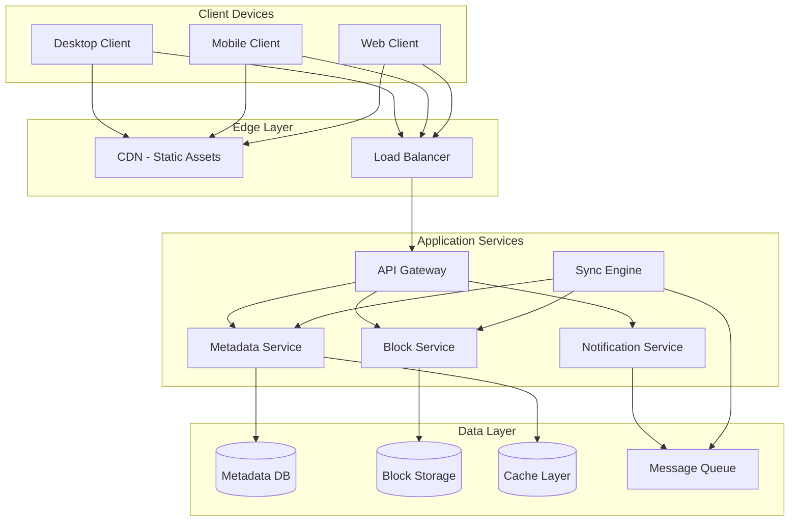
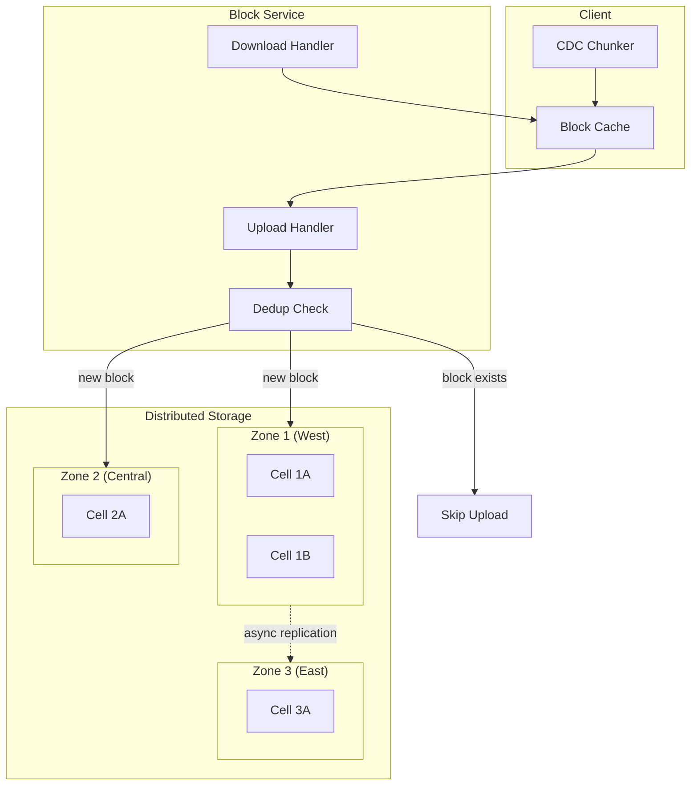
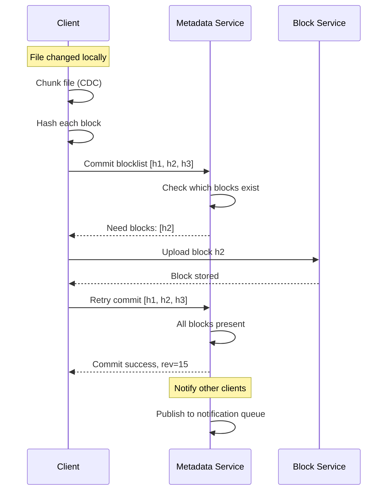

# Design Dropbox File Sync

A system design for a file synchronization service that keeps files consistent across multiple devices. This design addresses the core challenges of efficient data transfer, conflict resolution, and real-time synchronization at scale—handling 500+ petabytes of data across 700 million users.

<figure>



<figcaption>High-level architecture: clients sync through API gateway to metadata and block services, with real-time notifications via message queue.</figcaption>
</figure>

## Abstract

File sync is fundamentally a **distributed state reconciliation** problem with three key insights:

1. **Content-defined chunking** breaks files at content-determined boundaries (not fixed offsets), so insertions don't invalidate all subsequent chunks—enabling ~90% deduplication across file versions
2. **Three-tree model** (local, remote, synced) provides an unambiguous merge base to determine change direction without conflicts
3. **Block-level addressing** (content hash as ID) makes upload idempotent and enables cross-user deduplication at petabyte scale

The critical tradeoff: **eventual consistency with conflict preservation**. Rather than complex merge algorithms, create "conflicted copies" when concurrent edits occur—simple, predictable, and avoids data loss.

## Requirements

### Functional Requirements

| Feature              | Priority | Scope                  |
| -------------------- | -------- | ---------------------- |
| File upload/download | Core     | Full implementation    |
| Cross-device sync    | Core     | Full implementation    |
| Selective sync       | Core     | Full implementation    |
| File versioning      | Core     | 30-day history         |
| Conflict handling    | Core     | Conflicted copies      |
| Shared folders       | High     | Full implementation    |
| Link sharing         | High     | Read/write permissions |
| LAN sync             | Medium   | P2P optimization       |
| Offline access       | Medium   | Client-side            |
| Search               | Low      | Metadata only          |

### Non-Functional Requirements

| Requirement                | Target                    | Rationale                    |
| -------------------------- | ------------------------- | ---------------------------- |
| Availability               | 99.99%                    | Business-critical data       |
| Sync latency (same region) | p50 < 2s, p99 < 10s       | User perception threshold    |
| Upload throughput          | 100 MB/s per client       | Saturate typical connections |
| Storage durability         | 99.9999999999% (12 nines) | Data loss is unacceptable    |
| Consistency                | Eventual (< 5s typical)   | Acceptable for file sync     |
| Deduplication ratio        | > 2:1 cross-user          | Storage cost optimization    |

### Scale Estimation

**Users:**

- Registered users: 700M
- DAU: 70M (10% of registered)
- Peak concurrent: 7M

**Files:**

- Files per user: 5,000 average
- Total files: 3.5 trillion
- New files per day: 1.2B

**Storage:**

- Average file size: 150KB
- Total storage: 500PB+
- Daily ingress: 180TB (1.2B × 150KB)

**Traffic:**

- Metadata operations: 10M RPS (reads dominate)
- Block uploads: 500K RPS
- Block downloads: 2M RPS
- Notification connections: 7M concurrent WebSockets

## Design Paths

### Path A: Block-Based Sync (Chosen)

**Best when:**

- Large files that change incrementally (documents, code repositories)
- Cross-user deduplication is valuable
- Bandwidth optimization is critical

**Architecture:** Files split into content-defined chunks (~4MB blocks), each identified by content hash. Only changed blocks transfer.

**Key characteristics:**

- Deduplication at block level
- Delta sync requires only changed blocks
- Block storage can be globally deduplicated

**Trade-offs:**

- ✅ 2,500x bandwidth reduction for incremental changes
- ✅ Cross-user deduplication (identical blocks stored once)
- ✅ Resumable uploads (block-level checkpointing)
- ❌ Complexity in chunking algorithms
- ❌ Small file overhead (metadata > content for tiny files)
- ❌ Client CPU cost for hashing

**Real-world example:** Dropbox uses 4MB blocks with SHA-256 hashing. Magic Pocket stores 500+ PB with 600K+ drives, achieving significant deduplication across their user base.

### Path B: Whole-File Sync

**Best when:**

- Small files only (< 1MB average)
- Simple implementation required
- Files rarely modified (write-once)

**Architecture:** Files uploaded/downloaded atomically. No chunking.

**Trade-offs:**

- ✅ Simple implementation
- ✅ Lower client CPU (no chunking)
- ❌ No delta sync (full re-upload on any change)
- ❌ No cross-file deduplication
- ❌ Large files block on full transfer

**Real-world example:** Simple cloud storage for photos (Google Photos initially) where files are write-once and relatively small.

### Path Comparison

| Factor               | Block-Based             | Whole-File          |
| -------------------- | ----------------------- | ------------------- |
| Delta sync           | Yes (block-level)       | No                  |
| Deduplication        | Cross-user, cross-file  | None                |
| Bandwidth efficiency | High (2,500x for edits) | Low                 |
| Client complexity    | High                    | Low                 |
| Small file overhead  | Higher                  | None                |
| Best for             | Documents, code         | Photos, small media |

### This Article's Focus

This article focuses on **Path A (Block-Based Sync)** because file sync services primarily handle documents and files that change incrementally, where bandwidth optimization provides the most value.

## High-Level Design

### Client Architecture: Three Trees Model

The sync engine maintains three tree structures representing file state:

```
┌─────────────────────────────────────────────────────────────┐
│                    Client Sync Engine                        │
├─────────────────┬─────────────────┬─────────────────────────┤
│   Local Tree    │   Synced Tree   │      Remote Tree        │
│  (disk state)   │  (merge base)   │   (server state)        │
├─────────────────┼─────────────────┼─────────────────────────┤
│ file.txt (v3)   │ file.txt (v2)   │ file.txt (v2)           │
│ new.txt         │      -          │       -                 │
│      -          │ deleted.txt     │       -                 │
└─────────────────┴─────────────────┴─────────────────────────┘
```

**Why three trees?** Without a synced tree (merge base), you cannot distinguish:

- "User deleted file locally" vs "File was never synced here"
- "User created file locally" vs "File deleted on server"

**Sync algorithm:**

1. Compare Local vs Synced → detect local changes
2. Compare Remote vs Synced → detect remote changes
3. Apply non-conflicting changes bidirectionally
4. Handle conflicts (see Conflict Resolution section)

**Node identification:** Files identified by unique ID (not path), enabling O(1) atomic directory renames instead of O(n) path updates.

### Chunking: Content-Defined Chunking (CDC)

Fixed-size chunking fails catastrophically when content is inserted:

```
Fixed chunking (4-byte blocks):
Before: [ABCD][EFGH][IJKL]
Insert X at position 2:
After:  [ABXC][DEFG][HIJK][L...]  ← All blocks change!

Content-defined chunking:
Before: [ABC|DEF|GHIJ]  (boundaries at content patterns)
Insert X at position 2:
After:  [ABXC|DEF|GHIJ]  ← Only first block changes
```

#### Gear Hash Algorithm

Dropbox and modern implementations use **Gear hash** for chunk boundary detection:

```typescript
// Gear hash: FP_i = (FP_{i-1} << 1) + GearTable[byte]
const GEAR_TABLE: Uint32Array = new Uint32Array(256) // Random values

function findChunkBoundary(
  data: Uint8Array,
  minSize: number,
  maxSize: number,
  mask: number, // e.g., 0x1FFF for ~8KB average
): number {
  let fp = 0

  // Skip minimum chunk size (cut-point skipping optimization)
  for (let i = 0; i < Math.min(minSize, data.length); i++) {
    fp = ((fp << 1) + GEAR_TABLE[data[i]]) >>> 0
  }

  // Search for boundary
  for (let i = minSize; i < Math.min(maxSize, data.length); i++) {
    fp = ((fp << 1) + GEAR_TABLE[data[i]]) >>> 0
    if ((fp & mask) === 0) {
      return i + 1 // Boundary found
    }
  }

  return Math.min(maxSize, data.length) // Force boundary at max
}
```

**Performance:** Gear hash performs 1 ADD + 1 SHIFT + 1 array lookup per byte, vs Rabin's 2 XORs + 2 SHIFTs + 2 lookups. FastCDC achieves **10x faster** than Rabin-based CDC.

**Chunk parameters:**
| Parameter | Typical Value | Rationale |
|-----------|---------------|-----------|
| Min chunk | 2KB | Avoid tiny chunks |
| Average chunk | 8KB (small files) / 4MB (large files) | Balance dedup vs overhead |
| Max chunk | 64KB / 16MB | Bound worst-case |
| Mask bits | 13 (8KB avg) | 2^13 = 8192 expected bytes between boundaries |

**Dropbox specifics:** 4MB blocks, SHA-256 content hash as block identifier.

### Block Storage Architecture

<figure>



<figcaption>Block storage with three-zone replication. Blocks stored in at least 2 zones within 1 second, third zone async.</figcaption>
</figure>

**Block addressing:** Content hash (SHA-256) as block ID. Two identical blocks anywhere in the system share storage.

**Storage hierarchy:**

1. **Block** (4MB max): Unit of upload/download, content-addressed
2. **Bucket** (1GB): Aggregation of blocks for efficient disk I/O
3. **Cell** (~50-100PB): Failure domain, independent replication
4. **Zone**: Geographic region

**Durability math:**

- 3-zone replication
- Within each zone: erasure coding or replication
- Target: 99.9999999999% annual durability (< 1 block lost per 100 billion)

### Metadata Service

Metadata operations dominate traffic (10:1 vs block operations). Design for high read throughput.

#### Schema Design

```sql
-- File metadata (sharded by namespace_id)
CREATE TABLE files (
    namespace_id    BIGINT NOT NULL,      -- User/shared folder
    file_id         UUID NOT NULL,        -- Stable identifier
    path            TEXT NOT NULL,        -- Current path (mutable)
    blocklist       UUID[] NOT NULL,      -- Ordered list of block hashes
    size            BIGINT NOT NULL,
    content_hash    BYTEA NOT NULL,       -- Hash of concatenated blocks
    modified_at     TIMESTAMPTZ NOT NULL,
    revision        BIGINT NOT NULL,      -- Monotonic version
    is_deleted      BOOLEAN DEFAULT FALSE,

    PRIMARY KEY (namespace_id, file_id)
);

-- Enables path lookups within namespace
CREATE INDEX idx_files_path ON files(namespace_id, path)
    WHERE NOT is_deleted;

-- Journal for sync cursor (append-only)
CREATE TABLE journal (
    namespace_id    BIGINT NOT NULL,
    journal_id      BIGINT NOT NULL,      -- Monotonic cursor
    file_id         UUID NOT NULL,
    operation       VARCHAR(10) NOT NULL, -- 'create', 'modify', 'delete', 'move'
    timestamp       TIMESTAMPTZ NOT NULL,

    PRIMARY KEY (namespace_id, journal_id)
);
```

**Sharding strategy:** By `namespace_id` (user account or shared folder). Co-locates all user's files on same shard.

**Journal pattern:** Clients track sync position via `journal_id`. On reconnect, fetch all changes since last cursor—O(changes) not O(files).

#### Caching Strategy

```
┌────────────────────────────────────────────────────────────┐
│                    Cache Hierarchy                          │
├──────────────────┬──────────────────┬──────────────────────┤
│   Client Cache   │   Edge Cache     │   Origin Cache       │
│   (SQLite)       │   (Regional)     │   (Global)           │
├──────────────────┼──────────────────┼──────────────────────┤
│ Full tree state  │ Hot metadata     │ Frequently accessed  │
│ Block cache      │ TTL: 5 seconds   │ TTL: 30 seconds      │
│ Offline access   │ Namespace-keyed  │ File-id keyed        │
└──────────────────┴──────────────────┴──────────────────────┘
```

**Invalidation:** Write-through to cache on metadata mutations. Short TTL acceptable because clients reconcile via journal cursor.

### Notification Service

Real-time sync requires push notifications when remote changes occur.

**Options:**

| Mechanism    | Latency | Connections          | Use Case         |
| ------------ | ------- | -------------------- | ---------------- |
| Polling      | 5-30s   | Stateless            | Simple, legacy   |
| Long polling | 1-5s    | Semi-persistent      | Moderate scale   |
| WebSocket    | < 100ms | Persistent           | Real-time sync   |
| SSE          | < 100ms | Persistent (one-way) | Server push only |

**Chosen: WebSocket with fallback to long polling**

**Connection scaling:**

- 7M concurrent connections at peak
- Each connection: ~10KB memory
- Total: ~70GB memory for connection state
- Horizontal scaling via connection affinity (consistent hashing on user_id)

**Notification payload (minimal):**

```json
{
  "namespace_id": "ns_abc123",
  "journal_id": 158293,
  "hint": "file_changed" // Client fetches details via API
}
```

Keep payloads minimal—notification triggers sync, doesn't contain data.

## API Design

### Sync Flow APIs

#### List Changes (Cursor-Based)

```
GET /api/v2/files/list_folder/continue
```

**Request:**

```json
{
  "cursor": "AAGvR5..." // Opaque cursor encoding (namespace_id, journal_id)
}
```

**Response:**

```json
{
  "entries": [
    {
      "tag": "file",
      "id": "id:abc123",
      "path_display": "/Documents/report.pdf",
      "rev": "015a3e0c4b650000000",
      "size": 1048576,
      "content_hash": "e3b0c44298fc1c149afbf4c8996fb924...",
      "server_modified": "2024-01-15T10:30:00Z"
    },
    {
      "tag": "deleted",
      "id": "id:def456",
      "path_display": "/old-file.txt"
    }
  ],
  "cursor": "AAGvR6...",
  "has_more": false
}
```

**Why cursor-based:**

- Stable under concurrent modifications
- Client can disconnect/reconnect and resume exactly
- O(1) database lookup vs O(n) offset skip

#### Upload Session (Block-Based)

**Phase 1: Start session**

```
POST /api/v2/files/upload_session/start
```

```json
{
  "session_type": "concurrent", // Allows parallel block uploads
  "content_hash": "e3b0c44..." // Optional: skip if file unchanged
}
```

**Phase 2: Append blocks (parallelizable)**

```
POST /api/v2/files/upload_session/append_v2
Content-Type: application/octet-stream
Dropbox-API-Arg: {"cursor": {"session_id": "...", "offset": 0}}

[4MB binary block data]
```

**Phase 3: Finish and commit**

```
POST /api/v2/files/upload_session/finish
```

```json
{
  "cursor": { "session_id": "...", "offset": 12582912 },
  "commit": {
    "path": "/Documents/large-file.zip",
    "mode": "overwrite",
    "mute": false // true = don't notify other clients immediately
  }
}
```

**Response includes block deduplication:**

```json
{
  "id": "id:abc123",
  "size": 12582912,
  "blocks_reused": 2, // Blocks already existed
  "blocks_uploaded": 1, // New blocks stored
  "bytes_transferred": 4194304 // Only new block data
}
```

### Block Sync Protocol

<figure>



<figcaption>Upload flow: commit blocklist first, upload only missing blocks, then finalize. Streaming sync allows downloads to begin before upload completes.</figcaption>
</figure>

**Streaming sync optimization:** Clients can prefetch blocks from partial blocklists before commit finalizes—reduces end-to-end sync time by 2x for large files.

## Low-Level Design: Conflict Resolution

### Conflict Detection

Conflicts occur when both local and remote trees changed the same file since the synced tree state:

```
Timeline:
t0: Synced tree = {file.txt, rev=5}
t1: Local edit  → Local tree = {file.txt, rev=5, modified}
t2: Remote edit → Remote tree = {file.txt, rev=6}
t3: Sync attempt → CONFLICT (local modified, remote also modified)
```

**Detection algorithm:**

```python
def detect_conflict(local: Node, remote: Node, synced: Node) -> ConflictType:
    local_changed = local != synced
    remote_changed = remote != synced

    if not local_changed:
        return ConflictType.NONE  # Apply remote
    if not remote_changed:
        return ConflictType.NONE  # Apply local
    if local == remote:
        return ConflictType.NONE  # Same change, no conflict

    # Both changed differently
    if local.is_delete and remote.is_delete:
        return ConflictType.NONE  # Both deleted, no conflict
    if local.is_delete or remote.is_delete:
        return ConflictType.EDIT_DELETE

    return ConflictType.EDIT_EDIT
```

### Conflict Resolution Strategy

**Chosen approach: Conflicted copies**

When conflict detected:

1. Keep the remote version at original path
2. Create local version as `filename (Computer Name's conflicted copy YYYY-MM-DD).ext`
3. User manually resolves by keeping preferred version

**Why not auto-merge:**

- File formats are opaque (binary, proprietary)
- Wrong merge = data corruption (worse than duplicate)
- User knows intent; algorithm cannot
- Simple, predictable behavior

**Alternative strategies (not chosen):**

| Strategy                   | Pros             | Cons                       | Use Case           |
| -------------------------- | ---------------- | -------------------------- | ------------------ |
| Last-write-wins            | Simple           | Data loss                  | Logs, non-critical |
| Vector clocks              | Tracks causality | Complex, metadata overhead | Distributed DBs    |
| CRDTs                      | Auto-merge       | Limited data types         | Collaborative text |
| OT (Operational Transform) | Real-time collab | Extreme complexity         | Google Docs        |

### Edge Cases

**Edit-delete conflict:**

- Remote deleted, local edited → Restore file with local edits
- Local deleted, remote edited → Keep remote version, local delete is lost

**Directory conflicts:**

- Move vs edit: Apply move, file content syncs to new location
- Move vs move: Create conflicted folder name
- Delete folder with unsynced children: Preserve unsynced files in special recovery folder

**Rename loops:**

- A renames folder X→Y, B renames Y→X simultaneously
- Resolution: Arbitrary tiebreaker (lexicographic on device ID)

## Low-Level Design: Delta Sync

For files that change incrementally (e.g., appending to logs, editing documents), transferring only the diff provides massive bandwidth savings.

### Block-Level Delta

When a file changes, recompute chunk boundaries:

```
Before: [Block A][Block B][Block C]
        (hash_a) (hash_b) (hash_c)

Edit middle of Block B:

After:  [Block A][Block B'][Block C]
        (hash_a) (hash_b') (hash_c)

Blocks to upload: only Block B' (hash_b')
Bandwidth saved: 66% (2 of 3 blocks reused)
```

**Content-defined chunking is critical:** Fixed-size chunks would shift all boundaries after an insertion, invalidating all subsequent blocks.

### Sub-Block Delta (Binary Diff)

For further optimization within changed blocks, use rsync-style rolling checksums:

```python
def compute_delta(old_block: bytes, new_block: bytes) -> Delta:
    """Rsync algorithm: find matching regions, send only diffs."""
    BLOCK_SIZE = 700  # Rolling checksum window

    # Build index of old block's checksums
    old_checksums = {}
    for i in range(0, len(old_block) - BLOCK_SIZE, BLOCK_SIZE):
        weak = adler32(old_block[i:i+BLOCK_SIZE])
        strong = sha256(old_block[i:i+BLOCK_SIZE])
        old_checksums[weak] = (i, strong)

    # Scan new block with rolling checksum
    delta = []
    i = 0
    while i < len(new_block) - BLOCK_SIZE:
        weak = rolling_adler32(new_block, i, BLOCK_SIZE)

        if weak in old_checksums:
            offset, expected_strong = old_checksums[weak]
            actual_strong = sha256(new_block[i:i+BLOCK_SIZE])

            if actual_strong == expected_strong:
                # Match found - emit COPY instruction
                delta.append(Copy(source_offset=offset, length=BLOCK_SIZE))
                i += BLOCK_SIZE
                continue

        # No match - emit literal byte
        delta.append(Literal(new_block[i]))
        i += 1

    return delta
```

**Rolling checksum:** Adler-32 based, can update in O(1) as window slides:

```
a(i+1, i+n) = a(i, i+n-1) - old_byte + new_byte
b(i+1, i+n) = b(i, i+n-1) - n*old_byte + a(i+1, i+n)
checksum = b * 65536 + a
```

**Real-world impact:** Binary diff on a 100MB database file with 1KB change: ~2KB transfer instead of 100MB (**50,000x reduction**).

## Low-Level Design: Bandwidth Optimization

### Compression Pipeline

Dropbox's **Broccoli** (modified Brotli) achieves 30% bandwidth savings:

```
┌─────────────────────────────────────────────────────┐
│              Compression Pipeline                    │
├─────────────────────────────────────────────────────┤
│ 1. Chunk file (CDC)                                 │
│ 2. Compress each chunk independently (parallel)     │
│ 3. Concatenate compressed streams                   │
│ 4. Upload concatenated result                       │
├─────────────────────────────────────────────────────┤
│ Broccoli modifications:                             │
│ - Uncompressed meta-block header for context        │
│ - Disabled dictionary references across blocks      │
│ - Enables parallel compression + concatenation      │
└─────────────────────────────────────────────────────┘
```

**Performance impact:**
| Metric | Before Broccoli | After Broccoli |
|--------|-----------------|----------------|
| Upload bandwidth | 100% | ~70% (30% savings) |
| Download bandwidth | 100% | ~85% (15% savings) |
| p50 upload latency | baseline | 35% faster |
| p50 download latency | baseline | 50% faster |

### LAN Sync

When multiple clients on same LAN have the same blocks, transfer locally instead of through cloud:

**Discovery:** UDP broadcast on port 17500 (IANA-reserved for Dropbox)

**Protocol:**

```
GET https://<lan-peer>/blocks/{namespace_id}/{block_hash}
Authorization: Bearer <namespace-scoped-certificate>
```

**Security:** Per-namespace SSL certificates issued by Dropbox servers, rotated when shared folder membership changes. Prevents unauthorized block access even on local network.

**Bandwidth savings:** 100% of block data stays on LAN for shared team folders.

### Upload Prioritization

Not all files are equal. Prioritize based on:

1. **User-initiated actions** (explicit upload) > Background sync
2. **Small files** > Large files (faster perceived completion)
3. **Recently modified** > Old files
4. **Active documents** > Archives

**Implementation:** Priority queue with aging to prevent starvation.

## Frontend Considerations

### Desktop Client Architecture

```
┌────────────────────────────────────────────────────────────┐
│                    Desktop Client                           │
├──────────────────────────────────────────────────────────────┤
│  ┌─────────────┐  ┌─────────────┐  ┌─────────────────────┐  │
│  │ File System │  │ Sync Engine │  │ Network Layer       │  │
│  │ Watcher     │  │             │  │                     │  │
│  │             │  │ Three Trees │  │ HTTP/2 multiplexing │  │
│  │ inotify/    │──│ Reconciler  │──│ WebSocket notify    │  │
│  │ FSEvents    │  │             │  │ Block upload/down   │  │
│  │             │  │ Conflict    │  │                     │  │
│  │             │  │ Handler     │  │ Retry + backoff     │  │
│  └─────────────┘  └─────────────┘  └─────────────────────┘  │
│                                                              │
│  ┌─────────────────────────────────────────────────────────┐│
│  │                    Local Database                        ││
│  │  SQLite: tree state, block cache index, sync cursor     ││
│  └─────────────────────────────────────────────────────────┘│
└──────────────────────────────────────────────────────────────┘
```

**File system watching:**

- macOS: FSEvents (coalesced, efficient)
- Linux: inotify (per-file, watch limits ~8192 default)
- Windows: ReadDirectoryChangesW

**Watch limit handling:** For large folders exceeding inotify limits, fall back to periodic polling with checksums.

### Sync Status UI

Users need visibility into sync state:

```typescript
interface SyncStatus {
  state: "synced" | "syncing" | "paused" | "offline" | "error"
  pendingFiles: number
  pendingBytes: number
  currentFile?: {
    path: string
    progress: number // 0-100
    speed: number // bytes/sec
  }
  errors: SyncError[]
}
```

**Status indicators:**

- ✓ Green checkmark: Fully synced
- ↻ Blue arrows: Syncing in progress
- ⏸ Gray pause: Paused (user-initiated or bandwidth limit)
- ⚠ Yellow warning: Conflicts or errors need attention
- ✕ Red X: Critical error (auth failed, storage full)

### Selective Sync

Large Dropbox accounts may exceed local disk. Allow users to choose which folders sync locally:

```typescript
interface SelectiveSyncConfig {
  // Folders to sync (whitelist approach)
  includedPaths: string[]

  // Or folders to exclude (blacklist approach for "sync everything except")
  excludedPaths: string[]

  // Smart sync: files appear in finder but download on-demand
  smartSyncEnabled: boolean
  smartSyncPolicy: "local" | "online-only" | "mixed"
}
```

**Smart Sync (virtual files):**

- Files appear in file browser with cloud icon
- Open file → triggers download
- Configurable: keep local after access vs evict after N days
- Requires OS integration (Windows: Cloud Files API, macOS: File Provider)

## Infrastructure Design

### Cloud-Agnostic Concepts

| Component      | Concept                              | Requirements                             |
| -------------- | ------------------------------------ | ---------------------------------------- |
| Block storage  | Object store with content addressing | High durability, geo-replication         |
| Metadata store | Sharded relational DB                | Strong consistency, high read throughput |
| Cache          | Distributed key-value                | Sub-ms latency, TTL support              |
| Notification   | Pub/sub with persistent connections  | Millions of concurrent connections       |
| Compute        | Container orchestration              | Auto-scaling, rolling deploys            |

### AWS Reference Architecture

```
┌─────────────────────────────────────────────────────────────┐
│                     AWS Infrastructure                       │
├─────────────────────────────────────────────────────────────┤
│                                                              │
│  ┌──────────────┐     ┌──────────────┐     ┌─────────────┐ │
│  │ Route 53     │────▶│ CloudFront   │────▶│ ALB         │ │
│  │ (DNS)        │     │ (CDN)        │     │             │ │
│  └──────────────┘     └──────────────┘     └──────┬──────┘ │
│                                                    │        │
│  ┌────────────────────────────────────────────────▼──────┐ │
│  │                    ECS / EKS                          │ │
│  │  ┌──────────┐ ┌──────────┐ ┌──────────┐ ┌──────────┐ │ │
│  │  │ API      │ │ Metadata │ │ Block    │ │ Notify   │ │ │
│  │  │ Gateway  │ │ Service  │ │ Service  │ │ Service  │ │ │
│  │  └──────────┘ └──────────┘ └──────────┘ └──────────┘ │ │
│  └───────────────────────────────────────────────────────┘ │
│                                                              │
│  ┌─────────────────────────────────────────────────────────┐│
│  │                    Data Layer                           ││
│  │                                                         ││
│  │  ┌──────────────┐  ┌──────────────┐  ┌──────────────┐  ││
│  │  │ Aurora       │  │ ElastiCache  │  │ S3           │  ││
│  │  │ PostgreSQL   │  │ Redis        │  │ (Block Store)│  ││
│  │  │ (Metadata)   │  │ (Cache)      │  │              │  ││
│  │  └──────────────┘  └──────────────┘  └──────────────┘  ││
│  │                                                         ││
│  │  ┌──────────────┐  ┌──────────────┐                    ││
│  │  │ DynamoDB     │  │ SQS/SNS      │                    ││
│  │  │ (Journal)    │  │ (Events)     │                    ││
│  │  └──────────────┘  └──────────────┘                    ││
│  └─────────────────────────────────────────────────────────┘│
└─────────────────────────────────────────────────────────────┘
```

| Component     | AWS Service                    | Configuration                                 |
| ------------- | ------------------------------ | --------------------------------------------- |
| Metadata DB   | Aurora PostgreSQL              | Multi-AZ, read replicas                       |
| Block storage | S3                             | Cross-region replication, 11 nines durability |
| Cache         | ElastiCache Redis              | Cluster mode, 100+ nodes                      |
| Notifications | API Gateway WebSocket + Lambda | 7M concurrent connections                     |
| Queue         | SQS FIFO                       | Deduplication, ordering                       |
| CDN           | CloudFront                     | Edge caching for static assets                |

### Self-Hosted Alternatives

| Managed Service | Self-Hosted          | When to Consider        |
| --------------- | -------------------- | ----------------------- |
| Aurora          | PostgreSQL + Patroni | Cost at 100+ TB scale   |
| S3              | MinIO / Ceph         | Data sovereignty, cost  |
| ElastiCache     | Redis Cluster        | Specific Redis modules  |
| API Gateway WS  | Custom WS server     | Connection limits, cost |

**Dropbox's approach:** Built custom storage system (Magic Pocket) at 50+ PB scale—$75M/year savings vs S3.

## Conclusion

File sync at scale requires:

1. **Content-defined chunking** for efficient delta sync and deduplication
2. **Three-tree model** for unambiguous conflict detection
3. **Content-addressed blocks** for idempotent uploads and cross-user deduplication
4. **Conflicted copies** for safe conflict resolution (no data loss)
5. **Real-time notifications** via WebSocket for sync latency

**Key tradeoffs accepted:**

- Eventual consistency (acceptable for file sync, not for transactional data)
- Client complexity (chunking, hashing, tree reconciliation)
- Storage overhead for deduplication metadata

**Not covered:** Team administration, audit logging, compliance features (HIPAA, SOC 2), mobile-specific optimizations.

## Appendix

### Prerequisites

- Understanding of content-addressable storage
- Familiarity with eventual consistency models
- Basic knowledge of compression algorithms

### Summary

- Content-defined chunking (Gear hash/FastCDC) enables delta sync with only changed blocks transferred
- Three-tree model (local, synced, remote) provides unambiguous merge base for bidirectional sync
- Block-level content addressing enables cross-user deduplication at petabyte scale
- Conflicted copy strategy avoids data loss without complex merge algorithms
- WebSocket notifications + cursor-based APIs enable sub-second sync latency

### References

- [Dropbox: Rewriting the heart of our sync engine](https://dropbox.tech/infrastructure/rewriting-the-heart-of-our-sync-engine) - Three-tree model and Rust rewrite
- [Dropbox: Streaming File Synchronization](https://dropbox.tech/infrastructure/streaming-file-synchronization) - Block sync protocol details
- [Dropbox: Inside the Magic Pocket](https://dropbox.tech/infrastructure/inside-the-magic-pocket) - Storage infrastructure at 500+ PB scale
- [Dropbox: Broccoli - Syncing faster by syncing less](https://dropbox.tech/infrastructure/-broccoli--syncing-faster-by-syncing-less) - Compression optimization
- [Dropbox: Inside LAN Sync](https://dropbox.tech/infrastructure/inside-lan-sync) - P2P sync protocol
- [FastCDC: A Fast and Efficient Content-Defined Chunking Approach](https://www.usenix.org/system/files/conference/atc16/atc16-paper-xia.pdf) - USENIX ATC 2016
- [LBFS: A Low-bandwidth Network File System](https://pdos.csail.mit.edu/papers/lbfs:sosp01/lbfs.pdf) - Rabin fingerprinting for chunking
- [The rsync algorithm](https://rsync.samba.org/tech_report/) - Rolling checksum delta sync
