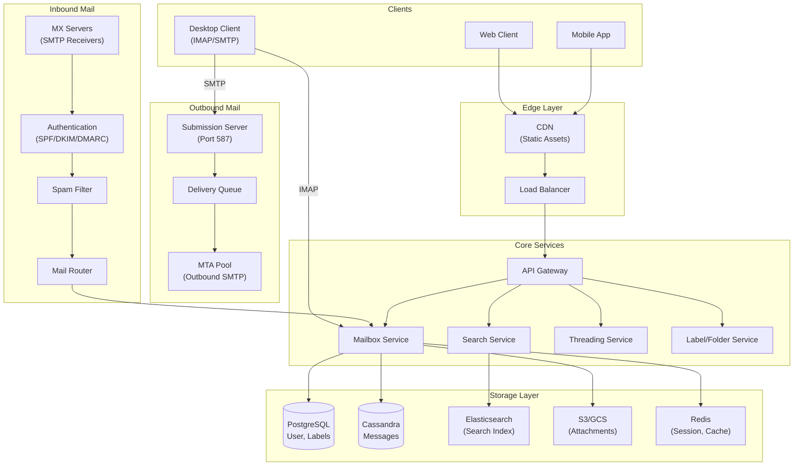
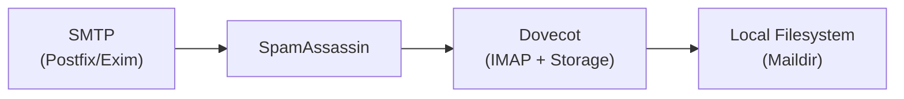
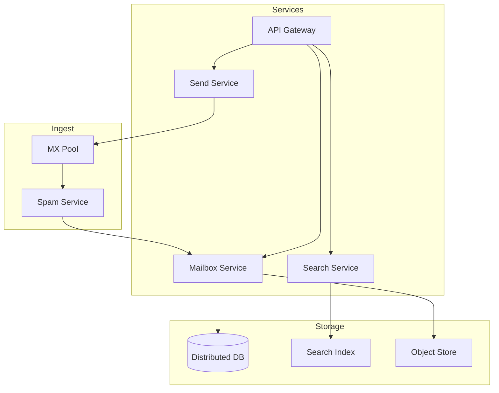
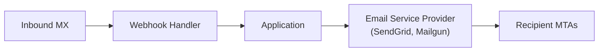
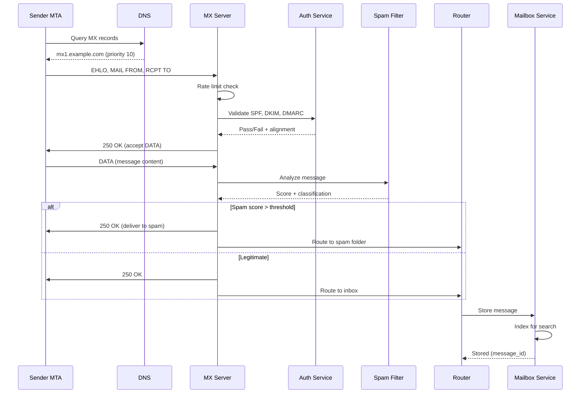
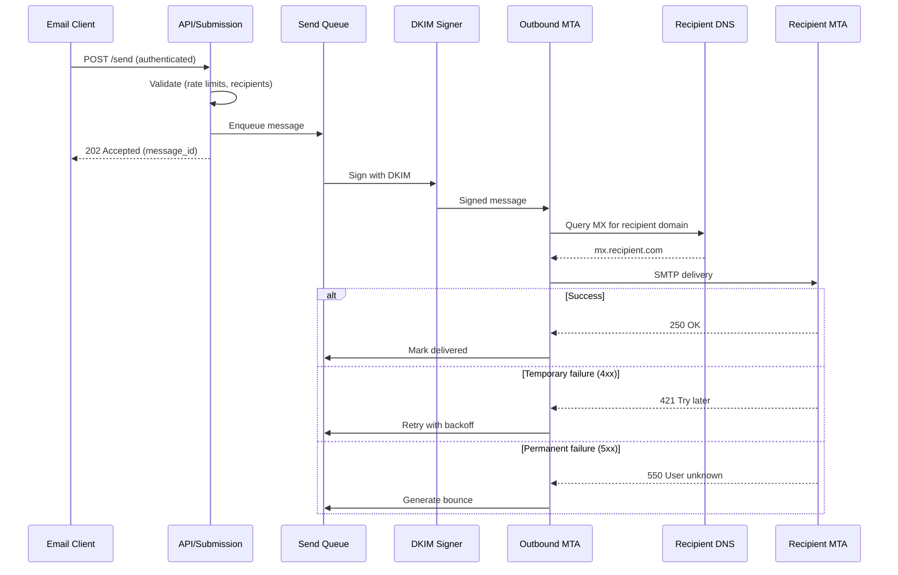
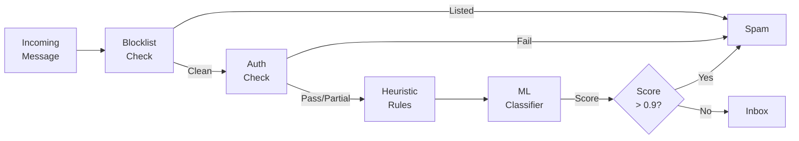
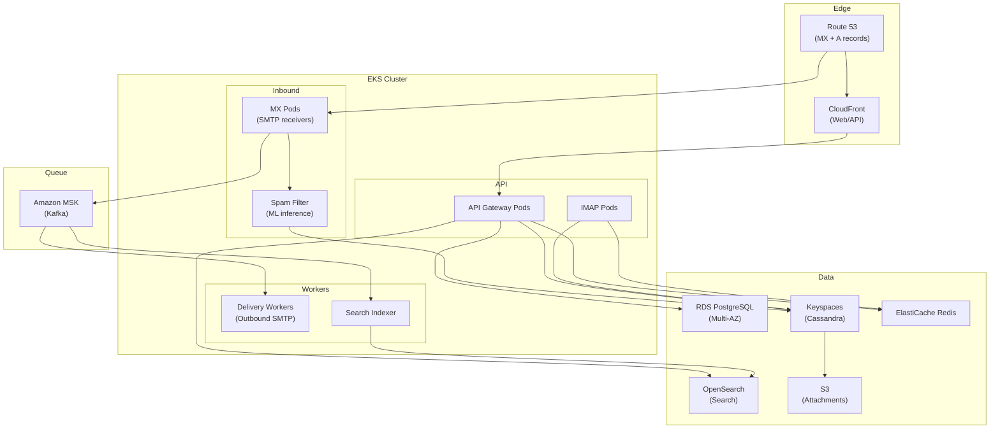

# Design an Email System

A comprehensive system design for building a scalable email service like Gmail or Outlook. This design addresses reliable delivery, spam filtering, conversation threading, and search at scale—handling billions of messages daily with sub-second search latency and 99.99% delivery reliability.

<figure>



<figcaption>High-level architecture: Separate inbound (receiving) and outbound (sending) mail paths with shared storage and search infrastructure.</figcaption>
</figure>

## Abstract

Email systems solve four interconnected challenges: **reliable delivery** (messages must never be lost), **authentication** (prevent spoofing and phishing), **spam filtering** (99%+ spam blocked with minimal false positives), and **fast retrieval** (sub-second search across years of messages).

**Core architectural decisions:**

| Decision         | Choice                         | Rationale                                           |
| ---------------- | ------------------------------ | --------------------------------------------------- |
| Inbound protocol | SMTP (RFC 5321)                | Universal standard, store-and-forward resilience    |
| Client access    | IMAP (RFC 3501) + REST API     | IMAP for desktop clients, REST for web/mobile       |
| Authentication   | SPF + DKIM + DMARC             | Defense in depth: server auth, content auth, policy |
| Spam filtering   | ML (Naive Bayes) + rules       | 99.9%+ detection with low false positives           |
| Message storage  | Wide-column DB (Cassandra)     | Time-series access pattern, horizontal scaling      |
| Search           | Inverted index (Elasticsearch) | Full-text search with field-specific filtering      |
| Threading        | RFC 5322 headers + heuristics  | References header for chain, subject fallback       |

**Key trade-offs accepted:**

- Store-and-forward adds latency (seconds to minutes) but ensures delivery reliability
- Per-message spam analysis increases CPU cost but reduces false positives vs. IP-only blocking
- Denormalized message storage increases write cost but enables fast mailbox queries
- Eventual consistency for search index (seconds delay) in exchange for write throughput

**What this design optimizes:**

- 99.99% delivery success rate with automatic retries
- Sub-100ms mailbox listing, sub-500ms full-text search
- Blocks 99.9% of spam while keeping false positive rate below 0.01%
- Horizontal scaling to billions of messages per day

## Requirements

### Functional Requirements

| Requirement                   | Priority | Notes                               |
| ----------------------------- | -------- | ----------------------------------- |
| Send emails (SMTP submission) | Core     | Authenticated sending via port 587  |
| Receive emails (SMTP inbound) | Core     | Accept mail for hosted domains      |
| Web/mobile mailbox access     | Core     | REST API for modern clients         |
| IMAP access                   | Core     | Desktop client compatibility        |
| Spam filtering                | Core     | Block spam, phishing, malware       |
| Email authentication          | Core     | SPF, DKIM, DMARC validation         |
| Full-text search              | Core     | Search body, subject, participants  |
| Conversation threading        | Core     | Group related messages              |
| Labels/folders                | Core     | User organization                   |
| Attachments                   | Core     | Store and retrieve file attachments |
| Contact autocomplete          | Extended | Suggest recipients while composing  |
| Scheduled send                | Extended | Send at specified future time       |
| Undo send                     | Extended | Brief cancellation window           |

### Non-Functional Requirements

| Requirement          | Target           | Rationale                                                 |
| -------------------- | ---------------- | --------------------------------------------------------- |
| Availability         | 99.99% (4 nines) | Email is critical communication; 52 min/year downtime max |
| Delivery latency     | p99 < 30 seconds | User expectation for "instant" delivery                   |
| Search latency       | p99 < 500ms      | Real-time search experience                               |
| Mailbox list latency | p99 < 100ms      | Responsive UI on folder open                              |
| Spam detection rate  | > 99.9%          | Unusable inbox without effective filtering                |
| False positive rate  | < 0.01%          | Legitimate mail must not be blocked                       |
| Message durability   | 99.9999%         | No email should ever be lost                              |
| Retention            | 15+ years        | Long-term archival for compliance                         |

### Scale Estimation

**Users:**

- Monthly Active Users (MAU): 500M
- Daily Active Users (DAU): 200M (40% of MAU)
- Mailboxes: 500M (1 per user)

**Traffic (inbound + outbound):**

- Messages per user per day: 40 received, 10 sent
- Daily inbound: 500M × 40 = 20B messages/day
- Daily outbound: 200M × 10 = 2B messages/day
- Peak messages per second: 20B / 86400 × 3 (peak multiplier) = ~700K msgs/sec inbound

**Storage:**

- Average message size: 75KB (body + headers, excluding attachments)
- Average attachment size: 500KB (only 20% of messages have attachments)
- Daily message storage: 20B × 75KB = 1.5PB/day
- Daily attachment storage: 20B × 0.2 × 500KB = 2PB/day
- 15-year retention: ~20EB (with compression, ~5EB)

**Search index:**

- Index size: ~20% of message storage (text extraction)
- Daily index growth: ~300TB

## Design Paths

### Path A: Monolithic MTA (Traditional)

**Best when:**

- Smaller scale (< 1M mailboxes)
- On-premises deployment
- Simpler operations preferred
- Standard email features sufficient

**Architecture:**



**Key characteristics:**

- Single MTA handles sending, receiving, storage
- File-based storage (Maildir or mbox format)
- Local spam filtering with SpamAssassin
- IMAP server (Dovecot) for client access

**Trade-offs:**

- ✅ Simple deployment and operations
- ✅ Mature, well-understood stack
- ✅ Low infrastructure cost
- ❌ Vertical scaling limits (~100K mailboxes per server)
- ❌ No built-in redundancy
- ❌ Limited search capabilities
- ❌ Manual spam rule updates

**Real-world example:** Traditional enterprise mail servers, small hosting providers, self-hosted mail (Mail-in-a-Box, Mailcow).

### Path B: Microservices with Shared Storage (Cloud-Native)

**Best when:**

- Large scale (10M+ mailboxes)
- Cloud deployment
- Need for advanced features (smart compose, nudges)
- Global distribution required

**Architecture:**



**Key characteristics:**

- Separate services for ingestion, storage, search, sending
- Distributed database for messages (Cassandra, Bigtable)
- Dedicated search cluster (Elasticsearch)
- Object storage for attachments
- ML-based spam filtering

**Trade-offs:**

- ✅ Horizontal scaling to billions of mailboxes
- ✅ Independent service scaling
- ✅ Advanced ML features possible
- ✅ Multi-region deployment
- ❌ Complex operations
- ❌ Higher infrastructure cost
- ❌ Eventual consistency challenges

**Real-world example:** Gmail (Bigtable + custom indexing), Outlook.com (Exchange Online + Azure), Fastmail (custom Cyrus-derived stack).

### Path C: Hybrid with ESP Integration

**Best when:**

- Need transactional + marketing email
- Deliverability is critical concern
- Limited email infrastructure expertise
- Variable sending volumes

**Architecture:**



**Key characteristics:**

- Outbound via ESP (managed deliverability)
- Inbound via webhooks or forwarding
- ESP handles reputation, authentication, compliance
- Application focuses on business logic

**Trade-offs:**

- ✅ Managed deliverability and reputation
- ✅ Built-in analytics and tracking
- ✅ No MTA operations burden
- ✅ Elastic scaling
- ❌ Per-message cost at scale
- ❌ Less control over delivery timing
- ❌ Vendor lock-in concerns
- ❌ Limited for receiving mail

**Real-world example:** SaaS applications using SendGrid/Mailgun for transactional email, marketing platforms using dedicated ESPs.

### Path Comparison

| Factor                 | Monolithic          | Microservices      | Hybrid/ESP |
| ---------------------- | ------------------- | ------------------ | ---------- |
| Scale                  | < 1M mailboxes      | Billions           | Variable   |
| Complexity             | Low                 | High               | Medium     |
| Cost at scale          | Lower               | Higher             | Highest    |
| Deliverability control | Full                | Full               | Delegated  |
| Feature velocity       | Slow                | Fast               | Medium     |
| Ops burden             | Medium              | High               | Low        |
| Examples               | Enterprise Exchange | Gmail, Outlook.com | SaaS apps  |

### This Article's Focus

This article focuses on **Path B (Microservices)** because:

1. Represents architecture of major email providers (Gmail, Outlook)
2. Demonstrates scale challenges unique to email (spam, threading, search)
3. Covers both sending and receiving infrastructure
4. Addresses deliverability, authentication, and compliance concerns

## High-Level Design

### Inbound Mail Flow

When an external server sends mail to your domain:



**MX Server responsibilities:**

1. **Connection handling**: Accept SMTP connections, enforce rate limits
2. **Recipient validation**: Verify mailbox exists before accepting
3. **Authentication checks**: SPF, DKIM, DMARC validation
4. **Spam scoring**: Pass to spam filter, act on classification
5. **Message queuing**: Hand off to storage layer

**Why accept-then-filter (not reject during SMTP)?**

Rejecting spam during the SMTP transaction (5xx response) causes the sender's MTA to generate a bounce. Spammers use forged From addresses, so bounces go to innocent parties (backscatter). Accepting and silently filtering avoids this.

### Outbound Mail Flow

When a user sends an email:



**Outbound MTA responsibilities:**

1. **DKIM signing**: Cryptographically sign message for authentication
2. **MX resolution**: Look up recipient mail servers
3. **Connection pooling**: Reuse connections to frequent destinations
4. **Retry management**: Exponential backoff for temporary failures
5. **Bounce handling**: Process permanent failures, notify sender

### Mailbox Service

Handles message storage, retrieval, and organization:

**Key operations:**

| Operation     | Description            | Access Pattern                   |
| ------------- | ---------------------- | -------------------------------- |
| List messages | Get messages in folder | Range query by folder + date     |
| Get message   | Retrieve full message  | Point lookup by message_id       |
| Move/label    | Organize messages      | Update metadata                  |
| Delete        | Remove message         | Soft delete (trash), hard delete |
| Search        | Full-text query        | Search index query               |
| Sync          | IMAP/API delta sync    | Cursor-based pagination          |

**State per message:**

```typescript
interface EmailMessage {
  messageId: string // Globally unique (RFC 5322 Message-ID)
  internalId: string // System-assigned UUID
  mailboxId: string // Owner's mailbox
  threadId: string // Conversation grouping

  // Headers (denormalized for queries)
  from: EmailAddress
  to: EmailAddress[]
  cc: EmailAddress[]
  subject: string
  date: Date // From Date header
  receivedAt: Date // Server receive time

  // Threading headers
  inReplyTo?: string // Message-ID of parent
  references: string[] // Full ancestor chain

  // Content
  bodyText?: string // Plain text version
  bodyHtml?: string // HTML version
  snippet: string // First 200 chars for preview

  // Organization
  labels: string[] // User labels (INBOX, SENT, custom)
  isRead: boolean
  isStarred: boolean

  // Metadata
  sizeBytes: number
  hasAttachments: boolean
  attachments: AttachmentRef[]

  // Spam/security
  spamScore: number
  authenticationResults: AuthResult
}

interface AttachmentRef {
  attachmentId: string
  filename: string
  contentType: string
  sizeBytes: number
  storageUrl: string // S3/GCS URL
}
```

### Search Service

Full-text search across all message content:

**Index structure:**

```typescript
interface SearchDocument {
  messageId: string
  mailboxId: string // Partition key for isolation
  threadId: string

  // Searchable fields
  from: string // Tokenized email + name
  to: string[]
  cc: string[]
  subject: string // Tokenized
  body: string // Full-text, tokenized
  attachmentNames: string[]

  // Filterable fields
  labels: string[]
  date: Date
  hasAttachment: boolean
  isRead: boolean
  isStarred: boolean

  // Spam fields
  spamScore: number
}
```

**Query capabilities:**

- Full-text: `"quarterly report"` (phrase match)
- Field-specific: `from:alice@example.com`
- Boolean: `from:alice AND has:attachment`
- Date range: `after:2024/01/01 before:2024/06/01`
- Labels: `label:work -label:newsletters`

### Threading Service

Groups related messages into conversations:

**Algorithm (priority order):**

1. **References header**: RFC 5322 specifies References contains Message-IDs of all ancestors
2. **In-Reply-To header**: Direct parent Message-ID
3. **Subject matching**: Same subject (ignoring Re:/Fwd: prefixes) within time window
4. **Participant overlap**: Same sender/recipients, similar timing

**Threading data model:**

```typescript
interface Thread {
  threadId: string
  mailboxId: string

  // Aggregated from messages
  subject: string // From most recent message
  snippet: string // From most recent message
  participants: EmailAddress[] // Union of all From/To/Cc

  // Message list
  messageIds: string[] // Ordered by date
  messageCount: number

  // Thread-level flags
  hasUnread: boolean
  isStarred: boolean // Any message starred
  labels: string[] // Union of all labels

  // Timestamps
  oldestMessageDate: Date
  newestMessageDate: Date
}
```

**Edge cases:**

- **Orphaned replies**: Message references unknown Message-ID → create new thread, merge if parent arrives
- **Subject collision**: Different conversations with same subject → use timing + participants to disambiguate
- **Long threads**: Threads with 100+ messages → paginate message list

## API Design

### REST API

#### List Messages

**Endpoint:** `GET /api/v1/mailboxes/{mailboxId}/messages`

**Query parameters:**

| Parameter     | Type     | Description                       |
| ------------- | -------- | --------------------------------- |
| `labelIds`    | string[] | Filter by labels (default: INBOX) |
| `q`           | string   | Search query                      |
| `maxResults`  | int      | Page size (default: 50, max: 500) |
| `pageToken`   | string   | Cursor for pagination             |
| `includeSpam` | bool     | Include spam folder               |

**Response (200 OK):**

```json
{
  "messages": [
    {
      "id": "msg_abc123",
      "threadId": "thread_xyz789",
      "labelIds": ["INBOX", "IMPORTANT"],
      "snippet": "Hi team, please review the Q4 report...",
      "from": {
        "email": "alice@example.com",
        "name": "Alice Smith"
      },
      "to": [{ "email": "bob@example.com", "name": "Bob Jones" }],
      "subject": "Q4 Report Review",
      "date": "2024-12-15T10:30:00Z",
      "isRead": false,
      "isStarred": false,
      "hasAttachments": true,
      "sizeBytes": 125000
    }
  ],
  "nextPageToken": "cursor_def456",
  "resultSizeEstimate": 1250
}
```

#### Get Full Message

**Endpoint:** `GET /api/v1/messages/{messageId}`

**Query parameters:**

| Parameter | Type | Description                          |
| --------- | ---- | ------------------------------------ |
| `format`  | enum | `minimal`, `metadata`, `full`, `raw` |

**Response (200 OK, format=full):**

```json
{
  "id": "msg_abc123",
  "threadId": "thread_xyz789",
  "labelIds": ["INBOX", "IMPORTANT"],
  "headers": {
    "from": "Alice Smith <alice@example.com>",
    "to": "Bob Jones <bob@example.com>",
    "subject": "Q4 Report Review",
    "date": "Sun, 15 Dec 2024 10:30:00 -0800",
    "message-id": "<unique-id@example.com>",
    "in-reply-to": "<parent-id@example.com>",
    "references": "<grandparent@example.com> <parent-id@example.com>"
  },
  "body": {
    "text": "Hi team,\n\nPlease review the attached Q4 report...",
    "html": "<html><body><p>Hi team,</p>..."
  },
  "attachments": [
    {
      "id": "att_file123",
      "filename": "Q4-Report.pdf",
      "mimeType": "application/pdf",
      "size": 2500000
    }
  ],
  "authentication": {
    "spf": "pass",
    "dkim": "pass",
    "dmarc": "pass"
  }
}
```

#### Send Message

**Endpoint:** `POST /api/v1/messages/send`

**Request:**

```json
{
  "to": [{ "email": "bob@example.com", "name": "Bob Jones" }],
  "cc": [],
  "bcc": [],
  "subject": "Project Update",
  "body": {
    "text": "Hi Bob,\n\nHere's the update you requested...",
    "html": "<p>Hi Bob,</p><p>Here's the update you requested...</p>"
  },
  "attachments": [
    {
      "filename": "update.pdf",
      "mimeType": "application/pdf",
      "content": "base64-encoded-content"
    }
  ],
  "replyTo": "msg_parent123",
  "scheduledAt": null
}
```

**Response (202 Accepted):**

```json
{
  "id": "msg_new789",
  "threadId": "thread_xyz789",
  "labelIds": ["SENT"],
  "status": "queued"
}
```

#### Search Messages

**Endpoint:** `GET /api/v1/mailboxes/{mailboxId}/messages?q={query}`

**Query examples:**

- `from:alice@example.com` - From specific sender
- `"quarterly report"` - Phrase match
- `has:attachment larger:5M` - With attachment > 5MB
- `after:2024/01/01 before:2024/06/30` - Date range
- `in:inbox is:unread` - Inbox, unread only

**Response:** Same format as List Messages.

#### Download Attachment

**Endpoint:** `GET /api/v1/messages/{messageId}/attachments/{attachmentId}`

**Response:** Redirects to signed URL (S3/GCS presigned URL, 15-minute expiry).

### Error Responses

| Code | Error                  | When                          |
| ---- | ---------------------- | ----------------------------- |
| 400  | `INVALID_REQUEST`      | Malformed request body        |
| 401  | `UNAUTHORIZED`         | Invalid or expired token      |
| 403  | `FORBIDDEN`            | No access to mailbox          |
| 404  | `NOT_FOUND`            | Message/mailbox doesn't exist |
| 413  | `ATTACHMENT_TOO_LARGE` | Attachment exceeds 25MB limit |
| 429  | `RATE_LIMITED`         | Too many requests             |
| 503  | `SERVICE_UNAVAILABLE`  | Temporary outage              |

**Rate limits:**

| Operation    | Limit          | Window     |
| ------------ | -------------- | ---------- |
| Send         | 500 messages   | per day    |
| Send (paid)  | 2,000 messages | per day    |
| API requests | 1,000 requests | per minute |
| Search       | 100 queries    | per minute |

### IMAP Protocol Support

For desktop client compatibility, expose standard IMAP (RFC 3501):

**Supported commands:**

| Command   | Description                                  |
| --------- | -------------------------------------------- |
| `LOGIN`   | Authenticate with username/password or OAuth |
| `SELECT`  | Open mailbox/folder                          |
| `SEARCH`  | Server-side search                           |
| `FETCH`   | Retrieve message(s)                          |
| `STORE`   | Update flags (read, starred, deleted)        |
| `COPY`    | Copy to another folder                       |
| `EXPUNGE` | Permanently delete                           |
| `IDLE`    | Push notifications (RFC 2177)                |

**IMAP-to-API mapping:**

- IMAP folder → API label
- IMAP UID → API message ID
- IMAP flags → API isRead, isStarred, labels

## Data Modeling

### Message Storage (Cassandra)

**Table design for time-series mailbox access:**

```sql
-- Messages by mailbox and date (primary access pattern)
CREATE TABLE messages_by_mailbox (
    mailbox_id UUID,
    label_id TEXT,
    received_at TIMESTAMP,
    message_id UUID,
    thread_id UUID,
    from_email TEXT,
    from_name TEXT,
    subject TEXT,
    snippet TEXT,
    is_read BOOLEAN,
    is_starred BOOLEAN,
    has_attachments BOOLEAN,
    size_bytes INT,
    PRIMARY KEY ((mailbox_id, label_id), received_at, message_id)
) WITH CLUSTERING ORDER BY (received_at DESC, message_id ASC);

-- Full message content (point lookup)
CREATE TABLE messages (
    message_id UUID PRIMARY KEY,
    mailbox_id UUID,
    thread_id UUID,
    raw_headers TEXT,
    body_text TEXT,
    body_html TEXT,
    attachments LIST<FROZEN<attachment>>,
    authentication_results MAP<TEXT, TEXT>,
    spam_score FLOAT,
    created_at TIMESTAMP
);

-- Thread aggregation
CREATE TABLE threads_by_mailbox (
    mailbox_id UUID,
    label_id TEXT,
    newest_message_at TIMESTAMP,
    thread_id UUID,
    subject TEXT,
    snippet TEXT,
    message_count INT,
    participant_emails SET<TEXT>,
    has_unread BOOLEAN,
    PRIMARY KEY ((mailbox_id, label_id), newest_message_at, thread_id)
) WITH CLUSTERING ORDER BY (newest_message_at DESC, thread_id ASC);
```

**Why Cassandra:**

- Time-series optimized (messages ordered by date)
- Partition per mailbox+label enables efficient folder queries
- Linear horizontal scaling
- Tunable consistency (eventual OK for reads, quorum for writes)

**Partition sizing:**

- Target: < 100MB per partition
- Heavy mailboxes: Partition by (mailbox_id, label_id, month) to bound growth
- Typical mailbox: 10K messages × 1KB metadata = 10MB per label partition

### User and Label Metadata (PostgreSQL)

```sql
CREATE TABLE users (
    id UUID PRIMARY KEY DEFAULT gen_random_uuid(),
    email VARCHAR(255) UNIQUE NOT NULL,
    display_name VARCHAR(100),
    password_hash VARCHAR(255),
    created_at TIMESTAMPTZ DEFAULT NOW(),
    last_login_at TIMESTAMPTZ,
    settings JSONB DEFAULT '{}'
);

CREATE TABLE mailboxes (
    id UUID PRIMARY KEY DEFAULT gen_random_uuid(),
    user_id UUID REFERENCES users(id) ON DELETE CASCADE,
    email_address VARCHAR(255) UNIQUE NOT NULL,
    storage_quota_bytes BIGINT DEFAULT 15000000000,  -- 15GB default
    storage_used_bytes BIGINT DEFAULT 0,
    message_count INT DEFAULT 0,
    created_at TIMESTAMPTZ DEFAULT NOW()
);

CREATE TABLE labels (
    id UUID PRIMARY KEY DEFAULT gen_random_uuid(),
    mailbox_id UUID REFERENCES mailboxes(id) ON DELETE CASCADE,
    name VARCHAR(100) NOT NULL,
    type VARCHAR(20) DEFAULT 'user',  -- 'system' or 'user'
    color VARCHAR(7),                  -- Hex color for UI
    message_count INT DEFAULT 0,
    unread_count INT DEFAULT 0,
    UNIQUE(mailbox_id, name)
);

-- System labels created per mailbox: INBOX, SENT, DRAFTS, SPAM, TRASH, ALL
CREATE INDEX idx_labels_mailbox ON labels(mailbox_id);
```

### Attachment Storage (S3/GCS)

**Storage path convention:**

```
s3://email-attachments/{mailbox_id}/{year}/{month}/{message_id}/{attachment_id}/{filename}
```

**Metadata in database:**

```sql
CREATE TABLE attachments (
    id UUID PRIMARY KEY,
    message_id UUID NOT NULL,
    filename VARCHAR(255) NOT NULL,
    content_type VARCHAR(100),
    size_bytes BIGINT,
    storage_bucket VARCHAR(100),
    storage_key TEXT,
    checksum_sha256 VARCHAR(64),
    scanned_at TIMESTAMPTZ,
    scan_result VARCHAR(20)  -- 'clean', 'malware', 'pending'
);
```

**Lifecycle rules:**

- Trash attachments: Delete after 30 days
- Spam attachments: Delete after 7 days
- Regular attachments: Keep until message deleted

### Search Index (Elasticsearch)

**Index mapping:**

```json
{
  "mappings": {
    "properties": {
      "message_id": { "type": "keyword" },
      "mailbox_id": { "type": "keyword" },
      "thread_id": { "type": "keyword" },
      "from_email": { "type": "keyword" },
      "from_name": { "type": "text" },
      "to_emails": { "type": "keyword" },
      "to_names": { "type": "text" },
      "cc_emails": { "type": "keyword" },
      "subject": {
        "type": "text",
        "analyzer": "email_analyzer"
      },
      "body": {
        "type": "text",
        "analyzer": "email_analyzer"
      },
      "attachment_names": { "type": "text" },
      "labels": { "type": "keyword" },
      "date": { "type": "date" },
      "size_bytes": { "type": "long" },
      "has_attachment": { "type": "boolean" },
      "is_read": { "type": "boolean" },
      "is_starred": { "type": "boolean" }
    }
  },
  "settings": {
    "analysis": {
      "analyzer": {
        "email_analyzer": {
          "type": "custom",
          "tokenizer": "standard",
          "filter": ["lowercase", "email_domain_filter"]
        }
      }
    }
  }
}
```

**Index per mailbox:**

- Shard by mailbox_id for query isolation
- Typical sizing: 1 shard per 10M messages
- Heavy users: Dedicated index with multiple shards

### Database Selection Matrix

| Data Type             | Store         | Rationale                                |
| --------------------- | ------------- | ---------------------------------------- |
| User profiles, labels | PostgreSQL    | ACID, relational queries, moderate scale |
| Message metadata      | Cassandra     | Time-series access, horizontal scaling   |
| Message bodies        | Cassandra     | Co-located with metadata                 |
| Attachments           | S3/GCS        | Object storage, CDN-compatible           |
| Search index          | Elasticsearch | Full-text search, aggregations           |
| Session cache         | Redis         | Sub-ms latency, TTL support              |
| Rate limiting         | Redis         | Atomic counters, sliding windows         |
| Delivery queue        | Kafka         | Reliable async, retry support            |

## Low-Level Design

### Email Authentication Pipeline

#### SPF Validation

Sender Policy Framework (RFC 7208) validates sending server authorization:

```typescript collapse={1-8}
interface SPFResult {
  result: "pass" | "fail" | "softfail" | "neutral" | "none" | "temperror" | "permerror"
  domain: string
  clientIp: string
  explanation?: string
}

class SPFValidator {
  async validate(senderDomain: string, clientIp: string): Promise<SPFResult> {
    // 1. Query TXT record for SPF policy
    const spfRecord = await this.dns.queryTXT(`${senderDomain}`)
    // Example: "v=spf1 include:_spf.google.com ~all"

    if (!spfRecord || !spfRecord.startsWith("v=spf1")) {
      return { result: "none", domain: senderDomain, clientIp }
    }

    // 2. Parse and evaluate SPF mechanisms
    const mechanisms = this.parseSPF(spfRecord)

    for (const mechanism of mechanisms) {
      const match = await this.evaluateMechanism(mechanism, clientIp, senderDomain)
      if (match) {
        return {
          result: this.qualifierToResult(mechanism.qualifier),
          domain: senderDomain,
          clientIp,
        }
      }
    }

    // 3. Default result if no mechanism matches
    return { result: "neutral", domain: senderDomain, clientIp }
  }

  private qualifierToResult(qualifier: string): SPFResult["result"] {
    switch (qualifier) {
      case "+":
        return "pass"
      case "-":
        return "fail"
      case "~":
        return "softfail"
      case "?":
        return "neutral"
      default:
        return "pass"
    }
  }
}
```

**SPF limitations:**

- Only validates envelope sender (MAIL FROM), not header From
- Breaks on forwarding (forwarding server IP not authorized)
- 10 DNS lookup limit to prevent amplification attacks

#### DKIM Verification

DomainKeys Identified Mail (RFC 6376) validates message integrity:

```typescript collapse={1-12}
interface DKIMResult {
  result: "pass" | "fail" | "neutral" | "temperror" | "permerror"
  domain: string
  selector: string
  headerFields: string[]
}

class DKIMVerifier {
  async verify(message: RawEmail): Promise<DKIMResult> {
    // 1. Extract DKIM-Signature header
    const signature = this.extractDKIMSignature(message)
    if (!signature) {
      return { result: "neutral", domain: "", selector: "", headerFields: [] }
    }

    // DKIM-Signature: v=1; a=rsa-sha256; d=example.com; s=selector1;
    //   h=from:to:subject:date; bh=base64-body-hash; b=base64-signature

    // 2. Fetch public key from DNS
    const publicKey = await this.dns.queryTXT(`${signature.selector}._domainkey.${signature.domain}`)

    // 3. Verify body hash
    const bodyHash = this.computeBodyHash(message.body, signature.canonicalization.body, signature.algorithm)

    if (bodyHash !== signature.bodyHash) {
      return {
        result: "fail",
        domain: signature.domain,
        selector: signature.selector,
        headerFields: signature.headers,
      }
    }

    // 4. Verify header signature
    const headerData = this.canonicalizeHeaders(message.headers, signature.headers, signature.canonicalization.header)

    const valid = this.verifySignature(headerData, signature.signature, publicKey, signature.algorithm)

    return {
      result: valid ? "pass" : "fail",
      domain: signature.domain,
      selector: signature.selector,
      headerFields: signature.headers,
    }
  }
}
```

**DKIM key considerations:**

- RSA 2048-bit minimum (1024-bit deprecated)
- Selector rotation: Publish new key, sign with new selector, retire old
- Header field selection: Always include From, To, Subject, Date, Message-ID

#### DMARC Policy Enforcement

Domain-based Message Authentication, Reporting, and Conformance (RFC 7489):

```typescript collapse={1-10}
interface DMARCResult {
  result: "pass" | "fail" | "none"
  policy: "none" | "quarantine" | "reject"
  alignment: {
    spf: boolean
    dkim: boolean
  }
  domain: string
}

class DMARCEvaluator {
  async evaluate(headerFrom: string, spfResult: SPFResult, dkimResult: DKIMResult): Promise<DMARCResult> {
    const fromDomain = this.extractDomain(headerFrom)

    // 1. Query DMARC policy
    const dmarcRecord = await this.dns.queryTXT(`_dmarc.${fromDomain}`)
    // Example: "v=DMARC1; p=reject; rua=mailto:dmarc@example.com"

    if (!dmarcRecord) {
      return {
        result: "none",
        policy: "none",
        alignment: { spf: false, dkim: false },
        domain: fromDomain,
      }
    }

    const policy = this.parseDMARC(dmarcRecord)

    // 2. Check alignment (domain in From matches authenticated domain)
    const spfAligned = spfResult.result === "pass" && this.domainAligns(fromDomain, spfResult.domain, policy.aspf)

    const dkimAligned = dkimResult.result === "pass" && this.domainAligns(fromDomain, dkimResult.domain, policy.adkim)

    // 3. DMARC passes if either SPF or DKIM is aligned
    const passes = spfAligned || dkimAligned

    return {
      result: passes ? "pass" : "fail",
      policy: policy.p,
      alignment: { spf: spfAligned, dkim: dkimAligned },
      domain: fromDomain,
    }
  }

  private domainAligns(
    fromDomain: string,
    authDomain: string,
    mode: "r" | "s", // relaxed or strict
  ): boolean {
    if (mode === "s") {
      return fromDomain === authDomain
    }
    // Relaxed: organizational domain must match
    return this.getOrgDomain(fromDomain) === this.getOrgDomain(authDomain)
  }
}
```

**DMARC policy actions:**

| Policy         | Action                            |
| -------------- | --------------------------------- |
| `p=none`       | Monitor only, no enforcement      |
| `p=quarantine` | Deliver to spam folder            |
| `p=reject`     | Reject at SMTP level (or discard) |

### Spam Filtering Pipeline

#### Multi-Stage Classification



#### Naive Bayes Classifier

Core spam detection algorithm:

```typescript collapse={1-15}
class NaiveBayesSpamFilter {
  private spamWordCounts: Map<string, number> = new Map()
  private hamWordCounts: Map<string, number> = new Map()
  private totalSpam: number = 0
  private totalHam: number = 0

  // Training: update counts from labeled messages
  train(message: string, isSpam: boolean): void {
    const tokens = this.tokenize(message)
    const counts = isSpam ? this.spamWordCounts : this.hamWordCounts

    for (const token of tokens) {
      counts.set(token, (counts.get(token) || 0) + 1)
    }

    if (isSpam) this.totalSpam++
    else this.totalHam++
  }

  // Classification: compute P(spam|message)
  classify(message: string): { isSpam: boolean; score: number } {
    const tokens = this.tokenize(message)

    // Prior probabilities
    const pSpam = this.totalSpam / (this.totalSpam + this.totalHam)
    const pHam = 1 - pSpam

    // Log probabilities to avoid underflow
    let logPSpamGivenMessage = Math.log(pSpam)
    let logPHamGivenMessage = Math.log(pHam)

    for (const token of tokens) {
      // P(token|spam) with Laplace smoothing
      const spamCount = this.spamWordCounts.get(token) || 0
      const hamCount = this.hamWordCounts.get(token) || 0

      const pTokenGivenSpam = (spamCount + 1) / (this.totalSpam + 2)
      const pTokenGivenHam = (hamCount + 1) / (this.totalHam + 2)

      logPSpamGivenMessage += Math.log(pTokenGivenSpam)
      logPHamGivenMessage += Math.log(pTokenGivenHam)
    }

    // Convert back to probability
    const maxLog = Math.max(logPSpamGivenMessage, logPHamGivenMessage)
    const pSpamNormalized = Math.exp(logPSpamGivenMessage - maxLog)
    const pHamNormalized = Math.exp(logPHamGivenMessage - maxLog)

    const score = pSpamNormalized / (pSpamNormalized + pHamNormalized)

    return {
      isSpam: score > 0.9, // High threshold to minimize false positives
      score,
    }
  }

  private tokenize(text: string): string[] {
    return text
      .toLowerCase()
      .split(/\W+/)
      .filter((token) => token.length > 2 && token.length < 20)
  }
}
```

**Why Naive Bayes works for spam:**

- Handles high-dimensional feature spaces (thousands of words) efficiently
- Trains incrementally (user feedback updates model)
- Achieves 99%+ accuracy despite "naive" independence assumption
- Computationally cheap (O(n) where n = tokens in message)

**Spammer countermeasures and responses:**

| Attack                                | Response                          |
| ------------------------------------- | --------------------------------- |
| Bayesian poisoning (inject ham words) | Weight tokens by information gain |
| Image-only spam                       | OCR text extraction               |
| Character substitution (V1agra)       | Normalization, character n-grams  |
| URL shorteners                        | Expand and analyze destination    |

#### Heuristic Rules (SpamAssassin-style)

```typescript collapse={1-8}
interface SpamRule {
  name: string
  score: number // Positive = spam indicator
  test: (message: ParsedEmail) => boolean
}

const SPAM_RULES: SpamRule[] = [
  {
    name: "SUBJ_ALL_CAPS",
    score: 1.5,
    test: (msg) => msg.subject === msg.subject.toUpperCase() && msg.subject.length > 10,
  },
  {
    name: "FROM_DISPLAY_MISMATCH",
    score: 2.0,
    test: (msg) => {
      // "PayPal <hacker@evil.com>" - display name doesn't match domain
      const displayDomain = msg.fromName?.match(/@?(\w+\.\w+)/)?.[1]
      const actualDomain = msg.from.split("@")[1]
      return displayDomain && displayDomain !== actualDomain
    },
  },
  {
    name: "MISSING_DATE",
    score: 1.0,
    test: (msg) => !msg.headers["date"],
  },
  {
    name: "FORGED_OUTLOOK_TAGS",
    score: 3.0,
    test: (msg) => {
      // Claims Outlook but missing X-MS headers
      const ua = msg.headers["x-mailer"] || ""
      return ua.includes("Outlook") && !msg.headers["x-ms-exchange-organization"]
    },
  },
  {
    name: "URI_MISMATCH",
    score: 2.5,
    test: (msg) => {
      // Link text says paypal.com but href goes elsewhere
      const links = extractLinks(msg.bodyHtml)
      return links.some((l) => l.text.includes("paypal.com") && !l.href.includes("paypal.com"))
    },
  },
]

function computeHeuristicScore(message: ParsedEmail): number {
  return SPAM_RULES.filter((rule) => rule.test(message)).reduce((sum, rule) => sum + rule.score, 0)
}
```

### Message Delivery Queue

#### Outbound Queue with Retry Logic

```typescript collapse={1-15}
interface QueuedMessage {
  messageId: string
  recipientDomain: string
  recipientEmail: string
  payload: Buffer // DKIM-signed message
  attempts: number
  nextAttemptAt: Date
  createdAt: Date
  expiresAt: Date // 5 days for bounce generation
}

class OutboundQueue {
  private readonly kafka: KafkaProducer

  async enqueue(message: OutboundMessage): Promise<void> {
    // Partition by recipient domain for connection pooling
    await this.kafka.send({
      topic: "outbound-mail",
      messages: [
        {
          key: message.recipientDomain,
          value: JSON.stringify({
            messageId: message.id,
            recipientDomain: message.recipientDomain,
            recipientEmail: message.recipient,
            payload: message.signedContent,
            attempts: 0,
            nextAttemptAt: new Date(),
            createdAt: new Date(),
            expiresAt: new Date(Date.now() + 5 * 24 * 60 * 60 * 1000),
          }),
        },
      ],
    })
  }
}

class DeliveryWorker {
  private readonly RETRY_DELAYS = [
    0, // Immediate
    5 * 60, // 5 minutes
    30 * 60, // 30 minutes
    2 * 60 * 60, // 2 hours
    8 * 60 * 60, // 8 hours
    24 * 60 * 60, // 24 hours
  ]

  async processMessage(queued: QueuedMessage): Promise<void> {
    try {
      const mxRecords = await this.dns.queryMX(queued.recipientDomain)
      const sortedMx = mxRecords.sort((a, b) => a.priority - b.priority)

      for (const mx of sortedMx) {
        try {
          await this.deliverToMx(mx.exchange, queued)
          await this.markDelivered(queued.messageId)
          return
        } catch (error) {
          if (this.isPermanentError(error)) {
            throw error // Don't try other MX servers
          }
          // Try next MX server
          continue
        }
      }

      throw new Error("All MX servers failed")
    } catch (error) {
      if (this.isPermanentError(error) || queued.attempts >= 6) {
        await this.generateBounce(queued, error)
        await this.markFailed(queued.messageId)
      } else {
        // Schedule retry
        const delay = this.RETRY_DELAYS[queued.attempts + 1] || this.RETRY_DELAYS[5]
        await this.scheduleRetry(queued, delay)
      }
    }
  }

  private isPermanentError(error: any): boolean {
    // 5xx errors are permanent (except 552 which can be transient)
    const code = error.responseCode
    return code >= 500 && code < 600 && code !== 552
  }
}
```

**Retry backoff schedule:**

| Attempt | Delay      | Cumulative |
| ------- | ---------- | ---------- |
| 1       | Immediate  | 0          |
| 2       | 5 minutes  | 5 min      |
| 3       | 30 minutes | 35 min     |
| 4       | 2 hours    | 2h 35m     |
| 5       | 8 hours    | 10h 35m    |
| 6       | 24 hours   | 34h 35m    |
| Bounce  | -          | ~5 days    |

### Threading Algorithm

```typescript collapse={1-12}
class ThreadingService {
  async assignThread(message: IncomingMessage): Promise<string> {
    // 1. Check References header (RFC 5322)
    if (message.references?.length > 0) {
      for (const ref of message.references.reverse()) {
        const existingThread = await this.findThreadByMessageId(ref)
        if (existingThread) {
          return existingThread.threadId
        }
      }
    }

    // 2. Check In-Reply-To header
    if (message.inReplyTo) {
      const parentThread = await this.findThreadByMessageId(message.inReplyTo)
      if (parentThread) {
        return parentThread.threadId
      }
    }

    // 3. Subject-based matching (fallback)
    const normalizedSubject = this.normalizeSubject(message.subject)
    const candidateThreads = await this.findThreadsBySubject(message.mailboxId, normalizedSubject, { withinDays: 30 })

    // 4. Filter by participant overlap
    const messageParticipants = new Set([message.from, ...message.to, ...message.cc])

    for (const thread of candidateThreads) {
      const overlap = thread.participants.filter((p) => messageParticipants.has(p)).length

      // Require at least 2 participants in common
      if (overlap >= 2) {
        return thread.threadId
      }
    }

    // 5. Create new thread
    return this.createThread(message)
  }

  private normalizeSubject(subject: string): string {
    // Remove Re:, Fwd:, Fw:, etc. prefixes
    return subject
      .replace(/^(re|fwd?|aw|sv|antw):\s*/gi, "")
      .trim()
      .toLowerCase()
  }
}
```

## Frontend Considerations

### Mailbox UI State Management

**Normalized store for efficient updates:**

```typescript collapse={1-12}
interface MailboxState {
  // Normalized entities
  messages: Record<string, MessageSummary>
  threads: Record<string, Thread>
  labels: Record<string, Label>

  // View state
  currentLabelId: string
  messageOrder: string[] // Thread IDs in current view
  selectedThreadIds: Set<string>

  // Pagination
  nextPageToken: string | null
  isLoading: boolean

  // Optimistic updates
  pendingUpdates: Map<string, OptimisticUpdate>
}

// Update a single message without re-fetching list
function updateMessage(state: MailboxState, messageId: string, updates: Partial<MessageSummary>) {
  const message = state.messages[messageId]
  if (!message) return state

  return {
    ...state,
    messages: {
      ...state.messages,
      [messageId]: { ...message, ...updates },
    },
  }
}
```

**Why normalized:**

- Marking read: Update 1 object, not scan array
- Thread operations: Update thread aggregate, individual messages unchanged
- Labels: Add/remove from set, no array reordering

### Virtualized Message List

For mailboxes with thousands of messages:

```typescript collapse={1-10}
interface VirtualListConfig {
  containerHeight: number
  itemHeight: number // Estimated row height
  overscan: number // Extra rows above/below viewport
}

class VirtualMailboxList {
  private readonly PAGE_SIZE = 50

  calculateVisibleRange(scrollTop: number, config: VirtualListConfig): Range {
    const startIndex = Math.max(0, Math.floor(scrollTop / config.itemHeight) - config.overscan)

    const visibleCount = Math.ceil(config.containerHeight / config.itemHeight)
    const endIndex = startIndex + visibleCount + config.overscan * 2

    return { start: startIndex, end: endIndex }
  }

  // Fetch more when approaching end
  async onScroll(scrollTop: number, scrollHeight: number): Promise<void> {
    const remainingScroll = scrollHeight - scrollTop - window.innerHeight

    if (remainingScroll < 500 && this.state.nextPageToken && !this.state.isLoading) {
      await this.fetchNextPage()
    }
  }
}
```

### Compose Form with Autosave

```typescript collapse={1-15}
interface DraftState {
  draftId: string | null
  to: EmailAddress[]
  cc: EmailAddress[]
  bcc: EmailAddress[]
  subject: string
  body: string
  attachments: AttachmentUpload[]
  replyToMessageId: string | null
  lastSavedAt: Date | null
  isDirty: boolean
}

class ComposeController {
  private autosaveTimer: NodeJS.Timeout | null = null
  private readonly AUTOSAVE_DELAY = 2000 // 2 seconds after last change

  onFieldChange(field: keyof DraftState, value: any): void {
    this.state = { ...this.state, [field]: value, isDirty: true }

    // Debounce autosave
    if (this.autosaveTimer) {
      clearTimeout(this.autosaveTimer)
    }

    this.autosaveTimer = setTimeout(() => this.saveDraft(), this.AUTOSAVE_DELAY)
  }

  async saveDraft(): Promise<void> {
    if (!this.state.isDirty) return

    const response = await this.api.saveDraft({
      draftId: this.state.draftId,
      to: this.state.to,
      subject: this.state.subject,
      body: this.state.body,
      // ...
    })

    this.state = {
      ...this.state,
      draftId: response.draftId,
      lastSavedAt: new Date(),
      isDirty: false,
    }
  }

  async send(): Promise<void> {
    // Optimistic: show "Sending..." immediately
    this.ui.showSendingIndicator()

    try {
      await this.api.sendMessage({
        draftId: this.state.draftId,
        to: this.state.to,
        // ...
      })

      // Success: close compose, show "Sent" with undo option
      this.ui.showSentWithUndo(5000) // 5 second undo window
      this.close()
    } catch (error) {
      this.ui.showError("Failed to send. Message saved as draft.")
    }
  }
}
```

### Offline Support

```typescript collapse={1-15}
class OfflineMailbox {
  private db: IDBDatabase // IndexedDB for local storage

  async cacheMessages(messages: MessageSummary[]): Promise<void> {
    const tx = this.db.transaction("messages", "readwrite")
    for (const msg of messages) {
      await tx.objectStore("messages").put(msg)
    }
  }

  async getMessagesOffline(labelId: string): Promise<MessageSummary[]> {
    const tx = this.db.transaction("messages", "readonly")
    const index = tx.objectStore("messages").index("by-label")
    return index.getAll(labelId)
  }

  // Queue actions when offline
  async queueAction(action: OfflineAction): Promise<void> {
    const tx = this.db.transaction("pendingActions", "readwrite")
    await tx.objectStore("pendingActions").add({
      id: crypto.randomUUID(),
      action,
      createdAt: new Date(),
    })
  }

  // Sync when back online
  async syncPendingActions(): Promise<void> {
    const tx = this.db.transaction("pendingActions", "readwrite")
    const actions = await tx.objectStore("pendingActions").getAll()

    for (const { id, action } of actions) {
      try {
        await this.executeAction(action)
        await tx.objectStore("pendingActions").delete(id)
      } catch (error) {
        // Keep in queue for retry
        console.error("Sync failed:", action, error)
      }
    }
  }
}
```

## Infrastructure

### Cloud-Agnostic Components

| Component     | Purpose                          | Options                         |
| ------------- | -------------------------------- | ------------------------------- |
| MTA           | Inbound/outbound SMTP            | Postfix, Haraka, custom         |
| Message queue | Delivery queue, async processing | Kafka, Pulsar, RabbitMQ         |
| Message store | Email body and metadata          | Cassandra, ScyllaDB, DynamoDB   |
| Search        | Full-text indexing               | Elasticsearch, OpenSearch, Solr |
| Object store  | Attachments                      | MinIO, Ceph, S3-compatible      |
| Relational DB | User, label metadata             | PostgreSQL, CockroachDB         |
| Cache         | Session, rate limiting           | Redis, KeyDB, Dragonfly         |

### AWS Reference Architecture



**Service configurations:**

| Service           | Configuration                 | Rationale              |
| ----------------- | ----------------------------- | ---------------------- |
| MX Pods (Fargate) | 2 vCPU, 4GB, autoscale 10-100 | SMTP is CPU-bound      |
| Spam Filter       | 4 vCPU, 8GB, GPU optional     | ML inference           |
| API Gateway       | 2 vCPU, 4GB                   | Stateless REST/GraphQL |
| IMAP Pods         | 4 vCPU, 8GB                   | Connection state       |
| Delivery Workers  | 2 vCPU, 4GB, Spot             | Async, retry-tolerant  |
| Keyspaces         | On-demand                     | Managed Cassandra      |
| OpenSearch        | r6g.xlarge × 3                | Search workload        |
| ElastiCache Redis | r6g.large cluster             | Session, rate limits   |
| MSK               | kafka.m5.large × 3            | Message queue          |

### Email-Specific Infrastructure

**MX record configuration:**

```
example.com.    IN MX   10 mx1.example.com.
example.com.    IN MX   10 mx2.example.com.
example.com.    IN MX   20 mx-backup.example.com.
```

**DNS records for authentication:**

```
; SPF
example.com.    IN TXT  "v=spf1 ip4:203.0.113.0/24 include:_spf.google.com -all"

; DKIM
selector1._domainkey.example.com.    IN TXT  "v=DKIM1; k=rsa; p=MIIBIjANBg..."

; DMARC
_dmarc.example.com.    IN TXT  "v=DMARC1; p=reject; rua=mailto:dmarc@example.com"
```

### Scaling Considerations

**Inbound throughput:**

- Single MTA pod: ~10K messages/minute (connection limited)
- 700K messages/second peak → 4,200 MX pods minimum
- With headroom (2x): ~10,000 MX pods

**Outbound throughput:**

- Per destination rate limits (Gmail: 500/day per IP for new IPs)
- IP reputation warmup: Start 50/day, increase 2x daily
- Dedicated IPs per sending reputation tier

**Search index lag:**

- Target: < 30 seconds from receive to searchable
- Indexer throughput: ~5K documents/second per node
- 700K/second peak → 140 indexer pods

**Storage growth:**

- 3.5PB/day raw (messages + attachments)
- With compression (3:1): ~1.2PB/day
- 15-year retention: ~6.5EB
- Tiered storage: Hot (SSD, 30 days) → Warm (HDD, 1 year) → Cold (S3 Glacier)

## Conclusion

This design provides a scalable email system with:

1. **Reliable delivery** via store-and-forward queuing with exponential backoff retries
2. **Strong authentication** through SPF + DKIM + DMARC defense in depth
3. **Effective spam filtering** using ML classification with heuristic rules
4. **Fast retrieval** via time-series optimized storage and full-text search indexing
5. **Conversation threading** using RFC 5322 headers with subject/participant fallback

**Key architectural decisions:**

- Separate inbound/outbound paths allow independent scaling and different reliability requirements
- Cassandra for messages provides time-series access patterns and horizontal scaling
- Elasticsearch enables sub-second full-text search across billions of messages
- Kafka queues decouple receipt from processing, enabling async spam filtering and indexing

**Known limitations:**

- Search index lag (up to 30 seconds) means very recent messages may not appear in search
- Spam model requires continuous training on user feedback to adapt to new attacks
- Threading heuristics can fail for long-running threads with subject changes
- Large attachments (>25MB) require chunked upload/download handling

**Future enhancements:**

- AI-powered smart compose and reply suggestions
- Proactive phishing detection using link analysis
- Federated identity for cross-organization encryption
- Real-time collaborative inbox for team email

## Appendix

### Prerequisites

- SMTP protocol fundamentals (commands, response codes, envelope vs. headers)
- DNS record types (MX, TXT, CNAME)
- Distributed systems concepts (eventual consistency, partitioning)
- Full-text search fundamentals (inverted indexes, tokenization)

### Terminology

| Term            | Definition                                                                        |
| --------------- | --------------------------------------------------------------------------------- |
| **MTA**         | Mail Transfer Agent; server that routes email between domains (Postfix, Sendmail) |
| **MUA**         | Mail User Agent; email client (Outlook, Thunderbird, web interface)               |
| **MX record**   | DNS record specifying mail servers for a domain                                   |
| **Envelope**    | SMTP-level sender/recipient (MAIL FROM, RCPT TO); distinct from message headers   |
| **SPF**         | Sender Policy Framework; DNS-based authorization of sending IPs                   |
| **DKIM**        | DomainKeys Identified Mail; cryptographic message signing                         |
| **DMARC**       | Domain-based Message Authentication, Reporting, and Conformance; policy layer     |
| **Bounce**      | Non-delivery report (NDR); message informing sender of delivery failure           |
| **Backscatter** | Bounces sent to forged sender addresses; a form of spam                           |

### Summary

- Email systems separate **inbound** (MX servers, spam filtering, storage) from **outbound** (submission, DKIM signing, delivery queue) flows
- **Authentication trifecta** (SPF + DKIM + DMARC) prevents spoofing: SPF checks sending IP, DKIM verifies content integrity, DMARC enforces policy
- **Naive Bayes** achieves 99%+ spam detection by computing P(spam|tokens) with incremental training from user feedback
- **Cassandra** provides time-series optimized message storage with partition-per-mailbox for efficient folder queries
- **Elasticsearch** enables sub-500ms full-text search across years of messages with field-specific filtering
- **Threading** uses RFC 5322 References/In-Reply-To headers with subject and participant matching as fallback

### References

**Protocol Specifications:**

- [RFC 5321 - Simple Mail Transfer Protocol](https://datatracker.ietf.org/doc/html/rfc5321) - SMTP specification
- [RFC 3501 - IMAP4rev1](https://datatracker.ietf.org/doc/html/rfc3501) - IMAP specification
- [RFC 5322 - Internet Message Format](https://datatracker.ietf.org/doc/html/rfc5322) - Email message format
- [RFC 2045-2049 - MIME](https://datatracker.ietf.org/doc/html/rfc2045) - Multipurpose Internet Mail Extensions

**Authentication Standards:**

- [RFC 7208 - Sender Policy Framework (SPF)](https://datatracker.ietf.org/doc/html/rfc7208)
- [RFC 6376 - DomainKeys Identified Mail (DKIM)](https://datatracker.ietf.org/doc/html/rfc6376)
- [RFC 7489 - DMARC](https://datatracker.ietf.org/doc/html/rfc7489)
- [NIST Technical Note 1945 - Email Authentication Mechanisms](https://nvlpubs.nist.gov/nistpubs/TechnicalNotes/NIST.TN.1945.pdf)

**Spam Filtering:**

- [A Plan for Spam - Paul Graham](http://www.paulgraham.com/spam.html) - Foundational Bayesian spam filtering paper
- [Machine Learning for Email Spam Filtering (PMC)](https://pmc.ncbi.nlm.nih.gov/articles/PMC6562150/) - ML approaches survey

**Industry Implementations:**

- [Gmail Architecture Overview](https://www.dhiwise.com/post/understanding-gmail-architecture-a-comprehensive-guide)
- [Fastmail Storage Architecture](https://www.fastmail.help/hc/en-us/articles/1500000278242-The-Fastmail-storage-architecture)
- [Cloudflare - DMARC, DKIM, SPF Explained](https://www.cloudflare.com/learning/email-security/dmarc-dkim-spf/)
