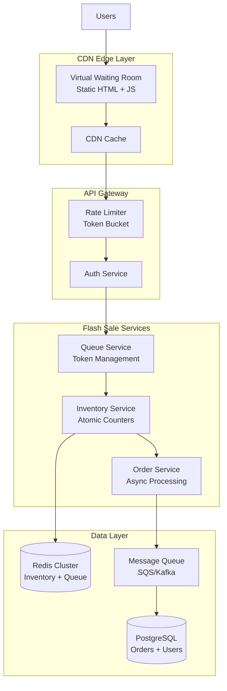
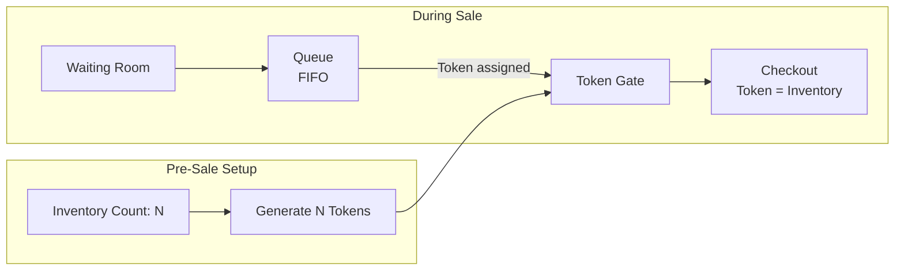
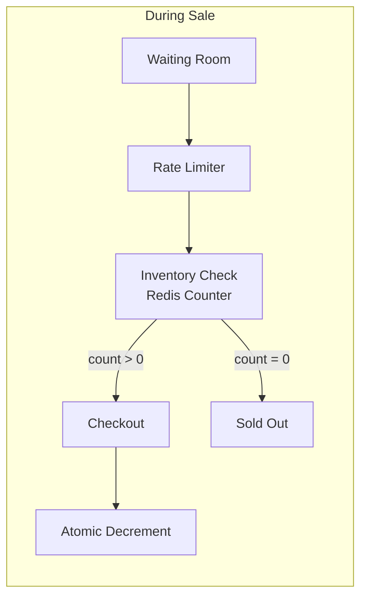
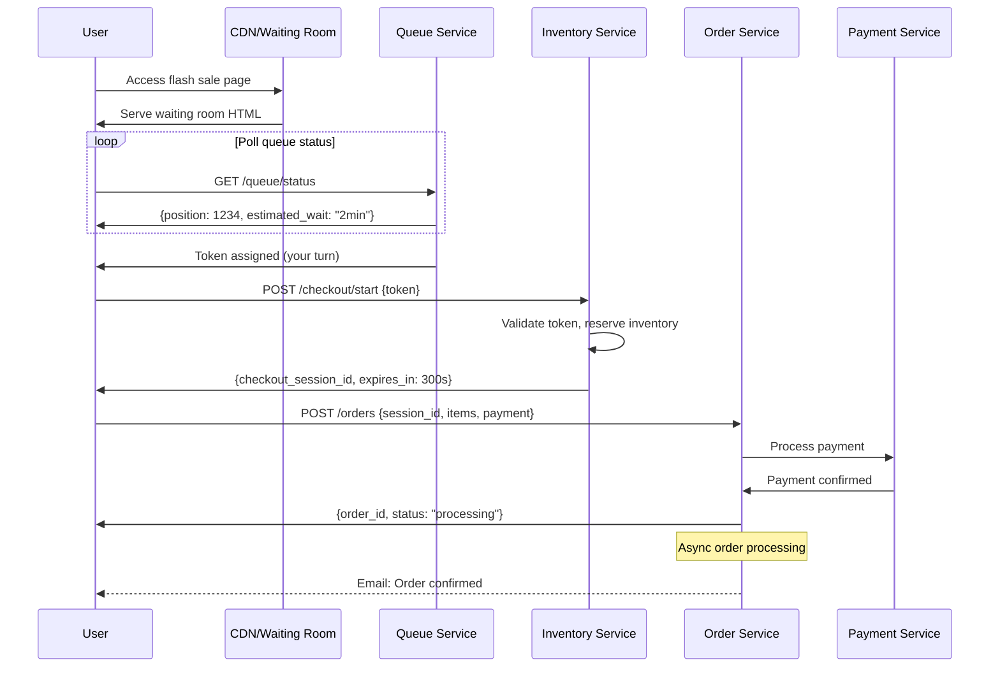
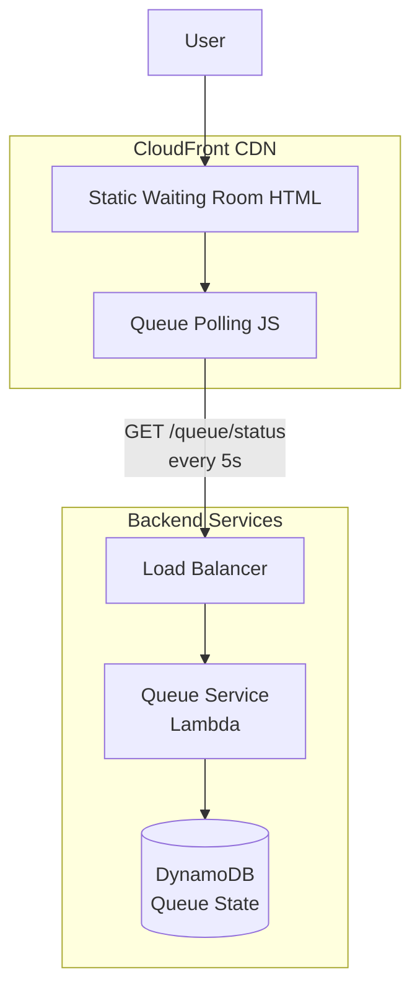
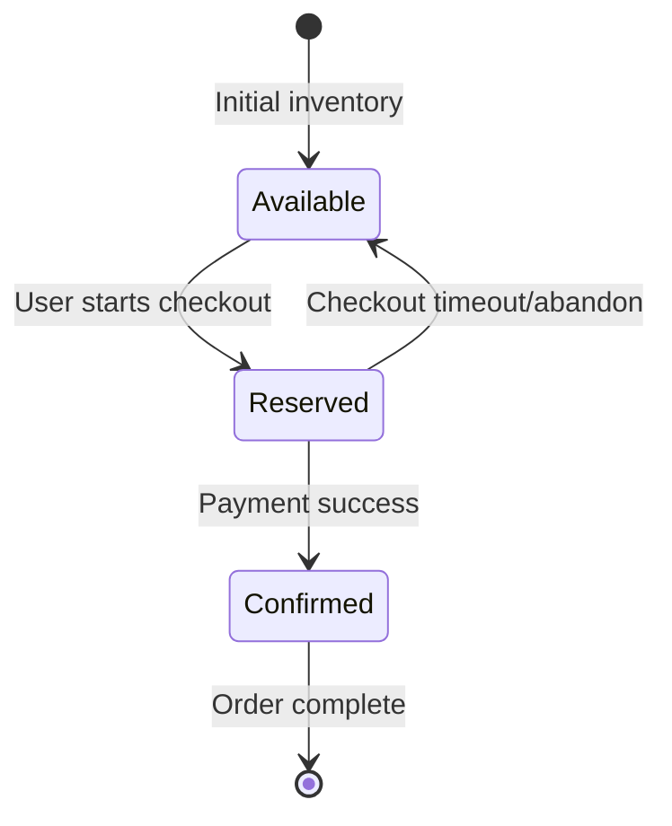
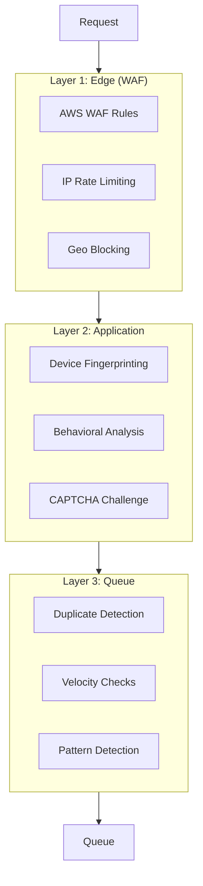
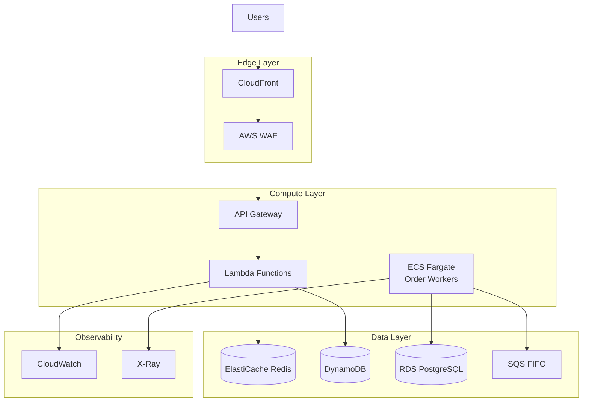

# Design a Flash Sale System

Building a system to handle millions of concurrent users competing for limited inventory during time-bounded sales events. Flash sales present a unique challenge: extreme traffic spikes (10-100x normal) concentrated in seconds, with zero tolerance for inventory errors. This design covers virtual waiting rooms, atomic inventory management, and asynchronous order processing.

<figure>



<figcaption>Flash sale system architecture: CDN-based waiting room absorbs traffic spike, queue service manages admission, Redis handles atomic inventory, message queue decouples order processing.</figcaption>
</figure>

## Abstract

Flash sale design centers on three constraints working against each other:

1. **Traffic absorption** — Millions of users arriving in seconds cannot hit your database directly. A CDN-hosted waiting room absorbs the spike; a queue service meters admission at backend capacity.

2. **Inventory accuracy** — Overselling destroys trust. Redis Lua scripts provide atomic "check-and-decrement" operations. Pre-allocation (tokens = inventory) bounds the problem.

3. **Order durability under load** — Synchronous order processing cannot scale to 500K+ TPS. Asynchronous queues decouple order receipt from processing, with guaranteed delivery.

The mental model: **waiting room → token gate → atomic inventory → async order queue**. Each layer handles one constraint and shields the next.

| Design Decision        | Tradeoff                                                  |
| ---------------------- | --------------------------------------------------------- |
| CDN waiting room       | Absorbs traffic cheaply; adds user-facing latency         |
| Token-based admission  | Prevents overselling; requires pre-allocation             |
| Redis atomic counters  | Sub-millisecond inventory checks; single point of failure |
| Async order processing | Handles 100x normal load; delayed confirmation            |

## Requirements

### Functional Requirements

| Feature                     | Scope    | Notes                                 |
| --------------------------- | -------- | ------------------------------------- |
| Virtual waiting room        | Core     | Absorbs traffic spike before backend  |
| Queue management            | Core     | FIFO admission with position tracking |
| Inventory reservation       | Core     | Atomic decrement, no overselling      |
| Order placement             | Core     | Async processing with durability      |
| Bot detection               | Core     | Multi-layer defense                   |
| Payment processing          | Core     | Idempotent, timeout-aware             |
| Order confirmation          | Core     | Email/push notification               |
| Purchase limits             | Extended | 1-2 units per customer                |
| VIP early access            | Extended | Tiered queue priority                 |
| Real-time inventory display | Extended | Eventually consistent display         |

### Non-Functional Requirements

| Requirement             | Target    | Rationale                                                           |
| ----------------------- | --------- | ------------------------------------------------------------------- |
| Availability            | 99.99%    | Revenue impact; Alibaba achieved "zero downtime" during Singles Day |
| Waiting room latency    | < 100ms   | Static CDN, must feel instant                                       |
| Inventory check latency | < 50ms    | Critical path, Redis required                                       |
| Checkout latency        | < 5s      | User-acceptable; async processing hides backend                     |
| Queue position accuracy | Real-time | Trust requires visible progress                                     |
| Inventory accuracy      | 100%      | Zero tolerance for overselling                                      |
| Order durability        | Zero loss | Queued orders must survive failures                                 |

### Scale Estimation

**Traffic Profile:**

| Metric               | Normal  | Flash Sale Peak | Multiplier |
| -------------------- | ------- | --------------- | ---------- |
| Concurrent users     | 100K    | 10M             | 100x       |
| Page requests/sec    | 10K RPS | 1M RPS          | 100x       |
| Inventory checks/sec | 1K RPS  | 500K RPS        | 500x       |
| Orders/sec           | 100 TPS | 10K TPS         | 100x       |

**Back-of-envelope (1M users, 10K inventory):**

```
Users arriving in first minute: 1,000,000
Waiting room page views: 1M × 3 refreshes = 3M requests/min = 50K RPS
Queue status checks: 1M × 1 check/5sec = 200K RPS
Inventory checks (admitted users): 50K users admitted × 1 check = 50K RPS spike
Orders attempted: 50K (not all convert)
Orders completed: 10K (inventory limit)
```

**Storage:**

```
Queue state: 1M users × 100 bytes = 100MB (Redis)
Order records: 10K orders × 5KB = 50MB (PostgreSQL)
Event logs: 10M events × 200 bytes = 2GB/sale
```

## Design Paths

### Path A: Pre-Allocation Model (Token-Based)

**Best when:**

- Fixed, known inventory quantity
- Fairness is paramount (ticketing, limited editions)
- High-value items where overselling is catastrophic

**Architecture:**



**Key characteristics:**

- Tokens generated equal to inventory before sale starts
- Each admitted user receives one token
- Token guarantees checkout opportunity (not purchase—user may abandon)
- Token expires if unused (returns to pool)

**Trade-offs:**

- :white_check_mark: Zero overselling by construction
- :white_check_mark: Predictable admission rate
- :white_check_mark: Fair (FIFO or randomized entry)
- :x: Requires accurate inventory count pre-sale
- :x: Token management complexity (expiration, reclaim)
- :x: Abandoned tokens reduce conversion

**Real-world example:** SeatGeek uses token-based admission for concert ticket sales. Lambda + DynamoDB manages token lifecycle; tokens expire on purchase or 15-minute timeout, returning to the pool for the next user in queue.

### Path B: Real-Time Inventory Model (Counter-Based)

**Best when:**

- Dynamic inventory (multiple warehouses, restocking)
- E-commerce flash sales with variable stock
- Lower-stakes items where occasional overselling is recoverable

**Architecture:**



**Key characteristics:**

- No pre-allocation; inventory checked in real-time
- Atomic decrement at checkout (not admission)
- Rate limiting protects backend; doesn't guarantee purchase
- Inventory can be restocked mid-sale

**Trade-offs:**

- :white_check_mark: Handles dynamic inventory
- :white_check_mark: Simpler pre-sale setup
- :white_check_mark: Can restock mid-sale
- :x: Overselling risk if counter and order processing desync
- :x: Users admitted without guarantee (frustration)
- :x: Thundering herd on inventory service if rate limiting fails

**Real-world example:** Alibaba Singles Day uses Redis atomic counters with Lua scripts. Product ID = key, inventory = value. Lua script performs atomic `GET + DECR` in single operation. Handles 583K operations/second with careful sharding.

### Path Comparison

| Factor            | Path A (Token)              | Path B (Counter)              |
| ----------------- | --------------------------- | ----------------------------- |
| Overselling risk  | Zero                        | Low (with proper atomicity)   |
| Setup complexity  | Higher                      | Lower                         |
| Dynamic inventory | Difficult                   | Native                        |
| User expectation  | Guaranteed opportunity      | Best effort                   |
| Fairness          | Explicit (token order)      | Implicit (first to checkout)  |
| Best for          | Ticketing, limited releases | E-commerce, restockable goods |

### This Article's Focus

This article implements **Path A (Token-Based)** for the core flow because:

1. Flash sales typically have fixed, high-value inventory
2. Fairness is a differentiator (users accept waiting if fair)
3. Zero overselling is non-negotiable for most use cases

Path B implementation details are covered in the [Variations](#variations) section.

## High-Level Design

### Component Overview

| Component            | Responsibility                               | Technology               |
| -------------------- | -------------------------------------------- | ------------------------ |
| Virtual Waiting Room | Absorb traffic spike, display queue position | Static HTML on CDN       |
| Queue Service        | Manage admission, assign tokens              | Lambda + DynamoDB        |
| Inventory Service    | Atomic inventory operations                  | Redis Cluster            |
| Order Service        | Process orders asynchronously                | ECS + SQS                |
| Payment Service      | Handle payments idempotently                 | Stripe/Adyen integration |
| Notification Service | Send confirmations                           | SES + SNS                |
| Bot Detection        | Filter non-human traffic                     | WAF + Custom rules       |

### Request Flow



## API Design

### Queue Service APIs

#### Join Queue

```http
POST /api/v1/queue/join
Authorization: Bearer {user_token}
X-Device-Fingerprint: {fingerprint}

{
  "sale_id": "flash-sale-2024-001",
  "product_ids": ["sku-001", "sku-002"]
}
```

**Response (202 Accepted):**

```json
{
  "queue_ticket": "qt_abc123xyz",
  "position": 15234,
  "estimated_wait_seconds": 180,
  "status_url": "/api/v1/queue/status/qt_abc123xyz"
}
```

**Error responses:**

- `400 Bad Request`: Invalid sale_id or product not in flash sale
- `403 Forbidden`: Bot detected or user already in queue
- `429 Too Many Requests`: Rate limit exceeded

#### Check Queue Status

```http
GET /api/v1/queue/status/{queue_ticket}
```

**Response (200 OK):**

```json
{
  "queue_ticket": "qt_abc123xyz",
  "status": "waiting",
  "position": 8234,
  "estimated_wait_seconds": 90,
  "poll_interval_seconds": 5
}
```

**Status values:**

- `waiting`: In queue, not yet admitted
- `admitted`: Token assigned, can proceed to checkout
- `expired`: Waited too long, removed from queue
- `completed`: Purchased or abandoned checkout

#### Token Admission (Internal)

When user reaches front of queue:

```json
{
  "queue_ticket": "qt_abc123xyz",
  "status": "admitted",
  "checkout_token": "ct_xyz789abc",
  "checkout_url": "/checkout?token=ct_xyz789abc",
  "token_expires_at": "2024-03-15T10:05:00Z"
}
```

### Checkout Service APIs

#### Start Checkout Session

```http
POST /api/v1/checkout/start
Authorization: Bearer {user_token}

{
  "checkout_token": "ct_xyz789abc",
  "product_id": "sku-001",
  "quantity": 1
}
```

**Response (201 Created):**

```json
{
  "session_id": "cs_def456",
  "reserved_until": "2024-03-15T10:05:00Z",
  "product": {
    "id": "sku-001",
    "name": "Limited Edition Sneaker",
    "price": 299.0,
    "currency": "USD"
  },
  "next_step": "payment"
}
```

**Error responses:**

- `400 Bad Request`: Invalid token or product
- `409 Conflict`: Token already used
- `410 Gone`: Token expired
- `422 Unprocessable`: Inventory exhausted (token invalid)

#### Submit Order

```http
POST /api/v1/orders
Authorization: Bearer {user_token}

{
  "session_id": "cs_def456",
  "shipping_address": {
    "line1": "123 Main St",
    "city": "San Francisco",
    "state": "CA",
    "postal_code": "94102",
    "country": "US"
  },
  "payment_method_id": "pm_card_visa"
}
```

**Response (202 Accepted):**

```json
{
  "order_id": "ord_789xyz",
  "status": "processing",
  "estimated_confirmation": "< 60 seconds",
  "tracking_url": "/api/v1/orders/ord_789xyz"
}
```

**Design note:** Returns 202 (not 201) because order processing is asynchronous. The order is durably queued but not yet confirmed.

### Pagination Strategy

Queue status uses cursor-based polling, not traditional pagination:

```json
{
  "position": 1234,
  "poll_interval_seconds": 5,
  "next_poll_after": "2024-03-15T10:01:05Z"
}
```

**Rationale:** Queue position changes continuously. Polling interval increases as position improves (less uncertainty near front).

## Data Modeling

### Queue State (DynamoDB)

```
Table: FlashSaleQueue
Partition Key: sale_id
Sort Key: queue_ticket

Attributes:
- user_id: string
- position: number (GSI for ordering)
- status: enum [waiting, admitted, expired, completed]
- joined_at: ISO8601
- admitted_at: ISO8601 | null
- checkout_token: string | null
- token_expires_at: ISO8601 | null
- device_fingerprint: string
- ip_address: string
```

**GSI:** `sale_id-position-index` for efficient position lookups.

**Why DynamoDB:** Single-digit millisecond latency at any scale, automatic scaling, TTL for expired entries.

### Inventory Counter (Redis)

```redis
# Inventory count per product
SET inventory:sku-001 10000

# Atomic decrement with Lua script
EVAL "
  local count = redis.call('GET', KEYS[1])
  if tonumber(count) > 0 then
    return redis.call('DECR', KEYS[1])
  else
    return -1
  end
" 1 inventory:sku-001
```

**Why Lua script:** `GET` and `DECR` must be atomic. Without Lua, two concurrent requests could both see `count=1` and both decrement, causing overselling.

### Token Registry (Redis)

```redis
# Token → user mapping with TTL
SETEX token:ct_xyz789abc 300 "user_123"

# Used tokens (prevent replay)
SADD used_tokens:flash-sale-2024-001 ct_xyz789abc
```

**TTL:** 5 minutes for checkout tokens. Expired tokens return to the pool.

### Order Schema (PostgreSQL)

```sql
CREATE TABLE orders (
    id UUID PRIMARY KEY DEFAULT gen_random_uuid(),
    user_id UUID NOT NULL REFERENCES users(id),
    sale_id VARCHAR(50) NOT NULL,
    checkout_token VARCHAR(100) NOT NULL UNIQUE,
    status VARCHAR(20) DEFAULT 'pending',

    -- Order details
    product_id VARCHAR(50) NOT NULL,
    quantity INT NOT NULL DEFAULT 1,
    unit_price DECIMAL(10,2) NOT NULL,
    total_amount DECIMAL(10,2) NOT NULL,
    currency VARCHAR(3) DEFAULT 'USD',

    -- Shipping
    shipping_address JSONB NOT NULL,

    -- Payment
    payment_intent_id VARCHAR(100),
    payment_status VARCHAR(20),

    -- Timestamps
    created_at TIMESTAMPTZ DEFAULT NOW(),
    confirmed_at TIMESTAMPTZ,

    -- Idempotency
    idempotency_key VARCHAR(100) UNIQUE
);

CREATE INDEX idx_orders_user ON orders(user_id, created_at DESC);
CREATE INDEX idx_orders_sale ON orders(sale_id, status);
CREATE INDEX idx_orders_payment ON orders(payment_intent_id);
```

**Idempotency key:** Prevents duplicate orders if user retries during network issues. Typically `{user_id}:{checkout_token}`.

### Database Selection Matrix

| Data               | Store         | Rationale                                |
| ------------------ | ------------- | ---------------------------------------- |
| Queue state        | DynamoDB      | Single-digit ms latency, auto-scale, TTL |
| Inventory counters | Redis Cluster | Sub-ms atomic operations                 |
| Tokens             | Redis         | TTL, fast lookup                         |
| Orders             | PostgreSQL    | ACID, complex queries, durability        |
| Event logs         | Kinesis → S3  | High throughput, analytics               |
| User sessions      | Redis         | Fast auth checks                         |

## Low-Level Design

### Virtual Waiting Room

The waiting room is the first line of defense. It must:

1. Absorb millions of requests without backend load
2. Provide fair queue positioning
3. Communicate progress transparently

**Architecture:**



**Static HTML design:**

```html collapse={1-10, 25-30}
<!DOCTYPE html>
<html>
  <head>
    <title>Flash Sale - Please Wait</title>
    <meta http-equiv="Cache-Control" content="no-cache" />
  </head>
  <body>
    <div id="waiting-room">
      <h1>You're in the queue</h1>

      <!-- Key UI elements -->
      <div id="position">Position: <span id="pos-number">--</span></div>
      <div id="estimate">Estimated wait: <span id="wait-time">--</span></div>
      <div id="progress-bar">
        <div id="progress-fill" style="width: 0%"></div>
      </div>

      <!-- Status messages -->
      <div id="status-message">Please keep this tab open</div>
      <div id="redirect-notice" style="display:none">Redirecting to checkout...</div>
    </div>

    <script src="/queue-client.js"></script>
  </body>
</html>
```

**Queue polling logic:**

```typescript collapse={1-8, 40-50}
// queue-client.ts
interface QueueStatus {
  status: "waiting" | "admitted" | "expired"
  position?: number
  estimated_wait_seconds?: number
  checkout_url?: string
  poll_interval_seconds: number
}

async function pollQueueStatus(ticket: string): Promise<void> {
  const response = await fetch(`/api/v1/queue/status/${ticket}`)
  const status: QueueStatus = await response.json()

  switch (status.status) {
    case "waiting":
      updateUI(status.position, status.estimated_wait_seconds)
      // Exponential backoff near front of queue
      const interval = status.poll_interval_seconds * 1000
      setTimeout(() => pollQueueStatus(ticket), interval)
      break

    case "admitted":
      showRedirectNotice()
      // Small delay for user to see the message
      setTimeout(() => {
        window.location.href = status.checkout_url
      }, 1500)
      break

    case "expired":
      showExpiredMessage()
      break
  }
}

// Start polling on page load
const ticket = new URLSearchParams(window.location.search).get("ticket")
if (ticket) {
  pollQueueStatus(ticket)
}
```

**Design decisions:**

| Decision            | Rationale                                                               |
| ------------------- | ----------------------------------------------------------------------- |
| Static HTML on CDN  | Millions of users hitting origin would saturate it; CDN absorbs at edge |
| Client-side polling | Push (WebSocket) at this scale requires massive connection management   |
| Exponential backoff | Users near front poll more frequently; reduces total requests           |
| No refresh needed   | Single-page polling prevents users from losing position by refreshing   |

### Queue Service (Token Management)

The queue service manages the FIFO queue and token assignment.

**Lambda handler:**

```typescript collapse={1-15, 60-75}
// queue-service.ts
import { DynamoDB } from "@aws-sdk/client-dynamodb"
import { DynamoDBDocument } from "@aws-sdk/lib-dynamodb"

const ddb = DynamoDBDocument.from(new DynamoDB({}))

interface QueueEntry {
  sale_id: string
  queue_ticket: string
  user_id: string
  position: number
  status: "waiting" | "admitted" | "expired" | "completed"
  checkout_token?: string
}

export async function joinQueue(
  saleId: string,
  userId: string,
  deviceFingerprint: string,
): Promise<{ ticket: string; position: number }> {
  // Check if user already in queue
  const existing = await findUserInQueue(saleId, userId)
  if (existing) {
    return { ticket: existing.queue_ticket, position: existing.position }
  }

  // Get current queue length (approximate, for position)
  const position = await getNextPosition(saleId)

  const ticket = generateTicket()

  await ddb.put({
    TableName: "FlashSaleQueue",
    Item: {
      sale_id: saleId,
      queue_ticket: ticket,
      user_id: userId,
      position: position,
      status: "waiting",
      joined_at: new Date().toISOString(),
      device_fingerprint: deviceFingerprint,
      ttl: Math.floor(Date.now() / 1000) + 3600, // 1 hour TTL
    },
    ConditionExpression: "attribute_not_exists(queue_ticket)",
  })

  return { ticket, position }
}

export async function admitNextUsers(saleId: string, count: number): Promise<void> {
  // Invoked by EventBridge at fixed rate (e.g., every second)
  // Admits 'count' users from front of queue

  const waiting = await ddb.query({
    TableName: "FlashSaleQueue",
    IndexName: "sale_id-position-index",
    KeyConditionExpression: "sale_id = :sid",
    FilterExpression: "#status = :waiting",
    ExpressionAttributeNames: { "#status": "status" },
    ExpressionAttributeValues: {
      ":sid": saleId,
      ":waiting": "waiting",
    },
    Limit: count,
    ScanIndexForward: true, // Ascending by position (FIFO)
  })

  for (const entry of waiting.Items || []) {
    await admitUser(entry as QueueEntry)
  }
}

async function admitUser(entry: QueueEntry): Promise<void> {
  const token = generateCheckoutToken()
  const expiresAt = new Date(Date.now() + 5 * 60 * 1000) // 5 min

  await ddb.update({
    TableName: "FlashSaleQueue",
    Key: { sale_id: entry.sale_id, queue_ticket: entry.queue_ticket },
    UpdateExpression: "SET #status = :admitted, checkout_token = :token, token_expires_at = :exp",
    ExpressionAttributeNames: { "#status": "status" },
    ExpressionAttributeValues: {
      ":admitted": "admitted",
      ":token": token,
      ":exp": expiresAt.toISOString(),
    },
  })

  // Also store token in Redis for fast lookup during checkout
  await redis.setex(`token:${token}`, 300, entry.user_id)
}
```

**Admission rate control:**

The admission rate must match backend capacity. EventBridge triggers `admitNextUsers` every second:

```
Admission rate = min(backend_capacity, remaining_inventory / expected_checkout_time)

Example:
- Backend can handle 1000 checkouts/sec
- Remaining inventory: 5000
- Average checkout time: 60 seconds
- Admission rate: min(1000, 5000/60) = min(1000, 83) = 83 users/sec
```

**Design decisions:**

| Decision                  | Rationale                                                   |
| ------------------------- | ----------------------------------------------------------- |
| DynamoDB for queue        | Handles millions of entries with single-digit ms latency    |
| Position as GSI           | Enables efficient "next N users" query                      |
| EventBridge for admission | Decouples admission rate from user requests                 |
| Token in Redis + DynamoDB | Redis for fast checkout validation; DynamoDB for durability |

### Inventory Service (Atomic Counters)

The inventory service prevents overselling through atomic operations.

**Redis Lua script for atomic reservation:**

```lua
-- reserve_inventory.lua
-- KEYS[1] = inventory key (e.g., "inventory:sku-001")
-- KEYS[2] = reserved set key (e.g., "reserved:sku-001")
-- ARGV[1] = user_id
-- ARGV[2] = quantity
-- ARGV[3] = reservation_id
-- ARGV[4] = ttl_seconds

local inventory_key = KEYS[1]
local reserved_key = KEYS[2]
local user_id = ARGV[1]
local quantity = tonumber(ARGV[2])
local reservation_id = ARGV[3]
local ttl = tonumber(ARGV[4])

-- Check current inventory
local available = tonumber(redis.call('GET', inventory_key) or 0)

if available < quantity then
    return { err = 'insufficient_inventory', available = available }
end

-- Atomic decrement
local new_count = redis.call('DECRBY', inventory_key, quantity)

if new_count < 0 then
    -- Race condition: restore and fail
    redis.call('INCRBY', inventory_key, quantity)
    return { err = 'race_condition' }
end

-- Track reservation for expiration
redis.call('HSET', reserved_key, reservation_id,
    cjson.encode({ user_id = user_id, quantity = quantity, created_at = redis.call('TIME')[1] }))
redis.call('EXPIRE', reserved_key, ttl)

return { ok = true, remaining = new_count, reservation_id = reservation_id }
```

**Inventory service implementation:**

```typescript collapse={1-12, 50-65}
// inventory-service.ts
import Redis from "ioredis"
import { readFileSync } from "fs"

const redis = new Redis.Cluster([
  { host: "redis-1.example.com", port: 6379 },
  { host: "redis-2.example.com", port: 6379 },
  { host: "redis-3.example.com", port: 6379 },
])

const reserveScript = readFileSync("./reserve_inventory.lua", "utf-8")

interface ReservationResult {
  success: boolean
  reservation_id?: string
  remaining?: number
  error?: string
}

export async function reserveInventory(
  productId: string,
  userId: string,
  quantity: number,
  ttlSeconds: number = 300,
): Promise<ReservationResult> {
  const reservationId = `res_${Date.now()}_${userId}`

  const result = (await redis.eval(
    reserveScript,
    2, // number of keys
    `inventory:${productId}`,
    `reserved:${productId}`,
    userId,
    quantity.toString(),
    reservationId,
    ttlSeconds.toString(),
  )) as any

  if (result.err) {
    return { success: false, error: result.err }
  }

  return {
    success: true,
    reservation_id: reservationId,
    remaining: result.remaining,
  }
}

export async function releaseReservation(productId: string, reservationId: string): Promise<void> {
  // Called when checkout times out or user abandons
  const reserved = await redis.hget(`reserved:${productId}`, reservationId)
  if (reserved) {
    const { quantity } = JSON.parse(reserved)
    await redis.incrby(`inventory:${productId}`, quantity)
    await redis.hdel(`reserved:${productId}`, reservationId)
  }
}

export async function confirmReservation(productId: string, reservationId: string): Promise<void> {
  // Called after successful payment - just remove from reserved set
  await redis.hdel(`reserved:${productId}`, reservationId)
}
```

**Reservation lifecycle:**



**Design decisions:**

| Decision              | Rationale                                            |
| --------------------- | ---------------------------------------------------- |
| Lua script            | Atomic read-check-decrement prevents race conditions |
| Redis Cluster         | Horizontal scaling for high throughput               |
| Reservation with TTL  | Prevents inventory lock-up from abandoned checkouts  |
| Hash for reservations | O(1) lookup/delete by reservation ID                 |

### Order Processing (Async Queue)

Orders are placed on a durable queue for async processing. This decouples order receipt from processing, preventing database overwhelm.

**Order submission flow:**

```typescript collapse={1-10, 55-70}
// order-service.ts
import { SQSClient, SendMessageCommand } from "@aws-sdk/client-sqs"
import { v4 as uuid } from "uuid"

const sqs = new SQSClient({})
const ORDER_QUEUE_URL = process.env.ORDER_QUEUE_URL!

interface OrderRequest {
  session_id: string
  user_id: string
  product_id: string
  quantity: number
  shipping_address: Address
  payment_method_id: string
}

export async function submitOrder(request: OrderRequest): Promise<{ order_id: string }> {
  const orderId = uuid()
  const idempotencyKey = `${request.user_id}:${request.session_id}`

  // Check for duplicate submission
  const existing = await db.orders.findOne({ idempotency_key: idempotencyKey })
  if (existing) {
    return { order_id: existing.id }
  }

  // Create order record in pending state
  await db.orders.insert({
    id: orderId,
    user_id: request.user_id,
    product_id: request.product_id,
    quantity: request.quantity,
    status: "pending",
    idempotency_key: idempotencyKey,
    created_at: new Date(),
  })

  // Queue for async processing
  await sqs.send(
    new SendMessageCommand({
      QueueUrl: ORDER_QUEUE_URL,
      MessageBody: JSON.stringify({
        order_id: orderId,
        ...request,
      }),
      MessageDeduplicationId: idempotencyKey,
      MessageGroupId: request.user_id, // Ensures per-user ordering
    }),
  )

  return { order_id: orderId }
}
```

**Order processor (worker):**

```typescript collapse={1-15, 70-85}
// order-processor.ts
import { SQSEvent, SQSRecord } from "aws-lambda"
import Stripe from "stripe"

const stripe = new Stripe(process.env.STRIPE_SECRET_KEY!)

interface OrderMessage {
  order_id: string
  user_id: string
  product_id: string
  quantity: number
  shipping_address: Address
  payment_method_id: string
  session_id: string
}

export async function handler(event: SQSEvent): Promise<void> {
  for (const record of event.Records) {
    await processOrder(record)
  }
}

async function processOrder(record: SQSRecord): Promise<void> {
  const message: OrderMessage = JSON.parse(record.body)

  try {
    // 1. Verify reservation still valid
    const reservation = await getReservation(message.product_id, message.session_id)
    if (!reservation) {
      await markOrderFailed(message.order_id, "reservation_expired")
      return
    }

    // 2. Process payment
    const paymentIntent = await stripe.paymentIntents.create({
      amount: calculateTotal(message.product_id, message.quantity),
      currency: "usd",
      payment_method: message.payment_method_id,
      confirm: true,
      idempotency_key: `payment_${message.order_id}`,
    })

    if (paymentIntent.status !== "succeeded") {
      await releaseReservation(message.product_id, message.session_id)
      await markOrderFailed(message.order_id, "payment_failed")
      return
    }

    // 3. Confirm inventory (remove from reserved set)
    await confirmReservation(message.product_id, message.session_id)

    // 4. Update order status
    await db.orders.update(message.order_id, {
      status: "confirmed",
      payment_intent_id: paymentIntent.id,
      confirmed_at: new Date(),
    })

    // 5. Send confirmation
    await sendOrderConfirmation(message.order_id)
  } catch (error) {
    // Let SQS retry with exponential backoff
    throw error
  }
}

async function markOrderFailed(orderId: string, reason: string): Promise<void> {
  await db.orders.update(orderId, {
    status: "failed",
    failure_reason: reason,
  })

  // Notify user
  await sendOrderFailureNotification(orderId, reason)
}
```

**Dead letter queue handling:**

Orders that fail after max retries go to a Dead Letter Queue (DLQ) for manual review:

```typescript
// dlq-processor.ts
export async function handleDeadLetter(record: SQSRecord): Promise<void> {
  const message = JSON.parse(record.body)

  // Log for investigation
  console.error("Order failed permanently", {
    order_id: message.order_id,
    attempts: record.attributes.ApproximateReceiveCount,
    error: record.attributes.DeadLetterQueueSourceArn,
  })

  // Alert ops team
  await pagerduty.createIncident({
    title: `Flash sale order failed: ${message.order_id}`,
    severity: "high",
  })

  // Release inventory back to pool
  await releaseReservation(message.product_id, message.session_id)
}
```

**Design decisions:**

| Decision                    | Rationale                                          |
| --------------------------- | -------------------------------------------------- |
| SQS FIFO queue              | Exactly-once processing, per-user ordering         |
| Idempotency key             | Prevents duplicate orders on retry                 |
| Payment before confirmation | Never confirm inventory without successful payment |
| DLQ for failures            | Ensures no order is silently lost                  |

## Bot Detection and Fairness

### Multi-Layer Bot Defense



**Layer 1: Edge defense (WAF)**

```yaml
# AWS WAF rules for flash sale
Rules:
  - Name: RateLimitPerIP
    Action: Block
    Statement:
      RateBasedStatement:
        Limit: 100 # requests per 5 minutes per IP
        AggregateKeyType: IP

  - Name: BlockKnownBots
    Action: Block
    Statement:
      IPSetReferenceStatement:
        ARN: arn:aws:wafv2:....:ipset/known-bots

  - Name: GeoRestriction
    Action: Block
    Statement:
      NotStatement:
        Statement:
          GeoMatchStatement:
            CountryCodes: [US, CA, GB, DE] # Allowed countries
```

**Layer 2: Application-level detection**

```typescript collapse={1-5, 35-45}
// bot-detection.ts
interface BotSignals {
  score: number
  signals: string[]
}

export function detectBot(request: Request): BotSignals {
  const signals: string[] = []
  let score = 0

  // Device fingerprint consistency
  const fp = request.headers.get("x-device-fingerprint")
  if (!fp || fp.length < 32) {
    signals.push("missing_fingerprint")
    score += 30
  }

  // Behavioral signals
  const timing = parseTimingHeader(request)
  if (timing.pageLoadToAction < 500) {
    // < 500ms is suspicious
    signals.push("fast_interaction")
    score += 25
  }

  // Browser consistency
  const ua = request.headers.get("user-agent")
  const acceptLang = request.headers.get("accept-language")
  if (isHeadlessBrowser(ua) || !acceptLang) {
    signals.push("headless_indicators")
    score += 40
  }

  // Known residential proxy detection
  const ip = getClientIP(request)
  if (await isResidentialProxy(ip)) {
    signals.push("residential_proxy")
    score += 20
  }

  return { score, signals }
}

export function shouldChallenge(signals: BotSignals): boolean {
  return signals.score >= 50
}

export function shouldBlock(signals: BotSignals): boolean {
  return signals.score >= 80
}
```

**Layer 3: Queue-level protection**

```typescript
// queue-protection.ts
export async function validateQueueJoin(
  userId: string,
  deviceFingerprint: string,
  saleId: string,
): Promise<{ allowed: boolean; reason?: string }> {
  // Check for duplicate user
  const existingEntry = await findUserInQueue(saleId, userId)
  if (existingEntry) {
    return { allowed: false, reason: "already_in_queue" }
  }

  // Check for fingerprint reuse (same device, different accounts)
  const fpCount = await countFingerprintInQueue(saleId, deviceFingerprint)
  if (fpCount >= 2) {
    return { allowed: false, reason: "device_limit_exceeded" }
  }

  // Velocity check: how many queues has this user joined recently?
  const recentJoins = await countRecentQueueJoins(userId, 3600) // last hour
  if (recentJoins >= 5) {
    return { allowed: false, reason: "velocity_exceeded" }
  }

  return { allowed: true }
}
```

### Fairness Mechanisms

**1. FIFO queue with randomized entry window**

Users who arrive before sale start are randomized when the sale begins (prevents "refresh at exactly 10:00:00" advantage):

```typescript
export async function openSaleQueue(saleId: string): Promise<void> {
  // Get all users who arrived in pre-sale window (e.g., last 15 minutes)
  const earlyArrivals = await getEarlyArrivals(saleId)

  // Shuffle positions randomly
  const shuffled = shuffleArray(earlyArrivals)

  // Assign positions 1, 2, 3, ...
  for (let i = 0; i < shuffled.length; i++) {
    await updatePosition(shuffled[i].queue_ticket, i + 1)
  }

  // Users arriving after sale start get position = current_max + 1 (true FIFO)
}
```

**2. Per-customer purchase limits**

```typescript
export async function validatePurchaseLimit(userId: string, productId: string, quantity: number): Promise<boolean> {
  const existingOrders = await db.orders.count({
    user_id: userId,
    product_id: productId,
    status: { $in: ["confirmed", "pending"] },
  })

  const LIMIT_PER_USER = 2
  return existingOrders + quantity <= LIMIT_PER_USER
}
```

## Frontend Considerations

### Waiting Room UX

**Critical UX decisions:**

| Decision                  | Implementation                           | Rationale                                       |
| ------------------------- | ---------------------------------------- | ----------------------------------------------- |
| Progress indicator        | Position + estimated time + progress bar | Reduces anxiety; users know they're progressing |
| No refresh needed         | SPA with polling                         | Prevents users from losing position             |
| Transparent communication | Show exact position                      | Trust requires honesty                          |
| Graceful degradation      | Static HTML                              | Must work even if JS fails                      |

**Optimistic UI for checkout:**

```typescript
// checkout-ui.ts
async function submitOrder(orderData: OrderData): Promise<void> {
  // Optimistic: show "Processing..." immediately
  setOrderStatus("processing")
  showConfirmationPreview(orderData)

  try {
    const { order_id } = await api.submitOrder(orderData)

    // Poll for confirmation (async processing)
    pollOrderStatus(order_id, (status) => {
      if (status === "confirmed") {
        setOrderStatus("confirmed")
        showSuccessAnimation()
      } else if (status === "failed") {
        setOrderStatus("failed")
        showRetryOption()
      }
    })
  } catch (error) {
    // Revert optimistic UI
    setOrderStatus("error")
    showErrorMessage(error)
  }
}
```

### Real-Time Queue Updates

**Polling vs WebSocket decision:**

| Factor         | Polling          | WebSocket                    |
| -------------- | ---------------- | ---------------------------- |
| Scale          | Easy (stateless) | Hard (connection management) |
| Latency        | 5-10s            | Sub-second                   |
| Infrastructure | Simple           | Complex                      |
| Battery impact | Higher           | Lower                        |

**Chosen: Adaptive polling** — Poll every 5s when far from front; every 1s when close.

```typescript
function calculatePollInterval(position: number, totalAhead: number): number {
  const progressPercent = 1 - position / totalAhead

  if (progressPercent > 0.9) return 1000 // Top 10%: 1s
  if (progressPercent > 0.7) return 2000 // Top 30%: 2s
  if (progressPercent > 0.5) return 3000 // Top 50%: 3s
  return 5000 // Back 50%: 5s
}
```

### Client State Management

```typescript
// flash-sale-state.ts
interface FlashSaleState {
  // Queue state
  queueTicket: string | null
  position: number | null
  status: "idle" | "queued" | "admitted" | "checkout" | "completed" | "expired"

  // Checkout state
  checkoutToken: string | null
  checkoutExpiresAt: Date | null
  reservationId: string | null

  // Order state
  orderId: string | null
  orderStatus: "pending" | "processing" | "confirmed" | "failed" | null
}

// State persisted to localStorage for tab recovery
function persistState(state: FlashSaleState): void {
  localStorage.setItem("flash-sale-state", JSON.stringify(state))
}

// Restore on page load (handles accidental tab close)
function restoreState(): FlashSaleState | null {
  const saved = localStorage.getItem("flash-sale-state")
  if (!saved) return null

  const state = JSON.parse(saved)

  // Check if checkout token is still valid
  if (state.checkoutExpiresAt && new Date(state.checkoutExpiresAt) < new Date()) {
    return null // Expired, start fresh
  }

  return state
}
```

## Infrastructure Design

### Cloud-Agnostic Components

| Component          | Purpose                     | Requirements                      |
| ------------------ | --------------------------- | --------------------------------- |
| CDN                | Waiting room, static assets | Edge caching, high throughput     |
| Serverless compute | Queue service, APIs         | Auto-scale, pay-per-use           |
| Key-value store    | Inventory counters, tokens  | Sub-ms latency, atomic operations |
| Document store     | Queue state                 | Single-digit ms, auto-scale       |
| Message queue      | Order processing            | Durability, exactly-once          |
| Relational DB      | Orders, users               | ACID, complex queries             |

### AWS Reference Architecture



**Service configuration:**

| Service     | Configuration                                | Rationale                                |
| ----------- | -------------------------------------------- | ---------------------------------------- |
| CloudFront  | Origin: S3 (static), Cache: 1 year           | Waiting room must survive origin failure |
| API Gateway | Throttling: 10K RPS, Burst: 5K               | Protects backend during spike            |
| Lambda      | Memory: 1024MB, Timeout: 30s, Reserved: 1000 | Predictable latency under load           |
| ElastiCache | Redis Cluster, 3 nodes, r6g.large            | Sub-ms latency, failover                 |
| DynamoDB    | On-demand, Auto-scaling                      | Handles unpredictable load               |
| SQS FIFO    | 3000 msg/sec, 14-day retention               | Order durability                         |
| RDS         | Multi-AZ, db.r6g.xlarge, Read replicas       | ACID + read scaling                      |

### Self-Hosted Alternatives

| Managed Service | Self-Hosted Option   | Trade-off                                 |
| --------------- | -------------------- | ----------------------------------------- |
| ElastiCache     | Redis Cluster on EC2 | More control, operational burden          |
| DynamoDB        | Cassandra/ScyllaDB   | Cost at scale, complexity                 |
| SQS FIFO        | Kafka                | Higher throughput, operational complexity |
| Lambda          | Kubernetes + KEDA    | Fine-grained control, cold starts         |

## Variations

### Path B Implementation: Real-Time Counter Model

For e-commerce with dynamic inventory, replace token-based admission with real-time inventory checks:

```typescript
// real-time-inventory.ts
export async function attemptPurchase(
  productId: string,
  userId: string,
  quantity: number,
): Promise<{ success: boolean; orderId?: string }> {
  // Rate limit first (protect backend)
  const allowed = await rateLimiter.check(userId, "purchase")
  if (!allowed) {
    return { success: false }
  }

  // Atomic inventory check + decrement
  const result = await redis.eval(
    `
    local count = redis.call('GET', KEYS[1])
    if tonumber(count) >= tonumber(ARGV[1]) then
      return redis.call('DECRBY', KEYS[1], ARGV[1])
    else
      return -1
    end
  `,
    1,
    `inventory:${productId}`,
    quantity,
  )

  if (result < 0) {
    return { success: false } // Sold out
  }

  // Proceed to order (inventory already decremented)
  const orderId = await createOrder(productId, userId, quantity)
  return { success: true, orderId }
}
```

**Key difference:** Inventory decremented at purchase attempt, not at queue admission. Higher risk of "sold out after waiting" but supports dynamic restocking.

### VIP Early Access

Add priority tiers to queue service:

```typescript
// vip-queue.ts
interface QueueEntry {
  // ... existing fields
  tier: "vip" | "member" | "standard"
  tierJoinedAt: Date
}

export async function getNextPosition(saleId: string, tier: string): Promise<number> {
  // VIPs get positions 1-1000, members 1001-10000, standard 10001+
  const tierOffsets = { vip: 0, member: 1000, standard: 10000 }
  const offset = tierOffsets[tier]

  const countInTier = await ddb.query({
    TableName: "FlashSaleQueue",
    KeyConditionExpression: "sale_id = :sid",
    FilterExpression: "tier = :tier",
    ExpressionAttributeValues: { ":sid": saleId, ":tier": tier },
  })

  return offset + (countInTier.Count || 0) + 1
}
```

### Raffle-Based Allocation

For extremely limited inventory (e.g., 100 items, 1M users), replace queue with raffle:

```typescript
// raffle-mode.ts
export async function enterRaffle(saleId: string, userId: string): Promise<void> {
  // Entry window: 1 hour before draw
  await ddb.put({
    TableName: "FlashSaleRaffle",
    Item: {
      sale_id: saleId,
      user_id: userId,
      entry_id: uuid(),
      entered_at: new Date().toISOString(),
    },
  })
}

export async function drawWinners(saleId: string, count: number): Promise<string[]> {
  // Get all entries
  const entries = await getAllEntries(saleId)

  // Cryptographically random selection
  const shuffled = cryptoShuffle(entries)
  const winners = shuffled.slice(0, count)

  // Grant checkout tokens to winners
  for (const winner of winners) {
    await grantCheckoutToken(winner.user_id, saleId)
  }

  return winners.map((w) => w.user_id)
}
```

## Conclusion

Flash sale systems require coordinated defense at every layer:

1. **Traffic absorption**: CDN-hosted waiting room prevents backend overwhelm. Static HTML + client-side polling scales infinitely at the edge.

2. **Fair admission**: Token-based queue management (Path A) guarantees purchase opportunity. FIFO with randomized early arrival prevents "refresh race."

3. **Inventory accuracy**: Redis Lua scripts provide atomic check-and-decrement. Zero overselling through construction, not hope.

4. **Order durability**: Async processing via SQS decouples order receipt from processing. DLQ ensures no order is silently lost.

5. **Bot defense**: Multi-layer detection (WAF → behavioral → queue-level) raises the bar for attackers without blocking legitimate users.

**What this design optimizes for:**

- Zero overselling (100% inventory accuracy)
- Fairness (transparent queue position)
- Durability (no lost orders)
- Scalability (1M+ concurrent users)

**What it sacrifices:**

- Latency (queue wait time)
- Simplicity (multiple coordinated services)
- Dynamic inventory (pre-allocation model)

**Known limitations:**

- Token expiration requires careful tuning (too short: frustrated users; too long: wasted inventory)
- Sophisticated bots with residential proxies remain challenging
- VIP tiers can feel unfair to standard users

## Appendix

### Prerequisites

- Distributed systems fundamentals (CAP theorem, consistency models)
- Queue theory basics (FIFO, rate limiting)
- Redis data structures and Lua scripting
- Message queue patterns (at-least-once, exactly-once)
- Payment processing (idempotency, webhooks)

### Summary

- Flash sales require a **waiting room → token gate → atomic inventory → async order queue** architecture
- **CDN-hosted waiting room** absorbs traffic spikes cheaply and reliably
- **Token-based admission** (Path A) guarantees purchase opportunity and prevents overselling by construction
- **Redis Lua scripts** provide atomic inventory operations at 500K+ ops/second
- **Async order processing** via message queues decouples order receipt from fulfillment
- **Multi-layer bot defense** (WAF + behavioral + queue-level) raises attack cost without blocking legitimate users

### References

- [Alibaba Cloud: System Stability for Large-Scale Flash Sales](https://www.alibabacloud.com/blog/system-stability-assurance-for-large-scale-flash-sales_596968) - Alibaba Singles Day architecture
- [AWS Prime Day 2025 Metrics](https://aws.amazon.com/blogs/aws/aws-services-scale-to-new-heights-for-prime-day-2025-key-metrics-and-milestones/) - Scale benchmarks
- [SeatGeek Virtual Waiting Room Architecture](https://aws.amazon.com/blogs/architecture/build-a-virtual-waiting-room-with-amazon-dynamodb-and-aws-lambda-at-seatgeek/) - Token-based queue implementation
- [Shopify Flash Sales Architecture](https://www.infoq.com/presentations/shopify-architecture-flash-sale/) - Multi-tenant SaaS approach
- [Ticketmaster Queue System](https://blog.ticketmaster.com/how-ticketmaster-queue-works/) - Virtual waiting room UX
- [Redis Distributed Locks](https://redis.io/docs/latest/develop/clients/patterns/distributed-locks/) - Atomic operations patterns
- [Martin Kleppmann: Designing Data-Intensive Applications](https://dataintensive.net/) - Distributed systems fundamentals
