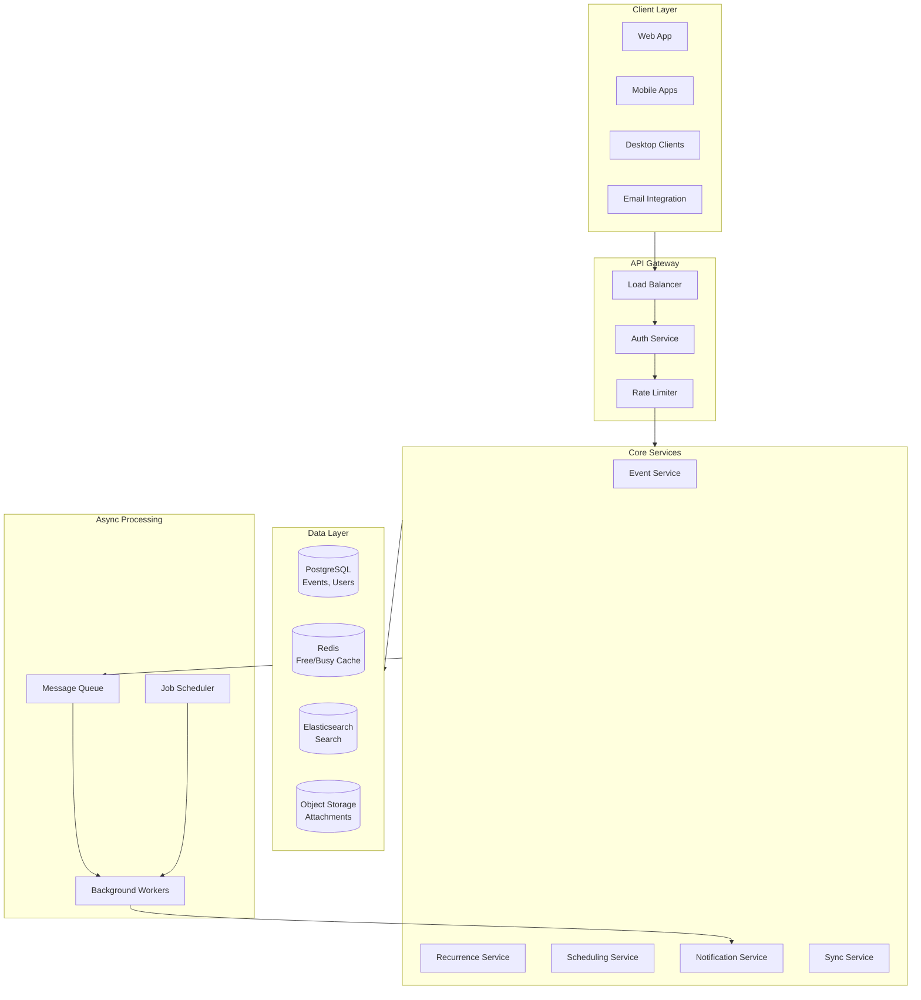
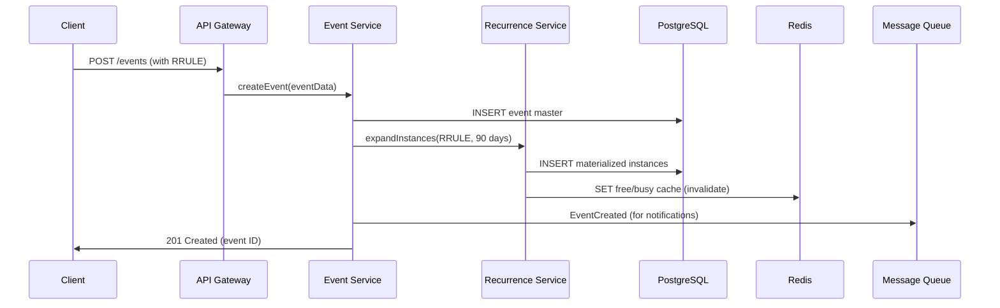
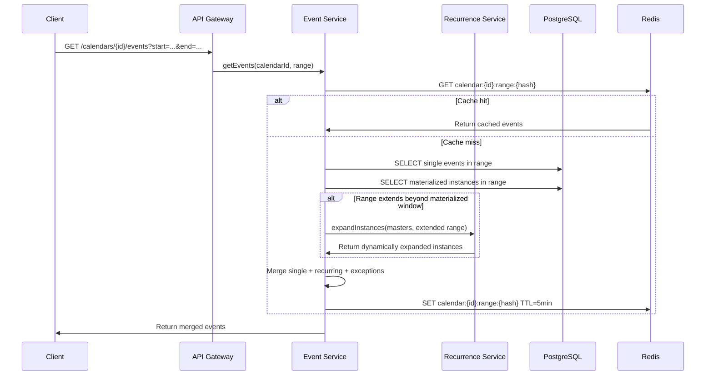
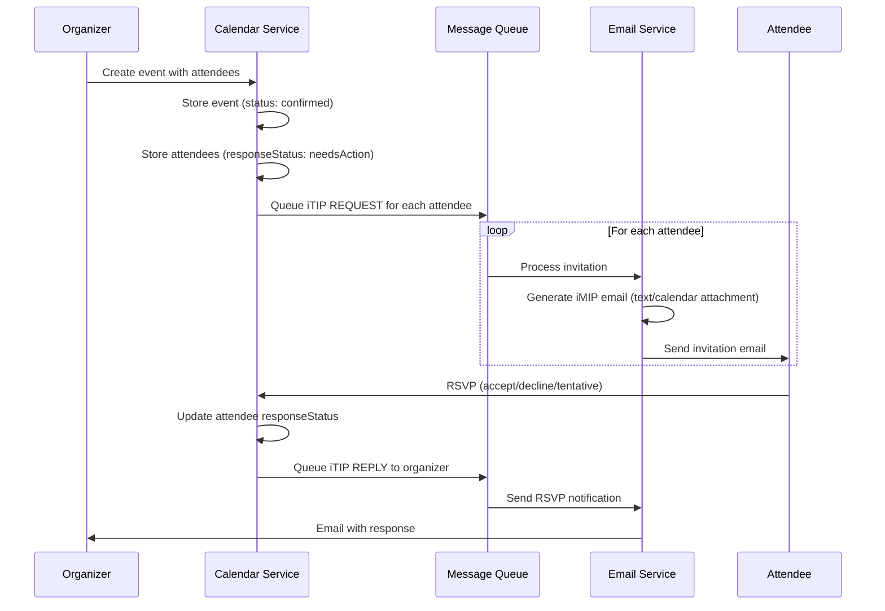
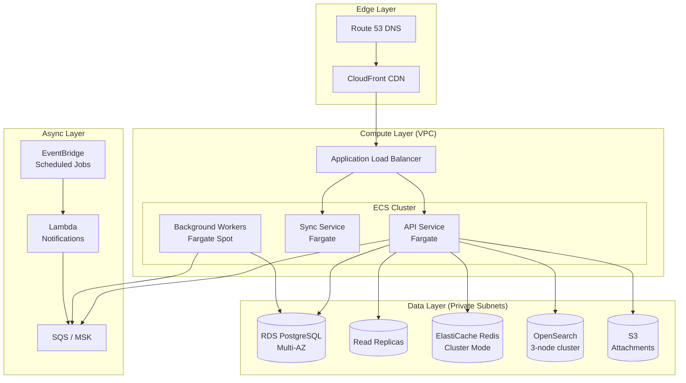

# Design Google Calendar

A comprehensive system design for a calendar and scheduling application handling recurring events, timezone complexity, and real-time collaboration. This design addresses event recurrence at scale (RRULE expansion), global timezone handling across DST boundaries, availability aggregation for meeting scheduling, and multi-client synchronization with conflict resolution.

<figure>



<figcaption>High-level architecture: Clients connect through an API gateway to core services backed by a hybrid data layer with async processing for notifications and recurrence expansion.</figcaption>
</figure>

## Abstract

Calendar systems solve three interconnected problems: **temporal data modeling** (representing events, recurrence rules, and exceptions), **timezone arithmetic** (displaying the same event correctly across global participants), and **availability computation** (finding meeting slots across multiple calendars).

The core data model stores **recurring event masters** with RRULE strings (RFC 5545) rather than individual instances. Expansion happens in a **hybrid approach**: materialize instances 30-90 days ahead for query performance, expand dynamically beyond that window. Exceptions (cancellations, single-instance modifications) are stored separately and merged at read time.

**Timezone handling** requires storing events in local time with named IANA timezone identifiers—never raw UTC offsets. This ensures a "9 AM daily standup" remains at 9 AM local time across DST transitions.

**Conflict-free synchronization** uses sync-tokens (RFC 6578) for incremental updates. Each calendar has a monotonically increasing token; clients send their last token and receive only changes since that state. For concurrent edits, the server maintains the event history and uses last-write-wins with user notification for conflicts.

## Requirements

### Functional Requirements

| Feature                                          | Priority | Scope        |
| ------------------------------------------------ | -------- | ------------ |
| Single events (create, read, update, delete)     | Core     | Full         |
| Recurring events (RRULE support)                 | Core     | Full         |
| Event exceptions (cancel/modify single instance) | Core     | Full         |
| Time zone handling with DST                      | Core     | Full         |
| Meeting invitations (RSVP workflow)              | Core     | Full         |
| Free/busy queries                                | Core     | Full         |
| Calendar sharing and delegation                  | Core     | Full         |
| Reminders and notifications                      | Core     | Full         |
| Multi-client sync (CalDAV)                       | Core     | Full         |
| Calendar search                                  | High     | Full         |
| Meeting room/resource booking                    | High     | Overview     |
| Video conferencing integration                   | Medium   | Brief        |
| Task management (VTODO)                          | Low      | Out of scope |

### Non-Functional Requirements

| Requirement                    | Target          | Rationale                                                   |
| ------------------------------ | --------------- | ----------------------------------------------------------- |
| Availability                   | 99.99%          | Calendar access is mission-critical for business operations |
| Read latency (calendar view)   | p99 < 200ms     | Month view may expand hundreds of recurring events          |
| Write latency (event creation) | p99 < 500ms     | Acceptable for user-initiated actions                       |
| Sync latency                   | < 5 seconds     | Changes should propagate across devices quickly             |
| Data consistency               | Eventual (< 5s) | Strong consistency not required for calendar data           |
| Data retention                 | 10+ years       | Historical calendar data has legal/compliance value         |

### Scale Estimation

**Users:**

- MAU: 500M (Google Workspace + consumer Gmail)
- DAU: 100M
- Peak concurrent: 10M (10% of DAU)

**Events:**

- Average events per user: 50 active recurring + 200 single events
- Total events: 500M users × 250 events = 125B event records
- But with recurrence masters (not instances): ~25B records

**Traffic:**

- Calendar loads: 100M DAU × 10 loads/day = 1B/day = ~12K RPS
- Event writes: 100M DAU × 2 writes/day = 200M/day = ~2.3K RPS
- Free/busy queries: 100M DAU × 0.5/day = 50M/day = ~580 RPS
- Peak multiplier: 3x → 36K RPS reads, 7K RPS writes

**Storage:**

- Event master: ~2KB average (metadata, description, RRULE, attendees)
- 25B events × 2KB = 50TB primary storage
- With indexes, replicas, and history: ~200TB total

## Design Paths

### Path A: RRULE-Centric (Store Rules, Expand on Read)

**Best when:**

- Events have long or infinite recurrence (daily standups forever)
- Storage cost is a primary concern
- Updates to recurring series are frequent

**Key characteristics:**

- Store only the recurrence rule in the events table
- Expand instances dynamically when querying a date range
- Cache expansion results in Redis for frequently accessed calendars

**Trade-offs:**

- ✅ Minimal storage (one record per recurring series)
- ✅ Updating series changes all future instances instantly
- ✅ Supports infinite recurrence naturally
- ❌ CPU-intensive expansion for complex RRULEs
- ❌ Slow queries spanning long date ranges
- ❌ Exception handling adds query complexity

**Real-world example:** Many open-source CalDAV servers (Radicale, DAViCal) use this approach because storage efficiency matters more than query speed for personal calendars.

### Path B: Instance-Centric (Materialize All Instances)

**Best when:**

- Queries span arbitrary date ranges frequently
- Meeting scheduling and free/busy aggregation are critical
- Most events have bounded recurrence (end dates)

**Key characteristics:**

- Pre-expand all instances into a separate table
- Recurring series modifications trigger batch updates to instances
- Indexes on start_time enable fast range queries

**Trade-offs:**

- ✅ O(1) range queries—just filter by date
- ✅ Simple free/busy aggregation (SUM over intervals)
- ✅ Exception instances are just rows with modified fields
- ❌ Storage explosion (daily event for 10 years = 3,650 rows)
- ❌ Series updates require updating thousands of rows
- ❌ Cannot support infinite recurrence

**Real-world example:** Microsoft Outlook's Exchange uses materialization for corporate calendars where meeting scheduling performance is paramount.

### Path C: Hybrid (Chosen Approach)

**Best when:**

- Mix of short-term and long-term recurring events
- Need both fast queries and storage efficiency
- Workload varies (view calendar vs. schedule meetings)

**Key characteristics:**

- Store recurrence rules in the master events table
- Materialize instances for a rolling window (30-90 days)
- Expand dynamically beyond the materialized window
- Background jobs refresh materialized instances nightly

**Trade-offs:**

- ✅ Fast queries within the materialized window
- ✅ Reasonable storage (30-90 instances per series, not thousands)
- ✅ Can support infinite recurrence (expand on demand)
- ✅ Series updates only touch instances within window
- ❌ More complex architecture (two code paths)
- ❌ Stale data possible if background jobs lag

### Path Comparison

| Factor              | Path A (RRULE)     | Path B (Instance)     | Path C (Hybrid)    |
| ------------------- | ------------------ | --------------------- | ------------------ |
| Storage             | Minimal            | High                  | Moderate           |
| Read latency        | High (expansion)   | Low                   | Low within window  |
| Write complexity    | Low                | High (batch updates)  | Moderate           |
| Infinite recurrence | Yes                | No                    | Yes                |
| Free/busy speed     | Slow               | Fast                  | Fast within window |
| Best for            | Personal calendars | Enterprise scheduling | General-purpose    |

### This Article's Focus

This article implements **Path C (Hybrid)** because Google Calendar serves both consumer users (long-running personal recurring events) and enterprise users (meeting-heavy scheduling). The hybrid approach optimizes for the common case (viewing this week/month) while supporting edge cases (events repeating forever).

## High-Level Design

### Service Architecture

#### Event Service

Handles CRUD operations for events and recurring masters:

- Create/update/delete single events
- Create/update/delete recurring series (stores RRULE)
- Create exceptions (modified or cancelled instances)
- Query events by date range (calls Recurrence Service for expansion)

#### Recurrence Service

Expands RRULE strings into concrete instances:

- Parse RRULE using RFC 5545 grammar
- Generate instances within a date range
- Apply EXDATE (exclusions) and RDATE (additions)
- Merge with exception instances from database
- Cache expansions in Redis (TTL = 1 hour)

#### Scheduling Service

Handles meeting coordination:

- Aggregate free/busy across attendees
- Find available meeting slots
- Send invitations (iTIP REQUEST method)
- Process RSVPs (iTIP REPLY method)
- Resource (room) availability and booking

#### Sync Service

Manages multi-client synchronization:

- Implement CalDAV protocol (RFC 4791)
- Maintain sync-tokens per calendar
- Push notifications for real-time updates (WebSocket/FCM)
- Handle conflict detection and resolution

#### Notification Service

Delivers reminders and alerts:

- Schedule reminders based on event VALARM
- Deliver via push notification, email, SMS
- Handle timezone-aware scheduling (reminder at 9 AM local time)
- Batch notification delivery for efficiency

### Data Flow: Creating a Recurring Event



### Data Flow: Querying Calendar View



## API Design

### Event Resource

#### Create Event

**Endpoint:** `POST /api/v1/calendars/{calendarId}/events`

```json collapse={1-3, 29-35}
// Headers
Authorization: Bearer {access_token}
Content-Type: application/json

// Request body
{
  "summary": "Weekly Team Standup",
  "description": "Discuss blockers and priorities",
  "start": {
    "dateTime": "2024-01-15T09:00:00",
    "timeZone": "America/New_York"
  },
  "end": {
    "dateTime": "2024-01-15T09:30:00",
    "timeZone": "America/New_York"
  },
  "recurrence": ["RRULE:FREQ=WEEKLY;BYDAY=MO,WE,FR"],
  "attendees": [
    {"email": "alice@example.com"},
    {"email": "bob@example.com", "optional": true}
  ],
  "reminders": {
    "useDefault": false,
    "overrides": [
      {"method": "popup", "minutes": 10},
      {"method": "email", "minutes": 60}
    ]
  },
  "conferenceData": {
    "createRequest": {"requestId": "unique-request-id"}
  },
  "visibility": "default",
  "transparency": "opaque"
}
```

**Response (201 Created):**

```json collapse={1-5, 35-50}
{
  "kind": "calendar#event",
  "etag": "\"3148476458000000\"",
  "id": "abc123xyz",
  "status": "confirmed",
  "htmlLink": "https://calendar.example.com/event?eid=abc123xyz",
  "created": "2024-01-10T15:30:00.000Z",
  "updated": "2024-01-10T15:30:00.000Z",
  "summary": "Weekly Team Standup",
  "description": "Discuss blockers and priorities",
  "creator": {
    "email": "organizer@example.com",
    "self": true
  },
  "organizer": {
    "email": "organizer@example.com",
    "self": true
  },
  "start": {
    "dateTime": "2024-01-15T09:00:00-05:00",
    "timeZone": "America/New_York"
  },
  "end": {
    "dateTime": "2024-01-15T09:30:00-05:00",
    "timeZone": "America/New_York"
  },
  "recurrence": ["RRULE:FREQ=WEEKLY;BYDAY=MO,WE,FR"],
  "iCalUID": "abc123xyz@calendar.example.com",
  "sequence": 0,
  "attendees": [
    { "email": "alice@example.com", "responseStatus": "needsAction" },
    { "email": "bob@example.com", "responseStatus": "needsAction", "optional": true }
  ],
  "reminders": {
    "useDefault": false,
    "overrides": [
      { "method": "popup", "minutes": 10 },
      { "method": "email", "minutes": 60 }
    ]
  },
  "conferenceData": {
    "conferenceId": "meet123",
    "conferenceSolution": {
      "name": "Google Meet",
      "iconUri": "https://..."
    },
    "entryPoints": [{ "entryPointType": "video", "uri": "https://meet.example.com/meet123" }]
  }
}
```

**Error Responses:**

- `400 Bad Request`: Invalid RRULE syntax, missing required fields
- `401 Unauthorized`: Missing or invalid auth token
- `403 Forbidden`: No write access to calendar
- `409 Conflict`: Event conflicts with existing event (if strict mode)
- `429 Too Many Requests`: Rate limit exceeded

**Rate Limits:** 600 requests/minute per user, 10,000/minute per project

#### Query Events

**Endpoint:** `GET /api/v1/calendars/{calendarId}/events`

**Query Parameters:**

| Parameter      | Type    | Description                                           |
| -------------- | ------- | ----------------------------------------------------- |
| `timeMin`      | ISO8601 | Lower bound (inclusive) for event end time            |
| `timeMax`      | ISO8601 | Upper bound (exclusive) for event start time          |
| `singleEvents` | boolean | If true, expand recurring events into instances       |
| `orderBy`      | string  | `startTime` (requires singleEvents=true) or `updated` |
| `maxResults`   | integer | Maximum entries returned (default: 250, max: 2500)    |
| `pageToken`    | string  | Token for pagination                                  |
| `syncToken`    | string  | Token from previous sync for incremental updates      |
| `showDeleted`  | boolean | Include cancelled events (for sync)                   |

**Design Decision: Pagination Strategy**

**Why cursor-based (pageToken/syncToken), not offset-based:**

- Calendar data is highly dynamic (events created/deleted constantly)
- Offset pagination breaks when data changes between pages
- Sync tokens enable efficient incremental sync (only fetch changes)

**Sync flow:**

1. Initial full sync: `GET /events?timeMin=...&timeMax=...` → returns `nextSyncToken`
2. Incremental sync: `GET /events?syncToken={token}` → returns changed items + new `syncToken`
3. If sync token expires (410 Gone): perform full sync again

#### Modify Single Instance of Recurring Event

**Endpoint:** `PUT /api/v1/calendars/{calendarId}/events/{recurringEventId}/instances/{instanceId}`

This creates an **exception instance** that overrides the recurring pattern for one occurrence.

```json
{
  "start": {
    "dateTime": "2024-01-17T10:00:00",
    "timeZone": "America/New_York"
  },
  "end": {
    "dateTime": "2024-01-17T10:30:00",
    "timeZone": "America/New_York"
  }
}
```

The `instanceId` encodes the original instance date (e.g., `abc123xyz_20240117T140000Z`).

**Design Decision: How Exceptions Are Stored**

The exception is stored as a separate row linked to the recurring master via `recurring_event_id` with the `original_start_time` preserved. This allows:

- Querying the modified instance by its new time
- Reverting to the original time by deleting the exception
- Identifying which instance was modified (via `original_start_time`)

### Free/Busy Query

**Endpoint:** `POST /api/v1/freeBusy`

```json
{
  "timeMin": "2024-01-15T00:00:00Z",
  "timeMax": "2024-01-22T00:00:00Z",
  "items": [
    { "id": "alice@example.com" },
    { "id": "bob@example.com" },
    { "id": "conference-room-a@resource.example.com" }
  ]
}
```

**Response:**

```json collapse={1-3, 25-30}
{
  "kind": "calendar#freeBusy",
  "timeMin": "2024-01-15T00:00:00Z",
  "timeMax": "2024-01-22T00:00:00Z",
  "calendars": {
    "alice@example.com": {
      "busy": [
        { "start": "2024-01-15T14:00:00Z", "end": "2024-01-15T15:00:00Z" },
        { "start": "2024-01-16T09:00:00Z", "end": "2024-01-16T10:00:00Z" }
      ]
    },
    "bob@example.com": {
      "busy": [{ "start": "2024-01-15T14:00:00Z", "end": "2024-01-15T14:30:00Z" }]
    },
    "conference-room-a@resource.example.com": {
      "busy": [{ "start": "2024-01-15T10:00:00Z", "end": "2024-01-15T11:00:00Z" }],
      "errors": []
    }
  },
  "groups": {}
}
```

**Design Decision: Free/Busy Privacy**

Free/busy queries return only time intervals, not event details. This allows users to share availability without exposing meeting contents. The `transparency` field on events controls whether they appear as busy:

- `opaque` (default): Shows as busy
- `transparent`: Doesn't block time (e.g., "Working from home" all-day event)

## Data Modeling

### Event Schema

**Primary Store:** PostgreSQL (ACID for writes, complex queries for recurrence)

```sql collapse={1-5, 45-55}
-- Users and calendars (simplified)
CREATE TABLE users (
    id UUID PRIMARY KEY DEFAULT gen_random_uuid(),
    email VARCHAR(255) UNIQUE NOT NULL,
    timezone VARCHAR(50) DEFAULT 'UTC',
    created_at TIMESTAMPTZ DEFAULT NOW()
);

CREATE TABLE calendars (
    id UUID PRIMARY KEY DEFAULT gen_random_uuid(),
    owner_id UUID NOT NULL REFERENCES users(id),
    name VARCHAR(255) NOT NULL,
    timezone VARCHAR(50) NOT NULL,
    sync_token BIGINT DEFAULT 0,
    created_at TIMESTAMPTZ DEFAULT NOW()
);

-- Event master table (stores both single and recurring events)
CREATE TABLE events (
    id UUID PRIMARY KEY DEFAULT gen_random_uuid(),
    calendar_id UUID NOT NULL REFERENCES calendars(id),
    ical_uid VARCHAR(255) NOT NULL,  -- RFC 5545 UID for iCal interop
    summary VARCHAR(500),
    description TEXT,
    location VARCHAR(500),

    -- Time fields stored in local time with timezone
    start_datetime TIMESTAMP NOT NULL,
    end_datetime TIMESTAMP NOT NULL,
    start_timezone VARCHAR(50) NOT NULL,
    end_timezone VARCHAR(50) NOT NULL,
    is_all_day BOOLEAN DEFAULT FALSE,

    -- Recurrence (NULL for single events)
    recurrence_rule TEXT,  -- RRULE string, e.g., "FREQ=WEEKLY;BYDAY=MO,WE,FR"
    recurrence_exceptions TEXT[],  -- EXDATE array
    recurrence_additions TEXT[],   -- RDATE array

    -- Metadata
    status VARCHAR(20) DEFAULT 'confirmed',  -- confirmed, tentative, cancelled
    visibility VARCHAR(20) DEFAULT 'default',  -- default, public, private
    transparency VARCHAR(20) DEFAULT 'opaque',  -- opaque, transparent
    sequence INTEGER DEFAULT 0,  -- Increment on updates (iCal SEQUENCE)

    -- Organizer and creator
    organizer_email VARCHAR(255),
    creator_email VARCHAR(255),

    created_at TIMESTAMPTZ DEFAULT NOW(),
    updated_at TIMESTAMPTZ DEFAULT NOW(),
    deleted_at TIMESTAMPTZ,  -- Soft delete

    UNIQUE(calendar_id, ical_uid)
);

-- Indexes for common query patterns
CREATE INDEX idx_events_calendar_time ON events(calendar_id, start_datetime, end_datetime)
    WHERE deleted_at IS NULL;
CREATE INDEX idx_events_updated ON events(calendar_id, updated_at)
    WHERE deleted_at IS NULL;
CREATE INDEX idx_events_recurring ON events(calendar_id)
    WHERE recurrence_rule IS NOT NULL AND deleted_at IS NULL;
```

**Design Decision: Local Time Storage**

Why store `start_datetime` as local time with a separate `start_timezone` instead of UTC?

1. **DST correctness**: A "9 AM daily standup" should always be at 9 AM local time. If stored as UTC, it would shift by an hour during DST transitions.
2. **RRULE expansion**: The RRULE `BYDAY=MO` means Monday in the event's timezone, not UTC Monday.
3. **Display simplicity**: No conversion needed when displaying in the organizer's timezone.

**Trade-off**: Queries that span multiple timezones require conversion. The materialized instances table stores computed UTC times for efficient range queries.

### Materialized Instances

```sql collapse={1-3, 30-35}
-- Materialized instances for query performance
-- Regenerated nightly for rolling 90-day window
CREATE TABLE event_instances (
    id UUID PRIMARY KEY DEFAULT gen_random_uuid(),
    event_id UUID NOT NULL REFERENCES events(id) ON DELETE CASCADE,
    calendar_id UUID NOT NULL REFERENCES calendars(id),

    -- Instance timing (UTC for efficient range queries)
    instance_start_utc TIMESTAMPTZ NOT NULL,
    instance_end_utc TIMESTAMPTZ NOT NULL,

    -- Original occurrence date (for exception matching)
    original_start_utc TIMESTAMPTZ NOT NULL,

    -- Instance-specific overrides (NULL = inherit from master)
    summary_override VARCHAR(500),
    description_override TEXT,
    location_override VARCHAR(500),
    start_override TIMESTAMP,
    end_override TIMESTAMP,
    timezone_override VARCHAR(50),

    -- Exception status
    status VARCHAR(20) NOT NULL DEFAULT 'confirmed',  -- confirmed, cancelled
    is_exception BOOLEAN DEFAULT FALSE,

    created_at TIMESTAMPTZ DEFAULT NOW()
);

-- Primary query index: calendar + date range
CREATE INDEX idx_instances_calendar_range
    ON event_instances(calendar_id, instance_start_utc, instance_end_utc)
    WHERE status != 'cancelled';

-- Free/busy aggregation index
CREATE INDEX idx_instances_freebusy
    ON event_instances(calendar_id, instance_start_utc, instance_end_utc)
    WHERE status = 'confirmed';

-- Exception lookup (find if this occurrence has been modified)
CREATE INDEX idx_instances_exception
    ON event_instances(event_id, original_start_utc)
    WHERE is_exception = TRUE;
```

### Attendees and RSVPs

```sql collapse={1-3, 25-30}
-- Attendees for meetings
CREATE TABLE event_attendees (
    id UUID PRIMARY KEY DEFAULT gen_random_uuid(),
    event_id UUID NOT NULL REFERENCES events(id) ON DELETE CASCADE,
    email VARCHAR(255) NOT NULL,
    display_name VARCHAR(255),

    -- Response status (RFC 5545 PARTSTAT)
    response_status VARCHAR(20) DEFAULT 'needsAction',
        -- needsAction, declined, tentative, accepted

    -- Role
    is_organizer BOOLEAN DEFAULT FALSE,
    is_optional BOOLEAN DEFAULT FALSE,
    is_resource BOOLEAN DEFAULT FALSE,  -- Conference room, equipment

    -- Response metadata
    response_comment TEXT,
    responded_at TIMESTAMPTZ,

    UNIQUE(event_id, email)
);

CREATE INDEX idx_attendees_email ON event_attendees(email, event_id);
CREATE INDEX idx_attendees_event ON event_attendees(event_id);
```

### Database Selection Matrix

| Data Type            | Store                 | Rationale                                         |
| -------------------- | --------------------- | ------------------------------------------------- |
| Events and instances | PostgreSQL            | ACID, complex RRULE queries, date range filtering |
| Free/busy cache      | Redis Sorted Sets     | Sub-ms latency, TTL, efficient range queries      |
| Full-text search     | Elasticsearch         | Event content search, attendee search             |
| Attachments          | Object Storage (S3)   | Large files, CDN delivery                         |
| Notification queue   | Redis Streams / Kafka | High throughput, at-least-once delivery           |
| Sync tokens          | PostgreSQL            | Transactional consistency with events             |

### Sharding Strategy

**Primary shard key:** `calendar_id`

**Rationale:**

- Co-locates all events for a calendar (most queries filter by calendar)
- Calendar view queries hit single shard
- Cross-calendar queries (free/busy) require scatter-gather, but these are less frequent

**Shard distribution:**

- Hash-based sharding on `calendar_id`
- 256 logical shards, distributed across physical nodes
- Rebalancing via consistent hashing

## Low-Level Design

### Recurrence Expansion Algorithm

The recurrence service expands RRULE strings into concrete instances. RFC 5545 defines the algorithm, but edge cases require careful handling.

#### RRULE Parsing and Expansion

```typescript collapse={1-10, 45-60}
// Using a library like rrule.js or python-dateutil for parsing
import { RRule, RRuleSet, rrulestr } from "rrule"

interface RecurrenceExpansionRequest {
  rruleString: string // e.g., "FREQ=WEEKLY;BYDAY=MO,WE,FR"
  dtstart: Date // Series start in local time
  timezone: string // IANA timezone
  rangeStart: Date // Query range start (UTC)
  rangeEnd: Date // Query range end (UTC)
  exdates?: Date[] // Excluded dates
  rdates?: Date[] // Additional dates
}

function expandRecurrence(req: RecurrenceExpansionRequest): Date[] {
  // Parse the RRULE with timezone awareness
  const rule = RRule.fromString(req.rruleString)

  const rruleSet = new RRuleSet()
  rruleSet.rrule(rule)

  // Add exclusions (EXDATE)
  for (const exdate of req.exdates ?? []) {
    rruleSet.exdate(exdate)
  }

  // Add additional dates (RDATE)
  for (const rdate of req.rdates ?? []) {
    rruleSet.rdate(rdate)
  }

  // Expand within range
  // CRITICAL: between() uses the RRULE's timezone for DST handling
  const instances = rruleSet.between(req.rangeStart, req.rangeEnd, true)

  return instances
}

// Example: Weekly standup at 9 AM, Mon/Wed/Fri
const instances = expandRecurrence({
  rruleString: "FREQ=WEEKLY;BYDAY=MO,WE,FR",
  dtstart: new Date("2024-01-15T09:00:00"),
  timezone: "America/New_York",
  rangeStart: new Date("2024-01-01T00:00:00Z"),
  rangeEnd: new Date("2024-03-31T23:59:59Z"),
  exdates: [new Date("2024-01-17T09:00:00")], // Skip Jan 17
})
// Returns: [Jan 15, Jan 19, Jan 22, Jan 24, Jan 26, ...]
```

#### DST Edge Cases

**Spring Forward (2 AM → 3 AM):**

When an event is scheduled at 2:30 AM on the night clocks spring forward, the time doesn't exist.

```typescript collapse={1-5}
// Handling non-existent times during spring forward
function adjustForDST(localTime: Date, timezone: string): Date {
  const { DateTime } = require("luxon")

  const dt = DateTime.fromJSDate(localTime, { zone: timezone })

  if (!dt.isValid && dt.invalidReason === "time zone offset transition") {
    // Time doesn't exist—shift forward to the next valid time
    return dt.plus({ hours: 1 }).toJSDate()
  }

  return localTime
}
```

**Fall Back (2 AM occurs twice):**

When clocks fall back, the 1:00-2:00 AM hour repeats. The iCalendar spec recommends using the first occurrence.

**Design Decision:** Follow the VTIMEZONE specification by storing and expanding in local time with TZID. The TZID references the IANA database, which contains the complete DST rules. Libraries like Luxon, date-fns-tz, and moment-timezone handle this correctly.

### Free/Busy Aggregation

Free/busy aggregation is the core of meeting scheduling. It must be fast (< 100ms for 10 attendees over 1 week) and respect privacy.

#### Redis-Based Free/Busy Cache

```typescript collapse={1-8, 40-50}
import { Redis } from "ioredis"

interface BusyInterval {
  start: number // Unix timestamp
  end: number
  eventId?: string // Only for the calendar owner
}

// Store busy intervals as sorted set members
// Key: freebusy:{calendarId}
// Score: start timestamp
// Member: JSON { start, end, eventId }

async function updateFreeBusy(redis: Redis, calendarId: string, instances: EventInstance[]): Promise<void> {
  const key = `freebusy:${calendarId}`
  const pipeline = redis.pipeline()

  // Clear existing entries in the affected range
  const rangeStart = Math.min(...instances.map((i) => i.startUtc.getTime() / 1000))
  const rangeEnd = Math.max(...instances.map((i) => i.endUtc.getTime() / 1000))
  pipeline.zremrangebyscore(key, rangeStart, rangeEnd)

  // Add new busy intervals
  for (const instance of instances) {
    if (instance.status === "confirmed" && instance.transparency === "opaque") {
      const interval: BusyInterval = {
        start: instance.startUtc.getTime() / 1000,
        end: instance.endUtc.getTime() / 1000,
        eventId: instance.eventId,
      }
      pipeline.zadd(key, interval.start, JSON.stringify(interval))
    }
  }

  // Set TTL to 7 days (refresh weekly)
  pipeline.expire(key, 7 * 24 * 60 * 60)

  await pipeline.exec()
}

async function queryFreeBusy(
  redis: Redis,
  calendarId: string,
  rangeStart: Date,
  rangeEnd: Date,
): Promise<BusyInterval[]> {
  const key = `freebusy:${calendarId}`
  const start = rangeStart.getTime() / 1000
  const end = rangeEnd.getTime() / 1000

  // Get all intervals that START within the range
  const members = await redis.zrangebyscore(key, start, end)

  return members.map((m) => JSON.parse(m) as BusyInterval).filter((interval) => interval.end > start) // Exclude ended before range
}
```

#### Finding Available Slots

```typescript collapse={1-5, 50-60}
interface TimeSlot {
  start: Date
  end: Date
}

function findAvailableSlots(
  busyIntervalsByAttendee: Map<string, BusyInterval[]>,
  rangeStart: Date,
  rangeEnd: Date,
  duration: number, // minutes
  workingHours?: { start: number; end: number }, // e.g., { start: 9, end: 17 }
): TimeSlot[] {
  // Merge all busy intervals
  const allBusy: BusyInterval[] = []
  for (const intervals of busyIntervalsByAttendee.values()) {
    allBusy.push(...intervals)
  }

  // Sort by start time
  allBusy.sort((a, b) => a.start - b.start)

  // Merge overlapping intervals
  const merged: BusyInterval[] = []
  for (const interval of allBusy) {
    if (merged.length === 0 || merged[merged.length - 1].end < interval.start) {
      merged.push({ ...interval })
    } else {
      merged[merged.length - 1].end = Math.max(merged[merged.length - 1].end, interval.end)
    }
  }

  // Find gaps that fit the duration
  const durationSec = duration * 60
  const available: TimeSlot[] = []
  let cursor = rangeStart.getTime() / 1000

  for (const busy of merged) {
    if (busy.start - cursor >= durationSec) {
      available.push({
        start: new Date(cursor * 1000),
        end: new Date(busy.start * 1000),
      })
    }
    cursor = Math.max(cursor, busy.end)
  }

  // Check final gap
  const endSec = rangeEnd.getTime() / 1000
  if (endSec - cursor >= durationSec) {
    available.push({
      start: new Date(cursor * 1000),
      end: rangeEnd,
    })
  }

  // Filter by working hours if specified
  if (workingHours) {
    return available.filter((slot) => {
      const startHour = slot.start.getHours()
      return startHour >= workingHours.start && startHour < workingHours.end
    })
  }

  return available
}
```

**Time Complexity:** O(N log N) for sorting, O(N) for merging, where N = total busy intervals across all attendees.

### Sync Token Implementation

Sync tokens enable efficient incremental sync for CalDAV clients and mobile apps.

```sql collapse={1-5}
-- Track changes for sync
CREATE TABLE calendar_changes (
    id BIGSERIAL PRIMARY KEY,
    calendar_id UUID NOT NULL REFERENCES calendars(id),
    event_id UUID NOT NULL,
    change_type VARCHAR(10) NOT NULL,  -- 'created', 'updated', 'deleted'
    changed_at TIMESTAMPTZ DEFAULT NOW(),
    sync_token BIGINT NOT NULL  -- Matches calendars.sync_token at time of change
);

CREATE INDEX idx_changes_sync ON calendar_changes(calendar_id, sync_token);

-- On event change, record it
CREATE OR REPLACE FUNCTION record_event_change()
RETURNS TRIGGER AS $$
BEGIN
  -- Increment calendar's sync token
  UPDATE calendars SET sync_token = sync_token + 1 WHERE id = NEW.calendar_id;

  -- Record the change
  INSERT INTO calendar_changes (calendar_id, event_id, change_type, sync_token)
  SELECT NEW.calendar_id, NEW.id, TG_OP, sync_token FROM calendars WHERE id = NEW.calendar_id;

  RETURN NEW;
END;
$$ LANGUAGE plpgsql;
```

**Sync flow:**

1. **Initial sync:** Client receives all events + current `syncToken` (e.g., 15)
2. **Incremental sync:** Client sends `syncToken=15`, server returns changes where `sync_token > 15` + new token (e.g., 23)
3. **Token expiration:** If changes for token 15 have been purged (older than 30 days), return 410 Gone → client performs full sync

### Invitation Workflow (iTIP/iMIP)

When an organizer invites attendees, the system generates iTIP REQUEST messages:



**iMIP Email Format:**

```text
Content-Type: multipart/alternative; boundary="boundary"

--boundary
Content-Type: text/plain

You've been invited to: Weekly Team Standup
When: Monday, January 15, 2024 9:00 AM - 9:30 AM (EST)

--boundary
Content-Type: text/calendar; method=REQUEST

BEGIN:VCALENDAR
VERSION:2.0
METHOD:REQUEST
BEGIN:VEVENT
UID:abc123xyz@calendar.example.com
DTSTART;TZID=America/New_York:20240115T090000
DTEND;TZID=America/New_York:20240115T093000
SUMMARY:Weekly Team Standup
ORGANIZER:mailto:organizer@example.com
ATTENDEE;PARTSTAT=NEEDS-ACTION:mailto:attendee@example.com
END:VEVENT
END:VCALENDAR

--boundary--
```

## Frontend Considerations

### Calendar View Performance

**Problem:** A month view showing 30+ days with recurring events may need to display hundreds of event instances.

**Solution: Virtual Scrolling + Batched Loading**

```typescript collapse={1-10, 35-45}
// Load events in batches as user scrolls
interface CalendarViewState {
  visibleRange: { start: Date; end: Date }
  loadedRanges: Array<{ start: Date; end: Date }>
  events: Map<string, CalendarEvent>
}

function useCalendarEvents(calendarId: string) {
  const [state, setState] = useState<CalendarViewState>({
    visibleRange: getCurrentWeek(),
    loadedRanges: [],
    events: new Map(),
  })

  // Load events for visible range + buffer
  useEffect(() => {
    const rangeToLoad = expandRange(state.visibleRange, { days: 7 }) // ±1 week buffer

    if (!isRangeCovered(rangeToLoad, state.loadedRanges)) {
      fetchEvents(calendarId, rangeToLoad).then((newEvents) => {
        setState((prev) => ({
          ...prev,
          loadedRanges: mergeRanges([...prev.loadedRanges, rangeToLoad]),
          events: new Map([...prev.events, ...newEvents.map((e) => [e.id, e])]),
        }))
      })
    }
  }, [state.visibleRange, calendarId])

  return state.events
}
```

**Key optimizations:**

- Request `singleEvents=true` from API to get pre-expanded instances
- Cache responses by date range (events within a range don't change often)
- Use `ETag` / `If-None-Match` for conditional requests
- Virtualize day cells in month view (render only visible weeks)

### Real-Time Updates

**Strategy:** WebSocket for active browser tabs, push notifications for background/mobile.

```typescript collapse={1-5, 25-35}
// Real-time sync via WebSocket
const useCalendarSync = (calendarId: string) => {
  const queryClient = useQueryClient()

  useEffect(() => {
    const ws = new WebSocket(`wss://api.calendar.com/sync/${calendarId}`)

    ws.onmessage = (event) => {
      const change = JSON.parse(event.data)

      switch (change.type) {
        case "event.created":
        case "event.updated":
          queryClient.setQueryData(["events", calendarId], (old: CalendarEvent[]) => upsertEvent(old, change.event))
          break
        case "event.deleted":
          queryClient.setQueryData(["events", calendarId], (old: CalendarEvent[]) =>
            old.filter((e) => e.id !== change.eventId),
          )
          break
      }
    }

    return () => ws.close()
  }, [calendarId, queryClient])
}
```

### Timezone Display

**User expectations:**

- Event times shown in user's local timezone by default
- Option to view in event's original timezone
- All-day events should span the full day in any timezone

```typescript collapse={1-5}
// Convert and display event times
function formatEventTime(event: CalendarEvent, userTimezone: string): string {
  const { DateTime } = require("luxon")

  if (event.isAllDay) {
    // All-day events: show date only, no timezone conversion
    return DateTime.fromISO(event.start.date).toLocaleString(DateTime.DATE_MED)
  }

  // Timed events: convert to user's timezone
  const start = DateTime.fromISO(event.start.dateTime, { zone: event.start.timeZone })
  const userStart = start.setZone(userTimezone)

  // Show original timezone if different
  if (event.start.timeZone !== userTimezone) {
    return `${userStart.toLocaleString(DateTime.TIME_SIMPLE)} (${userStart.toFormat("ZZZZ")})`
  }

  return userStart.toLocaleString(DateTime.TIME_SIMPLE)
}
```

### Drag-and-Drop Rescheduling

**Optimistic updates with rollback:**

```typescript collapse={1-5, 30-40}
// Drag event to new time slot
async function handleEventDrop(eventId: string, newStart: Date, newEnd: Date) {
  const previousEvent = queryClient.getQueryData(["event", eventId])

  // Optimistic update
  queryClient.setQueryData(["event", eventId], (old: CalendarEvent) => ({
    ...old,
    start: { dateTime: newStart.toISOString(), timeZone: old.start.timeZone },
    end: { dateTime: newEnd.toISOString(), timeZone: old.end.timeZone },
  }))

  try {
    await updateEvent(eventId, { start: newStart, end: newEnd })
  } catch (error) {
    // Rollback on failure
    queryClient.setQueryData(["event", eventId], previousEvent)
    toast.error("Failed to reschedule event")
  }
}

// For recurring event instance: prompt user for scope
function handleRecurringEventDrop(eventId: string, instanceDate: Date, newTime: Date) {
  showDialog({
    title: "Edit recurring event",
    options: [
      { label: "This event only", action: () => updateInstance(eventId, instanceDate, newTime) },
      { label: "This and future events", action: () => splitSeries(eventId, instanceDate, newTime) },
      { label: "All events", action: () => updateSeries(eventId, newTime) },
    ],
  })
}
```

## Infrastructure Design

### Cloud-Agnostic Concepts

| Component            | Requirement              | Options                        |
| -------------------- | ------------------------ | ------------------------------ |
| **Primary Database** | ACID, complex queries    | PostgreSQL, MySQL              |
| **Cache**            | Sub-ms reads, TTL        | Redis, Memcached               |
| **Search**           | Full-text, aggregations  | Elasticsearch, OpenSearch      |
| **Message Queue**    | At-least-once, ordering  | Kafka, RabbitMQ, Redis Streams |
| **Object Storage**   | Attachments, large files | S3-compatible (MinIO)          |
| **Job Scheduler**    | Cron, delayed jobs       | Temporal, Celery, pg-boss      |

### AWS Reference Architecture



| Component          | AWS Service       | Configuration                            |
| ------------------ | ----------------- | ---------------------------------------- |
| API Service        | ECS Fargate       | 2-50 tasks, 1 vCPU / 2GB each            |
| Background Workers | ECS Fargate Spot  | 5-20 tasks, Spot for cost                |
| Primary Database   | RDS PostgreSQL    | db.r6g.xlarge, Multi-AZ, 1TB gp3         |
| Read Replicas      | RDS Read Replicas | 2 replicas across AZs                    |
| Cache              | ElastiCache Redis | cache.r6g.large, 3-node cluster          |
| Search             | OpenSearch        | m6g.large.search, 3-node                 |
| Message Queue      | Amazon SQS / MSK  | SQS for simplicity, MSK for ordering     |
| Object Storage     | S3 + CloudFront   | Intelligent-Tiering, CDN for attachments |
| Notifications      | Lambda + SNS      | Push via FCM/APNs                        |

### Self-Hosted Alternatives

| Managed Service | Self-Hosted          | When to Self-Host                            |
| --------------- | -------------------- | -------------------------------------------- |
| RDS PostgreSQL  | PostgreSQL on EC2    | Cost at scale, specific extensions (pg_cron) |
| ElastiCache     | Redis on EC2         | Redis modules (RedisJSON, RediSearch)        |
| OpenSearch      | Elasticsearch on EC2 | Cost, specific plugins                       |
| MSK             | Kafka on EC2         | Cost at scale, Kafka Streams                 |

## Conclusion

This design prioritizes the **hybrid approach** for recurring events—materializing instances within a rolling window while supporting on-demand expansion for arbitrary ranges. This balances storage efficiency with query performance for the most common use cases (viewing this week/month).

Key architectural decisions:

1. **Local time + TZID storage**: Events stored in local time with named timezones, ensuring DST correctness for recurring events.

2. **Sync tokens for incremental sync**: Monotonically increasing tokens per calendar enable efficient CalDAV/mobile sync without polling.

3. **Redis-cached free/busy**: Pre-computed busy intervals in sorted sets provide sub-100ms scheduling queries.

4. **iTIP/iMIP for interoperability**: Standards-based invitation workflow ensures email-based RSVP works across calendar providers.

**Limitations and future improvements:**

- **Conflict detection**: Current design uses last-write-wins; could implement operational transforms for real-time collaborative editing.
- **AI scheduling**: Could add ML-based suggestions for optimal meeting times based on attendee patterns.
- **Calendar federation**: Cross-organization free/busy queries require additional privacy controls and federation protocols.

## Appendix

### Prerequisites

- Distributed systems fundamentals (CAP theorem, eventual consistency)
- Database design (indexing, sharding, replication)
- REST API design principles
- Basic understanding of timezone concepts (UTC, offsets, DST)

### Terminology

- **RRULE**: Recurrence Rule—RFC 5545 syntax for defining repeating patterns (e.g., `FREQ=WEEKLY;BYDAY=MO`)
- **EXDATE**: Exception Date—dates excluded from a recurring series
- **iTIP**: iCalendar Transport-Independent Interoperability Protocol—defines methods for scheduling (REQUEST, REPLY, CANCEL)
- **iMIP**: iCalendar Message-Based Interoperability Protocol—iTIP over email
- **CalDAV**: Calendaring Extensions to WebDAV—protocol for calendar access and sync
- **Sync Token**: Opaque string representing calendar state for incremental synchronization
- **TZID**: Timezone Identifier—IANA timezone name (e.g., `America/New_York`)

### Summary

- Calendar systems require a **hybrid recurrence model**: store RRULE masters, materialize instances for a rolling window (30-90 days), expand dynamically beyond
- **Time storage must be local time with TZID**, not UTC, to handle DST transitions correctly for recurring events
- **Free/busy aggregation** is optimized via Redis sorted sets with pre-computed busy intervals
- **Sync tokens** enable efficient incremental sync—clients receive only changes since their last sync
- **iTIP/iMIP** provide interoperability with other calendar systems via standardized invitation workflows
- Scale to 500M users requires PostgreSQL sharding by calendar_id, Redis caching, and async notification delivery

### References

- [RFC 5545 - iCalendar Specification](https://datatracker.ietf.org/doc/html/rfc5545) - Core data format for calendar interchange
- [RFC 4791 - CalDAV](https://datatracker.ietf.org/doc/html/rfc4791) - Calendar access protocol
- [RFC 5546 - iTIP](https://datatracker.ietf.org/doc/html/rfc5546) - Scheduling protocol (REQUEST, REPLY, CANCEL)
- [RFC 6047 - iMIP](https://datatracker.ietf.org/doc/html/rfc6047) - Email transport for calendar invitations
- [RFC 6578 - Collection Synchronization](https://datatracker.ietf.org/doc/html/rfc6578) - Sync token mechanism for WebDAV
- [IANA Time Zone Database](https://www.iana.org/time-zones) - Authoritative timezone data
- [Google Calendar API Documentation](https://developers.google.com/calendar/api) - Reference implementation patterns
- [rrule.js](https://github.com/jakubroztocil/rrule) - JavaScript library for RRULE expansion
