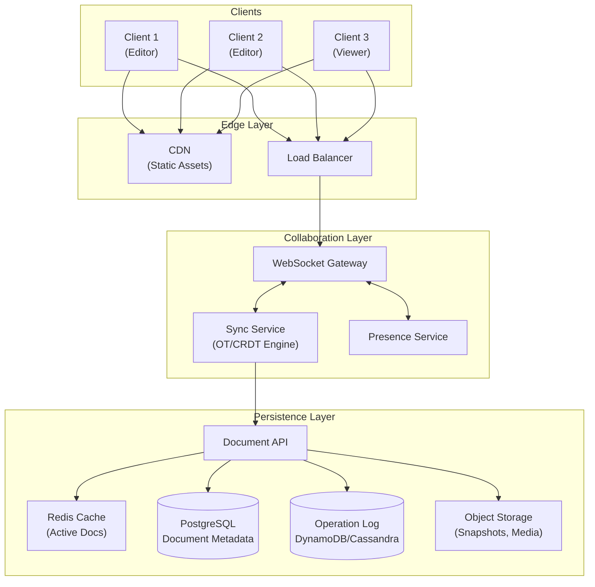
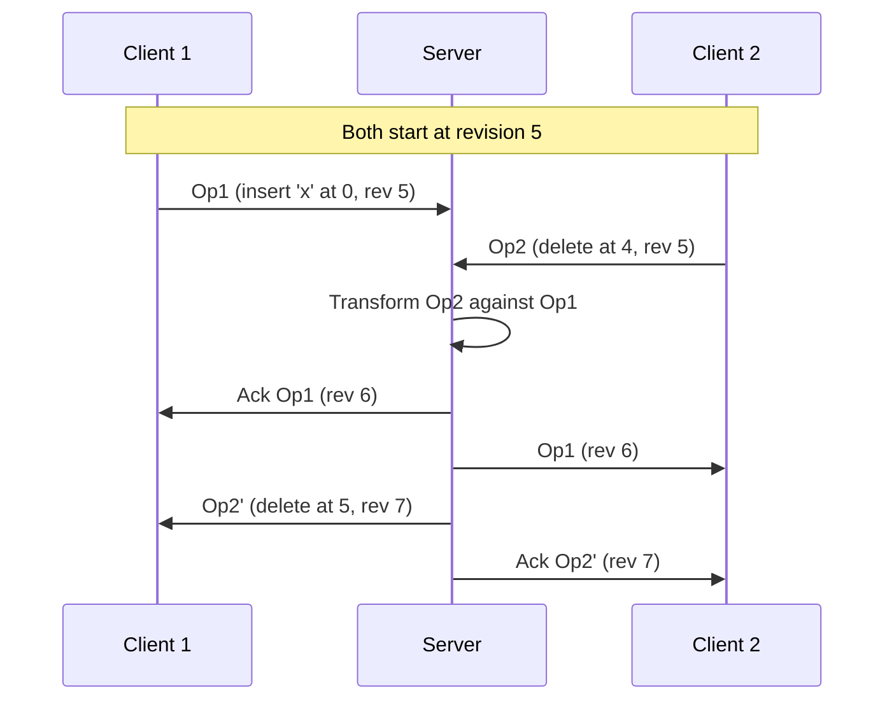
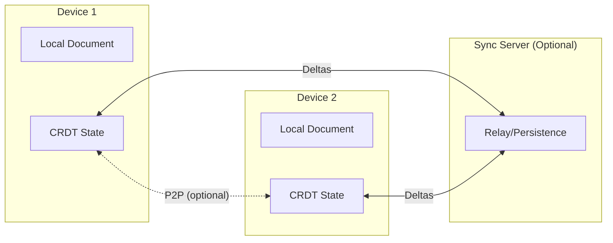
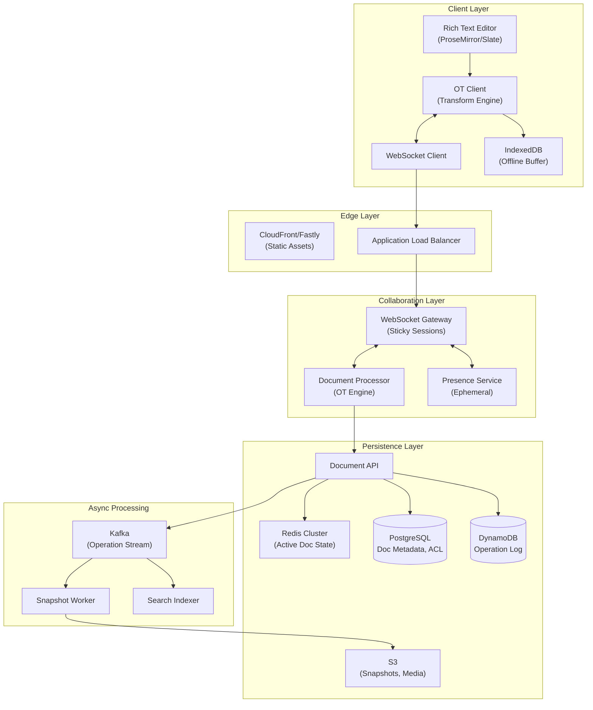
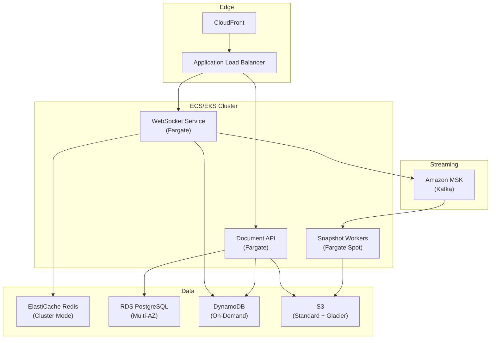

# Design Collaborative Document Editing (Google Docs)

A comprehensive system design for real-time collaborative document editing covering synchronization algorithms, presence broadcasting, conflict resolution, storage patterns, and offline support. This design addresses sub-second convergence for concurrent edits while maintaining document history and supporting 10-50 simultaneous editors.

<figure>



<figcaption>High-level architecture: WebSocket-based real-time sync with operation log persistence and periodic snapshots.</figcaption>
</figure>

## Abstract

Collaborative document editing requires solving three interrelated problems: **real-time synchronization** (all users see changes within milliseconds), **conflict resolution** (concurrent edits don't corrupt the document), and **durability** (no edit is ever lost).

**Core architectural decisions:**

| Decision       | Choice                              | Rationale                                           |
| -------------- | ----------------------------------- | --------------------------------------------------- |
| Sync algorithm | OT with server ordering             | Avoids TP2 complexity; proven at Google scale       |
| Transport      | WebSocket                           | Full-duplex, 1-10ms latency after handshake         |
| Persistence    | Event-sourced operation log         | Enables revision history, undo, and conflict replay |
| Presence       | Ephemeral broadcast                 | Cursors don't need durability; memory-only          |
| Offline        | Operation queue with reconciliation | Local-first editing, sync on reconnect              |

**Key trade-offs accepted:**

- Server dependency for ordering (no true P2P) in exchange for correctness guarantees
- Unbounded operation log growth requiring periodic snapshots
- Higher memory on collaboration servers (one process per active document)

**What this design optimizes:**

- Sub-100ms operation propagation to all connected clients
- Guaranteed convergence regardless of network conditions
- Full revision history with efficient retrieval

## Requirements

### Functional Requirements

| Requirement                   | Priority | Notes                               |
| ----------------------------- | -------- | ----------------------------------- |
| Real-time text editing        | Core     | Character-level granularity         |
| Concurrent multi-user editing | Core     | 10-50 simultaneous editors          |
| Live cursor/selection display | Core     | See where others are editing        |
| Revision history              | Core     | View/restore any previous version   |
| Rich text formatting          | Core     | Bold, italic, headings, lists       |
| Comments and suggestions      | Extended | Anchored to text ranges             |
| Offline editing               | Extended | Queue operations, sync on reconnect |
| Tables, images, embeds        | Extended | Block-level elements                |

### Non-Functional Requirements

| Requirement              | Target          | Rationale                                 |
| ------------------------ | --------------- | ----------------------------------------- |
| Availability             | 99.9% (3 nines) | User-facing, but brief outages acceptable |
| Edit propagation latency | p99 < 200ms     | Real-time feel requires sub-second        |
| Document load time       | p99 < 2s        | Cold start with full history              |
| Concurrent editors       | 50 per document | Google Sheets supports ~50; Docs ~10      |
| Operation durability     | 99.999%         | No edit should ever be lost               |
| Revision retention       | Indefinite      | Full history for compliance               |

### Scale Estimation

**Users:**

- Monthly Active Users (MAU): 500M (Google Docs scale)
- Daily Active Users (DAU): 100M (20% of MAU)
- Peak concurrent users: 10M

**Documents:**

- Total documents: 5B
- Active documents (edited in last 30 days): 500M (10%)
- Documents open concurrently at peak: 50M

**Traffic:**

- Operations per active editor: 1-5 per second (typing)
- Average editing session: 15 minutes
- Peak concurrent editors: 50M documents × 3 editors avg = 150M editing sessions
- Operations per second at peak: 150M × 2 ops/sec = 300M ops/sec globally

**Storage:**

- Average operation size: 100 bytes (insert/delete + metadata)
- Operations per document per day: 10,000 (active document)
- Daily operation storage: 500M docs × 10K ops × 100B = 500TB/day
- With snapshots (daily): 500M × 50KB = 25TB/day

## Design Paths

### Path A: Operational Transformation (Server-Ordered)

**Best when:**

- Always-online with reliable connectivity
- Central infrastructure already exists
- Correctness is paramount (financial, legal documents)
- Team has OT implementation experience or uses existing library

**Architecture:**



**Key characteristics:**

- Server assigns canonical operation order
- Clients transform incoming ops against pending local ops
- Single source of truth eliminates TP2 requirement

**Trade-offs:**

- ✅ Proven correct (Google Docs, Wave, CKEditor)
- ✅ Simpler transformation functions (only TP1 needed)
- ✅ Efficient wire format (operations are small)
- ❌ Server round-trip required for each operation batch
- ❌ Limited offline capability (buffer only)
- ❌ Server is single point of failure per document

**Real-world example:** Google Docs uses Jupiter-derived OT since 2010. Every character change is saved as an event in a revision log. The document renders by replaying the log from the start (with periodic checkpoints for performance).

### Path B: CRDT-Based (Decentralized)

**Best when:**

- Offline-first is critical requirement
- P2P scenarios (no server available)
- Multi-device sync with unreliable networks
- Mathematical convergence proofs required

**Architecture:**



**Key characteristics:**

- Operations commute without server coordination
- Each device maintains full CRDT state
- Convergence guaranteed by mathematical properties

**Trade-offs:**

- ✅ True offline support
- ✅ P2P synchronization possible
- ✅ No server bottleneck
- ❌ Higher memory (tombstones, metadata)
- ❌ Slower document loading (replay history)
- ❌ More complex intent preservation for rich text

**Real-world example:** Figma uses a CRDT-inspired approach with server reconciliation. They deliberately stop short of full CRDT to truncate history and reduce overhead. Yjs and Automerge are pure CRDT implementations used by many collaborative editors.

### Path C: Hybrid (Server-Ordered with CRDT Properties)

**Best when:**

- Need offline support but have server infrastructure
- Want CRDT convergence guarantees with OT efficiency
- Building on modern algorithms (Eg-walker, Fugue)

**Architecture:**

- Store append-only operation DAG (like CRDT)
- Use server for canonical ordering (like OT)
- Merge branches using CRDT-like algorithms
- Free memory when not actively merging

**Trade-offs:**

- ✅ Best of both: efficient steady-state, robust merging
- ✅ Order of magnitude better performance than pure CRDT
- ✅ Supports true offline with branch merging
- ❌ Newest approach, less production validation
- ❌ More complex implementation

**Real-world example:** Figma adopted Eg-walker for their code layers feature (2024). Joseph Gentle and Martin Kleppmann proved it achieves O(n log n) merge complexity versus O(n²) for traditional OT.

### Path Comparison

| Factor              | OT (Server)     | CRDT           | Hybrid       |
| ------------------- | --------------- | -------------- | ------------ |
| Correctness proof   | Straightforward | Mathematical   | Mathematical |
| Offline support     | Buffer only     | Native         | Native       |
| Server dependency   | Required        | Optional       | Optional     |
| Memory overhead     | Low             | High           | Medium       |
| Implementation      | Moderate        | Complex        | Complex      |
| Production examples | Google Docs     | Notion, Linear | Figma Code   |

### This Article's Focus

This article focuses on **Path A (OT with server ordering)** because:

1. It's the most battle-tested approach (15+ years in production at Google)
2. Most use cases have reliable connectivity
3. Simpler to implement correctly
4. Existing libraries (ShareDB, ot.js) provide solid foundations

Path B (CRDT) details are covered in [CRDTs for Collaborative Systems](../../core-distributed-patterns/crdt-for-collaborative-systems/README.md).

## High-Level Design

### Component Overview



### WebSocket Gateway

Manages persistent connections between clients and collaboration servers.

**Responsibilities:**

- Connection lifecycle (connect, heartbeat, disconnect)
- Route messages to document processors
- Broadcast presence updates
- Handle reconnection and state recovery

**Design decisions:**

| Decision         | Choice              | Rationale                                 |
| ---------------- | ------------------- | ----------------------------------------- |
| Protocol         | WebSocket           | Full-duplex, 2-14 byte overhead vs HTTP   |
| Session affinity | Sticky by document  | All editors of a document hit same server |
| Heartbeat        | 30 second interval  | Detect dead connections                   |
| Reconnection     | Exponential backoff | Prevent thundering herd                   |

**Scaling approach:**

- Horizontal scaling with consistent hashing by document ID
- One server "owns" each active document
- Ownership transfers on server failure via distributed lock

### Document Processor (OT Engine)

The core synchronization component that transforms and orders operations.

**State per active document:**

```typescript
interface DocumentState {
  documentId: string
  revision: number // Monotonic operation counter
  content: DocumentContent // Current document state
  pendingOps: Map<ClientId, Operation[]> // Ops awaiting transform
  clients: Map<ClientId, ClientState> // Connected clients
}

interface ClientState {
  clientId: string
  lastAckedRevision: number
  cursor: CursorPosition | null
  color: string // For presence display
}
```

**Operation flow:**

1. **Receive**: Client sends operation with base revision
2. **Validate**: Check revision is not stale beyond buffer
3. **Transform**: Transform against all operations since base revision
4. **Apply**: Update document state
5. **Persist**: Write to operation log
6. **Broadcast**: Send transformed operation to all clients

**Memory management:**

- Keep document state in memory while active
- Evict after 5 minutes of inactivity
- Reload from latest snapshot + recent operations

### Presence Service

Handles ephemeral state: cursors, selections, user indicators.

**Design decisions:**

- **No persistence**: Presence is reconstructed on reconnect
- **Throttled broadcast**: Max 20 updates/second per client
- **Coalesced updates**: Batch cursor movements before broadcast

**Data structure:**

```typescript
interface PresenceUpdate {
  clientId: string
  documentId: string
  cursor: {
    anchor: number // Selection start (character position)
    head: number // Selection end (cursor position)
  } | null
  user: {
    id: string
    name: string
    avatar: string
    color: string // Assigned per-document
  }
  timestamp: number
}
```

### Document API

Handles document CRUD, access control, and version retrieval.

**Endpoints:**

| Endpoint                      | Method | Purpose                                     |
| ----------------------------- | ------ | ------------------------------------------- |
| `/documents`                  | POST   | Create document                             |
| `/documents/{id}`             | GET    | Load document (latest or specific revision) |
| `/documents/{id}/operations`  | GET    | Fetch operation range for history           |
| `/documents/{id}/snapshot`    | POST   | Create manual snapshot                      |
| `/documents/{id}/revisions`   | GET    | List revision metadata                      |
| `/documents/{id}/permissions` | PUT    | Update access control                       |

## API Design

### WebSocket Protocol

#### Client → Server Messages

**Send Operation:**

```json
{
  "type": "operation",
  "documentId": "doc_abc123",
  "clientId": "client_xyz",
  "baseRevision": 142,
  "operation": {
    "ops": [{ "retain": 50 }, { "insert": "Hello, " }, { "retain": 100 }, { "delete": 5 }]
  },
  "timestamp": 1706886400000
}
```

**Update Presence:**

```json
{
  "type": "presence",
  "documentId": "doc_abc123",
  "cursor": { "anchor": 150, "head": 150 },
  "selection": null
}
```

#### Server → Client Messages

**Operation Acknowledgment:**

```json
{
  "type": "ack",
  "documentId": "doc_abc123",
  "revision": 143,
  "transformedOp": { ... }
}
```

**Broadcast Operation (to other clients):**

```json
{
  "type": "remote_operation",
  "documentId": "doc_abc123",
  "clientId": "client_other",
  "revision": 143,
  "operation": { ... },
  "user": {
    "id": "user_123",
    "name": "Alice"
  }
}
```

**Presence Broadcast:**

```json
{
  "type": "remote_presence",
  "documentId": "doc_abc123",
  "presences": [
    {
      "clientId": "client_other",
      "cursor": { "anchor": 200, "head": 210 },
      "user": { "id": "user_123", "name": "Alice", "color": "#4285f4" }
    }
  ]
}
```

### REST API

#### Create Document

**Endpoint:** `POST /api/v1/documents`

**Request:**

```json
{
  "title": "Untitled Document",
  "content": "",
  "folderId": "folder_abc",
  "templateId": "template_xyz"
}
```

**Response (201 Created):**

```json
{
  "id": "doc_abc123",
  "title": "Untitled Document",
  "revision": 0,
  "createdAt": "2024-02-03T10:00:00Z",
  "createdBy": {
    "id": "user_123",
    "name": "Alice"
  },
  "permissions": {
    "owner": "user_123",
    "editors": [],
    "viewers": []
  },
  "wsEndpoint": "wss://collab.example.com/ws/doc_abc123"
}
```

#### Load Document

**Endpoint:** `GET /api/v1/documents/{id}?revision={optional}`

**Response (200 OK):**

```json
{
  "id": "doc_abc123",
  "title": "Project Proposal",
  "revision": 1542,
  "content": {
    "type": "doc",
    "content": [
      {
        "type": "heading",
        "attrs": { "level": 1 },
        "content": [{ "type": "text", "text": "Introduction" }]
      },
      {
        "type": "paragraph",
        "content": [{ "type": "text", "text": "..." }]
      }
    ]
  },
  "snapshot": {
    "revision": 1500,
    "createdAt": "2024-02-03T09:00:00Z"
  },
  "pendingOperations": 42,
  "collaborators": [{ "id": "user_456", "name": "Bob", "online": true }]
}
```

#### List Revisions

**Endpoint:** `GET /api/v1/documents/{id}/revisions?limit=50&before={revision}`

**Response (200 OK):**

```json
{
  "revisions": [
    {
      "revision": 1542,
      "timestamp": "2024-02-03T10:30:00Z",
      "user": { "id": "user_123", "name": "Alice" },
      "summary": "Edited section 3",
      "operationCount": 15
    },
    {
      "revision": 1500,
      "timestamp": "2024-02-03T09:00:00Z",
      "user": { "id": "user_456", "name": "Bob" },
      "summary": "Added introduction",
      "operationCount": 203,
      "isSnapshot": true
    }
  ],
  "hasMore": true,
  "nextCursor": "rev_1499"
}
```

### Error Responses

| Code | Error               | When                        |
| ---- | ------------------- | --------------------------- |
| 400  | `INVALID_OPERATION` | Operation format invalid    |
| 409  | `REVISION_CONFLICT` | Base revision too old       |
| 410  | `DOCUMENT_DELETED`  | Document was deleted        |
| 423  | `DOCUMENT_LOCKED`   | Document temporarily locked |
| 429  | `RATE_LIMITED`      | Too many operations         |

**Revision conflict handling:**

```json
{
  "error": "REVISION_CONFLICT",
  "message": "Base revision 100 is too old. Current: 150",
  "currentRevision": 150,
  "missingOperations": "/api/v1/documents/doc_abc/operations?from=100&to=150"
}
```

Client must fetch missing operations, transform local pending operations, and retry.

## Data Modeling

### Document Metadata (PostgreSQL)

```sql
CREATE TABLE documents (
    id UUID PRIMARY KEY DEFAULT gen_random_uuid(),
    title TEXT NOT NULL,
    owner_id UUID NOT NULL REFERENCES users(id),
    folder_id UUID REFERENCES folders(id),
    current_revision BIGINT DEFAULT 0,
    latest_snapshot_revision BIGINT,
    content_type VARCHAR(50) DEFAULT 'rich_text',
    created_at TIMESTAMPTZ DEFAULT NOW(),
    updated_at TIMESTAMPTZ DEFAULT NOW(),
    deleted_at TIMESTAMPTZ,

    -- Denormalized for read performance
    collaborator_count INT DEFAULT 0,
    word_count INT DEFAULT 0,
    last_edited_by UUID REFERENCES users(id),
    last_edited_at TIMESTAMPTZ
);

-- Access control
CREATE TABLE document_permissions (
    document_id UUID REFERENCES documents(id) ON DELETE CASCADE,
    user_id UUID REFERENCES users(id),
    role VARCHAR(20) NOT NULL, -- 'owner', 'editor', 'commenter', 'viewer'
    granted_at TIMESTAMPTZ DEFAULT NOW(),
    granted_by UUID REFERENCES users(id),
    PRIMARY KEY (document_id, user_id)
);

CREATE INDEX idx_documents_owner ON documents(owner_id, updated_at DESC);
CREATE INDEX idx_documents_folder ON documents(folder_id, updated_at DESC);
CREATE INDEX idx_permissions_user ON document_permissions(user_id);
```

### Operation Log (DynamoDB)

**Table design for append-heavy workload:**

| Partition Key | Sort Key   | Attributes                                                   |
| ------------- | ---------- | ------------------------------------------------------------ |
| `document_id` | `revision` | `operation`, `client_id`, `user_id`, `timestamp`, `checksum` |

**Schema:**

```json
{
  "document_id": "doc_abc123",
  "revision": 1542,
  "operation": {
    "ops": [{ "retain": 50 }, { "insert": "Hello" }]
  },
  "client_id": "client_xyz",
  "user_id": "user_123",
  "timestamp": 1706886400000,
  "checksum": "sha256:abc123...",
  "ttl": null
}
```

**Why DynamoDB:**

- Append-only workload (write-optimized)
- Predictable latency at scale
- Built-in TTL for old operations (after snapshot)
- Range queries by revision efficient

**Capacity planning:**

- Write capacity: 300M ops/sec globally → partition across documents
- Single document: 100 ops/sec max (50 editors × 2 ops/sec)
- Read capacity: Burst on document load, then minimal

### Snapshots (S3)

**Naming convention:**

```
s3://doc-snapshots/{document_id}/{revision}.json.gz
```

**Snapshot content:**

```json
{
  "documentId": "doc_abc123",
  "revision": 1500,
  "createdAt": "2024-02-03T09:00:00Z",
  "content": {
    "type": "doc",
    "content": [...]
  },
  "metadata": {
    "wordCount": 5420,
    "characterCount": 32150,
    "imageCount": 12
  },
  "checksum": "sha256:..."
}
```

**Snapshot strategy:**

- Create snapshot every 1000 operations
- Or every 1 hour of activity
- Or on manual request (revision history view)
- Keep all snapshots for compliance

### Active Document Cache (Redis)

**Data structures:**

```redis
# Document state (hash)
HSET doc:{id}:state
    revision 1542
    content "{serialized_content}"
    last_updated 1706886400000

# Connected clients (sorted set by last activity)
ZADD doc:{id}:clients {timestamp} {client_id}

# Pending operations queue (list)
RPUSH doc:{id}:pending "{operation_json}"

# Presence (hash with TTL per client)
HSET doc:{id}:presence:{client_id}
    cursor_anchor 150
    cursor_head 150
    user_name "Alice"
    user_color "#4285f4"
EXPIRE doc:{id}:presence:{client_id} 60
```

**Eviction policy:**

- Documents evicted after 5 minutes of no activity
- Presence entries auto-expire after 60 seconds without refresh

## Low-Level Design

### OT Transformation Engine

#### Operation Format

Using a format similar to Quill Delta / Google Wave:

```typescript
type Operation = {
  ops: (RetainOp | InsertOp | DeleteOp)[]
}

type RetainOp = {
  retain: number
  attributes?: Record<string, any> // For formatting changes
}

type InsertOp = {
  insert: string | { image: string } | { embed: any }
  attributes?: Record<string, any>
}

type DeleteOp = {
  delete: number
}
```

**Example operations:**

```typescript
// Insert "Hello" at position 0
{
  ops: [{ insert: "Hello" }]
}

// Delete 3 characters at position 10
{
  ops: [{ retain: 10 }, { delete: 3 }]
}

// Bold characters 5-10
{
  ops: [{ retain: 5 }, { retain: 5, attributes: { bold: true } }]
}
```

#### Transformation Functions

```typescript collapse={1-10}
function transform(op1: Operation, op2: Operation, priority: "left" | "right"): [Operation, Operation] {
  // op1' = transform(op1, op2) - op1 transformed against op2
  // op2' = transform(op2, op1) - op2 transformed against op1
  // Guarantee: apply(apply(doc, op1), op2') === apply(apply(doc, op2), op1')

  const ops1 = [...op1.ops]
  const ops2 = [...op2.ops]
  const result1: Op[] = []
  const result2: Op[] = []

  let i1 = 0,
    i2 = 0

  while (i1 < ops1.length || i2 < ops2.length) {
    const o1 = ops1[i1]
    const o2 = ops2[i2]

    // Case: insert vs anything - inserts go first
    if (o1 && "insert" in o1) {
      if (priority === "left") {
        result2.push({ retain: insertLength(o1) })
        result1.push(o1)
        i1++
        continue
      }
    }
    if (o2 && "insert" in o2) {
      result1.push({ retain: insertLength(o2) })
      result2.push(o2)
      i2++
      continue
    }

    // Case: retain vs retain
    if (o1 && "retain" in o1 && o2 && "retain" in o2) {
      const len = Math.min(o1.retain, o2.retain)
      result1.push({ retain: len, attributes: o1.attributes })
      result2.push({ retain: len, attributes: o2.attributes })
      consumeLength(ops1, i1, len)
      consumeLength(ops2, i2, len)
      continue
    }

    // Case: delete vs retain
    if (o1 && "delete" in o1 && o2 && "retain" in o2) {
      const len = Math.min(o1.delete, o2.retain)
      result1.push({ delete: len })
      // o2 doesn't produce output - deleted content
      consumeLength(ops1, i1, len)
      consumeLength(ops2, i2, len)
      continue
    }

    // Case: retain vs delete
    if (o1 && "retain" in o1 && o2 && "delete" in o2) {
      const len = Math.min(o1.retain, o2.delete)
      // o1 doesn't produce output - deleted content
      result2.push({ delete: len })
      consumeLength(ops1, i1, len)
      consumeLength(ops2, i2, len)
      continue
    }

    // Case: delete vs delete - both delete same content
    if (o1 && "delete" in o1 && o2 && "delete" in o2) {
      const len = Math.min(o1.delete, o2.delete)
      // Neither produces output - already deleted
      consumeLength(ops1, i1, len)
      consumeLength(ops2, i2, len)
      continue
    }
  }

  return [{ ops: result1 }, { ops: result2 }]
}
```

#### Server-Side Processing

```typescript collapse={1-15}
class DocumentProcessor {
  private state: DocumentState
  private opLog: OperationLog
  private broadcaster: Broadcaster

  async processOperation(clientId: string, baseRevision: number, operation: Operation): Promise<ProcessResult> {
    // 1. Validate base revision
    if (baseRevision < this.state.revision - MAX_REVISION_LAG) {
      throw new RevisionConflictError(this.state.revision)
    }

    // 2. Transform against all operations since base
    let transformedOp = operation
    for (let rev = baseRevision + 1; rev <= this.state.revision; rev++) {
      const serverOp = await this.opLog.getOperation(this.state.documentId, rev)
      ;[transformedOp] = transform(transformedOp, serverOp, "right")
    }

    // 3. Apply to document state
    const newContent = applyOperation(this.state.content, transformedOp)
    const newRevision = this.state.revision + 1

    // 4. Persist operation (async, but before ack)
    await this.opLog.append({
      documentId: this.state.documentId,
      revision: newRevision,
      operation: transformedOp,
      clientId,
      timestamp: Date.now(),
    })

    // 5. Update in-memory state
    this.state.content = newContent
    this.state.revision = newRevision

    // 6. Broadcast to other clients
    this.broadcaster.broadcastOperation(
      this.state.documentId,
      clientId, // Exclude sender
      newRevision,
      transformedOp,
    )

    // 7. Return acknowledgment
    return {
      revision: newRevision,
      transformedOp,
    }
  }
}
```

### Client-Side State Machine

```typescript collapse={1-12}
type ClientOTState =
  | { type: "synchronized"; serverRevision: number }
  | { type: "awaitingAck"; serverRevision: number; pending: Operation }
  | { type: "awaitingWithBuffer"; serverRevision: number; pending: Operation; buffer: Operation }

class ClientOT {
  private state: ClientOTState = { type: "synchronized", serverRevision: 0 }
  private document: DocumentContent

  onLocalEdit(operation: Operation): void {
    switch (this.state.type) {
      case "synchronized":
        // Send immediately
        this.sendToServer(operation, this.state.serverRevision)
        this.state = {
          type: "awaitingAck",
          serverRevision: this.state.serverRevision,
          pending: operation,
        }
        break

      case "awaitingAck":
        // Buffer - compose with existing buffer or create new
        this.state = {
          type: "awaitingWithBuffer",
          serverRevision: this.state.serverRevision,
          pending: this.state.pending,
          buffer: operation,
        }
        break

      case "awaitingWithBuffer":
        // Compose into buffer
        this.state = {
          ...this.state,
          buffer: compose(this.state.buffer, operation),
        }
        break
    }

    // Apply locally immediately
    this.document = applyOperation(this.document, operation)
  }

  onServerAck(revision: number): void {
    switch (this.state.type) {
      case "awaitingAck":
        this.state = { type: "synchronized", serverRevision: revision }
        break

      case "awaitingWithBuffer":
        // Send buffered operations
        this.sendToServer(this.state.buffer, revision)
        this.state = {
          type: "awaitingAck",
          serverRevision: revision,
          pending: this.state.buffer,
        }
        break
    }
  }

  onRemoteOperation(revision: number, operation: Operation): void {
    // Transform remote op against pending/buffer
    let transformedRemote = operation

    if (this.state.type === "awaitingAck" || this.state.type === "awaitingWithBuffer") {
      ;[, transformedRemote] = transform(this.state.pending, operation, "left")

      // Also transform pending against remote
      const [newPending] = transform(this.state.pending, operation, "left")
      this.state = { ...this.state, pending: newPending }
    }

    if (this.state.type === "awaitingWithBuffer") {
      ;[, transformedRemote] = transform(this.state.buffer, transformedRemote, "left")

      const [newBuffer] = transform(this.state.buffer, operation, "left")
      this.state = { ...this.state, buffer: newBuffer }
    }

    // Apply transformed remote operation
    this.document = applyOperation(this.document, transformedRemote)
  }
}
```

### Snapshot and Compaction

#### Snapshot Worker

```typescript collapse={1-8}
class SnapshotWorker {
  private readonly SNAPSHOT_THRESHOLD = 1000 // Operations since last snapshot
  private readonly SNAPSHOT_INTERVAL_MS = 3600000 // 1 hour

  async processDocument(documentId: string): Promise<void> {
    const doc = await this.documentStore.getMetadata(documentId)
    const latestSnapshot = await this.snapshotStore.getLatest(documentId)

    const opsSinceSnapshot = doc.currentRevision - (latestSnapshot?.revision ?? 0)
    const timeSinceSnapshot = Date.now() - (latestSnapshot?.createdAt ?? 0)

    if (opsSinceSnapshot < this.SNAPSHOT_THRESHOLD && timeSinceSnapshot < this.SNAPSHOT_INTERVAL_MS) {
      return // No snapshot needed
    }

    // Build document state
    let content = latestSnapshot?.content ?? emptyDocument()
    const operations = await this.opLog.getRange(documentId, (latestSnapshot?.revision ?? 0) + 1, doc.currentRevision)

    for (const op of operations) {
      content = applyOperation(content, op.operation)
    }

    // Store snapshot
    await this.snapshotStore.create({
      documentId,
      revision: doc.currentRevision,
      content,
      createdAt: Date.now(),
    })

    // Mark old operations for TTL expiry (keep last 100 for recent history)
    await this.opLog.setTTL(documentId, 0, doc.currentRevision - 100, TTL_30_DAYS)
  }
}
```

## Frontend Considerations

### Editor Integration

**Rich text editors with OT support:**

| Editor      | OT/CRDT Support   | Notes                      |
| ----------- | ----------------- | -------------------------- |
| ProseMirror | Steps (OT-like)   | Used by Notion, Atlassian  |
| Slate       | Plugin-based      | Flexible, needs OT library |
| Quill       | Delta format      | Native OT support          |
| TipTap      | ProseMirror-based | Modern API                 |

**Integration pattern (ProseMirror example):**

```typescript collapse={1-15}
class CollaborativeEditor {
  private view: EditorView
  private otClient: ClientOT
  private ws: WebSocket

  constructor(container: HTMLElement, documentId: string) {
    // Initialize OT client
    this.otClient = new ClientOT()

    // Connect WebSocket
    this.ws = new WebSocket(`wss://collab.example.com/ws/${documentId}`)
    this.ws.onmessage = this.handleServerMessage.bind(this)

    // Initialize editor with collaboration plugin
    this.view = new EditorView(container, {
      state: EditorState.create({
        plugins: [collab({ version: 0 }), this.cursorPlugin(), this.presencePlugin()],
      }),
      dispatchTransaction: this.handleLocalChange.bind(this),
    })
  }

  private handleLocalChange(tr: Transaction): void {
    const newState = this.view.state.apply(tr)
    this.view.updateState(newState)

    if (tr.docChanged) {
      // Convert ProseMirror steps to OT operations
      const steps = sendableSteps(newState)
      if (steps) {
        const operation = stepsToOperation(steps.steps)
        this.otClient.onLocalEdit(operation)
        this.ws.send(
          JSON.stringify({
            type: "operation",
            operation,
            baseRevision: this.otClient.serverRevision,
          }),
        )
      }
    }
  }
}
```

### Presence Rendering

**Cursor overlay approach:**

```typescript collapse={1-20}
interface RemoteCursor {
  clientId: string
  user: { name: string; color: string }
  anchor: number
  head: number
}

class CursorOverlay {
  private cursors: Map<string, RemoteCursor> = new Map()

  updateCursor(cursor: RemoteCursor): void {
    this.cursors.set(cursor.clientId, cursor)
    this.render()
  }

  removeCursor(clientId: string): void {
    this.cursors.delete(clientId)
    this.render()
  }

  private render(): void {
    // Convert character positions to screen coordinates
    for (const [clientId, cursor] of this.cursors) {
      const coords = this.positionToCoords(cursor.head)

      // Render cursor caret
      this.renderCaret(clientId, coords, cursor.user.color)

      // Render selection highlight if anchor !== head
      if (cursor.anchor !== cursor.head) {
        this.renderSelection(clientId, cursor.anchor, cursor.head, cursor.user.color)
      }

      // Render name label
      this.renderNameLabel(clientId, coords, cursor.user)
    }
  }
}
```

**Performance optimizations:**

| Technique                 | Purpose                 | Implementation              |
| ------------------------- | ----------------------- | --------------------------- |
| Throttle cursor updates   | Reduce network traffic  | Max 20 updates/sec          |
| Batch presence broadcasts | Reduce message count    | Collect 50ms, send batch    |
| Use CSS transforms        | Avoid layout thrashing  | `transform: translate()`    |
| Virtual cursor layer      | Don't modify editor DOM | Absolute positioned overlay |

### Offline Support

**Operation queue for offline editing:**

```typescript collapse={1-10}
class OfflineQueue {
  private db: IDBDatabase
  private queueName = "pendingOperations"

  async enqueue(documentId: string, operation: Operation): Promise<void> {
    const tx = this.db.transaction(this.queueName, "readwrite")
    const store = tx.objectStore(this.queueName)

    await store.add({
      documentId,
      operation,
      timestamp: Date.now(),
      id: crypto.randomUUID(),
    })
  }

  async syncPending(documentId: string): Promise<void> {
    const pending = await this.getPending(documentId)

    for (const item of pending) {
      try {
        await this.sendOperation(item)
        await this.remove(item.id)
      } catch (e) {
        if (e instanceof RevisionConflictError) {
          // Fetch missing ops, transform, retry
          await this.handleConflict(documentId, item)
        } else {
          throw e
        }
      }
    }
  }
}
```

## Infrastructure

### Cloud-Agnostic Components

| Component         | Purpose               | Options                       |
| ----------------- | --------------------- | ----------------------------- |
| WebSocket Gateway | Real-time connections | Nginx, HAProxy, Envoy         |
| Message Queue     | Operation streaming   | Kafka, RabbitMQ, NATS         |
| KV Store          | Active document state | Redis, Memcached, KeyDB       |
| Document Store    | Operation log         | Cassandra, ScyllaDB, DynamoDB |
| Object Store      | Snapshots, media      | MinIO, Ceph, S3-compatible    |
| Relational DB     | Metadata, ACL         | PostgreSQL, CockroachDB       |

### AWS Reference Architecture



**Service configurations:**

| Service                | Configuration                  | Rationale                        |
| ---------------------- | ------------------------------ | -------------------------------- |
| WebSocket (Fargate)    | 4 vCPU, 8GB RAM                | Memory for active documents      |
| API (Fargate)          | 2 vCPU, 4GB RAM                | Stateless, scale on traffic      |
| Workers (Fargate Spot) | 2 vCPU, 4GB RAM                | Cost optimization for async work |
| ElastiCache            | r6g.xlarge cluster             | Sub-ms latency for hot documents |
| RDS PostgreSQL         | db.r6g.2xlarge Multi-AZ        | Metadata queries, ACL            |
| DynamoDB               | On-demand                      | Predictable per-op pricing       |
| S3                     | Standard + Intelligent-Tiering | Hot snapshots, cold history      |

### Scaling Considerations

**WebSocket connection limits:**

- Single server: ~65K connections (Linux file descriptor limit)
- Solution: Consistent hashing by document ID across server pool
- Active documents per server: ~10K (memory constrained)

**Document processor memory:**

- Average document state: 100KB
- Active document with history buffer: 500KB
- 8GB server → ~16K active documents max

**Operation log partitioning:**

- DynamoDB partition key: document_id
- Hot partition: 3000 WCU per partition
- Solution: Document sharding if single doc exceeds limits (rare)

## Conclusion

This design provides real-time collaborative document editing with:

1. **Sub-200ms operation propagation** via WebSocket and server-ordered OT
2. **Strong convergence guarantees** without P2P complexity
3. **Full revision history** through event-sourced operation log
4. **Offline resilience** with IndexedDB operation queue and conflict resolution

**Key architectural decisions:**

- Server-ordered OT eliminates TP2 correctness concerns
- Periodic snapshots bound operation replay cost
- Ephemeral presence avoids persistence overhead for cursors
- Per-document process isolation simplifies scaling

**Known limitations:**

- Server dependency for real-time sync (no true P2P)
- Memory pressure at high concurrent editor counts
- Snapshot creation adds latency for very active documents

**Future enhancements:**

- Hybrid OT/CRDT for better offline support (Eg-walker approach)
- Incremental snapshot deltas to reduce storage
- Smarter presence coalescing for large collaborator counts

## Appendix

### Prerequisites

- Distributed systems fundamentals (eventual consistency, vector clocks)
- Real-time communication patterns (WebSocket, SSE)
- Event sourcing concepts
- Understanding of OT or CRDTs (see related articles)

### Terminology

| Term          | Definition                                                                    |
| ------------- | ----------------------------------------------------------------------------- |
| **OT**        | Operational Transformation - algorithm for transforming concurrent operations |
| **TP1/TP2**   | Transformation properties ensuring convergence                                |
| **Revision**  | Monotonic counter representing document state version                         |
| **Operation** | Atomic change to document (insert, delete, format)                            |
| **Snapshot**  | Full document state at a specific revision                                    |
| **Presence**  | Ephemeral state like cursors and selections                                   |
| **Tombstone** | Marker for deleted content in CRDT systems                                    |

### Summary

- Real-time collaborative editing requires **synchronization algorithms** (OT or CRDT), **presence broadcasting**, and **event-sourced persistence**
- **Server-ordered OT** dominates production use (Google Docs, CKEditor) because it avoids TP2 correctness issues
- **WebSocket** provides full-duplex communication with 1-10ms latency after handshake
- **Operation log + periodic snapshots** enables full revision history while bounding replay cost
- **Presence is ephemeral**—cursors and selections stored in memory only, reconstructed on reconnect
- Scale to 50 concurrent editors per document with ~200ms operation propagation latency

### References

**Architecture and Implementation:**

- [How Figma's Multiplayer Technology Works](https://www.figma.com/blog/how-figmas-multiplayer-technology-works/) - Figma Engineering Blog
- [Making Multiplayer More Reliable](https://www.figma.com/blog/making-multiplayer-more-reliable/) - Figma transaction journal design
- [Realtime Editing of Ordered Sequences](https://www.figma.com/blog/realtime-editing-of-ordered-sequences/) - Fractional indexing at Figma
- [The Data Model Behind Notion](https://www.notion.com/blog/data-model-behind-notion) - Block-based architecture
- [Sharding Postgres at Notion](https://www.notion.com/blog/sharding-postgres-at-notion) - Database scaling patterns
- [Scaling the Linear Sync Engine](https://linear.app/now/scaling-the-linear-sync-engine) - Local-first sync architecture

**Operational Transformation:**

- [Apache Wave OT Whitepaper](https://svn.apache.org/repos/asf/incubator/wave/whitepapers/operational-transform/operational-transform.html) - Detailed protocol specification
- [Google Drive Blog: What's Different About New Google Docs](https://drive.googleblog.com/2010/09/whats-different-about-new-google-docs.html) - Architecture overview
- [Lessons Learned from CKEditor 5](https://ckeditor.com/blog/lessons-learned-from-creating-a-rich-text-editor-with-real-time-collaboration/) - Production OT for rich text

**Algorithms and Research:**

- [Eg-walker: Collaborative Text Editing](https://arxiv.org/abs/2409.14252) - Gentle & Kleppmann, EuroSys 2025
- [Real Differences between OT and CRDT](https://dl.acm.org/doi/10.1145/3375186) - ACM 2020 comparison
- [Performance of Real-Time Collaborative Editors at Large Scale](https://inria.hal.science/hal-01351229v1/document) - Scaling analysis

**Related Articles:**

- [Operational Transformation](../../core-distributed-patterns/operational-transformation/README.md) - Deep dive into OT algorithms
- [CRDTs for Collaborative Systems](../../core-distributed-patterns/crdt-for-collaborative-systems/README.md) - Alternative approach for offline-first
