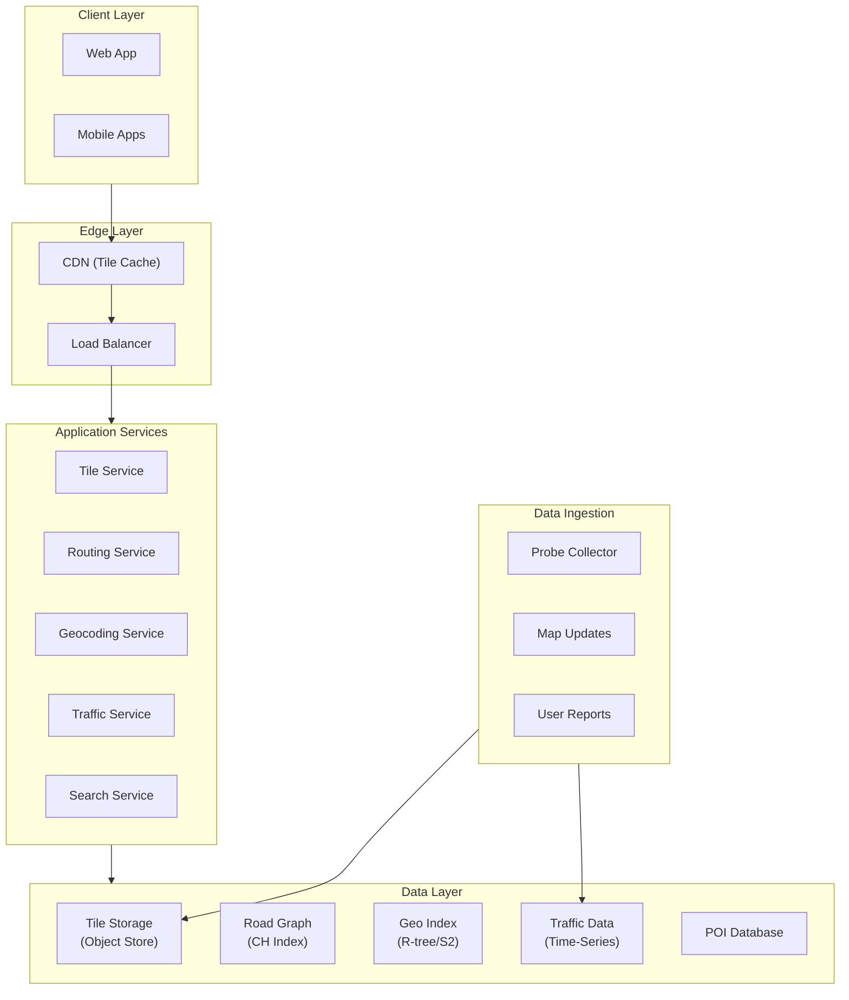
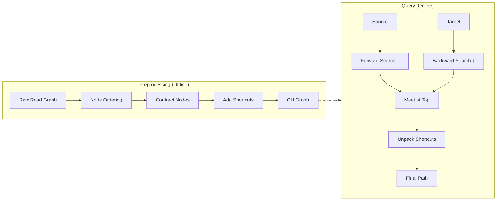
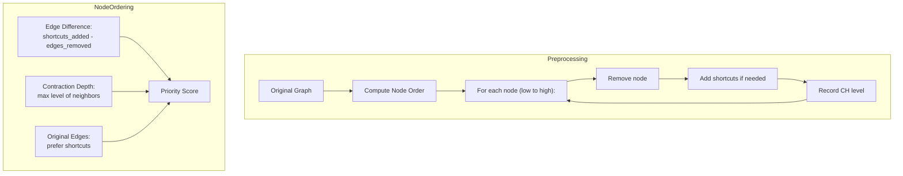
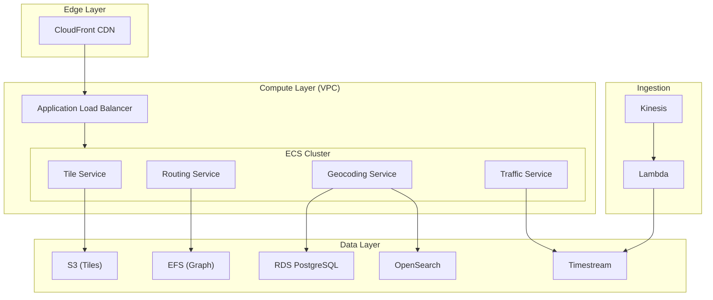

# Design Google Maps

A system design for a mapping and navigation platform handling tile-based rendering, real-time routing with traffic awareness, geocoding, and offline maps. This design addresses continental-scale road networks (18M+ nodes), sub-second routing queries, and 97%+ ETA accuracy.

<figure>



<figcaption>High-level architecture: CDN-cached tiles, specialized services for routing/geocoding/traffic, and multi-source data ingestion.</figcaption>
</figure>

## Abstract

Google Maps solves three distinct problems that require different architectural approaches:

1. **Map Rendering**: Quadtree-based tile pyramid with vector tiles—zoom level 0 is 1 tile, zoom 18 is 69 billion tiles. CDN caching is essential; cache hit rates exceed 95% for popular areas.

2. **Routing**: Dijkstra alone takes 4.8 seconds for European road networks (18M nodes). Contraction Hierarchies (CH) preprocessing reduces query time to 163 microseconds—a 30,000x speedup. Traffic-aware routing overlays real-time edge weights on the precomputed hierarchy.

3. **ETA Prediction**: Graph Neural Networks model "supersegments" (road sections with shared traffic patterns) to achieve 97%+ accuracy, with up to 50% improvement over baseline in congested cities.

The core tradeoff: **preprocessing time vs. query latency**. CH requires 5+ minutes to precompute but enables sub-millisecond queries. For traffic updates, a hybrid approach applies real-time weights to the static hierarchy rather than recomputing.

## Requirements

### Functional Requirements

| Feature                                   | Priority | In Scope      |
| ----------------------------------------- | -------- | ------------- |
| Map tile rendering                        | Core     | Yes           |
| Turn-by-turn routing                      | Core     | Yes           |
| Real-time traffic                         | Core     | Yes           |
| ETA prediction                            | Core     | Yes           |
| Geocoding (address → coordinates)         | Core     | Yes           |
| Reverse geocoding (coordinates → address) | Core     | Yes           |
| POI search                                | High     | Yes           |
| Place autocomplete                        | High     | Yes           |
| Offline maps                              | High     | Yes           |
| Street View                               | Medium   | Brief mention |
| Transit routing                           | Medium   | Out of scope  |
| Indoor maps                               | Low      | Out of scope  |

### Non-Functional Requirements

| Requirement              | Target                 | Rationale                                   |
| ------------------------ | ---------------------- | ------------------------------------------- |
| Availability             | 99.99%                 | User-facing, safety-critical for navigation |
| Tile latency             | p99 < 100ms            | Map rendering responsiveness                |
| Routing latency          | p99 < 500ms            | User expectation for route calculation      |
| ETA accuracy             | 97%+ trips within ±10% | User trust in arrival predictions           |
| Offline storage          | < 2GB per region       | Mobile device constraints                   |
| Traffic update frequency | < 2 minutes            | Real-time usefulness                        |

### Scale Estimation

**Users:**

- DAU: 1 billion (Google Maps actual scale)
- Peak concurrent: 100M (10% of DAU)

**Tile Traffic:**

- Average session: 50 tile requests (zoom/pan interactions)
- Daily tile requests: 1B × 50 = 50B requests/day
- Peak RPS: 50B / 86400 × 3 (peak multiplier) ≈ 1.7M RPS

**Routing Traffic:**

- Routes per DAU: 2 average
- Daily routing requests: 2B/day ≈ 23K RPS
- Peak: 70K RPS

**Storage:**

- Global road network: ~1 billion road segments
- CH index size: 50-100 bytes/node × 1B ≈ 50-100 TB
- Vector tiles (all zoom levels): ~50 PB
- Traffic data: 1B segments × 24 hours × 365 days × 4 bytes ≈ 35 TB/year

## Design Paths

### Path A: Preprocessing-Heavy (Contraction Hierarchies)

**Best when:**

- Road network changes infrequently (< daily)
- Query latency is critical (< 1ms routing)
- Traffic updates can be overlaid without full recomputation

**Architecture:**

- Precompute Contraction Hierarchies offline (5-10 minutes for continental networks)
- Store preprocessed graph in memory-mapped files
- Apply traffic as edge weight multipliers at query time

**Trade-offs:**

- ✅ Sub-millisecond query time (163 µs median)
- ✅ Predictable latency under load
- ❌ Preprocessing blocks road network updates
- ❌ Memory-intensive (21-68 bytes/node overhead)

**Real-world example:** OSRM, GraphHopper, Google Maps routing engine.

### Path B: Dynamic Routing (ALT Algorithm)

**Best when:**

- Road network changes frequently (construction, closures)
- Real-time edge weights are primary concern
- Preprocessing time must be minimal

**Architecture:**

- Precompute distances to landmark nodes only
- Use triangle inequality for search pruning
- Full dynamic edge weights without reprocessing

**Trade-offs:**

- ✅ Handles dynamic networks well
- ✅ Lighter preprocessing (seconds to minutes)
- ❌ 10-100x slower queries than CH
- ❌ Landmark selection impacts quality

### Path Comparison

| Factor          | Path A (CH)         | Path B (ALT)         |
| --------------- | ------------------- | -------------------- |
| Query time      | 163 µs              | 1-10 ms              |
| Preprocessing   | 5-10 minutes        | Seconds              |
| Dynamic updates | Overlay required    | Native support       |
| Memory overhead | High (21-68 B/node) | Moderate             |
| Best for        | Production routing  | Experimental/dynamic |

### This Article's Focus

This article focuses on **Path A (Contraction Hierarchies)** because production mapping services require sub-millisecond query times at scale. Traffic is handled via edge weight overlays rather than full recomputation.

## High-Level Design

### Tile Service

Serves pre-rendered or dynamically generated map tiles using a quadtree addressing scheme.

**Tile Addressing (Web Mercator):**

```
/{z}/{x}/{y}.{format}
```

- `z`: Zoom level (0-22)
- `x`: Column index (0 to 2^z - 1)
- `y`: Row index (0 to 2^z - 1)

**Zoom Level Properties:**

| Zoom | Tile Count    | Meters/Pixel (Equator) | Use Case       |
| ---- | ------------- | ---------------------- | -------------- |
| 0    | 1             | 156,543 m              | World view     |
| 10   | 1,048,576     | 152.87 m               | City-level     |
| 15   | ~1 billion    | 4.78 m                 | Street-level   |
| 18   | ~69 billion   | 0.60 m                 | Building-level |
| 20   | ~1.1 trillion | 0.15 m                 | Maximum detail |

**Vector Tiles vs. Raster Tiles:**

| Aspect  | Raster Tiles          | Vector Tiles              |
| ------- | --------------------- | ------------------------- |
| Format  | Pre-rendered PNG/JPEG | Protobuf-encoded geometry |
| Size    | 100-300 KB            | 20-50 KB compressed       |
| Styling | Fixed at render time  | Client-side, dynamic      |
| Scaling | Pixelates             | Infinite (vector math)    |
| Updates | Full tile replacement | Delta updates possible    |

Vector tiles (Mapbox Vector Tile specification) encode features as Protocol Buffers with a default extent of 4096 coordinate units per tile. This enables client-side rendering with custom styles and smooth zooming.

### Routing Service

Computes optimal paths using Contraction Hierarchies with traffic overlays.

<figure>



<figcaption>Contraction Hierarchies: offline preprocessing creates shortcuts; online queries search "upward" in the hierarchy from both ends.</figcaption>
</figure>

**How Contraction Hierarchies Work:**

1. **Node Ordering**: Rank nodes by importance (highways > arterials > local roads). Importance is computed using edge difference, contraction depth, and original edges.

2. **Contraction**: Iteratively remove least-important nodes. For each removed node, add "shortcut" edges between its neighbors if the shortest path went through it.

3. **Query**: Run bidirectional Dijkstra, but only traverse edges going "upward" in the hierarchy. The searches meet at the highest-importance node on the optimal path.

**Performance Benchmarks (North America, 87M vertices):**

| Metric                | Value                |
| --------------------- | -------------------- |
| Preprocessing time    | 307 seconds (~5 min) |
| Query time (median)   | 163 microseconds     |
| Speedup over Dijkstra | ~30,000x             |
| Storage overhead      | 21-68 bytes/node     |

**Traffic-Aware Routing:**

Real-time traffic is applied as edge weight multipliers without recomputing the hierarchy:

1. Collect probe data (GPS traces from devices)
2. Map-match probes to road segments
3. Compute segment speeds from probe timestamps
4. Store speed multipliers: `actual_speed / free_flow_speed`
5. At query time: `edge_weight = base_weight × traffic_multiplier`

This hybrid approach preserves sub-millisecond queries while incorporating live traffic.

### Traffic Service

Collects, processes, and serves real-time traffic data.

**Data Sources:**

| Source               | Quality  | Latency   | Coverage          |
| -------------------- | -------- | --------- | ----------------- |
| GPS probes (mobile)  | Medium   | Real-time | High (urban)      |
| Connected cars (OEM) | High     | Real-time | Growing           |
| Road sensors         | High     | Real-time | Limited           |
| User reports         | Variable | Real-time | Incident-specific |
| Historical patterns  | N/A      | N/A       | Baseline          |

**Floating Car Data (FCD) Pipeline:**

```
Probe → Map Matching → Segment Assignment → Speed Aggregation → Traffic State
```

1. **Probe ingestion**: Timestamped (lat, lon, speed) tuples
2. **Map matching**: Hidden Markov Model assigns probes to road segments
3. **Aggregation**: Window-based speed averaging (2-5 minute windows)
4. **Traffic state**: Free flow / Light / Moderate / Heavy / Standstill

**ETA Prediction with Graph Neural Networks:**

Google's DeepMind collaboration uses GNNs to predict travel times:

- **Supersegments**: Groups of adjacent road segments with shared traffic patterns
- **Graph structure**: Nodes = supersegments, edges = transitions
- **Features**: Historical speeds, time of day, day of week, weather
- **Output**: Predicted travel time distribution

Results:

- 97%+ trips with ETA within ±10%
- Up to 50% reduction in negative ETA outcomes (Sydney, Tokyo, Berlin)

### Geocoding Service

Converts between addresses and coordinates.

**Forward Geocoding Pipeline:**

```
Input: "1600 Amphitheatre Parkway, Mountain View, CA"
  ↓
Address Parsing (libpostal): {street: "1600 Amphitheatre Parkway", city: "Mountain View", state: "CA"}
  ↓
Normalization: Expand abbreviations, standardize format
  ↓
Candidate Generation: Query spatial index for matching addresses
  ↓
Scoring: Rank by text similarity, location confidence
  ↓
Output: {lat: 37.4220, lng: -122.0841, confidence: 0.98}
```

**Reverse Geocoding:**

Given (lat, lon), find the nearest address:

1. Query R-tree/S2 index for nearby address points
2. Interpolate street address from road segment data
3. Return formatted address with administrative hierarchy

**Spatial Indexing Options:**

| Index       | Structure                       | Use Case                         |
| ----------- | ------------------------------- | -------------------------------- |
| R-tree      | Bounding rectangles             | General spatial queries, PostGIS |
| Quadtree    | Recursive quadrants             | Tile-based lookups               |
| S2 Geometry | Spherical cells (Hilbert curve) | Global-scale, hierarchical       |

Google uses S2 Geometry for global coverage with hierarchical cell IDs that enable efficient prefix-based queries.

### Search Service (POI and Autocomplete)

**Place Autocomplete Data Structures:**

| Structure           | Lookup Time | Space  | Best For                |
| ------------------- | ----------- | ------ | ----------------------- |
| Trie                | O(m)        | High   | Exact prefix match      |
| Ternary Search Tree | O(m)        | Medium | Space-efficient prefix  |
| Pruning Radix Trie  | O(m)        | Low    | Production autocomplete |

Where m = query length.

**Ranking Signals:**

- Text relevance (edit distance, prefix match)
- Popularity (visit frequency)
- Recency (user's recent searches)
- Proximity (distance from user's location)
- Category match (restaurants, gas stations)

## API Design

### Tile API

**Endpoint:** `GET /tiles/{z}/{x}/{y}.{format}`

**Path Parameters:**

- `z`: Zoom level (0-22)
- `x`: Tile column
- `y`: Tile row
- `format`: `png`, `mvt` (vector), `pbf`

**Response Headers:**

```http
Content-Type: image/png | application/vnd.mapbox-vector-tile
Cache-Control: public, max-age=86400
ETag: "abc123"
```

**Response:** Binary tile data

**Caching Strategy:**

- CDN cache: 24 hours for zoom < 15, 1 hour for zoom ≥ 15
- Client cache: ETag-based conditional requests
- Cache hit rate target: > 95%

### Routing API

**Endpoint:** `POST /routes`

**Request:**

```json
{
  "origin": { "lat": 37.422, "lng": -122.0841 },
  "destination": { "lat": 37.7749, "lng": -122.4194 },
  "waypoints": [{ "lat": 37.5585, "lng": -122.2711 }],
  "mode": "driving",
  "departure_time": "2024-01-15T08:00:00Z",
  "alternatives": true,
  "traffic_model": "best_guess"
}
```

**Response:**

```json
{
  "routes": [
    {
      "legs": [
        {
          "distance": {"value": 45000, "text": "45 km"},
          "duration": {"value": 2700, "text": "45 min"},
          "duration_in_traffic": {"value": 3300, "text": "55 min"},
          "steps": [
            {
              "instruction": "Head north on Amphitheatre Pkwy",
              "distance": {"value": 500, "text": "500 m"},
              "duration": {"value": 60, "text": "1 min"},
              "polyline": "encoded_polyline_string",
              "maneuver": "turn-right"
            }
          ]
        }
      ],
      "overview_polyline": "encoded_polyline_string",
      "bounds": {"northeast": {...}, "southwest": {...}},
      "warnings": ["Route includes toll roads"]
    }
  ]
}
```

**Error Responses:**

- `400 Bad Request`: Invalid coordinates, missing required fields
- `404 Not Found`: No route found (disconnected points)
- `429 Too Many Requests`: Rate limit exceeded

**Rate Limits:** 1000 requests/minute per API key

### Geocoding API

**Forward Geocoding:**

`GET /geocode?address={address}&bounds={sw_lat,sw_lng,ne_lat,ne_lng}`

**Response:**

```json
{
  "results": [
    {
      "formatted_address": "1600 Amphitheatre Parkway, Mountain View, CA 94043",
      "geometry": {
        "location": {"lat": 37.4220, "lng": -122.0841},
        "location_type": "ROOFTOP",
        "viewport": {...}
      },
      "address_components": [
        {"long_name": "1600", "types": ["street_number"]},
        {"long_name": "Amphitheatre Parkway", "types": ["route"]}
      ],
      "place_id": "ChIJ..."
    }
  ]
}
```

**Reverse Geocoding:**

`GET /geocode?latlng={lat},{lng}`

### Place Autocomplete API

**Endpoint:** `GET /places/autocomplete?input={query}&location={lat},{lng}&radius={meters}`

**Response:**

```json
{
  "predictions": [
    {
      "description": "Googleplex, Mountain View, CA",
      "place_id": "ChIJ...",
      "structured_formatting": {
        "main_text": "Googleplex",
        "secondary_text": "Mountain View, CA"
      },
      "distance_meters": 1200
    }
  ]
}
```

**Debouncing:** Client should debounce requests (300ms) to reduce API calls during typing.

## Data Modeling

### Road Graph Schema

**Primary Store:** Custom binary format for in-memory graph processing

```
Node:
  - id: uint64
  - lat: float32
  - lon: float32
  - ch_level: uint16  // Contraction hierarchy level

Edge:
  - source: uint64
  - target: uint64
  - distance: uint32  // meters
  - duration: uint32  // seconds (free flow)
  - road_class: uint8 // motorway, primary, secondary, etc.
  - is_shortcut: bool
  - shortcut_middle: uint64  // For path unpacking
```

**Storage:**

- Memory-mapped file for O(1) access
- Compressed with LZ4 for disk storage
- Sharded by geographic region (continent-level)

### Tile Metadata Schema

**Primary Store:** Object storage (S3-compatible) with key-value index

```
Key: {layer}/{z}/{x}/{y}
Value: {
  tile_data: bytes,
  etag: string,
  generated_at: timestamp,
  source_version: string
}
```

**Tile Generation Pipeline:**

1. Raw map data (OpenStreetMap format)
2. Feature extraction and simplification per zoom level
3. Vector tile encoding (Mapbox Vector Tile spec)
4. Compression (gzip)
5. Upload to object storage

### Traffic Data Schema

**Primary Store:** Time-series database (InfluxDB, TimescaleDB, or custom)

```sql
CREATE TABLE traffic_observations (
  segment_id BIGINT NOT NULL,
  timestamp TIMESTAMPTZ NOT NULL,
  speed_kmh SMALLINT,
  probe_count SMALLINT,
  confidence REAL
);

-- Hypertable for time-series performance
SELECT create_hypertable('traffic_observations', 'timestamp');

-- Index for real-time lookups
CREATE INDEX idx_traffic_segment_time
ON traffic_observations(segment_id, timestamp DESC);
```

**Retention:**

- Raw observations: 7 days
- Hourly aggregates: 1 year
- Daily patterns: 5 years

### POI Schema

**Primary Store:** PostgreSQL with PostGIS extension

```sql
CREATE TABLE places (
  id UUID PRIMARY KEY DEFAULT gen_random_uuid(),
  name TEXT NOT NULL,
  location GEOGRAPHY(POINT, 4326) NOT NULL,
  category VARCHAR(50),
  address_components JSONB,
  popularity_score REAL DEFAULT 0,
  created_at TIMESTAMPTZ DEFAULT NOW(),
  updated_at TIMESTAMPTZ DEFAULT NOW()
);

CREATE INDEX idx_places_location ON places USING GIST(location);
CREATE INDEX idx_places_category ON places(category);
CREATE INDEX idx_places_name_trgm ON places USING GIN(name gin_trgm_ops);
```

### Database Selection Matrix

| Data Type           | Store                | Rationale                                 |
| ------------------- | -------------------- | ----------------------------------------- |
| Road graph          | Memory-mapped file   | O(1) access, no serialization overhead    |
| Tiles               | Object storage + CDN | Static content, high read volume          |
| Traffic (real-time) | Time-series DB       | Time-windowed queries, retention policies |
| Places/POI          | PostgreSQL + PostGIS | Spatial queries, full-text search         |
| User data           | PostgreSQL           | ACID, relational queries                  |
| Search index        | Elasticsearch        | Full-text, autocomplete, facets           |

## Low-Level Design

### Contraction Hierarchies Implementation

<figure>



<figcaption>Node ordering determines preprocessing quality. Lower priority = contracted earlier.</figcaption>
</figure>

**Node Ordering Heuristic:**

```
priority(v) = edge_difference(v)
            + contract_depth(v)
            + original_edges(v)
```

Where:

- `edge_difference`: Number of shortcuts that would be added minus edges removed
- `contract_depth`: Maximum hierarchy level among neighbors
- `original_edges`: Number of non-shortcut edges (prefer removing shortcuts first)

**Witness Search:**

Before adding a shortcut u→w (through v), check if a shorter path u→w exists without v:

```
shortcut_needed = (d(u,v) + d(v,w)) < witness_search(u, w, excluding v)
```

Witness search is a bounded Dijkstra; the bound is the proposed shortcut length.

**Query Algorithm:**

```python
def ch_query(source, target):
    # Bidirectional Dijkstra, only "upward" edges
    forward = dijkstra_upward(source)
    backward = dijkstra_upward(target)

    # Find best meeting point
    best_dist = infinity
    meeting_node = None
    for node in forward.visited ∩ backward.visited:
        dist = forward.dist[node] + backward.dist[node]
        if dist < best_dist:
            best_dist = dist
            meeting_node = node

    # Unpack shortcuts recursively
    return unpack_path(source, meeting_node, target)
```

**Why "upward" only works:**

The hierarchy ensures that for any shortest path, there exists a path in the CH graph that only goes up (in CH level) from source, meets at some top node, then only goes up (reversed = down in original) to target. This dramatically prunes the search space.

### Map Matching Algorithm

Map matching assigns GPS probes to road segments. The standard approach uses a Hidden Markov Model (HMM):

**States:** Road segments within radius of GPS point
**Observations:** GPS coordinates
**Emission probability:** Based on distance from GPS point to road segment
**Transition probability:** Based on routing distance between consecutive candidate segments

**Algorithm (Viterbi):**

1. For each GPS point, find candidate road segments within 50m radius
2. Compute emission probabilities: `P(gps | segment) ∝ exp(-distance² / σ²)`
3. Compute transition probabilities between consecutive candidates
4. Find most likely sequence using Viterbi algorithm

**Output:** Sequence of road segments with timestamps → enables speed computation per segment.

### Tile Rendering Pipeline

**Vector Tile Generation:**

1. **Feature extraction**: Query PostGIS for features in tile bounding box
2. **Simplification**: Douglas-Peucker algorithm, tolerance based on zoom level
3. **Clipping**: Clip features to tile boundary with buffer
4. **Encoding**: Convert to Mapbox Vector Tile (MVT) format
5. **Compression**: gzip for storage/transfer

**Simplification Tolerance:**

| Zoom Level | Tolerance (meters) | Rationale                            |
| ---------- | ------------------ | ------------------------------------ |
| 0-5        | 1000+              | Only major features visible          |
| 6-10       | 100-1000           | Country/state level                  |
| 11-15      | 10-100             | City level                           |
| 16+        | 1-10               | Street level, minimal simplification |

**MVT Structure:**

```protobuf
message Tile {
  repeated Layer layers = 3;
}

message Layer {
  required string name = 1;
  repeated Feature features = 2;
  repeated string keys = 3;    // Shared key list
  repeated Value values = 4;   // Shared value list
  optional uint32 extent = 5;  // Default 4096
}

message Feature {
  optional uint64 id = 1;
  repeated uint32 tags = 2;    // Indices into keys/values
  optional GeomType type = 3;
  repeated uint32 geometry = 4; // Command-encoded
}
```

Keys and values are deduplicated across features for compression.

## Frontend Considerations

### Tile Loading Strategy

**Viewport-Based Loading:**

```typescript
interface Viewport {
  center: LatLng
  zoom: number
  bounds: LatLngBounds
}

function getTilesForViewport(viewport: Viewport): TileCoord[] {
  const { bounds, zoom } = viewport
  const tiles: TileCoord[] = []

  const minTile = latLngToTile(bounds.southwest, zoom)
  const maxTile = latLngToTile(bounds.northeast, zoom)

  for (let x = minTile.x; x <= maxTile.x; x++) {
    for (let y = minTile.y; y <= maxTile.y; y++) {
      tiles.push({ z: zoom, x, y })
    }
  }

  return tiles
}
```

**Prefetching:**

- Load tiles 1 level above and below current zoom (for smooth zoom transitions)
- Load adjacent tiles outside viewport (buffer for panning)
- Typical: 20-30 tiles per view state

**Tile Cache (Client-Side):**

```typescript
class TileCache {
  private cache: Map<string, ImageBitmap>
  private maxSize: number = 500 // tiles
  private lru: string[] = []

  get(key: string): ImageBitmap | undefined {
    const tile = this.cache.get(key)
    if (tile) {
      // Move to end of LRU
      this.lru = this.lru.filter((k) => k !== key)
      this.lru.push(key)
    }
    return tile
  }

  set(key: string, tile: ImageBitmap): void {
    if (this.cache.size >= this.maxSize) {
      const evict = this.lru.shift()!
      this.cache.delete(evict)
    }
    this.cache.set(key, tile)
    this.lru.push(key)
  }
}
```

### Vector Tile Rendering

**WebGL Rendering Pipeline:**

1. Parse MVT protobuf → geometry arrays
2. Upload vertex buffers to GPU
3. Apply style rules (zoom-dependent line widths, colors)
4. Render with appropriate shaders

**Libraries:**

- Mapbox GL JS / MapLibre GL JS (WebGL-based)
- Leaflet with vector tile plugins (Canvas/SVG fallback)
- deck.gl for data visualization layers

**Performance Considerations:**

- Batch draw calls per layer
- Use instanced rendering for repeated symbols (icons)
- Level-of-detail: reduce vertex count at lower zooms
- Web Workers for MVT parsing (off main thread)

### Route Visualization

**Polyline Rendering:**

```typescript
interface RouteLayer {
  // Decoded polyline as [lat, lng] pairs
  coordinates: [number, number][]

  // Style
  strokeColor: string
  strokeWidth: number

  // Animation state (for traffic coloring)
  trafficSegments: {
    startIndex: number
    endIndex: number
    severity: "free_flow" | "light" | "moderate" | "heavy"
  }[]
}
```

**Traffic Coloring:**

| Severity  | Color            | Speed Ratio |
| --------- | ---------------- | ----------- |
| Free flow | Green (#4CAF50)  | > 0.8       |
| Light     | Yellow (#FFEB3B) | 0.6-0.8     |
| Moderate  | Orange (#FF9800) | 0.4-0.6     |
| Heavy     | Red (#F44336)    | < 0.4       |

**Animation (Navigation Mode):**

- Update position marker at 60fps
- Smooth interpolation between GPS updates
- Re-route detection: compare current position to expected route

### Offline Maps Implementation

**Download Strategy:**

```typescript
interface OfflineRegion {
  bounds: LatLngBounds
  minZoom: number
  maxZoom: number
  includeRouting: boolean
}

function estimateDownloadSize(region: OfflineRegion): number {
  let totalTiles = 0
  for (let z = region.minZoom; z <= region.maxZoom; z++) {
    const tilesAtZoom = countTilesInBounds(region.bounds, z)
    totalTiles += tilesAtZoom
  }
  // Average 30KB per compressed vector tile
  return totalTiles * 30 * 1024
}
```

**Storage Format:**

SQLite database with:

- Tile blobs keyed by (z, x, y)
- Metadata (region bounds, version, expiry)
- Road graph subset for offline routing

**Delta Updates:**

1. Server generates diff between versions
2. Client downloads only changed tiles (typically 2-8 MB)
3. Apply patch to local database
4. Verify integrity with checksums

Bandwidth reduction: up to 75% compared to full re-download.

## Infrastructure Design

### CDN Architecture

**Tile CDN Requirements:**

- Edge locations in 100+ cities
- Cache hit rate > 95%
- Origin shield to protect tile servers
- Custom cache keys: `/{layer}/{z}/{x}/{y}`

**Cache Hierarchy:**

```
User → Edge PoP → Regional Cache → Origin Shield → Tile Server
```

**Cache TTLs:**

| Zoom Level | TTL     | Rationale                              |
| ---------- | ------- | -------------------------------------- |
| 0-10       | 30 days | Rarely changes (coastlines, countries) |
| 11-15      | 7 days  | City infrastructure                    |
| 16-22      | 1 day   | Street details, POIs                   |

### Routing Service Deployment

**Memory Requirements:**

- North America CH graph: ~20 GB RAM
- Europe CH graph: ~15 GB RAM
- Global: ~100 GB RAM (sharded)

**Deployment Strategy:**

1. **Regional sharding**: Each region runs its own CH graph
2. **Cross-region routing**: Stitch at border nodes
3. **Replication**: 3 instances per region for availability
4. **Updates**: Blue-green deployment for new CH builds

### Cloud Architecture (AWS)

| Component          | Service                    | Configuration                               |
| ------------------ | -------------------------- | ------------------------------------------- |
| Tile CDN           | CloudFront                 | Global edge, S3 origin                      |
| Tile Storage       | S3                         | Standard for hot tiles, Glacier for archive |
| Routing Service    | ECS Fargate                | Memory-optimized (r6g.4xlarge equivalent)   |
| Traffic Ingestion  | Kinesis                    | Sharded by region                           |
| Traffic Processing | Lambda + Kinesis Analytics | Real-time aggregation                       |
| Geocoding          | OpenSearch                 | Geo queries, autocomplete                   |
| POI Database       | RDS PostgreSQL             | PostGIS extension                           |
| Graph Storage      | EFS                        | Shared memory-mapped files                  |

<figure>



<figcaption>AWS reference architecture with regional routing service instances and global tile CDN.</figcaption>
</figure>

### Self-Hosted Alternatives

| Managed Service | Self-Hosted       | When to Self-Host        |
| --------------- | ----------------- | ------------------------ |
| CloudFront      | Nginx + Varnish   | Cost at extreme scale    |
| OpenSearch      | Elasticsearch     | Specific plugins needed  |
| RDS PostgreSQL  | PostgreSQL on EC2 | PostGIS extensions, cost |
| Kinesis         | Apache Kafka      | Higher throughput, cost  |
| Timestream      | InfluxDB          | Open-source flexibility  |

## Monitoring and Observability

### Key Metrics

**Tile Service:**

- Cache hit rate (target: > 95%)
- Tile generation latency (p99 < 200ms)
- Error rate by zoom level

**Routing Service:**

- Query latency (p50, p99)
- Routes not found rate
- Traffic overlay staleness

**Traffic Service:**

- Probe ingestion lag (target: < 30s)
- Segment coverage (% of roads with data)
- ETA accuracy (actual vs. predicted)

### Alerting Thresholds

| Metric              | Warning | Critical |
| ------------------- | ------- | -------- |
| Tile cache hit rate | < 90%   | < 80%    |
| Routing p99 latency | > 500ms | > 1s     |
| Traffic data lag    | > 2 min | > 5 min  |
| ETA accuracy        | < 95%   | < 90%    |

## Conclusion

This design addresses the core challenges of a mapping platform:

1. **Rendering at scale**: Tile pyramid with vector tiles enables efficient caching (95%+ hit rate) and client-side styling. The quadtree structure scales from 1 tile (world view) to 69 billion (building level).

2. **Fast routing**: Contraction Hierarchies preprocessing (5 minutes) enables 163µs queries—a 30,000x speedup over Dijkstra. Traffic is overlaid as edge weight multipliers without full recomputation.

3. **Accurate ETAs**: Graph Neural Networks on supersegments achieve 97%+ accuracy. The key insight: model road sections with shared traffic patterns rather than individual segments.

**Key tradeoffs accepted:**

- Preprocessing time for query speed (CH approach)
- Storage overhead (21-68 bytes/node) for routing performance
- Eventual consistency in traffic data (2-minute lag acceptable)

**Limitations:**

- CH preprocessing blocks rapid road network updates (construction, closures)
- Traffic accuracy depends on probe density (sparse in rural areas)
- Offline routing requires downloading regional graph subsets

**Future improvements:**

- Machine learning for route personalization
- Real-time construction detection from probe data
- Federated routing across providers

## Appendix

### Prerequisites

- Graph algorithms (Dijkstra, A\*)
- Spatial indexing concepts (R-tree, quadtree)
- Distributed systems fundamentals
- CDN caching strategies

### Terminology

| Term                             | Definition                                                                 |
| -------------------------------- | -------------------------------------------------------------------------- |
| **CH (Contraction Hierarchies)** | Preprocessing technique that creates shortcuts to speed up routing queries |
| **MVT (Mapbox Vector Tile)**     | Protocol buffer format for encoding map features as vectors                |
| **FCD (Floating Car Data)**      | Anonymized GPS traces from vehicles used for traffic estimation            |
| **Supersegment**                 | Group of adjacent road segments with shared traffic patterns (GNN concept) |
| **Map Matching**                 | Algorithm to assign GPS probes to road network segments                    |
| **Web Mercator**                 | Map projection (EPSG:3857) used by most web maps                           |

### Summary

- **Tile system**: Quadtree pyramid with vector tiles (MVT), CDN-cached, 20-30 tiles per viewport
- **Routing**: Contraction Hierarchies with 163µs query time, traffic as edge weight overlay
- **Traffic**: FCD from probes, 2-minute aggregation windows, GNN-based ETA prediction
- **Geocoding**: Address parsing + spatial indexing (R-tree/S2), autocomplete via pruning radix trie
- **Offline**: SQLite-stored tiles and graph subset, delta updates reduce bandwidth 75%
- **Scale**: 1.7M RPS tiles, 70K RPS routing at peak

### References

- [Contraction Hierarchies: Faster and Simpler Hierarchical Routing in Road Networks](https://link.springer.com/chapter/10.1007/978-3-540-68552-4_24) - Geisberger et al., 2008
- [Mapbox Vector Tile Specification](https://github.com/mapbox/vector-tile-spec) - Protobuf encoding for vector tiles
- [Traffic Prediction with Advanced Graph Neural Networks](https://deepmind.google/discover/blog/traffic-prediction-with-advanced-graph-neural-networks/) - DeepMind, 2021
- [OpenStreetMap Zoom Levels](https://wiki.openstreetmap.org/wiki/Zoom_levels) - Tile resolution by zoom
- [Google S2 Geometry Library](https://s2geometry.io/) - Spherical geometry for spatial indexing
- [OSRM (Open Source Routing Machine)](https://github.com/Project-OSRM/osrm-backend) - Production CH implementation
- [libpostal](https://github.com/openvenues/libpostal) - Address parsing library
- [Route Planning in Transportation Networks](https://arxiv.org/abs/1504.05140) - Bast et al., comprehensive survey
