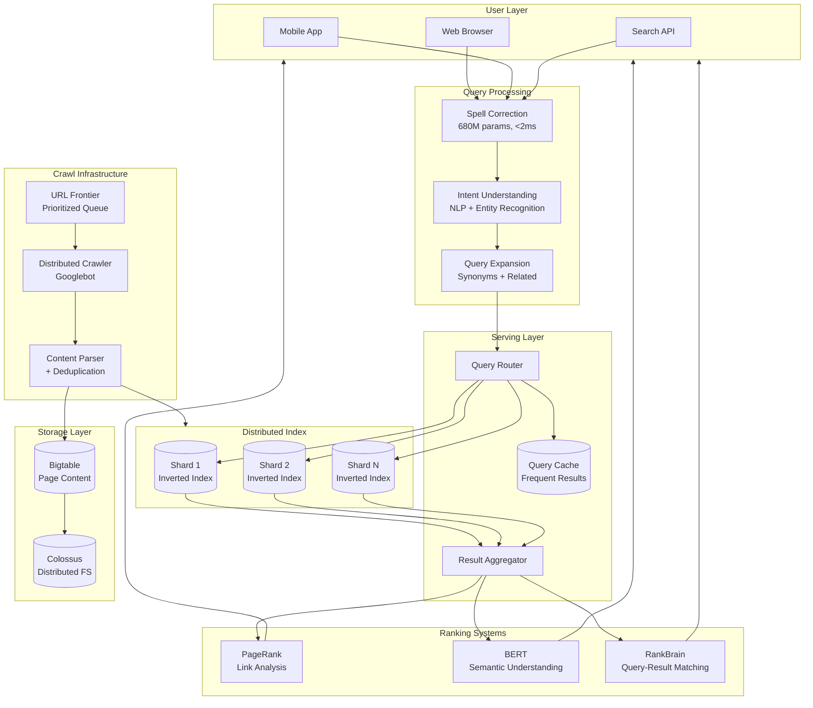
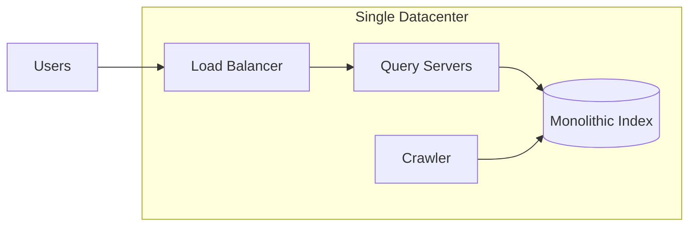
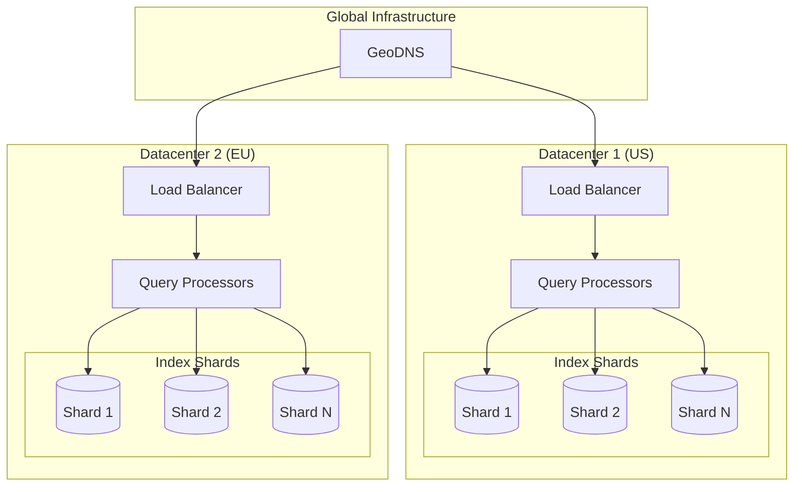
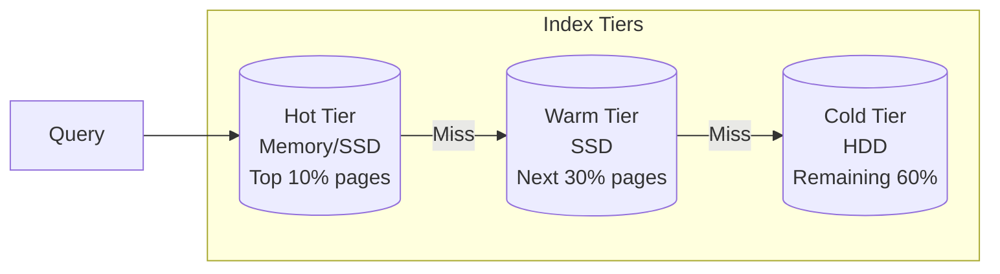
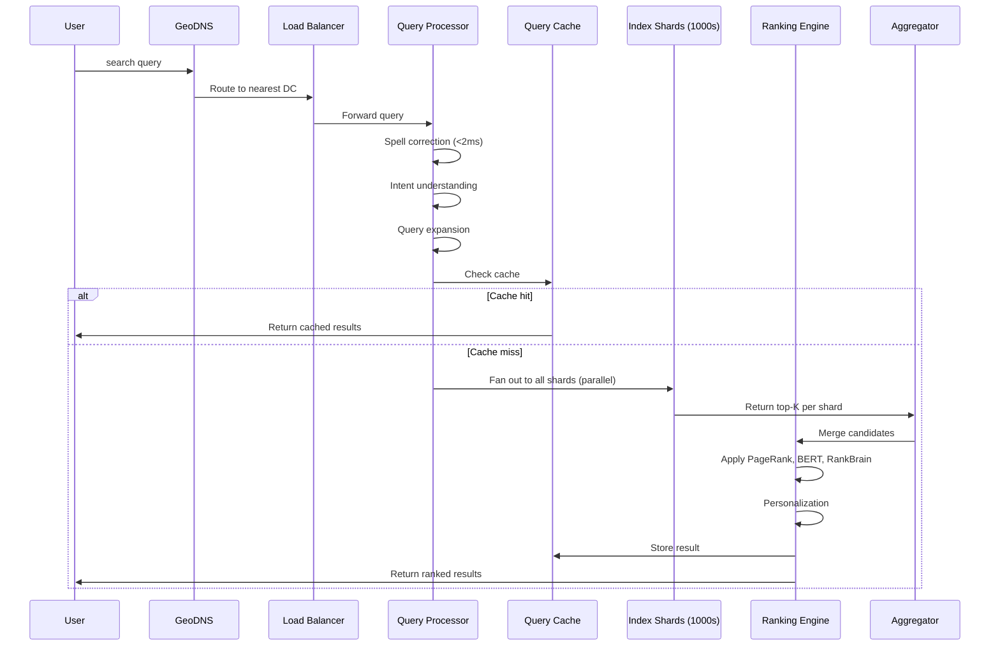
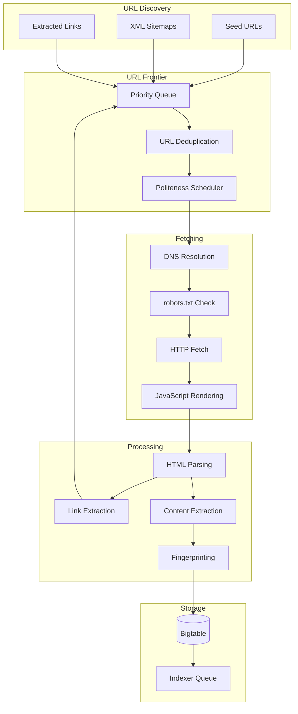
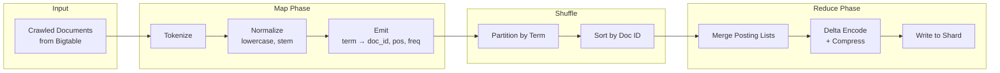
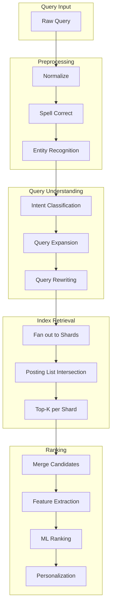
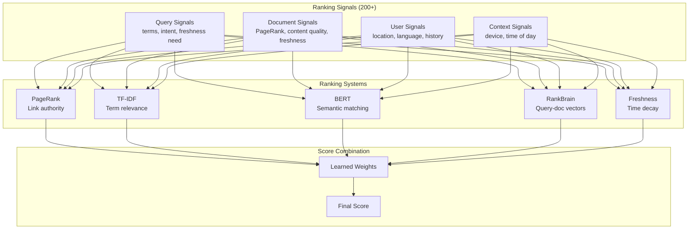
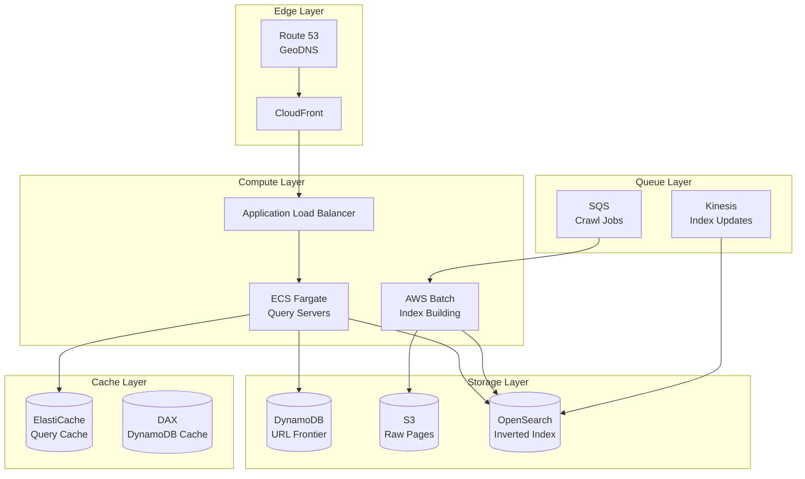

# Design Google Search

Building a web-scale search engine that processes 8.5 billion queries daily across 400+ billion indexed pages with sub-second latency. Search engines solve the fundamental information retrieval problem: given a query, return the most relevant documents from a massive corpus—instantly. This design covers crawling (web discovery), indexing (content organization), ranking (relevance scoring), and serving (query processing)—the four pillars that make search work at planetary scale.

<figure>



<figcaption>Google Search architecture: Queries flow through spell correction and intent understanding, then fan out to distributed index shards. Results aggregate through ranking systems (PageRank, BERT, RankBrain) before returning. Crawlers continuously feed fresh content into the index via Bigtable storage.</figcaption>
</figure>

## Abstract

Web search design revolves around four interconnected systems, each with distinct scale challenges:

1. **Crawling** — Discover and fetch the web's content. The challenge: billions of pages change constantly, but crawl resources are finite. Prioritization (popular pages crawled hourly; obscure pages monthly) and politeness (respecting server limits) determine coverage quality.

2. **Indexing** — Transform raw HTML into queryable data structures. Inverted indexes map every term to its posting list (documents containing that term). Sharding distributes the index across thousands of machines; tiered storage keeps hot data in memory.

3. **Ranking** — Score document relevance for a given query. PageRank (link analysis) provides baseline authority; modern systems layer BERT (semantic understanding), RankBrain (query-result matching), and 200+ other signals. Ranking quality directly determines user satisfaction.

4. **Serving** — Process queries with sub-second latency. Fan out to all index shards in parallel, aggregate results, apply final ranking, and return—all within 200-500ms. Caching frequent queries reduces load; early termination stops when good results are found.

| Component | Scale                   | Key Trade-off                                         |
| --------- | ----------------------- | ----------------------------------------------------- |
| Crawling  | 25B URLs discovered/day | Freshness vs. coverage (can't crawl everything)       |
| Indexing  | 400B+ documents         | Storage cost vs. query speed (compression trade-offs) |
| Ranking   | 200+ signals per query  | Latency vs. ranking quality (more signals = slower)   |
| Serving   | 100K+ QPS peak          | Completeness vs. speed (early termination)            |

The mental model: **crawl → parse → index → rank → serve**. Each stage operates independently but feeds the next. Freshness propagates from crawl to index to results over hours to days depending on page importance.

## Requirements

### Functional Requirements

| Feature          | Scope    | Notes                                  |
| ---------------- | -------- | -------------------------------------- |
| Web search       | Core     | Return ranked results for text queries |
| Autocomplete     | Core     | Suggest queries as user types          |
| Spell correction | Core     | Fix typos, suggest alternatives        |
| Image search     | Extended | Search by image content/metadata       |
| News search      | Extended | Time-sensitive, freshness-critical     |
| Local search     | Extended | Location-aware results                 |
| Knowledge panels | Extended | Direct answers from knowledge graph    |
| Personalization  | Core     | Location, language, search history     |
| Safe search      | Core     | Filter explicit content                |
| Pagination       | Core     | Navigate through result pages          |

### Non-Functional Requirements

| Requirement          | Target                                     | Rationale                                                |
| -------------------- | ------------------------------------------ | -------------------------------------------------------- |
| Query latency        | p50 < 200ms, p99 < 500ms                   | User abandonment increases 20% per 100ms delay           |
| Autocomplete latency | p99 < 100ms                                | Must feel instantaneous while typing                     |
| Availability         | 99.99%                                     | Revenue-critical; billions of queries daily              |
| Index freshness      | Minutes for news, hours for regular pages  | Query Deserves Freshness (QDF) for time-sensitive topics |
| Index coverage       | 400B+ pages                                | Comprehensive web coverage                               |
| Crawl politeness     | Respect robots.txt, adaptive rate limiting | Avoid overloading origin servers                         |
| Result relevance     | High precision in top 10 results           | Users rarely scroll past first page                      |

### Scale Estimation

**Query Traffic:**

```
Daily queries: 8.5 billion
QPS (average): 8.5B / 86,400 = ~100,000 QPS
QPS (peak): 3x average = ~300,000 QPS
Autocomplete: 10x queries (every keystroke) = 1M+ RPS
```

**Index Size:**

```
Indexed pages: 400+ billion documents
Average page size (compressed): 100KB
Raw storage: 400B × 100KB = 40 exabytes
With compression + deduplication: ~1-5 exabytes
Index size (inverted index): ~10-20% of raw = 100s of petabytes
```

**Crawl Volume:**

```
URLs discovered daily: 25+ billion
Pages crawled daily: ~billions (prioritized subset)
Bandwidth: Petabytes per day
Crawl rate per domain: 1-10 requests/second (politeness-limited)
```

**Storage Infrastructure:**

```
Bigtable clusters: Thousands of machines
Colossus clusters: Multiple exabytes each (some exceed 10EB)
Index shards: Thousands across global datacenters
Replication factor: 3x minimum for durability
```

## Design Paths

### Path A: Monolithic Index (Single Datacenter)

**Best when:**

- Index fits on a single machine cluster
- Query volume is moderate (<10K QPS)
- Freshness requirements are relaxed (daily updates acceptable)

**Architecture:**



**Key characteristics:**

- Single index copy, simpler consistency
- Vertical scaling (bigger machines)
- Batch index rebuilds

**Trade-offs:**

- ✅ Simpler architecture, easier debugging
- ✅ No distributed coordination overhead
- ✅ Strong consistency guaranteed
- ❌ Limited to single-datacenter scale
- ❌ Index rebuild causes downtime or staleness
- ❌ No geographic redundancy

**Real-world example:** Elasticsearch single-cluster deployments for enterprise search. Works well up to billions of documents and thousands of QPS. Beyond that, coordination overhead becomes prohibitive.

### Path B: Distributed Sharded Index (Google's Approach)

**Best when:**

- Web-scale index (hundreds of billions of documents)
- Global user base requiring low latency
- Continuous index updates required (no rebuild windows)

**Architecture:**



**Key characteristics:**

- Index partitioned across thousands of machines
- Each query fans out to all shards in parallel
- Results aggregated and ranked centrally
- Index replicated across datacenters for redundancy and latency

**Trade-offs:**

- ✅ Unlimited horizontal scaling
- ✅ Geographic distribution for low latency
- ✅ Continuous updates (no rebuild windows)
- ✅ Fault tolerance (shard failures don't affect availability)
- ❌ Distributed coordination complexity
- ❌ Tail latency challenges (slowest shard determines response time)
- ❌ Cross-shard ranking requires careful design

**Real-world example:** Google Search uses document-based sharding with thousands of shards per datacenter. Index updates propagate continuously; each shard handles a subset of documents independently.

### Path C: Tiered Index (Hot/Cold Separation)

**Best when:**

- Query distribution is highly skewed (popular queries dominate)
- Storage costs are a concern
- Latency requirements vary by query type

**Architecture:**



**Key characteristics:**

- Most queries served from hot tier (memory-resident)
- Warm tier for moderately popular content
- Cold tier for long-tail queries

**Trade-offs:**

- ✅ Optimal cost/performance ratio
- ✅ Sub-millisecond latency for popular queries
- ✅ Gradual degradation for rare queries
- ❌ Tiering logic complexity
- ❌ Cache invalidation challenges
- ❌ Cold-start latency spikes

**Real-world example:** Google combines tiered indexing with sharding. Frequently accessed posting lists stay memory-resident; cold terms live on disk. The system dynamically promotes/demotes based on access patterns.

### Path Comparison

| Factor          | Path A (Monolithic) | Path B (Sharded)     | Path C (Tiered)          |
| --------------- | ------------------- | -------------------- | ------------------------ |
| Scale limit     | ~Billions docs      | Unlimited            | Unlimited                |
| Query latency   | Low (no fan-out)    | Higher (aggregation) | Varies by tier           |
| Index freshness | Batch updates       | Continuous           | Continuous               |
| Complexity      | Low                 | High                 | Medium                   |
| Cost efficiency | Low                 | Medium               | High                     |
| Best for        | Enterprise search   | Web-scale search     | Cost-sensitive web scale |

### This Article's Focus

This article focuses on **Path B (Distributed Sharded Index) with Path C (Tiered) optimizations** because:

1. Web-scale search requires horizontal scaling beyond single-datacenter limits
2. Users expect sub-second latency regardless of location
3. Modern search combines sharding with tiering for cost efficiency

The design sections show how to build each component (crawler, indexer, ranker, serving layer) for distributed operation while maintaining latency SLOs.

## High-Level Design

### Component Overview

| Component           | Responsibility                        | Scale                    |
| ------------------- | ------------------------------------- | ------------------------ |
| URL Frontier        | Prioritized queue of URLs to crawl    | Billions of URLs         |
| Distributed Crawler | Fetch pages, respect politeness       | Millions of fetches/hour |
| Content Parser      | Extract text, links, metadata         | Process crawled pages    |
| Deduplication       | Detect duplicate/near-duplicate pages | Content fingerprinting   |
| Indexer             | Build inverted index from documents   | Continuous updates       |
| Index Shards        | Store and query posting lists         | Thousands of shards      |
| Query Processor     | Parse, expand, route queries          | 100K+ QPS                |
| Ranking Engine      | Score and order results               | 200+ signals             |
| Result Aggregator   | Merge results from shards             | Sub-100ms aggregation    |
| Cache Layer         | Store frequent query results          | 30-40% hit rate          |

### Request Flow



### Crawl Pipeline



## API Design

### Search Query

```http
GET /search?q=distributed+systems&num=10&start=0
Authorization: Bearer {api_key}
Accept-Language: en-US
X-Forwarded-For: {client_ip}
```

**Query Parameters:**

| Parameter      | Type   | Description                              |
| -------------- | ------ | ---------------------------------------- |
| `q`            | string | Search query (URL-encoded)               |
| `num`          | int    | Results per page (default: 10, max: 100) |
| `start`        | int    | Offset for pagination                    |
| `lr`           | string | Language restriction (e.g., `lang_en`)   |
| `gl`           | string | Geolocation (country code)               |
| `safe`         | string | Safe search (`off`, `medium`, `strict`)  |
| `dateRestrict` | string | Time filter (`d7`, `m1`, `y1`)           |

**Response (200 OK):**

```json
{
  "query": {
    "original": "distribted systems",
    "corrected": "distributed systems",
    "expanded_terms": ["distributed computing", "distributed architecture"]
  },
  "search_info": {
    "total_results": 2340000000,
    "search_time_ms": 187,
    "spelling_correction_applied": true
  },
  "results": [
    {
      "position": 1,
      "url": "https://example.com/distributed-systems-guide",
      "title": "Distributed Systems: A Comprehensive Guide",
      "snippet": "Learn about distributed systems architecture, including consensus algorithms, replication strategies, and fault tolerance...",
      "displayed_url": "example.com › guides › distributed-systems",
      "cached_url": "https://webcache.example.com/...",
      "page_info": {
        "last_crawled": "2024-03-15T10:00:00Z",
        "language": "en",
        "mobile_friendly": true
      }
    }
  ],
  "related_searches": ["distributed systems design patterns", "distributed systems vs microservices"],
  "knowledge_panel": {
    "title": "Distributed system",
    "description": "A distributed system is a system whose components are located on different networked computers...",
    "source": "Wikipedia"
  },
  "pagination": {
    "current_page": 1,
    "next_start": 10,
    "has_more": true
  }
}
```

**Error Responses:**

| Code                      | Condition                       | Response                                                 |
| ------------------------- | ------------------------------- | -------------------------------------------------------- |
| `400 Bad Request`         | Empty query, invalid parameters | `{"error": {"code": "invalid_query"}}`                   |
| `429 Too Many Requests`   | Rate limit exceeded             | `{"error": {"code": "rate_limited", "retry_after": 60}}` |
| `503 Service Unavailable` | System overload                 | `{"error": {"code": "overloaded"}}`                      |

### Autocomplete

```http
GET /complete?q=distrib&client=web
```

**Response (200 OK):**

```json
{
  "query": "distrib",
  "suggestions": [
    { "text": "distributed systems", "score": 0.95 },
    { "text": "distributed computing", "score": 0.87 },
    { "text": "distribution center near me", "score": 0.72 },
    { "text": "distributed database", "score": 0.68 }
  ],
  "latency_ms": 8
}
```

**Design note:** Autocomplete must complete in <100ms. Suggestions come from a separate, highly optimized trie-based index of popular queries, not the main document index.

### Crawl Status (Internal API)

```http
GET /internal/crawl/status?url=https://example.com/page
Authorization: Internal-Service-Key {key}
```

**Response:**

```json
{
  "url": "https://example.com/page",
  "canonical_url": "https://example.com/page",
  "last_crawl": "2024-03-15T08:30:00Z",
  "next_scheduled_crawl": "2024-03-16T08:30:00Z",
  "crawl_frequency": "daily",
  "index_status": "indexed",
  "robots_txt_status": "allowed",
  "page_quality_score": 0.78
}
```

## Data Modeling

### Document Storage (Bigtable)

Google stores crawled pages in Bigtable with domain-reversed URLs as row keys for efficient range scans of entire domains.

**Row Key Design:**

```
com.example.www/page/path → Reversed domain + path
```

**Why reversed domain?** Range scans for `com.example.*` retrieve all pages from example.com efficiently. Forward URLs would scatter domain pages across the keyspace.

**Column Families:**

| Column Family | Columns                                  | Description     |
| ------------- | ---------------------------------------- | --------------- |
| `content`     | `html`, `text`, `title`, `meta`          | Page content    |
| `links`       | `outlinks`, `inlinks`                    | Link graph      |
| `crawl`       | `last_crawl`, `next_crawl`, `status`     | Crawl metadata  |
| `index`       | `indexed_at`, `shard_id`                 | Index status    |
| `quality`     | `pagerank`, `spam_score`, `mobile_score` | Quality signals |

**Schema (Conceptual):**

```
Row: com.example.www/distributed-systems
├── content:html        → "<html>..."
├── content:text        → "Distributed systems are..."
├── content:title       → "Distributed Systems Guide"
├── links:outlinks      → ["com.other.www/page1", "org.wiki.en/dist"]
├── links:inlinks       → ["com.blog.www/article", ...]
├── crawl:last_crawl    → 1710489600 (timestamp)
├── crawl:status        → "success"
├── quality:pagerank    → 0.00042
└── quality:spam_score  → 0.02
```

### Inverted Index Structure

The inverted index maps terms to posting lists—ordered lists of documents containing that term.

**Posting List Structure:**

```
Term: "distributed"
├── Document IDs: [doc_123, doc_456, doc_789, ...]
├── Positions:    [[5, 23, 107], [12], [3, 45, 89, 201], ...]
├── Frequencies:  [3, 1, 4, ...]
└── Quality hints: [0.9, 0.7, 0.85, ...]  # PageRank-based ordering
```

**Compression:**

- **Document IDs:** Delta encoding (store differences, not absolute values)
  - Original: [100, 105, 112, 150] → Deltas: [100, 5, 7, 38]
  - Smaller integers compress better with variable-byte encoding
- **Positions:** Delta encoding within each document
- **Frequencies:** Variable-byte encoding

**Index Entry (Conceptual Schema):**

```sql
-- Logical structure (actual implementation uses custom binary format)
term_id: uint64          -- Hashed term
doc_count: uint32        -- Number of documents containing term
posting_list: bytes      -- Compressed posting data
  ├── doc_ids: varint[]  -- Delta-encoded document IDs
  ├── freqs: varint[]    -- Term frequencies per doc
  └── positions: bytes   -- Position data for phrase queries
```

### URL Frontier Schema

```sql
CREATE TABLE url_frontier (
    url_hash BIGINT PRIMARY KEY,      -- Hash of normalized URL
    url TEXT NOT NULL,
    domain_hash BIGINT NOT NULL,       -- For politeness grouping
    priority FLOAT NOT NULL,           -- Crawl priority (0-1)
    last_crawl_time TIMESTAMP,
    next_crawl_time TIMESTAMP NOT NULL,
    crawl_frequency INTERVAL,
    retry_count INT DEFAULT 0,
    status VARCHAR(20) DEFAULT 'pending',

    -- Partitioned by priority for efficient dequeue
    INDEX idx_priority (priority DESC, next_crawl_time ASC),
    INDEX idx_domain (domain_hash, next_crawl_time ASC)
);
```

**Politeness constraint:** Only one outstanding request per domain. The `domain_hash` index enables efficient per-domain rate limiting.

### Storage Selection Matrix

| Data             | Store                                | Rationale                                  |
| ---------------- | ------------------------------------ | ------------------------------------------ |
| Crawled pages    | Bigtable                             | Petabyte scale, row-key range scans        |
| Inverted index   | Custom sharded stores                | Optimized for posting list access          |
| URL frontier     | Distributed queue (Bigtable + Redis) | Priority queue semantics                   |
| Query cache      | Distributed cache (Memcached-like)   | Sub-ms latency, high hit rate              |
| PageRank scores  | Bigtable                             | Updated periodically, read during indexing |
| Query logs       | Columnar store (BigQuery)            | Analytics, ML training                     |
| robots.txt cache | In-memory cache                      | Per-domain, TTL-based                      |

## Low-Level Design

### Inverted Index Construction

Building an inverted index from crawled documents at web scale requires careful batching and distributed coordination.

**Index Build Pipeline:**



**Implementation (Conceptual MapReduce):**

```typescript collapse={1-10, 55-70}
// index-builder.ts
interface Document {
  doc_id: string
  url: string
  content: string
  quality_score: number
}

interface Posting {
  doc_id: number
  frequency: number
  positions: number[]
}

// Map phase: emit (term, posting) pairs
function mapDocument(doc: Document): Map<string, Posting> {
  const terms = new Map<string, Posting>()
  const tokens = tokenize(doc.content)

  for (let pos = 0; pos < tokens.length; pos++) {
    const term = normalize(tokens[pos]) // lowercase, stem

    if (!terms.has(term)) {
      terms.set(term, {
        doc_id: hashDocId(doc.doc_id),
        frequency: 0,
        positions: [],
      })
    }

    const posting = terms.get(term)!
    posting.frequency++
    posting.positions.push(pos)
  }

  return terms
}

// Reduce phase: merge postings for same term
function reducePostings(term: string, postings: Posting[]): PostingList {
  // Sort by quality-weighted doc_id for early termination optimization
  postings.sort((a, b) => b.quality_score - a.quality_score)

  return {
    term,
    doc_count: postings.length,
    postings: deltaEncode(postings),
  }
}

function deltaEncode(postings: Posting[]): Buffer {
  const buffer = new CompressedBuffer()
  let prevDocId = 0

  for (const posting of postings) {
    // Store delta instead of absolute doc_id
    buffer.writeVarint(posting.doc_id - prevDocId)
    buffer.writeVarint(posting.frequency)
    buffer.writePositions(posting.positions)
    prevDocId = posting.doc_id
  }

  return buffer.toBuffer()
}
```

**Index update strategy:**

| Approach          | Latency | Complexity | Use Case                     |
| ----------------- | ------- | ---------- | ---------------------------- |
| Full rebuild      | Hours   | Low        | Initial build, major changes |
| Incremental merge | Minutes | Medium     | Regular updates              |
| Real-time append  | Seconds | High       | Breaking news, fresh content |

Google uses a hybrid: the main index updates incrementally, while a separate "fresh" index handles real-time content with periodic merges.

### Query Processing Pipeline



**Spell Correction Implementation:**

Google's spell corrector uses a deep neural network with 680+ million parameters, executing in under 2ms.

```typescript collapse={1-8, 40-50}
// spell-correction.ts
interface SpellResult {
  original: string
  corrected: string
  confidence: number
  alternatives: string[]
}

async function correctSpelling(query: string): Promise<SpellResult> {
  // 1. Check if query is a known valid phrase
  if (await isKnownPhrase(query)) {
    return { original: query, corrected: query, confidence: 1.0, alternatives: [] }
  }

  // 2. Run neural spell correction model
  const modelOutput = await spellModel.predict(query)

  // 3. Consider context: surrounding words affect correction
  // "python" after "monty" → don't correct to "python programming"
  const contextualCorrection = applyContextRules(query, modelOutput)

  // 4. Check correction against query logs (popular queries)
  const popularMatch = await findPopularMatch(contextualCorrection)

  return {
    original: query,
    corrected: popularMatch || contextualCorrection,
    confidence: modelOutput.confidence,
    alternatives: modelOutput.alternatives.slice(0, 3),
  }
}
```

**Design insight:** Spell correction uses query logs as ground truth. If millions of users search for "javascript" after initially typing "javasript", the model learns that correction. This is why spell correction works better for common queries than rare technical terms.

### Ranking System Architecture

Google combines multiple ranking systems, each contributing different signals:



**PageRank Computation:**

PageRank measures page authority based on link structure. The algorithm models a random web surfer following links.

```typescript collapse={1-12, 50-60}
// pagerank.ts
interface PageGraph {
  pages: Map<string, string[]> // page → outlinks
  inlinks: Map<string, string[]> // page → pages linking to it
}

const DAMPING_FACTOR = 0.85
const CONVERGENCE_THRESHOLD = 0.0001
const MAX_ITERATIONS = 100

function computePageRank(graph: PageGraph): Map<string, number> {
  const numPages = graph.pages.size
  const initialRank = 1.0 / numPages

  // Initialize all pages with equal rank
  let ranks = new Map<string, number>()
  for (const page of graph.pages.keys()) {
    ranks.set(page, initialRank)
  }

  // Iterate until convergence
  for (let iter = 0; iter < MAX_ITERATIONS; iter++) {
    const newRanks = new Map<string, number>()
    let maxDelta = 0

    for (const page of graph.pages.keys()) {
      // Sum of (rank / outlink_count) for all pages linking to this page
      let inlinkSum = 0
      const inlinks = graph.inlinks.get(page) || []

      for (const inlink of inlinks) {
        const inlinkRank = ranks.get(inlink) || 0
        const outlinks = graph.pages.get(inlink) || []
        if (outlinks.length > 0) {
          inlinkSum += inlinkRank / outlinks.length
        }
      }

      // PageRank formula: PR(A) = (1-d)/N + d * sum(PR(Ti)/C(Ti))
      const newRank = (1 - DAMPING_FACTOR) / numPages + DAMPING_FACTOR * inlinkSum
      newRanks.set(page, newRank)

      maxDelta = Math.max(maxDelta, Math.abs(newRank - (ranks.get(page) || 0)))
    }

    ranks = newRanks

    if (maxDelta < CONVERGENCE_THRESHOLD) {
      break // Converged
    }
  }

  return ranks
}
```

**PageRank at scale:**

- Full web graph: 400B+ nodes, trillions of edges
- Computation: Distributed MapReduce across thousands of machines
- Frequency: Recomputed periodically (historically monthly, now more frequent)
- Storage: PageRank scores stored with documents in Bigtable

**BERT for Ranking:**

BERT (Bidirectional Encoder Representations from Transformers) understands semantic meaning, not just keyword matching.

```
Query: "can you get medicine for someone pharmacy"
Without BERT: Matches pages about "medicine" and "pharmacy" separately
With BERT: Understands intent = "picking up prescription for another person"
```

**RankBrain:**

RankBrain converts queries and documents to vectors in a shared embedding space. Semantic similarity is measured by vector distance.

```
Query vector: [0.23, -0.45, 0.12, ...]  (300+ dimensions)
Doc vector:   [0.21, -0.42, 0.15, ...]
Similarity:   cosine_similarity(query_vec, doc_vec) = 0.94
```

### Distributed Query Execution

Querying a sharded index requires fan-out to all shards, parallel execution, and result aggregation.

```typescript collapse={1-15, 70-85}
// query-executor.ts
interface ShardResult {
  shard_id: number
  results: ScoredDocument[]
  latency_ms: number
}

interface QueryPlan {
  query: ParsedQuery
  shards: ShardConnection[]
  timeout_ms: number
  top_k_per_shard: number
}

async function executeQuery(plan: QueryPlan): Promise<SearchResult[]> {
  const { query, shards, timeout_ms, top_k_per_shard } = plan

  // Fan out to all shards in parallel
  const shardPromises = shards.map((shard) =>
    queryShard(shard, query, top_k_per_shard).catch((err) => ({
      shard_id: shard.id,
      results: [],
      latency_ms: timeout_ms,
      error: err,
    })),
  )

  // Wait for all shards with timeout
  const shardResults = await Promise.race([Promise.all(shardPromises), sleep(timeout_ms).then(() => "timeout")])

  if (shardResults === "timeout") {
    // Return partial results from completed shards
    return aggregatePartialResults(shardPromises)
  }

  // Merge results from all shards
  return mergeAndRank(shardResults as ShardResult[], query)
}

function mergeAndRank(shardResults: ShardResult[], query: ParsedQuery): SearchResult[] {
  // Collect all candidates
  const candidates: ScoredDocument[] = []
  for (const result of shardResults) {
    candidates.push(...result.results)
  }

  // Global ranking across all shards
  // Shard-local scores are comparable because same scoring function
  candidates.sort((a, b) => b.score - a.score)

  // Apply final ranking (BERT, personalization)
  const reranked = applyFinalRanking(candidates.slice(0, 1000), query)

  return reranked.slice(0, query.num_results)
}

async function queryShard(shard: ShardConnection, query: ParsedQuery, topK: number): Promise<ShardResult> {
  const start = Date.now()

  // 1. Retrieve posting lists for query terms
  const postingLists = await shard.getPostingLists(query.terms)

  // 2. Intersect posting lists (for AND queries)
  const candidates = intersectPostingLists(postingLists)

  // 3. Score candidates using local signals
  const scored = candidates.map((doc) => ({
    doc,
    score: computeLocalScore(doc, query),
  }))

  // 4. Return top-K
  scored.sort((a, b) => b.score - a.score)

  return {
    shard_id: shard.id,
    results: scored.slice(0, topK),
    latency_ms: Date.now() - start,
  }
}
```

**Tail latency challenge:** With 1000 shards, even 99th percentile shard latency affects median query latency. Mitigations:

| Technique         | Description                                                   |
| ----------------- | ------------------------------------------------------------- |
| Hedged requests   | Send duplicate requests to replica shards, use first response |
| Partial results   | Return results even if some shards timeout                    |
| Early termination | Stop when enough high-quality results found                   |
| Shard rebalancing | Move hot shards to faster machines                            |

### Crawl Scheduling and Politeness

```typescript collapse={1-12, 60-75}
// crawl-scheduler.ts
interface CrawlJob {
  url: string
  domain: string
  priority: number
  lastCrawl: Date | null
  estimatedChangeRate: number
}

interface DomainState {
  lastRequestTime: Date
  crawlDelay: number // From robots.txt or adaptive
  concurrentRequests: number
  maxConcurrent: number
}

class CrawlScheduler {
  private domainStates: Map<string, DomainState> = new Map()
  private frontier: PriorityQueue<CrawlJob>

  async scheduleNext(): Promise<CrawlJob | null> {
    while (!this.frontier.isEmpty()) {
      const job = this.frontier.peek()

      // Check politeness constraints
      const domainState = this.getDomainState(job.domain)

      if (!this.canCrawlNow(domainState)) {
        // Can't crawl this domain yet, try next
        this.frontier.pop()
        this.frontier.push(job) // Re-add with delay
        continue
      }

      // Acquire crawl slot for this domain
      if (domainState.concurrentRequests >= domainState.maxConcurrent) {
        continue
      }

      domainState.concurrentRequests++
      domainState.lastRequestTime = new Date()

      return this.frontier.pop()
    }

    return null
  }

  private canCrawlNow(state: DomainState): boolean {
    const elapsed = Date.now() - state.lastRequestTime.getTime()
    return elapsed >= state.crawlDelay * 1000
  }

  // Adaptive crawl delay based on server response
  updateCrawlDelay(domain: string, responseTimeMs: number, statusCode: number): void {
    const state = this.getDomainState(domain)

    if (statusCode === 429 || statusCode === 503) {
      // Server is overloaded, back off exponentially
      state.crawlDelay = Math.min(state.crawlDelay * 2, 60)
    } else if (responseTimeMs > 2000) {
      // Slow response, increase delay
      state.crawlDelay = Math.min(state.crawlDelay * 1.5, 30)
    } else if (responseTimeMs < 200 && state.crawlDelay > 1) {
      // Fast response, can crawl more aggressively
      state.crawlDelay = Math.max(state.crawlDelay * 0.9, 1)
    }
  }
}
```

**Crawl prioritization factors:**

| Factor                 | Weight    | Rationale                                    |
| ---------------------- | --------- | -------------------------------------------- |
| PageRank               | High      | Important pages should be fresh              |
| Update frequency       | High      | Pages that change often need frequent crawls |
| User demand            | High      | Popular query results need freshness         |
| Sitemap priority       | Medium    | Webmaster hints                              |
| Time since last crawl  | Medium    | Spread crawl load                            |
| robots.txt crawl-delay | Mandatory | Respect server limits                        |

## Frontend Considerations

### Search Results Page Performance

The Search Engine Results Page (SERP) must render quickly despite complex content (rich snippets, knowledge panels, images).

**Critical rendering path:**

```typescript collapse={1-10, 45-55}
// serp-rendering.ts
interface SearchResultsPage {
  query: string
  results: SearchResult[]
  knowledgePanel?: KnowledgePanel
  relatedSearches: string[]
}

// Server-side render critical content
function renderSERP(data: SearchResultsPage): string {
  // 1. Inline critical CSS for above-the-fold content
  const criticalCSS = extractCriticalCSS()

  // 2. Render first 3 results server-side (no JS needed)
  const initialResults = data.results.slice(0, 3).map(renderResult).join("")

  // 3. Defer non-critical content
  const deferredContent = `
    <script>
      // Hydrate remaining results after initial paint
      window.__SERP_DATA__ = ${JSON.stringify(data)};
    </script>
  `

  return `
    <html>
    <head>
      <style>${criticalCSS}</style>
    </head>
    <body>
      <div id="results">${initialResults}</div>
      <div id="deferred"></div>
      ${deferredContent}
      <script src="/serp.js" defer></script>
    </body>
    </html>
  `
}
```

**Performance optimizations:**

| Technique             | Impact                   | Implementation                      |
| --------------------- | ------------------------ | ----------------------------------- |
| Server-side rendering | FCP < 500ms              | Render first 3 results on server    |
| Critical CSS inlining | No render blocking       | Extract above-fold styles           |
| Lazy loading          | Reduced initial payload  | Load images/rich snippets on scroll |
| Prefetching           | Faster result clicks     | Prefetch top result on hover        |
| Service worker        | Offline + instant repeat | Cache static assets, query history  |

### Autocomplete UX

```typescript collapse={1-8, 45-55}
// autocomplete.ts
class AutocompleteController {
  private debounceMs = 100
  private minChars = 2
  private cache: Map<string, string[]> = new Map()

  async handleInput(query: string): Promise<string[]> {
    if (query.length < this.minChars) {
      return []
    }

    // Check cache first
    const cached = this.cache.get(query)
    if (cached) {
      return cached
    }

    // Debounce rapid keystrokes
    await this.debounce()

    // Fetch suggestions
    const suggestions = await this.fetchSuggestions(query)

    // Cache for repeat queries
    this.cache.set(query, suggestions)

    // Prefetch likely next queries
    this.prefetchNextCharacter(query)

    return suggestions
  }

  private prefetchNextCharacter(query: string): void {
    // Prefetch common next characters
    const commonNextChars = ["a", "e", "i", "o", "s", "t", " "]
    for (const char of commonNextChars) {
      const nextQuery = query + char
      if (!this.cache.has(nextQuery)) {
        // Low-priority background fetch
        requestIdleCallback(() => this.fetchSuggestions(nextQuery))
      }
    }
  }
}
```

**Autocomplete latency budget:**

```
Total: 100ms target
├── Network RTT: 30ms (edge servers)
├── Server processing: 20ms
├── Trie lookup: 5ms
├── Ranking: 10ms
├── Response serialization: 5ms
└── Client rendering: 30ms
```

### Infinite Scroll vs Pagination

Google uses traditional pagination rather than infinite scroll. Design rationale:

| Factor            | Pagination                     | Infinite Scroll          |
| ----------------- | ------------------------------ | ------------------------ |
| User mental model | Clear position in results      | Lost context             |
| Sharing results   | "Page 2" is meaningful         | No way to share position |
| Back button       | Works as expected              | Loses scroll position    |
| Performance       | Bounded DOM size               | Unbounded growth         |
| SEO results       | Users evaluate before clicking | Scroll past quickly      |

## Infrastructure Design

### Cloud-Agnostic Components

| Component           | Purpose                      | Requirements                        |
| ------------------- | ---------------------------- | ----------------------------------- |
| Distributed storage | Page content, index          | Petabyte scale, strong consistency  |
| Distributed compute | Index building, ranking      | Horizontal scaling, fault tolerance |
| Message queue       | Crawl job distribution       | At-least-once, priority queues      |
| Cache layer         | Query results, posting lists | Sub-ms latency, high throughput     |
| CDN                 | Static assets, edge serving  | Global distribution                 |
| DNS                 | Geographic routing           | Low latency, health checking        |

### Google's Internal Infrastructure

| Component  | Google Service                   | Purpose                                   |
| ---------- | -------------------------------- | ----------------------------------------- |
| Storage    | Bigtable + Colossus              | Structured data + distributed file system |
| Compute    | Borg                             | Container orchestration                   |
| MapReduce  | MapReduce / Flume                | Batch processing                          |
| RPC        | Stubby (gRPC predecessor)        | Service communication                     |
| Monitoring | Borgmon (Prometheus inspiration) | Metrics and alerting                      |
| Consensus  | Chubby (ZooKeeper inspiration)   | Distributed locking                       |

### AWS Reference Architecture



**Service sizing (for ~10K QPS, 1B documents):**

| Service     | Configuration              | Cost Estimate |
| ----------- | -------------------------- | ------------- |
| OpenSearch  | 20 × i3.2xlarge data nodes | ~$50K/month   |
| ECS Fargate | 50 × 4vCPU/8GB tasks       | ~$15K/month   |
| ElastiCache | 10 × r6g.xlarge nodes      | ~$5K/month    |
| DynamoDB    | On-demand, ~100K WCU       | ~$10K/month   |
| S3          | 100TB storage              | ~$2K/month    |

**Note:** This is a simplified reference. Google's actual infrastructure is 1000x larger and uses custom hardware/software unavailable commercially.

### Self-Hosted Open Source Stack

| Component     | Technology                  | Notes                           |
| ------------- | --------------------------- | ------------------------------- |
| Search engine | Elasticsearch / Solr        | Proven at billion-doc scale     |
| Storage       | Cassandra / ScyllaDB        | Wide-column store like Bigtable |
| Crawler       | Apache Nutch / StormCrawler | Distributed web crawling        |
| Queue         | Kafka                       | Crawl job distribution          |
| Compute       | Kubernetes                  | Container orchestration         |
| Cache         | Redis Cluster               | Query and posting list cache    |

## Variations

### News Search (Freshness-Critical)

News search prioritizes freshness over traditional ranking signals.

```typescript
// news-ranking.ts
function computeNewsScore(doc: NewsDocument, query: Query): number {
  const baseRelevance = computeTextRelevance(doc, query)
  const authorityScore = doc.sourceAuthority // CNN > random blog
  const freshnessScore = computeFreshnessDecay(doc.publishedAt)

  // Freshness dominates for news queries
  return baseRelevance * 0.3 + authorityScore * 0.2 + freshnessScore * 0.5
}

function computeFreshnessDecay(publishedAt: Date): number {
  const ageHours = (Date.now() - publishedAt.getTime()) / (1000 * 60 * 60)

  // Exponential decay: half-life of ~6 hours for breaking news
  return Math.exp(-ageHours / 8)
}
```

**News-specific infrastructure:**

- Dedicated "fresh" index updated in real-time
- RSS/Atom feed crawling every few minutes
- Publisher push APIs for instant indexing
- Separate ranking model trained on news engagement

### Image Search

Image search combines visual features with text signals.

```typescript
// image-search.ts
interface ImageDocument {
  imageUrl: string
  pageUrl: string
  altText: string
  surroundingText: string
  visualFeatures: number[] // CNN embeddings
  safeSearchScore: number
}

function rankImageResult(image: ImageDocument, query: Query): number {
  // Text signals from alt text and page context
  const textScore = computeTextRelevance(image.altText + " " + image.surroundingText, query)

  // Visual similarity to query (if query has image)
  const visualScore = query.hasImage ? cosineSimilarity(image.visualFeatures, query.imageFeatures) : 0

  // Page authority
  const pageScore = getPageRank(image.pageUrl)

  return textScore * 0.4 + visualScore * 0.3 + pageScore * 0.3
}
```

### Local Search

Location-aware search requires geographic indexing.

```typescript
// local-search.ts
interface LocalBusiness {
  id: string
  name: string
  category: string
  location: { lat: number; lng: number }
  rating: number
  reviewCount: number
}

function rankLocalResult(business: LocalBusiness, query: Query, userLocation: Location): number {
  const relevanceScore = computeTextRelevance(business.name + " " + business.category, query)

  // Distance decay: closer is better
  const distance = haversineDistance(userLocation, business.location)
  const distanceScore = 1 / (1 + distance / 5) // 5km reference distance

  // Quality signals
  const qualityScore = business.rating * Math.log(business.reviewCount + 1)

  return relevanceScore * 0.3 + distanceScore * 0.4 + qualityScore * 0.3
}
```

**Local search infrastructure:**

- Geospatial index (R-tree or geohash-based)
- Business database integration (Google My Business)
- Real-time hours/availability from APIs
- User location from GPS, IP, or explicit setting

## Conclusion

Web search design requires solving four interconnected problems at planetary scale:

1. **Crawling** — Discovering and fetching content from billions of URLs while respecting server limits. Prioritization determines which pages stay fresh; adaptive politeness prevents overloading origin servers. The crawler is never "done"—the web changes continuously.

2. **Indexing** — Building data structures that enable sub-second query response. Inverted indexes map terms to documents; sharding distributes the index across thousands of machines. Compression (delta encoding) reduces storage 5-10x while maintaining query speed.

3. **Ranking** — Combining hundreds of signals to surface relevant results. PageRank provides baseline authority from link structure; BERT understands semantic meaning; RankBrain matches queries to documents in embedding space. No single signal dominates—the combination matters.

4. **Serving** — Processing 100K+ QPS with sub-second latency. Fan-out to all shards, aggregate results, apply final ranking—all within 200ms. Caching handles the long tail; early termination stops when good results are found.

**What this design optimizes for:**

- Query latency: p50 < 200ms through caching, early termination, and parallel shard queries
- Index freshness: Minutes for news, hours for regular content through tiered crawling
- Result relevance: Multiple ranking systems (PageRank + BERT + RankBrain) cover different relevance aspects
- Horizontal scale: Sharded architecture scales to 400B+ documents

**What it sacrifices:**

- Simplicity: Thousands of components, multiple ranking systems, complex coordination
- Cost: Massive infrastructure (estimated millions of servers)
- Real-time indexing: Minutes to hours delay for most content (news excepted)

**Known limitations:**

- Long-tail queries may have poor results (insufficient training data)
- Adversarial SEO requires constant ranking updates
- Fresh content from new sites may take weeks to surface
- Personalization creates filter bubbles

## Appendix

### Prerequisites

- Information retrieval fundamentals (TF-IDF, inverted indexes)
- Distributed systems concepts (sharding, replication, consensus)
- Basic machine learning (embeddings, neural networks)
- Graph algorithms (PageRank, link analysis)

### Terminology

- **Inverted Index** — Data structure mapping terms to documents containing them
- **Posting List** — List of documents (with positions/frequencies) for a single term
- **PageRank** — Algorithm measuring page importance based on link structure
- **BERT** — Bidirectional Encoder Representations from Transformers; understands word context
- **RankBrain** — Google's ML system for query-document matching via embeddings
- **Crawl Budget** — Maximum pages a crawler will fetch from a domain in a time period
- **robots.txt** — File specifying crawler access rules for a website
- **QDF** — Query Deserves Freshness; flag indicating time-sensitive queries
- **SERP** — Search Engine Results Page
- **Canonical URL** — Preferred URL when multiple URLs have duplicate content

### Summary

- Web search processes **8.5B queries/day** across **400B+ indexed pages** with **sub-second latency**
- **Inverted indexes** enable O(1) term lookup; **sharding** distributes load across thousands of machines
- **PageRank** measures page authority via link analysis; **BERT/RankBrain** add semantic understanding
- **Crawl prioritization** balances freshness vs. coverage; politeness respects server limits
- **Query processing** includes spell correction (680M param DNN), intent understanding, and query expansion
- **Tiered indexing** keeps hot data in memory; cold data on disk for cost efficiency
- **Early termination** and **caching** reduce tail latency; hedged requests handle slow shards

### References

- [The Anatomy of a Large-Scale Hypertextual Web Search Engine](http://infolab.stanford.edu/~backrub/google.html) - Brin & Page (1998), original Google paper
- [Bigtable: A Distributed Storage System for Structured Data](https://research.google/pubs/bigtable-a-distributed-storage-system-for-structured-data/) - Google (2006), storage architecture
- [How Search Works](https://www.google.com/search/howsearchworks/) - Google official documentation
- [Google Search Ranking Systems Guide](https://developers.google.com/search/docs/appearance/ranking-systems-guide) - Official ranking system documentation
- [A Peek Behind Colossus](https://cloud.google.com/blog/products/storage-data-transfer/a-peek-behind-colossus-googles-file-system) - Google's distributed file system
- [BERT: Pre-training of Deep Bidirectional Transformers](https://arxiv.org/abs/1810.04805) - Devlin et al., BERT paper
- [The PageRank Citation Ranking](http://ilpubs.stanford.edu:8090/422/) - Page et al., original PageRank paper
- [Web Search for a Planet](https://research.google/pubs/web-search-for-a-planet-the-google-cluster-architecture/) - Google (2003), cluster architecture
- [Crawl Budget Management](https://developers.google.com/search/docs/crawling-indexing/large-site-managing-crawl-budget) - Google crawl documentation
