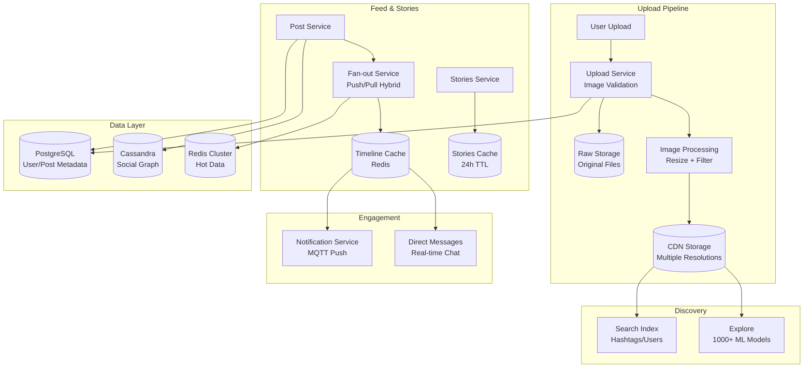
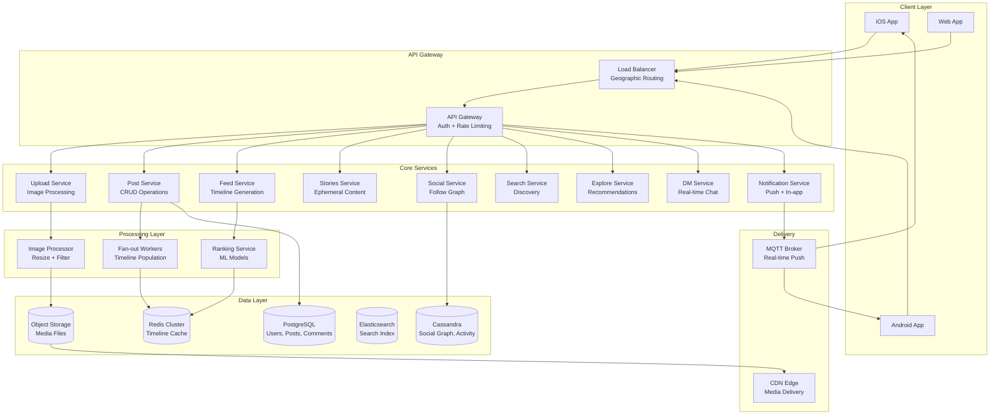
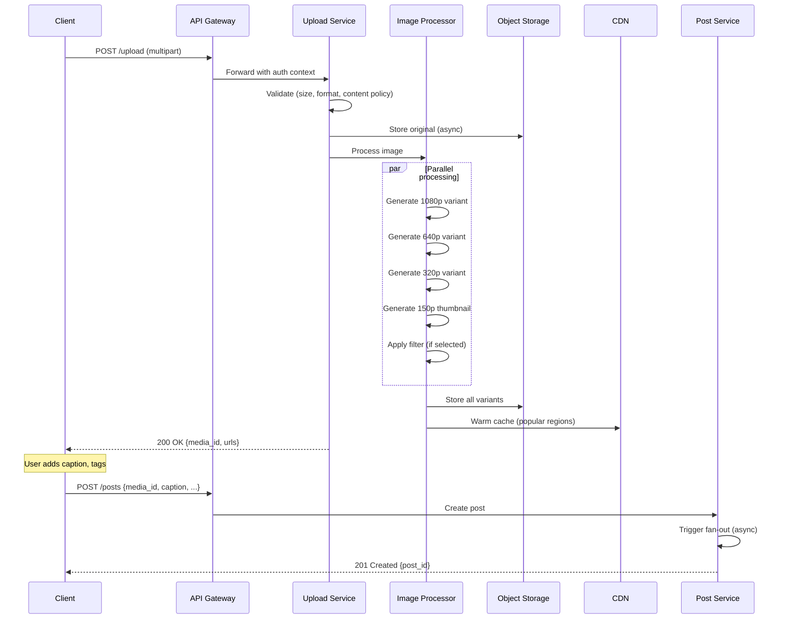
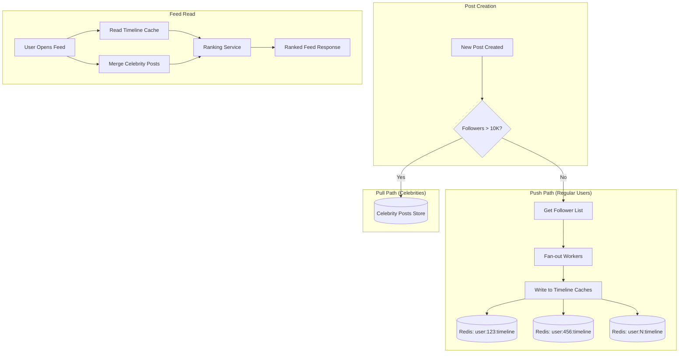
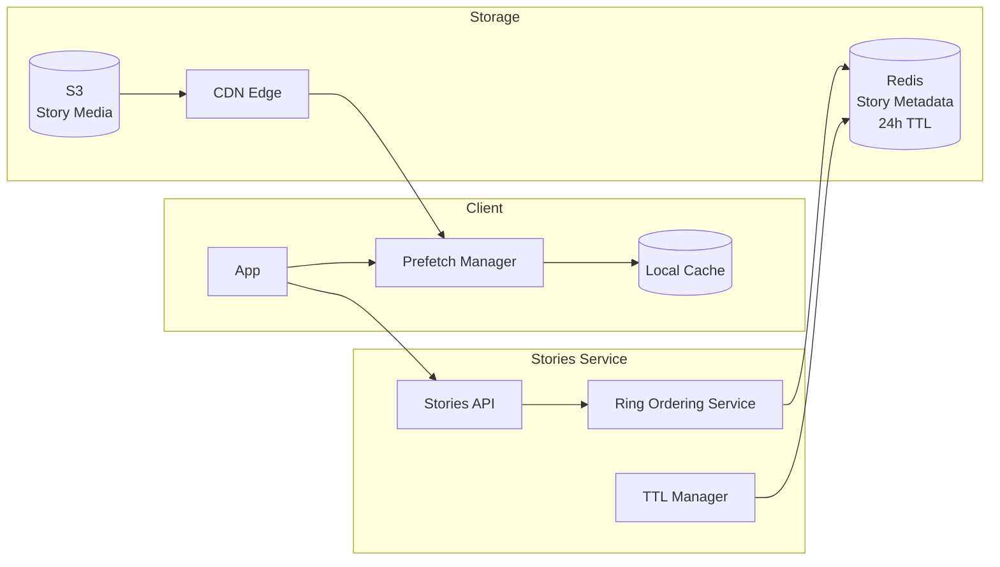
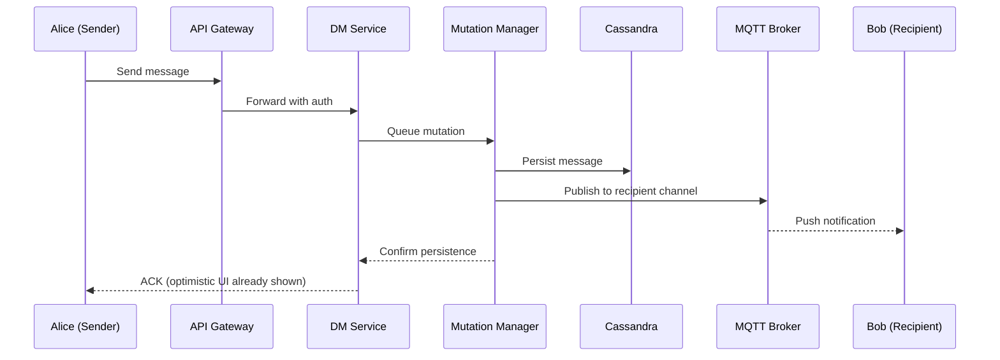
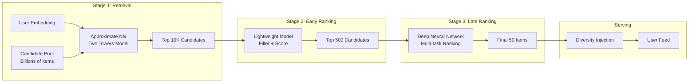
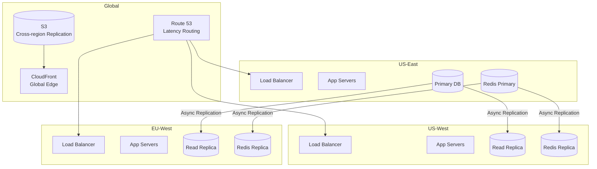

# Design Instagram: Photo Sharing at Scale

A photo-sharing social platform at Instagram scale handles 1+ billion photos uploaded daily, serves feeds to 500M+ daily active users, and delivers sub-second playback for Stories. This design covers the image upload pipeline, feed generation with fan-out strategies, Stories architecture, and the recommendation systems that power Explore—focusing on the architectural decisions that enable Instagram to process 95M+ daily uploads while maintaining real-time feed delivery.

<figure>



<figcaption>High-level architecture: upload → process → store → deliver. Feed generation uses hybrid fan-out; Stories have separate TTL-aware caching. Discovery systems run 1000+ ML models for personalization.</figcaption>
</figure>

## Abstract

Instagram's architecture addresses three fundamental challenges:

1. **Write amplification vs. read latency**: A single post from a user with 10M followers could generate 10M timeline cache writes. The hybrid fan-out strategy (push for regular users, pull for celebrities) bounds write amplification while keeping read latency under 100ms.

2. **Ephemeral vs. persistent content**: Stories (24-hour TTL) and posts (permanent) require different storage strategies. Stories use aggressive client-side caching with TTL sync; posts use tiered storage with CDN caching.

3. **Cold start vs. engagement optimization**: New users need immediate value (trending content); returning users need personalized feeds. The Explore system runs 1000+ ML models simultaneously, using Two Towers neural networks for candidate retrieval and multi-task ranking for final selection.

Core mechanisms:

- **Hybrid fan-out**: Push to followers' timeline caches for users with <10K followers; merge celebrity content at read time
- **Image processing pipeline**: Generate 6+ resolution variants synchronously; apply filters via GPU shaders
- **Stories architecture**: 24-hour TTL with aggressive prefetch; target <200ms load time
- **Feed ranking**: 100K+ dense features processed by neural networks; models fine-tuned hourly
- **MQTT for real-time**: Powers DMs, notifications, and presence with 6-8% less power than HTTP

## Requirements

### Functional Requirements

| Requirement          | Priority     | Notes                                                  |
| -------------------- | ------------ | ------------------------------------------------------ |
| Photo/video upload   | Core         | Multiple resolutions, filters, up to 10 items per post |
| Feed (home timeline) | Core         | Ranked, personalized, infinite scroll                  |
| Stories              | Core         | 24-hour ephemeral, ring UI, reply capability           |
| Follow/unfollow      | Core         | Social graph management                                |
| Likes and comments   | Core         | Real-time counts, threaded comments                    |
| Direct messages      | Core         | Real-time chat, media sharing                          |
| Explore page         | Core         | Content discovery, personalized recommendations        |
| Search               | Core         | Users, hashtags, locations                             |
| Notifications        | Core         | Likes, comments, follows, DM alerts                    |
| Reels                | Extended     | Short-form video (separate video pipeline)             |
| Shopping             | Out of scope | E-commerce integration                                 |
| Ads                  | Out of scope | Separate ad-tech stack                                 |

### Non-Functional Requirements

| Requirement           | Target                    | Rationale                                  |
| --------------------- | ------------------------- | ------------------------------------------ |
| Upload availability   | 99.9%                     | Brief maintenance acceptable               |
| Feed availability     | 99.99%                    | Core engagement driver                     |
| Feed load latency     | p99 < 500ms               | User experience threshold                  |
| Stories load latency  | p99 < 200ms               | Tap-and-swipe UX requires instant response |
| Image processing time | < 10s                     | User waits for upload confirmation         |
| DM delivery latency   | p99 < 500ms               | Real-time conversation expectation         |
| Notification delivery | < 2s                      | Engagement driver                          |
| Feed freshness        | < 30s for non-celebrities | Balance freshness vs. ranking quality      |

### Scale Estimation

**Instagram-scale baseline (2025):**

```
Monthly active users: 3 billion
Daily active users: 500M+
Photos uploaded daily: 95M-100M (conservative estimate)

Upload traffic:
- 100M uploads/day = ~1,150 uploads/second average
- Peak: 3x average = ~3,500 uploads/second
- Average image size: 2MB (after client compression)
- Daily upload ingestion: ~200TB/day

Storage per image:
- Original: 2MB
- Resolutions: 1080p, 640p, 320p, 150p (thumbnail) × 2 (square + original aspect)
- Total variants: ~8 files
- Average total per image: ~5MB (compressed variants)
- Daily storage growth: ~500TB/day

Feed reads:
- 500M DAU × 20 feed opens/day = 10B feed reads/day
- = ~115K feed reads/second average
- Peak: 350K+ reads/second

Social graph:
- Average followers per user: ~150
- Celebrity accounts (>1M followers): ~50,000
- Graph edges: billions
```

**CDN efficiency:**

```
Without CDN: All reads from origin
With 95% cache hit rate (power-law distribution):
- 5% cache misses = 17.5K requests/second to origin
- Popular content served entirely from edge
```

## Design Paths

### Path A: Push-First Fan-out

**Best when:**

- Smaller scale (<100M users)
- Read latency is critical
- Most users have similar follower counts (no extreme outliers)

**Architecture:**

On post creation, push the post ID to every follower's timeline cache. Reads are O(1) cache lookups.

**Trade-offs:**

- ✅ Extremely fast reads (pre-computed timelines)
- ✅ Simple read path (single cache lookup)
- ❌ Massive write amplification for popular accounts
- ❌ Wasted writes for inactive followers
- ❌ Storage explosion (N copies per post where N = followers)

**Real-world example:** Twitter (2010-2012) used pure push model initially. A single Bieber tweet caused 10M+ cache writes.

### Path B: Pull-Only Fan-out

**Best when:**

- Read latency tolerance is higher
- Storage cost is primary concern
- Feed freshness can be slightly stale

**Architecture:**

On feed request, query the social graph for followed users, fetch their recent posts, merge and rank.

**Trade-offs:**

- ✅ No write amplification
- ✅ Minimal storage (posts stored once)
- ✅ Always fresh (computed at read time)
- ❌ High read latency (multiple DB queries)
- ❌ Expensive computation per request
- ❌ Difficult to rank effectively (limited time for ML)

**Real-world example:** Early Facebook News Feed used pull model; abandoned due to latency issues at scale.

### Path C: Hybrid Fan-out (Instagram Model)

**Best when:**

- Massive scale with power-law follower distribution
- Sub-second read latency required
- Celebrity accounts exist (>1M followers)

**Architecture:**

- **Regular users (<10K followers)**: Push to followers' timeline caches on post
- **Celebrity accounts (>10K followers)**: Store posts separately; merge at read time
- **Inactive users**: Skip fan-out; compute on demand if they return

**Trade-offs:**

- ✅ Bounded write amplification (max 10K writes per post)
- ✅ Fast reads for most users (cache + small merge)
- ✅ Handles celebrity scale without storage explosion
- ❌ Two code paths to maintain
- ❌ Merge logic adds complexity
- ❌ Celebrity posts have slight latency penalty

**Real-world example:** Instagram and Twitter (post-2012) use hybrid models. Instagram's feed team explicitly tuned the threshold based on write cost analysis.

### Path Comparison

| Factor              | Push-First   | Pull-Only            | Hybrid                                              |
| ------------------- | ------------ | -------------------- | --------------------------------------------------- |
| Read latency        | O(1)         | O(following × posts) | O(1) + O(celebrities)                               |
| Write amplification | O(followers) | O(1)                 | O(min(followers, 10K))                              |
| Storage per post    | O(followers) | O(1)                 | O(min(followers, 10K))                              |
| Code complexity     | Low          | Low                  | Medium                                              |
| Freshness           | Immediate    | Immediate            | Immediate (regular), slight delay (celebrity merge) |
| Best scale          | <100M users  | <10M users           | Billions                                            |

### This Article's Focus

This article focuses on **Path C (Hybrid Fan-out)** because:

1. Instagram's scale (3B MAU) requires bounding write amplification
2. Celebrity accounts (Ronaldo: 600M+ followers) would otherwise cause catastrophic write storms
3. The hybrid model is well-documented in Instagram engineering posts

## High-Level Design

### Component Overview

<figure>



<figcaption>Service architecture: API Gateway routes to domain services. Fan-out workers populate timeline caches. Ranking service applies ML models to feed generation. MQTT enables real-time push.</figcaption>
</figure>

### Service Responsibilities

| Service              | Responsibility                          | Data Store        | Key Operations                      |
| -------------------- | --------------------------------------- | ----------------- | ----------------------------------- |
| Upload Service       | Media ingestion, validation, processing | S3, PostgreSQL    | Resize, filter, generate variants   |
| Post Service         | Post CRUD, metadata management          | PostgreSQL        | Create, update, delete, soft-delete |
| Feed Service         | Timeline generation, ranking            | Redis, PostgreSQL | Fan-out, merge, rank                |
| Stories Service      | Ephemeral content management            | Redis (TTL), S3   | Create, expire, ring ordering       |
| Social Service       | Follow graph management                 | Cassandra         | Follow, unfollow, follower lists    |
| Search Service       | User/hashtag/location search            | Elasticsearch     | Index, query, autocomplete          |
| Explore Service      | Content discovery, recommendations      | ML platform       | Candidate retrieval, ranking        |
| DM Service           | Real-time messaging                     | Cassandra, Redis  | Send, receive, sync                 |
| Notification Service | Push and in-app notifications           | PostgreSQL, Redis | Queue, dedupe, deliver              |

## Image Upload Service

### Upload Flow

<figure>



<figcaption>Two-phase upload: media upload returns immediately with media_id; post creation triggers fan-out asynchronously.</figcaption>
</figure>

### Image Processing Pipeline

**Input validation:**

- Maximum file size: 30MB (client-side compression typically yields 2-5MB)
- Supported formats: JPEG, PNG, HEIC (converted to JPEG)
- Minimum resolution: 320px (smaller images upscaled)
- Maximum resolution: 1080px width (larger images downscaled)

**Resolution variants generated:**

| Variant   | Dimensions   | Use Case                      |
| --------- | ------------ | ----------------------------- |
| Original  | Up to 1080px | Full-screen view              |
| Large     | 1080 × 1080  | Feed (high-DPI devices)       |
| Medium    | 640 × 640    | Feed (standard devices)       |
| Small     | 320 × 320    | Grid view, thumbnails         |
| Thumbnail | 150 × 150    | Notifications, search results |

**Filter processing:**

Instagram applies filters using GPU shaders (GPUImage framework on mobile, server-side for web uploads).

```
Filter = Color LUT + Adjustments + Blending
- LUT (Look-Up Table): 3D color mapping
- Adjustments: Brightness, contrast, saturation, warmth
- Blending: Vignette, frame overlays
```

**Processing time budget:**

| Operation          | Target | Notes                      |
| ------------------ | ------ | -------------------------- |
| Upload to storage  | < 2s   | Depends on connection      |
| Generate variants  | < 3s   | Parallel processing        |
| Filter application | < 1s   | GPU-accelerated            |
| CDN propagation    | < 5s   | Edge cache warming         |
| **Total**          | < 10s  | User-perceived upload time |

### Storage Strategy

**Object storage layout:**

```
s3://instagram-media/
  /{user_id}/
    /{media_id}/
      original.jpg          # Raw upload
      1080.jpg             # Full resolution
      640.jpg              # Medium
      320.jpg              # Small
      150.jpg              # Thumbnail
      metadata.json        # EXIF, dimensions, filter applied
```

**CDN caching rules:**

| Content Type     | Cache Duration | Cache Key             |
| ---------------- | -------------- | --------------------- |
| Original         | 1 year         | `{media_id}/original` |
| Variants         | 1 year         | `{media_id}/{size}`   |
| Profile pictures | 1 hour         | `{user_id}/profile`   |
| Stories media    | 24 hours       | `{story_id}/media`    |

**Storage tiering (power-law optimization):**

```
Hot tier (SSD): Last 7 days of uploads, frequently accessed
Warm tier (HDD): 7 days - 1 year, moderate access
Cold tier (archive): > 1 year, rare access

Migration policy:
- Content accessed > 10x/day stays hot
- Content accessed < 1x/week moves to warm
- Content not accessed in 90 days moves to cold
```

## Feed Generation Service

### Hybrid Fan-out Implementation

<figure>



<figcaption>Hybrid fan-out: regular users trigger push to follower caches; celebrity posts stored separately and merged at read time.</figcaption>
</figure>

### Timeline Cache Structure

**Redis data model:**

```bash
# Timeline cache (sorted set by timestamp)
ZADD timeline:{user_id} {timestamp} {post_id}

# Keep last 800 posts per timeline
ZREMRANGEBYRANK timeline:{user_id} 0 -801

# Post metadata cache (hash)
HSET post:{post_id}
  author_id "{user_id}"
  media_url "{cdn_url}"
  caption "{text}"
  like_count {count}
  created_at {timestamp}

# Celebrity posts (separate sorted set per celebrity)
ZADD celebrity:{user_id}:posts {timestamp} {post_id}
```

**Timeline composition at read:**

```python
def get_feed(user_id, cursor=None, limit=20):
    # 1. Get cached timeline posts
    cached_posts = redis.zrevrange(
        f"timeline:{user_id}",
        start=cursor or 0,
        end=(cursor or 0) + limit * 2  # Fetch extra for ranking
    )

    # 2. Get followed celebrities
    celebrities = get_followed_celebrities(user_id)

    # 3. Fetch recent celebrity posts (last 24h)
    celebrity_posts = []
    for celeb_id in celebrities:
        posts = redis.zrevrangebyscore(
            f"celebrity:{celeb_id}:posts",
            max=now(),
            min=now() - 86400,  # 24 hours
            limit=5
        )
        celebrity_posts.extend(posts)

    # 4. Merge and rank
    all_posts = cached_posts + celebrity_posts
    ranked_posts = ranking_service.rank(user_id, all_posts)

    return ranked_posts[:limit]
```

### Feed Ranking

Instagram's ranking system uses deep neural networks with 100K+ features.

**Signal categories:**

| Category     | Signals                                    | Weight (approx) |
| ------------ | ------------------------------------------ | --------------- |
| Relationship | DM history, profile visits, comments, tags | High            |
| Interest     | Content type engagement, hashtag affinity  | High            |
| Timeliness   | Post age, time since last seen             | Medium          |
| Popularity   | Like velocity, comment rate, share count   | Medium          |
| Creator      | Posting frequency, content quality score   | Low             |

**Ranking model architecture:**

```
Input: User embeddings + Post embeddings + Context features
  ↓
Feature extraction (100K+ dense features)
  ↓
Multi-task neural network
  ↓
Outputs:
  - P(like)
  - P(comment)
  - P(save)
  - P(share)
  - P(time_spent > 10s)
  ↓
Weighted combination → Final score
```

**Model training:**

- Trained on billions of engagement events
- Fine-tuned hourly with recent interactions
- A/B tested continuously (10+ experiments running at any time)

### Consistency and Pagination

**Consistency model:**

| Operation                | Consistency        | Rationale                           |
| ------------------------ | ------------------ | ----------------------------------- |
| Own post visibility      | Strong (immediate) | User expects to see own post        |
| Follower timeline update | Eventual (< 30s)   | Acceptable delay for feed freshness |
| Like/comment counts      | Eventual (< 5s)    | Tolerable for social proof          |
| Unfollow propagation     | Strong (immediate) | Privacy expectation                 |

**Cursor-based pagination:**

```json
// Request
GET /feed?cursor=eyJ0cyI6MTY0...&limit=20

// Response
{
  "posts": [...],
  "next_cursor": "eyJ0cyI6MTY0...",
  "has_more": true
}

// Cursor structure (base64-encoded)
{
  "ts": 1640000000,  // Timestamp of last item
  "pid": "abc123",   // Post ID (for tie-breaking)
  "v": 2             // Cursor version (for migrations)
}
```

**Why cursor-based (not offset-based):**

- Timeline changes between requests (new posts arrive)
- Offset pagination causes duplicates or missed posts
- Cursor is stable: "posts older than X" always returns consistent results

## Stories Service

### Architecture

Stories have fundamentally different requirements than feed posts:

| Property         | Posts       | Stories              |
| ---------------- | ----------- | -------------------- |
| Lifetime         | Permanent   | 24 hours             |
| Load time target | < 500ms     | < 200ms              |
| Caching strategy | CDN + Redis | Aggressive prefetch  |
| Ranking          | Complex ML  | Recency + engagement |

<figure>



<figcaption>Stories architecture: aggressive client-side prefetch with TTL-synced caching. Ring ordering determines story tray sequence.</figcaption>
</figure>

### Story Ring Ordering

The "Stories ring" (horizontal tray at top) orders accounts by engagement signals:

**Ordering factors:**

1. Accounts with unseen stories (always first)
2. DM interaction frequency
3. Profile visit frequency
4. Comment/like history
5. Story view history (accounts you consistently view)

**Data model:**

```bash
# Story metadata (expires with TTL)
SETEX story:{story_id} 86400 '{
  "author_id": "123",
  "media_url": "https://...",
  "created_at": 1640000000,
  "viewers": [],
  "reply_enabled": true
}'

# User's active stories (sorted set, auto-cleanup)
ZADD user:{user_id}:stories {created_at} {story_id}
ZREMRANGEBYSCORE user:{user_id}:stories -inf {now - 86400}

# Story ring ordering per viewer
ZADD user:{viewer_id}:story_ring {engagement_score} {author_id}
```

### Prefetch Strategy

**Client-side behavior:**

```
On app open:
1. Fetch story ring ordering (lightweight API call)
2. Prefetch first 3 story authors' media (background)
3. As user views stories, prefetch next 2 authors ahead

On story view:
1. Preload all segments of current story
2. Preload first segment of next story
3. Mark current story as viewed (async)
```

**Why aggressive prefetch:**

- Stories UX is tap-tap-tap: any loading spinner breaks flow
- Media is small (compressed images/short videos)
- Users view multiple stories in sequence: sequential access pattern

### TTL and Expiration

**Server-side:**

- Redis keys set with 24-hour TTL
- Background job cleans up S3 media at TTL+1 hour (grace period for in-flight views)

**Client-side:**

- Local cache respiration synced with server TTL
- Client computes `ttl_remaining = story.created_at + 86400 - now()`
- Evict from local cache when TTL expires

## Direct Messages Service

### Architecture

Instagram DMs handle real-time messaging with E2E encryption support.

<figure>



<figcaption>DM flow: mutation manager ensures durability before ACK. MQTT delivers real-time push. Client shows optimistic UI immediately.</figcaption>
</figure>

### MQTT for Real-time

Instagram chose MQTT over WebSockets for mobile optimization:

| Property          | MQTT                                      | WebSocket             |
| ----------------- | ----------------------------------------- | --------------------- |
| Protocol overhead | 2 bytes minimum                           | 2-14 bytes            |
| Power consumption | 6-8% lower                                | Higher (keep-alive)   |
| Reconnection      | Built-in session resumption               | Manual implementation |
| QoS levels        | At-most-once, at-least-once, exactly-once | Manual                |

**MQTT topic structure:**

```
# User's DM inbox (subscribe on connect)
/u/{user_id}/inbox

# Thread-specific updates
/t/{thread_id}/messages

# Typing indicators
/t/{thread_id}/typing
```

### Direct's Mutation Manager (DMM)

Instagram's engineering team built a dedicated mutation manager for DMs to handle:

1. **Optimistic UI**: Show sent message immediately, reconcile with server response
2. **Offline support**: Queue messages when offline, sync when reconnected
3. **Ordering guarantees**: Preserve message order even with network jitter
4. **Retry logic**: Automatic retry with exponential backoff

**Client-side queue:**

```typescript
interface QueuedMessage {
  localId: string // Client-generated UUID
  threadId: string
  content: string
  timestamp: number
  status: "pending" | "sent" | "failed"
  retryCount: number
}

// Persisted to IndexedDB/SQLite
// Survives app restarts
```

### Cassandra Data Model

DMs use Cassandra for high write throughput and partition-local queries.

```cql
-- Thread metadata
CREATE TABLE threads (
    thread_id UUID PRIMARY KEY,
    participant_ids SET<UUID>,
    created_at TIMESTAMP,
    last_message_at TIMESTAMP,
    last_message_preview TEXT
);

-- Messages partitioned by thread
CREATE TABLE messages (
    thread_id UUID,
    message_id TIMEUUID,
    sender_id UUID,
    content TEXT,
    media_url TEXT,
    created_at TIMESTAMP,
    PRIMARY KEY (thread_id, message_id)
) WITH CLUSTERING ORDER BY (message_id DESC);

-- User's inbox (materialized view for fast inbox loading)
CREATE TABLE user_inbox (
    user_id UUID,
    thread_id UUID,
    last_message_at TIMESTAMP,
    unread_count INT,
    PRIMARY KEY (user_id, last_message_at)
) WITH CLUSTERING ORDER BY (last_message_at DESC);
```

## Explore and Recommendations

### System Scale

Instagram's Explore recommendation system:

- **Serves hundreds of millions of daily visitors**
- **Chooses from billions of content options** in real-time
- **Runs 1,000+ ML models simultaneously**

### Three-Stage Recommendation Pipeline

<figure>



<figcaption>Three-stage pipeline: retrieval narrows billions to thousands; early ranking to hundreds; late ranking produces final set with diversity constraints.</figcaption>
</figure>

### Two Towers Model (Retrieval)

**Architecture:**

```
User Tower:                     Item Tower:
[User features]                 [Item features]
      ↓                              ↓
   Dense layers                  Dense layers
      ↓                              ↓
User embedding (128d)           Item embedding (128d)
      ↓                              ↓
      └────── Dot product ──────────┘
                   ↓
           Similarity score
```

**User features:**

- Account-level embeddings (topical interests)
- Recent engagement history
- Social graph signals
- Demographic signals (age bucket, region)

**Item features:**

- Content embeddings (visual + text)
- Creator features
- Engagement statistics
- Content category

### Multi-Task Ranking

The late-stage ranker predicts multiple objectives simultaneously:

```
Outputs:
- P(like)        weight: 1.0
- P(comment)     weight: 2.0  (higher engagement)
- P(save)        weight: 3.0  (strong intent signal)
- P(share)       weight: 3.0
- P(follow)      weight: 5.0  (acquisition metric)
- P(hide)        weight: -10.0 (negative signal)

Final score = Σ(weight × probability)
```

### Model Training

**Continual learning:**

- Models fine-tuned **hourly** with new engagement data
- Base model retrained weekly with full dataset
- Feature store updated in real-time

**Scale:**

- 1,000+ models running in production
- Custom ML infrastructure (PyTorch-based)
- GPU clusters for inference at <100ms p99

## API Design

### Photo Upload

```
POST /api/v1/media/upload
Content-Type: multipart/form-data

Request:
- file: <binary>
- media_type: "image" | "video"
- filter_id: "clarendon" | "gingham" | ... (optional)

Response (200 OK):
{
  "media_id": "abc123",
  "urls": {
    "1080": "https://cdn.instagram.com/abc123/1080.jpg",
    "640": "https://cdn.instagram.com/abc123/640.jpg",
    "320": "https://cdn.instagram.com/abc123/320.jpg",
    "150": "https://cdn.instagram.com/abc123/150.jpg"
  },
  "expires_at": "2024-01-02T00:00:00Z"  // Media must be posted within 24h
}
```

### Create Post

```
POST /api/v1/posts

Request:
{
  "media_ids": ["abc123", "def456"],  // Up to 10 for carousel
  "caption": "Summer vibes 🌴",
  "location_id": "loc_789",           // Optional
  "tagged_users": ["user_111"],       // Optional
  "alt_text": "Beach sunset"          // Accessibility
}

Response (201 Created):
{
  "post_id": "post_xyz",
  "permalink": "https://instagram.com/p/xyz",
  "created_at": "2024-01-01T12:00:00Z"
}

Errors:
- 400: Invalid media_id (expired or not found)
- 400: Caption too long (> 2200 characters)
- 403: Tagged user has blocked you
- 429: Rate limited (> 25 posts/day)
```

### Feed

```
GET /api/v1/feed?cursor={cursor}&limit=20

Response (200 OK):
{
  "posts": [
    {
      "post_id": "post_xyz",
      "author": {
        "user_id": "user_123",
        "username": "photographer",
        "profile_pic_url": "https://...",
        "is_verified": true
      },
      "media": [
        {
          "type": "image",
          "url": "https://cdn.instagram.com/...",
          "width": 1080,
          "height": 1080,
          "alt_text": "Beach sunset"
        }
      ],
      "caption": "Summer vibes 🌴",
      "like_count": 1234,
      "comment_count": 56,
      "created_at": "2024-01-01T12:00:00Z",
      "viewer_has_liked": false,
      "viewer_has_saved": false
    }
  ],
  "next_cursor": "eyJ0cyI6MTY0...",
  "has_more": true
}
```

### Stories

```
GET /api/v1/stories/feed

Response (200 OK):
{
  "story_ring": [
    {
      "user_id": "user_123",
      "username": "friend1",
      "profile_pic_url": "https://...",
      "has_unseen": true,
      "latest_story_ts": "2024-01-01T11:00:00Z"
    }
  ],
  "stories": {
    "user_123": [
      {
        "story_id": "story_abc",
        "media_url": "https://...",
        "media_type": "image",
        "created_at": "2024-01-01T11:00:00Z",
        "expires_at": "2024-01-02T11:00:00Z",
        "seen": false,
        "reply_enabled": true
      }
    ]
  }
}
```

### Direct Messages

```
POST /api/v1/direct/threads/{thread_id}/messages

Request:
{
  "text": "Hey, nice photo!",
  "reply_to_story_id": "story_abc"  // Optional
}

Response (201 Created):
{
  "message_id": "msg_xyz",
  "thread_id": "thread_123",
  "created_at": "2024-01-01T12:00:00Z",
  "status": "sent"
}
```

## Data Modeling

### PostgreSQL Schema (Core Entities)

```sql
-- Users
CREATE TABLE users (
    id BIGINT PRIMARY KEY,
    username VARCHAR(30) UNIQUE NOT NULL,
    email VARCHAR(255) UNIQUE,
    phone VARCHAR(20) UNIQUE,
    full_name VARCHAR(100),
    bio TEXT,
    profile_pic_url TEXT,
    is_private BOOLEAN DEFAULT false,
    is_verified BOOLEAN DEFAULT false,
    follower_count INT DEFAULT 0,
    following_count INT DEFAULT 0,
    post_count INT DEFAULT 0,
    created_at TIMESTAMPTZ DEFAULT NOW(),
    updated_at TIMESTAMPTZ DEFAULT NOW()
);

CREATE INDEX idx_users_username ON users(username);

-- Posts
CREATE TABLE posts (
    id BIGINT PRIMARY KEY,
    author_id BIGINT NOT NULL REFERENCES users(id),
    caption TEXT,
    location_id BIGINT REFERENCES locations(id),
    like_count INT DEFAULT 0,
    comment_count INT DEFAULT 0,
    is_archived BOOLEAN DEFAULT false,
    created_at TIMESTAMPTZ DEFAULT NOW(),
    deleted_at TIMESTAMPTZ
);

CREATE INDEX idx_posts_author ON posts(author_id, created_at DESC);

-- Post Media (supports carousel)
CREATE TABLE post_media (
    id BIGINT PRIMARY KEY,
    post_id BIGINT NOT NULL REFERENCES posts(id),
    media_type VARCHAR(10) NOT NULL,  -- 'image', 'video'
    url TEXT NOT NULL,
    width INT,
    height INT,
    alt_text TEXT,
    position SMALLINT DEFAULT 0,
    created_at TIMESTAMPTZ DEFAULT NOW()
);

CREATE INDEX idx_post_media_post ON post_media(post_id);

-- Comments
CREATE TABLE comments (
    id BIGINT PRIMARY KEY,
    post_id BIGINT NOT NULL REFERENCES posts(id),
    author_id BIGINT NOT NULL REFERENCES users(id),
    parent_id BIGINT REFERENCES comments(id),  -- For replies
    content TEXT NOT NULL,
    like_count INT DEFAULT 0,
    created_at TIMESTAMPTZ DEFAULT NOW(),
    deleted_at TIMESTAMPTZ
);

CREATE INDEX idx_comments_post ON comments(post_id, created_at DESC);

-- Likes (polymorphic)
CREATE TABLE likes (
    id BIGINT PRIMARY KEY,
    user_id BIGINT NOT NULL REFERENCES users(id),
    target_type VARCHAR(10) NOT NULL,  -- 'post', 'comment', 'story'
    target_id BIGINT NOT NULL,
    created_at TIMESTAMPTZ DEFAULT NOW(),
    UNIQUE(user_id, target_type, target_id)
);

CREATE INDEX idx_likes_target ON likes(target_type, target_id);
```

### Cassandra Schema (Social Graph)

```cql
-- Follows (partitioned by follower for "who do I follow" queries)
CREATE TABLE follows (
    follower_id UUID,
    following_id UUID,
    created_at TIMESTAMP,
    PRIMARY KEY (follower_id, following_id)
);

-- Followers (partitioned by following for "who follows me" queries)
CREATE TABLE followers (
    following_id UUID,
    follower_id UUID,
    created_at TIMESTAMP,
    PRIMARY KEY (following_id, follower_id)
);

-- Activity feed (for "activity" tab)
CREATE TABLE activity (
    user_id UUID,
    activity_id TIMEUUID,
    actor_id UUID,
    activity_type TEXT,  -- 'like', 'comment', 'follow', 'mention'
    target_type TEXT,
    target_id UUID,
    created_at TIMESTAMP,
    PRIMARY KEY (user_id, activity_id)
) WITH CLUSTERING ORDER BY (activity_id DESC);
```

### ID Generation (Instagram's Approach)

Instagram's famous sharding and ID generation system:

```sql
-- PL/pgSQL function for globally unique, time-sorted IDs
CREATE OR REPLACE FUNCTION instagram_id() RETURNS BIGINT AS $$
DECLARE
    epoch BIGINT := 1314220021721;  -- Custom epoch (Sep 2011)
    seq_id BIGINT;
    now_millis BIGINT;
    shard_id INT := 1;  -- Set per logical shard
    result BIGINT;
BEGIN
    SELECT nextval('instagram_id_seq') % 1024 INTO seq_id;
    SELECT FLOOR(EXTRACT(EPOCH FROM NOW()) * 1000) INTO now_millis;

    result := (now_millis - epoch) << 23;  -- 41 bits for timestamp
    result := result | (shard_id << 10);    -- 13 bits for shard
    result := result | (seq_id);            -- 10 bits for sequence

    RETURN result;
END;
$$ LANGUAGE PLPGSQL;
```

**ID structure (64 bits):**

| Bits | Purpose                  | Range              |
| ---- | ------------------------ | ------------------ |
| 41   | Milliseconds since epoch | ~69 years          |
| 13   | Shard ID                 | 8,192 shards       |
| 10   | Sequence                 | 1,024 IDs/ms/shard |

**Why this matters:**

- IDs are time-sorted: no separate timestamp index needed
- IDs encode shard: routing without lookup
- IDs are unique across shards: no coordination needed

## Infrastructure

### Cloud-Agnostic Concepts

| Component      | Purpose                 | Requirements                                   |
| -------------- | ----------------------- | ---------------------------------------------- |
| Object Storage | Media files             | High durability, CDN integration               |
| Relational DB  | Users, posts, metadata  | ACID, sharding support                         |
| Wide-column DB | Social graph, activity  | High write throughput, partition-local queries |
| Cache          | Timeline, hot data      | Sub-ms latency, cluster support                |
| Message Queue  | Async processing        | At-least-once delivery, partitioning           |
| Search Index   | Discovery               | Full-text, faceted search                      |
| CDN            | Media delivery          | Global PoPs, cache efficiency                  |
| Push Gateway   | Real-time notifications | MQTT/WebSocket support                         |

### AWS Reference Architecture

| Component      | Service                                    | Configuration                |
| -------------- | ------------------------------------------ | ---------------------------- |
| API Gateway    | ALB + API Gateway                          | Auto-scaling, WAF protection |
| Compute        | EKS (Kubernetes)                           | Spot instances for workers   |
| Primary DB     | RDS PostgreSQL                             | Multi-AZ, read replicas      |
| Social Graph   | Amazon Keyspaces or self-managed Cassandra | Multi-region                 |
| Cache          | ElastiCache Redis Cluster                  | Cluster mode, 6+ nodes       |
| Object Storage | S3 + CloudFront                            | Intelligent tiering          |
| Message Queue  | Amazon MSK (Kafka) or SQS                  | For fan-out workers          |
| Search         | OpenSearch Service                         | 3+ data nodes                |
| Push           | Amazon MQ (MQTT) or IoT Core               | Managed MQTT broker          |

### Multi-Region Deployment

<figure>



<figcaption>Multi-region deployment: primary in US-East with read replicas in other regions. CDN serves media globally. DNS routes users to nearest region.</figcaption>
</figure>

### Instagram's Migration (AWS → Facebook)

Instagram migrated from AWS to Facebook's data centers in 2014:

**Before (AWS):**

- 12 PostgreSQL instances (Quadruple Extra-Large memory)
- 12 read replicas
- 6 Memcached instances
- S3 for media storage

**After (Facebook infrastructure):**

- 1 Facebook server ≈ 3 Amazon servers (efficiency)
- Shared infrastructure with Facebook
- Private fiber network between data centers
- No service disruption during migration (8 engineers, ~1 year)

## Frontend Considerations

### Feed Virtualization

Instagram's feed is an infinite scroll of variable-height items:

```typescript
// Virtualized list configuration
const FeedList = () => {
  return (
    <VirtualizedList
      data={posts}
      renderItem={({ item }) => <PostCard post={item} />}
      estimatedItemSize={600}  // Average post height
      overscanCount={3}        // Render 3 items above/below viewport
      onEndReached={loadMore}
      onEndReachedThreshold={0.5}
    />
  );
};
```

**Why virtualization:**

- Feed can have 1000+ posts
- Each post has heavy media (images/video)
- Without virtualization: memory explosion, jank

### Image Loading Strategy

```typescript
// Progressive image loading
const PostImage = ({ post }) => {
  const [loaded, setLoaded] = useState(false);

  return (
    <div className="post-image">
      {/* Blur placeholder (tiny, inline) */}
      

      {/* Full image (lazy loaded) */}
       setLoaded(true)}
        className={loaded ? 'visible' : 'hidden'}
      />
    </div>
  );
};
```

### Stories Ring Interaction

```typescript
// Horizontal scroll with snap points
const StoriesRing = ({ stories }) => {
  return (
    <div className="stories-ring" style={{
      display: 'flex',
      overflowX: 'scroll',
      scrollSnapType: 'x mandatory',
      WebkitOverflowScrolling: 'touch'  // Smooth iOS scroll
    }}>
      {stories.map(story => (
        <div
          key={story.id}
          style={{ scrollSnapAlign: 'start' }}
        >
          <StoryAvatar story={story} />
        </div>
      ))}
    </div>
  );
};
```

### Optimistic Updates

```typescript
// Like button with optimistic UI
const LikeButton = ({ post }) => {
  const [optimisticLiked, setOptimisticLiked] = useState(post.viewer_has_liked);
  const [optimisticCount, setOptimisticCount] = useState(post.like_count);

  const handleLike = async () => {
    // Optimistic update (immediate feedback)
    setOptimisticLiked(!optimisticLiked);
    setOptimisticCount(prev => optimisticLiked ? prev - 1 : prev + 1);

    try {
      await api.toggleLike(post.id);
    } catch (error) {
      // Rollback on failure
      setOptimisticLiked(post.viewer_has_liked);
      setOptimisticCount(post.like_count);
      showError('Failed to like post');
    }
  };

  return (
    <button onClick={handleLike}>
      <HeartIcon filled={optimisticLiked} />
      <span>{formatCount(optimisticCount)}</span>
    </button>
  );
};
```

## Conclusion

Instagram's architecture demonstrates several key principles for building photo-sharing platforms at scale:

**Architectural decisions:**

1. **Hybrid fan-out** bounds write amplification while maintaining sub-second feed loads. The 10K follower threshold is tuned based on write cost analysis.

2. **Separate storage strategies** for ephemeral (Stories) vs. persistent (Posts) content optimize for their different access patterns and lifetime requirements.

3. **Three-stage recommendation pipeline** (retrieval → early ranking → late ranking) enables personalization across billions of content items with <100ms latency.

4. **MQTT for real-time** provides significant power and bandwidth savings over HTTP polling, critical for mobile-first platforms.

**Optimizations this design achieves:**

- Feed load: p99 < 500ms through cached timelines + celebrity merge
- Stories load: p99 < 200ms through aggressive prefetch
- Upload processing: < 10s for immediate user feedback
- Global delivery: 95%+ CDN cache hit rate exploiting power-law distribution

**Known limitations:**

- Hybrid fan-out requires maintaining two code paths
- Celebrity threshold (10K) is a tunable but imperfect heuristic
- Ranking model hourly retraining introduces slight staleness
- Multi-region eventual consistency means brief windows of inconsistency

**Alternative approaches not chosen:**

- Pure push (write amplification at celebrity scale)
- Pure pull (read latency unacceptable)
- Single-region (latency for global users)

## Appendix

### Prerequisites

- Distributed systems fundamentals (CAP theorem, eventual consistency)
- Database concepts (sharding, replication, indexing)
- Caching strategies (write-through, write-behind, cache invalidation)
- CDN and content delivery concepts
- Basic ML concepts (embeddings, neural networks)

### Summary

- **Hybrid fan-out** (push for <10K followers, pull for celebrities) bounds write amplification while keeping reads fast
- **Image processing pipeline** generates 6+ variants synchronously; filters use GPU shaders
- **Stories architecture** uses 24-hour TTL with aggressive prefetch for <200ms load times
- **Feed ranking** uses 100K+ features with neural networks; models fine-tuned hourly
- **Explore recommendation** runs 1000+ ML models; Two Towers for retrieval, multi-task ranking for final selection
- **MQTT powers real-time** features (DMs, notifications) with 6-8% less power than HTTP

### References

- [Sharding & IDs at Instagram](https://instagram-engineering.com/sharding-ids-at-instagram-1cf5a71e5a5c) - Original ID generation design
- [What Powers Instagram](https://instagram-engineering.com/what-powers-instagram-hundreds-of-instances-dozens-of-technologies-adf2e22da2ad) - Early architecture overview
- [Migrating from AWS to Facebook](https://instagram-engineering.com/migrating-from-aws-to-fb-86b16f6766e2) - Infrastructure migration case study
- [Making Direct Messages Reliable and Fast](https://instagram-engineering.com/making-direct-messages-reliable-and-fast-a152bdfd697f) - DM architecture details
- [Scaling Instagram's Explore Recommendations](https://engineering.fb.com/2023/08/09/ml-applications/scaling-instagram-explore-recommendations-system/) - Recommendation system architecture
- [Journey to 1000 Models](https://engineering.fb.com/2025/05/21/production-engineering/journey-to-1000-models-scaling-instagrams-recommendation-system/) - ML infrastructure at scale
- [Instagram Video Processing and Encoding Reduction](https://engineering.fb.com/2022/11/04/video-engineering/instagram-video-processing-encoding-reduction/) - Video pipeline optimization
- [Introducing mcrouter](https://engineering.fb.com/2014/09/15/web/introducing-mcrouter-a-memcached-protocol-router-for-scaling-memcached-deployments/) - Caching infrastructure
- [Powered by AI: Instagram's Explore Recommender System](https://ai.meta.com/blog/powered-by-ai-instagrams-explore-recommender-system/) - Two Towers model details
