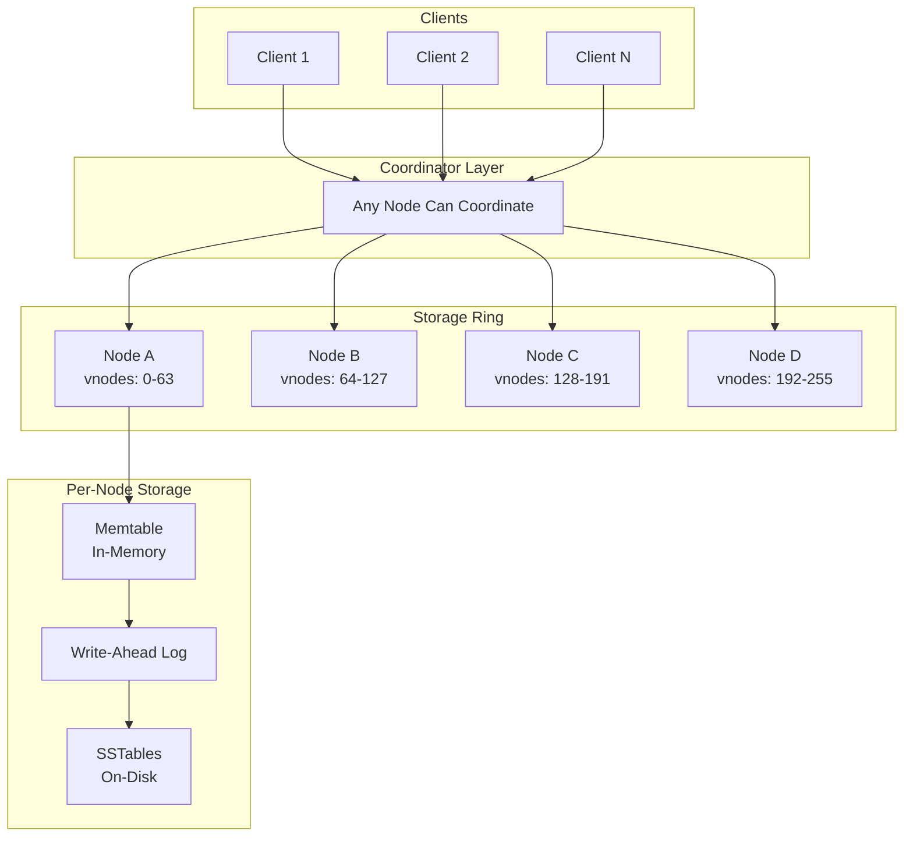
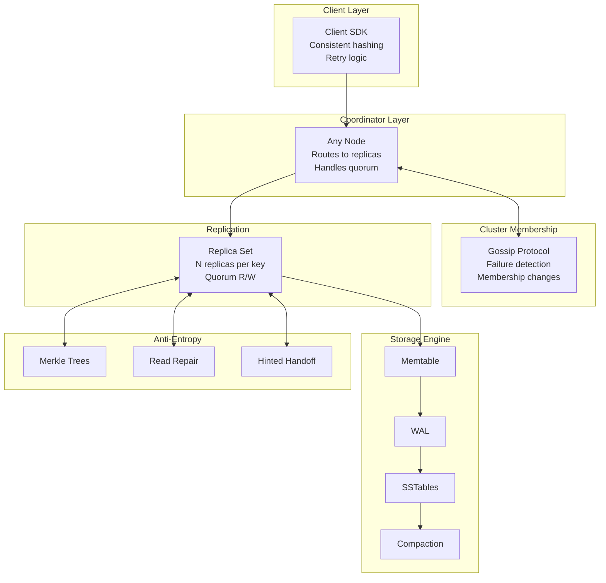
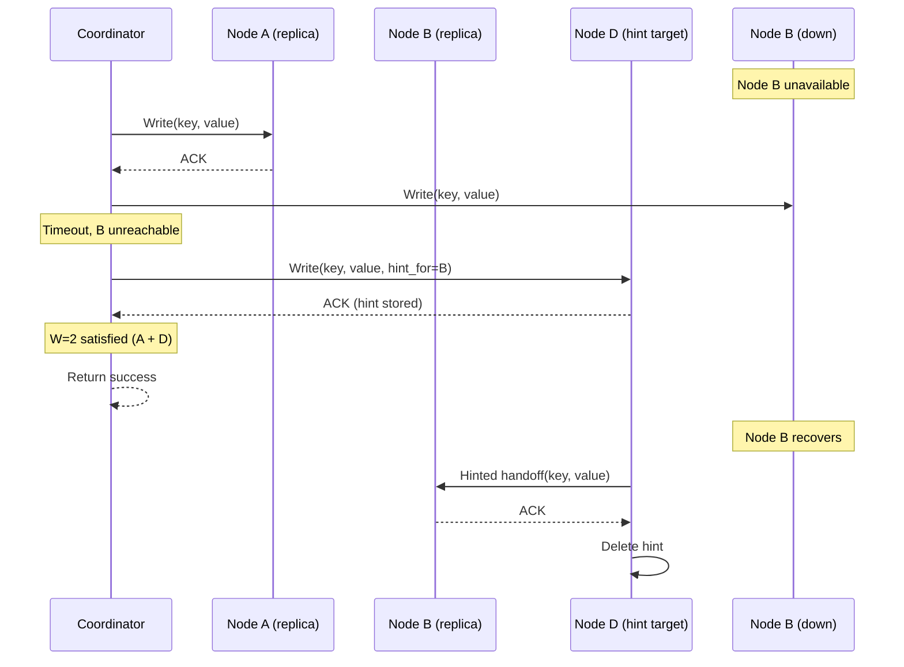
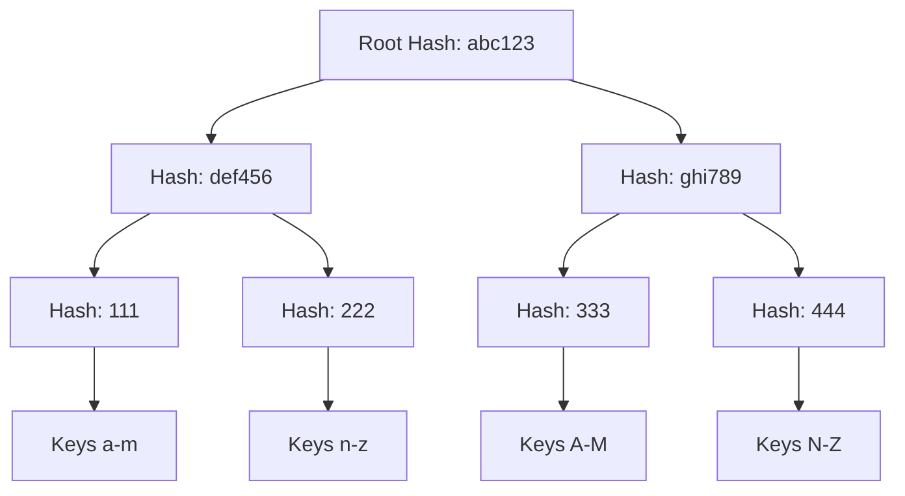
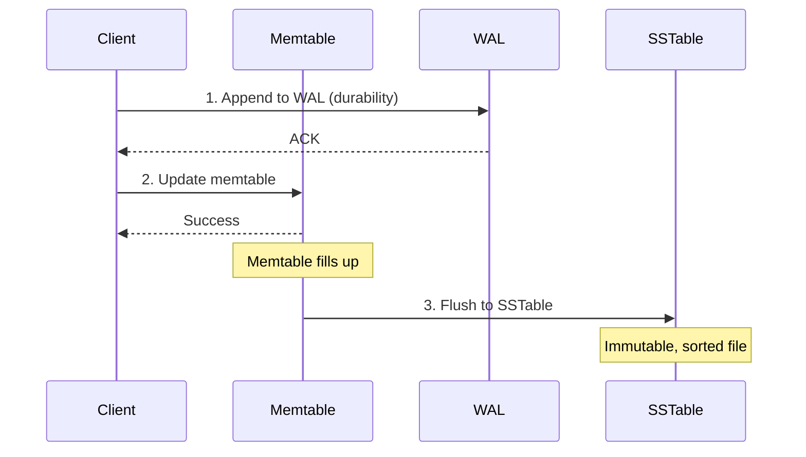
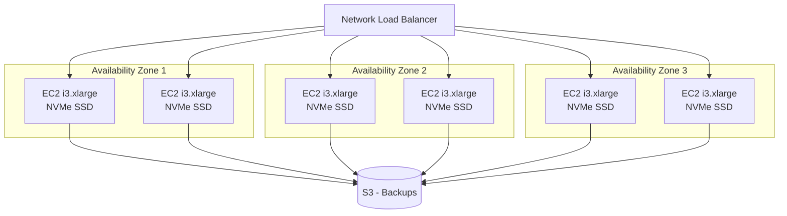

# Design a Distributed Key-Value Store

A distributed key-value store provides simple get/put semantics while handling the complexities of partitioning, replication, and failure recovery across a cluster of machines. This design explores the architectural decisions behind systems like Amazon Dynamo, Apache Cassandra, and Riak—AP systems that prioritize availability and partition tolerance over strong consistency. We also contrast with CP alternatives like etcd for scenarios requiring linearizability.

<figure>



<figcaption>High-level architecture: clients contact any node as coordinator, which routes to the correct replicas based on consistent hashing. Each node uses an LSM-tree storage engine.</figcaption>
</figure>

## Abstract

A distributed key-value store is fundamentally about **choosing where to sit on the CAP spectrum** and then implementing the mechanisms to deliver that choice consistently:

- **AP systems** (Dynamo, Cassandra, Riak): Accept eventual consistency in exchange for always-on availability. Use leaderless replication, sloppy quorums, and conflict resolution (vector clocks or LWW).
- **CP systems** (etcd, Consul, ZooKeeper): Sacrifice availability during partitions to guarantee linearizability. Use leader-based consensus (Raft/Paxos).

The core mechanisms are:

1. **Consistent hashing with virtual nodes** distributes data and enables incremental scaling (only k/n keys move when adding a node)
2. **Quorum replication** (R + W > N) provides tunable consistency-availability tradeoffs
3. **Vector clocks or LWW timestamps** detect and resolve concurrent writes
4. **Gossip protocols** propagate cluster membership and failure detection
5. **LSM-tree storage** optimizes for write-heavy workloads with background compaction

## Requirements

### Functional Requirements

| Requirement       | Priority     | Notes                                               |
| ----------------- | ------------ | --------------------------------------------------- |
| `put(key, value)` | Core         | Store a value, return success/version               |
| `get(key)`        | Core         | Retrieve value(s), handle conflicts                 |
| `delete(key)`     | Core         | Tombstone-based deletion                            |
| Range queries     | Extended     | Only if ordered storage (not covered in AP designs) |
| TTL expiration    | Extended     | Automatic key expiry                                |
| Transactions      | Out of scope | Requires coordination, changes CAP position         |

### Non-Functional Requirements

| Requirement   | Target                       | Rationale                                |
| ------------- | ---------------------------- | ---------------------------------------- |
| Availability  | 99.99%                       | Writes must succeed even during failures |
| Write latency | p99 < 10ms                   | Local disk + async replication           |
| Read latency  | p99 < 5ms                    | Cache hits, single disk seek             |
| Throughput    | 100K+ ops/sec per node       | LSM-tree optimized for writes            |
| Durability    | No acknowledged write lost   | WAL before acknowledgment                |
| Consistency   | Tunable (eventual to strong) | Application chooses per-operation        |

### Scale Estimation

**Cluster sizing example for 10TB dataset:**

```
Data size: 10 TB
Replication factor: 3
Total storage needed: 30 TB

Per-node capacity: 2 TB (leaving headroom for compaction)
Nodes required: 30 TB / 2 TB = 15 nodes

Traffic assumptions:
- 80% reads, 20% writes
- Average value size: 1 KB
- Target: 100K ops/sec total

Per-node throughput: 100K / 15 ≈ 6,700 ops/sec
- Reads: 5,400 ops/sec
- Writes: 1,300 ops/sec
```

## Design Paths

### Path A: AP with Leaderless Replication (Dynamo Model)

**Best when:**

- Availability is paramount (e-commerce carts, session stores)
- Application can handle conflict resolution
- Writes must succeed even during network partitions

**Architecture:**

- All nodes are peers—no leader election
- Any node can coordinate any request
- Replication is synchronous to quorum, async to remaining replicas
- Conflicts detected via vector clocks or resolved via LWW

**Trade-offs:**

- Writes always succeed (to any available quorum)
- No single point of failure
- Application must handle conflicting versions
- Weaker consistency guarantees

**Real-world examples:** Amazon Dynamo (shopping cart), Riak, Cassandra (with eventual consistency)

### Path B: CP with Leader-Based Consensus (Raft/Paxos)

**Best when:**

- Strong consistency required (configuration stores, coordination)
- Reads must return the latest write
- Can tolerate unavailability during leader election

**Architecture:**

- Single leader handles all writes
- Raft/Paxos ensures log replication before acknowledgment
- Leader election on failure (typically 1-10 seconds)

**Trade-offs:**

- Linearizable reads and writes
- Unavailable during leader election
- Write throughput limited by leader
- Simpler conflict model (no concurrent writes)

**Real-world examples:** etcd (Kubernetes), Consul, ZooKeeper

### Path Comparison

| Factor             | AP (Dynamo)              | CP (Raft)                     |
| ------------------ | ------------------------ | ----------------------------- |
| Write availability | Always (to quorum)       | Unavailable during election   |
| Read consistency   | Eventual or quorum       | Linearizable                  |
| Conflict handling  | Vector clocks/LWW        | None (single writer)          |
| Latency            | Lower (no consensus)     | Higher (consensus round-trip) |
| Throughput         | Higher (any node writes) | Lower (leader bottleneck)     |
| Cluster size       | 100s-1000s nodes         | 3-7 nodes typical             |
| Use case           | User data, caches        | Config, coordination, locks   |

### This Article's Focus

This article focuses on **Path A (AP/Dynamo model)** because:

1. Most key-value workloads prioritize availability over strong consistency
2. The techniques (consistent hashing, vector clocks, gossip) are more complex and worth detailed examination
3. CP systems (etcd, Consul) have well-documented Raft implementations

For CP key-value store design, see etcd's architecture documentation and the Raft paper.

## High-Level Design

### Component Overview

<figure>



<figcaption>Component interactions: coordinator routes requests, gossip maintains membership, storage engine persists data, anti-entropy mechanisms ensure replica convergence.</figcaption>
</figure>

### Request Flow

**Write path:**

1. Client SDK hashes key, identifies coordinator node
2. Coordinator determines N replica nodes from preference list
3. Coordinator sends write to all N replicas in parallel
4. Each replica: writes to WAL → updates memtable → acknowledges
5. Coordinator waits for W acknowledgments
6. Returns success to client (remaining replicas receive async)

**Read path:**

1. Client SDK hashes key, contacts coordinator
2. Coordinator sends read to all N replicas in parallel
3. Coordinator waits for R responses
4. If versions conflict: return all versions (or resolve via LWW)
5. Trigger read repair if replicas diverged

## Data Partitioning

### Consistent Hashing

Consistent hashing maps both keys and nodes to positions on a hash ring (typically 0 to 2^128-1 using MD5 or 2^64-1 using xxHash). A key is stored on the first N nodes clockwise from its hash position.

**Why consistent hashing?**

When nodes join or leave, only **k/n** keys need to move (k = total keys, n = nodes). With naive modulo hashing, nearly all keys would remap.

```
Traditional: hash(key) % num_nodes  → Node changes cause ~100% key movement
Consistent:  next_node(hash(key))   → Node changes cause ~1/n key movement
```

### Virtual Nodes (vnodes)

Physical nodes own multiple positions on the ring. Each position is a "virtual node" responsible for a range of the hash space.

**Design rationale:**

1. **Load balancing**: A single physical node token can create hotspots if keys cluster. Virtual nodes spread load.
2. **Heterogeneous hardware**: Assign more vnodes to powerful machines.
3. **Faster recovery**: When a node fails, its vnodes are distributed across many physical nodes, enabling parallel recovery.

**Configuration trade-offs:**

| vnodes per node        | Pros                                   | Cons                                  |
| ---------------------- | -------------------------------------- | ------------------------------------- |
| 1 (legacy)             | Fewer ring neighbors, simpler          | Uneven distribution, slow rebalancing |
| 16 (modern default)    | Good balance, deterministic allocation | Moderate neighbor count               |
| 256 (legacy Cassandra) | Fine-grained distribution              | High memory overhead, slow streaming  |

Cassandra 3.x+ defaults to 16 vnodes with deterministic token allocation, down from 256 random tokens in earlier versions. The reduction improves repair and streaming performance while maintaining adequate distribution.

### Replication Strategy

Keys are replicated to N consecutive nodes on the ring (the "preference list"). With virtual nodes, consecutive ring positions may map to the same physical node, so the preference list skips to ensure N distinct physical nodes.

**Replication factor selection:**

| RF  | Fault tolerance | Storage overhead | Typical use             |
| --- | --------------- | ---------------- | ----------------------- |
| 1   | None            | 1x               | Caches, ephemeral data  |
| 3   | 1 node failure  | 3x               | Standard production     |
| 5   | 2 node failures | 5x               | Critical data, cross-DC |

**Multi-datacenter replication:**

Cassandra's `NetworkTopologyStrategy` places replicas across racks and datacenters:

```
Replication settings:
  dc1: 3 replicas (across 3 racks)
  dc2: 3 replicas (across 3 racks)

Total replicas: 6
Rack-aware placement prevents correlated failures
```

## Quorum Reads and Writes

### Quorum Formula

For a replication factor N, if R (read replicas) + W (write replicas) > N, reads will see the latest write:

```
R + W > N  →  Overlap guarantees at least one replica has latest write

Example with N=3:
- R=2, W=2: Standard quorum (R+W=4 > 3)
- R=1, W=3: Write-heavy (all replicas must ack writes)
- R=3, W=1: Read-heavy (fast writes, consistent reads)
```

**Why this works:** With W=2 and R=2 on N=3 replicas, a write reaches at least 2 nodes. A subsequent read contacts at least 2 nodes. Since 2+2 > 3, at least one node in the read set participated in the write.

### Consistency Levels (Cassandra Model)

| Level        | Nodes contacted | Use case                                   |
| ------------ | --------------- | ------------------------------------------ |
| ONE          | 1               | Lowest latency, highest availability       |
| QUORUM       | ⌊N/2⌋ + 1       | Standard consistency                       |
| LOCAL_QUORUM | ⌊local_N/2⌋ + 1 | Cross-DC deployments                       |
| ALL          | N               | Strongest consistency, lowest availability |

**Operational guidance:**

- Use QUORUM for most operations
- Use LOCAL_QUORUM for latency-sensitive cross-DC reads
- Avoid ALL in production (single node failure blocks operations)
- ONE is acceptable for time-series data where some loss is tolerable

### Sloppy Quorum and Hinted Handoff

**Problem:** Strict quorum requires specific replica nodes. If one is down, writes fail.

**Sloppy quorum solution:** Write to any N healthy nodes from an extended preference list. If the designated replica is down, write to the next available node with a "hint" to forward later.

<figure>



<figcaption>Sloppy quorum: when replica B is unavailable, the coordinator writes to node D with a hint. When B recovers, D forwards the data.</figcaption>
</figure>

**Hint storage limits:**

Cassandra defaults to 3 hours (`max_hint_window_in_ms`). Hints older than this are discarded, requiring full repair to restore consistency. This prevents unbounded hint growth during extended outages.

**Trade-off:** Sloppy quorum improves availability but temporarily violates the quorum guarantee. During the hint window, reads may miss recent writes if they don't contact the hint-holding node.

## Conflict Detection and Resolution

### The Concurrent Write Problem

Without a single leader, two clients can write to the same key simultaneously via different coordinators. Both writes may succeed (each reaching W replicas), but replicas now have different values.

### Vector Clocks

Vector clocks track causal relationships between versions. Each write increments a (node, counter) pair.

```
Initial state: {} (empty)

Client A writes via Node1: [(Node1, 1)]
Client B reads [(Node1, 1)], writes via Node2: [(Node1, 1), (Node2, 1)]
Client C reads [(Node1, 1)], writes via Node3: [(Node1, 1), (Node3, 1)]

Now we have concurrent versions:
  V1: [(Node1, 1), (Node2, 1)]  - Client B's write
  V2: [(Node1, 1), (Node3, 1)]  - Client C's write

Neither dominates the other → CONFLICT
```

**Detecting relationships:**

- **V1 dominates V2:** Every (node, counter) in V2 is ≤ the corresponding entry in V1
- **Concurrent:** Neither dominates → conflict, return both versions

**Resolution strategies:**

1. **Application-level:** Return both versions to client, let application merge (Amazon shopping cart: union of items)
2. **Last-Write-Wins (LWW):** Use wall-clock timestamps, discard older version
3. **CRDTs:** Use conflict-free data structures that merge automatically

### Vector Clock Truncation

Vector clocks grow unboundedly as more nodes participate in writes. Dynamo truncates at ~10 entries, removing the oldest (node, counter) pair based on timestamp.

**Risk:** Truncation can lose causality information, potentially treating causally-related versions as concurrent. In practice, Amazon reported this rarely caused problems because most keys have limited writer diversity.

### Last-Write-Wins (LWW)

Cassandra uses LWW with microsecond timestamps instead of vector clocks:

```
Write 1: value="A", timestamp=1000
Write 2: value="B", timestamp=1001

Resolution: value="B" wins (higher timestamp)
```

**Advantages:**

- Simpler implementation
- No vector clock growth
- Constant metadata size

**Risks:**

- Requires synchronized clocks (NTP)
- Clock skew can cause "older" writes to win
- Concurrent writes with same timestamp: arbitrary winner (lowest value bytes)

**Mitigation:** Use NTP with tight synchronization (< 1ms skew). Cassandra's `commitlog_sync_period_in_ms` and client timestamps can be tuned for clock precision requirements.

## Failure Detection

### Gossip Protocol

Nodes exchange state information periodically with random peers. Information propagates exponentially—reaching all nodes in O(log n) rounds.

**Gossip protocol details:**

1. Every second, each node picks a random peer
2. Exchanges: membership list, heartbeat counters, application state
3. Merges received state with local state (higher version wins)

**Convergence:** With n nodes, gossip reaches all nodes in approximately log₂(n) rounds. A 1,000-node cluster converges in ~10 seconds.

### Phi Accrual Failure Detector

Rather than binary alive/dead, phi accrual calculates a "suspicion level" (φ) based on heartbeat arrival times:

```
φ = -log₁₀(1 - F(time_since_last_heartbeat))

where F is the cumulative distribution of observed heartbeat intervals
```

**Threshold configuration:**

| φ threshold | Meaning              | Use case                       |
| ----------- | -------------------- | ------------------------------ |
| 5           | Aggressive detection | Low-latency networks           |
| 8           | Default              | Standard deployments           |
| 10-12       | Conservative         | AWS/cloud (network congestion) |

At φ = 8, a node can be unresponsive for ~18 seconds before being marked dead. This prevents false positives from transient network issues.

**Why phi accrual over fixed timeout?**

Fixed timeouts must be tuned per-environment. Phi accrual adapts to observed network characteristics—the same threshold works across different latency profiles.

## Anti-Entropy Mechanisms

### Merkle Trees for Replica Synchronization

Merkle trees enable efficient comparison of large datasets. Each leaf is a hash of a data range; internal nodes are hashes of children.

<figure>



<figcaption>Merkle tree: comparing root hashes identifies if replicas differ. Traversing mismatched branches locates specific divergent key ranges.</figcaption>
</figure>

**Synchronization algorithm:**

1. Compare root hashes between replicas
2. If equal: replicas are identical
3. If different: recursively compare child hashes
4. Only exchange data for leaf nodes with different hashes

**Efficiency:** Synchronization is O(log n) comparisons, transferring data proportional to differences rather than total size.

**Riak's implementation:** Maintains persistent on-disk Merkle trees, regenerated weekly by default. Real-time updates to trees occur as writes happen.

### Read Repair

When a read returns divergent values from replicas, the coordinator triggers repair:

1. Determine winning value (latest vector clock or timestamp)
2. Asynchronously write winning value to stale replicas
3. Return result to client (doesn't block on repair)

**Configuration:** Cassandra historically used `dclocal_read_repair_chance = 0.1` (10% of reads trigger repair). Version 4.0+ uses table-level settings.

### Full Anti-Entropy Repair

Background process that:

1. Builds Merkle tree for each token range
2. Compares with replica Merkle trees
3. Streams missing/divergent data

**Frequency:** Run within `gc_grace_seconds` (default 10 days in Cassandra) to prevent zombie data resurrection from tombstones.

## Storage Engine: LSM Tree

### Why LSM Tree for Write-Heavy Workloads

LSM (Log-Structured Merge) trees convert random writes to sequential I/O:

1. All writes go to in-memory buffer (memtable)
2. When full, memtable flushes to immutable on-disk file (SSTable)
3. Background compaction merges SSTables

**Trade-off comparison:**

| Aspect              | LSM Tree                    | B-Tree                    |
| ------------------- | --------------------------- | ------------------------- |
| Write amplification | 10-30x (compaction)         | 2-4x (page splits)        |
| Read amplification  | Higher (multiple SSTables)  | Lower (single tree)       |
| Space amplification | Lower (no fragmentation)    | Higher (50-67% page fill) |
| Write throughput    | Higher (sequential I/O)     | Lower (random I/O)        |
| Read latency        | Higher (bloom filters help) | Lower (single lookup)     |

### Write Path Details

<figure>



<figcaption>Write path: WAL ensures durability, memtable provides fast writes, flush creates immutable SSTables.</figcaption>
</figure>

**Memtable sizing:** Cassandra allocates 1/4 of heap to memtables by default. Larger memtables reduce flush frequency but increase recovery time after crashes.

### Read Path Details

1. Check memtable (in-memory, fast)
2. Check each SSTable from newest to oldest
3. Use bloom filters to skip SSTables that definitely don't contain the key
4. Merge results if key exists in multiple SSTables

**Bloom filter tuning:** False positive rate vs. memory trade-off. Cassandra defaults to 1% FP rate, using ~10 bits per key.

### Compaction Strategies

Compaction merges SSTables to:

- Reclaim space from deleted/overwritten keys
- Reduce read amplification (fewer files to check)
- Enforce tombstone expiration

**Strategy comparison:**

| Strategy           | SSTable sizing   | Read amp | Write amp | Best for          |
| ------------------ | ---------------- | -------- | --------- | ----------------- |
| Size-Tiered (STCS) | Variable buckets | Higher   | Lower     | Write-heavy       |
| Leveled (LCS)      | Fixed 160MB      | Lower    | Higher    | Read-heavy        |
| Time-Window (TWCS) | Time buckets     | Moderate | Low       | Time-series + TTL |

**STCS mechanics:** Groups SSTables of similar size into buckets. When bucket has 4+ files (`min_threshold`), compact into one larger file.

**LCS mechanics:** Organizes SSTables into levels (L0, L1, L2...). Each level is 10x larger than previous. Compaction ensures 90% of reads touch at most one SSTable per level.

## API Design

### Core Operations

```
PUT /kv/{key}
Content-Type: application/octet-stream
X-Consistency-Level: QUORUM
X-Client-Timestamp: 1699900000000

<binary value>

Response:
201 Created
X-Version: [(node1,5),(node2,3)]
```

```
GET /kv/{key}
X-Consistency-Level: QUORUM

Response (single version):
200 OK
X-Version: [(node1,5),(node2,3)]
<binary value>

Response (conflict):
300 Multiple Choices
Content-Type: multipart/mixed

--boundary
X-Version: [(node1,5),(node2,3)]
<value A>
--boundary
X-Version: [(node1,4),(node3,2)]
<value B>
```

```
DELETE /kv/{key}
X-Consistency-Level: QUORUM

Response:
204 No Content
```

### Pagination for Key Listing

```
GET /kv?prefix=user:&limit=100&cursor=dXNlcjo1MDA=

Response:
200 OK
{
  "keys": ["user:501", "user:502", ...],
  "next_cursor": "dXNlcjo2MDA=",
  "has_more": true
}
```

### Error Responses

| Status | Meaning                                                   |
| ------ | --------------------------------------------------------- |
| 400    | Invalid key (too long, invalid characters)                |
| 404    | Key not found                                             |
| 409    | Write conflict (for conditional writes)                   |
| 503    | Insufficient replicas available for requested consistency |
| 504    | Timeout waiting for replica responses                     |

## Infrastructure Design

### Cloud-Agnostic Components

| Component         | Purpose             | Options                     |
| ----------------- | ------------------- | --------------------------- |
| Compute           | Node processes      | VMs, containers, bare metal |
| Block storage     | SSTable persistence | Local SSD, network SSD      |
| Object storage    | Backups, cold tier  | S3-compatible               |
| Load balancer     | Client distribution | HAProxy, cloud LB           |
| Service discovery | Node membership     | Gossip (built-in), Consul   |

### AWS Reference Architecture

<figure>



<figcaption>AWS deployment: i3 instances with local NVMe for low-latency storage, spread across 3 AZs for fault tolerance, S3 for backups.</figcaption>
</figure>

**Instance selection:**

| Instance        | Storage    | Memory | Use case                   |
| --------------- | ---------- | ------ | -------------------------- |
| i3.xlarge       | 950GB NVMe | 30.5GB | Standard nodes             |
| i3.2xlarge      | 1.9TB NVMe | 61GB   | High-capacity nodes        |
| r5.xlarge + gp3 | EBS        | 32GB   | Lower cost, higher latency |

**Why i3 instances?** Local NVMe provides consistent sub-millisecond latency. EBS adds network variability and higher p99 latencies.

### Managed Alternatives

| Build vs Buy | Option                    | Trade-off                                  |
| ------------ | ------------------------- | ------------------------------------------ |
| Self-hosted  | Cassandra, ScyllaDB, Riak | Full control, operational burden           |
| Managed      | Amazon DynamoDB           | No ops, vendor lock-in, cost at scale      |
| Managed      | Azure Cosmos DB           | Multi-model, global distribution           |
| Managed      | DataStax Astra            | Managed Cassandra, Cassandra compatibility |

**DynamoDB note:** Despite the name, DynamoDB's architecture differs significantly from the Dynamo paper. It uses Paxos-based replication with a leader, offering strong consistency as an option. The 2022 USENIX paper details these differences.

## Conclusion

Designing a distributed key-value store requires explicit CAP positioning. This design chose AP (availability + partition tolerance) with tunable consistency, following the Dynamo model:

**Key architectural decisions:**

1. **Consistent hashing with vnodes** for incremental scaling and load distribution
2. **Quorum replication** (N=3, R=2, W=2 default) for configurable consistency
3. **Sloppy quorum + hinted handoff** to maintain availability during failures
4. **LWW timestamps** for conflict resolution (simpler than vector clocks, requires NTP)
5. **LSM-tree storage** for write-optimized performance with bloom filters for reads

**What this design sacrifices:**

- Strong consistency (use etcd/Consul if required)
- Range queries (add secondary index or use ordered storage like Bigtable)
- Multi-key transactions (requires coordination, changes CAP position)

**When to choose this design:**

- Session stores, shopping carts, user preferences
- Cache layers with persistence
- Time-series data (with TWCS compaction)
- Any workload where availability > consistency

## Appendix

### Prerequisites

- Distributed systems fundamentals: CAP theorem, consistency models
- Storage concepts: B-trees, write-ahead logging, compaction
- Networking: gossip protocols, failure detection

### Terminology

| Term                   | Definition                                                                                  |
| ---------------------- | ------------------------------------------------------------------------------------------- |
| **Consistent hashing** | Hash function mapping keys and nodes to a ring, minimizing key movement on topology changes |
| **Vector clock**       | List of (node, counter) pairs tracking causal ordering between versions                     |
| **Quorum**             | Minimum replicas (R or W) that must respond for an operation to succeed                     |
| **Sloppy quorum**      | Quorum satisfied by any available nodes, not necessarily designated replicas                |
| **Hinted handoff**     | Temporary storage of writes for unavailable replicas, forwarded on recovery                 |
| **SSTable**            | Sorted String Table—immutable, sorted key-value file on disk                                |
| **Memtable**           | In-memory buffer for recent writes, flushed to SSTables periodically                        |
| **Compaction**         | Background process merging SSTables to reclaim space and reduce read amplification          |
| **Tombstone**          | Marker indicating a deleted key, expires after gc_grace_seconds                             |
| **Anti-entropy**       | Background synchronization to repair replica divergence                                     |

### Summary

- Distributed KV stores sit on a CAP spectrum: AP (Dynamo model) vs CP (Raft model)
- Consistent hashing + vnodes enables horizontal scaling with minimal data movement
- Quorum replication (R + W > N) provides tunable consistency
- Conflict resolution via vector clocks (causal tracking) or LWW (timestamp-based)
- Gossip + phi accrual failure detector maintains cluster membership
- LSM-tree storage optimizes write throughput; compaction strategy choice depends on workload
- Sloppy quorum + hinted handoff + Merkle tree repair ensure eventual convergence

### References

- [Amazon Dynamo Paper (2007)](https://www.allthingsdistributed.com/files/amazon-dynamo-sosp2007.pdf) - Original Dynamo design, quorum protocols, vector clocks
- [DynamoDB USENIX ATC'22 Paper](https://www.usenix.org/system/files/atc22-elhemali.pdf) - How DynamoDB differs from Dynamo
- [Apache Cassandra Architecture](https://cassandra.apache.org/doc/latest/cassandra/architecture/dynamo.html) - Dynamo-inspired design, consistency levels
- [Google Bigtable Paper (2006)](https://research.google/pubs/bigtable-a-distributed-storage-system-for-structured-data/) - CP alternative, SSTable format origin
- [Raft Consensus Paper](https://raft.github.io/raft.pdf) - Leader-based consensus for CP systems
- [Redis Cluster Specification](https://redis.io/docs/latest/operate/oss_and_stack/reference/cluster-spec/) - Hash slot approach vs consistent hashing
- [etcd Tuning Guide](https://etcd.io/docs/v3.4/tuning/) - Raft-based KV store configuration
- [Riak Documentation](https://docs.riak.com/riak/kv/latest/) - Active anti-entropy, Merkle trees
- [LSM Tree vs B-Tree Analysis (TiKV)](https://tikv.org/deep-dive/key-value-engine/b-tree-vs-lsm/) - Storage engine tradeoffs
