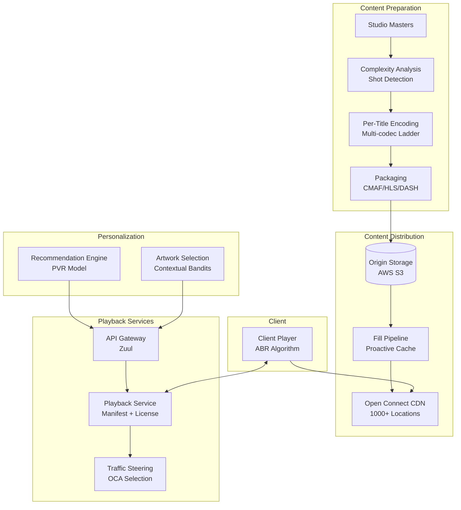
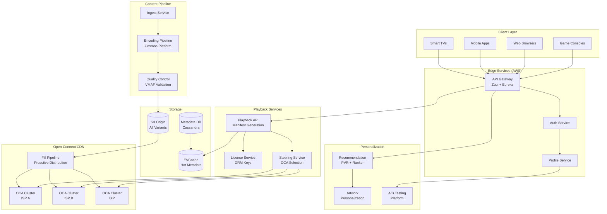
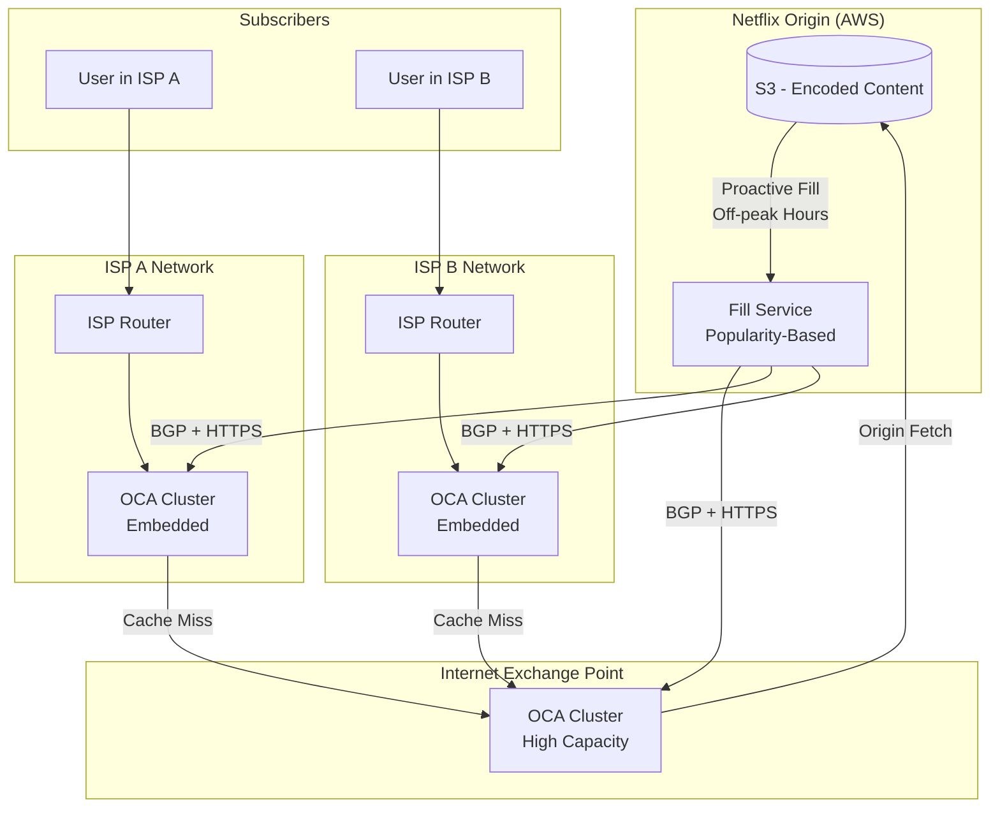
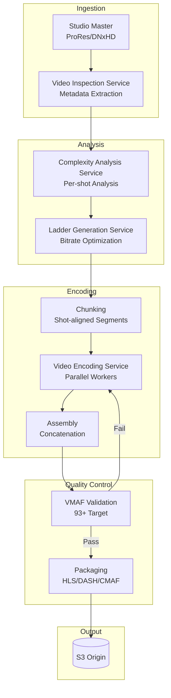
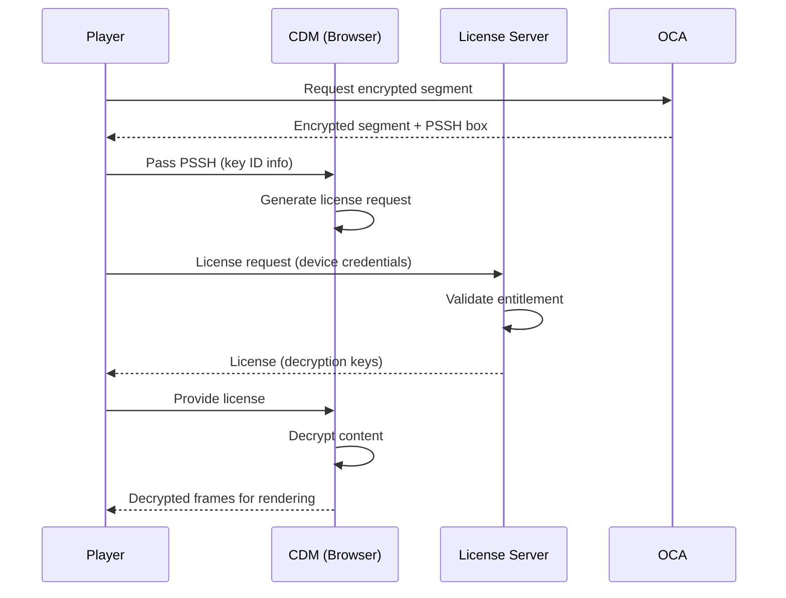
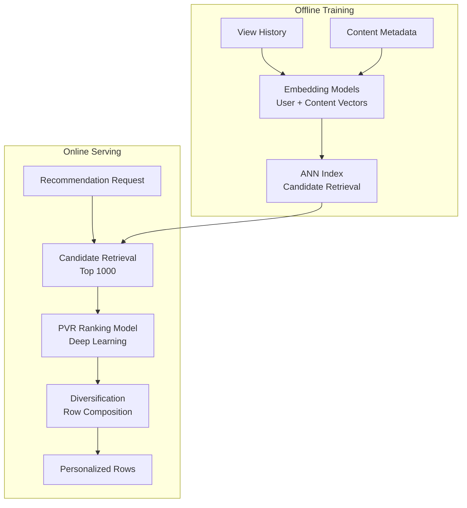
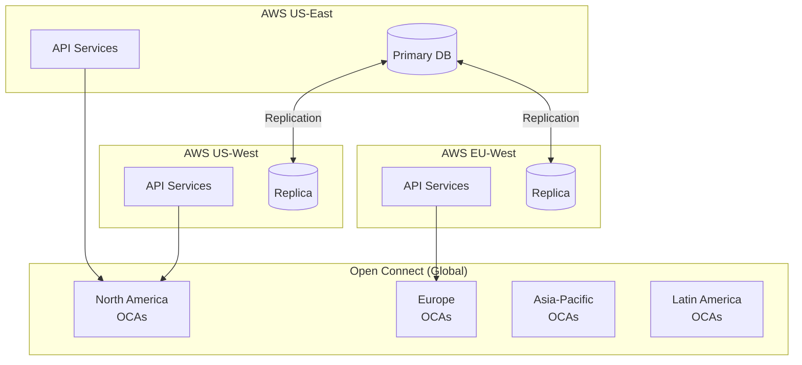

# Design Netflix Video Streaming

Netflix serves 300+ million subscribers across 190+ countries, delivering 94 billion hours of content in H2 2024 alone. Unlike user-generated video platforms (YouTube), Netflix is a consumption-first architecture—the challenge is not upload volume but delivering pre-encoded content with sub-second playback start times while optimizing for quality-per-bit across wildly different devices and network conditions. This design covers the Open Connect CDN, per-title/shot-based encoding pipeline, adaptive bitrate delivery, and the personalization systems that drive 80% of viewing hours.

<figure>



<figcaption>High-level architecture: content preparation → proactive distribution to Open Connect edge → client playback with personalized steering.</figcaption>
</figure>

## Abstract

Netflix's streaming architecture is shaped by three fundamental constraints:

1. **Pre-known catalog enables proactive caching**: Unlike YouTube's real-time uploads, Netflix's finite catalog (~7,500 titles in US) allows overnight proactive distribution to edge servers. This achieves 98%+ cache hit rates without origin egress during playback.

2. **Quality perception varies by content**: A documentary with static shots compresses efficiently at 2 Mbps; an action sequence needs 8+ Mbps for equivalent perceptual quality. Per-title and shot-based encoding optimizes each scene independently.

3. **Device fragmentation demands multi-codec strategy**: Smart TVs from 2015 support only H.264; modern browsers support AV1. Netflix encodes each title in multiple codecs (H.264, HEVC, VP9, AV1) to maximize quality-per-bit on each device class.

The core mechanisms:

- **Open Connect CDN** embeds Netflix appliances directly in ISP networks, serving 100% of video traffic from 1,000+ locations
- **Per-title encoding** analyzes content complexity and generates custom bitrate ladders, achieving 20% average bandwidth savings
- **Shot-based (Dynamic Optimizer) encoding** allocates bits per-scene, achieving 50% bitrate reduction for equivalent quality
- **VMAF-driven quality control** ensures perceptual quality targets (93+) rather than arbitrary bitrate thresholds
- **Proactive fill pipeline** pre-positions content during off-peak hours based on predicted popularity

## Requirements

### Functional Requirements

| Requirement                  | Priority | Notes                                         |
| ---------------------------- | -------- | --------------------------------------------- |
| Video playback               | Core     | Adaptive streaming, multiple quality levels   |
| Multi-device support         | Core     | TVs, mobile, tablets, browsers, game consoles |
| Personalized recommendations | Core     | 80% of viewing driven by recommendations      |
| Continue watching            | Core     | Cross-device position sync                    |
| Multiple profiles            | Core     | Per-user personalization                      |
| Offline downloads            | Core     | Mobile viewing without connectivity           |
| Search and browse            | Core     | Full catalog discovery                        |
| Subtitles and audio tracks   | Core     | Multiple languages per title                  |
| DRM protection               | Core     | Content security across all platforms         |
| Parental controls            | Extended | Content filtering by rating                   |
| Live streaming               | Extended | Events (recently added)                       |

### Non-Functional Requirements

| Requirement            | Target                  | Rationale                              |
| ---------------------- | ----------------------- | -------------------------------------- |
| Playback availability  | 99.99%                  | Revenue-critical, subscriber retention |
| Playback start latency | p99 < 2s                | Industry benchmark, user experience    |
| Rebuffering ratio      | < 0.1% of playback time | Netflix target, premium experience     |
| Video quality          | VMAF > 93               | Perceptual quality standard            |
| Catalog availability   | 99.999%                 | Entire catalog playable                |
| CDN cache hit rate     | > 95%                   | Origin cost and latency                |
| Concurrent streams     | Support 20M+            | Peak evening traffic                   |

### Scale Estimation

**Netflix-scale baseline (Q4 2024):**

```
Subscribers: 301.63 million (global)
DAU estimate: ~150M (50% daily engagement)
Concurrent peak estimate: 20M+ streams

Viewing traffic:
- H2 2024: 94 billion hours watched
- Daily average: ~500M hours/day
- Peak concurrent: 20M streams × 8 Mbps average = 160 Tbps
- With 98% edge hit rate: 3.2 Tbps from origin (worst case)

Content library:
- US catalog: ~7,500 titles (3,800 movies, 1,800 TV shows)
- ~59% Netflix Originals
- Storage per title: 10-50 encoded variants × 2-8 GB each
- Total encoded storage: ~5-10 PB estimated

Open Connect scale:
- 1,000+ deployment locations
- 4,669+ servers mapped by researchers
- Single OCA: up to 400 Gbps serving capacity
```

**Live streaming record (November 2024):**

```
Tyson vs Paul fight: 65 million concurrent viewers
Demonstrates burst capacity handling for events
```

## Design Paths

### Path A: Third-Party CDN (Traditional)

**Best when:**

- Smaller catalog (< 1,000 titles)
- Limited geographic scope
- Variable/unpredictable traffic patterns
- Cost-sensitive at small scale

**Architecture:**

- Use commercial CDN (Akamai, CloudFront, Fastly)
- Origin servers in cloud provider
- CDN handles caching, routing, TLS termination

**Trade-offs:**

- ✅ No infrastructure investment
- ✅ Pay-per-GB pricing aligns with usage
- ✅ Instant global reach
- ❌ Per-GB costs prohibitive at scale (Netflix would pay billions)
- ❌ No ISP-level embedding (additional network hops)
- ❌ Less control over quality-of-experience
- ❌ Generic caching strategies, not content-aware

**Real-world example:** Most OTT services (Hulu, Peacock, Paramount+) rely on commercial CDNs. Acceptable when scale doesn't justify custom infrastructure.

### Path B: Custom CDN with ISP Embedding (Netflix Model)

**Best when:**

- Massive scale (100M+ subscribers)
- Predictable catalog enables proactive caching
- Quality differentiation is competitive advantage
- Long-term investment justifies infrastructure

**Architecture:**

- Custom appliances (OCAs) deployed in ISP facilities
- Proactive overnight content distribution
- No per-GB transit costs after hardware investment
- Direct peering eliminates intermediate hops

**Trade-offs:**

- ✅ 98%+ cache hit rates with proactive fill
- ✅ Sub-millisecond latency to end users
- ✅ Amortized cost far below commercial CDN at scale
- ✅ Complete control over caching and routing
- ❌ Massive upfront hardware investment
- ❌ ISP relationship management complexity
- ❌ Operational burden (hardware, software, support)
- ❌ Long deployment lead times for new regions

**Real-world example:** Netflix Open Connect handles 100% of Netflix traffic. Google has similar infrastructure (Google Global Cache) for YouTube.

### Path Comparison

| Factor         | Third-Party CDN    | Custom CDN (Open Connect) |
| -------------- | ------------------ | ------------------------- |
| Setup time     | Hours              | Months                    |
| Upfront cost   | None               | $100M+ in hardware        |
| Per-GB cost    | $0.02-0.10         | Near-zero (amortized)     |
| ISP latency    | +10-50ms (peering) | +1-5ms (embedded)         |
| Cache hit rate | 85-95%             | 98%+                      |
| Control        | Limited            | Complete                  |
| Best for       | < 50M subscribers  | > 100M subscribers        |

### This Article's Focus

This article focuses on **Path B (Custom CDN)** because:

1. Netflix scale justifies the infrastructure investment
2. The proactive fill model is unique to predictable catalogs
3. ISP embedding provides measurable quality differentiation
4. The architecture demonstrates principles applicable to any large-scale streaming service

## High-Level Design

### Component Overview

<figure>



<figcaption>System architecture: AWS hosts control plane and personalization; Open Connect handles all video delivery.</figcaption>
</figure>

### Traffic Split: AWS vs Open Connect

Netflix pioneered a clean separation:

| Traffic Type        | Infrastructure      | Rationale                              |
| ------------------- | ------------------- | -------------------------------------- |
| Video streaming     | Open Connect (100%) | Bandwidth-intensive, latency-sensitive |
| API requests        | AWS                 | Compute-intensive, scalable            |
| Personalization     | AWS                 | ML workloads, data-intensive           |
| License acquisition | AWS                 | Security-sensitive, transactional      |

This separation allows each infrastructure to optimize for its workload. AWS handles millions of API requests; Open Connect handles hundreds of terabits of video.

### Playback Flow

1. **Client requests playback** → API Gateway authenticates, routes to Playback Service
2. **Playback Service generates manifest** → Lists available streams (codecs, resolutions, bitrates)
3. **Steering Service selects OCAs** → Returns ranked list based on proximity, load, health
4. **Client acquires license** → DRM key exchange with License Service
5. **Client fetches segments from OCA** → ABR algorithm selects quality
6. **Playback begins** → Continuous quality adaptation based on buffer and throughput

### Control Plane vs Data Plane

**Control plane (AWS):**

- Authentication and authorization
- Manifest generation
- DRM license issuance
- Personalization and recommendations
- A/B testing
- Billing and account management

**Data plane (Open Connect):**

- Video segment delivery
- Cache management
- BGP routing announcements
- Health reporting

## Open Connect CDN

### Architecture

<figure>



<figcaption>Open Connect topology: ISP-embedded OCAs serve most traffic; IXP clusters handle cache misses; origin serves ~2% of requests.</figcaption>
</figure>

### OCA Appliance Specifications

Netflix offers multiple OCA configurations to ISP partners:

| Appliance Type     | Storage      | Throughput | Use Case                      |
| ------------------ | ------------ | ---------- | ----------------------------- |
| **Standard Flash** | 24 TB NVMe   | 190 Gbps   | High-traffic ISPs             |
| **Large Storage**  | 120 TB HDD   | 18 Gbps    | Broad catalog, lower traffic  |
| **Large Flash**    | 360 TB mixed | 96 Gbps    | Balanced performance/capacity |

**Performance milestones:**

- **2017**: 100 Gbps TLS streaming from single server (FreeBSD, NGINX)
- **2021**: 400 Gbps from single server with TLS offload to NIC

**2021 configuration achieving 400 Gbps:**

```
CPU: AMD EPYC 7502p (32 cores, Rome)
Memory: 256 GB DDR4-3200
Storage: 18 × 2TB Western Digital SN720 NVMe
Network: 2 × Mellanox ConnectX-6 Dx (PCIe 4.0 x16)
OS: FreeBSD
Web Server: NGINX
TLS: Offloaded to NIC (key enabler for 400 Gbps)
```

TLS offloading to the NIC was the critical optimization—without it, throughput capped at ~240 Gbps due to CPU-bound encryption.

### Deployment Models

**Embedded (Inside ISP Network):**

- OCA deployed in ISP data center
- Zero transit cost for ISP
- Lowest latency to subscribers (1-5ms)
- ISP provides power, space, connectivity

**Peering (Internet Exchange Point):**

- OCA deployed at IXP (e.g., Equinix, DE-CIX)
- Serves multiple ISPs via peering
- Higher latency than embedded (10-50ms)
- Used for ISPs without embedded partnership

### BGP Routing

OCAs announce routes via BGP to attract Netflix traffic:

```
Netflix ASN: 2906 (customer-facing)
Open Connect ASN: 40027 (OCA infrastructure)

Route announcement:
- OCA announces covering prefix (e.g., 45.57.0.0/17)
- ISP router prefers local OCA routes
- Traffic stays within ISP network
```

**Route selection criteria (in order):**

1. OCA availability and health
2. Route specificity (most specific prefix wins)
3. AS path length
4. MED (Multi-Exit Discriminator)
5. Geographic proximity

### Fill Pipeline

**Proactive caching philosophy:**

Netflix doesn't wait for cache misses. The Fill Pipeline predicts content demand and pre-positions files during off-peak hours.

**Fill process:**

1. **Popularity computation**: Daily prediction of what members will watch
2. **Replica calculation**: More popular content → more replicas across clusters
3. **Manifest generation**: Each OCA receives custom file list
4. **Off-peak transfer**: Nightly downloads during configurable windows
5. **Verification**: Checksum validation after transfer

**Optimization milestone:**

- Original: Title-level popularity rankings
- Improved: File-level popularity (specific resolution/codec combinations)
- Result: Same cache efficiency with **50% less storage**

This works because not all files for a title are equally popular. 4K HDR files are only needed for capable devices; most streams use 720p or 1080p.

### Cache Performance

| Metric              | Target | Achieved                   |
| ------------------- | ------ | -------------------------- |
| Edge cache hit rate | > 95%  | ~98%                       |
| Origin fetch rate   | < 5%   | ~2%                        |
| Fill accuracy       | > 90%  | High (exact not published) |

At Netflix scale, a 1% improvement in cache hit rate eliminates terabytes of daily origin egress.

## Video Encoding Pipeline

### The Cosmos Platform

Netflix rebuilt its encoding pipeline on Cosmos (completed September 2023), replacing the previous Reloaded system.

<figure>



<figcaption>Cosmos encoding pipeline: analysis → encoding → quality control → packaging. Failed VMAF segments are re-encoded at higher bitrate.</figcaption>
</figure>

**Platform components:**

| Component     | Purpose                     |
| ------------- | --------------------------- |
| **Optimus**   | API layer                   |
| **Plato**     | Workflow orchestration      |
| **Stratum**   | Serverless compute layer    |
| **Timestone** | High-scale priority queuing |

**Processing scale:**

A single Stranger Things episode requires processing **900 shots** through the pipeline.

### Per-Title Encoding

Introduced in 2015, per-title encoding customizes bitrate ladders based on content complexity.

**Why fixed ladders fail:**

```
Fixed ladder (traditional):
720p: 3 Mbps
1080p: 5 Mbps
4K: 16 Mbps

Reality:
- Documentary (low motion): VMAF 93 at 720p/1.5 Mbps
- Action movie (high motion): VMAF 93 at 720p/4 Mbps

Result: Fixed ladder wastes 2.5 Mbps on documentaries, under-serves action movies
```

**Per-title methodology:**

1. Encode source to hundreds of resolution/bitrate combinations
2. Compute VMAF score for each combination
3. Plot quality vs. bitrate curve (convex hull analysis)
4. Select optimal points on the curve as the custom ladder

**Results:**

- Average: **20% bandwidth savings** without quality loss
- Some titles: **50%+ reduction** (low-complexity content)

### Shot-Based Encoding (Dynamic Optimizer)

Per-title improved on fixed ladders, but applied uniform bitrate across an entire title. Shot-based encoding optimizes each scene independently.

**How it works:**

1. **Shot detection**: Identify scene boundaries (cuts, fades, motion discontinuities)
2. **Complexity analysis**: Compute per-shot complexity (motion, texture, film grain)
3. **Bitrate allocation**: Allocate more bits to complex shots, fewer to simple ones
4. **Encoding**: IDR frames aligned with shot boundaries
5. **Assembly**: Concatenate variable-bitrate shots

**Results:**

| Improvement                | Metric                          |
| -------------------------- | ------------------------------- |
| Bitrate reduction          | **30%** vs fixed-QP encoding    |
| Quality-equivalent bitrate | **50% lower** for same VMAF     |
| 4K achievement             | **8 Mbps** (previously 16 Mbps) |
| HDR storage                | **58%** of fixed ladder storage |

**Example scene:**

```
Scene 1: Dialogue in dim room (low complexity)
  - Fixed: 5 Mbps, VMAF 96
  - Dynamic: 2 Mbps, VMAF 95
  - Savings: 3 Mbps, negligible quality loss

Scene 2: Car chase with explosions (high complexity)
  - Fixed: 5 Mbps, VMAF 82 (quality loss)
  - Dynamic: 9 Mbps, VMAF 93
  - Improvement: 11 VMAF points

Result: Same average bitrate, but quality is optimized per-scene
```

### Codec Strategy

| Codec            | Bandwidth vs H.264 | Device Support           | Encoding Cost | Netflix Usage        |
| ---------------- | ------------------ | ------------------------ | ------------- | -------------------- |
| **H.264 (AVC)**  | Baseline           | Universal                | 1x            | Legacy fallback      |
| **H.265 (HEVC)** | 50% better         | iOS, Safari, some TVs    | 2-4x          | Apple ecosystem      |
| **VP9**          | 50% better         | Chrome, Firefox, Android | 2-3x          | Web, Android         |
| **AV1**          | 30-50% vs VP9      | Modern browsers, new TVs | 5-10x         | **30% of streaming** |

**AV1 adoption (as of 2024):**

Netflix reported AV1 now powers ~30% of streaming traffic, becoming their primary format for capable devices. On TVs specifically, AV1 delivers **1/3 less bandwidth** than H.264/HEVC for equivalent quality.

**Encoding decision tree:**

```
if device.supports(AV1):
    serve AV1
elif device.supports(VP9):
    serve VP9
elif device.supports(HEVC) and device.is_apple:
    serve HEVC
else:
    serve H.264
```

### VMAF Quality Metric

Video Multimethod Assessment Fusion (VMAF) is Netflix's open-source perceptual quality metric, developed with USC, IPI/LS2N Nantes, and UT Austin LIVE lab.

**Components:**

- Visual Information Fidelity (VIF)
- Detail Loss Metric (DLM)
- Mean Co-Located Pixel Difference (MCPD)
- Fused via SVM regression

**Score interpretation:**

| VMAF Score | Quality Level              |
| ---------- | -------------------------- |
| 93+        | Excellent (Netflix target) |
| 85-93      | Good                       |
| 70-85      | Fair                       |
| < 70       | Poor (triggers re-encode)  |

**Why VMAF replaced PSNR:**

- PSNR measures pixel-level difference, not human perception
- Film grain scores poorly on PSNR but looks natural to viewers
- Blurring scores well on PSNR but looks bad to viewers
- VMAF correlates with Mean Opinion Score (MOS) from human evaluations

Netflix replaced PSNR with VMAF in **June 2016**.

## Adaptive Bitrate Streaming

### Streaming Protocols

| Protocol      | Usage                    | Notes                        |
| ------------- | ------------------------ | ---------------------------- |
| **MPEG-DASH** | Primary for most devices | ISO standard                 |
| **HLS**       | Safari, iOS, Apple TV    | Apple ecosystem              |
| **CMAF**      | Unified packaging        | Single source for HLS + DASH |

Netflix uses CMAF (Common Media Application Format) for packaging, which allows generating both HLS and DASH manifests from the same encoded segments.

### Manifest Generation

When a client requests playback, the Playback Service generates a device-specific manifest:

**Manifest contents:**

- Available bitrate ladder (device-appropriate)
- Codec options (filtered by device capability)
- Audio track options (languages, formats)
- Subtitle tracks
- DRM information (license server URL, key IDs)
- CDN URLs (OCA endpoints)

**Example HLS variant playlist (simplified):**

```m3u8
#EXTM3U
#EXT-X-VERSION:7

#EXT-X-STREAM-INF:BANDWIDTH=12000000,RESOLUTION=3840x2160,CODECS="av01.0.13M.08"
4k-av1/playlist.m3u8

#EXT-X-STREAM-INF:BANDWIDTH=8000000,RESOLUTION=1920x1080,CODECS="av01.0.08M.08"
1080p-av1/playlist.m3u8

#EXT-X-STREAM-INF:BANDWIDTH=3000000,RESOLUTION=1280x720,CODECS="av01.0.04M.08"
720p-av1/playlist.m3u8

#EXT-X-STREAM-INF:BANDWIDTH=1000000,RESOLUTION=854x480,CODECS="av01.0.01M.08"
480p-av1/playlist.m3u8
```

### ABR Algorithm

Netflix's ABR algorithm balances multiple objectives:

**Input signals:**

- Buffer level (seconds of content buffered)
- Throughput history (recent segment download speeds)
- Device constraints (memory, CPU, battery)
- Network type (WiFi vs cellular)

**Algorithm approach (hybrid):**

```
Throughput estimation:
- Exponential weighted moving average of recent downloads
- Conservative safety margin (70% of estimated)

Buffer-based adjustment:
- Low buffer (< 10s): Prioritize stability, drop quality
- Target buffer (30s): Normal operation
- High buffer (> 45s): Allow quality increase

Quality selection:
safe_bitrate = throughput_estimate × 0.7
buffer_factor = buffer_level / target_buffer

if rebuffering_recent:
    selected = lowest_quality
elif buffer_factor < 0.5:
    selected = quality_below_safe_bitrate
else:
    selected = highest_quality_below_safe_bitrate
```

**Startup behavior:**

1. Start at conservative quality (720p or below)
2. Fetch first few segments quickly to build buffer
3. Ramp up quality as buffer exceeds 10 seconds
4. Reach target quality within 15-30 seconds

**Quality switch constraints:**

- Minimum dwell time between switches: 10 seconds (prevents oscillation)
- Maximum drop per switch: 2 quality levels
- Emergency drop: Any level if buffer < 5 seconds

### Rebuffering Prevention

Netflix targets < 0.1% rebuffering ratio (industry-leading).

**Mechanisms:**

| Mechanism              | How It Helps                  |
| ---------------------- | ----------------------------- |
| Proactive quality drop | Drop before buffer empties    |
| Segment prefetch       | Always fetch ahead            |
| OCA fallback           | Switch OCA if current is slow |
| Conservative startup   | Don't overcommit early        |

## DRM and License Management

### Multi-DRM Strategy

Netflix uses three DRM systems to cover all devices:

| DRM System    | Provider  | Devices                    |
| ------------- | --------- | -------------------------- |
| **Widevine**  | Google    | Android, Chrome, smart TVs |
| **PlayReady** | Microsoft | Windows, Xbox, Edge        |
| **FairPlay**  | Apple     | iOS, Safari, Apple TV      |

All three use CENC (Common Encryption) for the encrypted content, so Netflix encrypts once and decrypts with any compatible DRM.

### License Acquisition Flow

<figure>



<figcaption>DRM flow: player requests encrypted content, CDM generates license request, license server validates and returns keys.</figcaption>
</figure>

**Security layers:**

- **Device attestation**: CDM proves it's a legitimate device
- **Entitlement check**: License server verifies subscription
- **Key rotation**: Periodic re-keying for live content
- **Output protection**: HDCP enforcement for HD/4K

### Offline Download

**Download architecture:**

1. Client requests download license (more permissive duration)
2. Segments downloaded and encrypted to device storage
3. Offline license has expiration (typically 7-30 days)
4. Playback requires periodic license renewal when online

**Challenges:**

- Storage estimation before download
- Codec/bitrate changes require re-download
- License expiration handling
- Device storage management

## Personalization System

### Recommendation Architecture

Netflix recommendations drive **75-80% of viewing hours**. The system is estimated to save over **$1 billion annually** by reducing subscriber churn.

<figure>



<figcaption>Two-stage recommendation: retrieve candidates via embedding similarity, rank with Personalized Video Ranking (PVR) model.</figcaption>
</figure>

### Algorithm Types

| Algorithm                   | Purpose                            |
| --------------------------- | ---------------------------------- |
| **Collaborative filtering** | Similar users like similar content |
| **Content-based**           | Similar content features           |
| **Matrix factorization**    | Latent factor models               |
| **Deep learning (PVR)**     | Personalized ranking               |
| **Contextual bandits**      | Explore/exploit balance            |
| **Reinforcement learning**  | Long-term engagement               |

### Personalized Artwork

Netflix dynamically selects thumbnail artwork per user:

**How it works:**

- Each title has multiple artwork variants
- Contextual bandit model predicts which variant will maximize click-through
- If Netflix knows you like Uma Thurman, Pulp Fiction shows Uma's image
- If you like action, the same movie shows an action scene

**Technical implementation:**

- Pre-computed personalized artwork at render time
- Cached results for fast serving
- Labels components in artwork (actors, genres, moods)
- A/B testing validates selections

### A/B Testing Scale

Every product change goes through rigorous A/B testing:

- Users may be in multiple concurrent tests
- Tests run for weeks to measure long-term retention
- Causal inference prevents confounding
- Multi-objective optimization balances engagement vs. satisfaction

## Frontend Considerations

### Client Architecture

Netflix clients (TV, mobile, web) share common patterns:

**Core responsibilities:**

| Component           | Function                            |
| ------------------- | ----------------------------------- |
| **Manifest parser** | HLS/DASH parsing                    |
| **ABR controller**  | Quality selection                   |
| **Buffer manager**  | Segment prefetch                    |
| **DRM handler**     | License acquisition, key management |
| **Player core**     | Decode, render, audio sync          |
| **Telemetry**       | QoE metrics collection              |

### Playback Start Optimization

**Target: < 2 seconds to first frame**

| Phase           | Target  | Optimization                |
| --------------- | ------- | --------------------------- |
| DNS             | < 20ms  | Pre-resolved CDN domains    |
| TLS             | < 50ms  | TLS 1.3, 0-RTT resumption   |
| Manifest        | < 100ms | Edge-cached, pre-fetched    |
| License         | < 200ms | Parallel with first segment |
| First segment   | < 500ms | Small initial segments      |
| Decode + render | < 200ms | Hardware decode             |

**Techniques:**

- DNS prefetch for OCA domains
- TLS session resumption
- Manifest pre-fetch while browsing
- License acquisition in parallel with segment fetch
- Initial segment at lower quality for fast decode

### Offline Playback

Mobile apps support offline downloads with:

- **Storage estimation**: Show size before download
- **Partial downloads**: Resume interrupted downloads
- **Smart downloads**: Auto-download next episodes
- **License management**: Handle expiration gracefully
- **Quality selection**: User chooses download quality

**Mobile-optimized encoding:**

Netflix introduced AVCHi-Mobile and VP9-Mobile encodes specifically optimized for mobile screens and storage constraints.

## Infrastructure

### AWS Architecture

Netflix runs all non-video services on AWS:

| Service           | AWS Component            | Purpose                  |
| ----------------- | ------------------------ | ------------------------ |
| API Gateway       | Custom (Zuul) + ELB      | Request routing, auth    |
| Service Discovery | Eureka                   | Dynamic service registry |
| Load Balancing    | Ribbon (client-side)     | Client-side balancing    |
| Microservices     | EC2 + Titus (containers) | 1000+ services           |
| Cache             | EVCache (Memcached)      | Hot data caching         |
| Database          | Cassandra, MySQL         | Metadata, user data      |
| Analytics         | Kafka, Spark             | Event processing         |

**EVCache scale (distributed cache):**

```
Clusters: 200 Memcached clusters
Instances: 22,000 server instances
Operations: 400 million ops/second
Items: 2 trillion cached items
Storage: 14.3 petabytes total
```

### Resilience (Chaos Engineering)

Netflix pioneered chaos engineering to ensure resilience:

| Tool              | Function                                 |
| ----------------- | ---------------------------------------- |
| **Chaos Monkey**  | Randomly terminates production instances |
| **Chaos Gorilla** | Drops entire AWS Availability Zone       |
| **Chaos Kong**    | Drops entire AWS Region                  |
| **FIT**           | Targeted failure injection               |

**Philosophy:**

Systems should be resilient to failure by design. Random production failures ensure this resilience is real, not theoretical.

### Global Architecture

<figure>



<figcaption>Netflix operates in 4 AWS regions for control plane; Open Connect provides global video delivery.</figcaption>
</figure>

## Conclusion

Designing Netflix-scale streaming requires different optimizations than user-generated video platforms:

**Key architectural decisions:**

1. **Custom CDN (Open Connect)** eliminates transit costs and reduces latency by embedding in ISP networks
2. **Proactive fill pipeline** achieves 98%+ cache hit rates by predicting demand and pre-positioning content
3. **Per-title and shot-based encoding** saves 30-50% bandwidth by optimizing each scene independently
4. **Multi-codec strategy** (H.264 → VP9 → AV1) maximizes quality-per-bit for each device class
5. **VMAF-driven quality control** ensures perceptual quality targets rather than arbitrary bitrate thresholds
6. **Personalization at scale** drives 80% of viewing, justifying massive recommendation infrastructure investment

**What this design optimizes for:**

- Sub-2-second playback start
- Industry-leading rebuffering ratio (< 0.1%)
- Bandwidth efficiency (best quality per bit)
- Global scale (300M+ subscribers, 190+ countries)

**What this design sacrifices:**

- Upfront infrastructure investment ($100M+ in Open Connect)
- Operational complexity (ISP relationships, custom hardware)
- Encoding compute costs (per-title/shot analysis is expensive)

**When to choose this design:**

- Premium streaming services where quality is a differentiator
- Scale justifies custom infrastructure investment (> 100M subscribers)
- Predictable catalog enables proactive caching (not user-generated)

## Appendix

### Prerequisites

- CDN architecture: edge caching, origin shield concepts
- Video encoding: codecs, containers, bitrates, transcoding
- Streaming protocols: HLS, DASH fundamentals
- DRM: encryption, license servers, CDM integration
- Distributed systems: microservices, caching, eventual consistency

### Terminology

| Term                    | Definition                                                               |
| ----------------------- | ------------------------------------------------------------------------ |
| **ABR**                 | Adaptive Bitrate—dynamically selecting video quality based on conditions |
| **AV1**                 | AOMedia Video 1—open, royalty-free video codec                           |
| **CDM**                 | Content Decryption Module—browser component handling DRM                 |
| **CMAF**                | Common Media Application Format—unified packaging for HLS/DASH           |
| **DASH**                | Dynamic Adaptive Streaming over HTTP—ISO streaming standard              |
| **HEVC**                | High Efficiency Video Coding (H.265)—successor to H.264                  |
| **HLS**                 | HTTP Live Streaming—Apple's adaptive streaming protocol                  |
| **OCA**                 | Open Connect Appliance—Netflix's edge cache server                       |
| **Per-title encoding**  | Custom bitrate ladder based on content complexity                        |
| **Shot-based encoding** | Variable bitrate allocation per scene                                    |
| **VMAF**                | Video Multimethod Assessment Fusion—perceptual quality metric            |
| **VP9**                 | Google's video codec, predecessor to AV1                                 |

### Summary

- Netflix separates control plane (AWS) from data plane (Open Connect) for optimal scaling
- Open Connect embeds cache servers in 1,000+ ISP locations, serving 100% of video traffic
- Per-title encoding analyzes content complexity to generate custom bitrate ladders (20% savings)
- Shot-based encoding allocates bits per-scene for 30-50% additional efficiency
- AV1 codec now powers 30% of streaming, delivering 50%+ bandwidth savings over H.264
- Proactive fill pipeline pre-positions content overnight, achieving 98%+ cache hit rates
- Personalization (recommendations, artwork) drives 80% of viewing hours

### References

- [Netflix Open Connect](https://openconnect.netflix.com/en_gb/) - Official CDN documentation
- [Netflix Open Connect Appliances](https://openconnect.netflix.com/en/appliances/) - OCA specifications
- [Netflix Tech Blog - Per-Title Encode Optimization](https://netflixtechblog.com/per-title-encode-optimization-7e99442b62a2) - Per-title encoding methodology
- [Netflix Tech Blog - Dynamic Optimizer](https://netflixtechblog.com/dynamic-optimizer-a-perceptual-video-encoding-optimization-framework-e19f1e3a277f) - Shot-based encoding
- [Netflix Tech Blog - Serving 100 Gbps](https://netflixtechblog.com/serving-100-gbps-from-an-open-connect-appliance-cdb51dda3b99) - OCA performance optimization
- [FreeBSD 400Gbps Presentation](https://papers.freebsd.org/2021/eurobsdcon/gallatin-netflix-freebsd-400gbps/) - 400 Gbps achievement details
- [Netflix Tech Blog - Rebuilding Video Processing Pipeline](https://netflixtechblog.com/rebuilding-netflix-video-processing-pipeline-with-microservices-4e5e6310e359) - Cosmos platform architecture
- [Netflix Tech Blog - The Netflix Cosmos Platform](https://netflixtechblog.com/the-netflix-cosmos-platform-35c14d9351ad) - Pipeline components
- [Netflix VMAF GitHub](https://github.com/Netflix/vmaf) - Quality metric source and documentation
- [Netflix Tech Blog - HDR Dynamic Optimization](https://netflixtechblog.com/all-of-netflixs-hdr-video-streaming-is-now-dynamically-optimized-e9e0cb15f2ba) - HDR encoding optimization
- [Netflix EVCache GitHub](https://github.com/Netflix/EVCache) - Distributed caching system
- [Netflix Research - Recommendations](https://research.netflix.com/research-area/recommendations) - Recommendation system overview
- [HLS Specification (RFC 8216)](https://www.rfc-editor.org/rfc/rfc8216) - HTTP Live Streaming standard
- [DASH Specification (ISO/IEC 23009-1)](https://www.iso.org/standard/79329.html) - MPEG-DASH standard
