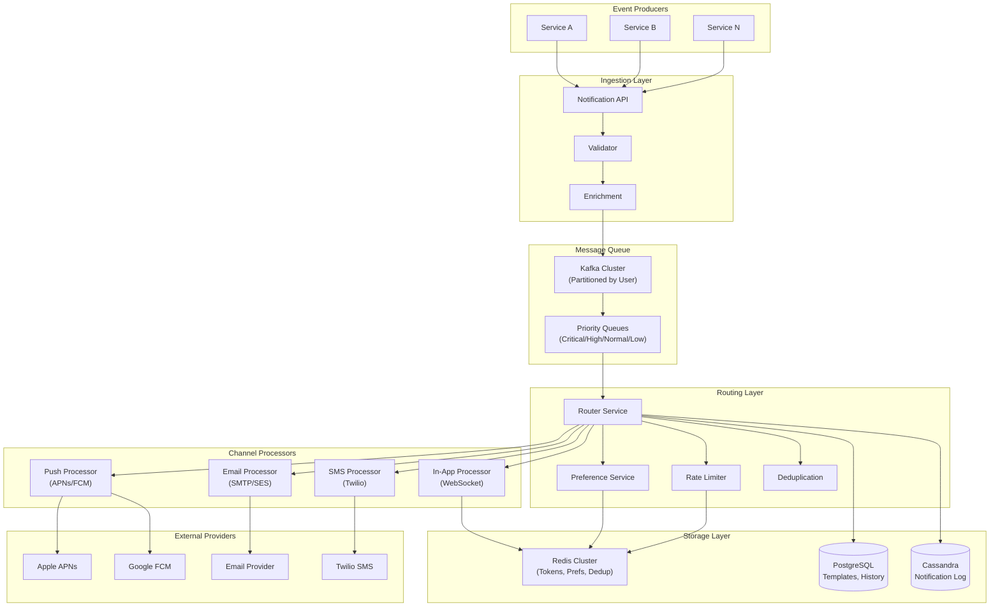
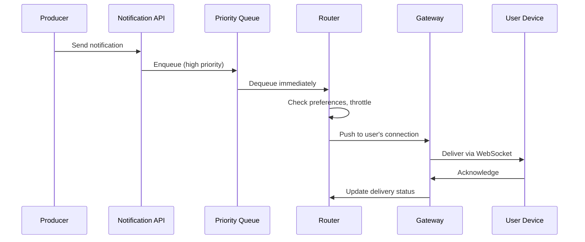
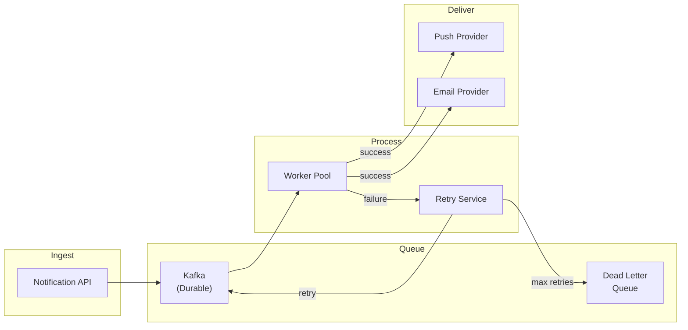
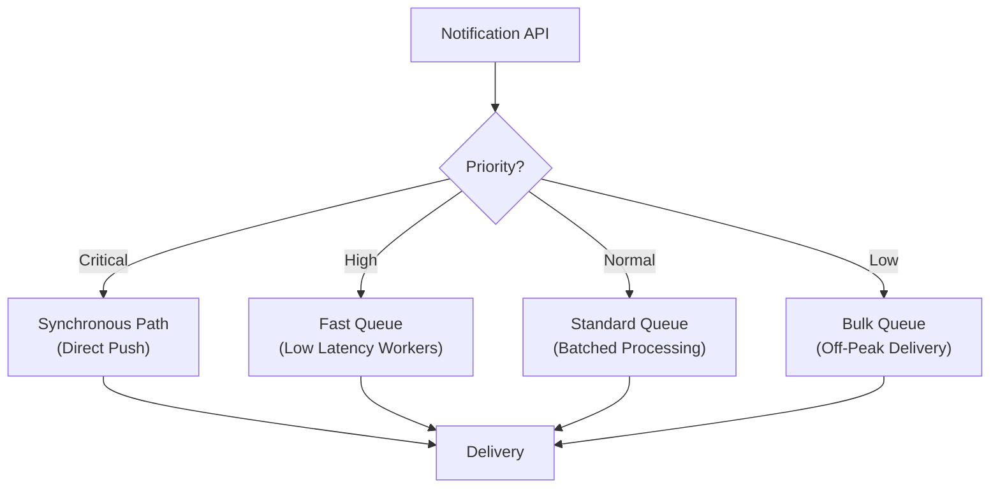
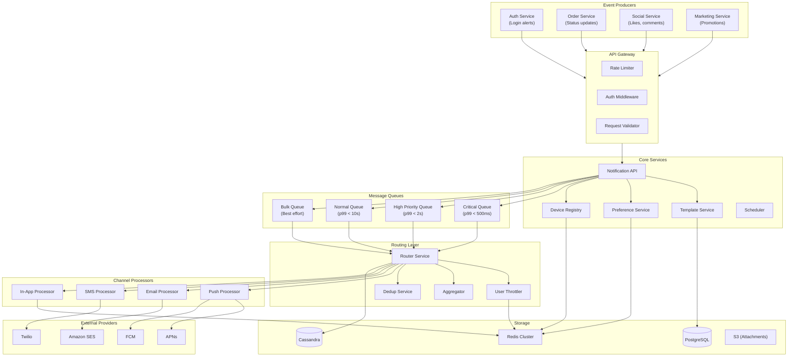
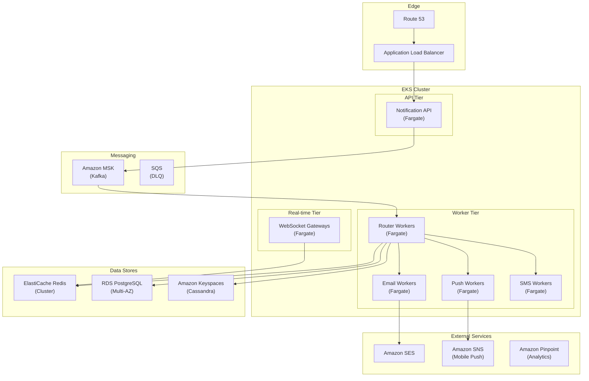

# Design a Notification System

A comprehensive system design for multi-channel notifications covering event ingestion, channel routing, delivery guarantees, user preferences, rate limiting, and failure handling. This design addresses sub-second delivery at Uber/LinkedIn scale (millions of notifications per second) with at-least-once delivery guarantees and user-centric throttling.

<figure>



<figcaption>High-level architecture: Event producers publish to Kafka, routing layer applies preferences and throttling, channel processors deliver via external providers.</figcaption>
</figure>

## Abstract

Notification systems solve three interconnected problems: **reliable delivery** (no notification is lost), **user respect** (throttling, preferences, quiet hours), and **channel optimization** (right message, right channel, right time).

**Core architectural decisions:**

| Decision           | Choice                               | Rationale                                                                    |
| ------------------ | ------------------------------------ | ---------------------------------------------------------------------------- |
| Delivery guarantee | At-least-once + idempotent consumers | Exactly-once impossible in distributed systems; dedup at consumer is simpler |
| Queue partitioning | By user_id                           | Co-locates user's notifications for rate limiting and aggregation            |
| Priority handling  | Separate queues per priority         | Critical notifications bypass backlog from bulk sends                        |
| Channel selection  | User preference → fallback chain     | Respect user choice, ensure delivery for critical alerts                     |
| Rate limiting      | Token bucket per user per channel    | Prevents notification fatigue, protects external provider limits             |
| Template rendering | At send time                         | Supports dynamic content, A/B testing, personalization                       |

**Key trade-offs accepted:**

- Increased latency from preference lookups in exchange for user control
- Storage overhead for deduplication windows (24-48 hours)
- Complexity of multiple channel processors vs. single delivery path
- At-least-once means clients must handle duplicates

**What this design optimizes:**

- Sub-500ms delivery for critical notifications
- 99.99% delivery rate with retry and fallback mechanisms
- User-controlled notification experience (frequency, channels, timing)
- Horizontal scaling to millions of notifications per second

## Requirements

### Functional Requirements

| Requirement            | Priority | Notes                                          |
| ---------------------- | -------- | ---------------------------------------------- |
| Multi-channel delivery | Core     | Push (iOS/Android), Email, SMS, In-app         |
| User preferences       | Core     | Opt-in/out per notification type and channel   |
| Template management    | Core     | Dynamic templates with variable substitution   |
| Scheduling             | Core     | Immediate, scheduled, timezone-aware delivery  |
| Delivery tracking      | Core     | Sent, delivered, opened, clicked status        |
| Rate limiting          | Core     | User-level and channel-level throttling        |
| Retry and fallback     | Core     | Automatic retry with channel fallback          |
| Notification history   | Extended | Queryable log for users and support            |
| Batching/aggregation   | Extended | Collapse similar notifications ("5 new likes") |
| Quiet hours            | Extended | Per-user do-not-disturb windows                |

### Non-Functional Requirements

| Requirement                 | Target                       | Rationale                                             |
| --------------------------- | ---------------------------- | ----------------------------------------------------- |
| Availability                | 99.99% (4 nines)             | Notifications are critical for user engagement        |
| Delivery latency (critical) | p99 < 500ms                  | Time-sensitive alerts (security, transactions)        |
| Delivery latency (normal)   | p99 < 5s                     | Acceptable for social/promotional                     |
| Throughput                  | 1M notifications/second peak | Enterprise scale (Uber: 250K/s, LinkedIn: millions/s) |
| Deduplication window        | 48 hours                     | Balance storage vs. duplicate prevention              |
| Delivery rate               | > 99.9%                      | After retries and fallbacks                           |

### Scale Estimation

**Users:**

- Monthly Active Users (MAU): 100M
- Daily Active Users (DAU): 40M (40% of MAU)
- Devices per user: 2 (phone + web)
- Push tokens to manage: 200M

**Traffic:**

- Notifications per user per day: 25 (mix of transactional and engagement)
- Daily notifications: 40M × 25 = 1B notifications/day
- Average per second: 1B / 86400 ≈ 12K notifications/second
- Peak multiplier (3x): 36K notifications/second
- Burst events (flash sales, breaking news): 100K+ notifications/second

**Storage:**

- Notification record: 500 bytes (metadata, status, timestamps)
- Daily storage: 1B × 500B = 500GB/day
- 90-day retention: 45TB
- Deduplication cache: 48-hour window × 1B × 32-byte key = ~64GB

**External provider capacity:**

- FCM: 600K quota tokens/minute ≈ 10K/second sustained
- APNs: No published limit, but throttles excessive traffic
- Email (SES): 50K/second with warm-up
- SMS (Twilio): 100 MPS per short code

## Design Paths

### Path A: Push-Based (Real-Time First)

**Best when:**

- Sub-second latency is critical
- Users expect immediate notifications
- Infrastructure can maintain persistent connections
- Moderate notification volume per user

**Architecture:**



**Key characteristics:**

- Persistent connections (WebSocket/SSE) to user devices
- Gateway maintains connection-to-user mapping
- Direct delivery bypasses external providers for in-app

**Trade-offs:**

- ✅ Lowest latency (< 100ms for in-app)
- ✅ No external provider costs for in-app
- ✅ Bidirectional communication
- ❌ Connection management complexity at scale
- ❌ Still needs push providers for background delivery
- ❌ Higher infrastructure cost (persistent connections)

**Real-world example:** Uber's RAMEN system maintains 1.5M+ concurrent connections, delivering 250K+ messages/second with 99.99% server-side reliability using gRPC bidirectional streaming.

### Path B: Queue-Based (Reliability First)

**Best when:**

- Delivery guarantee is paramount
- Notification volume is high but latency tolerance is 1-5 seconds
- Need strong audit trail
- Burst handling is critical

**Architecture:**



**Key characteristics:**

- All notifications flow through durable message queue
- Workers process at their own pace
- Built-in retry with exponential backoff
- Dead letter queue for failed notifications

**Trade-offs:**

- ✅ Guaranteed delivery (no message loss)
- ✅ Excellent burst handling (queue absorbs spikes)
- ✅ Strong audit trail (Kafka retention)
- ❌ Higher latency (queue hop overhead)
- ❌ Ordering complexity across partitions
- ❌ Potential for notification storms after recovery

**Real-world example:** Slack uses Kafka-based infrastructure for notification delivery, achieving 100% trace coverage for debugging delivery issues.

### Path C: Hybrid (Tiered by Priority)

**Best when:**

- Mix of time-sensitive and bulk notifications
- Need to balance cost, latency, and reliability
- Different notification types have different SLAs

**Architecture:**



**Key characteristics:**

- Priority classification at ingestion
- Separate processing paths per priority
- Resource allocation matches SLA requirements
- Bulk notifications processed during off-peak

**Trade-offs:**

- ✅ Optimal latency for critical notifications
- ✅ Cost-efficient bulk processing
- ✅ Predictable SLAs per notification type
- ❌ Multiple code paths to maintain
- ❌ Priority classification complexity
- ❌ Risk of priority inversion under load

**Real-world example:** Netflix's RENO uses priority-based AWS SQS queues with corresponding compute clusters, delivering personalized notifications with different latency guarantees.

### Path Comparison

| Factor              | Push-Based | Queue-Based | Hybrid       |
| ------------------- | ---------- | ----------- | ------------ |
| Latency (critical)  | < 100ms    | 500ms-2s    | < 100ms      |
| Latency (bulk)      | Same       | Same        | Flexible     |
| Reliability         | Good       | Excellent   | Excellent    |
| Burst handling      | Limited    | Excellent   | Excellent    |
| Infrastructure cost | High       | Medium      | Medium-High  |
| Complexity          | High       | Medium      | Highest      |
| Production examples | Uber RAMEN | Slack       | Netflix RENO |

### This Article's Focus

This article focuses on **Path C (Hybrid)** because:

1. Reflects production systems at scale (Netflix, LinkedIn)
2. Demonstrates priority-based trade-off thinking
3. Handles diverse notification types (security alerts to marketing)
4. Balances cost, latency, and reliability appropriately

## High-Level Design

### Component Overview



### Notification API

Receives notification requests, validates, enriches, and routes to appropriate queue.

**Responsibilities:**

- Request validation and authentication
- Template resolution and rendering
- Priority classification
- User preference lookup
- Queue routing based on priority

**Design decisions:**

| Decision           | Choice                                | Rationale                                                 |
| ------------------ | ------------------------------------- | --------------------------------------------------------- |
| API style          | REST with async response              | Fire-and-forget for producers; status via webhook/polling |
| Idempotency        | Client-provided notification_id       | Enables safe retries from producers                       |
| Batching           | Support up to 1000 recipients/request | Reduces API overhead for bulk sends                       |
| Template rendering | At ingestion time                     | Content frozen at send; supports personalization          |

### Template Service

Manages notification templates with variable substitution and multi-language support.

**Template structure:**

```typescript
interface NotificationTemplate {
  templateId: string
  name: string
  category: "transactional" | "marketing" | "system"
  channels: {
    push?: {
      title: string // "Your order {{orderId}} has shipped"
      body: string // "Track your package: {{trackingUrl}}"
      data?: Record<string, string>
    }
    email?: {
      subject: string
      htmlBody: string
      textBody: string
    }
    sms?: {
      body: string // Max 160 chars for single segment
    }
  }
  variables: VariableDefinition[]
  defaultLocale: string
  translations: Record<string, ChannelContent>
}
```

**Design decisions:**

- Templates stored in PostgreSQL with Redis cache (5-minute TTL)
- Variable validation at template creation prevents runtime errors
- Version history for rollback support
- A/B testing via template variants

### Preference Service

Manages user notification preferences with channel-level and type-level granularity.

**Preference model:**

```typescript
interface UserPreferences {
  userId: string
  globalEnabled: boolean
  quietHours?: {
    enabled: boolean
    start: string // "22:00"
    end: string // "07:00"
    timezone: string // "America/New_York"
  }
  channels: {
    push: ChannelPreference
    email: ChannelPreference
    sms: ChannelPreference
    inApp: ChannelPreference
  }
  categories: {
    [category: string]: {
      enabled: boolean
      channels: string[] // Override global channel prefs
      frequency?: "immediate" | "daily_digest" | "weekly_digest"
    }
  }
}

interface ChannelPreference {
  enabled: boolean
  frequency?: FrequencyLimit // Max 5/hour, 20/day
}
```

**Storage strategy:**

- Hot path: Redis hash with 1-hour TTL
- Canonical: PostgreSQL with audit history
- Write-through cache invalidation

### Device Registry

Maintains device tokens for push notification delivery.

**Token management:**

```typescript
interface DeviceToken {
  userId: string
  deviceId: string
  platform: "ios" | "android" | "web"
  token: string
  tokenType: "apns" | "fcm" | "web_push"
  appVersion: string
  lastSeen: Date
  createdAt: Date
  updatedAt: Date
  status: "active" | "stale" | "invalid"
}
```

**Token lifecycle:**

| Event                           | Action                              |
| ------------------------------- | ----------------------------------- |
| App install                     | Register new token                  |
| App launch                      | Refresh token if > 7 days old       |
| Token refresh callback          | Update token, mark previous invalid |
| Delivery failure (unregistered) | Mark token invalid immediately      |
| 30 days inactive                | Mark token stale (lower priority)   |
| 270 days inactive (Android)     | Token expires automatically         |

**Per Firebase documentation:** Monitor `droppedDeviceInactive` percentage; tokens inactive > 270 days on Android are automatically expired.

### Router Service

Core orchestration layer that applies business logic before delivery.

**Routing flow:**

1. **Deduplication check**: Has this (user_id, notification_id) been processed?
2. **Preference check**: Is user opted in for this notification type and channel?
3. **Quiet hours check**: Is user in do-not-disturb window?
4. **Rate limit check**: Has user exceeded frequency limits?
5. **Aggregation check**: Should this be batched with similar notifications?
6. **Channel selection**: Which channel(s) based on preference and fallback rules?
7. **Dispatch**: Send to appropriate channel processor(s)

### Channel Processors

Independent processors for each delivery channel with provider-specific logic.

**Push Processor:**

- Manages connection pools to APNs/FCM
- Handles token-based authentication (APNs) and service account auth (FCM)
- Respects provider rate limits (FCM: 600K tokens/minute)
- Processes invalid token responses

**Email Processor:**

- Manages sender reputation and warm-up
- Handles bounces (hard/soft) and complaints
- Implements one-click unsubscribe (Gmail/Yahoo 2024 requirement)
- Tracks open/click events via tracking pixels and redirect URLs

**SMS Processor:**

- Routes to appropriate number type (short code vs. long code)
- Handles multi-segment messages (> 160 chars)
- Manages opt-out via STOP keyword
- Respects carrier rate limits

**In-App Processor:**

- Delivers via WebSocket for connected users
- Falls back to polling endpoint for disconnected
- Supports notification aggregation (badge counts)
- Manages read/unread state

## API Design

### Send Notification

**Endpoint:** `POST /api/v1/notifications`

**Request:**

```json
{
  "notificationId": "uuid-client-generated",
  "templateId": "order_shipped",
  "recipients": [
    {
      "userId": "user_123",
      "variables": {
        "orderId": "ORD-456",
        "trackingUrl": "https://track.example.com/ORD-456"
      }
    }
  ],
  "priority": "high",
  "channels": ["push", "email"],
  "options": {
    "ttl": 86400,
    "collapseKey": "order_update_ORD-456",
    "scheduledAt": null
  }
}
```

**Response (202 Accepted):**

```json
{
  "requestId": "req_abc123",
  "notificationId": "uuid-client-generated",
  "status": "accepted",
  "recipientCount": 1,
  "estimatedDelivery": "2024-02-03T10:00:05Z"
}
```

**Error Responses:**

| Code | Error                    | When                                    |
| ---- | ------------------------ | --------------------------------------- |
| 400  | `INVALID_TEMPLATE`       | Template not found or invalid variables |
| 400  | `INVALID_RECIPIENT`      | User ID not found                       |
| 409  | `DUPLICATE_NOTIFICATION` | notificationId already processed        |
| 429  | `RATE_LIMITED`           | Producer rate limit exceeded            |

### Bulk Send

**Endpoint:** `POST /api/v1/notifications/bulk`

**Request:**

```json
{
  "notificationId": "bulk_uuid",
  "templateId": "weekly_digest",
  "recipientQuery": {
    "segment": "active_users_7d",
    "excludeOptedOut": true
  },
  "priority": "low",
  "channels": ["email"],
  "options": {
    "spreadOverMinutes": 60,
    "respectQuietHours": true
  }
}
```

**Response (202 Accepted):**

```json
{
  "requestId": "bulk_req_xyz",
  "notificationId": "bulk_uuid",
  "status": "queued",
  "estimatedRecipients": 150000,
  "estimatedCompletion": "2024-02-03T11:00:00Z"
}
```

### Get Notification Status

**Endpoint:** `GET /api/v1/notifications/{notificationId}/status`

**Response:**

```json
{
  "notificationId": "uuid",
  "status": "delivered",
  "recipients": [
    {
      "userId": "user_123",
      "channels": {
        "push": {
          "status": "delivered",
          "deliveredAt": "2024-02-03T10:00:02Z",
          "openedAt": "2024-02-03T10:05:00Z"
        },
        "email": {
          "status": "sent",
          "sentAt": "2024-02-03T10:00:03Z",
          "openedAt": null
        }
      }
    }
  ]
}
```

### User Preferences

**Endpoint:** `GET /api/v1/users/{userId}/preferences`

**Response:**

```json
{
  "userId": "user_123",
  "globalEnabled": true,
  "quietHours": {
    "enabled": true,
    "start": "22:00",
    "end": "07:00",
    "timezone": "America/New_York"
  },
  "channels": {
    "push": { "enabled": true },
    "email": { "enabled": true, "frequency": { "maxPerDay": 10 } },
    "sms": { "enabled": false }
  },
  "categories": {
    "marketing": { "enabled": false },
    "order_updates": { "enabled": true, "channels": ["push", "email"] },
    "security": { "enabled": true, "channels": ["push", "sms", "email"] }
  }
}
```

**Update Preferences:**

**Endpoint:** `PATCH /api/v1/users/{userId}/preferences`

```json
{
  "categories": {
    "marketing": { "enabled": true, "frequency": "weekly_digest" }
  }
}
```

### Device Registration

**Endpoint:** `POST /api/v1/devices`

**Request:**

```json
{
  "userId": "user_123",
  "deviceId": "device_abc",
  "platform": "ios",
  "token": "apns_token_xyz",
  "appVersion": "3.2.1"
}
```

**Response (201 Created):**

```json
{
  "deviceId": "device_abc",
  "status": "active",
  "registeredAt": "2024-02-03T10:00:00Z"
}
```

### Notification History

**Endpoint:** `GET /api/v1/users/{userId}/notifications?limit=50&cursor=xxx`

**Response:**

```json
{
  "notifications": [
    {
      "notificationId": "uuid_1",
      "templateId": "order_shipped",
      "title": "Your order has shipped",
      "body": "Track your package...",
      "channel": "push",
      "status": "read",
      "createdAt": "2024-02-03T10:00:00Z",
      "readAt": "2024-02-03T10:05:00Z"
    }
  ],
  "nextCursor": "cursor_abc",
  "hasMore": true
}
```

## Data Modeling

### Notification Record (Cassandra)

**Table design for time-series notification access:**

```sql
CREATE TABLE notifications (
    user_id UUID,
    created_at TIMESTAMP,
    notification_id UUID,
    template_id TEXT,
    priority TEXT,
    content FROZEN<notification_content>,
    channels SET<TEXT>,
    status TEXT,
    delivery_attempts INT,
    PRIMARY KEY ((user_id), created_at, notification_id)
) WITH CLUSTERING ORDER BY (created_at DESC, notification_id ASC)
  AND default_time_to_live = 7776000; -- 90 days

CREATE TYPE notification_content (
    title TEXT,
    body TEXT,
    data MAP<TEXT, TEXT>,
    image_url TEXT
);

-- For notification lookup by ID
CREATE TABLE notifications_by_id (
    notification_id UUID PRIMARY KEY,
    user_id UUID,
    created_at TIMESTAMP,
    template_id TEXT,
    priority TEXT,
    content FROZEN<notification_content>,
    channels SET<TEXT>,
    status TEXT
);
```

**Why Cassandra:**

- Time-series optimized with partition per user
- Automatic TTL-based expiration
- High write throughput for delivery status updates
- Linear horizontal scaling

### Delivery Status Tracking (Cassandra)

```sql
CREATE TABLE delivery_status (
    notification_id UUID,
    channel TEXT,
    user_id UUID,
    device_id TEXT,
    status TEXT,        -- queued, sent, delivered, failed, opened, clicked
    provider_id TEXT,   -- APNs message ID, SES message ID, etc.
    error_code TEXT,
    error_message TEXT,
    timestamp TIMESTAMP,
    PRIMARY KEY ((notification_id), channel, device_id)
);

-- Index for retry processing
CREATE TABLE failed_deliveries (
    retry_bucket INT,   -- Hour bucket for time-based retry
    notification_id UUID,
    channel TEXT,
    user_id UUID,
    attempt_count INT,
    last_error TEXT,
    next_retry_at TIMESTAMP,
    PRIMARY KEY ((retry_bucket), next_retry_at, notification_id)
) WITH CLUSTERING ORDER BY (next_retry_at ASC);
```

### User Preferences (PostgreSQL)

```sql
CREATE TABLE user_preferences (
    user_id UUID PRIMARY KEY,
    global_enabled BOOLEAN DEFAULT true,
    quiet_hours JSONB,  -- {"enabled":true,"start":"22:00","end":"07:00","tz":"America/New_York"}
    channel_prefs JSONB,
    category_prefs JSONB,
    created_at TIMESTAMPTZ DEFAULT NOW(),
    updated_at TIMESTAMPTZ DEFAULT NOW()
);

-- Audit history for compliance
CREATE TABLE preference_history (
    id BIGSERIAL PRIMARY KEY,
    user_id UUID NOT NULL,
    changed_at TIMESTAMPTZ DEFAULT NOW(),
    change_type TEXT,  -- 'opt_in', 'opt_out', 'update'
    old_value JSONB,
    new_value JSONB,
    source TEXT        -- 'user', 'system', 'compliance'
);

CREATE INDEX idx_pref_history_user ON preference_history(user_id, changed_at DESC);
```

### Device Tokens (PostgreSQL + Redis)

```sql
CREATE TABLE device_tokens (
    device_id TEXT PRIMARY KEY,
    user_id UUID NOT NULL,
    platform TEXT NOT NULL,  -- ios, android, web
    token TEXT NOT NULL,
    token_type TEXT NOT NULL, -- apns, fcm, web_push
    app_version TEXT,
    last_seen TIMESTAMPTZ,
    status TEXT DEFAULT 'active',  -- active, stale, invalid
    created_at TIMESTAMPTZ DEFAULT NOW(),
    updated_at TIMESTAMPTZ DEFAULT NOW()
);

CREATE INDEX idx_tokens_user ON device_tokens(user_id);
CREATE INDEX idx_tokens_status ON device_tokens(status) WHERE status = 'active';
```

**Redis cache structure:**

```redis
# User's active tokens (set)
SADD user:tokens:{user_id} {device_id_1} {device_id_2}

# Token details (hash)
HSET token:{device_id}
    user_id "user_123"
    platform "ios"
    token "apns_xyz"
    token_type "apns"
    status "active"

# Token lookup (string with TTL for stale detection)
SETEX token:active:{device_id} 2592000 "1"  -- 30 days
```

### Templates (PostgreSQL)

```sql
CREATE TABLE notification_templates (
    template_id TEXT PRIMARY KEY,
    name TEXT NOT NULL,
    category TEXT NOT NULL,
    channels JSONB NOT NULL,
    variables JSONB,
    default_locale TEXT DEFAULT 'en',
    is_active BOOLEAN DEFAULT true,
    created_at TIMESTAMPTZ DEFAULT NOW(),
    updated_at TIMESTAMPTZ DEFAULT NOW(),
    version INT DEFAULT 1
);

CREATE TABLE template_translations (
    template_id TEXT REFERENCES notification_templates(template_id),
    locale TEXT,
    channels JSONB NOT NULL,
    PRIMARY KEY (template_id, locale)
);

CREATE TABLE template_versions (
    template_id TEXT,
    version INT,
    channels JSONB NOT NULL,
    created_at TIMESTAMPTZ DEFAULT NOW(),
    created_by TEXT,
    PRIMARY KEY (template_id, version)
);
```

### Database Selection Matrix

| Data Type        | Store              | Rationale                               |
| ---------------- | ------------------ | --------------------------------------- |
| Notifications    | Cassandra          | Time-series, high write volume, TTL     |
| Delivery status  | Cassandra          | High write volume, time-based queries   |
| User preferences | PostgreSQL + Redis | ACID for changes, cached for reads      |
| Device tokens    | PostgreSQL + Redis | Relational queries, cached for delivery |
| Templates        | PostgreSQL         | Low volume, version history needed      |
| Deduplication    | Redis              | TTL-based, fast lookups                 |
| Rate limits      | Redis              | Atomic counters, sliding windows        |
| Analytics        | ClickHouse         | Columnar, aggregations at scale         |

## Low-Level Design

### Deduplication Service

**Purpose:** Prevent duplicate notification delivery within 48-hour window.

```typescript collapse={1-10}
class DeduplicationService {
  private readonly redis: RedisCluster
  private readonly DEDUP_TTL = 172800 // 48 hours in seconds

  async isDuplicate(userId: string, notificationId: string): Promise<boolean> {
    const key = `dedup:${userId}:${notificationId}`

    // SETNX returns 1 if key was set (not duplicate), 0 if exists (duplicate)
    const result = await this.redis.set(key, "1", {
      NX: true,
      EX: this.DEDUP_TTL,
    })

    return result === null // null means key existed (duplicate)
  }

  // Bloom filter for fast "definitely not duplicate" check
  async checkBloomFilter(userId: string, notificationId: string): Promise<boolean> {
    const key = `bloom:dedup:${userId}`
    return await this.redis.bf.exists(key, notificationId)
  }
}
```

**Design rationale:** Twilio Segment's deduplication handles 60 billion keys across 1.5TB storage. Using Bloom filters for fast rejection and Redis SETNX for authoritative check balances memory and accuracy.

### Rate Limiter

**Token bucket implementation for user-level throttling:**

```typescript collapse={1-12}
interface RateLimitConfig {
  channel: string
  maxPerHour: number
  maxPerDay: number
}

class RateLimiter {
  private readonly redis: RedisCluster

  async checkAndConsume(
    userId: string,
    channel: string,
    config: RateLimitConfig,
  ): Promise<{ allowed: boolean; retryAfter?: number }> {
    const hourKey = `ratelimit:${userId}:${channel}:hour:${this.getCurrentHour()}`
    const dayKey = `ratelimit:${userId}:${channel}:day:${this.getCurrentDay()}`

    // Lua script for atomic check-and-increment
    const result = await this.redis.eval(
      `
      local hourCount = redis.call('INCR', KEYS[1])
      if hourCount == 1 then
        redis.call('EXPIRE', KEYS[1], 3600)
      end

      local dayCount = redis.call('INCR', KEYS[2])
      if dayCount == 1 then
        redis.call('EXPIRE', KEYS[2], 86400)
      end

      if hourCount > tonumber(ARGV[1]) then
        redis.call('DECR', KEYS[1])
        return {0, 3600 - redis.call('TTL', KEYS[1])}
      end

      if dayCount > tonumber(ARGV[2]) then
        redis.call('DECR', KEYS[1])
        redis.call('DECR', KEYS[2])
        return {0, 86400 - redis.call('TTL', KEYS[2])}
      end

      return {1, 0}
    `,
      [hourKey, dayKey],
      [config.maxPerHour, config.maxPerDay],
    )

    return {
      allowed: result[0] === 1,
      retryAfter: result[1] > 0 ? result[1] : undefined,
    }
  }
}
```

**Channel-specific limits (per FCM documentation):**

| Channel      | Limit                    | Enforcement                      |
| ------------ | ------------------------ | -------------------------------- |
| FCM          | 600K tokens/minute       | Token bucket with backoff on 429 |
| APNs         | No published limit       | Monitor for throttling responses |
| Email (SES)  | 50K/second (warm domain) | Gradual ramp-up required         |
| SMS (Twilio) | 100 MPS/short code       | Queue with rate-limited consumer |

### Notification Aggregator

**Collapses similar notifications into digest:**

```typescript collapse={1-15}
interface AggregationRule {
  category: string
  collapseKey: string // Template for grouping, e.g., "likes_{postId}"
  windowSeconds: number // Aggregation window
  minCount: number // Minimum to trigger aggregation
  maxCount: number // Maximum before force-flush
  digestTemplate: string // "{{count}} people liked your post"
}

class NotificationAggregator {
  private readonly redis: RedisCluster

  async shouldAggregate(
    userId: string,
    notification: Notification,
    rule: AggregationRule,
  ): Promise<{ aggregate: boolean; pending: Notification[] }> {
    const collapseKey = this.renderCollapseKey(rule.collapseKey, notification)
    const bufferKey = `agg:${userId}:${collapseKey}`

    // Add to buffer
    await this.redis.rpush(bufferKey, JSON.stringify(notification))
    await this.redis.expire(bufferKey, rule.windowSeconds)

    const count = await this.redis.llen(bufferKey)

    if (count >= rule.maxCount) {
      // Force flush
      const pending = await this.flushBuffer(bufferKey)
      return { aggregate: true, pending }
    }

    if (count >= rule.minCount) {
      // Schedule aggregated delivery at window end
      await this.scheduleFlush(userId, collapseKey, rule.windowSeconds)
    }

    return { aggregate: false, pending: [] }
  }

  async createDigest(notifications: Notification[], rule: AggregationRule): Promise<Notification> {
    const count = notifications.length
    const actors = [...new Set(notifications.map((n) => n.actorId))].slice(0, 3)

    return {
      ...notifications[0],
      content: {
        title: this.renderTemplate(rule.digestTemplate, { count, actors }),
        body: `${actors[0]} and ${count - 1} others`,
      },
      metadata: {
        aggregatedCount: count,
        originalIds: notifications.map((n) => n.notificationId),
      },
    }
  }
}
```

**Aggregation patterns:**

| Notification Type | Collapse Key          | Window | Digest Format                       |
| ----------------- | --------------------- | ------ | ----------------------------------- |
| Post likes        | `likes_{postId}`      | 5 min  | "John and 5 others liked your post" |
| New followers     | `followers_{userId}`  | 1 hour | "6 new followers today"             |
| Comment replies   | `replies_{commentId}` | 10 min | "3 new replies to your comment"     |

### Priority Router

```typescript collapse={1-12}
enum NotificationPriority {
  CRITICAL = "critical", // Security alerts, transaction confirmations
  HIGH = "high", // Direct messages, mentions
  NORMAL = "normal", // Social notifications, updates
  LOW = "low", // Marketing, digests
}

class PriorityRouter {
  private readonly queues: Map<NotificationPriority, KafkaProducer>

  async route(notification: EnrichedNotification): Promise<void> {
    const priority = this.determinePriority(notification)
    const queue = this.queues.get(priority)

    // Partition by user_id for rate limiting co-location
    await queue.send({
      topic: `notifications.${priority}`,
      messages: [
        {
          key: notification.userId,
          value: JSON.stringify(notification),
          headers: {
            "notification-id": notification.notificationId,
            "created-at": Date.now().toString(),
          },
        },
      ],
    })
  }

  private determinePriority(notification: EnrichedNotification): NotificationPriority {
    // Critical: security, transactions, time-sensitive
    if (notification.category === "security") return NotificationPriority.CRITICAL
    if (notification.category === "transaction") return NotificationPriority.CRITICAL

    // High: direct user interaction
    if (notification.category === "message") return NotificationPriority.HIGH
    if (notification.category === "mention") return NotificationPriority.HIGH

    // Low: bulk, marketing
    if (notification.category === "marketing") return NotificationPriority.LOW
    if (notification.category === "digest") return NotificationPriority.LOW

    return NotificationPriority.NORMAL
  }
}
```

**Queue configuration:**

| Priority | Partitions | Consumer Parallelism  | Max Latency |
| -------- | ---------- | --------------------- | ----------- |
| Critical | 50         | 50 workers            | 500ms       |
| High     | 100        | 100 workers           | 2s          |
| Normal   | 200        | 200 workers           | 10s         |
| Low      | 50         | 50 workers (off-peak) | Best effort |

### Push Delivery with Retry

```typescript collapse={1-20}
interface PushDeliveryResult {
  success: boolean
  messageId?: string
  errorCode?: string
  shouldRetry: boolean
  invalidToken: boolean
}

class PushProcessor {
  private readonly fcm: FirebaseMessaging
  private readonly apns: ApnsClient
  private readonly deviceRegistry: DeviceRegistry

  async deliver(notification: Notification, device: DeviceToken): Promise<PushDeliveryResult> {
    try {
      if (device.tokenType === "fcm") {
        return await this.deliverFcm(notification, device)
      } else if (device.tokenType === "apns") {
        return await this.deliverApns(notification, device)
      }
    } catch (error) {
      return this.handleError(error, device)
    }
  }

  private async deliverFcm(notification: Notification, device: DeviceToken): Promise<PushDeliveryResult> {
    const message = {
      token: device.token,
      notification: {
        title: notification.content.title,
        body: notification.content.body,
      },
      data: notification.content.data,
      android: {
        priority: notification.priority === "critical" ? "high" : "normal",
        ttl: notification.ttl * 1000,
        collapseKey: notification.collapseKey,
      },
    }

    const response = await this.fcm.send(message)
    return { success: true, messageId: response, shouldRetry: false, invalidToken: false }
  }

  private handleError(error: any, device: DeviceToken): PushDeliveryResult {
    // FCM error codes per documentation
    const errorCode = error.code

    // Invalid token - remove immediately
    if (["messaging/invalid-registration-token", "messaging/registration-token-not-registered"].includes(errorCode)) {
      this.deviceRegistry.markInvalid(device.deviceId)
      return { success: false, errorCode, shouldRetry: false, invalidToken: true }
    }

    // Rate limited - retry with backoff
    if (errorCode === "messaging/too-many-requests") {
      return { success: false, errorCode, shouldRetry: true, invalidToken: false }
    }

    // Server error - retry with backoff
    if (errorCode === "messaging/internal-error") {
      return { success: false, errorCode, shouldRetry: true, invalidToken: false }
    }

    return { success: false, errorCode, shouldRetry: false, invalidToken: false }
  }
}
```

### Retry Service with Exponential Backoff

```typescript collapse={1-15}
interface RetryConfig {
  maxAttempts: number
  baseDelayMs: number
  maxDelayMs: number
  jitterFactor: number
}

class RetryService {
  private readonly defaultConfig: RetryConfig = {
    maxAttempts: 5,
    baseDelayMs: 1000,
    maxDelayMs: 300000, // 5 minutes
    jitterFactor: 0.2,
  }

  async scheduleRetry(
    notification: Notification,
    channel: string,
    attemptCount: number,
    config: RetryConfig = this.defaultConfig,
  ): Promise<void> {
    if (attemptCount >= config.maxAttempts) {
      await this.moveToDlq(notification, channel)
      return
    }

    const delay = this.calculateDelay(attemptCount, config)
    const retryBucket = Math.floor((Date.now() + delay) / 3600000) // Hour bucket

    await this.cassandra.execute(
      `
      INSERT INTO failed_deliveries (
        retry_bucket, notification_id, channel, user_id,
        attempt_count, last_error, next_retry_at
      ) VALUES (?, ?, ?, ?, ?, ?, ?)
    `,
      [
        retryBucket,
        notification.notificationId,
        channel,
        notification.userId,
        attemptCount + 1,
        notification.lastError,
        new Date(Date.now() + delay),
      ],
    )
  }

  private calculateDelay(attempt: number, config: RetryConfig): number {
    // Exponential backoff with jitter
    const exponentialDelay = config.baseDelayMs * Math.pow(2, attempt)
    const cappedDelay = Math.min(exponentialDelay, config.maxDelayMs)
    const jitter = cappedDelay * config.jitterFactor * Math.random()

    return Math.floor(cappedDelay + jitter)
  }

  private async moveToDlq(notification: Notification, channel: string): Promise<void> {
    await this.kafka.send({
      topic: "notifications.dlq",
      messages: [
        {
          key: notification.userId,
          value: JSON.stringify({
            notification,
            channel,
            reason: "max_retries_exceeded",
            timestamp: Date.now(),
          }),
        },
      ],
    })

    // Alert for monitoring
    this.metrics.increment("notifications.dlq.count", {
      channel,
      category: notification.category,
    })
  }
}
```

### Quiet Hours Handler

```typescript collapse={1-10}
class QuietHoursHandler {
  async shouldDefer(
    userId: string,
    notification: Notification,
    preferences: UserPreferences,
  ): Promise<{ defer: boolean; deliverAt?: Date }> {
    // Critical notifications bypass quiet hours
    if (notification.priority === "critical") {
      return { defer: false }
    }

    if (!preferences.quietHours?.enabled) {
      return { defer: false }
    }

    const userNow = this.getUserLocalTime(preferences.quietHours.timezone)
    const isInQuietHours = this.isTimeInRange(userNow, preferences.quietHours.start, preferences.quietHours.end)

    if (!isInQuietHours) {
      return { defer: false }
    }

    // Calculate when quiet hours end
    const deliverAt = this.getQuietHoursEnd(preferences.quietHours.end, preferences.quietHours.timezone)

    return { defer: true, deliverAt }
  }

  private isTimeInRange(current: Date, start: string, end: string): boolean {
    const currentMinutes = current.getHours() * 60 + current.getMinutes()
    const [startHour, startMin] = start.split(":").map(Number)
    const [endHour, endMin] = end.split(":").map(Number)

    const startMinutes = startHour * 60 + startMin
    const endMinutes = endHour * 60 + endMin

    // Handle overnight ranges (e.g., 22:00 - 07:00)
    if (startMinutes > endMinutes) {
      return currentMinutes >= startMinutes || currentMinutes < endMinutes
    }

    return currentMinutes >= startMinutes && currentMinutes < endMinutes
  }
}
```

## Frontend Considerations

### Real-Time In-App Notifications

**WebSocket connection for live updates:**

```typescript collapse={1-15}
class NotificationClient {
  private ws: WebSocket | null = null
  private reconnectAttempt = 0
  private readonly MAX_RECONNECT_DELAY = 30000

  connect(authToken: string): void {
    this.ws = new WebSocket(`wss://notifications.example.com/ws?token=${authToken}`)

    this.ws.onopen = () => {
      this.reconnectAttempt = 0
      this.syncMissedNotifications()
    }

    this.ws.onmessage = (event) => {
      const notification = JSON.parse(event.data)
      this.handleNotification(notification)
    }

    this.ws.onclose = () => {
      this.scheduleReconnect()
    }
  }

  private handleNotification(notification: Notification): void {
    // Update badge count
    this.incrementBadge()

    // Add to notification list
    this.store.dispatch(addNotification(notification))

    // Show toast if appropriate
    if (notification.priority === "high" && !document.hasFocus()) {
      this.showToast(notification)
    }

    // Request browser notification permission if needed
    if (notification.showBrowserNotification) {
      this.showBrowserNotification(notification)
    }
  }

  private async syncMissedNotifications(): Promise<void> {
    const lastSeen = localStorage.getItem("lastNotificationTimestamp")

    const response = await fetch(`/api/v1/notifications?since=${lastSeen}&limit=50`)
    const { notifications } = await response.json()

    notifications.forEach((n) => this.handleNotification(n))
  }
}
```

### Notification List with Virtualization

```typescript collapse={1-12}
interface NotificationListProps {
  userId: string
  pageSize: number
}

const NotificationList: React.FC<NotificationListProps> = ({ userId, pageSize }) => {
  const {
    data,
    fetchNextPage,
    hasNextPage,
    isFetchingNextPage
  } = useInfiniteQuery({
    queryKey: ['notifications', userId],
    queryFn: ({ pageParam }) =>
      fetchNotifications(userId, { cursor: pageParam, limit: pageSize }),
    getNextPageParam: (lastPage) => lastPage.nextCursor
  })

  const notifications = data?.pages.flatMap(p => p.notifications) ?? []

  return (
    <VirtualList
      items={notifications}
      estimatedItemSize={80}
      onEndReached={() => hasNextPage && fetchNextPage()}
      renderItem={(notification) => (
        <NotificationItem
          key={notification.id}
          notification={notification}
          onRead={markAsRead}
        />
      )}
    />
  )
}
```

### Preference Management UI

```typescript collapse={1-15}
interface PreferenceState {
  loading: boolean
  preferences: UserPreferences | null
  pendingChanges: Partial<UserPreferences>
}

const PreferencesPanel: React.FC = () => {
  const [state, dispatch] = useReducer(preferenceReducer, initialState)

  const handleToggle = async (category: string, enabled: boolean) => {
    // Optimistic update
    dispatch({ type: 'UPDATE_CATEGORY', category, enabled })

    try {
      await updatePreferences({
        categories: { [category]: { enabled } }
      })
    } catch (error) {
      // Rollback on failure
      dispatch({ type: 'ROLLBACK' })
      showError('Failed to update preferences')
    }
  }

  return (
    <div className="preferences-panel">
      <section>
        <h3>Notification Channels</h3>
        {Object.entries(state.preferences?.channels ?? {}).map(([channel, config]) => (
          <ToggleRow
            key={channel}
            label={channelLabels[channel]}
            enabled={config.enabled}
            onChange={(enabled) => handleChannelToggle(channel, enabled)}
          />
        ))}
      </section>

      <section>
        <h3>Notification Types</h3>
        {Object.entries(state.preferences?.categories ?? {}).map(([category, config]) => (
          <CategoryRow
            key={category}
            category={category}
            config={config}
            onChange={(update) => handleCategoryUpdate(category, update)}
          />
        ))}
      </section>

      <section>
        <h3>Quiet Hours</h3>
        <QuietHoursEditor
          config={state.preferences?.quietHours}
          onChange={handleQuietHoursUpdate}
        />
      </section>
    </div>
  )
}
```

### Push Notification Permission Flow

```typescript collapse={1-10}
class PushPermissionManager {
  async requestPermission(): Promise<"granted" | "denied" | "default"> {
    // Check if already granted
    if (Notification.permission === "granted") {
      await this.registerServiceWorker()
      return "granted"
    }

    // Don't ask if denied
    if (Notification.permission === "denied") {
      return "denied"
    }

    // Request permission
    const permission = await Notification.requestPermission()

    if (permission === "granted") {
      await this.registerServiceWorker()
      const token = await this.getFcmToken()
      await this.registerDevice(token)
    }

    return permission
  }

  private async registerServiceWorker(): Promise<void> {
    const registration = await navigator.serviceWorker.register("/sw.js")

    // Handle token refresh
    registration.addEventListener("pushsubscriptionchange", async () => {
      const newToken = await this.getFcmToken()
      await this.updateDevice(newToken)
    })
  }
}
```

## Infrastructure

### Cloud-Agnostic Components

| Component      | Purpose                                 | Options                       |
| -------------- | --------------------------------------- | ----------------------------- |
| Message Queue  | Event ingestion, priority routing       | Kafka, Pulsar, NATS JetStream |
| KV Store       | Preferences, tokens, dedup, rate limits | Redis, KeyDB, Dragonfly       |
| Primary DB     | Templates, preferences, audit           | PostgreSQL, CockroachDB       |
| Time-series DB | Notification history, delivery status   | Cassandra, ScyllaDB, DynamoDB |
| Push Gateway   | APNs/FCM delivery                       | Self-hosted, Firebase Admin   |
| Email Gateway  | SMTP delivery                           | Postfix, SendGrid API         |
| SMS Gateway    | Carrier delivery                        | Twilio, Vonage                |

### AWS Reference Architecture



**Service configurations:**

| Service                      | Configuration         | Rationale                      |
| ---------------------------- | --------------------- | ------------------------------ |
| Notification API (Fargate)   | 2 vCPU, 4GB, 20 tasks | Stateless, scales with traffic |
| Router Workers (Fargate)     | 2 vCPU, 4GB, 50 tasks | CPU-bound preference lookups   |
| Push Workers (Fargate)       | 2 vCPU, 4GB, 30 tasks | I/O-bound provider calls       |
| WebSocket Gateways (Fargate) | 4 vCPU, 8GB, 20 tasks | Memory for connections         |
| ElastiCache Redis            | r6g.xlarge cluster    | Sub-ms reads for hot path      |
| RDS PostgreSQL               | db.r6g.large Multi-AZ | Templates, preferences         |
| Amazon Keyspaces             | On-demand             | Serverless Cassandra           |
| MSK                          | kafka.m5.large × 3    | Priority queue separation      |

### Self-Hosted Alternatives

| Managed Service  | Self-Hosted Option          | When to Self-Host                        |
| ---------------- | --------------------------- | ---------------------------------------- |
| Amazon MSK       | Apache Kafka on EC2         | Cost at scale, specific configs          |
| ElastiCache      | Redis Cluster on EC2        | Specific modules (RediSearch)            |
| Amazon Keyspaces | Apache Cassandra/ScyllaDB   | Cost, tuning flexibility                 |
| SNS Mobile Push  | Direct APNs/FCM integration | Full control, cost savings               |
| Amazon SES       | Postfix + DKIM/SPF          | Volume discounts, deliverability control |

### Monitoring and Observability

**Key metrics:**

| Metric                 | Alert Threshold | Action                      |
| ---------------------- | --------------- | --------------------------- |
| Delivery rate          | < 99%           | Investigate provider issues |
| p99 latency (critical) | > 500ms         | Scale workers, check queues |
| DLQ depth              | > 1000          | Manual intervention needed  |
| Rate limit hits        | > 10%           | Review user throttle config |
| Invalid tokens         | > 5% daily      | Token cleanup job issue     |

**Distributed tracing (per Slack's approach):**

- Each notification gets its own trace (notification_id = trace_id)
- Spans: trigger → enqueue → route → deliver → acknowledge
- 100% sampling for notifications (vs. 1% for general traffic)
- OpenTelemetry integration for cross-service visibility

## Conclusion

This design provides a scalable notification system with:

1. **At-least-once delivery** via Kafka durability and retry mechanisms
2. **Sub-500ms delivery for critical notifications** through priority queues and dedicated workers
3. **User-centric throttling** with preference-based channel selection and quiet hours
4. **Multi-channel support** with independent processors for push, email, SMS, and in-app
5. **Horizontal scalability** to millions of notifications per second

**Key architectural decisions:**

- Priority-based queue separation ensures critical notifications bypass bulk backlogs
- User-partitioned Kafka enables co-located rate limiting and aggregation
- Separate channel processors allow independent scaling and failure isolation
- Template rendering at send time supports personalization and A/B testing

**Known limitations:**

- At-least-once delivery requires idempotent clients
- Cross-channel ordering not guaranteed (push may arrive before email)
- Aggregation windows add latency for batch-eligible notifications
- External provider rate limits constrain burst capacity

**Future enhancements:**

- ML-based send time optimization (per Uber/Airship research)
- Rich media notifications (images, action buttons)
- Cross-device notification sync (read on phone, clear on web)
- Webhook delivery for B2B integrations

## Appendix

### Prerequisites

- Distributed systems fundamentals (message queues, partitioning)
- Push notification protocols (APNs, FCM)
- Rate limiting algorithms (token bucket, sliding window)
- Database selection trade-offs (SQL vs. NoSQL)

### Terminology

| Term             | Definition                                                             |
| ---------------- | ---------------------------------------------------------------------- |
| **APNs**         | Apple Push Notification service - Apple's push delivery infrastructure |
| **FCM**          | Firebase Cloud Messaging - Google's cross-platform push service        |
| **DLQ**          | Dead Letter Queue - storage for messages that failed processing        |
| **TTL**          | Time-to-Live - expiration duration for notifications                   |
| **Collapse key** | Identifier for grouping related notifications (newer replaces older)   |
| **Token bucket** | Rate limiting algorithm allowing bursts up to bucket capacity          |
| **Idempotent**   | Operation that produces same result regardless of execution count      |

### Summary

- **Multi-channel delivery** (push, email, SMS, in-app) with **at-least-once guarantees** using Kafka and retry mechanisms
- **Priority-based routing** separates critical notifications (< 500ms) from bulk (best effort)
- **User preference service** with Redis caching enables per-user channel and frequency control
- **Rate limiting** at user and channel level prevents notification fatigue and respects provider limits
- **Aggregation** collapses similar notifications ("5 new likes") to reduce user interruption
- Scale to **1M+ notifications/second** with horizontal worker scaling and partitioned queues

### References

**Real-World Implementations:**

- [Uber's Real-Time Push Platform (RAMEN)](https://www.uber.com/blog/real-time-push-platform/) - 1.5M+ connections, 250K messages/second
- [LinkedIn Concourse](https://www.linkedin.com/blog/engineering/messaging-notifications/concourse-generating-personalized-content-notifications-in-near) - Near real-time personalized notifications at scale
- [Netflix RENO](https://www.infoq.com/news/2022/03/netflix-reno/) - Hybrid push-pull notification architecture
- [Slack Notification Tracing](https://slack.engineering/tracing-notifications/) - End-to-end observability for notification delivery
- [Pinterest NEP](https://medium.com/pinterest-engineering/nep-notification-system-and-relevance-a7fff21986c7) - ML-powered notification relevance

**Provider Documentation:**

- [Firebase Cloud Messaging - Scale Your App](https://firebase.google.com/docs/cloud-messaging/scale-fcm) - Rate limits, error handling, token management
- [APNs Provider API](https://developer.apple.com/documentation/usernotifications/sending-notification-requests-to-apns) - Connection management, authentication
- [Gmail/Yahoo 2024 Deliverability Requirements](https://www.braze.com/resources/articles/guide-to-2024-email-deliverability-updates-what-to-expect-from-gmail-and-yahoo-mail) - SPF, DKIM, one-click unsubscribe

**Patterns and Best Practices:**

- [Twilio Segment - Exactly-Once Delivery](https://www.twilio.com/en-us/blog/insights/exactly-once-delivery/) - Deduplication at 200B message scale
- [Knock - Batched Notification Engine](https://knock.app/blog/building-a-batched-notification-engine) - Aggregation patterns

**Related Articles:**

- [Design Real-Time Chat and Messaging](../design-real-time-chat-messaging/README.md) - WebSocket connections, presence systems
- [Design an API Rate Limiter](../design-api-rate-limiter/README.md) - Token bucket, sliding window algorithms
