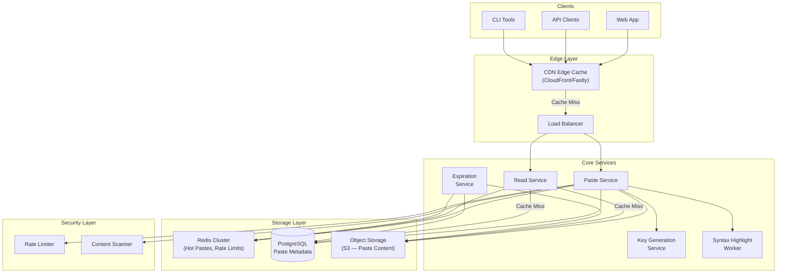
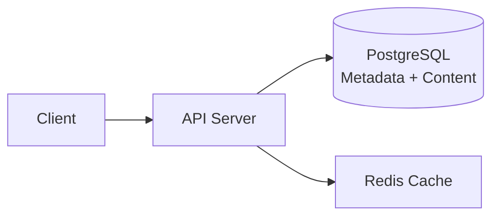
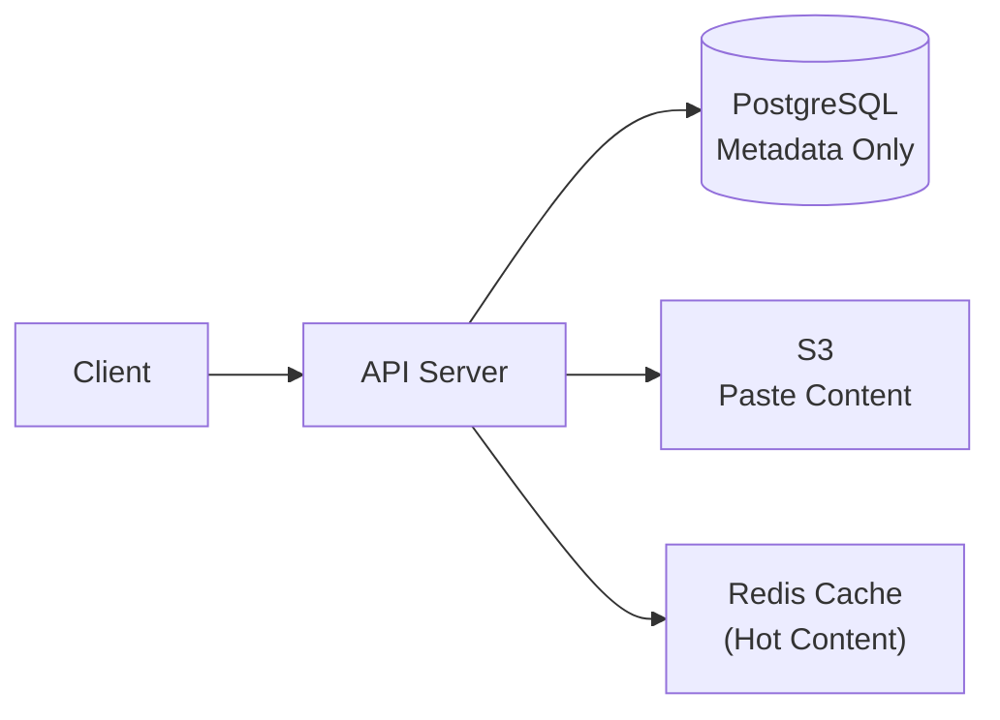
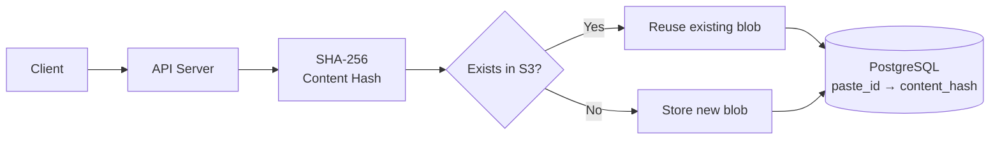
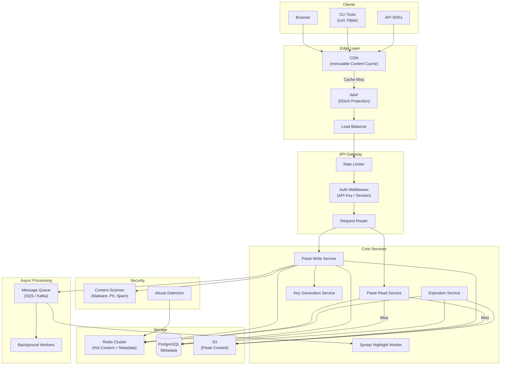
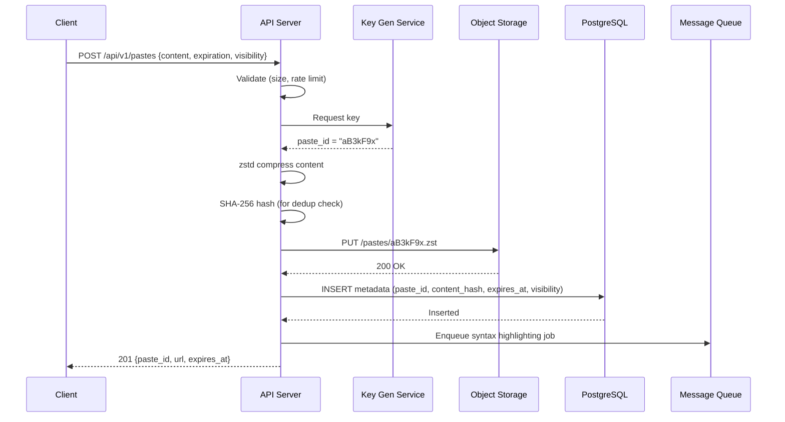
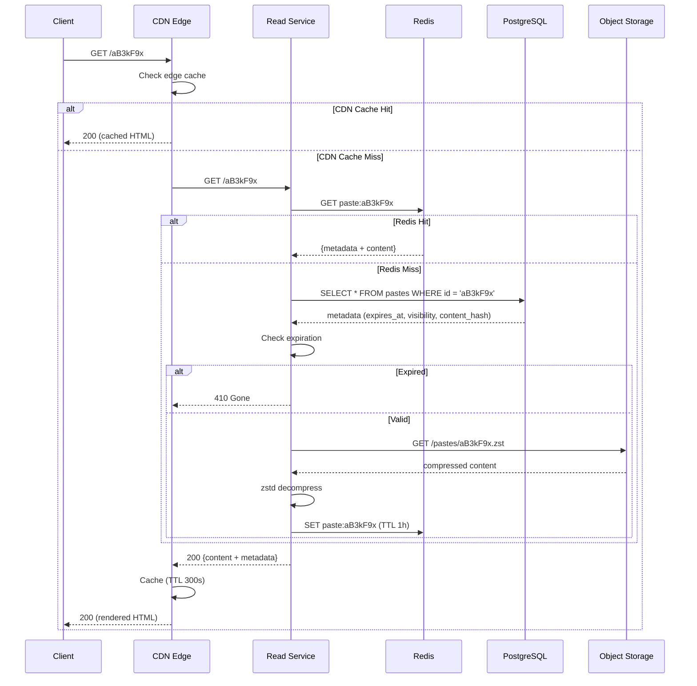
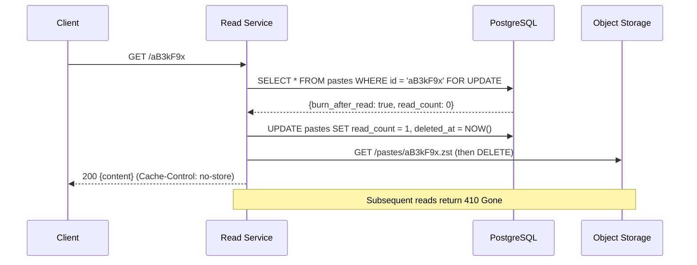
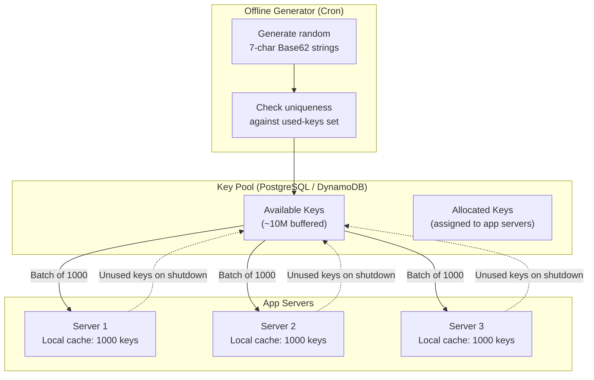
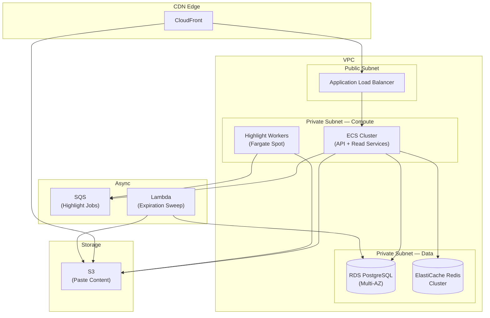

# Design Pastebin: Text Sharing, Expiration, and Abuse Prevention

A comprehensive system design for a text-sharing service like Pastebin covering URL generation strategies, content storage at scale, expiration policies, syntax highlighting, access control, and abuse prevention. This design addresses sub-100ms paste retrieval at 10:1 read-to-write ratio with content deduplication and multi-tier storage tiering.

<figure>



<figcaption>High-level architecture: CDN caches immutable paste content at the edge, core services handle creation and retrieval, object storage holds paste bodies separately from metadata for independent scaling.</figcaption>
</figure>

## Abstract

A paste service maps short unique URLs to text blobs—conceptually simple, but the design space branches around three axes: how you generate collision-free IDs at scale, where you store potentially large text content cost-effectively, and how you handle the lifecycle of ephemeral vs. permanent pastes.

**Core architectural decisions:**

| Decision        | Choice                                                  | Rationale                                                      |
| --------------- | ------------------------------------------------------- | -------------------------------------------------------------- |
| ID generation   | KGS (Key Generation Service) with Base62                | Zero collisions, O(1) key retrieval, decoupled from write path |
| Content storage | Object storage (S3) for bodies, PostgreSQL for metadata | Independent scaling of blobs and queryable metadata            |
| Caching         | Multi-tier (CDN → Redis → S3)                           | Sub-100ms reads globally, pastes are immutable after creation  |
| Compression     | zstd at write time                                      | 60-70% reduction on text; fast decompression for reads         |
| Deduplication   | SHA-256 content hash for internal dedup                 | Saves storage without leaking content existence via URL        |
| Expiration      | Hybrid lazy check + active sweep                        | Correct reads without dedicated cleanup blocking production    |

**Key trade-offs accepted:**

- Object storage adds a network hop vs. inline database storage, but pastes can be multi-MB and S3 scales independently
- KGS pre-generation wastes some keys on server crashes, but guarantees zero write-path collisions
- zstd compression adds CPU at write time but reduces storage cost and CDN egress by 60-70%
- Lazy expiration means expired pastes consume storage until the next sweep, but reads are always correct

**What this design optimizes:**

- Sub-100ms paste retrieval via CDN edge caching of immutable content
- Cost-effective storage with compression + tiering (hot → warm → cold)
- Zero-collision URL generation without write-path coordination
- Graceful abuse prevention without blocking legitimate traffic

## Requirements

### Functional Requirements

| Requirement          | Priority | Notes                                              |
| -------------------- | -------- | -------------------------------------------------- |
| Create paste         | Core     | Accept text content, return unique short URL       |
| Read paste           | Core     | Retrieve paste content by short URL                |
| Paste expiration     | Core     | Time-based (10min to never) and burn-after-read    |
| Syntax highlighting  | Core     | Server-side rendering with language detection      |
| Access control       | Core     | Public, unlisted, private (password-protected)     |
| Raw content endpoint | Core     | Plain-text retrieval for CLI/API consumers         |
| Content size limits  | Extended | Configurable max size (default 512 KB, paid 10 MB) |
| Paste editing        | Extended | Create new version, previous URL remains immutable |
| Paste forking        | Extended | Copy and modify another user's paste               |
| API access           | Extended | RESTful API with key-based auth                    |

### Non-Functional Requirements

| Requirement         | Target                      | Rationale                                             |
| ------------------- | --------------------------- | ----------------------------------------------------- |
| Availability        | 99.9% (3 nines)             | Text sharing is useful but not mission-critical       |
| Read latency        | p99 < 100ms                 | Fast rendering for developer workflows                |
| Write latency       | p99 < 500ms                 | Acceptable for paste creation (compression + storage) |
| Throughput (reads)  | 5K RPS                      | Estimated peak from scale estimation below            |
| Throughput (writes) | 500 RPS                     | Write-light workload                                  |
| Max paste size      | 512 KB (free), 10 MB (paid) | Prevents abuse while supporting real use cases        |
| Data durability     | 99.999999999% (11 nines)    | S3-grade durability for paste content                 |
| Paste URL length    | 7-8 characters              | Short enough for sharing, large enough keyspace       |

### Scale Estimation

**Users and traffic (Pastebin.com-scale reference):**

- Monthly Active Users (MAU): 10M
- Daily Active Users (DAU): 1M (10% of MAU)
- New pastes/day: 500K
- Read-to-write ratio: 10:1 (reads dominate, but not as extreme as URL shorteners)

**Traffic:**

- Reads/day: 500K × 10 = 5M reads/day
- Average read RPS: 5M / 86,400 ≈ 58 RPS
- Peak multiplier (3x): ~174 RPS
- Viral spike (50x single paste): ~3K RPS burst
- Writes: 500K / 86,400 ≈ 6 RPS average, ~18 RPS peak

**Storage:**

- Average paste size: 5 KB (code snippets, logs, config)
- Daily raw content: 500K × 5 KB = 2.5 GB/day
- After zstd compression (~65% reduction): 875 MB/day
- Yearly content: ~320 GB compressed
- 5-year retention: ~1.6 TB compressed content
- Metadata per paste: ~200 bytes (IDs, timestamps, flags)
- Yearly metadata: 500K × 365 × 200B ≈ 36 GB

**Key insight:** Storage is modest even at scale. The real challenges are ID generation without collisions, efficient expiration of hundreds of millions of pastes, and abuse prevention for a service that accepts arbitrary text from the internet.

## Design Paths

### Path A: Monolithic Storage (Database-Only)

**Best when:**

- Small to moderate scale (< 1M pastes)
- Simple operational requirements
- Paste size consistently small (< 10 KB)

**Architecture:**



**Key characteristics:**

- Paste content stored inline in database as `TEXT` column
- Single data store for metadata and content
- Simpler operational model (one system to back up, monitor, scale)

**Trade-offs:**

- ✅ Simplest deployment and operations
- ✅ Transactional consistency between metadata and content
- ✅ No additional network hop for content retrieval
- ❌ Database bloat as paste volume grows (impacts query performance on metadata)
- ❌ Expensive storage (RDS per-GB cost is 10-20x S3)
- ❌ Backup and replication transfer large blobs unnecessarily
- ❌ Cannot independently scale storage and compute

**Real-world example:** dpaste stores content directly in the database via Django ORM. Works well at dpaste's scale but would strain at Pastebin's millions.

### Path B: Split Storage (Metadata DB + Object Storage)

**Best when:**

- Moderate to large scale (1M+ pastes)
- Variable paste sizes (1 KB to 10 MB)
- Cost optimization matters
- Independent scaling of storage and query layers needed

**Architecture:**



**Key characteristics:**

- Metadata (paste_id, created_at, expires_at, visibility, content_hash) in PostgreSQL
- Paste content stored as compressed objects in S3, keyed by paste_id
- Content hash stored in metadata for deduplication lookups
- Redis caches deserialized hot pastes

**Trade-offs:**

- ✅ S3 storage cost is ~$0.023/GB vs. ~$0.115/GB for RDS (5x cheaper)
- ✅ S3 scales to exabytes without provisioning
- ✅ Database stays lean—fast metadata queries, small backups
- ✅ CDN can serve S3 objects directly for raw content
- ❌ Extra network hop on cache miss (API → S3)
- ❌ No transactional consistency between metadata and content writes
- ❌ Two systems to operate

**Real-world example:** GitHub Gists use Git repositories (effectively object storage) for content with a relational layer for metadata and discovery.

### Path C: Content-Addressable Storage

**Best when:**

- High duplication rate (logs, error dumps, config files)
- Storage cost is the dominant concern
- Acceptable to trade write complexity for storage savings

**Architecture:**



**Key characteristics:**

- Content stored by SHA-256 hash, not by paste_id
- Multiple paste_ids can reference the same content blob
- Deduplication is automatic—identical pastes share storage
- Paste URL is a separate opaque ID (not the content hash)

**Trade-offs:**

- ✅ Automatic deduplication (significant savings if many identical pastes)
- ✅ Content integrity verification built-in
- ❌ Deletion complexity: cannot delete a blob until all referencing pastes expire
- ❌ Reference counting adds write-path complexity
- ❌ Content existence leakage if paste URL were the hash (mitigated by using opaque IDs)
- ❌ Negligible savings if duplication rate is low

### Path Comparison

| Factor                    | Monolithic (A)   | Split Storage (B) | Content-Addressable (C) |
| ------------------------- | ---------------- | ----------------- | ----------------------- |
| Operational complexity    | Low              | Medium            | High                    |
| Storage cost at scale     | High             | Low               | Lowest (with dedup)     |
| Read latency (cache miss) | Lowest (one hop) | Medium (two hops) | Medium (two hops)       |
| Write consistency         | ACID             | Eventual          | Eventual                |
| Independent scaling       | No               | Yes               | Yes                     |
| Max practical scale       | ~10M pastes      | Billions          | Billions                |
| Deduplication             | None             | Optional          | Native                  |

### This Article's Focus

This article focuses on **Path B (Split Storage)** with optional content-addressable deduplication because:

1. It matches the scale profile of real paste services (hundreds of millions of pastes)
2. Cost-effective storage is critical when accepting arbitrary content from the internet
3. Split architecture allows CDN to serve raw paste content directly from S3
4. Deduplication can be layered on without architectural changes

## High-Level Design

### Component Overview



### Paste Write Service

Accepts text content, compresses it, stores it in S3, and persists metadata.

**Write flow:**



**Design decisions:**

| Decision            | Choice                       | Rationale                                                                                                |
| ------------------- | ---------------------------- | -------------------------------------------------------------------------------------------------------- |
| Compression         | zstd (level 3) at write time | 65% reduction on text; fast decompression; dictionary support for similar content                        |
| Write ordering      | S3 first, then DB            | If DB write fails, orphaned S3 object is cleaned up by periodic sweep—cheaper than inconsistent metadata |
| Syntax highlighting | Async via queue              | Highlighting large pastes (10 MB) can take seconds; don't block the write response                       |
| Content hash        | SHA-256, stored in metadata  | Enables optional dedup without coupling to content-addressable storage                                   |

### Paste Read Service

The hot path. Retrieves paste content via multi-tier cache.

**Read flow:**



**Critical optimizations:**

- **Immutable content = aggressive caching.** Paste content never changes after creation. CDN can cache with long TTLs; cache invalidation only needed on deletion or expiration.
- **Burn-after-read bypasses all caches.** These pastes are served directly from origin with `Cache-Control: no-store` and atomically deleted after the first read.
- **Bloom filter on Redis** prevents cache stampede for non-existent paste IDs (404s don't hit the database).

### Key Generation Service (KGS)

Pre-generates Base62-encoded 7-character keys for zero-collision paste URL assignment.

**Keyspace math:**

- 7-character Base62: 62^7 = 3.52 trillion possible keys
- At 500K pastes/day: 182.5M pastes/year
- Keyspace exhaustion: ~19,000 years

**Key allocation:**

1. Offline generator produces random 7-character Base62 strings in batches
2. Stored in a dedicated key pool table (or DynamoDB) with `status = 'available'`
3. Each app server fetches a batch of 1,000 keys on startup
4. Keys assigned from local cache—no database round-trip per paste
5. On graceful shutdown, unused keys are returned to the pool

**Failure handling:**

- **App server crash:** Allocated batch (~1,000 keys) is lost. At 3.52 trillion keyspace, this is negligible.
- **KGS unavailable:** App servers have local buffer. Alert at < 100 remaining local keys.
- **Duplicate prevention:** Keys are generated randomly and checked for uniqueness against the used-keys set before entering the pool.

### Expiration Service

Handles time-based paste expiration and burn-after-read.

**Hybrid expiration strategy:**

1. **Lazy check on read:** Every read checks `expires_at` before serving content. Expired pastes return `410 Gone`. This guarantees readers never see expired content.
2. **Active sweep:** A background cron job runs every hour, querying `SELECT id FROM pastes WHERE expires_at < NOW() AND deleted_at IS NULL LIMIT 10000`. Deletes S3 objects and marks metadata as deleted in batches.

**Burn-after-read implementation:**



**Race condition handling:** The `SELECT ... FOR UPDATE` acquires a row-level lock. If two concurrent readers hit the same burn-after-read paste, only the first gets the content; the second sees `deleted_at IS NOT NULL` and receives `410 Gone`. This is the correct behavior—exactly one reader sees the content.

### Content Scanner

Asynchronous scanning for malware signatures, credential dumps, and PII (Personally Identifiable Information) patterns.

**Scanning pipeline:**

1. On paste creation, content hash is checked against a known-bad-content blocklist
2. Regex patterns detect credential dumps (email:password patterns), API keys, and private keys
3. Flagged pastes are quarantined—visible only to the creator until manual review
4. Confirmed malicious content is deleted and the creator's account is flagged

**Rate limiting tiers:**

| Tier                 | Limit               | Scope       |
| -------------------- | ------------------- | ----------- |
| Anonymous            | 10 pastes/hour      | Per IP      |
| Authenticated (free) | 60 pastes/hour      | Per API key |
| Authenticated (paid) | 600 pastes/hour     | Per API key |
| Read (all tiers)     | 300 requests/minute | Per IP      |

## API Design

### Create Paste

**Endpoint:** `POST /api/v1/pastes`

**Request:**

```json
{
  "content": "string (max 512KB / 10MB for paid)",
  "title": "string | null (max 100 chars)",
  "language": "string | null (e.g., 'python', 'json')",
  "expiration": "10m | 1h | 1d | 1w | 1m | 6m | 1y | never | burn_after_read",
  "visibility": "public | unlisted | private",
  "password": "string | null (required if visibility = 'private')"
}
```

**Response (201 Created):**

```json
{
  "id": "aB3kF9x",
  "url": "https://paste.example.com/aB3kF9x",
  "raw_url": "https://paste.example.com/raw/aB3kF9x",
  "title": "My Snippet",
  "language": "python",
  "created_at": "2025-01-15T10:30:00Z",
  "expires_at": "2025-01-22T10:30:00Z",
  "visibility": "unlisted",
  "size_bytes": 2048
}
```

**Error responses:**

- `400 Bad Request` — Content too large, invalid expiration, missing required fields
- `401 Unauthorized` — Invalid or missing API key (for authenticated endpoints)
- `429 Too Many Requests` — Rate limit exceeded. Response includes `Retry-After` header

### Read Paste

**Endpoint:** `GET /api/v1/pastes/{id}`

**Response (200 OK):**

```json
{
  "id": "aB3kF9x",
  "title": "My Snippet",
  "content": "def hello():\n    print('world')",
  "language": "python",
  "highlighted_html": "<pre><code>...</code></pre>",
  "created_at": "2025-01-15T10:30:00Z",
  "expires_at": "2025-01-22T10:30:00Z",
  "visibility": "unlisted",
  "size_bytes": 2048,
  "views": 42
}
```

**Error responses:**

- `404 Not Found` — Paste does not exist
- `410 Gone` — Paste has expired or been burned
- `403 Forbidden` — Private paste, password required (provide via `X-Paste-Password` header)

### Read Raw Content

**Endpoint:** `GET /api/v1/pastes/{id}/raw`

Returns plain text (`Content-Type: text/plain; charset=utf-8`). No JSON wrapping. Designed for `curl`, piping, and CLI tooling.

**Cache headers for raw content:**

```http
Cache-Control: public, max-age=86400, immutable
ETag: "sha256:<content_hash>"
```

For burn-after-read pastes:

```http
Cache-Control: no-store
```

### List User's Pastes

**Endpoint:** `GET /api/v1/users/me/pastes?cursor={cursor}&limit=20`

**Pagination:** Cursor-based using `created_at` timestamp. Offset-based pagination degrades at high page numbers because the database must scan and discard all preceding rows.

**Response (200 OK):**

```json
{
  "pastes": [
    {
      "id": "aB3kF9x",
      "title": "My Snippet",
      "language": "python",
      "created_at": "2025-01-15T10:30:00Z",
      "expires_at": "2025-01-22T10:30:00Z",
      "visibility": "unlisted",
      "size_bytes": 2048,
      "views": 42
    }
  ],
  "next_cursor": "2025-01-14T08:00:00Z",
  "has_more": true
}
```

### Delete Paste

**Endpoint:** `DELETE /api/v1/pastes/{id}`

**Response:** `204 No Content`

Soft-deletes the paste (sets `deleted_at`). S3 object cleanup happens in the background via the expiration service.

## Data Modeling

### Paste Metadata Schema

**Primary store:** PostgreSQL (ACID guarantees for metadata, rich querying for user dashboards and admin tooling)

```sql title="schema.sql" collapse={1-2}
-- Paste metadata (content stored in S3)
-- Indexes designed for the three hot query patterns: by ID, by user, by expiration

CREATE TABLE pastes (
    id          VARCHAR(8) PRIMARY KEY,     -- KGS-generated Base62 key
    user_id     UUID REFERENCES users(id),  -- NULL for anonymous pastes
    title       VARCHAR(100),
    language    VARCHAR(30),                -- Detected or user-specified
    visibility  VARCHAR(10) DEFAULT 'unlisted'
                CHECK (visibility IN ('public', 'unlisted', 'private')),
    password_hash VARCHAR(60),              -- bcrypt hash, NULL if not private

    -- Content metadata (content itself lives in S3)
    content_hash    CHAR(64) NOT NULL,      -- SHA-256 of raw content
    size_bytes      INT NOT NULL,
    compressed_size INT NOT NULL,

    -- Lifecycle
    burn_after_read BOOLEAN DEFAULT FALSE,
    read_count      INT DEFAULT 0,
    expires_at      TIMESTAMPTZ,            -- NULL = never expires
    created_at      TIMESTAMPTZ DEFAULT NOW(),
    deleted_at      TIMESTAMPTZ             -- Soft delete
);

-- Lookup by ID (primary key handles this)

-- User's pastes, newest first (for dashboard)
CREATE INDEX idx_pastes_user
    ON pastes(user_id, created_at DESC)
    WHERE deleted_at IS NULL;

-- Expiration sweep: find expired pastes efficiently
CREATE INDEX idx_pastes_expiry
    ON pastes(expires_at)
    WHERE expires_at IS NOT NULL AND deleted_at IS NULL;

-- Deduplication lookup: find pastes with same content
CREATE INDEX idx_pastes_content_hash
    ON pastes(content_hash);
```

### S3 Object Layout

```
s3://paste-content/
├── pastes/
│   ├── aB3kF9x.zst          # Compressed paste content
│   ├── kL9mP2q.zst
│   └── ...
└── highlighted/
    ├── aB3kF9x.html          # Pre-rendered syntax-highlighted HTML
    └── ...
```

**Object naming:** Using paste_id as the S3 key. The random distribution of Base62 IDs avoids S3 hot-partition issues (S3 partitions by key prefix, and random prefixes distribute evenly).

### Database Selection Matrix

| Data Type           | Store                    | Rationale                                                                             |
| ------------------- | ------------------------ | ------------------------------------------------------------------------------------- |
| Paste metadata      | PostgreSQL               | ACID, complex queries (user dashboards, admin search), partial indexes for expiration |
| Paste content       | S3                       | Unlimited scale, $0.023/GB, 11 nines durability, CDN-friendly                         |
| Highlighted HTML    | S3                       | Large generated content, immutable, cacheable                                         |
| Hot paste cache     | Redis Cluster            | Sub-ms reads, TTL-based eviction, LRU for memory management                           |
| Rate limit counters | Redis                    | Atomic increments, sliding window via sorted sets                                     |
| KGS key pool        | PostgreSQL (or DynamoDB) | Atomic batch allocation with row-level locking                                        |
| User accounts       | PostgreSQL               | Relational data, auth queries                                                         |

### Sharding Strategy

At Pastebin scale (~180M pastes/year), a single PostgreSQL instance handles the metadata comfortably (36 GB/year metadata). Vertical scaling with read replicas is sufficient.

**When to shard:** If metadata exceeds ~500 GB or write throughput exceeds single-node capacity (~10K TPS for PostgreSQL):

- **Shard key:** `paste_id` (hash-based). Distributes uniformly because KGS generates random keys.
- **User-scoped queries:** User dashboard queries (`WHERE user_id = ?`) would span all shards. Mitigate with a denormalized user → paste_ids mapping table or application-level scatter-gather.
- **Expiration sweep:** Each shard runs its own sweep independently.

## Low-Level Design

### URL Generation: Key Generation Service

The KGS is the critical component that decouples ID generation from the write path.

#### Approach Comparison

**Option 1: Auto-increment + Base62**

- Database assigns sequential ID, application Base62-encodes it
- Pros: Simplest, guaranteed unique
- Cons: Single point of failure, sequential = predictable (enumerable), doesn't scale horizontally
- Best when: Single-server deployment

**Option 2: MD5/SHA hash truncation**

- Hash(content + salt), take first 7 Base62 characters
- Pros: Content-derived (same content = same hash if desired), no coordinator
- Cons: Birthday problem—at ~1.4M pastes, collision probability for 7-char Base62 exceeds 0.01%. Collision handling adds write-path latency
- Best when: Deduplication is the primary goal

**Option 3: Snowflake ID + Base62**

- 64-bit Snowflake (timestamp + node + sequence), Base62-encoded
- Pros: Time-ordered, no coordination, 4M IDs/second/node
- Cons: 11-character Base62 output (longer URLs), leaks creation timestamp
- Best when: Time-ordering is valuable, longer URLs acceptable

**Option 4: Pre-generated Key Service (KGS)**

- Offline process generates random 7-character Base62 strings, stores in pool
- Pros: Zero collision, O(1) retrieval, decoupled, predictable key length
- Cons: Requires separate service, wastes keys on crashes
- Best when: Short predictable-length URLs, high write throughput

**Chosen approach:** KGS (Option 4)

**Rationale:** Paste URLs must be short (7 characters) and unpredictable (no enumeration). KGS achieves both while eliminating collision handling from the write path entirely. The keyspace (62^7 = 3.52 trillion) is practically inexhaustible.

#### KGS Implementation Details



**Batch allocation query (PostgreSQL):**

```sql title="allocate_keys.sql"
-- Atomically claim a batch of keys for an app server
WITH batch AS (
    SELECT key FROM key_pool
    WHERE status = 'available'
    LIMIT 1000
    FOR UPDATE SKIP LOCKED
)
UPDATE key_pool
SET status = 'allocated', allocated_to = 'server-1', allocated_at = NOW()
WHERE key IN (SELECT key FROM batch)
RETURNING key;
```

`FOR UPDATE SKIP LOCKED` ensures multiple app servers can fetch key batches concurrently without blocking each other.

### Content Storage and Compression

#### Write Path

1. **Validate content:** Check size against tier limit (512 KB free, 10 MB paid)
2. **Compute SHA-256 hash:** Used for deduplication check and integrity verification
3. **Optional dedup check:** If enabled, check if `content_hash` already exists in S3. If so, skip S3 write and point new paste_id at existing blob.
4. **Compress with zstd:** Level 3 balances compression ratio (~65% on text) with CPU cost. Below 256 bytes, skip compression (overhead exceeds savings).
5. **Upload to S3:** Key = `pastes/{paste_id}.zst`, metadata = `{content_hash, original_size}`
6. **Persist metadata:** Insert into PostgreSQL

#### Read Path

1. **Check Redis:** Full deserialized paste (metadata + decompressed content) cached with TTL
2. **On miss — metadata from PostgreSQL:** Check expiration, visibility, burn-after-read
3. **Content from S3:** Download compressed object, decompress with zstd
4. **Populate Redis:** Cache the decompressed content for subsequent reads

#### Compression Benchmarks on Text Content

| Algorithm        | Ratio (5 KB text) | Compress speed | Decompress speed | Notes                            |
| ---------------- | ----------------- | -------------- | ---------------- | -------------------------------- |
| gzip (level 6)   | 65% reduction     | 150 MB/s       | 400 MB/s         | Universal support                |
| zstd (level 3)   | 67% reduction     | 500 MB/s       | 1,700 MB/s       | Best balance for dynamic content |
| Brotli (level 4) | 70% reduction     | 80 MB/s        | 400 MB/s         | Best ratio, but slow compression |

**Why zstd over Brotli:** Write latency matters for paste creation. zstd at level 3 compresses 6x faster than Brotli at level 4 with only 3% less compression. For a write-path operation, this trade-off strongly favors zstd.

### Syntax Highlighting

#### Async Highlighting Pipeline

Syntax highlighting is CPU-intensive for large pastes. Running it synchronously on the write path would spike p99 write latency.

**Flow:**

1. Paste created → metadata and raw content stored
2. Message enqueued: `{paste_id, language, size_bytes}`
3. Highlight worker dequeues, retrieves raw content from S3
4. Runs highlighting (tree-sitter or Pygments/Chroma depending on language support)
5. Stores rendered HTML to `s3://paste-content/highlighted/{paste_id}.html`
6. Updates metadata: `highlighted_at = NOW()`

**First-read before highlighting completes:** If a user reads a paste before highlighting finishes, the read service returns raw content with client-side highlighting as a fallback (using a JavaScript library like Highlight.js or Shiki). Once the server-rendered HTML is available, subsequent reads serve it directly.

**Language detection:** If the user doesn't specify a language, the worker attempts detection using file extension heuristics, shebang lines, and statistical classifiers (similar to GitHub's Linguist). Fallback: plain text.

## Frontend Considerations

### Performance-Critical Decisions

#### Paste Rendering Strategy

**Problem:** Pastes can be up to 10 MB of text. Rendering this as syntax-highlighted HTML in the browser generates a massive DOM tree (millions of nodes for large files).

**Solution: Virtualized rendering for large pastes**

- Pastes < 100 KB: Render full highlighted HTML (reasonable DOM size)
- Pastes 100 KB–1 MB: Virtual scrolling—only render visible lines plus buffer (~100 lines visible, ~200 rendered)
- Pastes > 1 MB: Show first 1,000 lines with "Load more" or "Download raw" option

**Implementation:**

- Virtual scrolling using a library like `@tanstack/virtual`
- Each "row" is a highlighted line of code
- Line numbers are `position: sticky` for scroll synchronization
- Search within paste uses a web worker to avoid blocking the main thread

#### Data Structure for Paste Viewer

```typescript title="paste-viewer-state.ts" collapse={1-3, 18-25}
// State management for the paste viewer component
// Separates server data from ephemeral UI state

interface PasteViewerState {
  // Server data (from API response)
  paste: {
    id: string
    content: string
    highlightedHtml: string | null // null = highlighting in progress
    language: string
    lineCount: number
  }

  // UI state (ephemeral, not persisted)
  ui: {
    wordWrap: boolean
    showLineNumbers: boolean
    selectedLines: Set<number> // For line range selection (e.g., #L5-L10)
    searchQuery: string
    searchMatches: number[] // Line numbers with matches
    currentMatchIndex: number
  }
}
```

**Why this separation:** Server data is immutable after fetch (paste content never changes). UI state is ephemeral and driven entirely by user interaction. Separating them prevents unnecessary re-renders when toggling UI options.

#### Line Range Selection

Paste services commonly support linking to specific lines (e.g., `paste.example.com/aB3kF9x#L5-L10`).

**Implementation:**

- Parse URL fragment on load to determine initial selection
- Click on line number selects that line, Shift+Click extends selection
- Update URL fragment without triggering navigation (using `history.replaceState`)
- Scroll to selected line on initial load

#### API Response Optimization

**Initial page load returns metadata + content in a single response** (no separate fetch for highlighted HTML):

```json
{
  "id": "aB3kF9x",
  "content": "raw text...",
  "highlighted_html": "<pre>...</pre>",
  "language": "python",
  "line_count": 42
}
```

If `highlighted_html` is `null` (highlighting still in progress), the frontend falls back to client-side highlighting with Shiki or Highlight.js. This avoids a loading spinner for the common case where highlighting completes before the user loads the page.

**Raw content endpoint** (`/raw/aB3kF9x`) returns `text/plain` directly—no JSON parsing overhead for CLI consumers.

## Infrastructure Design

### Cloud-Agnostic Architecture

#### Object Storage

**Concept:** Durable blob storage for paste content

**Requirements:**

- 11 nines durability (cannot lose paste content)
- Low cost per GB (most content is cold)
- CDN integration for direct edge serving
- Lifecycle policies for storage tiering

**Open-source options:**

- MinIO — S3-compatible, self-hosted, battle-tested
- Ceph RADOS Gateway — S3-compatible, complex operations

**Managed options:**

- AWS S3, GCS (Google Cloud Storage), Azure Blob Storage

#### Cache Layer

**Concept:** In-memory cache for hot paste content

**Requirements:**

- Sub-millisecond reads
- TTL-based eviction
- LRU eviction when memory is full
- Cluster mode for horizontal scaling

**Options:**

- Redis Cluster — Rich data structures, Lua scripting for atomic operations
- Memcached — Simpler, multi-threaded, no persistence
- KeyDB — Redis-compatible, multi-threaded

#### Message Queue

**Concept:** Async job processing for syntax highlighting and expiration cleanup

**Requirements:**

- At-least-once delivery
- Dead letter queue for failed jobs
- Visibility timeout (prevent duplicate processing)

**Options:**

- Redis Streams — Simple, good for moderate throughput
- RabbitMQ — Feature-rich, moderate scale
- Apache Kafka — High throughput, overkill for this use case unless analytics pipeline is added

### AWS Reference Architecture

#### Compute

| Component         | Service              | Configuration                               |
| ----------------- | -------------------- | ------------------------------------------- |
| API servers       | ECS Fargate          | Auto-scaling 2-20 tasks, 1 vCPU / 2 GB each |
| Highlight workers | ECS Fargate (Spot)   | Cost-optimized, tolerant of interruption    |
| Expiration cron   | EventBridge + Lambda | Hourly trigger, 15-min timeout              |
| KGS generator     | Lambda (scheduled)   | Daily batch generation                      |

#### Data Stores

| Data           | Service                      | Rationale                               |
| -------------- | ---------------------------- | --------------------------------------- |
| Paste metadata | RDS PostgreSQL (Multi-AZ)    | ACID, managed backups, read replicas    |
| Paste content  | S3 Standard                  | Durability, cost, CDN integration       |
| Warm content   | S3 Infrequent Access         | 40% cheaper, min 30-day retention       |
| Cold content   | S3 Glacier Instant Retrieval | 68% cheaper than Standard, ms retrieval |
| Hot cache      | ElastiCache Redis Cluster    | Sub-ms reads, 3 shards                  |
| Rate limits    | ElastiCache Redis            | Atomic counters, sorted sets            |

#### Storage Tiering with S3 Lifecycle

```json title="s3-lifecycle-policy.json" collapse={1-2, 21-22}
{
  "Rules": [
    {
      "ID": "paste-content-tiering",
      "Status": "Enabled",
      "Filter": { "Prefix": "pastes/" },
      "Transitions": [
        {
          "Days": 30,
          "StorageClass": "STANDARD_IA"
        },
        {
          "Days": 90,
          "StorageClass": "GLACIER_IR"
        }
      ],
      "Expiration": {
        "Days": 1825
      }
    }
  ]
}
```

**Cost impact at 1.6 TB (5-year accumulated):**

| Tier                      | Data Volume | Monthly Cost     |
| ------------------------- | ----------- | ---------------- |
| S3 Standard (< 30 days)   | ~26 GB      | $0.60            |
| S3 IA (30-90 days)        | ~52 GB      | $0.65            |
| S3 Glacier IR (> 90 days) | ~1.5 TB     | $6.00            |
| **Total**                 | **1.6 TB**  | **~$7.25/month** |

Storage cost is negligible. The dominant cost is compute (API servers) and Redis.

#### Self-Hosted Alternatives

| Managed Service | Self-Hosted Option   | When to self-host                                     |
| --------------- | -------------------- | ----------------------------------------------------- |
| RDS PostgreSQL  | PostgreSQL on EC2    | Cost at scale, specific extensions (e.g., pg_partman) |
| ElastiCache     | Redis on EC2         | Specific Redis modules, cost optimization             |
| S3              | MinIO on EC2         | Multi-cloud portability, data sovereignty             |
| ECS Fargate     | Kubernetes (EKS/k3s) | Existing K8s expertise, multi-cloud                   |

### Production Deployment



## Variations

### Encrypted Pastes (PrivateBin Model)

For maximum privacy, client-side encryption ensures the server never sees plaintext:

1. Browser generates a random 256-bit AES-GCM (Advanced Encryption Standard, Galois/Counter Mode) key
2. Content is compressed (zlib), then encrypted client-side
3. Encrypted blob is sent to the server
4. Decryption key is placed in the URL fragment (`#key=...`), which browsers never send to the server
5. On read, the browser fetches the encrypted blob and decrypts locally

**Trade-offs:**

- ✅ True zero-knowledge: server cannot read paste content even under subpoena
- ❌ No server-side syntax highlighting (server cannot read content)
- ❌ No server-side search or content scanning
- ❌ URL is much longer (paste_id + encryption key)
- ❌ Key loss = permanent content loss

PrivateBin implements this model with AES-256-GCM encryption, PBKDF2-HMAC-SHA256 key derivation (100K iterations), and Base58-encoded keys in the URL fragment.

### Multi-File Pastes (GitHub Gists Model)

GitHub Gists extend the paste concept by backing each gist with a full Git repository:

- Each gist is a bare Git repo on disk
- Supports multiple files, full revision history, forking, and cloning
- URLs use hexadecimal IDs (Git-style)
- Discovery layer (starring, search) is a separate relational service

**Trade-off:** Dramatically more storage and compute per paste (Git object overhead), but enables collaboration workflows that simple paste services cannot.

## Conclusion

Pastebin's design centers on three decisions that cascade through the architecture:

1. **Split storage (PostgreSQL metadata + S3 content)** enables independent scaling, cost-effective tiering, and CDN-friendly raw content serving. The extra network hop on cache miss is justified by 5x storage cost reduction and operational simplicity.

2. **KGS for URL generation** eliminates collision handling from the write path entirely. The 3.52 trillion keyspace (7-char Base62) is practically inexhaustible, and batch allocation to app servers removes per-request coordination.

3. **Hybrid expiration (lazy read check + active sweep)** guarantees readers never see expired content while reclaiming storage in the background. Burn-after-read requires row-level locking for atomicity but stays off the hot read path.

**What this design sacrifices:**

- Write-path latency includes compression + S3 upload (~100-200ms added vs. database-only)
- Syntax highlighting is eventually consistent (async), requiring client-side fallback
- Burn-after-read pastes cannot use CDN caching

**Future improvements worth considering:**

- Content-addressable storage for automatic deduplication (Path C) if duplication rate exceeds 10%
- WebSocket-based collaborative editing for real-time multi-user pastes
- Differential compression (zstd dictionaries trained on common paste types) for further storage reduction

## Appendix

### Prerequisites

- Distributed storage concepts (object stores, caching tiers)
- Database indexing strategies (partial indexes, covering indexes)
- HTTP caching semantics (`Cache-Control`, `ETag`, immutable resources)
- Basic cryptographic hashing (SHA-256, collision resistance)

### Terminology

| Term            | Definition                                                                                           |
| --------------- | ---------------------------------------------------------------------------------------------------- |
| KGS             | Key Generation Service — pre-generates unique short codes offline                                    |
| Base62          | Encoding using `[A-Za-z0-9]` (62 characters), producing URL-safe strings                             |
| Burn-after-read | Paste that self-destructs after a single read                                                        |
| CAS             | Content-Addressable Storage — storage where the key is derived from the content's cryptographic hash |
| zstd            | Zstandard — Facebook-developed compression algorithm balancing ratio and speed                       |
| PII             | Personally Identifiable Information — data that can identify an individual                           |

### Summary

- **Split storage architecture:** PostgreSQL for metadata (36 GB/year), S3 for content (320 GB/year compressed). Independent scaling, 5x storage cost reduction vs. database-only.
- **KGS with Base62 7-character keys:** 3.52 trillion keyspace, zero write-path collisions, batch allocation eliminates per-request coordination.
- **Multi-tier caching (CDN → Redis → S3):** Immutable paste content enables aggressive caching. Sub-100ms reads globally.
- **Hybrid expiration strategy:** Lazy read checks guarantee correctness; hourly active sweeps reclaim storage. Burn-after-read uses row-level locking for atomicity.
- **zstd compression at write time:** 65-67% reduction on text content, 6x faster than Brotli at comparable ratios.
- **Async syntax highlighting:** CPU-intensive work decoupled from write path; client-side fallback until server rendering completes.

### References

- [Pastebin.com](https://pastebin.com) — Original paste service (2002), PHP + MySQL, burn-after-read since 2020
- [GitHub Gists](https://docs.github.com/en/get-started/writing-on-github/editing-and-sharing-content-with-gists) — Git-backed paste service with revision history and forking
- [PrivateBin](https://github.com/PrivateBin/PrivateBin) — Zero-knowledge paste service, AES-256-GCM client-side encryption
- [dpaste](https://docs.dpaste.org) — Django-based paste service, collision-handling slug generation
- [Haste-server](https://github.com/SparkUniverse/haste-server) — Node.js paste service with pluggable storage backends
- [RFC 8878 — Zstandard Compression](https://datatracker.ietf.org/doc/html/rfc8878) — IETF specification for zstd data format
- [Twitter Snowflake](https://github.com/twitter-archive/snowflake) — Distributed ID generation (archived)
- [AWS S3 Storage Classes](https://aws.amazon.com/s3/storage-classes/) — Tiered storage pricing and access patterns
- [System Design Primer — Pastebin](https://github.com/donnemartin/system-design-primer/blob/master/solutions/system_design/pastebin/README.md) — Reference design with scale estimation
