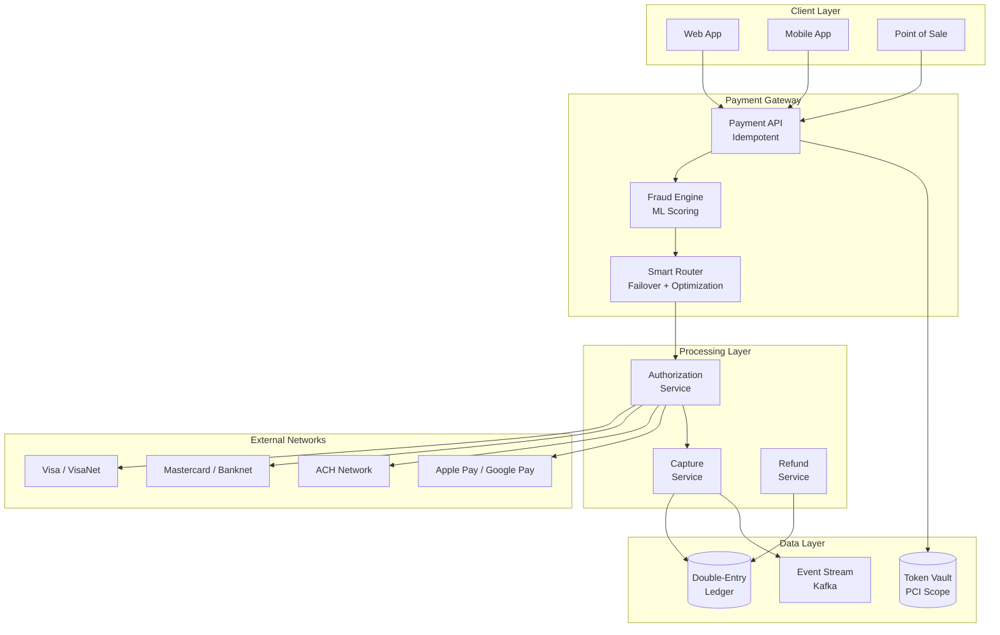
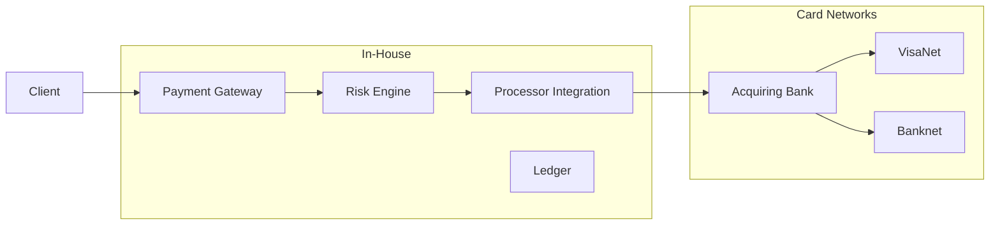
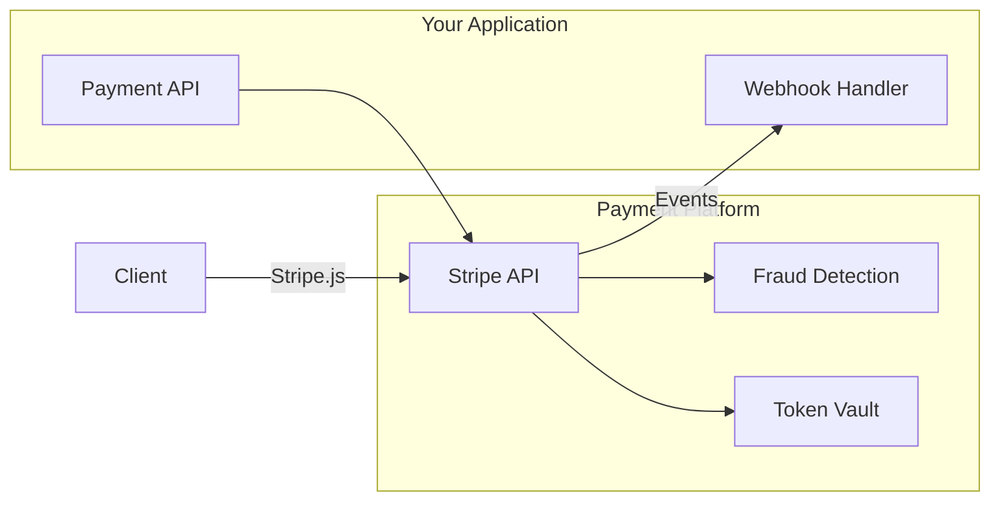
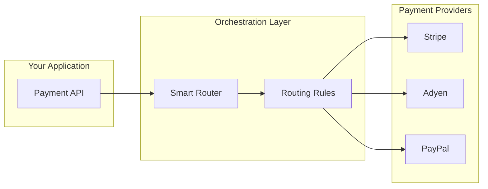
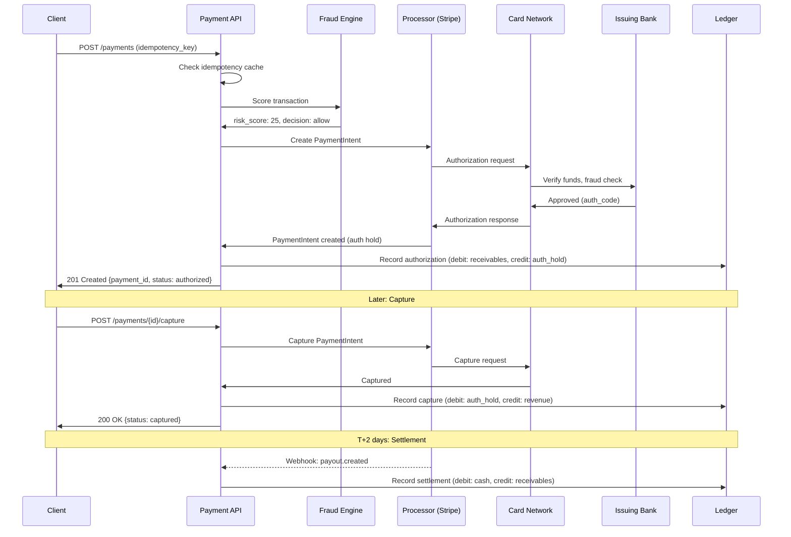
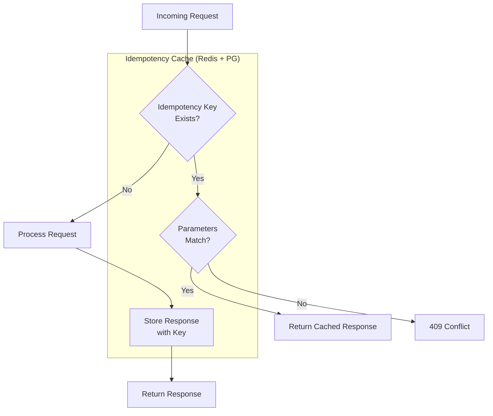
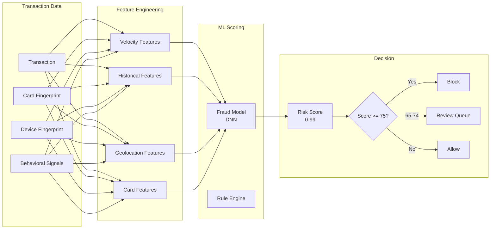
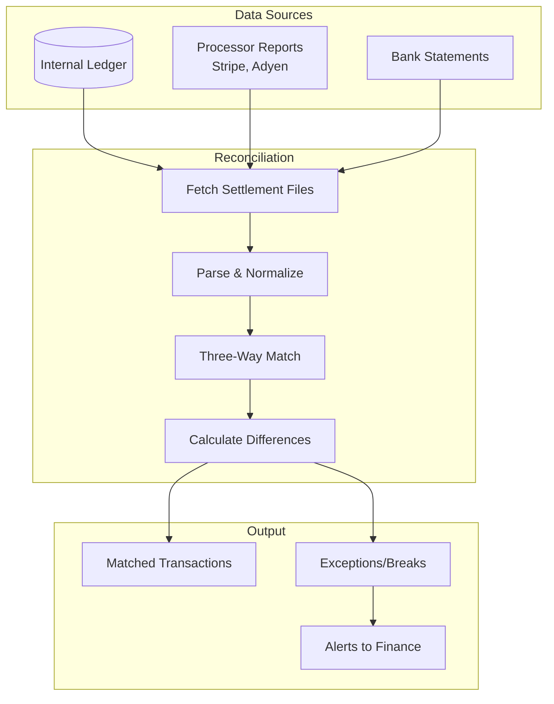
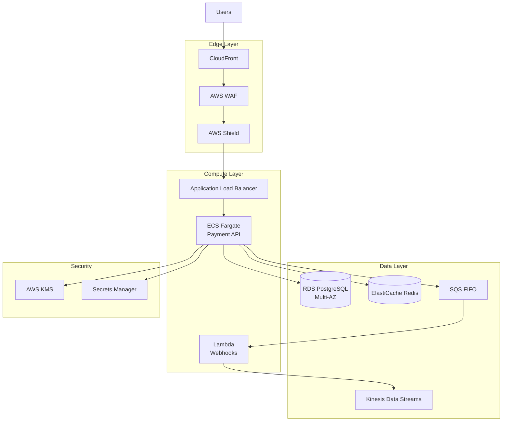

# Design a Payment System

Building a payment processing platform that handles card transactions, bank transfers, and digital wallets with PCI DSS compliance, idempotent processing, and real-time fraud detection. Payment systems operate under unique constraints: zero tolerance for duplicate charges, regulatory mandates (PCI DSS), and sub-second fraud decisions. This design covers the complete payment lifecycle—authorization, capture, settlement—plus reconciliation, refunds, and multi-gateway routing.

<figure>



<figcaption>Payment system architecture: Client apps submit payments through an idempotent API, fraud engine scores in real-time, smart router selects optimal processor, authorization flows through card networks, and all movements are recorded in a double-entry ledger.</figcaption>
</figure>

## Abstract

Payment system design revolves around four competing constraints:

1. **Exactly-once processing** — Network failures and retries must never result in duplicate charges. Idempotency keys + request fingerprinting make every operation safely retriable.

2. **PCI compliance scope reduction** — Cardholder data (PAN, CVV) must never touch your servers if avoidable. Tokenization at the edge (via Stripe Elements, Adyen Web Components) keeps sensitive data out of your environment.

3. **Latency under fraud scrutiny** — Fraud decisions must complete in <100ms to avoid checkout abandonment, while evaluating 1000+ signals per transaction.

4. **Financial accuracy** — Every fund movement (authorization hold, capture, refund, chargeback) must be recorded in a double-entry ledger. Reconciliation ensures external settlements match internal records.

The mental model: **tokenize → authorize → capture → settle → reconcile**. Each stage has distinct timing, failure modes, and rollback procedures.

| Design Decision     | Trade-off                                               |
| ------------------- | ------------------------------------------------------- |
| Edge tokenization   | Removes PAN from scope; adds client SDK complexity      |
| Idempotency keys    | Safe retries; requires key management and storage       |
| Smart routing       | Higher auth rates; multi-processor operational overhead |
| Async settlement    | Handles scale; delayed confirmation visibility          |
| Double-entry ledger | Audit-ready; write amplification                        |

## Requirements

### Functional Requirements

| Feature                 | Scope    | Notes                                    |
| ----------------------- | -------- | ---------------------------------------- |
| Card payments           | Core     | Visa, Mastercard, Amex via card networks |
| Bank transfers          | Core     | ACH (US), SEPA (EU), wire transfers      |
| Digital wallets         | Core     | Apple Pay, Google Pay (tokenized)        |
| Authorization + Capture | Core     | Separate or combined (auth-capture)      |
| Refunds                 | Core     | Full and partial, with reason codes      |
| Recurring payments      | Core     | Subscription billing with retry logic    |
| Multi-currency          | Extended | FX conversion at capture time            |
| Split payments          | Extended | Marketplace payouts                      |
| Disputes/Chargebacks    | Extended | Evidence submission, representment       |
| 3D Secure               | Core     | SCA compliance for EU/PSD2               |

### Non-Functional Requirements

| Requirement            | Target      | Rationale                                        |
| ---------------------- | ----------- | ------------------------------------------------ |
| Availability           | 99.99%      | Revenue-critical; Stripe maintains 99.999%       |
| Authorization latency  | p99 < 2s    | Card network round-trip + fraud scoring          |
| Fraud decision latency | p99 < 100ms | Inline with authorization; cannot delay checkout |
| Duplicate charge rate  | 0%          | Non-negotiable; idempotency required             |
| Data consistency       | Strong      | Financial data requires ACID guarantees          |
| PCI DSS compliance     | Level 1     | Required for >6M transactions/year               |
| Settlement accuracy    | 100%        | Reconciliation must match external records       |

### Scale Estimation

**Traffic Profile:**

| Metric            | Typical   | Peak (Black Friday) |
| ----------------- | --------- | ------------------- |
| Transactions/day  | 10M       | 50M                 |
| TPS (average)     | 115 TPS   | 580 TPS             |
| TPS (peak)        | 500 TPS   | 2,000 TPS           |
| Auth requests/sec | 1,000 RPS | 5,000 RPS           |

**Reference: Visa processes 1,700-8,500 TPS average, with peak capacity of 65,000+ TPS.**

**Storage:**

```
Transactions: 10M/day × 2KB = 20GB/day
Yearly: 7.3TB
With 7-year retention: ~50TB

Ledger entries: 10M × 4 entries (avg) × 500B = 20GB/day
Event stream: 10M × 1KB = 10GB/day
```

**Latency Budget:**

```
Total authorization: 2000ms budget
├── API processing: 50ms
├── Fraud scoring: 100ms
├── Tokenization lookup: 20ms
├── Network to processor: 50ms
├── Processor to card network: 500ms
├── Issuer decision: 800ms
├── Response path: 480ms
```

## Design Paths

### Path A: Integrated Payment Gateway (Build In-House)

**Best when:**

- High transaction volume (>$1B annually)—interchange savings justify engineering cost
- Regulatory requirements demand data residency
- Unique payment flows that don't fit third-party APIs

**Architecture:**



**Key characteristics:**

- Direct acquiring bank relationships
- Full control over routing decisions
- In-house tokenization and vault
- Custom fraud rules and ML models

**Trade-offs:**

- ✅ Lower per-transaction cost at scale (save 0.1-0.3%)
- ✅ Full customization of payment flows
- ✅ Data residency control
- ❌ PCI DSS Level 1 scope (audit, penetration testing, quarterly scans)
- ❌ 12-18 month build time minimum
- ❌ Requires dedicated security and compliance team

**Real-world example:** Shopify built Shop Pay in-house, processing $12B+ in GMV (2023). Justified by volume and unique merchant financing features. Required dedicated payments engineering team of 50+.

### Path B: Third-Party Payment Platform (Stripe, Adyen)

**Best when:**

- Speed to market is critical
- Transaction volume <$500M annually
- Engineering focus should be on product, not payments infrastructure

**Architecture:**



**Key characteristics:**

- PCI scope reduced to SAQ-A (minimal questionnaire)
- Built-in fraud detection (Stripe Radar)
- Payment method coverage (cards, wallets, BNPL)
- Automatic card network compliance updates

**Trade-offs:**

- ✅ Days to integrate, not months
- ✅ PCI compliance handled by provider
- ✅ Built-in fraud detection
- ✅ Global payment method coverage
- ❌ Higher per-transaction fees (2.9% + $0.30 typical)
- ❌ Less control over routing and failover
- ❌ Vendor lock-in risk

**Real-world example:** Figma uses Stripe for all payments. At their scale (~$600M ARR), the 2.9% fee is acceptable given engineering leverage—zero payment engineers needed on staff.

### Path C: Hybrid with Payment Orchestration

**Best when:**

- Multiple payment providers needed (regional coverage, redundancy)
- Authorization rate optimization is critical
- Gradual migration from one provider to another

**Architecture:**



**Key characteristics:**

- Single API, multiple backend processors
- Intelligent routing based on card type, geography, cost
- Automatic failover on processor outage
- A/B testing payment flows

**Trade-offs:**

- ✅ Redundancy and failover
- ✅ Route optimization (Adyen reports 26% cost savings with smart routing)
- ✅ Gradual provider migration
- ❌ Additional integration layer complexity
- ❌ Token portability challenges between providers
- ❌ Orchestration platform cost

**Real-world example:** eBay uses Adyen's intelligent payment routing, achieving 26% average cost savings on US debit transactions and 0.22% uplift in authorization rates.

### Path Comparison

| Factor               | Path A (Build)            | Path B (Third-Party) | Path C (Orchestration)   |
| -------------------- | ------------------------- | -------------------- | ------------------------ |
| Time to market       | 12-18 months              | Days-weeks           | 1-3 months               |
| PCI scope            | Level 1 (full)            | SAQ-A (minimal)      | SAQ-A (minimal)          |
| Per-transaction cost | Lowest at scale           | Highest (2.9%+)      | Middle                   |
| Engineering effort   | High (50+ FTEs)           | Low (1-2 FTEs)       | Medium (5-10 FTEs)       |
| Customization        | Full                      | Limited              | Medium                   |
| Best for             | High-volume, unique needs | Startups, SMBs       | Enterprise, multi-region |

### This Article's Focus

This article focuses on **Path B (Third-Party) with elements of Path C (Smart Routing)** because:

1. Most engineering teams should not build payment infrastructure
2. Third-party platforms handle PCI compliance, fraud, and card network changes
3. Smart routing concepts apply regardless of implementation

The architecture sections show how to integrate third-party providers while maintaining control over critical concerns like idempotency, reconciliation, and ledger accuracy.

## High-Level Design

### Component Overview

| Component              | Responsibility                | Technology                       |
| ---------------------- | ----------------------------- | -------------------------------- |
| Payment API            | Idempotent payment operations | REST API + Idempotency keys      |
| Token Service          | Map payment methods to tokens | Stripe.js / Adyen Web Components |
| Smart Router           | Select optimal processor      | Rule engine + ML routing         |
| Fraud Engine           | Real-time risk scoring        | ML model (Stripe Radar)          |
| Authorization Service  | Card network communication    | Processor SDK                    |
| Capture Service        | Settlement initiation         | Async job processor              |
| Ledger Service         | Double-entry bookkeeping      | PostgreSQL + event sourcing      |
| Reconciliation Service | Match internal vs external    | Batch jobs + anomaly detection   |
| Webhook Handler        | Process async events          | Idempotent consumer              |

### Payment Lifecycle



### Authorization vs Capture Timing

| Pattern                   | Use Case                        | Auth Window                     |
| ------------------------- | ------------------------------- | ------------------------------- |
| Auth + immediate capture  | Digital goods, subscriptions    | N/A (single request)            |
| Auth then capture         | E-commerce (ship then charge)   | 7 days (Visa), 30 days (others) |
| Auth with delayed capture | Hotels, car rentals             | Up to 31 days                   |
| Incremental auth          | Hotels (room service additions) | Within original auth window     |

**Design note:** Visa shortened online Merchant-Initiated Transaction (MIT) windows from 7 to 5 days as of April 2024. Always capture within the network's window or risk auth expiration.

## API Design

### Create Payment

```http
POST /api/v1/payments
Idempotency-Key: pay_abc123_user_456
Authorization: Bearer {api_key}
Content-Type: application/json

{
  "amount": 9999,
  "currency": "usd",
  "payment_method_token": "pm_tok_visa_4242",
  "capture_method": "automatic",
  "description": "Order #12345",
  "metadata": {
    "order_id": "ord_789",
    "customer_email": "user@example.com"
  },
  "idempotency_key": "pay_abc123_user_456"
}
```

**Response (201 Created):**

```json
{
  "id": "pay_xyz789",
  "object": "payment",
  "amount": 9999,
  "currency": "usd",
  "status": "succeeded",
  "payment_method": {
    "id": "pm_tok_visa_4242",
    "type": "card",
    "card": {
      "brand": "visa",
      "last4": "4242",
      "exp_month": 12,
      "exp_year": 2025
    }
  },
  "captured": true,
  "receipt_url": "https://pay.example.com/receipts/pay_xyz789",
  "created_at": "2024-03-15T10:00:00Z",
  "metadata": {
    "order_id": "ord_789"
  }
}
```

**Error Responses:**

| Code                    | Condition                                    | Response                                                                     |
| ----------------------- | -------------------------------------------- | ---------------------------------------------------------------------------- |
| `400 Bad Request`       | Invalid amount, currency                     | `{"error": {"code": "invalid_amount"}}`                                      |
| `402 Payment Required`  | Card declined                                | `{"error": {"code": "card_declined", "decline_code": "insufficient_funds"}}` |
| `409 Conflict`          | Idempotency key reused with different params | `{"error": {"code": "idempotency_conflict"}}`                                |
| `429 Too Many Requests` | Rate limit exceeded                          | `{"error": {"code": "rate_limited"}}`                                        |

### Authorize Only (Separate Capture)

```http
POST /api/v1/payments
Idempotency-Key: auth_abc123

{
  "amount": 9999,
  "currency": "usd",
  "payment_method_token": "pm_tok_visa_4242",
  "capture_method": "manual"
}
```

**Response:**

```json
{
  "id": "pay_xyz789",
  "status": "requires_capture",
  "amount_capturable": 9999,
  "capture_before": "2024-03-22T10:00:00Z"
}
```

### Capture Payment

```http
POST /api/v1/payments/{payment_id}/capture
Idempotency-Key: cap_abc123

{
  "amount_to_capture": 9999
}
```

**Partial capture:** Capture less than authorized amount. Remaining authorization is automatically released.

### Refund Payment

```http
POST /api/v1/payments/{payment_id}/refunds
Idempotency-Key: ref_abc123

{
  "amount": 2500,
  "reason": "customer_request",
  "metadata": {
    "support_ticket": "TKT-456"
  }
}
```

**Response:**

```json
{
  "id": "ref_abc456",
  "payment_id": "pay_xyz789",
  "amount": 2500,
  "status": "pending",
  "reason": "customer_request",
  "estimated_arrival": "2024-03-20"
}
```

**Refund timing:** Card refunds take 5-10 business days to appear on customer statement. ACH refunds take 3-5 business days.

### Webhook Events

```http
POST /webhooks/payments
Stripe-Signature: t=1234567890,v1=abc123...

{
  "id": "evt_123",
  "type": "payment_intent.succeeded",
  "data": {
    "object": {
      "id": "pi_xyz",
      "amount": 9999,
      "status": "succeeded"
    }
  },
  "created": 1234567890
}
```

**Critical webhook events:**

| Event                           | Action Required                         |
| ------------------------------- | --------------------------------------- |
| `payment_intent.succeeded`      | Mark order as paid, trigger fulfillment |
| `payment_intent.payment_failed` | Notify customer, retry logic            |
| `charge.refunded`               | Update order status, adjust inventory   |
| `charge.dispute.created`        | Alert fraud team, gather evidence       |
| `payout.paid`                   | Reconcile settlement                    |

## Data Modeling

### Payment Schema (PostgreSQL)

```sql collapse={1-5, 45-55}
-- Core payment record
CREATE TABLE payments (
    id UUID PRIMARY KEY DEFAULT gen_random_uuid(),
    external_id VARCHAR(100) UNIQUE NOT NULL,
    idempotency_key VARCHAR(255) UNIQUE NOT NULL,

    -- Amount
    amount_cents BIGINT NOT NULL CHECK (amount_cents > 0),
    currency VARCHAR(3) NOT NULL,
    amount_captured_cents BIGINT DEFAULT 0,
    amount_refunded_cents BIGINT DEFAULT 0,

    -- Status
    status VARCHAR(30) NOT NULL DEFAULT 'pending',
    capture_method VARCHAR(20) NOT NULL,

    -- Payment method (tokenized reference)
    payment_method_id UUID REFERENCES payment_methods(id),
    payment_method_type VARCHAR(20) NOT NULL,

    -- Customer
    customer_id UUID REFERENCES customers(id),

    -- Processor details
    processor VARCHAR(30) NOT NULL,
    processor_payment_id VARCHAR(100),
    auth_code VARCHAR(20),
    decline_code VARCHAR(50),

    -- Risk
    risk_score INTEGER,
    risk_level VARCHAR(20),

    -- Metadata
    description TEXT,
    metadata JSONB DEFAULT '{}',

    -- Timestamps
    created_at TIMESTAMPTZ DEFAULT NOW(),
    authorized_at TIMESTAMPTZ,
    captured_at TIMESTAMPTZ,
    canceled_at TIMESTAMPTZ,

    -- Constraints
    CONSTRAINT valid_status CHECK (status IN (
        'pending', 'requires_action', 'requires_capture',
        'processing', 'succeeded', 'failed', 'canceled'
    ))
);

-- Indexes for common queries
CREATE INDEX idx_payments_customer ON payments(customer_id, created_at DESC);
CREATE INDEX idx_payments_status ON payments(status, created_at DESC);
CREATE INDEX idx_payments_processor ON payments(processor_payment_id);
CREATE INDEX idx_payments_idempotency ON payments(idempotency_key);
```

### Double-Entry Ledger Schema

```sql
-- Accounts in the chart of accounts
CREATE TABLE accounts (
    id UUID PRIMARY KEY DEFAULT gen_random_uuid(),
    code VARCHAR(20) UNIQUE NOT NULL,
    name VARCHAR(100) NOT NULL,
    type VARCHAR(20) NOT NULL,  -- asset, liability, revenue, expense
    currency VARCHAR(3) NOT NULL,
    is_active BOOLEAN DEFAULT true
);

-- Ledger entries (immutable)
CREATE TABLE ledger_entries (
    id UUID PRIMARY KEY DEFAULT gen_random_uuid(),
    transaction_id UUID NOT NULL,
    account_id UUID NOT NULL REFERENCES accounts(id),
    entry_type VARCHAR(10) NOT NULL,  -- debit or credit
    amount_cents BIGINT NOT NULL CHECK (amount_cents > 0),
    currency VARCHAR(3) NOT NULL,
    description TEXT,
    metadata JSONB DEFAULT '{}',
    created_at TIMESTAMPTZ DEFAULT NOW(),

    -- Reference to source
    payment_id UUID REFERENCES payments(id),
    refund_id UUID REFERENCES refunds(id),
    payout_id UUID REFERENCES payouts(id)
);

CREATE INDEX idx_ledger_transaction ON ledger_entries(transaction_id);
CREATE INDEX idx_ledger_account ON ledger_entries(account_id, created_at DESC);
CREATE INDEX idx_ledger_payment ON ledger_entries(payment_id);
```

### Ledger Entry Examples

**Authorization (hold funds):**

```
Transaction: AUTH-001
├── DEBIT  accounts_receivable  $100.00
└── CREDIT authorization_hold   $100.00
```

**Capture (recognize revenue):**

```
Transaction: CAP-001
├── DEBIT  authorization_hold   $100.00
└── CREDIT revenue              $100.00
```

**Settlement (receive cash):**

```
Transaction: SET-001
├── DEBIT  cash                 $97.10  (after fees)
├── DEBIT  processing_fees      $2.90
└── CREDIT accounts_receivable  $100.00
```

**Refund:**

```
Transaction: REF-001
├── DEBIT  revenue              $50.00
└── CREDIT accounts_receivable  $50.00
```

### Token Vault Schema

```sql
-- Minimal schema for tokenized payment methods
-- Actual PAN/CVV stored in PCI-compliant vault (Stripe, external)
CREATE TABLE payment_methods (
    id UUID PRIMARY KEY DEFAULT gen_random_uuid(),
    customer_id UUID NOT NULL REFERENCES customers(id),
    processor VARCHAR(30) NOT NULL,
    processor_token VARCHAR(100) NOT NULL,  -- Stripe pm_xxx

    -- Non-sensitive metadata
    type VARCHAR(20) NOT NULL,  -- card, bank_account, wallet
    card_brand VARCHAR(20),     -- visa, mastercard, amex
    card_last4 VARCHAR(4),
    card_exp_month INTEGER,
    card_exp_year INTEGER,
    card_funding VARCHAR(20),   -- credit, debit, prepaid

    -- Billing
    billing_name VARCHAR(100),
    billing_country VARCHAR(2),
    billing_postal_code VARCHAR(20),

    -- Status
    is_default BOOLEAN DEFAULT false,
    is_active BOOLEAN DEFAULT true,

    created_at TIMESTAMPTZ DEFAULT NOW(),
    updated_at TIMESTAMPTZ DEFAULT NOW(),

    UNIQUE(customer_id, processor_token)
);
```

**PCI scope note:** This schema stores only tokens and non-sensitive metadata. The actual card numbers (PAN) are stored by Stripe/Adyen in their PCI-compliant vaults. Your database never sees or stores raw card data.

### Database Selection Matrix

| Data                     | Store              | Rationale                                 |
| ------------------------ | ------------------ | ----------------------------------------- |
| Payments                 | PostgreSQL         | ACID, complex queries, audit requirements |
| Ledger entries           | PostgreSQL         | Strong consistency, immutable append-only |
| Idempotency keys         | Redis + PostgreSQL | Fast lookup (Redis), durable record (PG)  |
| Payment method tokens    | PostgreSQL         | Referential integrity with customers      |
| Event stream             | Kafka              | High throughput, replay capability        |
| Reconciliation snapshots | S3 + Parquet       | Cost-effective analytics storage          |
| Rate limiting            | Redis              | Sub-ms counters                           |

## Low-Level Design

### Idempotency Implementation

Idempotency prevents duplicate charges when clients retry failed requests. Stripe's implementation serves as the industry reference.

**Request flow:**



**Implementation:**

```typescript collapse={1-15, 65-80}
// idempotency-service.ts
import { Redis } from "ioredis"
import { createHash } from "crypto"

interface IdempotencyRecord {
  key: string
  request_hash: string
  response: any
  status: "processing" | "complete" | "error"
  created_at: Date
  expires_at: Date
}

const redis = new Redis(process.env.REDIS_URL)
const IDEMPOTENCY_TTL = 24 * 60 * 60 // 24 hours (Stripe's window)

export async function checkIdempotency(
  key: string,
  requestBody: object,
): Promise<{ exists: boolean; response?: any; conflict?: boolean }> {
  const requestHash = hashRequest(requestBody)

  // Check Redis first (fast path)
  const cached = await redis.get(`idem:${key}`)

  if (!cached) {
    // Key doesn't exist, allow processing
    return { exists: false }
  }

  const record: IdempotencyRecord = JSON.parse(cached)

  // Key exists, check if parameters match
  if (record.request_hash !== requestHash) {
    // Same key, different request = conflict
    return { exists: true, conflict: true }
  }

  // Same key, same request
  if (record.status === "processing") {
    // Request in flight, return 409 to trigger retry
    return { exists: true, conflict: true }
  }

  // Return cached response
  return { exists: true, response: record.response }
}

export async function startIdempotentRequest(key: string, requestBody: object): Promise<boolean> {
  const requestHash = hashRequest(requestBody)

  // Atomic set-if-not-exists
  const result = await redis.set(
    `idem:${key}`,
    JSON.stringify({
      key,
      request_hash: requestHash,
      status: "processing",
      created_at: new Date(),
    }),
    "EX",
    IDEMPOTENCY_TTL,
    "NX", // Only set if not exists
  )

  return result === "OK"
}

export async function completeIdempotentRequest(
  key: string,
  response: any,
  status: "complete" | "error",
): Promise<void> {
  const cached = await redis.get(`idem:${key}`)
  if (!cached) return

  const record: IdempotencyRecord = JSON.parse(cached)
  record.response = response
  record.status = status

  await redis.setex(`idem:${key}`, IDEMPOTENCY_TTL, JSON.stringify(record))

  // Also persist to PostgreSQL for durability
  await db.idempotency_records.upsert({
    key,
    request_hash: record.request_hash,
    response: JSON.stringify(response),
    status,
    expires_at: new Date(Date.now() + IDEMPOTENCY_TTL * 1000),
  })
}

function hashRequest(body: object): string {
  return createHash("sha256").update(JSON.stringify(body)).digest("hex")
}
```

**Payment controller with idempotency:**

```typescript collapse={1-8, 50-60}
// payment-controller.ts
import { checkIdempotency, startIdempotentRequest, completeIdempotentRequest } from "./idempotency-service"

export async function createPayment(req: Request): Promise<Response> {
  const idempotencyKey = req.headers.get("Idempotency-Key")

  if (!idempotencyKey) {
    return errorResponse(400, "idempotency_key_required")
  }

  // Check for existing request
  const check = await checkIdempotency(idempotencyKey, req.body)

  if (check.conflict) {
    return errorResponse(409, "idempotency_conflict")
  }

  if (check.exists && check.response) {
    // Return cached response (including errors)
    return new Response(JSON.stringify(check.response), {
      status: check.response.status_code || 200,
      headers: { "Idempotent-Replayed": "true" },
    })
  }

  // Start processing (atomic lock)
  const acquired = await startIdempotentRequest(idempotencyKey, req.body)
  if (!acquired) {
    // Another request is processing, retry later
    return errorResponse(409, "request_in_progress")
  }

  try {
    // Process payment
    const payment = await processPayment(req.body)

    // Cache successful response
    await completeIdempotentRequest(idempotencyKey, payment, "complete")

    return successResponse(201, payment)
  } catch (error) {
    // Cache error response (prevents retry storms)
    await completeIdempotentRequest(idempotencyKey, { error: error.message }, "error")

    throw error
  }
}
```

**Design decisions:**

| Decision           | Rationale                                                                 |
| ------------------ | ------------------------------------------------------------------------- |
| 24-hour TTL        | Matches Stripe; long enough for debugging, short enough to not accumulate |
| Hash request body  | Detects different requests with same key                                  |
| Cache errors too   | Prevents retry storms for permanent failures                              |
| Redis + PostgreSQL | Redis for speed, PostgreSQL for durability and audit                      |

### Fraud Detection Pipeline

Real-time fraud scoring must complete within 100ms to avoid impacting checkout latency.

**Scoring architecture:**



**Feature examples (1000+ per transaction):**

| Category    | Features                                               |
| ----------- | ------------------------------------------------------ |
| Velocity    | Transactions/hour from this card, IP, device           |
| Historical  | Days since first transaction, avg transaction amount   |
| Geolocation | Distance from billing address, IP geolocation mismatch |
| Card        | BIN country, funding type (credit/debit/prepaid)       |
| Device      | Browser fingerprint, screen resolution, timezone       |
| Behavioral  | Time on page before purchase, mouse movement patterns  |

**Stripe Radar reference:**

- 0-99 risk score (0 = lowest risk)
- Default block threshold: 75
- Elevated risk threshold: 65
- Decision time: <100ms
- False positive rate: ~0.1%
- Evaluates 1000+ characteristics per transaction
- Models retrained monthly (0.5% recall improvement per retraining)

**3D Secure integration:**

```typescript collapse={1-10, 45-55}
// 3ds-service.ts
interface ThreeDSResult {
  authentication_status: "success" | "failed" | "attempted" | "not_supported"
  liability_shift: boolean
  eci: string // Electronic Commerce Indicator
}

export async function handle3DSChallenge(
  paymentIntentId: string,
  returnUrl: string,
): Promise<{ requires_action: boolean; redirect_url?: string }> {
  const pi = await stripe.paymentIntents.retrieve(paymentIntentId)

  if (pi.status === "requires_action") {
    // 3DS challenge required
    return {
      requires_action: true,
      redirect_url: pi.next_action?.redirect_to_url?.url,
    }
  }

  return { requires_action: false }
}
```

**3D Secure 2.0 flows:**

| Flow         | Description                        | User Experience     |
| ------------ | ---------------------------------- | ------------------- |
| Frictionless | Risk-based auth, no user input     | Instant (invisible) |
| Challenge    | Biometrics, OTP, push notification | 10-30 seconds       |

**3DS benefits:** Visa research shows 85% reduction in checkout times and 75% reduction in cart abandonment compared to 3DS 1.0. Required for PSD2 SCA compliance in EU.

### Reconciliation Service

Reconciliation ensures internal ledger matches external settlements. Discrepancies indicate bugs, fraud, or processor errors.

**Reconciliation process:**



**Implementation:**

```typescript collapse={1-15, 70-85}
// reconciliation-service.ts
interface SettlementRecord {
  external_id: string
  amount_cents: number
  currency: string
  type: "charge" | "refund" | "chargeback"
  settled_at: Date
  fees_cents: number
}

interface ReconciliationResult {
  matched: number
  unmatched_internal: SettlementRecord[]
  unmatched_external: SettlementRecord[]
  amount_discrepancy_cents: number
}

export async function reconcileSettlement(date: Date, processor: string): Promise<ReconciliationResult> {
  // 1. Fetch processor settlement report
  const externalRecords = await fetchSettlementReport(processor, date)

  // 2. Fetch internal ledger entries
  const internalRecords = await fetchLedgerEntries(date, processor)

  // 3. Match by external ID
  const matched: string[] = []
  const unmatchedExternal: SettlementRecord[] = []
  const unmatchedInternal: SettlementRecord[] = []

  const internalMap = new Map(internalRecords.map((r) => [r.external_id, r]))

  for (const ext of externalRecords) {
    const internal = internalMap.get(ext.external_id)

    if (!internal) {
      // Transaction in processor report but not in our ledger
      unmatchedExternal.push(ext)
      continue
    }

    // Verify amounts match
    if (internal.amount_cents !== ext.amount_cents) {
      unmatchedExternal.push(ext)
      unmatchedInternal.push(internal)
      continue
    }

    matched.push(ext.external_id)
    internalMap.delete(ext.external_id)
  }

  // Remaining internal records not in processor report
  for (const [, record] of internalMap) {
    unmatchedInternal.push(record)
  }

  // Calculate total discrepancy
  const externalTotal = externalRecords.reduce((sum, r) => sum + r.amount_cents, 0)
  const internalTotal = internalRecords.reduce((sum, r) => sum + r.amount_cents, 0)

  return {
    matched: matched.length,
    unmatched_internal: unmatchedInternal,
    unmatched_external: unmatchedExternal,
    amount_discrepancy_cents: externalTotal - internalTotal,
  }
}

// Alert on discrepancies
export async function handleReconciliationBreaks(result: ReconciliationResult): Promise<void> {
  if (result.unmatched_external.length > 0) {
    await alertFinanceTeam({
      type: "unmatched_external",
      count: result.unmatched_external.length,
      transactions: result.unmatched_external,
    })
  }

  if (Math.abs(result.amount_discrepancy_cents) > 100) {
    // $1 threshold
    await alertFinanceTeam({
      type: "amount_discrepancy",
      amount_cents: result.amount_discrepancy_cents,
    })
  }
}
```

**Common reconciliation breaks:**

| Break Type           | Cause                          | Resolution                   |
| -------------------- | ------------------------------ | ---------------------------- |
| Missing in ledger    | Webhook missed, race condition | Replay webhook, manual entry |
| Missing in processor | Auth expired, voided           | Close internal record        |
| Amount mismatch      | Partial capture, FX            | Verify capture amount        |
| Duplicate            | Idempotency failure            | Refund duplicate             |
| Timing               | Settlement date rollover       | Verify dates                 |

### Smart Routing Implementation

Smart routing optimizes for authorization rate, cost, or both by selecting the best processor per transaction.

```typescript collapse={1-12, 55-70}
// smart-router.ts
interface RoutingDecision {
  processor: "stripe" | "adyen" | "paypal"
  reason: string
  expected_auth_rate: number
  expected_cost_bps: number // basis points
}

interface TransactionContext {
  card_brand: string
  card_country: string
  card_funding: "credit" | "debit" | "prepaid"
  amount_cents: number
  currency: string
  merchant_country: string
}

export function routeTransaction(ctx: TransactionContext): RoutingDecision {
  // Rule 1: US debit cards - route to lowest-cost network
  if (ctx.card_country === "US" && ctx.card_funding === "debit") {
    return {
      processor: "adyen", // Intelligent routing for US debit
      reason: "us_debit_cost_optimization",
      expected_auth_rate: 0.96,
      expected_cost_bps: 50, // vs 150+ for credit
    }
  }

  // Rule 2: European cards - route to Adyen for local acquiring
  if (["DE", "FR", "GB", "NL", "ES", "IT"].includes(ctx.card_country)) {
    return {
      processor: "adyen",
      reason: "eu_local_acquiring",
      expected_auth_rate: 0.94,
      expected_cost_bps: 180, // Lower cross-border fees
    }
  }

  // Rule 3: High-value transactions - route to processor with best auth rate
  if (ctx.amount_cents > 100000) {
    // > $1000
    return {
      processor: "stripe",
      reason: "high_value_auth_optimization",
      expected_auth_rate: 0.92,
      expected_cost_bps: 290,
    }
  }

  // Default: Stripe
  return {
    processor: "stripe",
    reason: "default",
    expected_auth_rate: 0.9,
    expected_cost_bps: 290,
  }
}

// Failover on processor error
export async function processWithFailover(ctx: TransactionContext, paymentData: PaymentData): Promise<PaymentResult> {
  const primary = routeTransaction(ctx)
  const processors = [primary.processor, ...getFailoverProcessors(primary.processor)]

  for (const processor of processors) {
    try {
      return await processPayment(processor, paymentData)
    } catch (error) {
      if (isRetryableError(error)) {
        continue // Try next processor
      }
      throw error // Non-retryable (e.g., card declined)
    }
  }

  throw new Error("All processors failed")
}
```

**Routing optimization results (Adyen reference):**

- US debit routing: 26% average cost savings
- Authorization rate uplift: 0.22%
- Some merchants: 55% cost savings

## Frontend Considerations

### PCI Scope Reduction

The primary frontend concern is keeping card data out of your servers entirely.

**Tokenization at edge:**

```typescript collapse={1-8, 40-50}
// payment-form.tsx (React example)
import { loadStripe } from "@stripe/stripe-js";
import { Elements, CardElement, useStripe, useElements } from "@stripe/react-stripe-js";

const stripePromise = loadStripe(process.env.NEXT_PUBLIC_STRIPE_KEY);

function CheckoutForm() {
  const stripe = useStripe();
  const elements = useElements();

  const handleSubmit = async (e: FormEvent) => {
    e.preventDefault();

    // Card data goes directly to Stripe, never touches your server
    const { error, paymentMethod } = await stripe.createPaymentMethod({
      type: "card",
      card: elements.getElement(CardElement),
      billing_details: {
        name: "Customer Name",
      },
    });

    if (error) {
      setError(error.message);
      return;
    }

    // Only the token (pm_xxx) goes to your backend
    const response = await fetch("/api/payments", {
      method: "POST",
      body: JSON.stringify({
        payment_method_token: paymentMethod.id,
        amount: 9999,
      }),
    });
  };

  return (
    <form onSubmit={handleSubmit}>
      <CardElement />
      <button type="submit">Pay $99.99</button>
    </form>
  );
}

export function CheckoutPage() {
  return (
    <Elements stripe={stripePromise}>
      <CheckoutForm />
    </Elements>
  );
}
```

**PCI scope impact:**

| Approach                | PCI Level              | Effort                    |
| ----------------------- | ---------------------- | ------------------------- |
| Direct card handling    | SAQ-D (400+ questions) | Months of compliance work |
| Stripe.js iframe        | SAQ-A (22 questions)   | Hours                     |
| Redirect to hosted page | SAQ-A                  | Minimal                   |

### 3D Secure Challenge Handling

```typescript collapse={1-10, 45-55}
// 3ds-handler.ts
import { loadStripe } from "@stripe/stripe-js"

export async function handle3DSChallenge(clientSecret: string): Promise<{ success: boolean; error?: string }> {
  const stripe = await loadStripe(process.env.NEXT_PUBLIC_STRIPE_KEY)

  // This opens the 3DS challenge in a modal/redirect
  const { error, paymentIntent } = await stripe.confirmCardPayment(clientSecret, {
    payment_method: paymentMethodId,
  })

  if (error) {
    // 3DS failed or user canceled
    return { success: false, error: error.message }
  }

  if (paymentIntent.status === "succeeded") {
    return { success: true }
  }

  if (paymentIntent.status === "requires_action") {
    // Additional action needed (rare edge case)
    return await handle3DSChallenge(paymentIntent.client_secret)
  }

  return { success: false, error: "Unexpected payment status" }
}
```

### Error Handling UX

```typescript
// payment-errors.ts
const ERROR_MESSAGES: Record<string, string> = {
  card_declined: "Your card was declined. Please try a different card.",
  insufficient_funds: "Insufficient funds. Please try a different card.",
  expired_card: "Your card has expired. Please update your payment method.",
  incorrect_cvc: "The CVC code is incorrect. Please check and try again.",
  processing_error: "A processing error occurred. Please try again.",
  rate_limited: "Too many attempts. Please wait a moment and try again.",
}

export function getErrorMessage(declineCode: string): string {
  return ERROR_MESSAGES[declineCode] || "Payment failed. Please try again."
}
```

## Infrastructure Design

### Cloud-Agnostic Components

| Component           | Purpose                   | Requirements                       |
| ------------------- | ------------------------- | ---------------------------------- |
| API Gateway         | Rate limiting, auth       | High availability, DDoS protection |
| Application servers | Payment processing        | Horizontal scaling, idempotent     |
| Primary database    | Payments, ledger          | ACID, strong consistency           |
| Cache               | Idempotency, sessions     | Sub-ms latency                     |
| Message queue       | Async processing          | Exactly-once, durable              |
| Event stream        | Audit, analytics          | High throughput, retention         |
| Secrets manager     | API keys, encryption keys | HSM-backed, audit logging          |

### AWS Reference Architecture



**Service configuration:**

| Service           | Configuration                      | Rationale                |
| ----------------- | ---------------------------------- | ------------------------ |
| RDS PostgreSQL    | db.r6g.xlarge, Multi-AZ, encrypted | ACID, HA, compliance     |
| ElastiCache Redis | r6g.large, cluster mode, 3 nodes   | Idempotency, low latency |
| ECS Fargate       | 2 vCPU, 4GB, auto-scaling 2-20     | Predictable performance  |
| SQS FIFO          | 3000 msg/sec                       | Exactly-once webhooks    |
| KMS               | Customer-managed keys              | Encryption key control   |
| CloudWatch        | 1-minute metrics, alarms           | Observability            |

### Self-Hosted Alternatives

| Managed Service | Self-Hosted          | Trade-off                          |
| --------------- | -------------------- | ---------------------------------- |
| RDS PostgreSQL  | PostgreSQL on EC2    | More control, operational burden   |
| ElastiCache     | Redis Cluster on EC2 | Cost at scale                      |
| SQS FIFO        | Kafka                | Higher throughput, complexity      |
| Secrets Manager | HashiCorp Vault      | Full control, operational overhead |

## Variations

### ACH/Bank Transfer Processing

ACH has fundamentally different timing and failure modes than cards.

```typescript
// ach-payment.ts
interface ACHPayment {
  routing_number: string
  account_number: string // tokenized
  account_type: "checking" | "savings"
}

export async function initiateACHPayment(
  payment: ACHPayment,
  amount: number,
): Promise<{ status: string; estimated_settlement: Date }> {
  // ACH is batch-processed, not real-time
  const transfer = await stripe.paymentIntents.create({
    amount,
    currency: "usd",
    payment_method_types: ["us_bank_account"],
    payment_method_data: {
      type: "us_bank_account",
      us_bank_account: {
        routing_number: payment.routing_number,
        account_number: payment.account_number,
        account_holder_type: "individual",
      },
    },
  })

  return {
    status: "processing",
    estimated_settlement: addBusinessDays(new Date(), 3), // Same-day ACH: same day
  }
}
```

**ACH timing:**

| Type         | Submission Deadline | Settlement        |
| ------------ | ------------------- | ----------------- |
| Same-Day ACH | 4:45 PM ET          | Same day by 5 PM  |
| Next-Day ACH | 2:15 PM ET          | Next business day |
| Standard ACH | Varies              | 2-3 business days |

**ACH failure modes:**

- NSF (Non-Sufficient Funds): Returns after 2-3 days
- Account closed: Returns after settlement attempt
- Invalid account: Returns within 24 hours

### Subscription/Recurring Billing

```typescript collapse={1-12, 50-65}
// subscription-service.ts
interface Subscription {
  id: string
  customer_id: string
  plan_id: string
  status: "active" | "past_due" | "canceled"
  current_period_end: Date
  payment_method_id: string
}

const RETRY_SCHEDULE = [1, 3, 5, 7] // Days after failure

export async function processSubscriptionRenewal(subscription: Subscription): Promise<void> {
  const plan = await getPlan(subscription.plan_id)

  try {
    const payment = await createPayment({
      amount: plan.amount_cents,
      currency: plan.currency,
      customer_id: subscription.customer_id,
      payment_method_id: subscription.payment_method_id,
      idempotency_key: `sub_${subscription.id}_${subscription.current_period_end.toISOString()}`,
    })

    if (payment.status === "succeeded") {
      await extendSubscription(subscription.id)
    }
  } catch (error) {
    if (isDeclinedError(error)) {
      await markSubscriptionPastDue(subscription.id)
      await scheduleRetry(subscription.id, RETRY_SCHEDULE[0])
      await notifyCustomerPaymentFailed(subscription.customer_id)
    }
  }
}

async function handleRetry(subscriptionId: string, attemptNumber: number): Promise<void> {
  const subscription = await getSubscription(subscriptionId)

  try {
    await processSubscriptionRenewal(subscription)
  } catch (error) {
    if (attemptNumber < RETRY_SCHEDULE.length) {
      await scheduleRetry(subscriptionId, RETRY_SCHEDULE[attemptNumber])
    } else {
      // Final attempt failed
      await cancelSubscription(subscriptionId, "payment_failed")
      await notifyCustomerCanceled(subscription.customer_id)
    }
  }
}
```

### Multi-Currency and FX

```typescript
// fx-service.ts
interface FXQuote {
  from_currency: string
  to_currency: string
  rate: number
  expires_at: Date
}

export async function getQuote(fromCurrency: string, toCurrency: string, amount: number): Promise<FXQuote> {
  // FX rates are volatile, quote expires quickly
  const rate = await fetchCurrentRate(fromCurrency, toCurrency)

  return {
    from_currency: fromCurrency,
    to_currency: toCurrency,
    rate,
    expires_at: new Date(Date.now() + 60 * 1000), // 60 second quote
  }
}

export async function captureWithFX(paymentId: string, quote: FXQuote): Promise<void> {
  if (new Date() > quote.expires_at) {
    throw new Error("FX quote expired")
  }

  // Lock in rate at capture time
  await capturePayment(paymentId, {
    fx_rate: quote.rate,
    settlement_currency: quote.to_currency,
  })
}
```

## Conclusion

Payment system design requires balancing competing concerns across multiple dimensions:

1. **Idempotency is non-negotiable** — Every payment operation must be safely retriable. Idempotency keys with request hashing prevent duplicate charges during network failures or client retries.

2. **PCI scope reduction saves engineering effort** — Edge tokenization (Stripe.js, Adyen Web Components) keeps card data off your servers, reducing PCI questionnaire from 400+ questions to 22.

3. **Fraud decisions must be fast** — Sub-100ms scoring using ML models (Stripe Radar processes 1000+ features per transaction) balances security with checkout conversion.

4. **Double-entry ledger ensures audit readiness** — Every fund movement (auth, capture, refund, settlement) recorded with debits equaling credits enables reconciliation and compliance.

5. **Smart routing optimizes cost and auth rates** — Multi-processor setups with intelligent routing can achieve 26%+ cost savings (Adyen US debit routing) while improving authorization rates.

**What this design optimizes for:**

- Zero duplicate charges (idempotency)
- PCI scope minimization (edge tokenization)
- High authorization rates (smart routing)
- Financial accuracy (double-entry ledger)
- Operational resilience (failover, reconciliation)

**What it sacrifices:**

- Simplicity (multi-processor complexity)
- Latency (fraud scoring adds ~100ms)
- Cost (third-party processor fees vs in-house)

**Known limitations:**

- Webhook reliability depends on processor—implement webhook replay mechanisms
- FX rates are volatile—quote expiration must be enforced
- Chargeback handling requires manual evidence gathering
- ACH failures surface days after initiation

## Appendix

### Prerequisites

- RESTful API design principles
- Database transactions and ACID guarantees
- Distributed systems basics (idempotency, exactly-once delivery)
- Basic understanding of card payment networks

### Terminology

- **PAN** (Primary Account Number): The 16-digit card number
- **PCI DSS** (Payment Card Industry Data Security Standard): Security standard for card data handling
- **SAQ** (Self-Assessment Questionnaire): PCI compliance verification form
- **Interchange**: Fee paid by acquirer to issuer on each transaction (1.4-2.6% typical)
- **Authorization**: Hold placed on cardholder's available credit
- **Capture**: Finalization of authorized transaction for settlement
- **Settlement**: Transfer of funds from issuer to acquirer to merchant
- **3D Secure**: Protocol for authenticating card-not-present transactions
- **SCA** (Strong Customer Authentication): EU PSD2 requirement for two-factor auth
- **ACH** (Automated Clearing House): US bank-to-bank transfer network
- **Chargeback**: Disputed transaction reversed by card network

### Summary

- Payment systems require **idempotent operations** with 24-hour key retention (Stripe's standard)
- **Edge tokenization** (Stripe.js/Adyen Web Components) reduces PCI scope from SAQ-D to SAQ-A
- **Fraud scoring** must complete in <100ms, evaluating 1000+ features per transaction
- **Double-entry ledger** tracks every fund movement: authorization holds, captures, refunds, settlements
- **Smart routing** across multiple processors can achieve 26% cost savings on US debit
- **Reconciliation** matches internal ledger against processor settlements daily
- **3D Secure 2.0** enables frictionless authentication with 85% checkout time reduction

### References

- [Stripe API Documentation](https://docs.stripe.com/api) - Comprehensive payment API reference
- [Stripe: Designing robust APIs with idempotency](https://stripe.com/blog/idempotency) - Idempotency key implementation patterns
- [Stripe Radar: Machine learning for fraud detection](https://stripe.com/guides/primer-on-machine-learning-for-fraud-protection) - ML fraud scoring architecture
- [PCI Security Standards Council](https://www.pcisecuritystandards.org/) - PCI DSS 4.0 requirements
- [Adyen: Intelligent Payment Routing](https://www.adyen.com/press-and-media/adyens-intelligent-payment-routing-usdebit) - Smart routing cost savings data
- [Stripe: 3D Secure 2 Guide](https://stripe.com/guides/3d-secure-2) - 3DS implementation patterns
- [Nacha: How ACH Payments Work](https://www.nacha.org/content/how-ach-payments-work) - ACH network specifications
- [Visa: Credit Card Processing](https://usa.visa.com/support/small-business/regulations-fees.html) - Card network processing details
- [Martin Fowler: Patterns of Enterprise Application Architecture](https://martinfowler.com/eaaCatalog/) - Double-entry accounting patterns
