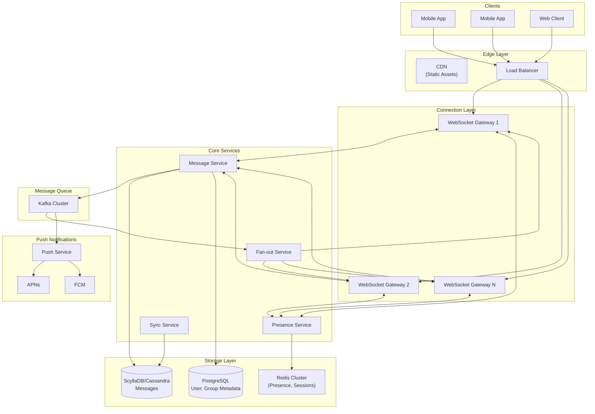
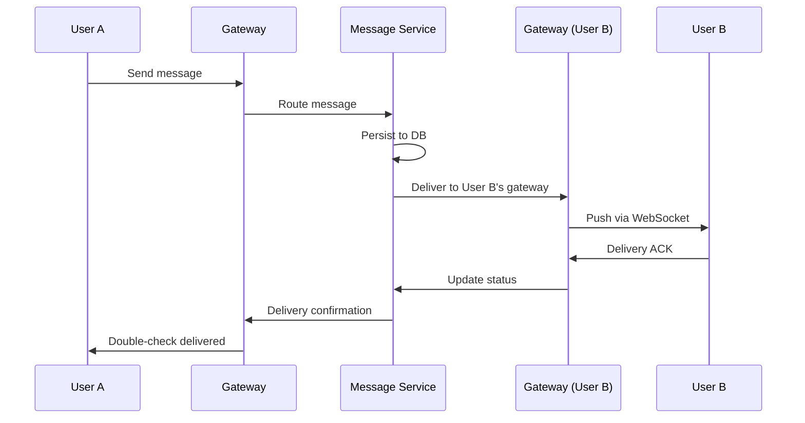
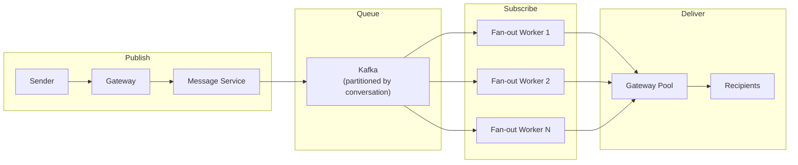
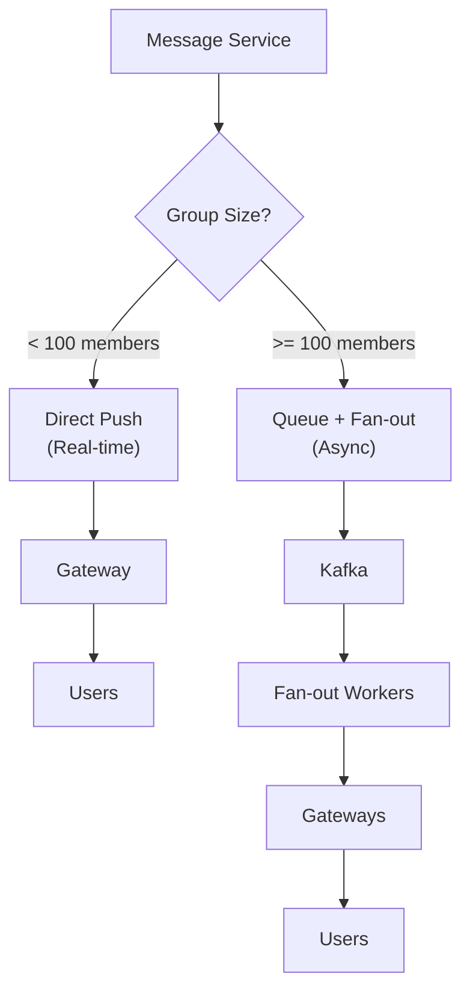
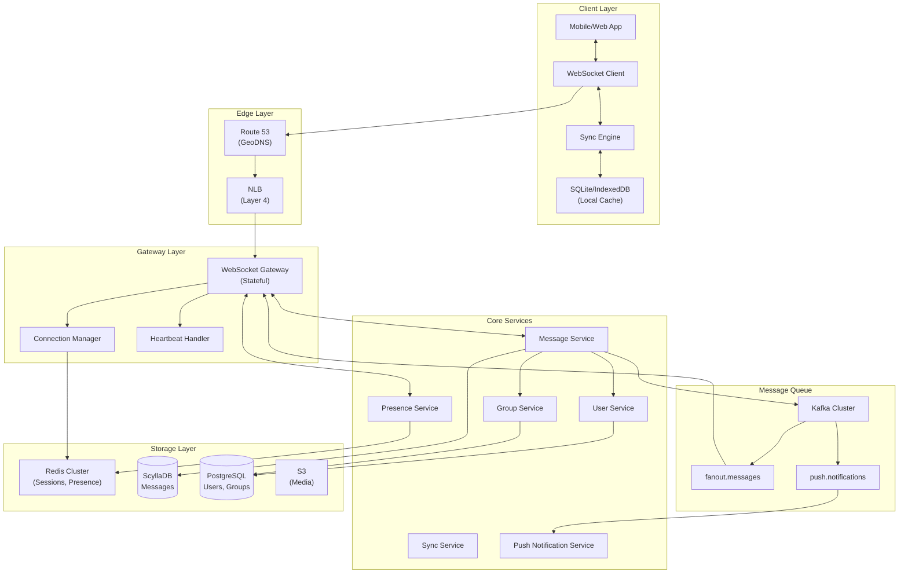
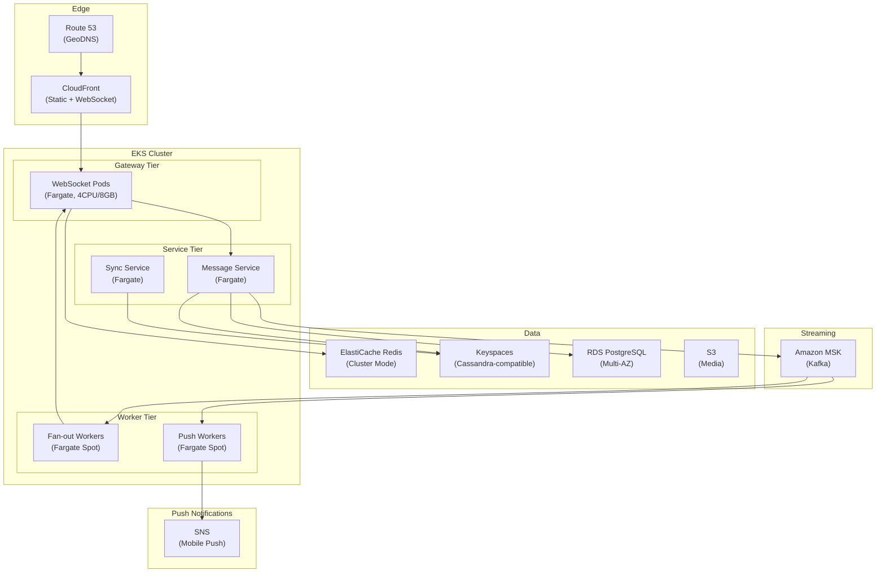

# Design Real-Time Chat and Messaging

A comprehensive system design for real-time chat and messaging covering connection management, message delivery guarantees, ordering strategies, presence systems, group chat fan-out, and offline synchronization. This design addresses sub-second message delivery at WhatsApp/Discord scale (100B+ messages/day) with strong delivery guarantees and mobile-first offline resilience.

<figure>



<figcaption>High-level architecture: WebSocket gateways handle persistent connections, Kafka provides message routing, and fan-out service distributes messages to recipients.</figcaption>
</figure>

## Abstract

Real-time chat systems solve three interrelated problems: **low-latency delivery** (messages appear within milliseconds), **reliable delivery** (no message is ever lost), and **ordering consistency** (messages appear in the same order for all participants).

**Core architectural decisions:**

| Decision           | Choice                        | Rationale                                           |
| ------------------ | ----------------------------- | --------------------------------------------------- |
| Transport          | WebSocket                     | Full-duplex, 2-byte overhead after handshake        |
| Delivery guarantee | At-least-once + client dedup  | Simpler than exactly-once; idempotency at app layer |
| Message ordering   | Server-assigned timestamps    | Single source of truth; avoids clock skew issues    |
| Fan-out model      | Hybrid push/pull              | Push for small groups, pull for large channels      |
| Presence           | Heartbeat + Redis pub/sub     | Ephemeral data; no persistence needed               |
| Offline sync       | Client-side sequence tracking | Fetch missed messages on reconnect                  |

**Key trade-offs accepted:**

- Server dependency for ordering (no P2P) in exchange for correctness guarantees
- At-least-once delivery requiring client-side deduplication
- Eventual consistency for presence (acceptable for UX)
- Higher infrastructure cost for guaranteed delivery (message queue durability)

**What this design optimizes:**

- Sub-500ms global message delivery
- Zero message loss under network partitions
- Seamless offline-to-online transitions
- Horizontal scalability to billions of messages/day

## Requirements

### Functional Requirements

| Requirement               | Priority | Notes                                         |
| ------------------------- | -------- | --------------------------------------------- |
| 1:1 direct messaging      | Core     | Private conversations between two users       |
| Group messaging           | Core     | Up to 1000 members per group                  |
| Message delivery receipts | Core     | Sent, delivered, read indicators              |
| Typing indicators         | Core     | Real-time "user is typing" display            |
| Online/offline presence   | Core     | Show user availability status                 |
| Offline message delivery  | Core     | Queue and deliver when user reconnects        |
| Message history sync      | Core     | Retrieve past messages across devices         |
| Read receipts             | Extended | Track who has read messages                   |
| Media attachments         | Extended | Images, videos, files (out of detailed scope) |
| End-to-end encryption     | Extended | Signal protocol (out of detailed scope)       |

### Non-Functional Requirements

| Requirement              | Target                        | Rationale                                           |
| ------------------------ | ----------------------------- | --------------------------------------------------- |
| Availability             | 99.99% (4 nines)              | Communication is critical; 52 min/year downtime max |
| Message delivery latency | p99 < 500ms                   | Real-time feel requires sub-second                  |
| Message durability       | 99.9999%                      | No message should ever be lost                      |
| Offline sync time        | < 5s for 1000 messages        | Fast reconnection experience                        |
| Concurrent connections   | 10M per region                | Mobile-scale concurrent users                       |
| Message retention        | 30 days default, configurable | Storage cost vs. user expectations                  |

### Scale Estimation

**Users:**

- Monthly Active Users (MAU): 500M
- Daily Active Users (DAU): 200M (40% of MAU)
- Peak concurrent connections: 50M (25% of DAU)

**Traffic:**

- Messages per user per day: 50 (mix of 1:1 and group)
- Daily messages: 200M × 50 = 10B messages/day
- Peak messages per second: 10B / 86400 × 3 (peak multiplier) = 350K msgs/sec

**Storage:**

- Average message size: 500 bytes (text + metadata)
- Daily storage: 10B × 500B = 5TB/day
- 30-day retention: 150TB
- With replication (3x): 450TB

**Connections:**

- WebSocket connections per gateway: 500K (Linux file descriptor limits)
- Gateway servers needed: 50M / 500K = 100 servers minimum
- With redundancy (2x): 200 gateway servers

## Design Paths

### Path A: Connection-Centric (Server-Routed)

**Best when:**

- Infrastructure team can maintain stateful WebSocket servers
- Low latency is primary requirement
- Moderate group sizes (< 500 members)
- Strong consistency for message ordering needed

**Architecture:**



**Key characteristics:**

- Each gateway maintains user-to-connection mapping
- Message service routes directly to recipient's gateway
- Synchronous delivery with acknowledgment chain

**Trade-offs:**

- ✅ Lowest latency (direct routing)
- ✅ Simple mental model
- ✅ Strong ordering guarantees
- ❌ Gateway state management complexity
- ❌ User migration on gateway failure
- ❌ Limited group size due to fan-out cost

**Real-world example:** WhatsApp uses this approach with TCP persistent connections. Each server maintains ~1-2M connections. Messages route through servers using recipient's assigned gateway.

### Path B: Queue-Centric (Async Fan-out)

**Best when:**

- Very large groups/channels (1000+ members)
- Geographic distribution across regions
- Tolerance for slightly higher latency (100-500ms)
- Need for replay and audit capabilities

**Architecture:**



**Key characteristics:**

- Messages published to Kafka partitioned by conversation
- Fan-out workers consume and distribute to recipients
- Decouples send from delivery for reliability

**Trade-offs:**

- ✅ Handles large fan-out efficiently
- ✅ Built-in replay capability
- ✅ Better failure isolation
- ❌ Higher latency (queue hop)
- ❌ More complex infrastructure
- ❌ Ordering requires partition strategy

**Real-world example:** Slack uses this approach with Kafka handling 6.5 Gbps peak throughput across 10 clusters. Channel servers use consistent hashing to maintain per-channel ordering.

### Path C: Hybrid (Push for Small, Pull for Large)

**Best when:**

- Mix of 1:1, small groups, and large channels
- Need to balance latency vs. resource usage
- Celebrity/influencer use cases with massive follower counts

**Architecture:**



**Key characteristics:**

- Small groups use direct push for lowest latency
- Large groups use async fan-out to avoid write amplification
- Threshold typically 50-100 members

**Trade-offs:**

- ✅ Optimal latency for common case (1:1 and small groups)
- ✅ Scales to large channels without overwhelming gateways
- ✅ Flexible resource allocation
- ❌ Two code paths to maintain
- ❌ Threshold tuning required
- ❌ Slightly inconsistent delivery characteristics

**Real-world example:** Discord uses this approach. Small servers get direct fan-out; large servers (100+ members) route through Kafka for distributed processing.

### Path Comparison

| Factor              | Connection-Centric | Queue-Centric | Hybrid    |
| ------------------- | ------------------ | ------------- | --------- |
| Latency (p50)       | 50-100ms           | 100-300ms     | 50-300ms  |
| Max group size      | ~500               | Unlimited     | Unlimited |
| Complexity          | Moderate           | High          | Highest   |
| Failure isolation   | Gateway-level      | Topic-level   | Mixed     |
| Replay capability   | Limited            | Native        | Mixed     |
| Production examples | WhatsApp           | Slack         | Discord   |

### This Article's Focus

This article focuses on **Path C (Hybrid)** because:

1. Covers the full spectrum of use cases (1:1 to large channels)
2. Represents modern production architectures (Discord, Telegram)
3. Demonstrates trade-off thinking expected in system design interviews
4. Balances latency optimization with scalability

## High-Level Design

### Component Overview



### WebSocket Gateway

Manages persistent connections and routes messages between clients and services.

**Responsibilities:**

- WebSocket connection lifecycle (connect, heartbeat, disconnect)
- Authentication and session validation
- Message routing to appropriate services
- Presence event broadcasting
- Graceful connection migration on shutdown

**Design decisions:**

| Decision               | Choice                        | Rationale                                        |
| ---------------------- | ----------------------------- | ------------------------------------------------ |
| Protocol               | WebSocket over TLS            | Full-duplex, minimal overhead, universal support |
| Session affinity       | Consistent hashing by user_id | Predictable routing, simplifies state management |
| Heartbeat interval     | 30 seconds                    | Balance between detection speed and overhead     |
| Connection timeout     | 90 seconds                    | 3 missed heartbeats before disconnect            |
| Max connections/server | 500K                          | Linux file descriptor limits with tuning         |

**Scaling approach:**

- Horizontal scaling with consistent hashing
- User-to-gateway mapping stored in Redis
- Graceful drain on shutdown (notify clients to reconnect)

### Message Service

Core service for message processing, persistence, and routing.

**State per message:**

```typescript
interface Message {
  messageId: string // UUID, client-generated for idempotency
  conversationId: string // 1:1 or group conversation
  senderId: string
  content: MessageContent
  timestamp: number // Server-assigned Unix timestamp
  sequenceNumber: bigint // Per-conversation monotonic sequence
  status: MessageStatus // PENDING | SENT | DELIVERED | READ
  expiresAt?: number // Optional TTL for ephemeral messages
}

interface MessageContent {
  type: "text" | "image" | "file" | "location"
  text?: string
  mediaUrl?: string
  metadata?: Record<string, any>
}

type MessageStatus = "PENDING" | "SENT" | "DELIVERED" | "READ"
```

**Message flow:**

1. **Receive**: Gateway forwards message with client-generated messageId
2. **Deduplicate**: Check messageId in recent message cache (idempotency)
3. **Validate**: Verify sender membership in conversation, rate limits
4. **Persist**: Write to ScyllaDB with server timestamp and sequence number
5. **Route**: Determine delivery path (direct push vs. Kafka)
6. **Acknowledge**: Return sequence number to sender
7. **Fan-out**: Distribute to recipients via appropriate channel

### Presence Service

Handles online/offline status, typing indicators, and last-seen timestamps.

**Design decisions:**

- **No persistence**: Presence reconstructed from heartbeats
- **TTL-based**: Status expires automatically on disconnect
- **Pub/Sub distribution**: Redis pub/sub for real-time updates
- **Throttled updates**: Max 1 presence update per second per user

**Data structures:**

```typescript
interface UserPresence {
  userId: string
  status: "online" | "away" | "offline"
  lastSeen: number // Unix timestamp
  deviceType: "mobile" | "web" | "desktop"
  typingIn?: string // conversationId if typing
  typingExpires?: number // Auto-clear after 5 seconds
}
```

**Presence subscription model:**

- Users subscribe to presence of their contacts on connect
- Changes broadcast via Redis pub/sub to subscribed gateways
- Gateways filter and forward to relevant connected clients

### Sync Service

Handles message history retrieval and offline synchronization.

**Sync protocol:**

- Client maintains `lastSequenceNumber` per conversation
- On reconnect, client sends list of (conversationId, lastSeq) pairs
- Server returns all messages with sequence > lastSeq
- Client merges into local database, deduplicating by messageId

**Pagination strategy:**

- Default page size: 50 messages
- Cursor-based pagination using (conversationId, sequenceNumber)
- Supports forward (newer) and backward (older) fetching

## API Design

### WebSocket Protocol

#### Connection Handshake

```
wss://chat.example.com/ws?token={jwt}&device_id={uuid}
```

**Initial connection message (server → client):**

```json
{
  "type": "connected",
  "connectionId": "conn_abc123",
  "serverTime": 1706886400000,
  "heartbeatInterval": 30000,
  "resumeToken": "resume_xyz789"
}
```

#### Client → Server Messages

**Send Message:**

```json
{
  "type": "message.send",
  "id": "req_001",
  "payload": {
    "messageId": "msg_uuid_client_generated",
    "conversationId": "conv_abc123",
    "content": {
      "type": "text",
      "text": "Hello, world!"
    }
  }
}
```

**Typing Indicator:**

```json
{
  "type": "typing.start",
  "payload": {
    "conversationId": "conv_abc123"
  }
}
```

**Mark Read:**

```json
{
  "type": "message.read",
  "payload": {
    "conversationId": "conv_abc123",
    "upToSequence": 1542
  }
}
```

**Heartbeat:**

```json
{
  "type": "heartbeat",
  "timestamp": 1706886400000
}
```

#### Server → Client Messages

**Message Acknowledgment:**

```json
{
  "type": "message.ack",
  "id": "req_001",
  "payload": {
    "messageId": "msg_uuid_client_generated",
    "sequenceNumber": 1543,
    "timestamp": 1706886400123
  }
}
```

**New Message (from another user):**

```json
{
  "type": "message.new",
  "payload": {
    "messageId": "msg_xyz789",
    "conversationId": "conv_abc123",
    "senderId": "user_456",
    "content": {
      "type": "text",
      "text": "Hi there!"
    },
    "sequenceNumber": 1544,
    "timestamp": 1706886401000
  }
}
```

**Delivery Receipt:**

```json
{
  "type": "message.delivered",
  "payload": {
    "conversationId": "conv_abc123",
    "messageIds": ["msg_uuid_1", "msg_uuid_2"],
    "deliveredTo": "user_456",
    "timestamp": 1706886402000
  }
}
```

**Read Receipt:**

```json
{
  "type": "message.read_receipt",
  "payload": {
    "conversationId": "conv_abc123",
    "readUpToSequence": 1544,
    "readBy": "user_456",
    "timestamp": 1706886403000
  }
}
```

**Presence Update:**

```json
{
  "type": "presence.update",
  "payload": {
    "userId": "user_456",
    "status": "online",
    "typingIn": null
  }
}
```

**Typing Indicator:**

```json
{
  "type": "typing.update",
  "payload": {
    "conversationId": "conv_abc123",
    "userId": "user_456",
    "isTyping": true
  }
}
```

### REST API

#### Sync Messages (Offline Recovery)

**Endpoint:** `POST /api/v1/sync`

**Request:**

```json
{
  "conversations": [
    { "conversationId": "conv_abc", "lastSequence": 1500 },
    { "conversationId": "conv_xyz", "lastSequence": 2300 }
  ],
  "limit": 100
}
```

**Response (200 OK):**

```json
{
  "conversations": [
    {
      "conversationId": "conv_abc",
      "messages": [
        {
          "messageId": "msg_001",
          "senderId": "user_123",
          "content": { "type": "text", "text": "Hello" },
          "sequenceNumber": 1501,
          "timestamp": 1706886400000,
          "status": "DELIVERED"
        }
      ],
      "hasMore": false
    }
  ],
  "serverTime": 1706886500000
}
```

#### Create Conversation

**Endpoint:** `POST /api/v1/conversations`

**Request:**

```json
{
  "type": "direct",
  "participantIds": ["user_456"]
}
```

**Response (201 Created):**

```json
{
  "conversationId": "conv_new123",
  "type": "direct",
  "participants": [
    { "userId": "user_123", "role": "member" },
    { "userId": "user_456", "role": "member" }
  ],
  "createdAt": "2024-02-03T10:00:00Z"
}
```

#### Create Group

**Endpoint:** `POST /api/v1/groups`

**Request:**

```json
{
  "name": "Project Team",
  "participantIds": ["user_456", "user_789"],
  "settings": {
    "onlyAdminsCanPost": false,
    "allowMemberInvites": true
  }
}
```

**Response (201 Created):**

```json
{
  "conversationId": "conv_group_abc",
  "type": "group",
  "name": "Project Team",
  "participants": [
    { "userId": "user_123", "role": "admin" },
    { "userId": "user_456", "role": "member" },
    { "userId": "user_789", "role": "member" }
  ],
  "memberCount": 3,
  "createdAt": "2024-02-03T10:00:00Z"
}
```

#### Message History

**Endpoint:** `GET /api/v1/conversations/{id}/messages?before={sequence}&limit=50`

**Response (200 OK):**

```json
{
  "messages": [
    {
      "messageId": "msg_xyz",
      "senderId": "user_456",
      "content": { "type": "text", "text": "Earlier message" },
      "sequenceNumber": 1450,
      "timestamp": 1706880000000
    }
  ],
  "hasMore": true,
  "nextCursor": "seq_1449"
}
```

### Error Responses

| Code | Error                    | When                         |
| ---- | ------------------------ | ---------------------------- |
| 400  | `INVALID_MESSAGE`        | Message format invalid       |
| 401  | `UNAUTHORIZED`           | Invalid or expired token     |
| 403  | `FORBIDDEN`              | Not a member of conversation |
| 404  | `CONVERSATION_NOT_FOUND` | Conversation doesn't exist   |
| 409  | `DUPLICATE_MESSAGE`      | messageId already processed  |
| 429  | `RATE_LIMITED`           | Too many messages            |

**Rate limit response:**

```json
{
  "error": "RATE_LIMITED",
  "message": "Message rate limit exceeded",
  "retryAfter": 5,
  "limit": "100 messages per minute"
}
```

## Data Modeling

### Message Storage (ScyllaDB)

**Table design for time-series message access:**

```sql
CREATE TABLE messages (
    conversation_id UUID,
    sequence_number BIGINT,
    message_id UUID,
    sender_id UUID,
    content_type TEXT,
    content_text TEXT,
    content_media_url TEXT,
    timestamp TIMESTAMP,
    status TEXT,
    expires_at TIMESTAMP,
    PRIMARY KEY ((conversation_id), sequence_number)
) WITH CLUSTERING ORDER BY (sequence_number DESC);
```

**Why ScyllaDB:**

- Optimized for time-series data (messages ordered by sequence)
- Partition per conversation enables efficient range queries
- No garbage collection pauses (C++ implementation)
- Linear horizontal scaling

**Performance characteristics:**

- Read latency p99: 15ms (vs. 40-125ms for Cassandra)
- Write latency p99: 5ms
- Partition size recommendation: < 100MB (~200K messages per conversation)

**Partition hot-spot mitigation:**

- Very active conversations split into time-bucketed partitions
- Partition key: (conversation_id, time_bucket)
- Time bucket: daily for active chats, monthly for archives

### Message Deduplication Cache (Redis)

**Purpose:** Prevent duplicate message processing (idempotency)

```redis
# Set messageId with 24-hour TTL
SETEX msg:dedup:{message_id} 86400 1

# Check before processing
EXISTS msg:dedup:{message_id}
```

### User and Conversation Metadata (PostgreSQL)

```sql
CREATE TABLE users (
    id UUID PRIMARY KEY DEFAULT gen_random_uuid(),
    username VARCHAR(50) UNIQUE NOT NULL,
    display_name VARCHAR(100),
    avatar_url TEXT,
    phone_hash VARCHAR(64) UNIQUE,
    created_at TIMESTAMPTZ DEFAULT NOW(),
    last_active_at TIMESTAMPTZ
);

CREATE TABLE conversations (
    id UUID PRIMARY KEY DEFAULT gen_random_uuid(),
    type VARCHAR(20) NOT NULL, -- 'direct' or 'group'
    name VARCHAR(100),         -- NULL for direct
    avatar_url TEXT,
    created_by UUID REFERENCES users(id),
    created_at TIMESTAMPTZ DEFAULT NOW(),
    updated_at TIMESTAMPTZ DEFAULT NOW(),
    last_message_at TIMESTAMPTZ,
    last_sequence BIGINT DEFAULT 0,
    member_count INT DEFAULT 0,
    settings JSONB DEFAULT '{}'
);

CREATE TABLE conversation_members (
    conversation_id UUID REFERENCES conversations(id) ON DELETE CASCADE,
    user_id UUID REFERENCES users(id) ON DELETE CASCADE,
    role VARCHAR(20) DEFAULT 'member', -- 'admin', 'member'
    joined_at TIMESTAMPTZ DEFAULT NOW(),
    last_read_sequence BIGINT DEFAULT 0,
    muted_until TIMESTAMPTZ,
    PRIMARY KEY (conversation_id, user_id)
);

-- Indexes
CREATE INDEX idx_members_user ON conversation_members(user_id);
CREATE INDEX idx_conversations_updated ON conversations(updated_at DESC);
```

### Session and Connection State (Redis)

```redis
# User's active connections (set)
SADD user:conn:{user_id} {connection_id}
SREM user:conn:{user_id} {connection_id}

# Connection → Gateway mapping (hash)
HSET conn:{connection_id}
    gateway "gateway-1.us-east-1"
    user_id "user_123"
    device_id "device_abc"
    connected_at 1706886400000

# User presence (hash with TTL)
HSET presence:{user_id}
    status "online"
    last_seen 1706886400000
    device_type "mobile"
EXPIRE presence:{user_id} 120

# Typing indicators (with auto-expire)
SETEX typing:{conversation_id}:{user_id} 5 1
```

### Database Selection Matrix

| Data Type             | Store              | Rationale                                            |
| --------------------- | ------------------ | ---------------------------------------------------- |
| Messages              | ScyllaDB           | Time-series optimized, low latency, horizontal scale |
| User profiles         | PostgreSQL         | ACID, complex queries, moderate scale                |
| Conversation metadata | PostgreSQL         | Relational queries, ACL management                   |
| Sessions, presence    | Redis Cluster      | Sub-ms latency, TTL support, pub/sub                 |
| Message dedup cache   | Redis              | Fast lookups, automatic expiry                       |
| Media files           | S3                 | Object storage, CDN integration                      |
| Analytics events      | Kafka → ClickHouse | High-volume time-series analytics                    |

## Low-Level Design

### Message Delivery Pipeline

#### Direct Push (Small Groups)

For conversations with < 100 members:

```typescript collapse={1-12}
class DirectPushHandler {
  private readonly redis: RedisCluster
  private readonly messageStore: MessageStore

  async deliverMessage(message: Message): Promise<void> {
    // 1. Get all members of conversation
    const members = await this.getConversationMembers(message.conversationId)

    // 2. For each member, find their active connections
    const deliveryTasks = members
      .filter((m) => m.userId !== message.senderId)
      .map(async (member) => {
        const connections = await this.redis.smembers(`user:conn:${member.userId}`)

        if (connections.length > 0) {
          // User is online - push directly
          await Promise.all(connections.map((connId) => this.pushToConnection(connId, message)))
          return { userId: member.userId, status: "pushed" }
        } else {
          // User is offline - queue for push notification
          await this.queuePushNotification(member.userId, message)
          return { userId: member.userId, status: "queued" }
        }
      })

    const results = await Promise.all(deliveryTasks)

    // 3. Update delivery status
    const deliveredTo = results.filter((r) => r.status === "pushed").map((r) => r.userId)

    if (deliveredTo.length > 0) {
      await this.notifyDeliveryReceipt(message, deliveredTo)
    }
  }

  private async pushToConnection(connId: string, message: Message): Promise<void> {
    const connInfo = await this.redis.hgetall(`conn:${connId}`)
    const gateway = connInfo.gateway

    // Send via internal RPC to gateway
    await this.gatewayClient.send(gateway, {
      type: "deliver",
      connectionId: connId,
      message,
    })
  }
}
```

#### Kafka Fan-out (Large Groups)

For conversations with >= 100 members:

```typescript collapse={1-15}
class KafkaFanoutHandler {
  private readonly kafka: KafkaProducer
  private readonly FANOUT_TOPIC = "messages.fanout"

  async publishForFanout(message: Message, memberCount: number): Promise<void> {
    // Partition by conversation for ordering guarantee
    await this.kafka.send({
      topic: this.FANOUT_TOPIC,
      messages: [
        {
          key: message.conversationId,
          value: JSON.stringify({
            message,
            memberCount,
            publishedAt: Date.now(),
          }),
        },
      ],
    })
  }
}

// Fan-out consumer (multiple instances)
class FanoutConsumer {
  private readonly BATCH_SIZE = 100

  async processMessage(record: KafkaRecord): Promise<void> {
    const { message, memberCount } = JSON.parse(record.value)

    // Process members in batches to avoid memory pressure
    let offset = 0
    while (offset < memberCount) {
      const memberBatch = await this.getMemberBatch(message.conversationId, offset, this.BATCH_SIZE)

      await Promise.all(memberBatch.map((member) => this.deliverToMember(member, message)))

      offset += this.BATCH_SIZE
    }
  }
}
```

### Message Ordering and Sequencing

#### Sequence Number Assignment

```typescript collapse={1-8}
class SequenceGenerator {
  private readonly redis: RedisCluster

  async getNextSequence(conversationId: string): Promise<bigint> {
    // Atomic increment in Redis
    const sequence = await this.redis.incr(`seq:${conversationId}`)
    return BigInt(sequence)
  }
}

class MessageProcessor {
  async processIncoming(conversationId: string, message: IncomingMessage): Promise<ProcessedMessage> {
    // Acquire conversation lock for ordering
    const lock = await this.acquireLock(`lock:msg:${conversationId}`, 5000)

    try {
      // Assign sequence number
      const sequenceNumber = await this.sequenceGenerator.getNextSequence(conversationId)

      // Assign server timestamp
      const timestamp = Date.now()

      const processed: ProcessedMessage = {
        ...message,
        sequenceNumber,
        timestamp,
        status: "SENT",
      }

      // Persist with sequence number
      await this.messageStore.insert(processed)

      return processed
    } finally {
      await lock.release()
    }
  }
}
```

#### Client-Side Ordering

```typescript collapse={1-10}
class ClientMessageBuffer {
  private pendingMessages: Map<string, Message[]> = new Map()
  private lastSequence: Map<string, bigint> = new Map()

  onMessageReceived(message: Message): void {
    const expected = (this.lastSequence.get(message.conversationId) || 0n) + 1n

    if (message.sequenceNumber === expected) {
      // In order - deliver immediately
      this.deliverToUI(message)
      this.lastSequence.set(message.conversationId, message.sequenceNumber)

      // Check for buffered messages that can now be delivered
      this.flushBuffer(message.conversationId)
    } else if (message.sequenceNumber > expected) {
      // Out of order - buffer and request missing
      this.bufferMessage(message)
      this.requestMissing(message.conversationId, expected, message.sequenceNumber)
    }
    // If sequence < expected, it's a duplicate - ignore
  }

  private flushBuffer(conversationId: string): void {
    const buffer = this.pendingMessages.get(conversationId) || []
    buffer.sort((a, b) => Number(a.sequenceNumber - b.sequenceNumber))

    let expected = (this.lastSequence.get(conversationId) || 0n) + 1n
    while (buffer.length > 0 && buffer[0].sequenceNumber === expected) {
      const msg = buffer.shift()!
      this.deliverToUI(msg)
      this.lastSequence.set(conversationId, msg.sequenceNumber)
      expected++
    }

    this.pendingMessages.set(conversationId, buffer)
  }
}
```

### Presence System

#### Heartbeat Processing

```typescript collapse={1-10}
class PresenceManager {
  private readonly PRESENCE_TTL = 120 // seconds
  private readonly TYPING_TTL = 5 // seconds

  async handleHeartbeat(userId: string, deviceType: string): Promise<void> {
    const now = Date.now()

    // Update presence with TTL
    await this.redis
      .multi()
      .hset(`presence:${userId}`, {
        status: "online",
        last_seen: now,
        device_type: deviceType,
      })
      .expire(`presence:${userId}`, this.PRESENCE_TTL)
      .exec()

    // Publish presence change to subscribers
    await this.redis.publish(
      `presence:changes`,
      JSON.stringify({
        userId,
        status: "online",
        timestamp: now,
      }),
    )
  }

  async handleDisconnect(userId: string): Promise<void> {
    // Check if user has other active connections
    const connections = await this.redis.smembers(`user:conn:${userId}`)

    if (connections.length === 0) {
      // No more connections - mark offline
      const now = Date.now()

      await this.redis.hset(`presence:${userId}`, {
        status: "offline",
        last_seen: now,
      })

      await this.redis.publish(
        `presence:changes`,
        JSON.stringify({
          userId,
          status: "offline",
          lastSeen: now,
        }),
      )
    }
  }

  async setTyping(userId: string, conversationId: string): Promise<void> {
    await this.redis.setex(`typing:${conversationId}:${userId}`, this.TYPING_TTL, "1")

    // Notify conversation members
    await this.redis.publish(
      `typing:${conversationId}`,
      JSON.stringify({
        userId,
        isTyping: true,
      }),
    )
  }
}
```

#### Presence Subscription

```typescript collapse={1-12}
class PresenceSubscriber {
  private subscribedUsers: Set<string> = new Set()

  async subscribeToContacts(userId: string, contactIds: string[]): Promise<void> {
    // Get current status of all contacts
    const pipeline = this.redis.pipeline()
    contactIds.forEach((id) => {
      pipeline.hgetall(`presence:${id}`)
    })
    const results = await pipeline.exec()

    // Send initial presence state
    const presences = contactIds.map((id, i) => ({
      userId: id,
      ...(results[i][1] || { status: "offline" }),
    }))

    this.sendToClient({ type: "presence.bulk", payload: { presences } })

    // Subscribe to changes
    contactIds.forEach((id) => this.subscribedUsers.add(id))
  }

  onPresenceChange(change: PresenceChange): void {
    if (this.subscribedUsers.has(change.userId)) {
      this.sendToClient({
        type: "presence.update",
        payload: change,
      })
    }
  }
}
```

### Offline Sync Protocol

```typescript collapse={1-15}
class SyncService {
  async syncConversations(
    userId: string,
    syncState: Array<{ conversationId: string; lastSequence: bigint }>,
  ): Promise<SyncResponse> {
    const results: ConversationSync[] = []

    for (const { conversationId, lastSequence } of syncState) {
      // Verify user is member
      const isMember = await this.checkMembership(userId, conversationId)
      if (!isMember) continue

      // Fetch missed messages
      const messages = await this.messageStore.getMessagesAfter(
        conversationId,
        lastSequence,
        100, // limit per conversation
      )

      // Get conversation metadata if changed
      const conversation = await this.conversationStore.get(conversationId)

      results.push({
        conversationId,
        messages,
        hasMore: messages.length === 100,
        lastSequence: messages.length > 0 ? messages[messages.length - 1].sequenceNumber : lastSequence,
        unreadCount: await this.getUnreadCount(userId, conversationId),
      })
    }

    // Also check for new conversations
    const newConversations = await this.getNewConversations(userId, syncState)

    return {
      conversations: results,
      newConversations,
      serverTime: Date.now(),
    }
  }
}
```

## Frontend Considerations

### Connection Management

**Reconnection with exponential backoff:**

```typescript collapse={1-15}
class WebSocketManager {
  private ws: WebSocket | null = null
  private reconnectAttempt = 0
  private readonly MAX_RECONNECT_DELAY = 30000
  private readonly BASE_DELAY = 1000

  connect(): void {
    this.ws = new WebSocket(this.buildUrl())

    this.ws.onopen = () => {
      this.reconnectAttempt = 0
      this.onConnected()
    }

    this.ws.onclose = (event) => {
      if (!event.wasClean) {
        this.scheduleReconnect()
      }
    }

    this.ws.onerror = () => {
      // Will trigger onclose
    }
  }

  private scheduleReconnect(): void {
    const delay = Math.min(
      this.BASE_DELAY * Math.pow(2, this.reconnectAttempt) + Math.random() * 1000, // Jitter
      this.MAX_RECONNECT_DELAY,
    )

    this.reconnectAttempt++

    setTimeout(() => this.connect(), delay)
  }
}
```

### Local Message Storage

**IndexedDB schema for offline support:**

```typescript collapse={1-20}
interface LocalDBSchema {
  messages: {
    key: [string, number] // [conversationId, sequenceNumber]
    value: Message
    indexes: {
      "by-conversation": string
      "by-timestamp": number
      "by-status": string
    }
  }
  conversations: {
    key: string // conversationId
    value: ConversationMeta
    indexes: {
      "by-updated": number
    }
  }
  syncState: {
    key: string // conversationId
    value: { lastSequence: number; lastSync: number }
  }
}

class LocalMessageStore {
  private db: IDBDatabase

  async saveMessage(message: Message): Promise<void> {
    const tx = this.db.transaction("messages", "readwrite")
    await tx.objectStore("messages").put(message)
  }

  async getMessages(conversationId: string, options: { before?: number; limit: number }): Promise<Message[]> {
    const tx = this.db.transaction("messages", "readonly")
    const index = tx.objectStore("messages").index("by-conversation")

    const range = IDBKeyRange.bound([conversationId, 0], [conversationId, options.before || Number.MAX_SAFE_INTEGER])

    const messages: Message[] = []
    let cursor = await index.openCursor(range, "prev")

    while (cursor && messages.length < options.limit) {
      messages.push(cursor.value)
      cursor = await cursor.continue()
    }

    return messages
  }
}
```

### Optimistic Updates

```typescript collapse={1-10}
class MessageSender {
  async sendMessage(conversationId: string, content: MessageContent): Promise<void> {
    const clientMessageId = crypto.randomUUID()
    const optimisticMessage: Message = {
      messageId: clientMessageId,
      conversationId,
      senderId: this.currentUserId,
      content,
      timestamp: Date.now(),
      sequenceNumber: -1n, // Pending
      status: "PENDING",
    }

    // 1. Show immediately in UI
    this.messageStore.addOptimistic(optimisticMessage)
    this.ui.appendMessage(optimisticMessage)

    // 2. Persist to local DB
    await this.localDb.saveMessage(optimisticMessage)

    // 3. Send to server
    try {
      const ack = await this.ws.sendAndWait({
        type: "message.send",
        payload: {
          messageId: clientMessageId,
          conversationId,
          content,
        },
      })

      // 4. Update with server-assigned values
      const confirmedMessage = {
        ...optimisticMessage,
        sequenceNumber: ack.sequenceNumber,
        timestamp: ack.timestamp,
        status: "SENT",
      }

      this.messageStore.updateOptimistic(clientMessageId, confirmedMessage)
      await this.localDb.saveMessage(confirmedMessage)
    } catch (error) {
      // 5. Mark as failed
      this.messageStore.markFailed(clientMessageId)
      this.ui.showRetryOption(clientMessageId)
    }
  }
}
```

### Virtual List for Message History

```typescript collapse={1-15}
interface VirtualListConfig {
  containerHeight: number
  itemHeight: number // Estimated, variable heights supported
  overscan: number // Extra items to render above/below viewport
}

class VirtualMessageList {
  private visibleRange = { start: 0, end: 0 }
  private heightCache = new Map<string, number>()

  calculateVisibleRange(scrollTop: number): { start: number; end: number } {
    const messages = this.getMessages()
    let accumulatedHeight = 0
    let start = 0
    let end = messages.length

    // Find start index
    for (let i = 0; i < messages.length; i++) {
      const height = this.getItemHeight(messages[i])
      if (accumulatedHeight + height > scrollTop - this.config.overscan * 50) {
        start = i
        break
      }
      accumulatedHeight += height
    }

    // Find end index
    accumulatedHeight = 0
    for (let i = start; i < messages.length; i++) {
      accumulatedHeight += this.getItemHeight(messages[i])
      if (accumulatedHeight > this.config.containerHeight + this.config.overscan * 50) {
        end = i + 1
        break
      }
    }

    return { start, end }
  }

  // Render only visible messages
  render(): MessageItem[] {
    const { start, end } = this.visibleRange
    return this.getMessages().slice(start, end)
  }
}
```

## Infrastructure

### Cloud-Agnostic Components

| Component         | Purpose                  | Options                       |
| ----------------- | ------------------------ | ----------------------------- |
| WebSocket Gateway | Persistent connections   | Nginx (ws), HAProxy, Envoy    |
| Message Queue     | Async delivery, ordering | Kafka, Pulsar, NATS JetStream |
| KV Store          | Sessions, presence       | Redis, KeyDB, Dragonfly       |
| Message Store     | Message persistence      | ScyllaDB, Cassandra, DynamoDB |
| Relational DB     | User/group metadata      | PostgreSQL, CockroachDB       |
| Object Store      | Media files              | MinIO, Ceph, S3-compatible    |
| Push Gateway      | Mobile notifications     | Self-hosted or APNs/FCM proxy |

### AWS Reference Architecture



**Service configurations:**

| Service             | Configuration              | Rationale                         |
| ------------------- | -------------------------- | --------------------------------- |
| WebSocket (Fargate) | 4 vCPU, 8GB, 500K conn/pod | Memory for connection state       |
| Message Service     | 2 vCPU, 4GB                | Stateless, CPU-bound              |
| Fan-out Workers     | 2 vCPU, 4GB, Spot          | Cost optimization for async       |
| ElastiCache Redis   | r6g.2xlarge cluster mode   | Sub-ms presence lookups           |
| Keyspaces           | On-demand                  | Serverless Cassandra for messages |
| RDS PostgreSQL      | db.r6g.xlarge Multi-AZ     | Metadata, moderate write load     |
| MSK                 | kafka.m5.large, 3 brokers  | 6.5 Gbps throughput capacity      |

### Scaling Considerations

**WebSocket connection limits:**

- Linux default: 1024 file descriptors per process
- Tuned: 1M+ with sysctl adjustments
- Practical per pod: 500K (memory constrained)
- 50M concurrent users → 100 gateway pods minimum

**Kafka partitioning:**

- Partition by conversation_id for ordering
- Minimum partitions: 100 (allows 100 parallel consumers)
- Hot partition handling: re-partition extremely active conversations

**Message storage partitioning:**

- ScyllaDB partition key: conversation_id
- Max partition size: 100MB (~200K messages)
- Very active conversations: add time bucket to partition key

**Presence fan-out:**

- Redis pub/sub scales to ~10K subscribers per channel
- For users with 10K+ contacts: use hierarchical pub/sub or dedicated presence servers

## Conclusion

This design provides real-time chat and messaging with:

1. **Sub-500ms message delivery** via WebSocket with hybrid push/pull fan-out
2. **At-least-once delivery** with client-side deduplication for reliability
3. **Strong per-conversation ordering** through server-assigned sequence numbers
4. **Seamless offline support** via local storage and sync protocol
5. **Scalable presence** using Redis pub/sub with heartbeat-based status

**Key architectural decisions:**

- Hybrid fan-out balances latency (direct push) with scalability (Kafka for large groups)
- Server-assigned timestamps eliminate clock skew issues
- Client-generated message IDs enable idempotent retry
- Per-conversation partitioning ensures ordering without global coordination

**Known limitations:**

- Server dependency for message ordering (no P2P)
- At-least-once delivery requires client deduplication logic
- Presence accuracy limited by heartbeat interval (30s staleness possible)
- Large group delivery latency higher than 1:1 messages

**Future enhancements:**

- End-to-end encryption with Signal protocol
- Reactions and threaded replies
- Message editing and deletion with tombstones
- Voice and video calling integration (WebRTC)

## Appendix

### Prerequisites

- Distributed systems fundamentals (consistency models, partitioning)
- Real-time communication patterns (WebSocket, pub/sub)
- Message queue concepts (Kafka partitions, consumer groups)
- Database selection trade-offs (SQL vs. NoSQL)

### Terminology

| Term                | Definition                                                                      |
| ------------------- | ------------------------------------------------------------------------------- |
| **Fan-out**         | Distributing a message to multiple recipients                                   |
| **Sequence number** | Monotonically increasing identifier for ordering messages within a conversation |
| **Presence**        | User's online/offline status and activity indicators                            |
| **Idempotency**     | Property ensuring duplicate requests produce the same result                    |
| **Heartbeat**       | Periodic signal from client to server indicating connection is alive            |
| **ACK**             | Acknowledgment message confirming receipt                                       |
| **TTL**             | Time-to-live; automatic expiration of data after specified duration             |

### Summary

- Real-time chat requires **persistent connections** (WebSocket), **reliable delivery** (at-least-once with dedup), and **ordering guarantees** (server-assigned sequence numbers)
- **Hybrid fan-out** (direct push for small groups, Kafka for large) balances latency with scalability
- **ScyllaDB** provides time-series optimized storage with sub-15ms p99 read latency
- **Redis** handles ephemeral state: sessions, presence, typing indicators with pub/sub distribution
- **Client-side sync protocol** with sequence tracking enables seamless offline-to-online transitions
- Scale to 350K+ messages/second with horizontal gateway scaling and partitioned message queues

### References

**Real-World Implementations:**

- [How Discord Stores Trillions of Messages](https://discord.com/blog/how-discord-stores-trillions-of-messages) - ScyllaDB migration and performance gains
- [How Discord Serves 15 Million Users on One Server](https://blog.bytebytego.com/p/how-discord-serves-15-million-users) - Elixir and BEAM architecture
- [Real-time Messaging at Slack](https://slack.engineering/real-time-messaging/) - Channel server architecture
- [LinkedIn's Real-Time Presence Platform](https://engineering.linkedin.com/blog/2018/01/now-you-see-me--now-you-dont--linkedins-real-time-presence-platf) - Presence at scale

**Protocol Specifications:**

- [RFC 6455 - The WebSocket Protocol](https://datatracker.ietf.org/doc/html/rfc6455) - WebSocket specification
- [XMPP Core (RFC 6120)](https://xmpp.org/rfcs/rfc6120.html) - Extensible Messaging and Presence Protocol
- [MQTT Version 5.0 (OASIS Standard)](https://docs.oasis-open.org/mqtt/mqtt/v5.0/mqtt-v5.0.html) - IoT messaging protocol

**Distributed Systems Theory:**

- [Time, Clocks, and the Ordering of Events](https://lamport.azurewebsites.net/pubs/time-clocks.pdf) - Lamport's foundational paper
- [Exactly-Once Semantics in Apache Kafka](https://www.confluent.io/blog/exactly-once-semantics-are-possible-heres-how-apache-kafka-does-it/) - Kafka's exactly-once implementation

**Related Articles:**

- [Design Collaborative Document Editing](../design-google-docs-collaboration/README.md) - Real-time sync with OT/CRDT
- [Design a Notification System](../design-notification-system/README.md) - Multi-channel push delivery
