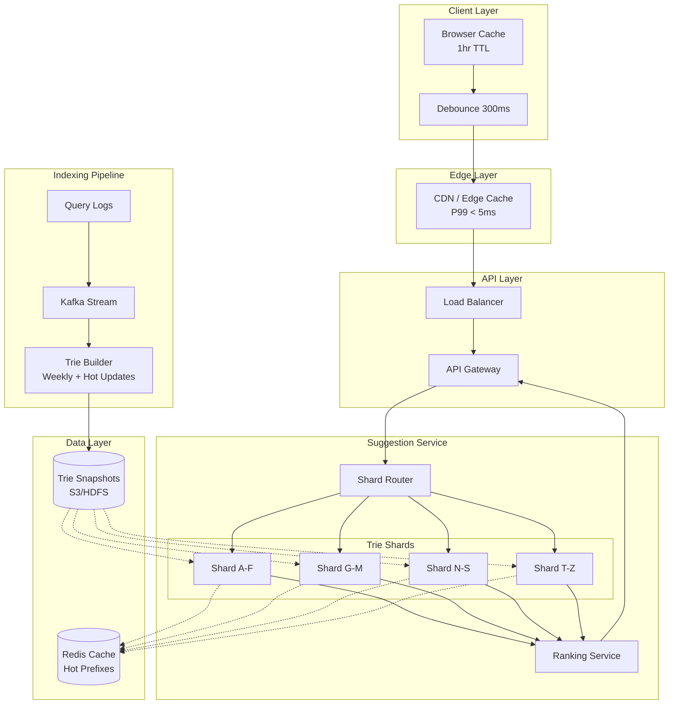
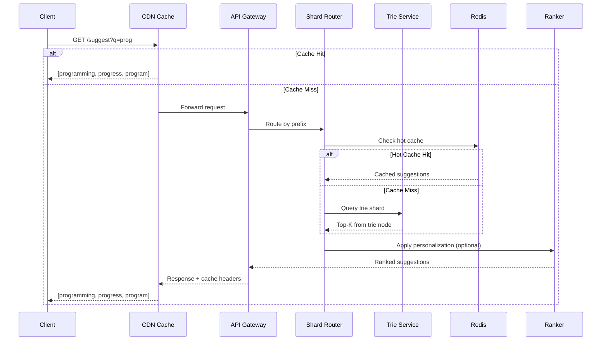
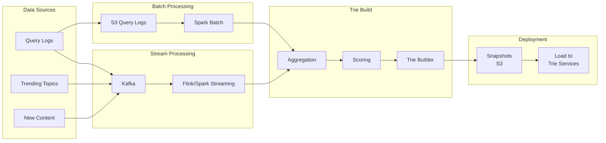
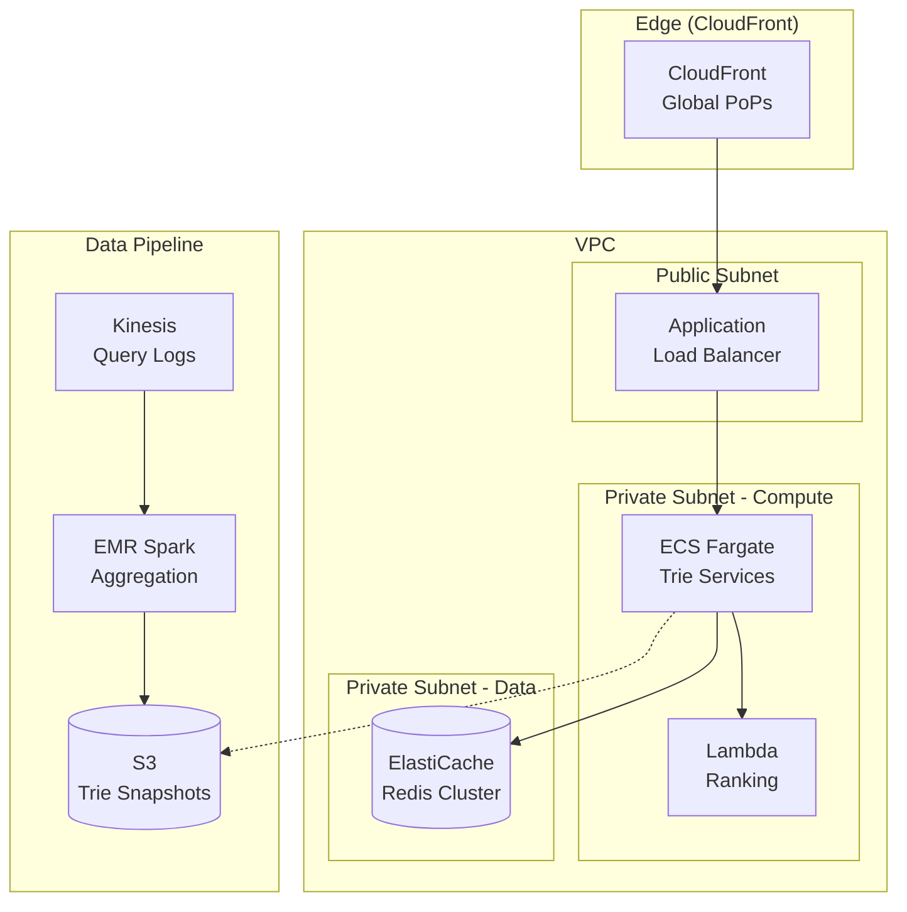

# Design Search Autocomplete: Prefix Matching at Scale

A system design for search autocomplete (typeahead) covering prefix data structures, ranking algorithms, distributed architecture, and sub-100ms latency requirements. This design addresses the challenge of returning relevant suggestions within the user's typing cadence—typically under 100ms—while handling billions of queries daily.

<figure>



<figcaption>High-level architecture: Client debouncing feeds through CDN cache to sharded trie services with pre-computed rankings. Indexing pipeline rebuilds tries from query logs.</figcaption>
</figure>

## Abstract

Search autocomplete is a **prefix-completion problem** where every millisecond matters—users expect suggestions before they finish typing. The core mental model:

- **Data structure choice determines latency floor**: Tries provide O(p) prefix lookup where p is prefix length, independent of corpus size. Finite State Transducers (FST) compress this further for in-memory serving.
- **Pre-computed top-K eliminates runtime ranking**: Store the top 5-10 suggestions at each trie node. Query becomes pure traversal, no sorting.
- **Freshness requires a dual-path architecture**: Weekly batch rebuilds for stable rankings + streaming hot updates for trending queries.
- **Client-side debouncing is mandatory**: Without 300ms debounce, typing "javascript" generates 10 requests in 1 second. With debounce: 1 request.
- **Personalization adds latency**: Generic suggestions serve from cache in <5ms. Personalized suggestions require user context lookup, adding 10-50ms.

The fundamental tradeoff: **latency vs. relevance**. Pre-computed suggestions are fast but stale. Real-time ranking is relevant but slow. Production systems layer both.

## Requirements

### Functional Requirements

| Requirement | Priority | Notes |
|-------------|----------|-------|
| Return suggestions for partial query | Core | Primary feature |
| Rank by relevance (popularity, freshness) | Core | Not just alphabetical |
| Support trending/breaking queries | Core | News events, viral content |
| Personalized suggestions | Extended | Based on user history |
| Spell correction / fuzzy matching | Extended | Handle typos |
| Multi-language support | Extended | Unicode, RTL scripts |

**Out of scope**: Full document search (separate system), voice input, image search.

### Non-Functional Requirements

| Requirement | Target | Rationale |
|-------------|--------|-----------|
| Latency | P99 < 100ms | User typing cadence ~150ms between keystrokes |
| Availability | 99.99% | User-facing, affects search engagement |
| Throughput | 500K QPS peak | Based on scale estimation below |
| Suggestion freshness | < 1 hour for trending | Breaking news must surface quickly |
| Consistency | Eventual (< 5 min) | Acceptable for suggestions |

### Scale Estimation

**Assumptions** (Google-scale reference):

- Daily Active Users (DAU): 1 billion
- Searches per user per day: 5
- Characters per search: 20 average
- Autocomplete triggers: Every 2-3 characters after minimum prefix

**Traffic calculation**:

```
Queries/day = 1B users × 5 searches × (20 chars / 3 chars per trigger)
            = 1B × 5 × 7 triggers
            = 35 billion autocomplete requests/day

QPS average = 35B / 86,400 = ~405K QPS
QPS peak (3x) = ~1.2M QPS
```

**Storage calculation**:

```
Unique queries to index: ~1 billion (estimated from query logs)
Average query length: 25 bytes
Metadata per query (score, timestamp): 16 bytes
Raw storage: 1B × 41 bytes = 41 GB

Trie overhead (pointers, node structure): 3-5x
Trie storage: ~150-200 GB per replica
```

**Bandwidth**:

```
Request size: ~50 bytes (prefix + metadata)
Response size: ~500 bytes (10 suggestions with metadata)

Ingress: 1.2M QPS × 50 bytes = 60 MB/s
Egress: 1.2M QPS × 500 bytes = 600 MB/s
```

## Design Paths

### Path A: Trie-Based with Pre-computed Rankings

**Best when:**

- Suggestion corpus is bounded (millions, not billions of unique queries)
- Latency is critical (<50ms P99)
- Ranking signals are relatively stable (popularity-based)

**Architecture:**

- In-memory tries sharded by prefix range
- Top-K suggestions pre-computed at each node during indexing
- Weekly full rebuilds + hourly delta updates

**Key characteristics:**

- Query is pure traversal: O(p) where p = prefix length
- No runtime ranking computation
- Memory-intensive: entire trie must fit in RAM

**Trade-offs:**

- ✅ Sub-10ms query latency achievable
- ✅ Predictable, consistent performance
- ✅ Simple query path (no scoring logic)
- ❌ High memory footprint (~200GB per shard replica)
- ❌ Freshness limited by rebuild frequency
- ❌ Personalization requires separate lookup

**Real-world example:** LinkedIn's Cleo serves generic typeahead in <1ms using pre-computed tries. Network-personalized suggestions take 15ms due to additional context lookups.

### Path B: Inverted Index with Completion Suggester

**Best when:**

- Corpus is large and dynamic (e-commerce catalogs, document search)
- Need flexibility for different query types (prefix, fuzzy, phrase)
- Already running Elasticsearch/OpenSearch infrastructure

**Architecture:**

- Elasticsearch completion suggester using FST (Finite State Transducers)
- Edge n-gram tokenization for flexible matching
- Real-time indexing via Kafka

**Key characteristics:**

- FST provides compact in-memory representation
- Supports fuzzy matching and context filtering
- Index updates are near real-time

**Trade-offs:**

- ✅ Flexible query types (prefix, infix, fuzzy)
- ✅ Real-time updates without full rebuild
- ✅ Built-in sharding and replication
- ❌ Higher latency than pure trie (10-50ms typical)
- ❌ Index size 15-17x larger with edge n-gram analyzer
- ❌ Operational complexity of Elasticsearch cluster

**Real-world example:** Amazon product search uses inverted indexes with extensive metadata (ratings, sales rank) for ranking. Handles dynamic catalog updates in near real-time.

### Path Comparison

| Factor | Path A: Trie | Path B: Inverted Index |
|--------|--------------|------------------------|
| Query latency | <10ms | 10-50ms |
| Memory efficiency | Lower (pointer overhead) | Higher (FST compression) |
| Update latency | Hours (batch) | Seconds (streaming) |
| Fuzzy matching | Requires separate structure | Native support |
| Sharding complexity | Manual prefix-based | Built-in (Elasticsearch) |
| Operational overhead | Custom infrastructure | Managed service available |
| Best for | High-QPS generic suggestions | Dynamic catalogs, flexible queries |

### This Article's Focus

This article focuses on **Path A (Trie-Based)** because:

1. It represents the canonical autocomplete architecture used by Google, Twitter, and LinkedIn for their primary suggestion services
2. It demonstrates fundamental prefix data structures that underpin even inverted-index implementations
3. Sub-10ms latency is achievable, which Path B cannot match

Path B implementation details are covered in the "Elasticsearch Alternative" section under Low-Level Design.

## High-Level Design

### Component Overview

| Component | Responsibility | Technology |
|-----------|---------------|------------|
| **API Gateway** | Rate limiting, authentication, routing | Kong, AWS API Gateway |
| **Shard Router** | Route prefix to correct trie shard | Custom service |
| **Trie Service** | Serve suggestions from in-memory trie | Custom service (Go/Rust) |
| **Ranking Service** | Re-rank with personalization signals | Custom service |
| **Redis Cache** | Cache hot prefixes and user history | Redis Cluster |
| **Trie Builder** | Build/update tries from query logs | Spark/Flink |
| **Kafka** | Stream query logs and trending signals | Apache Kafka |
| **Object Storage** | Store serialized trie snapshots | S3, HDFS |

### Request Flow



### Sharding Strategy

**Prefix-based sharding** routes queries by first character(s):

```
Shard 1: a-f (covers ~25% of queries)
Shard 2: g-m (covers ~20% of queries)
Shard 3: n-s (covers ~35% of queries - 's' is most common)
Shard 4: t-z (covers ~20% of queries)
```

**Why prefix-based over hash-based:**

1. **Data locality**: Related queries ("system", "systems", "systematic") on same shard
2. **Prefix routing**: Query "sys" deterministically routes to shard 3
3. **Range queries**: Can aggregate suggestions across prefix ranges

**Handling hotspots:**

English letter frequency is uneven. The prefix "s" alone accounts for ~10% of queries. Solutions:

1. **Finer granularity**: Split "s" into "sa-se", "sf-sm", "sn-sz"
2. **Dynamic rebalancing**: Shard Map Manager monitors load and adjusts ranges
3. **Replication**: More replicas for hot shards

## API Design

### Suggestion Endpoint

```
GET /api/v1/suggestions?q={prefix}&limit={n}&lang={code}
```

**Request Parameters:**

| Parameter | Type | Required | Default | Description |
|-----------|------|----------|---------|-------------|
| `q` | string | Yes | - | Query prefix (min 2 chars) |
| `limit` | int | No | 10 | Max suggestions (1-20) |
| `lang` | string | No | en | Language code (ISO 639-1) |
| `user_id` | string | No | - | For personalized suggestions |
| `context` | string | No | - | Search context (web, images, news) |

**Response (200 OK):**

```json
{
  "query": "prog",
  "suggestions": [
    {
      "text": "programming",
      "score": 0.95,
      "type": "query",
      "metadata": {
        "category": "technology",
        "trending": false
      }
    },
    {
      "text": "progress",
      "score": 0.87,
      "type": "query",
      "metadata": {
        "category": "general",
        "trending": false
      }
    },
    {
      "text": "program download",
      "score": 0.82,
      "type": "query",
      "metadata": {
        "category": "technology",
        "trending": true
      }
    }
  ],
  "took_ms": 8,
  "cache_hit": false
}
```

**Error Responses:**

| Status | Condition | Response |
|--------|-----------|----------|
| 400 | Prefix too short (<2 chars) | `{"error": "prefix_too_short", "min_length": 2}` |
| 429 | Rate limit exceeded | `{"error": "rate_limited", "retry_after": 60}` |
| 503 | Service overloaded | `{"error": "service_unavailable"}` |

**Rate Limits:**

- Anonymous: 100 requests/minute per IP
- Authenticated: 1000 requests/minute per user
- Burst: 20 requests/second max

### Response Optimization

**Compression**: Enable gzip for responses >1KB. Typical 10-suggestion response compresses from 500 bytes to ~200 bytes.

**Cache Headers**:

```http
Cache-Control: public, max-age=300
ETag: "a1b2c3d4"
Vary: Accept-Encoding, Accept-Language
```

**Pagination**: Not applicable—autocomplete returns bounded set (≤20). If more results needed, user should submit full search.

## Data Modeling

### Trie Node Structure

```typescript
interface TrieNode {
  children: Map<string, TrieNode>;  // Character -> child node
  isEndOfWord: boolean;
  topSuggestions: Suggestion[];     // Pre-computed top-K
  frequency: number;                 // Aggregate frequency for this prefix
}

interface Suggestion {
  text: string;           // Full query text
  score: number;          // Normalized relevance score [0, 1]
  frequency: number;      // Raw query count
  lastUpdated: number;    // Unix timestamp
  trending: boolean;      // Recently spiking
  metadata: {
    category?: string;
    language: string;
  };
}
```

### Storage Schema

**Query Log (Kafka topic: `query-logs`)**:

```json
{
  "query": "programming tutorials",
  "timestamp": 1706918400,
  "user_id": "u123",          // Hashed, optional
  "session_id": "s456",
  "result_clicked": true,
  "position_clicked": 2,
  "locale": "en-US",
  "platform": "web"
}
```

**Aggregated Query Stats (Redis Hash)**:

```
HSET query:programming tutorials
  frequency 1542389
  last_seen 1706918400
  trending 0
  category technology
```

**Trie Snapshot (S3/HDFS)**:

```
s3://autocomplete-data/tries/
  └── 2024-02-03/
      ├── shard-a-f.trie.gz      (50GB compressed)
      ├── shard-g-m.trie.gz      (40GB compressed)
      ├── shard-n-s.trie.gz      (60GB compressed)
      ├── shard-t-z.trie.gz      (40GB compressed)
      └── manifest.json
```

### Database Selection

| Data | Store | Rationale |
|------|-------|-----------|
| Live trie | In-memory (custom) | Sub-ms traversal required |
| Hot prefix cache | Redis Cluster | <1ms lookups, TTL support |
| Query logs | Kafka → S3 | Streaming ingestion, durable storage |
| Trie snapshots | S3/HDFS | Large files, versioned, cross-region replication |
| User history | DynamoDB/Cassandra | Key-value access pattern, high write throughput |
| Trending signals | Redis Sorted Set | Real-time top-K with scores |

## Low-Level Design

### Trie Implementation

**Design decision: Hash map vs. array children**

| Approach | Lookup | Memory | Best for |
|----------|--------|--------|----------|
| Array[26] | O(1) | 26 pointers/node | Dense tries, ASCII only |
| Array[128] | O(1) | 128 pointers/node | Full ASCII |
| HashMap | O(1) avg | Variable | Sparse tries, Unicode |

**Chosen: HashMap** because:

1. Unicode support required (multi-language)
2. Most nodes have <5 children (sparse)
3. Modern hash maps have near-constant lookup

```go title="trie.go" collapse={1-8, 45-60}
package autocomplete

import (
    "sort"
    "sync"
)

const TopK = 10

type TrieNode struct {
    children       map[rune]*TrieNode
    isEnd          bool
    topSuggestions []Suggestion
    mu             sync.RWMutex
}

type Suggestion struct {
    Text      string
    Score     float64
    Frequency int64
    Trending  bool
}

func (t *TrieNode) Search(prefix string) []Suggestion {
    t.mu.RLock()
    defer t.mu.RUnlock()

    node := t
    for _, char := range prefix {
        child, exists := node.children[char]
        if !exists {
            return nil // No suggestions for this prefix
        }
        node = child
    }
    // Return pre-computed top-K at this node
    return node.topSuggestions
}

func (t *TrieNode) Insert(word string, score float64) {
    t.mu.Lock()
    defer t.mu.Unlock()
    // ... insertion logic with top-K update propagation
}

// BuildTopK propagates top-K suggestions up the trie
// Called during index build, not at query time
func (t *TrieNode) BuildTopK() {
    // Post-order traversal: build children first
    for _, child := range t.children {
        child.BuildTopK()
    }

    // Collect all suggestions from children + this node
    var candidates []Suggestion
    if t.isEnd {
        candidates = append(candidates, t.topSuggestions...)
    }
    for _, child := range t.children {
        candidates = append(candidates, child.topSuggestions...)
    }

    // Keep top K by score
    sort.Slice(candidates, func(i, j int) bool {
        return candidates[i].Score > candidates[j].Score
    })
    if len(candidates) > TopK {
        candidates = candidates[:TopK]
    }
    t.topSuggestions = candidates
}
```

**Why pre-compute top-K at each node:**

Without pre-computation, returning suggestions for prefix "p" requires traversing the entire subtree (potentially millions of nodes). With pre-computed top-K:

- Query time: O(p) where p = prefix length
- No subtree traversal
- Predictable latency regardless of prefix popularity

**Trade-off**: Index build time increases (must propagate top-K up), but query time drops from O(p + n) to O(p).

### Ranking Algorithm

**Scoring formula:**

```
Score = w1 × Popularity + w2 × Freshness + w3 × Trending + w4 × Personalization
```

**Default weights (generic suggestions):**

| Signal | Weight | Calculation |
|--------|--------|-------------|
| Popularity | 0.5 | `log(frequency) / log(max_frequency)` |
| Freshness | 0.2 | `1 - (days_since_last_search / 30)` |
| Trending | 0.2 | `1.0 if spiking else 0.0` |
| Personalization | 0.1 | `1.0 if in user history else 0.0` |

**Trending detection:**

A query is "trending" if its frequency in the last hour exceeds 3× its average hourly frequency over the past week.

```python title="trending.py" collapse={1-5, 20-30}
import redis
from datetime import datetime, timedelta

r = redis.Redis()

def is_trending(query: str) -> bool:
    now = datetime.utcnow()
    hour_key = f"freq:{query}:{now.strftime('%Y%m%d%H')}"

    # Current hour frequency
    current = int(r.get(hour_key) or 0)

    # Average hourly frequency over past week
    total = 0
    for i in range(1, 169):  # 168 hours = 1 week
        past_hour = now - timedelta(hours=i)
        past_key = f"freq:{query}:{past_hour.strftime('%Y%m%d%H')}"
        total += int(r.get(past_key) or 0)

    avg = total / 168
    return current > 3 * avg if avg > 0 else current > 100

# Example usage in ranking service
def rank_suggestions(suggestions, user_id=None):
    for s in suggestions:
        s.trending = is_trending(s.text)
        s.score = calculate_score(s, user_id)
    return sorted(suggestions, key=lambda x: x.score, reverse=True)
```

### Elasticsearch Alternative (Path B)

For teams preferring managed infrastructure, Elasticsearch's completion suggester provides a viable alternative:

**Index mapping:**

```json title="mapping.json" collapse={1-3, 25-35}
{
  "mappings": {
    "properties": {
      "suggest": {
        "type": "completion",
        "analyzer": "simple",
        "preserve_separators": true,
        "preserve_position_increments": true,
        "max_input_length": 50,
        "contexts": [
          {
            "name": "category",
            "type": "category"
          },
          {
            "name": "location",
            "type": "geo",
            "precision": 4
          }
        ]
      },
      "query_text": {
        "type": "text"
      },
      "frequency": {
        "type": "long"
      }
    }
  }
}
```

**Query:**

```json title="query.json"
{
  "suggest": {
    "query-suggest": {
      "prefix": "prog",
      "completion": {
        "field": "suggest",
        "size": 10,
        "skip_duplicates": true,
        "fuzzy": {
          "fuzziness": 1
        },
        "contexts": {
          "category": ["technology"]
        }
      }
    }
  }
}
```

**Performance characteristics:**

- Latency: 10-30ms typical (vs. <10ms for custom trie)
- Fuzzy matching: Built-in with configurable edit distance
- Index size: 15-17× larger with edge n-gram analyzer
- Operational: Managed service available (AWS OpenSearch, Elastic Cloud)

**When to choose Elasticsearch:**

1. Already running ES for document search
2. Need fuzzy matching without additional infrastructure
3. Corpus changes frequently (near real-time indexing)
4. Team lacks expertise for custom trie infrastructure

## Frontend Considerations

### Debouncing Strategy

**Problem**: Without debouncing, typing "javascript" at normal speed (150ms between keystrokes) generates 10 API requests in 1.5 seconds.

**Solution**: Debounce with 300ms delay—only send request after 300ms of no typing.

```typescript title="useAutocomplete.ts" collapse={1-5, 35-50}
import { useState, useCallback, useRef, useEffect } from 'react';

const DEBOUNCE_MS = 300;
const MIN_PREFIX_LENGTH = 2;

export function useAutocomplete() {
  const [query, setQuery] = useState('');
  const [suggestions, setSuggestions] = useState<string[]>([]);
  const [isLoading, setIsLoading] = useState(false);
  const abortControllerRef = useRef<AbortController | null>(null);
  const timeoutRef = useRef<number | null>(null);

  const fetchSuggestions = useCallback(async (prefix: string) => {
    // Cancel previous request
    abortControllerRef.current?.abort();
    abortControllerRef.current = new AbortController();

    setIsLoading(true);
    try {
      const response = await fetch(
        `/api/v1/suggestions?q=${encodeURIComponent(prefix)}&limit=10`,
        { signal: abortControllerRef.current.signal }
      );
      const data = await response.json();
      setSuggestions(data.suggestions.map((s: any) => s.text));
    } catch (error) {
      if (error.name !== 'AbortError') {
        console.error('Autocomplete error:', error);
      }
    } finally {
      setIsLoading(false);
    }
  }, []);

  const handleInputChange = useCallback((value: string) => {
    setQuery(value);

    // Clear pending debounce
    if (timeoutRef.current) {
      clearTimeout(timeoutRef.current);
    }

    // Don't fetch for short prefixes
    if (value.length < MIN_PREFIX_LENGTH) {
      setSuggestions([]);
      return;
    }

    // Debounce the API call
    timeoutRef.current = setTimeout(() => {
      fetchSuggestions(value);
    }, DEBOUNCE_MS);
  }, [fetchSuggestions]);

  // Cleanup on unmount
  useEffect(() => {
    return () => {
      timeoutRef.current && clearTimeout(timeoutRef.current);
      abortControllerRef.current?.abort();
    };
  }, []);

  return { query, suggestions, isLoading, handleInputChange };
}
```

**Key implementation details:**

1. **AbortController**: Cancel in-flight requests when user types more
2. **Minimum prefix**: Don't fetch for 1-character prefixes (too broad)
3. **Cleanup**: Clear timeouts and abort requests on unmount

### Keyboard Navigation

Autocomplete dropdowns must support keyboard navigation for accessibility (WCAG 2.1 compliance):

| Key | Action |
|-----|--------|
| ↓ / ↑ | Navigate suggestions |
| Enter | Select highlighted suggestion |
| Escape | Close dropdown |
| Tab | Select and move to next field |

**ARIA attributes required:**

```html
<input
  role="combobox"
  aria-expanded="true"
  aria-controls="suggestions-list"
  aria-activedescendant="suggestion-2"
/>
<ul id="suggestions-list" role="listbox">
  <li id="suggestion-0" role="option">programming</li>
  <li id="suggestion-1" role="option">progress</li>
  <li id="suggestion-2" role="option" aria-selected="true">program</li>
</ul>
```

### Optimistic UI Updates

For frequently-typed prefixes, show cached suggestions immediately while fetching fresh results:

```typescript
const handleInputChange = (value: string) => {
  // Show cached results immediately (optimistic)
  const cached = localCache.get(value);
  if (cached) {
    setSuggestions(cached);
  }

  // Fetch fresh results in background
  fetchSuggestions(value).then(fresh => {
    setSuggestions(fresh);
    localCache.set(value, fresh);
  });
};
```

## Indexing Pipeline

### Pipeline Architecture



### Batch vs. Streaming Updates

| Aspect | Batch (Weekly) | Streaming (Real-time) |
|--------|----------------|----------------------|
| Latency | Hours | Seconds |
| Completeness | Full corpus | Incremental deltas |
| Compute cost | Higher | Lower |
| Use case | Stable rankings | Trending queries |

**Dual-path approach:**

1. **Weekly batch**: Complete trie rebuild from all query logs
2. **Hourly hot updates**: Merge trending queries into existing trie
3. **Real-time streaming**: Update trending flags and frequency counters

### Aggregation Job

```python title="aggregate_queries.py" collapse={1-10, 45-60}
from pyspark.sql import SparkSession
from pyspark.sql.functions import col, count, max as spark_max, when

spark = SparkSession.builder.appName("QueryAggregation").getOrCreate()

# Read query logs from S3
query_logs = spark.read.parquet("s3://query-logs/2024/02/")

# Filter and aggregate
aggregated = (
    query_logs
    .filter(col("query").isNotNull())
    .filter(col("query") != "")
    .filter(~col("query").rlike(r"[^\w\s]"))  # Remove special chars
    .groupBy("query")
    .agg(
        count("*").alias("frequency"),
        spark_max("timestamp").alias("last_seen"),
        # Trending: frequency in last 24h > 3x avg
        when(
            col("recent_freq") > 3 * col("avg_freq"),
            True
        ).otherwise(False).alias("trending")
    )
    .filter(col("frequency") >= 10)  # Min frequency threshold
    .orderBy(col("frequency").desc())
)

# Normalize scores
max_freq = aggregated.agg(spark_max("frequency")).collect()[0][0]
scored = aggregated.withColumn(
    "score",
    col("frequency") / max_freq * 0.5 +  # Popularity
    when(col("trending"), 0.2).otherwise(0.0)  # Trending boost
)

# Write output for trie builder
scored.write.parquet("s3://autocomplete-data/aggregated/2024-02-03/")
```

### Trie Serialization

For efficient storage and loading, tries are serialized to a compact binary format:

```go title="serialize.go" collapse={1-8, 40-55}
package autocomplete

import (
    "encoding/gob"
    "compress/gzip"
    "os"
)

func (t *TrieNode) Serialize(path string) error {
    file, err := os.Create(path)
    if err != nil {
        return err
    }
    defer file.Close()

    gzWriter := gzip.NewWriter(file)
    defer gzWriter.Close()

    encoder := gob.NewEncoder(gzWriter)
    return encoder.Encode(t)
}

func LoadTrie(path string) (*TrieNode, error) {
    file, err := os.Open(path)
    if err != nil {
        return nil, err
    }
    defer file.Close()

    gzReader, err := gzip.NewReader(file)
    if err != nil {
        return nil, err
    }
    defer gzReader.Close()

    var trie TrieNode
    decoder := gob.NewDecoder(gzReader)
    if err := decoder.Decode(&trie); err != nil {
        return nil, err
    }
    return &trie, nil
}
```

**Compression ratios:**

| Format | Size | Load Time |
|--------|------|-----------|
| Raw (JSON) | 200 GB | 10 min |
| Gob | 80 GB | 4 min |
| Gob + Gzip | 30 GB | 6 min |

**Chosen: Gob + Gzip** for storage efficiency. Load time overhead acceptable for weekly rebuilds.

## Caching Strategy

### Multi-Layer Cache

| Layer | TTL | Hit Rate | Latency |
|-------|-----|----------|---------|
| Browser | 1 hour | 30-40% | 0ms |
| CDN/Edge | 5 min | 50-60% | <5ms |
| Redis (hot prefixes) | 10 min | 80-90% | <2ms |
| Trie (in-memory) | N/A | 100% | <10ms |

### Browser Caching

```http
HTTP/1.1 200 OK
Cache-Control: public, max-age=3600
ETag: "v1-abc123"
Vary: Accept-Encoding
```

- 1-hour TTL balances freshness and hit rate
- ETag enables conditional requests for stale cache revalidation
- `Vary` header ensures proper cache keying by encoding

### CDN Configuration

```yaml title="cloudflare-config.yaml"
# Cloudflare Page Rules
rules:
  - match: "/api/v1/suggestions*"
    actions:
      cache_level: cache_everything
      edge_cache_ttl: 300        # 5 minutes
      browser_cache_ttl: 3600    # 1 hour
      cache_key:
        include_query_string: true
```

**Cache key design:**

Include full query string in cache key. `/suggestions?q=prog` and `/suggestions?q=progress` must cache separately.

### Redis Hot Prefix Cache

```python title="cache.py" collapse={1-5}
import redis
import json

r = redis.Redis(cluster=True)

def get_suggestions(prefix: str) -> list | None:
    """Check Redis cache first, fall back to trie."""
    cache_key = f"suggest:{prefix}"

    # Try cache
    cached = r.get(cache_key)
    if cached:
        return json.loads(cached)

    # Cache miss - query trie
    suggestions = query_trie(prefix)

    # Cache hot prefixes (high frequency)
    if is_hot_prefix(prefix):
        r.setex(cache_key, 600, json.dumps(suggestions))  # 10 min TTL

    return suggestions

def is_hot_prefix(prefix: str) -> bool:
    """Prefix is hot if queried >1000 times in last hour."""
    freq_key = f"freq:{prefix}:{current_hour()}"
    return int(r.get(freq_key) or 0) > 1000
```

## Infrastructure

### Cloud-Agnostic Architecture

| Component | Requirement | Open Source | Managed |
|-----------|-------------|-------------|---------|
| Compute | Low-latency, auto-scaling | Kubernetes | EKS, GKE |
| Cache | Sub-ms reads, clustering | Redis | ElastiCache, MemoryStore |
| Message Queue | High throughput, durability | Kafka | MSK, Confluent Cloud |
| Object Storage | Durable, versioned | MinIO | S3, GCS |
| Stream Processing | Real-time aggregation | Flink, Spark | Kinesis, Dataflow |

### AWS Reference Architecture



**Service configuration:**

| Service | Configuration | Cost Estimate |
|---------|--------------|---------------|
| ECS Fargate | 10 tasks × 16 vCPU, 32GB RAM | $8,000/month |
| ElastiCache | r6g.xlarge × 6 nodes (cluster) | $2,500/month |
| CloudFront | 1TB egress/day | $1,500/month |
| S3 | 500GB storage | $12/month |
| EMR | m5.xlarge × 10 (weekly job) | $200/month |

**Total estimated cost**: ~$12,000/month for 500K QPS capacity

### Deployment Strategy

**Blue-green deployment for trie updates:**

1. Build new trie version in offline cluster
2. Load into "green" service instances
3. Smoke test green cluster
4. Switch load balancer to green
5. Keep blue running for 1 hour (rollback capability)
6. Terminate blue

**Rolling updates for code changes:**

```yaml title="ecs-service.yaml" collapse={1-8, 25-35}
# ECS Service Definition
apiVersion: ecs/v1
kind: Service
metadata:
  name: trie-service
spec:
  desiredCount: 10
  deploymentConfiguration:
    maximumPercent: 150
    minimumHealthyPercent: 100
  deploymentController:
    type: ECS
  healthCheckGracePeriodSeconds: 60
  loadBalancers:
    - containerName: trie
      containerPort: 8080
      targetGroupArn: !Ref TargetGroup
```

## Monitoring and Evaluation

### Key Metrics

| Metric | Target | Alert Threshold |
|--------|--------|-----------------|
| P50 latency | <20ms | >50ms |
| P99 latency | <100ms | >200ms |
| Error rate | <0.01% | >0.1% |
| Cache hit rate (CDN) | >50% | <30% |
| Cache hit rate (Redis) | >80% | <60% |
| Trie memory usage | <80% | >90% |

### Business Metrics

| Metric | Definition | Target |
|--------|------------|--------|
| Suggestion CTR | Clicks on suggestions / Total suggestions shown | >30% |
| Mean Reciprocal Rank (MRR) | 1/position of clicked suggestion | >0.5 |
| Query completion rate | Searches using suggestion / Total searches | >40% |
| Keystrokes saved | Avg chars typed before selecting suggestion | >50% |

### Observability Stack

```yaml title="datadog-monitors.yaml"
monitors:
  - name: Autocomplete P99 Latency
    type: metric alert
    query: "avg(last_5m):p99:autocomplete.latency{*} > 100"
    message: "P99 latency exceeded 100ms threshold"

  - name: Trie Service Error Rate
    type: metric alert
    query: "sum(last_5m):sum:autocomplete.errors{*}.as_rate() / sum:autocomplete.requests{*}.as_rate() > 0.001"
    message: "Error rate exceeded 0.1%"

  - name: Cache Hit Rate Drop
    type: metric alert
    query: "avg(last_15m):autocomplete.cache.hit_rate{layer:redis} < 0.6"
    message: "Redis cache hit rate below 60%"
```

## Conclusion

This design delivers sub-100ms autocomplete at scale through:

1. **Pre-computed top-K suggestions** at each trie node, eliminating runtime ranking
2. **Prefix-based sharding** with dynamic rebalancing for even load distribution
3. **Multi-layer caching** (browser → CDN → Redis → trie) achieving >90% cache hit rate
4. **Dual-path indexing** combining weekly batch rebuilds with streaming hot updates

**Key tradeoffs accepted:**

- Memory over compute: ~200GB RAM per shard for O(p) query latency
- Staleness over freshness: 1-hour maximum for non-trending suggestions
- Generic over personalized: Personalization adds 10-50ms latency

**Known limitations:**

- Fuzzy matching requires additional infrastructure (not in core trie)
- Cross-language suggestions need separate tries per language
- Cold start after deployment requires pre-warming from snapshots

**Alternative approaches not chosen:**

- **Pure inverted index**: Higher latency (10-50ms vs <10ms)
- **Machine learning ranking**: Adds latency, diminishing returns for autocomplete
- **Real-time personalization**: Latency cost outweighs relevance benefit for most use cases

## Appendix

### Prerequisites

- Distributed systems fundamentals (sharding, replication, consistency)
- Data structures: tries, hash maps, sorted sets
- Basic understanding of caching strategies (TTL, cache invalidation)
- Familiarity with stream processing concepts (Kafka, event sourcing)

### Terminology

| Term | Definition |
|------|------------|
| **Trie** | Tree structure for prefix-based string storage and retrieval |
| **FST** | Finite State Transducer—compressed automaton for term dictionaries |
| **Top-K** | Pre-computed list of K highest-scoring suggestions at a trie node |
| **QAC** | Query Auto-Completion—suggesting queries, not documents |
| **MRR** | Mean Reciprocal Rank—evaluation metric for ranked results |
| **Edge n-gram** | Tokenization that generates prefixes at index time |
| **Fan-out** | Pattern of distributing data/computation across multiple nodes |

### Summary

- **Trie with pre-computed top-K** provides O(p) query latency independent of corpus size
- **Prefix-based sharding** enables horizontal scaling with data locality benefits
- **300ms client debouncing** reduces API calls by 90%+ without perceived latency
- **Multi-layer caching** (browser, CDN, Redis) handles >90% of traffic before hitting trie services
- **Weekly batch + streaming hot updates** balances freshness with stability
- **P99 < 100ms** is achievable with proper caching and pre-computation

### References

- [LinkedIn Engineering: Cleo - Open Source Typeahead](https://engineering.linkedin.com/open-source/cleo-open-source-technology-behind-linkedins-typeahead-search) - Production architecture serving <1ms generic suggestions
- [Twitter Engineering: Typeahead.js](https://blog.twitter.com/engineering/en_us/a/2013/twitter-typeaheadjs-you-autocomplete-me) - Client-side typeahead library design
- [Microsoft Research: Personalized Query Auto-Completion](https://www.microsoft.com/en-us/research/wp-content/uploads/2013/01/SIGIR2013-Shokouhi-PersonalizedQAC.pdf) - Personalization impact on MRR (+9.42%)
- [Elasticsearch: Autocomplete Search](https://www.elastic.co/search-labs/blog/elasticsearch-autocomplete-search) - Completion suggester and edge n-gram comparison
- [Mike McCandless: FSTs in Lucene](https://blog.mikemccandless.com/2010/12/using-finite-state-transducers-in.html) - Finite State Transducer internals
- [Bing Search Blog: Autosuggest Deep Dive](https://blogs.bing.com/search/March-2013/A-Deeper-Look-at-Autosuggest) - Parallel processing for suggestions
- [CSS-Tricks: Debouncing and Throttling](https://css-tricks.com/debouncing-throttling-explained-examples/) - Client-side optimization patterns
