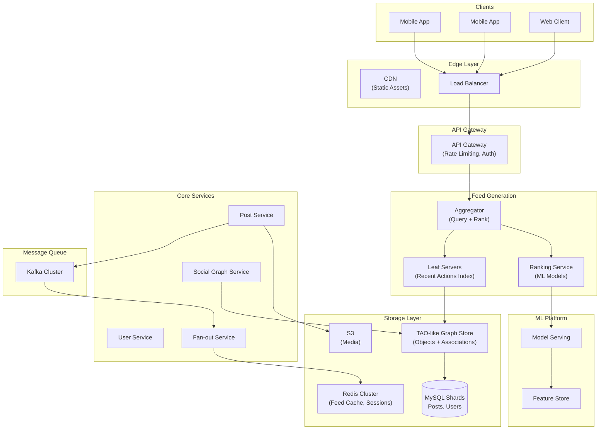
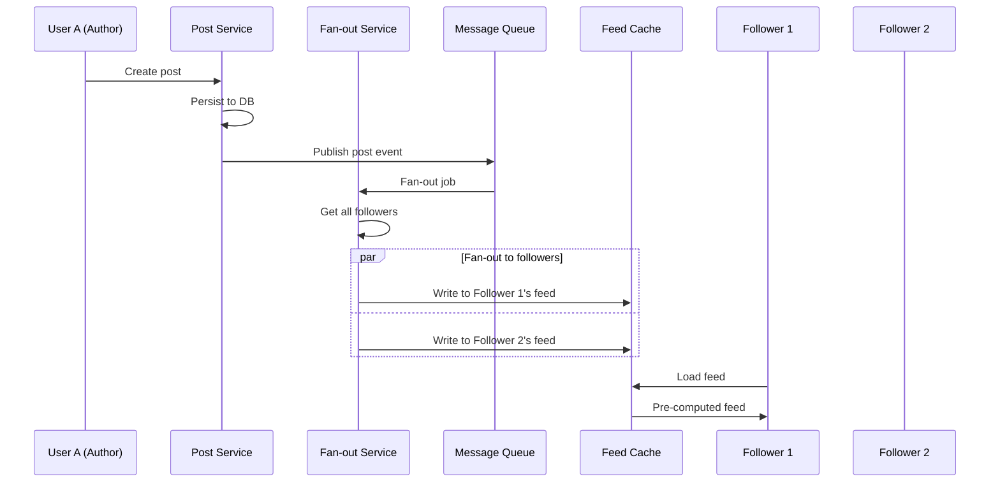
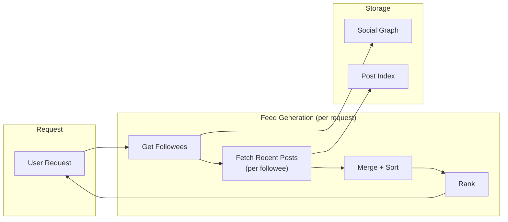
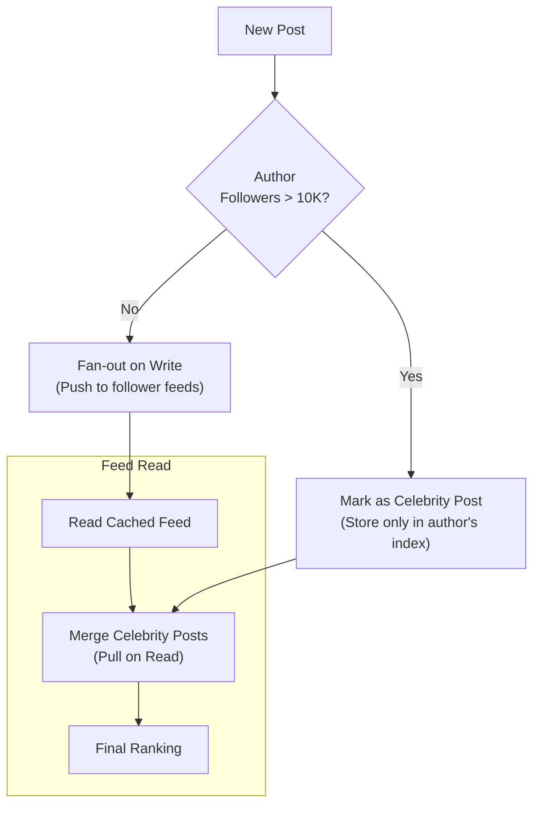
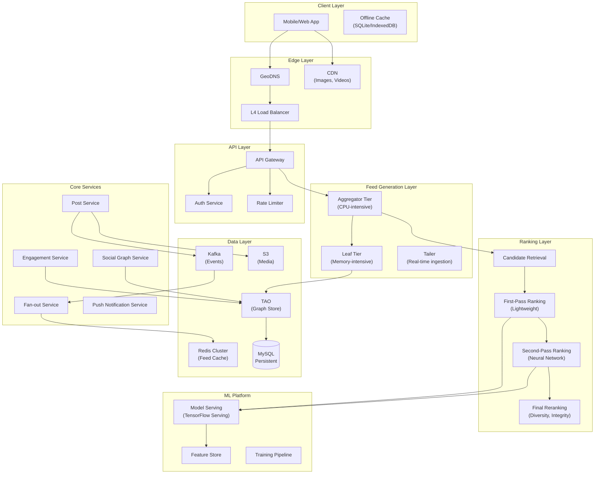
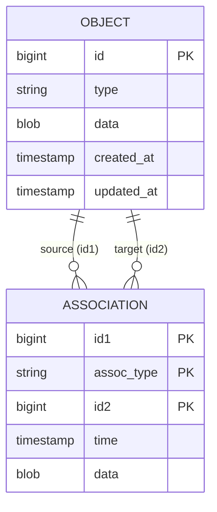
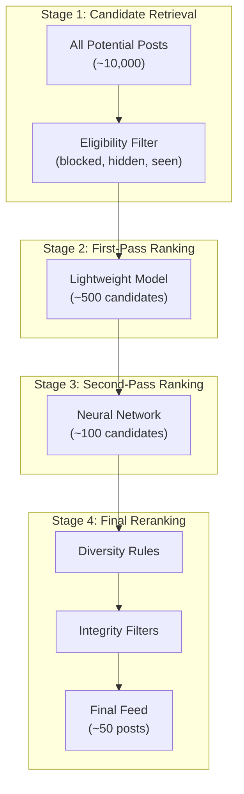
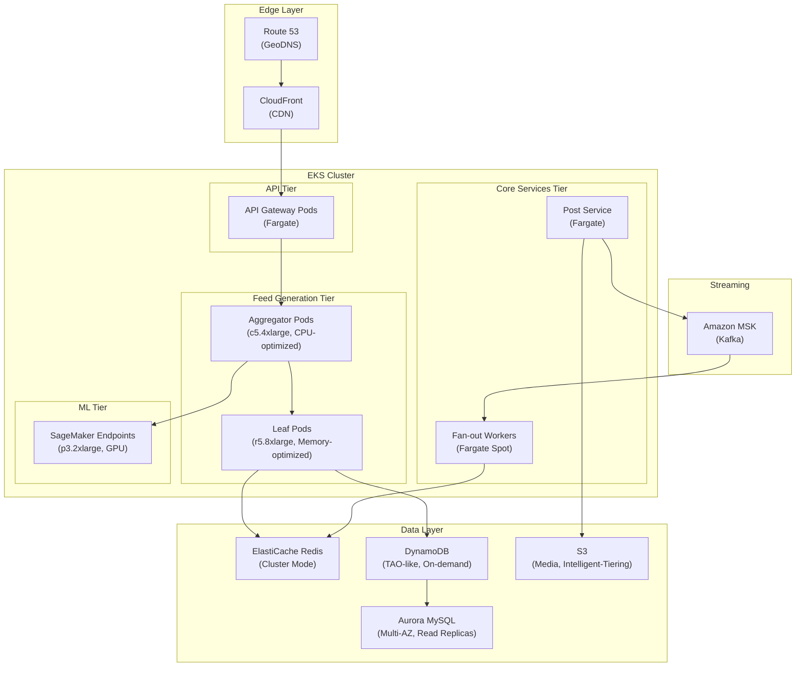
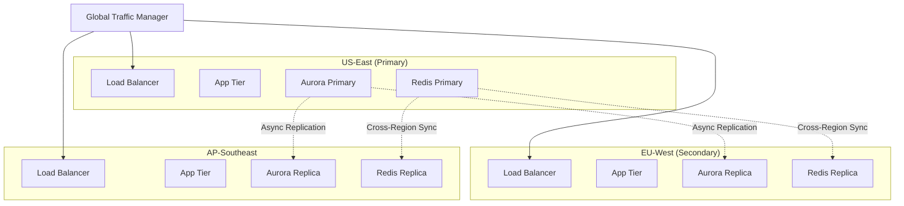

# Design a Social Feed (Facebook/Instagram)

A comprehensive system design for social feed generation and ranking covering fan-out strategies, ML-powered ranking, graph-based storage, and caching at scale. This design addresses sub-second feed delivery for billions of users with personalized content ranking, handling the "celebrity problem" where a single post can require millions of fan-out operations.

<figure>



<figcaption>High-level architecture: Aggregators query leaf servers for candidates, ranking service applies ML models, fan-out service distributes posts to follower feeds, and TAO provides graph storage.</figcaption>
</figure>

## Abstract

Social feed systems solve three interconnected problems: **efficient content distribution** (getting posts to followers), **personalized ranking** (showing the most relevant content first), and **low-latency retrieval** (sub-second feed loads at massive scale).

**Core architectural decisions:**

| Decision         | Choice                | Rationale                                                          |
| ---------------- | --------------------- | ------------------------------------------------------------------ |
| Fan-out strategy | Hybrid push/pull      | Push for regular users, pull for celebrities (>10K followers)      |
| Content storage  | TAO-like graph store  | Objects + associations model fits social data naturally            |
| Feed ranking     | Multi-stage ML funnel | Billions → hundreds → ~50 candidates through progressive filtering |
| Caching          | Two-tier regional     | Followers handle reads, leaders maintain consistency               |
| Consistency      | Eventual (~1 min)     | Acceptable for social content; strong only for engagement counts   |

**Key trade-offs accepted:**

- Eventual consistency for feed updates (fresh-enough is good enough)
- Higher write amplification for regular users (pre-computed feeds)
- Complex hybrid logic for celebrity handling
- ML model staleness (hourly retraining) in exchange for training efficiency

**What this design optimizes:**

- p99 feed load < 500ms globally
- Zero data loss for user-generated content
- Personalized ranking with 1000+ signals
- Linear horizontal scaling to billions of users

## Requirements

### Functional Requirements

| Requirement                          | Priority | Notes                                      |
| ------------------------------------ | -------- | ------------------------------------------ |
| Home feed generation                 | Core     | Aggregated posts from followed users       |
| Post creation                        | Core     | Text, images, videos with privacy settings |
| Feed ranking                         | Core     | Personalized relevance ordering            |
| Real-time feed updates               | Core     | New posts appear without full refresh      |
| Engagement actions                   | Core     | Like, comment, share, save                 |
| Following/followers                  | Core     | Asymmetric social graph                    |
| Feed pagination                      | Core     | Infinite scroll with cursor-based loading  |
| Post visibility                      | Extended | Public, friends-only, custom lists         |
| Stories/ephemeral content            | Extended | 24-hour expiring content                   |
| Algorithmic vs. chronological toggle | Extended | User preference for feed type              |

### Non-Functional Requirements

| Requirement           | Target           | Rationale                                |
| --------------------- | ---------------- | ---------------------------------------- |
| Availability          | 99.99% (4 nines) | Revenue-critical, user retention         |
| Feed load latency     | p99 < 500ms      | User experience threshold                |
| Post publish latency  | p99 < 2s         | Acceptable for async processing          |
| Feed freshness        | < 1 minute       | Balance between freshness and efficiency |
| Ranking model latency | p99 < 100ms      | Real-time personalization requirement    |
| Data durability       | 99.999999%       | No user content loss                     |

### Scale Estimation

**Users:**

- Monthly Active Users (MAU): 2 billion
- Daily Active Users (DAU): 1 billion (50% of MAU)
- Peak concurrent users: 200 million (20% of DAU)

**Traffic:**

- Feed loads per user per day: 20
- Daily feed requests: 1B × 20 = 20 billion/day = 230K RPS
- Peak multiplier: 3× → 700K RPS
- Posts per user per day: 0.5 average (power law distribution)
- Daily posts: 500 million posts/day = 5.8K posts/second

**Storage:**

- Average post size: 2KB (metadata, excluding media)
- Media per post: 500KB average (after compression, CDN-served)
- Daily post storage: 500M × 2KB = 1TB/day (metadata)
- Daily media storage: 500M × 500KB = 250TB/day
- Social graph edges: 2B users × 500 avg connections = 1 trillion edges
- Graph storage: 1T edges × 100 bytes = 100TB

**Fan-out estimation:**

- Average followers: 500
- Posts requiring fan-out: 500M/day
- Fan-out writes: 500M × 500 = 250 billion writes/day
- Celebrity optimization: Top 1% (20M users) average 50K followers
- Without optimization: 20M × 50K × 0.5 posts = 500 trillion writes/day (impossible)

## Design Paths

### Path A: Fan-out on Write (Push Model)

**Best when:**

- Uniform follower distribution (no celebrities)
- Read-heavy workload (reads >> writes)
- Real-time feed freshness is critical
- Simpler operational model preferred

**Architecture:**



**Key characteristics:**

- Pre-computed feeds in Redis/Memcached
- O(1) feed reads, O(followers) writes
- Feed cache stores post IDs in sorted order

**Trade-offs:**

- ✅ Extremely fast feed reads (single cache lookup)
- ✅ Simple feed retrieval logic
- ✅ Predictable read latency
- ❌ Massive write amplification for celebrities
- ❌ High storage cost (duplicate post references)
- ❌ Delayed delivery during fan-out processing

**Real-world example:** Twitter historically used this approach, storing up to 800 tweets per timeline in Redis. At 39M QPS with 105TB RAM across 10,000+ Redis instances, this works for most users but requires special handling for high-follower accounts.

### Path B: Fan-out on Read (Pull Model)

**Best when:**

- Celebrity-heavy platform (many high-follower users)
- Write-heavy workload
- Storage cost is a primary concern
- Acceptable higher read latency

**Architecture:**



**Key characteristics:**

- No write amplification
- Feed computed on demand
- Read complexity: O(followees × posts_per_user)

**Trade-offs:**

- ✅ No write amplification
- ✅ Always fresh content
- ✅ Lower storage requirements
- ❌ Higher read latency (aggregation required)
- ❌ More compute per request
- ❌ Harder to apply complex ranking

**Real-world example:** Facebook moved to this approach in 2007. The Multifeed system fetches tens of thousands of potential updates per user, then ranks and filters to ~45 items. This requires sophisticated indexing and caching to maintain sub-second latency.

### Path C: Hybrid Model (Industry Standard)

**Best when:**

- Mixed follower distribution (most users small, some celebrities)
- Need to optimize both reads and writes
- Can handle additional system complexity
- Facebook/Instagram/Twitter scale

**Architecture:**



**Key characteristics:**

- Threshold-based routing (typically 10K followers)
- Pre-computed feeds + on-demand celebrity merging
- Best of both worlds for common cases

**Trade-offs:**

- ✅ Optimal latency for typical users (pre-computed)
- ✅ Handles celebrities without write explosion
- ✅ Flexible threshold tuning
- ❌ Two code paths to maintain
- ❌ More complex feed read logic
- ❌ Edge cases around threshold (users crossing 10K)

**Real-world example:** Discord uses this approach: direct fan-out for small servers, Kafka-based distribution for large servers (100+ members). Instagram similarly uses hybrid fan-out with ML-based feed generation.

### Path Comparison

| Factor              | Fan-out Write      | Fan-out Read       | Hybrid                 |
| ------------------- | ------------------ | ------------------ | ---------------------- |
| Read latency        | ~10ms              | ~200ms             | ~50ms                  |
| Write latency       | O(followers)       | O(1)               | O(followers) for small |
| Celebrity handling  | Impossible         | Native             | Optimized              |
| Storage cost        | High               | Low                | Medium                 |
| Complexity          | Low                | Medium             | High                   |
| Production examples | Twitter (pre-2015) | Facebook Multifeed | Instagram, Discord     |

### This Article's Focus

This article focuses on **Path C (Hybrid)** because:

1. Represents modern production architectures at Facebook/Instagram scale
2. Demonstrates trade-off thinking essential for system design
3. Handles the full spectrum from regular users to celebrities
4. Balances latency, storage, and operational complexity

## High-Level Design

### Component Overview



### Feed Generation Service (Multifeed)

The feed generation layer follows Facebook's Multifeed architecture with disaggregated tiers:

**Aggregator Tier:**

- CPU-intensive query processing and ranking
- Stateless, horizontally scalable
- Queries multiple leaf servers in parallel
- Applies ML ranking models to candidates

**Leaf Tier:**

- Memory-intensive, stores recent action indices
- Indexes posts by author, sorted by time
- Maintains in-memory structures for fast retrieval
- Sharded by user ID

**Tailer:**

- Real-time data pipeline from Kafka
- Updates leaf indices as posts are created
- Handles index rebuilding from persistent storage

**Design decisions:**

| Decision          | Choice                        | Rationale                                   |
| ----------------- | ----------------------------- | ------------------------------------------- |
| Tier separation   | Disaggregated aggregator/leaf | 40% efficiency gain, independent scaling    |
| Leaf sharding     | By author user_id             | Co-locates author's posts for range queries |
| Index structure   | Time-sorted skip list         | Fast range queries with O(log n) insert     |
| Memory management | LRU eviction, flash overflow  | Balance hot data in RAM, cold on SSD        |

### Social Graph Service (TAO-like)

Manages the social graph (follows, friends, blocks) and content relationships:

**Data model:**

- **Objects**: Users, posts, comments, pages (nodes)
- **Associations**: Follows, likes, comments, tags (edges)

**Design characteristics:**

- Two tables only: objects and associations
- Associations stored on source object's shard
- Enables single-shard queries for common patterns



### Fan-out Service

Handles post distribution to follower feeds:

**Routing logic:**

```typescript
interface FanoutRouter {
  routePost(post: Post, author: User): FanoutStrategy
}

type FanoutStrategy =
  | { type: "push"; followers: string[] }
  | { type: "pull"; authorId: string }
  | { type: "hybrid"; pushTo: string[]; markForPull: boolean }
```

**Threshold-based routing:**

- Authors with < 10K followers: Full push fan-out
- Authors with 10K-1M followers: Hybrid (push to active followers, pull for rest)
- Authors with > 1M followers: Pull only (mark post for read-time merging)

### Ranking Service

Multi-stage funnel progressively narrows candidates:



## API Design

### Feed Endpoints

#### Get Home Feed

**Endpoint:** `GET /api/v1/feed`

**Query Parameters:**

| Parameter | Type    | Description                           |
| --------- | ------- | ------------------------------------- |
| cursor    | string  | Pagination cursor (opaque)            |
| limit     | int     | Items per page (default: 20, max: 50) |
| refresh   | boolean | Force fresh feed generation           |

**Response (200 OK):**

```json
{
  "posts": [
    {
      "id": "post_abc123",
      "author": {
        "id": "user_456",
        "username": "johndoe",
        "displayName": "John Doe",
        "avatarUrl": "https://cdn.example.com/avatars/456.jpg",
        "isVerified": true
      },
      "content": {
        "type": "image",
        "text": "Beautiful sunset! 🌅",
        "media": [
          {
            "id": "media_789",
            "type": "image",
            "url": "https://cdn.example.com/posts/789.jpg",
            "thumbnailUrl": "https://cdn.example.com/posts/789_thumb.jpg",
            "width": 1080,
            "height": 1350,
            "altText": "Sunset over the ocean"
          }
        ]
      },
      "engagement": {
        "likeCount": 1542,
        "commentCount": 89,
        "shareCount": 23,
        "viewCount": 12450,
        "isLiked": false,
        "isSaved": false
      },
      "ranking": {
        "score": 0.89,
        "reason": "friend_interaction"
      },
      "createdAt": "2024-02-03T10:30:00Z",
      "visibility": "public"
    }
  ],
  "pagination": {
    "nextCursor": "eyJ0IjoxNzA2ODg2NDAwfQ",
    "hasMore": true
  },
  "meta": {
    "feedType": "ranked",
    "generatedAt": "2024-02-03T12:00:00Z"
  }
}
```

#### Create Post

**Endpoint:** `POST /api/v1/posts`

**Request:**

```json
{
  "content": {
    "text": "Hello world!",
    "mediaIds": ["upload_123", "upload_456"]
  },
  "visibility": "public",
  "allowComments": true,
  "allowSharing": true,
  "location": {
    "latitude": 37.7749,
    "longitude": -122.4194,
    "name": "San Francisco, CA"
  }
}
```

**Response (201 Created):**

```json
{
  "id": "post_new789",
  "author": {
    "id": "user_123",
    "username": "currentuser"
  },
  "content": {
    "text": "Hello world!",
    "media": [...]
  },
  "createdAt": "2024-02-03T12:05:00Z",
  "visibility": "public",
  "fanoutStatus": "pending"
}
```

#### Real-time Feed Updates (SSE)

**Endpoint:** `GET /api/v1/feed/stream`

**Event Types:**

```
event: new_post
data: {"postId": "post_xyz", "authorId": "user_456", "preview": "Check out..."}

event: engagement_update
data: {"postId": "post_abc", "likeCount": 1543, "commentCount": 90}

event: post_removed
data: {"postId": "post_old", "reason": "author_deleted"}
```

### Engagement Endpoints

#### Like/Unlike Post

**Endpoint:** `POST /api/v1/posts/{id}/like`

**Response (200 OK):**

```json
{
  "liked": true,
  "likeCount": 1543,
  "timestamp": "2024-02-03T12:10:00Z"
}
```

#### Get Comments

**Endpoint:** `GET /api/v1/posts/{id}/comments`

**Query Parameters:**

| Parameter | Type   | Description                            |
| --------- | ------ | -------------------------------------- |
| cursor    | string | Pagination cursor                      |
| limit     | int    | Comments per page (default: 20)        |
| sort      | string | "top" (engagement), "newest", "oldest" |

**Response (200 OK):**

```json
{
  "comments": [
    {
      "id": "comment_123",
      "author": {
        "id": "user_789",
        "username": "commenter",
        "avatarUrl": "..."
      },
      "text": "Great post!",
      "likeCount": 45,
      "replyCount": 3,
      "isLiked": false,
      "createdAt": "2024-02-03T10:35:00Z",
      "replies": []
    }
  ],
  "pagination": {
    "nextCursor": "...",
    "hasMore": true
  },
  "totalCount": 89
}
```

### Error Responses

| Code | Error              | When                                    |
| ---- | ------------------ | --------------------------------------- |
| 400  | `INVALID_CONTENT`  | Post content violates rules             |
| 401  | `UNAUTHORIZED`     | Missing or invalid token                |
| 403  | `FORBIDDEN`        | User blocked or content restricted      |
| 404  | `POST_NOT_FOUND`   | Post doesn't exist or is deleted        |
| 429  | `RATE_LIMITED`     | Too many requests                       |
| 503  | `FEED_UNAVAILABLE` | Feed generation temporarily unavailable |

**Rate limits:**

| Endpoint      | Limit | Window     |
| ------------- | ----- | ---------- |
| Feed load     | 60    | per minute |
| Post creation | 10    | per hour   |
| Like/comment  | 100   | per minute |
| Media upload  | 50    | per hour   |

## Data Modeling

### TAO Schema (Objects and Associations)

#### Objects Table

```sql
CREATE TABLE objects (
    id BIGINT PRIMARY KEY,
    type VARCHAR(50) NOT NULL,
    data BLOB,
    created_at TIMESTAMP DEFAULT CURRENT_TIMESTAMP,
    updated_at TIMESTAMP DEFAULT CURRENT_TIMESTAMP ON UPDATE CURRENT_TIMESTAMP,
    INDEX idx_type_created (type, created_at)
);
```

**Object types:**

| Type    | Data Fields                                               |
| ------- | --------------------------------------------------------- |
| user    | username, display_name, avatar_url, bio, follower_count   |
| post    | author_id, content, visibility, like_count, comment_count |
| comment | post_id, author_id, text, like_count                      |
| media   | post_id, url, type, dimensions, alt_text                  |

#### Associations Table

```sql
CREATE TABLE associations (
    id1 BIGINT NOT NULL,
    assoc_type VARCHAR(50) NOT NULL,
    id2 BIGINT NOT NULL,
    time BIGINT NOT NULL,
    data BLOB,
    PRIMARY KEY (id1, assoc_type, id2),
    INDEX idx_id1_type_time (id1, assoc_type, time DESC)
);
```

**Association types:**

| Type      | id1         | id2         | Data       |
| --------- | ----------- | ----------- | ---------- |
| follows   | follower_id | followee_id | created_at |
| authored  | user_id     | post_id     | -          |
| liked     | user_id     | post_id     | created_at |
| commented | user_id     | comment_id  | -          |
| tagged    | post_id     | user_id     | -          |

**Sharding strategy:**

- Shard by id1 (source object)
- Co-locates user's follows, likes, authored posts
- Enables single-shard queries for common patterns

### Feed Cache Schema (Redis)

```redis
# Pre-computed feed (sorted set)
# Score = ranking score or timestamp
ZADD feed:{user_id} {score} {post_id}

# Keep last 500 posts per feed
ZREMRANGEBYRANK feed:{user_id} 0 -501

# Feed metadata (hash)
HSET feed:meta:{user_id}
    last_generated 1706886400000
    version 42
    type "ranked"

# Celebrity posts index (for pull-based merging)
ZADD celebrity_posts:{author_id} {timestamp} {post_id}

# User's recent engagement (for ranking features)
ZADD user:engaged:{user_id} {timestamp} {post_id}
EXPIRE user:engaged:{user_id} 604800  # 7 days
```

### Post Index (Leaf Servers)

In-memory index structure on leaf servers:

```typescript
interface PostIndex {
  // Posts by author, sorted by time (descending)
  authorIndex: Map<UserId, SortedSet<PostId, Timestamp>>

  // Posts by visibility for filtering
  visibilityIndex: Map<Visibility, Set<PostId>>

  // Recent posts global index (for trending)
  recentPosts: SortedSet<PostId, Timestamp>
}

interface SortedSet<K, S> {
  add(key: K, score: S): void
  range(start: S, end: S, limit: number): K[]
  remove(key: K): void
}
```

### MySQL Persistent Storage

```sql
-- Users table
CREATE TABLE users (
    id BIGINT PRIMARY KEY AUTO_INCREMENT,
    username VARCHAR(50) UNIQUE NOT NULL,
    display_name VARCHAR(100),
    email VARCHAR(255) UNIQUE NOT NULL,
    password_hash VARCHAR(255) NOT NULL,
    avatar_url TEXT,
    bio TEXT,
    follower_count INT DEFAULT 0,
    following_count INT DEFAULT 0,
    post_count INT DEFAULT 0,
    is_verified BOOLEAN DEFAULT FALSE,
    is_celebrity BOOLEAN DEFAULT FALSE,  -- >10K followers
    created_at TIMESTAMP DEFAULT CURRENT_TIMESTAMP,
    INDEX idx_username (username),
    INDEX idx_email (email)
) ENGINE=InnoDB;

-- Posts table
CREATE TABLE posts (
    id BIGINT PRIMARY KEY AUTO_INCREMENT,
    author_id BIGINT NOT NULL,
    content_text TEXT,
    content_type ENUM('text', 'image', 'video', 'link') NOT NULL,
    visibility ENUM('public', 'friends', 'private') DEFAULT 'public',
    like_count INT DEFAULT 0,
    comment_count INT DEFAULT 0,
    share_count INT DEFAULT 0,
    view_count INT DEFAULT 0,
    is_deleted BOOLEAN DEFAULT FALSE,
    created_at TIMESTAMP DEFAULT CURRENT_TIMESTAMP,
    updated_at TIMESTAMP DEFAULT CURRENT_TIMESTAMP ON UPDATE CURRENT_TIMESTAMP,
    INDEX idx_author_created (author_id, created_at DESC),
    INDEX idx_created (created_at DESC),
    FOREIGN KEY (author_id) REFERENCES users(id)
) ENGINE=InnoDB;

-- Social graph (follow relationships)
CREATE TABLE follows (
    follower_id BIGINT NOT NULL,
    followee_id BIGINT NOT NULL,
    created_at TIMESTAMP DEFAULT CURRENT_TIMESTAMP,
    PRIMARY KEY (follower_id, followee_id),
    INDEX idx_followee (followee_id),
    FOREIGN KEY (follower_id) REFERENCES users(id),
    FOREIGN KEY (followee_id) REFERENCES users(id)
) ENGINE=InnoDB;

-- Engagement (likes, saves)
CREATE TABLE post_likes (
    user_id BIGINT NOT NULL,
    post_id BIGINT NOT NULL,
    created_at TIMESTAMP DEFAULT CURRENT_TIMESTAMP,
    PRIMARY KEY (user_id, post_id),
    INDEX idx_post (post_id),
    FOREIGN KEY (user_id) REFERENCES users(id),
    FOREIGN KEY (post_id) REFERENCES posts(id)
) ENGINE=InnoDB;
```

### Database Selection Matrix

| Data Type     | Store                 | Rationale                                      |
| ------------- | --------------------- | ---------------------------------------------- |
| Social graph  | TAO (MySQL-backed)    | Optimized for graph queries, association lists |
| User profiles | MySQL                 | ACID, moderate scale                           |
| Posts         | MySQL + TAO cache     | Durability + fast graph queries                |
| Feed cache    | Redis                 | Sub-ms reads, sorted sets for ranking          |
| Post index    | Leaf servers (memory) | Ultra-fast candidate retrieval                 |
| Media         | S3 + CDN              | Cost-effective, globally distributed           |
| ML features   | Feature store         | Consistent features for training/serving       |
| Analytics     | ClickHouse            | Time-series, aggregations                      |

## Low-Level Design

### Feed Generation Algorithm

#### Candidate Retrieval

```typescript collapse={1-12}
class CandidateRetriever {
  private readonly leafClient: LeafClient
  private readonly taoClient: TAOClient
  private readonly redis: RedisCluster

  async getCandidates(userId: string): Promise<CandidateSet> {
    // 1. Get user's followees
    const followees = await this.taoClient.getAssociations(userId, "follows", { limit: 5000 })

    // 2. Fetch recent posts from each followee (parallel)
    const postPromises = followees.map((followee) =>
      this.leafClient.getAuthorPosts(followee.id2, {
        since: Date.now() - 7 * 24 * 60 * 60 * 1000, // 7 days
        limit: 50,
      }),
    )

    const postsByAuthor = await Promise.all(postPromises)

    // 3. Fetch celebrity posts for pull-based merging
    const celebrityFollowees = followees.filter((f) => f.data.isCelebrity)
    const celebrityPosts = await this.getCelebrityPosts(celebrityFollowees.map((f) => f.id2))

    // 4. Merge and deduplicate
    const allPosts = [...postsByAuthor.flat(), ...celebrityPosts]

    // 5. Apply eligibility filters
    const eligible = await this.filterEligible(userId, allPosts)

    return {
      candidates: eligible,
      source: {
        fromCache: postsByAuthor.length,
        fromCelebrity: celebrityPosts.length,
      },
    }
  }

  private async filterEligible(userId: string, posts: Post[]): Promise<Post[]> {
    // Filter out: blocked authors, hidden posts, already seen
    const [blocked, hidden, seen] = await Promise.all([
      this.taoClient.getAssociations(userId, "blocks"),
      this.redis.smembers(`hidden:${userId}`),
      this.redis.smembers(`seen:${userId}`),
    ])

    const blockedSet = new Set(blocked.map((b) => b.id2))
    const hiddenSet = new Set(hidden)
    const seenSet = new Set(seen)

    return posts.filter(
      (post) =>
        !blockedSet.has(post.authorId) &&
        !hiddenSet.has(post.id) &&
        !seenSet.has(post.id) &&
        this.checkVisibility(userId, post),
    )
  }
}
```

#### Multi-Stage Ranking

```typescript collapse={1-15}
class FeedRanker {
  private readonly featureStore: FeatureStore
  private readonly modelServer: ModelServer

  async rank(userId: string, candidates: Post[]): Promise<RankedPost[]> {
    // Stage 1: First-pass lightweight ranking
    const stage1 = await this.firstPassRank(userId, candidates)
    const top500 = stage1.slice(0, 500)

    // Stage 2: Second-pass neural network
    const stage2 = await this.secondPassRank(userId, top500)
    const top100 = stage2.slice(0, 100)

    // Stage 3: Final reranking with diversity
    const final = await this.finalRerank(userId, top100)

    return final.slice(0, 50)
  }

  private async firstPassRank(userId: string, candidates: Post[]): Promise<RankedPost[]> {
    // Lightweight features (can compute in-process)
    const features = candidates.map((post) => ({
      postId: post.id,
      recency: this.computeRecency(post.createdAt),
      authorAffinity: this.getAuthorAffinity(userId, post.authorId),
      contentType: post.contentType,
      engagementVelocity: this.getEngagementVelocity(post),
    }))

    // Simple linear model for speed
    const scores = features.map(
      (f) =>
        0.3 * f.recency +
        0.4 * f.authorAffinity +
        0.2 * f.engagementVelocity +
        0.1 * this.contentTypeBoost(f.contentType),
    )

    return this.sortByScore(candidates, scores)
  }

  private async secondPassRank(userId: string, candidates: Post[]): Promise<RankedPost[]> {
    // Fetch rich features from feature store
    const features = await this.featureStore.getBatch(
      candidates.map((c) => ({
        userId,
        postId: c.id,
        authorId: c.authorId,
      })),
    )

    // Neural network scoring
    const scores = await this.modelServer.predict("feed_ranking_v2", features)

    return this.sortByScore(candidates, scores)
  }

  private async finalRerank(userId: string, candidates: RankedPost[]): Promise<RankedPost[]> {
    // Apply diversity rules
    const diversified = this.applyDiversity(candidates, {
      maxPerAuthor: 2,
      contentTypeMix: { image: 0.4, video: 0.3, text: 0.3 },
      maxAds: 3,
    })

    // Apply integrity filters (misinformation, policy violations)
    const filtered = await this.applyIntegrityFilters(diversified)

    return filtered
  }

  private applyDiversity(posts: RankedPost[], rules: DiversityRules): RankedPost[] {
    const result: RankedPost[] = []
    const authorCounts = new Map<string, number>()
    const typeCounts = new Map<string, number>()

    for (const post of posts) {
      const authorCount = authorCounts.get(post.authorId) || 0
      if (authorCount >= rules.maxPerAuthor) continue

      // Check content type distribution
      const typeCount = typeCounts.get(post.contentType) || 0
      const typeRatio = typeCount / (result.length + 1)
      const maxRatio = rules.contentTypeMix[post.contentType] || 0.5
      if (typeRatio > maxRatio && result.length > 10) continue

      result.push(post)
      authorCounts.set(post.authorId, authorCount + 1)
      typeCounts.set(post.contentType, typeCount + 1)
    }

    return result
  }
}
```

### Fan-out Pipeline

```typescript collapse={1-20}
class FanoutService {
  private readonly CELEBRITY_THRESHOLD = 10_000
  private readonly BATCH_SIZE = 1000

  async fanoutPost(post: Post, author: User): Promise<FanoutResult> {
    const followerCount = author.followerCount

    if (followerCount < this.CELEBRITY_THRESHOLD) {
      return this.pushFanout(post, author)
    } else if (followerCount < 1_000_000) {
      return this.hybridFanout(post, author)
    } else {
      return this.pullOnly(post, author)
    }
  }

  private async pushFanout(post: Post, author: User): Promise<FanoutResult> {
    // Get all followers
    const followers = await this.getFollowers(author.id)

    // Process in batches to avoid memory pressure
    const batches = this.chunk(followers, this.BATCH_SIZE)
    let written = 0

    for (const batch of batches) {
      const pipeline = this.redis.pipeline()

      for (const followerId of batch) {
        // Add to follower's feed with timestamp score
        pipeline.zadd(`feed:${followerId}`, post.createdAt.getTime(), post.id)
        // Trim to max 500 posts
        pipeline.zremrangebyrank(`feed:${followerId}`, 0, -501)
      }

      await pipeline.exec()
      written += batch.length

      // Emit progress for monitoring
      this.metrics.increment("fanout.writes", batch.length)
    }

    return {
      strategy: "push",
      followersReached: written,
      duration: Date.now() - post.createdAt.getTime(),
    }
  }

  private async hybridFanout(post: Post, author: User): Promise<FanoutResult> {
    // Get active followers (engaged in last 7 days)
    const activeFollowers = await this.getActiveFollowers(author.id, 7)

    // Push to active followers only
    const pushResult = await this.pushToFollowers(post, activeFollowers)

    // Mark post for pull-based retrieval by inactive followers
    await this.redis.zadd(`celebrity_posts:${author.id}`, post.createdAt.getTime(), post.id)
    await this.redis.expire(`celebrity_posts:${author.id}`, 7 * 24 * 60 * 60)

    return {
      strategy: "hybrid",
      pushed: pushResult.count,
      markedForPull: author.followerCount - activeFollowers.length,
    }
  }

  private async pullOnly(post: Post, author: User): Promise<FanoutResult> {
    // Only index for pull-based retrieval
    await this.redis.zadd(`celebrity_posts:${author.id}`, post.createdAt.getTime(), post.id)

    // Update author's post index
    await this.leafClient.indexPost(post)

    return {
      strategy: "pull",
      indexed: true,
    }
  }
}
```

### Cache Consistency (TAO Pattern)

TAO uses a two-tier caching architecture with leasing for consistency:

```typescript collapse={1-15}
class TAOCache {
  private readonly leaseTimeout = 10_000 // 10 seconds

  async get(id1: string, assocType: string): Promise<Association[] | null> {
    // Try follower cache first
    const followerResult = await this.followerCache.get(this.cacheKey(id1, assocType))

    if (followerResult) {
      this.metrics.increment("cache.hit.follower")
      return followerResult
    }

    // Try leader cache
    const leaderResult = await this.leaderCache.get(this.cacheKey(id1, assocType))

    if (leaderResult) {
      this.metrics.increment("cache.hit.leader")
      // Populate follower cache
      await this.followerCache.set(this.cacheKey(id1, assocType), leaderResult, { ttl: 300 })
      return leaderResult
    }

    // Cache miss - fetch from MySQL with lease
    return this.fetchWithLease(id1, assocType)
  }

  private async fetchWithLease(id1: string, assocType: string): Promise<Association[]> {
    const leaseKey = `lease:${id1}:${assocType}`

    // Try to acquire lease
    const acquired = await this.redis.set(leaseKey, "1", "NX", "PX", this.leaseTimeout)

    if (!acquired) {
      // Another request is fetching - wait and retry
      await this.sleep(100)
      return this.get(id1, assocType)
    }

    try {
      // Fetch from MySQL
      const data = await this.mysql.query(
        `SELECT * FROM associations
         WHERE id1 = ? AND assoc_type = ?
         ORDER BY time DESC`,
        [id1, assocType],
      )

      // Populate both cache tiers
      await Promise.all([
        this.leaderCache.set(this.cacheKey(id1, assocType), data, { ttl: 3600 }),
        this.followerCache.set(this.cacheKey(id1, assocType), data, { ttl: 300 }),
      ])

      return data
    } finally {
      // Release lease
      await this.redis.del(leaseKey)
    }
  }

  async invalidate(id1: string, assocType: string): Promise<void> {
    // Delete from both tiers
    const key = this.cacheKey(id1, assocType)
    await Promise.all([this.followerCache.del(key), this.leaderCache.del(key)])
  }
}
```

### Engagement Counter (Eventual Consistency)

Engagement counts (likes, comments) use write-behind pattern for efficiency:

```typescript collapse={1-12}
class EngagementService {
  private readonly FLUSH_INTERVAL = 5000 // 5 seconds
  private pendingUpdates = new Map<string, EngagementDelta>()

  async incrementLike(postId: string): Promise<void> {
    // Immediate Redis increment for read consistency
    await this.redis.hincrby(`post:${postId}`, "like_count", 1)

    // Buffer MySQL update
    this.bufferUpdate(postId, { likes: 1 })
  }

  private bufferUpdate(postId: string, delta: EngagementDelta): void {
    const existing = this.pendingUpdates.get(postId) || {
      likes: 0,
      comments: 0,
      shares: 0,
    }

    this.pendingUpdates.set(postId, {
      likes: existing.likes + (delta.likes || 0),
      comments: existing.comments + (delta.comments || 0),
      shares: existing.shares + (delta.shares || 0),
    })
  }

  // Periodic flush to MySQL
  @Scheduled(FLUSH_INTERVAL)
  async flushToMySQL(): Promise<void> {
    const updates = new Map(this.pendingUpdates)
    this.pendingUpdates.clear()

    const queries = Array.from(updates.entries()).map(([postId, delta]) =>
      this.mysql.query(
        `UPDATE posts SET
          like_count = like_count + ?,
          comment_count = comment_count + ?,
          share_count = share_count + ?
         WHERE id = ?`,
        [delta.likes, delta.comments, delta.shares, postId],
      ),
    )

    await Promise.all(queries)
  }
}
```

## Frontend Considerations

### Feed Virtualization

For infinite scroll with thousands of potential posts:

```typescript collapse={1-15}
interface VirtualFeedConfig {
  containerHeight: number
  estimatedItemHeight: number
  overscan: number // Extra items above/below viewport
}

class VirtualFeed {
  private heightCache = new Map<string, number>()
  private offsetCache: number[] = []

  calculateVisibleRange(scrollTop: number, posts: Post[]): { start: number; end: number } {
    // Binary search for start index
    let start = this.binarySearchOffset(scrollTop - this.config.overscan * 300)

    // Calculate end based on viewport
    let accumulatedHeight = this.offsetCache[start] || 0
    let end = start

    while (
      end < posts.length &&
      accumulatedHeight < scrollTop + this.config.containerHeight + this.config.overscan * 300
    ) {
      accumulatedHeight += this.getItemHeight(posts[end])
      end++
    }

    return { start, end }
  }

  private getItemHeight(post: Post): number {
    // Check cache first
    if (this.heightCache.has(post.id)) {
      return this.heightCache.get(post.id)!
    }

    // Estimate based on content type
    let estimate = 100 // Base height
    if (post.content.media?.length > 0) {
      estimate += 400 // Image/video
    }
    if (post.content.text?.length > 200) {
      estimate += 50 // Long text
    }

    return estimate
  }

  // Called after actual render to update height cache
  onItemRendered(postId: string, actualHeight: number): void {
    this.heightCache.set(postId, actualHeight)
    this.rebuildOffsetCache()
  }
}
```

### Optimistic Engagement Updates

```typescript collapse={1-10}
class FeedStore {
  private posts = new Map<string, Post>()
  private pendingLikes = new Set<string>()

  async likePost(postId: string): Promise<void> {
    const post = this.posts.get(postId)
    if (!post || this.pendingLikes.has(postId)) return

    // Optimistic update
    this.pendingLikes.add(postId)
    this.updatePost(postId, {
      engagement: {
        ...post.engagement,
        likeCount: post.engagement.likeCount + 1,
        isLiked: true,
      },
    })

    // Re-render immediately
    this.notifySubscribers(postId)

    try {
      await this.api.likePost(postId)
    } catch (error) {
      // Rollback on failure
      this.updatePost(postId, {
        engagement: {
          ...post.engagement,
          likeCount: post.engagement.likeCount,
          isLiked: false,
        },
      })
      this.notifySubscribers(postId)
    } finally {
      this.pendingLikes.delete(postId)
    }
  }
}
```

### Real-time Feed Updates

```typescript collapse={1-12}
class FeedStreamManager {
  private eventSource: EventSource | null = null
  private reconnectAttempt = 0

  connect(userId: string): void {
    this.eventSource = new EventSource(`/api/v1/feed/stream?userId=${userId}`)

    this.eventSource.addEventListener("new_post", (event) => {
      const data = JSON.parse(event.data)
      this.onNewPost(data)
    })

    this.eventSource.addEventListener("engagement_update", (event) => {
      const data = JSON.parse(event.data)
      this.onEngagementUpdate(data)
    })

    this.eventSource.onerror = () => {
      this.scheduleReconnect()
    }
  }

  private onNewPost(data: NewPostEvent): void {
    // Show "New posts available" indicator instead of auto-inserting
    // This prevents jarring scroll position changes
    this.feedStore.setPendingPosts(data.count)
    this.ui.showNewPostsIndicator()
  }

  private onEngagementUpdate(data: EngagementUpdateEvent): void {
    // Update counts in place (non-disruptive)
    this.feedStore.updateEngagement(data.postId, data)
  }

  loadNewPosts(): void {
    // User clicked "Show new posts"
    const pending = this.feedStore.getPendingPosts()
    this.feedStore.prependPosts(pending)
    this.feedStore.clearPendingPosts()
    this.ui.scrollToTop()
  }
}
```

### Prefetching Strategy

```typescript collapse={1-10}
class FeedPrefetcher {
  private readonly PREFETCH_THRESHOLD = 5 // Posts from bottom

  onScroll(visibleRange: { start: number; end: number }, totalPosts: number): void {
    const postsRemaining = totalPosts - visibleRange.end

    if (postsRemaining < this.PREFETCH_THRESHOLD && !this.loading) {
      this.prefetchNextPage()
    }
  }

  private async prefetchNextPage(): Promise<void> {
    this.loading = true

    try {
      const cursor = this.feedStore.getNextCursor()
      const response = await this.api.getFeed({ cursor, limit: 20 })

      // Add to store but don't re-render yet
      this.feedStore.appendPosts(response.posts)
      this.feedStore.setNextCursor(response.pagination.nextCursor)
    } finally {
      this.loading = false
    }
  }
}
```

## Infrastructure

### Cloud-Agnostic Components

| Component     | Purpose              | Options                            |
| ------------- | -------------------- | ---------------------------------- |
| API Gateway   | Auth, rate limiting  | Kong, Envoy, Nginx                 |
| Graph Store   | Social graph         | Custom TAO-like, Neo4j, DGraph     |
| KV Cache      | Feed cache, sessions | Redis, KeyDB, Dragonfly            |
| Message Queue | Fan-out, events      | Kafka, Pulsar, NATS                |
| Relational DB | Users, posts         | MySQL, PostgreSQL, CockroachDB     |
| Object Store  | Media files          | MinIO, Ceph, S3-compatible         |
| ML Serving    | Ranking models       | TensorFlow Serving, Triton, Seldon |
| Feature Store | ML features          | Feast, Tecton, custom              |

### AWS Reference Architecture



**Service configurations:**

| Service           | Configuration               | Rationale                           |
| ----------------- | --------------------------- | ----------------------------------- |
| Aggregator        | c5.4xlarge (16 vCPU, 32GB)  | CPU-bound ranking computation       |
| Leaf              | r5.8xlarge (32 vCPU, 256GB) | Memory-intensive index storage      |
| Fan-out workers   | Fargate Spot                | Cost-effective async processing     |
| ElastiCache Redis | r6g.2xlarge cluster mode    | Sub-ms feed cache reads             |
| Aurora MySQL      | db.r6g.4xlarge Multi-AZ     | Durability, read replicas for scale |
| DynamoDB          | On-demand mode              | TAO-like graph store, auto-scaling  |
| SageMaker         | p3.2xlarge (1 GPU)          | Neural network inference            |

### Multi-Region Deployment



**Multi-region considerations:**

- Primary region for all writes (US-East)
- Read replicas in each region for local read latency
- Redis cross-region replication for feed cache
- ~50-100ms replication lag acceptable for social content
- Failover to secondary region if primary unavailable

## Conclusion

This design provides a social feed system with:

1. **Sub-500ms feed generation** via hybrid fan-out and pre-computed caches
2. **Personalized ranking** using multi-stage ML funnel (1000+ signals)
3. **Infinite scalability** through disaggregated architecture and sharding
4. **Celebrity handling** via pull-based merging avoiding write explosion
5. **Eventual consistency** acceptable for social content (strong for engagement)

**Key architectural decisions:**

- Hybrid fan-out balances latency (push) with scalability (pull)
- TAO-like graph store optimizes social relationship queries
- Multi-stage ranking funnel enables complex ML without latency impact
- Two-tier caching with leasing prevents thundering herd

**Known limitations:**

- ~1 minute eventual consistency for feed updates
- Pull-based celebrity posts may have slightly higher latency
- ML model staleness between hourly retraining windows
- Complex operational model with multiple specialized tiers

**Future enhancements:**

- Real-time ML model serving for instant personalization
- Federated learning for privacy-preserving ranking
- Graph neural networks for improved content understanding
- Edge-based feed generation for reduced latency

## Appendix

### Prerequisites

- Distributed systems fundamentals (caching, sharding, replication)
- ML basics (training vs. serving, feature engineering)
- Graph database concepts
- Message queue patterns (pub/sub, fan-out)

### Terminology

| Term                    | Definition                                                   |
| ----------------------- | ------------------------------------------------------------ |
| **Fan-out**             | Distributing a post to multiple follower feeds               |
| **TAO**                 | Facebook's graph store (The Associations and Objects)        |
| **Aggregator**          | Service that queries and combines data from multiple sources |
| **Leaf server**         | Memory-intensive server storing indexed data                 |
| **Candidate retrieval** | First stage of ranking - gathering potential items           |
| **Affinity**            | Strength of relationship between user and content/author     |
| **Leasing**             | Cache coordination pattern to prevent thundering herd        |

### Summary

- **Hybrid fan-out** (push for regular users, pull for celebrities) balances write amplification with read latency
- **TAO-like graph storage** with objects and associations models social data naturally and enables efficient graph queries
- **Multi-stage ML ranking** (billions → hundreds → 50) enables sophisticated personalization without latency impact
- **Two-tier regional caching** with followers and leaders maintains consistency while providing sub-ms reads
- **Eventual consistency** (~1 minute) is acceptable for social content; engagement counts use write-behind pattern
- Scale to 700K RPS feed loads with disaggregated aggregator/leaf architecture

### References

**Real-World Implementations:**

- [Serving Facebook Multifeed: Efficiency, Performance Gains Through Redesign](https://engineering.fb.com/2015/03/10/production-engineering/serving-facebook-multifeed-efficiency-performance-gains-through-redesign/) - Disaggregated architecture achieving 40% efficiency gains
- [TAO: The Power of the Graph](https://engineering.fb.com/2013/06/25/core-infra/tao-the-power-of-the-graph/) - Facebook's distributed graph store handling 1B+ reads/second
- [How Machine Learning Powers Facebook's News Feed Ranking](https://engineering.fb.com/2021/01/26/core-infra/news-feed-ranking/) - ML-based ranking at scale
- [Cache Made Consistent](https://engineering.fb.com/2022/06/08/core-infra/cache-made-consistent/) - Achieving 10 nines cache consistency at Meta
- [Journey to 1000 Models: Scaling Instagram's Recommendation System](https://engineering.fb.com/2025/05/21/production-engineering/journey-to-1000-models-scaling-instagrams-recommendation-system/) - Instagram's ML platform
- [How Twitter Uses Redis to Scale](https://highscalability.com/how-twitter-uses-redis-to-scale-105tb-ram-39mm-qps-10000-ins/) - Twitter's 105TB Redis deployment

**Academic Papers:**

- [TAO: Facebook's Distributed Data Store for the Social Graph](https://www.usenix.org/system/files/conference/atc13/atc13-bronson.pdf) - USENIX ATC 2013
- [Scaling Memcache at Facebook](https://www.usenix.org/conference/nsdi13/technical-sessions/presentation/nishtala) - NSDI 2013
- [LiRank: Industrial Large Scale Ranking Models](https://arxiv.org/html/2402.06859v1) - LinkedIn's ranking framework

**Related Articles:**

- [Design Real-Time Chat and Messaging](../design-real-time-chat-messaging/README.md) - WebSocket-based messaging
- [Design a Notification System](../design-notification-system/README.md) - Multi-channel notification delivery
