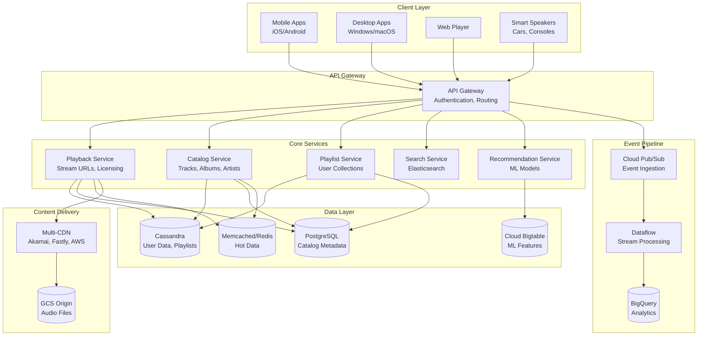
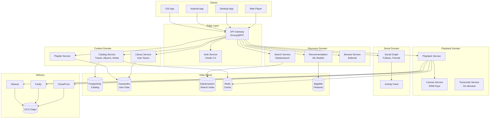
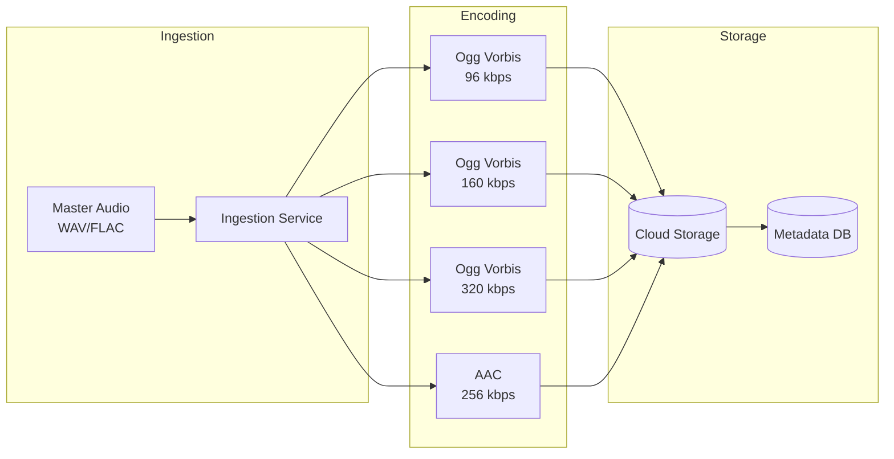
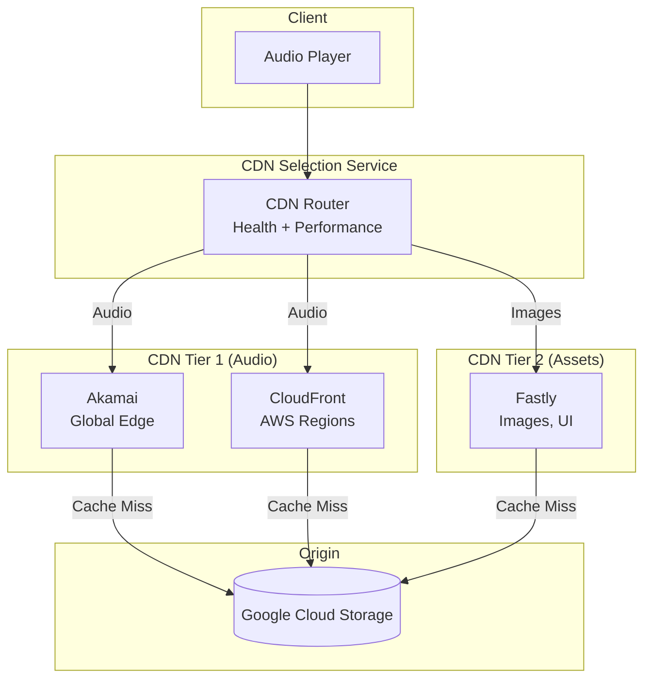
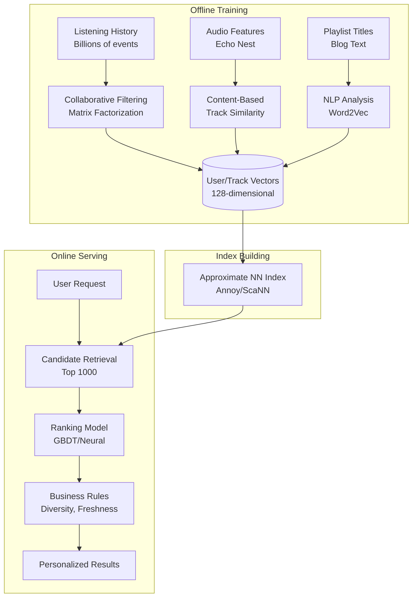
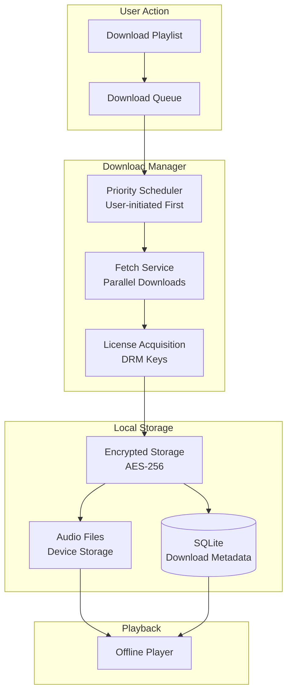
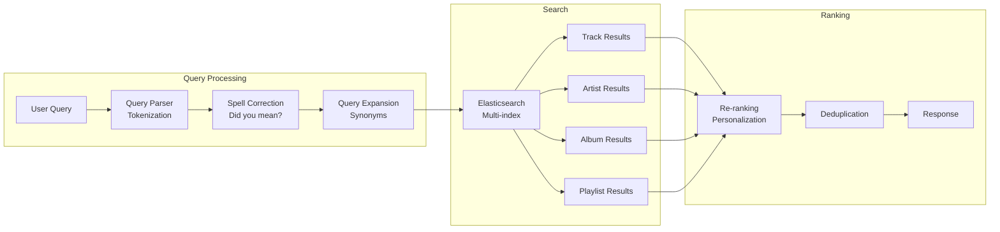
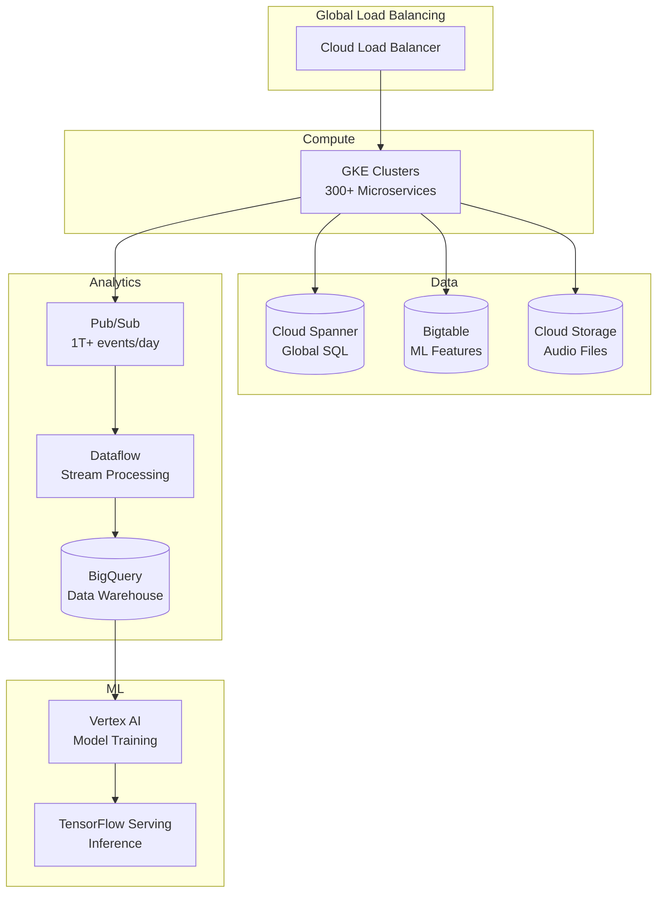

# Design Spotify Music Streaming

Spotify serves 675+ million monthly active users across 180+ markets, streaming from a catalog of 100+ million tracks. Unlike video platforms where files are gigabytes, audio files are megabytes—but the scale of concurrent streams, personalization depth, and the expectation of instant playback create unique challenges. This design covers the audio delivery pipeline, the recommendation engine that drives 30%+ of listening, offline sync, and the microservices architecture that enables 300+ autonomous teams to ship independently.

<figure>



<figcaption>High-level architecture: clients connect through API gateway to microservices; audio delivered via multi-CDN; events flow through Pub/Sub to analytics.</figcaption>
</figure>

## Abstract

Spotify's architecture is shaped by three fundamental constraints:

1. **Audio is lightweight but latency-critical**: A 3-minute track at 320 kbps is ~7 MB—trivial compared to video. But users expect instant playback on tap. The architecture optimizes for time-to-first-byte, not throughput.

2. **Personalization is the product**: Discovery features (Discover Weekly, Daily Mix, Release Radar) drive 30%+ of streams. The recommendation system processes billions of listening events daily to generate personalized content for each user.

3. **Offline mode is a first-class feature**: Premium subscribers can download thousands of tracks. This requires a license management system, intelligent sync, and storage management across devices.

The core mechanisms:

- **Multi-CDN delivery** via Akamai, Fastly, and AWS CloudFront, with intelligent routing based on user location and CDN health
- **Ogg Vorbis encoding** at multiple bitrates (96-320 kbps) with automatic quality adaptation based on network conditions
- **Cassandra for user data** (playlists, listening history) with write-optimized schema design
- **Hybrid recommendation system** combining collaborative filtering, content-based analysis (via Echo Nest audio features), and natural language processing
- **Google Cloud Platform** for compute, storage, and data processing after 2016 migration from on-premise

## Requirements

### Functional Requirements

| Requirement                  | Priority     | Notes                                           |
| ---------------------------- | ------------ | ----------------------------------------------- |
| Audio playback               | Core         | Adaptive streaming, gapless playback, crossfade |
| Search                       | Core         | Tracks, artists, albums, playlists, podcasts    |
| Playlists                    | Core         | Create, edit, collaborative playlists           |
| Library management           | Core         | Save tracks, albums, follow artists             |
| Offline downloads            | Core         | Premium feature, license-protected              |
| Personalized recommendations | Core         | Discover Weekly, Daily Mix, Release Radar       |
| Social features              | Extended     | Friend activity, shared playlists               |
| Podcasts                     | Extended     | Episodes, shows, in-progress tracking           |
| Lyrics                       | Extended     | Synced lyrics display                           |
| Live events                  | Out of scope | Concerts, virtual events                        |
| Audiobooks                   | Out of scope | Separate purchase model                         |

### Non-Functional Requirements

| Requirement              | Target       | Rationale                             |
| ------------------------ | ------------ | ------------------------------------- |
| Playback availability    | 99.99%       | Revenue-critical, user retention      |
| Time to first audio      | p99 < 500ms  | User expectation for instant playback |
| Search latency           | p99 < 200ms  | Responsive search experience          |
| Recommendation freshness | < 24 hours   | Daily personalization updates         |
| Offline sync reliability | 99.9%        | Downloaded content must play          |
| Concurrent streams       | Support 50M+ | Peak evening traffic globally         |
| Catalog update latency   | < 4 hours    | New releases available quickly        |

### Scale Estimation

**Spotify-scale baseline (2024):**

```
Monthly active users: 675 million
Premium subscribers: 265 million (39%)
Free (ad-supported) users: 410 million (61%)

Catalog:
- Tracks: 100+ million
- Podcasts: 6+ million shows
- New tracks added daily: ~100,000

Streaming traffic:
- Average streams per DAU: ~25 tracks/day
- DAU estimate: 300M (45% of MAU)
- Daily streams: 7.5 billion
- Peak concurrent: ~50M streams

Audio file sizes (3-minute track):
- 96 kbps (Low): ~2.2 MB
- 160 kbps (Normal): ~3.6 MB
- 320 kbps (Very High): ~7.2 MB
- Average effective: ~4 MB per track

Daily bandwidth:
- 7.5B streams × 4 MB = 30 PB/day
- With 90% CDN hit rate: 3 PB/day from origin
```

**Storage estimation:**

```
Audio storage:
- 100M tracks × 4 quality levels × 4 MB avg = 1.6 PB
- With metadata, artwork: ~2 PB total

User data:
- 675M users × 500 playlists avg × 100 tracks = massive
- Listening history: 100 events/user/day × 30 days = 600B events/month
```

## Design Paths

### Path A: Single-CDN with Origin Shield

**Best when:**

- Smaller scale (< 100M users)
- Geographic concentration
- Simpler operations preferred

**Architecture:**

- Single CDN provider (e.g., CloudFront)
- Origin shield layer to reduce origin load
- Simple routing via DNS

**Trade-offs:**

- ✅ Simpler vendor management
- ✅ Consistent caching behavior
- ✅ Easier debugging
- ❌ Single point of failure
- ❌ Vendor lock-in on pricing
- ❌ May have regional coverage gaps

**Real-world example:** SoundCloud relies primarily on AWS CloudFront for audio delivery.

### Path B: Multi-CDN with Intelligent Routing (Spotify Model)

**Best when:**

- Massive global scale (100M+ users)
- Need for high availability
- Leverage competitive CDN pricing

**Architecture:**

- Multiple CDN providers (Akamai, Fastly, AWS)
- Real-time CDN health monitoring
- Client-side CDN selection based on performance
- Specialized CDNs for different content types

**Trade-offs:**

- ✅ No single point of failure
- ✅ Cost optimization through CDN arbitrage
- ✅ Best performance per region
- ✅ Leverage each CDN's strengths
- ❌ Complex routing logic
- ❌ Inconsistent caching behavior
- ❌ Multiple vendor relationships

**Real-world example:** Spotify uses Akamai and AWS for audio streaming, Fastly for images and UI assets.

### Historical Path: P2P-Assisted Delivery

**Used by Spotify 2008-2014:**

Spotify originally used peer-to-peer technology, with 80% of traffic served by peers in 2011.

**Why they moved away:**

- Improved CDN economics at scale
- Mobile devices (poor P2P participants)
- Complexity of P2P on modern networks (NAT, firewalls)
- Sufficient server capacity globally

### Path Comparison

| Factor              | Single CDN   | Multi-CDN      | P2P-Assisted   |
| ------------------- | ------------ | -------------- | -------------- |
| Availability        | 99.9%        | 99.99%         | Variable       |
| Setup complexity    | Low          | High           | Very High      |
| Operating cost      | Medium       | Lower at scale | Lowest         |
| Mobile support      | Full         | Full           | Limited        |
| Latency consistency | High         | Medium         | Variable       |
| Best for            | < 100M users | > 100M users   | Cost-sensitive |

### This Article's Focus

This article focuses on **Path B (Multi-CDN)** because:

1. Spotify scale requires geographic diversity
2. The multi-CDN pattern demonstrates advanced content delivery
3. It represents the current industry standard for major streaming services

## High-Level Design

### Component Overview

<figure>



<figcaption>Domain-driven microservices architecture with specialized data stores per domain.</figcaption>
</figure>

### Service Communication

Spotify uses gRPC with Protocol Buffers for inter-service communication:

**Why gRPC:**

- Binary serialization (smaller payloads than JSON)
- Strong typing via protobuf
- Bidirectional streaming support
- Code generation for multiple languages

**Service mesh:**

- Envoy proxy for load balancing, observability
- Circuit breakers for fault isolation
- Automatic retries with exponential backoff

### Playback Flow

1. **User taps play** → Client sends play request to Playback Service
2. **Playback Service validates** → Checks subscription, licensing, availability
3. **License acquired** → DRM key retrieved for encrypted content
4. **CDN URL returned** → Client receives signed URL with CDN selection
5. **Audio streamed** → Client fetches segments from edge CDN
6. **Prefetch triggered** → Next track segments pre-fetched for gapless playback
7. **Event logged** → Stream event sent to Pub/Sub for analytics

### Event-Driven Architecture

Every user action generates events:

```
Play event → Pub/Sub → Dataflow → BigQuery (analytics)
                    → Bigtable (real-time features)
                    → Recommendation update

Search event → Pub/Sub → Search ranking signals
Follow event → Pub/Sub → Social graph update
```

**Event volume:**

- 1 trillion+ Pub/Sub messages per day
- Sub-second end-to-end latency for real-time features

## Audio Streaming Pipeline

### Audio Encoding Strategy

<figure>



<figcaption>Multi-bitrate encoding: each track encoded to 4 quality levels for adaptive streaming.</figcaption>
</figure>

### Quality Levels

| Quality   | Bitrate  | Format     | Availability | File Size (3 min) |
| --------- | -------- | ---------- | ------------ | ----------------- |
| Low       | 24 kbps  | Ogg Vorbis | Free/Premium | ~0.5 MB           |
| Normal    | 96 kbps  | Ogg Vorbis | Free/Premium | ~2.2 MB           |
| High      | 160 kbps | Ogg Vorbis | Free/Premium | ~3.6 MB           |
| Very High | 320 kbps | Ogg Vorbis | Premium only | ~7.2 MB           |
| Web       | 256 kbps | AAC        | Web player   | ~5.8 MB           |

**Why Ogg Vorbis:**

- Open-source, royalty-free codec
- Comparable quality to MP3 at lower bitrates
- Better than MP3 at same bitrate (especially < 128 kbps)
- Efficient hardware decoding on mobile devices

**AAC for web:**

- Native browser support without plugins
- Required for Safari/iOS web player

### Adaptive Bitrate Selection

The client dynamically selects quality based on:

```
if network_type == "cellular" and data_saver_enabled:
    quality = LOW (24 kbps)
elif network_type == "cellular":
    quality = NORMAL (96 kbps)
elif buffering_recently:
    quality = decrease_one_level()
elif buffer_healthy and bandwidth_sufficient:
    quality = user_preference (up to 320 kbps)
```

**Buffer management:**

- Target buffer: 10-30 seconds of audio
- Low watermark: 5 seconds (trigger quality drop)
- High watermark: 30 seconds (allow quality increase)

### Gapless Playback

For seamless album listening:

1. **Prefetch**: Start fetching next track when current is 90% complete
2. **Decode ahead**: Decode first 5 seconds of next track
3. **Crossfade boundary**: Handle precise sample-accurate transitions
4. **Memory management**: Release previous track's buffer

**Implementation challenges:**

- Different sample rates between tracks
- Metadata gaps in some files
- Client memory constraints on mobile

## CDN Architecture

### Multi-CDN Strategy

<figure>



<figcaption>CDN tiering: Akamai/AWS for latency-sensitive audio, Fastly for cacheable assets.</figcaption>
</figure>

### CDN Selection Logic

```python
def select_cdn(user_location, content_type, cdns_health):
    """Select optimal CDN for request."""
    candidates = []

    for cdn in available_cdns:
        if not cdns_health[cdn].is_healthy:
            continue

        latency = get_latency_estimate(cdn, user_location)
        availability = cdns_health[cdn].availability_99p
        cost = get_cost_per_gb(cdn, user_location)

        score = (
            0.5 * normalize(latency, lower_is_better=True) +
            0.3 * normalize(availability, lower_is_better=False) +
            0.2 * normalize(cost, lower_is_better=True)
        )
        candidates.append((cdn, score))

    return max(candidates, key=lambda x: x[1])[0]
```

### Cache Key Design

```
Audio: /{track_id}/{quality}/{segment}.ogg
Images: /{image_id}/{size}.jpg
```

**Cache TTL strategy:**

| Content Type    | TTL       | Rationale              |
| --------------- | --------- | ---------------------- |
| Audio files     | 1 year    | Immutable content      |
| Album artwork   | 30 days   | Rarely changes         |
| Artist images   | 7 days    | Occasional updates     |
| Playlist covers | 1 day     | User-generated         |
| API responses   | 5 minutes | Balance freshness/load |

### Signed URLs

Audio URLs include authentication:

```
https://audio-cdn.spotify.com/tracks/{track_id}/320.ogg
    ?sig={hmac_signature}
    &exp={expiration_timestamp}
    &uid={user_id}
```

**Signature validation:**

- HMAC-SHA256 with rotating keys
- 1-hour expiration for streaming URLs
- Rate limiting per user/IP

## API Design

### Play Track

**Endpoint:** `POST /v1/me/player/play`

**Request:**

```json
{
  "context_uri": "spotify:playlist:37i9dQZF1DXcBWIGoYBM5M",
  "offset": {
    "position": 0
  },
  "position_ms": 0
}
```

**Response (204 No Content on success)**

**Error Responses:**

- `401 Unauthorized`: Invalid or expired token
- `403 Forbidden`: Premium required for this feature
- `404 Not Found`: Track/playlist not available
- `429 Too Many Requests`: Rate limit exceeded

### Get Track

**Endpoint:** `GET /v1/tracks/{id}`

**Response (200 OK):**

```json
{
  "id": "3n3Ppam7vgaVa1iaRUc9Lp",
  "name": "Mr. Brightside",
  "duration_ms": 222973,
  "explicit": false,
  "popularity": 87,
  "preview_url": "https://p.scdn.co/mp3-preview/...",
  "album": {
    "id": "4OHNH3sDzIxnmUADXzv2kT",
    "name": "Hot Fuss",
    "images": [
      {
        "url": "https://i.scdn.co/image/...",
        "height": 640,
        "width": 640
      }
    ],
    "release_date": "2004-06-07"
  },
  "artists": [
    {
      "id": "0C0XlULifJtAgn6ZNCW2eu",
      "name": "The Killers"
    }
  ],
  "available_markets": ["US", "GB", "DE", ...]
}
```

### Search

**Endpoint:** `GET /v1/search`

**Parameters:**

| Parameter | Type    | Required | Description                                  |
| --------- | ------- | -------- | -------------------------------------------- |
| q         | string  | Yes      | Search query                                 |
| type      | string  | Yes      | Comma-separated: track,artist,album,playlist |
| limit     | integer | No       | Max results per type (default: 20, max: 50)  |
| offset    | integer | No       | Pagination offset                            |
| market    | string  | No       | ISO country code for availability filtering  |

**Response:**

```json
{
  "tracks": {
    "items": [...],
    "total": 1000,
    "limit": 20,
    "offset": 0,
    "next": "https://api.spotify.com/v1/search?offset=20&..."
  },
  "artists": {...},
  "albums": {...}
}
```

### Create Playlist

**Endpoint:** `POST /v1/users/{user_id}/playlists`

**Request:**

```json
{
  "name": "Road Trip",
  "description": "Songs for the drive",
  "public": false,
  "collaborative": false
}
```

**Response (201 Created):**

```json
{
  "id": "7d2D2S5F4d0r33mDf0d33D",
  "name": "Road Trip",
  "owner": {
    "id": "user123",
    "display_name": "John"
  },
  "tracks": {
    "total": 0
  },
  "snapshot_id": "MTY4MzI0..."
}
```

### Rate Limits

| Endpoint Category      | Limit        | Window     |
| ---------------------- | ------------ | ---------- |
| Standard endpoints     | 100 requests | 30 seconds |
| Search                 | 30 requests  | 30 seconds |
| Player control         | 50 requests  | 30 seconds |
| Playlist modifications | 25 requests  | 30 seconds |

## Data Modeling

### Track Schema (PostgreSQL)

```sql
CREATE TABLE tracks (
    id VARCHAR(22) PRIMARY KEY,  -- Spotify base62 ID
    name VARCHAR(500) NOT NULL,
    duration_ms INTEGER NOT NULL,
    explicit BOOLEAN DEFAULT false,
    popularity SMALLINT DEFAULT 0,
    isrc VARCHAR(12),  -- International Standard Recording Code
    preview_url TEXT,

    -- Denormalized for read performance
    album_id VARCHAR(22) REFERENCES albums(id),

    -- Audio features (from Echo Nest analysis)
    tempo DECIMAL(6,3),  -- BPM
    key SMALLINT,  -- 0-11 pitch class
    mode SMALLINT,  -- 0=minor, 1=major
    time_signature SMALLINT,
    danceability DECIMAL(4,3),
    energy DECIMAL(4,3),
    valence DECIMAL(4,3),

    created_at TIMESTAMPTZ DEFAULT NOW(),
    updated_at TIMESTAMPTZ DEFAULT NOW()
);

-- Track-Artist relationship (many-to-many)
CREATE TABLE track_artists (
    track_id VARCHAR(22) REFERENCES tracks(id),
    artist_id VARCHAR(22) REFERENCES artists(id),
    position SMALLINT NOT NULL,  -- Artist order
    PRIMARY KEY (track_id, artist_id)
);

-- Indexes for common queries
CREATE INDEX idx_tracks_album ON tracks(album_id);
CREATE INDEX idx_tracks_popularity ON tracks(popularity DESC);
CREATE INDEX idx_tracks_isrc ON tracks(isrc);
```

### Playlist Schema (Cassandra)

Cassandra excels at playlist storage due to write-heavy patterns:

```cql
CREATE TABLE playlists (
    user_id TEXT,
    playlist_id TEXT,
    name TEXT,
    description TEXT,
    is_public BOOLEAN,
    is_collaborative BOOLEAN,
    snapshot_id TEXT,
    follower_count COUNTER,
    created_at TIMESTAMP,
    updated_at TIMESTAMP,
    PRIMARY KEY (user_id, playlist_id)
) WITH CLUSTERING ORDER BY (playlist_id ASC);

CREATE TABLE playlist_tracks (
    playlist_id TEXT,
    position INT,
    track_id TEXT,
    added_by TEXT,
    added_at TIMESTAMP,
    PRIMARY KEY (playlist_id, position)
) WITH CLUSTERING ORDER BY (position ASC);

-- Denormalized for efficient ordering
CREATE TABLE playlist_tracks_by_added (
    playlist_id TEXT,
    added_at TIMESTAMP,
    position INT,
    track_id TEXT,
    PRIMARY KEY (playlist_id, added_at, position)
) WITH CLUSTERING ORDER BY (added_at DESC, position ASC);
```

**Why Cassandra for playlists:**

- Write-optimized (append-only storage)
- Horizontal scaling for 675M users
- Tunable consistency (eventual for non-critical reads)
- Counter support for follower counts

### User Listening History (Cassandra)

```cql
CREATE TABLE listening_history (
    user_id TEXT,
    listened_at TIMESTAMP,
    track_id TEXT,
    context_uri TEXT,  -- playlist, album, or artist
    duration_ms INT,
    PRIMARY KEY (user_id, listened_at)
) WITH CLUSTERING ORDER BY (listened_at DESC)
  AND default_time_to_live = 7776000;  -- 90 days TTL
```

### Search Index (Elasticsearch)

```json
{
  "mappings": {
    "properties": {
      "track_id": { "type": "keyword" },
      "name": {
        "type": "text",
        "analyzer": "standard",
        "fields": {
          "exact": { "type": "keyword" },
          "autocomplete": {
            "type": "text",
            "analyzer": "autocomplete"
          }
        }
      },
      "artist_names": {
        "type": "text",
        "fields": { "exact": { "type": "keyword" } }
      },
      "album_name": { "type": "text" },
      "popularity": { "type": "integer" },
      "duration_ms": { "type": "integer" },
      "explicit": { "type": "boolean" },
      "available_markets": { "type": "keyword" },
      "release_date": { "type": "date" }
    }
  },
  "settings": {
    "analysis": {
      "analyzer": {
        "autocomplete": {
          "tokenizer": "autocomplete",
          "filter": ["lowercase"]
        }
      },
      "tokenizer": {
        "autocomplete": {
          "type": "edge_ngram",
          "min_gram": 1,
          "max_gram": 20,
          "token_chars": ["letter", "digit"]
        }
      }
    }
  }
}
```

### Database Selection Matrix

| Data Type                         | Store           | Rationale                         |
| --------------------------------- | --------------- | --------------------------------- |
| Catalog (tracks, albums, artists) | PostgreSQL      | Relational queries, complex joins |
| User data (playlists, saves)      | Cassandra       | Write-heavy, horizontal scaling   |
| Listening history                 | Cassandra       | Time-series, high volume          |
| Search index                      | Elasticsearch   | Full-text search, faceting        |
| ML features                       | Cloud Bigtable  | Wide columns, sparse data         |
| Hot metadata                      | Redis/Memcached | Sub-ms latency                    |
| Analytics                         | BigQuery        | Ad-hoc queries, massive scale     |

## Low-Level Design: Recommendation System

### Architecture Overview

<figure>



<figcaption>Two-stage recommendation: retrieve candidates via embedding similarity, rank with ML model.</figcaption>
</figure>

### Collaborative Filtering

**Matrix factorization approach:**

Given user-track interaction matrix R (675M users × 100M tracks), learn latent factors:

$$R \approx U \times V^T$$

Where:

- $U$ = user matrix (675M × 128)
- $V$ = track matrix (100M × 128)

**Implementation:**

- Alternating Least Squares (ALS) on Spark
- Weekly retraining on full dataset
- Incremental updates for new users/tracks

### Content-Based Features (Echo Nest)

Each track has computed audio features:

| Feature          | Range     | Description                      |
| ---------------- | --------- | -------------------------------- |
| Tempo            | 0-250 BPM | Beats per minute                 |
| Key              | 0-11      | Pitch class (C=0, C#=1, ...)     |
| Mode             | 0-1       | Minor=0, Major=1                 |
| Danceability     | 0.0-1.0   | Rhythmic suitability for dancing |
| Energy           | 0.0-1.0   | Perceptual intensity             |
| Valence          | 0.0-1.0   | Musical positivity               |
| Speechiness      | 0.0-1.0   | Presence of spoken words         |
| Acousticness     | 0.0-1.0   | Acoustic vs. electronic          |
| Instrumentalness | 0.0-1.0   | Absence of vocals                |
| Liveness         | 0.0-1.0   | Presence of audience             |

### Discover Weekly Pipeline

**Generation schedule:**

- Runs Sunday night for Monday delivery
- Pre-computed on Cloud Bigtable
- 675M personalized 30-track playlists

**Algorithm:**

1. **User taste profile**: Aggregate recent listening into genre/artist weights
2. **Candidate selection**: Find tracks listened to by similar users (collaborative)
3. **Audio filtering**: Match audio features to user preferences (content-based)
4. **Freshness boost**: Prioritize tracks user hasn't heard
5. **Diversity injection**: Ensure variety across genres, artists
6. **Final ranking**: ML model predicts skip probability

### Approximate Nearest Neighbor Index

For real-time recommendations, use Annoy (Approximate Nearest Neighbors Oh Yeah):

**Index structure:**

- 128-dimensional embeddings for 100M tracks
- Forest of random projection trees
- Trade-off: accuracy vs. query time

**Query performance:**

- 10ms for top-100 nearest neighbors
- 95% recall vs. exact search
- 100 trees provides good balance

## Low-Level Design: Offline Mode

### Download Architecture

<figure>



<figcaption>Offline download flow: queue → prioritize → fetch → encrypt → store locally.</figcaption>
</figure>

### License Management

**DRM implementation:**

- Encrypted audio files using AES-256
- Per-device keys tied to account
- Keys stored in secure enclave (iOS) or hardware-backed keystore (Android)

**License constraints:**

| Constraint         | Value             | Rationale                      |
| ------------------ | ----------------- | ------------------------------ |
| Offline validity   | 30 days           | Requires periodic online check |
| Device limit       | 5 devices         | Prevent account sharing        |
| Track limit        | 10,000 per device | Storage management             |
| Concurrent offline | 1 device          | Licensing terms                |

### Sync Strategy

**Smart downloads:**

```python
def prioritize_downloads(playlist, device_storage):
    """Prioritize which tracks to download first."""
    scored_tracks = []

    for track in playlist.tracks:
        score = 0

        # User explicitly requested
        if track in user_requested:
            score += 100

        # Recently played (likely to play again)
        if track in recent_plays:
            score += 50

        # High popularity in playlist
        score += track.playlist_position_score

        # Already partially downloaded
        if track.partial_download:
            score += 30

        scored_tracks.append((track, score))

    # Download in priority order until storage full
    for track, _ in sorted(scored_tracks, reverse=True):
        if device_storage.available > track.size:
            download(track)
```

### Storage Management

**Eviction policy:**

1. Remove tracks not played in 90+ days
2. Remove tracks from unfollowed playlists
3. LRU eviction when approaching storage limit

**Storage estimation UI:**

```
Playlist: Road Trip (50 tracks)
Download size: 180 MB (Normal quality)
              350 MB (Very High quality)
Device storage: 2.1 GB available
```

## Search System

### Search Architecture

<figure>



<figcaption>Search pipeline: parse → correct → expand → search → rank → deduplicate.</figcaption>
</figure>

### Typeahead/Autocomplete

**Implementation using Elasticsearch:**

```json
{
  "query": {
    "bool": {
      "should": [
        {
          "match": {
            "name.autocomplete": {
              "query": "mr bright",
              "operator": "and"
            }
          }
        },
        {
          "match": {
            "artist_names.autocomplete": {
              "query": "mr bright",
              "operator": "and"
            }
          }
        }
      ],
      "minimum_should_match": 1
    }
  },
  "sort": ["_score", { "popularity": "desc" }],
  "size": 10
}
```

**Performance targets:**

- Typeahead latency: p99 < 50ms
- Full search latency: p99 < 200ms
- Index update lag: < 4 hours for new releases

### Ranking Signals

| Signal              | Weight | Description                      |
| ------------------- | ------ | -------------------------------- |
| Text relevance      | 0.3    | BM25 score from Elasticsearch    |
| Popularity          | 0.25   | Global stream count (log-scaled) |
| User affinity       | 0.2    | Based on listening history       |
| Freshness           | 0.15   | Boost for new releases           |
| Market availability | 0.1    | Available in user's region       |

## Frontend Considerations

### Player State Management

**Global player state:**

```typescript
interface PlayerState {
  // Current playback
  currentTrack: Track | null
  position_ms: number
  duration_ms: number
  isPlaying: boolean

  // Queue
  queue: Track[]
  queuePosition: number

  // Context (what initiated playback)
  context: {
    type: "playlist" | "album" | "artist" | "search"
    uri: string
  }

  // Shuffle and repeat
  shuffle: boolean
  repeatMode: "off" | "context" | "track"

  // Device
  activeDevice: Device
  volume: number
}
```

**State synchronization:**

- Local state for immediate UI feedback
- WebSocket for cross-device sync (Spotify Connect)
- Optimistic updates with reconciliation

### Audio Buffering Strategy

```typescript
class AudioBuffer {
  private segments: Map<number, ArrayBuffer> = new Map()
  private prefetchAhead = 30 // seconds

  async ensureBuffered(currentPosition: number): Promise<void> {
    const currentSegment = Math.floor(currentPosition / SEGMENT_SIZE)
    const targetSegment = Math.ceil((currentPosition + this.prefetchAhead) / SEGMENT_SIZE)

    for (let i = currentSegment; i <= targetSegment; i++) {
      if (!this.segments.has(i)) {
        const segment = await this.fetchSegment(i)
        this.segments.set(i, segment)
      }
    }

    // Evict old segments to manage memory
    this.evictOldSegments(currentSegment - 2)
  }
}
```

### Mobile Optimizations

| Constraint | Mitigation                                              |
| ---------- | ------------------------------------------------------- |
| Battery    | Batch network requests, use efficient codecs            |
| Data usage | Quality auto-adjust, download on WiFi                   |
| Memory     | Limit buffer size, lazy-load images                     |
| Background | iOS: Background Audio mode; Android: Foreground Service |
| Offline    | SQLite for metadata, encrypted file storage             |

### Web Player Architecture

**Web Audio API usage:**

```javascript
const audioContext = new AudioContext()
const source = audioContext.createBufferSource()
const gainNode = audioContext.createGain()

// Crossfade between tracks
function crossfade(currentSource, nextSource, duration) {
  const now = audioContext.currentTime

  // Fade out current
  currentSource.gainNode.gain.setValueAtTime(1, now)
  currentSource.gainNode.gain.linearRampToValueAtTime(0, now + duration)

  // Fade in next
  nextSource.gainNode.gain.setValueAtTime(0, now)
  nextSource.gainNode.gain.linearRampToValueAtTime(1, now + duration)

  nextSource.start(now)
}
```

## Infrastructure Design

### Google Cloud Platform Architecture

<figure>



<figcaption>GCP deployment: GKE for microservices, managed data services, Pub/Sub for event streaming.</figcaption>
</figure>

### Key GCP Services

| Service        | Use Case                    | Scale              |
| -------------- | --------------------------- | ------------------ |
| GKE            | Microservices orchestration | 300+ services      |
| Cloud Pub/Sub  | Event streaming             | 1T+ messages/day   |
| Cloud Dataflow | Stream/batch processing     | Petabytes/day      |
| BigQuery       | Analytics, ML training      | 10M+ queries/month |
| Cloud Bigtable | ML feature store            | Petabytes          |
| Cloud Storage  | Audio files, backups        | Exabytes           |
| Cloud Spanner  | Transactional data          | Global consistency |

### Migration Story

**Timeline:**

- 2016: Announced migration from on-premise to GCP
- 2017: Fully migrated to Google Cloud
- Result: 60% cost reduction, faster product development

**Key decisions:**

- Kafka → Pub/Sub for event delivery (4x lower latency)
- Hadoop → Dataflow for batch/stream processing
- Custom dashboards → BigQuery for analytics

### Multi-Region Strategy

```
Regions:
- us-central1 (Primary Americas)
- europe-west1 (Primary EMEA)
- asia-east1 (Primary APAC)

Data replication:
- User data: Multi-region Spanner
- Audio: Cloud Storage multi-region
- Analytics: BigQuery cross-region
```

### Developer Platform (Backstage)

Spotify open-sourced Backstage in 2020—their internal developer portal:

**Features:**

- Service catalog (track all microservices)
- TechDocs (documentation as code)
- Software templates (scaffold new services)
- Plugin ecosystem (integrate with tools)

**Impact:**

- 2,200+ contributors
- 3,000+ adopting companies
- CNCF incubating project

## Conclusion

Designing Spotify-scale music streaming requires different optimizations than video platforms:

**Key architectural decisions:**

1. **Multi-CDN delivery** (Akamai, AWS, Fastly) provides global reach with failover and cost optimization
2. **Ogg Vorbis encoding** at multiple bitrates (96-320 kbps) balances quality and bandwidth with adaptive switching
3. **Cassandra for user data** handles write-heavy workloads (playlists, history) with horizontal scaling
4. **Hybrid recommendation** combining collaborative filtering, audio features, and NLP drives 30%+ of listening
5. **GCP migration** (2016-2017) reduced costs 60% while enabling faster product iteration
6. **Event-driven architecture** via Pub/Sub processes 1T+ events/day for real-time personalization

**What this design optimizes for:**

- Instant playback (< 500ms time-to-first-audio)
- Seamless cross-device experience (Spotify Connect)
- Deep personalization (Discover Weekly, Daily Mix)
- Offline reliability (encrypted downloads with license management)

**What this design sacrifices:**

- Lossless audio quality (limited to 320 kbps lossy until recent Premium updates)
- Real-time social features (friend activity delayed)
- Podcast transcription/search (limited compared to dedicated platforms)

**When to choose this design:**

- Audio streaming at scale (100M+ users)
- Personalization as core differentiator
- Need for offline mode with DRM

## Appendix

### Prerequisites

- CDN architecture: edge caching, origin shield concepts
- Audio encoding: codecs, bitrates, compression
- Distributed databases: Cassandra data modeling, consistency trade-offs
- Recommendation systems: collaborative filtering, content-based filtering basics
- Stream processing: event-driven architecture, Pub/Sub patterns

### Terminology

| Term                        | Definition                                                                       |
| --------------------------- | -------------------------------------------------------------------------------- |
| **ABR**                     | Adaptive Bitrate—dynamically selecting audio quality based on network conditions |
| **Ogg Vorbis**              | Open-source, royalty-free audio codec used by Spotify                            |
| **Gapless playback**        | Seamless transition between tracks without silence gaps                          |
| **Crossfade**               | Gradual blend between end of one track and start of next                         |
| **Collaborative filtering** | Recommendation based on similar users' behavior                                  |
| **Content-based filtering** | Recommendation based on item attributes (audio features)                         |
| **Echo Nest**               | Music intelligence company acquired by Spotify in 2014                           |
| **Spotify Connect**         | Protocol for cross-device playback control                                       |
| **Pub/Sub**                 | Publish-Subscribe messaging pattern for event streaming                          |
| **Edge n-gram**             | Tokenization for autocomplete (prefixes: "s", "sp", "spo"...)                    |

### Summary

- Spotify serves 675M+ MAU with multi-CDN delivery (Akamai, AWS, Fastly) for global reach
- Ogg Vorbis encoding at 96-320 kbps with client-side adaptive quality selection
- Cassandra handles write-heavy user data (playlists, history) with horizontal scaling
- Hybrid recommendation (collaborative + content-based + NLP) drives 30%+ of streams
- Event pipeline via Pub/Sub processes 1T+ events/day for real-time personalization
- Offline mode uses encrypted storage with per-device DRM licensing
- Backstage developer portal (open-sourced 2020) manages 300+ internal microservices

### References

- [How Spotify Aligned CDN Services](https://engineering.atspotify.com/2020/02/how-spotify-aligned-cdn-services-for-a-lightning-fast-streaming-experience) - Multi-CDN strategy
- [Personalization at Spotify Using Cassandra](https://engineering.atspotify.com/2015/01/personalization-at-spotify-using-cassandra) - Cassandra architecture
- [Spotify's Event Delivery: Road to the Cloud](https://engineering.atspotify.com/2016/03/spotifys-event-delivery-the-road-to-the-cloud-part-ii) - Kafka to Pub/Sub migration
- [Spotify chooses Google Cloud Platform](https://cloud.google.com/blog/products/gcp/spotify-chooses-google-cloud-platform-to-power-data-infrastructure) - GCP migration
- [Spotify Case Study (Google Cloud)](https://cloud.google.com/customers/spotify) - Infrastructure details
- [Backstage Developer Portal](https://backstage.io/) - Open source developer platform
- [Spotify Audio Quality](https://support.spotify.com/us/article/audio-quality/) - Official bitrate documentation
- [Spotify Audio Features API](https://developer.spotify.com/documentation/web-api/reference/get-audio-features) - Echo Nest features
- [Spotify Removes P2P (TechCrunch)](https://techcrunch.com/2014/04/17/spotify-removes-peer-to-peer-technology-from-its-desktop-client/) - P2P deprecation
- [IEEE: Spotify P2P Architecture](https://ieeexplore.ieee.org/document/5569963/) - Original P2P design paper
- [Spotify Statistics (2024)](https://www.demandsage.com/spotify-stats/) - Scale numbers
