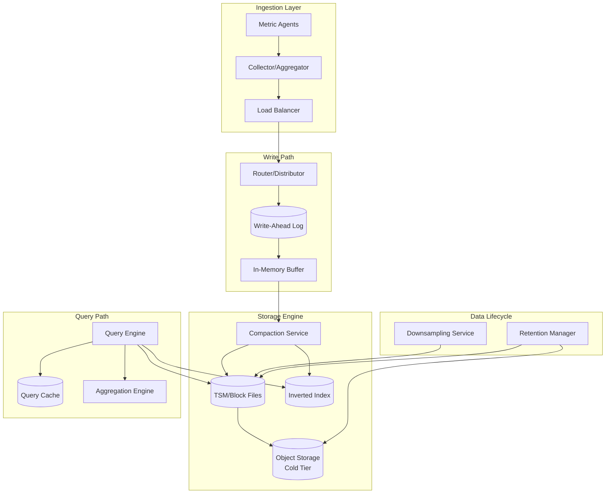
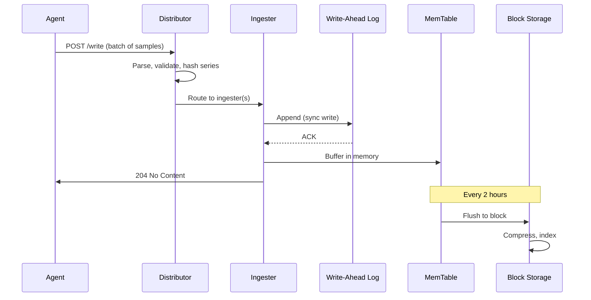
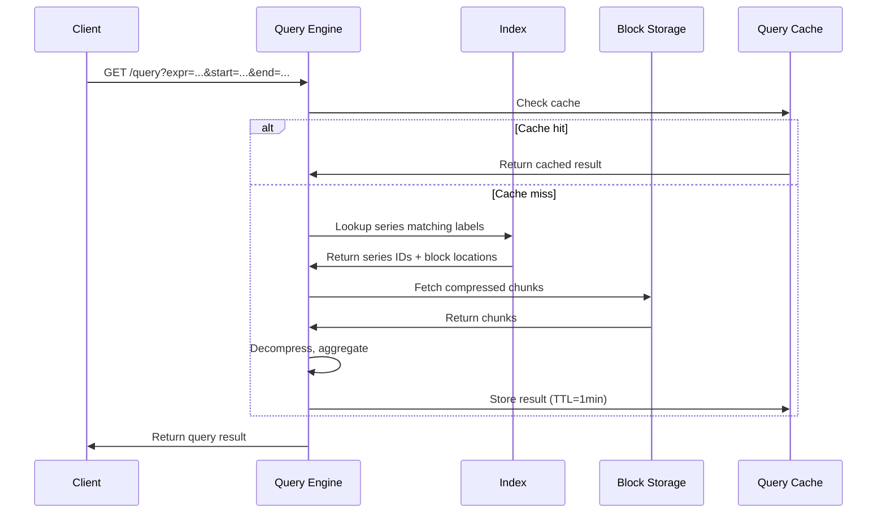
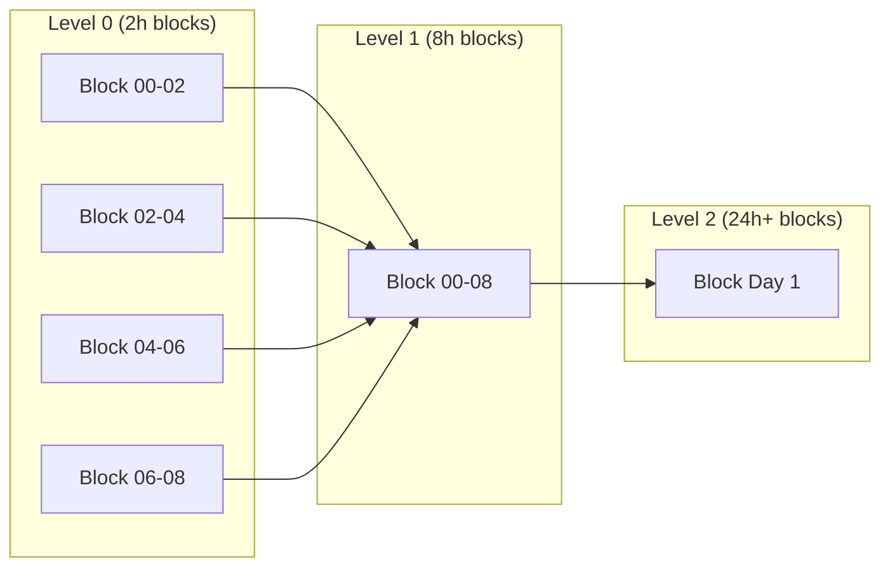
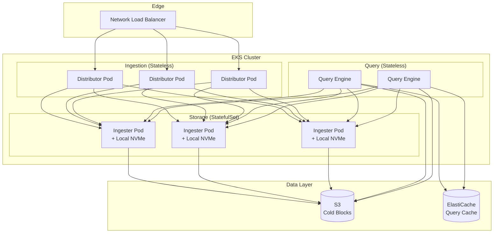

# Design a Time Series Database

A comprehensive system design for a metrics and monitoring time-series database (TSDB) handling high-velocity writes, efficient compression, and long-term retention. This design addresses write throughput at millions of samples/second, sub-millisecond queries over billions of datapoints, cardinality management for dimensional data, and multi-tier storage for cost-effective retention.

<figure>



<figcaption>High-level architecture: Metrics flow through collectors to a write-ahead log, buffer in memory, then compact to disk. Queries traverse an inverted index to locate compressed blocks. Lifecycle services handle downsampling and retention.</figcaption>
</figure>

## Abstract

Time-series databases optimize for **append-only workloads** with **time-ordered reads**. The fundamental insight: metrics arrive in near-monotonic timestamp order and are queried by time range—exploiting this pattern enables compression ratios of 10-12x and query performance orders of magnitude better than general-purpose databases.

The storage engine uses a **Log-Structured Merge Tree (LSM)** variant. Writes append to a Write-Ahead Log (WAL), buffer in memory, then flush to immutable sorted blocks. Time-based partitioning (typically 2-hour blocks) enables efficient range queries—scanning only relevant blocks instead of the entire dataset.

**Compression** is the critical differentiator. Facebook's Gorilla algorithm achieves 12x compression (16 bytes → 1.37 bytes per sample) using delta-of-delta for timestamps and XOR encoding for values. 96% of timestamps compress to a single bit when samples arrive at regular intervals.

**Cardinality** (unique combinations of metric name + tags) is the primary scaling constraint. A metric like `http_requests{method, status, endpoint}` explodes to millions of series with high-cardinality labels. The inverted index must efficiently map tag combinations to series IDs without consuming unbounded memory.

## Requirements

### Functional Requirements

| Feature                           | Priority | Scope        |
| --------------------------------- | -------- | ------------ |
| Metric ingestion (push model)     | Core     | Full         |
| Range queries by time             | Core     | Full         |
| Tag-based filtering               | Core     | Full         |
| Aggregations (sum, avg, max, p99) | Core     | Full         |
| Downsampling and rollups          | Core     | Full         |
| Retention policies                | Core     | Full         |
| Alerting integration              | High     | Overview     |
| Multi-tenancy                     | High     | Overview     |
| Distributed queries               | High     | Full         |
| Cardinality management            | High     | Full         |
| Exemplar storage (traces)         | Medium   | Brief        |
| Anomaly detection                 | Low      | Out of scope |

### Non-Functional Requirements

| Requirement              | Target                            | Rationale                                          |
| ------------------------ | --------------------------------- | -------------------------------------------------- |
| Write throughput         | 1M+ samples/sec per node          | Modern infrastructure generates massive telemetry  |
| Read latency (hot data)  | p99 < 100ms                       | Dashboard refresh and alerting requirements        |
| Read latency (cold data) | p99 < 5s                          | Historical analysis acceptable with higher latency |
| Storage efficiency       | < 2 bytes/sample compressed       | Cost-effective retention of years of data          |
| Availability             | 99.9%                             | Monitoring systems must be highly available        |
| Data durability          | 99.999%                           | Metrics are valuable for incident investigation    |
| Retention                | Raw: 15 days, Aggregated: 2 years | Balance granularity vs. storage cost               |

### Scale Estimation

**Metric Sources:**

- Hosts: 100K servers, containers, and VMs
- Metrics per host: 500 metrics (CPU, memory, disk, network, application)
- Collection interval: 10 seconds

**Traffic:**

- Samples/second: 100K hosts × 500 metrics / 10s = 5M samples/sec
- Daily samples: 5M × 86,400 = 432B samples/day
- Peak multiplier: 2x during deployments → 10M samples/sec burst

**Storage (before compression):**

- Sample size: 16 bytes (8-byte timestamp + 8-byte value)
- Daily raw: 432B × 16 bytes = 6.9TB/day
- With Gorilla compression (12x): 6.9TB / 12 = 575GB/day
- 15-day retention: ~8.6TB
- 2-year downsampled (1-minute aggregates): ~2TB

**Cardinality:**

- Unique series (metric + tags): 50M active series
- Series per host average: 500
- High-cardinality metrics (by request_id): Must be blocked or aggregated

## Design Paths

### Path A: In-Memory with Disk Spillover (Gorilla/Atlas)

**Best when:**

- Recent data is most valuable (last few hours)
- Predictable memory budget
- Sub-millisecond query latency required

**Architecture:**

- All active series in memory with ring buffers
- Fixed memory allocation per series
- Disk used only for overflow and persistence

**Trade-offs:**

- ✅ Sub-millisecond query latency for recent data
- ✅ Simple query path (no disk I/O for hot queries)
- ✅ Predictable memory usage
- ❌ Limited retention (hours to days)
- ❌ Memory cost scales linearly with cardinality
- ❌ Cold queries require separate system

**Real-world example:** Netflix Atlas uses in-memory storage with rolling windows for real-time operational dashboards. Facebook Gorilla keeps 26 hours in memory with ~2GB per 700K series.

### Path B: LSM-Based with Tiered Storage (Prometheus/InfluxDB)

**Best when:**

- Long retention required (weeks to months)
- Mixed hot/cold query patterns
- Storage cost is a concern

**Architecture:**

- Write-ahead log for durability
- In-memory buffer (2-hour blocks)
- Background compaction to disk blocks
- Object storage for cold tier

**Trade-offs:**

- ✅ Cost-effective long retention
- ✅ Excellent compression (12x+)
- ✅ Handles variable cardinality
- ❌ Higher query latency for cold data
- ❌ Compaction CPU overhead
- ❌ Write amplification during compaction

**Real-world example:** Prometheus TSDB uses 2-hour blocks, achieving 1-2 bytes/sample. InfluxDB's TSM engine follows similar principles with 7-day shards.

### Path C: Distributed LSM with Global Index (M3/Cortex)

**Best when:**

- Scale beyond single node
- Multi-tenant SaaS offering
- Global query federation required

**Architecture:**

- Distributed hash ring for series assignment
- Per-tenant isolated storage
- Query fanout with aggregation
- Centralized or per-tenant indexing

**Trade-offs:**

- ✅ Horizontal scalability (1B+ samples/sec)
- ✅ Multi-tenant isolation
- ✅ Geographic distribution possible
- ❌ Operational complexity
- ❌ Network overhead for distributed queries
- ❌ Consistency challenges during rebalancing

**Real-world example:** Uber M3 ingests 1B+ datapoints/sec across their fleet. Cortex provides multi-tenant Prometheus-compatible storage.

### Path Comparison

| Factor                 | Path A (In-Memory)   | Path B (LSM)              | Path C (Distributed) |
| ---------------------- | -------------------- | ------------------------- | -------------------- |
| Query latency (hot)    | Sub-ms               | 10-100ms                  | 50-500ms             |
| Retention              | Hours                | Weeks-Months              | Years                |
| Storage efficiency     | Low (in-memory)      | High (12x compression)    | High                 |
| Cardinality limit      | Memory-bound         | Disk-bound                | Configurable         |
| Operational complexity | Low                  | Medium                    | High                 |
| Best for               | Real-time dashboards | Single-cluster monitoring | Multi-tenant SaaS    |

### This Article's Focus

This article implements **Path B (LSM-Based)** as the core, with distributed extensions from Path C. This matches most production deployments (Prometheus, InfluxDB, VictoriaMetrics) and provides a foundation for understanding both single-node and distributed architectures.

## High-Level Design

### Service Architecture

#### Ingestion Service (Distributor)

Receives metrics from agents and routes to storage nodes:

- Parse and validate metric format (Prometheus exposition, InfluxDB line protocol, OpenTelemetry)
- Extract metric name, tags, timestamp, value
- Hash series ID (metric + sorted tags) for consistent routing
- Forward to appropriate storage node(s)
- Handle backpressure via load shedding

#### Storage Engine (Ingester)

Manages the write path and local storage:

- Append to Write-Ahead Log (WAL) for durability
- Buffer samples in memory (memtable per series)
- Maintain in-memory index for active series
- Flush to immutable blocks every 2 hours
- Trigger compaction for block merging

#### Compaction Service

Background process optimizing storage:

- Merge small blocks into larger ones
- Apply compression algorithms
- Remove deleted/expired data
- Rebuild indexes for merged blocks
- Enforce retention by deleting old blocks

#### Query Engine

Executes queries across storage tiers:

- Parse query language (PromQL, InfluxQL, SQL)
- Plan execution (which blocks to scan)
- Fetch data from index → blocks
- Decompress and aggregate
- Return results with metadata

#### Lifecycle Manager

Handles data retention and downsampling:

- Enforce time-based retention policies
- Trigger downsampling jobs (raw → 1-minute → 1-hour aggregates)
- Manage tiered storage migration (hot → warm → cold)
- Track storage usage per tenant

### Data Flow: Write Path



### Data Flow: Query Path



## API Design

### Write Endpoint

**Endpoint:** `POST /api/v1/write`

Accepts metrics in Prometheus remote-write format (protobuf) or line protocol:

```text
# Prometheus exposition format
http_requests_total{method="GET",status="200"} 1234 1704067200000
http_requests_total{method="POST",status="500"} 5 1704067200000
cpu_usage{host="server-1",core="0"} 0.75 1704067200000

# InfluxDB line protocol
http_requests,method=GET,status=200 total=1234 1704067200000000000
cpu,host=server-1,core=0 usage=0.75 1704067200000000000
```

**Request (Prometheus remote-write protobuf):**

```protobuf collapse={1-5}
message WriteRequest {
  repeated TimeSeries timeseries = 1;
  repeated MetricMetadata metadata = 2;
}

message TimeSeries {
  repeated Label labels = 1;  // [{name: "__name__", value: "http_requests_total"}, ...]
  repeated Sample samples = 2;
}

message Sample {
  double value = 1;
  int64 timestamp = 2;  // Unix ms
}
```

**Response:**

- `204 No Content`: Success
- `400 Bad Request`: Invalid format, missing required labels
- `429 Too Many Requests`: Rate limited (backpressure)
- `503 Service Unavailable`: Ingester overloaded

**Design Decision: Push vs. Pull**

Prometheus uses a pull model (scraping targets), while most TSDBs accept push. For a general-purpose TSDB:

- **Push** (chosen): Simpler client integration, works behind firewalls, scales with stateless distributors
- **Pull**: Better for service discovery, guarantees scrape intervals, but requires connectivity to all targets

Remote-write enables hybrid: Prometheus scrapes locally, pushes to central TSDB.

### Query Endpoint

**Endpoint:** `GET /api/v1/query_range`

**Query Parameters:**

| Parameter | Type     | Description                               |
| --------- | -------- | ----------------------------------------- |
| `query`   | string   | Query expression (PromQL, InfluxQL)       |
| `start`   | int64    | Start timestamp (Unix seconds or RFC3339) |
| `end`     | int64    | End timestamp                             |
| `step`    | duration | Query resolution (e.g., "1m", "5m")       |

**Example Query:**

```text
GET /api/v1/query_range?query=rate(http_requests_total{status="500"}[5m])&start=1704067200&end=1704153600&step=60
```

**Response:**

```json collapse={1-3, 25-30}
{
  "status": "success",
  "data": {
    "resultType": "matrix",
    "result": [
      {
        "metric": {
          "__name__": "http_requests_total",
          "method": "GET",
          "status": "500",
          "instance": "server-1:9090"
        },
        "values": [
          [1704067200, "0.5"],
          [1704067260, "0.7"],
          [1704067320, "0.3"]
        ]
      }
    ]
  }
}
```

**Rate Limits:** 100 queries/min per tenant, 10 concurrent queries

### Label Endpoints

**Get label names:** `GET /api/v1/labels`

**Get label values:** `GET /api/v1/label/{label_name}/values`

These endpoints query the inverted index and are essential for building dashboards with dynamic dropdowns.

### Series Metadata

**Endpoint:** `GET /api/v1/series`

Returns series matching a label selector:

```text
GET /api/v1/series?match[]=http_requests_total{status=~"5.."}
```

Used for cardinality analysis and debugging high-cardinality labels.

## Data Modeling

### Sample Format

**Primary data unit:** A sample is a (timestamp, value) pair for a specific series.

```typescript
interface Sample {
  timestamp: number // Unix milliseconds
  value: number // IEEE 754 double (64-bit)
}

interface Series {
  labels: Map<string, string> // Metric name + tags
  samples: Sample[]
}

// Series identifier (sorted label pairs)
// http_requests_total{method="GET",status="200"}
// → __name__=http_requests_total,method=GET,status=200
// → Hash: fnv64a("__name__\xff http_requests_total\xff method\xff GET\xff ...")
```

**Design Decision: Label Ordering**

Labels are sorted alphabetically before hashing. This ensures the same series always hashes to the same ID regardless of label order in the write request.

### Block Format

**Block structure (2-hour time window):**

```
block-<ulid>/
├── meta.json           # Block metadata
├── index               # Inverted index (labels → series)
├── chunks/
│   ├── 000001          # Compressed chunk file
│   ├── 000002
│   └── ...
└── tombstones          # Deleted series markers
```

**meta.json:**

```json collapse={1-3, 20-25}
{
  "ulid": "01HQGJ5P1XXXXXXXXX",
  "minTime": 1704067200000,
  "maxTime": 1704074400000,
  "stats": {
    "numSamples": 50000000,
    "numSeries": 100000,
    "numChunks": 150000
  },
  "compaction": {
    "level": 1,
    "sources": ["01HQGJ..."]
  },
  "version": 1
}
```

### Index Structure

**Inverted index mapping:**

```
Label → Series IDs
──────────────────
method=GET    → [1, 3, 5, 7, 9, ...]
method=POST   → [2, 4, 6, 8, ...]
status=200    → [1, 2, 3, 4, 5, ...]
status=500    → [6, 7, 8, ...]

Series ID → Chunk Refs
──────────────────────
1 → [(chunk_001, offset=0, len=4096), (chunk_002, offset=0, len=2048)]
2 → [(chunk_001, offset=4096, len=3072)]
```

**Posting list intersection for queries:**

```
http_requests{method="GET",status="500"}

1. Lookup method=GET → [1, 3, 5, 7, 9]
2. Lookup status=500 → [7, 8, 9, 10]
3. Intersect → [7, 9]
4. Fetch chunks for series 7, 9
```

### Schema Design (SQL Representation)

For understanding, here's how the data model maps to relational concepts:

```sql collapse={1-5, 35-40}
-- Series registry (the inverted index in memory/disk)
CREATE TABLE series (
    id BIGSERIAL PRIMARY KEY,
    labels_hash BIGINT UNIQUE NOT NULL,
    labels JSONB NOT NULL,
    created_at TIMESTAMPTZ DEFAULT NOW()
);

CREATE INDEX idx_series_labels ON series USING GIN (labels);

-- Samples (conceptual - stored in compressed chunks, not SQL)
CREATE TABLE samples (
    series_id BIGINT NOT NULL,
    timestamp TIMESTAMPTZ NOT NULL,
    value DOUBLE PRECISION NOT NULL,
    PRIMARY KEY (series_id, timestamp)
);

-- Block metadata
CREATE TABLE blocks (
    ulid TEXT PRIMARY KEY,
    min_time TIMESTAMPTZ NOT NULL,
    max_time TIMESTAMPTZ NOT NULL,
    num_samples BIGINT NOT NULL,
    num_series INTEGER NOT NULL,
    level INTEGER DEFAULT 1,
    created_at TIMESTAMPTZ DEFAULT NOW()
);

CREATE INDEX idx_blocks_time ON blocks(min_time, max_time);
```

### Storage Selection Matrix

| Data Type        | Storage                 | Rationale                             |
| ---------------- | ----------------------- | ------------------------------------- |
| Active samples   | Memory (memtable)       | Sub-ms writes, recent data hottest    |
| WAL              | Local SSD (sequential)  | Durability, sequential writes         |
| Hot blocks       | Local SSD (random read) | Frequent queries, compression         |
| Warm blocks      | Networked SSD           | Less frequent access, cost efficiency |
| Cold blocks      | Object storage (S3)     | Long retention, lowest cost           |
| Inverted index   | Memory + SSD            | Fast label lookups, memory-mapped     |
| Downsampled data | Separate retention tier | Query without scanning raw data       |

## Low-Level Design

### Compression: Gorilla Algorithm

The compression algorithm is the core of TSDB efficiency. Facebook's Gorilla paper (VLDB 2015) introduced delta-of-delta for timestamps and XOR for values.

#### Timestamp Compression (Delta-of-Delta)

Samples typically arrive at regular intervals (e.g., every 10 seconds). Instead of storing absolute timestamps:

```typescript collapse={1-8, 40-50}
// Delta-of-delta encoding
// Timestamps: [1000, 1010, 1020, 1030, 1040]
// Deltas:     [  -,   10,   10,   10,   10]
// Delta-of-delta: [-, -, 0, 0, 0]

// Encoding rules:
// - If delta-of-delta = 0: write '0' (1 bit)
// - If fits in [-63, 64]: write '10' + 7 bits
// - If fits in [-255, 256]: write '110' + 9 bits
// - If fits in [-2047, 2048]: write '1110' + 12 bits
// - Otherwise: write '1111' + 32 bits

function encodeTimestamps(timestamps: number[]): BitStream {
  const stream = new BitStream()

  // First timestamp: stored as-is (64 bits)
  stream.writeBits(timestamps[0], 64)

  if (timestamps.length < 2) return stream

  // Second timestamp: delta from first
  let prevDelta = timestamps[1] - timestamps[0]
  stream.writeBits(prevDelta, 14) // Assuming max delta fits in 14 bits

  // Remaining: delta-of-delta
  for (let i = 2; i < timestamps.length; i++) {
    const delta = timestamps[i] - timestamps[i - 1]
    const deltaOfDelta = delta - prevDelta

    if (deltaOfDelta === 0) {
      stream.writeBit(0) // 1 bit for regular intervals
    } else if (deltaOfDelta >= -63 && deltaOfDelta <= 64) {
      stream.writeBits(0b10, 2)
      stream.writeBits(deltaOfDelta + 63, 7) // Offset to positive
    } else if (deltaOfDelta >= -255 && deltaOfDelta <= 256) {
      stream.writeBits(0b110, 3)
      stream.writeBits(deltaOfDelta + 255, 9)
    } else if (deltaOfDelta >= -2047 && deltaOfDelta <= 2048) {
      stream.writeBits(0b1110, 4)
      stream.writeBits(deltaOfDelta + 2047, 12)
    } else {
      stream.writeBits(0b1111, 4)
      stream.writeBits(deltaOfDelta, 32)
    }

    prevDelta = delta
  }

  return stream
}

// Result: 96% of timestamps compress to 1 bit
// Average: 1.04 bits per timestamp (vs 64 bits uncompressed)
```

#### Value Compression (XOR Encoding)

Consecutive metric values often share many bits (e.g., CPU at 0.75 then 0.76):

```typescript collapse={1-10, 50-60}
// XOR encoding for IEEE 754 doubles
// Values: [0.75, 0.76, 0.76, 0.77]
// XOR with previous: [0.75, XOR(0.75,0.76), XOR(0.76,0.76), XOR(0.76,0.77)]

// The XOR of similar floats has many leading and trailing zeros
// We encode: (leading zeros count, significant bits count, significant bits)

interface XORState {
  prevValue: bigint // Previous value as 64-bit integer
  prevLeadingZeros: number
  prevTrailingZeros: number
}

function encodeValues(values: number[]): BitStream {
  const stream = new BitStream()

  // First value: stored as-is (64 bits)
  const firstBits = floatToBits(values[0])
  stream.writeBits(firstBits, 64)

  let state: XORState = {
    prevValue: firstBits,
    prevLeadingZeros: 0,
    prevTrailingZeros: 0,
  }

  for (let i = 1; i < values.length; i++) {
    const currentBits = floatToBits(values[i])
    const xor = currentBits ^ state.prevValue

    if (xor === 0n) {
      // Identical value: write '0' (1 bit)
      stream.writeBit(0)
    } else {
      stream.writeBit(1) // Values differ

      const leadingZeros = countLeadingZeros(xor)
      const trailingZeros = countTrailingZeros(xor)
      const significantBits = 64 - leadingZeros - trailingZeros

      if (leadingZeros >= state.prevLeadingZeros && trailingZeros >= state.prevTrailingZeros) {
        // Fits in previous window: write '0' + significant bits
        stream.writeBit(0)
        const shift = 64 - state.prevLeadingZeros - significantBits
        stream.writeBits(xor >> BigInt(shift), significantBits)
      } else {
        // New window: write '1' + leading zeros + length + bits
        stream.writeBit(1)
        stream.writeBits(leadingZeros, 5)
        stream.writeBits(significantBits - 1, 6) // -1 because min is 1
        stream.writeBits(xor >> BigInt(trailingZeros), significantBits)

        state.prevLeadingZeros = leadingZeros
        state.prevTrailingZeros = trailingZeros
      }
    }

    state.prevValue = currentBits
  }

  return stream
}

// Result:
// - 51% of values compress to 1 bit (identical to previous)
// - 30% compress to ~27 bits (control '10' path)
// - 19% compress to ~37 bits (control '11' path)
// Average: 1.33 bytes per value (vs 8 bytes uncompressed)
```

**Combined compression ratio:**

- Timestamp: 1.04 bits (0.13 bytes)
- Value: 10.6 bits (1.33 bytes)
- **Total: 1.46 bytes/sample** (vs 16 bytes raw = **11x compression**)

### Write-Ahead Log

The WAL ensures durability before acknowledging writes:

```typescript collapse={1-10, 45-55}
// WAL segment structure
// Segments are 128MB each, kept for minimum 3 files

interface WALSegment {
  id: number
  path: string
  size: number
  firstTimestamp: number
  lastTimestamp: number
}

interface WALRecord {
  type: "series" | "samples" | "tombstone"
  data: Uint8Array
}

class WriteAheadLog {
  private currentSegment: WALSegment
  private segments: WALSegment[] = []
  private readonly maxSegmentSize = 128 * 1024 * 1024 // 128MB
  private readonly minSegmentsKept = 3

  async append(records: WALRecord[]): Promise<void> {
    // Batch encode records
    const encoded = this.encodeRecords(records)

    // Check if current segment is full
    if (this.currentSegment.size + encoded.length > this.maxSegmentSize) {
      await this.rotateSegment()
    }

    // Sync write to disk (critical for durability)
    await this.currentSegment.write(encoded)
    await this.currentSegment.sync() // fsync
  }

  async truncate(checkpointSegmentId: number): Promise<void> {
    // Remove segments before checkpoint, keeping minimum
    const toRemove = this.segments.filter(
      (s) => s.id < checkpointSegmentId && this.segments.length - 1 >= this.minSegmentsKept,
    )

    for (const segment of toRemove) {
      await fs.unlink(segment.path)
      this.segments = this.segments.filter((s) => s.id !== segment.id)
    }
  }

  async replay(): Promise<WALRecord[]> {
    // On startup, replay all records from WAL
    const records: WALRecord[] = []
    for (const segment of this.segments) {
      const segmentRecords = await this.readSegment(segment)
      records.push(...segmentRecords)
    }
    return records
  }
}
```

### In-Memory Index (Series Registry)

The in-memory index maps labels to series IDs for fast query planning:

```typescript collapse={1-10, 55-65}
// Inverted index for label lookups
// Uses posting lists (sorted arrays of series IDs)

type SeriesID = number
type PostingList = SeriesID[] // Sorted, deduplicated

class InMemoryIndex {
  // Label name → label value → posting list
  private postings: Map<string, Map<string, PostingList>> = new Map()

  // Series ID → labels
  private seriesLabels: Map<SeriesID, Map<string, string>> = new Map()

  // Labels hash → Series ID (for deduplication)
  private hashToSeries: Map<bigint, SeriesID> = new Map()

  private nextSeriesID: SeriesID = 1

  getOrCreateSeries(labels: Map<string, string>): SeriesID {
    const hash = this.hashLabels(labels)

    const existing = this.hashToSeries.get(hash)
    if (existing !== undefined) {
      return existing
    }

    // Create new series
    const id = this.nextSeriesID++
    this.hashToSeries.set(hash, id)
    this.seriesLabels.set(id, labels)

    // Update posting lists
    for (const [name, value] of labels) {
      if (!this.postings.has(name)) {
        this.postings.set(name, new Map())
      }
      const valueMap = this.postings.get(name)!
      if (!valueMap.has(value)) {
        valueMap.set(value, [])
      }
      valueMap.get(value)!.push(id)
    }

    return id
  }

  // Query: find series matching label matchers
  query(matchers: LabelMatcher[]): SeriesID[] {
    if (matchers.length === 0) {
      return Array.from(this.seriesLabels.keys())
    }

    // Start with smallest posting list (most selective)
    const sorted = [...matchers].sort((a, b) => this.getPostingListSize(a) - this.getPostingListSize(b))

    let result = this.getPostingList(sorted[0])

    // Intersect with remaining matchers
    for (let i = 1; i < sorted.length; i++) {
      const other = this.getPostingList(sorted[i])
      result = this.intersect(result, other)

      if (result.length === 0) break // Early exit
    }

    return result
  }

  private intersect(a: PostingList, b: PostingList): PostingList {
    // Sorted merge intersection: O(n + m)
    const result: SeriesID[] = []
    let i = 0,
      j = 0

    while (i < a.length && j < b.length) {
      if (a[i] === b[j]) {
        result.push(a[i])
        i++
        j++
      } else if (a[i] < b[j]) {
        i++
      } else {
        j++
      }
    }

    return result
  }
}
```

### Block Compaction

Compaction merges small blocks into larger ones, improving query efficiency:



```typescript collapse={1-10, 50-60}
// Compaction strategy
// - Level 0: 2-hour blocks (from memtable flush)
// - Level 1: 8-hour blocks (4 level-0 merged)
// - Level 2: 24-hour blocks
// - Max block size: 31 days OR 10% of retention

interface CompactionPlan {
  sources: Block[]
  targetLevel: number
  estimatedSize: number
}

class Compactor {
  private readonly maxBlockDuration = 31 * 24 * 60 * 60 * 1000 // 31 days

  async planCompaction(blocks: Block[]): Promise<CompactionPlan[]> {
    const plans: CompactionPlan[] = []

    // Group blocks by level
    const byLevel = this.groupByLevel(blocks)

    for (const [level, levelBlocks] of byLevel) {
      // Find adjacent blocks that can be merged
      const sorted = levelBlocks.sort((a, b) => a.minTime - b.minTime)

      for (let i = 0; i < sorted.length - 1; i++) {
        const candidates = [sorted[i]]
        let j = i + 1

        while (j < sorted.length && sorted[j].minTime === candidates[candidates.length - 1].maxTime) {
          candidates.push(sorted[j])
          j++

          // Check if merged duration exceeds max
          const duration = candidates[j - 1].maxTime - candidates[0].minTime
          if (duration > this.maxBlockDuration) break

          // Typical: merge 4 blocks at a time
          if (candidates.length >= 4) break
        }

        if (candidates.length >= 2) {
          plans.push({
            sources: candidates,
            targetLevel: level + 1,
            estimatedSize: candidates.reduce((sum, b) => sum + b.size, 0) * 0.9,
          })
          i = j - 1 // Skip merged blocks
        }
      }
    }

    return plans
  }

  async compact(plan: CompactionPlan): Promise<Block> {
    // 1. Open iterators for all source blocks
    const iterators = plan.sources.map((b) => b.createIterator())

    // 2. Merge-sort by (seriesID, timestamp)
    const mergedSamples = this.mergeSortIterators(iterators)

    // 3. Write to new block with fresh compression
    const newBlock = await this.writeBlock(mergedSamples, plan.targetLevel)

    // 4. Update block references atomically
    await this.swapBlocks(plan.sources, newBlock)

    // 5. Delete source blocks
    for (const source of plan.sources) {
      await source.delete()
    }

    return newBlock
  }
}
```

### Downsampling

Downsampling creates aggregated views for long-term queries:

```typescript collapse={1-10, 45-55}
// Downsampling tiers
// - Raw: 10-second resolution, 15 days
// - 1-minute: min/max/sum/count/avg, 90 days
// - 1-hour: min/max/sum/count/avg, 2 years

interface DownsampleConfig {
  sourceResolution: string // "raw", "1m", "1h"
  targetResolution: string
  aggregations: string[] // ["min", "max", "sum", "count"]
  retention: number // milliseconds
}

interface DownsampledSample {
  timestamp: number // Bucket start time
  min: number
  max: number
  sum: number
  count: number
  // Derived: avg = sum / count
}

class Downsampler {
  async downsample(seriesId: number, sourceBlock: Block, config: DownsampleConfig): Promise<DownsampledSample[]> {
    const bucketMs = this.parseDuration(config.targetResolution)
    const buckets = new Map<number, DownsampledSample>()

    const iterator = sourceBlock.createIterator(seriesId)

    for await (const sample of iterator) {
      const bucketStart = Math.floor(sample.timestamp / bucketMs) * bucketMs

      if (!buckets.has(bucketStart)) {
        buckets.set(bucketStart, {
          timestamp: bucketStart,
          min: sample.value,
          max: sample.value,
          sum: sample.value,
          count: 1,
        })
      } else {
        const bucket = buckets.get(bucketStart)!
        bucket.min = Math.min(bucket.min, sample.value)
        bucket.max = Math.max(bucket.max, sample.value)
        bucket.sum += sample.value
        bucket.count++
      }
    }

    return Array.from(buckets.values())
  }
}

// Query routing: select appropriate resolution based on query range
function selectResolution(queryRange: number): string {
  if (queryRange <= 24 * 60 * 60 * 1000) {
    // ≤ 1 day
    return "raw"
  } else if (queryRange <= 30 * 24 * 60 * 60 * 1000) {
    // ≤ 30 days
    return "1m"
  } else {
    return "1h"
  }
}
```

### Cardinality Management

High cardinality is the primary operational challenge in TSDBs:

```typescript collapse={1-8, 40-50}
// Cardinality tracking and enforcement

interface CardinalityLimits {
  maxSeriesPerMetric: number // e.g., 100,000
  maxTotalSeries: number // e.g., 10,000,000
  maxLabelValueCardinality: number // e.g., 10,000 per label name
}

class CardinalityTracker {
  private seriesPerMetric: Map<string, Set<number>> = new Map()
  private seriesPerLabel: Map<string, Map<string, number>> = new Map()
  private totalSeries: number = 0

  checkLimits(labels: Map<string, string>, limits: CardinalityLimits): CardinalityError | null {
    const metricName = labels.get("__name__")!

    // Check per-metric cardinality
    const metricSeries = this.seriesPerMetric.get(metricName)?.size ?? 0
    if (metricSeries >= limits.maxSeriesPerMetric) {
      return {
        type: "metric_cardinality_exceeded",
        metric: metricName,
        current: metricSeries,
        limit: limits.maxSeriesPerMetric,
      }
    }

    // Check per-label cardinality (detect high-cardinality labels)
    for (const [name, value] of labels) {
      const labelValues = this.seriesPerLabel.get(name)
      if (labelValues && labelValues.size >= limits.maxLabelValueCardinality) {
        return {
          type: "label_cardinality_exceeded",
          label: name,
          current: labelValues.size,
          limit: limits.maxLabelValueCardinality,
        }
      }
    }

    // Check total cardinality
    if (this.totalSeries >= limits.maxTotalSeries) {
      return {
        type: "total_cardinality_exceeded",
        current: this.totalSeries,
        limit: limits.maxTotalSeries,
      }
    }

    return null
  }

  // Identify high-cardinality labels for alerting
  getHighCardinalityLabels(threshold: number): { label: string; cardinality: number }[] {
    const results: { label: string; cardinality: number }[] = []

    for (const [label, values] of this.seriesPerLabel) {
      if (values.size > threshold) {
        results.push({ label, cardinality: values.size })
      }
    }

    return results.sort((a, b) => b.cardinality - a.cardinality)
  }
}

// Common high-cardinality antipatterns to detect:
// - request_id, trace_id, user_id as labels (use exemplars instead)
// - IP addresses, URLs with query strings
// - Timestamps or UUIDs in labels
```

## Frontend Considerations

### Dashboard Query Optimization

**Problem:** A dashboard with 20 panels, each querying 1 week of data at 1-minute resolution, generates 20 × 10,080 = 201,600 datapoints.

**Solutions:**

1. **Step size alignment**: Query at dashboard refresh rate, not max resolution
2. **Parallel queries**: Fetch all panels concurrently
3. **Query caching**: Cache results for identical queries
4. **Streaming updates**: WebSocket for live data, HTTP for historical

```typescript collapse={1-5, 30-40}
// Dashboard query batching
interface DashboardQuery {
  panelId: string
  expr: string
  range: { start: number; end: number }
  step: number
}

async function fetchDashboard(queries: DashboardQuery[]): Promise<Map<string, QueryResult>> {
  // Group queries by time range (likely the same for most panels)
  const byRange = groupBy(queries, (q) => `${q.range.start}-${q.range.end}`)

  const results = new Map<string, QueryResult>()

  // Fetch each range group in parallel
  await Promise.all(
    Object.entries(byRange).map(async ([rangeKey, rangeQueries]) => {
      // Batch multiple expressions if backend supports it
      const batchResult = await fetchBatch(rangeQueries)

      for (const [panelId, result] of batchResult) {
        results.set(panelId, result)
      }
    }),
  )

  return results
}
```

### Time Range Selection

**UX considerations:**

- Relative ranges ("Last 1 hour", "Last 7 days") for monitoring
- Absolute ranges for incident investigation
- Auto-refresh intervals matching query range
- Timezone handling (display in user's local time)

### Graph Rendering

**Performance patterns:**

- Downsample client-side for display (canvas can't render 10K points)
- Use WebGL for high-density graphs (Grafana uses uPlot)
- Lazy load panels as they scroll into view
- Debounce zoom/pan operations

## Infrastructure Design

### Cloud-Agnostic Concepts

| Component          | Requirement               | Options                               |
| ------------------ | ------------------------- | ------------------------------------- |
| **Ingest/Query**   | Stateless, auto-scaling   | Kubernetes Deployment, ECS Service    |
| **Storage Engine** | Stateful, local SSD       | StatefulSet with local volumes        |
| **Block Storage**  | High IOPS, low latency    | Local NVMe, EBS gp3, Persistent Disks |
| **Object Storage** | Cold tier, cheap, durable | S3, GCS, MinIO                        |
| **Coordination**   | Leader election, config   | etcd, Consul, ZooKeeper               |

### AWS Reference Architecture



| Component     | AWS Service        | Configuration                           |
| ------------- | ------------------ | --------------------------------------- |
| Load Balancer | NLB                | TCP passthrough, cross-AZ               |
| Distributors  | EKS (Fargate)      | 3-10 pods, 2 vCPU / 4GB each            |
| Ingesters     | EKS (EC2)          | i3.xlarge (NVMe), 3+ nodes, StatefulSet |
| Query Engines | EKS (Fargate)      | 2-10 pods, 4 vCPU / 8GB each            |
| Cold Storage  | S3 Standard-IA     | Lifecycle to Glacier after 90 days      |
| Query Cache   | ElastiCache Redis  | cache.r6g.large, cluster mode           |
| Coordination  | Managed etcd (EKS) | Built into EKS control plane            |

### Self-Hosted Alternatives

| Managed Service | Self-Hosted    | When to Self-Host             |
| --------------- | -------------- | ----------------------------- |
| ElastiCache     | Redis on EC2   | Cost, specific modules        |
| S3              | MinIO          | On-premises, data sovereignty |
| EKS             | k3s/k8s on EC2 | Cost, full control            |

### High Availability

**Replication strategy for ingesters:**

- Write to N ingesters (N=3 typical)
- Query reads from any replica
- Consistency: eventual (samples may appear with delay)
- Durability: WAL replicated, blocks uploaded to S3

**Failure scenarios:**

1. **Ingester failure**: WAL replayed on replacement, recent samples recovered from peers
2. **Query engine failure**: Stateless, load balancer routes to healthy instances
3. **S3 unavailable**: Query hot data from ingesters, fail cold queries gracefully

## Conclusion

This design prioritizes **write efficiency** (LSM + WAL), **storage efficiency** (Gorilla compression), and **query performance** (inverted index + time partitioning). The architecture scales from a single node (Prometheus-style) to a distributed cluster (Cortex/M3-style).

Key architectural decisions:

1. **LSM-based storage with 2-hour blocks**: Balances write amplification against query efficiency. Compaction merges blocks up to 31 days.

2. **Gorilla compression (delta-of-delta + XOR)**: Achieves 11x compression (1.46 bytes/sample). 96% of timestamps compress to 1 bit with regular intervals.

3. **Inverted index with posting list intersection**: Label queries use sorted posting lists for O(n+m) intersection. Memory-mapped for large cardinalities.

4. **Tiered retention with downsampling**: Raw data (15 days) → 1-minute aggregates (90 days) → 1-hour aggregates (2 years). Queries auto-select appropriate resolution.

5. **Cardinality limits as first-class feature**: Per-metric, per-label, and total series limits prevent unbounded memory growth.

**Limitations and future improvements:**

- **Cross-series queries**: Aggregations across many series are expensive. Pre-computed recording rules help.
- **Exemplars and traces**: Linking metrics to traces requires additional storage (not covered in depth).
- **Multi-tenancy isolation**: Resource limits, query prioritization, and billing require additional infrastructure.

## Appendix

### Prerequisites

- Distributed systems fundamentals (consistency, availability, partitioning)
- Database internals (LSM trees, B-trees, write-ahead logs)
- Data compression concepts
- Basic familiarity with metrics and monitoring

### Terminology

- **Sample**: A (timestamp, value) pair for a specific series
- **Series**: A unique metric identified by its name and label set
- **Cardinality**: The number of unique series (metric name + tag combinations)
- **TSDB**: Time Series Database—optimized for time-indexed, append-only data
- **LSM Tree**: Log-Structured Merge Tree—storage structure using sorted runs and compaction
- **WAL**: Write-Ahead Log—sequential log for durability before in-memory commit
- **Gorilla**: Facebook's compression algorithm for time-series (VLDB 2015)
- **PromQL**: Prometheus Query Language—functional query language for metrics
- **Posting List**: Sorted list of series IDs matching a label value

### Summary

- TSDBs exploit **append-only, time-ordered** access patterns for 10x+ compression and fast range queries
- **Gorilla compression** (delta-of-delta + XOR) achieves 1.46 bytes/sample, with 96% of timestamps compressing to 1 bit
- **LSM storage with 2-hour blocks** balances write throughput against query efficiency; compaction merges up to 31-day blocks
- **Inverted index** maps labels to series IDs; posting list intersection enables efficient label queries
- **Cardinality management** is critical—high-cardinality labels (request_id, user_id) must be blocked or aggregated
- **Tiered retention** with downsampling (raw → 1m → 1h) enables cost-effective multi-year storage
- Scale to 1M+ samples/sec per node with proper tuning; distributed architectures (M3, Cortex) reach 1B+ samples/sec

### References

- [Gorilla: A Fast, Scalable, In-Memory Time Series Database](https://www.vldb.org/pvldb/vol8/p1816-teller.pdf) - Facebook VLDB 2015 paper on compression
- [Prometheus TSDB Documentation](https://prometheus.io/docs/prometheus/latest/storage/) - Block format, WAL, compaction
- [InfluxDB Storage Engine (TSM)](https://docs.influxdata.com/influxdb/v1/concepts/storage_engine/) - TSM and TSI architecture
- [M3: Uber's Open Source, Large-scale Metrics Platform](https://eng.uber.com/m3/) - Distributed TSDB at scale
- [Cortex Architecture](https://cortexmetrics.io/docs/architecture/) - Multi-tenant Prometheus
- [TimescaleDB: SQL for Time-Series](https://docs.timescale.com/use-timescale/latest/hypertables/) - Hypertables and continuous aggregates
- [VictoriaMetrics vs Prometheus](https://docs.victoriametrics.com/faq/#what-is-the-difference-between-victoriametrics-and-prometheus) - Performance comparison
- [QuestDB Architecture](https://questdb.com/docs/concept/storage-model/) - Column-oriented TSDB
- [PromQL Documentation](https://prometheus.io/docs/prometheus/latest/querying/basics/) - Query language reference
