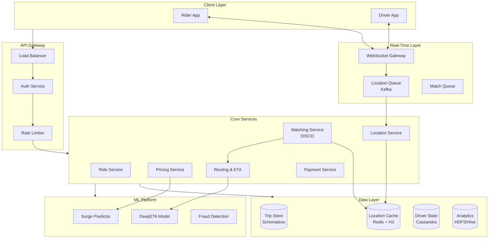
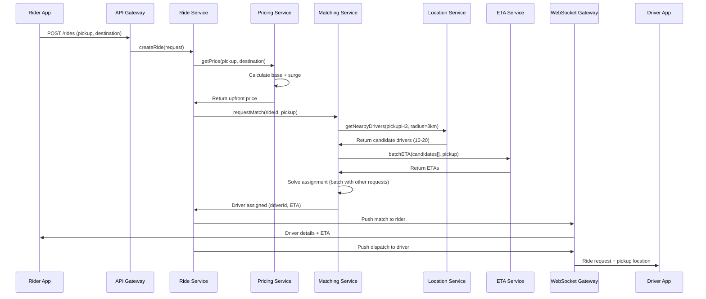
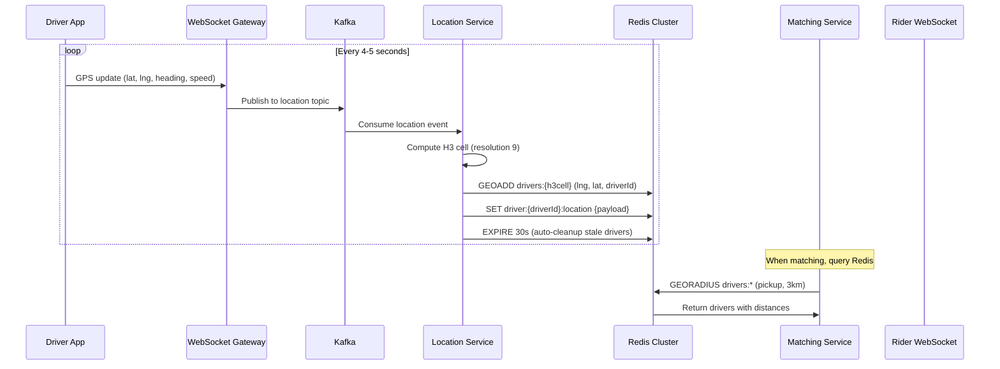
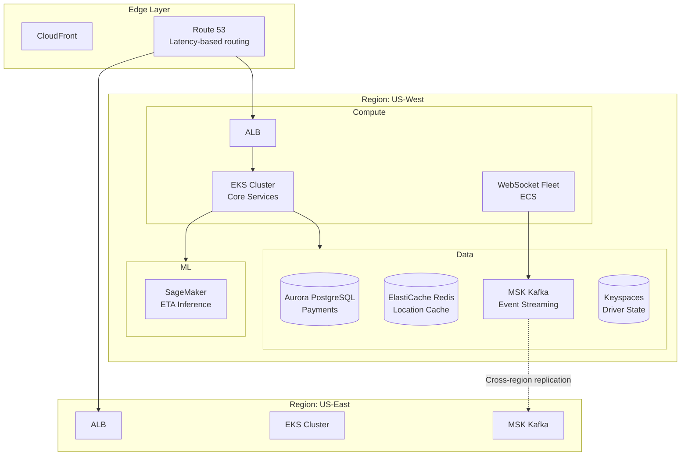

# Design Uber-Style Ride Hailing

A comprehensive system design for a ride-hailing platform handling real-time driver-rider matching, geospatial indexing at scale, dynamic pricing, and sub-second location tracking. This design addresses the core challenges of matching millions of riders with drivers in real-time while optimizing for ETAs, driver utilization, and surge pricing across global markets.

<figure>



<figcaption>High-level architecture: Rider and driver apps connect through a WebSocket gateway for real-time updates. The Matching Service (DISCO) uses H3-indexed location data and ML-powered ETA predictions to optimize driver dispatch.</figcaption>
</figure>

## Abstract

Ride-hailing systems solve three interconnected problems: **spatial indexing** (finding nearby drivers efficiently), **dispatch optimization** (matching riders to drivers to minimize wait time globally, not just per-request), and **dynamic pricing** (balancing supply and demand in real-time).

The core spatial index uses **H3 hexagonal cells** rather than geohash or quadtrees. Hexagons provide uniform neighbor distances (all 6 neighbors equidistant), enabling accurate proximity searches without the edge artifacts of square cells. Uber open-sourced H3 for this reason—gradient analysis for surge pricing and demand forecasting becomes trivial when all adjacent cells have equal weight.

**Dispatch is not "find closest driver."** Traffic, bridges, and one-way streets make Euclidean distance meaningless. The Matching Service (DISCO) uses ETA-based assignment with batch optimization: accumulate requests over a short window (100-200ms), build a bipartite graph of riders and available drivers, and solve the assignment problem to minimize total wait time across all requests. This global optimization outperforms greedy per-request matching by 10-20% on wait times.

**Surge pricing uses a hybrid approach**: real-time supply/demand ratios within H3 cells set the base multiplier, while ML models adjust for predicted demand (events, weather, historical patterns). The key design insight is that surge must be spatially granular (different blocks have different multipliers) but temporally smooth (avoid jarring jumps that frustrate users).

## Requirements

### Functional Requirements

| Feature                                  | Priority | Scope        |
| ---------------------------------------- | -------- | ------------ |
| Request ride (pickup, destination)       | Core     | Full         |
| Real-time driver matching                | Core     | Full         |
| Live location tracking (driver → rider)  | Core     | Full         |
| Dynamic/surge pricing                    | Core     | Full         |
| ETA prediction                           | Core     | Full         |
| Driver dispatch and navigation           | Core     | Full         |
| Trip lifecycle (start, complete, cancel) | Core     | Full         |
| Payment processing                       | Core     | Overview     |
| Driver ratings and feedback              | High     | Overview     |
| Ride history and receipts                | High     | Brief        |
| Scheduled rides                          | Medium   | Brief        |
| Ride sharing (UberPool)                  | Medium   | Out of scope |
| Driver earnings and payouts              | Low      | Out of scope |

### Non-Functional Requirements

| Requirement             | Target                                            | Rationale                                     |
| ----------------------- | ------------------------------------------------- | --------------------------------------------- |
| Availability            | 99.99%                                            | Revenue-critical; outage = stranded users     |
| Matching latency        | p99 < 3 seconds                                   | User perception of "instant" match            |
| Location update latency | p99 < 500ms                                       | Real-time tracking accuracy                   |
| ETA accuracy            | ±2 minutes median                                 | User trust in time estimates                  |
| Surge price staleness   | < 30 seconds                                      | Avoid stale pricing on request                |
| Throughput              | 1M+ location updates/sec                          | Global driver fleet scale                     |
| Consistency             | Eventual (< 5s) for location; strong for payments | Location tolerates staleness; payments cannot |

### Scale Estimation

**Users and Drivers:**

- Daily trips: 30M trips/day (Uber 2024)
- Monthly active users: 180M
- Active drivers: 8.8M globally
- Peak concurrent: 3M drivers online, 10M active rider sessions

**Traffic:**

- Location updates: 8.8M drivers × 1 update/4 seconds = 2.2M updates/sec peak
- Ride requests: 30M/day = ~350 RPS average, ~1,500 RPS peak
- ETA queries: Each match queries 10-20 candidate drivers = 15-30K RPS
- Price checks: 10× ride requests (users check before confirming) = 15K RPS peak

**Storage:**

- Trip record: ~5KB (metadata, route, pricing, payment)
- Daily trip storage: 30M × 5KB = 150GB/day
- Location history (hot): 8.8M drivers × 4KB/minute × 60 min = 2TB rolling window
- Yearly growth: ~55TB/year for trips alone

**Message Volume:**

- Kafka: 1 trillion messages/day (Uber published)
- Real-time events: Location, trip state, notifications

## Design Paths

### Path A: Geohash + Greedy Matching

**Best when:**

- Simpler implementation requirements
- Moderate scale (< 100K concurrent drivers)
- Latency constraints relaxed (5+ seconds acceptable)

**Key characteristics:**

- Use geohash strings for spatial indexing (e.g., `9q8yyk` for SF downtown)
- Match each request immediately to the nearest available driver
- Single-request optimization (no batching)

**Trade-offs:**

- ✅ Simple implementation (geohash is well-understood)
- ✅ Lower latency for individual matches
- ✅ Easier to reason about and debug
- ❌ Geohash edge effects (neighbors at different distances)
- ❌ Suboptimal global wait times (greedy isn't globally optimal)
- ❌ Struggles with dense urban areas (many equidistant drivers)

**Real-world example:** Early Uber and Lyft used geohash-based approaches. Worked well at small scale but required rearchitecture as cities densified.

### Path B: H3 + Batch Optimization (Chosen)

**Best when:**

- High driver density in urban areas
- Global optimization matters (minimize total wait time)
- Scale demands efficient spatial queries

**Key characteristics:**

- H3 hexagonal cells for uniform spatial indexing
- Batch requests over 100-200ms windows
- Solve assignment as bipartite matching problem
- ETA-based costs, not distance-based

**Trade-offs:**

- ✅ Uniform neighbor distances (no edge artifacts)
- ✅ 10-20% better wait times via global optimization
- ✅ Natural fit for surge pricing (hexagonal heatmaps)
- ✅ Efficient k-ring queries for nearby cells
- ❌ Higher implementation complexity
- ❌ Slight latency increase from batching (100-200ms)
- ❌ Requires ML for accurate ETA (not just distance)

**Real-world example:** Uber developed and open-sourced H3 specifically for this use case. Their DISCO system uses batch optimization to minimize city-wide wait times.

### Path C: Quadtree + Real-Time Streaming

**Best when:**

- Variable driver density (sparse suburbs, dense cities)
- Need adaptive spatial resolution
- Streaming-first architecture

**Key characteristics:**

- Quadtree adapts cell size to driver density
- Stream processing (Flink/Samza) for continuous matching
- No batching—process events as they arrive

**Trade-offs:**

- ✅ Adaptive resolution (small cells in dense areas)
- ✅ No batching latency
- ✅ Natural fit for streaming architectures
- ❌ Complex rebalancing as density changes
- ❌ Non-uniform neighbor distances (like geohash)
- ❌ Harder to aggregate for surge pricing

### Path Comparison

| Factor                    | Path A (Geohash)   | Path B (H3 Batch)   | Path C (Quadtree) |
| ------------------------- | ------------------ | ------------------- | ----------------- |
| Spatial uniformity        | Low (edge effects) | High                | Medium            |
| Matching optimality       | Greedy (local)     | Global              | Local             |
| Implementation complexity | Low                | High                | Medium            |
| Latency                   | Lowest             | +100-200ms          | Low               |
| Scale                     | Moderate           | High                | High              |
| Best for                  | MVP, low-density   | Dense urban, global | Variable density  |

### This Article's Focus

This article implements **Path B (H3 + Batch Optimization)** because Uber's published architecture demonstrates this approach at scale. The 10-20% improvement in wait times from global optimization justifies the added complexity for a revenue-critical system.

## High-Level Design

### Service Architecture

#### Ride Service

Manages the trip lifecycle from request to completion:

- Create ride request (validate pickup/destination, check surge)
- Track trip state machine: REQUESTED → MATCHED → DRIVER_ARRIVING → IN_PROGRESS → COMPLETED
- Handle cancellations (with appropriate fees/policies)
- Store trip records for history and analytics

#### Matching Service (DISCO)

The core dispatch engine that matches riders to drivers:

- Receive ride requests from Ride Service
- Query Location Service for nearby available drivers
- Query Routing Service for ETA from each candidate to pickup
- Build bipartite graph: riders as left vertices, drivers as right vertices
- Edge weights = ETA (lower is better)
- Solve assignment problem to minimize total ETA across all pending requests
- Dispatch selected driver, update driver state to DISPATCHED

#### Location Service

Tracks real-time driver positions at million-message-per-second scale:

- Ingest GPS updates from Driver App (every 4-5 seconds)
- Store current position in Redis with H3 index
- Maintain hot window of recent positions for trajectory
- Publish location changes to Kafka for other services
- Support spatial queries: "drivers within k-rings of H3 cell"

#### Pricing Service

Calculates fares including dynamic surge:

- Base fare calculation (distance, time, vehicle type)
- Surge multiplier lookup (per H3 cell, refreshed every 5-10 minutes)
- Upfront pricing (show fare before ride request)
- Promo code and discount application
- Final fare calculation with actuals (if route differs)

#### Routing & ETA Service

Provides navigation and time estimates:

- Road network graph (OpenStreetMap or licensed)
- Real-time traffic integration
- ETA prediction using DeepETA model (hybrid physics + ML)
- Turn-by-turn navigation for Driver App
- Route optimization for UberPool (not in scope)

#### Payment Service

Handles financial transactions:

- Tokenized payment methods (no raw card numbers stored)
- Charge on trip completion
- Split payments (multiple riders)
- Driver payout aggregation
- Fraud detection integration

### Data Flow: Requesting a Ride



### Data Flow: Real-Time Location Tracking



## API Design

### Ride Request

**Endpoint:** `POST /api/v1/rides`

```json collapse={1-3, 25-35}
// Headers
Authorization: Bearer {access_token}
Content-Type: application/json

// Request body
{
  "pickup": {
    "latitude": 37.7749,
    "longitude": -122.4194,
    "address": "123 Market St, San Francisco, CA"
  },
  "destination": {
    "latitude": 37.7899,
    "longitude": -122.4014,
    "address": "456 Mission St, San Francisco, CA"
  },
  "vehicleType": "UBER_X",
  "paymentMethodId": "pm_abc123",
  "riderCount": 1,
  "scheduledTime": null
}
```

**Response (201 Created):**

```json collapse={1-5, 40-55}
{
  "rideId": "ride_abc123xyz",
  "status": "REQUESTED",
  "pickup": {
    "latitude": 37.7749,
    "longitude": -122.4194,
    "address": "123 Market St, San Francisco, CA"
  },
  "destination": {
    "latitude": 37.7899,
    "longitude": -122.4014,
    "address": "456 Mission St, San Francisco, CA"
  },
  "estimate": {
    "fareAmount": 1850,
    "fareCurrency": "USD",
    "surgeMultiplier": 1.2,
    "distanceMeters": 2100,
    "durationSeconds": 480
  },
  "etaToPickup": null,
  "driver": null,
  "vehicle": null,
  "createdAt": "2024-01-15T14:30:00Z"
}
```

**Error Responses:**

- `400 Bad Request`: Invalid coordinates, unsupported area
- `402 Payment Required`: Payment method declined
- `409 Conflict`: Rider has active ride in progress
- `429 Too Many Requests`: Rate limit exceeded (anti-fraud)
- `503 Service Unavailable`: No drivers in area (with retry-after)

**Rate Limits:** 10 requests/minute per user (prevents spam requests)

### Location Update (Driver)

**Endpoint:** WebSocket `wss://location.uber.com/v1/driver`

```json
// Client → Server (every 4-5 seconds)
{
  "type": "LOCATION_UPDATE",
  "payload": {
    "latitude": 37.7751,
    "longitude": -122.4183,
    "heading": 45,
    "speed": 12.5,
    "accuracy": 5.0,
    "timestamp": 1705329000000
  }
}

// Server → Client (acknowledgment)
{
  "type": "LOCATION_ACK",
  "payload": {
    "received": 1705329000123
  }
}
```

**Design Decision: WebSocket vs HTTP Polling**

Why WebSocket for driver location updates:

- **Bidirectional**: Server can push ride requests instantly
- **Persistent connection**: Amortizes TCP handshake cost across thousands of updates
- **Battery efficiency**: Single connection vs repeated HTTP requests
- **Sub-second latency**: Critical for real-time tracking

### Get Nearby Drivers (for fare estimate screen)

**Endpoint:** `GET /api/v1/drivers/nearby`

**Query Parameters:**

| Parameter      | Type    | Description                             |
| -------------- | ------- | --------------------------------------- |
| `latitude`     | float   | Pickup latitude                         |
| `longitude`    | float   | Pickup longitude                        |
| `vehicleTypes` | string  | Comma-separated (UBER_X,UBER_BLACK)     |
| `radius`       | integer | Search radius in meters (default: 3000) |

**Response:**

```json collapse={1-3, 20-25}
{
  "drivers": [
    {
      "driverId": "driver_xyz",
      "latitude": 37.7755,
      "longitude": -122.418,
      "heading": 90,
      "vehicleType": "UBER_X",
      "etaSeconds": 180
    },
    {
      "driverId": "driver_abc",
      "latitude": 37.774,
      "longitude": -122.42,
      "heading": 270,
      "vehicleType": "UBER_X",
      "etaSeconds": 240
    }
  ],
  "surgeMultiplier": 1.2,
  "surgeExpiresAt": "2024-01-15T14:35:00Z"
}
```

**Design Decision: Why Return Limited Driver Info**

The response includes approximate positions (±100m fuzzy) rather than exact locations:

- **Privacy**: Drivers' real-time positions are sensitive
- **Performance**: Fewer precision bits = better compression
- **Purpose**: Only needed for UI (show cars on map), not for matching

### Surge Pricing

**Endpoint:** `GET /api/v1/surge`

**Query Parameters:**

| Parameter     | Type   | Description     |
| ------------- | ------ | --------------- |
| `latitude`    | float  | Pickup location |
| `longitude`   | float  | Pickup location |
| `vehicleType` | string | Vehicle type    |

**Response:**

```json
{
  "multiplier": 1.5,
  "reason": "HIGH_DEMAND",
  "h3Cell": "892a100d2c3ffff",
  "expiresAt": "2024-01-15T14:40:00Z",
  "demandLevel": "VERY_HIGH",
  "supplyLevel": "LOW"
}
```

**Design Decision: Surge Expiration**

Surge multipliers include an `expiresAt` timestamp. If the rider's request comes after expiration, the client must re-fetch. This prevents:

- Stale high surge (rider sees 2x, actually 1x now—under-charges)
- Stale low surge (rider sees 1x, actually 2x—creates pricing disputes)

## Data Modeling

### Trip Schema (Schemaless)

Uber uses a MySQL-based append-only store called Schemaless for trip data. Each "cell" is immutable; updates create new cells.

**Primary Store:** Schemaless (MySQL-backed)

```sql collapse={1-5}
-- Schemaless stores data as (row_key, column_name, ref_key) tuples
-- row_key: trip_id (UUID)
-- column_name: "base", "driver", "route", "payment", etc.
-- ref_key: version number
-- body: BLOB (protobuf-serialized data)

CREATE TABLE trips (
    added_id BIGINT AUTO_INCREMENT PRIMARY KEY,  -- Total ordering
    row_key BINARY(16) NOT NULL,                  -- trip_id as UUID
    column_name VARCHAR(64) NOT NULL,
    ref_key BIGINT NOT NULL,                      -- Version/timestamp
    body MEDIUMBLOB NOT NULL,
    created_at DATETIME NOT NULL,

    INDEX idx_row_column (row_key, column_name, ref_key DESC)
);
```

**Trip Data Columns:**

| Column Name | Contents                                    | When Written  |
| ----------- | ------------------------------------------- | ------------- |
| `base`      | Pickup, destination, rider_id, vehicle_type | On request    |
| `match`     | driver_id, vehicle_id, match_time, eta      | On match      |
| `route`     | Polyline, distance, duration, waypoints     | On trip start |
| `pricing`   | Base fare, surge, discounts, final amount   | On completion |
| `payment`   | Transaction ID, status, method              | On charge     |
| `rating`    | Rider rating, driver rating, feedback       | Post-trip     |

**Design Decision: Schemaless vs Traditional SQL**

Why Schemaless for trips:

- **Append-only**: No in-place updates simplifies consistency
- **Flexible schema**: Add new columns without migrations
- **Time-travel**: Query any historical version of a trip
- **Sharded by row_key**: Trips for same user co-located

**Sharding:** 4,096 logical shards, hash(trip_id) determines shard.

### Driver Location (Redis)

```bash
# Driver's current location (expires in 30s if no update)
SET driver:{driver_id}:location '{"lat":37.7751,"lng":-122.4183,"h3":"89283082837ffff","heading":45,"speed":12.5,"status":"AVAILABLE","ts":1705329000}'
EXPIRE driver:{driver_id}:location 30

# Geo-indexed by H3 cell (resolution 9 ≈ 100m cells)
# Score = timestamp for LRU-style queries
ZADD drivers:h3:89283082837ffff 1705329000 driver_123
ZADD drivers:h3:89283082837ffff 1705328995 driver_456

# Status index for quick filtering
SADD drivers:status:AVAILABLE driver_123 driver_456
SREM drivers:status:AVAILABLE driver_789
SADD drivers:status:ON_TRIP driver_789
```

**Design Decision: H3 Resolution 9**

Resolution 9 cells are approximately 100m × 100m. This provides:

- Fine enough granularity for urban density
- Coarse enough to avoid millions of cells per city
- Efficient k-ring queries (ring of radius 3 covers ~3km)

### Driver State (Cassandra)

```cql
-- Driver profile and state (high availability)
CREATE TABLE driver_state (
    driver_id UUID,
    city_id INT,
    status TEXT,           -- OFFLINE, AVAILABLE, DISPATCHED, ON_TRIP
    vehicle_id UUID,
    current_trip_id UUID,
    last_location_update TIMESTAMP,
    rating DECIMAL,
    total_trips INT,
    acceptance_rate DECIMAL,
    PRIMARY KEY ((city_id), driver_id)
) WITH CLUSTERING ORDER BY (driver_id ASC);

-- Per-driver time series (write-heavy)
CREATE TABLE driver_locations (
    driver_id UUID,
    day DATE,
    timestamp TIMESTAMP,
    latitude DOUBLE,
    longitude DOUBLE,
    h3_cell TEXT,
    speed DOUBLE,
    heading INT,
    PRIMARY KEY ((driver_id, day), timestamp)
) WITH CLUSTERING ORDER BY (timestamp DESC);
```

**Design Decision: Cassandra for Driver State**

- **Write-heavy workload**: Millions of location updates/second
- **Partition by city**: Co-locates drivers in same market
- **Tunable consistency**: Read at LOCAL_ONE for speed, write at LOCAL_QUORUM for durability
- **Natural time series**: Location history with TTL for retention

### Database Selection Matrix

| Data Type             | Store              | Rationale                                      |
| --------------------- | ------------------ | ---------------------------------------------- |
| Trip records          | Schemaless (MySQL) | Append-only, time-travel, flexible schema      |
| Real-time location    | Redis Cluster      | Sub-ms reads, geo queries, TTL                 |
| Driver profile/state  | Cassandra          | High write throughput, tunable consistency     |
| Surge pricing         | Redis + Kafka      | Low latency reads, event streaming for updates |
| Payment transactions  | PostgreSQL         | ACID for financial data                        |
| Analytics/ML features | HDFS + Hive        | Batch processing, ML training data             |

## Low-Level Design

### H3 Spatial Indexing

H3 is Uber's open-source hexagonal hierarchical spatial index. It divides Earth into hexagonal cells at 16 resolution levels.

#### Why Hexagons?

```
Square grid (geohash):           Hexagonal grid (H3):

+---+---+---+                    / \ / \ / \
| A | B | C |                   |   |   |   |
+---+---+---+    →              | A | B | C |
| D | X | E |                   |   |   |   |
+---+---+---+                    \ / \ / \ /
| F | G | H |                     |   |   |
+---+---+---+                     | D | E |

Distances from X:                 Distances from X:
  - A,C,F,H: √2 (diagonal)          - All 6 neighbors: 1 (uniform!)
  - B,D,E,G: 1 (cardinal)
```

**Key advantage**: Hexagons have 6 equidistant neighbors. This eliminates the diagonal distance problem in square grids, which matters for:

- Surge pricing (adjacent cells should have equal influence)
- Demand forecasting (spatial smoothing)
- Driver proximity (accurate radius queries)

#### H3 Resolution Table

| Resolution | Avg Edge (km) | Avg Area (km²) | Use Case                       |
| ---------- | ------------- | -------------- | ------------------------------ |
| 7          | 1.22          | 5.16           | City districts, regional surge |
| 8          | 0.46          | 0.74           | Neighborhood level             |
| **9**      | **0.17**      | **0.11**       | **Driver indexing (≈100m)**    |
| 10         | 0.066         | 0.015          | Street level                   |

#### H3 Operations

```typescript collapse={1-8, 35-45}
import h3 from "h3-js"

// Convert lat/lng to H3 cell at resolution 9
function locationToH3(lat: number, lng: number): string {
  return h3.latLngToCell(lat, lng, 9)
  // Returns: "89283082837ffff" (64-bit as hex string)
}

// Get all H3 cells within radius (k-ring)
function getCellsInRadius(centerH3: string, radiusKm: number): string[] {
  // k=1 ≈ 300m, k=3 ≈ 1km, k=10 ≈ 3km at resolution 9
  const k = Math.ceil(radiusKm / 0.17) // 170m per cell at res 9
  return h3.gridDisk(centerH3, k)
  // Returns all cells within k "rings" of center
}

// Example: Find drivers within 2km of pickup
function findNearbyDrivers(pickupLat: number, pickupLng: number, radiusKm: number = 2): Promise<Driver[]> {
  const centerCell = locationToH3(pickupLat, pickupLng)
  const searchCells = getCellsInRadius(centerCell, radiusKm)

  // Query Redis for drivers in each cell
  // Using pipelining for efficiency
  const pipeline = redis.pipeline()
  for (const cell of searchCells) {
    pipeline.zrange(`drivers:h3:${cell}`, 0, -1)
  }

  const results = await pipeline.exec()
  const driverIds = new Set(results.flat().filter(Boolean))
  return fetchDriverDetails([...driverIds])
}
```

### Matching Algorithm (DISCO)

DISCO (Dispatch Optimization) matches riders to drivers using batch optimization rather than greedy nearest-driver assignment.

#### Batch Optimization Window

```typescript collapse={1-10, 45-55}
interface RideRequest {
  rideId: string
  pickupH3: string
  pickupLat: number
  pickupLng: number
  requestTime: number
}

interface DriverCandidate {
  driverId: string
  h3Cell: string
  lat: number
  lng: number
  etaSeconds: number // To pickup
}

// Batch window: accumulate requests for 100-200ms
class MatchingBatcher {
  private pendingRequests: RideRequest[] = []
  private batchInterval = 150 // ms

  constructor() {
    setInterval(() => this.processBatch(), this.batchInterval)
  }

  addRequest(request: RideRequest) {
    this.pendingRequests.push(request)
  }

  private async processBatch() {
    if (this.pendingRequests.length === 0) return

    const requests = this.pendingRequests
    this.pendingRequests = []

    // 1. Find candidate drivers for all requests
    const candidatesMap = await this.findCandidatesForAll(requests)

    // 2. Build bipartite graph
    const graph = this.buildBipartiteGraph(requests, candidatesMap)

    // 3. Solve assignment (minimize total ETA)
    const assignments = this.solveAssignment(graph)

    // 4. Dispatch drivers
    for (const { rideId, driverId, eta } of assignments) {
      await this.dispatchDriver(rideId, driverId, eta)
    }
  }
}
```

#### Hungarian Algorithm for Assignment

The assignment problem is: given N riders and M drivers with a cost matrix (ETAs), find the assignment that minimizes total cost.

```typescript collapse={1-5, 40-50}
// Cost matrix: riders × drivers
// cost[i][j] = ETA for driver j to reach rider i's pickup
// Use Infinity for infeasible pairs (driver too far)

function solveAssignment(requests: RideRequest[], candidates: Map<string, DriverCandidate[]>): Assignment[] {
  const n = requests.length
  const allDrivers = new Set<string>()
  candidates.forEach((c) => c.forEach((d) => allDrivers.add(d.driverId)))
  const m = allDrivers.size
  const driverList = [...allDrivers]

  // Build cost matrix
  const cost: number[][] = Array(n)
    .fill(null)
    .map(() => Array(m).fill(Infinity))

  for (let i = 0; i < n; i++) {
    const rideCandidates = candidates.get(requests[i].rideId) ?? []
    for (const candidate of rideCandidates) {
      const j = driverList.indexOf(candidate.driverId)
      cost[i][j] = candidate.etaSeconds
    }
  }

  // Hungarian algorithm: O(n³)
  // For large scale, use auction algorithm or relaxation-based approximations
  const assignments = hungarianAlgorithm(cost)

  return assignments.map(([i, j]) => ({
    rideId: requests[i].rideId,
    driverId: driverList[j],
    eta: cost[i][j],
  }))
}
```

**Design Decision: Batch Size and Window**

- **Window too short (< 50ms)**: Not enough requests to optimize
- **Window too long (> 300ms)**: Noticeable user delay
- **Sweet spot: 100-200ms**: 10-50 concurrent requests in dense areas, imperceptible delay

**Improvement over greedy:** Uber reports 10-20% reduction in average wait times from batch optimization.

### ETA Prediction (DeepETA)

Uber's DeepETA uses a hybrid approach: physics-based routing for the baseline, ML for residual correction.

#### Architecture

```
                    ┌─────────────────┐
                    │  Road Network   │
                    │  Graph (OSM)    │
                    └────────┬────────┘
                             │
    Pickup/Destination ──────┼──────────────┐
                             │              │
                             ▼              ▼
                    ┌─────────────────┐ ┌─────────────────┐
                    │ Routing Engine  │ │  DeepETA Model  │
                    │ (Dijkstra/A*)   │ │ (Linear Transf) │
                    └────────┬────────┘ └────────┬────────┘
                             │                   │
                             ▼                   ▼
                    Physics-based ETA    ML Residual (R)
                          (Y)
                             │                   │
                             └───────┬───────────┘
                                     │
                                     ▼
                            Final ETA = Y + R
```

#### Feature Engineering

```typescript collapse={1-5, 30-40}
interface ETAFeatures {
  // Spatial features
  originH3: string
  destH3: string
  routeH3Cells: string[] // H3 cells along route

  // Temporal features
  hourOfDay: number // 0-23
  dayOfWeek: number // 0-6
  isHoliday: boolean
  minutesSinceMidnight: number

  // Traffic features
  currentTrafficIndex: number // 0-1 (free flow to gridlock)
  historicalTrafficIndex: number // Same time last week
  trafficTrend: number // Improving/worsening

  // Route features
  distanceMeters: number
  numIntersections: number
  numHighwaySegments: number
  routingEngineETA: number // Physics-based baseline

  // Weather (optional)
  precipitation: number
  visibility: number
}

// Model inference
async function predictETA(features: ETAFeatures): Promise<number> {
  // Call ML serving layer (Michelangelo)
  const residual = await mlClient.predict("deepeta", features)

  // Final ETA = routing engine + ML residual
  return features.routingEngineETA + residual
}
```

**Performance:**

- Median latency: 3.25ms
- P95 latency: 4ms
- QPS: Hundreds of thousands/second at Uber

### Surge Pricing Engine

#### Supply/Demand Calculation

```typescript collapse={1-8, 40-50}
interface SurgeCell {
  h3Cell: string // Resolution 7 (larger area)
  demandCount: number // Ride requests in last 5 minutes
  supplyCount: number // Available drivers
  multiplier: number // Calculated surge
  updatedAt: number
}

// Calculate surge for each H3 cell
async function calculateSurge(cityId: string): Promise<Map<string, SurgeCell>> {
  const cells = new Map<string, SurgeCell>()

  // Get H3 cells for the city (resolution 7, ~5km² each)
  const cityCells = getCityH3Cells(cityId, 7)

  for (const h3Cell of cityCells) {
    // Count requests in this cell (last 5 minutes)
    const demandCount = (await redis.get(`demand:${h3Cell}:5min`)) || 0

    // Count available drivers in this cell
    const childCells = h3.cellToChildren(h3Cell, 9) // Expand to res 9
    let supplyCount = 0
    for (const child of childCells) {
      supplyCount += await redis.scard(`drivers:h3:${child}:available`)
    }

    // Calculate multiplier
    const ratio = supplyCount > 0 ? demandCount / supplyCount : 10
    const multiplier = calculateMultiplier(ratio)

    cells.set(h3Cell, {
      h3Cell,
      demandCount,
      supplyCount,
      multiplier,
      updatedAt: Date.now(),
    })
  }

  return cells
}

function calculateMultiplier(demandSupplyRatio: number): number {
  // Piecewise linear function
  // ratio < 0.5: no surge (1.0x)
  // ratio 0.5-1.0: linear 1.0x-1.5x
  // ratio 1.0-2.0: linear 1.5x-2.5x
  // ratio > 2.0: cap at 3.0x (regulatory/PR limits)

  if (demandSupplyRatio < 0.5) return 1.0
  if (demandSupplyRatio < 1.0) return 1.0 + (demandSupplyRatio - 0.5)
  if (demandSupplyRatio < 2.0) return 1.5 + (demandSupplyRatio - 1.0)
  return Math.min(3.0, 1.5 + demandSupplyRatio - 1.0)
}
```

#### Temporal Smoothing

Raw surge calculations can be noisy (5-minute windows have high variance). Apply smoothing:

```typescript collapse={1-5}
// Exponential moving average to prevent jarring jumps
function smoothSurge(
  currentMultiplier: number,
  previousMultiplier: number,
  alpha: number = 0.3, // Smoothing factor
): number {
  // New surge = α × current + (1-α) × previous
  const smoothed = alpha * currentMultiplier + (1 - alpha) * previousMultiplier

  // Also limit change rate (max ±0.3 per update)
  const maxDelta = 0.3
  const delta = smoothed - previousMultiplier
  if (Math.abs(delta) > maxDelta) {
    return previousMultiplier + Math.sign(delta) * maxDelta
  }

  return smoothed
}
```

**Design Decision: Surge Resolution**

- **Spatial**: Resolution 7 (~5km²) for surge, resolution 9 (~100m) for driver indexing
- **Temporal**: Recalculate every 5-10 minutes, smooth changes
- **Why larger cells for surge**: Surge should be stable across a neighborhood; overly granular surge creates confusion ("why is it 2x here but 1.2x across the street?")

## Frontend Considerations

### Map Rendering Performance

**Problem:** Displaying 20+ driver pins updating every 4-5 seconds causes jank on mobile devices.

**Solution: Batch Updates + Canvas Rendering**

```typescript collapse={1-10, 35-45}
// Instead of updating each marker individually,
// batch updates and render to canvas overlay

class DriverMapLayer {
  private canvas: HTMLCanvasElement
  private drivers: Map<string, DriverPosition> = new Map()
  private pendingUpdates: DriverPosition[] = []
  private rafId: number | null = null

  // Buffer updates, render on next animation frame
  updateDriver(position: DriverPosition) {
    this.pendingUpdates.push(position)

    if (!this.rafId) {
      this.rafId = requestAnimationFrame(() => this.render())
    }
  }

  private render() {
    // Apply all pending updates
    for (const update of this.pendingUpdates) {
      this.drivers.set(update.driverId, update)
    }
    this.pendingUpdates = []
    this.rafId = null

    // Clear and redraw all drivers
    const ctx = this.canvas.getContext("2d")!
    ctx.clearRect(0, 0, this.canvas.width, this.canvas.height)

    for (const driver of this.drivers.values()) {
      this.drawDriver(ctx, driver)
    }
  }

  private drawDriver(ctx: CanvasRenderingContext2D, driver: DriverPosition) {
    const [x, y] = this.latLngToPixel(driver.lat, driver.lng)
    // Draw car icon rotated to heading
    ctx.save()
    ctx.translate(x, y)
    ctx.rotate((driver.heading * Math.PI) / 180)
    ctx.drawImage(this.carIcon, -12, -12, 24, 24)
    ctx.restore()
  }
}
```

### Real-Time Trip Tracking State

```typescript collapse={1-5, 35-45}
// State machine for ride lifecycle
type RideStatus =
  | "IDLE"
  | "REQUESTING"
  | "MATCHING"
  | "DRIVER_ASSIGNED"
  | "DRIVER_ARRIVING"
  | "DRIVER_ARRIVED"
  | "IN_PROGRESS"
  | "COMPLETED"
  | "CANCELLED"

interface RideState {
  status: RideStatus
  ride: Ride | null
  driver: Driver | null
  driverLocation: LatLng | null
  etaSeconds: number | null
  route: LatLng[] | null
}

// WebSocket message handler
function handleRideUpdate(state: RideState, message: WSMessage): RideState {
  switch (message.type) {
    case "DRIVER_ASSIGNED":
      return {
        ...state,
        status: "DRIVER_ASSIGNED",
        driver: message.driver,
        etaSeconds: message.eta,
      }

    case "DRIVER_LOCATION":
      return {
        ...state,
        driverLocation: message.location,
        etaSeconds: message.eta,
        status: message.eta < 60 ? "DRIVER_ARRIVED" : state.status,
      }

    case "TRIP_STARTED":
      return {
        ...state,
        status: "IN_PROGRESS",
        route: message.route,
      }

    case "TRIP_COMPLETED":
      return {
        ...state,
        status: "COMPLETED",
        ride: { ...state.ride!, fare: message.fare },
      }

    default:
      return state
  }
}
```

### Offline Handling

**Problem:** Riders in areas with poor connectivity may lose connection mid-request.

**Solution: Optimistic UI + Request Queue**

```typescript collapse={1-5, 30-40}
// Queue ride request locally if offline
class RideRequestQueue {
  private queue: RideRequest[] = []

  async requestRide(request: RideRequest): Promise<void> {
    if (!navigator.onLine) {
      // Store locally
      this.queue.push(request)
      localStorage.setItem("pendingRides", JSON.stringify(this.queue))
      throw new OfflineError("Ride queued, will submit when online")
    }

    return this.submitRide(request)
  }

  // Called when connectivity restored
  async processQueue(): Promise<void> {
    const pending = [...this.queue]
    this.queue = []

    for (const request of pending) {
      try {
        await this.submitRide(request)
      } catch (e) {
        // Re-queue if still failing
        this.queue.push(request)
      }
    }

    localStorage.setItem("pendingRides", JSON.stringify(this.queue))
  }
}

// Listen for online event
window.addEventListener("online", () => {
  rideQueue.processQueue()
})
```

## Infrastructure Design

### Cloud-Agnostic Concepts

| Component             | Requirement              | Options                            |
| --------------------- | ------------------------ | ---------------------------------- |
| **Message Queue**     | 1M+ msg/sec, ordering    | Kafka, Pulsar, RedPanda            |
| **Real-time Cache**   | Sub-ms geo queries       | Redis Cluster, KeyDB               |
| **Time-series DB**    | Location history         | Cassandra, ScyllaDB, TimescaleDB   |
| **Stream Processing** | Real-time aggregations   | Flink, Kafka Streams, Samza        |
| **ML Serving**        | Low-latency inference    | TensorFlow Serving, Triton, custom |
| **Object Storage**    | Trip receipts, ML models | S3-compatible (MinIO)              |

### AWS Reference Architecture



| Component         | AWS Service           | Configuration                           |
| ----------------- | --------------------- | --------------------------------------- |
| API Services      | EKS (Kubernetes)      | 50-500 pods, HPA on CPU/requests        |
| WebSocket Gateway | ECS Fargate           | 100-1000 tasks, sticky sessions         |
| Location Cache    | ElastiCache Redis     | r6g.xlarge cluster mode, 6 shards       |
| Event Streaming   | MSK (Kafka)           | 150 nodes, 3 AZs, tiered storage        |
| Driver State      | Keyspaces (Cassandra) | On-demand capacity                      |
| Payments DB       | Aurora PostgreSQL     | db.r6g.2xlarge, Multi-AZ, read replicas |
| ML Inference      | SageMaker             | ml.c5.4xlarge, auto-scaling             |
| Object Storage    | S3 + CloudFront       | Trip receipts, ML models                |

### Multi-Region Active-Active

Uber operates globally with active-active deployments. Key considerations:

1. **Kafka cross-region replication**: uReplicator (Uber's open-source tool) for zero-data-loss replication
2. **Cassandra multi-DC**: LOCAL_QUORUM writes, LOCAL_ONE reads for low latency
3. **Redis geo-replication**: Active-passive per region (location data is region-specific)
4. **DNS-based routing**: Route users to nearest region based on latency

### Self-Hosted Alternatives

| Managed Service | Self-Hosted        | When to Self-Host                   |
| --------------- | ------------------ | ----------------------------------- |
| MSK             | Apache Kafka       | Cost at scale (Uber runs own Kafka) |
| Keyspaces       | Apache Cassandra   | Specific tuning, cost               |
| ElastiCache     | Redis on EC2       | Redis modules, cost                 |
| SageMaker       | TensorFlow Serving | Custom models, latency requirements |

## Conclusion

This design prioritizes **batch-optimized matching** with H3 spatial indexing over simpler greedy approaches. The 10-20% improvement in average wait times justifies the added complexity for a system where every second of reduced wait time translates to user satisfaction and driver utilization.

Key architectural decisions:

1. **H3 hexagonal indexing over geohash**: Uniform neighbor distances eliminate edge artifacts in proximity queries and surge calculations. Uber open-sourced H3 for this reason.

2. **Batch optimization over greedy matching**: Accumulating requests for 100-200ms and solving the global assignment problem outperforms per-request nearest-driver matching significantly.

3. **Hybrid ETA (physics + ML)**: The routing engine provides a solid baseline; ML models learn residual corrections for traffic patterns, events, and local conditions.

4. **Schemaless for trips, Cassandra for driver state**: Append-only storage with flexible schema handles the write-heavy, evolving trip data model; Cassandra's tunable consistency fits the driver location workload.

5. **Spatially-granular, temporally-smooth surge**: Resolution 7 H3 cells (~5km²) provide stable neighborhood-level pricing; temporal smoothing prevents jarring multiplier changes.

**Limitations and future improvements:**

- **UberPool matching**: Shared rides require solving a more complex routing problem with pickup/dropoff ordering constraints.
- **Predictive dispatch**: Pre-positioning drivers based on predicted demand could further reduce wait times.
- **Dynamic pricing experimentation**: ML models could optimize multipliers for market equilibrium rather than simple supply/demand ratios.

## Appendix

### Prerequisites

- Distributed systems fundamentals (CAP theorem, eventual consistency)
- Database concepts (sharding, replication, time-series data)
- Graph algorithms (Dijkstra, bipartite matching basics)
- Basic understanding of ML inference serving

### Terminology

- **H3**: Hexagonal Hierarchical Spatial Index—Uber's open-source geospatial indexing system using hexagonal cells at 16 resolution levels
- **DISCO**: Dispatch Optimization—Uber's matching service that assigns riders to drivers
- **Schemaless**: Uber's MySQL-based append-only data store with flexible schema
- **k-ring**: In H3, the set of all cells within k "hops" of a center cell
- **ETA**: Estimated Time of Arrival—predicted time for driver to reach pickup or destination
- **Surge**: Dynamic pricing multiplier applied when demand exceeds supply
- **Bipartite matching**: Assignment problem where two disjoint sets (riders, drivers) are matched to minimize total cost

### Summary

- **H3 spatial indexing** provides uniform neighbor distances, enabling accurate proximity queries and smooth surge pricing gradients
- **Batch-optimized matching** (100-200ms windows) achieves 10-20% better wait times than greedy nearest-driver assignment
- **Hybrid ETA prediction** combines physics-based routing with ML residual correction for ±2 minute accuracy
- **Real-time location tracking** at 2M+ updates/second uses Redis with H3-indexed sorted sets and 30-second TTLs
- **Surge pricing** operates at H3 resolution 7 (~5km²) with temporal smoothing to prevent jarring changes
- **Schemaless (MySQL) + Cassandra** handles the write-heavy workload with append-only trip records and high-throughput driver state

### References

- [H3: Uber's Hexagonal Hierarchical Spatial Index](https://www.uber.com/blog/h3/) - Official Uber blog on H3 design rationale
- [H3 Documentation](https://h3geo.org/) - API reference and resolution tables
- [H3 GitHub](https://github.com/uber/h3) - Open-source implementation
- [Schemaless: Uber's Trip Datastore](https://www.uber.com/blog/schemaless-part-two-architecture/) - Append-only MySQL architecture
- [DeepETA: How Uber Predicts Arrival Times](https://www.uber.com/blog/deepeta-how-uber-predicts-arrival-times/) - ML-based ETA prediction
- [Michelangelo: Uber's ML Platform](https://www.uber.com/blog/michelangelo-machine-learning-platform/) - ML serving infrastructure
- [Cassandra Operations at Scale](https://www.uber.com/blog/how-uber-optimized-cassandra-operations-at-scale/) - Driver state storage
- [CacheFront: Serving 150M Reads/Second](https://www.uber.com/blog/how-uber-serves-over-150-million-reads/) - Redis caching architecture
- [Chaperone: Auditing Kafka Messages](https://www.uber.com/blog/chaperone-audit-kafka-messages/) - Trillion messages/day at scale
- [uReplicator: Kafka Cross-DC Replication](https://github.com/uber/uReplicator) - Zero-data-loss replication
- [Driver Surge Pricing Research](https://www.uber.com/blog/research/driver-surge-pricing/) - Economic analysis of surge mechanisms
