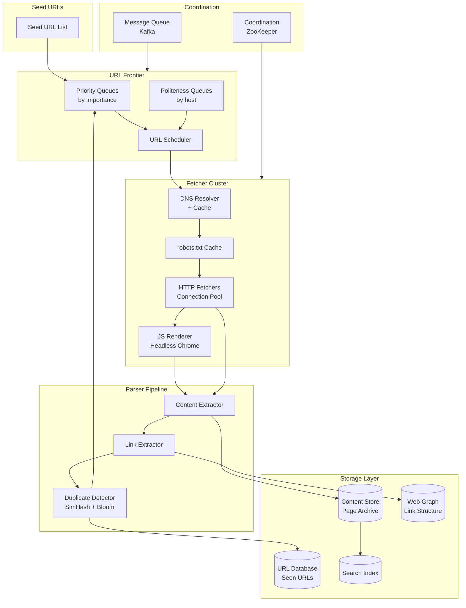
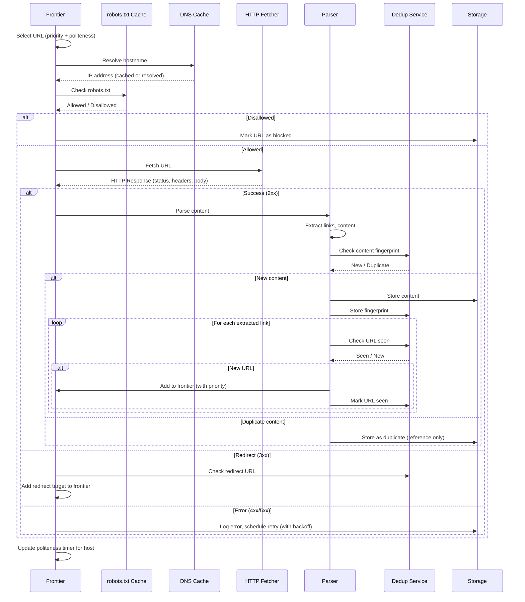
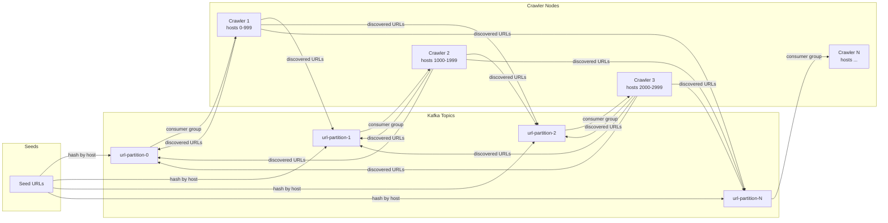
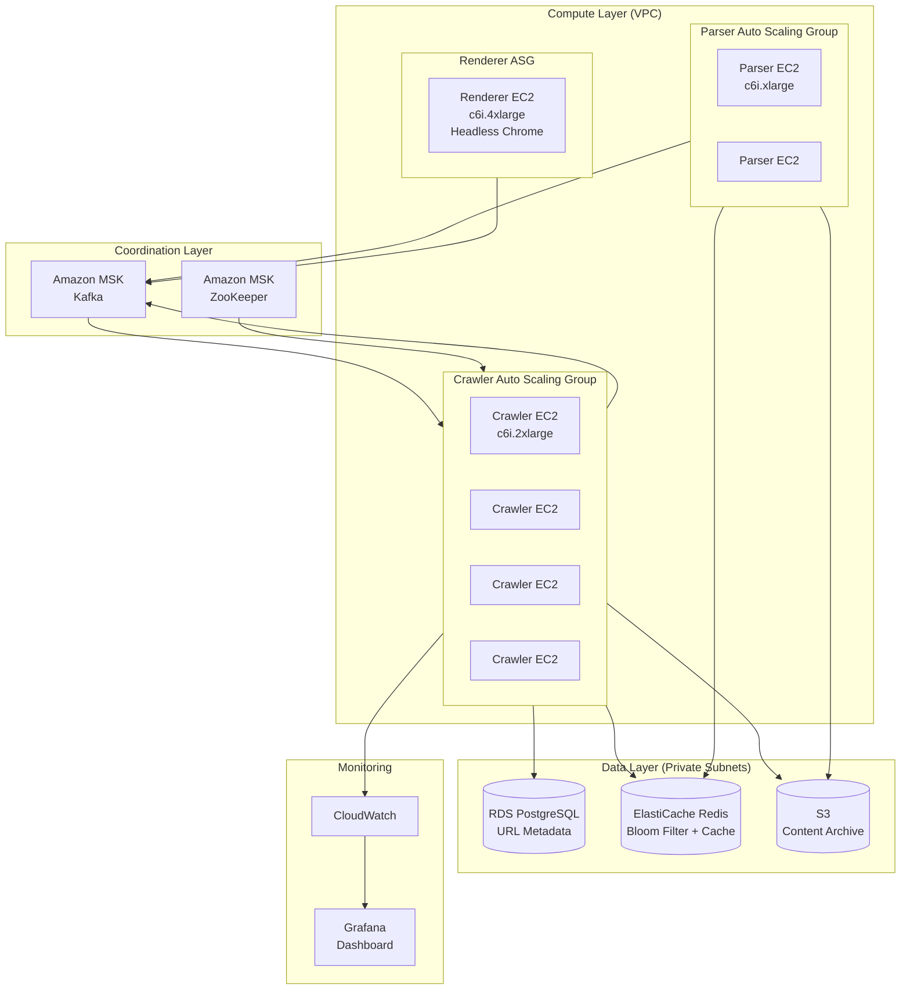

# Design a Web Crawler

A comprehensive system design for a web-scale crawler that discovers, downloads, and indexes billions of pages. This design addresses URL frontier management with politeness constraints, distributed crawling at scale, duplicate detection, and freshness maintenance across petabytes of web content.

<figure>



<figcaption>High-level web crawler architecture: Seeds flow through a prioritized, politeness-aware frontier to distributed fetchers. Parsed content feeds storage while extracted links cycle back through duplicate detection.</figcaption>
</figure>

## Abstract

Web crawlers solve three interconnected problems: **frontier management** (deciding which URLs to fetch next), **politeness** (avoiding overwhelming target servers), and **deduplication** (avoiding redundant downloads of seen URLs and near-duplicate content).

The **URL frontier** is a two-tier queue system. **Front queues** implement prioritization—URLs scoring higher for PageRank, historical change frequency, or domain authority rise to the top. **Back queues** enforce politeness—one queue per host, with timestamps tracking when each host can next be contacted. The Mercator architecture recommends 3× as many back queues as crawler threads to avoid contention.

**Duplicate detection** operates at two levels. **URL-level**: Bloom filters provide O(1) membership testing with configurable false-positive rates (1% at 10 bits/element). URLs are normalized before hashing to collapse equivalent forms. **Content-level**: SimHash generates 64-bit fingerprints where near-duplicate documents have fingerprints differing by ≤3 bits—Google uses this threshold for 8 billion pages.

**Distributed crawling** partitions URLs by host hash using consistent hashing. This co-locates all URLs for a host on one crawler node, enabling local politeness enforcement without coordination. Adding/removing nodes requires re-assigning only 1/N of the URL space. Common Crawl processes 2.3 billion pages/month across ~47 million hosts using this architecture.

## Requirements

### Functional Requirements

| Feature                           | Priority | Scope        |
| --------------------------------- | -------- | ------------ |
| URL discovery from seed list      | Core     | Full         |
| HTTP/HTTPS content fetching       | Core     | Full         |
| robots.txt compliance             | Core     | Full         |
| HTML parsing and link extraction  | Core     | Full         |
| URL deduplication                 | Core     | Full         |
| Content deduplication             | Core     | Full         |
| Distributed crawling coordination | Core     | Full         |
| Recrawl scheduling for freshness  | Core     | Full         |
| JavaScript rendering              | High     | Full         |
| Sitemap processing                | High     | Full         |
| Content storage and indexing      | High     | Overview     |
| Image/media crawling              | Medium   | Brief        |
| Deep web / form submission        | Low      | Out of scope |

### Non-Functional Requirements

| Requirement             | Target                       | Rationale                      |
| ----------------------- | ---------------------------- | ------------------------------ |
| Crawl throughput        | 1,000+ pages/second per node | Match search engine scale      |
| Politeness              | ≤1 request/second per host   | Avoid overloading targets      |
| URL dedup accuracy      | 0% false negatives           | Never miss seen URLs           |
| Content dedup threshold | 3-bit SimHash distance       | Catch near-duplicates          |
| robots.txt freshness    | Cache ≤24 hours              | Per RFC 9309 recommendation    |
| Fault tolerance         | No data loss on node failure | Critical for multi-day crawls  |
| Horizontal scalability  | Linear throughput scaling    | Add nodes to increase capacity |

### Scale Estimation

**Web Scale:**

- Total websites: ~1.4 billion (206 million active)
- Google's index: ~400 billion documents
- Common Crawl monthly: ~2.3 billion pages, ~400 TiB uncompressed

**Target Crawl:**

- Goal: 1 billion pages in 30 days
- Daily pages: 33.3 million = ~385 pages/second sustained
- With peak headroom (3×): ~1,200 pages/second

**Traffic per node:**

- Target: 100 pages/second per node
- Required nodes: 12 (sustained), 15 (with buffer)
- Network per node: 100 pages/sec × 500KB avg = 50 MB/s = 400 Mbps

**Storage:**

- Raw HTML: 1B pages × 500KB avg = 500 TB
- Compressed (gzip ~10×): 50 TB
- URL database: 1B URLs × 200 bytes = 200 GB
- SimHash fingerprints: 1B × 8 bytes = 8 GB
- Bloom filter (1% FP): 1B URLs × 10 bits = 1.25 GB

**DNS:**

- Unique hosts: ~50 million (Common Crawl average)
- DNS queries: 50M × 1.2 (retries) = 60M
- With caching (1-hour TTL): ~6M active lookups

## Design Paths

### Path A: Centralized Coordinator

**Best when:**

- Small to medium scale (< 100M pages)
- Single datacenter deployment
- Strong consistency requirements

**Architecture:**
A central coordinator maintains the entire URL frontier in memory/database. Crawler workers pull batches of URLs from the coordinator, fetch content, and report results back.

**Key characteristics:**

- Single point of truth for URL state
- Global priority ordering
- Centralized politeness enforcement

**Trade-offs:**

- ✅ Simple architecture, easy to reason about
- ✅ Global priority optimization
- ✅ Consistent deduplication
- ❌ Coordinator becomes bottleneck
- ❌ Single point of failure
- ❌ Does not scale beyond ~10 nodes

**Real-world example:** Scrapy Cluster uses Redis as a centralized frontier for coordinated distributed crawling up to millions of pages.

### Path B: Fully Distributed (UbiCrawler)

**Best when:**

- Web-scale crawling (billions of pages)
- Multi-datacenter deployment
- No single point of failure tolerance

**Architecture:**
No central coordinator. URLs are assigned to nodes via consistent hashing on host. Each node maintains its own frontier for assigned hosts. Nodes communicate only for handoff during rebalancing.

**Key characteristics:**

- Hash-based URL partitioning
- Local frontier per node
- Peer-to-peer coordination

**Trade-offs:**

- ✅ Linear horizontal scaling
- ✅ No single point of failure
- ✅ Local politeness (no coordination needed)
- ❌ Global priority ordering is approximate
- ❌ Complex rebalancing on node join/leave
- ❌ Harder to debug and monitor

**Real-world example:** UbiCrawler pioneered this approach for AltaVista. Common Crawl uses similar partitioning at scale.

### Path C: Hybrid with Message Queue (Chosen)

**Best when:**

- Large scale with operational simplicity
- Need both global coordination and distributed execution
- Flexible deployment (cloud or on-premise)

**Architecture:**
URL frontier is distributed across nodes, but coordination happens through a message queue (Kafka). Each node owns a partition of the URL space (by host hash). New URLs are published to Kafka topics; consumers (crawler nodes) pull URLs for their assigned partitions.

**Key characteristics:**

- Message queue for durable URL distribution
- Hash-partitioned topics (one partition per host range)
- Local frontier within each node for politeness
- Separate fetcher and parser processes

**Trade-offs:**

- ✅ Kafka provides durability and replayability
- ✅ Easy to add/remove nodes (Kafka rebalancing)
- ✅ Clear separation of concerns
- ✅ Built-in backpressure handling
- ❌ Additional operational complexity (Kafka cluster)
- ❌ Some latency from message queue
- ❌ Requires careful partition design

### Path Comparison

| Factor               | Path A (Centralized) | Path B (Distributed) | Path C (Hybrid) |
| -------------------- | -------------------- | -------------------- | --------------- |
| Scale limit          | ~10 nodes            | Unlimited            | ~1000 nodes     |
| Complexity           | Low                  | High                 | Medium          |
| Fault tolerance      | Low                  | High                 | High            |
| Global optimization  | Perfect              | Approximate          | Good            |
| Operational overhead | Low                  | High                 | Medium          |
| Best for             | Prototype/small      | Web-scale            | Production      |

### This Article's Focus

This article implements **Path C (Hybrid)** because it balances operational simplicity with scale. Kafka's consumer groups handle node failures and rebalancing automatically, while hash-based partitioning enables local politeness enforcement without coordination overhead.

## High-Level Design

### Component Architecture

#### URL Frontier Service

Manages the queue of URLs to crawl with dual-queue architecture:

**Front Queues (Priority):**

- F queues ranked by priority (typically F=10-20)
- Priority factors: PageRank, domain authority, change frequency, depth from seed
- URLs are assigned to front queues based on computed priority score

**Back Queues (Politeness):**

- B queues, one per host (approximately)
- Each queue tracks `next_allowed_time` for rate limiting
- Mercator recommendation: B = 3 × number of crawler threads

**Queue Selection:**

1. Select a non-empty front queue (weighted by priority)
2. From that queue, select a URL whose back queue is ready (next_allowed_time ≤ now)
3. After fetch, update back queue's next_allowed_time

#### DNS Resolver Service

High-performance DNS resolution with aggressive caching:

- **Local cache**: LRU cache with TTL-aware expiration
- **Batch resolution**: Prefetch DNS for queued URLs
- **Multiple resolvers**: Parallel queries to multiple DNS servers
- **Negative caching**: Cache NXDOMAIN responses (shorter TTL)

**Performance target**: DNS should not be on the critical path. Pre-resolve while URL is queued.

#### Fetcher Service

HTTP client optimized for crawling:

- **Connection pooling**: Reuse connections per host
- **HTTP/2**: Single connection with multiplexed streams (where supported)
- **Compression**: Accept gzip/brotli, decompress on receipt
- **Timeout handling**: Connect timeout (10s), read timeout (30s), total timeout (60s)
- **Redirect following**: Up to 5 redirects (per RFC 9309 for robots.txt)
- **User-Agent**: Identify as crawler with contact info

#### robots.txt Service

Caches and enforces robots.txt rules:

- **Cache duration**: Up to 24 hours (RFC 9309 recommendation)
- **Parsing**: Handle malformed files gracefully
- **Rules**: Allow/Disallow with longest-match precedence
- **Size limit**: Parse at least first 500 KiB (RFC 9309 minimum)
- **Error handling**: 4xx = unrestricted, 5xx = assume complete disallow

#### Content Parser Service

Extracts content and links from fetched pages:

- **HTML parsing**: DOM-based extraction (jsoup, lxml)
- **Link extraction**: `<a href>`, `<link>`, `<script src>`, ``
- **URL normalization**: Resolve relative URLs, canonicalize
- **Content extraction**: Title, meta description, body text
- **Metadata**: Content-Type, charset, Last-Modified

#### JavaScript Renderer Service

Renders JavaScript-heavy pages (separate from main fetcher):

- **Headless Chrome/Puppeteer**: Full browser rendering
- **Render queue**: Separate queue for JS-required pages
- **Resource limits**: Memory/CPU limits per render
- **Timeout**: 30-second render timeout
- **Detection**: Heuristics to identify JS-dependent pages

#### Duplicate Detection Service

Prevents redundant crawling:

**URL Deduplication:**

- Bloom filter for fast negative checks
- Persistent URL store for seen URLs
- URL normalization before hashing

**Content Deduplication:**

- SimHash fingerprinting (64-bit)
- Threshold: Hamming distance ≤ 3 bits = duplicate
- Index fingerprints for fast lookup

### Data Flow: Crawling a URL



### Data Flow: Distributed URL Distribution



## API Design

### Internal APIs (Service-to-Service)

#### Submit URLs to Frontier

**Endpoint:** `POST /api/v1/frontier/urls`

```json collapse={1-3, 20-25}
// Headers
Authorization: Bearer {internal_token}
Content-Type: application/json

// Request body
{
  "urls": [
    {
      "url": "https://example.com/page1",
      "priority": 0.85,
      "source_url": "https://example.com/",
      "depth": 1,
      "discovered_at": "2024-01-15T10:30:00Z"
    },
    {
      "url": "https://example.com/page2",
      "priority": 0.72,
      "source_url": "https://example.com/",
      "depth": 1,
      "discovered_at": "2024-01-15T10:30:00Z"
    }
  ],
  "crawl_id": "crawl-2024-01-15"
}
```

**Response (202 Accepted):**

```json
{
  "accepted": 2,
  "rejected": 0,
  "duplicates": 0
}
```

**Design Decision: Batch Submission**

URLs are submitted in batches (100-1000) rather than individually to amortize Kafka producer overhead and reduce network round-trips. The frontier service handles deduplication and prioritization asynchronously.

#### Fetch Next URLs (Pull Model)

**Endpoint:** `GET /api/v1/frontier/next`

**Query Parameters:**

| Parameter    | Type    | Description                                        |
| ------------ | ------- | -------------------------------------------------- |
| `worker_id`  | string  | Unique identifier for the crawler worker           |
| `batch_size` | integer | Number of URLs to fetch (default: 100, max: 1000)  |
| `timeout_ms` | integer | Long-poll timeout if no URLs ready (default: 5000) |

**Response (200 OK):**

```json collapse={1-3, 25-30}
{
  "urls": [
    {
      "url": "https://example.com/page1",
      "priority": 0.85,
      "host": "example.com",
      "ip": "93.184.216.34",
      "robots_rules": {
        "allowed": true,
        "crawl_delay": null
      }
    },
    {
      "url": "https://other.com/page2",
      "priority": 0.72,
      "host": "other.com",
      "ip": "203.0.113.50",
      "robots_rules": {
        "allowed": true,
        "crawl_delay": 2
      }
    }
  ],
  "lease_id": "lease-abc123",
  "lease_expires_at": "2024-01-15T10:35:00Z"
}
```

**Design Decision: URL Leasing**

URLs are leased to workers with a timeout (5 minutes default). If the worker doesn't report completion (success or failure) before the lease expires, the URL is returned to the frontier for reassignment. This handles worker crashes without losing URLs.

#### Report Fetch Results

**Endpoint:** `POST /api/v1/frontier/results`

```json collapse={1-3, 30-40}
// Headers
Authorization: Bearer {internal_token}
Content-Type: application/json

// Request body
{
  "lease_id": "lease-abc123",
  "results": [
    {
      "url": "https://example.com/page1",
      "status": "success",
      "http_status": 200,
      "content_type": "text/html",
      "content_length": 45230,
      "content_hash": "a1b2c3d4e5f6...",
      "simhash": "0x1234567890abcdef",
      "fetch_time_ms": 234,
      "links_found": 47,
      "is_duplicate": false
    },
    {
      "url": "https://other.com/page2",
      "status": "error",
      "http_status": 503,
      "error": "Service Unavailable",
      "retry_after": 300
    }
  ]
}
```

**Response (200 OK):**

```json
{
  "processed": 2,
  "retries_scheduled": 1
}
```

### Monitoring API

#### Crawl Statistics

**Endpoint:** `GET /api/v1/stats`

```json collapse={1-5, 35-45}
{
  "crawl_id": "crawl-2024-01-15",
  "started_at": "2024-01-15T00:00:00Z",
  "runtime_hours": 10.5,
  "urls": {
    "discovered": 15234567,
    "queued": 8234123,
    "fetched": 7000444,
    "successful": 6543210,
    "failed": 457234,
    "duplicate_content": 234567,
    "blocked_robots": 123456
  },
  "throughput": {
    "current_pages_per_second": 185.3,
    "avg_pages_per_second": 173.2,
    "peak_pages_per_second": 312.5
  },
  "hosts": {
    "total_discovered": 1234567,
    "active_in_queue": 456789,
    "blocked_by_robots": 12345
  },
  "storage": {
    "content_stored_gb": 2345.6,
    "urls_stored_millions": 15.2
  },
  "workers": {
    "active": 12,
    "idle": 3,
    "failed": 0
  }
}
```

## Data Modeling

### URL Schema

**Primary Store:** PostgreSQL for URL metadata, Kafka for frontier queue

```sql collapse={1-5, 40-50}
-- URL state tracking
CREATE TABLE urls (
    id BIGSERIAL PRIMARY KEY,
    url_hash BYTEA NOT NULL,  -- SHA-256 of normalized URL (32 bytes)
    url TEXT NOT NULL,
    normalized_url TEXT NOT NULL,

    -- Discovery metadata
    host VARCHAR(255) NOT NULL,
    host_hash INT NOT NULL,  -- For partition routing
    depth SMALLINT DEFAULT 0,
    source_url_id BIGINT REFERENCES urls(id),
    discovered_at TIMESTAMPTZ DEFAULT NOW(),

    -- Priority and scheduling
    priority REAL DEFAULT 0.5,
    last_fetched_at TIMESTAMPTZ,
    next_fetch_at TIMESTAMPTZ,
    fetch_count INT DEFAULT 0,

    -- Fetch results
    last_status_code SMALLINT,
    last_content_hash BYTEA,  -- For change detection
    last_simhash BIGINT,      -- Content fingerprint
    content_length INT,
    content_type VARCHAR(100),

    -- State
    state VARCHAR(20) DEFAULT 'pending',
      -- pending, queued, fetching, completed, failed, blocked

    CONSTRAINT url_hash_unique UNIQUE (url_hash)
);

-- Indexes for common access patterns
CREATE INDEX idx_urls_host ON urls(host_hash, host);
CREATE INDEX idx_urls_state ON urls(state, next_fetch_at)
    WHERE state IN ('pending', 'queued');
CREATE INDEX idx_urls_refetch ON urls(next_fetch_at)
    WHERE state = 'completed' AND next_fetch_at IS NOT NULL;
```

**Design Decision: URL Hash as Primary Key for Dedup**

Using SHA-256 hash of the normalized URL as the unique constraint instead of the raw URL:

- Fixed size (32 bytes) regardless of URL length
- Fast equality comparisons
- Bloom filter uses same hash
- URLs up to 2000+ characters don't bloat indexes

### Robots.txt Cache Schema

```sql collapse={1-3, 25-30}
-- robots.txt cache
CREATE TABLE robots_cache (
    host VARCHAR(255) PRIMARY KEY,
    fetched_at TIMESTAMPTZ NOT NULL,
    expires_at TIMESTAMPTZ NOT NULL,
    status_code SMALLINT NOT NULL,
    content TEXT,  -- Raw robots.txt content
    parsed_rules JSONB,  -- Pre-parsed rules for fast lookup
    crawl_delay INT,  -- Crawl-delay directive (if present)
    sitemaps TEXT[],  -- Sitemap URLs discovered
    error_message TEXT
);

-- Example parsed_rules structure:
-- {
--   "user_agents": {
--     "*": {
--       "allow": ["/public/", "/api/"],
--       "disallow": ["/admin/", "/private/"]
--     },
--     "googlebot": {
--       "allow": ["/"],
--       "disallow": ["/no-google/"]
--     }
--   }
-- }

CREATE INDEX idx_robots_expires ON robots_cache(expires_at)
    WHERE expires_at < NOW() + INTERVAL '1 hour';
```

### Content Storage Schema

```sql collapse={1-5, 35-45}
-- Page content archive (separate from URL metadata)
CREATE TABLE page_content (
    id BIGSERIAL PRIMARY KEY,
    url_id BIGINT NOT NULL REFERENCES urls(id),
    fetch_id BIGINT NOT NULL,  -- Links to fetch attempt

    -- Content
    raw_content BYTEA,  -- Compressed HTML/content
    compression VARCHAR(10) DEFAULT 'gzip',
    content_length INT NOT NULL,
    content_type VARCHAR(100),
    charset VARCHAR(50),

    -- Extracted data
    title TEXT,
    meta_description TEXT,
    canonical_url TEXT,
    language VARCHAR(10),

    -- Fingerprints
    content_hash BYTEA NOT NULL,  -- SHA-256 for exact match
    simhash BIGINT NOT NULL,      -- SimHash for near-duplicate

    -- Timestamps
    fetched_at TIMESTAMPTZ NOT NULL,
    http_date TIMESTAMPTZ,        -- From HTTP Date header
    last_modified TIMESTAMPTZ     -- From Last-Modified header
);

-- Content deduplication index
CREATE INDEX idx_content_simhash ON page_content(simhash);
CREATE INDEX idx_content_hash ON page_content(content_hash);

-- Partition by fetch date for efficient archival
-- CREATE TABLE page_content_2024_01 PARTITION OF page_content
--     FOR VALUES FROM ('2024-01-01') TO ('2024-02-01');
```

### Database Selection Matrix

| Data Type            | Store                | Rationale                             |
| -------------------- | -------------------- | ------------------------------------- |
| URL frontier queue   | Kafka                | Durable, partitioned, consumer groups |
| URL metadata         | PostgreSQL           | Complex queries, ACID, indexes        |
| Seen URL filter      | Redis Bloom          | Fast membership test, O(1)            |
| robots.txt cache     | Redis                | TTL support, fast lookup              |
| Page content         | Object Storage (S3)  | Large blobs, cheap, archival          |
| Content fingerprints | PostgreSQL + Redis   | Persistent + fast lookup              |
| Crawl metrics        | InfluxDB/TimescaleDB | Time-series queries                   |
| Web graph            | Neo4j / PostgreSQL   | Link structure analysis               |

### Partitioning Strategy

**URL Database Sharding:**

- Shard key: `host_hash` (hash of hostname)
- Rationale: Co-locates all URLs for a host; queries filter by host

**Kafka Topic Partitioning:**

- Partition key: `host_hash`
- Number of partitions: 256 (allows scaling to 256 crawler nodes)
- Rationale: Each crawler consumes specific partitions → owns specific hosts

**Content Storage:**

- Partition by date (monthly tables)
- Rationale: Old content can be archived/deleted without affecting recent data

## Low-Level Design

### URL Frontier Implementation

The frontier is the heart of the crawler. It must balance priority, politeness, and throughput.

#### Dual-Queue Architecture (Mercator Style)

```typescript collapse={1-15, 70-90}
// Frontier configuration
interface FrontierConfig {
  numFrontQueues: number // F = number of priority levels (10-20)
  numBackQueues: number // B = 3 × crawler threads
  defaultPolitenessDelay: number // milliseconds between requests to same host
  maxQueueSize: number // per back queue
}

interface URLEntry {
  url: string
  normalizedUrl: string
  host: string
  priority: number // 0.0 to 1.0
  depth: number
  discoveredAt: Date
}

class URLFrontier {
  private frontQueues: PriorityQueue<URLEntry>[] // F queues
  private backQueues: Map<string, HostQueue> // Host → queue
  private hostToBackQueue: Map<string, number> // Host → back queue index
  private backQueueHeap: MinHeap<BackQueueEntry> // Sorted by next_allowed_time

  constructor(private config: FrontierConfig) {
    this.frontQueues = Array(config.numFrontQueues)
      .fill(null)
      .map(() => new PriorityQueue<URLEntry>((a, b) => b.priority - a.priority))

    this.backQueues = new Map()
    this.hostToBackQueue = new Map()
    this.backQueueHeap = new MinHeap((a, b) => a.nextAllowedTime - b.nextAllowedTime)
  }

  // Add URL to frontier
  async addURL(entry: URLEntry): Promise<void> {
    // Assign to front queue based on priority
    const frontQueueIndex = Math.floor(entry.priority * (this.config.numFrontQueues - 1))
    this.frontQueues[frontQueueIndex].enqueue(entry)

    // Ensure back queue exists for this host
    this.ensureBackQueue(entry.host)
  }

  // Get next URL to fetch (respects politeness)
  async getNext(): Promise<URLEntry | null> {
    // Find a back queue that's ready (next_allowed_time <= now)
    const now = Date.now()

    while (this.backQueueHeap.size() > 0) {
      const topBackQueue = this.backQueueHeap.peek()

      if (topBackQueue.nextAllowedTime > now) {
        // No queues ready yet, return null or wait
        return null
      }

      const backQueue = this.backQueues.get(topBackQueue.host)
      if (backQueue && backQueue.size() > 0) {
        // Pop URL from this back queue
        const url = backQueue.dequeue()

        // Update next_allowed_time
        this.backQueueHeap.extractMin()
        topBackQueue.nextAllowedTime = now + this.getPolitenessDelay(topBackQueue.host)
        this.backQueueHeap.insert(topBackQueue)

        // Refill back queue from front queues if needed
        this.refillBackQueue(topBackQueue.host)

        return url
      }

      // Empty back queue, remove from heap
      this.backQueueHeap.extractMin()
    }

    return null
  }

  // Refill back queue from front queues (maintains priority)
  private refillBackQueue(host: string): void {
    const backQueue = this.backQueues.get(host)
    if (!backQueue || backQueue.size() >= 10) return // Keep 10 URLs buffered

    // Scan front queues for URLs matching this host
    for (const frontQueue of this.frontQueues) {
      const url = frontQueue.findAndRemove((e) => e.host === host)
      if (url) {
        backQueue.enqueue(url)
        if (backQueue.size() >= 10) break
      }
    }
  }

  private getPolitenessDelay(host: string): number {
    // Check robots.txt crawl-delay, fall back to default
    const robotsDelay = this.robotsCache.getCrawlDelay(host)
    return robotsDelay ?? this.config.defaultPolitenessDelay
  }
}
```

#### Priority Calculation

```typescript collapse={1-5, 35-45}
interface PriorityFactors {
  pageRank: number // 0.0 to 1.0, from link analysis
  domainAuthority: number // 0.0 to 1.0, domain-level quality
  changeFrequency: number // 0.0 to 1.0, how often content changes
  depth: number // Distance from seed URL
  freshness: number // 0.0 to 1.0, based on last fetch age
}

function calculatePriority(factors: PriorityFactors): number {
  // Weighted combination of factors
  const weights = {
    pageRank: 0.3,
    domainAuthority: 0.25,
    changeFrequency: 0.2,
    depth: 0.15,
    freshness: 0.1,
  }

  // Depth penalty: deeper pages get lower priority
  const depthScore = Math.max(0, 1 - factors.depth * 0.1) // -10% per level

  const priority =
    weights.pageRank * factors.pageRank +
    weights.domainAuthority * factors.domainAuthority +
    weights.changeFrequency * factors.changeFrequency +
    weights.depth * depthScore +
    weights.freshness * factors.freshness

  return Math.max(0, Math.min(1, priority)) // Clamp to [0, 1]
}

// Example: High-value news site homepage
const priority = calculatePriority({
  pageRank: 0.9,
  domainAuthority: 0.85,
  changeFrequency: 0.95, // Changes frequently
  depth: 0, // Seed URL
  freshness: 0.1, // Hasn't been fetched recently
})
// priority ≈ 0.77 → high priority front queue
```

### Duplicate Detection

#### URL Normalization

URL normalization is critical—different URL strings can reference the same resource.

```typescript collapse={1-10, 55-70}
import { URL } from "url"

interface NormalizationOptions {
  removeFragment: boolean // Remove #hash
  removeDefaultPorts: boolean // Remove :80, :443
  removeTrailingSlash: boolean // Remove trailing /
  removeIndexFiles: boolean // Remove /index.html
  sortQueryParams: boolean // Alphabetize query params
  lowercaseHost: boolean // Lowercase hostname
  removeWWW: boolean // Remove www. prefix (controversial)
  decodeUnreserved: boolean // Decode safe percent-encoded chars
}

const DEFAULT_OPTIONS: NormalizationOptions = {
  removeFragment: true,
  removeDefaultPorts: true,
  removeTrailingSlash: true,
  removeIndexFiles: true,
  sortQueryParams: true,
  lowercaseHost: true,
  removeWWW: false, // www.example.com and example.com may be different
  decodeUnreserved: true,
}

function normalizeURL(urlString: string, options = DEFAULT_OPTIONS): string {
  const url = new URL(urlString)

  // Lowercase scheme and host
  url.protocol = url.protocol.toLowerCase()
  if (options.lowercaseHost) {
    url.hostname = url.hostname.toLowerCase()
  }

  // Remove default ports
  if (options.removeDefaultPorts) {
    if ((url.protocol === "http:" && url.port === "80") || (url.protocol === "https:" && url.port === "443")) {
      url.port = ""
    }
  }

  // Remove fragment
  if (options.removeFragment) {
    url.hash = ""
  }

  // Sort query parameters
  if (options.sortQueryParams && url.search) {
    const params = new URLSearchParams(url.search)
    const sorted = new URLSearchParams([...params.entries()].sort())
    url.search = sorted.toString()
  }

  // Remove trailing slash (except for root)
  if (options.removeTrailingSlash && url.pathname !== "/") {
    url.pathname = url.pathname.replace(/\/+$/, "")
  }

  // Remove index files
  if (options.removeIndexFiles) {
    url.pathname = url.pathname.replace(/\/(index|default)\.(html?|php|asp)$/i, "/")
  }

  // Decode unreserved characters
  if (options.decodeUnreserved) {
    url.pathname = decodeURIComponent(url.pathname)
      .split("/")
      .map((segment) => encodeURIComponent(segment))
      .join("/")
  }

  return url.toString()
}

// Examples:
// normalizeURL('HTTP://Example.COM:80/Page/')
//   → 'http://example.com/page'
// normalizeURL('https://example.com/search?b=2&a=1')
//   → 'https://example.com/search?a=1&b=2'
// normalizeURL('https://example.com/index.html')
//   → 'https://example.com/'
```

#### Bloom Filter for URL Deduplication

```typescript collapse={1-10, 50-65}
import { createHash } from "crypto"

class BloomFilter {
  private bitArray: Uint8Array
  private numHashFunctions: number
  private size: number

  constructor(expectedElements: number, falsePositiveRate: number = 0.01) {
    // Calculate optimal size and hash functions
    // m = -n * ln(p) / (ln(2)^2)
    // k = (m/n) * ln(2)
    this.size = Math.ceil((-expectedElements * Math.log(falsePositiveRate)) / Math.log(2) ** 2)
    this.numHashFunctions = Math.ceil((this.size / expectedElements) * Math.log(2))
    this.bitArray = new Uint8Array(Math.ceil(this.size / 8))

    console.log(`Bloom filter: ${this.size} bits, ${this.numHashFunctions} hash functions`)
    // For 1B URLs at 1% FP: ~1.2 GB, 7 hash functions
  }

  private getHashes(item: string): number[] {
    // Use double hashing: h(i) = h1 + i * h2
    const h1 = this.hash(item, 0)
    const h2 = this.hash(item, 1)

    return Array(this.numHashFunctions)
      .fill(0)
      .map((_, i) => Math.abs((h1 + i * h2) % this.size))
  }

  private hash(item: string, seed: number): number {
    const hash = createHash("md5").update(`${seed}:${item}`).digest()
    return hash.readUInt32LE(0)
  }

  add(item: string): void {
    for (const hash of this.getHashes(item)) {
      const byteIndex = Math.floor(hash / 8)
      const bitIndex = hash % 8
      this.bitArray[byteIndex] |= 1 << bitIndex
    }
  }

  mightContain(item: string): boolean {
    for (const hash of this.getHashes(item)) {
      const byteIndex = Math.floor(hash / 8)
      const bitIndex = hash % 8
      if ((this.bitArray[byteIndex] & (1 << bitIndex)) === 0) {
        return false // Definitely not in set
      }
    }
    return true // Probably in set (may be false positive)
  }
}

// Usage
const seenURLs = new BloomFilter(1_000_000_000, 0.01)

function isURLSeen(url: string): boolean {
  const normalized = normalizeURL(url)

  if (!seenURLs.mightContain(normalized)) {
    return false // Definitely not seen
  }

  // Bloom filter says "maybe"—check persistent store
  return urlDatabase.exists(normalized)
}

function markURLSeen(url: string): void {
  const normalized = normalizeURL(url)
  seenURLs.add(normalized)
  urlDatabase.insert(normalized)
}
```

#### SimHash for Content Deduplication

```typescript collapse={1-10, 60-80}
import { createHash } from "crypto"

// SimHash generates a fingerprint where similar documents have similar hashes
// Hamming distance between fingerprints indicates similarity

function simhash(text: string, hashBits: number = 64): bigint {
  // Tokenize into shingles (word n-grams)
  const tokens = tokenize(text)
  const shingles = generateShingles(tokens, 3) // 3-word shingles

  // Initialize bit vector
  const v = new Array(hashBits).fill(0)

  for (const shingle of shingles) {
    // Hash each shingle to get bit positions
    const hash = hashShingle(shingle, hashBits)

    // Update vector: +1 if bit is 1, -1 if bit is 0
    for (let i = 0; i < hashBits; i++) {
      if ((hash >> BigInt(i)) & 1n) {
        v[i] += 1
      } else {
        v[i] -= 1
      }
    }
  }

  // Convert vector to fingerprint: 1 if positive, 0 if negative
  let fingerprint = 0n
  for (let i = 0; i < hashBits; i++) {
    if (v[i] > 0) {
      fingerprint |= 1n << BigInt(i)
    }
  }

  return fingerprint
}

function tokenize(text: string): string[] {
  return text
    .toLowerCase()
    .replace(/[^\w\s]/g, " ")
    .split(/\s+/)
    .filter((word) => word.length > 2)
}

function generateShingles(tokens: string[], n: number): string[] {
  const shingles: string[] = []
  for (let i = 0; i <= tokens.length - n; i++) {
    shingles.push(tokens.slice(i, i + n).join(" "))
  }
  return shingles
}

function hashShingle(shingle: string, bits: number): bigint {
  const hash = createHash("sha256").update(shingle).digest("hex")
  return BigInt("0x" + hash.slice(0, bits / 4))
}

function hammingDistance(a: bigint, b: bigint): number {
  let xor = a ^ b
  let distance = 0
  while (xor > 0n) {
    distance += Number(xor & 1n)
    xor >>= 1n
  }
  return distance
}

// Usage
const DUPLICATE_THRESHOLD = 3 // Max 3 bits different

function isNearDuplicate(newFingerprint: bigint, existingFingerprints: bigint[]): boolean {
  for (const existing of existingFingerprints) {
    if (hammingDistance(newFingerprint, existing) <= DUPLICATE_THRESHOLD) {
      return true
    }
  }
  return false
}

// Example
const doc1 = "The quick brown fox jumps over the lazy dog"
const doc2 = "The quick brown fox leaps over the lazy dog" // One word changed
const doc3 = "Completely different content about web crawlers"

const hash1 = simhash(doc1)
const hash2 = simhash(doc2)
const hash3 = simhash(doc3)

console.log(hammingDistance(hash1, hash2)) // Small (< 3), near-duplicate
console.log(hammingDistance(hash1, hash3)) // Large (> 20), different content
```

### robots.txt Parsing

```typescript collapse={1-10, 70-90}
// RFC 9309 compliant robots.txt parser

interface RobotsRule {
  path: string
  allow: boolean
}

interface RobotsRules {
  rules: RobotsRule[]
  crawlDelay?: number
  sitemaps: string[]
}

function parseRobotsTxt(content: string, userAgent: string): RobotsRules {
  const lines = content.split("\n").map((l) => l.trim())
  const rules: RobotsRule[] = []
  let crawlDelay: number | undefined
  const sitemaps: string[] = []

  let currentUserAgents: string[] = []
  let inRelevantBlock = false

  for (const line of lines) {
    // Skip comments and empty lines
    if (line.startsWith("#") || line === "") continue

    const [directive, ...valueParts] = line.split(":")
    const value = valueParts.join(":").trim()

    switch (directive.toLowerCase()) {
      case "user-agent":
        // Check if this block applies to our user agent
        if (currentUserAgents.length > 0 && inRelevantBlock) {
          // We've finished a relevant block, stop processing
          // (RFC 9309: use first matching group)
          break
        }
        currentUserAgents.push(value.toLowerCase())
        inRelevantBlock = matchesUserAgent(value, userAgent)
        break

      case "allow":
        if (inRelevantBlock) {
          rules.push({ path: value, allow: true })
        }
        break

      case "disallow":
        if (inRelevantBlock) {
          rules.push({ path: value, allow: false })
        }
        break

      case "crawl-delay":
        // Note: crawl-delay is NOT in RFC 9309, but commonly used
        if (inRelevantBlock) {
          crawlDelay = parseInt(value, 10)
        }
        break

      case "sitemap":
        // Sitemaps apply globally
        sitemaps.push(value)
        break
    }
  }

  // Sort rules by path length (longest match wins per RFC 9309)
  rules.sort((a, b) => b.path.length - a.path.length)

  return { rules, crawlDelay, sitemaps }
}

function matchesUserAgent(pattern: string, userAgent: string): boolean {
  const patternLower = pattern.toLowerCase()
  const uaLower = userAgent.toLowerCase()

  if (patternLower === "*") return true
  return uaLower.includes(patternLower)
}

function isAllowed(rules: RobotsRules, path: string): boolean {
  // RFC 9309: Longest matching path wins
  for (const rule of rules.rules) {
    if (pathMatches(rule.path, path)) {
      return rule.allow
    }
  }
  // Default: allowed if no rule matches
  return true
}

function pathMatches(pattern: string, path: string): boolean {
  // Handle wildcards (*) and end-of-path ($)
  let regex = pattern
    .replace(/[.+?^${}()|[\]\\]/g, "\\$&") // Escape special chars
    .replace(/\*/g, ".*") // * → .*
    .replace(/\$$/, "$") // Keep $ as end anchor

  if (!pattern.endsWith("$")) {
    regex = `^${regex}` // Match from start
  }

  return new RegExp(regex).test(path)
}

// Usage
const robotsTxt = `
User-agent: *
Disallow: /admin/
Disallow: /private/
Allow: /admin/public/

User-agent: Googlebot
Disallow: /no-google/

Sitemap: https://example.com/sitemap.xml
`

const rules = parseRobotsTxt(robotsTxt, "MyCrawler/1.0")
console.log(isAllowed(rules, "/admin/dashboard")) // false
console.log(isAllowed(rules, "/admin/public/")) // true (longest match wins)
console.log(isAllowed(rules, "/public/page")) // true (no matching rule)
```

### Spider Trap Detection

```typescript collapse={1-10, 45-60}
// Detect and avoid spider traps (infinite URL spaces)

interface TrapDetectionConfig {
  maxURLLength: number // URLs longer than this are suspicious
  maxPathDepth: number // Path segments deeper than this
  maxSimilarURLsPerHost: number // Too many similar patterns
  patternThreshold: number // Repetition count before flagging
}

const DEFAULT_TRAP_CONFIG: TrapDetectionConfig = {
  maxURLLength: 2000,
  maxPathDepth: 15,
  maxSimilarURLsPerHost: 10000,
  patternThreshold: 3,
}

interface URLPattern {
  host: string
  pathSegments: string[]
  queryParams: string[]
}

class SpiderTrapDetector {
  private hostPatterns: Map<string, Map<string, number>> = new Map()

  constructor(private config = DEFAULT_TRAP_CONFIG) {}

  isTrap(url: string): { isTrap: boolean; reason?: string } {
    try {
      const parsed = new URL(url)

      // Check 1: URL length
      if (url.length > this.config.maxURLLength) {
        return { isTrap: true, reason: `URL too long (${url.length} chars)` }
      }

      // Check 2: Path depth
      const pathSegments = parsed.pathname.split("/").filter(Boolean)
      if (pathSegments.length > this.config.maxPathDepth) {
        return { isTrap: true, reason: `Path too deep (${pathSegments.length} segments)` }
      }

      // Check 3: Repeating patterns in path
      const pattern = this.detectRepeatingPattern(pathSegments)
      if (pattern) {
        return { isTrap: true, reason: `Repeating pattern: ${pattern}` }
      }

      // Check 4: Calendar trap (dates extending into far future)
      if (this.isCalendarTrap(parsed.pathname)) {
        return { isTrap: true, reason: "Calendar trap (far future dates)" }
      }

      // Check 5: Session ID in URL
      if (this.hasSessionID(parsed.search)) {
        return { isTrap: true, reason: "Session ID in URL" }
      }

      return { isTrap: false }
    } catch {
      return { isTrap: true, reason: "Invalid URL" }
    }
  }

  private detectRepeatingPattern(segments: string[]): string | null {
    // Look for patterns like /a/b/a/b/a/b
    for (let patternLength = 1; patternLength <= segments.length / 3; patternLength++) {
      const pattern = segments.slice(0, patternLength).join("/")
      let repetitions = 0

      for (let i = 0; i <= segments.length - patternLength; i += patternLength) {
        if (segments.slice(i, i + patternLength).join("/") === pattern) {
          repetitions++
        }
      }

      if (repetitions >= this.config.patternThreshold) {
        return pattern
      }
    }
    return null
  }

  private isCalendarTrap(pathname: string): boolean {
    // Look for date patterns like /2024/01/15 extending far into future
    const datePattern = /\/(\d{4})\/(\d{1,2})\/(\d{1,2})/
    const match = pathname.match(datePattern)

    if (match) {
      const year = parseInt(match[1], 10)
      const currentYear = new Date().getFullYear()

      // Flag if date is more than 2 years in the future
      if (year > currentYear + 2) {
        return true
      }
    }
    return false
  }

  private hasSessionID(search: string): boolean {
    const sessionPatterns = [
      /[?&](session_?id|sid|phpsessid|jsessionid|aspsessionid)=/i,
      /[?&][a-z]+=[a-f0-9]{32,}/i, // Long hex strings often session IDs
    ]

    return sessionPatterns.some((pattern) => pattern.test(search))
  }
}
```

## Frontend Considerations

### Crawl Monitoring Dashboard

**Problem:** Operators need real-time visibility into crawl progress, errors, and throughput across distributed nodes.

**Solution: Real-Time Metrics Dashboard**

```typescript collapse={1-15, 45-60}
// Dashboard data structure
interface CrawlDashboardState {
  summary: {
    totalURLs: number
    fetchedURLs: number
    queuedURLs: number
    errorCount: number
    duplicateCount: number
  }
  throughput: {
    current: number
    average: number
    history: Array<{ timestamp: number; value: number }>
  }
  workers: Array<{
    id: string
    status: "active" | "idle" | "error"
    urlsProcessed: number
    currentHost: string
    lastActivity: Date
  }>
  topHosts: Array<{
    host: string
    urlsFetched: number
    urlsQueued: number
    errorRate: number
  }>
  errors: Array<{
    timestamp: Date
    url: string
    error: string
    count: number
  }>
}

// Real-time updates via WebSocket
function useCrawlDashboard(): CrawlDashboardState {
  const [state, setState] = useState<CrawlDashboardState>(initialState)

  useEffect(() => {
    const ws = new WebSocket("wss://crawler-api/dashboard/stream")

    ws.onmessage = (event) => {
      const update = JSON.parse(event.data)

      switch (update.type) {
        case "summary":
          setState((prev) => ({ ...prev, summary: update.data }))
          break
        case "throughput":
          setState((prev) => ({
            ...prev,
            throughput: {
              ...prev.throughput,
              current: update.data.current,
              history: [...prev.throughput.history.slice(-59), update.data],
            },
          }))
          break
        case "worker_status":
          setState((prev) => ({
            ...prev,
            workers: updateWorker(prev.workers, update.data),
          }))
          break
      }
    }

    return () => ws.close()
  }, [])

  return state
}
```

**Key metrics to display:**

- URLs/second (current, average, peak)
- Queue depth by priority level
- Error rates by category (network, HTTP 4xx, 5xx, timeout)
- Worker status and distribution
- Top hosts by activity
- Bandwidth consumption

### URL Analysis Interface

```typescript collapse={1-10, 35-50}
// Interface for analyzing specific URLs or hosts
interface URLAnalysis {
  url: string;
  normalizedUrl: string;
  status: 'pending' | 'fetched' | 'error' | 'blocked';
  fetchHistory: Array<{
    timestamp: Date;
    statusCode: number;
    responseTime: number;
    contentHash: string;
  }>;
  robotsStatus: {
    allowed: boolean;
    rule: string;
    crawlDelay?: number;
  };
  linkAnalysis: {
    inboundLinks: number;
    outboundLinks: number;
    pageRank: number;
  };
}

// Host-level analysis
interface HostAnalysis {
  host: string;
  urlsDiscovered: number;
  urlsFetched: number;
  urlsBlocked: number;
  avgResponseTime: number;
  errorRate: number;
  robots: {
    lastFetched: Date;
    crawlDelay?: number;
    blockedPaths: string[];
  };
  throughputHistory: Array<{ timestamp: Date; urlsPerMinute: number }>;
}

// Component for searching and analyzing URLs
function URLAnalyzer() {
  const [searchQuery, setSearchQuery] = useState('');
  const [analysis, setAnalysis] = useState<URLAnalysis | null>(null);

  const analyzeURL = async (url: string) => {
    const result = await fetch(`/api/v1/analysis/url?url=${encodeURIComponent(url)}`);
    setAnalysis(await result.json());
  };

  return (
    <div className="url-analyzer">
      <input
        type="text"
        value={searchQuery}
        onChange={e => setSearchQuery(e.target.value)}
        placeholder="Enter URL or host..."
      />
      <button onClick={() => analyzeURL(searchQuery)}>Analyze</button>

      {analysis && (
        <div className="analysis-results">
          <h3>URL: {analysis.url}</h3>
          <p>Status: {analysis.status}</p>
          <p>Robots: {analysis.robotsStatus.allowed ? 'Allowed' : 'Blocked'}</p>
          <p>PageRank: {analysis.linkAnalysis.pageRank.toFixed(4)}</p>
          {/* Fetch history table, etc. */}
        </div>
      )}
    </div>
  );
}
```

## Infrastructure Design

### Cloud-Agnostic Concepts

| Component           | Requirement                           | Options                            |
| ------------------- | ------------------------------------- | ---------------------------------- |
| **Message Queue**   | Durable, partitioned, high throughput | Kafka, Apache Pulsar, Redpanda     |
| **URL Database**    | High write throughput, range queries  | PostgreSQL, CockroachDB, Cassandra |
| **Seen URL Filter** | Fast membership test                  | Redis Bloom, Custom in-memory      |
| **Content Storage** | Cheap, durable, archival              | S3-compatible (MinIO, SeaweedFS)   |
| **Coordination**    | Leader election, config               | ZooKeeper, etcd, Consul            |
| **DNS Cache**       | Low latency, high throughput          | PowerDNS, Unbound, Custom          |
| **Metrics**         | Time-series, real-time                | InfluxDB, Prometheus, TimescaleDB  |

### AWS Reference Architecture



| Component       | AWS Service       | Configuration                               |
| --------------- | ----------------- | ------------------------------------------- |
| Message Queue   | Amazon MSK        | kafka.m5.2xlarge, 6 brokers, 256 partitions |
| Crawler Nodes   | EC2 c6i.2xlarge   | 8 vCPU, 16GB RAM, Auto Scaling 5-50         |
| Parser Nodes    | EC2 c6i.xlarge    | 4 vCPU, 8GB RAM, Auto Scaling 2-20          |
| JS Renderer     | EC2 c6i.4xlarge   | 16 vCPU, 32GB RAM, Spot instances           |
| URL Database    | RDS PostgreSQL    | db.r6g.2xlarge, Multi-AZ, 2TB gp3           |
| Bloom Filter    | ElastiCache Redis | cache.r6g.xlarge, 4-node cluster            |
| Content Storage | S3 Standard-IA    | Intelligent-Tiering after 30 days           |
| Coordination    | MSK ZooKeeper     | Built into MSK                              |

### Self-Hosted Alternatives

| Managed Service | Self-Hosted          | When to Self-Host                      |
| --------------- | -------------------- | -------------------------------------- |
| Amazon MSK      | Apache Kafka         | Cost at scale, specific Kafka versions |
| RDS PostgreSQL  | PostgreSQL on EC2    | Cost, specific extensions              |
| ElastiCache     | Redis Cluster on EC2 | Redis modules, cost                    |
| S3              | MinIO / SeaweedFS    | On-premise, data sovereignty           |

### Cost Estimation (AWS, 1B pages/month)

| Resource                            | Monthly Cost       |
| ----------------------------------- | ------------------ |
| MSK (6 × m5.2xlarge)                | ~$3,600            |
| Crawler EC2 (15 × c6i.2xlarge)      | ~$5,400            |
| Parser EC2 (10 × c6i.xlarge)        | ~$1,800            |
| Renderer EC2 Spot (5 × c6i.4xlarge) | ~$1,500            |
| RDS PostgreSQL                      | ~$1,200            |
| ElastiCache Redis                   | ~$800              |
| S3 Storage (50TB compressed)        | ~$1,150            |
| Data Transfer (egress ~10TB)        | ~$900              |
| **Total**                           | **~$16,350/month** |

Cost per million pages: ~$16.35

## Conclusion

This design prioritizes the **hybrid architecture** with Kafka for URL distribution—combining the operational simplicity of a message queue with the scalability of distributed processing. Host-based partitioning enables local politeness enforcement without coordination overhead.

Key architectural decisions:

1. **Dual-queue frontier (Mercator style)**: Front queues for priority, back queues for politeness. This separates concerns and enables efficient URL selection.

2. **Bloom filter + persistent store**: Bloom filter provides O(1) "definitely not seen" checks. False positives fall through to the database—but these are rare (1% at 10 bits/element).

3. **SimHash for content deduplication**: 64-bit fingerprints with 3-bit threshold catches near-duplicates without storing full content hashes for comparison.

4. **Kafka partitions by host hash**: Each crawler node owns specific hosts, enabling local politeness without cross-node coordination.

**Limitations and future improvements:**

- **JavaScript rendering bottleneck**: Headless Chrome is resource-intensive. Could implement speculative rendering (pre-render pages likely to need JS) or use faster alternatives (Playwright, Puppeteer-cluster).
- **Recrawl intelligence**: Current design uses simple time-based recrawling. Could add ML-based change prediction to prioritize likely-changed pages.
- **Deep web crawling**: Forms, authentication, and session handling are out of scope. Would require browser automation and likely ethical considerations.
- **Internationalization**: URL normalization and content extraction assume primarily ASCII/UTF-8. Would need language detection and encoding handling for global crawls.

## Appendix

### Prerequisites

- Distributed systems fundamentals (consistent hashing, message queues)
- Database design (indexing, sharding, partitioning)
- HTTP protocol basics (status codes, headers, compression)
- Basic understanding of probabilistic data structures (Bloom filters)

### Terminology

- **URL Frontier**: The data structure managing which URLs to crawl next, balancing priority and politeness
- **Politeness**: Rate-limiting crawls to avoid overwhelming target servers
- **robots.txt**: File at website root specifying crawl rules (RFC 9309)
- **SimHash**: Locality-sensitive hashing algorithm producing fingerprints where similar documents have similar hashes
- **Bloom Filter**: Probabilistic data structure for membership testing with no false negatives but possible false positives
- **Spider Trap**: URL patterns that generate infinite unique URLs (calendars, session IDs, repetitive paths)
- **Crawl-delay**: Non-standard robots.txt directive specifying seconds between requests
- **Back Queue**: Per-host queue in the frontier that enforces politeness timing
- **Front Queue**: Priority-ordered queue in the frontier that determines which URLs are important

### Summary

- Web crawlers use a **dual-queue frontier**: front queues for priority ranking, back queues for per-host politeness enforcement
- **URL deduplication** combines Bloom filters (O(1) negative checks, 1% false positive) with persistent storage for definitive answers
- **Content deduplication** uses SimHash—64-bit fingerprints where similar documents differ by ≤3 bits
- **Distributed crawling** partitions URLs by host hash using consistent hashing; each node owns specific hosts for local politeness
- **robots.txt** compliance is mandatory: cache 24 hours max, respect Allow/Disallow with longest-match precedence (RFC 9309)
- **Scale**: Common Crawl processes 2.3B pages/month (~400 TiB) across ~47M hosts; Google indexes ~400B documents

### References

- [RFC 9309 - Robots Exclusion Protocol](https://www.rfc-editor.org/rfc/rfc9309.html) - Authoritative robots.txt specification
- [Sitemaps Protocol](https://www.sitemaps.org/protocol.html) - XML sitemap specification
- [Mercator: A Scalable, Extensible Web Crawler](https://courses.cs.washington.edu/courses/cse454/15wi/papers/mercator.pdf) - Foundational paper on URL frontier design
- [UbiCrawler: A Scalable Fully Distributed Web Crawler](https://www.semanticscholar.org/paper/UbiCrawler:-a-scalable-fully-distributed-Web-Boldi-Codenotti/ba8269289ea5ca6bd8f3b43c0153409e6286b38e) - Fully distributed architecture
- [Detecting Near-Duplicates for Web Crawling (SimHash)](https://www.cs.princeton.edu/courses/archive/spring13/cos598C/Lectures/SimHash.pdf) - Content fingerprinting algorithm
- [Stanford IR Book - Web Crawling Chapter](https://nlp.stanford.edu/IR-book/html/htmledition/web-crawling-and-indexes-1.html) - Comprehensive crawling fundamentals
- [Common Crawl Statistics](https://commoncrawl.org/blog) - Real-world crawl scale and methodology
- [Google Search Central - JavaScript SEO](https://developers.google.com/search/docs/crawling-indexing/javascript/javascript-seo-basics) - Googlebot rendering approach
- [ByteByteGo - URL Deduplication with Bloom Filters](https://blog.bytebytego.com/p/how-to-avoid-crawling-duplicate-urls) - Practical deduplication strategies
