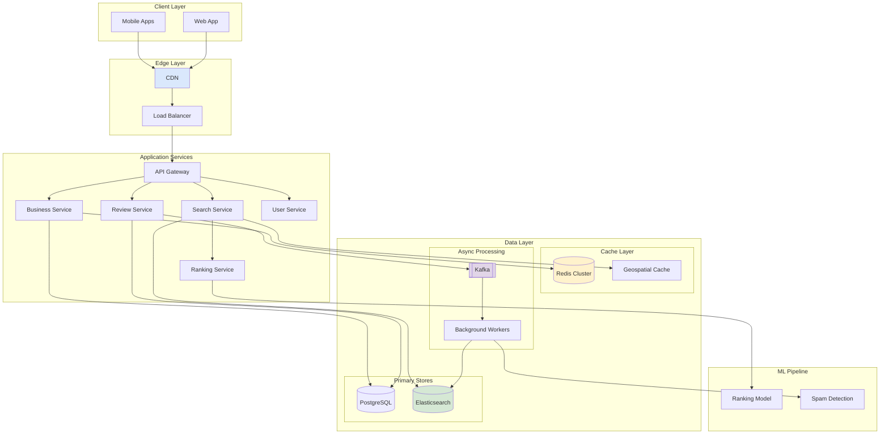
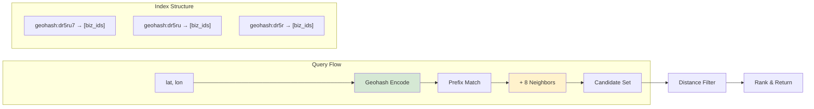
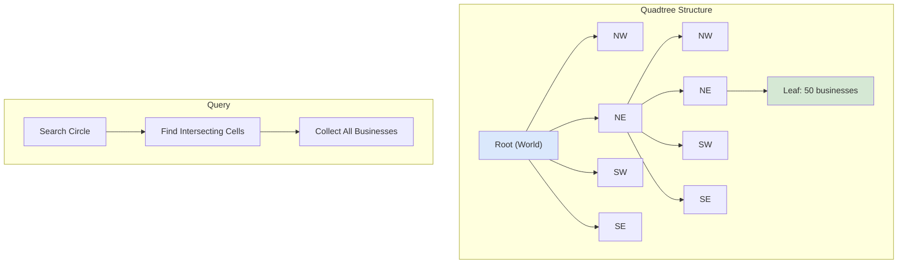
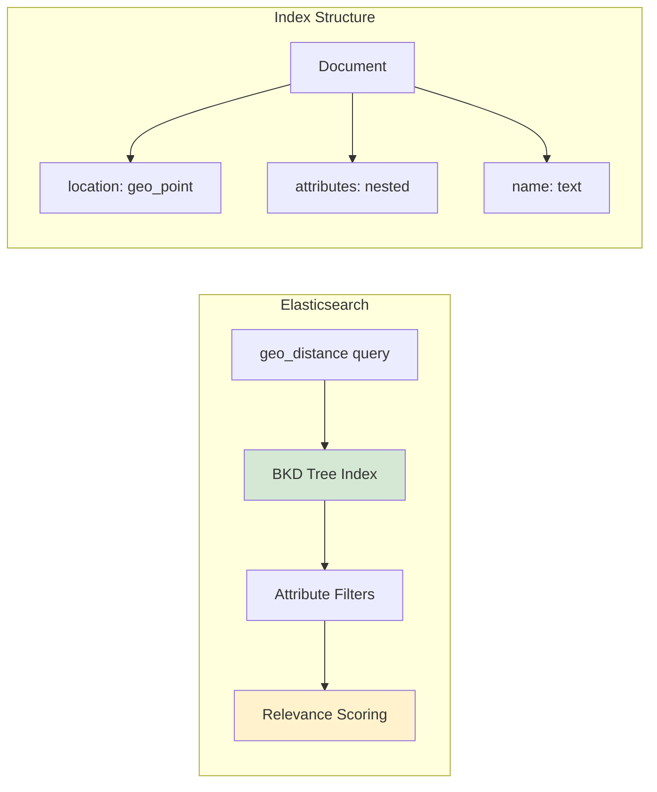
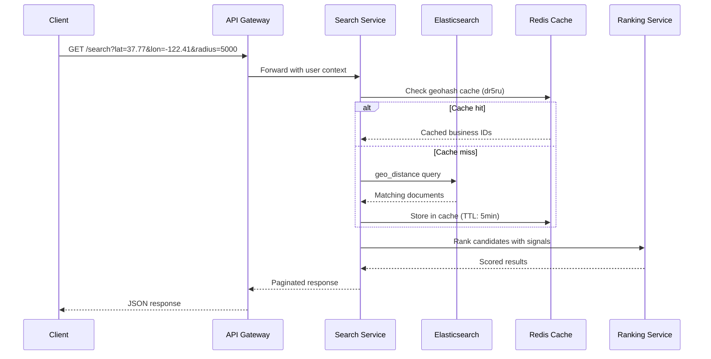
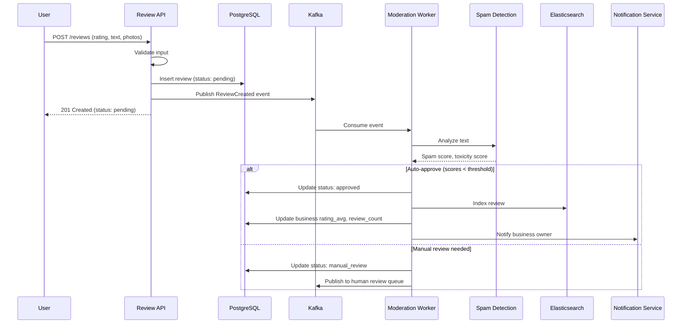
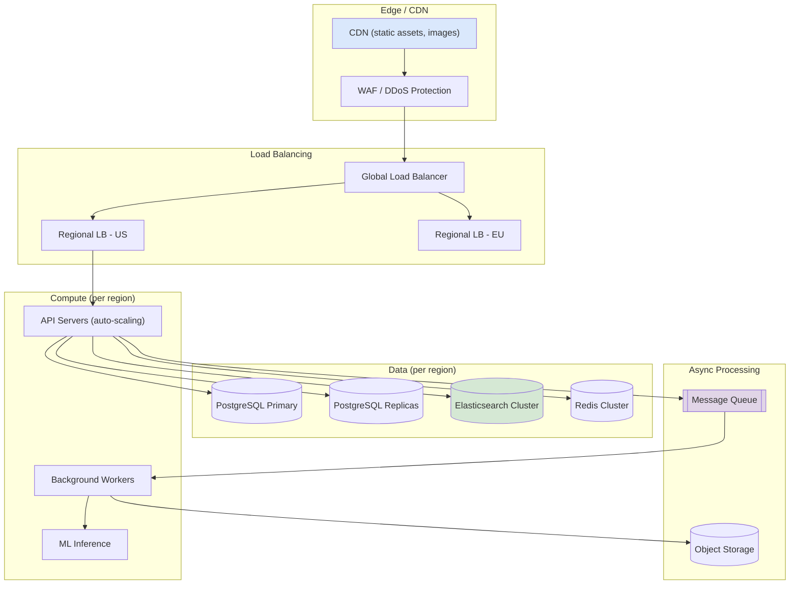

# Design Yelp: Location-Based Business Discovery Platform

A comprehensive system design for a location-based business discovery service. This design addresses proximity search at scale, multi-signal ranking, and user-generated content moderation with a focus on sub-100ms search latency and global availability.

<figure>



<figcaption>High-level architecture: Client requests flow through edge infrastructure to application services, with geospatial indexing in Elasticsearch and real-time updates via Kafka.</figcaption>
</figure>

## Abstract

Proximity services solve a fundamentally different problem than traditional text search: the answer depends not just on _what_ you're looking for but _where_ you are. This creates unique indexing challenges—you can't pre-compute rankings when the query center point changes with every request.

**The core trade-off space:**

- **Indexing strategy**: Geohash (simple, bounded precision) vs. Quadtree (adaptive density) vs. R-tree (optimal for rectangles). Each trades query flexibility against write complexity and memory overhead.
- **Search radius handling**: Fixed grid cells leak results at boundaries; hierarchical approaches add latency but guarantee coverage.
- **Ranking signals**: Distance alone produces poor results. Real systems blend distance, ratings, recency, personalization, and business attributes—but more signals mean slower ranking and harder explainability.
- **Write path complexity**: Business data changes infrequently, but reviews flow continuously. Decoupling these paths enables independent scaling but introduces consistency windows.

**Real-world context**: Yelp handles 178 million unique visitors monthly with 244 million reviews. Google Maps indexes 200+ million places. Foursquare's Pilgrim SDK processes 14 billion location signals daily for venue detection. These systems demonstrate that sub-100ms latency is achievable at scale, but requires aggressive caching, denormalization, and carefully bounded search spaces.

**Mental model**: Think of this as three systems in one: (1) a geospatial index that answers "what's nearby?", (2) a ranking engine that orders results by relevance, and (3) a content platform that manages reviews, photos, and business data. The challenge is making them work together with consistent latency under varying load patterns.

## Requirements

### Functional Requirements

| Feature              | Priority | Description                                 |
| -------------------- | -------- | ------------------------------------------- |
| Nearby search        | Core     | Find businesses within radius of a location |
| Business profiles    | Core     | View business details, hours, attributes    |
| Reviews & ratings    | Core     | Read/write reviews, aggregate ratings       |
| Photos               | Core     | View/upload business photos                 |
| Search by category   | Core     | Filter by cuisine, service type             |
| Search by attributes | High     | Filter by price, hours, amenities           |
| Check-ins            | Medium   | Record visits, see activity                 |
| Bookmarks            | Medium   | Save businesses for later                   |
| Personalization      | Medium   | Recommendations based on history            |
| Business owner tools | Medium   | Claim business, respond to reviews          |

**Scope for this article**: We'll design the core proximity search, business data, and review systems. Check-ins and advanced personalization are covered briefly; advertising and business analytics are out of scope.

### Non-Functional Requirements

| Requirement      | Target                                      | Rationale                                                   |
| ---------------- | ------------------------------------------- | ----------------------------------------------------------- |
| Search latency   | p99 < 100ms                                 | User expectation for "instant" results                      |
| Write latency    | p99 < 500ms                                 | Acceptable for review submission                            |
| Availability     | 99.99%                                      | Revenue-critical, user trust                                |
| Read/Write ratio | 100:1                                       | Read-heavy workload                                         |
| Data freshness   | < 30s for reviews, < 5min for business data | Reviews need quick visibility; business data changes rarely |
| Global coverage  | Multi-region                                | Users travel; businesses are everywhere                     |

### Scale Estimation

**Users:**

- Monthly Active Users (MAU): 100M
- Daily Active Users (DAU): 30M
- Peak concurrent users: 3M (10% of DAU)

**Businesses:**

- Total businesses: 10M globally
- Active businesses (updated in last year): 5M
- New businesses per day: 10K

**Traffic:**

- Search queries: 30M DAU × 5 searches/day = 150M searches/day ≈ 1,700 QPS
- Peak search: 3× average = 5,100 QPS
- Business profile views: 30M DAU × 10 views/day = 300M/day ≈ 3,500 QPS
- Review writes: 30M DAU × 0.01 reviews/day = 300K reviews/day ≈ 3.5 writes/sec
- Photo uploads: ~100K/day

**Storage:**

- Business data: 10M × 10KB = 100GB
- Reviews: 200M reviews × 2KB = 400GB
- Photos: 500M photos × 500KB average = 250TB (object storage)
- Search index: ~50GB (denormalized business + location data)
- 5-year projection: ~2PB total (dominated by photos)

## Design Paths

### Path A: Geohash-Based Indexing

**Best when:**

- Uniform business density across regions
- Fixed search radius (e.g., always 5km)
- Simpler operational requirements

**Architecture:**



**Key characteristics:**

- Geohash encodes lat/lon into a string where prefix matches indicate proximity
- 6-character geohash ≈ 1.2km × 600m cell; 5-character ≈ 5km × 5km
- Query requires checking target cell + 8 neighboring cells to handle boundary cases
- Index structure is a simple key-value map: geohash → list of business IDs

**Trade-offs:**

- ✅ Simple to implement and debug
- ✅ Excellent cache locality (nearby queries hit same cells)
- ✅ Easy sharding by geohash prefix
- ❌ Fixed precision creates density mismatches (Manhattan vs. rural Wyoming)
- ❌ Variable radius searches require multiple precision levels
- ❌ Edge cases at cell boundaries require neighbor expansion

**Real-world example:** Uber's geospatial indexing uses geohash for initial filtering, then refines with exact distance calculations. Their H3 system (hexagonal hierarchical index) evolved from geohash limitations but shares the prefix-based lookup principle.

### Path B: Quadtree / S2 Geometry

**Best when:**

- Highly variable business density
- Need for adaptive precision
- Complex geometric queries (polygons, routes)

**Architecture:**



**Key characteristics:**

- Recursively subdivides space until each cell contains ≤ N businesses
- Dense areas (cities) have deeper trees; sparse areas (rural) stay shallow
- Google's S2 Geometry library uses this with spherical projection
- Cell IDs encode the path from root, enabling range queries

**Trade-offs:**

- ✅ Adapts to density automatically
- ✅ Efficient for variable-radius queries
- ✅ Handles complex shapes (polygons, paths)
- ❌ More complex implementation
- ❌ Tree rebalancing on updates
- ❌ Harder to cache (cells have variable sizes)

**Real-world example:** Google Maps uses S2 cells extensively. A search in Manhattan might use level-16 cells (~150m), while rural areas use level-10 (~10km). Foursquare's Pilgrim SDK uses S2 for geofencing with 14 billion daily signals.

### Path C: R-tree (Elasticsearch/PostGIS)

**Best when:**

- Need full-text search combined with geo
- Complex attribute filtering
- Leveraging existing search infrastructure

**Architecture:**



**Key characteristics:**

- Elasticsearch uses BKD trees (variant of R-trees) for geo_point fields
- Combines spatial queries with full-text search and filtering
- `geo_distance` query returns all points within radius
- `geo_bounding_box` for rectangular regions

**Trade-offs:**

- ✅ Combines geo + text + attributes in single query
- ✅ Mature tooling, operational knowledge
- ✅ Built-in relevance scoring
- ❌ Higher latency than specialized geo indexes (~20-50ms vs ~5ms)
- ❌ Memory overhead for inverted indexes
- ❌ Write amplification for index updates

**Real-world example:** Yelp uses Elasticsearch for their search infrastructure. Their architecture handles 150M+ searches per day with sub-100ms latency by combining aggressive caching with optimized ES configurations.

### Path Comparison

| Factor                    | Geohash               | Quadtree/S2           | R-tree (ES)          |
| ------------------------- | --------------------- | --------------------- | -------------------- |
| Implementation complexity | Low                   | High                  | Medium (if using ES) |
| Query latency             | ~5ms                  | ~10ms                 | ~30ms                |
| Variable radius           | Multiple queries      | Native                | Native               |
| Density handling          | Poor                  | Excellent             | Good                 |
| Text search               | Separate system       | Separate system       | Integrated           |
| Operational overhead      | Low                   | Medium                | Medium-High          |
| Best for                  | Fixed-radius, uniform | Complex geo, variable | Full-featured search |

### This Article's Focus

This article focuses on **Path C (Elasticsearch-based)** because:

1. Most proximity services need combined text + geo + attribute search
2. Elasticsearch is widely deployed with known operational patterns
3. The latency difference (~30ms vs ~5ms) is acceptable when total budget is 100ms
4. Avoiding a separate geo-index reduces system complexity

For systems requiring sub-10ms geo queries at massive scale (e.g., ride-sharing dispatch), Path B with custom S2 implementation would be more appropriate.

## API Design

### Search Nearby Businesses

**Endpoint:** `GET /api/v1/businesses/search`

**Query Parameters:**

| Parameter  | Type   | Required | Description                                                             |
| ---------- | ------ | -------- | ----------------------------------------------------------------------- |
| `lat`      | float  | Yes      | Latitude (-90 to 90)                                                    |
| `lon`      | float  | Yes      | Longitude (-180 to 180)                                                 |
| `radius`   | int    | No       | Search radius in meters (default: 5000, max: 50000)                     |
| `category` | string | No       | Category filter (e.g., "restaurants", "coffee")                         |
| `price`    | string | No       | Price filter ("1", "2", "3", "4" or ranges "1,2")                       |
| `open_now` | bool   | No       | Filter to currently open businesses                                     |
| `sort`     | string | No       | Sort order: "distance", "rating", "review_count", "relevance" (default) |
| `cursor`   | string | No       | Pagination cursor                                                       |
| `limit`    | int    | No       | Results per page (default: 20, max: 50)                                 |

**Response (200 OK):**

```json
{
  "businesses": [
    {
      "id": "biz_abc123",
      "name": "Joe's Coffee",
      "slug": "joes-coffee-san-francisco",
      "location": {
        "lat": 37.7749,
        "lon": -122.4194,
        "address": "123 Market St",
        "city": "San Francisco",
        "state": "CA",
        "postal_code": "94102",
        "country": "US"
      },
      "distance_meters": 450,
      "categories": [{ "id": "coffee", "name": "Coffee & Tea" }],
      "rating": 4.5,
      "review_count": 1247,
      "price_level": 2,
      "hours": {
        "is_open_now": true,
        "today": "7:00 AM - 8:00 PM"
      },
      "photos": {
        "thumbnail": "https://cdn.example.com/photos/abc123/thumb.jpg",
        "count": 523
      },
      "attributes": {
        "wifi": true,
        "outdoor_seating": true,
        "takes_reservations": false
      }
    }
  ],
  "total": 847,
  "cursor": "eyJvZmZzZXQiOjIwfQ==",
  "search_metadata": {
    "center": { "lat": 37.7749, "lon": -122.4194 },
    "radius_meters": 5000,
    "query_time_ms": 42
  }
}
```

**Error Responses:**

- `400 Bad Request`: Invalid coordinates, radius out of range
- `429 Too Many Requests`: Rate limit exceeded

**Rate Limits:** 100 requests/minute per user (authenticated), 20/minute (anonymous)

### Get Business Details

**Endpoint:** `GET /api/v1/businesses/{business_id}`

**Response (200 OK):**

```json
{
  "id": "biz_abc123",
  "name": "Joe's Coffee",
  "slug": "joes-coffee-san-francisco",
  "claimed": true,
  "location": {
    "lat": 37.7749,
    "lon": -122.4194,
    "address": "123 Market St",
    "city": "San Francisco",
    "state": "CA",
    "postal_code": "94102",
    "country": "US",
    "cross_streets": "Market & 4th"
  },
  "contact": {
    "phone": "+1-415-555-0123",
    "website": "https://joescoffee.com"
  },
  "categories": [
    { "id": "coffee", "name": "Coffee & Tea" },
    { "id": "breakfast", "name": "Breakfast & Brunch" }
  ],
  "rating": 4.5,
  "review_count": 1247,
  "price_level": 2,
  "hours": {
    "monday": [{ "open": "07:00", "close": "20:00" }],
    "tuesday": [{ "open": "07:00", "close": "20:00" }],
    "is_open_now": true,
    "special_hours": [{ "date": "2024-12-25", "is_closed": true }]
  },
  "photos": [
    {
      "id": "photo_xyz",
      "url": "https://cdn.example.com/photos/xyz.jpg",
      "caption": "Interior",
      "user_id": "user_123"
    }
  ],
  "attributes": {
    "wifi": true,
    "outdoor_seating": true,
    "parking": "street",
    "noise_level": "moderate",
    "good_for": ["working", "casual_dining"],
    "accepts": ["credit_cards", "apple_pay"]
  },
  "highlights": ["Great for working remotely", "Excellent espresso"]
}
```

### Submit Review

**Endpoint:** `POST /api/v1/businesses/{business_id}/reviews`

**Request:**

```json
{
  "rating": 4,
  "text": "Great coffee and atmosphere. The baristas are friendly and the WiFi is fast. Perfect spot for remote work.",
  "photos": ["upload_token_1", "upload_token_2"]
}
```

**Response (201 Created):**

```json
{
  "id": "review_def456",
  "business_id": "biz_abc123",
  "user": {
    "id": "user_789",
    "name": "John D.",
    "review_count": 42,
    "photo_url": "https://cdn.example.com/users/789.jpg"
  },
  "rating": 4,
  "text": "Great coffee and atmosphere...",
  "photos": [{ "id": "photo_1", "url": "https://cdn.example.com/..." }],
  "created_at": "2024-01-15T10:30:00Z",
  "status": "pending_moderation"
}
```

**Error Responses:**

- `400 Bad Request`: Rating out of range (1-5), text too short (<50 chars) or too long (>5000 chars)
- `401 Unauthorized`: Not authenticated
- `403 Forbidden`: User has already reviewed this business
- `429 Too Many Requests`: Review rate limit (5/day per user)

### Pagination Strategy

**Cursor-based pagination** (chosen over offset):

- **Why**: Offset pagination breaks when data changes between pages. With 300K new reviews/day, offset=1000 returns different results seconds apart.
- **Implementation**: Cursor encodes the last seen sort key (e.g., `{score: 4.5, id: "biz_xyz"}`).
- **Trade-off**: Can't jump to arbitrary pages, but provides consistent results.

```json
{
  "cursor": "eyJzY29yZSI6NC41LCJpZCI6ImJpel94eXoifQ==",
  "has_more": true
}
```

### API Response Optimization

**Field inclusion strategy:**

- Default response includes fields needed for list views
- `?expand=hours,attributes,photos` for detail views
- Reduces payload size by 60% for search results

**Denormalization decisions:**

- Include `distance_meters` in search results (requires computation anyway)
- Include `is_open_now` (computed from hours, but clients need it)
- Exclude full `hours` object from search (add via `?expand=hours`)

## Data Modeling

### Business Schema

**Primary Store:** PostgreSQL (ACID for business data integrity)

```sql
CREATE TABLE businesses (
    id UUID PRIMARY KEY DEFAULT gen_random_uuid(),
    name VARCHAR(255) NOT NULL,
    slug VARCHAR(255) UNIQUE NOT NULL,

    -- Location
    latitude DECIMAL(10, 8) NOT NULL,
    longitude DECIMAL(11, 8) NOT NULL,
    geohash VARCHAR(12) GENERATED ALWAYS AS (
        ST_GeoHash(ST_SetSRID(ST_MakePoint(longitude, latitude), 4326), 12)
    ) STORED,
    address_line1 VARCHAR(255),
    address_line2 VARCHAR(255),
    city VARCHAR(100),
    state VARCHAR(100),
    postal_code VARCHAR(20),
    country CHAR(2) NOT NULL,

    -- Business info
    phone VARCHAR(20),
    website VARCHAR(500),
    price_level SMALLINT CHECK (price_level BETWEEN 1 AND 4),

    -- Aggregates (denormalized for read performance)
    rating_avg DECIMAL(2, 1) DEFAULT 0,
    review_count INTEGER DEFAULT 0,
    photo_count INTEGER DEFAULT 0,

    -- Status
    claimed BOOLEAN DEFAULT FALSE,
    owner_id UUID REFERENCES users(id),
    status VARCHAR(20) DEFAULT 'active',

    created_at TIMESTAMPTZ DEFAULT NOW(),
    updated_at TIMESTAMPTZ DEFAULT NOW()
);

-- Geospatial index for PostGIS queries
CREATE INDEX idx_businesses_location ON businesses
    USING GIST (ST_SetSRID(ST_MakePoint(longitude, latitude), 4326));

-- Geohash prefix index for simple lookups
CREATE INDEX idx_businesses_geohash ON businesses (geohash varchar_pattern_ops);

-- Category lookups
CREATE INDEX idx_businesses_city_status ON businesses (city, status)
    WHERE status = 'active';
```

### Business Hours Schema

```sql
CREATE TABLE business_hours (
    business_id UUID REFERENCES businesses(id) ON DELETE CASCADE,
    day_of_week SMALLINT NOT NULL CHECK (day_of_week BETWEEN 0 AND 6),
    open_time TIME NOT NULL,
    close_time TIME NOT NULL,
    PRIMARY KEY (business_id, day_of_week, open_time)
);

CREATE TABLE business_special_hours (
    business_id UUID REFERENCES businesses(id) ON DELETE CASCADE,
    date DATE NOT NULL,
    is_closed BOOLEAN DEFAULT FALSE,
    open_time TIME,
    close_time TIME,
    PRIMARY KEY (business_id, date)
);
```

### Categories Schema

```sql
CREATE TABLE categories (
    id VARCHAR(50) PRIMARY KEY,
    name VARCHAR(100) NOT NULL,
    parent_id VARCHAR(50) REFERENCES categories(id),
    level SMALLINT NOT NULL DEFAULT 0
);

CREATE TABLE business_categories (
    business_id UUID REFERENCES businesses(id) ON DELETE CASCADE,
    category_id VARCHAR(50) REFERENCES categories(id),
    is_primary BOOLEAN DEFAULT FALSE,
    PRIMARY KEY (business_id, category_id)
);

CREATE INDEX idx_business_categories_category ON business_categories (category_id);
```

### Reviews Schema

```sql
CREATE TABLE reviews (
    id UUID PRIMARY KEY DEFAULT gen_random_uuid(),
    business_id UUID NOT NULL REFERENCES businesses(id),
    user_id UUID NOT NULL REFERENCES users(id),
    rating SMALLINT NOT NULL CHECK (rating BETWEEN 1 AND 5),
    text TEXT NOT NULL CHECK (char_length(text) BETWEEN 50 AND 5000),

    -- Moderation
    status VARCHAR(20) DEFAULT 'pending',
    moderation_score DECIMAL(3, 2),
    moderated_at TIMESTAMPTZ,

    -- Engagement
    useful_count INTEGER DEFAULT 0,
    funny_count INTEGER DEFAULT 0,
    cool_count INTEGER DEFAULT 0,

    created_at TIMESTAMPTZ DEFAULT NOW(),
    updated_at TIMESTAMPTZ DEFAULT NOW(),

    UNIQUE (business_id, user_id)
);

CREATE INDEX idx_reviews_business ON reviews (business_id, created_at DESC)
    WHERE status = 'approved';
CREATE INDEX idx_reviews_user ON reviews (user_id, created_at DESC);
CREATE INDEX idx_reviews_pending ON reviews (status, created_at)
    WHERE status = 'pending';
```

### Elasticsearch Index Mapping

```json
{
  "mappings": {
    "properties": {
      "id": { "type": "keyword" },
      "name": {
        "type": "text",
        "analyzer": "standard",
        "fields": {
          "keyword": { "type": "keyword" },
          "autocomplete": {
            "type": "text",
            "analyzer": "autocomplete"
          }
        }
      },
      "location": { "type": "geo_point" },
      "geohash": { "type": "keyword" },
      "city": { "type": "keyword" },
      "country": { "type": "keyword" },
      "categories": { "type": "keyword" },
      "price_level": { "type": "integer" },
      "rating_avg": { "type": "float" },
      "review_count": { "type": "integer" },
      "attributes": {
        "type": "object",
        "properties": {
          "wifi": { "type": "boolean" },
          "outdoor_seating": { "type": "boolean" },
          "parking": { "type": "keyword" }
        }
      },
      "hours": {
        "type": "nested",
        "properties": {
          "day": { "type": "integer" },
          "open": { "type": "integer" },
          "close": { "type": "integer" }
        }
      },
      "updated_at": { "type": "date" }
    }
  },
  "settings": {
    "analysis": {
      "analyzer": {
        "autocomplete": {
          "type": "custom",
          "tokenizer": "standard",
          "filter": ["lowercase", "autocomplete_filter"]
        }
      },
      "filter": {
        "autocomplete_filter": {
          "type": "edge_ngram",
          "min_gram": 2,
          "max_gram": 20
        }
      }
    }
  }
}
```

### Database Selection Rationale

| Data Type             | Store              | Rationale                                           |
| --------------------- | ------------------ | --------------------------------------------------- |
| Business profiles     | PostgreSQL         | ACID, complex queries, foreign keys, moderate scale |
| Reviews               | PostgreSQL         | ACID for integrity, complex moderation queries      |
| Search index          | Elasticsearch      | Geo queries, full-text, filtering, aggregations     |
| Session/rate limiting | Redis              | Sub-ms latency, TTL support, atomic operations      |
| Photos                | S3 + CloudFront    | Object storage, CDN delivery, cost-effective        |
| Analytics events      | Kafka → ClickHouse | High write throughput, analytical queries           |

### Sharding Strategy

**PostgreSQL (if needed at scale):**

- Shard by `country` or `region` for geographic locality
- Most queries are region-scoped (users search near their location)
- Cross-region queries (rare) handled by query router

**Elasticsearch:**

- Shard by geohash prefix (e.g., first 2 characters)
- 256 shards globally (00-ff in hex, or geographic prefixes)
- Enables routing queries to relevant shards only

## Low-Level Design: Geospatial Search

### Search Flow



### Elasticsearch Query Construction

**Basic geo query:**

```json
{
  "query": {
    "bool": {
      "must": [{ "match": { "status": "active" } }],
      "filter": [
        {
          "geo_distance": {
            "distance": "5km",
            "location": {
              "lat": 37.7749,
              "lon": -122.4194
            }
          }
        }
      ]
    }
  },
  "sort": [
    {
      "_geo_distance": {
        "location": { "lat": 37.7749, "lon": -122.4194 },
        "order": "asc",
        "unit": "m"
      }
    }
  ]
}
```

**With category and attribute filters:**

```json
{
  "query": {
    "bool": {
      "must": [{ "match": { "status": "active" } }],
      "filter": [
        {
          "geo_distance": {
            "distance": "5km",
            "location": { "lat": 37.7749, "lon": -122.4194 }
          }
        },
        { "terms": { "categories": ["coffee", "cafe"] } },
        { "term": { "attributes.wifi": true } },
        { "range": { "price_level": { "lte": 2 } } }
      ]
    }
  }
}
```

**"Open now" filter (complex):**

The "open now" query requires knowing the current day/time in the business's timezone:

```json
{
  "query": {
    "bool": {
      "filter": [
        {
          "nested": {
            "path": "hours",
            "query": {
              "bool": {
                "must": [
                  { "term": { "hours.day": 1 } },
                  { "range": { "hours.open": { "lte": 1030 } } },
                  { "range": { "hours.close": { "gt": 1030 } } }
                ]
              }
            }
          }
        }
      ]
    }
  }
}
```

**Design decision**: Store hours as integer (HHMM format: 1030 = 10:30 AM) for efficient range queries. Handle timezone conversion at query time, not storage time.

### Geospatial Caching Strategy

**Cache structure:**

```
Key: geo:search:{geohash_prefix}:{category}:{filters_hash}
Value: [business_id_1, business_id_2, ...]
TTL: 5 minutes
```

**Why cache by geohash prefix:**

- Queries within same ~1km area hit same cache entry
- 6-character geohash prefix provides good locality
- Different filter combinations get separate cache keys

**Cache invalidation:**

- Business update → Invalidate all cache keys containing that business
- New business → No invalidation needed (TTL handles staleness)
- Trade-off: 5-minute staleness acceptable for discovery use case

### Ranking Algorithm

**Multi-signal ranking formula:**

$$
score = w_1 \cdot f_{distance} + w_2 \cdot f_{rating} + w_3 \cdot f_{reviews} + w_4 \cdot f_{recency} + w_5 \cdot f_{personal}
$$

Where:

- $f_{distance} = 1 - \frac{distance}{max\_radius}$ (closer = higher score)
- $f_{rating} = \frac{rating - 1}{4}$ (normalized 0-1)
- $f_{reviews} = \frac{\log(review\_count + 1)}{\log(max\_reviews + 1)}$ (log-scaled)
- $f_{recency} = e^{-\lambda \cdot days\_since\_review}$ (exponential decay)
- $f_{personal}$ = personalization signal (0-1)

**Default weights (tuned via A/B testing):**

| Signal       | Weight | Rationale                     |
| ------------ | ------ | ----------------------------- |
| Distance     | 0.25   | Important but not dominant    |
| Rating       | 0.30   | Primary quality signal        |
| Review count | 0.20   | Social proof, data confidence |
| Recency      | 0.15   | Fresh data preferred          |
| Personal     | 0.10   | Light personalization         |

**Elasticsearch function_score implementation:**

```json
{
  "query": {
    "function_score": {
      "query": {"bool": {"filter": [...]}},
      "functions": [
        {
          "gauss": {
            "location": {
              "origin": {"lat": 37.77, "lon": -122.41},
              "scale": "2km",
              "decay": 0.5
            }
          },
          "weight": 25
        },
        {
          "field_value_factor": {
            "field": "rating_avg",
            "factor": 1,
            "modifier": "none",
            "missing": 3
          },
          "weight": 30
        },
        {
          "field_value_factor": {
            "field": "review_count",
            "factor": 1,
            "modifier": "log1p",
            "missing": 1
          },
          "weight": 20
        }
      ],
      "score_mode": "sum",
      "boost_mode": "replace"
    }
  }
}
```

### Handling Edge Cases

**Sparse areas (few results):**

- If < 10 results within radius, automatically expand to 2× radius
- Cap at 50km to prevent global searches
- Return `expanded_radius: true` in response metadata

**Dense areas (too many results):**

- Pre-filter by quality threshold (rating > 3.0, review_count > 5)
- Use stricter ranking to surface best options
- Never return more than 1000 candidates to ranker

**Boundary problems:**

- Elasticsearch's geo_distance handles great-circle distance correctly
- No geohash boundary issues (unlike raw geohash queries)

**Timezone handling for "open now":**

- Store business timezone in database
- Query-time conversion: UTC now → business local time
- Handle DST transitions correctly

## Low-Level Design: Review System

### Review Submission Flow



### Spam Detection Signals

| Signal                | Weight | Description                        |
| --------------------- | ------ | ---------------------------------- |
| Account age           | 0.15   | New accounts more suspicious       |
| Review velocity       | 0.20   | Multiple reviews in short time     |
| Text quality          | 0.25   | Gibberish, excessive caps, links   |
| Sentiment mismatch    | 0.15   | 5-star rating with negative text   |
| IP/device clustering  | 0.15   | Multiple accounts from same source |
| Business relationship | 0.10   | Employee/owner detection           |

**Thresholds:**

- Score < 0.3: Auto-approve
- Score 0.3-0.7: Auto-approve with flag for sampling
- Score > 0.7: Manual review required

### Rating Aggregation

**Naive average problems:**

- Business with 1 review (5 stars) ranks above business with 1000 reviews (4.8 avg)
- New businesses have unstable ratings

**Bayesian average solution:**

$$
rating_{adjusted} = \frac{C \cdot m + \sum ratings}{C + n}
$$

Where:

- $C$ = confidence parameter (typically 10-50)
- $m$ = prior mean (global average, ~3.7)
- $n$ = number of reviews

**Example:**

- New business: 2 reviews, both 5 stars
- Naive: 5.0
- Bayesian (C=10, m=3.7): $(10 \times 3.7 + 10) / (10 + 2) = 4.0$

This prevents new businesses with few perfect reviews from dominating rankings.

### Review Update Consistency

**Challenge:** When a review is approved, multiple systems need updating:

1. PostgreSQL: review status
2. PostgreSQL: business rating_avg, review_count
3. Elasticsearch: business document
4. Cache: invalidate relevant entries

**Solution: Transactional outbox pattern**

```sql
BEGIN;
  -- Update review
  UPDATE reviews SET status = 'approved' WHERE id = $1;

  -- Update business aggregates
  UPDATE businesses
  SET rating_avg = (SELECT AVG(rating) FROM reviews WHERE business_id = $2 AND status = 'approved'),
      review_count = (SELECT COUNT(*) FROM reviews WHERE business_id = $2 AND status = 'approved')
  WHERE id = $2;

  -- Write to outbox for async propagation
  INSERT INTO outbox (event_type, payload)
  VALUES ('ReviewApproved', '{"review_id": "...", "business_id": "..."}');
COMMIT;
```

A separate process reads the outbox and updates Elasticsearch + invalidates caches.

**Consistency window:** ~1-5 seconds for search index, but PostgreSQL is immediately consistent for direct business profile reads.

## Frontend Considerations

### Search Results Data Structure

**Optimized for list rendering:**

```typescript
interface SearchState {
  // Normalized entities
  businesses: Record<string, Business>

  // Search result ordering
  resultIds: string[]

  // Pagination
  cursor: string | null
  hasMore: boolean

  // Search params (for cache key)
  searchParams: {
    lat: number
    lon: number
    radius: number
    filters: Record<string, unknown>
  }

  // UI state
  isLoading: boolean
  error: string | null
}
```

**Why normalized:**

- Moving between list and detail views doesn't duplicate data
- Updates to a business (e.g., from detail view) reflect in list
- Efficient React renders with reference equality

### Map Integration

**Marker clustering for dense areas:**

- 50+ markers on mobile degrades performance
- Cluster markers when zoom level shows > 30 businesses in viewport
- Expand clusters on zoom or tap

**Viewport-based loading:**

```typescript
interface MapSearchParams {
  bounds: {
    ne: { lat: number; lon: number }
    sw: { lat: number; lon: number }
  }
  zoom: number
}

// Debounce map move events (300ms)
// Only fetch when bounds change significantly (> 20% new area)
```

### Offline Considerations

**Cache strategy for mobile:**

- Cache last 5 search results (businesses + basic details)
- Pre-fetch business details for top 10 search results
- Store ~50MB of data for offline browsing

**Service worker strategy:**

```typescript
// Cache search results with network-first, cache-fallback
// Cache business details with stale-while-revalidate
// Never cache review submission (must be online)
```

### Real-Time Updates

**When needed:**

- Review count changes (low priority, poll every 5 min)
- Business hours during edge times (near open/close)
- "Popular times" if implemented

**When NOT needed:**

- Real-time review streaming (batch updates fine)
- Live rating changes (too volatile, confusing UX)

## Infrastructure

### Cloud-Agnostic Architecture



### AWS Reference Implementation

| Component          | Service               | Configuration                      |
| ------------------ | --------------------- | ---------------------------------- |
| Global LB          | Route 53 + CloudFront | Latency-based routing              |
| Regional LB        | ALB                   | Auto-scaling target groups         |
| API servers        | ECS Fargate           | 2-100 tasks, auto-scaling          |
| Background workers | ECS Fargate           | Spot instances (70% savings)       |
| PostgreSQL         | RDS Multi-AZ          | db.r6g.xlarge, 3 read replicas     |
| Elasticsearch      | OpenSearch Service    | 3 master + 6 data nodes, r6g.large |
| Redis              | ElastiCache Cluster   | 3 shards, r6g.large                |
| Message queue      | MSK (Managed Kafka)   | 3 brokers, kafka.m5.large          |
| Object storage     | S3 + CloudFront       | Intelligent tiering                |
| ML inference       | SageMaker Serverless  | For spam detection                 |

### Multi-Region Strategy

**Active-active for reads:**

- Each region has full read replicas
- Users routed to nearest region
- Search queries served locally

**Primary region for writes:**

- Reviews written to primary region
- Async replication to other regions (< 5s lag)
- Business updates are infrequent, higher latency acceptable

**Failover:**

- Route 53 health checks detect region failure
- Automatic failover to secondary region
- RTO: < 1 minute, RPO: < 30 seconds

### Cost Optimization

| Component      | Monthly Cost (estimate) | Optimization                            |
| -------------- | ----------------------- | --------------------------------------- |
| Elasticsearch  | $8,000                  | Reserved instances, optimize shards     |
| RDS PostgreSQL | $3,000                  | Reserved instances, right-size replicas |
| ElastiCache    | $1,500                  | Reserved instances                      |
| ECS Fargate    | $5,000                  | Spot for workers, right-size tasks      |
| Data transfer  | $2,000                  | CloudFront caching, compression         |
| S3             | $1,000                  | Intelligent tiering, lifecycle policies |
| **Total**      | ~$20,000/month          | At 100M MAU scale                       |

## Common Pitfalls

### 1. Geohash Boundary Issues

**Problem:** Query at cell boundary misses nearby businesses in adjacent cells.

**Cause:** Querying only the target geohash cell without neighbors.

**Fix:** Always query target cell + 8 surrounding cells, or use proper geo_distance queries that handle boundaries correctly.

### 2. Rating Manipulation

**Problem:** Business owners create fake accounts to boost ratings.

**Cause:** No detection of review authenticity.

**Fix:** Multi-signal spam detection, IP/device fingerprinting, account age requirements, manual review sampling.

### 3. Stale Search Results

**Problem:** Newly added businesses don't appear in search for hours.

**Cause:** Elasticsearch index not refreshed frequently enough.

**Fix:** Near-real-time indexing (refresh_interval: 1s for hot data), or explicit refresh for critical updates.

### 4. "Open Now" Timezone Bugs

**Problem:** Businesses show as open/closed at wrong times.

**Cause:** Storing hours in wrong timezone or not handling DST.

**Fix:** Store timezone with business, convert at query time, use proper timezone libraries (not offset math).

### 5. Photo Storage Costs Explosion

**Problem:** Storage costs grow 10x faster than expected.

**Cause:** Storing original photos without size limits or compression.

**Fix:** Resize on upload (max 2048px), generate thumbnails, use progressive JPEG, implement storage lifecycle (archive old photos).

### 6. Review Consistency Lag

**Problem:** User submits review, refreshes page, review not visible.

**Cause:** Async processing creates visibility delay.

**Fix:** Read-your-writes consistency: return pending review in user's own view immediately, mark as "pending" until approved.

## Conclusion

This design prioritizes **search latency** and **result quality** as the primary optimization targets, accepting complexity in the write path and eventual consistency for non-critical data.

**Key architectural decisions:**

1. **Elasticsearch for geo-search** rather than custom geospatial index—the 20-30ms latency overhead is acceptable when combined text/geo/attribute queries are needed
2. **Denormalized aggregates** (rating_avg, review_count) in business records—trades write complexity for read performance
3. **Async review processing** with transactional outbox—ensures eventual consistency while maintaining PostgreSQL ACID guarantees
4. **Multi-signal ranking** with tunable weights—enables A/B testing different ranking formulas without code changes

**What this design sacrifices:**

- Real-time consistency for search results (5-30 second delay acceptable)
- Sub-10ms geo query latency (custom geospatial index would achieve this)
- Perfect spam detection (manual review still required for edge cases)

**Future improvements:**

- Personalized search using user history and collaborative filtering
- "Popular times" using check-in and visit data
- Voice search integration for mobile
- Business insights dashboard for owners

## Appendix

### Prerequisites

- Distributed systems fundamentals (CAP theorem, consistency models)
- Database indexing concepts (B-trees, inverted indexes)
- Basic understanding of geospatial concepts (latitude/longitude, great-circle distance)
- Familiarity with Elasticsearch or similar search engines

### Terminology

| Term             | Definition                                                                                                    |
| ---------------- | ------------------------------------------------------------------------------------------------------------- |
| Geohash          | A hierarchical spatial encoding that converts coordinates to a string where prefix matches indicate proximity |
| Quadtree         | A tree data structure that recursively subdivides 2D space into four quadrants                                |
| R-tree           | A tree data structure for indexing multi-dimensional data, optimized for range queries                        |
| BKD tree         | A variant of KD-tree used by Lucene/Elasticsearch for efficient multi-dimensional indexing                    |
| Geo_point        | Elasticsearch field type that stores latitude/longitude and enables geospatial queries                        |
| Bayesian average | A weighted average that incorporates prior knowledge to handle small sample sizes                             |

### Summary

- Proximity search requires specialized geospatial indexing; Elasticsearch's geo_distance query provides good balance of features and performance
- Multi-signal ranking (distance + rating + reviews + recency) produces better results than distance alone
- Review systems need async processing with spam detection to maintain quality at scale
- Denormalization and caching are essential for sub-100ms search latency
- Eventual consistency (< 30 seconds) is acceptable for discovery use cases but requires read-your-writes for user's own content

### References

- [Elasticsearch Geo Queries Documentation](https://www.elastic.co/guide/en/elasticsearch/reference/current/geo-queries.html) - Official guide to geo_distance, geo_bounding_box, and geo_shape queries
- [Google S2 Geometry Library](https://s2geometry.io/) - Spherical geometry library used by Google Maps
- [Uber H3: Hexagonal Hierarchical Geospatial Indexing](https://www.uber.com/blog/h3/) - Uber's evolution from geohash to hexagonal cells
- [Yelp Engineering Blog: Search Architecture](https://engineeringblog.yelp.com/) - Insights into Yelp's Elasticsearch usage
- [PostGIS Documentation](https://postgis.net/documentation/) - Geospatial extension for PostgreSQL
- [Foursquare Pilgrim SDK](https://location.foursquare.com/developer/docs/pilgrim-sdk-overview) - Real-world venue detection at scale
- [Building a Recommendation System at Yelp](https://engineeringblog.yelp.com/2021/03/personalizing-yelp-home-with-contextual-bandit.html) - Personalization approaches
- Wilson, E.B. (1927). "Probable Inference, the Law of Succession, and Statistical Inference" - Foundation for Wilson score interval used in rating confidence
