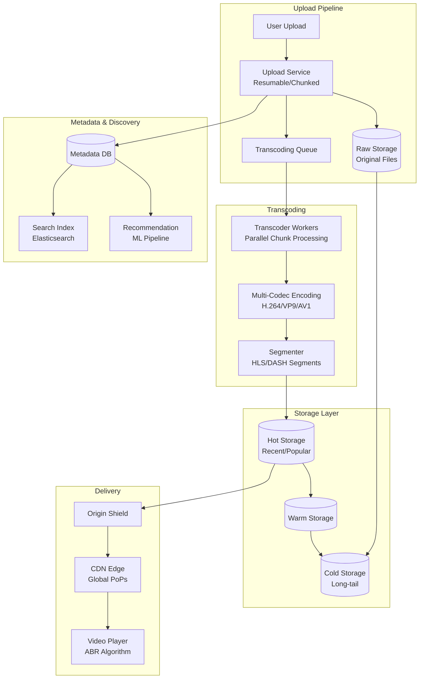
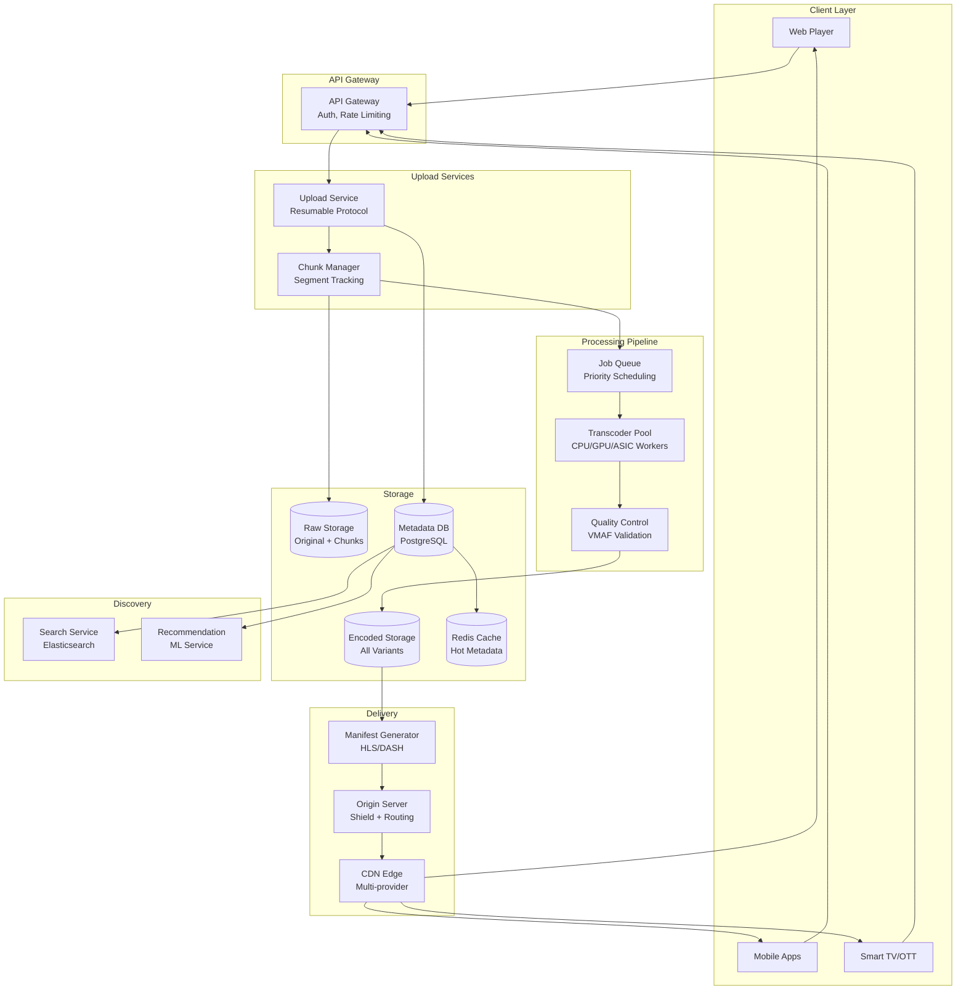
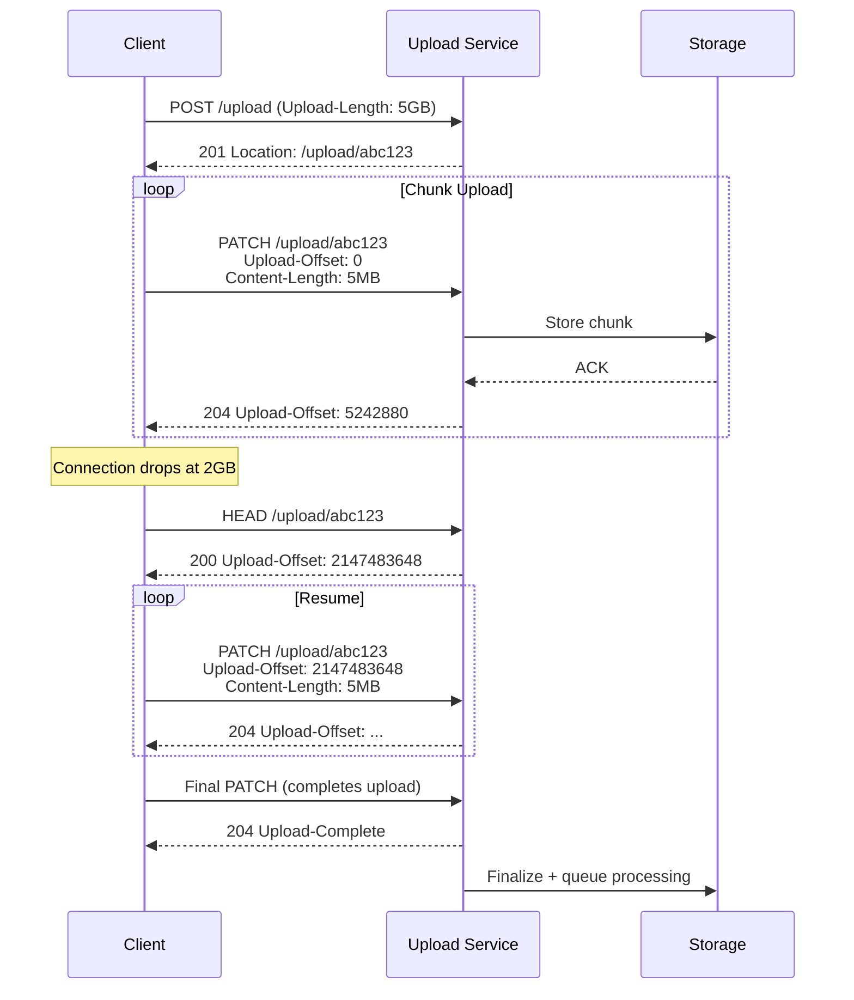
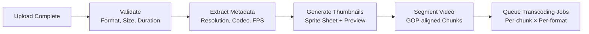
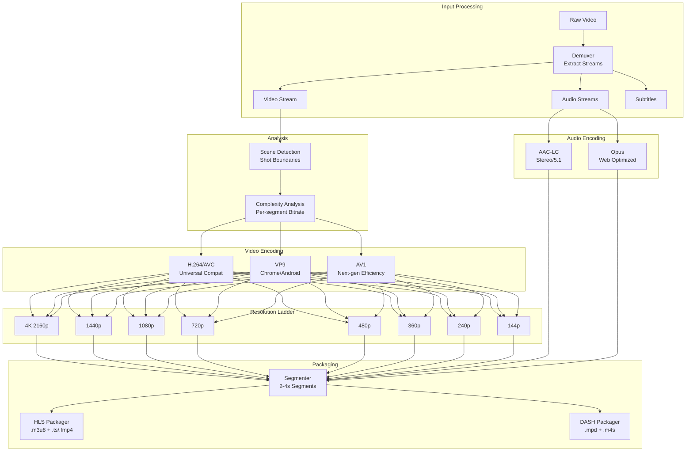
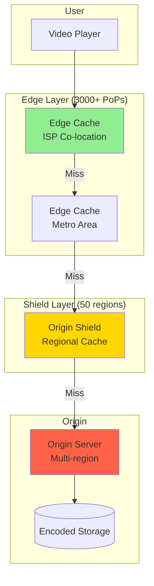
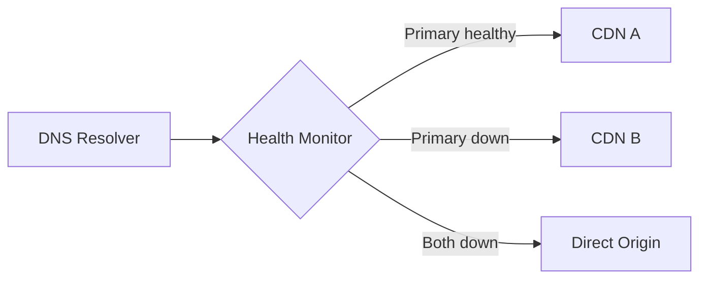
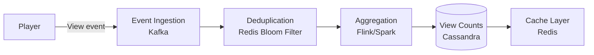
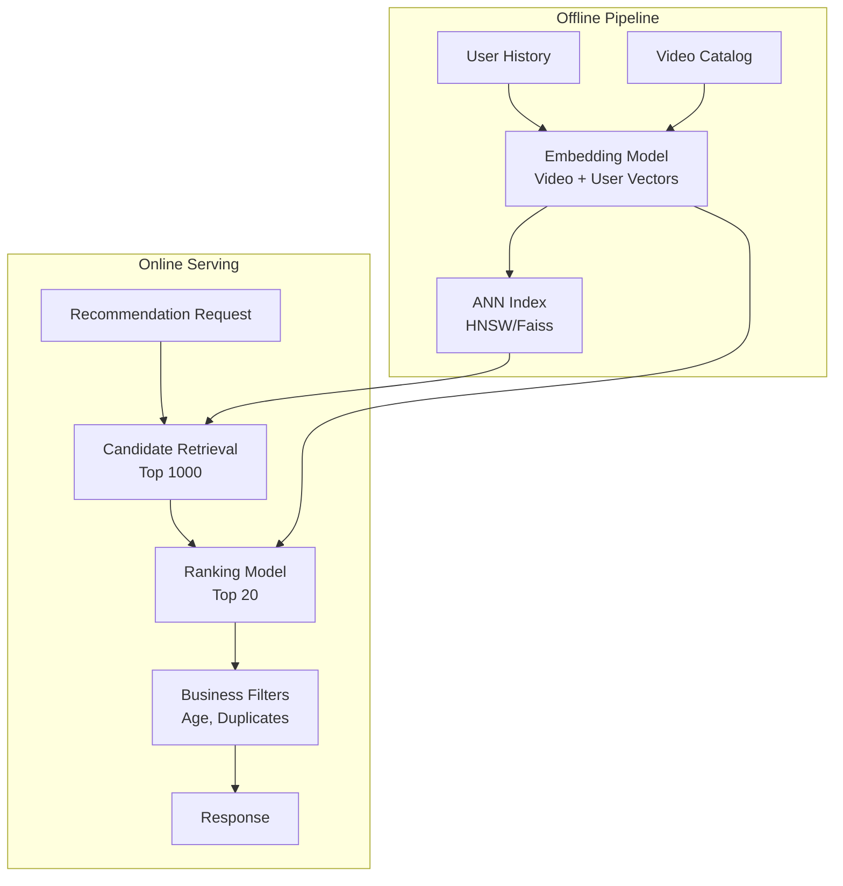
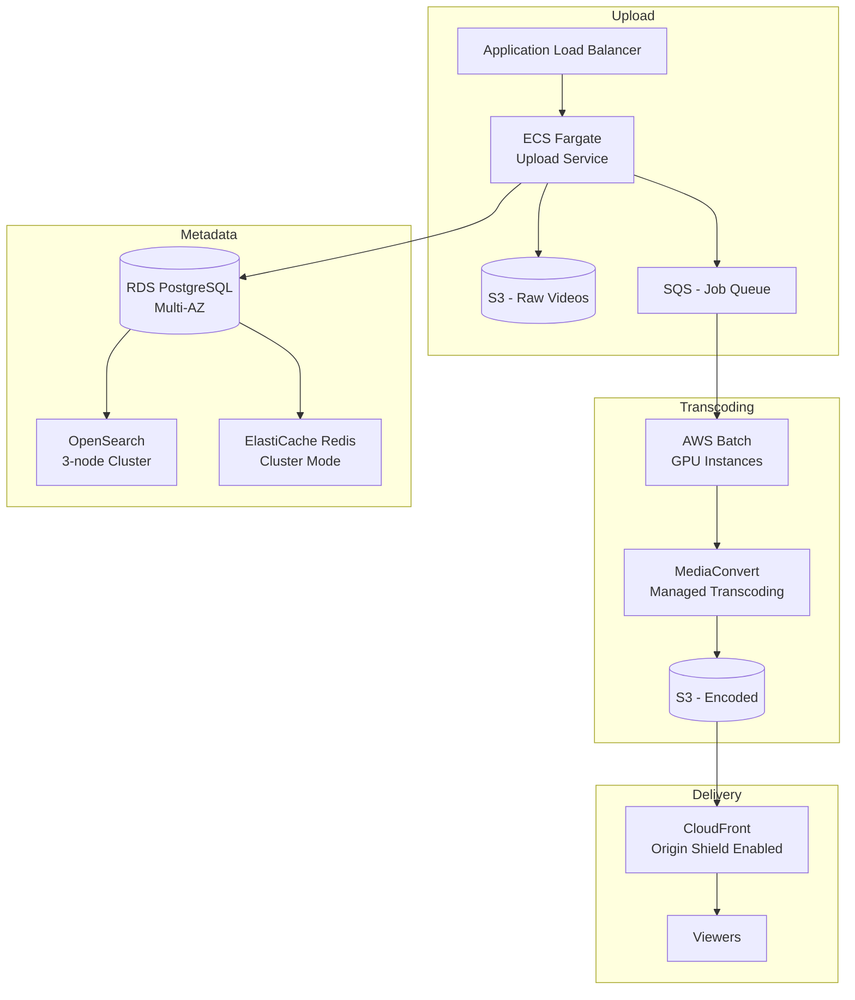

# Design a YouTube-Style Video Platform

A video platform at YouTube scale handles massive upload volumes, transcoding across dozens of resolution/codec combinations, and global delivery to billions of daily viewers. This design covers the upload pipeline, transcoding infrastructure, adaptive streaming delivery, and metadata/discovery systems—focusing on the architectural decisions that enable sub-second playback start times while processing 500+ hours of new video every minute.

<figure>



<figcaption>High-level architecture: upload → transcode → store → deliver. Metadata flows in parallel to enable immediate discoverability while transcoding completes.</figcaption>
</figure>

## Abstract

A video platform's architecture is shaped by three fundamental constraints:

1. **Video is computationally expensive**: A single 10-minute 4K upload generates 50+ output files (resolutions × codecs × bitrates). Transcoding must parallelize across chunked segments to complete in minutes rather than hours.

2. **Latency tolerance varies by phase**: Uploads tolerate multi-second latencies; playback start must be < 2 seconds. This asymmetry justifies aggressive CDN caching and segment-level prefetching.

3. **Traffic follows extreme power laws**: ~10% of videos receive 90% of views. Hot/warm/cold storage tiering and origin shield caching exploit this distribution.

The core mechanisms:

- **Resumable chunked uploads** (tus protocol) handle unreliable connections and multi-gigabyte files
- **Segment-parallel transcoding** splits videos into 2-second chunks, transcodes in parallel, reassembles
- **Multi-codec encoding** (H.264 for reach, VP9/AV1 for efficiency) optimizes bandwidth vs. compatibility
- **Adaptive Bitrate Streaming** (HLS/DASH) with hybrid ABR algorithms balances quality and rebuffering
- **Origin shield + edge caching** achieves 95%+ cache hit rates, reducing origin egress dramatically

## Requirements

### Functional Requirements

| Requirement                               | Priority     | Notes                                          |
| ----------------------------------------- | ------------ | ---------------------------------------------- |
| Video upload                              | Core         | Resumable, chunked, up to 256GB files          |
| Video playback                            | Core         | Adaptive streaming, multiple quality levels    |
| Transcoding pipeline                      | Core         | Multi-resolution, multi-codec output           |
| Video metadata (title, description, tags) | Core         | Editable, searchable                           |
| Video search                              | Core         | Full-text + filters (duration, date, category) |
| Thumbnails (auto-generated + custom)      | Core         | Multiple sizes for different contexts          |
| View counting                             | Core         | Near real-time, deduplicated                   |
| Comments and engagement                   | Extended     | Threaded, moderation                           |
| Recommendations                           | Extended     | Personalized, contextual                       |
| Live streaming                            | Out of scope | Different latency requirements                 |
| Monetization/Ads                          | Out of scope | Separate ad-tech stack                         |

### Non-Functional Requirements

| Requirement            | Target                                  | Rationale                          |
| ---------------------- | --------------------------------------- | ---------------------------------- |
| Upload availability    | 99.9%                                   | Tolerate brief maintenance windows |
| Playback availability  | 99.99%                                  | Revenue-critical, user experience  |
| Upload processing time | < 2× video duration                     | User expectation for availability  |
| Playback start latency | p99 < 2s                                | Industry benchmark for abandonment |
| Rebuffering ratio      | < 0.5% of playback time                 | Quality threshold                  |
| Video quality          | VMAF > 93 at target bitrate             | Perceptual quality standard        |
| Storage efficiency     | 30% bandwidth savings via modern codecs | Cost optimization                  |

### Scale Estimation

**YouTube-scale baseline:**

```
Daily active users: 2.5 billion
Hours uploaded per minute: 500+
Daily video views: 5 billion

Upload traffic:
- 500 hours/min × 60 min × 24 hours = 720,000 hours/day
- Average raw file: 2 GB/hour (1080p)
- Daily upload ingestion: ~1.4 PB/day

Storage growth:
- Per video: 50 output files (resolutions × codecs)
- Storage multiplier: ~5x original (transcoded variants)
- Daily storage growth: ~7 PB/day
- Annual growth: ~2.5 EB/year

Playback traffic:
- 5 billion views/day
- Average view duration: 10 minutes
- Average bitrate: 4 Mbps (mixed quality)
- Peak concurrent viewers: 500M (estimate)
- Daily egress: ~150 PB/day
```

**CDN efficiency impact:**

```
Without CDN: 150 PB/day from origin
With 95% cache hit rate: 7.5 PB/day from origin
Cost reduction: 20x origin egress savings
```

## Design Paths

### Path A: Centralized Transcoding (Traditional)

**Best when:**

- Smaller scale (< 10K uploads/day)
- Predictable traffic patterns
- Cost-sensitive (avoid distributed infrastructure)

**Architecture:**

- Single transcoding cluster per region
- Queue-based job scheduling
- Linear processing (full video at once)

**Trade-offs:**

- ✅ Simpler operations
- ✅ Lower infrastructure cost at small scale
- ❌ Transcoding time = video duration × quality ladder size
- ❌ Single failure domain per region
- ❌ Cannot scale transcoding speed for viral uploads

**Real-world example:** Vimeo (pre-2020) used centralized transcoding. Acceptable for professional content with predictable upload patterns.

### Path B: Distributed Chunk-Based Transcoding (YouTube/Netflix Model)

**Best when:**

- Massive scale (millions of uploads/day)
- Need fast turnaround for time-sensitive content
- Global upload sources require regional processing

**Architecture:**

- Videos split into 2-second chunks
- Chunks transcoded in parallel across distributed workers
- Reassembled into final output streams
- Custom hardware (ASICs) for encoding efficiency

**Trade-offs:**

- ✅ Transcoding time independent of video length (parallelized)
- ✅ Elastic scaling for traffic spikes
- ✅ Fault isolation (failed chunk retries, not full video)
- ❌ Complex orchestration layer
- ❌ Chunk boundary artifacts require careful handling
- ❌ Higher infrastructure complexity

**Real-world example:** YouTube's Video Coding Unit (VCU) ASIC achieves 20-33x efficiency over software encoding. Netflix processes 250,000 jobs per 30-minute episode.

### Path Comparison

| Factor                 | Centralized                | Distributed Chunk-Based   |
| ---------------------- | -------------------------- | ------------------------- |
| Processing latency     | O(video duration)          | O(1) with enough workers  |
| Scalability            | Vertical (bigger machines) | Horizontal (more workers) |
| Failure blast radius   | Full video re-encode       | Single chunk retry        |
| Infrastructure cost    | Lower at small scale       | Lower at large scale      |
| Operational complexity | Simple                     | High                      |
| Best for               | < 10K uploads/day          | > 100K uploads/day        |

### This Article's Focus

This article focuses on **Path B (Distributed Chunk-Based)** because:

1. YouTube-scale requires parallelization to meet processing SLAs
2. The chunking approach enables interesting optimizations (per-shot quality, scene detection)
3. Modern ABR streaming (HLS/DASH) is segment-native, aligning with chunk-based encoding

## High-Level Design

### Component Overview

<figure>



<figcaption>System components: upload flow (top-left), processing (center), storage (bottom-left), discovery (center-right), delivery (right).</figcaption>
</figure>

### Upload Flow

1. **Client initiates resumable upload** → receives upload URI and session token
2. **Client uploads in chunks** (5MB default) → server tracks received ranges
3. **On completion**: validate checksum, store original, queue for processing
4. **Metadata extracted** (duration, resolution, codec) and stored immediately
5. **Video becomes searchable** before transcoding completes (thumbnail + metadata)

### Processing Flow

1. **Segmentation**: Split video into 2-second GOP-aligned chunks
2. **Analysis**: Scene detection, shot boundaries, content classification
3. **Parallel encoding**: Each chunk transcoded to all target formats
4. **Quality validation**: VMAF score per segment, re-encode if below threshold
5. **Assembly**: Concatenate chunks into continuous streams
6. **Manifest generation**: Create HLS/DASH manifests pointing to segments

### Playback Flow

1. **Client requests manifest** → CDN serves cached or origin-fetched manifest
2. **ABR algorithm selects initial quality** based on estimated bandwidth
3. **Segments fetched from nearest edge** → playback begins
4. **Continuous adaptation**: Quality switches based on buffer level and throughput
5. **Metrics collected**: Startup time, rebuffering events, quality switches

## Video Upload Service

### Resumable Upload Protocol

The tus protocol provides HTTP-based resumable uploads, critical for large files over unreliable networks.

**Protocol flow:**

<figure>



<figcaption>Resumable upload: client queries offset after disconnection, resumes from last confirmed position.</figcaption>
</figure>

**Key protocol headers:**

| Header            | Purpose                                                 |
| ----------------- | ------------------------------------------------------- |
| `Upload-Length`   | Total file size (optional for streaming)                |
| `Upload-Offset`   | Byte position for this chunk                            |
| `Tus-Resumable`   | Protocol version (1.0.0)                                |
| `Upload-Metadata` | Base64-encoded key-value pairs (filename, content-type) |

**Chunk size considerations:**

| Chunk Size     | Pros                | Cons                             |
| -------------- | ------------------- | -------------------------------- |
| 1 MB           | Fine-grained resume | Higher overhead (more requests)  |
| 5 MB (default) | Balanced            | Good for most networks           |
| 25 MB          | Lower overhead      | Larger retransmission on failure |

### Upload Processing Pipeline



**Validation checks:**

- File format: Supported containers (MP4, MOV, MKV, WebM, AVI)
- Duration: Maximum 12 hours (configurable per channel)
- Resolution: Up to 8K (7680×4320)
- File size: Up to 256 GB
- Audio tracks: Maximum 8 tracks

### Thumbnail Generation

**Automated thumbnails:**

1. Extract frames at 25%, 50%, 75% of duration
2. Run scene detection, select visually distinct frames
3. Apply quality scoring (sharpness, face detection, composition)
4. Generate sprite sheet for scrubbing preview (every 10 seconds)

**Output formats:**

| Use Case       | Dimensions      | Format    |
| -------------- | --------------- | --------- |
| Search results | 320×180         | WebP/JPEG |
| Watch page     | 640×360         | WebP/JPEG |
| Large player   | 1280×720        | WebP/JPEG |
| Scrub preview  | 160×90 (sprite) | WebP      |

## Transcoding Pipeline

### Encoding Architecture

<figure>



<figcaption>Transcoding pipeline: demux → analyze → encode (multi-codec × multi-resolution) → package for streaming.</figcaption>
</figure>

### Codec Selection

| Codec            | Compression vs H.264 | Browser Support                   | Encode Complexity | Use Case           |
| ---------------- | -------------------- | --------------------------------- | ----------------- | ------------------ |
| **H.264 (AVC)**  | Baseline             | Universal                         | 1x                | Default fallback   |
| **H.265 (HEVC)** | 50% better           | Safari, iOS, some Android         | 2-4x              | Apple ecosystem    |
| **VP9**          | 50% better           | Chrome, Firefox, Edge, Android    | 2-3x              | YouTube default    |
| **AV1**          | 30-50% vs VP9        | Chrome, Firefox, Edge, Safari 17+ | 5-10x             | Bandwidth-critical |

**Encoding strategy:**

1. **Always encode H.264**: Universal fallback for all devices
2. **Default to VP9**: Primary codec for modern browsers (Chrome 80%+ market share)
3. **AV1 for popular content**: Encode after 1000+ views (amortize high encode cost)
4. **HEVC for Apple devices**: Safari/iOS don't support VP9

### Bitrate Ladder

**Per-title encoding** optimizes bitrate per content type. Action films need higher bitrates than static presentations.

**Standard ladder (VP9):**

| Resolution | Bitrate Range | FPS   | Notes                  |
| ---------- | ------------- | ----- | ---------------------- |
| 4K (2160p) | 12-20 Mbps    | 30/60 | High motion: 20 Mbps   |
| 1440p      | 6-10 Mbps     | 30/60 | Gaming content default |
| 1080p      | 3-6 Mbps      | 30/60 | Most common            |
| 720p       | 1.5-3 Mbps    | 30    | Mobile default         |
| 480p       | 0.5-1 Mbps    | 30    | Bandwidth constrained  |
| 360p       | 0.3-0.5 Mbps  | 30    | Minimum viable         |
| 240p       | 0.15-0.3 Mbps | 30    | Extreme constraints    |
| 144p       | 0.05-0.1 Mbps | 30    | Audio-focused content  |

**Per-title optimization:**

```
Standard approach: Fixed bitrate ladder (same for all videos)
Per-title approach: Analyze content complexity, adjust bitrates

Example - Documentary vs Action Movie at 1080p:
- Documentary (low motion): 2.5 Mbps achieves VMAF 95
- Action movie (high motion): 5 Mbps needed for VMAF 95

Result: 50% bandwidth savings on documentaries without quality loss
```

Netflix reported 20% average bandwidth savings from per-title encoding, with some titles achieving 50%+ reductions.

### Chunk-Based Parallel Encoding

**Segmentation strategy:**

1. **GOP alignment**: Split at keyframe boundaries (every 2-4 seconds)
2. **Scene boundaries**: Prefer splits at scene changes
3. **Uniform chunks**: Maintain consistent segment duration for ABR

**Parallel encoding flow:**

```
Input: 10-minute video (300 seconds)
Chunk duration: 2 seconds
Total chunks: 150

Without parallelization:
- Encode time per codec/resolution: ~video duration
- Total variants: 8 resolutions × 3 codecs = 24
- Serial time: 24 × 10 min = 240 minutes (4 hours)

With parallelization (150 workers):
- Each worker encodes 1 chunk × 24 variants
- Per-chunk encode time: ~2 seconds × 24 = 48 seconds
- Total time: 48 seconds + assembly overhead
- Speedup: ~300x
```

**Boundary handling:**

Chunks must overlap slightly to prevent artifacts at boundaries:

- Include 1-2 frames of context from adjacent chunks
- Trim overlap during assembly
- Validate continuous motion across boundaries

### Quality Control

**VMAF (Video Multimethod Assessment Fusion):**

Netflix's open-source perceptual quality metric, correlating strongly with human perception.

| VMAF Score | Quality Level      |
| ---------- | ------------------ |
| 93+        | Excellent (target) |
| 85-93      | Good               |
| 70-85      | Fair               |
| < 70       | Poor (re-encode)   |

**QC pipeline:**

1. Compute VMAF score per segment (source vs. encoded)
2. Flag segments below threshold (< 93)
3. Re-encode flagged segments at higher bitrate
4. Iterate until quality target met or max bitrate reached

## Adaptive Bitrate Streaming

### HLS vs DASH

| Feature                 | HLS                          | DASH                   |
| ----------------------- | ---------------------------- | ---------------------- |
| **Standard body**       | Apple proprietary (RFC 8216) | ISO/IEC 23009-1        |
| **Manifest format**     | M3U8 (text playlist)         | MPD (XML)              |
| **Segment format**      | TS or fMP4                   | fMP4, WebM             |
| **Apple support**       | Full                         | Not supported (Safari) |
| **DRM**                 | FairPlay                     | Widevine, PlayReady    |
| **Low-latency variant** | LL-HLS (2-5s)                | LL-DASH (2-5s)         |

**YouTube's approach:** DASH for most browsers, HLS for Safari/iOS. Manifest generator outputs both formats from same encoded segments (CMAF).

### Manifest Structure

**HLS Multivariant Playlist:**

```m3u8
#EXTM3U
#EXT-X-VERSION:7
#EXT-X-INDEPENDENT-SEGMENTS

#EXT-X-STREAM-INF:BANDWIDTH=5000000,RESOLUTION=1920x1080,CODECS="avc1.640028,mp4a.40.2"
1080p/playlist.m3u8

#EXT-X-STREAM-INF:BANDWIDTH=2500000,RESOLUTION=1280x720,CODECS="avc1.64001f,mp4a.40.2"
720p/playlist.m3u8

#EXT-X-STREAM-INF:BANDWIDTH=1000000,RESOLUTION=854x480,CODECS="avc1.64001e,mp4a.40.2"
480p/playlist.m3u8
```

**Media Playlist (per quality):**

```m3u8
#EXTM3U
#EXT-X-VERSION:7
#EXT-X-TARGETDURATION:4
#EXT-X-MEDIA-SEQUENCE:0

#EXTINF:4.000,
segment_0001.m4s
#EXTINF:4.000,
segment_0002.m4s
#EXTINF:4.000,
segment_0003.m4s
#EXT-X-ENDLIST
```

### ABR Algorithm

**Three algorithm families:**

1. **Throughput-based**: Select bitrate based on measured download speed

   ```
   estimated_bandwidth = bytes_downloaded / download_time
   safe_bitrate = estimated_bandwidth × 0.7 (safety margin)
   select: highest quality where bitrate < safe_bitrate
   ```

2. **Buffer-based (BOLA)**: Select based on buffer occupancy

   ```
   if buffer > 30s: select highest quality
   if buffer < 10s: select lowest quality
   linear interpolation between thresholds
   ```

3. **Hybrid (industry standard)**: Combine throughput + buffer

   ```
   throughput_bitrate = estimate from recent segments
   buffer_factor = buffer_level / target_buffer (0.0 to 1.0)
   selected_bitrate = throughput_bitrate × buffer_factor
   ```

**Startup behavior:**

1. Start at conservative quality (720p or lower)
2. Prefetch multiple segments before playback
3. Ramp up quality as buffer builds

**Quality switch constraints:**

- Minimum dwell time: 10 seconds at current quality
- Maximum quality drop: 2 levels per switch (prevent oscillation)
- Buffer emergency threshold: Drop to lowest immediately if < 5 seconds

### Segment Duration Trade-offs

| Duration   | Pros                               | Cons                           |
| ---------- | ---------------------------------- | ------------------------------ |
| 2 seconds  | Lower latency, faster adaptation   | More requests, higher overhead |
| 4 seconds  | Balanced                           | Standard choice                |
| 6 seconds  | Fewer requests, better compression | Slower adaptation              |
| 10 seconds | Best compression efficiency        | Too slow for ABR               |

YouTube uses 2-4 second segments; Netflix uses 4-6 seconds. Lower durations improve responsiveness but increase CDN request volume.

## CDN and Delivery

### Multi-Tier Caching Architecture

<figure>



<figcaption>Three-tier caching: edge (95% hit rate), shield (99% cumulative), origin (handles 1% of requests).</figcaption>
</figure>

**Cache hit rate targets:**

| Tier          | Hit Rate     | Purpose                              |
| ------------- | ------------ | ------------------------------------ |
| Edge          | 90-95%       | Serve most requests from nearest PoP |
| Origin Shield | 95-99%       | Catch edge misses, protect origin    |
| Origin        | ~1% requests | Serve long-tail content              |

### Origin Shield Benefits

**Without origin shield:**

```
100 edge PoPs × 10% miss rate = 10% of total traffic to origin per PoP
If 1000 concurrent requests per PoP for same video:
  100 × 100 = 10,000 origin requests
```

**With origin shield:**

```
100 edge PoPs → 5 shield regions → 1 origin
Shield consolidates: 10,000 potential requests → 5 requests (one per shield)
Origin load reduction: 2000x
```

AWS reports 95% origin egress reduction with CloudFront Origin Shield for video workloads.

### Cache Key Design

**Optimal cache key structure:**

```
/{video_id}/{quality}/{codec}/{segment_number}.m4s

Example: /abc123/1080p/vp9/segment_0042.m4s
```

**What to exclude from cache key:**

- Session tokens
- User-specific parameters
- Timestamp-based cache busters (use segment number instead)
- Analytics parameters

**Multi-CDN consistency:**

When using multiple CDN providers, normalize cache keys:

- Same path structure across all CDNs
- Consistent query parameter handling (strip or include)
- Standardized Cache-Control headers

### Multi-CDN Strategy

**Routing decision factors:**

| Factor               | Implementation                          |
| -------------------- | --------------------------------------- |
| Geographic proximity | DNS-based geo routing                   |
| CDN availability     | Health checks, automatic failover       |
| Cost optimization    | Route to cheapest CDN per region        |
| Performance          | Real-user metrics, synthetic monitoring |

**Failover architecture:**



## Video Storage

### Storage Tiering

| Tier        | Access Pattern             | Storage Type   | Cost | Latency   |
| ----------- | -------------------------- | -------------- | ---- | --------- |
| **Hot**     | Recent uploads, trending   | SSD/NVMe       | $$$  | < 10ms    |
| **Warm**    | Moderate views (1-100/day) | HDD            | $$   | 50-100ms  |
| **Cold**    | Long-tail (< 1 view/day)   | Object storage | $    | 100-500ms |
| **Archive** | Original raw files         | Glacier-class  | ¢    | Hours     |

**Lifecycle policy:**

```
Upload: → Hot tier (30 days)
        → Warm tier (views > 10/day) OR Cold tier
        → Archive (raw originals after 90 days)
        → Delete cold if views = 0 for 365 days
```

### Storage Scale Estimation

**Per-video storage:**

```
Input: 10-minute 1080p video (original: 500 MB)

Transcoded outputs:
- 8 resolutions × 3 codecs × average segment count
- Plus: thumbnails, sprite sheets, manifests

Typical expansion:
- H.264 variants: 800 MB
- VP9 variants: 500 MB
- AV1 variants: 400 MB (if encoded)
- Thumbnails/metadata: 10 MB

Total: ~1.7 GB (3.4x original)
With original retention: ~2.2 GB (4.4x)
```

**Fleet sizing for 1 EB storage:**

```
1 EB = 1,000 PB = 1,000,000 TB

Using 18 TB HDDs:
- Raw capacity needed: 1,000,000 TB
- With replication (3x): 3,000,000 TB
- Drives needed: 166,667 drives
- Drives per server (12): 13,889 servers
```

### Replication Strategy

**Multi-region replication:**

| Content Type  | Replication         | Rationale                |
| ------------- | ------------------- | ------------------------ |
| Hot (popular) | 3 regions           | Low latency globally     |
| Warm          | 2 regions           | Cost vs. latency balance |
| Cold          | 1 region + archive  | Cost optimization        |
| Original      | 2 regions + archive | Disaster recovery        |

## Metadata and Search

### Video Metadata Schema

```sql
-- Core video record
CREATE TABLE videos (
    video_id UUID PRIMARY KEY,
    channel_id UUID NOT NULL REFERENCES channels(id),
    title VARCHAR(100) NOT NULL,
    description TEXT,
    duration_seconds INTEGER NOT NULL,
    upload_timestamp TIMESTAMPTZ NOT NULL,
    publish_timestamp TIMESTAMPTZ,

    -- Processing state
    status VARCHAR(20) NOT NULL DEFAULT 'processing',
    -- processing, ready, failed, deleted

    -- Computed metrics (denormalized)
    view_count BIGINT DEFAULT 0,
    like_count BIGINT DEFAULT 0,
    comment_count INTEGER DEFAULT 0,

    -- Content signals
    category_id INTEGER,
    language VARCHAR(10),
    age_restricted BOOLEAN DEFAULT false,

    -- Indexes
    CONSTRAINT valid_status CHECK (status IN ('processing', 'ready', 'failed', 'deleted'))
);

CREATE INDEX idx_videos_channel ON videos(channel_id, publish_timestamp DESC);
CREATE INDEX idx_videos_category ON videos(category_id, publish_timestamp DESC);
CREATE INDEX idx_videos_trending ON videos(view_count DESC)
    WHERE status = 'ready' AND publish_timestamp > NOW() - INTERVAL '7 days';
```

### Search Index Design

**Elasticsearch mapping:**

```json
{
  "mappings": {
    "properties": {
      "video_id": { "type": "keyword" },
      "title": {
        "type": "text",
        "analyzer": "standard",
        "fields": {
          "exact": { "type": "keyword" },
          "autocomplete": { "type": "search_as_you_type" }
        }
      },
      "description": { "type": "text" },
      "channel_name": {
        "type": "text",
        "fields": { "exact": { "type": "keyword" } }
      },
      "tags": { "type": "keyword" },
      "category": { "type": "keyword" },
      "duration_seconds": { "type": "integer" },
      "view_count": { "type": "long" },
      "publish_date": { "type": "date" },
      "language": { "type": "keyword" },

      "transcript": {
        "type": "text",
        "analyzer": "standard"
      }
    }
  }
}
```

**Search query example:**

```json
{
  "query": {
    "bool": {
      "must": [
        {
          "multi_match": {
            "query": "kubernetes tutorial",
            "fields": ["title^3", "description", "tags^2", "transcript"]
          }
        }
      ],
      "filter": [{ "term": { "language": "en" } }, { "range": { "duration_seconds": { "gte": 300, "lte": 1800 } } }]
    }
  },
  "sort": [{ "_score": "desc" }, { "view_count": "desc" }]
}
```

### View Count System

**Challenge:** Accurate, near-real-time view counting at billions of views/day while preventing fraud.

**Architecture:**



**Deduplication strategy:**

- Bloom filter per video_id (1-hour window)
- Key: hash(video_id + user_id + IP + user_agent)
- False positive rate: 1% (acceptable, slightly undercounts)

**Fraud signals:**

- View duration < 30 seconds: Don't count
- Same IP, many views, short intervals: Rate limit
- Suspicious patterns: ML-based fraud detection

## Recommendation System

### Overview

Recommendations drive 70%+ of YouTube watch time. The system balances:

1. **Relevance**: Content similar to current video
2. **Personalization**: User's historical preferences
3. **Exploration**: Expose users to new content
4. **Freshness**: Boost recent uploads

### Recommendation Architecture

<figure>



<figcaption>Two-stage recommendation: retrieve candidates from embedding index, rank with full model.</figcaption>
</figure>

### Signal Types

| Signal             | Source                  | Weight     |
| ------------------ | ----------------------- | ---------- |
| Watch time         | Playback events         | High       |
| Likes/dislikes     | Explicit feedback       | High       |
| Comments           | Engagement              | Medium     |
| Shares             | Social signals          | Medium     |
| Search history     | Intent signals          | Medium     |
| Subscriptions      | Long-term preference    | Medium     |
| Video co-watch     | Collaborative filtering | Medium     |
| Content similarity | Video embeddings        | Low-Medium |

## Frontend Considerations

### Video Player Architecture

**Core responsibilities:**

1. **Manifest parsing**: HLS/DASH support
2. **ABR algorithm**: Quality selection logic
3. **Buffer management**: Segment prefetching
4. **Codec negotiation**: Select supported codec/container
5. **DRM handling**: License acquisition, key rotation
6. **Metrics collection**: QoE telemetry

**Buffer strategy:**

```
Target buffer: 30 seconds
Minimum for playback start: 5 seconds
Low watermark (quality down): 10 seconds
High watermark (quality up): 25 seconds
Maximum (cap prefetch): 60 seconds
```

### Playback Start Optimization

**Time-to-first-byte targets:**

| Phase          | Target   | Optimization                     |
| -------------- | -------- | -------------------------------- |
| DNS resolution | < 50ms   | DNS prefetch                     |
| TLS handshake  | < 100ms  | TLS 1.3, session resumption      |
| Manifest fetch | < 200ms  | CDN edge cache                   |
| First segment  | < 500ms  | Preload hint, small init segment |
| Total startup  | < 2000ms | End-to-end target                |

**Preload strategies:**

```html
<!-- DNS prefetch for CDN -->
<link rel="dns-prefetch" href="//cdn.example.com" />

<!-- Preconnect to establish TLS -->
<link rel="preconnect" href="https://cdn.example.com" />

<!-- Preload manifest -->
<link rel="preload" href="/video/abc/manifest.m3u8" as="fetch" />
```

### Mobile Considerations

| Constraint              | Mitigation                          |
| ----------------------- | ----------------------------------- |
| Battery drain           | Prefer hardware decode (H.264/HEVC) |
| Data usage              | Default to 480p on cellular         |
| Memory limits           | Limit buffer to 30 seconds          |
| Background restrictions | Pause prefetch when backgrounded    |
| Network variability     | More conservative ABR               |

## Infrastructure Design

### Cloud-Agnostic Components

| Component           | Purpose              | Options                                |
| ------------------- | -------------------- | -------------------------------------- |
| Object storage      | Raw + encoded videos | S3, GCS, Azure Blob, MinIO             |
| Transcoding compute | Encoding workers     | VMs, Containers, GPU instances         |
| CDN                 | Global delivery      | CloudFront, Fastly, Akamai, Cloudflare |
| Message queue       | Job scheduling       | Kafka, SQS, Pub/Sub, RabbitMQ          |
| Metadata DB         | Video records        | PostgreSQL, MySQL, CockroachDB         |
| Search              | Discovery            | Elasticsearch, OpenSearch, Meilisearch |
| Cache               | Hot metadata         | Redis, Memcached                       |
| Metrics             | Telemetry            | Prometheus, InfluxDB, Datadog          |

### AWS Reference Architecture

<figure>



<figcaption>AWS deployment: S3 for storage, MediaConvert or Batch for transcoding, CloudFront with Origin Shield for delivery.</figcaption>
</figure>

**Service selection:**

| Service           | Use Case            | Why                              |
| ----------------- | ------------------- | -------------------------------- |
| S3 + S3 Glacier   | Video storage       | Tiered cost, 11 nines durability |
| MediaConvert      | Managed transcoding | No infrastructure management     |
| AWS Batch + GPU   | Custom transcoding  | Full control, custom codecs      |
| CloudFront        | CDN                 | Origin Shield, Lambda@Edge       |
| RDS PostgreSQL    | Metadata            | Managed, Multi-AZ                |
| OpenSearch        | Search              | Managed Elasticsearch            |
| ElastiCache Redis | Caching             | Sub-ms latency                   |

### Self-Hosted Alternative

| Managed Service | Self-Hosted             | When to Self-Host               |
| --------------- | ----------------------- | ------------------------------- |
| MediaConvert    | FFmpeg + custom workers | Custom codecs, cost at scale    |
| CloudFront      | Nginx + Varnish         | Multi-CDN, specific routing     |
| OpenSearch      | Elasticsearch           | Plugin requirements             |
| ElastiCache     | Redis OSS               | Redis modules, specific configs |

## Conclusion

Designing a YouTube-scale video platform requires optimizing for fundamentally different access patterns across the pipeline:

**Key architectural decisions:**

1. **Resumable chunked uploads** handle multi-GB files over unreliable networks
2. **Segment-parallel transcoding** achieves O(1) processing time regardless of video length
3. **Multi-codec strategy** (H.264 + VP9 + selective AV1) balances reach and bandwidth efficiency
4. **Per-title encoding** saves 20-50% bandwidth by adapting bitrate ladders to content complexity
5. **Origin shield caching** reduces origin egress by 95%+, critical for cost and scale
6. **Hybrid ABR algorithms** balance quality maximization with rebuffering prevention

**What this design optimizes for:**

- Fast upload processing (minutes, not hours)
- Sub-2-second playback start
- Minimal rebuffering (< 0.5% of playback time)
- Efficient bandwidth usage (modern codecs for capable devices)

**What this design sacrifices:**

- Low-latency live streaming (different architecture needed)
- Simple operations (distributed transcoding adds complexity)
- Storage efficiency vs. compatibility (multiple codec variants)

**When to choose this design:**

- User-generated video platforms at scale
- VOD streaming services
- Any system where upload volume justifies parallel transcoding

## Appendix

### Prerequisites

- Video encoding concepts: codecs, containers, bitrate
- Streaming protocols: HLS, DASH fundamentals
- CDN architecture: edge caching, origin shield
- Distributed systems: message queues, eventual consistency

### Terminology

| Term                   | Definition                                                                       |
| ---------------------- | -------------------------------------------------------------------------------- |
| **ABR**                | Adaptive Bitrate—dynamically selecting video quality based on network conditions |
| **GOP**                | Group of Pictures—sequence of frames starting with a keyframe                    |
| **HLS**                | HTTP Live Streaming—Apple's adaptive streaming protocol                          |
| **DASH**               | Dynamic Adaptive Streaming over HTTP—ISO standard streaming protocol             |
| **VMAF**               | Video Multimethod Assessment Fusion—perceptual quality metric                    |
| **Transcoding**        | Converting video from one format/resolution/codec to another                     |
| **Manifest**           | Playlist file describing available streams and segments (M3U8 or MPD)            |
| **Segment**            | Chunk of video (typically 2-6 seconds) for ABR streaming                         |
| **Origin shield**      | Intermediate cache layer protecting origin from edge cache misses                |
| **Bitrate ladder**     | Set of quality levels (resolution + bitrate combinations)                        |
| **Per-title encoding** | Customizing bitrate ladder based on content complexity                           |
| **VCU**                | Video Coding Unit—custom ASIC for hardware-accelerated encoding                  |

### Summary

- Video platforms require three distinct subsystems: upload/processing, storage/delivery, metadata/discovery
- Chunk-based parallel transcoding enables processing speed independent of video duration
- Multi-codec encoding (H.264 + VP9 + AV1) trades storage for bandwidth efficiency
- Origin shield + edge caching achieves 95%+ cache hit rates, reducing origin load 20x+
- Hybrid ABR algorithms (throughput + buffer) provide best quality-of-experience
- Per-title encoding saves 20-50% bandwidth by adapting to content complexity
- Hot/warm/cold storage tiering exploits power-law view distribution

### References

- [YouTube Video Processing Architecture](https://sderay.com/youtube-video-processing-architecture-how-video-goes-from-upload-to-play/) - Upload and transcoding pipeline
- [Reimagining video infrastructure (YouTube Blog)](https://blog.youtube/inside-youtube/new-era-video-infrastructure/) - VCU custom silicon
- [Rebuilding Netflix Video Processing Pipeline](https://netflixtechblog.com/rebuilding-netflix-video-processing-pipeline-with-microservices-4e5e6310e359) - Microservices transcoding architecture
- [High Quality Video Encoding at Scale (Netflix)](https://netflixtechblog.com/high-quality-video-encoding-at-scale-d159db052746) - Per-title encoding
- [tus - Resumable Upload Protocol](https://tus.io/protocols/resumable-upload) - Upload protocol specification
- [HLS Specification (RFC 8216)](https://www.rfc-editor.org/rfc/rfc8216) - HTTP Live Streaming standard
- [DASH Specification (ISO/IEC 23009-1)](https://www.iso.org/standard/79329.html) - MPEG-DASH standard
- [Amazon CloudFront Origin Shield](https://docs.aws.amazon.com/AmazonCloudFront/latest/DeveloperGuide/origin-shield.html) - CDN architecture
- [Google Media CDN Overview](https://docs.cloud.google.com/media-cdn/docs/overview) - CDN caching behavior
- [VMAF - Perceptual Quality Metrics](https://github.com/Netflix/vmaf) - Netflix's quality metric
- [Inside Facebook's Video Delivery System](https://engineering.fb.com/2024/12/10/video-engineering/inside-facebooks-video-delivery-system/) - Meta's video infrastructure
