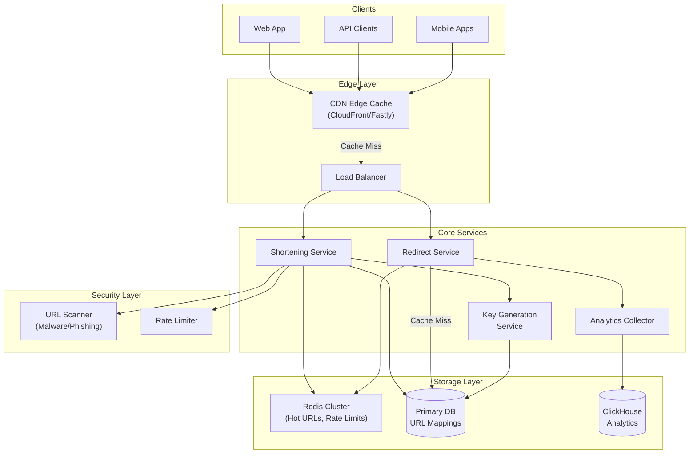
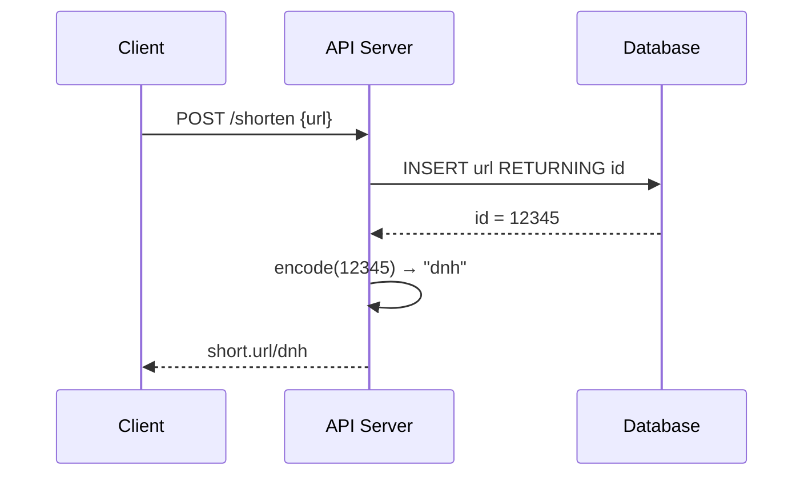
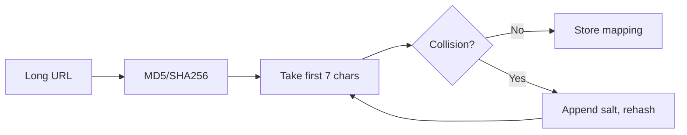
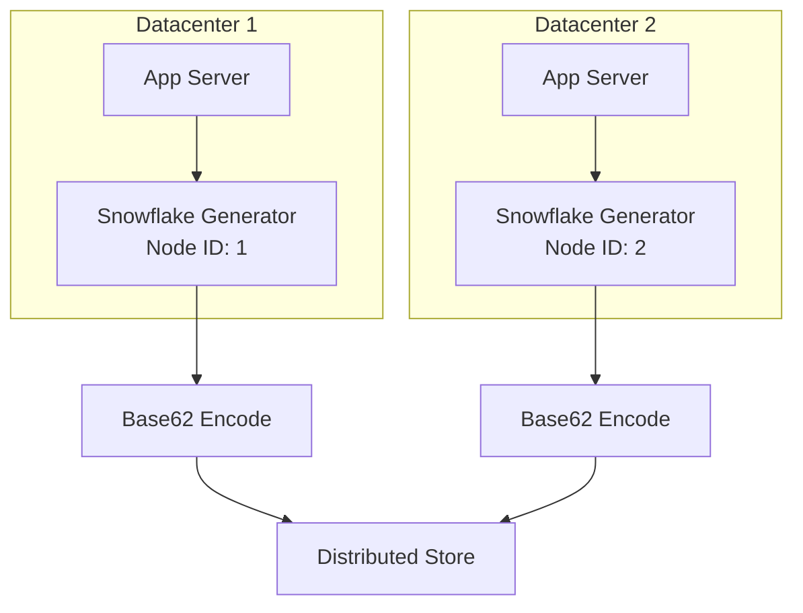
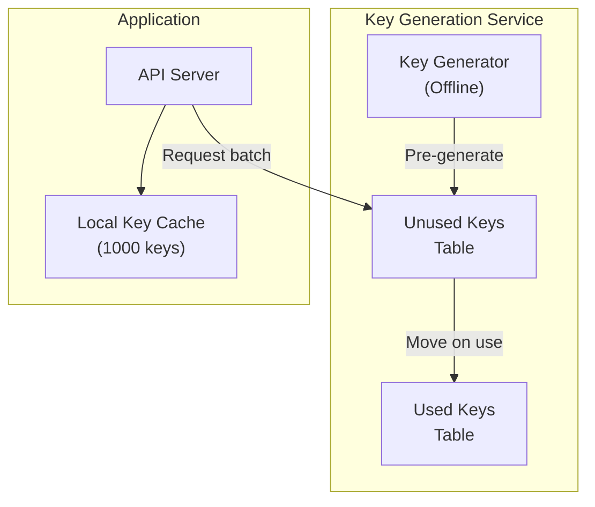
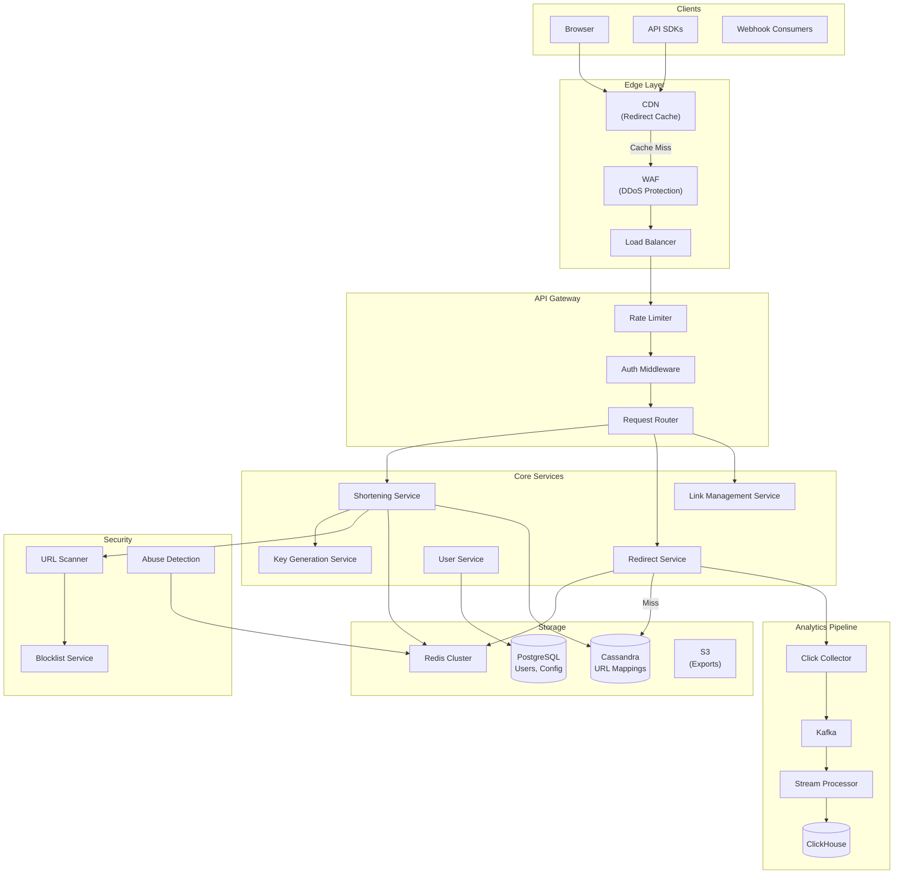
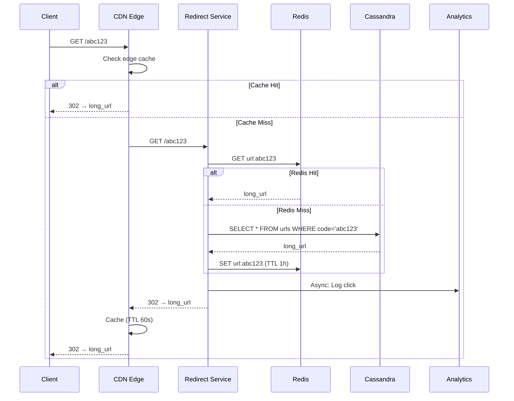
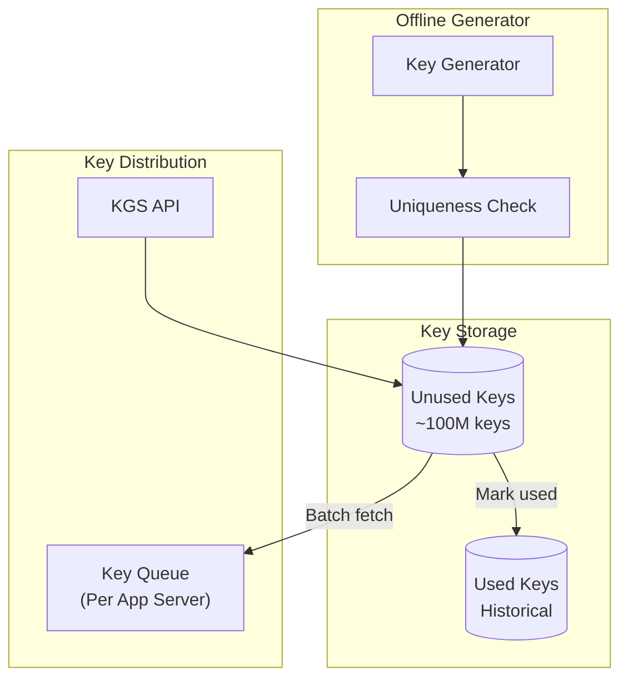
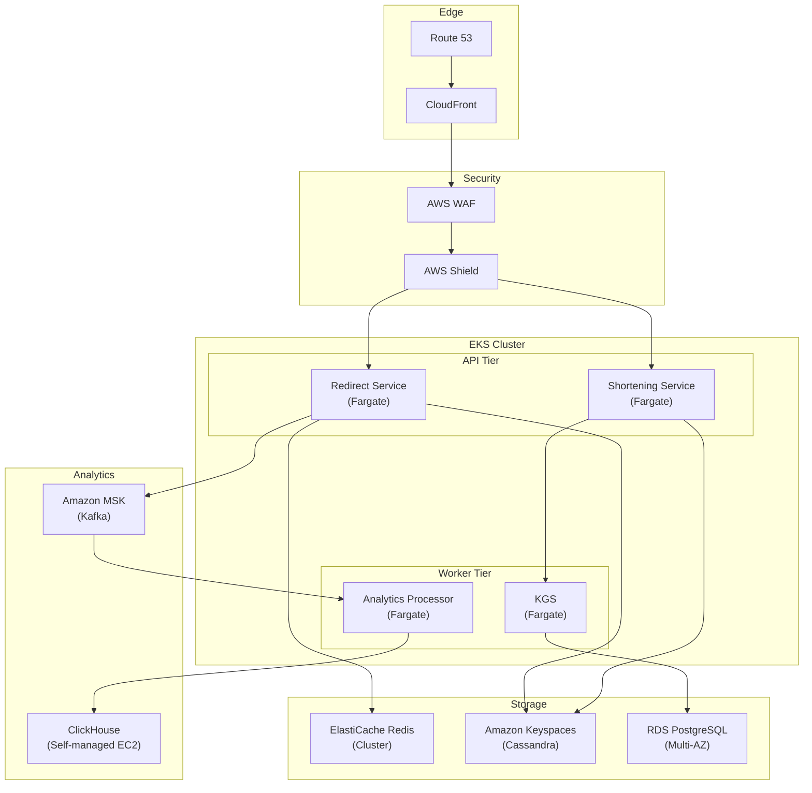

# Design a URL Shortener: IDs, Storage, and Scale

A comprehensive system design for a URL shortening service covering ID generation strategies, database sharding, caching layers, analytics pipelines, and abuse prevention. This design addresses sub-50ms redirect latency at Bitly scale (6 billion clicks/month) with 99.99% availability and real-time click tracking.

<figure>



<figcaption>High-level architecture: CDN handles cached redirects, core services manage shortening and redirection, analytics collected asynchronously to avoid blocking redirects.</figcaption>
</figure>

## Abstract

URL shorteners solve a deceptively simple problem—mapping short codes to long URLs—but at scale, the design choices compound: ID generation must be collision-free across distributed nodes, redirects must complete in milliseconds globally, and analytics must not block the critical path.

**Core architectural decisions:**

| Decision      | Choice                               | Rationale                                                   |
| ------------- | ------------------------------------ | ----------------------------------------------------------- |
| ID generation | Snowflake + Base62                   | Decentralized, time-ordered, no coordination overhead       |
| Storage       | NoSQL key-value (Cassandra/DynamoDB) | O(1) lookups, horizontal scaling, 100:1 read-to-write ratio |
| Caching       | Multi-tier (CDN → Redis → DB)        | Sub-50ms global latency, hot-key protection                 |
| Redirect type | 302 (Temporary) with CDN caching     | Enables click tracking while CDN absorbs traffic            |
| Analytics     | Async pipeline (Kafka → ClickHouse)  | Never blocks redirect path                                  |
| Sharding      | Consistent hashing on short code     | Minimal data movement on cluster changes                    |

**Key trade-offs accepted:**

- 302 redirects increase server load vs. 301, but enable accurate analytics
- Pre-generated keys (KGS) require storage overhead but guarantee no collisions
- Multi-tier caching adds complexity but essential for viral link handling
- Async analytics means real-time dashboards have 1-5 second delay

**What this design optimizes:**

- Sub-50ms redirect latency globally via CDN edge caching
- 10,000+ redirects/second per node with Redis caching
- Zero collision guarantee via Key Generation Service
- Real-time abuse detection without blocking legitimate traffic

## Requirements

### Functional Requirements

| Requirement         | Priority | Notes                                           |
| ------------------- | -------- | ----------------------------------------------- |
| Shorten long URLs   | Core     | Generate unique short code for any valid URL    |
| Redirect short URLs | Core     | 301/302 redirect to original URL                |
| Custom short codes  | Core     | User-specified aliases (e.g., `suj.ee/my-link`) |
| Link expiration     | Core     | TTL-based or click-limit expiration             |
| Click analytics     | Core     | Count, geo, device, referrer tracking           |
| Link management     | Extended | Edit destination, enable/disable links          |
| Bulk shortening     | Extended | API for batch URL processing                    |
| QR code generation  | Extended | QR codes for shortened URLs                     |

### Non-Functional Requirements

| Requirement         | Target                   | Rationale                                             |
| ------------------- | ------------------------ | ----------------------------------------------------- |
| Availability        | 99.99% (4 nines)         | Links embedded everywhere; downtime = broken internet |
| Redirect latency    | p99 < 50ms               | User experience, SEO impact                           |
| Write latency       | p99 < 200ms              | Acceptable for link creation                          |
| Throughput (reads)  | 100K RPS                 | Peak viral traffic handling                           |
| Throughput (writes) | 1K RPS                   | Link creation is infrequent                           |
| Data durability     | 99.999999999% (11 nines) | Links must never be lost                              |
| URL lifetime        | 5+ years default         | Permalinks for content                                |

### Scale Estimation

**Traffic patterns:**

- Read-to-write ratio: 100:1 (redirects dominate)
- Viral amplification: Single link can generate 80% of daily traffic in minutes

**Users and URLs:**

- Monthly Active Users: 10M
- New URLs/day: 1M
- Total URLs (5 years): 1M × 365 × 5 = 1.825B URLs

**Traffic:**

- Redirects/day: 1M URLs × 100 clicks avg = 100M redirects/day
- Average RPS: 100M / 86400 ≈ 1,157 RPS
- Peak multiplier (10x): 11,570 RPS
- Viral spike (100x single link): 100K+ RPS burst

**Storage:**

- URL record: ~500 bytes (short_code, long_url, metadata, timestamps)
- Daily growth: 1M × 500B = 500MB/day
- 5-year storage: 500MB × 365 × 5 ≈ 912GB URLs
- Analytics (per click): ~200 bytes
- Analytics daily: 100M × 200B = 20GB/day
- Analytics 1-year retention: 7.3TB

**Key insight:** Storage is manageable; the challenge is latency at the read path and handling viral traffic spikes.

## Design Paths

### Path A: Counter-Based ID Generation

**Best when:**

- Single datacenter deployment
- Moderate scale (< 10M URLs)
- Simplicity is paramount
- Sequential IDs acceptable

**Architecture:**



**Key characteristics:**

- Auto-increment database ID
- Base62 encode the numeric ID
- Single source of truth for ID generation

**Trade-offs:**

- ✅ Simplest implementation
- ✅ Guaranteed unique (database constraint)
- ✅ Short codes (sequential = compact)
- ❌ Single point of failure (database)
- ❌ Predictable URLs (security concern)
- ❌ Doesn't scale horizontally

**Real-world example:** Early TinyURL used this approach before scaling challenges emerged.

### Path B: Hash-Based Generation

**Best when:**

- Idempotent shortening required (same URL → same short code)
- Deduplication is important
- Moderate collision risk acceptable

**Architecture:**



**Key characteristics:**

- Hash the long URL
- Truncate hash to desired length
- Handle collisions with rehashing or appending

**Trade-offs:**

- ✅ Same URL always produces same short code
- ✅ No central coordinator needed
- ✅ Natural deduplication
- ❌ Collision probability increases with scale
- ❌ Collision handling adds latency
- ❌ Cannot support custom codes easily

**Collision math (Birthday Paradox):**

- 7-character Base62: 62^7 = 3.5 trillion combinations
- At 1 billion URLs: collision probability ≈ 0.014%
- At 10 billion URLs: collision probability ≈ 1.4%

### Path C: Distributed ID Generation (Snowflake + Base62)

**Best when:**

- Multi-datacenter deployment
- High scale (billions of URLs)
- Time-ordered IDs beneficial
- No central coordinator acceptable

**Architecture:**



**Snowflake ID structure (64-bit):**

| Bits | Field     | Purpose                             |
| ---- | --------- | ----------------------------------- |
| 41   | Timestamp | Milliseconds since epoch (69 years) |
| 10   | Node ID   | 1024 unique nodes                   |
| 12   | Sequence  | 4096 IDs/ms/node                    |

**Trade-offs:**

- ✅ No coordination between nodes
- ✅ Time-ordered (useful for analytics)
- ✅ 4M IDs/second/node capacity
- ❌ Longer codes (64-bit → 11 Base62 chars)
- ❌ Clock synchronization required
- ❌ Node ID management overhead

**Real-world example:** Twitter uses Snowflake for tweet IDs; Discord adopted it for message IDs.

### Path D: Pre-Generated Key Service (KGS)

**Best when:**

- Guaranteed zero collisions required
- Predictable short code length needed
- Can tolerate key pre-generation overhead

**Architecture:**



**Key characteristics:**

- Offline process generates all possible short codes
- Application servers fetch batches of unused keys
- Atomic move from unused → used on assignment

**Trade-offs:**

- ✅ Zero collision guarantee
- ✅ O(1) key retrieval
- ✅ Predictable key length
- ❌ Storage for pre-generated keys (~412GB for 68.7B 6-char keys)
- ❌ KGS becomes critical dependency
- ❌ Key exhaustion planning required

**Real-world example:** Production URL shorteners at scale often use KGS for reliability.

### Path Comparison

| Factor           | Counter  | Hash   | Snowflake | KGS          |
| ---------------- | -------- | ------ | --------- | ------------ |
| Collision risk   | None     | Medium | None      | None         |
| Coordination     | Required | None   | None      | Batch fetch  |
| Code length      | Shortest | Fixed  | 11 chars  | Configurable |
| Predictability   | High     | Low    | Medium    | Low          |
| Horizontal scale | Poor     | Good   | Excellent | Good         |
| Complexity       | Low      | Medium | Medium    | High         |

### This Article's Focus

This article focuses on **Path D (KGS) + Snowflake hybrid** because:

1. Zero collision guarantee is critical for production reliability
2. Enables both random (KGS) and time-ordered (Snowflake) IDs
3. Proven at Bitly scale (6B clicks/month)
4. Supports custom short codes naturally

## High-Level Design

### Component Overview



### Shortening Service

Receives long URLs, validates, scans for malware, assigns short codes, and persists mappings.

**Responsibilities:**

- URL validation (scheme, format, reachability)
- Malware/phishing scanning
- Short code assignment (KGS or custom)
- Duplicate detection (optional)
- Metadata extraction (title, favicon)

**Design decisions:**

| Decision           | Choice                                     | Rationale                                 |
| ------------------ | ------------------------------------------ | ----------------------------------------- |
| Duplicate handling | Optional dedup                             | Some users want unique links for tracking |
| URL validation     | Async HEAD request                         | Don't block on slow destinations          |
| Scanning           | Sync for new domains, async for known-good | Balance security with latency             |
| Custom codes       | Reserve from KGS pool                      | Prevents collision with random codes      |

### Redirect Service

The most critical service—handles 99% of traffic. Must be blazing fast.

**Flow:**



**Critical optimizations:**

- Redis stores hot URLs (LRU eviction)
- Bloom filter prevents cache stampede on non-existent codes
- Connection pooling to database (PGBouncer pattern)
- Analytics logging is fire-and-forget (async)

### Key Generation Service (KGS)

Pre-generates unique short codes for zero-collision guarantee.

**Architecture:**



**Key allocation strategy:**

1. Each app server requests batch of 1000 keys
2. Keys moved atomically to "allocated" state
3. App server caches keys in memory
4. On use, key marked as "used"
5. Unused allocated keys returned on graceful shutdown

**Failure handling:**

- App server crash: Allocated keys orphaned (acceptable loss at scale)
- KGS unavailable: App servers have local cache buffer
- Key exhaustion: Alert at 80% usage, generate new batch

### Analytics Collector

Captures click data without blocking redirects.

**Click event structure:**

```typescript
interface ClickEvent {
  shortCode: string
  timestamp: number

  // Client info
  ipHash: string // Anonymized for GDPR
  userAgent: string
  referer: string | null

  // Derived fields
  country: string
  city: string
  deviceType: "mobile" | "desktop" | "tablet"
  browser: string
  os: string

  // Bot detection
  isBot: boolean
  botType: string | null
}
```

**Pipeline:**

1. Redirect service sends event to Kafka (fire-and-forget)
2. Stream processor enriches (geo-IP, device parsing, bot detection)
3. Aggregated into ClickHouse for querying
4. Real-time counters updated in Redis (for API responses)

## API Design

### Create Short URL

**Endpoint:** `POST /api/v1/urls`

**Request:**

```json
{
  "url": "https://example.com/very/long/path?with=params",
  "customCode": "my-link",
  "expiresAt": "2025-12-31T23:59:59Z",
  "password": "optional-password",
  "maxClicks": 1000,
  "tags": ["campaign-2024", "social"]
}
```

**Response (201 Created):**

```json
{
  "id": "url_abc123def456",
  "shortCode": "my-link",
  "shortUrl": "https://suj.ee/my-link",
  "longUrl": "https://example.com/very/long/path?with=params",
  "createdAt": "2024-02-03T10:00:00Z",
  "expiresAt": "2025-12-31T23:59:59Z",
  "isPasswordProtected": true,
  "maxClicks": 1000,
  "clickCount": 0,
  "qrCode": "https://suj.ee/api/v1/urls/url_abc123def456/qr"
}
```

**Error Responses:**

| Code | Error                 | When                             |
| ---- | --------------------- | -------------------------------- |
| 400  | `INVALID_URL`         | Malformed or unreachable URL     |
| 400  | `INVALID_CUSTOM_CODE` | Code contains invalid characters |
| 409  | `CODE_TAKEN`          | Custom code already exists       |
| 403  | `URL_BLOCKED`         | Destination flagged as malicious |
| 429  | `RATE_LIMITED`        | Too many requests                |

**Rate Limits:**

| Plan       | Create/hour | Create/day |
| ---------- | ----------- | ---------- |
| Free       | 50          | 500        |
| Pro        | 500         | 5,000      |
| Enterprise | 5,000       | Unlimited  |

### Redirect (Read)

**Endpoint:** `GET /{shortCode}`

**Response:** `302 Found` with `Location` header

**Headers:**

```http
HTTP/1.1 302 Found
Location: https://example.com/very/long/path
Cache-Control: private, max-age=60
X-Robots-Tag: noindex
```

**Error Responses:**

| Code | When                                  |
| ---- | ------------------------------------- |
| 404  | Short code not found                  |
| 410  | Link expired or disabled              |
| 429  | Click limit exceeded                  |
| 403  | Password required (returns HTML form) |

### Get URL Analytics

**Endpoint:** `GET /api/v1/urls/{id}/analytics`

**Query Parameters:**

| Param     | Type    | Default | Description                            |
| --------- | ------- | ------- | -------------------------------------- |
| period    | string  | 7d      | Time range (24h, 7d, 30d, 90d, custom) |
| startDate | ISO8601 | -       | Custom range start                     |
| endDate   | ISO8601 | -       | Custom range end                       |
| groupBy   | string  | day     | Aggregation (hour, day, week, month)   |

**Response:**

```json
{
  "urlId": "url_abc123def456",
  "period": {
    "start": "2024-01-27T00:00:00Z",
    "end": "2024-02-03T23:59:59Z"
  },
  "summary": {
    "totalClicks": 15420,
    "uniqueClicks": 12350,
    "botClicks": 1230
  },
  "timeSeries": [
    { "date": "2024-01-27", "clicks": 2100, "unique": 1800 },
    { "date": "2024-01-28", "clicks": 2450, "unique": 2100 }
  ],
  "topReferrers": [
    { "referrer": "twitter.com", "clicks": 5200, "percentage": 33.7 },
    { "referrer": "facebook.com", "clicks": 3100, "percentage": 20.1 }
  ],
  "topCountries": [
    { "country": "US", "clicks": 6800, "percentage": 44.1 },
    { "country": "UK", "clicks": 2300, "percentage": 14.9 }
  ],
  "devices": {
    "mobile": { "clicks": 9200, "percentage": 59.7 },
    "desktop": { "clicks": 5800, "percentage": 37.6 },
    "tablet": { "clicks": 420, "percentage": 2.7 }
  }
}
```

### Bulk Create URLs

**Endpoint:** `POST /api/v1/urls/bulk`

**Request:**

```json
{
  "urls": [{ "url": "https://example.com/page1" }, { "url": "https://example.com/page2", "customCode": "page2" }],
  "defaultExpiry": "2025-12-31T23:59:59Z",
  "tags": ["bulk-import"]
}
```

**Response (202 Accepted):**

```json
{
  "jobId": "job_xyz789",
  "status": "processing",
  "totalUrls": 2,
  "statusUrl": "/api/v1/jobs/job_xyz789"
}
```

### List User URLs

**Endpoint:** `GET /api/v1/urls?cursor=xxx&limit=50`

**Response:**

```json
{
  "urls": [
    {
      "id": "url_abc123",
      "shortCode": "abc123",
      "shortUrl": "https://suj.ee/abc123",
      "longUrl": "https://example.com/...",
      "clickCount": 1542,
      "createdAt": "2024-01-15T10:00:00Z",
      "status": "active"
    }
  ],
  "pagination": {
    "nextCursor": "cursor_def456",
    "hasMore": true,
    "total": 234
  }
}
```

## Data Modeling

### URL Mapping (Cassandra)

**Primary table optimized for redirect lookups:**

```sql
CREATE TABLE url_mappings (
    short_code TEXT,
    long_url TEXT,
    user_id UUID,
    created_at TIMESTAMP,
    expires_at TIMESTAMP,
    is_active BOOLEAN,
    click_count COUNTER,
    password_hash TEXT,
    max_clicks INT,
    metadata MAP<TEXT, TEXT>,
    PRIMARY KEY (short_code)
) WITH default_time_to_live = 157680000  -- 5 years
  AND compaction = {'class': 'LeveledCompactionStrategy'}
  AND caching = {'keys': 'ALL', 'rows_per_partition': 'ALL'};
```

**Secondary table for user queries:**

```sql
CREATE TABLE urls_by_user (
    user_id UUID,
    created_at TIMESTAMP,
    short_code TEXT,
    long_url TEXT,
    click_count BIGINT,
    is_active BOOLEAN,
    PRIMARY KEY ((user_id), created_at, short_code)
) WITH CLUSTERING ORDER BY (created_at DESC);
```

**Why Cassandra:**

- O(1) lookups by short_code (partition key)
- Horizontal scaling for billions of URLs
- Tunable consistency (ONE for reads, QUORUM for writes)
- Built-in TTL for expiration
- 100:1 read-to-write ratio matches Cassandra strengths

### Click Analytics (ClickHouse)

```sql
CREATE TABLE clicks (
    short_code String,
    clicked_at DateTime64(3),

    -- Client data
    ip_hash FixedString(16),
    country LowCardinality(String),
    city String,

    -- Device data
    device_type Enum8('mobile' = 1, 'desktop' = 2, 'tablet' = 3),
    browser LowCardinality(String),
    os LowCardinality(String),

    -- Referrer
    referrer_domain LowCardinality(String),
    referrer_path String,

    -- Bot detection
    is_bot UInt8,
    bot_type LowCardinality(String),

    -- Aggregation keys
    date Date MATERIALIZED toDate(clicked_at),
    hour UInt8 MATERIALIZED toHour(clicked_at)
)
ENGINE = MergeTree()
PARTITION BY toYYYYMM(clicked_at)
ORDER BY (short_code, clicked_at)
TTL clicked_at + INTERVAL 1 YEAR;

-- Materialized view for real-time aggregates
CREATE MATERIALIZED VIEW clicks_daily_mv
ENGINE = SummingMergeTree()
PARTITION BY toYYYYMM(date)
ORDER BY (short_code, date, country, device_type)
AS SELECT
    short_code,
    date,
    country,
    device_type,
    count() as clicks,
    uniqExact(ip_hash) as unique_clicks
FROM clicks
GROUP BY short_code, date, country, device_type;
```

**Why ClickHouse:**

- Columnar storage for analytics queries
- 10-100x compression on click data
- Sub-second aggregations on billions of rows
- Materialized views for real-time dashboards

### User and Configuration (PostgreSQL)

```sql
CREATE TABLE users (
    id UUID PRIMARY KEY DEFAULT gen_random_uuid(),
    email TEXT UNIQUE NOT NULL,
    password_hash TEXT NOT NULL,
    plan TEXT DEFAULT 'free',
    api_key_hash TEXT UNIQUE,
    created_at TIMESTAMPTZ DEFAULT NOW(),
    updated_at TIMESTAMPTZ DEFAULT NOW()
);

CREATE TABLE custom_domains (
    id UUID PRIMARY KEY DEFAULT gen_random_uuid(),
    user_id UUID REFERENCES users(id),
    domain TEXT UNIQUE NOT NULL,
    is_verified BOOLEAN DEFAULT false,
    ssl_status TEXT DEFAULT 'pending',
    created_at TIMESTAMPTZ DEFAULT NOW()
);

CREATE TABLE api_keys (
    id UUID PRIMARY KEY DEFAULT gen_random_uuid(),
    user_id UUID REFERENCES users(id),
    key_hash TEXT UNIQUE NOT NULL,
    name TEXT,
    permissions JSONB DEFAULT '["read", "write"]',
    last_used_at TIMESTAMPTZ,
    expires_at TIMESTAMPTZ,
    created_at TIMESTAMPTZ DEFAULT NOW()
);

CREATE INDEX idx_users_api_key ON users(api_key_hash);
CREATE INDEX idx_domains_user ON custom_domains(user_id);
```

### Key Generation Service (PostgreSQL)

```sql
CREATE TABLE keys_unused (
    short_code TEXT PRIMARY KEY,
    created_at TIMESTAMPTZ DEFAULT NOW()
);

CREATE TABLE keys_allocated (
    short_code TEXT PRIMARY KEY,
    allocated_to TEXT NOT NULL,  -- Server instance ID
    allocated_at TIMESTAMPTZ DEFAULT NOW()
);

CREATE TABLE keys_used (
    short_code TEXT PRIMARY KEY,
    used_at TIMESTAMPTZ DEFAULT NOW()
);

-- Batch allocation function
CREATE OR REPLACE FUNCTION allocate_keys(
    server_id TEXT,
    batch_size INT
) RETURNS TABLE(short_code TEXT) AS $$
BEGIN
    RETURN QUERY
    WITH allocated AS (
        DELETE FROM keys_unused
        WHERE short_code IN (
            SELECT ku.short_code
            FROM keys_unused ku
            LIMIT batch_size
            FOR UPDATE SKIP LOCKED
        )
        RETURNING keys_unused.short_code
    )
    INSERT INTO keys_allocated (short_code, allocated_to)
    SELECT a.short_code, server_id
    FROM allocated a
    RETURNING keys_allocated.short_code;
END;
$$ LANGUAGE plpgsql;
```

### Database Selection Matrix

| Data Type      | Store      | Rationale                                            |
| -------------- | ---------- | ---------------------------------------------------- |
| URL mappings   | Cassandra  | O(1) lookups, horizontal scale, high read throughput |
| Click events   | ClickHouse | Columnar analytics, compression, fast aggregations   |
| User accounts  | PostgreSQL | ACID transactions, relational queries                |
| KGS keys       | PostgreSQL | Transactional batch allocation                       |
| Hot URLs cache | Redis      | Sub-ms latency, TTL support                          |
| Rate limits    | Redis      | Atomic counters, sliding windows                     |
| Bloom filter   | Redis      | Memory-efficient existence checks                    |

## Low-Level Design

### Base62 Encoder

```typescript collapse={1-5}
const CHARSET = "0123456789ABCDEFGHIJKLMNOPQRSTUVWXYZabcdefghijklmnopqrstuvwxyz"
const BASE = BigInt(62)

export function encodeBase62(num: bigint): string {
  if (num === 0n) return CHARSET[0]

  let result = ""
  while (num > 0n) {
    result = CHARSET[Number(num % BASE)] + result
    num = num / BASE
  }
  return result
}

export function decodeBase62(str: string): bigint {
  let result = 0n
  for (const char of str) {
    const index = CHARSET.indexOf(char)
    if (index === -1) throw new Error(`Invalid character: ${char}`)
    result = result * BASE + BigInt(index)
  }
  return result
}

// Pad to fixed length for consistent URLs
export function encodeBase62Padded(num: bigint, length: number): string {
  const encoded = encodeBase62(num)
  return encoded.padStart(length, "0")
}
```

**Code length capacity:**

| Length | Combinations | Sufficient for        |
| ------ | ------------ | --------------------- |
| 6      | 56.8B        | Small-medium services |
| 7      | 3.5T         | Large services        |
| 8      | 218T         | All URLs on internet  |

### Snowflake ID Generator

```typescript collapse={1-15}
const EPOCH = 1609459200000n // 2021-01-01 00:00:00 UTC
const NODE_BITS = 10n
const SEQUENCE_BITS = 12n

const MAX_NODE_ID = (1n << NODE_BITS) - 1n
const MAX_SEQUENCE = (1n << SEQUENCE_BITS) - 1n

const NODE_SHIFT = SEQUENCE_BITS
const TIMESTAMP_SHIFT = SEQUENCE_BITS + NODE_BITS

export class SnowflakeGenerator {
  private nodeId: bigint
  private sequence: bigint = 0n
  private lastTimestamp: bigint = -1n

  constructor(nodeId: number) {
    if (nodeId < 0 || BigInt(nodeId) > MAX_NODE_ID) {
      throw new Error(`Node ID must be between 0 and ${MAX_NODE_ID}`)
    }
    this.nodeId = BigInt(nodeId)
  }

  generate(): bigint {
    let timestamp = BigInt(Date.now()) - EPOCH

    if (timestamp === this.lastTimestamp) {
      this.sequence = (this.sequence + 1n) & MAX_SEQUENCE
      if (this.sequence === 0n) {
        // Sequence exhausted, wait for next millisecond
        timestamp = this.waitNextMillis(this.lastTimestamp)
      }
    } else {
      this.sequence = 0n
    }

    this.lastTimestamp = timestamp

    return (timestamp << TIMESTAMP_SHIFT) | (this.nodeId << NODE_SHIFT) | this.sequence
  }

  private waitNextMillis(lastTimestamp: bigint): bigint {
    let timestamp = BigInt(Date.now()) - EPOCH
    while (timestamp <= lastTimestamp) {
      timestamp = BigInt(Date.now()) - EPOCH
    }
    return timestamp
  }
}
```

**Capacity:** 4,096 IDs per millisecond per node × 1,024 nodes = 4.1M IDs/second total.

### Redirect Service with Bloom Filter

```typescript collapse={1-20}
import { BloomFilter } from "bloom-filters"

interface RedirectResult {
  found: boolean
  longUrl?: string
  isExpired?: boolean
  requiresPassword?: boolean
}

class RedirectService {
  private readonly redis: RedisCluster
  private readonly cassandra: CassandraClient
  private readonly bloomFilter: BloomFilter
  private readonly analytics: AnalyticsCollector

  constructor() {
    // Bloom filter: 1B items, 0.1% false positive rate
    // Memory: ~1.2GB
    this.bloomFilter = BloomFilter.create(1_000_000_000, 0.001)
  }

  async redirect(shortCode: string, context: RequestContext): Promise<RedirectResult> {
    // Step 1: Bloom filter check (prevents cache stampede on non-existent codes)
    if (!this.bloomFilter.has(shortCode)) {
      return { found: false }
    }

    // Step 2: Redis cache check
    const cached = await this.redis.hgetall(`url:${shortCode}`)
    if (cached && cached.long_url) {
      this.logClick(shortCode, context) // Async, non-blocking
      return this.buildResult(cached)
    }

    // Step 3: Database lookup
    const row = await this.cassandra.execute("SELECT * FROM url_mappings WHERE short_code = ?", [shortCode])

    if (!row || row.length === 0) {
      // False positive from bloom filter
      return { found: false }
    }

    const url = row[0]

    // Step 4: Cache the result
    await this.redis.hset(`url:${shortCode}`, {
      long_url: url.long_url,
      expires_at: url.expires_at?.toISOString() || "",
      password_hash: url.password_hash || "",
      is_active: url.is_active ? "1" : "0",
    })
    await this.redis.expire(`url:${shortCode}`, 3600) // 1 hour TTL

    this.logClick(shortCode, context)
    return this.buildResult(url)
  }

  private buildResult(data: any): RedirectResult {
    if (data.is_active === "0" || data.is_active === false) {
      return { found: false }
    }

    if (data.expires_at && new Date(data.expires_at) < new Date()) {
      return { found: true, isExpired: true }
    }

    if (data.password_hash) {
      return { found: true, requiresPassword: true, longUrl: data.long_url }
    }

    return { found: true, longUrl: data.long_url }
  }

  private logClick(shortCode: string, context: RequestContext): void {
    // Fire and forget - don't await
    this.analytics
      .log({
        shortCode,
        timestamp: Date.now(),
        ip: context.ip,
        userAgent: context.userAgent,
        referer: context.referer,
      })
      .catch((err) => console.error("Analytics error:", err))
  }
}
```

### Rate Limiter (Sliding Window)

```typescript collapse={1-12}
interface RateLimitResult {
  allowed: boolean
  remaining: number
  resetAt: number
}

class SlidingWindowRateLimiter {
  private readonly redis: RedisCluster

  async checkLimit(key: string, limit: number, windowMs: number): Promise<RateLimitResult> {
    const now = Date.now()
    const windowStart = now - windowMs

    // Lua script for atomic sliding window
    const result = await this.redis.eval(
      `
      local key = KEYS[1]
      local now = tonumber(ARGV[1])
      local window_start = tonumber(ARGV[2])
      local limit = tonumber(ARGV[3])
      local window_ms = tonumber(ARGV[4])

      -- Remove old entries
      redis.call('ZREMRANGEBYSCORE', key, '-inf', window_start)

      -- Count current entries
      local count = redis.call('ZCARD', key)

      if count < limit then
        -- Add new entry
        redis.call('ZADD', key, now, now .. ':' .. math.random())
        redis.call('PEXPIRE', key, window_ms)
        return {1, limit - count - 1, now + window_ms}
      else
        -- Get oldest entry for reset time
        local oldest = redis.call('ZRANGE', key, 0, 0, 'WITHSCORES')
        local reset_at = oldest[2] + window_ms
        return {0, 0, reset_at}
      end
    `,
      [key],
      [now, windowStart, limit, windowMs],
    )

    return {
      allowed: result[0] === 1,
      remaining: result[1],
      resetAt: result[2],
    }
  }
}
```

### URL Scanner (Security)

```typescript collapse={1-15}
interface ScanResult {
  isSafe: boolean
  threats: string[]
  scanTime: number
}

class URLScanner {
  private readonly blocklist: BlocklistService
  private readonly googleSafeBrowsing: GoogleSafeBrowsingClient
  private readonly virusTotal: VirusTotalClient
  private readonly redis: RedisCluster

  async scan(url: string): Promise<ScanResult> {
    const urlHash = this.hashUrl(url)

    // Check cache first
    const cached = await this.redis.get(`scan:${urlHash}`)
    if (cached) {
      return JSON.parse(cached)
    }

    const domain = new URL(url).hostname
    const threats: string[] = []

    // Step 1: Local blocklist (fast)
    if (await this.blocklist.contains(domain)) {
      return this.cacheResult(urlHash, { isSafe: false, threats: ["blocklist"] })
    }

    // Step 2: Known-good allowlist
    if (await this.isKnownGood(domain)) {
      return this.cacheResult(urlHash, { isSafe: true, threats: [] })
    }

    // Step 3: Google Safe Browsing API
    const gsbResult = await this.googleSafeBrowsing.lookup(url)
    if (gsbResult.threats.length > 0) {
      threats.push(...gsbResult.threats)
    }

    // Step 4: VirusTotal (for suspicious domains)
    if (await this.isSuspicious(domain)) {
      const vtResult = await this.virusTotal.scan(url)
      if (vtResult.positives > 2) {
        threats.push("malware")
      }
    }

    const result: ScanResult = {
      isSafe: threats.length === 0,
      threats,
      scanTime: Date.now(),
    }

    return this.cacheResult(urlHash, result)
  }

  private async cacheResult(hash: string, result: ScanResult): Promise<ScanResult> {
    // Cache safe results longer than unsafe
    const ttl = result.isSafe ? 86400 : 3600 // 24h vs 1h
    await this.redis.setex(`scan:${hash}`, ttl, JSON.stringify(result))
    return result
  }

  private async isKnownGood(domain: string): Promise<boolean> {
    // Top 10K domains by traffic
    return this.redis.sismember("domains:allowlist", domain)
  }

  private async isSuspicious(domain: string): Promise<boolean> {
    // New domain, unusual TLD, etc.
    const domainAge = await this.getDomainAge(domain)
    return domainAge < 30 // Less than 30 days old
  }
}
```

### Analytics Pipeline

```typescript collapse={1-10}
interface ClickEvent {
  shortCode: string
  timestamp: number
  ip: string
  userAgent: string
  referer: string | null
}

class AnalyticsCollector {
  private readonly kafka: KafkaProducer
  private readonly buffer: ClickEvent[] = []
  private readonly BUFFER_SIZE = 100
  private readonly FLUSH_INTERVAL = 1000 // 1 second

  constructor() {
    setInterval(() => this.flush(), this.FLUSH_INTERVAL)
  }

  async log(event: ClickEvent): Promise<void> {
    this.buffer.push(event)

    if (this.buffer.length >= this.BUFFER_SIZE) {
      await this.flush()
    }
  }

  private async flush(): Promise<void> {
    if (this.buffer.length === 0) return

    const events = this.buffer.splice(0)

    await this.kafka.sendBatch({
      topic: "clicks",
      messages: events.map((e) => ({
        key: e.shortCode,
        value: JSON.stringify(e),
        timestamp: e.timestamp.toString(),
      })),
    })
  }
}

// Stream processor (Kafka Consumer → ClickHouse)
class ClickProcessor {
  private readonly clickhouse: ClickHouseClient
  private readonly geoIP: GeoIPService
  private readonly deviceParser: DeviceParser
  private readonly botDetector: BotDetector

  async process(event: ClickEvent): Promise<EnrichedClick> {
    const geo = await this.geoIP.lookup(event.ip)
    const device = this.deviceParser.parse(event.userAgent)
    const isBot = this.botDetector.detect(event.userAgent, event.ip)

    return {
      short_code: event.shortCode,
      clicked_at: new Date(event.timestamp),
      ip_hash: this.hashIP(event.ip), // GDPR compliance
      country: geo.country,
      city: geo.city,
      device_type: device.type,
      browser: device.browser,
      os: device.os,
      referrer_domain: this.extractDomain(event.referer),
      referrer_path: this.extractPath(event.referer),
      is_bot: isBot.isBot ? 1 : 0,
      bot_type: isBot.type,
    }
  }

  private hashIP(ip: string): string {
    // GDPR-compliant anonymization
    return crypto
      .createHash("sha256")
      .update(ip + process.env.IP_SALT)
      .digest("hex")
      .substring(0, 32)
  }
}
```

## Frontend Considerations

### Redirect Performance

**Critical path optimization:**

The redirect is the most latency-sensitive operation. Every millisecond matters.

```typescript collapse={1-8}
// Server-side redirect handler (minimal processing)
export async function handleRedirect(req: Request): Promise<Response> {
  const shortCode = req.url.split("/").pop()

  // Validate format before any I/O
  if (!isValidCode(shortCode)) {
    return new Response(null, { status: 404 })
  }

  const result = await redirectService.redirect(shortCode, {
    ip: req.headers.get("x-forwarded-for"),
    userAgent: req.headers.get("user-agent"),
    referer: req.headers.get("referer"),
  })

  if (!result.found) {
    return new Response(null, { status: 404 })
  }

  if (result.isExpired) {
    return new Response("Link expired", { status: 410 })
  }

  if (result.requiresPassword) {
    return renderPasswordPage(shortCode)
  }

  return new Response(null, {
    status: 302,
    headers: {
      Location: result.longUrl,
      "Cache-Control": "private, max-age=60",
      "X-Robots-Tag": "noindex",
    },
  })
}
```

**Why 302 over 301:**

| Factor          | 301 (Permanent)         | 302 (Temporary)        |
| --------------- | ----------------------- | ---------------------- |
| Browser caching | Aggressive (forever)    | Respects Cache-Control |
| Click tracking  | Misses cached clicks    | Tracks all clicks      |
| URL updates     | Cached version persists | Changes reflected      |
| CDN caching     | Long TTL safe           | Short TTL recommended  |

**Recommendation:** Use 302 with `Cache-Control: private, max-age=60`. CDN caches for 60s (absorbs spikes), browsers cache briefly, analytics remain accurate.

### Dashboard State Management

```typescript collapse={1-12}
// URL analytics dashboard state
interface DashboardState {
  urls: Map<string, URLSummary>
  selectedUrl: string | null
  analytics: AnalyticsData | null
  dateRange: DateRange
  isLoading: boolean
}

// Normalized store for efficient updates
const useDashboardStore = create<DashboardState>((set, get) => ({
  urls: new Map(),
  selectedUrl: null,
  analytics: null,
  dateRange: { start: subDays(new Date(), 7), end: new Date() },
  isLoading: false,

  // Actions
  fetchUrls: async () => {
    set({ isLoading: true })
    const urls = await api.getUrls()
    set({
      urls: new Map(urls.map((u) => [u.id, u])),
      isLoading: false,
    })
  },

  selectUrl: async (urlId: string) => {
    set({ selectedUrl: urlId, isLoading: true })
    const analytics = await api.getAnalytics(urlId, get().dateRange)
    set({ analytics, isLoading: false })
  },

  updateDateRange: async (range: DateRange) => {
    set({ dateRange: range })
    const { selectedUrl } = get()
    if (selectedUrl) {
      set({ isLoading: true })
      const analytics = await api.getAnalytics(selectedUrl, range)
      set({ analytics, isLoading: false })
    }
  },
}))
```

### Real-Time Click Counter

```typescript collapse={1-10}
// WebSocket for live click updates
class ClickStreamClient {
  private ws: WebSocket | null = null
  private subscriptions = new Set<string>()

  connect(authToken: string): void {
    this.ws = new WebSocket(`wss://api.suj.ee/ws?token=${authToken}`)

    this.ws.onmessage = (event) => {
      const data = JSON.parse(event.data)
      if (data.type === "click") {
        this.handleClick(data.shortCode, data.count)
      }
    }
  }

  subscribe(shortCode: string): void {
    this.subscriptions.add(shortCode)
    this.ws?.send(
      JSON.stringify({
        action: "subscribe",
        shortCode,
      }),
    )
  }

  private handleClick(shortCode: string, count: number): void {
    // Update local state
    useDashboardStore.getState().updateClickCount(shortCode, count)
  }
}
```

## Infrastructure

### Cloud-Agnostic Components

| Component      | Purpose                       | Options                        |
| -------------- | ----------------------------- | ------------------------------ |
| CDN            | Edge caching, DDoS protection | Cloudflare, Fastly, CloudFront |
| Load balancer  | Traffic distribution          | HAProxy, NGINX, ALB            |
| Application    | Redirect service, API         | Node.js, Go, Rust              |
| KV cache       | Hot URLs, rate limits         | Redis, KeyDB, Dragonfly        |
| Primary DB     | URL mappings                  | Cassandra, ScyllaDB, DynamoDB  |
| Analytics DB   | Click data                    | ClickHouse, Druid, TimescaleDB |
| Message queue  | Analytics pipeline            | Kafka, Pulsar, Redpanda        |
| Object storage | Exports, backups              | S3, GCS, MinIO                 |

### AWS Reference Architecture



**Service configurations:**

| Service                      | Configuration                | Rationale                                  |
| ---------------------------- | ---------------------------- | ------------------------------------------ |
| CloudFront                   | 200+ edge locations          | Global low-latency redirects               |
| Redirect Service (Fargate)   | 2 vCPU, 4GB, 50 tasks        | High throughput, stateless                 |
| Shortening Service (Fargate) | 2 vCPU, 4GB, 10 tasks        | Lower traffic than redirects               |
| ElastiCache Redis            | r6g.xlarge cluster, 3 shards | Hot URL cache, rate limits                 |
| Amazon Keyspaces             | On-demand                    | Serverless Cassandra, scales automatically |
| RDS PostgreSQL               | db.r6g.large Multi-AZ        | Users, KGS, configuration                  |
| MSK                          | kafka.m5.large × 3           | Click event streaming                      |

### Self-Hosted Alternatives

| Managed Service  | Self-Hosted Option   | When to Self-Host               |
| ---------------- | -------------------- | ------------------------------- |
| Amazon Keyspaces | ScyllaDB             | Cost at scale, lower latency    |
| ElastiCache      | Redis Cluster on EC2 | Specific modules, cost          |
| CloudFront       | Cloudflare           | Better DDoS protection, cheaper |
| MSK              | Redpanda             | Lower latency, simpler ops      |

### Monitoring

**Key metrics:**

| Metric               | Alert Threshold | Action                     |
| -------------------- | --------------- | -------------------------- |
| Redirect latency p99 | > 100ms         | Scale Redis, check CDN     |
| CDN cache hit ratio  | < 80%           | Review cache headers       |
| 404 rate             | > 5%            | Check for scanning attacks |
| KGS key inventory    | < 20%           | Generate new batch         |
| Click pipeline lag   | > 60s           | Scale analytics processors |

**Distributed tracing:**

```
Request → CDN → Load Balancer → Redirect Service → Redis/Cassandra → Analytics
   │                                                                      │
   └─────────────────── Trace ID propagated ──────────────────────────────┘
```

- Each redirect gets unique trace ID
- Propagate through all services
- 100% sampling for errors, 1% for normal traffic

## Conclusion

This design provides a production-ready URL shortener with:

1. **Zero collision guarantee** via Key Generation Service
2. **Sub-50ms global redirect latency** through CDN edge caching and Redis
3. **100K+ RPS capacity** with horizontal scaling
4. **Real-time analytics** without blocking redirects
5. **Security-first approach** with URL scanning and rate limiting

**Key architectural decisions:**

- KGS + Snowflake hybrid for ID generation balances simplicity and scale
- 302 redirects with short CDN TTL enable analytics while absorbing traffic spikes
- Cassandra for URL mappings provides O(1) lookups and horizontal scaling
- Async analytics pipeline (Kafka → ClickHouse) keeps redirect path fast

**Known limitations:**

- KGS requires pre-generation overhead and key exhaustion monitoring
- 302 redirects increase server load vs. 301 caching
- Analytics have 1-5 second delay due to async processing
- Bloom filter false positives cause unnecessary DB lookups (~0.1%)

**Future enhancements:**

- Link preview generation (OpenGraph scraping)
- A/B testing for destinations
- Geographic routing (different destination per region)
- Deep link support for mobile apps

## Appendix

### Prerequisites

- Distributed systems fundamentals (consistent hashing, replication)
- Database selection trade-offs (SQL vs. NoSQL)
- Caching strategies (TTL, eviction policies)
- HTTP redirect semantics (301 vs. 302)

### Terminology

| Term                   | Definition                                                                  |
| ---------------------- | --------------------------------------------------------------------------- |
| **Base62**             | Encoding using 62 characters (0-9, A-Z, a-z) for URL-safe short codes       |
| **Snowflake ID**       | Twitter's distributed ID generation algorithm (timestamp + node + sequence) |
| **KGS**                | Key Generation Service - pre-generates unique short codes                   |
| **Bloom filter**       | Probabilistic data structure for fast membership testing                    |
| **Consistent hashing** | Sharding technique that minimizes data movement on cluster changes          |
| **CDN**                | Content Delivery Network - edge caching for global low latency              |
| **Hot key**            | Cache key receiving disproportionate traffic (viral links)                  |

### Summary

- **ID generation** uses KGS for random codes and Snowflake for time-ordered IDs, both Base62 encoded for URL-safe 7-character codes
- **Storage** uses Cassandra for URL mappings (O(1) lookups, horizontal scaling) and ClickHouse for analytics (columnar, fast aggregations)
- **Caching** is multi-tier: CDN edge (global) → Redis (regional) → Database, with Bloom filters preventing cache stampede
- **Redirects** use 302 status with short CDN TTL to balance analytics accuracy with traffic absorption
- **Analytics** collected asynchronously via Kafka to never block the redirect critical path
- **Security** includes URL scanning (Google Safe Browsing, VirusTotal), rate limiting, and bot detection

### References

**Real-World Implementations:**

- [Bitly: Lessons Learned Building a Distributed System that Handles 6 Billion Clicks a Month](http://highscalability.com/blog/2014/7/14/bitly-lessons-learned-building-a-distributed-system-that-han.html) - SOA architecture, monitoring at scale
- [Twitter t.co Documentation](https://developer.x.com/en/docs/tco) - Built-in security scanning, analytics integration
- [Snowflake ID - Wikipedia](https://en.wikipedia.org/wiki/Snowflake_ID) - Distributed ID generation algorithm

**Technical Deep Dives:**

- [System Design: URL Shortening](https://systemdesign.one/url-shortening-system-design/) - Comprehensive system design walkthrough
- [URL Shortener Using Snowflake IDs and Base62 Encoding](https://dev.to/speaklouder/url-shortener-using-snowflake-ids-and-base62-encoding-4179) - Implementation details
- [301 vs 302 Redirects in URL Shorteners](https://url-shortening.com/blog/301-vs-302-redirects-in-shorteners-speed-seo-and-caching) - Redirect strategy trade-offs

**Security:**

- [URL Shortening Allows Threats to Evade Traditional Tools](https://www.menlosecurity.com/blog/url-shortening-allows-threats-to-evade-url-filtering-and-categorization-tools) - Security challenges
- [How URL Shortener Services Handle Abuse and Spam](https://on4t.net/blog/url-shortener-handle-abuse-spam/) - Abuse prevention strategies

**Privacy and Compliance:**

- [GDPR Compliance in URL Shorteners](https://iplogger.org/gdpr/) - Privacy requirements
- [Best URL Shorteners for Privacy](https://blog.choto.co/best-url-shorteners-for-privacy/) - GDPR-compliant implementations
