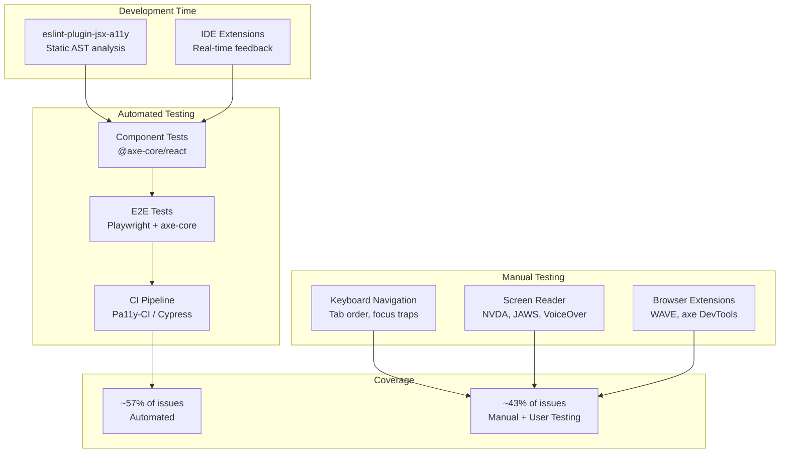

# Accessibility Testing and Tooling Workflow

A practical workflow for automated and manual accessibility testing, covering tool selection, CI/CD integration, and testing strategies. Automated testing catches approximately 57% of accessibility issues (Deque, 2021)—the remaining 43% requires keyboard navigation testing, screen reader verification, and subjective judgment about content quality. This guide covers how to build a testing strategy that maximizes automated coverage while establishing the manual testing practices that no tool can replace.

<figure>



<figcaption>Accessibility testing workflow: automated tools catch structural issues early; manual testing catches semantic and experiential issues that require human judgment</figcaption>

</figure>

## Abstract

Accessibility testing requires a layered approach because different issue categories require different detection methods:

| Testing Layer                                 | What It Catches                                                     | Coverage                           |
| --------------------------------------------- | ------------------------------------------------------------------- | ---------------------------------- |
| **Static analysis** (eslint-plugin-jsx-a11y)  | Missing alt attributes, invalid ARIA, semantic violations in JSX    | ~15% of criteria, development-time |
| **Runtime automation** (axe-core, Pa11y)      | Contrast ratios, duplicate IDs, missing labels, ARIA state validity | ~35% of WCAG criteria reliably     |
| **Manual testing** (keyboard, screen readers) | Focus order logic, content meaning, navigation consistency          | ~42% of criteria—non-automatable   |

**Why automation alone fails**: WCAG 2.2's 86 success criteria include subjective requirements—whether alt text _accurately describes_ an image, whether error messages _provide helpful guidance_, whether focus order is _logically intuitive_. Tools can detect presence of alt text but cannot evaluate its correctness.

**Tool selection principle**: axe-core dominates because of its conservative rule engineering (minimizes false positives), making it safe for CI/CD gates. Pa11y adds HTML CodeSniffer's distinct rule set for broader coverage. WAVE and Lighthouse serve quick audits but lack the rigor for compliance verification.

**Testing workflow design**:

1. **Shift-left**: eslint-plugin-jsx-a11y catches issues in IDE before code commits
2. **Component/E2E**: axe-core integration in Playwright/Cypress catches runtime issues
3. **CI gates**: Pa11y-CI fails builds on critical violations
4. **Manual protocol**: Keyboard + screen reader testing before each release

## Automation Coverage: What Tools Actually Catch

The 57% figure from Deque's study (13,000+ pages, 300,000+ issues) measures issue _volume_, not criteria count. Some issue types (missing labels, contrast failures) occur frequently—automation catches these reliably. Other criteria (meaningful sequence, focus order) rarely produce automatable signals.

### WCAG Criteria by Automation Reliability

| Reliability | Criteria Count | Examples                                                  | Detection Confidence                                       |
| ----------- | -------------- | --------------------------------------------------------- | ---------------------------------------------------------- |
| **High**    | ~13%           | Color contrast ratios, duplicate IDs, missing form labels | Measurable technical requirements; minimal false positives |
| **Partial** | ~45%           | Heading hierarchy, link purpose, error identification     | Detect presence but not quality/correctness                |
| **None**    | ~42%           | Alt text accuracy, focus order logic, caption timing      | Require human judgment                                     |

**What "high reliability" means**: Contrast ratio calculations are objective—4.5:1 for normal text, 3:1 for large text per WCAG 1.4.3. Tools calculate this deterministically. "High reliability" criteria have clear pass/fail thresholds without subjective interpretation.

**What "partial" means**: A tool can verify a heading exists after content but cannot determine if the heading _accurately describes_ that content. It detects structural presence, not semantic correctness.

**What "none" means**: "Focus order preserves meaning and operability" (WCAG 2.4.3) requires understanding user intent and page purpose. No algorithm can determine if tab order is "logical" without understanding the content's meaning.

### Why axe-core's 57% Matters for CI/CD

axe-core's design philosophy prioritizes _zero false positives over maximum coverage_. From the axe-core documentation:

> "Axe-core is designed to report only issues we're confident are accessibility issues. We'd rather miss an issue than report a false positive."

This makes axe-core safe for CI/CD gates—builds won't fail for phantom issues. The trade-off: axe-core's "incomplete" results (issues needing human review) are often ignored in CI pipelines, missing partial-detection opportunities.

**Configuration for WCAG 2.2 AA compliance**:

```javascript title="axe-config.js"
const axeConfig = {
  runOnly: {
    type: "tag",
    values: ["wcag2a", "wcag2aa", "wcag21a", "wcag21aa", "wcag22aa"],
  },
  rules: {
    // Disable rules for known exceptions
    "color-contrast": { enabled: true },
    // Enable best-practices beyond WCAG
    region: { enabled: true },
  },
}
```

## Tool Deep Dive: axe-core Ecosystem

axe-core (v4.11.x as of January 2026) provides 70+ accessibility rules and powers most modern testing integrations. Understanding its architecture helps configure it effectively.

### Integration Options

**Playwright** (@axe-core/playwright) offers chainable configuration:

```javascript title="playwright-a11y.spec.js" collapse={1-3, 18-22}
import { test, expect } from "@playwright/test"
import AxeBuilder from "@axe-core/playwright"

test("checkout flow accessibility", async ({ page }) => {
  await page.goto("/checkout")

  const results = await new AxeBuilder({ page })
    .withTags(["wcag2a", "wcag2aa", "wcag22aa"])
    .exclude(".third-party-widget") // Known inaccessible embed
    .analyze()

  // Fail on violations, log incomplete for review
  expect(results.violations).toEqual([])
  if (results.incomplete.length > 0) {
    console.log("Manual review needed:", results.incomplete)
  }
})
```

**Cypress** (cypress-axe or Cypress Accessibility) provides `cy.checkA11y()`:

```javascript title="cypress-a11y.spec.js" collapse={1-6}
describe("Form Accessibility", () => {
  beforeEach(() => {
    cy.visit("/contact")
    cy.injectAxe()
  })

  it("form meets WCAG 2.2 AA", () => {
    cy.checkA11y(null, {
      runOnly: {
        type: "tag",
        values: ["wcag22aa"],
      },
    })
  })

  it("error states remain accessible", () => {
    cy.get("#email").type("invalid")
    cy.get("form").submit()
    cy.checkA11y() // Re-check after state change
  })
})
```

**React** (@axe-core/react) logs violations during development:

```javascript title="index.jsx" collapse={1-4}
import React from "react"
import ReactDOM from "react-dom/client"
import App from "./App"

if (process.env.NODE_ENV !== "production") {
  import("@axe-core/react").then((axe) => {
    axe.default(React, ReactDOM, 1000) // 1s debounce
  })
}

ReactDOM.createRoot(document.getElementById("root")).render(<App />)
```

### axe-core Results Structure

axe-core returns four result categories—understanding them prevents ignoring useful signals:

| Category         | Meaning                                | CI/CD Action          |
| ---------------- | -------------------------------------- | --------------------- |
| **violations**   | Definite failures                      | Fail build            |
| **passes**       | Definite passes                        | No action             |
| **incomplete**   | Potential issues needing human review  | Log for manual triage |
| **inapplicable** | Rules that don't apply to page content | No action             |

**Common mistake**: Ignoring `incomplete` results. These often flag issues like "review this image's alt text"—not automatable but important for manual testing queues.

## Tool Deep Dive: Pa11y and HTML CodeSniffer

Pa11y (v9.0.0, 2025) provides an alternative rule engine and excels at URL batch scanning. It uses HTML CodeSniffer (HTMLCS) by default but can run axe-core, or both simultaneously.

### Architectural Differences from axe-core

| Aspect              | Pa11y (HTMLCS)  | axe-core                         |
| ------------------- | --------------- | -------------------------------- |
| **Result model**    | Violations only | Violations + incomplete + passes |
| **Philosophy**      | Definite issues | Definite + potential issues      |
| **Rule count**      | ~70 checks      | 70+ rules                        |
| **False positives** | Moderate        | Very low (by design)             |

**Why use both**: HTMLCS and axe-core have different rule implementations. Running both (`runners: ['axe', 'htmlcs']`) catches ~35% of WCAG issues—more than either alone—because their rule sets partially overlap but cover different edge cases.

### Pa11y-CI for Pipeline Integration

Pa11y-CI (v4.0.0) is purpose-built for CI/CD. It fails pipelines on violations (unlike informational tools):

```json title=".pa11yci.json"
{
  "defaults": {
    "runners": ["axe", "htmlcs"],
    "standard": "WCAG2AA",
    "timeout": 30000,
    "wait": 1000
  },
  "urls": ["http://localhost:3000/", "http://localhost:3000/contact", "http://localhost:3000/checkout"]
}
```

```yaml title=".github/workflows/a11y.yml" collapse={1-15}
name: Accessibility
on: [push, pull_request]

jobs:
  a11y:
    runs-on: ubuntu-latest
    steps:
      - uses: actions/checkout@v4
      - uses: actions/setup-node@v4
        with:
          node-version: "22"
      - run: npm ci
      - run: npm run build
      - run: npm run preview &
      - run: npx wait-on http://localhost:4321

      - name: Pa11y CI
        run: npx pa11y-ci

      - name: Upload results
        if: failure()
        uses: actions/upload-artifact@v4
        with:
          name: pa11y-report
          path: pa11y-ci-results.json
```

**Edge case**: Pa11y requires the page to be fully rendered. Use `wait` to delay testing after JavaScript execution, or `actions` to interact with the page before scanning:

```json title=".pa11yci.json"
{
  "urls": [
    {
      "url": "http://localhost:3000/login",
      "actions": [
        "set field #email to test@example.com",
        "set field #password to password123",
        "click element #submit",
        "wait for element #dashboard to be visible"
      ]
    }
  ]
}
```

## Static Analysis: eslint-plugin-jsx-a11y

eslint-plugin-jsx-a11y performs static AST analysis of JSX—catching issues before runtime with zero performance impact. It's the first line of defense in a shift-left strategy.

### Rule Categories

The plugin provides ~30 rules across categories:

**Alternative text**: `alt-text`, `img-redundant-alt`
**ARIA validity**: `aria-props`, `aria-proptypes`, `aria-role`, `aria-unsupported-elements`
**Semantic HTML**: `anchor-has-content`, `anchor-is-valid`, `heading-has-content`
**Interaction**: `click-events-have-key-events`, `no-static-element-interactions`
**Labels**: `label-has-associated-control`

### Configuration

```json title=".eslintrc.json" collapse={1-5, 15-20}
{
  "extends": ["eslint:recommended", "plugin:react/recommended"],
  "plugins": ["jsx-a11y"],
  "extends": ["plugin:jsx-a11y/recommended"],
  "rules": {
    // Override specific rules
    "jsx-a11y/anchor-is-valid": [
      "error",
      {
        "components": ["Link"],
        "specialLink": ["to"]
      }
    ],
    // Allow onClick on divs with role="button"
    "jsx-a11y/no-static-element-interactions": [
      "error",
      {
        "allowExpressionValues": true,
        "handlers": ["onClick"]
      }
    ]
  }
}
```

### Limitations

Static analysis cannot detect:

- Runtime accessibility (focus management, live regions)
- Dynamic content quality (generated alt text accuracy)
- Component composition issues (label associations across components)
- Third-party component accessibility

**Design rationale**: eslint-plugin-jsx-a11y catches the "low-hanging fruit" that developers often miss during coding. It doesn't replace runtime testing—it prevents obvious issues from reaching that stage.

## Browser Extensions: WAVE and axe DevTools

Browser extensions serve manual testing workflows—they're interactive tools for developers, not CI/CD automation.

### WAVE

**Strengths**:

- Runs entirely client-side (safe for intranets, authenticated pages)
- Visual overlay shows issues in page context
- Explains issues for non-specialists

**Limitations**:

- Manual page-by-page operation
- Higher false positive rate than axe-core
- Cannot verify content quality (alt text accuracy)
- No CI/CD integration

**Use case**: Developer education and stakeholder communication. The visual overlay helps explain accessibility concepts to designers and PMs.

### axe DevTools

The browser extension version of axe-core provides:

- Same rule engine as automated tests
- Interactive issue exploration
- Guided remediation suggestions
- Export for tracking

**Use case**: Debugging specific issues found in automated tests. The extension's "Intelligent Guided Tests" walk through semi-automated checks for issues axe-core marks as "incomplete."

## Lighthouse Accessibility Audits

Lighthouse runs a _subset_ of axe-core rules (~25-30 of 70+). It's designed for quick health checks, not compliance verification.

### When Lighthouse Falls Short

| Lighthouse Reports    | axe-core Catches                    |
| --------------------- | ----------------------------------- |
| Basic contrast issues | All contrast permutations           |
| Missing form labels   | Label association edge cases        |
| Alt text presence     | Alt text in SVGs, custom components |
| Basic ARIA            | Complex ARIA widget patterns        |

**Practical guidance**: Run Lighthouse for quick feedback during development. Run axe-core in your test suite for compliance. Don't rely on a passing Lighthouse score for WCAG conformance.

## Manual Testing: The Non-Negotiable 43%

Approximately 42% of WCAG criteria cannot be automated because they require subjective judgment. These criteria determine whether content _works_ for users with disabilities, not just whether technical requirements are met.

### Keyboard Navigation Testing

No reliable automation exists for keyboard navigation quality. The test protocol:

**Navigation keys**:

- `Tab`: Forward through interactive elements
- `Shift+Tab`: Backward navigation
- `Enter`/`Space`: Activate buttons and links
- `Arrow keys`: Navigate within widgets (menus, tabs, autocomplete)
- `Escape`: Close modals and dropdowns

**What to verify**:

1. **All functionality accessible**: Every action achievable with mouse must work with keyboard
2. **Logical focus order**: Tab sequence follows visual layout (top-to-bottom, left-to-right in LTR languages)
3. **Visible focus indicators**: 2px minimum outline with offset (WCAG 2.4.7)
4. **No keyboard traps**: User can always Tab away from any element
5. **Focus management in modals**: Focus trapped inside, returned on close

**Common failure**: SPA route changes don't move focus. Users Tab through the old page's elements until reaching new content.

```javascript title="spa-focus.js"
// After route change, move focus to main content
function handleRouteChange() {
  const main = document.querySelector("main")
  main.setAttribute("tabindex", "-1")
  main.focus()
  // Remove tabindex after focus to prevent mouse focus outline
  main.addEventListener("blur", () => main.removeAttribute("tabindex"), { once: true })
}
```

### Screen Reader Testing

Screen readers reveal issues invisible to sighted testing: missing labels, illogical heading structure, inadequate live region announcements.

**Testing matrix** (minimum coverage):

| Platform  | Screen Reader | Usage Share | Priority            |
| --------- | ------------- | ----------- | ------------------- |
| Windows   | NVDA          | ~40%        | Required            |
| Windows   | JAWS          | ~30%        | Enterprise contexts |
| macOS/iOS | VoiceOver     | ~15%        | Apple users         |
| Android   | TalkBack      | ~10%        | Mobile users        |

**NVDA vs JAWS behavioral differences**:

- **NVDA** strictly follows DOM/accessibility tree—exposes missing labels, broken associations
- **JAWS** uses heuristics to infer missing information—masks some issues but improves real-world usability

Test with both when possible. NVDA catches structural problems; JAWS reveals whether heuristics compensate for your issues (they shouldn't be necessary).

**Testing protocol**:

1. Navigate entire page in reading mode (not just interactive elements)
2. Complete primary user flows (forms, checkout, search)
3. Verify dynamic content announces (live regions, error states)
4. Test error recovery (can user understand and fix input errors?)

### Content Quality Assessment

These criteria require human judgment—no automation possible:

**Alternative text** (1.1.1): Does alt text convey the image's _purpose_ in context? "Graph showing sales data" is technically present but useless. "Sales increased 25% from Q1 to Q3" conveys meaning.

**Meaningful sequence** (1.3.2): Does reading order make sense when CSS positioning is ignored? Screen readers follow DOM order, not visual order.

**Link purpose** (2.4.4): Can users understand link destinations? "Click here" provides no context; "Download annual report (PDF, 2.4MB)" does.

**Error suggestions** (3.3.3): Do error messages explain how to fix the problem? "Invalid input" fails; "Email must include @ symbol" succeeds.

## Bug Triage and Prioritization

Not all accessibility issues have equal impact. Prioritize by user impact and legal risk:

### Severity Framework

| Severity     | Definition                                  | Examples                                                                | Response         |
| ------------ | ------------------------------------------- | ----------------------------------------------------------------------- | ---------------- |
| **Critical** | Complete barrier—task cannot be completed   | No keyboard access to submit button, missing form labels, keyboard trap | Fix immediately  |
| **Serious**  | Major difficulty—task very hard to complete | Poor contrast, confusing focus order, missing error identification      | Fix this sprint  |
| **Moderate** | Inconvenience—task harder than necessary    | Redundant alt text, minor contrast issues, verbose labels               | Fix this quarter |
| **Minor**    | Best practice—not a barrier                 | Missing landmark roles, suboptimal heading levels                       | Backlog          |

### WCAG Level Mapping

| WCAG Level             | User Impact                                | Legal Risk                   |
| ---------------------- | ------------------------------------------ | ---------------------------- |
| **Level A failures**   | Complete barriers—AT cannot function       | High—baseline requirement    |
| **Level AA failures**  | Significant barriers—tasks very difficult  | High—legal compliance target |
| **Level AAA failures** | Maximum accessibility—specialized contexts | Low—not universally required |

### Issue Documentation Template

Track issues with sufficient context for developers:

```markdown
## Issue: Missing label on email input

**Severity**: Critical
**WCAG**: 1.3.1 Info and Relationships (Level A)
**Page**: /checkout
**Tool**: axe-core (violations[0])

### Description

Email input field has no programmatic label. Screen reader users cannot identify the field's purpose.

### Current markup

<input type="email" name="email" placeholder="Email">

### Recommended fix

<label for="checkout-email">Email address</label>
<input type="email" id="checkout-email" name="email">

### Verification

- [ ] axe-core passes
- [ ] NVDA announces "Email address, edit"
- [ ] Label visible and associated
```

## CI/CD Pipeline Architecture

Build a multi-stage pipeline that catches issues at appropriate development phases:

### Stage 1: Pre-commit (Development Time)

```json title="package.json"
{
  "lint-staged": {
    "*.{js,jsx,ts,tsx}": ["eslint --fix"]
  },
  "husky": {
    "hooks": {
      "pre-commit": "lint-staged"
    }
  }
}
```

eslint-plugin-jsx-a11y catches static violations before code enters the repository.

### Stage 2: Pull Request (Automated Testing)

```yaml title=".github/workflows/pr.yml" collapse={1-12}
name: PR Checks
on: pull_request

jobs:
  test:
    runs-on: ubuntu-latest
    steps:
      - uses: actions/checkout@v4
      - uses: actions/setup-node@v4
        with:
          node-version: "22"
      - run: npm ci

      - name: Lint (includes a11y rules)
        run: npm run lint

      - name: Unit + Component Tests (includes axe)
        run: npm test

      - name: E2E Tests (Playwright + axe-core)
        run: npx playwright test
```

### Stage 3: Pre-deploy (Full Audit)

```yaml title=".github/workflows/deploy.yml" collapse={1-18}
name: Deploy
on:
  push:
    branches: [main]

jobs:
  audit:
    runs-on: ubuntu-latest
    steps:
      - uses: actions/checkout@v4
      - uses: actions/setup-node@v4
        with:
          node-version: "22"
      - run: npm ci
      - run: npm run build
      - run: npm run preview &
      - run: npx wait-on http://localhost:4321

      - name: Pa11y-CI (dual runner)
        run: npx pa11y-ci

      - name: Lighthouse CI
        run: npx lhci autorun

  deploy:
    needs: audit
    runs-on: ubuntu-latest
    steps:
      - name: Deploy to production
        run: ./deploy.sh
```

### Quality Gates

Configure thresholds that prevent regressions:

```javascript title="lighthouserc.js"
module.exports = {
  ci: {
    assert: {
      assertions: {
        "categories:accessibility": ["error", { minScore: 0.9 }],
        // Specific audits
        "color-contrast": "error",
        "document-title": "error",
        "html-has-lang": "error",
        "meta-viewport": "error",
      },
    },
  },
}
```

**Pa11y threshold**:

```json title=".pa11yci.json"
{
  "defaults": {
    "threshold": 0
  }
}
```

A threshold of 0 fails on any violation. For legacy codebases, start with the current violation count and reduce over time:

```json
{
  "defaults": {
    "threshold": 15
  }
}
```

## Conclusion

Accessibility testing requires defense in depth: static analysis catches syntax errors, runtime automation catches technical violations, and manual testing catches experiential issues. No single tool provides complete coverage because ~42% of WCAG criteria require human judgment.

Build your pipeline around this reality:

1. **Shift-left with eslint-plugin-jsx-a11y**—catch obvious issues at development time
2. **Gate PRs with axe-core in Playwright/Cypress**—prevent regressions from merging
3. **Audit with Pa11y-CI pre-deploy**—dual-runner coverage catches more edge cases
4. **Manual test before releases**—keyboard and screen reader testing are non-negotiable

The 57% automated coverage is a floor, not a ceiling. With disciplined manual testing, you can catch 80-90% of issues before users encounter them. The remaining 10-20% requires user testing with people who actually use assistive technology—but that's a topic for another article.

## Appendix

### Prerequisites

- Familiarity with WCAG 2.2 success criteria structure (see WCAG 2.2 Practical Guide)
- Experience with JavaScript testing frameworks (Jest, Playwright, or Cypress)
- Basic understanding of assistive technology categories (screen readers, switch devices, voice control)
- CI/CD pipeline concepts (GitHub Actions, GitLab CI, or similar)

### Terminology

- **axe-core**: Open-source accessibility testing engine by Deque, used by most modern testing integrations
- **HTML CodeSniffer (HTMLCS)**: Alternative accessibility rule engine used by Pa11y by default
- **AST (Abstract Syntax Tree)**: Code representation that eslint-plugin-jsx-a11y analyzes for static violations
- **incomplete results**: axe-core's category for issues requiring human review—not definite violations but potential problems
- **shift-left**: Moving quality checks earlier in the development process (from deployment to development time)
- **quality gate**: Automated check that prevents code progression (merge, deploy) if criteria aren't met

### Summary

- **Automated testing catches ~57% of accessibility issues**—measured by issue volume, not criteria count
- **~42% of WCAG criteria require human judgment** for content quality, focus order logic, and user experience
- **axe-core dominates** because its conservative rule engineering minimizes false positives, making it safe for CI/CD gates
- **Pa11y with dual runners** (axe + HTMLCS) catches more edge cases than either engine alone
- **eslint-plugin-jsx-a11y** provides shift-left coverage for JSX codebases—zero runtime cost
- **Manual testing is non-negotiable**: keyboard navigation and screen reader testing cannot be automated effectively
- **Screen reader testing** should use NVDA (catches structural issues) and JAWS (reveals heuristic compensation) when possible
- **Issue triage** should prioritize by user impact (complete barrier vs. inconvenience) and WCAG level (A/AA violations first)

### References

**Specifications**

- [WCAG 2.2 W3C Recommendation](https://www.w3.org/TR/WCAG22/) - Normative success criteria
- [Understanding WCAG 2.2](https://www.w3.org/WAI/WCAG22/Understanding/) - Techniques and intent for each criterion
- [W3C ACT Rules](https://www.w3.org/WAI/standards-guidelines/act/rules/) - Accessibility Conformance Testing rule format

**Official Documentation**

- [axe-core GitHub](https://github.com/dequelabs/axe-core) - Source code and API documentation
- [axe-core Rule Descriptions](https://dequeuniversity.com/rules/axe/html) - Detailed explanation of each rule
- [Pa11y Documentation](https://pa11y.org/) - CLI and CI tool usage
- [Pa11y-CI GitHub](https://github.com/pa11y/pa11y-ci) - CI integration configuration
- [eslint-plugin-jsx-a11y GitHub](https://github.com/jsx-eslint/eslint-plugin-jsx-a11y) - Static analysis rules
- [Playwright Accessibility Testing](https://playwright.dev/docs/accessibility-testing) - @axe-core/playwright integration
- [Cypress Accessibility](https://docs.cypress.io/accessibility/get-started/introduction) - cypress-axe and Cypress Accessibility

**Research and Analysis**

- [Deque: Automated Testing Identifies 57% of Issues](https://www.deque.com/blog/automated-testing-study-identifies-57-percent-of-digital-accessibility-issues/) - Methodology and findings
- [Accessible.org: What Percentage of WCAG Can Be Automated?](https://accessible.org/automated-scans-wcag/) - Criteria-level analysis
- [WebAIM Million](https://webaim.org/projects/million/) - Annual analysis of homepage accessibility

**Tools**

- [axe DevTools Browser Extension](https://www.deque.com/axe/devtools/) - Interactive testing
- [WAVE Evaluation Tool](https://wave.webaim.org/) - Browser extension for manual testing
- [NVDA Screen Reader](https://www.nvaccess.org/) - Free Windows screen reader
- [JAWS Screen Reader](https://www.freedomscientific.com/products/software/jaws/) - Commercial Windows screen reader
