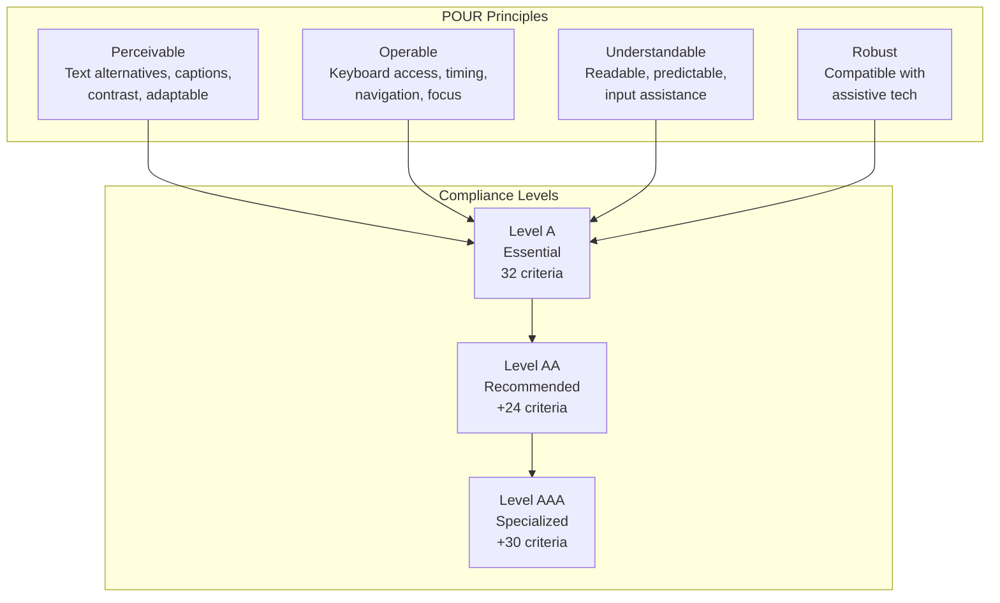

# WCAG 2.2: Practical Accessibility Guide

Web Content Accessibility Guidelines (WCAG) 2.2 became a W3C Recommendation in October 2023, adding 9 new success criteria focused on cognitive accessibility, mobile interaction, and focus visibility. This guide covers implementation strategies for semantic HTML, ARIA patterns, and testing methodologies—practical knowledge for building inclusive web experiences that meet legal requirements in the US (ADA) and EU (European Accessibility Act).

<figure>



<figcaption>WCAG 2.2 structure: POUR principles map to hierarchical compliance levels totaling 86 success criteria</figcaption>

</figure>

## Abstract

WCAG 2.2 builds on the POUR framework (Perceivable, Operable, Understandable, Robust) with three compliance tiers:

| Level   | Criteria       | Purpose                                                              | Legal Status                           |
| ------- | -------------- | -------------------------------------------------------------------- | -------------------------------------- |
| **A**   | 32             | Minimum barrier removal—assistive tech cannot function without these | Baseline, rarely sufficient alone      |
| **AA**  | +24 (56 total) | Balance of impact vs. implementation cost                            | Required by ADA, EU accessibility laws |
| **AAA** | +30 (86 total) | Maximum accessibility; not universally achievable                    | Specialized contexts only              |

**What's new in WCAG 2.2** (9 criteria added, 1 removed):

- **Cognitive accessibility**: Redundant Entry (A), Accessible Authentication (AA/AAA), Consistent Help (A)—no memory tests, no duplicate data entry
- **Motor accessibility**: Target Size Minimum 24×24px (AA), Dragging Movements alternatives (AA)
- **Focus visibility**: Focus Not Obscured (AA/AAA), Focus Appearance (AAA)—sticky headers can't hide focused elements
- **Removed**: 4.1.1 Parsing—browsers now handle HTML robustly; assistive tech no longer parses markup directly

**Implementation priorities**:

1. Semantic HTML provides 80% of accessibility for free—landmarks, headings, native form controls
2. ARIA supplements native semantics for custom widgets—roles, states, and live regions
3. Automated testing catches ~57% of individual issues but only ~35% of WCAG criteria; manual testing is non-negotiable
4. Focus management in SPAs and modals is the most common source of accessibility regressions

## Understanding WCAG 2.2

WCAG 2.2, published October 2023 (with minor definition updates in December 2024), contains 86 success criteria across three conformance levels. Each level is cumulative—AA includes all of A, AAA includes all of AA.

**Level A (32 criteria)** establishes minimum viability. Without these, assistive technologies cannot navigate or operate the interface. Failures at this level are complete barriers—a missing form label makes a field unusable for screen reader users, not merely inconvenient.

**Level AA (24 additional, 56 total)** balances impact against implementation cost. This is the legal target: ADA Title II requires WCAG 2.1 AA by 2026 for state/local government; the European Accessibility Act (enforced June 2025) mandates AA for businesses serving EU customers. Courts consistently use AA as the de facto standard for private sector litigation.

**Level AAA (30 additional, 86 total)** represents maximum accessibility but is intentionally not a blanket requirement. Some content fundamentally cannot meet certain AAA criteria—a sign language video cannot have a sign language interpretation, and some pages legitimately require reading comprehension above lower secondary education level.

> **WCAG 2.1 → 2.2 Migration:** If you're already AA-compliant with WCAG 2.1, you need to address 6 new criteria: Focus Not Obscured (2.4.11), Dragging Movements (2.5.7), Target Size Minimum (2.5.8), Consistent Help (3.2.6), Redundant Entry (3.3.7), and Accessible Authentication (3.3.8).

## What's New in WCAG 2.2

WCAG 2.2 added 9 success criteria and removed 1. The additions target three gaps: cognitive disabilities (underserved in 2.0/2.1), mobile/touch interactions, and focus visibility.

### New Level A Criteria

**3.2.6 Consistent Help** requires help mechanisms (contact info, chat, self-help) to appear in the same relative location across pages. Users with cognitive disabilities rely on spatial consistency to find help without searching.

```html
<!-- Help in consistent footer position across all pages -->
<footer>
  <nav aria-label="Help">
    <a href="/contact">Contact Us</a>
    <a href="/faq">FAQ</a>
    <button id="chat-toggle">Chat Support</button>
  </nav>
</footer>
```

**3.3.7 Redundant Entry** prohibits asking users to re-enter information they've already provided in the same session, unless re-entry is essential (security confirmation) or the previous value is no longer valid. Auto-population or selection from previous entries satisfies this.

```html
<!-- Shipping address auto-fills billing if same -->
<fieldset>
  <legend>Billing Address</legend>
  <label>
    <input type="checkbox" id="same-as-shipping" checked />
    Same as shipping address
  </label>
  <!-- Fields auto-populate when checked -->
</fieldset>
```

### New Level AA Criteria

**2.4.11 Focus Not Obscured (Minimum)** ensures focused elements aren't entirely hidden by sticky headers, footers, or overlays. Partial obscuring is permitted at AA; full visibility requires AAA (2.4.12).

```css
/* Ensure focused content isn't hidden by sticky header */
:focus {
  scroll-margin-top: 80px; /* Height of sticky header + padding */
}

/* Or use scroll-padding on the scroll container */
html {
  scroll-padding-top: 80px;
}
```

**2.5.7 Dragging Movements** requires a single-pointer alternative for any drag operation. Users with motor impairments may not be able to maintain pressure while moving.

```html
<!-- Drag-to-reorder list with button alternatives -->
<li draggable="true">
  <span>Item 1</span>
  <button aria-label="Move Item 1 up" onclick="moveUp(this)">↑</button>
  <button aria-label="Move Item 1 down" onclick="moveDown(this)">↓</button>
</li>
```

**2.5.8 Target Size (Minimum)** requires 24×24 CSS pixel minimum for pointer targets, with exceptions:

| Exception      | Description                                                                                           |
| -------------- | ----------------------------------------------------------------------------------------------------- |
| **Spacing**    | Undersized target passes if 24px diameter circles centered on each target don't overlap other targets |
| **Equivalent** | Another control on the same page meets the requirement                                                |
| **Inline**     | Text links within paragraphs are exempt                                                               |
| **User agent** | Browser-rendered controls (e.g., date picker calendar)                                                |
| **Essential**  | Size is legally required or information would be lost (maps)                                          |

```css
/* Minimum touch target with spacing exception fallback */
.icon-button {
  min-width: 24px;
  min-height: 24px;
  padding: 12px; /* Increases clickable area */
}

/* If 24px isn't achievable, ensure 24px spacing */
.small-button {
  min-width: 20px;
  min-height: 20px;
  margin: 4px; /* Creates 24px circle clearance */
}
```

**3.3.8 Accessible Authentication (Minimum)** prohibits cognitive function tests (memory, transcription, puzzle-solving) as the sole authentication method. Alternatives must exist:

- Copy-paste enabled for passwords (no blocking paste)
- Password managers can auto-fill
- OAuth/SSO (delegated authentication)
- Biometrics or hardware tokens
- Email/SMS codes (but not CAPTCHA that requires transcription)

```html
<!-- Accessible login with password manager support -->
<form>
  <label for="email">Email</label>
  <input type="email" id="email" autocomplete="username" />

  <label for="password">Password</label>
  <input type="password" id="password" autocomplete="current-password" />

  <!-- Alternative: passwordless -->
  <button type="button" onclick="sendMagicLink()">Email me a login link</button>
</form>
```

### New Level AAA Criteria

- **2.4.12 Focus Not Obscured (Enhanced)**: No part of focused element obscured (stricter than 2.4.11)
- **2.4.13 Focus Appearance**: Minimum 2px perimeter, 3:1 contrast between focused/unfocused states
- **3.3.9 Accessible Authentication (Enhanced)**: No object recognition or personal content identification

### Removed: 4.1.1 Parsing

WCAG 2.2 removed 4.1.1 Parsing because modern assistive technologies no longer parse HTML directly—they rely on browser accessibility APIs. Browsers now handle malformed HTML robustly, and issues that would have failed 4.1.1 (duplicate IDs, improper nesting) cause failures in other criteria (4.1.2 Name, Role, Value) when they actually impact users.

> **Migration note:** If your test suite checks 4.1.1, don't simply remove those tests. Duplicate IDs still fail 4.1.2 when they break accessible names. The change acknowledges that 4.1.1 was testing a mechanism (HTML validity) rather than an outcome (AT compatibility).

## The POUR Principles

WCAG organizes all 86 success criteria under four principles. Understanding which principle a criterion belongs to clarifies what breaks when it fails.

| Principle          | What Fails                                              | Typical Criteria                                                 |
| ------------------ | ------------------------------------------------------- | ---------------------------------------------------------------- |
| **Perceivable**    | Content cannot be perceived through any available sense | Text alternatives, captions, contrast, adaptable presentation    |
| **Operable**       | Users cannot interact with the interface                | Keyboard access, sufficient time, seizure prevention, navigation |
| **Understandable** | Users cannot comprehend content or predict behavior     | Readable text, predictable operation, input assistance           |
| **Robust**         | Assistive technologies cannot interpret content         | Valid markup, name/role/value, status messages                   |

**Perceivable** failures create absolute barriers for specific disabilities—a missing `alt` attribute means blind users receive nothing. **Operable** failures often affect multiple groups: keyboard traps block keyboard-only users, motor-impaired users, and many screen reader users.

**Understandable** criteria address cognitive accessibility, the focus of WCAG 2.2's additions. Cognitive disabilities affect ~15% of the population—more than any other disability category—yet were underserved in earlier WCAG versions.

**Robust** ensures AT compatibility. With 4.1.1 Parsing removed, the remaining Robust criteria focus on what browsers expose to the accessibility tree (4.1.2 Name, Role, Value) and how updates are communicated (4.1.3 Status Messages).

## Semantic HTML Implementation

Semantic HTML provides most accessibility automatically. Native elements expose roles, states, and keyboard behavior to assistive technologies without JavaScript.

### Landmarks and Structure

```html
<header>
  <nav aria-label="Main navigation">
    <ul>
      <li><a href="#main">Skip to main content</a></li>
      <li><a href="/home">Home</a></li>
      <li><a href="/about">About</a></li>
    </ul>
  </nav>
</header>

<main id="main">
  <article>
    <h1>Page Title</h1>
    <section>
      <h2>Section Heading</h2>
      <p>Content goes here...</p>
    </section>
  </article>
</main>

<aside>
  <h2>Related Information</h2>
</aside>

<footer>
  <p>&copy; 2024 Your Website</p>
</footer>
```

**Heading Hierarchy**
Implement a logical heading structure without skipping levels:

```html
<h1>Main Page Title</h1>
<h2>Major Section</h2>
<h3>Subsection</h3>
<h3>Another Subsection</h3>
<h2>Another Major Section</h2>
<h3>Subsection</h3>
```

**Language Declaration**
Always specify the document language and mark language changes:

```html
<html lang="en">
  <head>
    <title>English Page</title>
  </head>
  <body>
    <p>This is English text.</p>
    <p lang="es">Este texto está en español.</p>
  </body>
</html>
```

### Forms and Input Elements

Forms are critical interaction points that require careful accessibility implementation:

**Proper Labeling**
Every form control must have an accessible label:

```html
<!-- Explicit labeling (preferred) -->
<label for="email">Email Address (required)</label>
<input type="email" id="email" name="email" required aria-describedby="email-error" />

<!-- Implicit labeling -->
<label>
  Password
  <input type="password" name="password" required />
</label>

<!-- Using aria-label when visual label isn't desired -->
<input type="search" name="search" aria-label="Search products" placeholder="Search..." />
```

**Grouping Related Controls**
Use fieldset and legend for radio buttons and checkboxes:

```html
<fieldset>
  <legend>Preferred Contact Method</legend>
  <input type="radio" id="email" name="contact" value="email" />
  <label for="email">Email</label>

  <input type="radio" id="phone" name="contact" value="phone" />
  <label for="phone">Phone</label>

  <input type="radio" id="mail" name="contact" value="mail" />
  <label for="mail">Mail</label>
</fieldset>
```

**Error Handling and Validation**
Provide clear, helpful error messages:

```html
<label for="username">Username (required)</label>
<input type="text" id="username" name="username" required aria-describedby="username-error" aria-invalid="true" />
<div id="username-error" role="alert">Username is required and must be at least 3 characters long.</div>
```

**Instructions and Help Text**
Use aria-describedby to associate help text with form controls:

```html
<label for="password">Password</label>
<input type="password" id="password" name="password" aria-describedby="password-help" required />
<div id="password-help">Password must be at least 8 characters long and contain at least one number.</div>
```

### Images and Media

**Alternative Text for Images**
Provide meaningful alt text that serves the same purpose as the image:

```html
<!-- Informative image -->


<!-- Decorative image -->


<!-- Functional image (button) -->
<button type="submit">
  
</button>

<!-- Complex image with longer description -->

<div id="chart-desc">
  Detailed description: Sales data shows Q1 at $100k, Q2 at $150k, Q3 at $175k, and Q4 at $200k, representing steady
  growth throughout the year.
</div>
```

**Video and Audio Accessibility**
Multimedia content requires multiple accessibility features:

```html
<!-- Video with captions and audio description -->
<video controls>
  <source src="training-video.mp4" type="video/mp4" />
  <track kind="captions" src="captions.vtt" srclang="en" label="English captions" />
  <track kind="descriptions" src="descriptions.vtt" srclang="en" label="Audio descriptions" />
  <p>Your browser doesn't support video. <a href="transcript.html">Read the transcript</a></p>
</video>

<!-- Audio-only content -->
<audio controls>
  <source src="podcast.mp3" type="audio/mpeg" />
  <p>Your browser doesn't support audio. <a href="transcript.html">Read the transcript</a></p>
</audio>
<p><a href="podcast-transcript.txt">Download transcript</a></p>
```

### Interactive Elements and Custom Components

**Buttons and Links**
Ensure interactive elements have clear purposes and are keyboard accessible:

```html
<!-- Descriptive button text -->
<button type="submit">Submit Contact Form</button>

<!-- Button with icon needs accessible text -->
<button type="button" aria-label="Close dialog">
  <svg aria-hidden="true">...</svg>
</button>

<!-- Link with clear destination -->
<a href="/products/laptops">View all laptop models</a>

<!-- Link opening new window/tab -->
<a href="/terms.pdf" target="_blank"> Terms of Service <span class="sr-only">(opens in new tab)</span> </a>
```

**Custom Interactive Components**
When creating custom widgets, use ARIA roles, properties, and states:

```html
<!-- Custom dropdown menu -->
<div class="dropdown">
  <button aria-haspopup="true" aria-expanded="false" id="menu-button">Options</button>
  <ul role="menu" aria-labelledby="menu-button" hidden>
    <li role="menuitem"><a href="/option1">Option 1</a></li>
    <li role="menuitem"><a href="/option2">Option 2</a></li>
    <li role="menuitem"><a href="/option3">Option 3</a></li>
  </ul>
</div>

<!-- Custom tab interface -->
<div role="tablist" aria-label="Content sections">
  <button role="tab" aria-selected="true" aria-controls="panel1" id="tab1">Section 1</button>
  <button role="tab" aria-selected="false" aria-controls="panel2" id="tab2">Section 2</button>
</div>

<div role="tabpanel" id="panel1" aria-labelledby="tab1">
  <h2>Section 1 Content</h2>
  <p>Content for the first section...</p>
</div>

<div role="tabpanel" id="panel2" aria-labelledby="tab2" hidden>
  <h2>Section 2 Content</h2>
  <p>Content for the second section...</p>
</div>
```

### Color and Visual Design

**Color Contrast Requirements**
Ensure sufficient contrast ratios for all text and UI components:

- **Normal text**: Minimum 4.5:1 contrast ratio (WCAG AA)
- **Large text** (18pt+ or 14pt+ bold): Minimum 3:1 contrast ratio
- **UI components**: Minimum 3:1 contrast ratio for borders, icons, and focus indicators

**Color-Independent Information**
Never rely solely on color to convey information:

```html
<!-- Bad: Only color indicates required field -->
<label style="color: red;">Email</label>
<input type="email" name="email" />

<!-- Good: Color plus text/symbol indicator -->
<label>Email <span class="required" aria-label="required">*</span></label>
<input type="email" name="email" required />

<!-- Good: Error states with multiple indicators -->
<label for="email">Email</label>
<input type="email" id="email" name="email" aria-invalid="true" class="error" aria-describedby="email-error" />
<div id="email-error" class="error-message" role="alert">⚠️ Please enter a valid email address</div>
```

### Keyboard Navigation and Focus Management

**Focus Indicators**
Provide clear, visible focus indicators for all interactive elements:

```css
/* Ensure focus indicators are visible */
button:focus,
input:focus,
select:focus,
textarea:focus,
a:focus {
  outline: 2px solid #005fcc;
  outline-offset: 2px;
}

/* Custom focus styles that meet contrast requirements */
.custom-button:focus {
  box-shadow: 0 0 0 3px rgba(0, 95, 204, 0.5);
  outline: 2px solid #005fcc;
}
```

**Focus Trapping**

Modals must trap focus—users shouldn't be able to Tab out of the modal to content behind it. The pattern: track first/last focusable elements, intercept Tab at boundaries.

```javascript title="focus-trap.js" collapse={1-3, 14-18}
function trapFocus(element) {
  const focusable = element.querySelectorAll('button, [href], input, select, textarea, [tabindex]:not([tabindex="-1"])')
  const first = focusable[0]
  const last = focusable[focusable.length - 1]

  element.addEventListener("keydown", (e) => {
    if (e.key !== "Tab") return
    if (e.shiftKey && document.activeElement === first) {
      last.focus()
      e.preventDefault()
    } else if (!e.shiftKey && document.activeElement === last) {
      first.focus()
      e.preventDefault()
    }
  })
}
```

### Dynamic Content and SPAs

SPAs and dynamic content require explicit accessibility management that static pages handle automatically.

**Live Regions** announce changes to screen readers without moving focus:

```html
<!-- polite: announced when user is idle; assertive: immediate interruption -->
<div id="status" role="status" aria-live="polite"></div>
<div id="alerts" role="alert" aria-live="assertive"></div>
```

**SPA Route Changes** must update document title and move focus:

```javascript title="spa-navigation.js" collapse={1-2}
function navigateToPage(pageContent, pageTitle) {
  document.getElementById("main-content").innerHTML = pageContent
  document.title = pageTitle

  // Move focus to main content, not page top
  const main = document.getElementById("main-content")
  main.setAttribute("tabindex", "-1")
  main.focus()
}
```

**Modal Focus** requires: (1) trap focus inside, (2) return focus on close.

```javascript title="modal-focus.js" collapse={1-2, 9-13}
function openModal(modal) {
  const previousFocus = document.activeElement

  modal.removeAttribute("hidden")
  modal.querySelector("button, [href], input")?.focus()
  trapFocus(modal)

  modal.addEventListener("close", () => previousFocus.focus(), { once: true })
}
```

## Testing Strategies

Automated tools detect ~57% of individual accessibility issues (Deque 2024 study across 13,000+ pages) but only ~35% of WCAG success criteria are fully automatable. The remaining issues require manual testing—there's no shortcut.

### Automated Testing Coverage

| What Automation Catches                  | What Requires Manual Testing     |
| ---------------------------------------- | -------------------------------- |
| Missing alt text (presence, not quality) | Alt text accuracy and context    |
| Color contrast ratios                    | Color-only information conveying |
| Missing form labels                      | Label clarity and helpfulness    |
| Duplicate IDs                            | Logical reading order            |
| ARIA attribute validity                  | ARIA usage correctness           |
| Heading structure                        | Content organization             |

Contrast issues alone account for ~30% of detected issues—highly automatable but only part of the picture.

### Tool Selection

**axe-core** powers most accessibility testing. Use `@axe-core/playwright` or `cypress-axe` for CI integration. Configure for WCAG 2.2 AA:

```javascript title="playwright.config.js" collapse={1-5}
// Configure axe for WCAG 2.2 AA
const axeConfig = {
  runOnly: {
    type: "tag",
    values: ["wcag2a", "wcag2aa", "wcag21a", "wcag21aa", "wcag22aa"],
  },
}
```

**Pa11y** for CLI/CI pipelines—respects `robots.txt` and handles JavaScript-rendered content.

**Lighthouse** provides quick audits but uses a subset of axe-core rules. Use for initial scans, not compliance verification.

### Screen Reader Testing

Test with at least one screen reader per platform your users access:

| Platform  | Screen Reader | Market Share | Notes                                      |
| --------- | ------------- | ------------ | ------------------------------------------ |
| Windows   | NVDA          | ~40%         | Free, open-source, most common for testing |
| Windows   | JAWS          | ~30%         | Commercial, enterprise standard            |
| macOS/iOS | VoiceOver     | ~15%         | Built-in, required for Apple ecosystem     |
| Android   | TalkBack      | ~10%         | Built-in, required for Android             |

Focus testing on: navigation flow, form completion, dynamic content updates, and error recovery.

## CI/CD Integration for Automated Accessibility Testing

Integrating accessibility testing into your continuous integration and deployment pipeline ensures that accessibility issues are caught early and consistently.

### Setting Up Automated Testing in CI/CD

**GitHub Actions Example**:

```yaml title=".github/workflows/accessibility.yml" collapse={1-22}
name: Accessibility Testing
on: [push, pull_request]

jobs:
  accessibility-test:
    runs-on: ubuntu-latest
    steps:
      - uses: actions/checkout@v2

      - name: Setup Node.js
        uses: actions/setup-node@v2
        with:
          node-version: "16"

      - name: Install dependencies
        run: npm install

      - name: Build application
        run: npm run build

      - name: Start application
        run: npm start &

      - name: Wait for application to start
        run: sleep 30

      - name: Run Pa11y tests
        run: |
          npx pa11y-ci --sitemap http://localhost:3000/sitemap.xml

      - name: Run axe tests with Cypress
        run: npx cypress run --spec "cypress/integration/accessibility.spec.js"
```

**Cypress with axe-core**:

```javascript title="cypress/integration/accessibility.spec.js" collapse={1-6}
// cypress/integration/accessibility.spec.js
describe("Accessibility Tests", () => {
  beforeEach(() => {
    cy.visit("/")
    cy.injectAxe()
  })

  it("Has no accessibility violations on home page", () => {
    cy.checkA11y()
  })

  it("Has no accessibility violations on contact form", () => {
    cy.visit("/contact")
    cy.checkA11y()
  })

  it("Has no accessibility violations after form interaction", () => {
    cy.visit("/contact")
    cy.get("#name").type("Test User")
    cy.get("#email").type("test@example.com")
    cy.checkA11y()
  })
})
```

**Playwright with axe-core**:

```javascript title="tests/accessibility.spec.js" collapse={1-3}
const { test, expect } = require("@playwright/test")
const AxeBuilder = require("@axe-core/playwright")

test("Homepage accessibility", async ({ page }) => {
  await page.goto("/")

  const accessibilityScanResults = await new AxeBuilder({ page }).analyze()

  expect(accessibilityScanResults.violations).toEqual([])
})
```

### Quality Gates and Reporting

Implement accessibility quality gates that fail builds when critical issues are found:

```yaml
# .github/workflows/accessibility.yml
- name: Run accessibility tests
  run: |
    npx pa11y-ci --threshold 5 http://localhost:3000
  continue-on-error: false

- name: Generate accessibility report
  run: |
    npx pa11y-ci --reporter json > accessibility-report.json

- name: Upload accessibility report
  uses: actions/upload-artifact@v2
  with:
    name: accessibility-report
    path: accessibility-report.json
```

## Web Components and Shadow DOM

Shadow DOM creates accessibility challenges because ARIA attributes don't penetrate the shadow boundary and screen readers may not correctly associate labels across boundaries.

**Key patterns:**

```javascript title="web-component-a11y.js" collapse={1-8}
class AccessibleComponent extends HTMLElement {
  static get observedAttributes() {
    return ["aria-label", "aria-describedby"]
  }

  connectedCallback() {
    // Forward ARIA from host to shadow root element
    const button = this.shadowRoot.querySelector("button")
    for (const attr of AccessibleComponent.observedAttributes) {
      if (this.hasAttribute(attr)) {
        button.setAttribute(attr, this.getAttribute(attr))
      }
    }
  }

  attributeChangedCallback(name, oldVal, newVal) {
    // Keep shadow DOM in sync with host attributes
    this.shadowRoot?.querySelector("button")?.setAttribute(name, newVal)
  }
}
```

**Edge cases:**

- `aria-labelledby` and `aria-describedby` cannot reference IDs outside the shadow root
- Use `aria-label` instead, or expose a `<slot>` for labeling content
- Focus delegation with `delegatesFocus: true` in `attachShadow()` options

## Legal Requirements

Accessibility law has shifted from guidance to enforcement. Know your obligations.

### United States

**ADA Title II** (state/local government): DOJ's 2024 rule mandates WCAG 2.1 AA by April 2026 for entities with 50,000+ population, April 2027 for smaller entities.

**ADA Title III** (private sector): No explicit WCAG version in regulation, but courts consistently apply WCAG 2.1 AA as the standard. The "places of public accommodation" interpretation covers websites—Domino's v. Robles (2019) confirmed this.

**Section 508** (federal government): Still references WCAG 2.0 AA via the Revised 508 Standards (2017). Refresh expected but not yet scheduled.

### European Union

**European Accessibility Act (EAA)**: Enforced since June 28, 2025. Applies to businesses selling to EU customers regardless of where the business is located. Currently requires WCAG 2.1 AA via EN 301 549; update to include WCAG 2.2 in progress.

**Web Accessibility Directive**: Applies to public sector bodies. Required WCAG 2.1 AA since September 2020.

> **Practical note:** Target WCAG 2.2 AA even if current laws reference 2.1. The delta is 6 criteria, and demonstrating awareness of current standards strengthens legal defensibility.

## Appendix

### Prerequisites

- HTML5 semantic elements and document structure
- CSS layout and responsive design fundamentals
- JavaScript event handling and DOM manipulation
- Basic understanding of assistive technology categories (screen readers, switch devices, voice control)

### Summary

- **WCAG 2.2** contains 86 success criteria across three levels (A: 32, AA: +24, AAA: +30)
- **New in 2.2**: 9 criteria targeting cognitive accessibility, motor accessibility, and focus visibility; 4.1.1 Parsing removed
- **Legal compliance** requires WCAG 2.1 AA minimum (US ADA, EU EAA); target 2.2 AA for future-proofing
- **Automated testing** catches ~57% of individual issues but only ~35% of criteria; manual testing is mandatory
- **Semantic HTML** provides most accessibility automatically; ARIA supplements for custom widgets
- **Focus management** in SPAs and modals is the most common source of regressions

### Terminology

- **a11y**: Numeronym for "accessibility" (a + 11 letters + y)
- **AT**: Assistive Technology—software/hardware enabling people with disabilities to use computers
- **POUR**: Perceivable, Operable, Understandable, Robust—WCAG's organizing principles
- **ARIA**: Accessible Rich Internet Applications—W3C specification for enhancing HTML semantics
- **Live Region**: ARIA mechanism for announcing dynamic content changes to screen readers
- **Focus Trap**: Containing keyboard focus within a component (intentional in modals, a bug elsewhere)

### References

**Specifications (Primary)**

- [WCAG 2.2 W3C Recommendation](https://www.w3.org/TR/WCAG22/) - Normative requirements
- [Understanding WCAG 2.2](https://www.w3.org/WAI/WCAG22/Understanding/) - Intent and techniques for each criterion
- [What's New in WCAG 2.2](https://www.w3.org/WAI/standards-guidelines/wcag/new-in-22/) - W3C summary of changes
- [WAI-ARIA 1.2](https://www.w3.org/TR/wai-aria-1.2/) - ARIA specification
- [ARIA Authoring Practices Guide](https://www.w3.org/WAI/ARIA/apg/) - Component patterns and keyboard interaction

**Official Documentation**

- [MDN Accessibility Guide](https://developer.mozilla.org/en-US/docs/Web/Accessibility) - Browser implementation details
- [ADA.gov Web Accessibility Guidance](https://www.ada.gov/resources/web-guidance/) - DOJ official guidance
- [EN 301 549](https://www.etsi.org/deliver/etsi_en/301500_301599/301549/03.02.01_60/en_301549v030201p.pdf) - EU accessibility standard

**Testing Tools**

- [axe-core](https://github.com/dequelabs/axe-core) - Accessibility testing engine
- [Deque Automated Testing Coverage Report](https://www.deque.com/blog/automated-testing-study-identifies-57-percent-of-digital-accessibility-issues/) - Research on automation limits
- [DWP Accessibility Manual: Automated Testing](https://accessibility-manual.dwp.gov.uk/best-practice/automated-testing-using-axe-core-and-pa11y) - UK government testing guidance

**Legal**

- [DOJ ADA Title II Web Accessibility Rule (2024)](https://www.ada.gov/resources/2024-03-08-web-rule/) - Federal Register notice
- [European Accessibility Act](https://ec.europa.eu/social/main.jsp?catId=1202) - EU directive overview
