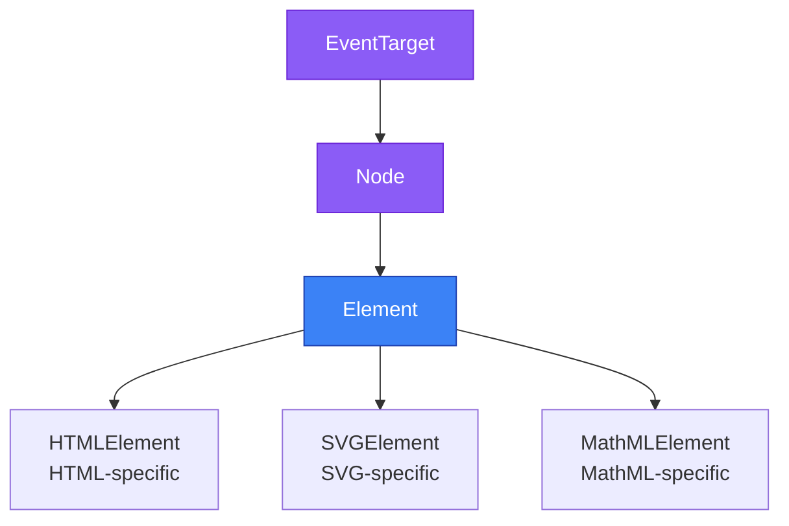
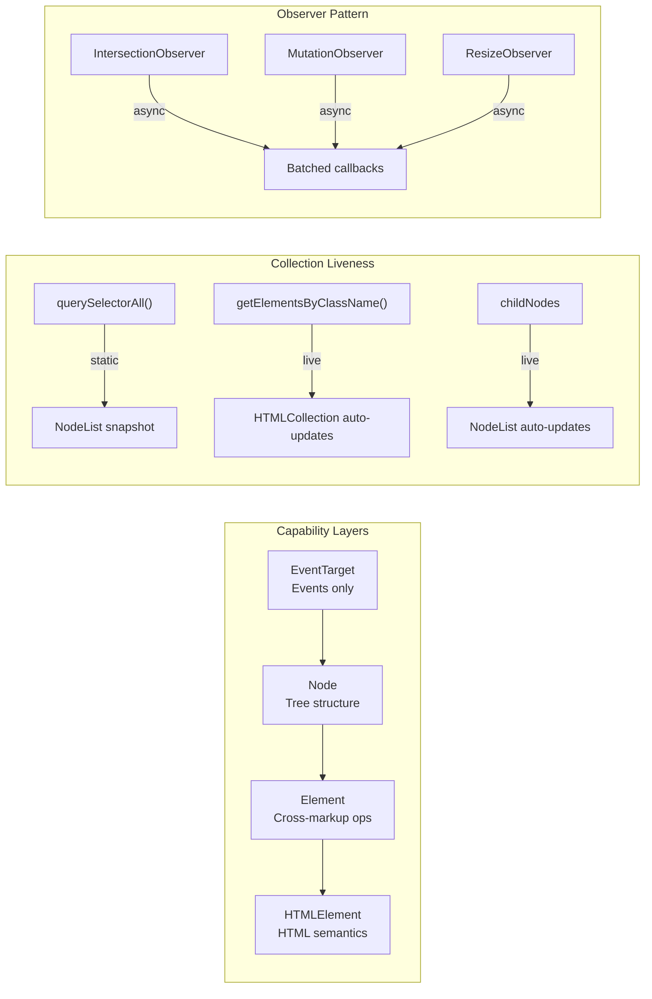
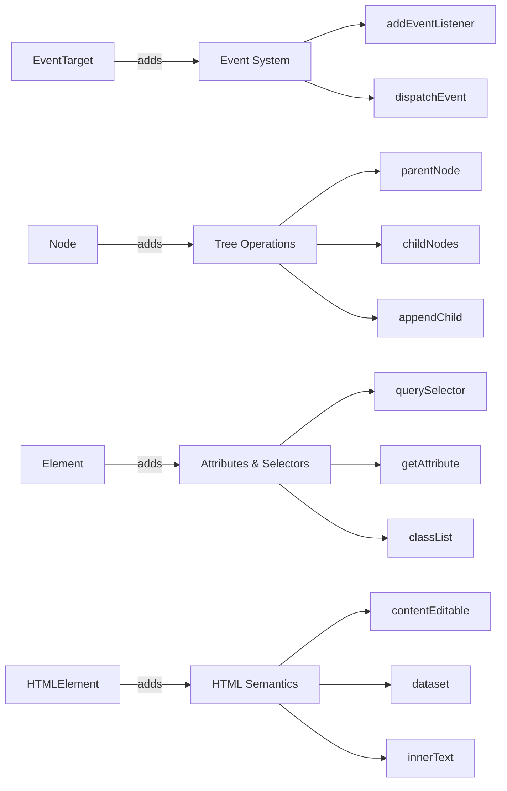
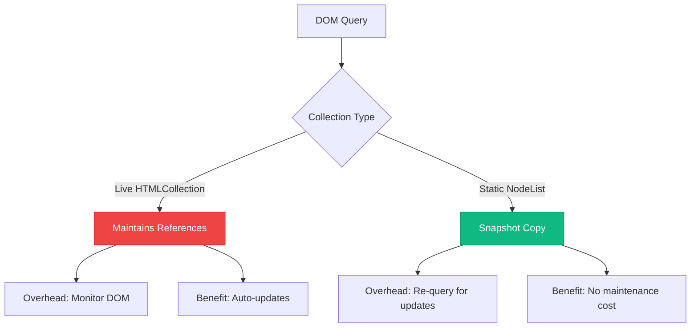
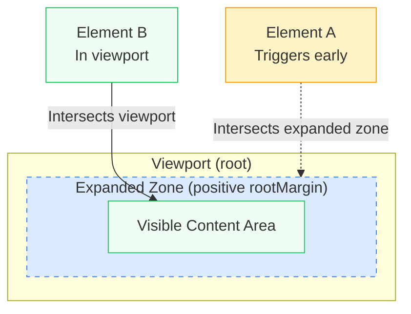
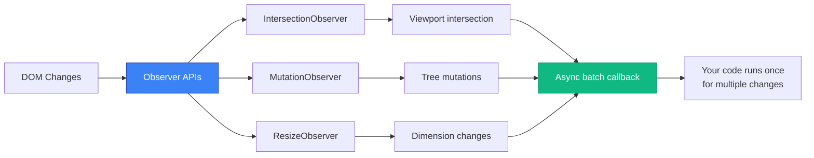

# DOM API Essentials: Structure, Traversal, and Mutation

A comprehensive exploration of DOM APIs, examining the interface hierarchy design decisions, selector return type differences, and the modern Observer pattern for efficient DOM monitoring. The [DOM Standard](https://dom.spec.whatwg.org/) (WHATWG Living Standard, last updated January 2026) defines a layered inheritance model where each interface adds specific capabilities while maintaining backward compatibility—understanding this design reveals why certain methods exist on `Element` rather than `HTMLElement` and why selector APIs return different collection types with distinct liveness semantics.

<figure>



<figcaption>DOM interface inheritance hierarchy showing Element as the universal base for all markup types</figcaption>

</figure>

## Abstract

The Document Object Model (DOM) API exposes document structure through a **layered interface hierarchy** designed for cross-markup compatibility. The core mental model:

<figure>



<figcaption>DOM APIs organize around three concerns: interface hierarchy for capability separation, collection types for liveness semantics, and Observer pattern for efficient change detection</figcaption>

</figure>

**Key design decisions:**

- **Element vs HTMLElement split**: Methods like `querySelector()` and `classList` live on Element (not HTMLElement) because they must work across HTML, SVG, and MathML—the hierarchy reflects cross-markup requirements, not implementation convenience
- **Live vs static collections**: `getElementsByClassName()` returns live HTMLCollection (auto-updates), while `querySelectorAll()` returns static NodeList (snapshot)—choose based on whether you need real-time tracking or one-time processing
- **Observer async batching**: All Observer APIs deliver notifications asynchronously in batches, enabling browser-internal optimizations impossible with synchronous event listeners

---

## The DOM Interface Hierarchy

The [DOM Standard](https://dom.spec.whatwg.org/) (WHATWG Living Standard) establishes a layered inheritance model where each interface adds capabilities while remaining backward compatible with its ancestors. The spec defines the DOM as "a platform-neutral model for events, aborting activities, and node trees."

### Why Element, Not HTMLElement?

Element serves as the universal base class for all markup languages because **DOM operations must work across different document types**. Consider these scenarios:

```typescript
// This SVG circle is an Element, but NOT an HTMLElement
const circle = document.querySelector("circle")
circle.setAttribute("r", "50") // Element method works
circle.classList.add("active") // Element method works

// HTMLElement methods would fail on SVG elements
// circle.contentEditable // undefined - this is HTML-specific
// circle.dataset         // undefined - this is HTML-specific
```

The browser's internal class hierarchy looks like this:

```
EventTarget (base for all event-capable objects)
    ↓
Node (tree participation)
    ↓
Element (universal element operations)
    ├── HTMLElement (HTML-specific: contentEditable, dataset, innerText)
    ├── SVGElement (SVG-specific: SVG DOM properties)
    └── MathMLElement (MathML-specific: mathematical markup)
```

**Design insight**: Methods defined on Element work for HTML, SVG, and MathML elements. Methods requiring HTML-specific semantics live on HTMLElement. This separation ensures `querySelector()`, `getAttribute()`, and `classList` function identically whether you're manipulating `<div>`, `<svg>`, or `<math>` elements.

### Interface Responsibilities

<figure>



<figcaption>Each interface layer adds specific capabilities while inheriting all parent functionality</figcaption>

</figure>

**[EventTarget](https://developer.mozilla.org/en-US/docs/Web/API/EventTarget)** (`EventTarget`)

- Event registration and dispatch
- Foundation for all interactive objects
- No DOM tree awareness

**[Node](https://developer.mozilla.org/en-US/docs/Web/API/Node)** (`Node extends EventTarget`)

- Tree structure participation
- Parent/child/sibling relationships
- Node types (element, text, comment, document)
- `parentNode`, `childNodes`, `firstChild`, `lastChild`
- `appendChild()`, `removeChild()`, `insertBefore()`

**[Element](https://developer.mozilla.org/en-US/docs/Web/API/Element)** (`Element extends Node`)

- Attribute management: `getAttribute()`, `setAttribute()`, `hasAttribute()`
- CSS selector queries: `querySelector()`, `querySelectorAll()`, `matches()`, `closest()`
- Class manipulation: `classList`, `className`
- Geometry: `getBoundingClientRect()`, `scrollIntoView()`
- Namespace-aware operations for XML-based documents
- Works for HTML, SVG, MathML, and other XML vocabularies

**[HTMLElement](https://developer.mozilla.org/en-US/docs/Web/API/HTMLElement)** (`HTMLElement extends Element`)

- HTML-specific content: `innerText`, `outerText`
- Editability: `contentEditable`, `isContentEditable`
- Data attributes: `dataset` (access to `data-*` attributes)
- Form interaction: `autofocus`, `tabIndex`, `hidden`
- Input hints: `inputMode`, `enterKeyHint`, `autocapitalize`
- Accessibility shortcuts: `accessKey`, `title`
- Internationalization: `lang`, `dir`, `translate`

### Practical Implications

The hierarchy determines method availability at compile and runtime:

```typescript
// TypeScript enforces hierarchy
const element: Element = document.querySelector("div")!
element.classList.add("active") // ✅ Element method
element.setAttribute("role", "tab") // ✅ Element method

// @ts-error: Property 'dataset' does not exist on type 'Element'
element.dataset.userId = "123" // ❌ HTMLElement-specific

// Type narrowing required
if (element instanceof HTMLElement) {
  element.dataset.userId = "123" // ✅ Now TypeScript knows it's HTMLElement
  element.contentEditable = "true" // ✅ HTML-specific property
}

// SVG elements demonstrate the distinction
const svg = document.querySelector("svg")!
svg.classList.add("icon") // ✅ Element method works
svg.setAttribute("viewBox", "0 0 100 100") // ✅ Element method works
// svg.innerText = 'text';           // ❌ Would fail - innerText is HTMLElement-specific
```

**Why this matters**: When writing reusable utilities that manipulate both HTML and SVG elements, typing parameters as `Element` rather than `HTMLElement` ensures compatibility across markup types.

---

## Selector APIs: HTMLCollection vs NodeList

DOM selector methods return two distinct collection types with different liveness characteristics and capabilities ([HTMLCollection vs NodeList](https://www.freecodecamp.org/news/dom-manipulation-htmlcollection-vs-nodelist/)).

### Return Type Matrix

| Method                     | Return Type    | Live/Static | Node Types                         |
| -------------------------- | -------------- | ----------- | ---------------------------------- |
| `querySelectorAll()`       | NodeList       | Static      | Elements only                      |
| `getElementsByClassName()` | HTMLCollection | Live        | Elements only                      |
| `getElementsByTagName()`   | HTMLCollection | Live        | Elements only                      |
| `getElementsByName()`      | NodeList       | **Live**    | Elements only (unusual exception)  |
| `childNodes`               | NodeList       | Live        | All nodes (text, comment, element) |
| `children`                 | HTMLCollection | Live        | Elements only                      |

### HTMLCollection: Live and Limited

[HTMLCollection](https://developer.mozilla.org/en-US/docs/Web/API/HTMLCollection) maintains active references to matching elements, automatically reflecting DOM changes:

```typescript
const container = document.getElementById("list")
const items = container.getElementsByClassName("item")

console.log(items.length) // 3

// Add a new element with class 'item'
const newItem = document.createElement("div")
newItem.className = "item"
container.appendChild(newItem)

console.log(items.length) // 4 - automatically updated!
```

**Liveness implications**:

```typescript
// ⚠️ Infinite loop: collection updates as you modify the DOM
const items = document.getElementsByClassName("item")
for (let i = 0; i < items.length; i++) {
  items[i].classList.remove("item") // Removes element from collection
  // Now items.length decreased, but i increased
  // You'll only process every other element
}

// ✅ Convert to array to capture snapshot
const itemsArray = Array.from(document.getElementsByClassName("item"))
for (const item of itemsArray) {
  item.classList.remove("item") // Safe: iterating over static array
}
```

**No array methods**:

```typescript
const items = document.getElementsByClassName("item")

// ❌ TypeError: items.forEach is not a function
items.forEach((item) => console.log(item))

// ✅ Convert to array first
Array.from(items).forEach((item) => console.log(item))

// ✅ Or use spread operator
;[...items].forEach((item) => console.log(item))

// ✅ Traditional for loop works
for (let i = 0; i < items.length; i++) {
  console.log(items[i])
}

// ✅ for...of works (HTMLCollection is iterable)
for (const item of items) {
  console.log(item)
}
```

### NodeList: Static Snapshot with forEach

[NodeList](https://developer.mozilla.org/en-US/docs/Web/API/NodeList) from `querySelectorAll()` captures document state at query time:

```typescript
const items = document.querySelectorAll(".item")
console.log(items.length) // 3

const newItem = document.createElement("div")
newItem.className = "item"
document.body.appendChild(newItem)

console.log(items.length) // Still 3 - NodeList doesn't update

// Must re-query to see new elements
const updatedItems = document.querySelectorAll(".item")
console.log(updatedItems.length) // 4
```

**forEach support**:

```typescript
const items = document.querySelectorAll(".item")

// ✅ NodeList has native forEach
items.forEach((item, index) => {
  item.dataset.index = String(index)
})

// ✅ Also supports for...of
for (const item of items) {
  console.log(item)
}

// ⚠️ But still not a real Array
items.map((item) => item.textContent) // ❌ TypeError: items.map is not a function

// ✅ Convert for full array methods
const texts = Array.from(items).map((item) => item.textContent)
```

**Exception: Live NodeList**:

The `childNodes` property returns a **live** NodeList. Additionally, `getElementsByName()` returns a live NodeList (not HTMLCollection)—an unusual API design exception:

```typescript
const parent = document.getElementById("container")
const children = parent.childNodes // Live NodeList

console.log(children.length) // Includes text nodes, comments, elements

parent.appendChild(document.createElement("div"))
console.log(children.length) // Automatically increased

// getElementsByName() also returns live NodeList (unusual exception)
const namedElements = document.getElementsByName("email")
// This NodeList updates when matching elements are added/removed
```

**Iteration caveat**: Never use `for...in` to enumerate NodeList items—it will also enumerate `length` and `item` properties. Use `for...of`, `forEach()`, or convert to array.

### Performance Considerations

<figure>



<figcaption>Trade-offs between live collections that auto-update vs static snapshots</figcaption>

</figure>

**Live collections** (HTMLCollection, `childNodes`):

- **Cost**: Browser maintains internal references and updates collection on every DOM mutation
- **Benefit**: Always current without re-querying
- **Use when**: Need real-time DOM state and will access collection multiple times over time

**Static collections** (NodeList from `querySelectorAll()`):

- **Cost**: Must re-query to see DOM changes
- **Benefit**: No ongoing maintenance overhead
- **Use when**: Processing elements once or DOM is stable during iteration

**Benchmark insight**: Static `querySelectorAll()` is faster for one-time operations. Live collections amortize cost when accessed repeatedly across multiple DOM mutations.

### Practical Selector Strategy

```typescript
// ✅ Use querySelectorAll for one-time processing
function highlightAllWarnings() {
  const warnings = document.querySelectorAll(".warning")
  warnings.forEach((warning) => {
    warning.style.backgroundColor = "yellow"
  })
}

// ✅ Use getElementsByClassName when DOM changes frequently
function setupLiveCounter() {
  const items = document.getElementsByClassName("cart-item")

  function updateCount() {
    document.getElementById("count").textContent = String(items.length)
  }

  // Collection automatically reflects added/removed items
  document.addEventListener("DOMContentLoaded", updateCount)
  document.addEventListener("cartUpdate", updateCount)
}

// ✅ Convert live to static when iterating and modifying
function removeAllItems() {
  const items = document.getElementsByClassName("item")
  Array.from(items).forEach((item) => item.remove())
}

// ✅ Cache length for performance in loops
function processItems() {
  const items = document.querySelectorAll(".item")
  const length = items.length // Cache length

  for (let i = 0; i < length; i++) {
    // Process items[i]
  }
}
```

---

## Observer APIs: Efficient DOM Monitoring

Modern Observer APIs provide performant, callback-based change detection without polling or continuous event listener execution.

### Shared Observer Pattern

All Observer APIs follow the same interface design:

```typescript
// 1. Create observer with callback
const observer = new ObserverType((entries, observer) => {
  entries.forEach((entry) => {
    // Handle changes
  })
})

// 2. Start observing targets
observer.observe(targetElement, options)

// 3. Stop observing specific target
observer.unobserve(targetElement)

// 4. Stop observing all targets
observer.disconnect()

// 5. Get pending notifications (some observers)
const records = observer.takeRecords()
```

### IntersectionObserver: Visibility Detection

[IntersectionObserver](https://developer.mozilla.org/en-US/docs/Web/API/IntersectionObserver) monitors when elements enter or exit specified boundaries (typically the viewport), enabling lazy loading and scroll-based interactions without scroll event listeners.

**Core concepts**:

- **Root**: Bounding box for intersection testing (viewport by default, or ancestor element)
- **Root margin**: CSS-style margin offsets applied to root's bounding box
- **Threshold**: Visibility ratios (0.0 to 1.0) that trigger callbacks

```typescript
const observer = new IntersectionObserver(
  (entries) => {
    entries.forEach((entry) => {
      // entry.target - the observed element
      // entry.isIntersecting - whether target intersects root
      // entry.intersectionRatio - percentage of target visible (0.0 to 1.0)
      // entry.intersectionRect - visible portion dimensions
      // entry.boundingClientRect - target's full bounding box
      // entry.rootBounds - root element's bounding box
      // entry.time - timestamp when intersection changed
    })
  },
  {
    root: null, // viewport (null) or ancestor Element
    rootMargin: "0px", // margin around root
    threshold: [0, 0.5, 1.0], // trigger at 0%, 50%, 100% visibility
  },
)

observer.observe(document.querySelector("#target"))
```

#### Threshold: When to Fire Callbacks

The `threshold` option controls what percentage of the target element must be visible before the callback fires. **Default value: `0`** (callback fires when even a single pixel becomes visible).

**Single threshold value**:

```typescript
// Fire when 50% of element is visible
const observer = new IntersectionObserver(callback, { threshold: 0.5 })

// Common threshold values:
// 0    - Fire immediately when any part enters (default)
// 0.5  - Fire when half visible
// 1.0  - Fire only when fully visible
```

**Multiple thresholds** for progressive tracking:

```typescript
// Track visibility at multiple stages
const observer = new IntersectionObserver(
  (entries) => {
    entries.forEach((entry) => {
      // Callback fires at each threshold crossing
      console.log(`Visibility: ${Math.round(entry.intersectionRatio * 100)}%`)

      if (entry.intersectionRatio >= 0.75) {
        // Element is mostly visible - count as "viewed"
        trackImpression(entry.target)
      }
    })
  },
  { threshold: [0, 0.25, 0.5, 0.75, 1.0] },
)
```

**Threshold behavior**:

- Callbacks fire when visibility **crosses** a threshold in either direction (entering or leaving)
- With `threshold: 0`, callback fires when element goes from 0% → any visibility AND from any visibility → 0%
- With `threshold: 1.0`, callback fires only when element is 100% visible (or leaves 100% visibility)

#### Root Margin: Expanding or Shrinking the Detection Zone

The `rootMargin` option adjusts the root's bounding box before calculating intersections, using CSS margin syntax. **Default value: `"0px 0px 0px 0px"`**.

<figure>



<figcaption>Positive rootMargin expands the detection zone beyond the viewport, triggering callbacks before elements become visible</figcaption>

</figure>

**Syntax** follows CSS margin shorthand (top, right, bottom, left):

```typescript
// Single value: applies to all sides
rootMargin: "50px" // Expand all sides by 50px

// Two values: vertical | horizontal
rootMargin: "50px 0px" // Expand top/bottom by 50px

// Four values: top | right | bottom | left
rootMargin: "100px 0px 50px 0px" // Expand top 100px, bottom 50px
```

**Positive vs negative values**:

```typescript
// Positive: EXPAND detection zone (trigger BEFORE element is visible)
const preloadObserver = new IntersectionObserver(callback, {
  rootMargin: "200px", // Start loading 200px before entering viewport
})

// Negative: SHRINK detection zone (trigger AFTER element is well inside)
const deepVisibilityObserver = new IntersectionObserver(callback, {
  rootMargin: "-100px", // Only trigger when 100px inside viewport
})
```

**Practical rootMargin patterns**:

```typescript
// Preload content before it scrolls into view
const lazyLoader = new IntersectionObserver(loadContent, {
  rootMargin: "300px 0px", // 300px buffer above and below viewport
})

// Sticky header detection - trigger when element is near top
const stickyObserver = new IntersectionObserver(updateSticky, {
  rootMargin: "-80px 0px 0px 0px", // 80px from top edge (header height)
})

// Analytics: only count as "viewed" if visible for meaningful time
const impressionObserver = new IntersectionObserver(trackView, {
  rootMargin: "-50px", // Must be 50px inside viewport
  threshold: 0.5, // AND 50% visible
})
```

**Why rootMargin matters**: Without rootMargin, lazy loading triggers exactly when an element enters the viewport, causing a visible loading delay. With `rootMargin: '200px'`, loading starts 200px before the element scrolls into view, creating a seamless experience.

**Use case: Lazy loading images**

```typescript
const imageObserver = new IntersectionObserver(
  (entries, observer) => {
    entries.forEach((entry) => {
      if (entry.isIntersecting) {
        const img = entry.target as HTMLImageElement

        // Load image when it enters viewport
        img.src = img.dataset.src!
        img.onload = () => img.classList.add("loaded")

        // Stop observing this image
        observer.unobserve(img)
      }
    })
  },
  {
    // Start loading slightly before image enters viewport
    rootMargin: "50px",
  },
)

// Observe all images with data-src attribute
document.querySelectorAll("img[data-src]").forEach((img) => {
  imageObserver.observe(img)
})
```

**Use case: Infinite scroll**

```typescript collapse={1-6, 32-38}
function setupInfiniteScroll(loadMoreFn: () => Promise<void>) {
  // Sentinel setup (collapsed)
  const sentinel = document.createElement("div")
  sentinel.id = "scroll-sentinel"
  sentinel.style.height = "1px"
  document.querySelector("#content-container")!.appendChild(sentinel)

  let isLoading = false

  // Key pattern: IntersectionObserver triggers load before reaching end
  const observer = new IntersectionObserver(
    async (entries) => {
      const entry = entries[0]

      if (entry.isIntersecting && !isLoading) {
        isLoading = true

        try {
          await loadMoreFn()
        } finally {
          isLoading = false
        }
      }
    },
    {
      rootMargin: "200px", // Trigger 200px before reaching sentinel
    },
  )

  observer.observe(sentinel)

  return () => observer.disconnect()
}

// Usage (collapsed)
const cleanup = setupInfiniteScroll(async () => {
  const newItems = await fetchNextPage()
  renderItems(newItems)
})
```

**Use case: Scroll-triggered animations**

```typescript
const animationObserver = new IntersectionObserver(
  (entries) => {
    entries.forEach((entry) => {
      if (entry.isIntersecting) {
        entry.target.classList.add("animate-in")
      } else {
        // Optional: reset animation when scrolling back up
        entry.target.classList.remove("animate-in")
      }
    })
  },
  {
    threshold: 0.1, // Trigger when 10% visible
  },
)

// Observe all elements with animation class
document.querySelectorAll(".animate-on-scroll").forEach((element) => {
  animationObserver.observe(element)
})
```

**Performance benefit**: IntersectionObserver uses browser's rendering pipeline to detect intersections, avoiding expensive `getBoundingClientRect()` calls in scroll handlers. Per the W3C spec (Editor's Draft, June 2024): "The information can be delivered asynchronously (e.g. from another thread) without penalty."

#### Cross-Origin Privacy Safeguards

IntersectionObserver implements privacy restrictions for cross-origin content to prevent viewport geometry probing:

```typescript
// When observing cross-origin iframe content:
const observer = new IntersectionObserver((entries) => {
  entries.forEach((entry) => {
    // For cross-origin targets:
    // - rootBounds is null (suppressed to prevent viewport probing)
    // - rootMargin effects are ignored
    // - scrollMargin effects are ignored

    if (entry.rootBounds === null) {
      // Cross-origin target - limited information available
      console.log("Cross-origin: rootBounds suppressed for privacy")
    }
  })
})
```

**Design rationale**: The spec states this "prevent[s] probing for global viewport geometry information that could deduce user hardware configuration" and avoids revealing whether cross-origin iframes are visible.

### MutationObserver: DOM Change Detection

[MutationObserver](https://developer.mozilla.org/en-US/docs/Web/API/MutationObserver) monitors DOM tree modifications, replacing [legacy Mutation Events](https://developer.chrome.com/blog/mutation-events-deprecation) with better performance and clearer semantics. The DOM Standard (Section 4.3) defines three components: the MutationObserver interface, a "queuing a mutation record" algorithm, and the MutationRecord data structure. Unlike the older MutationEvent API which triggered synchronously for every change, MutationObserver batches mutations into a single callback at the end of a microtask.

**Observed mutation types**:

- **Child nodes**: Elements added or removed from target
- **Attributes**: Attribute values changed
- **Character data**: Text node content changed
- **Subtree**: Monitor target and all descendants

```typescript
const observer = new MutationObserver((mutations, observer) => {
  mutations.forEach((mutation) => {
    // mutation.type - 'childList', 'attributes', or 'characterData'
    // mutation.target - the node that changed
    // mutation.addedNodes - NodeList of added children
    // mutation.removedNodes - NodeList of removed children
    // mutation.attributeName - changed attribute name
    // mutation.oldValue - previous value (if requested in options)
  })
})

observer.observe(targetNode, {
  // At least one of these must be true:
  childList: true, // Watch child node additions/removals
  attributes: true, // Watch attribute changes
  characterData: true, // Watch text content changes

  // Optional refinements:
  subtree: true, // Monitor all descendants too
  attributeOldValue: true, // Include previous attribute values
  characterDataOldValue: true, // Include previous text values
  attributeFilter: ["class", "data-state"], // Only specified attributes
})
```

**Use case: Monitoring dynamic content injection**

```typescript collapse={28-39}
function watchDynamicContent(container: Element, callback: (addedElements: Element[]) => void) {
  const observer = new MutationObserver((mutations) => {
    const addedElements: Element[] = []

    // Key pattern: filter for element nodes from childList mutations
    mutations.forEach((mutation) => {
      if (mutation.type === "childList") {
        mutation.addedNodes.forEach((node) => {
          if (node.nodeType === Node.ELEMENT_NODE) {
            addedElements.push(node as Element)
          }
        })
      }
    })

    if (addedElements.length > 0) {
      callback(addedElements)
    }
  })

  observer.observe(container, {
    childList: true,
    subtree: true, // Watch all descendants
  })

  return () => observer.disconnect()
}

// Usage example (collapsed)
const cleanup = watchDynamicContent(document.body, (elements) => {
  elements.forEach((el) => {
    if (el.hasAttribute("data-tooltip")) {
      initializeTooltip(el)
    }
  })
})
```

**Use case: Form validation on attribute changes**

```typescript collapse={7-16}
function trackFormFieldState(form: HTMLFormElement) {
  const observer = new MutationObserver((mutations) => {
    mutations.forEach((mutation) => {
      // Key pattern: watch aria-invalid attribute for validation state changes
      if (mutation.type === "attributes" && mutation.attributeName === "aria-invalid") {
        const field = mutation.target as HTMLElement
        // Error message visibility logic (collapsed)
        const isInvalid = field.getAttribute("aria-invalid") === "true"
        const errorId = field.getAttribute("aria-describedby")
        if (errorId) {
          const errorElement = document.getElementById(errorId)
          if (errorElement) {
            errorElement.hidden = !isInvalid
          }
        }
      }
    })
  })

  // Watch all form fields with attributeFilter for efficiency
  form.querySelectorAll("input, textarea, select").forEach((field) => {
    observer.observe(field, {
      attributes: true,
      attributeFilter: ["aria-invalid"], // Only watch this attribute
      attributeOldValue: true,
    })
  })

  return () => observer.disconnect()
}
```

**Use case: Character data monitoring**

```typescript
function watchTextChanges(editableElement: HTMLElement) {
  const observer = new MutationObserver((mutations) => {
    mutations.forEach((mutation) => {
      if (mutation.type === "characterData") {
        console.log("Text changed from:", mutation.oldValue)
        console.log("Text changed to:", mutation.target.textContent)

        // Update character count, word count, etc.
        updateTextStats(editableElement)
      }
    })
  })

  observer.observe(editableElement, {
    characterData: true,
    subtree: true, // Watch text nodes in all descendants
    characterDataOldValue: true,
  })

  return () => observer.disconnect()
}
```

**Batching behavior**: MutationObserver batches multiple mutations and delivers them asynchronously, improving performance compared to synchronous Mutation Events.

```typescript
const target = document.getElementById("container")!
const observer = new MutationObserver((mutations) => {
  // This callback receives ALL mutations in a single batch
  console.log(`Received ${mutations.length} mutations`)
})

observer.observe(target, { childList: true })

// These three operations generate three mutation records,
// but callback is invoked once with all three
target.appendChild(document.createElement("div"))
target.appendChild(document.createElement("span"))
target.appendChild(document.createElement("p"))

// Callback invoked asynchronously with 3 mutation records
```

### ResizeObserver: Element Dimension Changes

[ResizeObserver](https://developer.mozilla.org/en-US/docs/Web/API/ResizeObserver) reports changes to element dimensions, enabling responsive component sizing independent of viewport resize events. Defined in the [CSS Resize Observer Module Level 1](https://drafts.csswg.org/resize-observer/) specification (separate from DOM Standard).

**Key distinction**:

- **Content box**: Inner content area (excludes padding and border)
- **Border box**: Full element dimensions (includes padding and border)
- **Device pixel content box**: Content box in device pixels (for high-DPI displays)

```typescript
const observer = new ResizeObserver((entries) => {
  entries.forEach((entry) => {
    // entry.target - the observed element
    // entry.contentRect - DOMRect with dimensions (legacy)
    // entry.contentBoxSize - ReadonlyArray of ResizeObserverSize
    // entry.borderBoxSize - ReadonlyArray of ResizeObserverSize
    // entry.devicePixelContentBoxSize - Device pixel dimensions
  })
})

observer.observe(element, {
  box: "content-box", // 'content-box', 'border-box', or 'device-pixel-content-box'
})
```

**ResizeObserverEntry structure**:

```typescript
interface ResizeObserverEntry {
  target: Element
  contentRect: DOMRectReadOnly // Legacy property
  contentBoxSize: ReadonlyArray<ResizeObserverSize>
  borderBoxSize: ReadonlyArray<ResizeObserverSize>
  devicePixelContentBoxSize: ReadonlyArray<ResizeObserverSize>
}

interface ResizeObserverSize {
  inlineSize: number // Width in horizontal writing mode
  blockSize: number // Height in horizontal writing mode
}
```

**Use case: Responsive typography**

```typescript collapse={19-25}
function setupResponsiveText(container: HTMLElement) {
  const heading = container.querySelector("h1")!
  const paragraph = container.querySelector("p")!

  const observer = new ResizeObserver((entries) => {
    entries.forEach((entry) => {
      // Key pattern: use contentBoxSize for modern width detection
      if (entry.contentBoxSize) {
        const contentBoxSize = Array.isArray(entry.contentBoxSize) ? entry.contentBoxSize[0] : entry.contentBoxSize

        const width = contentBoxSize.inlineSize

        // Scale font size based on container width
        heading.style.fontSize = `${Math.max(1.5, width / 200)}rem`
        paragraph.style.fontSize = `${Math.max(1, width / 600)}rem`
      } else {
        // Fallback for older browsers (collapsed)
        const width = entry.contentRect.width
        heading.style.fontSize = `${Math.max(1.5, width / 200)}rem`
        paragraph.style.fontSize = `${Math.max(1, width / 600)}rem`
      }
    })
  })

  observer.observe(container)
  return () => observer.disconnect()
}
```

**Use case: Container-based grid layout**

```typescript
function setupAdaptiveGrid(grid: HTMLElement) {
  const observer = new ResizeObserver((entries) => {
    entries.forEach((entry) => {
      const width = entry.contentBoxSize?.[0]?.inlineSize ?? entry.contentRect.width

      // Adjust grid columns based on available width
      let columns: number
      if (width < 400) columns = 1
      else if (width < 800) columns = 2
      else if (width < 1200) columns = 3
      else columns = 4

      grid.style.gridTemplateColumns = `repeat(${columns}, 1fr)`
      grid.dataset.columns = String(columns)
    })
  })

  observer.observe(grid)
  return () => observer.disconnect()
}
```

**Use case: Textarea auto-resize**

```typescript
function setupAutoResize(textarea: HTMLTextAreaElement) {
  const observer = new ResizeObserver((entries) => {
    // Prevent infinite loops by checking if size actually changed
    entries.forEach((entry) => {
      const target = entry.target as HTMLTextAreaElement

      // Reset height to measure scrollHeight
      target.style.height = "auto"

      // Set height to content height
      const newHeight = target.scrollHeight + 2 // +2 for border
      target.style.height = `${newHeight}px`
    })
  })

  // Observe the textarea
  observer.observe(textarea)

  // Also trigger on input
  textarea.addEventListener("input", () => {
    textarea.style.height = "auto"
    textarea.style.height = `${textarea.scrollHeight + 2}px`
  })

  return () => observer.disconnect()
}
```

#### Timing and Edge Cases

ResizeObserver processing occurs **between layout and paint phases** in the rendering pipeline. This timing makes the callback an ideal place for layout changes—modifications only invalidate layout, not paint, avoiding unnecessary repaints.

**Edge cases to know**:

- Observations trigger when elements are inserted/removed from DOM
- Setting `display: none` fires an observation
- **Non-replaced inline elements always report empty dimensions** (no intrinsic size)
- **CSS transforms do NOT trigger observations**—transforms don't change box dimensions, only visual position

**Avoiding infinite loops**:

ResizeObserver can trigger infinite notification loops if your callback modifies observed element dimensions. The browser limits iterations and throws an error:

```typescript
// ❌ Infinite loop: callback increases size, triggering more callbacks
const observer = new ResizeObserver((entries) => {
  entries.forEach((entry) => {
    const target = entry.target as HTMLElement
    // Each resize triggers another observation
    target.style.width = `${entry.contentRect.width + 10}px`
  })
})

observer.observe(element)
// Error: ResizeObserver loop completed with undelivered notifications
```

**Solutions**:

```typescript
// ✅ Solution 1: Use requestAnimationFrame to defer changes
const observer = new ResizeObserver((entries) => {
  requestAnimationFrame(() => {
    entries.forEach((entry) => {
      const target = entry.target as HTMLElement
      target.style.width = `${entry.contentRect.width + 10}px`
    })
  })
})

// ✅ Solution 2: Track expected size to avoid redundant updates
const expectedSizes = new WeakMap<Element, number>()

const observer = new ResizeObserver((entries) => {
  entries.forEach((entry) => {
    const expectedSize = expectedSizes.get(entry.target)
    const currentSize = entry.contentBoxSize?.[0]?.inlineSize ?? entry.contentRect.width

    // Only update if not at expected size
    if (currentSize !== expectedSize) {
      const newSize = currentSize + 10
      ;(entry.target as HTMLElement).style.width = `${newSize}px`
      expectedSizes.set(entry.target, newSize)
    }
  })
})
```

### Observer Performance Comparison

<figure>



<figcaption>Observer APIs batch changes and invoke callbacks asynchronously for optimal performance</figcaption>

</figure>

**Compared to traditional event listeners**:

```typescript
// ❌ Expensive: scroll handler runs on every scroll event
window.addEventListener("scroll", () => {
  document.querySelectorAll(".lazy-image").forEach((img) => {
    const rect = img.getBoundingClientRect()
    if (rect.top < window.innerHeight) {
      loadImage(img)
    }
  })
})

// ✅ Efficient: IntersectionObserver uses browser internals
const observer = new IntersectionObserver((entries) => {
  entries.forEach((entry) => {
    if (entry.isIntersecting) {
      loadImage(entry.target)
      observer.unobserve(entry.target)
    }
  })
})

document.querySelectorAll(".lazy-image").forEach((img) => {
  observer.observe(img)
})
```

**Batching example**:

```typescript
// Demonstrate batching behavior
const element = document.getElementById("container")!
const observer = new ResizeObserver((entries) => {
  console.log(`Callback invoked with ${entries.length} entries`)
  console.log("All size changes processed in one batch")
})

observer.observe(element)

// Rapidly change size multiple times
element.style.width = "100px"
element.style.width = "200px"
element.style.width = "300px"

// Output (single callback invocation):
// "Callback invoked with 1 entries"
// "All size changes processed in one batch"
```

---

## Conclusion

DOM APIs reflect decades of web platform evolution, balancing backward compatibility with modern performance requirements. The interface hierarchy separates universal tree operations (Element) from markup-specific behaviors (HTMLElement), enabling consistent APIs across HTML, SVG, and MathML. Selector return types encode liveness semantics directly into collection objects—live HTMLCollection for real-time tracking, static NodeList for one-time queries (with the notable exception of `getElementsByName()` returning a live NodeList). Observer APIs replace polling and event handler patterns with efficient, callback-based change detection integrated into the browser's rendering pipeline.

Understanding these design decisions enables you to choose the right API for each scenario: Element-typed utilities for cross-markup compatibility, `querySelectorAll()` for one-time selections, `getElementsByClassName()` when tracking dynamic DOM state, and Observer APIs for monitoring changes without performance overhead. The specs themselves—particularly the WHATWG DOM Standard and W3C IntersectionObserver spec—provide the authoritative source for edge cases and guarantees when production behavior matters.

---

## Appendix

### Prerequisites

- JavaScript fundamentals (classes, inheritance, async callbacks)
- Basic HTML/CSS understanding (elements, attributes, selectors)
- Familiarity with browser DevTools for DOM inspection

### Summary

- **Interface hierarchy**: EventTarget → Node → Element → HTMLElement; Element methods (`querySelector()`, `classList`) work across HTML, SVG, and MathML
- **Collection liveness**: `querySelectorAll()` returns static NodeList (snapshot); `getElementsByClassName()` returns live HTMLCollection (auto-updates); `getElementsByName()` is an unusual exception returning live NodeList
- **Observer pattern**: IntersectionObserver, MutationObserver, and ResizeObserver all use async batched callbacks for efficient change detection
- **IntersectionObserver privacy**: Cross-origin targets have suppressed `rootBounds` and ignored margin options to prevent viewport probing
- **ResizeObserver timing**: Callbacks execute between layout and paint—ideal for layout changes without extra repaints; CSS transforms don't trigger observations

### References

**Specifications (Primary Sources)**

- [DOM Standard](https://dom.spec.whatwg.org/) - WHATWG Living Standard (last updated January 2026)
- [HTML Standard](https://html.spec.whatwg.org/) - WHATWG HTML Specification
- [IntersectionObserver Specification](https://w3c.github.io/IntersectionObserver/) - W3C Editor's Draft (June 2024)
- [Resize Observer Module Level 1](https://drafts.csswg.org/resize-observer/) - CSS Working Group Draft

**Official Documentation**

- [Element - Web APIs | MDN](https://developer.mozilla.org/en-US/docs/Web/API/Element)
- [HTMLElement - Web APIs | MDN](https://developer.mozilla.org/en-US/docs/Web/API/HTMLElement)
- [SVGElement - Web APIs | MDN](https://developer.mozilla.org/en-US/docs/Web/API/SVGElement)
- [NodeList - Web APIs | MDN](https://developer.mozilla.org/en-US/docs/Web/API/NodeList)
- [HTMLCollection - Web APIs | MDN](https://developer.mozilla.org/en-US/docs/Web/API/HTMLCollection)
- [Document: querySelectorAll() - Web APIs | MDN](https://developer.mozilla.org/en-US/docs/Web/API/Document/querySelectorAll)
- [IntersectionObserver - Web APIs | MDN](https://developer.mozilla.org/en-US/docs/Web/API/IntersectionObserver)
- [MutationObserver - Web APIs | MDN](https://developer.mozilla.org/en-US/docs/Web/API/MutationObserver)
- [ResizeObserver - Web APIs | MDN](https://developer.mozilla.org/en-US/docs/Web/API/ResizeObserver)
- [Mutation Events Deprecation | Chrome Developers](https://developer.chrome.com/blog/mutation-events-deprecation)

**Supplementary Resources**

- [HTMLCollection vs NodeList | FreeCodeCamp](https://www.freecodecamp.org/news/dom-manipulation-htmlcollection-vs-nodelist/)
- [WHATWG DOM GitHub Repository](https://github.com/whatwg/dom)
