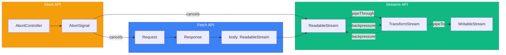
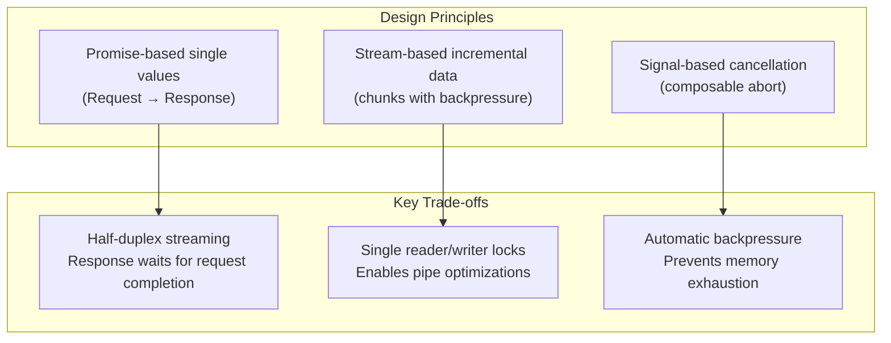
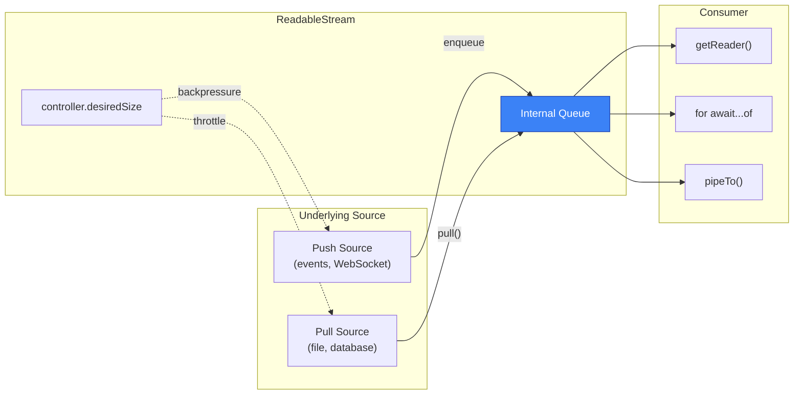

# Fetch, Streams, and AbortController

A comprehensive exploration of the modern web's network primitives, examining how the [Fetch Standard](https://fetch.spec.whatwg.org/) (WHATWG Living Standard, January 2026) unifies request/response handling across all platform features, how the [Streams Standard](https://streams.spec.whatwg.org/) enables incremental data processing with automatic backpressure, and how [AbortController/AbortSignal](https://dom.spec.whatwg.org/#aborting-ongoing-activities) (DOM Standard Section 3.3) provide composable cancellation semantics. These three APIs form an integrated system: Fetch exposes response bodies as ReadableStreams, Streams propagate backpressure through pipe chains, and AbortSignal enables cancellation at any point in the pipeline.

<figure>



<figcaption>The three APIs integrate tightly: Fetch produces streams, Streams handle data flow, AbortController cancels operations</figcaption>

</figure>

## Abstract

The Fetch/Streams/AbortController triad represents a unified approach to network data handling built on three core principles:

<figure>



<figcaption>Core design principles and their resulting trade-offs</figcaption>

</figure>

**Mental model:**

- **Fetch** handles the request/response lifecycle as Promises but exposes `response.body` as a ReadableStream—bridging single-value semantics with incremental data
- **Streams** use a producer-consumer model with automatic backpressure: `controller.desiredSize` propagates consumption rate backwards through pipe chains, allowing sources to throttle production
- **AbortController** creates cancellation signals that can be composed (`AbortSignal.any()`), timeout-bound (`AbortSignal.timeout()`), and passed to any async operation

**Critical design decisions:**

- **Body is fundamentally a stream**: The Fetch spec defines body as `{ stream, source, length }` where `stream` is always a ReadableStream—consumption methods like `json()` and `text()` are convenience wrappers that read the entire stream
- **Backpressure is automatic, not optional**: Unlike naive implementations, Streams require sources to check `desiredSize` before producing—this prevents memory exhaustion rather than reacting to it
- **Cancellation propagates through pipes**: Aborting a fetch cancels the network request, closes the response stream, and aborts any downstream transforms—the signal flows through the entire pipeline

---

## The Fetch API: Request/Response Lifecycle

The Fetch Standard unifies network requests across all platform features—XHR, `` loading, Service Worker interception, and explicit `fetch()` calls all use the same underlying algorithm. The spec notes this addresses historical inconsistency: "numerous APIs use fetch inconsistently."

### Request Configuration

The Request object encapsulates all request parameters. Key options and their defaults:

| Option        | Default         | Design Rationale                                           |
| ------------- | --------------- | ---------------------------------------------------------- |
| `method`      | `GET`           | Safe default for read operations                           |
| `mode`        | `cors`          | Security-first: requires explicit CORS headers             |
| `credentials` | `same-origin`   | Privacy: omits cookies cross-origin unless specified       |
| `redirect`    | `follow`        | Convenience: handles 3xx automatically (max 20 redirects)  |
| `cache`       | `default`       | Uses HTTP cache semantics; honors Cache-Control headers    |
| `signal`      | `undefined`     | Optional AbortSignal for cancellation                      |
| `duplex`      | `half` (implied)| Response waits for complete request (browser limitation)   |

**Body types supported**: string, ArrayBuffer, TypedArray, DataView, Blob, File, URLSearchParams, FormData, and ReadableStream. The browser automatically sets `Content-Type` based on body type (e.g., `application/json` for stringified JSON, `multipart/form-data` for FormData).

```typescript collapse={1-3, 15-20}
// Imports and setup (collapsed)
const API_BASE = "https://api.example.com"
const signal = AbortSignal.timeout(5000)

// Key pattern: structured request with explicit configuration
const response = await fetch(`${API_BASE}/users`, {
  method: "POST",
  headers: { "Content-Type": "application/json" },
  body: JSON.stringify({ name: "Alice", role: "admin" }),
  credentials: "include", // Send cookies cross-origin
  signal, // 5-second timeout
})

// Error handling pattern (collapsed)
if (!response.ok) {
  throw new Error(`HTTP ${response.status}: ${response.statusText}`)
}

const user = await response.json()
```

### Response Tainting and CORS

The response carries a `type` property reflecting its security context:

| Response Type     | Scenario                              | JavaScript Access                          |
| ----------------- | ------------------------------------- | ------------------------------------------ |
| `basic`           | Same-origin request                   | Full access to headers and body            |
| `cors`            | Cross-origin with valid CORS headers  | Access to CORS-safelisted headers          |
| `opaque`          | Cross-origin with `mode: 'no-cors'`   | status=0, empty headers, null body         |
| `opaqueredirect`  | Redirect captured with `redirect: 'manual'` | Cannot inspect redirect target      |

**Design rationale**: Response tainting prevents cross-origin data leakage. An opaque response "is otherwise indistinguishable from a network error" (Fetch spec)—JavaScript cannot determine whether the request succeeded or what data it returned.

### Body Consumption: Stream Under the Hood

Every body consumption method (`json()`, `text()`, `blob()`, `arrayBuffer()`, `formData()`) reads the underlying ReadableStream to completion. **The body can only be consumed once**:

```typescript
const response = await fetch("/api/data")
const data1 = await response.json()
const data2 = await response.json() // ❌ TypeError: body already consumed
```

**Why this happens**: The `body.stream` has been read to completion; its internal state is "disturbed." The spec prohibits re-reading to prevent implementation complexity around buffering.

**Solutions**:

```typescript
// Option 1: Clone the response before consuming
const response = await fetch("/api/data")
const clone = response.clone() // Creates independent stream via tee()
const data1 = await response.json()
const data2 = await clone.json() // ✅ Works

// Option 2: Read once, use multiple times
const response = await fetch("/api/data")
const data = await response.json()
// Use `data` multiple times (it's a plain object now)
```

**Cloning cost**: `response.clone()` uses stream teeing internally, which buffers data for both branches. For large responses, this doubles memory usage.

### HTTP Status: No Automatic Rejection

A critical gotcha: **fetch() only rejects on network errors, not HTTP error statuses**:

```typescript
// ❌ Common mistake: assuming 404 throws
try {
  const response = await fetch("/nonexistent")
  const data = await response.json() // May throw parsing error, not 404
} catch (e) {
  // Only catches network failures or JSON parse errors
}

// ✅ Correct pattern: check response.ok
const response = await fetch("/api/data")
if (!response.ok) {
  // response.ok is false for status outside 200-299
  throw new Error(`HTTP ${response.status}`)
}
const data = await response.json()
```

**Design rationale**: HTTP 4xx/5xx responses are valid HTTP—the server responded. Network failures (DNS resolution, connection refused, CORS blocked) represent actual failures to communicate.

---

## The Streams API: Incremental Data with Backpressure

The Streams Standard addresses a fundamental limitation: Promises represent single values, but network data arrives incrementally. Without streams, you must buffer entire responses before processing—problematic for large files or real-time data.

### ReadableStream Architecture

A ReadableStream wraps an **underlying source** (push or pull) and maintains an internal queue of chunks:

<figure>



<figcaption>ReadableStream mediates between sources and consumers with automatic backpressure</figcaption>

</figure>

**Constructor options**:

```typescript collapse={1-2, 22-27}
// Type definitions (collapsed)
type Chunk = Uint8Array | string

const stream = new ReadableStream<Chunk>(
  {
    // Called once when stream is created
    start(controller) {
      // Initial setup, return Promise to delay first pull()
    },

    // Called when internal queue needs more data
    // For pull sources: fetch data here
    // For push sources: often unused (data pushed via enqueue)
    pull(controller) {
      // controller.enqueue(chunk) - add data
      // controller.close() - signal end of data
      // controller.error(e) - signal failure
      // controller.desiredSize - bytes/chunks wanted (backpressure signal)
    },

    // Called when consumer cancels (e.g., reader.cancel())
    cancel(reason) {
      // Cleanup: close connections, release resources
      // reason contains cancellation cause
    },
  },
  // Queuing strategy
  {
    highWaterMark: 3, // Queue up to 3 chunks before backpressure
    size: (chunk) => 1, // Each chunk counts as 1 (or return byte length)
  },
)
```

### Backpressure: Automatic Flow Control

The killer feature of Streams is **automatic backpressure**. When a consumer processes slowly, `controller.desiredSize` becomes zero or negative, signaling the source to stop producing:

```typescript collapse={1-4, 30-35}
// Simulated slow consumer example
// This demonstrates backpressure without any explicit coordination
const CHUNK_SIZE = 1024

const stream = new ReadableStream({
  start(controller) {
    let offset = 0

    const produceChunk = () => {
      // Key insight: check desiredSize before producing
      if (controller.desiredSize !== null && controller.desiredSize <= 0) {
        // Consumer is slow—wait before producing more
        // This prevents memory exhaustion automatically
        setTimeout(produceChunk, 100)
        return
      }

      const chunk = generateData(offset, CHUNK_SIZE)
      controller.enqueue(chunk)
      offset += CHUNK_SIZE

      if (offset < TOTAL_SIZE) {
        // Schedule next chunk
        setTimeout(produceChunk, 0)
      } else {
        controller.close()
      }
    }

    produceChunk()
  },
})

// Helper function (collapsed)
function generateData(offset: number, size: number): Uint8Array {
  return new Uint8Array(size).fill(offset % 256)
}
```

**High water mark**: The threshold before backpressure activates. `desiredSize = highWaterMark - queuedSize`. When positive, the stream wants more data; when zero or negative, the consumer is saturated.

### Reading Streams: Three Patterns

**Pattern 1: Manual reader** (most control)

```typescript
const reader = stream.getReader()

try {
  while (true) {
    const { done, value } = await reader.read()
    if (done) break
    processChunk(value)
  }
} finally {
  reader.releaseLock() // Always release to allow other readers
}
```

**Pattern 2: Async iteration** (cleanest syntax)

```typescript
// Locks stream during iteration
for await (const chunk of stream) {
  processChunk(chunk)
}
// Stream is automatically cancelled on break/throw unless preventCancel: true

// To continue reading after early exit:
for await (const chunk of stream.values({ preventCancel: true })) {
  if (foundTarget) break // Stream remains open
}
```

**Pattern 3: Pipe to writable** (for processing pipelines)

```typescript
// Pipe handles reading, backpressure, and cleanup automatically
await stream.pipeTo(writableStream)
```

### Stream Locking

**Only one reader or pipe can be active at a time.** Calling `getReader()` locks the stream:

```typescript
const reader1 = stream.getReader()
const reader2 = stream.getReader() // ❌ TypeError: stream is locked

reader1.releaseLock()
const reader2 = stream.getReader() // ✅ Now works
```

**Design rationale**: Single-reader ensures tight producer-consumer coupling, enabling internal optimizations. Multiple readers would require buffering for each, defeating backpressure.

### Teeing: Creating Independent Branches

When you need multiple consumers, `tee()` creates two independent streams:

```typescript
const [stream1, stream2] = originalStream.tee()

// Both receive the same data independently
// Common use: stream to browser AND cache simultaneously
```

**Cost**: Teed streams buffer data for both branches. If one consumer is faster, the slower branch's buffer grows unboundedly. Use only when both consumers process at similar rates.

### WritableStream: The Destination

WritableStream defines where data goes. It queues producer writes and delivers them sequentially to an underlying sink:

```typescript collapse={1-3, 25-30}
// DOM setup (collapsed)
const outputElement = document.getElementById("output")!
let lineCount = 0

const writableStream = new WritableStream({
  // Called once when stream is created
  start(controller) {
    // Initialize sink, return Promise to delay writes
  },

  // Called for each chunk written
  write(chunk, controller) {
    // Process chunk (can be async)
    outputElement.textContent += chunk
    lineCount++

    // controller.error(e) to abort with error
  },

  // Called when writer.close() is invoked
  close() {
    console.log(`Finished writing ${lineCount} lines`)
  },

  // Called on writer.abort() or upstream error
  abort(reason) {
    console.error("Stream aborted:", reason)
    // Cleanup resources
  },
})

const writer = writableStream.getWriter()
await writer.write("Line 1\n")
await writer.write("Line 2\n")
await writer.close()
```

**Writer methods**:

- `write(chunk)`: Returns Promise that resolves when chunk is accepted (not necessarily processed)
- `close()`: Signals no more data; returns Promise that resolves when sink finishes
- `abort(reason)`: Immediately terminates; discards queued chunks
- `ready`: Promise that resolves when backpressure clears
- `desiredSize`: Current backpressure signal (null if errored/closing)

### TransformStream: Processing Pipelines

TransformStream connects a writable input to a readable output, enabling data transformation mid-pipeline:

```typescript
const uppercaseTransform = new TransformStream({
  transform(chunk, controller) {
    // Transform and forward
    controller.enqueue(chunk.toUpperCase())
  },

  flush(controller) {
    // Called after all input processed, before output closes
    // Useful for emitting buffered data
  },
})

// Use with pipeThrough
const result = await fetch("/text.txt")
const stream = response.body.pipeThrough(new TextDecoderStream()).pipeThrough(uppercaseTransform)

for await (const line of stream) {
  console.log(line) // UPPERCASE TEXT
}
```

**Built-in transforms**:

| Transform               | Purpose                               | Notes                                    |
| ----------------------- | ------------------------------------- | ---------------------------------------- |
| `TextDecoderStream`     | `Uint8Array` → `string`               | Handles UTF-8 boundary splitting         |
| `TextEncoderStream`     | `string` → `Uint8Array`               | Required for request body streaming      |
| `CompressionStream`     | Compress with gzip/deflate            | `new CompressionStream('gzip')`          |
| `DecompressionStream`   | Decompress                            | `new DecompressionStream('gzip')`        |

### Pipe Options and Error Handling

`pipeTo()` and `pipeThrough()` accept options controlling error propagation:

```typescript
await readableStream.pipeTo(writableStream, {
  preventClose: false, // Default: close destination when source closes
  preventAbort: false, // Default: abort destination on source error
  preventCancel: false, // Default: cancel source on destination error
  signal: abortSignal, // Cancel pipe on abort
})
```

**Error propagation by default**:

- Source error → destination aborted (unless `preventAbort: true`)
- Destination error → source cancelled (unless `preventCancel: true`)
- Source closes → destination closes (unless `preventClose: true`)

---

## AbortController: Composable Cancellation

AbortController provides a standard cancellation mechanism usable across fetch, streams, and custom async operations. Unlike older patterns (callbacks, boolean flags), it integrates with the event system and composes cleanly.

### Basic Usage

```typescript
const controller = new AbortController()
const signal = controller.signal

// Pass signal to cancellable operation
const response = await fetch("/slow-endpoint", { signal })

// Cancel from anywhere
controller.abort()
// OR with reason
controller.abort(new Error("User navigated away"))
```

### AbortSignal Methods

**`AbortSignal.timeout(ms)`**: Creates a signal that auto-aborts after specified duration:

```typescript
try {
  const response = await fetch("/api/data", {
    signal: AbortSignal.timeout(5000), // 5-second timeout
  })
  const data = await response.json()
} catch (e) {
  if (e.name === "TimeoutError") {
    // Timeout-specific handling
    console.error("Request timed out")
  } else if (e.name === "AbortError") {
    // Manual abort (different from timeout)
    console.error("Request was cancelled")
  }
}
```

**`AbortSignal.any(signals)`**: Aborts when any provided signal aborts:

```typescript
const controller = new AbortController()
const timeoutSignal = AbortSignal.timeout(10000)

// Abort on user action OR timeout
const response = await fetch("/api/data", {
  signal: AbortSignal.any([controller.signal, timeoutSignal]),
})

// User can still cancel manually
cancelButton.onclick = () => controller.abort()
```

**`signal.throwIfAborted()`**: Throws if already aborted—useful for checking state before expensive operations:

```typescript
async function processItems(items: Item[], signal: AbortSignal) {
  for (const item of items) {
    // Check before each expensive operation
    signal.throwIfAborted()
    await expensiveProcess(item)
  }
}
```

### Signal Reuse Gotcha

An AbortSignal can only abort once. **A fetch with an already-aborted signal rejects immediately**:

```typescript
const controller = new AbortController()
controller.abort()

// These both reject immediately with AbortError
await fetch("/a", { signal: controller.signal }) // ❌ Rejected
await fetch("/b", { signal: controller.signal }) // ❌ Rejected

// Create new controller for each operation that needs independent cancellation
```

### Custom Abortable Operations

Integrate AbortSignal into your own async functions:

```typescript collapse={1-3, 28-35}
// Helper types (collapsed)
interface ProcessOptions { signal?: AbortSignal }
type ProcessResult = { processed: number }

async function processWithAbort(
  data: AsyncIterable<Chunk>,
  options: ProcessOptions = {},
): Promise<ProcessResult> {
  const { signal } = options
  let processed = 0

  // Check if already aborted
  signal?.throwIfAborted()

  for await (const chunk of data) {
    // Check before each chunk
    if (signal?.aborted) {
      throw signal.reason
    }

    await processChunk(chunk)
    processed++
  }

  return { processed }
}

// Listen for abort during long operations
function longOperation(signal: AbortSignal): Promise<void> {
  return new Promise((resolve, reject) => {
    // Handle abort
    signal.addEventListener("abort", () => reject(signal.reason), { once: true })

    // Do work...
    setTimeout(resolve, 10000)
  })
}
```

---

## Streaming Patterns: Download

### Streaming Response with Progress

```typescript collapse={1-4, 32-40}
// Progress callback type (collapsed)
type ProgressCallback = (loaded: number, total: number | null) => void
interface DownloadResult { data: Uint8Array; size: number }

async function downloadWithProgress(
  url: string,
  onProgress: ProgressCallback,
  signal?: AbortSignal,
): Promise<DownloadResult> {
  const response = await fetch(url, { signal })
  if (!response.ok) throw new Error(`HTTP ${response.status}`)

  // Total may be null if server doesn't send Content-Length
  const total = response.headers.get("Content-Length")
  const totalBytes = total ? parseInt(total, 10) : null

  const reader = response.body!.getReader()
  const chunks: Uint8Array[] = []
  let loaded = 0

  while (true) {
    const { done, value } = await reader.read()
    if (done) break

    chunks.push(value)
    loaded += value.length
    onProgress(loaded, totalBytes)
  }

  // Concatenate chunks into single array
  const result = new Uint8Array(loaded)
  let offset = 0
  for (const chunk of chunks) {
    result.set(chunk, offset)
    offset += chunk.length
  }

  return { data: result, size: loaded }
}
```

### Line-by-Line Processing

```typescript collapse={1-2, 30-35}
// Import (collapsed)
type LineCallback = (line: string) => void

async function processLines(
  response: Response,
  onLine: LineCallback,
): Promise<void> {
  const reader = response.body!
    .pipeThrough(new TextDecoderStream())
    .getReader()

  let buffer = ""

  while (true) {
    const { done, value } = await reader.read()

    if (done) {
      // Emit final line if buffer has content
      if (buffer) onLine(buffer)
      break
    }

    buffer += value
    const lines = buffer.split("\n")

    // Process all complete lines
    for (let i = 0; i < lines.length - 1; i++) {
      onLine(lines[i])
    }

    // Keep incomplete line in buffer
    buffer = lines[lines.length - 1]
  }
}

// Usage with Server-Sent Events format
await processLines(response, (line) => {
  if (line.startsWith("data: ")) {
    const data = JSON.parse(line.slice(6))
    handleEvent(data)
  }
})
```

### NDJSON (Newline-Delimited JSON) Streaming

```typescript collapse={1-3}
// Type definitions (collapsed)
type JSONValue = string | number | boolean | null | JSONValue[] | { [key: string]: JSONValue }

async function* streamNDJSON<T extends JSONValue>(
  response: Response,
): AsyncGenerator<T> {
  const reader = response.body!
    .pipeThrough(new TextDecoderStream())
    .getReader()

  let buffer = ""

  while (true) {
    const { done, value } = await reader.read()

    if (done) {
      if (buffer.trim()) {
        yield JSON.parse(buffer) as T
      }
      return
    }

    buffer += value
    const lines = buffer.split("\n")
    buffer = lines.pop()! // Keep incomplete line

    for (const line of lines) {
      if (line.trim()) {
        yield JSON.parse(line) as T
      }
    }
  }
}

// Usage
for await (const record of streamNDJSON<UserRecord>(response)) {
  await processUser(record)
}
```

---

## Streaming Patterns: Upload

### Request Body Streaming

Streaming uploads allow sending data as it's generated, avoiding memory buffering. **Critical limitation**: As of January 2026, request body streaming requires HTTP/2+ and works only in half-duplex mode (response waits for complete request).

```typescript collapse={1-5, 35-45}
// Feature detection for streaming uploads
const supportsRequestStreams = (() => {
  let duplexAccessed = false
  const hasContentType = new Request("", {
    body: new ReadableStream(),
    method: "POST",
    get duplex() {
      duplexAccessed = true
      return "half"
    },
  }).headers.has("Content-Type")
  // If duplex getter was called AND Content-Type wasn't auto-set to text/plain,
  // browser supports streaming
  return duplexAccessed && !hasContentType
})()

async function uploadStream(
  url: string,
  dataGenerator: AsyncGenerator<Uint8Array>,
  signal?: AbortSignal,
): Promise<Response> {
  const stream = new ReadableStream({
    async pull(controller) {
      const { done, value } = await dataGenerator.next()
      if (done) {
        controller.close()
      } else {
        controller.enqueue(value)
      }
    },
  })

  return fetch(url, {
    method: "POST",
    body: stream,
    duplex: "half", // Required for streaming body
    signal,
  })
}

// Example: stream file in chunks
async function* readFileChunks(file: File, chunkSize = 64 * 1024) {
  let offset = 0
  while (offset < file.size) {
    const slice = file.slice(offset, offset + chunkSize)
    const buffer = await slice.arrayBuffer()
    yield new Uint8Array(buffer)
    offset += chunkSize
  }
}

await uploadStream("/api/upload", readFileChunks(largeFile))
```

**Limitations**:

- **HTTP/2 required**: HTTP/1.1 needs Content-Length or chunked encoding; streaming doesn't provide either
- **Half-duplex only**: Response unavailable until request completes—no bidirectional streaming in browsers
- **CORS preflight always triggered**: Streaming requests aren't "simple"
- **Non-303 redirects rejected**: Only 303 (See Other) works because it discards the body
- **Server buffering**: Many servers buffer entire request before processing, negating streaming benefits

### FormData with Large Files

For compatibility when streaming isn't available, FormData with progress uses XMLHttpRequest:

```typescript collapse={1-3, 25-35}
// Progress types (collapsed)
type UploadProgress = { loaded: number; total: number }
type ProgressHandler = (progress: UploadProgress) => void

function uploadWithProgress(
  url: string,
  formData: FormData,
  onProgress: ProgressHandler,
  signal?: AbortSignal,
): Promise<Response> {
  return new Promise((resolve, reject) => {
    const xhr = new XMLHttpRequest()

    xhr.upload.addEventListener("progress", (e) => {
      if (e.lengthComputable) {
        onProgress({ loaded: e.loaded, total: e.total })
      }
    })

    xhr.addEventListener("load", () => {
      resolve(new Response(xhr.response, { status: xhr.status }))
    })

    xhr.addEventListener("error", () => reject(new Error("Upload failed")))

    // Handle abort signal
    signal?.addEventListener("abort", () => {
      xhr.abort()
      reject(signal.reason)
    })

    xhr.open("POST", url)
    xhr.send(formData)
  })
}
```

---

## BYOB Readers: Zero-Copy for Byte Streams

For performance-critical scenarios, BYOB (Bring Your Own Buffer) readers minimize memory allocations by reading directly into caller-provided buffers:

```typescript collapse={1-4}
// BYOB is only available on byte streams (type: 'bytes')
// Example: efficient binary file processing

async function readWithBYOB(stream: ReadableStream<Uint8Array>): Promise<Uint8Array[]> {
  // Get BYOB reader (only works with byte streams)
  const reader = stream.getReader({ mode: "byob" })
  const chunks: Uint8Array[] = []

  // Reusable buffer—same memory gets reused across reads
  let buffer = new Uint8Array(65536) // 64KB buffer

  while (true) {
    // Read directly into our buffer
    const { done, value } = await reader.read(buffer)

    if (done) break

    // value is a view into the same ArrayBuffer, but potentially
    // a different length than buffer. Save the actual data.
    chunks.push(value.slice()) // Copy the filled portion

    // The original buffer is "detached"—we need a new view
    // value.buffer is the underlying ArrayBuffer
    buffer = new Uint8Array(value.buffer)
  }

  return chunks
}
```

**When to use BYOB**:

- Processing large binary files where allocation overhead matters
- Media streaming with known frame sizes
- WebAssembly integration where you control memory layout

**When to avoid**: Most applications—default readers are simpler and fast enough.

---

## Error Handling Patterns

### Comprehensive Fetch Error Handling

```typescript collapse={1-5, 45-55}
// Error types for discrimination
class NetworkError extends Error { name = "NetworkError" }
class HTTPError extends Error {
  constructor(public status: number, public statusText: string) {
    super(`HTTP ${status}: ${statusText}`)
    this.name = "HTTPError"
  }
}

async function robustFetch<T>(
  url: string,
  options: RequestInit = {},
): Promise<T> {
  const { signal, ...restOptions } = options

  // Combine user signal with timeout
  const timeoutSignal = AbortSignal.timeout(30000)
  const combinedSignal = signal
    ? AbortSignal.any([signal, timeoutSignal])
    : timeoutSignal

  let response: Response

  try {
    response = await fetch(url, { ...restOptions, signal: combinedSignal })
  } catch (e) {
    if (e instanceof Error) {
      if (e.name === "TimeoutError") {
        throw new NetworkError("Request timed out after 30 seconds")
      }
      if (e.name === "AbortError") {
        throw e // Re-throw user-initiated abort
      }
    }
    throw new NetworkError(`Network request failed: ${e}`)
  }

  if (!response.ok) {
    throw new HTTPError(response.status, response.statusText)
  }

  // Handle empty responses
  const contentType = response.headers.get("Content-Type")
  if (!contentType?.includes("application/json")) {
    throw new Error(`Expected JSON, got ${contentType}`)
  }

  return response.json() as Promise<T>
}

// Usage with proper error discrimination
try {
  const data = await robustFetch<UserData>("/api/user")
} catch (e) {
  if (e instanceof HTTPError && e.status === 404) {
    // Handle not found
  } else if (e instanceof NetworkError) {
    // Handle connectivity issues
  } else if (e instanceof Error && e.name === "AbortError") {
    // User cancelled—usually no action needed
  } else {
    // Unknown error
    throw e
  }
}
```

### Stream Error Recovery

```typescript collapse={1-3}
// Retry configuration (collapsed)
interface RetryConfig { maxRetries: number; delayMs: number }

async function streamWithRetry(
  url: string,
  config: RetryConfig = { maxRetries: 3, delayMs: 1000 },
): Promise<Uint8Array> {
  let lastError: Error | undefined
  let receivedBytes = 0
  const chunks: Uint8Array[] = []

  for (let attempt = 0; attempt < config.maxRetries; attempt++) {
    try {
      const headers: HeadersInit = {}

      // Resume from where we left off
      if (receivedBytes > 0) {
        headers["Range"] = `bytes=${receivedBytes}-`
      }

      const response = await fetch(url, { headers })

      // Check if server supports range requests
      if (receivedBytes > 0 && response.status !== 206) {
        // Server doesn't support resume—start over
        chunks.length = 0
        receivedBytes = 0
      }

      const reader = response.body!.getReader()

      while (true) {
        const { done, value } = await reader.read()
        if (done) break

        chunks.push(value)
        receivedBytes += value.length
      }

      // Success—concatenate and return
      const result = new Uint8Array(receivedBytes)
      let offset = 0
      for (const chunk of chunks) {
        result.set(chunk, offset)
        offset += chunk.length
      }
      return result
    } catch (e) {
      lastError = e as Error
      await new Promise((r) => setTimeout(r, config.delayMs * (attempt + 1)))
    }
  }

  throw lastError
}
```

---

## Browser Compatibility and Polyfills

### Current Support (January 2026)

| Feature                        | Chrome  | Firefox | Safari  | Notes                           |
| ------------------------------ | ------- | ------- | ------- | ------------------------------- |
| `fetch()`                      | 42+     | 39+     | 10.1+   | Universal baseline              |
| `ReadableStream`               | 43+     | 65+     | 10.1+   | Response body streaming         |
| `WritableStream`               | 59+     | 100+    | 14.1+   | Later adoption in Firefox       |
| `TransformStream`              | 67+     | 102+    | 14.1+   | Full pipeline support           |
| `AbortController`              | 66+     | 57+     | 11.1+   | Cancellation baseline           |
| `AbortSignal.timeout()`        | 103+    | 100+    | 15.4+   | Timeout signals                 |
| `AbortSignal.any()`            | 116+    | 124+    | 17.4+   | Signal composition              |
| Request body `ReadableStream`  | 105+    | —       | —       | **Chrome only, HTTP/2 required**|
| `for await...of` on streams    | 78+     | 65+     | 14.1+   | Async iteration                 |

### Feature Detection

```typescript
// Streaming uploads
const supportsUploadStreaming = (() => {
  try {
    let duplexAccessed = false
    new Request("", {
      body: new ReadableStream(),
      method: "POST",
      get duplex() {
        duplexAccessed = true
        return "half"
      },
    })
    return duplexAccessed
  } catch {
    return false
  }
})()

// AbortSignal.any()
const supportsSignalAny = typeof AbortSignal.any === "function"

// AbortSignal.timeout()
const supportsSignalTimeout = typeof AbortSignal.timeout === "function"

// Async iteration on streams
const supportsAsyncIteration = typeof ReadableStream.prototype[Symbol.asyncIterator] === "function"
```

---

## Conclusion

Fetch, Streams, and AbortController form a cohesive system for network data handling in modern browsers. Fetch unifies request/response semantics while exposing bodies as streams for incremental processing. Streams provide automatic backpressure through the `desiredSize` mechanism, preventing memory exhaustion without explicit coordination. AbortController enables composable cancellation that propagates through entire pipelines.

The key insight is that these APIs were designed together: `response.body` is a ReadableStream by spec, not by accident. Pipe operations respect AbortSignals. Backpressure flows bidirectionally through transforms. Understanding these integration points enables efficient patterns—streaming large files with progress, processing NDJSON incrementally, cancelling requests on navigation—that would require significant boilerplate with older APIs.

---

## Appendix

### Prerequisites

- JavaScript async/await and Promises
- HTTP request/response model (methods, headers, status codes)
- Basic understanding of ArrayBuffer/TypedArray for binary data

### Terminology

- **Backpressure**: Flow control mechanism where consumers signal their processing capacity to producers, preventing buffer overflow
- **BYOB (Bring Your Own Buffer)**: Reading mode where the caller provides the memory buffer, enabling zero-copy operations
- **Duplex**: Bidirectional communication; "half-duplex" means data flows one direction at a time
- **High water mark**: Queue size threshold before backpressure activates; measured in chunks or bytes
- **Opaque response**: Cross-origin response with `mode: 'no-cors'` that hides all data from JavaScript
- **Tee**: Splitting a stream into two independent branches that receive the same data

### Summary

- **Fetch lifecycle**: Request → network → Response; status codes don't reject, only network failures do
- **Body consumption**: Underlying stream can only be read once; use `clone()` for multiple reads
- **Stream backpressure**: `desiredSize` propagates consumption rate backwards; sources should throttle when ≤0
- **Single reader lock**: Streams allow one reader/pipe at a time; `tee()` creates independent branches
- **AbortSignal composition**: `any()` combines signals; `timeout()` creates auto-aborting signals
- **Upload streaming**: Chrome 105+ only, requires HTTP/2, half-duplex (response waits for complete request)

### References

**Specifications (Primary Sources)**

- [Fetch Standard](https://fetch.spec.whatwg.org/) - WHATWG Living Standard (defines Request, Response, body handling, CORS)
- [Streams Standard](https://streams.spec.whatwg.org/) - WHATWG Living Standard (defines ReadableStream, WritableStream, TransformStream, backpressure)
- [DOM Standard §3.3: Aborting Activities](https://dom.spec.whatwg.org/#aborting-ongoing-activities) - WHATWG Living Standard (defines AbortController, AbortSignal)

**Official Documentation**

- [Using the Fetch API - MDN](https://developer.mozilla.org/en-US/docs/Web/API/Fetch_API/Using_Fetch)
- [ReadableStream - MDN](https://developer.mozilla.org/en-US/docs/Web/API/ReadableStream)
- [WritableStream - MDN](https://developer.mozilla.org/en-US/docs/Web/API/WritableStream)
- [TransformStream - MDN](https://developer.mozilla.org/en-US/docs/Web/API/TransformStream)
- [AbortController - MDN](https://developer.mozilla.org/en-US/docs/Web/API/AbortController)
- [AbortSignal - MDN](https://developer.mozilla.org/en-US/docs/Web/API/AbortSignal)
- [Using Readable Streams - MDN](https://developer.mozilla.org/en-US/docs/Web/API/Streams_API/Using_readable_streams)
- [Streaming Requests with Fetch - Chrome Developers](https://developer.chrome.com/docs/capabilities/web-apis/fetch-streaming-requests)

**Core Maintainer Content**

- [Streams for the Web - web.dev](https://web.dev/articles/streams) - Chrome DevRel overview
- [2016: Streams FTW](https://jakearchibald.com/2016/streams-ftw/) - Jake Archibald on streams design rationale

**Browser Support**

- [Can I Use: Streams](https://caniuse.com/streams)
- [Can I Use: Fetch](https://caniuse.com/fetch)
- [Can I Use: AbortController](https://caniuse.com/abortcontroller)
- [Request Streaming Upload - Chrome Status](https://chromestatus.com/feature/5274139738767360)
