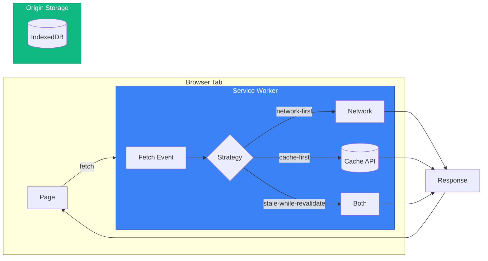
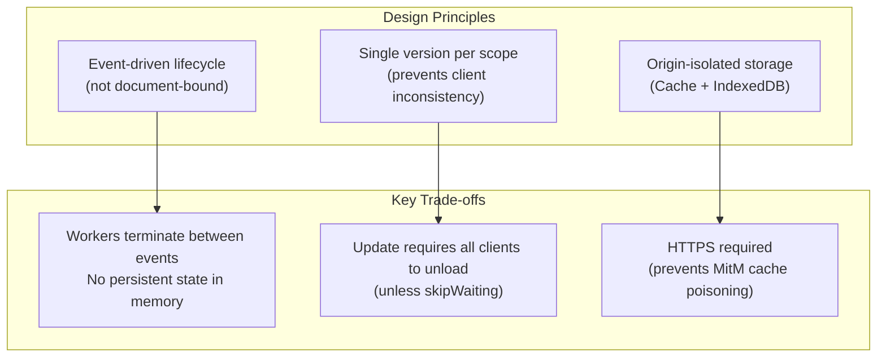
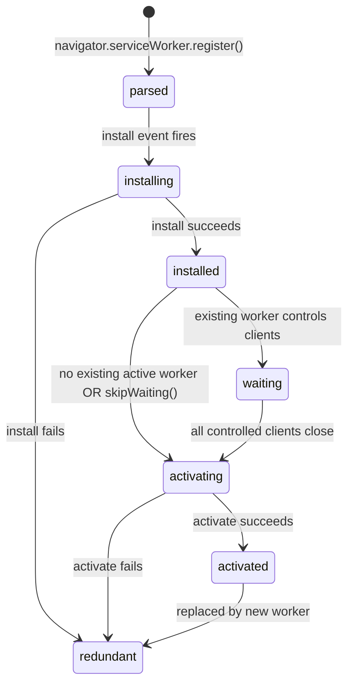
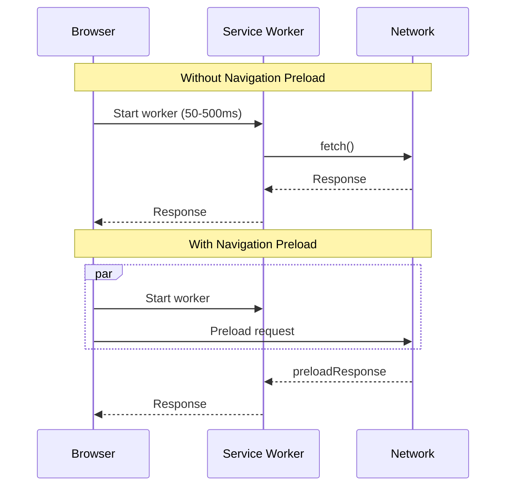

# Service Workers and Cache API

A comprehensive exploration of offline-first web architecture, examining how the [Service Worker API](https://w3c.github.io/ServiceWorker/) (W3C Working Draft, January 2026) enables network interception and background processing, how the [Cache API](https://w3c.github.io/ServiceWorker/#cache-interface) provides fine-grained storage for request/response pairs, and how update flows ensure clients transition safely between versions. These APIs form the foundation of Progressive Web Apps (PWAs): service workers intercept fetches and decide response sources, Cache API stores those responses durably, and the lifecycle model ensures exactly one version controls clients at any time.

<figure>



<figcaption>Service workers intercept requests and decide whether to serve from cache, network, or both</figcaption>

</figure>

## Abstract

Service workers represent a fundamental shift from traditional web architecture: instead of the browser directly fetching resources, an intermediary script can intercept every network request and programmatically decide how to respond.

<figure>



<figcaption>Core design principles and their operational trade-offs</figcaption>

</figure>

**Mental model:**

- **Service Worker** acts as a programmable network proxy scoped to a path prefix—it intercepts `fetch` events for matching URLs and can respond from cache, network, or synthesized responses
- **Cache API** stores `Request` → `Response` mappings durably, surviving browser restarts—unlike HTTP cache, you control exactly what's cached and for how long
- **Lifecycle** ensures only one service worker version is active per scope at any time, preventing the "two tabs running different code" problem that plagued AppCache

**Critical design decisions:**

- **Event-driven with termination**: The spec notes "the lifetime of a service worker is tied to the execution lifetime of events"—workers may start and stop "many times a second." Global state doesn't persist; use IndexedDB or Cache API
- **Waiting state by default**: New workers wait until all clients using the old version close. This prevents mid-session version mismatches but means updates don't apply immediately
- **HTTPS mandatory**: Service workers can intercept any request in their scope, including credentials. Without TLS, attackers could inject malicious workers via MITM

---

## Service Worker Lifecycle

The lifecycle is the most complex part of service workers—and the most important to understand. Unlike regular scripts that run when the page loads, service workers progress through distinct states independently of any document.

### State Machine

<figure>



<figcaption>Service worker state transitions—only "activated" workers handle fetch events</figcaption>

</figure>

| State        | Can Handle Fetches? | Trigger to Next State                                |
| ------------ | ------------------- | ---------------------------------------------------- |
| `parsed`     | No                  | Automatic after registration                         |
| `installing` | No                  | `install` event handler completes                    |
| `installed`  | No                  | Automatic (to waiting) or `skipWaiting()` (to activating) |
| `waiting`    | No                  | All clients using old worker unload                  |
| `activating` | No                  | `activate` event handler completes                   |
| `activated`  | **Yes**             | Remains until replaced or unregistered               |
| `redundant`  | No                  | Terminal state—worker is discarded                   |

### Registration and Scope

Registration binds a worker script to a scope URL prefix:

```typescript collapse={1-3, 18-22}
// Feature detection (collapsed)
if (!("serviceWorker" in navigator)) {
  console.log("Service workers not supported")
}

// Register with explicit scope
const registration = await navigator.serviceWorker.register("/sw.js", {
  scope: "/app/", // Controls /app/* URLs
})

console.log("Scope:", registration.scope) // "https://example.com/app/"
console.log("Active:", registration.active?.state) // "activated" if ready
console.log("Waiting:", registration.waiting?.state) // Worker pending activation
console.log("Installing:", registration.installing?.state) // Currently installing

// Default scope: directory containing the worker script
// /scripts/sw.js → scope defaults to /scripts/
await navigator.serviceWorker.register("/scripts/sw.js")
// Only controls /scripts/* URLs unless Service-Worker-Allowed header expands it
```

**Scope rules:**

- A worker at `/sw.js` defaults to scope `/` (entire origin)
- A worker at `/app/sw.js` defaults to scope `/app/`
- Scope cannot exceed the worker's directory unless the server sends `Service-Worker-Allowed: /` header
- Multiple registrations with different scopes can coexist; most-specific scope wins

### Install Event: Precaching

The `install` event fires once per worker version. Use it to cache critical resources:

```typescript collapse={1-2, 25-30}
// Cache version constant (collapsed)
const CACHE_NAME = "app-v1"

self.addEventListener("install", (event) => {
  event.waitUntil(
    caches.open(CACHE_NAME).then((cache) => {
      // addAll is atomic—fails entirely if any resource fails
      return cache.addAll([
        "/",
        "/app.js",
        "/styles.css",
        "/offline.html",
      ])
    }),
  )
})

// ⚠️ addAll fetches with mode: 'cors' by default
// Cross-origin resources need proper CORS headers or use:
cache.add(new Request("https://cdn.example.com/lib.js", { mode: "no-cors" }))
// Warning: no-cors responses are "opaque"—you can't inspect status or headers
```

**`waitUntil()` is critical**: The install event would complete immediately without it, potentially activating before caching finishes. If the promise rejects, the worker becomes `redundant`.

### Activate Event: Cleanup

The `activate` event fires when the worker takes control. Use it to clean old caches:

```typescript collapse={1-3}
// Expected cache names (collapsed)
const CURRENT_CACHES = { app: "app-v2", images: "images-v1" }

self.addEventListener("activate", (event) => {
  const expectedNames = new Set(Object.values(CURRENT_CACHES))

  event.waitUntil(
    caches.keys().then((cacheNames) => {
      return Promise.all(
        cacheNames.map((name) => {
          if (!expectedNames.has(name)) {
            console.log("Deleting old cache:", name)
            return caches.delete(name)
          }
        }),
      )
    }),
  )
})
```

**Why clean on activate, not install?** The old worker may still be serving requests. Deleting its caches during install would break active clients.

### skipWaiting and clients.claim

Two methods bypass the default waiting behavior:

```typescript
// In install event: skip waiting state entirely
self.addEventListener("install", (event) => {
  self.skipWaiting() // Activate immediately after install
  event.waitUntil(/* caching */)
})

// In activate event: take control of existing clients
self.addEventListener("activate", (event) => {
  event.waitUntil(
    clients.claim(), // Control pages that loaded before this worker
  )
})
```

**When to use `skipWaiting()`:**

- Critical bug fixes that must deploy immediately
- The new version is backward-compatible with pages loaded under the old version

**When to avoid it:** The spec warns that with `skipWaiting()`, "new service worker is likely controlling pages that were loaded with an older version." If your JavaScript expects cached assets that changed, you'll get broken pages.

**`clients.claim()` use case:** First-time installations where pages loaded before registration should immediately get service worker control. Jake Archibald notes: "I rarely do so myself. It only really matters on the very first load."

### Update Mechanism

Service workers update when:

1. Navigation to an in-scope page (if >24 hours since last check)
2. Push/sync event fires (if >24 hours since last check)
3. `registration.update()` called explicitly
4. Worker script URL changes (rare, avoid this pattern)

The browser fetches the worker script and compares bytes. Any difference triggers a new install. The spec notes: "Most browsers default to ignoring caching headers when checking for updates."

```typescript
// Trigger manual update check
const registration = await navigator.serviceWorker.ready
await registration.update()

// Monitor for updates
registration.addEventListener("updatefound", () => {
  const newWorker = registration.installing
  newWorker?.addEventListener("statechange", () => {
    if (newWorker.state === "installed") {
      // New version ready, waiting to activate
      if (registration.active) {
        // Show "Update available" UI
        showUpdateNotification()
      }
    }
  })
})
```

---

## Cache API

The Cache API provides a durable `Request` → `Response` storage mechanism. Unlike HTTP cache, you have explicit control over what's stored, how matching works, and when entries expire.

### CacheStorage Interface

`caches` (global `CacheStorage`) manages named caches:

| Method              | Purpose                                    | Returns                     |
| ------------------- | ------------------------------------------ | --------------------------- |
| `caches.open(name)` | Open (or create) a named cache             | `Promise<Cache>`            |
| `caches.match(req)` | Search all caches for a matching response  | `Promise<Response \| undefined>` |
| `caches.has(name)`  | Check if a cache exists                    | `Promise<boolean>`          |
| `caches.delete(name)` | Delete a cache and all its entries       | `Promise<boolean>`          |
| `caches.keys()`     | List all cache names                       | `Promise<string[]>`         |

### Cache Interface

Individual `Cache` objects store request/response pairs:

```typescript collapse={1-2, 30-35}
// Open or create cache (collapsed)
const cache = await caches.open("api-v1")

// Add single resource (fetches and stores)
await cache.add("/api/config")

// Add multiple resources (atomic—all or nothing)
await cache.addAll(["/api/config", "/api/user"])

// Put explicit request/response pair
const response = await fetch("/api/data")
await cache.put("/api/data", response.clone()) // Must clone—body consumed

// Match with options
const match = await cache.match(request, {
  ignoreSearch: true, // Ignore query string
  ignoreMethod: true, // Match regardless of HTTP method
  ignoreVary: true, // Ignore Vary header
})

// List all cached requests
const keys = await cache.keys()

// Delete specific entry
const deleted = await cache.delete("/api/old-endpoint")
```

**Critical: Response bodies are single-use**. After `cache.put(req, response)`, the response body is consumed. Always `response.clone()` if you need to return the response to the page.

### Request Matching

Cache matching is exact by default—URL, method, and Vary headers must match:

```typescript
// These are different cache entries:
cache.put("/api?page=1", response1)
cache.put("/api?page=2", response2)

// Match with query string
await cache.match("/api?page=1") // Returns response1
await cache.match("/api?page=2") // Returns response2
await cache.match("/api") // Returns undefined

// Ignore query string
await cache.match("/api?page=1", { ignoreSearch: true }) // Returns first match
```

**Vary header behavior**: If a cached response has `Vary: Accept-Language`, the cache only returns it when the request's `Accept-Language` matches the original request's value. Use `ignoreVary: true` to bypass this.

### Storage Limits and Quotas

Cache storage counts against the origin's quota:

| Browser   | Default Quota                     | Eviction Policy                                        |
| --------- | --------------------------------- | ------------------------------------------------------ |
| Chrome    | 60% of disk (5% in incognito)     | Least Recently Used (LRU) by origin                    |
| Firefox   | Up to 2GB per eTLD+1              | LRU when disk pressure                                 |
| Safari    | ~1GB (prompts for more on desktop) | **7-day cap on script-writable storage** (see below)  |

**Safari's 7-day limit**: Since March 2020, Safari deletes all script-writable storage (IndexedDB, Cache API, service worker registrations) after 7 days without user interaction. This resets when the user visits the site. PWAs added to home screen are exempt.

Check quota with the Storage API:

```typescript
const estimate = await navigator.storage.estimate()
console.log(`Used: ${estimate.usage} bytes`)
console.log(`Quota: ${estimate.quota} bytes`)
console.log(`Available: ${((estimate.quota! - estimate.usage!) / 1024 / 1024).toFixed(1)} MB`)

// Request persistent storage (immune to automatic eviction)
const persistent = await navigator.storage.persist()
if (persistent) {
  console.log("Storage will not be evicted under pressure")
}
```

---

## Caching Strategies

The fetch event is where caching strategies execute. Each strategy trades off freshness, speed, and offline capability:

### Cache-First (Cache Falling Back to Network)

Return cached response immediately; fetch from network only if not cached:

```typescript
self.addEventListener("fetch", (event) => {
  event.respondWith(
    caches.match(event.request).then((cached) => {
      if (cached) return cached

      return fetch(event.request).then((response) => {
        // Optionally cache the new response
        if (response.ok) {
          const clone = response.clone()
          caches.open("dynamic").then((cache) => cache.put(event.request, clone))
        }
        return response
      })
    }),
  )
})
```

**Use for:** Static assets (CSS, JS, images) with versioned URLs (`app.v2.js`). Immutable once deployed.

**Trade-off:** Fast and offline-capable, but stale until cache is explicitly invalidated.

### Network-First (Network Falling Back to Cache)

Try network first; fall back to cache if offline or request fails:

```typescript
self.addEventListener("fetch", (event) => {
  event.respondWith(
    fetch(event.request)
      .then((response) => {
        // Update cache with fresh response
        const clone = response.clone()
        caches.open("api").then((cache) => cache.put(event.request, clone))
        return response
      })
      .catch(() => {
        // Network failed—try cache
        return caches.match(event.request)
      }),
  )
})
```

**Use for:** API responses, user data, anything where freshness matters more than speed.

**Trade-off:** Always fresh when online, but slower (waits for network). Provides offline fallback.

### Stale-While-Revalidate

Return cached response immediately, then fetch and update cache in background:

```typescript
self.addEventListener("fetch", (event) => {
  event.respondWith(
    caches.open("swr").then((cache) => {
      return cache.match(event.request).then((cached) => {
        // Always fetch to update cache
        const fetchPromise = fetch(event.request).then((response) => {
          cache.put(event.request, response.clone())
          return response
        })

        // Return cached immediately, or wait for network if no cache
        return cached || fetchPromise
      })
    }),
  )
})
```

**Use for:** Frequently-updated content where slight staleness is acceptable (avatars, news feeds, product listings).

**Trade-off:** Fast response from cache, eventual freshness. Uses more bandwidth (always fetches).

### Network-Only

Pass through to network without caching:

```typescript
self.addEventListener("fetch", (event) => {
  event.respondWith(fetch(event.request))
})
```

**Use for:** Non-cacheable requests (POST, real-time data, authenticated content with unique tokens).

### Cache-Only

Only serve from cache; fail if not cached:

```typescript
self.addEventListener("fetch", (event) => {
  event.respondWith(caches.match(event.request))
})
```

**Use for:** Offline-only apps after initial precaching. Rarely used alone.

### Strategy Selection by Resource Type

| Resource Type            | Strategy                | Rationale                                       |
| ------------------------ | ----------------------- | ----------------------------------------------- |
| Versioned static assets  | Cache-first             | Immutable; version change = new URL             |
| App shell (HTML)         | Network-first           | Structure may update; offline fallback useful   |
| API data                 | Network-first or SWR    | Freshness important; offline read useful        |
| User-generated images    | Cache-first + lazy load | Large; rarely changes once uploaded             |
| Analytics/tracking       | Network-only            | Must reach server; no value in caching          |
| Third-party scripts      | Stale-while-revalidate  | Updates occasionally; speed matters             |

---

## Navigation Preload

Navigation preload solves a performance problem: when a user navigates, the browser must start the service worker before dispatching the fetch event. This startup delay (50-500ms) adds latency to every page load.

Navigation preload starts the network request in parallel with worker startup:

<figure>



<figcaption>Navigation preload eliminates serial worker startup + fetch delay</figcaption>

</figure>

### Enabling Navigation Preload

```typescript
self.addEventListener("activate", (event) => {
  event.waitUntil(
    (async () => {
      if (self.registration.navigationPreload) {
        await self.registration.navigationPreload.enable()
      }
    })(),
  )
})
```

### Using the Preloaded Response

```typescript
self.addEventListener("fetch", (event) => {
  if (event.request.mode === "navigate") {
    event.respondWith(
      (async () => {
        // Try cache first
        const cached = await caches.match(event.request)
        if (cached) return cached

        // Use preloaded response if available
        const preloaded = await event.preloadResponse
        if (preloaded) return preloaded

        // Fallback to regular fetch
        return fetch(event.request)
      })(),
    )
  }
})
```

### Server-Side Detection

Navigation preload requests include the `Service-Worker-Navigation-Preload` header (default value: `true`). Servers can customize responses:

```typescript
// Set custom header value
await registration.navigationPreload.setHeaderValue("v2")
// Server receives: Service-Worker-Navigation-Preload: v2

// Check current state
const state = await registration.navigationPreload.getState()
// { enabled: true, headerValue: "v2" }
```

**Server optimization:** Return minimal content (header + footer) for preload, let the service worker merge with cached content.

**Important:** If your response differs based on this header, include `Vary: Service-Worker-Navigation-Preload` to prevent caching issues.

---

## Update Flows and Client Coordination

Managing updates is where service workers get tricky. The default behavior—waiting until all clients close—is safest but frustrating for users who keep tabs open.

### Approach 1: Let It Wait (Default)

The simplest approach: don't use `skipWaiting()`. Users get the update on their next visit after all tabs close.

```typescript
// No skipWaiting—new worker waits
self.addEventListener("install", (event) => {
  event.waitUntil(caches.open("v2").then((cache) => cache.addAll([/* ... */])))
  // Worker enters "waiting" state after install
})
```

**Pros:** Safe—no version mismatches.
**Cons:** Updates may never apply for users with persistent tabs.

### Approach 2: Skip Waiting (Prompt User)

Use `skipWaiting()` only when user explicitly requests the update:

```typescript title="sw.js"
self.addEventListener("message", (event) => {
  if (event.data?.type === "SKIP_WAITING") {
    self.skipWaiting()
  }
})
```

```typescript title="page.js" collapse={1-3, 20-25}
// UI notification (collapsed)
function showUpdateNotification(onUpdate: () => void) {
  /* ... */
}

const registration = await navigator.serviceWorker.ready

registration.addEventListener("updatefound", () => {
  const newWorker = registration.installing!

  newWorker.addEventListener("statechange", () => {
    if (newWorker.state === "installed" && registration.active) {
      // New version ready—show UI
      showUpdateNotification(() => {
        newWorker.postMessage({ type: "SKIP_WAITING" })
      })
    }
  })
})

// Reload when new worker takes control
navigator.serviceWorker.addEventListener("controllerchange", () => {
  window.location.reload()
})
```

**Pros:** User controls when the update happens.
**Cons:** Requires UI implementation; some users ignore update prompts.

### Approach 3: Skip Waiting (Backward Compatible)

If new code can run with old-cached assets (or vice versa), skip immediately:

```typescript
self.addEventListener("install", (event) => {
  self.skipWaiting()
  event.waitUntil(/* caching */)
})

self.addEventListener("activate", (event) => {
  event.waitUntil(clients.claim())
})
```

**Pros:** Updates apply immediately.
**Cons:** Risk of version mismatches. Only works if your code handles this gracefully.

### Version Mismatch Scenarios

When `skipWaiting()` activates a new worker while old pages are open:

| Scenario                   | Result                                                      |
| -------------------------- | ----------------------------------------------------------- |
| Page requests cached JS    | Old worker's cache may be deleted; request fails or returns new version |
| New worker returns new HTML | HTML expects new JS; cached old JS breaks                  |
| API response format changed | New worker parses differently than old page expects        |

**Mitigation strategies:**

1. **Versioned URLs**: `app.v2.js` never conflicts with `app.v1.js`
2. **Keep old caches during activate**: Don't delete immediately
3. **Force reload on controller change**: `location.reload()` after `controllerchange`

---

## Offline Fallbacks and UX

A robust offline experience requires graceful degradation when resources aren't available.

### Generic Offline Page

```typescript
const OFFLINE_PAGE = "/offline.html"

self.addEventListener("install", (event) => {
  event.waitUntil(
    caches.open("offline").then((cache) => cache.add(OFFLINE_PAGE)),
  )
})

self.addEventListener("fetch", (event) => {
  if (event.request.mode === "navigate") {
    event.respondWith(
      fetch(event.request).catch(() => caches.match(OFFLINE_PAGE)),
    )
  }
})
```

### Offline Image Placeholder

```typescript
const OFFLINE_IMAGE = "/images/offline-placeholder.svg"

self.addEventListener("fetch", (event) => {
  if (event.request.destination === "image") {
    event.respondWith(
      caches.match(event.request).then((cached) => {
        return (
          cached ||
          fetch(event.request).catch(() => caches.match(OFFLINE_IMAGE))
        )
      }),
    )
  }
})
```

### Background Sync for Offline Actions

Queue failed mutations for retry when online:

```typescript title="page.js" collapse={1-3}
// Queue the request for background sync
async function queueForSync(request: Request) {
  const queue = await getRequestQueue() // IndexedDB-backed
  await queue.push(request)
  await navigator.serviceWorker.ready.then((reg) => reg.sync.register("sync-requests"))
}

// Use when fetch fails
try {
  await fetch("/api/submit", { method: "POST", body: data })
} catch {
  await queueForSync(new Request("/api/submit", { method: "POST", body: data }))
  showToast("Saved offline—will sync when connected")
}
```

```typescript title="sw.js"
self.addEventListener("sync", (event) => {
  if (event.tag === "sync-requests") {
    event.waitUntil(processQueue())
  }
})

async function processQueue() {
  const queue = await getRequestQueue()
  for (const request of await queue.getAll()) {
    try {
      await fetch(request)
      await queue.remove(request)
    } catch {
      // Still offline—will retry on next sync
      break
    }
  }
}
```

---

## Debugging and Observability

### Browser DevTools

**Chrome DevTools (Application tab):**

- **Service Workers panel**: View registered workers, state, and messages
- **Update on reload**: Forces new worker on every page load (development only)
- **Bypass for network**: Disables service worker for all fetches
- **Offline checkbox**: Simulates offline mode
- **Cache Storage**: Inspect cached request/response pairs

**Firefox DevTools:**

- **Application > Service Workers**: Similar to Chrome
- **Enable Service Workers over HTTP**: Testing without HTTPS (toolbox open only)

### Logging Strategy

```typescript
const DEBUG = true

function log(context: string, ...args: unknown[]) {
  if (DEBUG) {
    console.log(`[SW:${context}]`, ...args)
  }
}

self.addEventListener("install", (event) => {
  log("install", "Starting install...")
  // ...
})

self.addEventListener("fetch", (event) => {
  log("fetch", event.request.method, event.request.url)
  // ...
})
```

### Common Issues and Solutions

| Symptom                           | Cause                                      | Solution                                         |
| --------------------------------- | ------------------------------------------ | ------------------------------------------------ |
| Changes not appearing             | Old worker still active                    | Close all tabs or use Update on reload           |
| Worker stuck in "waiting"         | Clients still using old worker             | Use skipWaiting or close tabs                    |
| Fetch handler not firing          | Request outside scope or no-cors opaque    | Check scope; ensure fetch listener returns       |
| Cache match returns undefined     | URL mismatch (query string, trailing slash)| Use `ignoreSearch: true` or normalize URLs       |
| "The service worker navigation preload request was cancelled" | Preload unused | Always consume `event.preloadResponse` when enabled |
| Storage quota exceeded            | Too much cached data                       | Implement cache eviction; check `storage.estimate()` |

### Error Handling in Fetch

```typescript
self.addEventListener("fetch", (event) => {
  event.respondWith(
    handleFetch(event.request).catch((error) => {
      console.error("Fetch handler error:", error)

      // Return appropriate fallback based on request type
      if (event.request.destination === "document") {
        return caches.match("/offline.html")
      }
      if (event.request.destination === "image") {
        return caches.match("/offline-placeholder.svg")
      }

      // For other requests, let the error propagate
      return new Response("Service unavailable", { status: 503 })
    }),
  )
})
```

---

## Workbox: Production-Ready Abstractions

[Workbox](https://developer.chrome.com/docs/workbox) (Google) provides battle-tested implementations of caching patterns. Use it unless you have specific requirements that demand custom code.

### Strategy Modules

```typescript
import { registerRoute } from "workbox-routing"
import { CacheFirst, NetworkFirst, StaleWhileRevalidate } from "workbox-strategies"
import { ExpirationPlugin } from "workbox-expiration"

// Static assets: cache-first with expiration
registerRoute(
  ({ request }) => request.destination === "style" || request.destination === "script",
  new CacheFirst({
    cacheName: "static-v1",
    plugins: [
      new ExpirationPlugin({ maxEntries: 50, maxAgeSeconds: 30 * 24 * 60 * 60 }),
    ],
  }),
)

// API calls: network-first with 3-second timeout
registerRoute(
  ({ url }) => url.pathname.startsWith("/api/"),
  new NetworkFirst({
    cacheName: "api-v1",
    networkTimeoutSeconds: 3,
  }),
)

// Images: stale-while-revalidate
registerRoute(
  ({ request }) => request.destination === "image",
  new StaleWhileRevalidate({ cacheName: "images-v1" }),
)
```

### Precaching with Versioning

```typescript
import { precacheAndRoute } from "workbox-precaching"

// Injected by build tool (Webpack, Vite, etc.)
precacheAndRoute(self.__WB_MANIFEST)
// Generates versioned URLs: [{ url: "/app.js", revision: "abc123" }, ...]
```

### When to Use Custom Code

- **Complex routing logic** not expressible with Workbox's route matching
- **Custom cache invalidation** beyond time/count expiration
- **Streaming responses** that need transformation
- **Tight bundle size constraints** (Workbox adds ~10-20KB)

---

## Conclusion

Service workers fundamentally change the browser's network model: instead of direct fetches, an intermediary script decides response sources. The Cache API provides the durable storage that makes offline experiences possible. The lifecycle model—with its waiting states and update flows—ensures clients don't run inconsistent code.

The key architectural insight is that service workers are event-driven and stateless between events. Global variables don't persist. The worker may terminate after handling a fetch and restart fresh for the next one. Design accordingly: use Cache API and IndexedDB for persistence, not in-memory state.

Caching strategies represent trade-offs, not best practices. Cache-first sacrifices freshness for speed. Network-first sacrifices speed for freshness. Stale-while-revalidate trades bandwidth for both. Choose based on the specific resource's characteristics and your users' expectations.

---

## Appendix

### Prerequisites

- JavaScript Promises and async/await
- HTTP request/response model (methods, headers, caching headers)
- Familiarity with the Fetch API

### Terminology

- **Scope**: URL path prefix that a service worker controls (e.g., `/app/` controls `/app/*`)
- **Client**: A window, worker, or shared worker controlled by a service worker
- **Registration**: The binding of a service worker script to a scope
- **Precaching**: Caching resources during the install event before they're needed
- **Opaque response**: Cross-origin response with `mode: 'no-cors'` that hides status and headers
- **Navigation preload**: Parallel network request during service worker startup

### Summary

- **Lifecycle states**: parsed → installing → installed → waiting → activating → activated → redundant
- **Only activated workers handle fetch events**; waiting workers queue behind the current active worker
- **Cache API** stores Request/Response pairs durably; you control expiration and invalidation
- **Caching strategies**: cache-first (speed), network-first (freshness), stale-while-revalidate (both with bandwidth cost)
- **`skipWaiting()`** bypasses waiting but risks version mismatches; use with versioned URLs or user prompts
- **Navigation preload** eliminates worker startup delay by fetching in parallel
- **Safari's 7-day limit** deletes storage without user interaction; PWAs on home screen are exempt

### References

**Specifications (Primary Sources)**

- [Service Workers](https://w3c.github.io/ServiceWorker/) - W3C Working Draft (defines registration, lifecycle, fetch events, cache interface)
- [Fetch Standard](https://fetch.spec.whatwg.org/) - WHATWG Living Standard (defines Request, Response, fetch algorithm)
- [Storage Standard](https://storage.spec.whatwg.org/) - WHATWG Living Standard (defines quota, persistence, storage buckets)

**Official Documentation**

- [Service Worker API - MDN](https://developer.mozilla.org/en-US/docs/Web/API/Service_Worker_API)
- [Cache - MDN](https://developer.mozilla.org/en-US/docs/Web/API/Cache)
- [CacheStorage - MDN](https://developer.mozilla.org/en-US/docs/Web/API/CacheStorage)
- [NavigationPreloadManager - MDN](https://developer.mozilla.org/en-US/docs/Web/API/NavigationPreloadManager)
- [StorageManager - MDN](https://developer.mozilla.org/en-US/docs/Web/API/StorageManager)

**Core Maintainer Content**

- [The Service Worker Lifecycle - web.dev](https://web.dev/articles/service-worker-lifecycle) - Jake Archibald's definitive lifecycle guide
- [The Offline Cookbook - web.dev](https://web.dev/articles/offline-cookbook) - Caching strategy patterns
- [Service Worker Caching and HTTP Caching - web.dev](https://web.dev/articles/service-worker-caching-and-http-caching)
- [Speed up Service Worker with Navigation Preloads - web.dev](https://web.dev/blog/navigation-preload)
- [Workbox](https://developer.chrome.com/docs/workbox) - Production service worker library from Chrome team

**Safari Storage Policy**

- [Full Third-Party Cookie Blocking and More - WebKit Blog](https://webkit.org/blog/10218/full-third-party-cookie-blocking-and-more/) - Safari's 7-day storage cap details

**Browser Support**

- [Can I Use: Service Workers](https://caniuse.com/serviceworkers)
- [Can I Use: Cache API](https://caniuse.com/mdn-api_cache)
- [Can I Use: Navigation Preload](https://caniuse.com/mdn-api_navigationpreloadmanager)
