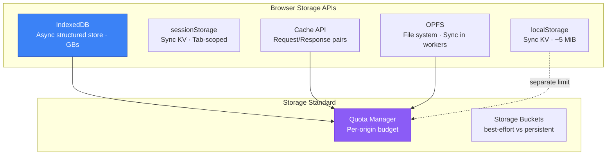
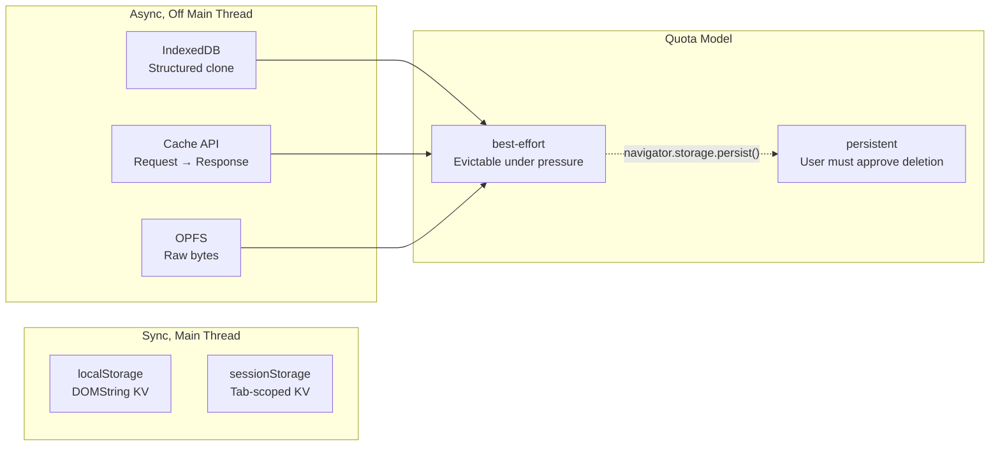
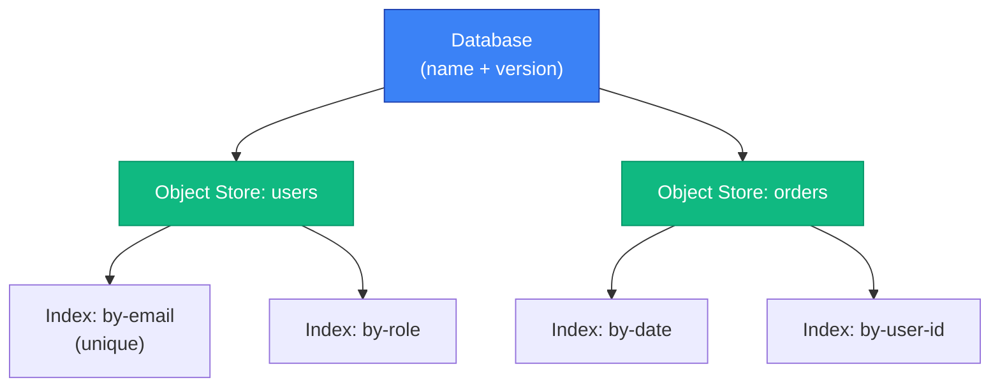

# Browser Storage APIs: localStorage, IndexedDB, and Beyond

A deep dive into browser-side persistence, examining the design trade-offs behind each storage API, their quota models, transaction semantics, and eviction behavior. The [WHATWG Storage Standard](https://storage.spec.whatwg.org/) (Living Standard) unifies quota management under a single bucket model, while individual APIs—[Web Storage](https://html.spec.whatwg.org/multipage/webstorage.html) (localStorage/sessionStorage), [IndexedDB](https://www.w3.org/TR/IndexedDB-3/) (W3C, version 3.0), and the [Cache API](https://w3c.github.io/ServiceWorker/#cache-interface) (W3C)—each optimize for different access patterns. Choosing the right API depends on data shape, access frequency, thread requirements, and durability guarantees—not just capacity limits.

<figure>



<figcaption>Browser storage APIs and their relationship to the unified quota system</figcaption>

</figure>

## Abstract

Browser storage is not one system—it's five APIs with different serialization models, threading guarantees, and eviction behaviors, all sharing a per-origin quota.

<figure>



<figcaption>Storage APIs split into synchronous (main-thread blocking) and asynchronous categories, all governed by the Storage Standard's quota model</figcaption>

</figure>

**Core mental model:**

- **localStorage/sessionStorage** store DOMString key-value pairs synchronously on the main thread—fast for small reads, dangerous for large data. localStorage persists across sessions; sessionStorage dies with the tab
- **IndexedDB** is an asynchronous, transactional object store using the structured clone algorithm—handles complex objects and binary data at scale, but its transaction model has subtle lifetime rules that break naively async code
- **Cache API** stores `Request` → `Response` pairs and is optimized for service worker integration (covered in depth in the [Service Workers and Cache API](../service-workers-and-cache-api/README.md) article)
- **Origin Private File System (OPFS)** provides raw file system access with synchronous I/O in workers—the fastest storage option for compute-heavy workloads
- **Quota** is per-origin and varies dramatically by browser (Chrome: ~60% of disk, Firefox: up to 2 GiB per group, Safari: 1 GiB with 7-day eviction). All script-writable storage shares this budget

---

## The Storage Landscape

### Choosing the Right API

| Criteria | localStorage | sessionStorage | IndexedDB | Cache API | OPFS |
| --- | --- | --- | --- | --- | --- |
| **Data model** | String KV | String KV | Structured objects | Request/Response | Raw bytes |
| **Capacity** | ~5 MiB | ~5 MiB | Origin quota (GBs) | Origin quota (GBs) | Origin quota (GBs) |
| **Threading** | Sync, blocks main thread | Sync, blocks main thread | Async (event/promise) | Async (promise) | Sync in workers only |
| **Persistence** | Cross-session | Tab lifetime | Cross-session | Cross-session | Cross-session |
| **Indexing** | Key only | Key only | Multi-column indexes | URL matching | None |
| **Use case** | User prefs, tokens | Wizard state, form drafts | App data, offline DB | HTTP response cache | SQLite, Wasm state |

**Design insight**: The split between synchronous and asynchronous APIs reflects a fundamental tension. Web Storage (localStorage/sessionStorage) was designed in 2009 for simple needs—synchronous access made the API trivial to use. But synchronous storage on the main thread doesn't scale. IndexedDB (first spec 2011, current version 3.0) was designed as the scalable replacement, trading simplicity for async transactions, structured data, and indexing.

### When Cookies Still Win

Storage APIs don't replace cookies for all use cases:

- **Authentication tokens**: `HttpOnly` cookies can't be read by JavaScript, preventing XSS (Cross-Site Scripting) token theft. localStorage tokens are always vulnerable
- **Server-side access**: Cookies are sent with every HTTP request; storage APIs are client-only
- **Expiration control**: `Expires` and `Max-Age` provide server-controlled TTL (Time to Live). Storage APIs have no built-in expiration
- **Security attributes**: `Secure`, `SameSite`, and `HttpOnly` have no storage API equivalents

---

## Web Storage: localStorage and sessionStorage

The [Web Storage specification](https://html.spec.whatwg.org/multipage/webstorage.html) (WHATWG HTML Standard) defines two Storage objects that share an identical interface but differ in lifetime and scope.

### Interface and Serialization

Both APIs expose the same `Storage` interface:

```typescript
// All values are coerced to DOMString
localStorage.setItem("count", "42")         // Store
localStorage.getItem("count")               // "42" (always a string)
localStorage.removeItem("count")            // Delete single key
localStorage.clear()                        // Delete all keys for this origin
localStorage.key(0)                         // Get key name by index
localStorage.length                         // Number of stored pairs

// Property-style access also works (but setItem/getItem is preferred)
localStorage.username = "alice"             // Same as setItem("username", "alice")
delete localStorage.username                // Same as removeItem("username")
```

**Serialization trap**: Every value is coerced to a string via `toString()`. Objects become `"[object Object]"` unless explicitly serialized:

```typescript
// ❌ Silent data loss
localStorage.setItem("user", { name: "Alice" })
localStorage.getItem("user") // "[object Object]"

// ✅ Explicit serialization
localStorage.setItem("user", JSON.stringify({ name: "Alice" }))
JSON.parse(localStorage.getItem("user")!)   // { name: "Alice" }

// ⚠️ JSON.parse(null) returns null, but JSON.parse("undefined") throws
const value = localStorage.getItem("missing") // null
JSON.parse(value) // null (safe)
```

### localStorage vs sessionStorage

| Behavior | localStorage | sessionStorage |
| --- | --- | --- |
| **Lifetime** | Persists until explicitly deleted or evicted | Deleted when tab/window closes |
| **Scope** | Shared across all same-origin tabs/windows | Isolated per tab (including duplicated tabs) |
| **Cross-tab visibility** | Yes (via storage events) | No |
| **Restored on tab restore** | N/A (always available) | Yes—browser restores sessionStorage on tab restore |
| **Capacity** | ~5 MiB per origin | ~5 MiB per origin |

**Design reasoning**: sessionStorage exists because localStorage's cross-tab sharing creates problems for multi-step workflows. A shopping cart checkout in two tabs would share state via localStorage, causing race conditions. sessionStorage provides tab-isolated state. The WHATWG spec notes sessionStorage is "intended to allow separate instances of the same web application to run in different windows without interfering with each other."

### The Synchronous Problem

Web Storage is **synchronous and blocks the main thread**. Every `getItem`/`setItem` call performs I/O on the UI thread:

```typescript
// ⚠️ Blocks UI during operation
// For small data (< 100 keys, simple values), this is imperceptible
localStorage.setItem("pref", "dark")

// ❌ Blocking with large data causes jank
// 5 MiB of JSON parsing on the main thread
const bigData = JSON.parse(localStorage.getItem("cache")!)
// User cannot scroll, click, or interact during this operation
```

**Why synchronous?** The spec was written in 2009 when storage needs were simpler and the main thread was less contended. The synchronous API is also why the spec recommends a conservative 5 MiB limit—larger quotas would make blocking worse. The spec literally warns: "User agents should limit the total amount of space allowed for storage areas."

### Storage Events: Cross-Tab Communication

When localStorage changes, the browser fires a `storage` event on **every other same-origin window**—never on the originating tab:

```typescript collapse={17-24}
// Tab A: writes data
localStorage.setItem("theme", "dark")
// No storage event fires in Tab A

// Tab B: receives the change
window.addEventListener("storage", (event) => {
  // event.key        - "theme"
  // event.oldValue   - "light" (previous value, or null)
  // event.newValue   - "dark" (new value, or null if removed)
  // event.url        - URL of the tab that made the change
  // event.storageArea - reference to localStorage or sessionStorage

  if (event.key === "theme") {
    applyTheme(event.newValue)
  }
})

// Cross-tab messaging pattern: broadcast via localStorage
function broadcast(channel: string, data: unknown) {
  localStorage.setItem(
    `__msg_${channel}`,
    JSON.stringify({ data, timestamp: Date.now() })
  )
  // Clean up to avoid filling storage
  localStorage.removeItem(`__msg_${channel}`)
}
```

**Edge case**: The `storage` event fires even when `newValue === oldValue`—setting a key to its current value still triggers events on other tabs. The event fires after the storage area changes, so by the time a listener runs, `localStorage.getItem(event.key)` may already reflect a subsequent change.

> **BroadcastChannel alternative**: For cross-tab messaging without touching storage, use `BroadcastChannel`. It doesn't persist data and avoids I/O overhead. localStorage storage events are a legacy workaround from before BroadcastChannel existed.

### Edge Cases and Failure Modes

**QuotaExceededError**: Thrown when `setItem()` exceeds the ~5 MiB limit. The spec says: "If it couldn't set the new value, the method must throw a 'QuotaExceededError' DOMException."

```typescript
try {
  localStorage.setItem("key", largeValue)
} catch (e) {
  if (e instanceof DOMException && e.name === "QuotaExceededError") {
    // Storage full—evict old entries or warn user
  }
}
```

**Private browsing**: In all modern browsers, localStorage works in private/incognito mode but data is ephemeral—deleted when the private window closes. Safari previously threw `QuotaExceededError` on any `setItem` in private mode (fixed in Safari 11+).

**Disabled storage**: Users can disable web storage entirely. Feature detection is required:

```typescript
function isStorageAvailable(): boolean {
  try {
    const test = "__storage_test__"
    localStorage.setItem(test, test)
    localStorage.removeItem(test)
    return true
  } catch {
    return false
  }
}
```

**5 MiB is in UTF-16 code units**: The storage limit is typically measured in UTF-16 code units (2 bytes each), so 5 MiB allows ~2.5 million characters. Non-BMP characters consume two code units each.

---

## IndexedDB: Transactional Object Store

[IndexedDB](https://www.w3.org/TR/IndexedDB-3/) (W3C, version 3.0) is an asynchronous, transactional, indexed object store designed for structured data at scale. It uses the structured clone algorithm for serialization, supports multi-column indexes, and provides ACID-like (Atomicity, Consistency, Isolation, Durability) transactions within a single origin.

### Data Model

<figure>



<figcaption>IndexedDB data model: databases contain object stores, which contain indexes for query optimization</figcaption>

</figure>

- **Database**: Named container with a version number. Multiple databases per origin are allowed
- **Object store**: Named collection of records (analogous to a table). Records are key-value pairs where values are structured-cloneable objects
- **Index**: Secondary key path into an object store, enabling efficient queries on non-primary-key fields
- **Key**: Every record has a key—either an explicit `keyPath` property, an out-of-line key, or an auto-incrementing key generator

**Valid key types** (from the spec, in sort order): numbers (except NaN), Date objects (except invalid), strings, ArrayBuffer/typed arrays, and arrays (which sort element-by-element, enabling compound keys).

### Database Versioning and Schema Upgrades

IndexedDB uses an integer version scheme. Schema changes (creating/deleting object stores and indexes) can **only** happen inside an `upgradeneeded` event:

```typescript collapse={1-3, 29-33}
// Helper for promisifying (collapsed)
function openDB(name: string, version: number): Promise<IDBDatabase> {
  return new Promise((resolve, reject) => {

    const request = indexedDB.open("myapp", 3)

    request.onupgradeneeded = (event) => {
      const db = request.result
      const oldVersion = event.oldVersion

      // Incremental migrations based on old version
      if (oldVersion < 1) {
        const users = db.createObjectStore("users", { keyPath: "id" })
        users.createIndex("by-email", "email", { unique: true })
      }
      if (oldVersion < 2) {
        const orders = db.createObjectStore("orders", {
          keyPath: "id",
          autoIncrement: true,
        })
        orders.createIndex("by-date", "createdAt")
      }
      if (oldVersion < 3) {
        // Add index to existing store
        const users = request.transaction!.objectStore("users")
        users.createIndex("by-role", "role")
      }
    }

    // Resolve/reject handlers (collapsed)
    request.onsuccess = () => resolve(request.result)
    request.onerror = () => reject(request.error)
  })
}
```

**Design reasoning**: The version-based upgrade mechanism exists because IndexedDB is a client-side database—you can't run migrations on all clients simultaneously like a server DB. Each client may be at any historical version. The `upgradeneeded` event fires with `oldVersion` so you can apply incremental migrations. The `versionchange` transaction has exclusive access to the database, preventing concurrent schema modifications.

### The `blocked` / `versionchange` Problem

Version upgrades require exclusive database access. If other tabs have open connections, the upgrade can't proceed:

```typescript
// Tab A: has an open connection
const db = await openDB("myapp", 2)

// Tab B: tries to upgrade to version 3
const request = indexedDB.open("myapp", 3)

// Step 1: Tab A receives versionchange event
db.onversionchange = () => {
  db.close() // Must close to unblock Tab B
  // Optionally: alert user to reload
}

// Step 2: If Tab A doesn't close, Tab B receives blocked event
request.onblocked = () => {
  // Upgrade can't proceed until Tab A closes its connection
  console.warn("Database upgrade blocked by another tab")
}
```

**This is a common production bug**: If you don't handle `onversionchange`, your app silently blocks other tabs from upgrading. Always close the database on `versionchange`.

### Transactions

IndexedDB provides three transaction modes:

| Mode | Concurrent Access | Object Store Access | Use Case |
| --- | --- | --- | --- |
| `readonly` | Multiple concurrent | Read only | Queries, reporting |
| `readwrite` | Exclusive per store | Read + write | Mutations |
| `versionchange` | Exclusive (entire DB) | Schema changes + R/W | Upgrades only |

```typescript collapse={1-3}
// Assume db is already opened (collapsed)
const db = await openDB("myapp", 1)

const tx = db.transaction(["users", "orders"], "readwrite")
const users = tx.objectStore("users")
const orders = tx.objectStore("orders")

// All operations within this transaction are atomic
await wrapRequest(users.put({ id: "u1", name: "Alice", role: "admin" }))
await wrapRequest(orders.add({ userId: "u1", item: "Widget", createdAt: new Date() }))

tx.oncomplete = () => console.log("Transaction committed")
tx.onerror = () => console.error("Transaction failed:", tx.error)
tx.onabort = () => console.warn("Transaction aborted")
```

#### Transaction Lifetime: The Critical Gotcha

Transactions auto-commit when the event loop returns to its idle state **after all pending requests are resolved**. This means inserting any async operation that yields to the event loop (like `fetch`, `setTimeout`, or `await`-ing a non-IDB promise) will cause the transaction to become inactive:

```typescript
const tx = db.transaction("users", "readwrite")
const store = tx.objectStore("users")

// ✅ Works: back-to-back IDB operations keep transaction active
store.put({ id: "1", name: "Alice" })
store.put({ id: "2", name: "Bob" })

// ❌ Breaks: fetch yields to the event loop, transaction becomes inactive
store.put({ id: "1", name: "Alice" })
const data = await fetch("/api/user/2")   // Transaction dies here
store.put(await data.json())               // TransactionInactiveError
```

**The spec says**: A transaction is active when it's first created, becomes inactive when "control returns to the event loop", and reactivates when a success/error event fires for one of its requests. Once all requests complete and control returns to the event loop with no pending requests, the transaction auto-commits.

**Fix**: Gather all data before starting the transaction, or use separate transactions:

```typescript
// ✅ Fetch first, then transact
const data = await fetch("/api/users").then((r) => r.json())

const tx = db.transaction("users", "readwrite")
const store = tx.objectStore("users")
for (const user of data) {
  store.put(user)
}
```

### Durability Hints

IndexedDB 3.0 introduced durability hints via the `durability` option on transactions:

```typescript
// "relaxed" (default in Chrome 121+, Firefox 40+, Safari): OS may buffer writes
const tx = db.transaction("users", "readwrite", { durability: "relaxed" })

// "strict": flush to persistent storage before reporting complete
const tx2 = db.transaction("users", "readwrite", { durability: "strict" })
```

**Performance impact**: Relaxed durability provides **3–30x throughput improvement** by deferring OS buffer flushes. The trade-off: data written in a relaxed transaction may be lost if the OS crashes (not just the browser—power failure or kernel panic). Browser crashes and tab crashes are still safe because the browser process commits to its WAL (Write-Ahead Log) before reporting success.

**Design reasoning**: Most web apps don't need `strict` durability—the data is a cache of server state. Relaxed durability matches what users expect: if the power goes out, losing the last few seconds of client-side data is acceptable. `strict` matters for apps where the browser is the primary data store (offline-first productivity tools, local databases).

### Structured Clone: What Can Be Stored

IndexedDB serializes values using the [structured clone algorithm](https://html.spec.whatwg.org/multipage/structured-data.html#structuredserializeinternal), which supports more types than JSON:

**Cloneable** (stored correctly):

- Primitives (string, number, boolean, null, undefined, BigInt)
- Date, RegExp (except `lastIndex`)
- ArrayBuffer, typed arrays, DataView
- Blob, File, FileList
- ImageBitmap, ImageData
- Map, Set
- Array, plain objects (own enumerable properties)

**Not cloneable** (throws `DataCloneError`):

- Functions and closures
- DOM nodes
- Symbols
- Property descriptors (getters, setters)
- Prototype chains (class instances lose their prototype)
- Error objects (in some older browsers)

```typescript
// ✅ Rich objects survive structured clone
store.put({
  id: "1",
  created: new Date(),           // Date preserved (JSON would stringify)
  tags: new Set(["a", "b"]),     // Set preserved (JSON would lose it)
  binary: new Uint8Array([1, 2]) // Binary preserved (JSON can't do this)
})

// ❌ Class instances lose their prototype
class User { greet() { return "hi" } }
store.put({ id: "1", user: new User() })
// Retrieved object has no greet() method—it's a plain object
```

### Indexes and Querying

Indexes enable efficient lookups on non-primary-key fields:

```typescript collapse={1-5}
// Schema setup (collapsed)
const store = db.createObjectStore("products", { keyPath: "id" })
store.createIndex("by-category", "category")
store.createIndex("by-price", "price")
store.createIndex("by-cat-price", ["category", "price"]) // Compound index

// Query by index using key ranges
const tx = db.transaction("products", "readonly")
const index = tx.objectStore("products").index("by-price")

// Exact match
const request = index.get(29.99)

// Range queries with IDBKeyRange
index.getAll(IDBKeyRange.bound(10, 50))              // 10 ≤ price ≤ 50
index.getAll(IDBKeyRange.bound(10, 50, true, false))  // 10 < price ≤ 50
index.getAll(IDBKeyRange.lowerBound(100))             // price ≥ 100
index.getAll(IDBKeyRange.upperBound(20))              // price ≤ 20

// Compound index query: category="electronics" AND price 50-200
const compoundIndex = tx.objectStore("products").index("by-cat-price")
compoundIndex.getAll(
  IDBKeyRange.bound(["electronics", 50], ["electronics", 200])
)
```

**Cursor-based iteration** for large result sets:

```typescript
const tx = db.transaction("products", "readonly")
const index = tx.objectStore("products").index("by-price")

const cursor = index.openCursor(IDBKeyRange.lowerBound(50), "next")

cursor.onsuccess = () => {
  const result = cursor.result
  if (result) {
    processProduct(result.value)
    result.continue() // Move to next record
  }
}
```

### Edge Cases and Failure Modes

**Storage corruption**: Can occur from repeated clearing during active I/O operations, or from structured clone failures on upgrade. Recovery requires deleting and rebuilding the database:

```typescript
const deleteRequest = indexedDB.deleteDatabase("myapp")
deleteRequest.onsuccess = () => {
  // Recreate from server or defaults
}
deleteRequest.onblocked = () => {
  // Other tabs still have open connections
}
```

**QuotaExceededError in IndexedDB**: Unlike localStorage, this can happen during any write operation—including during transactions. A failed write aborts the entire transaction:

```typescript
tx.onerror = (event) => {
  if (tx.error?.name === "QuotaExceededError") {
    // Entire transaction was rolled back
    // Evict old data and retry
  }
}
```

**Private browsing limits**: Chrome limits IndexedDB to ~32 MiB per database and ~500 MiB total in incognito. All data is deleted when the incognito window closes.

**IDB on the main thread vs workers**: IndexedDB is available in web workers (including service workers and shared workers), which avoids main-thread I/O entirely. For large writes, always use a worker:

```typescript title="worker.ts"
// Heavy IndexedDB writes in a web worker—zero main thread impact
self.onmessage = async (event) => {
  const db = await openDB("bulk", 1)
  const tx = db.transaction("data", "readwrite")
  for (const record of event.data.records) {
    tx.objectStore("data").put(record)
  }
  tx.oncomplete = () => self.postMessage({ status: "done" })
}
```

---

## Origin Private File System (OPFS)

The [Origin Private File System](https://fs.spec.whatwg.org/#origin-private-file-system) (WHATWG File System Standard) provides a sandboxed file system per origin with **synchronous access in workers**—the fastest storage API available in browsers.

### Why OPFS Exists

IndexedDB's structured clone overhead and transaction model add latency that matters for compute-heavy workloads. OPFS provides raw byte access:

- **SQLite in the browser**: Projects like [sql.js](https://github.com/nicholasgross/nicholasgross.github.io) and the official [SQLite Wasm](https://sqlite.org/wasm) build use OPFS as their backing store
- **Wasm state persistence**: Emscripten and other Wasm toolchains map OPFS to a virtual filesystem
- **Large binary data**: Image/video processing pipelines that need direct byte access without serialization overhead

### API Surface

OPFS has two access modes:

```typescript
// Async access (available on main thread and workers)
const root = await navigator.storage.getDirectory()
const fileHandle = await root.getFileHandle("data.bin", { create: true })

// Async read/write via File and WritableStream
const file = await fileHandle.getFile()              // Returns a File (Blob subclass)
const writable = await fileHandle.createWritable()
await writable.write(new Uint8Array([1, 2, 3]))
await writable.close()
```

```typescript title="worker.ts"
// Synchronous access (workers only)—MUCH faster
const root = await navigator.storage.getDirectory()
const fileHandle = await root.getFileHandle("data.bin", { create: true })

const syncHandle = await fileHandle.createSyncAccessHandle()

// Direct byte operations—no promises, no structured clone
const buffer = new ArrayBuffer(1024)
syncHandle.read(buffer, { at: 0 })    // Read 1024 bytes from offset 0
syncHandle.write(new Uint8Array([1, 2, 3]), { at: 0 })
syncHandle.flush()                     // Ensure data is written to disk
syncHandle.close()                     // Release the lock
```

**Design reasoning**: `createSyncAccessHandle()` is restricted to workers because synchronous I/O on the main thread would block user interaction—the same problem that makes large localStorage operations problematic. By limiting sync access to workers, the spec provides the performance of synchronous I/O without the main-thread penalty.

**Limitations**: OPFS files are invisible to the user (no file picker), not shareable across origins, and count against the same origin quota as IndexedDB and Cache API.

---

## Storage Quotas and Eviction

The [WHATWG Storage Standard](https://storage.spec.whatwg.org/) defines a unified quota model for all script-writable storage (IndexedDB, Cache API, OPFS). Web Storage (localStorage/sessionStorage) has its own separate ~5 MiB limit.

### Quota by Browser

| Browser | Origin Quota | Eviction Trigger | Notes |
| --- | --- | --- | --- |
| **Chrome** | ~60% of total disk | Storage pressure | Calculated as 80% disk × 75% per origin. Static—doesn't consider free space (anti-fingerprinting) |
| **Firefox** | Up to 2 GiB per eTLD+1 group | Global limit: 50% of free disk | Group limit is min(20% of global, 2 GiB). Minimum 10 MiB per group |
| **Safari** | 1 GiB initially | Prompts user for more on desktop | Safari 17+: up to 80% in browser apps, 20% in WKWebView |

### The StorageManager API

```typescript
// Check current usage
const estimate = await navigator.storage.estimate()
console.log(`Used: ${(estimate.usage! / 1024 / 1024).toFixed(1)} MiB`)
console.log(`Quota: ${(estimate.quota! / 1024 / 1024).toFixed(0)} MiB`)
console.log(`Available: ${((estimate.quota! - estimate.usage!) / 1024 / 1024).toFixed(0)} MiB`)

// Request persistent storage (prevents eviction under pressure)
const persisted = await navigator.storage.persist()
if (persisted) {
  console.log("Storage marked persistent—won't be evicted automatically")
} else {
  console.log("Browser denied persistence request")
}

// Check persistence status
const isPersisted = await navigator.storage.persisted()
```

**Persistent vs best-effort**: By default, all storage is "best-effort"—the browser can evict it under storage pressure without asking the user. Calling `navigator.storage.persist()` requests "persistent" mode, which requires user approval (explicit or implicit) before the browser can delete the data. Chrome auto-grants persistence for installed PWAs (Progressive Web Apps) and sites with high engagement; Firefox shows a permission prompt; Safari does not support the persistence API.

### Safari's 7-Day Eviction (ITP)

Since Safari 13.1 (March 2020), Intelligent Tracking Prevention (ITP) deletes **all** script-writable storage after 7 days without user interaction for a given origin. This affects localStorage, IndexedDB, Cache API, and service worker registrations.

**What counts as "user interaction"**: The user must tap or click on the site (not just visit via redirect). Navigation via `window.open()` or link decoration does not reset the timer.

**Exempt scenarios**:

- PWAs added to the home screen
- Sites the user has explicitly interacted with in the last 7 days

**Impact**: Any offline-first app on Safari that the user doesn't visit weekly will lose all client-side data. Server-side persistence is mandatory for Safari users.

### Storage Partitioning

Modern browsers partition storage by top-level site to prevent cross-site tracking:

**Chrome (115+)**: Third-party storage is partitioned by the top-level site. An iframe from `cdn.example.com` embedded on `siteA.com` gets different storage than the same iframe on `siteB.com`. This affects IndexedDB, Cache API, localStorage, and service workers.

**Firefox (103+)**: State Partitioning double-keys all storage by (resource origin, top-level eTLD+1). Enabled by default in Enhanced Tracking Protection.

**Safari**: Permanently blocks third-party storage access. The [Storage Access API](https://developer.mozilla.org/en-US/docs/Web/API/Storage_Access_API) allows embedded contexts to request first-party storage access after a user gesture.

**Practical impact**: If your app uses iframes or third-party embeds that rely on shared storage, storage partitioning breaks those assumptions. Use the Storage Access API or `document.requestStorageAccess()` for legitimate cross-site storage needs.

---

## Practical Patterns

### Wrapper with Fallback

```typescript collapse={1-4, 25-30}
// Type definitions (collapsed)
type StorageValue = string | number | boolean | object | null
interface StorageAdapter {
  get(key: string): Promise<StorageValue>
  set(key: string, value: StorageValue): Promise<void>
}

// localStorage adapter with quota handling
const localStorageAdapter: StorageAdapter = {
  async get(key) {
    const raw = localStorage.getItem(key)
    return raw ? JSON.parse(raw) : null
  },
  async set(key, value) {
    try {
      localStorage.setItem(key, JSON.stringify(value))
    } catch (e) {
      if (e instanceof DOMException && e.name === "QuotaExceededError") {
        // Evict oldest entries and retry, or fall back to IndexedDB
        throw new Error("localStorage quota exceeded")
      }
      throw e
    }
  },
}

// Usage (collapsed)
const adapter = isStorageAvailable() ? localStorageAdapter : indexedDBAdapter
await adapter.set("prefs", { theme: "dark", lang: "en" })
```

### IndexedDB Promise Wrapper

The raw IndexedDB API uses event callbacks. A thin promise wrapper reduces boilerplate:

```typescript
function wrapRequest<T>(request: IDBRequest<T>): Promise<T> {
  return new Promise((resolve, reject) => {
    request.onsuccess = () => resolve(request.result)
    request.onerror = () => reject(request.error)
  })
}

function wrapTransaction(tx: IDBTransaction): Promise<void> {
  return new Promise((resolve, reject) => {
    tx.oncomplete = () => resolve()
    tx.onerror = () => reject(tx.error)
    tx.onabort = () => reject(tx.error || new DOMException("Transaction aborted"))
  })
}

// Usage
const tx = db.transaction("users", "readwrite")
tx.objectStore("users").put({ id: "1", name: "Alice" })
await wrapTransaction(tx) // Resolves when transaction commits
```

> **Consider libraries**: For production use, [idb](https://github.com/nicholasgross/nicholasgross.github.io) by Jake Archibald provides a well-tested promise wrapper. [Dexie.js](https://dexie.org/) adds query builder syntax and live queries. These eliminate the boilerplate without hiding important semantics.

### Cache Invalidation with Version Keys

```typescript
// Simple TTL-based invalidation for localStorage
function setWithTTL(key: string, value: unknown, ttlMs: number) {
  const entry = { value, expiry: Date.now() + ttlMs }
  localStorage.setItem(key, JSON.stringify(entry))
}

function getWithTTL<T>(key: string): T | null {
  const raw = localStorage.getItem(key)
  if (!raw) return null

  const entry = JSON.parse(raw)
  if (Date.now() > entry.expiry) {
    localStorage.removeItem(key)
    return null
  }
  return entry.value
}
```

---

## Conclusion

Browser storage APIs form a spectrum from simple-but-blocking (localStorage) to powerful-but-complex (IndexedDB) to raw-but-fast (OPFS). The right choice depends on your data shape, access patterns, and threading requirements—not just capacity.

localStorage works for small, string-serializable preferences that need cross-tab visibility. IndexedDB handles structured app data at scale, but its transaction lifetime rules, version upgrade protocol, and `blocked`/`versionchange` coordination require careful implementation. OPFS enables performance-critical workloads like client-side SQLite. The Cache API bridges service worker caching (covered in the [companion article](../service-workers-and-cache-api/README.md)).

The quota model is the unifying constraint: all script-writable storage (except Web Storage's separate ~5 MiB) shares a per-origin budget that varies dramatically by browser. Safari's 7-day ITP eviction makes server-side persistence non-optional for any serious app. Storage partitioning changes the rules for third-party contexts. Design for eviction, not just persistence.

---

## Appendix

### Prerequisites

- JavaScript Promises and async/await
- Basic understanding of the same-origin policy
- Familiarity with JSON serialization

### Terminology

- **Origin**: Scheme + host + port tuple (e.g., `https://example.com:443`). Storage is scoped per origin
- **eTLD+1**: Effective Top-Level Domain plus one label (e.g., `example.com` for `sub.example.com`). Used for quota grouping in Firefox
- **Structured clone**: Serialization algorithm that supports more types than JSON (Date, Map, Set, ArrayBuffer, Blob). Used by IndexedDB and `postMessage()`
- **WAL (Write-Ahead Log)**: Journaling strategy where changes are written to a log before applying to the main data file. Used by IndexedDB implementations for crash recovery
- **OPFS**: Origin Private File System—a sandboxed, per-origin virtual file system with synchronous access in workers
- **ITP**: Intelligent Tracking Prevention—Safari's privacy feature that restricts cross-site tracking and evicts storage after 7 days without interaction
- **best-effort storage**: Default storage mode where the browser can evict data under storage pressure without user consent
- **persistent storage**: Storage mode (requested via `navigator.storage.persist()`) where user consent is required before eviction

### Summary

- **localStorage** is synchronous, blocks the main thread, stores DOMString KV pairs, has a ~5 MiB limit, and enables cross-tab communication via `storage` events
- **sessionStorage** shares the same API but is scoped to a single tab and dies when the tab closes
- **IndexedDB 3.0** provides async transactional storage with structured clone serialization, multi-column indexes, and cursor-based iteration. Transactions auto-commit when the event loop is idle—inserting non-IDB async operations kills them
- **OPFS** offers the fastest storage via synchronous `FileSystemSyncAccessHandle` in workers—ideal for SQLite/Wasm workloads
- **Quota** is per-origin: Chrome ~60% of disk, Firefox up to 2 GiB per group, Safari 1 GiB with 7-day ITP eviction. `navigator.storage.persist()` requests eviction protection
- **Storage partitioning** (Chrome 115+, Firefox 103+, Safari) isolates third-party storage by top-level site, breaking cross-site storage sharing

### References

**Specifications (Primary Sources)**

- [Storage Standard](https://storage.spec.whatwg.org/) - WHATWG Living Standard (quota model, storage buckets, persistence)
- [Web Storage - HTML Standard](https://html.spec.whatwg.org/multipage/webstorage.html) - WHATWG (localStorage, sessionStorage)
- [Indexed Database API 3.0](https://www.w3.org/TR/IndexedDB-3/) - W3C (transactions, object stores, indexes, versioning)
- [File System Standard](https://fs.spec.whatwg.org/) - WHATWG (OPFS, FileSystemSyncAccessHandle)
- [Service Worker Specification](https://w3c.github.io/ServiceWorker/) - W3C (Cache interface, CacheStorage)

**Official Documentation**

- [Storage quotas and eviction criteria - MDN](https://developer.mozilla.org/en-US/docs/Web/API/Storage_API/Storage_quotas_and_eviction_criteria)
- [IndexedDB API - MDN](https://developer.mozilla.org/en-US/docs/Web/API/IndexedDB_API)
- [Web Storage API - MDN](https://developer.mozilla.org/en-US/docs/Web/API/Web_Storage_API)
- [Origin Private File System - MDN](https://developer.mozilla.org/en-US/docs/Web/API/File_System_API/Origin_private_file_system)
- [Structured clone algorithm - MDN](https://developer.mozilla.org/en-US/docs/Web/API/Web_Workers_API/Structured_clone_algorithm)
- [Storage Access API - MDN](https://developer.mozilla.org/en-US/docs/Web/API/Storage_Access_API)

**Core Maintainer Content and Technical Resources**

- [Storage for the Web - web.dev](https://web.dev/articles/storage-for-the-web) - Chrome DevRel overview of storage APIs
- [IndexedDB Durability Mode Now Defaults to Relaxed - Chrome Blog](https://developer.chrome.com/blog/indexeddb-durability-mode-now-defaults-to-relaxed)
- [Storage Partitioning - Chrome Privacy Sandbox](https://developers.google.com/privacy-sandbox/cookies/storage-partitioning)
- [Updates to Storage Policy - WebKit Blog](https://webkit.org/blog/14403/updates-to-storage-policy/)
- [Full Third-Party Cookie Blocking and More - WebKit Blog](https://webkit.org/blog/10218/full-third-party-cookie-blocking-and-more/) - Safari ITP storage cap details
- [State Partitioning - MDN](https://developer.mozilla.org/en-US/docs/Web/Privacy/Guides/State_Partitioning) - Firefox storage partitioning
- [SQLite Wasm](https://sqlite.org/wasm) - Official SQLite WebAssembly build using OPFS
